# 一、单变量数据可视化

本书其余部分讨论的大多数统计模型对数据和最佳模型做出假设。作为数据分析师，我们经常必须指定我们假设数据来自的分布。异常值，也称为极端值或异常值，也可能对许多统计模型的结果产生不适当的影响。在这一章中，我们研究了一次探索一个变量(即单变量)的分布和异常值的视觉和图形方法。本章的目标并不是专门创建漂亮的或出版物质量的图表，也不是显示结果，而是使用图表来理解变量的分布并识别异常值。本章重点关注单变量数据可视化，下一章将采用一些相同的概念，但应用于多变量分布，并涵盖如何评估变量之间的关系。

```r
library(checkpoint)
checkpoint("2018-09-28", R.version = "3.5.1",
  project = book_directory,
  checkpointLocation = checkpoint_directory,
  scanForPackages = FALSE,
  scan.rnw.with.knitr = TRUE, use.knitr = TRUE)

library(knitr)
library(ggplot2)
library(cowplot)
library(MASS)
library(JWileymisc)
library(data.table)

options(width = 70, digits = 2)

```

`ggplot2`包[109]创建了优雅的图形，而`cowplot`包是一个使图形更整洁的插件[117]。`MASS`包提供了测试不同分布如何拟合数据的函数。`JWileymisc`包是由本文作者之一维护的，它提供了各种各样的功能，让我们可以专注于本章中的图形。这个`data.table`包将会被大量用于数据管理。

## 1.1 分销

### 可视化观察到的分布

许多统计模型要求指定变量的分布。直方图使用条形来绘制分布图，可能是最常用的显示单个变量分布的图形。虽然相对较少，但堆积点图是另一种方法，它提供了一种精确的方式来可视化显示各个数据点的数据分布。最后，密度图也很常见，它用一条线来表示在任何给定值下的近似密度或数据量。

### 堆积点图和直方图

点状图的工作原理是为每个观察到的数据值绘制一个点，如果两个点落在另一个点上，它们就被堆叠起来[118]。与直方图或密度图相比，点阵图的独特之处在于，它们实际绘制的是原始的单个数据点，而不是汇总或汇总它们。这使得点状图成为观察变量分布或扩散的一个很好的起点，尤其是当你的观察值相对较少的时候。

绘制单个数据点的粒度方法也有散点图的局限性。即使是中等规模的数据集(例如几百个)，绘制单个值也是不切实际的。对于数千或数百万的观察值，点状图在可视化总体分布方面甚至更不有效。

我们可以使用`ggplot2`轻松创建一个图，结果如图 [1-1](#Fig1) 所示。

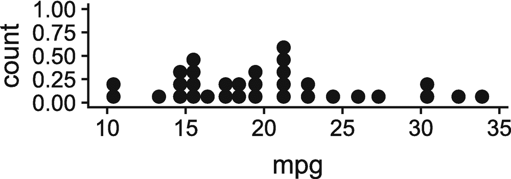

图 1-1

旧车每加仑英里数的堆积点图

```r
ggplot(mtcars, aes(mpg)) +
  geom_dotplot()

## 'stat_bindot()' using 'bins = 30'. Pick better value with 'binwidth'.

```

简单地说，`ggplot2`的大部分代码遵循以下代码片段所示的格式。在我们的例子中，我们想要一个点状图，所以几何对象，或“geom”，是一个点状图(`geom_dotplot()`)。有许多优秀的在线教程和书籍可以学习如何使用`ggplot2`包来制作图形，所以我们在这里不再对`ggplot2`做更多的介绍。特别是，开发`ggplot2`的 Hadley Wickham 最近更新了关于该包的书， *ggplot2:用于数据分析的优雅图形*【109】，这是一个极好的指南。对于那些喜欢更少的概念背景和更多的食谱的人，我们推荐温斯顿·张的 *R 图形食谱*。

```r
  ggplot(the-data, aes(variable-to-plot)) +
    geom_type-of-graph()

```

与绘制原始数据的点图不同，直方图是一个条形图，其中条形的高度是在条形宽度指定的范围内的值的计数。您可以改变条形的宽度，以控制在一个条形中聚合和计数的相邻值的数量。较窄的条形聚合了较少的数据点，提供了更精细的视图。较宽的条形聚集更多，并提供更宽的视图。图 [1-2](#Fig2) 显示了著名的 iris 数据集中花的萼片长度分布的直方图。

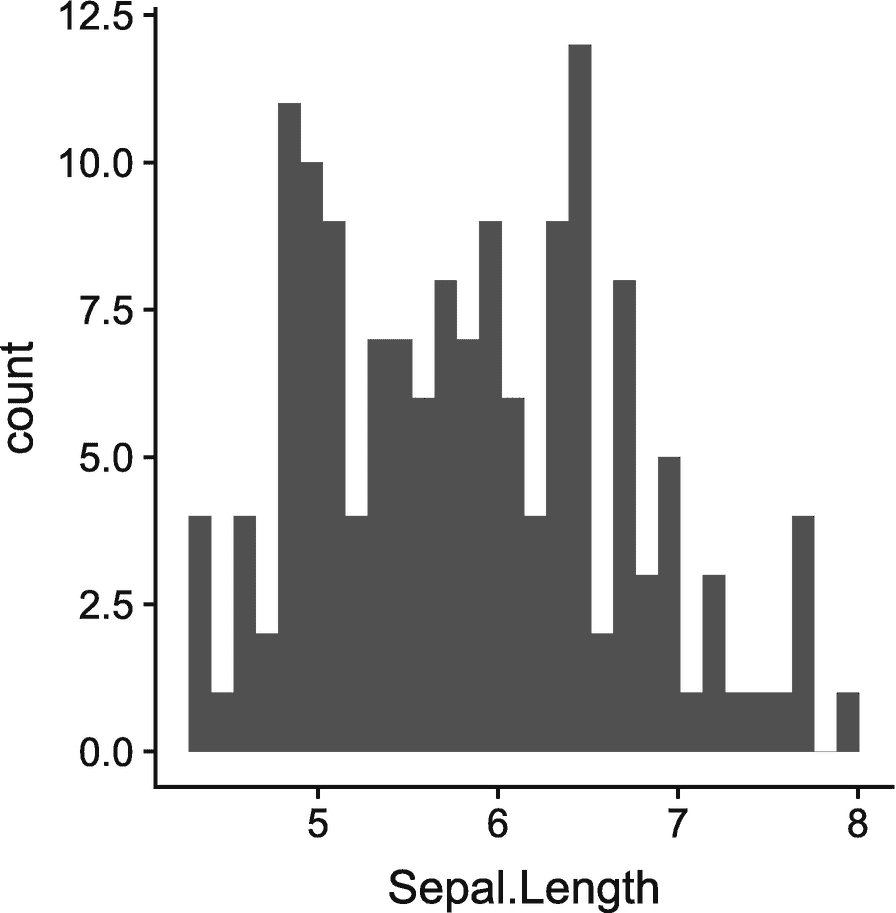

图 1-2

来自虹膜数据的萼片长度直方图

```r
ggplot(iris, aes(Sepal.Length)) +
  geom_histogram()

## 'stat_bin()' using 'bins = 30'. Pick better value with 'binwidth'.

```

如果您知道分布的形状(例如，正态分布)，您可以检查变量的直方图是否看起来像您认识的分布的形状。在萼片长度数据的情况下，它们看起来近似正态分布，尽管它们显然不是完美的。

如果数据看起来不符合我们希望的分布(如正态分布)，通常会对原始数据进行转换。同样，直方图是检查变换后分布情况的有用方法。图 1-3 显示了一年一度的加拿大猞猁捕获的直方图。从图中我们可以看到变量是正偏的(有一个长的右尾巴)。

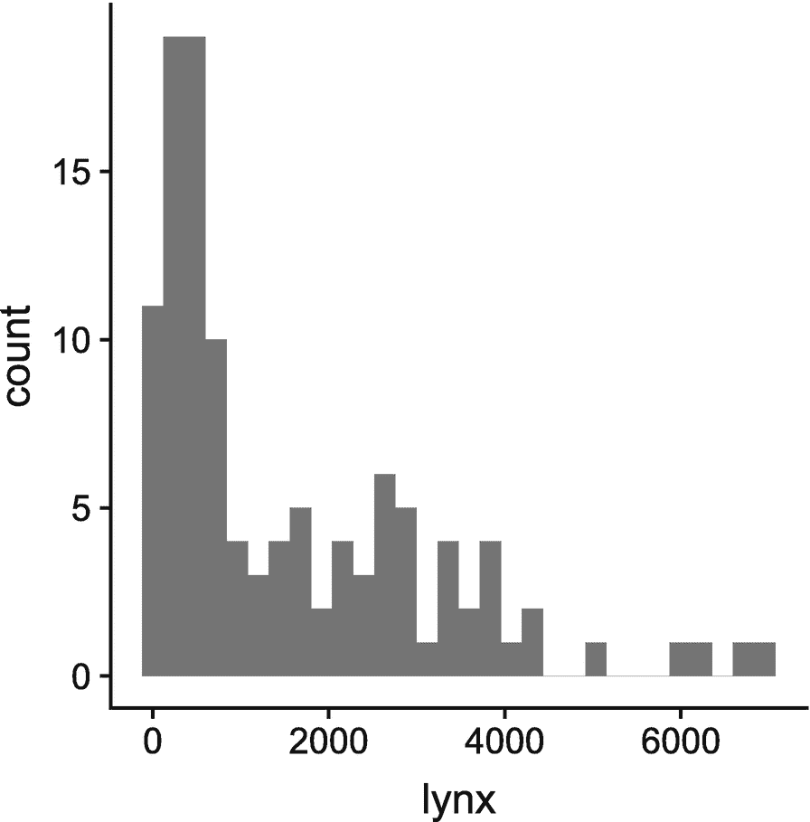

图 1-3

加拿大猞猁年度捕获直方图

```r
ggplot(data.table(lynx = as.vector(lynx)), aes(lynx)) +
  geom_histogram()

## 'stat_bin()' using 'bins = 30'. Pick better value with 'binwidth'.

```

对于正偏差，平方根或对数变换有助于减少正偏差，并使变量更接近正态分布(假设没有负值)。图 [1-4](#Fig4) 显示了自然对数变换后的猞猁诱捕直方图。

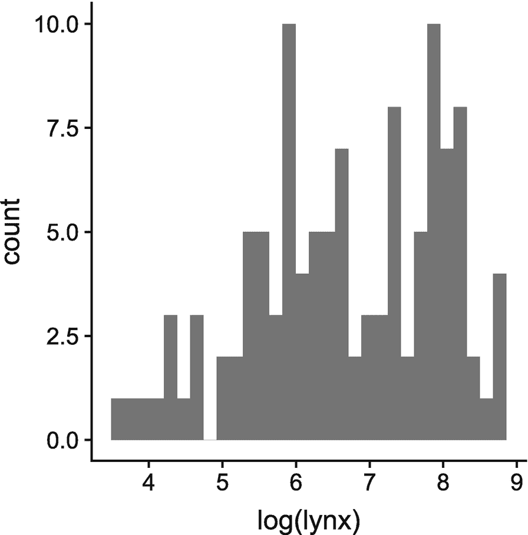

图 1-4

自然对数变换后的加拿大猞猁年度捕获直方图

```r
ggplot(data.table(lynx = as.vector(lynx)), aes(log(lynx))) +
  geom_histogram()

## 'stat_bin()' using 'bins = 30'. Pick better value with 'binwidth'.

```

### 密度图

将观察到的数据分布可视化的另一个常用工具是绘制经验密度图。除了用`geom_density()`代替`geom_histogram()`外，`ggplot2`的代码与直方图的代码相同。代码如下，结果如图 [1-5](#Fig5) 所示。

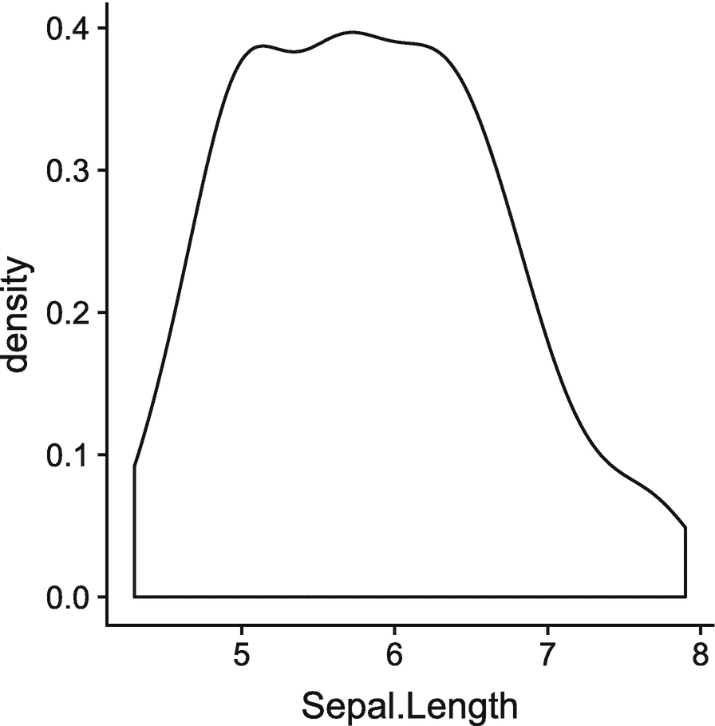

图 1-5

这是我们萼片长度的密度图

```r
ggplot(iris, aes(Sepal.Length)) +
  geom_density()

```

经验密度图包括一定程度的平滑，因为对于连续变量，在任何特定值都不会有很多观察值(例如，可能没有观察值为 3.286，即使有值 3.281 和 3.292)。经验密度图通过应用某种程度的平滑来显示分布的总体形状。有时，调整平滑度会有助于查看更粗糙(更接近原始数据)或更平滑(更接近“分布”)的图表。使用`adjust`参数在`ggplot2`中控制平滑。我们在图 [1-5](#Fig5) 中看到的默认值是`adjust = 1`。小于 1 的值“更嘈杂”或平滑度较低，而大于 1 的值会增加平滑度。我们比较和对比了图 [1-6](#Fig6) 中的噪声和图 [1-7](#Fig7) 中的非常平滑。

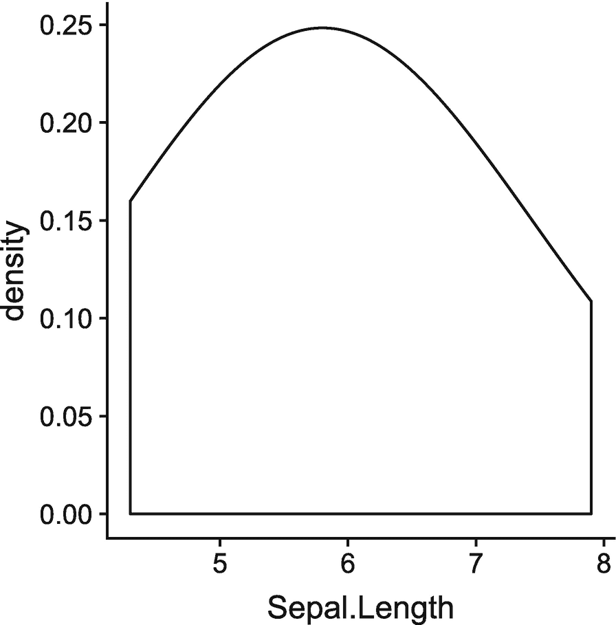

图 1-7

非常平滑的密度图

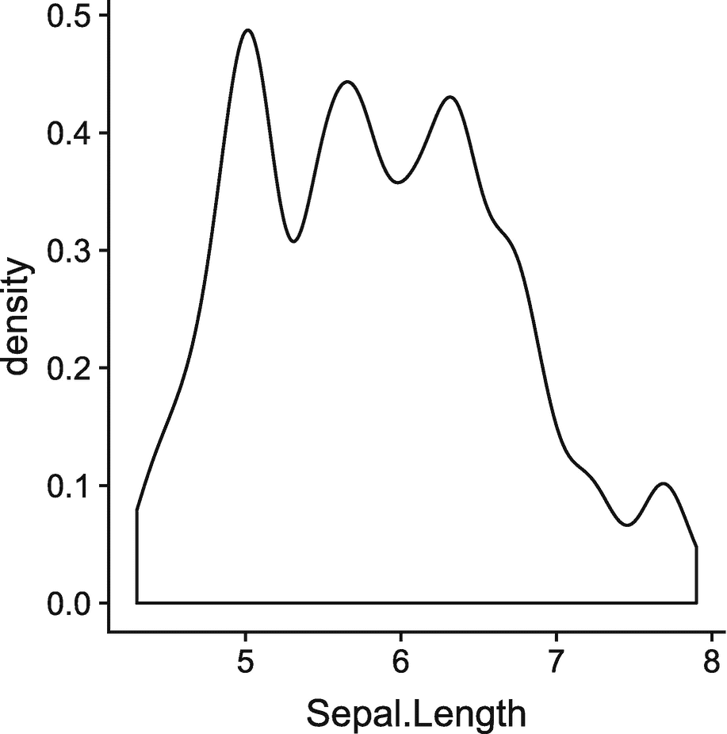

图 1-6

噪声密度图

```r
ggplot(iris, aes(Sepal.Length)) +
  geom_density(adjust = .5)

ggplot(iris, aes(Sepal.Length)) +
  geom_density(adjust = 5)

```

### 将观察分布与预期分布进行比较

虽然检查观察到的数据分布是有帮助的，但是我们经常检查分布，看它是否满足我们希望应用的统计分析的假设。例如，线性回归假设数据(有条件地)是正态分布的。如果经验分布非常不正态或更接近不同的分布，那么使用正态线性回归可能是不合适的。

### Q-Q 图

为了评估数据是否符合或接近特定的预期分布，我们可以使用分位数-分位数或 Q-Q 图。Q-Q 图绘制了观察到的数据分位数与来自预期分布(例如，正态分布、贝塔分布等)的理论分位数之间的关系。).Q-Q 图可以用来检查数据是否来自几乎任何分布。因为正态或高斯分布是最常见的，所以`ggplot2`中制作 Q-Q 图的默认函数默认为正态分布。在 Q-Q 图中，如果数据完全符合预期分布，那么这些点将落在一条直线上。以下代码创建了图 [1-8](#Fig8) 。

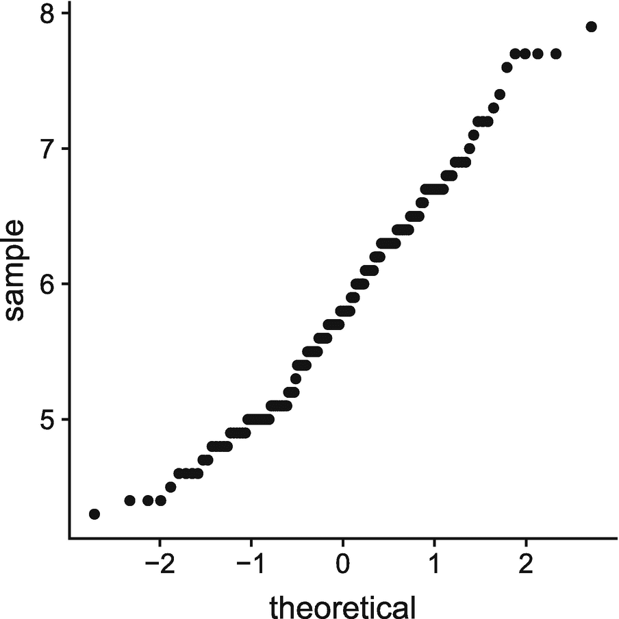

图 1-8

正常数据看起来像一条直线。萼片。长度似乎相当正常

```r
ggplot(iris, aes(sample = Sepal.Length)) +
  geom_qq()

```

为了更好地理解`geom_qq()`是如何工作的，我们可以自己做一个。`R`内置了许多概率分布的基本函数。这允许人们生成随机数(例如，`rnorm()`)，获得来自给定分布的观察值落在某个值之上或之下的概率(例如，`pnorm()`)，计算来自分布的分位数(例如，`qnorm()`)，以及获得特定值的分布密度(例如，`dnorm()`)。按照惯例，它们被命名为`r`、`p`、`q`、`d`，后面是发行版名称(或其缩写，如“norm”代表 normal)。应用这一知识，我们使用`qnorm()`获得以下分位数，其中均值= 0 且标准差为 1 的正态分布值的 10% (.10)将位于该分位数中:

```r
qnorm(p = .1, mean = 0, sd = 1)

## [1] -1.3

```

如何将此应用于具有不同均值或标准差的正态分布是很简单的。假设我们有三个数据点。如果它们是正态分布的，我们可能会期望中间点以 0.5 的概率落在正态分布上，而另外两个点大约一半落在 0 和 0.5 或 0.5 和 1 之间(即 0.25 和 0.75)。我们可以很容易地获得这些概率的正态分位数。

```r
qnorm(p = c(.25, .50, .75), mean = 0, sd = 1)

## [1] -0.67 0.00 0.67

```

为了帮助得出适当间隔的概率，我们可以使用`ppoints()`函数。

```r
ppoints(n = 3, a = 0)

## [1] 0.25 0.50 0.75

```

`ppoints()`默认为小调整，而不是完全间隔。对于十个或十个以下的数据点，`(1:N - 3/8)/(n + 1 - 2 * 3/8)`，对于十个以上的数据点，`(1:N - 1/2)/(n + 1 - 2 * 1/2)`。无论哪种方式，想法都是一样的。

```r
ppoints(n = 3)

## [1] 0.19 0.50 0.81

```

剩下的工作就是对我们的数据进行分类，并绘制出理论上的正态分位数。添加平均值和标准偏差在技术上是不必要的；它们是线性调整。无论哪种方式，这些点应该落在一条直线上，但使用它们会使理论分位数具有与我们的原始数据相同的均值和规模。

这里我们使用`ggplot2`中的`qplot()`函数来绘图。注意，`qplot()`中的`q`代表“快速”,因为它是使用用于更高级图形的`ggplot()`功能的较长规范的简写。所有这些都是说`q`与分位数无关。最后，为了帮助可视化，我们使用`geom_abline()`添加一条斜率为 1、截距为 0 的直线。该函数因一条直线的普通方程而得名，作为 *x* 的函数:

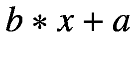

(1.1)

其中参数名为截距(a)和斜率(b)。我们在图 [1-9](#Fig9) 中显示了结果。

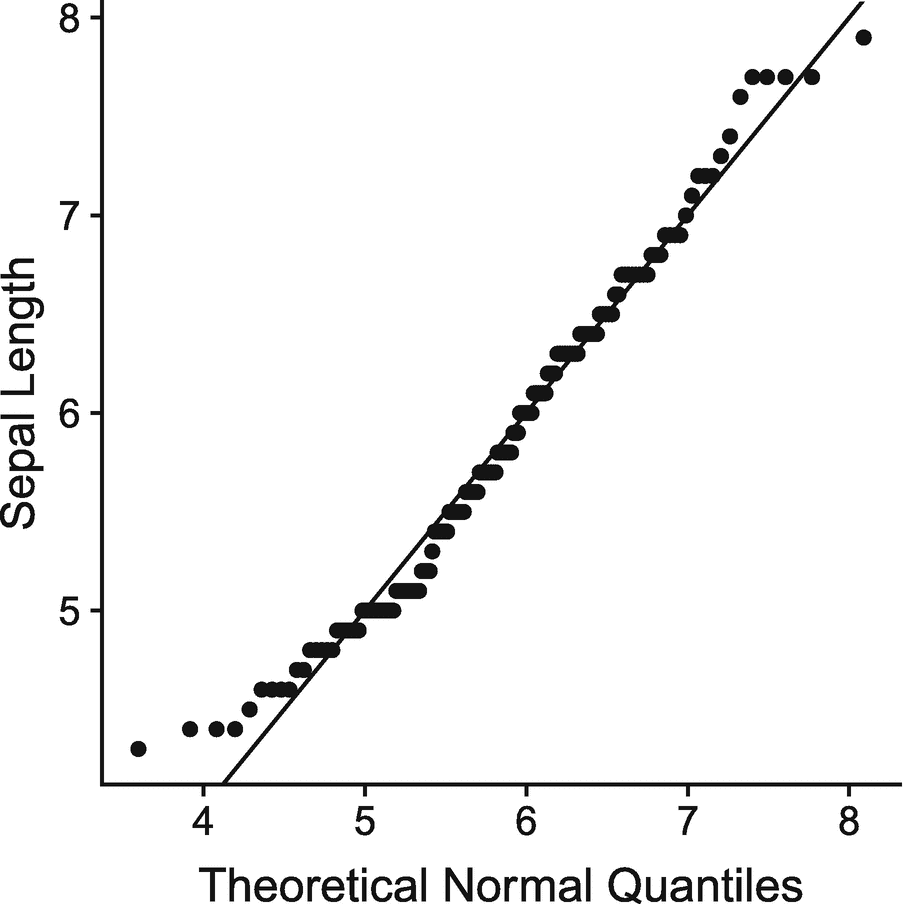

图 1-9

在 x 轴上显示理论标准(基于平均值和标准偏差的预测)

```r
qplot(
  x = qnorm(
    p = ppoints(length(iris$Sepal.Length)),
    mean = mean(iris$Sepal.Length),
    sd = sd(iris$Sepal.Length)),
  y = sort(iris$Sepal.Length),
  xlab = "Theoretical Normal Quantiles",
  ylab = "Sepal Length") +
  geom_abline(slope = 1, intercept = 0)

```

在这种情况下，我们可以看到数据呈合理的正态分布，因为所有点都非常接近法线，并且围绕该线大致对称。

虽然测试数据是否符合正态分布是常见的，但实际数据可能更接近许多其他分布。我们可以使用`geom_qq()`通过指定期望分布的分位数函数来绘制 Q-Q 图。例如，回到猞猁诱捕数据，图 [1-10](#Fig10) 用对数正态分布(`qlnorm()`)评估原始猞猁数据的拟合度。

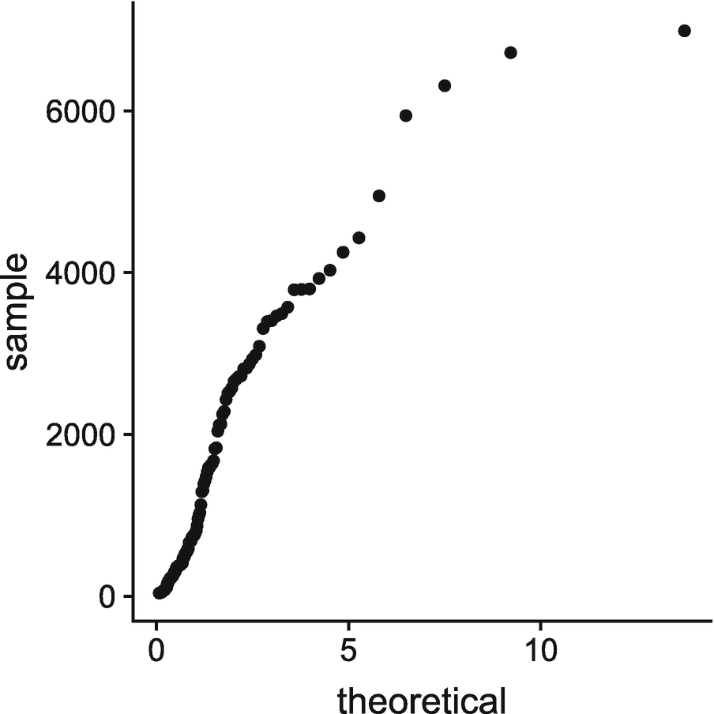

图 1-10

测试 lynx 数据是否符合对数正态分布

当使用不常用的分布时，有时`ggplot2`不知道默认情况下如何选择分布的参数。如果需要，我们可以将预期分布的参数作为命名列表传递给`dparams`参数。以下示例测试 lynx 数据是否符合图 [1-11](#Fig11) 中的泊松分布。

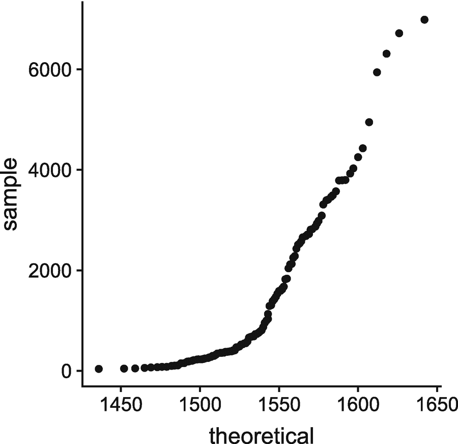

图 1-11

测试 lynx 数据是否符合泊松分布

```r
ggplot(data.table(lynx = as.vector(lynx)), aes(sample = lynx)) +
  geom_qq(distribution = qlnorm)

ggplot(data.table(lynx = as.vector(lynx)), aes(sample = lynx)) +
  geom_qq(distribution = qpois, dparams = list(lambda = mean(lynx)))

```

### 密度图

检验观察分布是否与预期分布一致的另一种方法是绘制经验密度与预期分布密度的对比图。为此，我们可以使用`geom_density()`来绘制经验密度，然后使用`stat_function()`函数，这是绘制任何函数的通用方法。如果我们绘制函数`dnorm()`，它将绘制一个正常密度。我们只需要指定正态分布的均值和标准差应该基于我们的数据。结果如图 [1-12](#Fig12) 所示。同样，数据似乎接近正态分布，尽管并不完美。

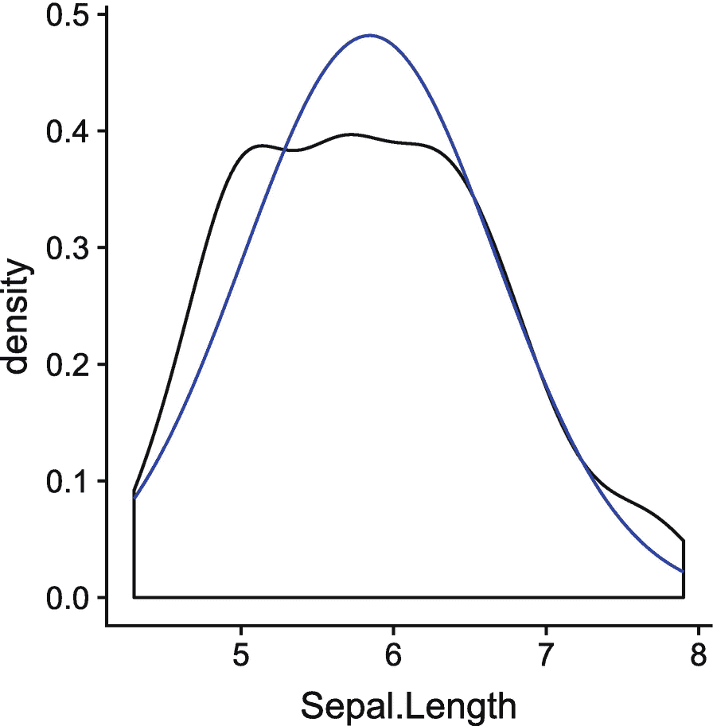

图 1-12

正常曲线和我们的密度图(默认平滑度为 1)

```r
ggplot(iris, aes(Sepal.Length)) +
  geom_density() +
  stat_function(fun = dnorm,
                args = list(
                  mean = mean(iris$Sepal.Length),
                  sd = sd(iris$Sepal.Length)),
                colour = "blue")

```

虽然绘制经验密度和预期密度不会提供 Q-Q 图未捕捉到的任何信息，但更直观的方法是“看到”彼此上下的分布，而不是看到彼此相对绘制的两个分布。

### 拟合更多分布

通过 Q-Q 图或观察到的和预期的密度图，我们可以评估许多不同的分布。然而，对于正态分布之外的分布，通常需要指定它们的参数，以获得分位数或密度。可以手动计算参数，并将其传递给适当的分位数或密度函数，但是使用`MASS`包中的`fitdistr()`函数，我们可以拟合许多分布，并让 R 通过指定分布的名称来估计参数。目前，`fitdistr()`支持以下发行版:

*   贝塔

*   柯西

*   卡方检验

*   指数的

*   F

*   微克

*   几何学的

*   对数正态

*   符号逻辑的

*   负二项式

*   标准

*   泊松

*   t

*   （统计学家）威伯尔（或韦布尔）

尽管这远不是统计分布的详尽列表，但对于几乎所有使用的统计数据来说，这已经足够了，并且涵盖了本书讨论的统计分析中使用的所有分布。

为了了解如何使用`fitdistr()`，我们从 beta 发行版中虚构了一些随机数据。贝塔分布对比例很有用，因为贝塔分布以 0 和 1 为界。我们使用`set.seed()`使我们的例子可重复。

```r
set.seed(1234)
y <- rbeta(150, 1, 4)
head(y)

## [1] 0.138 0.039 0.111 0.099 0.377 0.384

```

`fitdistr()`函数将数据、表示分布名称的单变量字符串和分布参数的初始值作为一个列表。

```r
y.fit <- fitdistr(y, densfun = "beta",
                  start = list(shape1 = .5, shape2 = .5))

```

从`fitdistr()`我们可以得到分布的估计参数。我们明确地提取它们。

```r
y.fit

##   shape1    shape2
##   1.08      4.28
##  (0.11)    (0.52)

y.fit$estimate["shape1"]

## shape1
##    1.1

y.fit$estimate["shape2"]

## shape2
##    4.3

```

我们还可以提取对数似然性(通常缩写为 LL ),它告诉我们数据有多大可能来自具有这些参数的分布。可能性越高，表示测试的分布和数据之间的匹配越接近。需要注意的是，除了对数似然或 LL 之外，通常还会报告–2 **LL*，通常简称为 2LL。最后，更复杂的模型通常(尽管不总是)至少能稍微更好地拟合数据。为了说明这一点，您可以评估用于给定可能性的自由度。`logLik()`函数提取对数似然和自由度。

```r
logLik(y.fit)

## 'log˽Lik.' 95 (df=2)

```

虽然可能性值不容易单独解释，但它们对于比较非常有用。如果我们拟合两个分布，提供较高(对数)可能性的分布更适合数据。我们可以再次使用`fitdistr()`来拟合正态分布，然后将 beta 分布的 LL 与正态分布的 LL 进行比较。

```r
y.fit2 <- fitdistr(y, densfun = "normal")
logLik(y.fit2)

## 'log˽Lik.' 67 (df=2)

```

在自由度相同的情况下，β(LL = 95.4)的 LL 高于正态分布(LL = 67.3)。这些结果表明我们应该为这些数据选择 beta 分布。

`JWileymisc`包提供了一种自动拟合多种分布的方法，并通过`testdistr()`功能自动查看密度或 Q-Q 图。对于正态分布，只需要很少的`R`代码就可以完成，结果如图 [1-13](#Fig13) 所示。

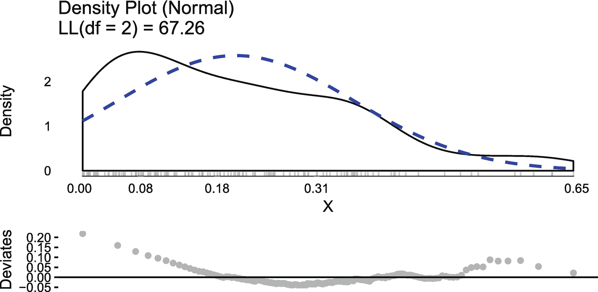

图 1-13

叠加正态分布的密度图和正态 Q-Q 图

```r
testdistr(y)

```

为了比较正态分布和贝塔分布的拟合程度，我们可以拟合两者，并使用`cowplot`包中的`plot_grid()`函数将两个图形绘制成一个图形面板。图 [1-14](#Fig14) 中的结果显示了数据与贝塔分布的良好一致性(尽管这并不奇怪，因为我们是从贝塔分布中产生的数据！)以及与正常人的不匹配。请注意，来自密度函数的警告消息很常见，在这种情况下不必担心。

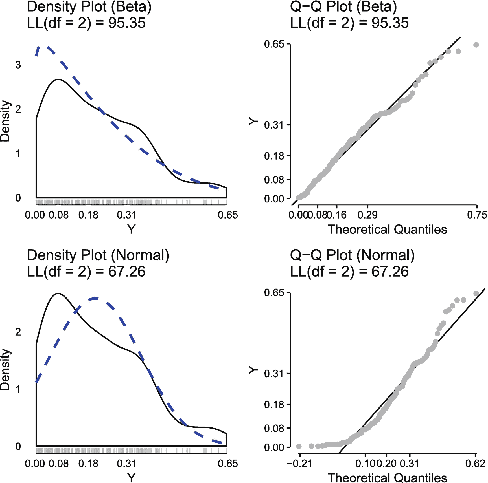

图 1-14

显示了叠加 beta 或正态分布的密度图以及 Q-Q 图拟合

```r
test.beta <- testdistr(y, "beta",
                       starts = list(shape1 = .5, shape2 = .5),
                       varlab = "Y", plot = FALSE)

## Warning in densfun(x, parm[1], parm[2], ...): NaNs produced
## Warning in densfun(x, parm[1], parm[2], ...): NaNs produced
## Warning in densfun(x, parm[1], parm[2], ...): NaNs produced
## Warning in densfun(x, parm[1], parm[2], ...): NaNs produced

test.normal <- testdistr(y, "normal", varlab = "Y", plot = FALSE)

plot_grid(
    test.beta$DensityPlot, test.beta$QQPlot,
    test.normal$DensityPlot, test.normal$QQPlot,
    ncol = 2)

```

对于离散分布，如计数，`testdistr()`绘制了一种略有不同的图，旨在更好地显示观察到的比例与理论分布的概率质量函数。具体来说，密度值是观察到的比例，然后是给定分布中每个值的预期概率。

举例来说，首先我们模拟负二项分布的一些数据，然后在图 [1-15](#Fig15) 中绘制假设泊松分布的结果，在图 [1-16](#Fig16) 中绘制假设负二项分布的结果。这种比较显示，就对数似然性和与期望值的偏差而言，负二项式比泊松更适合数据。

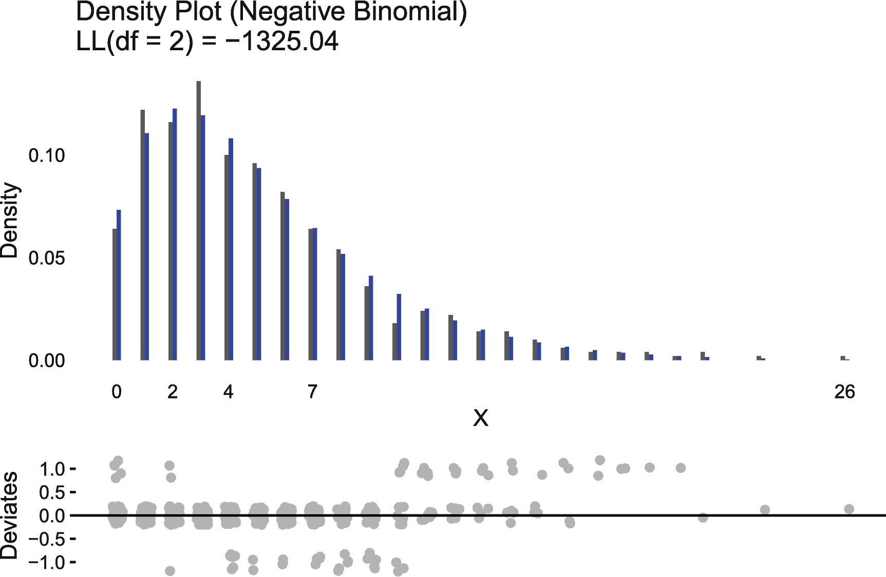

图 1-16

观察到的离散比例，负二项分布的理论概率用蓝色标出

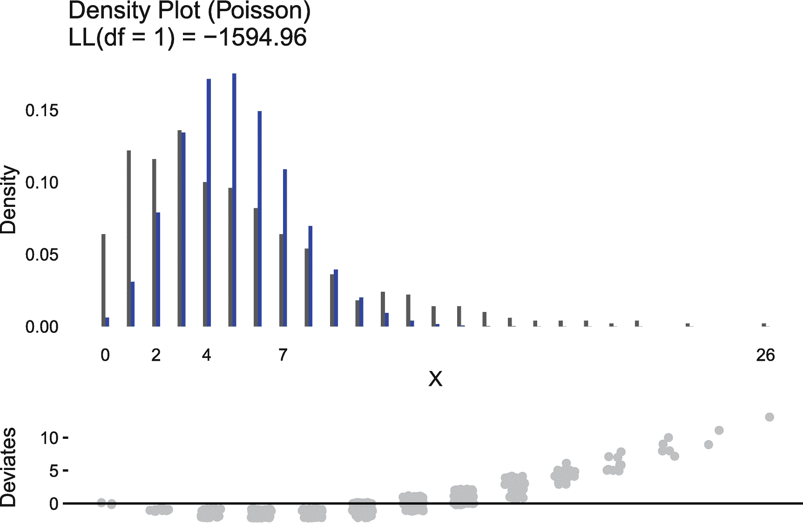

图 1-15

观察到的离散比例和泊松分布的理论概率用蓝色标出

```r
set.seed(1234)
y <- rnbinom(500, mu = 5, size = 2)
testdistr(y, "poisson")

testdistr(y, "nbinom")

```

## 1.2 异常值

异常值是不同于其他值的值，或者在某些方面不标准或不典型。异常值通常也称为异常值或极值。很难精确定义什么是异常值，但通常它们是以某种方式与大多数人不一致的数据点，通常是以一种相对极端的方式。

对于来自正态分布的数据，异常值的常见阈值是 z 分数为 3 之外的任何值。这些阈值基于假设正态分布的概率。具体来说，如果数据呈正态分布，大约 0.10%的数据将低于 z 值 3，大约 0.10%的数据将高于 z 值+3。使用`pnorm()`函数，确切的概率如下。

```r
pnorm(c(-3, 3))

## [1] 0.0013 0.9987

```

因为这些阈值基于正态分布，所以它们不一定有意义地应用于非正态分布的数据。虽然许多统计分析，如线性回归，假设结果是(有条件的)正态分布，很少关于预测的分布假设。然而，预测变量的异常值，特别是当它们处于极端时，会强烈影响结果。

视觉识别异常值通常比使用定量标准定义它们更容易。例如，图 [1-17](#Fig17) 显示了两个图表。两个图都有三个相对异常的点，值为 5。然而，这些点在画面 A 中可能显得更不合适，在画面 A 中，所有其他数据点形成或多或少连续的组，并且与异常点之间存在相对较大的间隙。即使图 B 中的异常点也有间隙，因为数据点中还有其他间隙，但有几个数据点与其他数据点分离并不奇怪——分离似乎是图 B 中的一种模式，而图 a 中没有。

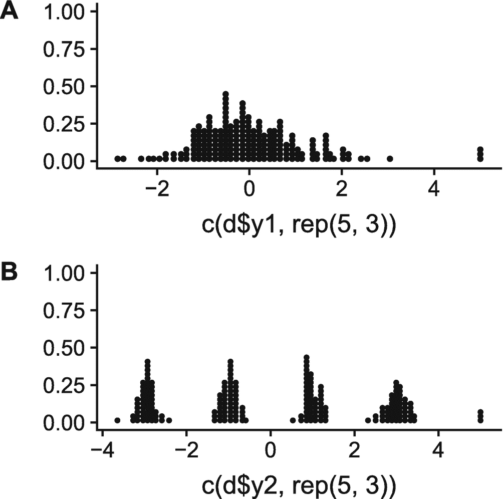

图 1-17

显示带有异常值的堆积点图的面板图

```r
set.seed(1234)
d <- data.table(
  y1 = rnorm(200, 0, 1),
  y2 = rnorm(200, 0, .2) + rep(c(-3, -1, 1, 3), each = 50))

plot_grid(
  qplot(c(d$y1, rep(5, 3)), geom = "dotplot", binwidth = .1),
  qplot(c(d$y2, rep(5, 3)), geom = "dotplot", binwidth = .1),
  ncol = 1, labels = c("A", "B"))

```

根据分布的形状，定义异常值也很困难。图 [1-18](#Fig18) 显示了两种分布。图 A 是伽马分布，显示了伽马分布的特征性长右尾。即使只有少数几个是相当极端的，数据中也没有明显的“间断”,这是一种典型的连续、长右尾分布类型。此外，从数据中很容易看出，有一种减少频率但相当极端的正值的模式。相反，面板 B 中的正态分布更加对称，没有证据表明存在如此长的尾巴。添加到 B 图中的一两个极端正值可能确实看起来“不正常”

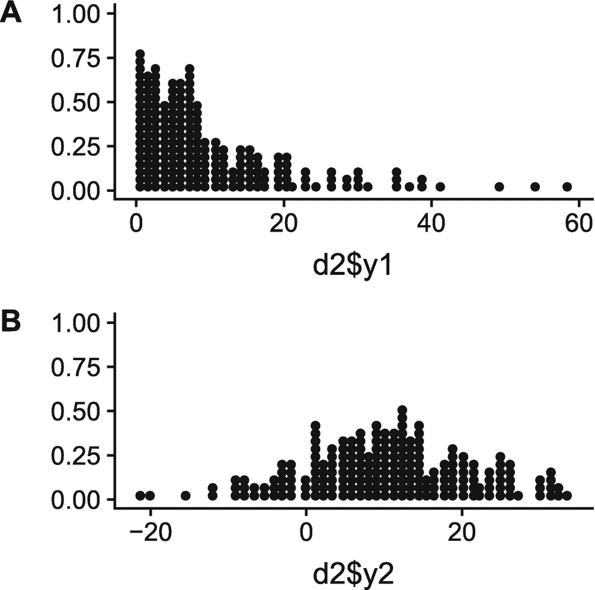

图 1-18

面板图显示从伽玛和正态分布中随机生成的(没有添加异常值)数据

```r
set.seed(1234)
d2 <- data.table(
  y1 = rgamma(200, 1, .1),
  y2 = rnorm(200, 10, 10))

plot_grid(
  qplot(d2$y1, geom = "dotplot", binwidth = 1),
  qplot(d2$y2, geom = "dotplot", binwidth = 1),
  ncol = 1, labels = c("A", "B"))

```

这些不同的例子突出了准确定义什么是或不是异常值的困难。虽然我们不能提供任何单一的规则来遵循，但是有一些额外的工具内置在`testdistr()`函数中来帮助做出这些判断。`extremevalues`参数可用于指定是否应突出显示低于或高于指定分布的经验数据或理论百分点的值。图 [1-19](#Fig19) 显示了一个示例，根据经验位置突出显示了最低的 1%和最高的 1%的点。地毯中的密度图(密度曲线下方的线条)通过将它们涂成纯黑色来突出显示。在 Q-Q 图中，极值点也是实心黑色，而不是灰色。如果没有点被涂成纯黑色，这将表明没有点落在第 1 个和第 99 个经验百分位数之外。当使用经验值时，除非有大型数据集可用，否则仔细检查顶部和底部 1%这样的值可能是合理的。然而，在可能的情况下，通常需要一个比顶部和底部 1%更极端的阈值，例如顶部和底部 0.10%，以确保这些值确实不太可能仅由于偶然因素而出现。

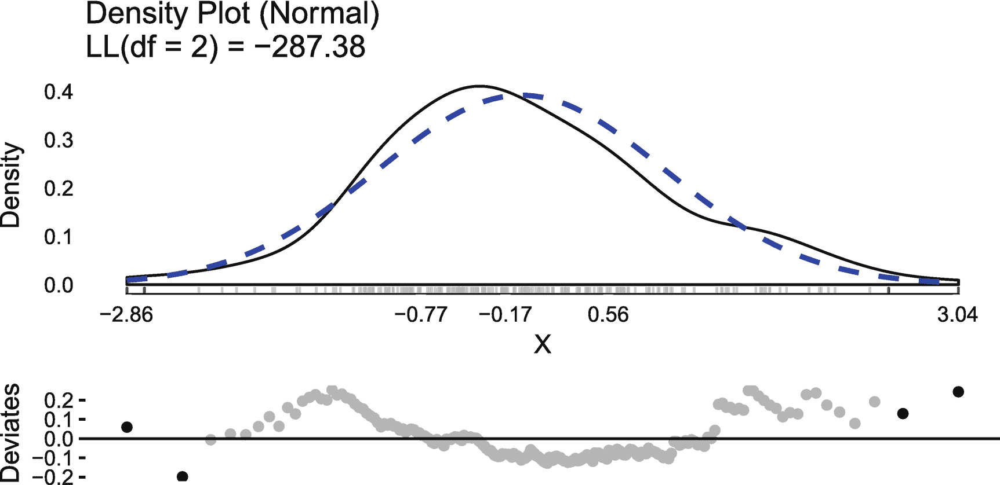

图 1-19

显示突出显示极值的图表

```r
testdistr(d$y1, extremevalues = "empirical",
          ev.perc = .01)

```

除了根据经验定义极值之外，还可以根据特定的理论分布来定义极值。也就是说，我们可以查看是否有任何值超出了正态分布的底部或顶部 0.10%(图 [1-20](#Fig20) )，或者对于相同的数据，是否有任何点是基于伽马分布的百分位数的极值(图 [1-21](#Fig21) )。这些图表显示，对于相同的数据，如果我们预期数据遵循正态分布，则一些点可能被视为异常或异常值，但是如果我们预期数据遵循伽玛分布，则这些点可能不是异常的。在实践中，作为数据分析师，我们必须判断任何数据值在多大程度上极端或明显异常，以及如何最终对其进行分析。

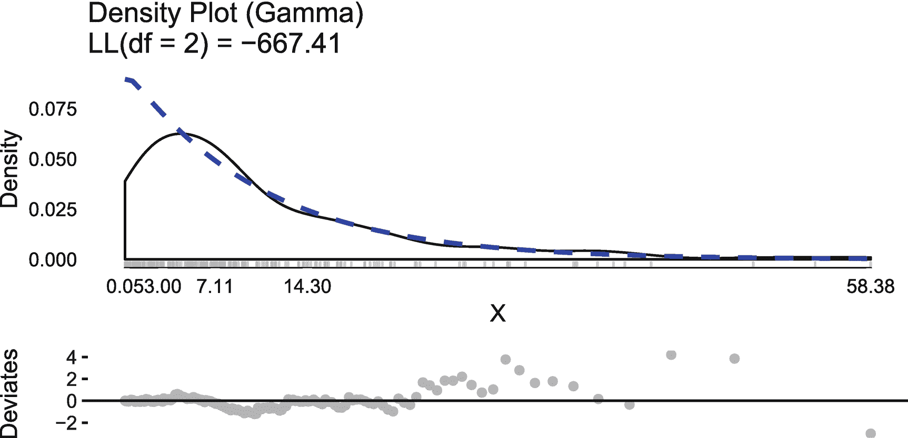

图 1-21

基于伽马分布的理论百分位数突出显示极值的图表

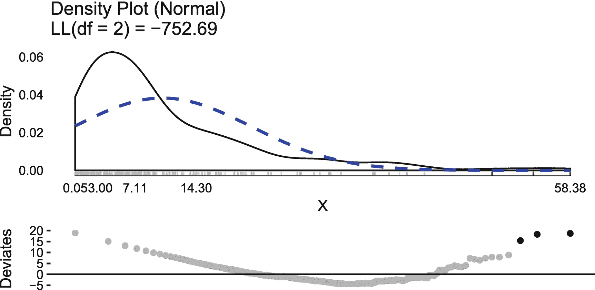

图 1-20

基于正态分布的理论百分位数突出显示极值的图表

```r
testdistr(d2$y1, "normal", extremevalues = "theoretical",
          ev.perc = .001)

testdistr(d2$y1, "gamma", extremevalues = "theoretical",
          ev.perc = .001)

```

可能有几个异常值。然而，当使用理论分布时，如果一个异常值比另一个异常值更极端，则不太极端的值可能会被“掩盖”,因为参数估计会受到更极端的值的影响。图 [1-22](#Fig22) 显示了一个例子，其中有两个异常值:100 和 1000。值 100 被值 1，000 所掩盖，因为理论正态分布的均值和方差被值 1，000 拉高了很多，以至于值 100 不再是异常的。

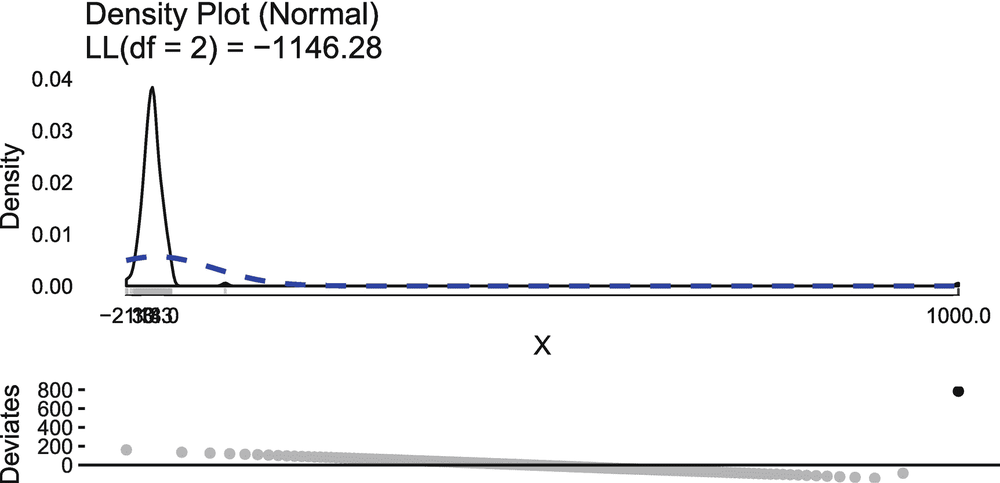

图 1-22

图表显示异常值 100 被更极端的异常值 1000 所掩盖

```r
testdistr(c(d2$y2, 100, 1000), "normal",
          extremevalues = "theoretical",
          ev.perc = .001)

```

如果有多个异常值，可以使用迭代过程，处理最极端的值，然后重新检查，直到不再有异常值出现。然而，通过使用稳健的方法，可以在一定程度上简化该过程。当均值和(共)方差是感兴趣的参数时，一种这样的稳健方法是最小协方差行列式(MCD)估计器。简而言之，MCD 估计器找到原始病例的子集，该子集具有其样本协方差矩阵的最低行列式[82]。在单变量情况下，这相当于具有较低方差的原始数据情况的子集。`testdistr()`函数有一个可选的`robust`参数，可用于正态分布。当`robust = TRUE`时，`testdistr()`使用`robustbase`包【59】中的`covMcd()`函数，该函数使用【83】提出的快速算法来计算(近似)MCD。使用稳健估计器的结果如图 [1-23](#Fig23) 所示。使用稳健估计器，甚至在去除更极端的异常值之前，两个异常值都被识别。

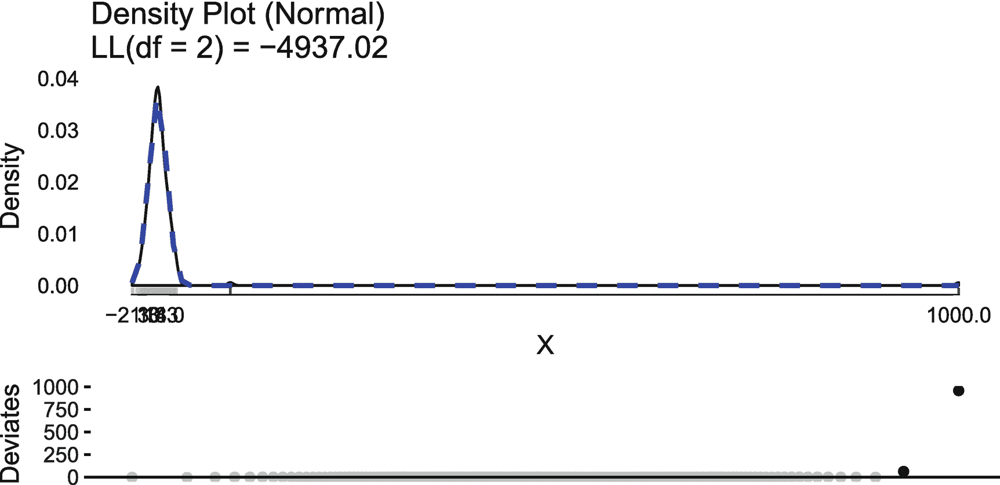

图 1-23

基于稳健估计的突出显示极值的图形

```r
testdistr(c(d2$y2, 100, 1000), "normal",
          robust = TRUE,
          extremevalues = "theoretical",
          ev.perc = .001)

```

最后，如果发现异常值，有几种方法可以解决它们。如果可能的话，最好先检查这些值是否准确。异常值通常是由于编码或数据输入错误引起的。如果不存在错误或者无法检查，最简单的选择是排除具有异常值的情况。当异常值的事例很少，并且在排除这些异常值后，大型数据集仍有许多事例时，排除或移除这些事例可能特别有效。在每个案例都很重要的较小数据集中，排除异常值可能会导致太多数据丢失。这也可能发生在更大的数据集中，其中更多的情况是异常的。

排除病例的另一种方法是 winsorizing，以查尔斯·温索尔命名。Winsorizing 采用异常值并用最接近的非异常值替换它们[92，第 14-20 页]。自动完成这一任务的一种方法是计算所需的经验分位数，并将这些值之外的任何值设置为计算的百分位数。即使异常值只存在于分布的一个尾部，这个过程也同样适用于较低和较高的尾部。调整两个尾部有助于确保程序本身不会使分布位置变得更低或更高。Winsorizing 很容易在`R`中使用`JWileymisc`包中的`winsorizor()`函数来完成。唯一需要的参数是每个尾部 winsorize 的比例。`winsorizor()`函数的另一个特性是，除了返回 winsorized 变量之外，它还添加了注意用于 winsorizing 的阈值和百分点的属性。

```r
winsorizor(1:10, .1)

##  [1] 1.9 2.0 3.0 4.0 5.0 6.0 7.0 8.0 9.0 9.1
## attr(,"winsorizedValues")
##   low high percentile
## 1 1.9  9.1        0.1

```

图 [1-24](#Fig24) 比较了我们之前看到的伽马分布变量(在图 A 中)和之后(在图 B 中)的上下 1%。图 B 显示了 winsorizing 的特征“变平”,原始值现在只有 49.2，而不是 58.4。

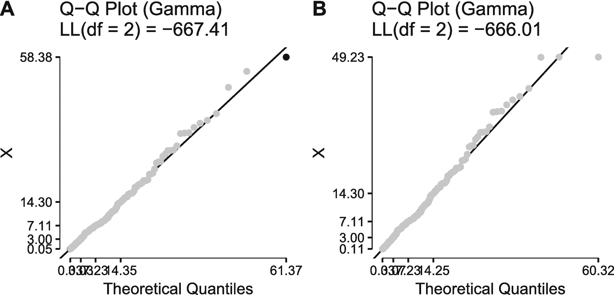

图 1-24

面板图比较了(A)和(B)将(经验)底部和顶部的 1%进行 winsorizing 之前和之后的数据

```r
plot_grid(
  testdistr(d2$y1, "gamma", extremevalues = "theoretical",
            ev.perc = .005, plot=FALSE)$QQPlot,
  testdistr(winsorizor(d2$y1, .01), "gamma", extremevalues = "theoretical",
            ev.perc = .005, plot=FALSE)$QQPlot,
  ncol = 2, labels = c("A", "B"), align = "hv")

```

## 1.3 摘要

在这一章中，我们学习了使用`R`可视化原始或混合格式数据的各种方法。此外，除了图形探索性数据分析，我们还学习了一些方法来量化我们的数据与各种分布的拟合。关于本章使用的关键功能的总结，请参见表 [1-1](#Tab1) 。

表 1-1

本章中描述的关键功能列表及其功能摘要

<colgroup><col class="tcol1 align-left"> <col class="tcol2 align-left"></colgroup> 
| 

功能

 | 

它的作用

 |
| --- | --- |
| `ggplot()` | 使用 ggplot2 包创建新地块 |
| `qplot()` | 具有更简单(和更少细微差别)语法的“快速”绘图 |
| `geom_dotplot()` | 创建点状图几何对象-显示所有原始数据 |
| `geom_histogram()` | 创建直方图几何对象 |
| `geom_density()` | 创建密度分布，本质上是平滑的直方图 |
| `geom_qq()` | Q-Q 图将观察到的数据分位数与理论分位数进行对比 |
| `testdistr()` | 自动查看密度或 Q-Q 图 |
| `winsorizor()` | 用最接近的非异常值替换异常值 |
| `plot_grid()` | 将多个图放入定义的网格中 |
| `stat_function()` | 在当前图形的顶部绘制一个函数 |
| `fitdistr()` | 获取数据、分布和分布的参数 |
| `logLik()` | LL 是数据来自 fitdistr()的可能性，越大越好 |