# 二、多元数据可视化

前一章介绍了单变量数据可视化的方法。这一章延续了那个主题，但是从可视化单个变量转移到一次可视化多个变量。除了像前一章一样检查分布和异常值，我们还将讲述如何可视化变量之间的关系。可视化变量之间的关系尤其有助于更传统的统计模型，其中数据分析师必须指定函数形式(例如，线性、二次等)。).在后面的章节中，我们还将介绍机器学习模型，它采用算法来学习数据中的函数形式，而不需要分析师指定它。

```r
library(checkpoint)
checkpoint("2018-09-28", R.version = "3.5.1",
  project = book_directory,
  checkpointLocation = checkpoint_directory,
  scanForPackages = FALSE,
  scan.rnw.with.knitr = TRUE, use.knitr = TRUE)

library(knitr)
library(ggplot2)
library(cowplot)
library(MASS)
library(mvtnorm)
library(mgcv)
library(quantreg)
library(JWileymisc)
library(data.table)

options(width = 70, digits = 2)

```

## 2.1 分销

尽管评估单变量分布相对容易，但多变量分布更具挑战性。多个个体变量的联合分布由它们的个体分布组成。因此，除了所有可能的单变量分布，单变量分布的不同组合被组合以形成正在研究的联合分布。从可视化的角度来看，也很难在通常用于绘制数据的两个维度中可视化多个维度的数据。

在本书中，我们将涉及的唯一多元分布是多元正态(MVN)分布。在实践中，这不是过分的限制，因为大多数分析一次只关注一个结果，并且只需要知道结果的分布。因子分析和结构方程模型是两种同时模拟多种结果的常见分析类型，通常假设数据是多元正态的。如果一个人可以评估数据是否是多元正态的，我们的经验涵盖了大多数做出多元分布假设的分析。

正态分布由两个参数决定，均值 *μ* 和标准差 *σ* ，分别控制分布的位置和规模。 *p* 维的多元正态分布由两个矩阵控制，一个是均值的 *px* 1 矩阵 *μ* ，另一个是 *pxp* 协方差矩阵σ。

在二元情况下，其中 *p* = 2，绘制多元分布图是简单的。我们使用`mvtnorm()`包中的`rmvnorm()`函数来模拟一些多元正态数据。然后可以使用`geom_density2d()`函数和`ggplot2`绘制经验密度，如图 [2-1](#Fig1) 所示。

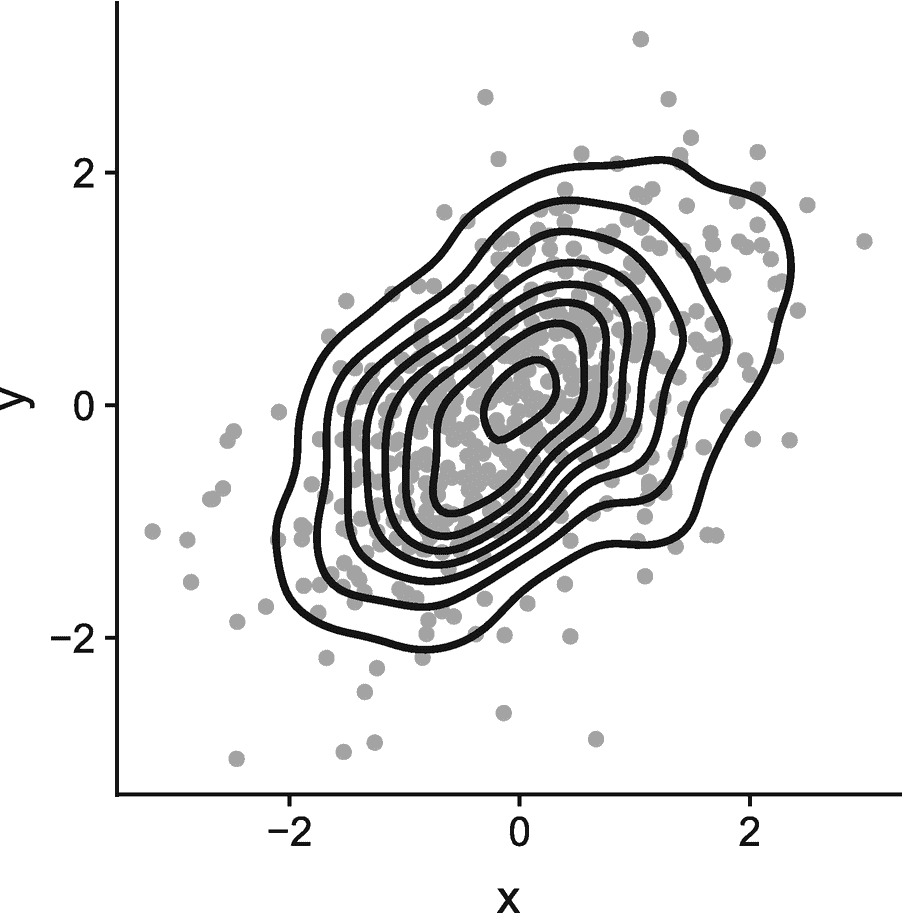

图 2-1

多元正态数据的 2D 经验密度图

```r
mu <- c(0, 0)
sigma <- matrix(c(1, .5, .5, 1), 2)

set.seed(1234)
d <- as.data.table(rmvnorm(500, mean = mu, sigma = sigma))
setnames(d, names(d), c("x", "y"))

ggplot(d, aes(x, y)) +
  geom_point(colour = "grey60") +
  geom_density2d(size = 1, colour = "black") +
  theme_cowplot()

```

检查经验密度是有帮助的，但是不能将它们与多元正态分布下的预期进行精确的比较。为了将获得的经验密度与多元正态分布的预期密度进行对比，我们基于数据范围生成了成对的 *x* 和 *y* 值的网格，然后使用`dmvnorm()`函数计算每个 *x，y* 对的密度。多元正态分布的参数 *μ* 和σ由观测数据计算得出。结果如图 [2-2](#Fig2) 所示，为了清晰起见，这次删除了原始数据点。

```r
testd <- as.data.table(expand.grid(
  x = seq(from = min(d$x), to = max(d$x), length.out = 50),
  y = seq(from = min(d$y), to = max(d$y), length.out = 50)))
testd[, Density := dmvnorm(cbind(x, y), mean = colMeans(d), sigma = cov(d))]

ggplot(d, aes(x, y)) +
  geom_contour(aes(x, y, z = Density), data = testd,
               colour = "blue", size = 1, linetype = 2) +
  geom_density2d(size = 1, colour = "black") +
  theme_cowplot()

```

在图 [2-2](#Fig2) 中，经验密度和正态密度非常接近，我们可以得出结论，假设数据是多元正态是合理的。接下来，我们模拟两个非多元正态的正态分布变量。图 [2-3](#Fig3) 显示了每个变量的单变量密度图，表明它们呈正态分布。

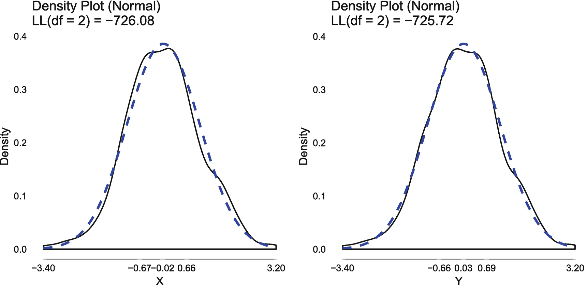

图 2-3

显示模拟变量为单变量正态的单变量密度图

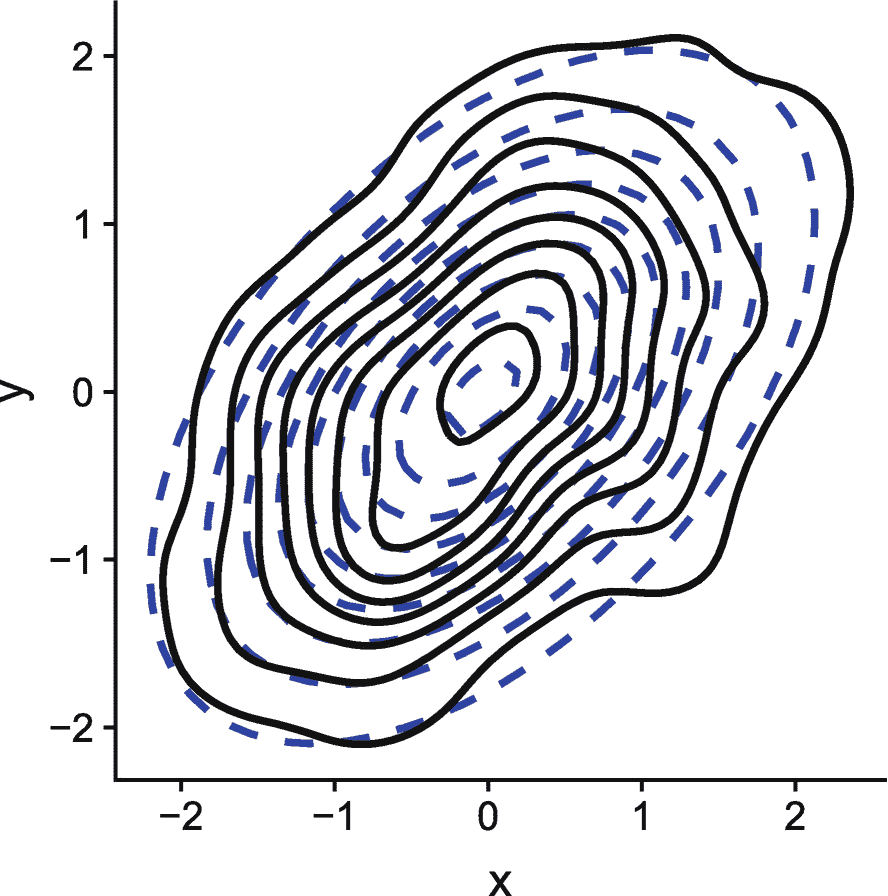

图 2-2

2D 经验密度与多元正态密度图

```r
set.seed(1234)
d2 <- data.table(x = rnorm(500))
d2[, y := ifelse(abs(x) > 1, x, -x)]

plot_grid(
  testdistr(d2$x, plot = FALSE)$Density,
  testdistr(d2$y, plot = FALSE, varlab = "Y")$Density,
  ncol = 2)

```

尽管变量是单个正态的，但这并不保证它们是多元正态的。这是一个关键点，并强调了评估多元分布的重要性，如果使用一种分析技术，对多元分布作出假设(例如，验证性因素分析)。使用我们之前使用的相同代码，我们绘制了图 [2-4](#Fig4) 中的经验和多元正态密度。

```r
testd2 <- as.data.table(expand.grid(
  x = seq(from = min(d2$x), to = max(d2$x), length.out = 50),
  y = seq(from = min(d2$y), to = max(d2$y), length.out = 50)))
testd2[, Density := dmvnorm(cbind(x, y), mean = colMeans(d2), sigma = cov(d2))]

ggplot(d2, aes(x, y)) +
  geom_contour(aes(x, y, z = Density), data = testd2,
               colour = "blue", size = 1, linetype = 2) +
  geom_density2d(size = 1, colour = "black") +
  theme_cowplot()

```

图 [2-4](#Fig4) 清楚地显示了这两个变量不是多元正态的。尽管这是一个极端的例子，但它强调了单变量评估可能会产生多大的误导。

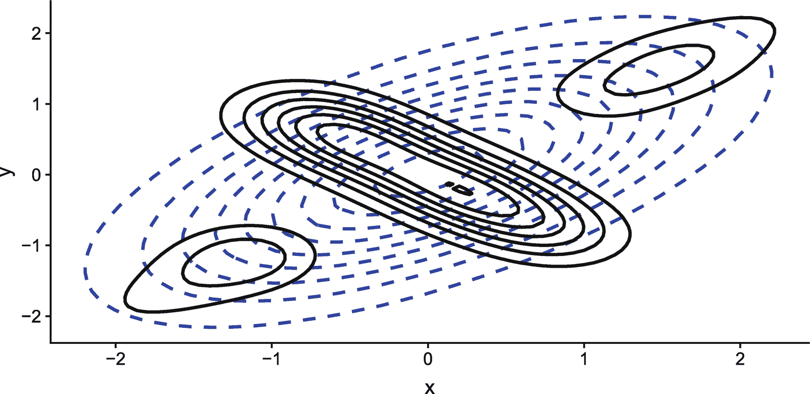

图 2-4

显示非多元正态数据的 2D 密度图

当 *p* > 2 时，直接可视化一个多元正态分布是困难的。相反，我们可以利用 Mahalanobis [60]的工作，他开发了一种方法来计算数据与“中心”的距离，数据和中心可以是多维的。距离测量被命名为 Mahalanobis 距离[60]，并将其用于我们数据中的每种情况，我们可以计算其与(多变量)中心的距离。假设数据是多元正态的，这些距离将分布为具有 *p* 自由度的卡方变量。

我们之前看到的`testdistr()`函数还包括一个基于马氏距离绘制多元正态数据的选项。我们模拟的双变量正态数据的结果如图 [2-5](#Fig5) 所示，我们模拟的单变量正态而非多变量正态数据如图 [2-6](#Fig6) 所示。

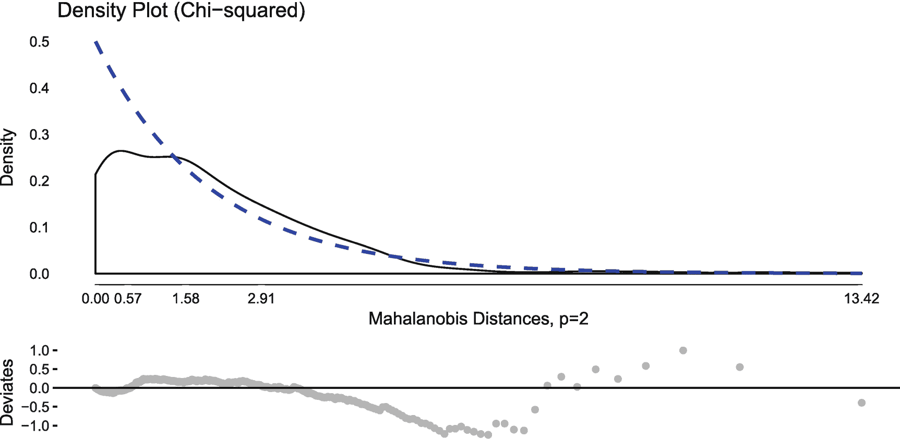

图 2-6

叠加多元正态分布的密度图和 Q-Q 图显示非多元正态的数据

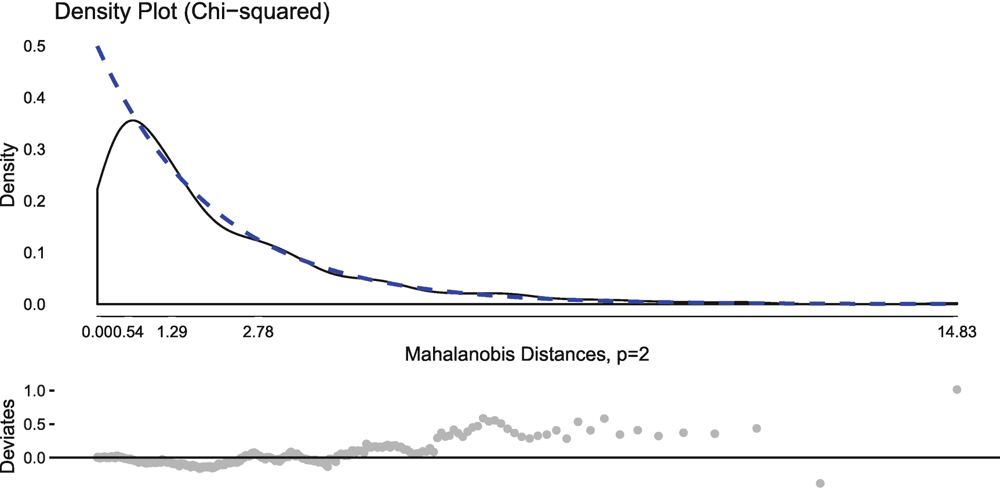

图 2-5

叠加多元正态分布的密度图和显示多元正态数据的 Q-Q 图

```r
testdistr(d, "mvnorm", ncol = 2)

testdistr(d2, "mvnorm", ncol = 2)

```

即使当变量的数量增加时，只要数据正在进行多元正态性检验，图表也是相似的。例如，我们可以测试`mtcars`数据集，它包含 32 辆汽车不同方面的 11 个变量。结果如图 [2-7](#Fig7) 所示，表明数据近似为多元正态，尽管与 Q-Q 图上直线的偏差表明了一些非正态性。

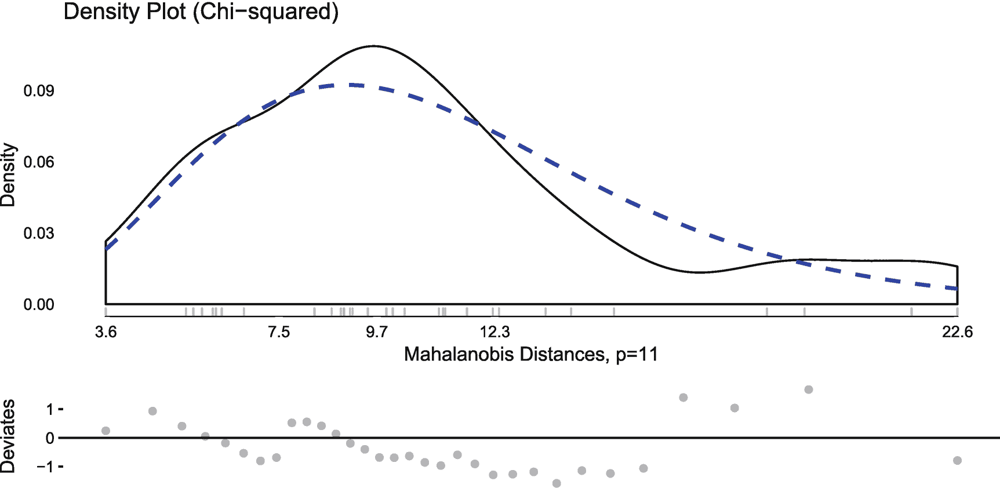

图 2-7

mtcars 数据的密度图叠加多元正态分布和 Q-Q 图

```r
testdistr(mtcars, "mvnorm", ncol = 2)

```

## 2.2 异常值

对于多元数据，任何给定变量的值都可能是异常的，或者在多元空间中是异常的。如果一个值是单变量反常的，它也将是多变量反常的。然而，正如我们看到的，单变量正常变量不一定是多变量正常的，同样，单变量异常值是多变量异常的，但单变量非异常值并不保证是多变量非异常的。

在下面的代码中，我们模拟了强正相关的多元正态数据，并向`V3`添加了两个异常值。单独检查`V3`(即单变量)，一个异常值清晰可见，移除后，没有其他异常值出现(图 [2-8](#Fig8) )。

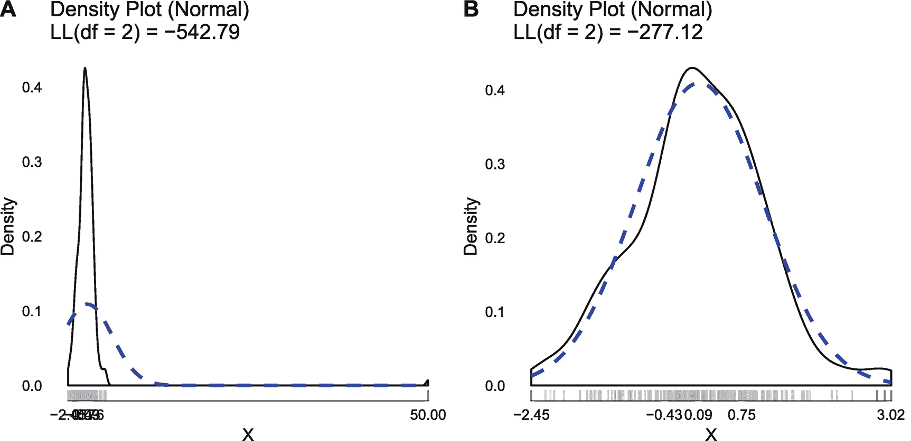

图 2-8

具有异常值(图 A)和移除异常值(图 B)的数据的密度图叠加正态分布

```r
mu <- c(0, 0, 0)
sigma <- matrix(.7, 3, 3)
diag(sigma) <- 1

set.seed(12345)
d <- as.data.table(rmvnorm(200, mean = mu, sigma = sigma))[order(V1)]
d[c(1, 200), V3 := c(2.2, 50)]

plot_grid(
  testdistr(d$V3, extremevalues = "theoretical", plot=FALSE)$Density,
  testdistr(d[V3 < 40]$V3, extremevalues = "theoretical", plot=FALSE)$Density, ncol = 2, labels = c(“A”, “B”))

```

接下来，我们可以再次使用`testdistr`函数来寻找多元异常值。使用所有情况的结果如图 [2-9](#Fig9) 所示，清楚地显示了一个异常值，没有其他点出现异常。然而，在排除一个已识别的异常情况后，第二个多元异常情况出现(图 [2-10](#Fig10) )。当更极端的值被移除时，这种额外的异常情况被揭露，导致变量`V3`的均值和方差减小。

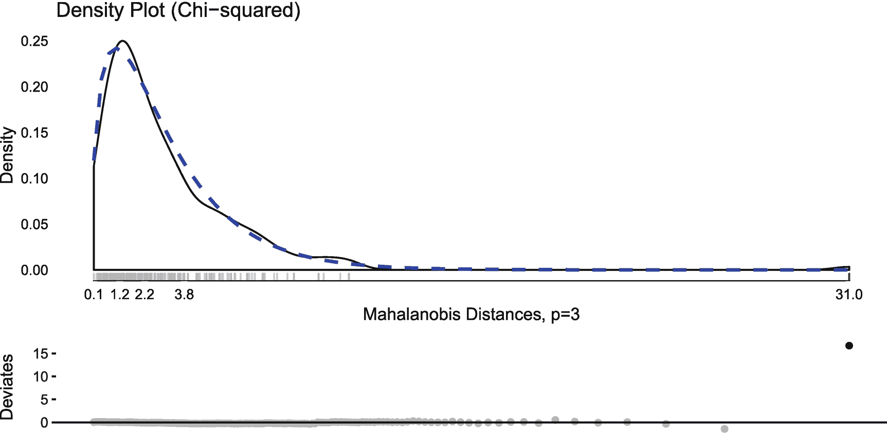

图 2-10

移除一个极端异常值后的多元正态和(多元)异常值的图表

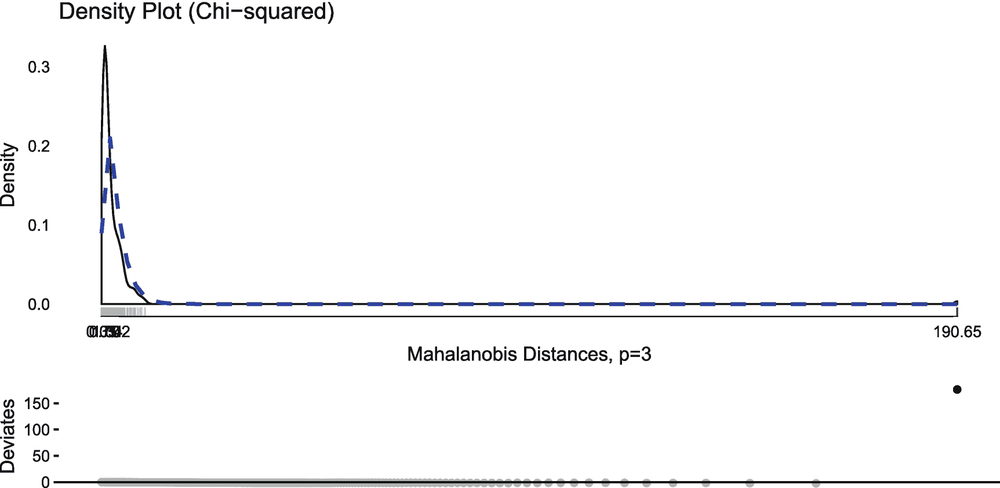

图 2-9

多元正态和(多元)异常值的图表

```r
testdistr(d, "mvnorm", ncol = 2, extremevalues = "theoretical")

testdistr(d[V3 < 40], "mvnorm", ncol = 2, extremevalues = "theoretical")

```

通过使用多元正态分布参数的稳健估计器:均值和协方差矩阵，可以直接识别多个异常情况，而不是迭代地去除异常情况。当`robust`选项与`testdistr()`的`mvnorm`分布结合使用时，使用`robustbase`包中的快速最小协方差行列式(MCD)估计器【82，83】。结果如图 [2-11](#Fig11) 所示。使用多元正态分布和稳健估计量，单变量和多变量异常情况都可以在一次通过中识别。去除这些数据后，数据看起来接近多元正态分布(图 [2-12](#Fig12) )。

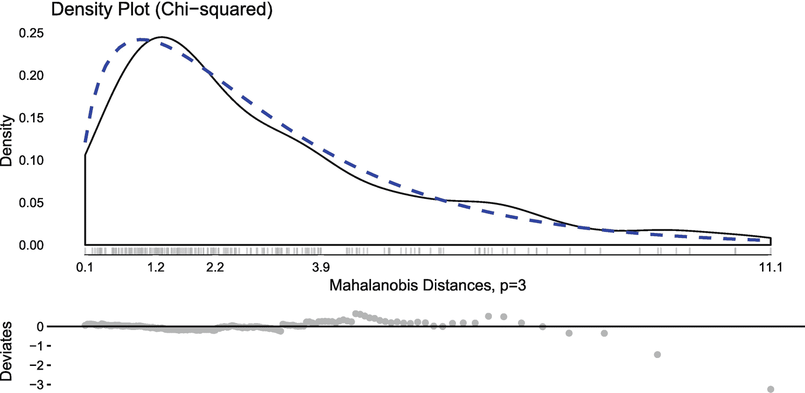

图 2-12

移除了两个异常值的多元正态和(多元)异常值的图表

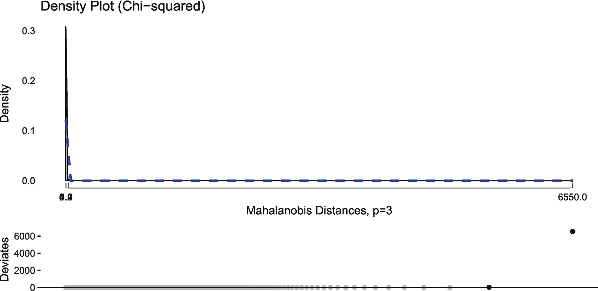

图 2-11

使用稳健估计量的多元正态和(多元)异常值的图表

```r
testdistr(d, "mvnorm", ncol = 2, robust = TRUE, extremevalues = "theoretical")

testdistr(d[-c(1,200)], "mvnorm", ncol = 2, extremevalues = "theoretical")

```

## 2.3 变量之间的关系

对于连续变量，大多数模型假定某种函数形式，变量之间通常是线性关系。有许多方法来检查这一点，但一个快速的方法是将预测值 *x* 切割成 *k* 个离散的容器。如果有有意义的断点，可以使用这些断点，但通常使用五分位数、四分位数或三分位数，这取决于数据的数量。在大型数据集中，即使是细粒度的分割，如十分位数，也可能有意义。

将预测因子分成离散的组后，可以绘制箱线图或均值图来显示趋势的大致形状。在下面的代码中，我们模拟了预测值 *x* 和结果 *y* 之间的二次关系。使用`%+%`操作符，我们可以重复使用同一个图，并简单地更新数据以使用具有不同分界点集合(四分位数、五分位数、十分位数)的数据。结果如图 [2-13](#Fig13) 所示。尽管在具有三等分切割的面板 A 中趋势有些不清楚，但是在具有十分位数的面板 D 中，在这少量的数据中，结果变得更加嘈杂。

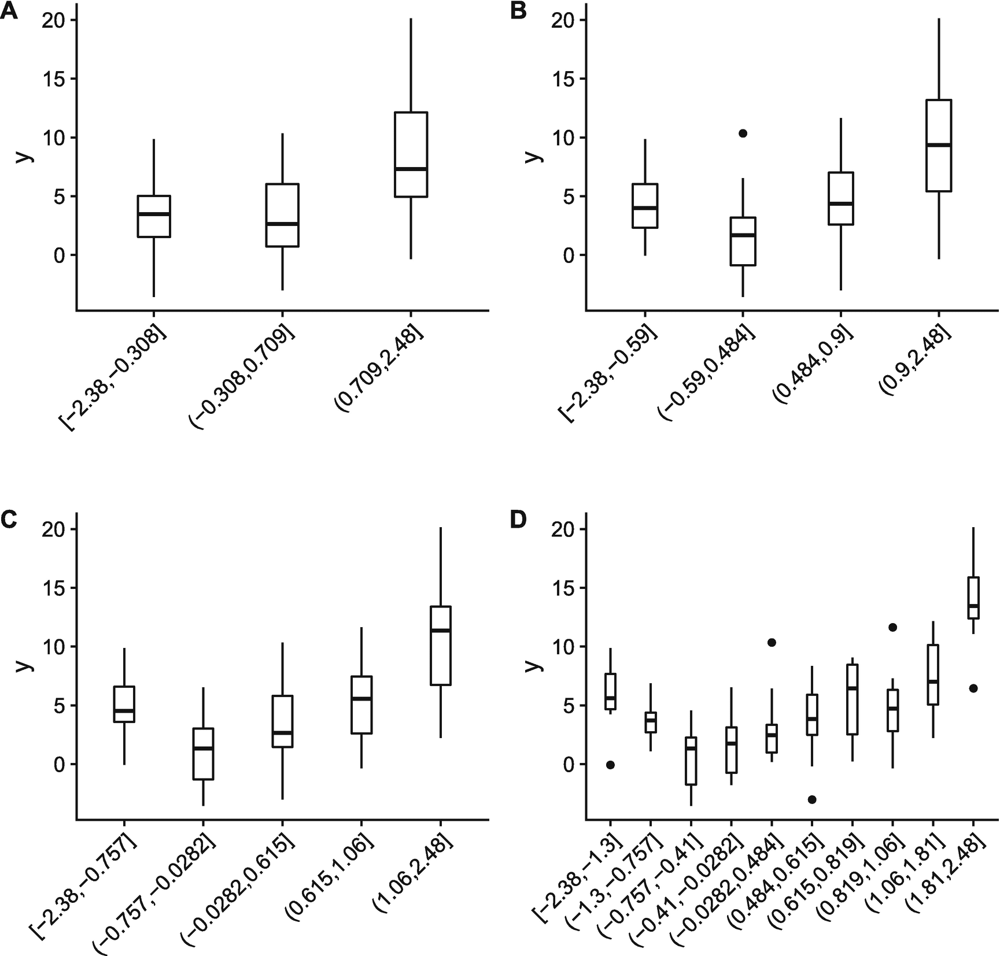

图 2-13

将连续变量切割成四分位数的箱线图，显示非线性关系

```r
set.seed(12345)
d2 <- data.table(x = rnorm(100))
d2[, y := rnorm(100, mean = 2 + x + 2 * xˆ2, sd = 3)]

p.cut3 <- ggplot(
  data = d2[, .(y,
    xcut = cut(x, quantile(x,
      probs = seq(0, 1, by = 1/3)), include.lowest = TRUE))],
  aes(xcut, y)) +
  geom_boxplot(width=.25) +
  theme(axis.text.x = element_text(
          angle = 45, hjust = 1, vjust = 1)) +
  xlab("")

p.cut4 <- p.cut3 %+% d2[, .(y,
    xcut = cut(x, quantile(x,
      probs = seq(0, 1, by = 1/4)), include.lowest = TRUE))]

p.cut5 <- p.cut3 %+% d2[, .(y,
    xcut = cut(x, quantile(x,
      probs = seq(0, 1, by = 1/5)), include.lowest = TRUE))]

p.cut10 <- p.cut3 %+% d2[, .(y,
    xcut = cut(x, quantile(x,
      probs = seq(0, 1, by= 1/10)), include.lowest = TRUE))]

plot_grid(
  p.cut3, p.cut4,
  p.cut5, p.cut10,
  ncol = 2,
  labels = c("A", "B", "C", "D"),
  align = "hv")

```

确定两个变量之间关系的函数形式的另一种方法是使用局部加权回归(黄土)线[21]。黄土线背后的思想类似于拟合最佳拟合的直线，但是加权到附近的数据点。以下代码创建一个散点图，并覆盖黄土线和直线回归直线(图 [2-14](#Fig14) )。黄土线很容易识别被直线遗漏的二次趋势。

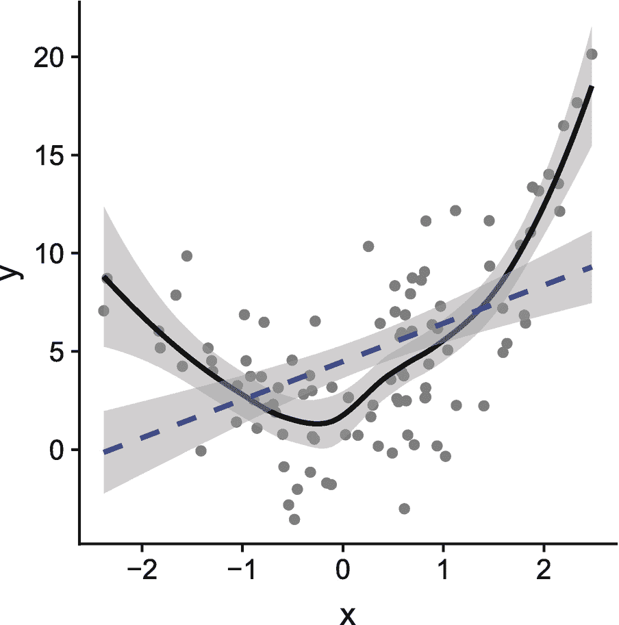

图 2-14

黄土最佳拟合线呈现非线性关系

```r
ggplot(d2, aes(x, y)) +
  geom_point(colour="grey50") +
  stat_smooth(method = "loess", colour = "black") +
  stat_smooth(method = "lm", colour = "blue", linetype = 2)

```

一旦我们知道了近似的函数形式，我们就可以尝试用参数函数来近似它。在下面的代码中，我们修改了线性模型 smooth，以包含一个自定义公式，该公式指示应该在 *x* 和*x*T6 2 上回归 *y* 。结果得到了很大的改善，显示黄土线和二次线之间非常一致(图 [2-15](#Fig15) )。

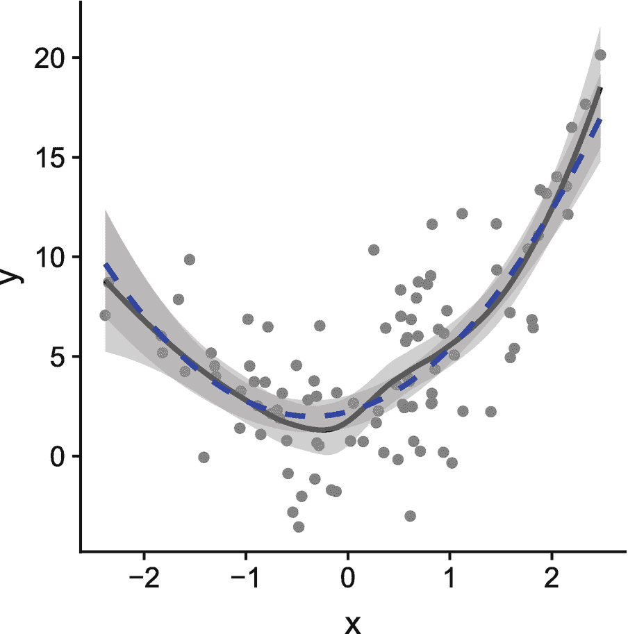

图 2-15

黄土线和二次线

```r
ggplot(d2, aes(x, y)) +
  geom_point(colour="grey50") +
  stat_smooth(method = "loess", colour = "black") +
  stat_smooth(method = "lm",
              formula = y ~ x + I(xˆ2),
              colour = "blue", linetype = 2)

```

尽管黄土线有其优点，但也不是绝对可靠的。一个选择是平滑度。平滑由`span`参数控制，该参数传递给负责估计直线的`loess()`函数。在下一个示例中，绘制了两条黄土线，一条跨度低，一条跨度高。跨度越大，线条越平滑。图 [2-16](#Fig16) 为跨度为 0.2 和 2.0 的两条黄土线。

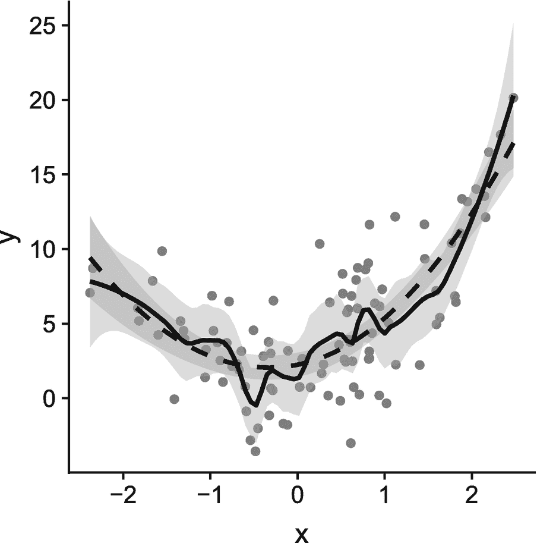

图 2-16

平滑程度不同的黄土线

```r
ggplot(d2, aes(x, y)) +
  geom_point(colour="grey50") +
  stat_smooth(method = "loess", span = .2,
              colour = "black") +
  stat_smooth(method = "loess", span = 2,
              colour = "black", linetype = 2)

```

接下来，我们将扩展到两个变量之外，并研究许多变量的可视化方式。以下代码模拟的结果是三个预测变量(两个连续预测变量和一个分类预测变量)的函数。`x`和`y`之间关系的初始双变量图表明关系相对较弱，可能有一些异常值(图 [2-17](#Fig17) )。

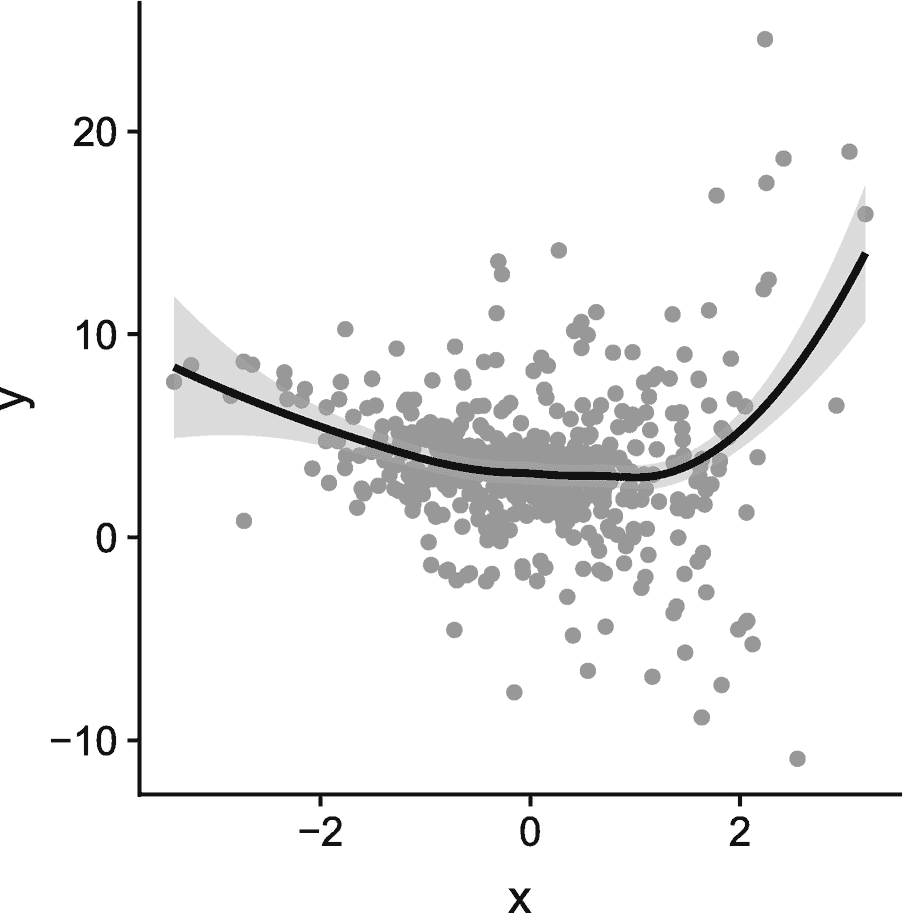

图 2-17

多元数据中二元关系的黄土线

```r
set.seed(1234)
d3 <- data.table(
  x = rnorm(500),
  w = rnorm(500),
  z = rbinom(500, 1, .4))
d3[, y := rnorm(500, mean = 3 +
       ifelse(x < 0 & w < 0, -2, 0) * x +
       ifelse(x < 0, 0, 2) * w * xˆ2 + 4 * z * w,
    sd = 1)]
d3[, z := factor(z)]

ggplot(d3, aes(x, y)) +
  geom_point(colour="grey50") +
  stat_smooth(method = "loess", colour = "black")

```

尽管对于完全连续的变量，数据可视化通常仅限于二维，但我们可以通过图形的形状、颜色和面板来添加额外的维度。下面的代码再次检查了结果`y`的预测值，这次使用了所有的变量。二进制的`z`用于给点和线着色，我们使用前面的技巧将连续的`w`切割成四分之一。虽然剪切`w`不会完美地捕捉它的连续关系，但它足以暗示正在发生什么，并表明是否有必要与`w`互动。图 [2-17](#Fig17) 中提到的几个相对极端的值通过 winsorizing 底部和顶部 1%的数据来解决。最终结果如图 [2-18](#Fig18) 所示。

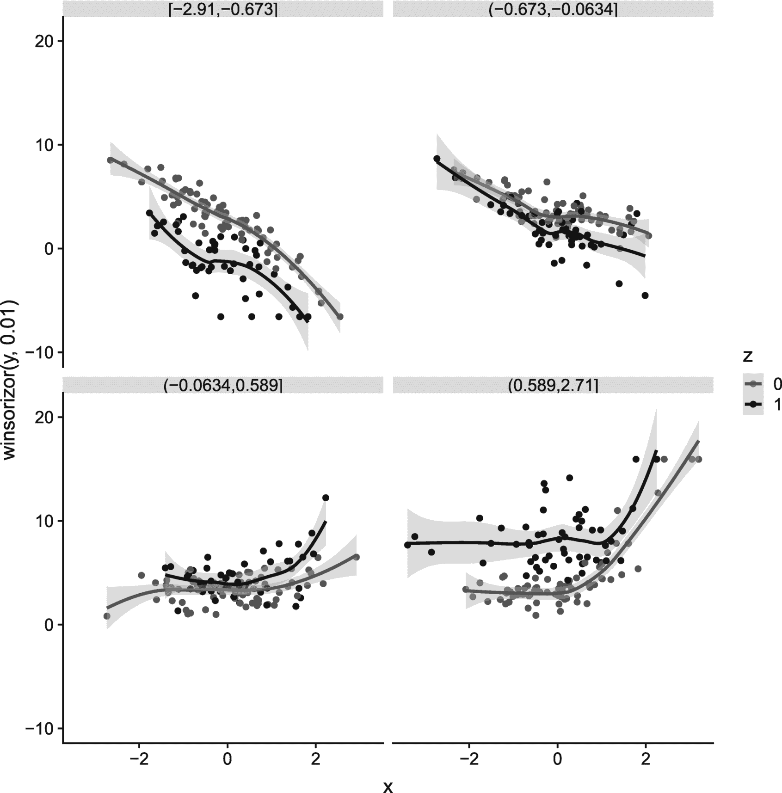

图 2-18

多元数据的黄土线

```r
ggplot(d3, aes(x, winsorizor(y, .01), colour = z)) +
  geom_point() +
  stat_smooth(method = "loess") +
  scale_colour_manual(values = c("1" = "black", "0" = "grey40")) +
  facet_wrap(~ cut(w, quantile(w), include.lowest = TRUE))

```

图 [2-18](#Fig18) 显示，当`w`为低时，对于低于 0 的`x`值，在`y`和`x`之间往往有一个负的、大致线性的斜率，但是当`w`为高时，没有关系。根据`w`的电平，`z`会向下或向上移动数值。

除黄土外，广义加性模型(gam)是另一种拟合直线的灵活方法[40]。我们将在后面讨论它们的统计性质和用途。现在的优势在于拟合灵活的非线性平滑项，包括连续变量和分类变量之间的相互作用。具体来说，我们利用了`mgcv`包【122】中的`gam()`函数。

在黄土中，我们使用`span`参数指定平滑程度。在 GAMs 中，我们通过`k`参数使用近似自由度来指定允许生产线有多灵活。目前，我们并不关注 gam 的统计属性或正式的统计推断，而是将它们作为一种工具来拟合数据并生成预测，以图形化和可视化我们数据中的(平滑)模式。`te()`功能用于允许`x`和`w`之间的非线性交互，并且我们还允许这些对于不同级别的`z`是分开的。拟合的模型存储在对象`m`中。接下来，我们生成一个用于预测的网格值。与密度一样，我们在`x`和`w`上为`z`的所有级别选择等距点。生成预测后，我们可以绘制如图 [2-19](#Fig19) 所示的结果。注意图 [2-19](#Fig19) 颜色最好看。

对于图 [2-19](#Fig19) 中的一条轮廓线，所有预测的`y`值都是相同的。因此，通过追踪一条线，你可以检查预测因素与结果的关系。例如，当`z`为 0 时(图 [2-19](#Fig19) 的左图)，对于低于 0 的`x`值，`w`是否在-3 和 0 之间移动对预测的`y`值影响不大。一般来说，任何平行于特定维度的等高线都表示在该维度上该点的预测变化很小。光栅背景也有助于显示预测的`y`值。

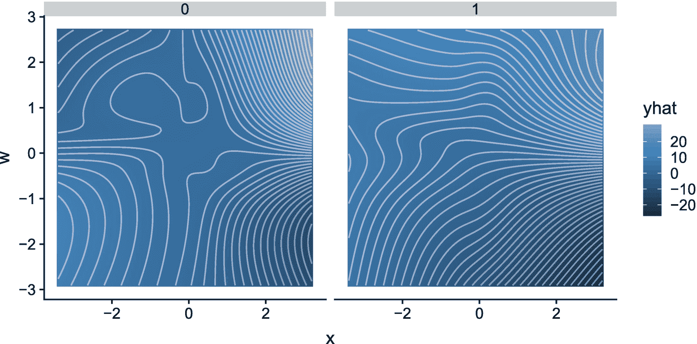

图 2-19

显示 x 和 w 的不同组合的预测 y 值的等值线图，由 z 面板显示

```r
m <- gam(winsorizor(y, .01) ~ z + te(x, w, k = 7, by = z), data = d3)

newdat <- expand.grid(
  x = seq(min(d3$x), max(d3$x), length.out = 100),
  w = seq(min(d3$w), max(d3$w), length.out = 100),
  z = factor(0:1, levels = levels(d3$z)))

newdat$yhat <- predict(m, newdata = newdat)

ggplot(newdat, aes(x = x, y = w, z = yhat)) +
  geom_raster(aes(fill = yhat)) +
  geom_contour(colour = "white", binwidth = 1, alpha = .5) +
  facet_wrap(~ z)

```

### 评估方差的同质性

方差的同质性或同质性是指各组之间或连续预测值之间存在相同的有限方差，结果在预测值的各个级别上具有相同的残差方差。例如，在单向方差分析中，对于解释变量(通常称为自变量)的每个水平，结果的方差应该大致相等。

为了评估方差的同质性，我们为 iris 数据制作了一个数据表，并通过简单地计算物种的方差来进行第一次检查。

```r
diris <- as.data.table(iris)
diris[, .(V = var(Sepal.Length)), by = Species]

##       Species    V
## 1:     setosa 0.12
## 2: versicolor 0.27
## 3:  virginica 0.40

```

可视化数据和分布也很有帮助。箱线图或盒须图可能是一种有用的方法，因为“盒”部分覆盖了四分位数之间的范围，即第 25 至 75 个百分点。这是一种稳健的分布范围测量方法。我们检查盒子的*分布*,以了解不同物种之间的可变性是否大致相等。箱线图也比仅仅按组计算方差更能提供信息，因为它们可以显示数据中是否有任何异常值。

即使物种间的传播是可比的，中位数或位置也可能不同，这使得比较传播更加困难。如果您不想检查位置，并且希望只关注分布，那么在制图之前确定中间值是很有用的。图 [2-20](#Fig20) 中显示了无(A 图)和有(B 图)中间居中的箱线图。

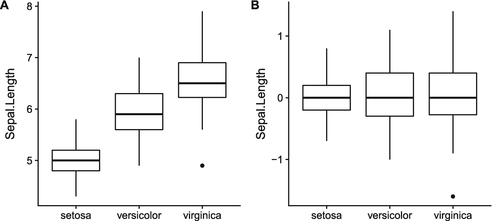

图 2-20

各种萼片长度的盒须图。异常值显示为点

```r
plot_grid(
  ggplot(diris, aes(Species, Sepal.Length)) +
    geom_boxplot() +
    xlab(""),
  ggplot(diris[, .(Sepal.Length = Sepal.Length -
                              median(Sepal.Length)), by = Species],
         aes(Species, Sepal.Length)) +
    geom_boxplot() +
    xlab(""),
  ncol = 2, labels = c("A", "B"), align = "hv")

```

我们已经看到了密度图，并用它来评估变量的分布；如果密度图被反射形成镜像，则称为小提琴图。我们可以用`geom_violin()`来制作；它提供了与箱线图相似的信息。然而，violin 图提供了关于分布的更多信息，因为箱线图仅显示了中位数(第 50 个百分点)、第 25 个百分点和第 75 个百分点，以及数据的范围(如果有异常值，则略小于整个范围)。但是，由于查看中位数和四分位间距范围也很有用，因此将宽度较窄的箱线图叠加到 violin 图上会很有帮助。从小提琴图中，我们可以看到，对于具有较高分布均值(位置)的物种，图 [2-21](#Fig21) 中的扩散稳步增加。

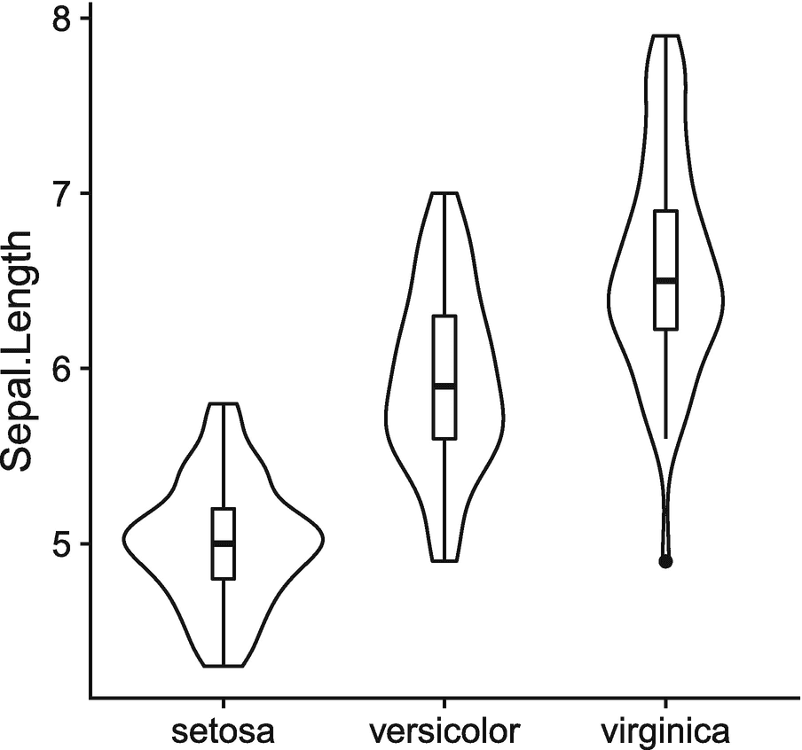

图 2-21

中间有盒须图的小提琴图

```r
ggplot(diris, aes(Species, Sepal.Length)) +
  geom_violin() +
  geom_boxplot(width = .1) +
  xlab("")

```

正如我们在研究变量之间的关系时所做的那样，violin 图和 box 图可以扩展到使用颜色和面板来处理多个变量。下面的代码使用我们研究变量之间关系的数据，并删除所有连续的预测因子，以便于检查预测因子水平上结果的分布和传播。结果如图 [2-22](#Fig22) 所示。请注意，我们有目的地限制了 y 轴的范围，以便更容易看到图形，并且不太强调极值。

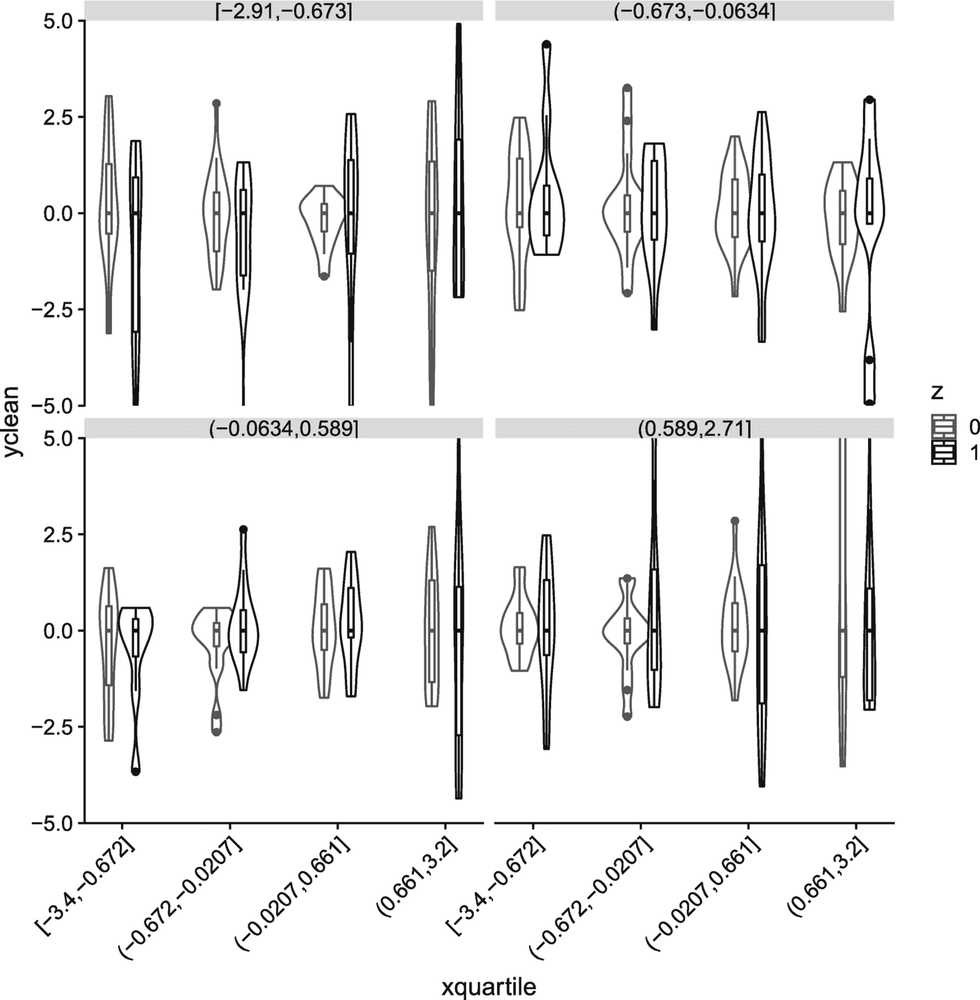

图 2-22

小提琴图，中间用 x 的四分位数表示盒须图，用 z 着色

```r
## create cuts
d3[, xquartile := cut(x, quantile(x), include.lowest = TRUE)]
d3[, wquartile := cut(w, quantile(w), include.lowest = TRUE)]
d3[, yclean := winsorizor(y, .01)]

## median center y by group to facilitate comparison
d3[, yclean := yclean - median(yclean),
   by = .(xquartile, wquartile, z)]

p <- position_dodge(.5)

ggplot(d3, aes(xquartile, yclean, colour = z)) +
  geom_violin(position = p) +
  geom_boxplot(position = p, width = .1) +
  scale_colour_manual(values = c("1" = "black", "0" = "grey40")) +
  facet_wrap(~ wquartile) +
  theme(axis.text.x = element_text(angle = 45, hjust=1, vjust=1)) +
  coord_cartesian(ylim = c(-5, 5), expand = FALSE)

```

到目前为止，我们已经研究了评估连续结果和离散解释变量的方差齐性，或者将连续解释变量分成离散类别。现在我们转向如何对连续变量进行可视化处理。第一步是创建一个散点图；然而，为了看到“传播”,我们需要对方差或四分位范围等进行一些连续的估计。这可以通过分位数回归来实现。我们不会在这里详细讨论这个过程，但可以说分位数回归可以估计作为一个或多个解释变量的函数的分布的分位数。我们将首先模拟一些同质和异质数据。

```r
set.seed(1234)
d4 <- data.table(x = runif(500, 0, 5))
d4[, y1 := rnorm(500, mean = 2 + x, sd = 1)]
d4[, y2 := rnorm(500, mean = 2 + x, sd = .25 + x)]

```

图 A 是同质可变性的例子，图 B 是异质可变性的例子。我们在图 [2-23](#Fig23) 中展示了这两个数据集的视觉对比。分位数回归[51，50，107]。

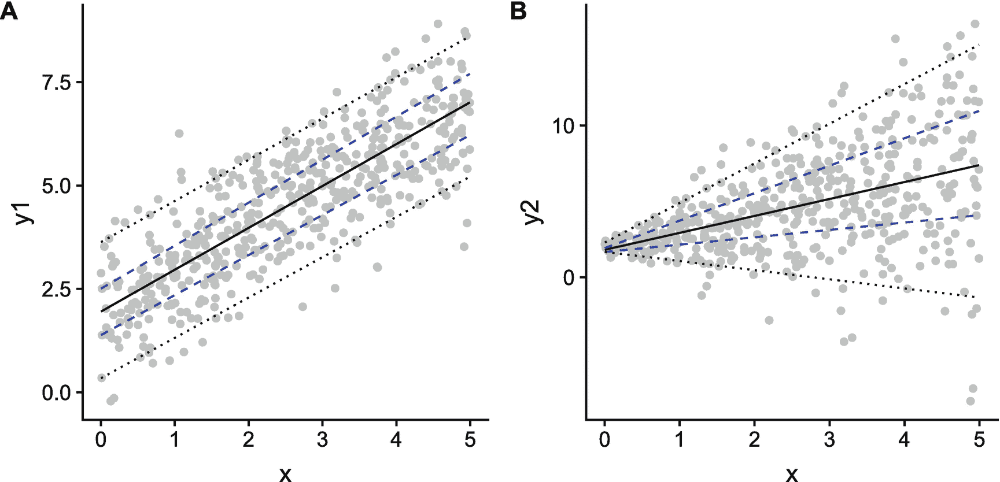

图 2-23

同异方差与异方差

```r
plot_grid(
  ggplot(d4, aes(x, y1)) +
    geom_point(colour = "grey70") +
    geom_quantile(quantiles = .5, colour = 'black') +
    geom_quantile(quantiles = c(.25, .75),
                  colour = 'blue', linetype = 2) +
    geom_quantile(quantiles = c(.05, .95),
                  colour = 'black', linetype = 3),
  ggplot(d4, aes(x, y2)) +
    geom_point(colour = "grey70") +
    geom_quantile(quantiles = .5, colour = 'black') +
    geom_quantile(quantiles = c(.25, .75),
                  colour = 'blue', linetype = 2) +
    geom_quantile(quantiles = c(.05, .95),
                  colour = 'black', linetype = 3),
  ncol = 2, labels = c("A", "B"))

## Smoothing formula not specified. Using: y ~ x
## Smoothing formula not specified. Using: y ~ x
## Smoothing formula not specified. Using: y ~ x
## Smoothing formula not specified. Using: y ~ x
## Smoothing formula not specified. Using: y ~ x
## Smoothing formula not specified. Using: y ~ x

```

## 2.4 总结

本章演示了可视化多元数据的技术，以了解它如何与多元正态分布进行比较(表 [2-1](#Tab1) )。

表 2-1

本章中描述的关键功能列表及其功能摘要

<colgroup><col class="tcol1 align-left"> <col class="tcol2 align-left"></colgroup> 
| 

功能

 | 

它的作用

 |
| --- | --- |
| `geom_quantile()` | 以给定的分位数拟合直线(默认为四分位数) |
| `geom_density2d()` | 为多元正态数据点创建 2D 密度等值线图 |
| `geom_contour()` | 创建 2D 等高线图 |
| `geom_violin()` | 镜像密度图 |
| `stat_smooth()` | 将曲线拟合到数据点 |