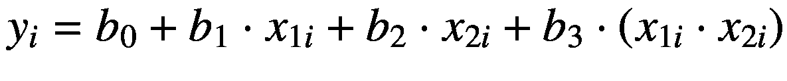
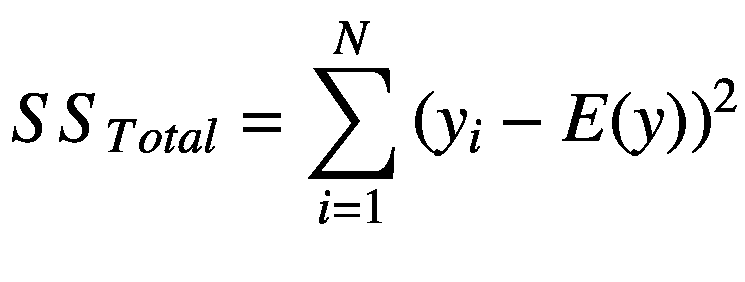

# 三、GLM 1

广义线性模型(GLMs)是一大类模型，包括回归分析和方差分析(ANOVA ),是常用于指 GLMs 的其他术语或分析。本章使用了如下所示的一些包。我们运行设置代码来加载这些数据，并以整洁的方式打印数据表。

```r
library(checkpoint)
checkpoint("2018-09-28", R.version = "3.5.1",
  project = book_directory,
  checkpointLocation = checkpoint_directory,
  scanForPackages = FALSE,
  scan.rnw.with.knitr = TRUE, use.knitr = TRUE)

library(knitr)
library(data.table)
library(ggplot2)
library(visreg)
library(ez)
library(emmeans)
library(rms)
library(ipw)
library(JWileymisc)
library(RcppEigen)
library(texreg)

options(
  width = 70,
  stringsAsFactors = FALSE,
  datatable.print.nrows = 20,
  datatable.print.topn = 3,
  digits = 2)

```

## 3.1 概念背景

广义线性模型提供了一个通用的框架和符号，可以适应许多特定类型的模型和分析。本章涵盖了几种特定类型的 GLMs。如果您不熟悉一些更基本的 GLMs 类型，如方差分析(ANOVA)或线性回归，并且您希望更好地了解 GLMs 的背景和概念框架，那么阅读 ANOVA 和线性回归可能是值得的。一个易于使用的免费资源是在线统计教育:一门多媒体学习课程( [`http://onlinestatbook.com/`](http://onlinestatbook.com/) ，项目负责人:莱斯大学的大卫·m·莱恩)，其中有一节是关于方差分析和回归的。关于 GLMs 的全面数理统计背景，我们推荐 McCullagh 和 Nelder 的经典著作[61]，其完整参考资料在参考资料部分。

首先，我们介绍一些统计和 GLMs 中常用的函数，包括:

*   *E* ( *x* )表示一个变量的期望值，或者它的(可能有条件的)均值。

*   *Var* ( *x* )表示一个变量的方差，或者说它的离差。

*   *g* ( *x* )表示链接函数，该函数获取原始结果变量并将其转换为由 GLM 预测的线性标度。

*   *g*<sup>-1</sup>(*x*)表示反向链接函数，它采用 GLM 预测的线性标度，并将其转换回原始标度。

*   *exp* ( *x* )表示指数函数。

*   *ln* ( *x* )表示自然对数函数。

glm 的结构是这样的，有一个结果或因变量，我们称之为 y。一个或多个预测值或解释变量存储在一个矩阵中，该矩阵有 *n* 行(数据点的数量)和 *k* 列(预测值或解释变量的数量)，我们称之为 x。回归系数，即要估计的参数，形成一个长度为 *k* (预测值的数量)的向量，称为 *β* 。结局的期望值是 *E* (y) = *μ* 。加粗的希腊文小写字母 *μ* 是书写预期结果值的较短方式。这些将总是在原始或原始数据范围内。线性标尺上的期望值是另一个称为 *η* 的向量。

有了这些约定，我们就可以像内尔德和威德伯恩的开创性文章[71]那样定义广义线性模型的构建模块。我们使用与内尔德和威德伯恩[71]稍有不同的符号来反映应用统计学中更常见的近期实践。每个 GLM 都有一个结果或因变量， *y* 。在线性预测因子上进行调节后，假设结果遵循来自指数族的概率分布。此外，每个 GLM 具有一组 *k* 预测变量，x <sub>1</sub> ，...，x <sub>*k*</sub> ，总体称为 X，以及一个期望的线性结果:


(3.1)

最后，每个 GLM 都有一个链接功能


(3.2)

以及类似的反向链接功能


(3.3)

因为参数 *β* 总是在线性预测标度 *η* 上估计，所以不管结果的分布如何，GLMs 的估计都是相似的。改变的是为结果和链接以及反向链接函数假设的分布。我们涵盖了三种常见类型的结果变量的分布和链接函数(以及如何分析它们):连续、二元结果和计数结果。表 [3-1](#Tab1) 显示了我们在本章中涉及的最常用的(规范的)链接函数。请注意，列出的分布并不是给定结果类型的所有可能分布。例如，对于连续结果，根据其形状或界限，有许多其他分布(例如，连续但以 0 和 1 为界限的数据的 Beta 分布)。

表 3-1

结果类型、分布和相应的链接函数

<colgroup><col class="tcol1 align-left"> <col class="tcol2 align-left"> <col class="tcol3 align-left"> <col class="tcol4 align-left"></colgroup> 
| 

结果类型

 | 

分布

 | 

链接功能

 | 

反向链接功能

 |
| --- | --- | --- | --- |
| 连续的(实数) | 正常(高斯) | *=*【g】*(*)=** | *=*【g】*<sup>-1</sup>(*)=** |
| 二进制(0/1) | 伯努利多项式 |  |  |
| 计数(正整数) | 泊松，负二项式 | *=*【g】*(*)=*(*** | *=*【g】*<sup>-1</sup>(*)=*【exp】*** |

基于结果分布，有可能写出一个似然函数。我们在本书中不涉及似然函数的细节，因为没有必要知道什么是应用数据分析的似然函数。然而，基本思想是，似然函数(取决于所选择的分布)量化了数据从具有给定参数集的分布中出现的可能性；因此，一般似然函数被写成 *L* (y， *θ* )。注意，这里我们将参数称为 *θ* ，因为对于许多(但不是所有)分布，必须估计回归系数之外的附加参数；具体来说，经常需要估计色散参数。例如，正态分布的参数是均值和方差或标准差。另一个注意事项是，出于实用的原因，可能性通常被报告为对数可能性。其他地方描述了进一步的细节[71，61]。

似然函数有几个有用的目的。首先，它们是最大似然估计的基础。也就是说，估计 GLM(以及许多其他模型)的参数，以最大化数据的似然函数。此外，来自给定模型的总体似然性可以与来自另一个模型的似然性进行比较，作为哪个模型提供更好的数据拟合的相对比较。接下来，我们研究如何将这个通用模型应用到具体的案例中。

## 3.2 分类预测器和虚拟编码

### 两级分类预测器

在 GLMs 中检查分类预测因子是很常见的。例如，人们可能希望测试结果中是否存在性别差异。但是，在这样做之前，需要一个系统将“女人”和“男人”转换成数值。将离散类别编码成数字的最常见系统称为虚拟编码。虚拟编码包括对代表一个特定类别的一系列二进制 0/1 变量进行编码。对于性别，我们可以编写两个虚拟变量，一个代表女性，一个代表男性。如表 [3-2](#Tab2) 所示。

表 3-2

虚拟编码性别示例

<colgroup><col class="tcol1 align-left"> <col class="tcol2 align-left"> <col class="tcol3 align-left"></colgroup> 
| 

性

 | 

D1

 | 

D2

 |
| --- | --- | --- |
| 妇女 | one | Zero |
| 男人 | Zero | one |
| 男人 | Zero | one |
| 妇女 | one | Zero |
| 妇女 | one | Zero |
| 男人 | Zero | one |

在这种情况下，伪代码 D1 和 D2 是完全负相关的，表明它们捕获相同的信息，但是被颠倒。因此，我们将只把两个伪码中的一个输入实际的 GLM。总的原则是，对于一个 *k-* 级变量，可以生成 *k* 个伪代码变量，但只包括伪代码变量的*k*1。省略的变量成为参考组。为了理解为什么会这样，我们可以检查一个简单的设计矩阵 X，(表 [3-3](#Tab3) )，它对应于一个只测试性别差异的模型。作为 GLMs 的标准，我们有一个常数列，它是截距，当所有其他预测值都等于零时结果的期望值。我们还有两个虚拟编码变量之一，D2。在这种情况下，当参与者是男性时，D2 为 1，当参与者是女性时，为 0。相应的系数向量将具有两个元素，一个用于截距，一个用于伪码 D2。

表 3-3

具有截距和一个虚拟变量的性别差异设计矩阵

<colgroup><col class="tcol1 align-left"> <col class="tcol2 align-left"></colgroup> 
| 

拦截

 | 

D2

 |
| --- | --- |
| one | Zero |
| one | one |
| one | one |
| one | Zero |
| one | Zero |
| one | one |

截距系数将是女性的期望值，因为只有当参与者是女性时，所有其他变量(在这种情况下，只有 D2)才为零。D2 系数是 D2 一个单位变化结果的预期变化。因为我们用 0/1 来编码 D2，在 D2 一个单位的变化正好是从女性(0)到男性(1)的转变。因此，D2 系数可以更简单地认为是男女之间的预期差异。

### 三层或更多层分类预测因子

具有三个或更多级别的虚拟编码分类变量的工作方式类似于基本的两级方法。同样，我们创建一组 0/1 变量，对变量的每个特定级别进行编码。表 [3-4](#Tab4) 显示了锻炼类型的三级变量示例。

表 3-4

虚拟编码性别示例

<colgroup><col class="tcol1 align-left"> <col class="tcol2 align-left"> <col class="tcol3 align-left"> <col class="tcol4 align-left"></colgroup> 
| 

锻炼

 | 

D1

 | 

D2

 | 

D3

 |
| --- | --- | --- | --- |
| 奔跑 | one | Zero | Zero |
| 游泳 | Zero | one | Zero |
| 自行车 | Zero | Zero | one |
| 奔跑 | one | Zero | Zero |
| 自行车 | Zero | Zero | one |
| 自行车 | Zero | Zero | one |
| 奔跑 | one | Zero | Zero |
| 游泳 | Zero | one | Zero |
| 游泳 | Zero | one | Zero |

为了进行分析，我们将在 GLM 中包括任何*k*1 = 31 = 2 的伪码变量，同样，被排除的组将是参考组。然而，组间比较变得稍微复杂一些。假设我们忽略了 D1，运行的虚拟代码。游泳和自行车虚拟代码的系数将捕捉跑步和游泳之间以及跑步和自行车之间的预期差异。然而，没有一个系数会直接测试游泳和骑自行车之间的差异。总的原则是，对于一个*k*水平变量，有可能的成对比较；对于三级变量，三次成对比较；对于四级变量，六次成对比较。要测试所有成对组合，有几种选择。一种选择是，尽管效率不高，但只要有伪代码变量，就运行 GLM，每次迭代只省略一个伪代码。另一种方法是使用从模型估计的系数矩阵和参数协方差矩阵来测试特定的对比。在我们的练习示例中，测试游泳与跑步的系数是否不同于自行车与跑步的系数将提供游泳与自行车是否不同的测试。

考虑如何测试变量的整体效果也很重要。对于单个连续变量或两级分类变量，单个系数反映了变量的整体效应。然而，在输入多个虚拟代码变量的三级或更多级分类变量的情况下，任何特定虚拟代码变量系数的测试都不能提供该变量显著性的整体测试。相反，我们需要一个综合测试。对于具有正态分布结果的 GLMs，这可能是一个综合 f 检验。对于无法计算自由度的其他 GLM，标准测试是基于测试所有虚拟变量系数共同为零的 Wald 测试，或似然比测试，这需要在没有问题变量的情况下重新调整 GLM，并测试最终对数似然变化的程度，最终对数似然变化将作为自由度等于排除的虚拟变量数量的 *χ* <sup>2</sup> 分布。

## 3.3 相互作用和调节效应

当两个或多个解释变量之间的关系和结果依赖于彼此的值时，就会发生交互作用。例如，Wiley 和他的同事们[115]发现了压力源的可控程度和人们积极感受的应对方式之间的相互作用。对于人们几乎无法控制的压力源，无论人们试图积极思考如何改善问题还是避免思考问题，对他们的积极情绪水平没有影响。然而，对于可控的压力源，那些避免思考如何解决问题的人积极情绪水平较低，而那些积极思考如何解决问题的人积极情绪水平较高。

两个变量之间的相互作用称为双向相互作用。三个变量之间的相互作用称为三向相互作用，等等。交互作用可以在 GLMs 中进行测试，方法是将单个变量单独添加到模型中，并添加需要交互作用的变量的乘积项。这可以通过在原始数据集中创建新变量来实现。例如，对于 *x* <sub>1</sub> 和 *x* <sub>2</sub> ,“新”交互变量将被创建为*int = x*<sub>*1*</sub>⋅*x*<sub>*2*</sub>。`R`和其他统计软件包还提供了指定应该在模型中测试两个(或更多)变量的交互作用的能力，在这种情况下，产品术语是自动创建的，而无需在数据集中创建额外的变量。无论哪种情况，最终结果都是一样的，表 [3-5](#Tab5) 中显示了一个设计矩阵示例。

对于两个以上变量的相互作用，还有几个附加项。如果有三个解释变量( *x* <sub>1</sub> ， *x* <sub>2</sub> ， *x* <sub>3</sub> )，则有三个双向交互(*x*<sub>1</sub>⋅*x*<sub>2</sub>，*x*<sub>1</sub>⋅*x*【t26) *x*t30】2⋅*x*t34】3 以及除了三个个体变量之外可以考虑的一个三向交互(*x*t38】1⋅*x*t42】2⋅*x*t46】3)。 即使主要关注的是三方交互，标准做法也是包括所有低阶项。因此，对于三向互动，通常所有可能的双向互动和所有单个变量也将包括在分析中。

因为相互作用涉及不止一个变量，所以总是有可能用不止一种方式来解释它们。例如，如果两个变量 *a* 和 *b* 之间存在相互作用，则每个变量与结果 *y* 之间的关系取决于另一个变量的水平。因此 *a* 和 *y* 之间的关系取决于 *b* 的级别，同样 *b* 和 *y* 之间的关系取决于 *a* 。这一事实改变了对单个变量回归系数的解释。查看表 [3-5](#Tab5) ，当 x2 = 0 时，x1 的系数将被解释为 x1 一个单位变化的预期 y 变化。同样，当 x1 = 0 时，x2 的系数将被解释为 x2 变化一个单位时 y 的预期变化。最后，x1x2 的系数可以解释为(1)x2 变化一个单位时 x1 系数的预期变化，或者(2)x1 变化一个单位时 x2 系数的预期变化。

表 3-5

双向互动设计矩阵示例

<colgroup><col class="tcol1 align-left"> <col class="tcol2 align-left"> <col class="tcol3 align-left"> <col class="tcol4 align-left"></colgroup> 
| 

拦截

 | 

x1

 | 

x2

 | 

x1x2

 |
| --- | --- | --- | --- |
| one | one | Two | Two |
| one | Two | Two | four |
| one | three | one | three |
| one | three | three | nine |
| one | one | one | one |
| one | Two | Zero | Zero |

当用标准代数而不是矩阵代数写出时，这种解释更有意义，如下所示:



(3.4)

这可以分解如下，以强调相互作用如何最终导致 x1 和 x2 之间的关系，其中 y 取决于相互作用中的其他变量:


(3.5)

类似的逻辑也适用于三方互动，只是依赖于另外两个变量。因为所有较低阶的双向交互也是标准的，所以模型的复杂性(参数的数量)急剧增加。


(3.6)

这可以分解如下，以突出每个变量对其他两个变量的依赖性:


(3.7)

## 3.4 公式界面

在`R`中，许多模型和几乎所有 glm 都是使用公式接口指定的。公式是一种指定简单到复杂模型的灵活方式，它由两部分组成，中间用波浪号`(`∩`)`隔开。左手边(LHS)位于波浪号的左侧，右手边(RHS)位于波浪号的右侧。基本形式是

```r
outcome ∼predictor1 + predictor2.

```

“`+`”操作符将变量添加到模型中。`R`的公式接口是一种灵活的指定模型的方式。主要操作符有“`+`”、`-`、`:`、`*`，它们分别是加法项、`-`和乘法项。使用`update()`功能可以修改现有公式。

除了从数据中检查变量的个别影响，GLMs 通常包括两个(或更多)变量的乘积。这是一个非常常见的任务，以至于 formula 接口有一种特殊的方式来指示应该包含两个项的乘积，即“`:`”运算符。例如，`y`∾`x1 + x2 + x1:x2`包括`x1`、`x2`，以及它们的交互作用(乘积项)作为`y`的预测因子。其中一个很好的特性是它正确地处理了连续变量和分类变量。如果`x1`和`x2`是连续测度，那么`x1:x2`将是正则代数积。如果其中一个或两个都是虚拟代码，那么产品将针对虚拟代码进行适当扩展。

当包含交互项时，主要效应和每个变量的单独效应几乎总是包含在内。因为个体效应几乎总是包含在交互作用中，所以可以使用“`*`”运算符来表示两个变量的交互作用和个体效应:`y`∩`x1 * x2`扩展为`y`∩`x1 + x2 + x1:x2`。多个操作符可以链接在一起，以便`y`∩`x1 * x2 * x3`扩展为`y`∩`x1 + x2 + x3 + x1:x2 + x1:x3 + x2:x3 + x1:x2:x3`。有时，一个变量可能会调节与三个或更多其他预测因素的相互作用，但三向或四向相互作用是不可取的。括号可用于对术语集进行分组，以便将运算符分配给组中的所有术语。于是，`y`∾`x1 * (x2 + x3)`展开为`y`∾`x1 + x2 + x3 + x1:x2 + x1:x3`。

这涵盖了公式中最常用的运算符。另外两个细节有时会有所帮助，尤其是在修改现有公式时。一个点，“`.`”，可以作为指代一切事物的简称。最后，可以使用“`-`”操作符删除术语。当使用`update()`函数更新现有的、通常存储的公式时，这些是最常用的。`update()`函数将一个现有的公式对象作为其第一个参数，然后是所需的修改。以下代码显示了可能的不同类型的公式更新示例。注意，其他运算符“`*`”和“`:`”也可以与“`.`”一起使用。如果点被完全省略，那么旧公式的这一部分根本不会被重用。我们将在`R`中使用 formula 接口来构建大部分模型，因此值得花时间彻底学习。

```r
f1 <- y ~ x1 + x2 + x1:x2

update(f1, . ~ .)

## y ~ x1 + x2 + x1:x2

update(f1, w ~ .)

## w ~ x1 + x2 + x1:x2

update(f1, . ~ . + x3)

## y ~ x1 + x2 + x3 + x1:x2

update(f1, . ~ . - x1:x2)

## y ~ x1 + x2

```

## 3.5 差异分析

### 概念背景

方差分析(ANOVA)是一种统计技术，用于划分不同因素导致的结果差异。ANOVAs 是 GLM 的一个特例，具有连续、正态分布的结果和离散/分类解释变量，如性别(女性、男性)或随机实验研究中的状况(如治疗 A、治疗 B 或对照)。由于这些限制，ANOVAs 可以被概念化为测试结果的平均值是否在每个组中是相等的。也就是说，ANOVAs 测试是否:


(3.8)

传统上，ANOVAs 被用作零假设统计检验(NHST)的一部分。从本质上讲，NHST 设立了零假设，并问道，假设零假设在总体中为真，在这个数据样本中获得观察结果的概率是多少？零假设的反面是替代假设。在方差分析的情况下，另一个假设是至少一个组的平均值不等于其余的平均值。例如，治疗 A 可能比治疗 B 或对照组具有更低或更高的平均值。

为了将方差分析参数化为 GLM，我们将前面的等式写成一系列的差，例如:


(3.9)

这些差异被编码到保存预测变量 x 的设计矩阵中。如我们之前所述，使用虚拟编码将组转换为预测变量。

默认情况下，`R`将使用因子的第一级作为参考组来创建虚拟代码。参考组被省略，但是设计矩阵增加了截距，截距是一个包含 1 的常数列。然后，GLM 将估计参数， *β* ，设计矩阵的每一列一个参数。因为截距在模型中，所以治疗 A 的系数(`R`标记为`ConditionA`)将是治疗 A 的平均值和对照组(参考水平)之间的差值。同样，治疗 B 的系数将是治疗 B 的平均值和对照组之间的差值。截距将获取对照组的平均值。

为了看到这一点，我们可以使用函数`lm()`估计`R`中的回归参数，并使用函数`coef()`提取系数。我们用一个公式接口:`outcome predictor`写出我们希望 R 拟合的模型。

```r
set.seed(1234)
example <- data.table(
  y = rnorm(9),
  Condition = factor(rep(c("A", "B", "Control"), each = 3),
                     levels = c("Control", "A", "B")))

coef(lm(y ~ Condition, data = example))

## (Intercept)  ConditionA  ConditionB
##      -0.562       0.614       0.092

```

通过计算每组的平均值，很容易检查这些是否与组平均值的差异相匹配。

```r
example[, .(M = mean(y)), by = Condition]

##    Condition      M
## 1:         A  0.052
## 2:         B -0.470
## 3:   Control -0.562

```

我们可以立即看到截距与对照组的平均值相同。处理 A 的系数等于对照组和处理 A 组之间的差值。平均值:`0.61 = 0.05 - (-0.56).`

如果我们要抑制截距，那么设计矩阵将包含每个条件的虚拟代码，回归系数将正好是组平均值，我们在下面的代码中可以看到。通过在公式中添加 0 来抑制截距。但是请注意，这通常只有在模型中包含伪代码时才有意义。在具有连续解释变量的 GLM 中，抑制截距会迫使截距精确为零，这很少是明智的。

```r
model.matrix(~ 0 + Condition, data = example)

##   ConditionControl ConditionA ConditionB
## 1                0          1          0
## 2                0          1          0
## 3                0          1          0
## 4                0          0          1
## 5                0          0          1
## 6                0          0          1
## 7                1          0          0
## 8                1          0          0
## 9                1          0          0
## attr(,"assign")
## [1] 1 1 1
## attr(,"contrasts")
## attr(,"contrasts")$Condition
## [1] "contr.treatment"

coef(lm(y ~ 0 + Condition, data = example))

## ConditionControl       ConditionA       ConditionB
##           -0.562            0.052           -0.470

```

标准方差分析检验了总体结果中有多少可变性，其中有多少可变性在组均值之间，以及在考虑组均值后还有多少可变性。为了检验是否有任何差异，组均值之间的变异量与组内变异量之比(剩余方差)形成。该比率称为 F 比率，可用于获得 p 值，因为 F 分布的比例比观察到的 F 比率更极端。

F 比率基于均方比率，即平方和(SS)除以自由度(DF)。总是有两个，一个是分子(利益的影响)，一个是分母(误差或残差)，具体来说


(3.10)

自由度也用于使用`pf()`功能查找 F 分布的 F 比率。

```r
pf(.72, df1 = 1, df2 = 6, lower.tail = FALSE)

## [1] 0.43

```

为了使 ANOVAs 中的统计检验有效，必须满足几个假设。第一，观测必须是独立的(独立性)。例如，如果对几个参与者进行重复测量，使得观察结果集中在一个人内(或在一所学校内，或任何其他分组单位内)，则违背了这一假设。第二，以解释变量为条件，结果必须是连续的和正态分布的(正态)。第三，所有解释变量的每个水平内的方差必须相等(方差齐性)。最后一个假设是必需的，因为单个剩余方差用于估计所有组的不确定性。

前面的示例在模型中使用了一个分组因子。可以同时测试多个独立变量或分组变量。包含多个解释变量也允许测试交互作用的效果——一个变量的效果是否依赖于另一个变量的水平。在某种程度上，这是对单个解释变量的巨大进步，因为变量的数量增加了一倍，增加了一个额外的交互(调节)项。然而，从 GLM 的角度来看，这是一个很小的变化。设计矩阵增加了额外的列，其中一些是伪代码的产物，而不是来自单个变量的伪代码。这些都是比较表面的区别。下面的代码修改了我们之前看到的 mtcars 数据集，将一些变量转换为因子，并为两个变量的主要影响及其相互作用创建了一个设计矩阵(如果两个变量都是连续的，则只是两个变量的乘积，如果它们是离散的，则是它们的伪码的乘积)。只有当其他两个伪码都为 1 时，交互作用(标为 vs1:am1)才为 1，它反映了当 vs = 1 和 am = 1 时，均值的差异有多大，超出了它们的平均效应预期。

```r
mtcars <- as.data.table(mtcars)
mtcars[, ID := factor(1:.N)]
mtcars[, vs := factor(vs)]
mtcars[, am := factor(am)]

head(model.matrix(~ vs * am, data = mtcars))

##   (Intercept) vs1 am1 vs1:am1
## 1           1   0   1       0
## 2           1   0   1       0
## 3           1   1   1       1
## 4           1   1   0       0
## 5           1   0   0       0
## 6           1   1   0       0

```

### R 中的方差分析

### 注意

方差分析检验正态分布结果的组均值是相等还是不同。`ez`包中的`ezANOVA()`函数可以运行独立测量、重复测量和混合模型方差分析，并提供假设测试。

为了在`R`中运行 ANOVA，我们使用了`ez`包中的`ezANOVA()`函数，该函数适合各种类型的 ANOVA，并提供 ANOVA 通常报告的附加信息。要使用它，我们需要为`ezANOVA()`添加一个 ID 变量。`ezANOVA()`函数接受一个数据集、结果变量(`dv`)、主题 ID 变量(`wid`)、主题变量之间的变量(`between`)。其余参数是可选的，它们控制组不平衡时方差的计算方式以及要打印的输出量。在接下来的代码中，我们使用我们的小型示例数据集，测试条件的整体效果。它还打印一个统计测试，无论方差齐性假设是否满足，Levene 的测试。小的 F 比率(高 p 值)表明很少有证据表明条件之间的差异显著。

```r
example[, ID := factor(1:.N)]

print(ezANOVA(
  data = example,
  dv = y,
  wid = ID,
  between = Condition,
  type = 3,
  detailed = TRUE))

## Coefficient covariances computed by hccm()

## $ANOVA
##        Effect DFn DFd  SSn SSd    F    p p<.05   ges
## 1 (Intercept)   1   6 0.96   8 0.72 0.43       0.108
## 2   Condition   2   6 0.66   8 0.25 0.79       0.076
##
## $'Levene's Test for Homogeneity of Variance'
##   DFn DFd SSn SSd    F    p p<.05
## 1   2   6 1.5 6.1 0.73 0.52

```

接下来，我们使用包含交互作用的 mtcars 数据集进行方差分析。我们在 subjects 变量和 interaction 变量之间添加了一个加法，但是其余的保持不变。我们首先看到的是关于每种情况下样本大小不等的警告。当样本大小在不同组之间不平衡时，不同的平方和计算方法会产生不同的结果，这是一个有争议的问题[55]。这些结果表明相互作用项没有显著影响。vs 和 am 的两个主要效应(即其本身)在统计上是显著的，并且具有大的效应大小，表明它们与每加仑英里数有关。同样，没有证据表明违反了方差齐性假设。与 GLM 框架相比，F 比率测试对回归系数的类似影响，但方式略有不同。当一个因子有两个以上的级别时，F 比率有多个分子自由度，相当于测试多个回归系数是否同时为零，而不是一次测试一个系数。以下代码输出的最后一列`ges`显示了广义 eta 平方的效果大小度量。然而，除了测试是如何构建的，ANOVAs 使用的潜在线性模型是 GLMs 允许的模型的子集。

```r
print(ezANOVA(
  data = mtcars,
  dv = mpg,
  wid = ID,
  between = vs * am,
  type = 3,
  detailed = TRUE))

## Warning: Data is unbalanced (unequal N per group). Make sure you specified a well-considered value for the type argument to ezANOVA().

## Coefficient covariances computed by hccm()

## $ANOVA
##        Effect DFn DFd   SSn SSd      F       p p<.05   ges
## 1 (Intercept)   1  28 13144 337 1090.6 5.7e-24     * 0.975
## 2          vs   1  28   382 337   31.7 4.9e-06     * 0.531
## 3          am   1  28   284 337   23.5 4.2e-05     * 0.457
## 4       vs:am   1  28    16 337    1.3 2.6e-01       0.045
##
## $'Levene's Test for Homogeneity of Variance'
##   DFn DFd SSn  SSd    F    p p<.05
## 1   3  28  15 156 0.88 0.46

```

我们可以使用 Tukey 的诚实显著性差异(HSD)来测试细胞之间的成对差异。下面的代码创建一个新变量，它是 vs 和 am 的组合，然后创建一个显示平均值和 95%置信区间(解释为以相同方式进行的 95%的区间将包括真实总体参数)的图形。任何共享一个字母的细胞在统计学上彼此没有显著差异。不共享一个字母的细胞在统计学上有显著差异。我们使用`JWileymisc`包中的`TukeyHSDgg()`进行绘图，调整轴标签的角度并删除 x 轴标题。图 [3-1](#Fig1) 显示了结果。


图 3-1

具有置信区间的单元均值图。基于 Tukey 的诚实显著差异，共享字母的细胞在统计上没有显著差异。

```r
mtcars[, Cells := factor(sprintf("vs=%s, am=%s", vs, am))]
TukeyHSDgg("Cells", "hp", mtcars) +
  theme(axis.text.x = element_text(angle=45, hjust=1, vjust=1)) +
  xlab("")

```

虽然简短，但希望对方差分析的介绍有助于突出方差分析如何用于检验 R 的组均值差异，以及方差分析如何只是 GLMs 的一个特例。最终，ANOVAs 是 GLM 的一个非常有限的特例，因为它们不允许包含连续的解释变量。接下来，我们将线性回归作为 GLM 的一个更灵活的特例进行检验，该特例适用于连续正态分布的结果，同时允许离散和连续的解释变量。

## 3.6 线性回归

### 注意

线性回归是连续、正态分布结果变量的 GLM 的特例。与方差分析不同，线性回归适用于离散和连续的解释变量/预测值。`rms`包中的`ols()`函数可以运行线性回归并打印综合汇总输出信息。

### 概念背景

线性回归是 GLMs 的另一种特殊情况，其中链接和反向链接函数只是恒等函数，即 *η = g(μ) = μ* 和*μ= g*<sup>*-1*</sup>*(η)=η*并且结果被假设为正态分布。具体来说，分布假设写成 y ~ *N* ( *μ* ，σ)。这里的关键信息是 y 是一个向量，因为 *μ* 是一个常数。分布的平均值通常被称为它的位置，分散参数或标准偏差被称为它的尺度。另一类模型，位置比例模型，允许位置和比例参数作为数据的函数而变化，但对于 GLMs，我们将假设比例是恒定的。分布的另一种常见写法是残差分布，∑~*N*(0，σ)，其中∑= y*μ*。这样写强调了这样一个事实，即原始数据不需要遵循正态分布，它们只需要围绕期望值正态分布。它还强调了离差参数 *σ* 是残差的离差。也就是说， *σ* 捕捉期望值附近的离差。在最简单的 GLM 中，唯一的预测因子是一个常数项(截距)， *σ* 将与 y 的标准差相同，但如果回归可以解释 y 的一些或所有变化，那么 *σ* 将趋向于零。

基于中心极限定理，当样本大小收敛到无穷大时，回归系数与其标准误差之比的参数分布将收敛到正态分布。在线性回归中，我们可以考虑这样一个事实，即我们通常使用有限的样本来测试参数，而不是针对正态分布来测试参数(针对单个回归系数)。当有无限个自由度时，t 分布收敛到正态分布，而当有有限个自由度时，t 分布的尾部稍微重一些。在线性回归中，根据样本大小和参数个数(*df*=*N*–*k*<sub>*参数*</sub> )计算自由度。在后面的章节中，当我们检查其他类型的广义线性模型时，自由度不能很容易地计算出来，所以个体回归系数是根据标准正态分布而不是 t 分布来测试的。

除了测试单个回归系数之外，可以使用似然比测试来测试整个模型，该测试将我们拟合的模型的似然比与仅包含截距作为预测值的零模型进行比较。可能性有用的一个原因是，它们可以很容易地进行比较和测试，从而提供对模型的多个变量或其他限制的准确测试。

在线性回归中，一个常见的效应大小是模型(或单个预测因子)解释的结果中方差的百分比。所占的百分比方差称为*R*T2 2。在我们能够计算出*R*T6】2 之前，我们需要几个棋子。我们将偏差平方和(SS) total 定义为结果与其总体预期或均值(SSTotal)的偏差，SSRegression 定义为我们的模型预测结果与结果总体预期的偏差，SSResidual 定义为结果与我们的模型预测值之间差异的 SS。这在以下等式中更正式地示出:



(3.11)


(3.12)


(3.13)

给定这些定义，对于具有正态分布结果的线性模型， *R* <sup>2</sup> 可计算如下:


(3.14)

除非存在无限的样本量，否则计算样本数据中 *R* <sup>2</sup> 的公式是对总体 *R* <sup>2</sup> 的有偏估计。因此，报告调整后的 *R* <sup>2</sup> 也很常见，它考虑了模型自由度，以提供总体 *R* <sup>2</sup> 的无偏估计。当我们训练模型并使用相同的数据对其进行测试时，对自由度的这种调整会调整人口中对方差的过于乐观的估计。当我们在`R`中讨论机器学习时，我们将讨论过拟合的概念以及使用单独的数据集进行模型估计和测试。在线性回归中，偏差趋于最小，因为与样本量相比，参数相对较少。随着观测值的预测值/参数数量的增加，过度拟合带来的问题和偏差变得更加棘手。 *R* <sup>2</sup> 可用于估计整体模型的预测精度，但也可用于通过比较每次增加或减少一个预测器时模型 *R* <sup>2</sup> 的变化量来量化单个预测器增加的量。

尽管 *R* <sup>2</sup> 是迄今为止最常见的线性回归拟合或判别指数，但也存在其他指数。另一种选择是基于基尼指数的 g 指数[25]。g 指数和 *R* <sup>2</sup> 的一个关键区别是，g 指数不是标准化的，所以它取决于结果的规模和预测因素。然而，与*R*T10】2 一样，更高表示更好的区分度。

### R 中的线性回归

随着我们转向应用和实际数据分析，我们将开始使用真实数据。在这一章中，我们将使用美国人不断变化的生活[45]研究数据。“数据设置”一节介绍了数据的读取和准备从技术上讲，数据具有采样权重，但为了简单起见，我们忽略这些权重。没有加权，分析仍然是正确的；它们只是不能反映抽样人口。

虽然不是对回归假设的直接检验，但了解结果的大致分布是有用的，即生活满意度。图 [3-2](#Fig2) 显示了正常曲线重叠的密度图。使用`adjust = 2`到`testdistr()`的参数，原始密度比默认值更加平滑。从图 [3-2](#Fig2) 我们可以看到，生活满意度近似正态分布，没有大的异常值。


图 3-2

正常密度覆盖(蓝线)的生活满意度密度图(黑线)

```r
acl <- readRDS("advancedr_acl_data.RDS")

testdistr(acl$SWL_W1, "normal",
          varlab = "Satisfaction with Life", plot = FALSE,
          extremevalues = "theoretical",
          adjust = 2)$DensityPlot

```

`R`有内置函数来拟合线性回归，但是我们使用`rms`包中的`ols()`函数，因为它提供了方便的特性和更全面的默认输出。`ols`这个名字来源于线性回归的另一个名字:普通最小二乘法。这个名称是基于使用最小平方偏差作为估计回归系数的标准。

模型输出首先回显用于拟合模型的公式。它显示了观察值的数量、剩余标准偏差的估计值、*、*和整个模型的自由度。似然比检验同时提供了对所有预测值的统计显著性的检验，检验了至少一个系数显著不同于零的假设。鉴别指数包括 *R* <sup>2</sup> 和调整后的 *R* <sup>2</sup> 值以及 g 指数。构造残差的均值为零，但由于偏差或异常值，中值可能会有很大不同。检查最小和最大残差对于识别残差异常值也很有用。最后，表中显示了回归系数以及相应的标准误差、t 值和 p 值。

```r
m.ols <- ols(SWL_W1 ~ Sex + AGE_W1 + SESCategory, data = acl, x = TRUE)
m.ols

## Linear Regression Model
##
##  ols(formula = SWL_W1 ~ Sex + AGE_W1 + SESCategory, data = acl,
##      x = TRUE)
##
##                  Model Likelihood    Discrimination
##                        Ratio Test           Indexes
##  Obs    3617    LR chi2    118.62    R2       0.032
##  sigma1.0355    d.f.            5    R2 adj   0.031
##  d.f.   3611    Pr(> chi2) 0.0000    g        0.213
##
##  Residuals
##
##       Min       1Q   Median       3Q      Max
##  -3.44270 -0.67206  0.01543  0.75504  2.36635
##
##
##                 Coef    S.E.   t     Pr(>|t|)
##  Intercept      -0.7057 0.0755 -9.35 <0.0001
##  Sex=(2) FEMALE  0.0308 0.0360  0.86 0.3921
##  AGE_W1          0.0103 0.0011  9.75 <0.0001
##  SESCategory=2  -0.0133 0.0447 -0.30 0.7654
##  SESCategory=3   0.2558 0.0482  5.31 <0.0001
##  SESCategory=4   0.2654 0.0635  4.18 <0.0001
##

```

使用`texreg`包，我们可以自动创建格式良好的表格。我们可以使用`screenreg()`函数为屏幕输出创建表格，使用`htmlreg()`函数为 HTML 输出创建表格，或者使用`texreg()`函数为 LATEX 创建表格。

下面的例子展示了如何制作 LATEX 表，在表 [3-6](#Tab6) 中给出。

表 3-6

统计模型

<colgroup><col class="tcol1 align-left"> <col class="tcol2 align-left"></colgroup> 
|   | 

模型 1

 |
| --- | --- |
| 拦截 | -0.71(0.08)□ |
| 性别=(2)女性 | 0.03 (0.04) |
| 年龄 _W1 | 0.01(0.00)□ |
| SESCategory=2 | −0.01 (0.04) |
| SESCategory=3 | 0.26(0.05)□ |
| SESCategory=4 | 0.27(0.06)□ |
| 编号 obs。 | Three thousand six hundred and seventeen |
| R <sup>2</sup> | Zero point zero three |
| 调整 R <sup>2</sup> | Zero point zero three |
| L.R | One hundred and eighteen point six two |

**<【0.001】***【t】***

```r
texreg(m.ols, single.row = TRUE, label = "tglm1-olstex")

```

我们还可以研究关于模型的几个诊断。首先，我们可以通过使用方差膨胀因子(VIF)来探索任何共线性(解释变量之间的高度相关性)的影响。VIF 值接近 1 表示共线性的影响很小。非常高的 VIF 值可能表明包含高度相关的解释变量会增大参数协方差矩阵的方差，从而导致非常大的标准误差和置信区间。当包含两个非常相似的解释变量时，这种情况最常见。

```r
vif(m.ols)

## Sex=(2) FEMALE         AGE_W1  SESCategory=2  SESCategory=3
##            1.0            1.2            1.4            1.5
##  SESCategory=4
##            1.3

```

接下来，我们用拟合值和残差创建一个数据表，并用它在图 [3-3](#Fig3) 中绘制残差图，以检查正态性。图 [3-4](#Fig4) 使用分位数回归【51，50，107】，正如我们在多元数据可视化章节中介绍的，通过绘制第 5、25、50、75 和 95 个百分点的分位数回归线来评估异方差性。这些线相对平坦，表明几乎没有异方差的证据。


图 3-4

用分位数回归检验残差与拟合值，以探索异方差性


图 3-3

绘制残差图以评估正态性

```r
diagnostic.data <- data.table(
  fitted = fitted(m.ols),
  resid = residuals(m.ols))

testdistr(diagnostic.data$resid,
          "normal",
          varlab = "Satisfaction with Life Residuals", plot = FALSE,
          extremevalues = "theoretical",
          adjust = 2)$DensityPlot

ggplot(diagnostic.data, aes(fitted, resid)) +
  geom_point(alpha = .2, colour = "grey50") +
  geom_quantile(quantiles = .5, colour = 'black', size = 1) +
  geom_quantile(quantiles = c(.25, .75),
                colour = 'blue', linetype = 2, size = 1) +
  geom_quantile(quantiles = c(.05, .95),
                colour = 'black', linetype = 3, size = 1)

## Smoothing formula not specified. Using: y ~ x
## Smoothing formula not specified. Using: y ~ x
## Smoothing formula not specified. Using: y ~ x

```

我们用矩阵符号介绍了 GLM:


(3.15)

为了更好地理解如何解释系数，使用正则代数将它写出来会很有帮助。在线性回归的情况下，我们可以通过去除反向链接函数来进一步简化，因为链接和反向链接(通常)是相同的函数。还通常对每个变量使用下标 *i* 来编写下面的等式，以指示对第 *i* 个个体执行操作。我们用粗体表示变量是向量，包含多个个体的数据。


(3.16)

每个系数都反映了预测因子中一个单位变化的结果的预期变化。一个单位的含义取决于每个预测器的规模。例如，年龄是用年来编码的，所以一个单位意味着一年。性别是虚拟编码的，所以一个单位代表了男女之间的区别。社会经济地位(SES)被编码为四分位数，参考类别(省略)是 SES 的最低四分位数。因此，举例来说，年长一岁意味着对生活的满意度提高 0.01%。

我们注意到线性回归是 GLM 的特例。`R`有内置函数`glm()`，适合 GLMs。`glm()`功能的好处是您可以对许多特定类型的 glm 使用相同的功能。公式界面与`ols()`相同，但`glm()`允许用户指定不同的分布和链接函数。如果我们简单地打印存储的 GLM 对象，我们得到的输出很少。为了得到一个好的摘要，我们需要使用`summary()`函数。虽然这在计算上稍微更有效，但是根据我们的经验，大多数用户倾向于想要这个输出，所以`ols()`函数默认提供一个好的输出摘要是很方便的。`glm()`函数的另一个缺点是它不显示*R*T10】2 值。这是因为方差并不适用于所有类型的 GLMs。与独立模型相比，没有对整体模型的默认测试，也没有关于每个变量缺失值数量的信息。

```r
m.glm <- glm(SWL_W1 ~ Sex + AGE_W1 + SESCategory,
             data=acl, family = gaussian(link="identity"))
m.glm

##
## Call:  glm(formula = SWL_W1 ~ Sex + AGE_W1 + SESCategory, family = gaussian(link = "identity"),
##     data = acl)
##
## Coefficients:
##   (Intercept)  Sex(2) FEMALE         AGE_W1   SESCategory2
##       -0.7057         0.0308         0.0103        -0.0133
##  SESCategory3   SESCategory4
##        0.2558         0.2654
##
## Degrees of Freedom: 3616 Total (i.e. Null);  3611 Residual
## Null Deviance:     4000
## Residual Deviance: 3870      AIC: 10500

summary(m.glm)

##
## Call:
## glm(formula = SWL_W1 ~ Sex + AGE_W1 + SESCategory, family = gaussian(link = "identity"),
##     data = acl)
##
## Deviance Residuals:
##    Min      1Q  Median      3Q     Max
## -3.443  -0.672   0.015   0.755   2.366
##
## Coefficients:
##               Estimate Std. Error t value Pr(>|t|)
## (Intercept)   -0.70565    0.07549   -9.35  < 2e-16 ***
## Sex(2) FEMALE  0.03083    0.03602    0.86     0.39
## AGE_W1         0.01030    0.00106    9.75  < 2e-16 ***
## SESCategory2  -0.01333    0.04467   -0.30     0.77
## SESCategory3   0.25579    0.04819    5.31  1.2e-07 ***
## SESCategory4   0.26544    0.06353    4.18  3.0e-05 ***
## ---
## Signif. codes:  0 '***' 0.001 '**' 0.01 '*' 0.05 '.' 0.1 '␣' 1
##
## (Dispersion parameter for gaussian family taken to be 1.1)
##
##     Null deviance: 4000.7  on 3616  degrees of freedom
## Residual deviance: 3871.6  on 3611  degrees of freedom
## AIC: 10525
##
## Number of Fisher Scoring iterations: 2

```

输出与`R`的内置`lm()`函数非常相似，该函数专门用于线性回归模型。它确实增加了对*R*T5】2 的估计，但是同样需要使用`summary()`并且没有显示每个变量的缺失值。

通常，会评估多个相关的模型。例如，可能有几个焦点预测值，目标是当一些额外的变量(协变量)在模型之内或之外时，检查它们的影响如何变化。其他时候，某些预测值可能会被包括在内，而其他预测值只有在它们具有统计显著性或改善模型性能时才会被包括在内。尝试其他功能形式也很常见。例如，变量可以作为线性效果输入，或者作为线性效果与相同变量的平方(即，二次)一起添加。在本章的前面，我们展示了如何更新`R`中的公式。`update()`函数也有许多模型的方法。它的工作方式与公式上的`update()`类似，除了改变模型公式之外，它还重新拟合模型。为了更新和查看存储在对象中的结果，我们可以将整个调用放在括号中，这将强制打印。在下面的代码中，我们更新了基本模型，并向模型中添加了雇佣状态。

```r
(m.ols2 <- update(m.ols, . ~ . + Employment_W1))

## Linear Regression Model
##
##  ols(formula = SWL_W1 ~ Sex + AGE_W1 + SESCategory + Employment_W1,
##      data = acl, x = TRUE)
##
##                  Model Likelihood    Discrimination
##                        Ratio Test           Indexes
##  Obs    3617    LR chi2    173.43    R2       0.047
##  sigma1.0286    d.f.           12    R2 adj   0.044
##  d.f.   3604    Pr(> chi2) 0.0000    g        0.252
##
##  Residuals
##
##       Min       1Q   Median       3Q      Max
##  -3.50191 -0.66381  0.03265  0.74125  2.55188
##
##
##                             Coef    S.E.   t     Pr(>|t|)
##  Intercept                  -1.1197 0.1244 -9.00 <0.0001
##  Sex=(2) FEMALE              0.0109 0.0387  0.28 0.7776
##  AGE_W1                      0.0092 0.0013  6.83 <0.0001
##  SESCategory=2              -0.0253 0.0451 -0.56 0.5746
##  SESCategory=3               0.2179 0.0498  4.37 <0.0001
##  SESCategory=4               0.2174 0.0655  3.32 0.0009
##  Employment_W1=(2) 2500+HRS  0.5832 0.1098  5.31 <0.0001
##  Employment_W1=(3) 15002499  0.4675 0.0985  4.75 <0.0001
##  Employment_W1=(4) 500-1499  0.5497 0.1085  5.07 <0.0001
##  Employment_W1=(5) 1-499HRS  0.6135 0.1250  4.91 <0.0001
##  Employment_W1=(6) RETIRED   0.5345 0.0962  5.55 <0.0001
##  Employment_W1=(7) UNEMPLOY  0.2498 0.1233  2.03 0.0428
##  Employment_W1=(8) KEEP HS   0.6218 0.0991  6.28 <0.0001
##

```

为了测试 SES 或就业总体上是否重要，我们需要同时测试所有的伪代码。这可以通过比较两个模型或调用拟合模型上的`anova()`功能来完成。由此产生的方差分析表显示了对社会经济地位的三自由度测试和对就业的七自由度测试，两者总体上具有统计学意义。

```r
anova(m.ols2)

##                 Analysis of Variance          Response: SWL_W1
##
##  Factor        d.f. Partial SS MS     F     P
##  Sex              1 8.4e-02     0.084  0.08 0.78
##  AGE_W1           1 4.9e+01    49.364 46.65 <.0001
##  SESCategory      3 3.8e+01    12.631 11.94 <.0001
##  Employment_W1    7 5.8e+01     8.318  7.86 <.0001
##  REGRESSION      12 1.9e+02    15.608 14.75 <.0001
##  ERROR         3604 3.8e+03     1.058

```

没有性别差异，所以我们可以考虑放弃性。我们还可以探索潜在的相互作用，比如年龄和社会经济地位之间的相互作用。这两者都可以在一个步骤中完成，即更新模型。我们再次使用括号强制打印。

```r
(m.ols3 <- update(m.ols2, . ~ . + AGE_W1 * SESCategory - Sex))

## Linear Regression Model
##
##  ols(formula = SWL_W1 ~ AGE_W1 + SESCategory + Employment_W1 +
##      AGE_W1:SESCategory, data = acl, x = TRUE)
##
##                  Model Likelihood    Discrimination
##                        Ratio Test           Indexes
##  Obs    3617    LR chi2    189.72    R2       0.051
##  sigma1.0266    d.f.           14    R2 adj   0.047
##  d.f.   3602    Pr(> chi2) 0.0000    g        0.256
##
##  Residuals
##
##       Min       1Q   Median       3Q      Max
##  -3.37389 -0.65254  0.04075  0.72383  2.60671
##
##
##                             Coef    S.E.   t     Pr(>|t|)
##  Intercept                  -1.2652 0.1568 -8.07 <0.0001
##  AGE_W1                      0.0116 0.0021  5.56 <0.0001
##  SESCategory=2              -0.0495 0.1566 -0.32 0.7518
##  SESCategory=3               0.6213 0.1678  3.70 0.0002
##  SESCategory=4               0.7440 0.2128  3.50 0.0005
##  Employment_W1=(2) 2500+HRS  0.5628 0.1092  5.15 <0.0001
##  Employment_W1=(3) 15002499  0.4643 0.0984  4.72 <0.0001
##  Employment_W1=(4) 500-1499  0.5592 0.1083  5.16 <0.0001
##  Employment_W1=(5) 1-499HRS  0.6284 0.1247  5.04 <0.0001
##  Employment_W1=(6) RETIRED   0.5280 0.0961  5.50 <0.0001
##  Employment_W1=(7) UNEMPLOY  0.2812 0.1232  2.28 0.0225
##  Employment_W1=(8) KEEP HS   0.6293 0.0978  6.43 <0.0001
##  AGE_W1 * SESCategory=2      0.0009 0.0026  0.35 0.7248
##  AGE_W1 * SESCategory=3     -0.0077 0.0029 -2.62 0.0088
##  AGE_W1 * SESCategory=4     -0.0107 0.0041 -2.61 0.0090
##

```

年龄和社会经济地位之间似乎确实存在相互作用。对于模型中的相互作用，年龄系数是最低四分位数 SES(伪编码 SES 的参照组，因此是 SES 与年龄相互作用的参照组)的年龄和对生活满意度的斜率。相互作用的系数表明，在较高的社会经济地位类别中，年龄与生活满意度之间的关系较低。为了更好地理解这种相互作用，我们可以通过显示生活满意度的期望值如何随年龄变化来绘制图表，结果按社会经济地位类别进行分类。

在`R`中绘制许多回归模型结果的快速方法是使用`visreg`包【15】中的`visreg()`函数。该功能允许快速预测和置信区间的生成和图形化。它有合理的缺省值，比如保存变量，你没有在它们的中间值或连续变量和分类变量的模式中绘图。`visreg()`函数最少只需要两个参数。第一，模型是什么，第二，你想在 x 轴上绘制哪个变量(`xvar`自变量)？我们将使用它来请求 x 轴上的年龄，并扩展它来请求不同的行`by` SESCategory，这将制作一个交互图。

默认情况下,`visreg()`包括部分残差，一个地毯图，并将交互图分成单独的面板。我们使用`overlay = TRUE`将所有面板合并成一个图，使用`partial = FALSE`关闭绘制部分残差，这样我们只有预测的线，使用`rug = FALSE`关闭显示数据点落在 x 轴上的地毯图，使用`xlab`和`ylab`添加一些更好的 x 轴和 y 轴标签，最后，更改线型，这样当图表不以彩色打印时，通过设置`line = list(lty = 1:4)`仍然可以阅读。所有定制结果如图 [3-5](#Fig5) 所示。


图 3-5

按社会经济地位类别对各年龄段生活满意度的估计。阴影区域表示回归估计的 95%置信区间。

```r
plot(visreg(m.ols3, xvar = "AGE_W1", by = "SESCategory",
            plot = FALSE),
     overlay = TRUE, partial = FALSE, rug = FALSE,
     xlab = "Age (years)", ylab = "Predicted Life Satisfaction",
     line = list(lty = 1:4))

```

由于所有置信区间重叠，该图仍然有点混乱。就个人理解而言，这些可能是有帮助的。在演示文稿中使用时，可能会很难看到线条。我们可以使用另一个参数`band = FALSE`来关闭置信区间。我们可以通过将图表灰度化，传递四种颜色，用于四条线中的每一条线，来进一步修改它以便发布。进一步定制的结果如图 [3-6](#Fig6) 所示。


图 3-6

按社会经济地位类别对各年龄段生活满意度的估计。置信区间已删除。

```r
plot(visreg(m.ols3, xvar = "AGE_W1", by = "SESCategory",
            plot = FALSE),
     overlay = TRUE, partial = FALSE, rug = FALSE,
     xlab = "Age (years)", ylab = "Predicted Life Satisfaction",
     line = list(
       lty = 1:4,
       col = c("black", "grey75", "grey50", "grey25")),
     band = FALSE)

```

使用`visreg()`功能既快速又相对容易，所以在大多数设置中它是一个很好的选择，当然也是帮助你自己理解结果的一种方式。为了更好的控制，我们可以手动制作同样的图表。为此，我们需要获得各种年龄和社会经济地位类别的预测值。我们还需要将模型中的其他变量，就业，保持在某个值上。在`R`中很容易从模型中获得预测值，但是我们首先需要创建一个小型数据集，其中包含我们希望用作预测输入的所有值。这可以通过使用`expand.grid()`功能轻松完成。重要的是，因子具有与模型中相同的水平，这最容易通过从真实数据中的因子提取`levels()`来实现。

```r
newdata <- as.data.table(expand.grid(
  AGE_W1=quantile(acl$AGE_W1, .1):quantile(acl$AGE_W1, .9),
  SESCategory = factor(1:4, levels = levels(acl$SESCategory)),
  Employment_W1 = factor("(3) 15002499",
    levels = levels(acl$Employment_W1))))
newdata

##      AGE_W1 SESCategory Employment_W1
##   1:     30           1  (3) 15002499
##   2:     31           1  (3) 15002499
##   3:     32           1  (3) 15002499
##  ---
## 186:     74           4  (3) 15002499
## 187:     75           4  (3) 15002499
## 188:     76           4  (3) 15002499

```

现在我们可以使用`predict()`函数生成预测值。我们可以只提取预测值或者每个预测值的预测值和标准误差。标准误差有助于计算每个预测的置信区间，并显示估计的不确定性。为了得到标准误差，我们指定，`se.fit = TRUE`。结果是一个列表，其中第一个元素包含预测值的向量，第二个元素包含标准误差的向量，我们将其存储回数据表中。

```r
newdata[, c("SWL_W1", "SE") :=
          predict(m.ols3, newdata = newdata, se.fit = TRUE)]
newdata

##      AGE_W1 SESCategory Employment_W1 SWL_W1    SE
##   1:     30           1  (3) 15002499 -0.453 0.076
##   2:     31           1  (3) 15002499 -0.441 0.075
##   3:     32           1  (3) 15002499 -0.430 0.073
##  ---
## 186:     74           4  (3) 15002499  0.014 0.121
## 187:     75           4  (3) 15002499  0.015 0.124
## 188:     76           4  (3) 15002499  0.016 0.128

```

置信区间的计算方法如下


(3.17)

*z* 是指单位正态分布的分位数(通常称为 z 得分)。 *z* <sub>*α/* 2</sub> 是基于期望的α水平的分位数(例如，95%置信区间为 0.05)。更准确地说，可以使用具有适当自由度的 t 分布的分位数，尽管对于如此大的样本，t 分布实际上是正态的。这可以使用`qnorm()`功能在`R`中获得。

```r
print(qnorm(.05/2), digits = 7)

## [1] -1.959964

print(qnorm(1 - (.05/2)), digits = 7)

## [1] 1.959964

```

接下来，我们使用`ggplot2`包和来自`cowplot`包的主题创建一个预测值的图表。代码有点复杂`qnorm()`功能，但产生了如图 [3-7](#Fig7) 所示的出版物质量图。虽然这比使用`visreg()`有些繁琐，但它让我们可以完全控制我们正在计算的预测值，并允许我们在绘制图表或演示之前对预测进行进一步的分析或工作。


图 3-7

按社会经济地位类别对各年龄段生活满意度的估计。阴影区域表示回归估计的 95%置信区间。

```r
ggplot(newdata, aes(AGE_W1, SWL_W1, linetype=SESCategory)) +
  geom_ribbon(aes(ymin = SWL_W1 + SE * qnorm(.025),
                  ymax = SWL_W1 + SE * qnorm(.975)),
              alpha = .2) +
  geom_line(size = 1) +
  scale_x_continuous("Age (years)") +
  ylab("Satisfaction with Life") +
  theme_cowplot() +
  theme(
    legend.position = c(.8, .16),
    legend.key.width = unit(2, "cm"))

```

因为它们依赖于回归系数和标准误差(se)，置信区间与 p 值密切相关。然而，它们是显示真实总体回归系数估计的不确定性的一种有用方法。在`R`中，我们可以使用`confint()`函数计算每个回归系数的 95%置信区间。

```r
confint(m.ols3)

##                              2.5 %  97.5 %
## Intercept                  -1.5726 -0.9579
## AGE_W1                      0.0075  0.0157
## SESCategory=2              -0.3566  0.2575
## SESCategory=3               0.2922  0.9504
## SESCategory=4               0.3267  1.1612
## Employment_W1=(2) 2500+HRS  0.3487  0.7768
## Employment_W1=(3) 15002499  0.2714  0.6572
## Employment_W1=(4) 500-1499  0.3468  0.7715
## Employment_W1=(5) 1-499HRS  0.3839  0.8729
## Employment_W1=(6) RETIRED   0.3396  0.7163
## Employment_W1=(7) UNEMPLOY  0.0396  0.5227
## Employment_W1=(8) KEEP HS   0.4376  0.8211
## AGE_W1 * SESCategory=2     -0.0041  0.0059
## AGE_W1 * SESCategory=3     -0.0134 -0.0019
## AGE_W1 * SESCategory=4     -0.0186 -0.0027

```

### 高性能线性回归

到目前为止，我们已经关注了具有全面输出的便利功能。这大概是大多数用户大部分时间需要的。线性回归在现代计算机上是如此之快，以至于计算时间在大多数时候都不是问题。然而，在某些情况下，计算速度是一个问题。Bootstrapping 是一个过程，我们将在稍后讨论机器学习时进行更深入的讨论，但简单来说，它需要从数据集重复采样，并估计重采样数据的一些参数，以生成经验参数分布。对于自举，我们可能只想提取回归系数，这可以使用`coef()`函数来完成。

人们经常采取数百或数千个 bootstrap 样本。出于时间和演示的原因，我们只取 500。首先，我们创建一个仅包含我们的变量的小型数据集，因为我们使用英特尔的 MKL 线性代数库，为了获得更纯粹的时间估计，我们将其设置为仅使用一个内核。这在单核机器或不使用 MKL 的机器上可以忽略。

```r
tmpdat <- na.omit(acl[, .(SWL_W1, AGE_W1, SESCategory, Employment_W1)])
## use if using Microsoft R Open with Intel's MKL linear algebra library
setMKLthreads(1)

```

我们实际的代码相当简单。我们使用`system.time()`函数来跟踪需要多长时间，然后使用`sapply()`在 1 到 500 之间循环，创建要使用的行的索引，然后拟合我们的模型并提取系数。

```r
set.seed(12345)
t1 <- system.time(ols.boot <- sapply(1:500, function(i) {
  index <- sample(nrow(tmpdat),
                  size = nrow(tmpdat), replace = TRUE)
  coef(ols(SWL_W1 ~ AGE_W1 * SESCategory + Employment_W1,
           data = tmpdat[index]))
}))

t1

##    user  system elapsed
##    4.27    0.06    4.33

```

使用`ols()`函数，花了 4.33 秒完成——没有长到不可能，但是长到足以显著减慢交互数据分析。对于任何实际的应用，我们可能至少需要几千次引导程序重采样。时间将随着重新采样的次数以线性方式增加，因此 10，000 次采样大约需要 86.6 秒。接下来，我们使用`RcppEigen`包【4】中的`fastLm()`函数。它使用`C++`来实现线性模型，以便更快更有效。

```r
set.seed(12345)
t2 <- system.time(rcpp.boot1 <- sapply(1:500, function(i) {
  index <- sample(nrow(tmpdat), size = nrow(tmpdat), replace = TRUE)
  coef(fastLm(SWL_W1 ~ AGE_W1 * SESCategory + Employment_W1, data = tmpdat[index]))
}))

t2

##    user  system elapsed
##     2.5     0.0     2.5

```

现在，总时间减少到 2.52 秒，因此对于 10，000 次重新采样，大约需要 50.4 秒。最后，我们使用`fastLmPure()`函数，也来自`RcppEigen`包。`fastLmPure()`函数并不智能，它要求用户将结果作为向量和模型矩阵传递，而不是使用公式接口。我们将结果向量和模型矩阵的显式计算包含在我们的系统计时中，然后将自举重采样指数应用于这些预先计算的矩阵。

```r
set.seed(12345)
t3 <- system.time({
  y <- tmpdat[, SWL_W1]
  X <- model.matrix(~ AGE_W1 * SESCategory + Employment_W1, data = tmpdat)
  N <- nrow(tmpdat)
  rcpp.boot2 <- sapply(1:500, function(i) {
    index <- sample.int(N, size = N, replace = TRUE)
    fastLmPure(X = X[index, ], y = y[index])$coefficients
  })
})

t3

##    user  system elapsed
##    0.48    0.02    0.50

```

使用这种方法，分析只需 0.5 秒。由于它如此之快，我们可以使用 10，000 个重采样轻松地重新运行它。

```r
set.seed(12345)
t4 <- system.time({
  y <- tmpdat[, SWL_W1]
  X <- model.matrix(~ AGE_W1 * SESCategory + Employment_W1, data = tmpdat)
  N <- nrow(tmpdat)
  rcpp.boot3 <- sapply(1:10000, function(i) {
    index <- sample.int(N, size = N, replace = TRUE)
    fastLmPure(X = X[index, ], y = y[index])$coefficients
  })
})

t4

##    user  system elapsed
##    9.95    0.21   10.15

```

使用 10，000 个重采样需要 10.15 秒。有了并行处理，这个数字还可以进一步降低。我们不使用`fastLmPure()`进行交互式数据分析，但是对于计算量很大的任务，比如 bootstrapping，或者如果您正在尝试数百种不同的模型，速度的提高是有意义的。最后，我们可以检查使用`all.equal()`从所有模型中我们确实得到了相同的结果。设置`check.attributes = FALSE`忽略名称，因为`ols()`对虚拟系数的命名略有不同。

```r
all.equal(ols.boot, rcpp.boot1, check.attributes = FALSE)

## [1] TRUE

all.equal(ols.boot, rcpp.boot2, check.attributes = FALSE)

## [1] TRUE

```

## 3.7 控制混杂因素

在科学领域，GLMs 通常用于研究一个变量对另一个变量的潜在影响。例如，自我效能感是指某人认为自己有能力改变或控制自己的生活的倾向。研究表明，自我效能高的人更容易改变行为(例如，开始锻炼计划、戒烟、报名并完成大学学位)。如果你想象一个自我效能感低的人，这是有道理的:他们倾向于相信他们不会成功地做出改变，并且倾向于认为他们的行为和环境不受他们的控制(例如，受环境、强大的他人等的控制)。).不管一个人是否真的能够或不能影响自己的生活，如果他们认为他们不能，他们可能会更快地放弃，更没有动力去尝试，因此更不可能开始或维持任何行为或追求自己的目标。现在假设自我效能高的人也不太可能经历抑郁症状。我们在引言中提到的 ACL 数据包括一个捕获自我效能的变量和另一个捕获两波数据收集中的抑郁症状的变量。一个自然的起点是测试第一波的自我效能是否能预测第二波的抑郁症状。下面的代码测试了这一点，我们可以看到，确实有一个统计上显著的负相关，在第一波自我效能较高的人往往在第二波有较低的抑郁症状。结果如表 [3-7](#Tab7) 所示。

表 3-7

统计模型

<colgroup><col class="tcol1 align-left"> <col class="tcol2 align-left"></colgroup> 
|   | 

模型 1

 |
| --- | --- |
| 拦截 | Zero point zero two |
|   | (0.02) |
| 自我效能 _W1 | -0.36 * |
|   | (0.02) |
| 编号 obs。 | Two thousand eight hundred and sixty-seven |
| R <sup>2</sup> | Zero point one three |
| 调整 R <sup>2</sup> | Zero point one three |
| L.R | Three hundred and ninety-nine point seven one |

**<【0.001】***【t】***

```r
m0 <- ols(CESD11_W2 ˜ SelfEfficacy_W1, data = acl)

texreg(m0, label = "tglm1-olsunadj")

```

如果这纯粹是一个预测模型，我们可能会对目前的结果感到满意。然而，从科学的角度来看，这不足以表明两个变量是相关的。关联并不意味着一个变量导致另一个变量。这是一个重要的区别。如果自我效能感导致较低的抑郁症状，那么如果我们可以干预并增加某人的自我效能感，我们会期望他们有较少的抑郁症状。然而，如果自我效能不是原因，而只是一个预测因素或与抑郁症状有关，那么改变自我效能可能对抑郁症状没有影响。

形式上，这引入了一个通常称为混杂的概念。出于多种原因，两个变量可能相互关联。关联的一个原因是一个变量导致另一个变量。然而，在一个不准确的现实模型中，你也可以找到两个变量之间的关联，因为一些第三变量导致了这两个变量。例如，假设有慢性健康问题会导致较低的自我效能和较高的抑郁症状。如果慢性健康问题的存在不能以某种方式解释，那么自我效能和抑郁症状之间似乎存在关联。然而，一旦考虑到慢性健康问题的影响，自我效能和抑郁症状可能没有关联。

表示不同可能的因果配置的一种常见方式是通过因果图。这些可以理解为代表不同变量的圆圈和指示哪个变量导致哪个变量的有向箭头。对于这种模型的温和介绍和因果推理的更深入的概述，见[81]。因果图示例如图 [3-8](#Fig8) 所示。在图 [3-8](#Fig8) 中， *Z* 是 *X* 和 *Y* 的共同原因。从我们的概念示例来看， *Z* 将是慢性病， *X* 将是自我效能，而 *Y* 将是第二波的抑郁症状。如果不考虑 *Z* ，将会获得对 *X* 和 *Y* 的关联的不准确的、有偏差的估计。


图 3-8

示例图，其中变量 Z 是 X 和 y 的共同原因。如果不考虑 Z，则 X 和 y 之间似乎存在关联。

不准确的模型还会以其他方式产生有偏差的估计。图 [3-9](#Fig9) 显示了另一个图形模型，其中 *Z* 现在是 *X* 和 *Y* 的共同结果，称为碰撞器变量，因为来自 *X* 和 *Y* 的路径在 *Z* 上碰撞。如果事实如图 [3-9](#Fig9) 所示，那么直接测试 *X* 和 *Y* 之间的关联是合适的。然而，如果我们试图将 *Z* 作为混杂变量进行控制，通过将 *Z* 添加到预测 *Y* 的模型中，远未减少 *Z* 的混杂，该模型将导致 *X* 和 *Y* 之间的虚假关联。从这两个例子中得到的教训是，如果 *Z* 是一个共同的原因(例如，图 [3-8](#Fig8) ，不恰当的*排除*路径会导致偏差。相反，如果 *Z* 是碰撞体(如图 [3-9](#Fig9) )，包含路径的*不恰当会导致偏差。*


图 3-9

示例图，其中变量 Z 是 X 和 Y 的碰撞体(常见结果)。如果在检查 X 和 Y 之间的关联时忽略 Z，则该关联将被准确估计。但是，如果碰撞器 Z 被条件化，那么它将打开 X 和 y 之间的关联。

最后一个例子如图 [3-10](#Fig10) 所示。这里的 *Z* 是 *X* 冲击 *Y* 的机构。换句话说， *Z* 将 *X* 的效果传递给 *Y* 。在这种情况下，我们可以测试 *X* 通过 *Z* 对 *Y* 的间接影响，但是在模型中没有 *Z* 的情况下，我们应该会看到 *X* 与 *Y* 的关联，但是一旦 *Z* 被添加到模型中， *X* 应该不再与 *Y* 直接关联，因为


图 3-10

示例图，其中变量 Z 是 X 和 Y 的机制(中介)。因为 Z 将 X 的影响传递到 Y，所以对 Z 的调节将消除 X 和 Y 的关联。如果在检查 X 和 Y 之间的关联时忽略 Z，则该关联将被准确估计。

这些想法中的许多，无论是横截面数据还是纵向数据，都在为边际结构模型(MSMs) [80]开发的理论中有更深入的阐述。MSM 通常使用逆概率加权估值器进行估计[80]。在离散预测器的上下文中， *X* ，计算第*个*人的逆概率权重(IPW)的基本等式是


(3.18)

有时，这些基本权重被扩展以计算所谓的稳定权重，这些权重只是针对 *X* 采用任何特定值的边际概率进行调整，由以下等式给出


(3.19)

虽然逆概率加权(IPW)估计的使用来自于焦点预测因子是二分法处理的模型，但是 IPW 思想也很容易推广到连续预测因子。简而言之，这个想法是假设你正在研究一个焦点预测因子， *X* ，以及它与一些结果的关联， *Y* ，但是有一些已知的混杂变量， *Z* 。调整 *Z* 效果的一种方法是计算给定特定 *Z* 时 *X* 的概率。在连续的情况下，使用相同的基本思想，除了不是依赖于概率质量函数，我们必须使用概率密度函数用于一些假设的分布。此外，标准做法是使用稳定的砝码。假设我们相信 *X* 遵循正态分布， *X ~ N* ( *μ，σ* )，我们估计连续预测器的稳定权重为


(3.20)

其中 *f* <sub>*X*</sub> (⋅)是正态分布的概率密度函数。本质上，通过使用基于 *X* 的无条件模型的概率密度函数估计，我们可以控制 *X* 的不同变化量。

使用 IPWs，我们可以获得我们感兴趣的模型，并使用 IPWs 对其进行估计，并且如果正确指定了用于生成权重的模型以及关联 *X* 和 *Y* 的模型，这被证明可以渐近地产生预测值 *X* 与结果 *Y* 的关联的无偏估计。权重模型(例如，未能包括所需的混杂变量，或未能指定正确的函数形式，如指定线性关联，而实际上它是二次的)或焦点模型的错误指定将导致有偏估计。在持续暴露的情况下，一个建议是缩小或调整底部和顶部 1%的权重，以减少与极端权重相关的噪声[68]。关于构建 IPWs 的更多信息可在参考文献[22]和[68]中获得。

为了在`R`中构造 IPWs，我们可以使用优秀的`ipw`包【96】。首先，我们必须决定我们希望在 IPW 调整模型中调整哪些变量。通常有几个步骤。也许作为我们的第一步，我们包括一些潜在的共同原因，我们认为(基于理论，以前的数据，希望比随机直觉稍微强一点)是自我效能和抑郁症状的潜在共同原因。性别、种族/民族和年龄可能是很好的选择，特别是因为这些都不可能是由自我效能或抑郁症状引起的。我们也可能包括一些慢性疾病。

为了计算单个时间点的 IPWs，我们使用`ipw`包中的`ipwpoint()`函数。该函数要求我们指定暴露的变量名；预期分布，在这种情况下我们假设正态分布；然后是分子和分母概率密度函数的模型。最后，当然我们必须告诉`ipwpoint()`使用哪个数据集。我们将结果保存为`R`中的变量`w`。可以从结果中访问 IPWs，如`ipw.weights`。在图 [3-11](#Fig11) 中显示了原始重量和将底部和顶部 1%百分点相加后的重量的快速分布图。


图 3-11

自我效能的原始和修整的反向概率权重

```r
## weights
w <- ipwpoint(
  exposure = SelfEfficacy_W1,
  family = "gaussian",
  numerator = ~ 1,
  denominator = ~ 1 + Sex + RaceEthnicity + AGE_W1 + NChronic12_W1,
  data = acl)

plot_grid(
  testdistr(w$ipw.weights, plot = FALSE)$DensityPlot,
  testdistr(winsorizor(w$ipw.weights, .01),
            plot = FALSE)$DensityPlot,
  ncol = 1)

```

一旦我们有了权重，我们就可以通过将权重传递给`ols()`的`weights`参数来估计一个加权模型。使用 IPWs 将性别、种族/民族、年龄和慢性病作为潜在的混杂因素进行调整。为了进行比较，我们包括了未调整的模型，结果如表 [3-8](#Tab8) 所示。

表 3-8

统计模型

<colgroup><col class="tcol1 align-left"> <col class="tcol2 align-left"> <col class="tcol3 align-left"></colgroup> 
|   | 

模型 1

 | 

模型 2

 |
| --- | --- | --- |
| 拦截 | Zero point zero two | Zero point zero two |
|   | (0.02) | (0.02) |
| 自我效能 _W1 | 0.36 <sup>***</sup> | 0.32 <sup>***</sup> |
|   | (0.02) | (0.02) |
| 编号 obs。 | Two thousand eight hundred and sixty-seven | Two thousand eight hundred and sixty-seven |
| R <sup>2</sup> | Zero point one three | Zero point one one |
| 调整 R <sup>2</sup> | Zero point one three | Zero point one one |
| L.R | Three hundred and ninety-nine point seven one | Three hundred and twenty-five point two three |

<sup>** * * T2】*</sup>*<【0.001】、*<sup>***</sup><<【0.01】、

```r
## unweighted, unadjusted
m0 <- ols(CESD11_W2 ~ SelfEfficacy_W1, data = acl)

## weighted, adjusted
m1 <- ols(CESD11_W2 ~ SelfEfficacy_W1, data = acl,
  weights = winsorizor(w$ipw.weights, .01))

texreg(list(m0, m1),
       label = "tglm1-weight1")

```

作为敏感性分析，我们也可以尝试进一步调整其他因素，我们认为这些因素可能是混杂因素，也可能是传递自我效能对抑郁症状影响的介质或机制。在这种情况下，我们添加了社会经济地位类别、就业、身体质量指数、吸烟状况和身体活动类别。我们估计权重，然后使用这些新的权重重新估计模型。表 [3-9](#Tab9) 中给出了未调整模型与部分和完全调整模型的对比。

表 3-9

统计模型

<colgroup><col class="tcol1 align-left"> <col class="tcol2 align-left"> <col class="tcol3 align-left"> <col class="tcol4 align-left"></colgroup> 
|   | 

模型 1

 | 

模型 2

 | 

模型 3

 |
| --- | --- | --- | --- |
| 拦截 | Zero point zero two | Zero point zero two | Zero point zero two |
|   | (0.02) | (0.02) | (0.02) |
| 自我效能 _W1 | 0.36 <sup>***</sup> | 0.32 <sup>***</sup> | 0.29 <sup>***</sup> |
|   | (0.02) | (0.02) | (0.02) |
| 编号 obs。 | Two thousand eight hundred and sixty-seven | Two thousand eight hundred and sixty-seven | Two thousand eight hundred and sixty-seven |
| R <sup>2</sup> | Zero point one three | Zero point one one | Zero point zero nine |
| 调整 R <sup>2</sup> | Zero point one three | Zero point one one | Zero point zero nine |
| L.R | Three hundred and ninety-nine point seven one | Three hundred and twenty-five point two three | Two hundred and sixty-one point five two |

<sup>** * * T2】*</sup>*<【0.001】、*<sup>***</sup><<【0.01】、

```r
# weighted, fully adjusted
w2 <- ipwpoint(
  exposure = SelfEfficacy_W1,
  family = "gaussian",
  numerator = ~ 1,
  denominator = ~ 1 + Sex + RaceEthnicity + AGE_W1 + NChronic12_W1 +
    SESCategory + Employment_W1 + BMI_W1 + Smoke_W1 + PhysActCat_W1,
  data = acl)

m2 <- ols(CESD11_W2 ~ SelfEfficacy_W1, data = acl,
  weights = winsorizor(w2$ipw.weights, .01))

texreg(list(m0, m1, m2),
       label = "tglm1-weight2")

```

调整潜在混杂因素的另一种方法是简单地将潜在混杂因素添加到模型中。以下代码显示了这样的例子，称为型号`m1b`和`m2b`,“b”表示它是 IPW“型号 1”和“型号 2”的替代产品:

```r
m1b <- ols(CESD11_W2 ~ Sex + RaceEthnicity + AGE_W1 +
  NChronic12_W1 + SelfEfficacy_W1,
  data = acl)

m2b <- ols(CESD11_W2 ~ Sex + RaceEthnicity + AGE_W1 +
  NChronic12_W1 + SESCategory +
  Employment_W1 + BMI_W1 + Smoke_W1 + PhysActCat_W1 +
  SelfEfficacy_W1, data = acl)

```

最后，有些人建议使用所谓的双重稳健估计量。双重稳健估计简单地包括两个 IPW 权重，然后包括用于将权重显式构建到模型中的相同混杂。这方面的例子显示在下面的代码中，标记为`m1c`和`m2c`，因为它们是我们的两个调整模型的另一个变体。

```r
m1c <- ols(CESD11_W2 ~ Sex + RaceEthnicity + AGE_W1 +
  NChronic12_W1 + SelfEfficacy_W1,
  data = acl,
  weights = winsorizor(w$ipw.weights, .01))

m2c <- ols(CESD11_W2 ~ Sex + RaceEthnicity + AGE_W1 +
  NChronic12_W1 + SESCategory +
  Employment_W1 + BMI_W1 + Smoke_W1 + PhysActCat_W1 +
  SelfEfficacy_W1, data = acl,
  weights = winsorizor(w2$ipw.weights, .01))

```

为了比较这些不同的方法，我们可以从每个模型中提取估计值和置信区间，然后绘制图表，这样我们就可以很容易地将差异可视化。这显示在下面的代码中，结果如图 [3-12](#Fig12) 所示。在这种情况下，所有的结果都非常相似。当变量只存在于一个时间点时，通常就是这种情况。然而，在特别推荐 IPWs 的边际结构模型的情况下，这些方法可能会有更大的差异。


图 3-12

不同模型中自我效能与抑郁症状关联的估计值和置信区间的比较。Covs =协变量调整模型。逆概率权重调整模型。Covs + IPW =在模型中再次明确包含反向概率权重和相同潜在混杂的模型。

```r
## write an extract function
extractor <- function(obj, label) {
  b <- coef(obj)
  ci <- confint(obj)
  data.table(
    Type = label,
    B = b[["SelfEfficacy_W1"]],
    LL = ci["SelfEfficacy_W1", "2.5 %"],
    UL = ci["SelfEfficacy_W1", "97.5 %"])
}

allresults <- rbind(
  extractor(m0,  "M0: Unadjusted"),
  extractor(m1,  "M1: Partial IPW"),
  extractor(m1b, "M1: Partial Covs"),
  extractor(m1c, "M1: Partial Covs + IPW"),
  extractor(m2,  "M2: Full IPW"),
  extractor(m2b, "M2: Full Covs"),
  extractor(m2c, "M2: Full Covs + IPW"))
allresults[, Type := factor(Type, levels = Type)]

ggplot(allresults, aes(Type, y = B, ymin = LL, ymax = UL)) +
  geom_pointrange() +
  coord_flip() +
  xlab("") + ylab("Estimate + 95% CI")

```

## 3.8 案例研究:具有交互作用的多元线性回归

这个案例研究是模仿一篇期刊文章，研究人员对测试青少年睡眠和消极情绪的认知脆弱性模型感兴趣[5]。在这项研究中，大约 150 名青少年完成了负面情绪(情绪，抑郁和焦虑症状的复合物)、睡眠功能障碍信念(DBAS)、一般功能障碍态度(DAS)、学业压力(压力)和主观睡眠质量(SSQ)的测量，并佩戴了加速计来客观评估睡眠。具体来说，晚上入睡需要多少分钟(睡眠发作潜伏期；SOLacti)。测量是在学校和假期期间收集的，但这里我们关注的是假期。请注意，根据这些数据，主观睡眠质量得分越高，表明睡眠质量越差。

使用 Bei 及其同事[5]的表 2 中的标准化回归系数以及同一篇文章的表 1 中的平均值和标准差，我们可以模拟一个与该文章中使用的数据大致相似的数据集。

```r
set.seed(12345)
adosleep <- data.table(
  SOLacti = rnorm(150, 4.4, 1.3)^2,
  DBAS = rnorm(150, 72, 26),
  DAS = rnorm(150, 125, 32),
  Female = rbinom(150, 1, .53),
  Stress = rnorm(150, 32, 11))
adosleep[, SSQ := rnorm(150,
             (.36 * 3 / 12.5) * SOLacti +
             (.16 * 3 / 26) * DBAS +
             (.18 * 3 / .5) * Female +
             (.20 * 3 / 11) * Stress, 2.6)]
adosleep[, MOOD := rnorm(150,
             (-.07 / 12.5) * SOLacti +
             (.29  / 3) * SSQ +
             (.14  / 26) * DBAS +
             (.21  / 32) * DAS +
             (.12  / 32) * SSQ * (DAS-50) +
             (.44  / .5) * Female +
             (.28 / 11) * Stress, 2)]
adosleep[, Female := factor(Female, levels = 0:1,
                            labels = c("Males", "Females"))]

```

作为一个更大模型的一部分，研究人员假设主观睡眠质量与消极情绪有关，但这种关系会受到一般功能失调态度的调节。特别是，功能失调的态度被认为是一种弱点，因此，功能失调态度高的青少年也认为睡眠质量差，他们更容易受到负面情绪的影响。相反，对于那些功能失调态度水平较低的人，即使主观睡眠质量较差，他们也可能不太容易受到主观睡眠质量和消极情绪之间的影响(关系较弱)。通过活动描记法(一种客观测量)评估的睡眠开始潜伏期、压力、性别和对睡眠的功能障碍信念也包括在分析中。

首先，我们检查核心变量，以检查它们的分布并寻找任何异常值(图 [3-13](#Fig13) )。


图 3-13

案例研究变量的分布

```r
plot_grid(
  testdistr(adosleep$MOOD, extremevalues = "theoretical",
            plot=FALSE, varlab = "MOOD")$Density,
  testdistr(adosleep$SSQ, extremevalues = "theoretical",
            plot=FALSE, varlab = "SSQ")$Density,
  testdistr(adosleep$SOLacti, extremevalues = "theoretical",
            plot=FALSE, varlab = "SOLacti")$Density,
  testdistr(adosleep$DAS, extremevalues = "theoretical",
            plot=FALSE, varlab = "DAS")$Density,
  ncol = 2)

```

接下来，我们检查(连续)研究变量之间的二元相关性(图 [3-14](#Fig14) )。


图 3-14

研究变量之间相关性的热图

```r
plot(SEMSummary(
  ~ MOOD + SOLacti + DBAS + DAS + Stress + SSQ,
  data = adosleep), plot = "cor") +
  theme(axis.text.x = element_text(
          angle = 45, hjust = 1, vjust = 1))

```

接下来，我们为这项研究制作一个描述性统计表。尽管非常基本，但在大多数结果展示中，研究变量的描述性统计表格或图表是标准做法，以使读者更好地理解每个被测试变量的分布和范围。这里，我们利用`JWileymisc`包中的`egltable()`函数来计算和显示连续变量的平均值和标准偏差，以及离散变量的 N 和百分比(这里只是阴性)。

```r
egltable(c("SOLacti", "SSQ", "MOOD", "Stress",
           "DBAS", "DAS", "Female"),
         data = as.data.frame(adosleep))

##                M (SD)/N (%)
## 1:   SOLacti  23.33 (13.60)
## 2:       SSQ    6.18 (3.00)
## 3:      MOOD    4.53 (2.49)
## 4:    Stress  32.84 (10.92)
## 5:      DBAS  72.10 (23.88)
## 6:       DAS 130.57 (30.45)
## 7:    Female
## 8:     Males      67 (44.7)
## 9:   Females      83 (55.3)

```

为了得到 Bei 及其同事论文[5]中的标准化估计值，我们可以标准化预测值。

```r
adosleep[, zMOOD := as.vector(scale(MOOD))]
adosleep[, zDBAS := as.vector(scale(DBAS))]
adosleep[, zDAS := as.vector(scale(DAS))]
adosleep[, zSSQ := as.vector(scale(SSQ))]
adosleep[, zSOLacti := as.vector(scale(SOLacti))]
adosleep[, zStress := as.vector(scale(Stress))]

```

接下来，我们拟合三个不同的模型进行比较。首先我们从所有协变量开始。第二，我们添加没有交互作用的感兴趣的主要结构。第三，我们添加了主观睡眠质量和全球功能失调信念之间的假设相互作用。最后，我们使用`screenreg()`函数将所有结果放在一个表中。在这种情况下，`screenreg()`输出圆括号中的系数和标准误差，p 值阈值用星号表示。这种布局使得比较系数如何根据模型中的其他因素而变化变得非常容易。

```r
m.adosleep1 <- ols(zMOOD ~ zSOLacti + zDBAS + Female + zStress,
                   data = adosleep)
m.adosleep2 <- update(m.adosleep1, . ~ . + zSSQ + zDAS)
m.adosleep3 <- update(m.adosleep2, . ~ . + zSSQ:zDAS)

screenreg(list(m.adosleep1, m.adosleep2, m.adosleep3))

##
## ==================================================
##                 Model 1     Model 2     Model 3
## --------------------------------------------------
## Intercept        -0.24 *     -0.28 **    -0.28 **
##                  (0.11)      (0.09)      (0.09)
## zSOLacti          0.17 *      0.04        0.03
##                  (0.08)      (0.07)      (0.07)
## zDBAS             0.14        0.07        0.08
##                  (0.08)      (0.06)      (0.06)
## Female=Females    0.44 **     0.50 ***    0.50 ***
##                  (0.15)      (0.13)      (0.13)
## zStress           0.26 ***    0.19 **     0.20 **
##                  (0.08)      (0.07)      (0.07)
## zSSQ                          0.34 ***    0.34 ***
##                              (0.07)      (0.07)
## zDAS                          0.41 ***    0.44 ***
##                              (0.06)      (0.06)
## zSSQ * zDAS                               0.14 *
##                                          (0.07)
## --------------------------------------------------
## Num. obs.       150         150         150
## R^2               0.18        0.43        0.45
## Adj. R^2          0.16        0.41        0.42
## L.R.             29.54       85.59       89.91
## ==================================================
## *** p < 0.001, ** p < 0.01, * p < 0.05

```

回想一下，主观睡眠质量得分越高，表明睡眠质量越差，模型 2 显示，总体睡眠质量差和总体功能失调的态度与更多的负面情绪显著相关(p *<* .001)。转到模型 3，睡眠质量和功能失调态度之间的相互作用是积极而显著的，表明青少年的功能失调态度越多，主观睡眠质量差和消极情绪之间的关系就越强。

为了确保模型看起来合适，我们可以检查方差膨胀因子和残差的分布。合理的起点是最复杂的模型，因为它具有最多的变量，其中一些变量最有可能是共线的。

```r
vif(m.adosleep3)

##       zSOLacti          zDBAS Female=Females        zStress
##            1.2            1.1            1.0            1.1
##           zSSQ           zDAS    zSSQ * zDAS
##            1.3            1.1            1.1

testdistr(resid(m.adosleep3), plot=FALSE, varlab = "Residuals")$QQPlot

```

没有一个方差膨胀因子特别高，残差呈现正态分布(图 [3-15](#Fig15) )，所以我们继续。


图 3-15

模型残差的分布

为了解开交互，创建一个图是有帮助的。出于图示的目的，如果测量的尺度有意义(例如，以年为单位的年龄)，或者该测量常用于读者可能熟悉的原始尺度，则通常使用变量的原始尺度。我们还创建了一个新的数据集来生成图表预测。我们持有的所有协变量的均值或众数。作为“低”和“高”功能失调态度的示例值，我们使用平均值-一个标准偏差和平均值+一个标准偏差。

```r
## refit model on raw data
m.adosleep.raw <- ols(MOOD ~ SOLacti + DBAS + Female +
                        Stress + SSQ * DAS,
                      data = adosleep)

## create a dataset
adosleep.newdat <- as.data.table(with(adosleep, expand.grid(
  SOLacti = mean(SOLacti),
  DBAS = mean(DBAS),
  Female = factor("Females", levels(Female)),
  Stress = mean(Stress),
  SSQ = seq(from = min(SSQ), to = max(SSQ), length.out = 100),
  DAS = mean(DAS) + c(1, -1) * sd(DAS))))

adosleep.newdat$MOOD <- predict(m.adosleep.raw,
                                newdata = adosleep.newdat,
                                se.fit = FALSE)

adosleep.newdat[, DAS := factor(round(DAS),
  levels = c(100, 161),
  labels = c("M - 1 SD", "M + 1 SD"))]

```

图 [3-16](#Fig16) 显示了主观睡眠质量和消极情绪之间的关系如何在低水平和高水平的功能失调态度中变化，对于具有较高水平功能失调态度的脆弱青少年，不良睡眠质量和消极情绪之间的关系被夸大了。


图 3-16

主观睡眠质量和预测消极情绪的整体功能失调信念之间的相互作用

```r
ggplot(adosleep.newdat, aes(SSQ, MOOD, linetype=DAS)) +
  geom_line(size = 2) +
  scale_x_continuous("Subjective sleep quality\n(higher is worse)") +
  ylab("Negative Mood") +
  theme_cowplot() +
  theme(
    legend.position = c(.85, .15),
    legend.key.width = unit(2, "cm"))

```

总的来说，这为我们从这个案例研究开始的问题提供了一个相当彻底的检查。关于呈现结果的其他方式以及更详细的解释可能是什么样的想法，我们请读者参考在线免费提供的原始文章[5]:[https://doi . org/10 . 5665/sleep . 4508](https://doi.org/10.5665/sleep.4508)。

## 3.9 摘要

本章介绍了广义线性模型(GLM)的概念背景，以及这个广泛的框架如何将许多常见的统计模型作为特例。还介绍了 GLM 的两个具体特例:方差分析和线性回归，当焦点结果或因变量是连续的且呈正态分布时，这两种方法是合适的。表 [3-10](#Tab10) 总结了本章介绍的一些主要建模功能。下一章将继续 GLM 主题，但重点是不遵循正态分布的结果的 GLMs，如二进制和计数数据。

表 3-10

本章中描述的关键功能列表及其功能摘要

<colgroup><col class="tcol1 align-left"> <col class="tcol2 align-left"></colgroup> 
| 

功能

 | 

它的作用

 |
| --- | --- |
| `model.matrix()` | 采用描述解释性预测变量的公式，并生成设计矩阵以适应 GLMs。 |
| `update()` | 便于更新现有公式或模型对象，以添加或删除变量。 |
| `ezANOVA()` | 来自`ez`包的函数，该包提供了一个框架，用于拟合多种类型的方差分析模型以及拟合指数和诊断。 |
| `anova()` | 拟合方差分析模型的内置函数。也用于从 GLM 模型中获取方差分析汇总表。 |
| `ols()` | 符合线性回归模型的`rms`包中的函数，以及全面的默认输出和诊断信息。 |
| `glm()` | 用于拟合广义线性模型的内置`R`函数，包括线性回归等等。 |
| `summary()` | 经常对拟合 GLM 的结果调用该函数，以产生额外的汇总信息。 |
| `coef()` | 从线性回归或其他拟合 GLMs 中提取回归系数的函数。 |
| `vif()` | 计算线性回归模型中每个预测值的方差膨胀因子的函数，用于确定由于模型中存在共线解释变量而导致参数协方差矩阵膨胀的程度。 |
| `predict()` | 一种使用现有拟合模型对新数据生成预测值的功能。也可用于从模型生成交互图或预测图。 |
| `ipwpoint()` | 计算离散或连续预测值/暴露变量在一个时间点的逆概率权重的函数。适用于计算边际结构模型和尝试说明潜在的混淆因素。 |
| `texreg()` | 从各种模型制作表格的功能。也可以在一个表格中包含多个型号，以便于比较。 |****