# 四、GLM 2

广义线性模型(GLMs)也可以适应非连续和正态分布的结果。事实上，GLMs 的一大优势是它们提供了一个统一的框架来理解应用于假设来自各种分布的变量的回归模型。对于这一章，我们将主要依靠一个优秀的`R`包`VGAM,`，它为向量广义线性模型(VGLMs)和向量广义加法模型(VGAMs)提供了实用程序【125】。VGLMs 和 VGAMs 是一类更加灵活的模型，其中可能有多个响应。然而，除了提供多参数的灵活性，`VGAM`包实现了超过 20 个链接函数，超过 50 个不同的模型/假设分布。在这一章中，我们将只触及`VGAM`包功能的表面，但是它的巨大灵活性意味着我们将不需要引入许多不同的包，也不需要许多不同的功能。如果您想更深入地了解 VGLMs 和 VGAMs，我们推荐一本由`VGAM`软件包[125]的作者撰写的优秀书籍。

```r
library(checkpoint)
checkpoint("2018-09-28", R.version = "3.5.1",
  project = book_directory,
  checkpointLocation = checkpoint_directory,
  scanForPackages = FALSE,
  scan.rnw.with.knitr = TRUE, use.knitr = TRUE)

library(knitr)
library(data.table)
library(ggplot2)
library(ggthemes)
library(scales)
library(viridis)
library(VGAM)
library(ipw)
library(JWileymisc)
library(xtable)
library(texreg)

options(
  width = 70,
  stringsAsFactors = FALSE,
  datatable.print.nrows = 20,
  datatable.print.topn = 3,
  digits = 2)

```

## 4.1 概念背景

本章涵盖了几种特定类型的 GLMs，它们共同构成了除最常见的线性模型之外的大多数其他常用 GLMs。

### 逻辑回归

离散数据的三种 GLMs 是二元、有序和多项式逻辑回归。它们共享规范链接函数 logit，其一般形式为:

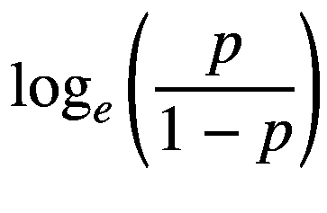

(4.1)

其中 *p* 是某个概率。对于二元和多元逻辑回归，我们可以将概率写成

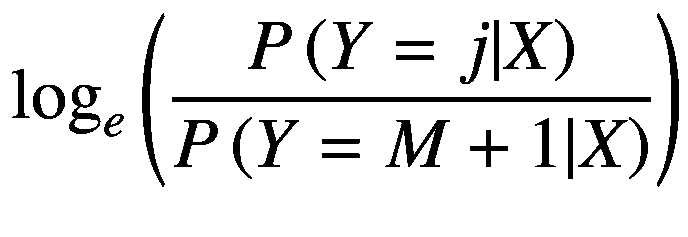

(4.2)

对于*j*1、*...，M* 这里有 *M* + 1 个离散层次的结果。在二元的情况下，有两个级别的结果， *M* = 1 和 *M* + 1 = 2，因为我们知道属于任何给定组(结果级别)的概率之和必须是 1:

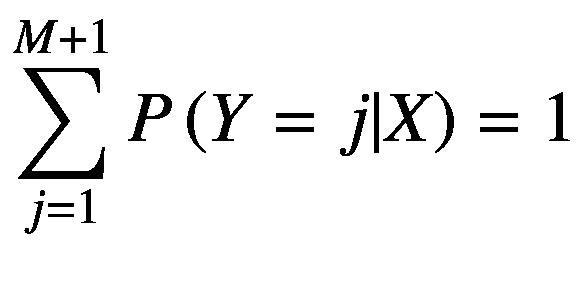

(4.3)

那么二元结果的 logit 表达式简化为

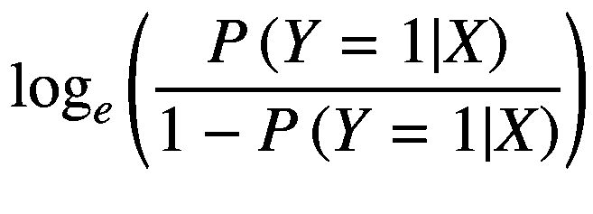

(4.4)

对于有序逻辑回归情况，标准做法是使用累积逻辑，其形式为

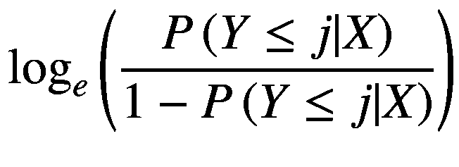

(4.5)

概率的比率被称为几率:

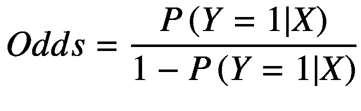

(4.6)

例如，假设给定一些预测值和模型，*P*(*Y*= 1 |*X*)= 0.75，那么

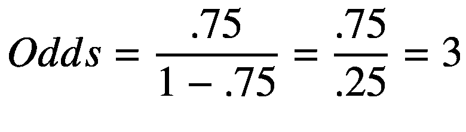

(4.7)

如果*赔率* `= 3`被解释为具有该组特定预测值的某人预期发生该事件( *Y* = 1)的可能性是不发生该事件( *Y* = 0)的三倍。logit 是概率的对数，确保至少在理论上有可能从∞到+∞。

回归系数也基于赔率。以具有单个预测器的模型的最简单情况为例， *x* <sub>1</sub> 该模型将为

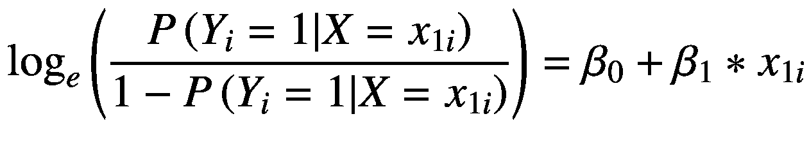

(4.8)

系数 *β* <sub>1</sub> 则定义为

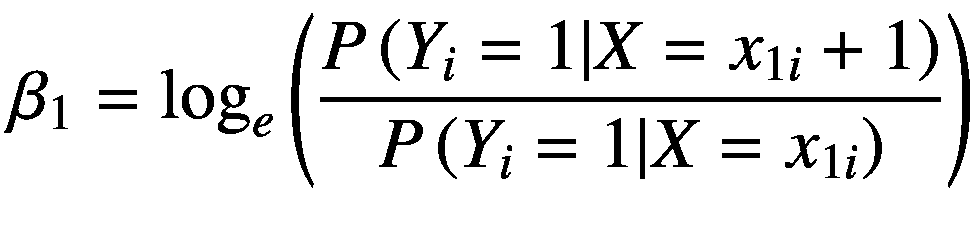

(4.9)

这是给定的赔率比的自然对数*x*<sub>*I*1</sub>vs*x*<sub>*I*1</sub>+1。通常的做法是报告比值比而不是对数比值比，这是通过对系数求幂来实现的。

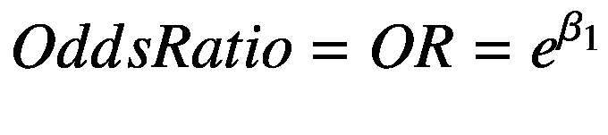

(4.10)

假设*β*T2】1= 0.5，那么*e*T6】0*。* 5 = 1.65，我们将此解释为表明 *x* <sub>1</sub> 中的一个单位变化与发生该事件的 1.65 倍几率相关。与具有相当自然的解释的优势相比，优势比在某种程度上更难解释，因为它们代表了优势的倍增变化，但没有告诉我们优势从何开始。为了说明这一点，2 的优势比同样可以从. 02/.01 和 2/1 中产生。在这两种情况下，赔率都是 2，但即使确实有人有两倍的赔率，在绝对基础上，赔率仍然很小，0.02，在另一种情况下，新的赔率表明某人发生该事件的可能性是不发生该事件的两倍。

### 计数回归

我们将在本章介绍的其他类型的 GLMs 是为计数数据设计的模型。计数数据是离散的，类似于逻辑回归中使用的结果，但与逻辑回归不同，计数结果可以采用许多值，并且是有序的。形式上，计数结果的范围是 0∞中的整数。计数结果出现在各种情况下。例如，在医疗环境中，特别是随着人口老龄化，越来越常见的是考虑共病的计数。在保险行业，建立一个人会遭遇多少次事故的模型是可取的。很多人可能是零事故，但有的会有一次，有的两次，更少的三次，四次等。在生产中，故障率和失败率很重要。如果一条生产线或一家工厂有大量不合格产品，这对于减少错误、降低成本和提高质量控制来说是非常有价值的信息。

计数数据的两种最常见的 GLMs 类型是泊松回归和负二项式回归。泊松分布只有一个参数，即比率或平均值，通常表示为 *λ* 。给定该参数，泊松的概率质量函数为

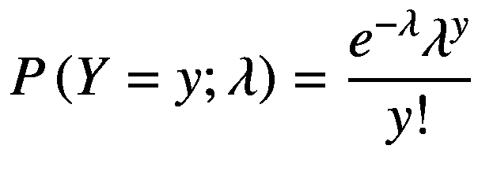

(4.11)

泊松分布的均值和方差都是 *λ* 。为了比较，这里有两个不同比率的泊松分布，如图 [4-1](#Fig1) 所示。注意，当我们有预先计算的值并且想要一个条形图时，我们使用`geom_col()`而不是`geom_bar()`。

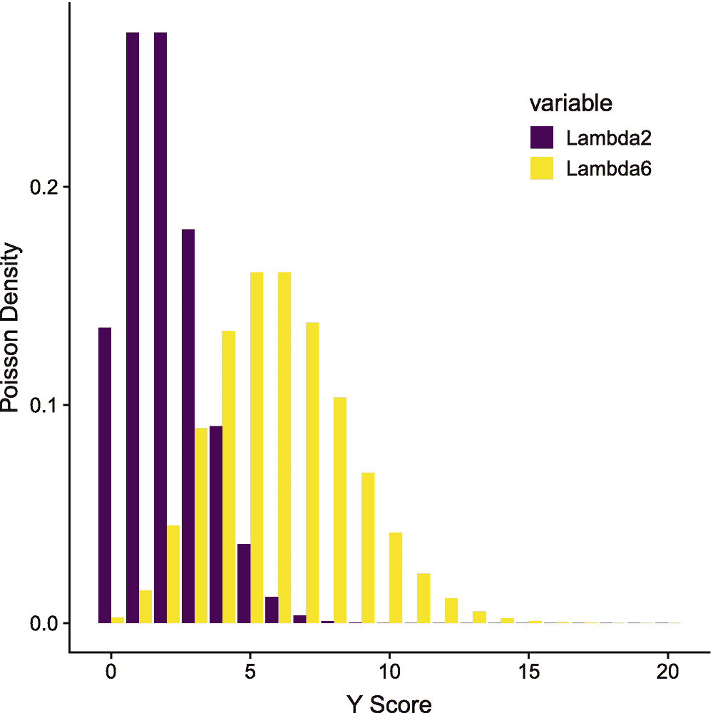

图 4-1

λ= 2 和λ= 6 的泊松分布的密度

```r
dpoisson <- data.table(X = 0:20)
dpoisson[, Lambda2 := dpois(X, lambda = 2)]
dpoisson[, Lambda6 := dpois(X, lambda = 6)]

ggplot(melt(dpoisson, id.vars = "X"),
       aes(X, value, fill = variable)) +
  geom_col(position = "dodge") +
  scale_fill_viridis(discrete = TRUE) +
  theme(legend.position = c(.7, .8)) +
  xlab("Y Score") + ylab("Poisson Density")

```

泊松回归和负二项式回归的标准关联函数都是自然对数。因此，泊松和负二项式回归的标准模型是

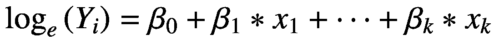

(4.12)

这给了他们的系数一个方便的解释。例如， *β* <sub>1</sub> 将是 *x* <sub>1</sub> 中的一个单位变化事件预计会发生多少次。

负二项式回归与泊松回归非常相似。唯一的变化是负二项分布包括一个额外的参数，允许方差不同于均值。负二项分布的概率质量函数比泊松分布的更复杂:

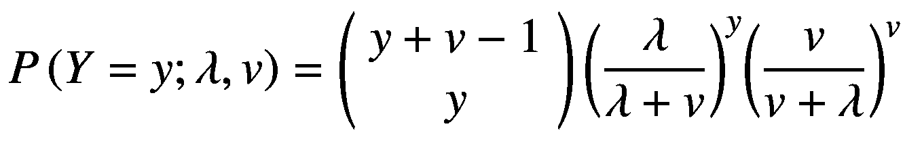

(4.13)

负二项分布的均值仍然是 *λ* 。然而，方差现在由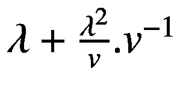给出，它被称为尺度或分散参数，有时也被称为辅助参数。随着 *v* 的增加，负二项分布变得越来越接近泊松，这样负二项 lim<sub>T6】v→∞</sub>就是泊松。

在许多应用案例中，负二项式是比泊松更好的选择，因为它只是稍微复杂一些，而且往往是更真实的数据匹配，因为泊松分布要求的均值和方差相同的假设经常被违反。

负二项式回归的解释或多或少与泊松回归相同，所以不需要额外的努力。

## 4.2 `R`示例

对于本章中的例子，我们将再次使用美国人的改变生活[45]研究数据。“简介”中标有“数据设置”的部分介绍了数据的读取和准备从技术上讲，数据具有采样权重，但为了简单起见，我们忽略这些权重。没有加权，分析仍然是正确的；它们只是不能反映抽样人口。

```r
acl <- readRDS("advancedr_acl_data.RDS")

```

### 二元逻辑回归

要尝试二元逻辑回归模型，我们需要一个二元结果变量。我们通过将吸烟状态转换为当前吸烟者与非吸烟者(以前或从不吸烟)的二元关系来实现这一点。然后，我们使用带有`family = binomialff()`和 logit 链接的`vglm()`函数来运行我们的逻辑回归模型。与其他模型一样，`summary()`函数提供了模型和系数的摘要。

```r
acl$CurSmoke <- as.integer(acl$Smoke_W1 == "(1) Cur Smok")

m.lr <- vglm(CurSmoke ~ Sex,
             family = binomialff(link = "logit"),
             data = acl, model = TRUE)
summary(m.lr)

##
## Call:
## vglm(formula = CurSmoke ~ Sex, family = binomialff(link = "logit"),
##     data = acl, model = TRUE)
##
##
## Pearson residuals:
##                Min   1Q Median  3Q Max
## logit(prob) -0.712 -0.603 -0.603 1.4 1.66
##
## Coefficients:
##               Estimate Std. Error z value Pr(>|z|)
## (Intercept)    -0.6788     0.0574  -11.82  < 2e-16 ***
## Sex(2) FEMALE  -0.3314     0.0746  -4.44   8.8e-06 ***
## ---
## Signif. codes:  0 '***' 0.001 '**' 0.01 '*' 0.05 '.' 0.1 '␣' 1
##
## Number of linear predictors: 1
##
## Name of linear predictor: logit(prob)
##
## Residual deviance: 4356 on 3615 degrees of freedom
##
## Log-likelihood: -2178 on 3615 degrees of freedom
##
## Number of iterations: 4
##
## No Hauck-Donner effect found in any of the estimates

```

在这个简单的例子中，有一个二元结果和一个二元预测值，我们可以很容易地使用频率直接计算优势比。在 2×2 频率表中，比值比是比值比，逻辑回归报告的系数是比值比的自然对数。具体来说，使用表 [4-1](#Tab1) 中所示的表格，

优势比定义为

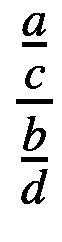

表 4-1

假设频率表

<colgroup><col class="tcol1 align-left"> <col class="tcol2 align-left"> <col class="tcol3 align-left"></colgroup> 
| 

预言者

 | 

没有烟

 | 

烟

 |
| --- | --- | --- |
| 男性的 | A | B |
| 女性的 | C | D |

对于我们的数据，实际频率表在表 [4-2](#Tab2) 中:

表 4-2

观察频率表

<colgroup><col class="tcol1 align-left"> <col class="tcol2 align-left"> <col class="tcol3 align-left"></colgroup> 
|   | 

Zero

 | 

one

 |
| --- | --- | --- |
| (1)男性 | Nine hundred and one | Four hundred and fifty-seven |
| (2)女性 | One thousand six hundred and fifty-six | Six hundred and three |

```r
or.tab <- xtabs(~ Sex + CurSmoke, data = acl)
or.tab.res <- (or.tab[1,1]/or.tab[2,1])/(or.tab[1,2]/or.tab[2,2])
xtable(or.tab, caption = "Observed frequency table",
       label = "tglm2-obsfreq")

```

由此产生的优势比可以计算为

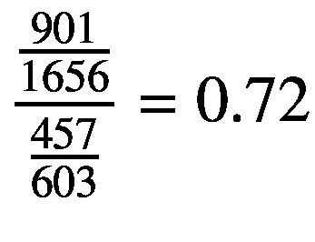

几率的自然对数是-0.33，这与我们的逻辑回归模型的系数-0.33 相同。

理解比值比是如何计算的，有助于理解如何解释它们。2 x 2 频率表中比值比的简单公式


也解释了逻辑回归的要求，即不能有任何零单元格。如果任何单元格为零，如果 *c* 、 *b* 或 *d* 为零，则结果是未定义的(除以零)，或者如果 *a* 为零，则结果正好为零，并且零的对数是负无穷大，这意味着逻辑回归的系数将是负无穷大，这也是有问题的。

尽管能够阅读方程来计算比值比或对数比值比，但对大多数人来说，这不是一个直观的值来解释。许多人发现概率尺度更容易解释。例如，我们可以找到男性和女性吸烟的概率(比例或百分比)。回到 4-1，男性吸烟概率的等式是

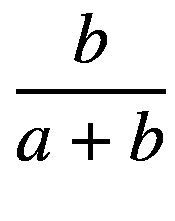

女性吸烟概率的等式是

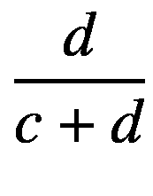

我们还可以报告两种概率的差异，以量化男性和女性吸烟的概率有多大差异。获得概率的最简单和最通用的方法是基于数据和我们的模型来预测它们。我们可以使用`predict()`函数。为了在概率尺度上而不是在对数概率尺度上获得预测，我们使用可选参数`type = "response"`，以便将结果转换回原始尺度，如图 [4-2](#Fig2) 所示。

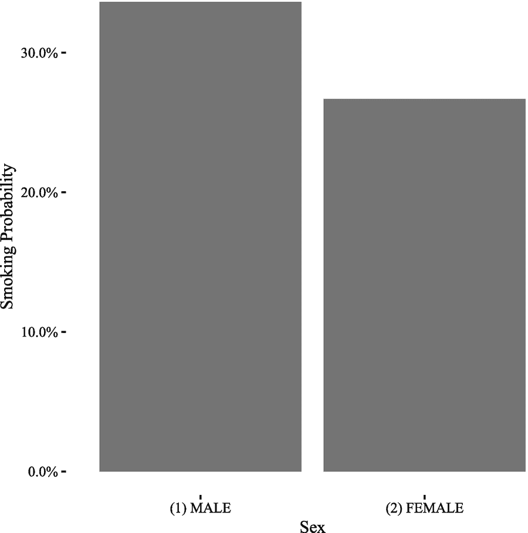

图 4-2

按性别显示吸烟概率的图表

```r
preddat <- data.table(Sex = levels(acl$Sex))
preddat$yhat <- predict(m.lr, newdata = preddat,
        type = "response")

ggplot(preddat, aes(Sex, yhat)) +
  geom_bar(stat = "identity") +
  scale_y_continuous("Smoking Probability", labels = percent) +
  theme_tufte()

```

我们可以使用`xtable`函数制作一个漂亮的结果表，结果如表 [4-3](#Tab3) 所示。

表 4-3

逻辑回归模型的总结，包括系数、标准误差和 p 值

<colgroup><col class="tcol1 align-left"> <col class="tcol2 align-left"> <col class="tcol3 align-left"> <col class="tcol4 align-left"> <col class="tcol5 align-left"></colgroup> 
|   | 

估计

 | 

Std。错误

 | 

z 值

 | 

公关（>&#124;z&#124;）

 |
| --- | --- | --- | --- | --- |
| (截取) | −0.68 | Zero point zero six | −11.82 | Zero |
| 性别(2)女性 | −0.33 | Zero point zero seven | −4.44 | Zero |

```r
xtable(coef(summary(m.lr)), digits = 2,
       caption = paste(
  "Summary of logistic regression model",
  "including coefficients, standard errors",
  "and p-values."), label = "tglm2-orsimple")

```

我们可以把这个结果解释为女性吸烟的几率比男性低 0.33 倍。我们也可以用比值比来解释这个结果。在这种情况下，我们可以说女性吸烟的几率是男性的 0.72 倍。

作为另一个例子，我们回到上一章所做的检查自我效能。一些潜在的混杂因素是性别、种族/民族和年龄。我们可以计算逆概率权重，并使用这些来调整我们的自我效能和吸烟模型。

```r
## unadjusted model
m0.lr <- vglm(CurSmoke ~ SelfEfficacy_W1,
             family = binomialff(link = "logit"),
             data = acl, model = TRUE)

## estimate IPWs
w <- ipwpoint(
  exposure = SelfEfficacy_W1,
  family = "gaussian",
  numerator = ~ 1,
  denominator = ~ 1 + Sex + RaceEthnicity + AGE_W1,
  data = acl)

## adjusted logistic regression model
m1.lr <- vglm(CurSmoke ~ SelfEfficacy_W1,
             family = binomialff(link = "logit"),
             data = acl, model = TRUE,
             weights = winsorizor(w$ipw.weights, .01))

```

然后我们可以使用`xtable()`函数制作一个表格，比较原始模型和调整后模型的估计值，如表 [4-4](#Tab4) 所示。在这种情况下，在对性别、种族和年龄进行调整后，结果实际上稍微强一些。

表 4-4

未调整(原始)和调整回归模型的比较

<colgroup><col class="tcol1 align-left"> <col class="tcol2 align-left"> <col class="tcol3 align-left"> <col class="tcol4 align-left"> <col class="tcol5 align-left"> <col class="tcol6 align-left"></colgroup> 
|   | 

类型

 | 

估计

 | 

Std。错误

 | 

z 值

 | 

公关（>&#124;z&#124;）

 |
| --- | --- | --- | --- | --- | --- |
| one | 生的 | −0.88 | Zero point zero four | −24.13 | Zero |
| Two | 生的 | −0.06 | Zero point zero three | −1.71 | Zero point zero nine |
| three | 形容词 | −0.88 | Zero point zero four | −24.12 | Zero |
| four | 形容词 | −0.08 | Zero point zero three | −2.36 | Zero point zero two |

```r
xtable(rbind(
  data.table(Type = "Raw", coef(summary(m0.lr))),
  data.table(Type = "Adj", coef(summary(m1.lr)))),
  digits = 2,
  caption = paste("Comparison of unadjusted (raw)",
    "and adjusted regression models"),
  label = "tglm2-lrcompare")

```

我们可以将结果解释为表明自我效能增加一个单位与吸烟的对数几率降低-0.08 相关。我们也可以用比值比来解释这个结果。在这种情况下，我们会说，自我效能感每增加一个单位，吸烟的几率就会增加 0.92 倍。

通常，因为比值比没有绝对的解释，所以用绝对概率来表示结果是有帮助的。我们可以再次依赖于`predict()`函数来生成特定的预测概率并绘制它们。为了做到这一点，我们可能会产生一系列自我效能值的预测。图 [4-3](#Fig3) 中的结果显示，随着自我效能感的提高，当前吸烟者的概率下降。在这种情况下，即使在概率尺度上，它也是近似线性的，因为没有概率接近 0 或 1。

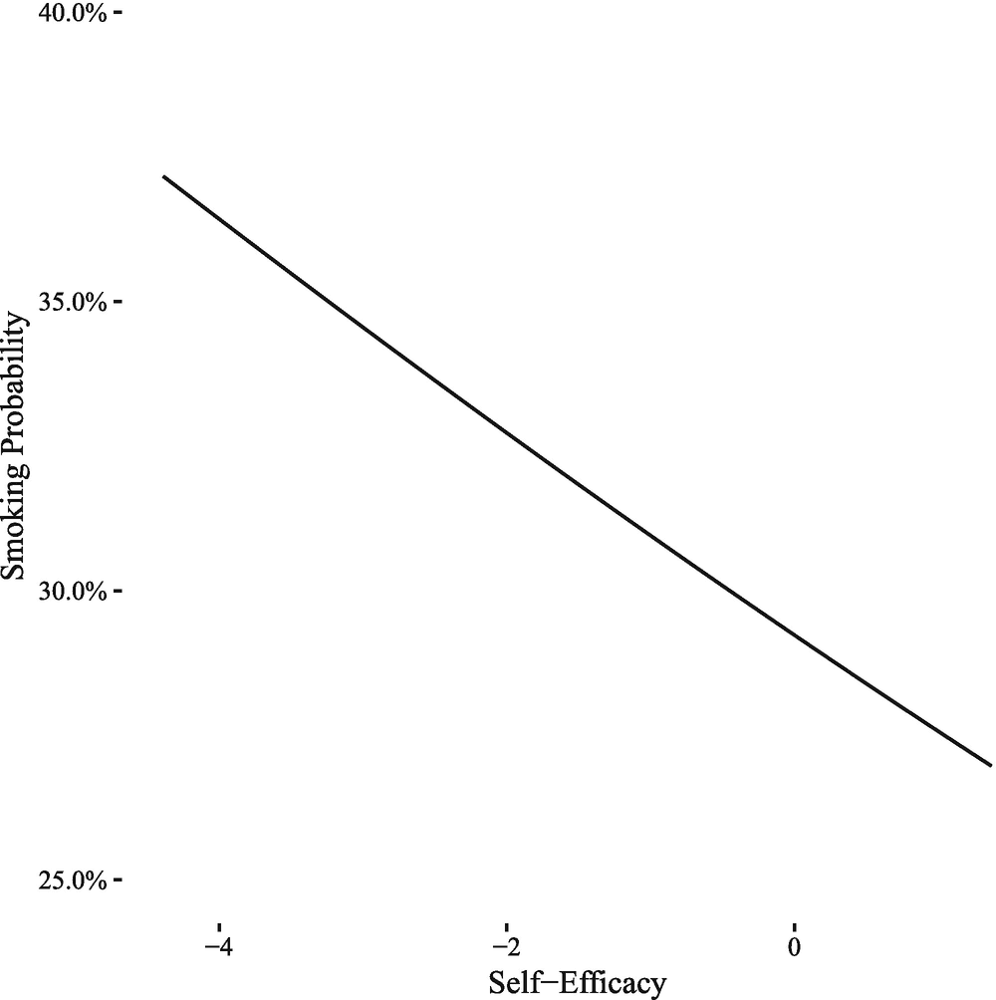

图 4-3

根据自我效能显示吸烟概率的图表

```r
preddat2 <- data.table(SelfEfficacy_W1 =
  seq(from = min(acl$SelfEfficacy_W1, na.rm = TRUE),
      to = max(acl$SelfEfficacy_W1, na.rm = TRUE),
      length.out = 1000))
preddat2$yhat <- predict(m1.lr, newdata = preddat2,
                        type = "response")

ggplot(preddat2, aes(SelfEfficacy_W1, yhat)) +
  geom_line() +
  scale_x_continuous("Self-Efficacy") +
  scale_y_continuous("Smoking Probability", label = percent) +
  theme_tufte() + coord_cartesian(ylim = c(.25, .40))

```

最后，有时人们会根据数据集计算概率的平均变化。因为在概率尺度上，结果不是线性的(尽管在图 [4-3](#Fig3) 中它们是近似线性的)，与自我效能感变化相关的概率变化取决于一个人的初始自我效能感水平。此外，如果模型中有其他变量，变化也将取决于这些其他变量。处理这个问题的一种方法是使用实际数据集生成预测概率，然后使用实际数据集，但稍微增加每个人的自我效能。在这种情况下，我们不必对人们的自我效能或其他预测分数做出任何不切实际的假设，我们使用他们的实际分数。然后我们可以找到每个人吸烟概率的预测变化，最后对所有这些进行平均，得到概率的平均边际变化。

```r
## delta value for change in self efficacy
delta <- .01

## create a copy of the dataset
## where we increase everyone's self-efficacy by delta
aclalt <- copy(acl)
aclalt$SelfEfficacy_W1 <- aclalt$SelfEfficacy_W1 + delta

## calculate predicted probabilities
p1 <- predict(m1.lr, newdata = acl, type = "response")
p2 <- predict(m1.lr, newdata = aclalt, type = "response")

## calculate the average, marginal change in probabilities
## per unit change in self efficacy
## in percents and rounded
round(mean((p2 - p1) / delta) * 100, 1)

## [1] -1.7

```

代码显示，在这个样本中，平均边际效应是这样的，自我效能增加一个单位，预计会导致当前吸烟的机会降低 1.7%。

### 有序逻辑回归

当一个结果是离散的和分类的时，有序逻辑回归是有用的，但在分类有一个自然的顺序时也是有用的。在 ACL 数据集中，身体活动分为五类，从最不活跃到最活跃。

```r
acl$PhysActCat_W2 <- factor(acl$PhysActCat_W2, ordered = TRUE)

## adjusted ordered logistic regression model
m0.or <- vglm(PhysActCat_W2 ~ SelfEfficacy_W1,
              family = propodds(),
              data = acl)

## estimate IPWs
w <- ipwpoint(
  exposure = SelfEfficacy_W1,
  family = "gaussian",
  numerator = ~ 1,
  denominator = ~ 1 + Sex + RaceEthnicity + AGE_W1,
  data = acl)

## adjusted ordered logistic regression model
m1.or <- vglm(PhysActCat_W2 ~ SelfEfficacy_W1,
             family = propodds(),
             data = acl, model = TRUE,
             weights = winsorizor(w$ipw.weights, .01))

```

在有序逻辑回归模型中，有多个截距，比结果中唯一级别的数量少一个。因为我们使用了比例优势模型，假设自我效能与结果的关联在所有水平上都是成比例的，所以自我效能只估计了一个系数。表 [4-5](#Tab5) 显示了原始模型、未调整模型和调整模型的比较。

表 4-5

未调整(原始)和调整有序逻辑回归模型的比较

<colgroup><col class="tcol1 align-left"> <col class="tcol2 align-left"> <col class="tcol3 align-left"> <col class="tcol4 align-left"> <col class="tcol5 align-left"> <col class="tcol6 align-left"> <col class="tcol7 align-left"></colgroup> 
|   | 

类型

 | 

标签

 | 

估计

 | 

Std。错误

 | 

z 值

 | 

公关（>&#124;z&#124;）

 |
| --- | --- | --- | --- | --- | --- | --- |
| one | 生的 | (截距):1 | Zero point eight | Zero point zero four | Nineteen point seven | Zero |
| Two | 生的 | (截距):2 | Zero point zero eight | Zero point zero four | Two point zero three | Zero point zero four |
| three | 生的 | (截距):3 | −1.14 | Zero point zero four | −26.11 | Zero |
| four | 生的 | (截距):4 | −1.88 | Zero point zero six | −34.20 | Zero |
| five | 生的 | 自我效能 _W1 | Zero point two two | Zero point zero three | Six point six | Zero |
| six | 形容词 | (截距):1 | Zero point seven nine | Zero point zero four | Nineteen point five six | Zero |
| seven | 形容词 | (截距):2 | Zero point zero seven | Zero point zero four | One point nine three | Zero point zero five |
| eight | 形容词 | (截距):3 | −1.14 | Zero point zero four | −26.15 | Zero |
| nine | 形容词 | (截距):4 | −1.89 | Zero point zero six | −34.22 | Zero |
| Ten | 形容词 | 自我效能 _W1 | Zero point one nine | Zero point zero three | Five point eight seven | Zero |

```r
xtable(rbind(
  data.table(Type = "Raw",
             Labels = rownames(coef(summary(m0.or))),
             coef(summary(m0.or))),
  data.table(Type = "Adj",
             Labels = rownames(coef(summary(m1.or))),
             coef(summary(m1.or)))),
  digits = 2,
  caption = paste("Comparison of unadjusted (raw) and",
   "adjusted ordered logistic regression models"),
  label = "tglm2-orcompare")

```

与二元逻辑回归一样，绘制预测概率有助于提供更直接的数据解释视图。因为有多个类别，所以我们最终得到多个概率，然后使用`melt()`函数将它们合并成一个长数据集。结果图如图 [4-4](#Fig4) 所示。我们可以看到，随着自我效能的提高，成为前四类成员的概率有适度的增加，但被成为最低类成员的概率的急剧下降所抵消。

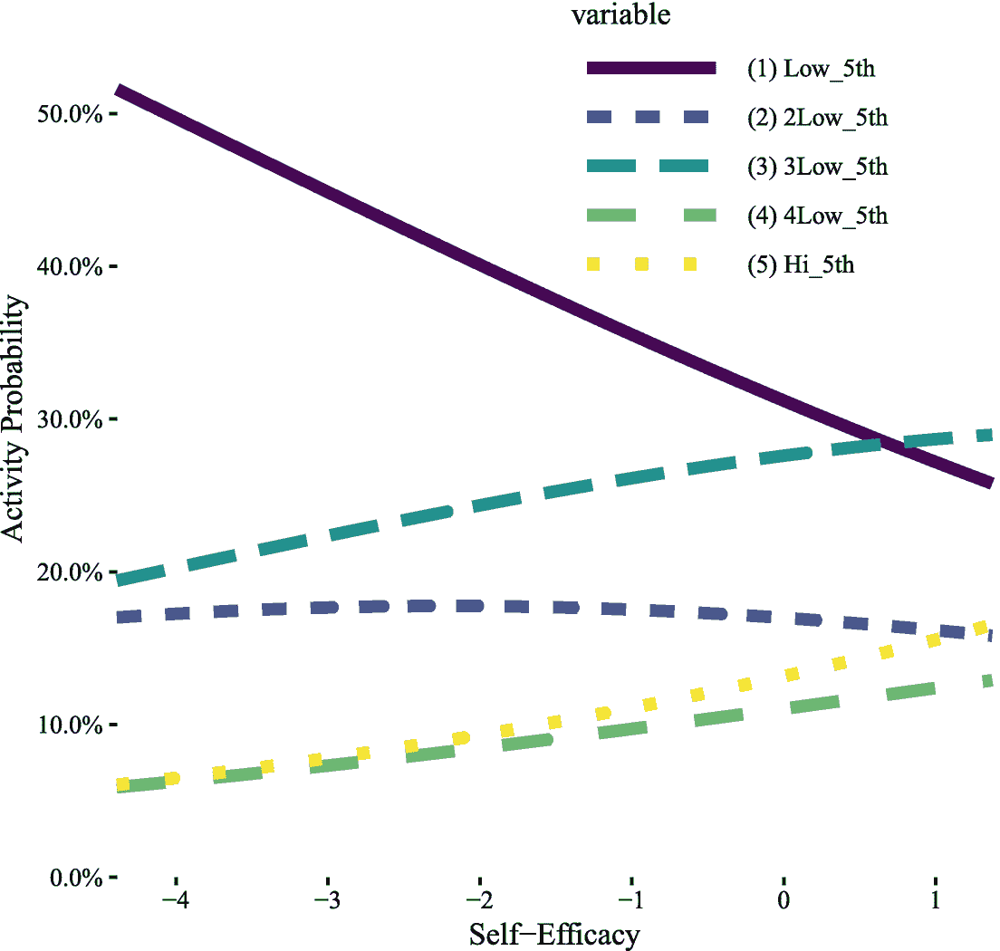

图 4-4

图表按自我效能显示不同身体活动类别的概率

```r
preddat3 <- data.table(SelfEfficacy_W1 =
  seq(from = min(acl$SelfEfficacy_W1, na.rm = TRUE),
      to = max(acl$SelfEfficacy_W1, na.rm = TRUE),
      length.out = 1000))
preddat3 <- cbind(preddat3,
  predict(m1.or, newdata = preddat3,
          type = "response"))
preddat3 <- melt(preddat3, id.vars = "SelfEfficacy_W1")

ggplot(preddat3, aes(SelfEfficacy_W1, value,
                     colour = variable, linetype = variable)) +
  geom_line(size = 2) +
  scale_color_viridis(discrete = TRUE) +
  scale_x_continuous("Self-Efficacy") +
  scale_y_continuous("Activity Probability", label = percent) +
  coord_cartesian(ylim = c(0, .6), expand = FALSE) +
  theme_tufte() +
  theme(legend.position = c(.7, .8),
        legend.key.width = unit(2, "cm"))

```

与二元逻辑回归一样，我们可以计算自我效能单位变化的预测概率的平均边际变化。对于多个类别，我们得到每个类别的平均边际变化。

```r
## delta value for change in self efficacy
delta <- .01

## create a copy of the dataset
## where we increase everyone's self-efficacy by delta
aclalt <- copy(acl)
aclalt$SelfEfficacy_W1 <- aclalt$SelfEfficacy_W1 + delta

## calculate predicted probabilities
p1 <- predict(m1.or, newdata = acl, type = "response")
p2 <- predict(m1.or, newdata = aclalt, type = "response")

## average marginal change in probability of
## membership in each category
round(colMeans((p2 - p1) / delta) * 100, 1)

## (1) Low_5th (2) 2Low_5th (3) 3Low_5th (4) 4Low_5th (5) Hi_5th
##        -4.2         -0.6          1.3          1.3        2.2

```

### 多项式逻辑回归

多项逻辑回归类似于有序逻辑回归，因为它适用于结果变量有两个以上的水平。然而，与假设比例优势的有序逻辑回归不同，多项逻辑回归模型不假设任何比例效应或水平排序。然而，这种灵活性是以大量参数和解释结果的复杂性增加为代价的。

为此，我们将查看 ACL 数据中的雇佣信息。ACL 根据员工的工作时数对他们进行编码。为简单起见，我们将把它归为一个单独的就业类别。

```r
acl[, EmployG_W2 := as.character(Employment_W2)]
acl[EmployG_W2 %in% c(
  "(2) 2500+HRS", "(3) 15002499",
  "(4) 500-1499", "(5) 1-499HRS"),
  EmployG_W2 := "(2) EMPLOYED"]
acl[, EmployG_W2 := factor(EmployG_W2)]

```

重新编码后，得到的频率表如表 [4-6](#Tab6) 所示。

表 4-6

就业频率表

<colgroup><col class="tcol1 align-left"> <col class="tcol2 align-left"> <col class="tcol3 align-left"></colgroup> 
|   | 

Var1

 | 

频率

 |
| --- | --- | --- |
| one | (1)残疾人 | One hundred and twenty-two |
| Two | (2)就业 | One thousand four hundred and seventy-six |
| three | (6)退休 | Seven hundred and twenty-four |
| four | (7)失业 | Eighty-six |
| five | (8)保持 HS | Four hundred and fifty-nine |

```r
xtable(as.data.frame(table(acl$EmployG_W2)),
       caption = "Frequency table of employment",
       label = "tglm2-freqtab")

```

接下来，我们可以像以前一样使用`vglm()`函数来估计多项式逻辑回归模型。唯一的变化是我们指定了参数`family = multinomial()`。正如我们前面的例子一样，我们可以估计未调整和调整后的模型，其中调整后的模型使用 IPWs 来解释性别、种族/民族和年龄的混杂。

```r
## unadjusted multinomial logistic regression model

m0.mr <- vglm(EmployG_W2 ~ SelfEfficacy_W1,
              family = multinomial(),
              data = acl, model = TRUE)

## estimate IPWs
w <- ipwpoint(
  exposure = SelfEfficacy_W1,
  family = "gaussian",
  numerator = ~ 1,
  denominator = ~ 1 + Sex + RaceEthnicity + AGE_W1,
  data = acl)

## adjusted multinomial logistic regression model

m1.mr <- vglm(EmployG_W2 ~ SelfEfficacy_W1,

              family = multinomial(),
             data = acl, model = TRUE,
             weights = winsorizor(w$ipw.weights, .01))

```

接下来，我们可以制作一个表格，比较未调整(原始)模型和调整模型的估计值和系数。在多项逻辑回归中，没有假设预测因子的效果在不同的结果水平上是相等的。取而代之的是，*k*–1 个独立的参数被估计用于每个预测器，其中 *k* 是结果的唯一级别的数量。考虑多项逻辑回归的另一种方式是，如果选择一个水平的结果作为参考组，那么实际上运行一系列的*k*–1 二元逻辑回归。唯一真正的变化是，还有一个约束，即属于任何一个群体的概率总和必须为 1，这反映了人们只能属于一个群体，而每个人都必须属于某个群体的现实。来自`vglm()`的系数用数字标注，这些系数基于因子等级的顺序。结果如表 [4-7](#Tab7) 所示。

表 4-7

未调整(原始)和调整的多项式逻辑回归模型的比较

<colgroup><col class="tcol1 align-left"> <col class="tcol2 align-left"> <col class="tcol3 align-left"> <col class="tcol4 align-left"> <col class="tcol5 align-left"> <col class="tcol6 align-left"> <col class="tcol7 align-left"></colgroup> 
|   | 

类型

 | 

标签

 | 

估计

 | 

Std。错误

 | 

z 值

 | 

Pr( *>* z)

 |
| --- | --- | --- | --- | --- | --- | --- |
| one | 生的 | (截距):1 | −1.44 | Zero point one one | −12.98 | Zero |
| Two | 生的 | (截距):2 | One point one eight | Zero point zero five | Twenty-one point eight three | Zero |
| three | 生的 | (截距):3 | Zero point four six | Zero point zero six | Seven point seven three | Zero |
| four | 生的 | (截距):4 | −1.72 | Zero point one two | −14.00 | Zero |
| five | 生的 | 自我效能 _W1:1 | −0.33 | Zero point zero nine | −3.70 | Zero |
| six | 生的 | 自我效能 _W1:2 | Zero point two two | Zero point zero five | Four point two eight | Zero |
| seven | 生的 | 自我效能 _W1:3 | Zero point two three | Zero point zero six | Three point nine one | Zero |
| eight | 生的 | 自我效能 _W1:4 | −0.17 | Zero point one one | −1.66 | Zero point one |
| nine | 形容词 | (截距):1 | −1.44 | Zero point one one | −13.01 | Zero |
| Ten | 形容词 | (截距):2 | One point one seven | Zero point zero five | Twenty-one point eight | Zero |
| Eleven | 形容词 | (截距):3 | Zero point four six | Zero point zero six | Seven point six five | Zero |
| Twelve | 形容词 | (截距):4 | −1.73 | Zero point one two | −14.07 | Zero |
| Thirteen | 形容词 | 自我效能 _W1:1 | −0.40 | Zero point zero nine | −4.50 | Zero |
| Fourteen | 形容词 | 自我效能 _W1:2 | Zero point one five | Zero point zero five | Two point nine six | Zero |
| Fifteen | 形容词 | 自我效能 _W1:3 | Zero point one seven | Zero point zero six | Two point eight two | Zero |
| Sixteen | 形容词 | 自我效能 _W1:4 | −0.23 | Zero point one | −2.21 | Zero point zero three |

```r
xtable(rbind(
  data.table(Type = "Raw",
             Labels = rownames(coef(summary(m0.mr))),
             coef(summary(m0.mr))),
  data.table(Type = "Adj",
             Labels = rownames(coef(summary(m1.mr))),
             coef(summary(m1.mr)))),
  digits = 2,
  caption = paste("Comparison of unadjusted (raw) and",
   "adjusted multinomial logistic regression models"),
  label = "tglm2-mrcompare")

```

我们可以画一个图来显示，在任何特定的就业类别中，预测的概率如何随着自我效能的函数而变化。结果如图 [4-5](#Fig5) 所示。这个数字告诉我们，随着自我效能的提高，人们不太可能残疾，更有可能就业或退休。它还强调了在这些模型中，随着时间的推移并不总是线性变化的。失能的可能性从自我效能的-4 到-2 迅速下降，然后在自我效能较高的时候下降得更慢。

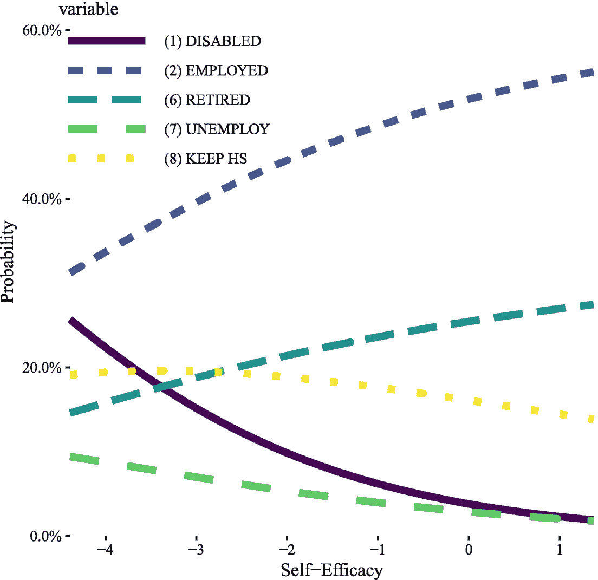

图 4-5

图表按自我效能显示不同就业类别的概率

```r
preddat4 <- data.table(SelfEfficacy_W1 =
  seq(from = min(acl$SelfEfficacy_W1, na.rm = TRUE),
      to = max(acl$SelfEfficacy_W1, na.rm = TRUE),
      length.out = 1000))
preddat4 <- cbind(preddat4,
  predict(m1.mr, newdata = preddat4,
          type = "response"))
preddat4 <- melt(preddat4, id.vars = "SelfEfficacy_W1")

ggplot(preddat4, aes(
  SelfEfficacy_W1, value,
  colour = variable, linetype = variable)) +
  geom_line(size = 2) +
  scale_color_viridis(discrete = TRUE) +
  scale_x_continuous("Self-Efficacy") +
  scale_y_continuous("Probability", label = percent) +
  coord_cartesian(ylim = c(0, .65), expand = FALSE) +
  theme_tufte() +
  theme(legend.position = c(.18, .82),
        legend.key.width = unit(2, "cm"))

```

最后，我们可以计算自我效能的单位变化的预测概率的平均边际变化。对于多个类别，我们得到每个类别的平均边际变化。这些结果表明，平均而言，自我效能感每增加一个单位，就业变化最大(平均增加 2.9%)，其次是残疾(平均减少 2.1%)，其他类别的变化较小。

```r
## delta value for change in self efficacy
delta <- .01

## create a copy of the dataset
## where we increase everyone's self-efficacy by delta
aclalt <- copy(acl)

aclalt$SelfEfficacy_W1 <- aclalt$SelfEfficacy_W1 + delta

## calculate predicted probabilities
p1 <- predict(m1.mr, newdata = acl, type = "response")
p2 <- predict(m1.mr, newdata = aclalt, type = "response")

## average marginal change in probability of
## membership in each category
round(colMeans((p2 - p1) / delta) * 100, 1)

## (1) DISABLED (2) EMPLOYED (6) RETIRED (7) UNEMPLOY (8) KEEP HS
##         -2.1          2.9         1.7         -1.0        -1.5

```

### 泊松和负二项式回归

对于计数结果，我们可以使用泊松回归。在 ACL 数据中，一个变量是过去 12 个月中经历的慢性疾病的计数。这种变量可能很适合泊松回归。

我们可能做的第一件事是查看分布，并获得一些基本的描述性统计数据。对于计数结果，平均值和标准偏差可能没有意义，因此中值和四分位间距通常是更好的总结。我们可以使用`egltable()`函数快速汇总中位数和四分位间距，如下所示。

```r
egltable(c("NChronic12_W1", "NChronic12_W2"),
         data = acl, parametric = FALSE)

##                    Mdn (IQR)
## 1: NChronic12_W1 1.00 (2.00)
## 2: NChronic12_W2 1.00 (2.00)

```

我们可以使用`ggplot()`功能来绘制每种慢性疾病的频率柱状图，以更广泛地了解每种波的分布情况。结果如图 [4-6](#Fig6) 所示。

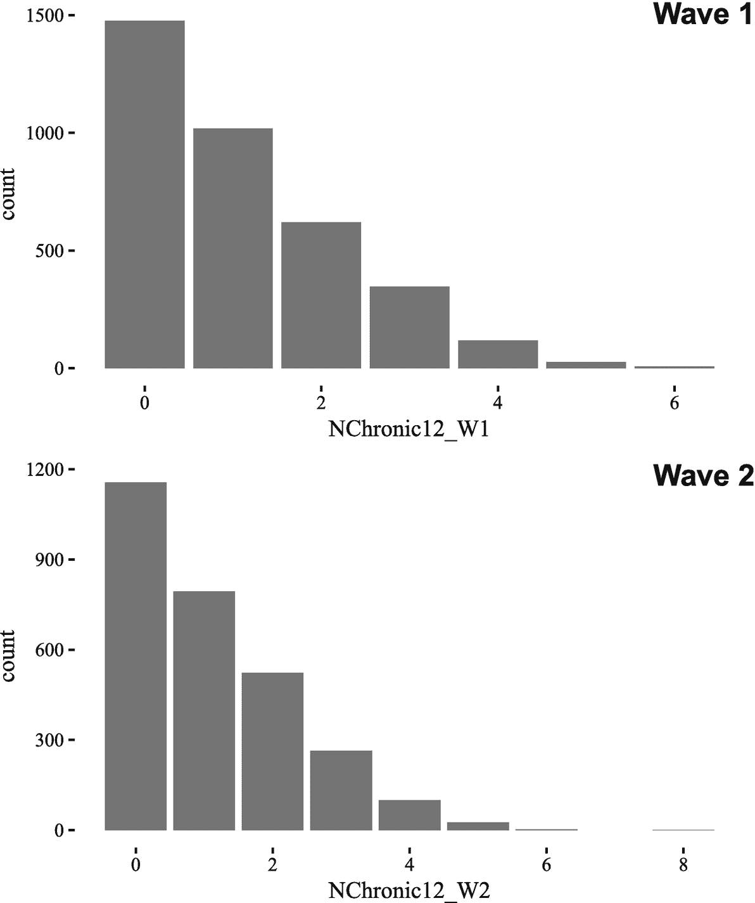

图 4-6

图表显示了 ACL 数据中每个波的各种慢性疾病的频率

```r
plot_grid(
  ggplot(acl, aes(NChronic12_W1)) +
  geom_bar() + theme_tufte(),
  ggplot(acl, aes(NChronic12_W2)) +
  geom_bar() + theme_tufte(),
  ncol = 1,
  labels = c("Wave 1", "Wave 2"),
  label_x = .8)

## Warning: Removed 750 rows containing non-finite values (stat_count).

```

接下来，我们可以使用`vglm()`函数来估计泊松回归模型。对于泊松回归，我们将族参数指定为`family = poissonff()`。对`summary()`的调用提供了模型结果和估计的快速总结。

```r
## unadjusted poisson regression model

m0.pr <- vglm(NChronic12_W2 ~ SelfEfficacy_W1,
              family = poissonff(),
              data = acl, model = TRUE)

summary(m0.pr)

##
## Call:
## vglm(formula = NChronic12_W2 ~ SelfEfficacy_W1, family = poissonff(),
##     data = acl, model = TRUE)
##
##
## Pearson residuals:
##                Min    1Q Median    3Q  Max
## loge(lambda) -1.34 -1.01 -0.117 0.811 5.67
##
## Coefficients:
##                 Estimate Std. Error z value Pr(>|z|)
## (Intercept)       0.0954     0.0179    5.33  9.8e-08 ***
## SelfEfficacy_W1  -0.1347     0.0165   -8.16  3.3e-16 ***
## ---
## Signif. codes:  0 '***' 0.001 '**' 0.01 '*' 0.05 '.' 0.1 '␣' 1
##
## Number of linear predictors: 1
##
## Name of linear predictor: loge(lambda)
##
## Residual deviance: 4075 on 2865 degrees of freedom
##
## Log-likelihood: -4126 on 2865 degrees of freedom
##
## Number of iterations: 5
##
## No Hauck-Donner effect found in any of the estimates

```

但是，在继续之前，最好检查一下泊松回归模型的假设是否合理。也就是说，经常会出现过度离差，方差与均值相同的假设被违反。要检验这一假设，最简单的方法是也拟合负二项式回归模型，然后比较两个模型的相对拟合度，以确定负二项式是否提高了拟合度。

为了比较泊松和负二项式结果，我们首先需要拟合负二项式回归模型。唯一需要的改变是将`family = poissonff()`改为`family = negbinomial()`。然后，我们可以使用`AIC()`和`BIC`返回基于模型似然性的 Akaike 信息标准(AIC)和贝叶斯信息标准(BIC ),这些标准因参数数量而受到惩罚。较低的 AIC 和 BIC 分数表明更好的拟合，即使在考虑模型的复杂性之后。使用 AIC 和 BIC 比使用简单的模型拟合度量更可取，因为通常更复杂的模型提供更好的拟合。我们想知道的是，合身性的提高是否值得增加复杂性；因此，一些参数的惩罚项是需要的，AIC 和 BIC 都包括。

比较 AIC 和 BIC 发现，负二项式回归模型具有较低的 AIC 和较低的 BIC，表明对于这些数据，负二项式模型优于泊松模型。

```r
## unadjusted negative binomial regression model
m0.nbr <- vglm(NChronic12_W2 ~ SelfEfficacy_W1,
              family = negbinomial(),
              data = acl, model = TRUE)

AIC(m0.nbr) - AIC(m0.pr)

## [1] -97

BIC(m0.nbr) - BIC(m0.pr)

## [1] -91

```

另一个有用的健全性检查是检查模型的模拟值是否与真实的观察数据一致。我们可以使用内置在`VGAM`包中的`simulate()`函数轻松实现这一点。它只需要一个模型，但我们也可以指定要生成的模拟的数量，我们只需要一个，并设置随机种子，这样结果是可重复的。接下来，我们使用真实结果分数、泊松模拟和负二项式模型模拟构建一个数据集。最后，我们将所有这些绘制在图 [4-7](#Fig7) 中。该图告诉我们，我们的两个模型都不能完美地再现真实的分布。然而，我们也可以看到，负二项式模型的模拟比泊松模型的模拟更接近事实。如图 [4-7](#Fig7) 所示的曲线图对于比较模型和评估模型是否是观测数据的合理近似非常有用。有时候“最好”的模型可能仍然是一个糟糕的模型，我们想要提前知道。

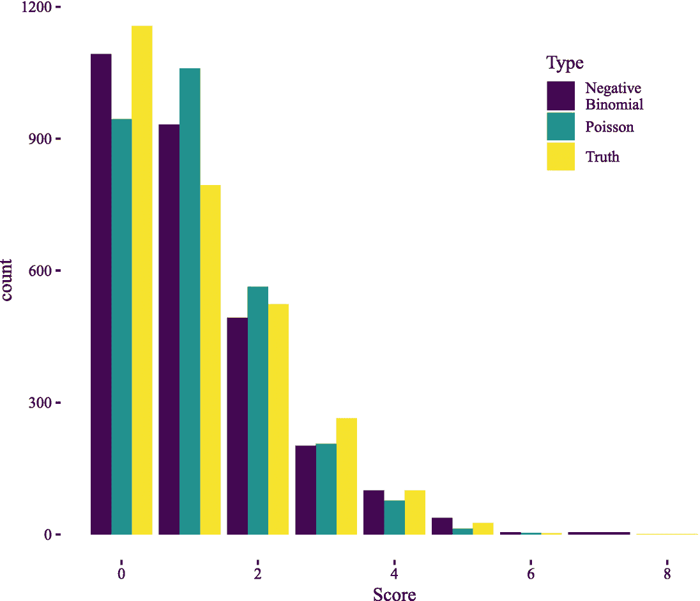

图 4-7

图表显示了基于真实数据、负二项式模型模拟和泊松回归模型模拟的各种慢性疾病的频率。

```r
test.pr <- simulate(m0.pr, nsim = 1, seed = 1234)$sim_1
test.nbr <- simulate(m0.nbr, nsim = 1, seed = 1234)$sim_1
test.all <- data.table(
  Type = rep(c("Truth", "Poisson", "Negative\nBinomial"),
             times = c(
               nrow(model.frame(m0.pr)),
               length(test.pr),
               length(test.nbr))),
  Score = c(
    model.frame(m0.pr)$NChronic12_W2,
    test.pr,
    test.nbr))

ggplot(test.all, aes(Score, fill = Type)) +
  geom_bar(position = "dodge") +
  scale_fill_viridis(discrete = TRUE) +
  theme_tufte() +
  theme(legend.position = c(.8, .8))

```

在这一点上，通过比较 AIC 和 BIC 的得分，以及通过可视化泊松和负二项式回归模型的模拟值，很明显我们应该继续使用负二项式模型。如果我们想比较未调整和调整后的结果，我们可以计算 IPWs 并使用这些来估计调整后的模型，考虑性别、种族/民族和年龄的影响。

```r
## estimate IPWs
w <- ipwpoint(
  exposure = SelfEfficacy_W1,
  family = "gaussian",
  numerator = ~ 1,
  denominator = ~ 1 + Sex + RaceEthnicity + AGE_W1,
  data = acl)

## adjusted negative binomial regression model
m1.nbr <- vglm(NChronic12_W2 ~ SelfEfficacy_W1,
              family = negbinomial(),
             data = acl, model = TRUE,
             weights = winsorizor(w$ipw.weights, .01))

```

接下来，我们可以制作一个表格，比较未调整(原始)模型和调整模型的估计值和系数。负二项式回归模型包括两个截距，一个是位置截距，称为 *μ* ，另一个是过度分散参数截距，称为大小参数。对于慢性病平均数的模型，只有第一个截距是相关的。结果如表 [4-8](#Tab8) 所示。

表 4-8

未经调整(原始)和经过调整的负二项式回归模型的比较

<colgroup><col class="tcol1 align-left"> <col class="tcol2 align-left"> <col class="tcol3 align-left"> <col class="tcol4 align-left"> <col class="tcol5 align-left"> <col class="tcol6 align-left"> <col class="tcol7 align-left"></colgroup> 
|   | 

类型

 | 

标签

 | 

估计

 | 

Std。错误

 | 

z 值

 | 

公关（>&#124;z&#124;）

 |
| --- | --- | --- | --- | --- | --- | --- |
| one | 生的 | (截距):1 | Zero point one | Zero point zero two | Four point six five | Zero |
| Two | 生的 | (截距):2 | One point two three | Zero point one two | Ten point four one | Zero |
| three | 生的 | 自我效能 _W1 | −0.13 | Zero point zero two | −6.98 | Zero |
| four | 形容词 | (截距):1 | Zero point one | Zero point zero two | Four point seven three | Zero |
| five | 形容词 | (截距):2 | One point two three | Zero point one two | Ten point four one | Zero |
| six | 形容词 | 自我效能 _W1 | −0.13 | Zero point zero two | −6.69 | Zero |

```r
xtable(rbind(
  data.table(Type = "Raw",
             Labels = rownames(coef(summary(m0.nbr))),
             coef(summary(m0.nbr))),
  data.table(Type = "Adj",
             Labels = rownames(coef(summary(m1.nbr))),
             coef(summary(m1.nbr)))),
  digits = 2,
  caption = paste("Comparison of unadjusted (raw) and",
   "adjusted negative binomial regression models"),
  label = "tglm2-nbrcompare")

```

因为泊松和负二项式回归模型都使用自然对数关联函数，所以系数是对数尺度的。如果我们查看表 [4-8](#Tab8) 中未调整的结果，自我效能系数表明，自我效能增加一个单位与慢性疾病数量变化-0.13 个对数单位相关。或者，我们可以指数化该系数，在这种情况下，解释是自我效能增加一个单位与 0.87 倍的慢性疾病相关。

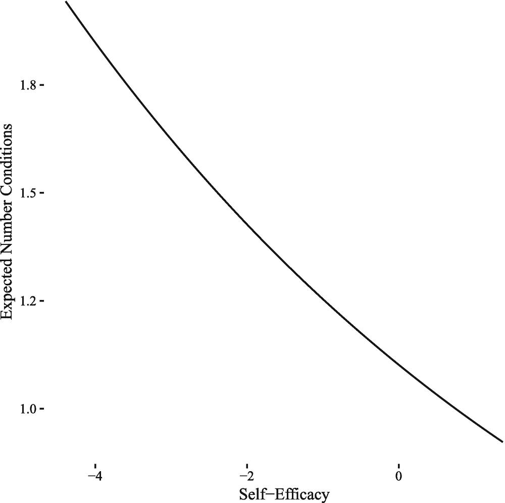

图 4-8

图表显示慢性疾病的预测数量作为自我效能的函数

如果我们愿意，我们也可以将预测的平均条件数绘制成自我效能的函数。当生成预测时，与逻辑回归一样，我们指定`type = "response"`来表示我们希望在原始尺度上进行预测，而不是在链接尺度上，这里是对数变换尺度。结果如图 [4-8](#Fig8) 所示。这个数字向我们表明，随着自我效能的提高，平均而言，人们预期会有更少的慢性疾病。

```r
preddat5 <- data.table(SelfEfficacy_W1 =
  seq(from = min(acl$SelfEfficacy_W1, na.rm = TRUE),
      to = max(acl$SelfEfficacy_W1, na.rm = TRUE),
      length.out = 1000))
preddat5$yhat <- predict(m1.nbr, newdata = preddat5,
          type = "response")

ggplot(preddat5, aes(SelfEfficacy_W1, yhat)) +
  geom_line() +
  scale_x_continuous("Self-Efficacy") +
  scale_y_continuous("Expected Number Conditions") +
  theme_tufte()

```

## 4.3 案例研究:多项逻辑回归

默认情况下，在多项逻辑回归中，参数(例如，优势比)是相对于参照组计算的。虽然这足以说明模型，但在实践中应用多项逻辑回归来考虑所有(或至少关键的)组间成对比较是常见的[14，87]。例如，仅仅知道 B 组和 C 组与 A 组显著不同并不能告诉你 B 组和 C 组是否彼此不同。

同时评估几个预测因子的影响也很常见(例如[14，87])，这需要与评估单个预测因子稍有不同的处理。在本案例研究中，我们将构建一个从提问到最终呈现结果和解释的完整示例。

ACL 数据集包括第一波和第二波的吸烟状态。除了观察一波的吸烟状况，一个有趣的问题是谁随着时间的推移改变了(开始或停止)吸烟，以及哪些因素可能预测这种变化。首先，我们需要为吸烟创造一个新的变量，表明随着时间的变化或稳定。我们如下进行重新编码。结果频率表如表 [4-9](#Tab9) 所示。

表 4-9

一段时间内吸烟频率表

<colgroup><col class="tcol1 align-left"> <col class="tcol2 align-left"> <col class="tcol3 align-left"></colgroup> 
|   | 

Var1

 | 

频率

 |
| --- | --- | --- |
| one | 稳定从不吸烟 | One thousand two hundred and ninety-two |
| Two | 稳定的前吸烟者 | Seven hundred and five |
| three | 稳定电流吸烟者 | Six hundred and forty-one |
| four | 最近戒烟 | One hundred and sixty-seven |
| five | 新烟民 | Sixty-two |

```r
acl[, Smoke_W2W1 := NA_character_]
acl[Smoke_W1 == "(3) Nevr Smo" &
    Smoke_W2 == "(3) W2 Never Smoker",
    Smoke_W2W1 := "Stable Never Smoker"]
acl[Smoke_W1 == "(2) Past Smo" &
    Smoke_W2 == "(2) W2 Former Smoker",
    Smoke_W2W1 := "Stable Former Smoker"]
acl[Smoke_W1 == "(1) Cur Smok" &
    Smoke_W2 == "(1) W2 Current Smoker",
    Smoke_W2W1 := "Stable Current Smoker"]
acl[Smoke_W1 %in% c("(2) Past Smo", "(3) Nevr Smo") &
    Smoke_W2 == "(1) W2 Current Smoker",
    Smoke_W2W1 := "New Smoker"]
acl[Smoke_W1 == "(1) Cur Smok" &
    Smoke_W2 == "(2) W2 Former Smoker",
    Smoke_W2W1 := "Recently Quit Smoker"]

acl[, Smoke_W2W1 := factor(Smoke_W2W1,
  levels = c("Stable Never Smoker", "Stable Former Smoker",
             "Stable Current Smoker", "Recently Quit Smoker",
             "New Smoker"))]

xtable(as.data.frame(table(acl$Smoke_W2W1)),
       caption = "Frequency table of smoking over time",
       label = "tglm2-freqtab-smoke")

```

在本章的前面，我们只关注了一个预测因子。在现实环境中，我们可能对几个潜在的预测因素感兴趣。一个有趣的问题是，随着时间的推移，社会人口统计学、心理社会或健康类型变量是否是吸烟的更好预测因素。我们将像之前一样使用`vglm()`函数和`family = multinomial()`来估计模型，以获得多项式结果。

```r
acl[, SES := as.numeric(SESCategory)]

mr.ses <- vglm(Smoke_W2W1 ~ Sex + SES + AGE_W1,
  family = multinomial(),
  data = acl, model = TRUE)

mr.psych <- vglm(Smoke_W2W1 ~ SWL_W1 + InformalSI_W1 +
  FormalSI_W1 + SelfEfficacy_W1 + CESD11_W1,
  family = multinomial(),
  data = acl, model = TRUE)

mr.health <- vglm(Smoke_W2W1 ~ PhysActCat_W1 +
  BMI_W1 + NChronic12_W1,
  family = multinomial(),
  data = acl, model = TRUE)

```

我们可以比较每个模型的相对性能，使用 AIC 和 BIC 来惩罚复杂性，如表 [4-10](#Tab10) 所示。结果表明，社会人口因素是吸烟状况和随时间变化的最佳预测因素。

表 4-10

模型比较

<colgroup><col class="tcol1 align-left"> <col class="tcol2 align-left"> <col class="tcol3 align-left"> <col class="tcol4 align-left"></colgroup> 
|   | 

模型

 | 

美国化学师学会(American Institute of Chemists)

 | 

比克

 |
| --- | --- | --- | --- |
| one | 社会人口统计 | Seven thousand and fifty-six point three four | Seven thousand one hundred and fifty-one point seven two |
| Two | 社会心理的 | Seven thousand two hundred and three point seven three | Seven thousand three hundred and forty-six point seven nine |
| three | 健康 | Seven thousand three hundred and forty point five four | Seven thousand five hundred and seven point four five |

```r
xtable(
  data.table(
  Model = c("Sociodemographics", "Psychosocial", "Health"),
  AIC = c(AIC(mr.ses), AIC(mr.psych), AIC(mr.health)),
  BIC = c(BIC(mr.ses), BIC(mr.psych), BIC(mr.health))),
  caption = "Model Comparisons",
  label = "tglm2-modelcomparisons")

```

我们可以使用`summary()`函数检查社会人口统计模型中的各个系数。然而，默认情况下，这些只是与参考水平的比较，默认情况下，`VGAM`包中的参考水平是最后一个水平，对我们来说是“新烟民”

```r
summary(mr.ses)

##
## Call:
## vglm(formula = Smoke_W2W1 ~ Sex + SES + AGE_W1, family = multinomial(), ##     data = acl, model = TRUE)
##
##
## Pearson residuals:
##                      Min     1Q Median    3Q  Max
## log(mu[,1]/mu[,5]) -7.39 -0.744 -0.412 0.811 1.97
## log(mu[,2]/mu[,5]) -6.95 -0.441 -0.306 -0.186 2.98
## log(mu[,3]/mu[,5]) -6.33 -0.420 -0.289 -0.184 3.58
## log(mu[,4]/mu[,5]) -5.88 -0.202 -0.155 -0.118 4.82
##
## Coefficients:
##                 Estimate Std. Error z value Pr(>|z|)
## (Intercept):1   -0.79722    0.61458   -1.30  0.19457
## (Intercept):2   -1.16638    0.62965   -1.85  0.06397 .
## (Intercept):3    1.41356    0.61771    2.29  0.02212 *
## (Intercept):4   -1.18639    0.70648   -1.68  0.09309 .
## Sex(2) FEMALE:1  0.76073    0.27200    2.80  0.00516 **
## Sex(2) FEMALE:2 -0.46076    0.27545   -1.67  0.09437 .
## Sex(2) FEMALE:3 -0.04184    0.27459   -0.15  0.87888
## Sex(2) FEMALE:4  0.02589    0.30782    0.08  0.93297
## SES:1            0.51292    0.14821    3.46  0.00054 ***
## SES:2            0.50412    0.15079    3.34  0.00083 ***
## SES:3            0.20550    0.15032    1.37  0.17159
## SES:4            0.39726    0.16691    2.38  0.01731 *
## AGE_W1:1         0.04439    0.00858    5.18  2.3e-07 ***
## AGE_W1:2         0.05430    0.00877    6.19  5.9e-10 ***
## AGE_W1:3         0.01111    0.00871    1.28  0.20181
## AGE_W1:4         0.02732    0.00971    2.82  0.00487 **
## ---
## Signif. codes:  0 '***' 0.001 '**' 0.01 '*' 0.05 '.' 0.1 '␣' 1
##
## Number of linear predictors:  4
##
## Names of linear predictors:
## log(mu[,1]/mu[,5]), log(mu[,2]/mu[,5]), log(mu[,3]/mu[,5]), log(mu[,4]/mu[,5])
##
## Residual deviance: 7024 on 11452 degrees of freedom
##
## Log-likelihood: -3512 on 11452 degrees of freedom
##
## Number of iterations: 6
##
## No Hauck-Donner effect found in any of the estimates
##
## Reference group is level 5 of the response

```

在观察这些结果时，我们可以注意到的另一件事是，尽管它在统计上是显著的，但年龄的系数相当小，因为年龄的 1 岁变化是相对较小的变化。我们可以考虑将年龄转换成十岁，这样一个单位的差异更有意义。

```r
acl[, AGE_W1 := AGE_W1 / 10]

```

如果我们想要明确地导出其他类别之间的对比，我们可以更改参考级别。这可以作为`multinomial()`函数的选项参数来完成。例如，设置`refLevel = 1`将使第一个类别成为参考，在我们的例子中是“稳定的从不吸烟者”我们也可以重新运行“稳定的前吸烟者”级别 2 和“稳定的当前吸烟者”级别 3。请注意，从数学上讲，所有这些模型都是相同的，不同的是结果中的默认比较。当重新运行时，我们不需要重新指定整个模型，我们可以使用`update()`功能简单地更新一个现有的模型。

```r
mr.ses1 <- vglm(Smoke_W2W1 ~ Sex + SES + AGE_W1,
              family = multinomial(refLevel = 1),
              data = acl, model = TRUE)
mr.ses2 <- update(mr.ses1,
                  family = multinomial(refLevel = 2))
mr.ses3 <- update(mr.ses1,
                  family = multinomial(refLevel = 3))

```

接下来，通常报告比值比而不是对数比值，这是默认输出。报告置信区间也很常见，我们可以使用`confint()`函数来计算置信区间。我们可以通过组合系数和置信区间来创建一个结果表，在对它们求幂之后，我们就有了比值比和比值比的置信区间。

例如，如果我们观察参照组为“稳定的从不吸烟者”时`AGE_W1:1`的比值比，它告诉我们，年龄增加 10 岁，成为“稳定的前吸烟者”的几率是“稳定的从不吸烟者”的 1.1 倍

如果我们观察参照组是“稳定的从不吸烟者”时`AGE_W1:2`的比值比，它告诉我们，年龄增加 10 岁，成为“稳定的当前吸烟者”的几率是“稳定的从不吸烟者”的 0.72 倍

相比之下，如果我们观察参照组是“稳定的当前吸烟者”时`AGE_W1:2`的比值比，它告诉我们，年龄增加 10 岁，是“稳定的前吸烟者”成为“稳定的当前吸烟者”的 1.54 倍

最后，如果我们观察参照组是“稳定的当前吸烟者”时`AGE_W1:3`的比值比，它告诉我们年龄增加 10 岁与“最近戒烟者”是“稳定的当前吸烟者”的 1.18 倍相关

```r
data.table(
  Ref = "Stable Never Smoker",
  Term = names(coef(mr.ses1)),
  OR = exp(coef(mr.ses1)),
  exp(confint(mr.ses1)))

##                    Ref            Term   OR 2.5 % 97.5 %
## 1: Stable Never Smoker   (Intercept):1 0.69  0.42   1.15
## 2: Stable Never Smoker   (Intercept):2 9.12  5.55  14.98
## 3: Stable Never Smoker   (Intercept):3 0.68  0.30   1.54
## 4: Stable Never Smoker   (Intercept):4 2.22  0.67   7.40
## 5: Stable Never Smoker Sex(2) FEMALE:1 0.29  0.24   0.36
## 6: Stable Never Smoker Sex(2) FEMALE:2 0.45  0.36   0.55
## 7: Stable Never Smoker Sex(2) FEMALE:3 0.48  0.34   0.67
## 8: Stable Never Smoker Sex(2) FEMALE:4 0.47  0.27   0.80
## 9: Stable Never Smoker           SES:1 0.99  0.90   1.10
## 10: Stable Never Smoker          SES:2 0.74  0.66   0.82
## 11: Stable Never Smoker          SES:3 0.89  0.75   1.06
## 12: Stable Never Smoker          SES:4 0.60  0.45   0.80
## 13: Stable Never Smoker       AGE_W1:1 1.10  1.04   1.17
## 14: Stable Never Smoker       AGE_W1:2 0.72  0.67   0.76
## 15: Stable Never Smoker       AGE_W1:3 0.84  0.76   0.94
## 16: Stable Never Smoker       AGE_W1:4 0.64  0.54   0.76

data.table(
  Ref = "Stable Current Smoker",
  Term = names(coef(mr.ses3)),
  OR = exp(coef(mr.ses3)),
  exp(confint(mr.ses3)))

##                      Ref            Term    OR  2.5 % 97.5 %
## 1: Stable Current Smoker   (Intercept):1 0.110  0.067  0.18
## 2: Stable Current Smoker   (Intercept):2 0.076  0.043  0.13
## 3: Stable Current Smoker   (Intercept):3 0.074  0.032  0.17
## 4: Stable Current Smoker   (Intercept):4 0.243  0.072  0.82
## 5: Stable Current Smoker Sex(2) FEMALE:1 2.231  1.811  2.75
## 6: Stable Current Smoker Sex(2) FEMALE:2 0.658  0.525  0.82
## 7: Stable Current Smoker Sex(2) FEMALE:3 1.070  0.752  1.52
## 8: Stable Current Smoker Sex(2) FEMALE:4 1.043  0.609  1.79
## 9: Stable Current Smoker           SES:1 1.360  1.221  1.51
## 10: Stable Current Smoker          SES:2 1.348  1.195  1.52
## 11: Stable Current Smoker          SES:3 1.211  1.006  1.46
## 12: Stable Current Smoker          SES:4 0.814  0.606  1.09
## 13: Stable Current Smoker       AGE_W1:1 1.395  1.309  1.49
## 14: Stable Current Smoker       AGE_W1:2 1.540  1.432  1.66
## 15: Stable Current Smoker       AGE_W1:3 1.176  1.054  1.31
## 16: Stable Current Smoker       AGE_W1:4 0.895  0.754  1.06

```

呈现结果的另一种方式是计算预测概率。然而，当有多个预测因子时，这就变得更复杂了，因为我们把其他预测因子放在哪里会影响结果。相反，对于多个预测因子，计算平均边际概率可能是最明智的，它将预测因子保持在它们的观察值，并且一次改变一个预测因子。

```r
## delta value for change in age and SES
delta <- .01

## create a copy of the dataset
## where we increase everyone's age by delta
aclage <- copy(acl)
aclage[, AGE_W1 := AGE_W1 + delta]

## create a copy of the dataset
## where we increase everyone's SES by delta
aclses <- copy(acl)
aclses[, SES := SES + delta]

## create two copies of the data
## one where we set everyone to "female" and another to "male"
aclfemale <- copy(acl)
aclfemale[, Sex := factor("(2) FEMALE",
                          levels = levels(acl$Sex))]

aclmale <- copy(acl)
aclmale[, Sex := factor("(1) MALE",
                        levels = levels(acl$Sex))]

## calculate predicted probabilities
p.ref <- predict(mr.ses1, newdata = acl,
                 type = "response")
p.age <- predict(mr.ses1, newdata = aclage,
                 type = "response")
p.ses <- predict(mr.ses1, newdata = aclses,
                 type = "response")
p.female <- predict(mr.ses1, newdata = aclfemale,
                    type = "response")
p.male <- predict(mr.ses1, newdata = aclmale,
                    type = "response")

```

最后，我们可以计算预测概率的所有平均边际变化，并将它们放在一个表格中，以便于展示。最终结果如表 [4-11](#Tab11) 所示。这突出了性的强大影响，女性更有可能是稳定的从不吸烟者。我们还可以看到年龄较大和社会经济地位较高如何与成为稳定的当前吸烟者的概率降低约 5%相关联。

表 4-11

预测概率的平均边际变化

<colgroup><col class="tcol1 align-left"> <col class="tcol2 align-left"> <col class="tcol3 align-left"> <col class="tcol4 align-left"> <col class="tcol5 align-left"></colgroup> 
|   | 

水平

 | 

年龄

 | 

(美)工程科学学会(Society of Engineering Science)

 | 

女性的

 |
| --- | --- | --- | --- | --- |
| one | 稳定从不吸烟 | Two point eight three | Three point six six | Twenty-three point three four |
| Two | 稳定的前吸烟者 | Three point nine four | One point eight five | −16.96 |
| three | 稳定电流吸烟者 | −5.46 | −4.52 | −5.06 |
| four | 最近戒烟 | −0.55 | −0.12 | −0.93 |
| five | 新烟民 | −0.76 | −0.87 | −0.39 |

```r
xtable(
data.table(
  Level = colnames(p.ref),
  Age = colMeans((p.age - p.ref) / delta) * 100,
  SES = colMeans((p.ses - p.ref) / delta) * 100,
  Female = colMeans(p.female - p.male) * 100),
  digits = 2,
  caption = "Average marginal change in predicted probability",
  label = "tglm2-margprobs")

```

虽然这需要一些额外的工作，但创建这样一个表来显示关键预测者的预测概率的平均边际变化，是一种非常有用的方式，可以用比优势比更直观的格式呈现结果。结合优势比和置信区间来估计不确定性，这提供了一个相对全面的结果介绍。

## 4.4 总结

本章展示了如何使用广义线性模型(GLMs)来构建离散结果的回归模型，包括二分结果、有序和无序分类结果，以及事件计数或数量结果。虽然这些结果是 GLMs 的一些最常见的用途，但 GLMs 可以适应许多其他类型的结果变量和许多其他分布，而不是这里介绍的分布。优秀的`VGAM`包支持常见和不常见的分布类型，因此如果您的数据看起来不是正态分布，也不是本章介绍的任何分布，很可能仍然可以使用不同分布的`vglm()`进行建模。关于`VGAM`软件包特性的更多细节和报道，请参阅其作者的书。

本章还介绍了一些工具和函数，通过生成预测或在更直接可解释的尺度(如概率)上获得效果来帮助我们解释 GLMs。虽然这样的代码严格来说不是 GLMs 的一部分，但它通常可以使结果更清晰，并帮助分析师和读者理解模型的含义。表 [4-12](#Tab12) 总结了引入的主要功能及其作用。

表 4-12

本章中描述的关键功能列表及其功能摘要

<colgroup><col class="tcol1 align-left"> <col class="tcol2 align-left"></colgroup> 
| 

功能

 | 

它的作用

 |
| --- | --- |
| `vglm()` | 灵活的函数通过“系列”函数拟合多种类型的特定广义线性模型，提供数百种分布和链接函数组合。 |
| `binomialff()` | VGAM 家族函数将 GLMs 拟合到二项式、离散/分类结果(如吸烟或不吸烟)。 |
| `propodds()` | VGAM 家族函数将 GLMs 拟合到有序、离散/分类结果(例如，身体活动水平)。 |
| `multinomial()` | VGAM 家族函数将 GLMs 拟合到离散/分类结果，没有任何内在顺序的假设(例如，随着时间的推移，不同的预测因子可能对特定结果有或多或少的影响)。 |
| `poissonff()` | VGAM 家族函数将 GLMs 拟合到泊松结果(如慢性疾病)。 |
| `negbinomial()` | VGAM 家族函数拟合 GLMs 来计算方差超过均值的数据(广义泊松)。 |
| `summary()` | 打印对象概要的通用功能，包括`vglm`型号。 |
| `coef()` | 从模型中提取系数的通用函数，包括`vglm`模型。 |
| `confint()` | 计算模型置信区间的通用函数，包括`vglm`模型。 |
| `update()` | 更新现有模型，无需重写未更改的部分(例如，更改吸烟水平的默认参考)。 |
| `ipwpoint()` | 估计逆概率权重。 |
| `xtable()` | 将表格很好地导出到 LATEXor HTML。 |
| `winsorizor()` | 在指定的百分位裁剪异常值。 |
| `predict()` | 采用新的数据预测值，对其应用模型以估计最可能的响应结果，当与`type = "response",`一起使用时，转换回原始数据的规模。 |
| `simulate()` | 从模型中生成模拟数据，可用于比较`vglm`模型的模型和原始数据分布。 |
| `AIC()` | 返回基于 Akaike 信息标准的模型似然性(由参数计数决定)。 |
| `BIC()` | 返回基于贝叶斯信息标准的模型似然性(由参数计数决定)。 |