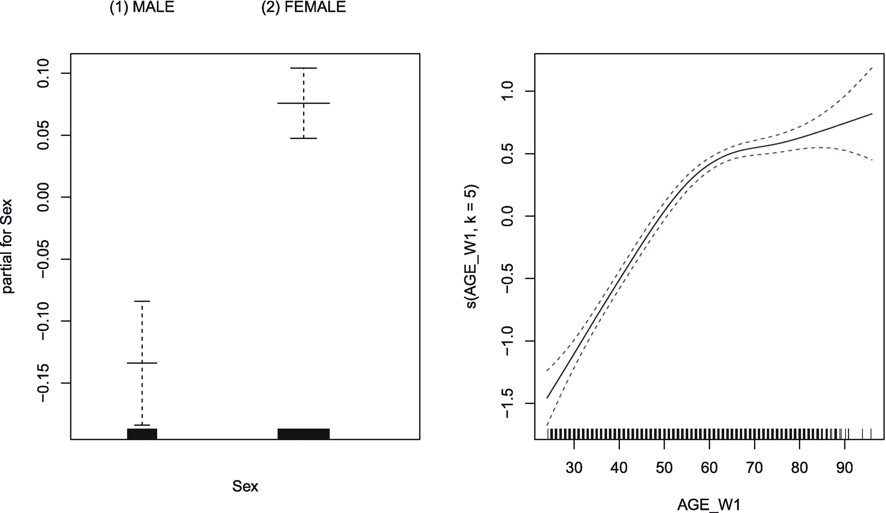

# 五、通用代数建模系统

广义可加模型(gam)是我们在前面章节中讨论的广义线性模型(glm)的扩展。像 GLMs 一样，gam 适应连续和离散的结果。然而，与完全参数模型的 glm 不同，gam 是半参数模型。GAMs 允许在结果和预测之间混合参数和非参数的关联。对于这一章，我们将主要依靠一个优秀的`R`包`VGAM,`，它为向量广义线性模型(VGLMs)和向量广义加法模型(VGAMs)提供了实用程序【125】。VGAMs 是比 gam 更灵活的一类模型，gam 可能有多个响应。然而，除了提供多参数的灵活性，`VGAM`包实现了超过 20 个链接函数，超过 50 个不同的模型/假设分布。在这一章中，我们将只触及`VGAM`包功能的表面，但是它的巨大灵活性意味着我们将不需要引入许多不同的包，也不需要许多不同的功能。如果你想更深入地了解 VGAMs，我们推荐一本由`VGAM`软件包[125]的作者写的优秀书籍。

```r
library(checkpoint)
checkpoint("2018-09-28", R.version = "3.5.1",
  project = book_directory,
  checkpointLocation = checkpoint_directory,
  scanForPackages = FALSE,
  scan.rnw.with.knitr = TRUE, use.knitr = TRUE)

library(knitr)
library(data.table)
library(ggplot2)
library(ggthemes)
library(scales)
library(viridis)
library(car)
library(mgcv)
library(VGAM)
library(ipw)
library(JWileymisc)
library(xtable)

options(
  width = 70,
  stringsAsFactors = FALSE,
  datatable.print.nrows = 20,
  datatable.print.topn = 3,
  digits = 2)

```

## 5.1 概念概述

广义加性模型(gam)是半参数加性模型，它使用非参数平滑函数放松了广义线性模型(GLMs)的线性假设[40]。非参数平滑函数的使用为 gam 提供了极大的灵活性，允许他们对预测值和结果之间的关联进行建模，即使函数形式未知，也不需要函数形式的(正确)规范。这种灵活性使得 gam 被多个学科采用，包括心理学[53]和医学[75]。

下一节介绍平滑样条的概念，这是 gam 的基础。如果你对`R`中关于现代游戏的优秀、全面的介绍感兴趣，请看【122】。要阅读关于 gam 的估计和推断的基础细节，请参见[57，121，123]。在本章的范围之外，gam 还被扩展到不仅模拟位置，还模拟分布的规模和形状。有关更多信息，请参见描述理论方面的优秀论文[78]和[88]，有关`R`中的实践方面，请参见`GAMLSS`包[88]。

### 平滑样条

gam 背后的一个关键概念是平滑样条，它允许 gam 模拟未知的函数形式。平滑样条部分依赖于多项式。可以证明，一个足够高阶的多项式可以逼近任何函数。然而，通常适当的近似可以采用非常高阶的多项式。虽然理论上是正确的，但实际上通常很难建立一个足够高阶的多项式来近似观察到的数据。特别是，通常情况下，多项式在任一极端都提供非常差的近似。图 [5-1](#Fig1) 显示了 ACL 数据中年龄与抑郁症状之间关系的单截距、线性、二次、三次、四次和十次多项式示例。与高阶多项式相比，低阶多项式在其极值处产生更适度的预测。即使是二次多项式也会对最年轻和最年长的参与者产生相对极端的预测(图 [5-1](#Fig1) )。


图 5-1

显示仅截距(扁平线)和渐进高阶多项式的图形

```r
acl <- readRDS("advancedr_acl_data.RDS")

ggplot(acl, aes(AGE_W1, CESD11_W1)) +
  stat_smooth(method = "lm", formula = y ˜ 1,
    colour = viridis(6)[1], linetype = 1, se = FALSE) +
  stat_smooth(method = "lm", formula = y ˜ x,
    colour = viridis(6)[2], linetype = 4, se = FALSE) +
  stat_smooth(method = "lm", formula = y ˜ poly(x, 2),
    colour = viridis(6)[3], linetype = 2, se = FALSE) +
  stat_smooth(method = "lm", formula = y ˜ poly(x, 3),
    colour = viridis(6)[4], linetype = 3, se = FALSE) +
  stat_smooth(method = "lm", formula = y ˜ poly(x, 4),
    colour = viridis(6)[5], linetype = 1, se = FALSE) +
  stat_smooth(method = "lm", formula = y ˜ poly(x, 10),
    colour = viridis(6)[6], linetype = 5, se = FALSE)

```

回归样条试图解决需要非常高阶的多项式来适应不同的函数形式的问题，以及在分布的下端和上端的极端预测的问题。样条最初并不用于统计学。样条最初指的是薄木片，弯曲后在节之间形成平滑的曲线。回归样条使用这种思想，因为它们本质上是分段模型，其中每一段都是多项式模型，并且它们在每一段的边缘(节点)处平滑连接。最简单的样条模型是阶跃函数。为了创建这个步骤，我们用边界点定义逻辑语句，在本例中:*x>T5】42*和 x* ≤ 65 和 *x >* 65 *和 x* ≤ 96。为了在`R`中达到这些界限，我们使用了一个扩展的逻辑操作符:`%gle%`。左边应该是一些向量。右边应该是一个长度为 2 的向量，如果左边的数字或向量大于最小值并且小于或等于右边的最大值，它将返回`TRUE`或`FALSE`。下面的简单示例演示了这些功能。*

```r
## > and <
1:5 %gl% c(2, 4)

## [1] FALSE FALSE  TRUE FALSE FALSE

## > and <=
1:5 %gle% c(2, 4)

## [1] FALSE FALSE  TRUE  TRUE FALSE

## >= and <
1:5 %gel% c(2, 4)

## [1] FALSE  TRUE  TRUE FALSE FALSE

## >= and <=
1:5 %gele% c(2, 4)

## [1] FALSE  TRUE  TRUE  TRUE FALSE

```

随着多项式次数的增加，每个结之间会出现线性和二次趋势。图 [5-2](#Fig2) 显示了两个内部节点和阶跃、线性、二次和三次多项式的结果。


图 5-2

显示阶跃函数样条、线性样条和二次样条的图形，所有样条都有两个内部节点

```r
ggplot(acl, aes(AGE_W1, CESD11_W1)) +
  stat_smooth(method = "lm",
    formula = y ∼ 1 +
      ifelse(x %gle% c(42, 65), 1, 0) +
      ifelse(x %gle% c(65, 96), 1, 0),
    colour = viridis(6)[1], linetype = 1, se = FALSE) +
  stat_smooth(method = "lm",
    formula = y ∼ bs(x, df = 3, degree = 1L),
    colour = viridis(6)[2], linetype = 2, se = FALSE) +
  stat_smooth(method = "lm",
    formula = y ∼ bs(x, df = 4, degree = 2L),
    colour = viridis(6)[3], linetype = 3, se = FALSE) +
  stat_smooth(method = "lm",
    formula = y ∼ bs(x, df = 5, degree = 3L),
    colour = viridis(6)[4], linetype = 4, se = FALSE)

```

用于基础的 b 样条或基础样条试图通过在给定区域的基础函数中具有相对小的重叠来工作，这有助于它们在计算上更加稳定，并且有助于它们成为非常受欢迎的样条类型。以下代码通过显示具有固定结的 B 样条曲线的基函数来帮助可视化重叠。因为这些图是相同的，只是它们基于不同的数据集，并且具有不同的标题，我们没有重复代码来绘制这些图(这相当长)，而是将结果存储在一个`R`对象中，`p1`。然后我们使用`%+%`操作符用一个新的数据集替换原始数据。结果如图 [5-3](#Fig3) 所示。


图 5-3

显示 B 样条(基本样条)的图形

```r
knots <- c(33, 42, 57, 65, 72)
x <- seq(from = min(acl$AGE_W1),
         to = max(acl$AGE_W1), by = .01)

p1 <- ggplot(melt(bs(x, degree = 1,
          knots = knots, intercept = TRUE)),
          aes(Var1, value, colour = factor(Var2))) +
  geom_line() +
  scale_color_viridis("Basis", discrete = TRUE) +
  theme_tufte()

plot_grid(
  p1 +
    ggtitle("5 Knots, Degree = 1"),
  p1 %+% melt(bs(x, degree = 2,
          knots = knots, intercept = TRUE)) +
    ggtitle("5 Knots, Degree = 2"),
  p1 %+% melt(bs(x, degree = 3,
          knots = knots, intercept = TRUE)) +
    ggtitle("5 Knots, Degree = 3"),
  p1 %+% melt(bs(x, degree = 4,
          knots = knots, intercept = TRUE)) +
    ggtitle("5 Knots, Degree = 4"),
  ncol = 2)

```

样条的延伸称为光滑样条。平滑样条的基本思想是，我们可以自动学习适当的平滑度，而不是直接指定节点和多项式次数，这需要事先知道需要什么。

自动学习适当平滑度的过程通常通过允许许多结和高度灵活性，并基于某些标准使用惩罚来降低灵活性(施加平滑度)来进行。平滑样条的一种常用方法是广义交叉验证(GCV)标准，或者，如果尺度是已知的(通常是未知的)，本质上是 Akaike 信息标准(AIC)的一种变体，称为无偏风险估计(UBRE)。关于 GCV 的详细情况，见[104]。最后一个选择是使用受限最大似然(REML ),其中平滑分量被视为随机效应，每个平滑有一个“方差分量”。

关于光滑样条的最后一点说明是，通常希望有一些方法来量化它们有多光滑或灵活。这样的值在描述上是有用的，并且在计算值(如模型 AIC)时也起作用，在这种情况下，可能性会受到复杂性的影响。一般的解决方案是使用“有效自由度”或 EDF。根据 EDF 的计算是否包括截距(常数)项，1 或 2 的 EDF 可能对应于线性函数。有时报告 EDF 计算截距，在这种情况下，EDF = 2 对应于线性趋势。然而，如果不计算截距，截距有时被称为有效非线性自由度(ENDF)，则 ENDF = 1 对应于线性趋势。随着 EDF/ENDF 的增加，拟合的灵活性同样增加。关于回归中样条和平滑的更多细节，见[39]。

出于本章的目的，对样条的粗略理解为广义可加模型(gam)提供了基础。gam 通过允许参数(例如，假设一个预测器的线性关联)和非参数(例如，对另一个使用平滑样条)的混合来扩展 GLMs。随着每一项的增加，gam 仍然是可加的，它们的一般形式如下:


(5.1)

在这个参数化中，我们有熟悉的截距；然而，代替每个预测值的回归系数，我们有函数， *f* <sub>1</sub> 等。这些函数可以预先指定，例如，if*f*<sub>1</sub>(*x*<sub>1</sub>)=*b*<sub>1</sub>∑*x*<sub>1</sub>，或者这些函数可以是平滑样条函数，其中平滑度是基于某种标准从数据中学习的，例如 GCV 或 UBRE。要成为 GAM，通常必须至少有一个平滑项。然而，像 GLMs 一样，gam 在理论上适应许多平滑项和许多常规参数项。混合光滑项和非光滑项的能力使 GAMs 成为一类高度灵活的模型，可以应用于许多环境。例如，平滑项可能具有实质性的意义，如按年龄划分的儿童体重增长图，其中增长通常是非线性的，但函数形式未知。然而，GAMs 也可以应用于其他情况。例如，一个实质性问题可能涉及一个已知或假定参数形式的变量的影响。然而，可能存在关于混杂的担忧，并且混杂的影响具有未知的函数形式。在这种情况下，混杂变量的任何参数本质上都是有害参数，因为唯一的目标是充分模拟它们的(未知)函数形式。没有兴趣真正理解它们的功能形式。在这种情况下,“假设检验”可能是针对具有预先指定的参数形式的变量，从而避免过度拟合的风险，但混杂变量可以使用平滑项稳健地捕获，因为关于它们的统计推断没有什么意义。

除了使用平滑样条，gam 本质上与其他 glm 功能相同。因此，分布假设和可以使用的不同分布族是可以比较的。诚然，由于确定样条适当平滑度的数据驱动性质，自由度和标准误差的计算往往是不同的，可能更接近 gam。下一节将介绍`R`中的 gam，包括如何估计它们，绘制结果，以及呈现或使用估计的模型。

## 5.2 游戏在`R`

### 高斯结果

#### 基本游戏

gam 可以使用`vgam()`函数来拟合高斯结果，该函数的设置与我们在前面章节中熟悉的`vglm()`函数几乎相同。主要区别是平滑样条的使用，使用另一个函数`s()`将平滑样条添加到模型中。`s()`函数采用参数`df,`，该参数控制变量的平滑样条的最大灵活性。下面的例子用两个预测值拟合 GAM:性别和年龄的平滑样条。`summary()`函数主要提供平滑项的汇总，p 值测试参数是否与线性趋势有显著差异。请注意，`uninormal()`系列可以模拟正态分布的位置和比例，尽管默认情况下所有预测值都只针对比例。因此有两个截距，一个是位置截距，GLMs 和 gam 共有的“通常”截距，另一个是分布的*标度*，它基于方差的自然对数。其原因是`VGAM`软件包正准备允许预测分布的位置和规模，尽管“经典”的焦点只是预测分布的位置。

```r
mgam <- vgam(CESD11_W1 ∼ Sex + s(AGE_W1, df = 3), data = acl,
        family = uninormal(), model = TRUE)

summary(mgam)

##
## Call:
## vgam(formula = CESD11_W1 ∼ Sex + s(AGE_W1, df = 3), family = uninormal(),
##    data = acl, model = TRUE)
##
##
## Number of linear predictors:     2
##
## Names of linear predictors: mean, loge(sd)
##
## Dispersion Parameter for uninormal family:   1
##
## Log-likelihood: -5290 on 7228 degrees of freedom
##
## Number of iterations:  4
##
## DF for Terms and Approximate Chi-squares for Nonparametric Effects
##
##                   Df Npar Df Npar Chisq P(Chi)
## (Intercept):1      1
## (Intercept):2      1
## Sex                1
## s(AGE_W1, df = 3)  1       2         20      0

```

使用`coef()`功能可以查看 GAM 的系数。然而，平滑项的系数不容易解释。但是参数项的系数，在这个模型中只有性别，就像常规的 GLMs 一样可以解释，除了性别的影响控制着年龄的平滑样条函数，而不仅仅是年龄的线性趋势。

```r
coef(mgam)

##     (Intercept):1    (Intercept):2    Sex(2) FEMALE
##            0.2158           0.0435           0.2393
## s(AGE_W1, df = 3)
##           -0.0047

```

我们可以使用`car`包中的`linearHypothesis()`函数得到参数系数的假设检验。

```r
## test parametric coefficient for sex
linearHypothesis(mgam, "Sex(2) FEMALE",
  coef. = coef(mgam), vcov = vcov(mgam))

## Linear hypothesis test
##
## Hypothesis:
## Sex(2) FEMALE = 0
##
## Model 1: restricted model
## Model 2: CESD11_W1 ∼ Sex + s(AGE_W1, df = 3)
##
## Note: Coefficient covariance matrix supplied.
##
##   Res.Df Df Chisq Pr(>Chisq)
## 1   7229
## 2   7228  1  44.1    3.2e-11 ***
## ---
## Signif. codes:  0 '***' 0.001 '**' 0.01 '*' 0.05 '.' 0.1 '␣' 1

```

可以使用`linearHypothesis()`来测试参数系数的更复杂的线性假设。例如，我们可以测试截距和性别系数是否同时等于零。

```r
## test parametric coefficient for
## intercept and sex simultaneously
linearHypothesis(mgam,
  c("(Intercept):1", "Sex(2) FEMALE"),
  coef. = coef(mgam), vcov = vcov(mgam))

## Linear hypothesis test
##
## Hypothesis:
## (Intercept):1 = 0
## Sex(2) FEMALE = 0
##
## Model 1: restricted model
## Model 2: CESD11_W1 ∼ Sex + s(AGE_W1, df = 3)
##
## Note: Coefficient covariance matrix supplied.
##
##   Res.Df Df Chisq Pr(>Chisq)
## 1   7230
## 2   7228  2  79.1     <2e-16 ***
## ---
## Signif. codes:  0 '***' 0.001 '**' 0.01 '*' 0.05 '.' 0.1 '␣' 1

```

我们可以基于 2 *se* 以 95%的置信区间来可视化结果。这些应被视为大约 95%的置信区间，因为自由度不是直接估计的，因此依赖于中心极限定理，并且由于平滑样条，标准误差(se)的估计是近似的。使用包含`VGAM`对象方法的`plot()`函数可以很容易地绘制图形。结果如图 [5-4](#Fig4) 所示，显示了性别和年龄平滑项的参数效应。默认情况下会添加地毯图，这对于性别来说不是很有用，但有助于显示年龄数据的分布。颜色来自`viridis()`调色板。


图 5-4

将性别作为参数项，年龄作为平滑样条的广义加性模型的模型结果图

```r
par(mfrow = c(1, 2))
plot(mgam, se = TRUE,
     lcol = viridis(4)[1], scol = viridis(4)[2])

```

将我们 GAM 的结果与更熟悉的替代方案进行比较会有所帮助。为此，我们将安装两个常规 glm。第一个包括年龄的线性项，第二个包括年龄的二次项，使用`poly()`函数生成二次多项式。

```r
mlin <- vglm(CESD11_W1 ∼ Sex + AGE_W1, data = acl,
        family = uninormal(), model = TRUE)
mquad <- vglm(CESD11_W1 ∼ Sex + poly(AGE_W1, 2), data = acl,
        family = uninormal(), model = TRUE)

```

为了将这些 glm 与我们的 GAM 进行比较，我们可以制作一个由两个图组成的面板，如图 [5-5](#Fig5) 所示。深紫色是 GAM 拟合，左边是叠加的线性拟合，右边是施加的二次多项式拟合。显然，线性拟合与 GAM 拟合有很大不同。二次拟合(在图 [5-5](#Fig5) 的右边板上)相对接近 GAM，除了在最右边的尾部。GAM 在尾部开始变平，而二次趋势继续快速增长。


图 5-5

双面板图显示了根据广义相加模型预测的抑郁症症状水平，左侧为线性拟合，右侧为二次拟合。

```r
par(mfrow = c(1, 2))
plot(mgam, se = TRUE, which.term = 2,
     lcol = viridis(4)[1], scol = viridis(4)[1])
plot(as(mlin, "vgam"), se = TRUE, which.term = 2,
     lcol = viridis(4)[2], scol = viridis(4)[2],
     overlay = TRUE, add = TRUE)

plot(mgam, se = TRUE, which.term = 2,
     lcol = viridis(4)[1], scol = viridis(4)[1])
plot(as(mquad, "vgam"), se = TRUE, which.term = 2,
     lcol = viridis(4)[3], scol = viridis(4)[3],
     overlay = TRUE, add = TRUE)

```

有时，gam 可用于选择更简单的趋势函数。例如，我们可以根据图表决定年龄的二次多项式就足够了，并切换到多项式模型。然而，如果结果不能被任何简单的多项式很好地近似，我们可能希望保持 GAM 作为我们的最终模型。在这种情况下，从游戏中得到一些推论是有帮助的。

首先，让我们看看另一个游戏玩家的例子。在这里，我们从性别预测第二波的抑郁症状，第一波的抑郁症状的平滑样条和第一波的年龄的平滑样条。在这个新模型中，我们看到`summary()`表明年龄的非线性在统计上不显著。

```r
mgam2 <- vgam(CESD11_W2 ∼ Sex +
               s(CESD11_W1, df = 3) +
               s(AGE_W1, df = 3), data = acl,
       family = uninormal(), model = TRUE)

summary(mgam2)

##
## Call:
## vgam(formula = CESD11_W2 ∼ Sex + s(CESD11_W1, df = 3) + s(AGE_W1,
##     df = 3), family = uninormal(), data = acl, model = TRUE)
##
##
## Number of linear predictors:    2
##
## Names of linear predictors: mean, loge(sd)
##
## Dispersion Parameter for uninormal family:  1
##
## Log-likelihood: -3657 on 5725 degrees of freedom
##
## Number of iterations:  5
##
## DF for Terms and Approximate Chi-squares for Nonparametric Effects
##
##                      Df Npar Df Npar Chisq P(Chi)
## (Intercept):1         1
## (Intercept):2         1
## Sex                   1
## s(CESD11_W1, df = 3)  1       2         31    0.0
## s(AGE_W1, df = 3)     1       2          4    0.1

```

如果其中一个平滑样条与一个线性项没有明显的不同，我们可以考虑回退到该项的线性拟合，如下面的代码所示。

```r
mgam3 <- vgam(CESD11_W2 ∼ Sex +
               s(CESD11_W1, df = 3) +
               AGE_W1, data = acl,
        family = uninormal(), model = TRUE)

summary(mgam3)

##
## Call:
## vgam(formula = CESD11_W2 ∼ Sex + s(CESD11_W1, df = 3) + AGE_W1,
##     family = uninormal(), data = acl, model = TRUE)
##
##
## Number of linear predictors:    2
##
## Names of linear predictors: mean, loge(sd)
##
## Dispersion Parameter for uninormal family:  1
##
## Log-likelihood: -3659 on 5727 degrees of freedom
##
## Number of iterations:  5
##
## DF for Terms and Approximate Chi-squares for Nonparametric Effects
##
##                      Df Npar Df Npar Chisq P(Chi)
## (Intercept):1         1
## (Intercept):2         1
## Sex                   1
## s(CESD11_W1, df = 3)  1       2         31  2e-07
## AGE_W1                1

```

我们已经看到了如何使用`linearHypothesis()`函数测试参数项的统计显著性。现在我们可以用它来测试年龄和性别。我们可以使用`names()`函数和`coef()`函数来获取每个参数的名称，以便通过测试。

```r
names(coef(mgam3))

## [1] "(Intercept):1"      "(Intercept):2"
## [3] "Sex(2) FEMALE"      "s(CESD11_W1, df = 3)"
## [5] "AGE_W1"

linearHypothesis(mgam3,
  "Sex(2) FEMALE",
  coef. = coef(mgam3), vcov = vcov(mgam3))

## Linear hypothesis test
##
## Hypothesis:
## Sex(2) FEMALE = 0
##
## Model 1: restricted model
## Model 2: CESD11_W2 ∼ Sex + s(CESD11_W1, df = 3) + AGE_W1
##
## Note: Coefficient covariance matrix supplied.
##
##   Res.Df Df Chisq Pr(>Chisq)
## 1   5728
## 2   5727  1  4.09      0.043 *
## ---
## Signif. codes:  0 '***' 0.001 '**' 0.01 '*' 0.05 '.' 0.1 '␣' 1

linearHypothesis(mgam3,
  "AGE_W1",
  coef. = coef(mgam3), vcov = vcov(mgam3))

## Linear hypothesis test
##
## Hypothesis:
## AGE_W1 = 0
##
## Model 1: restricted model
## Model 2: CESD11_W2 ∼ Sex + s(CESD11_W1, df = 3) + AGE_W1
##
## Note: Coefficient covariance matrix supplied.
##
##   Res.Df Df Chisq Pr(>Chisq)
## 1   5728
## 2   5727  1  3.56      0.059 .
## ---
## Signif. codes:  0 '***' 0.001 '**' 0.01 '*' 0.05 '.' 0.1 '␣' 1

```

我们在图 [5-6](#Fig6) 中展示了最终模型的结果。这里我们可以看到，对于在第一波低于约 2 的抑郁症状水平，较高的抑郁症状预示着在第二波较高的抑郁症状。然而，对于高于约 2 分的抑郁症状，没有太多的关联，这由预测值的变平来证明。

```r
par(mfrow = c(2, 2))
plot(mgam3, se = TRUE,
     lcol = viridis(4)[1],
     scol = viridis(4)[2])

```

在其他情况下，我们可以为游戏生成预测。因为不可能用语言来描述平滑样条，所以如果对平滑样条的结果感兴趣，那么用图形来表示 gam 是标准的。首先，我们为预测建立一个新的数据集。我们得到了因子变量的所有级别，`Sex`，第一波的抑郁症状序列，从最低分到最高分，具有 1000 个点的均匀间隔网格，以及第一波的年龄的五个数字摘要。在`R`中，预测和往常一样使用`predict()`函数，该函数为`VGAM`包中的模型准备了方法。


图 5-6

将性别和年龄作为参数项，将第一波抑郁症状作为平滑样条的广义加性模型的模型结果图

```r
## generate new data for prediction
## use the whole range of sex and depression symptoms
## and a five number summary of age
## (min, 25th 50th 75th percentiles and max)
newdat <- as.data.table(expand.grid(
  Sex = levels(acl$Sex),
  CESD11_W1 = seq(
    from = min(acl$CESD11_W1, na.rm=TRUE),
    to = max(acl$CESD11_W1, na.rm=TRUE),
    length.out = 1000),
  AGE_W1 = fivenum(acl$AGE_W1)))

newdat$yhat <- predict(mgam3, newdata = newdat)

## Warning in `[<-.data.table`(x, j = name, value = value): 2 column matrix RHS of := will be treated

## Warning in `[<-.data.table`(x, j = name, value = value): Supplied 20000 items to be assigned to 10000

```

一旦我们有了一个预测数据集，我们就可以使用`ggplot()`来制作最终的图表。结果如图 [5-7](#Fig7) 所示。该图清楚地强调了后续抑郁症状的最强预测因素是先前的抑郁症状。虽然不同年龄和性别之间有一些微小的差异，但相比之下这些都是小巫见大巫。


图 5-7

预测不同年龄和性别的第一波抑郁症状水平的第二波抑郁症状

```r
ggplot(newdat,
       aes(CESD11_W1, yhat,
           colour = factor(AGE_W1),
           linetype = factor(AGE_W1))) +
  geom_line() +
  scale_color_viridis("Age", discrete = TRUE) +
  scale_linetype_discrete("Age") +
  facet_wrap(∼ Sex) +
  theme(legend.position = c(.75, .2),
        legend.key.width = unit(1.5, "cm")) +
  xlab("Depression Symptoms (Wave 1)") +
  ylab("Depression Symptoms (Wave 2)")

```

最后，尽管`VGAM`包具有广泛的功能，并且是矢量游戏的唯一选择之一，但对于我们在这里展示的单结果游戏，还有一些游戏的特性尚未实现。GAMs 理论和实现的领导者之一 Simon Wood 编写的`mgcv`包具有一些有用的附加特性。我们将在这里简要概述一下`mgcv`包的使用，但是更多的细节可以在西蒙·伍德的关于 GAMs 的书中找到。

在我们使用`mgcv`包之前，我们必须处理一些冲突。具体来说，`VGAM`和`mgcv`包都实现了一个名为`s()`的平滑样条函数，但它们不是同一个函数。加载了两个包后，最后加载的包“屏蔽”了前面包的功能，这意味着当我们在`R`控制台中键入`s()`时，我们会从最后加载的包中得到结果，而不一定是我们想要的包。在我们的例子中，解决这个问题最简单的方法是分离不想要的包，并确保加载了想要的包。我们使用下面的代码来实现。请注意，运行后，您将无法使用`vgam()`功能，直到您重新加载`VGAM`包。

```r
detach("package:VGAM")
library(mgcv)

```

现在我们可以使用`mgcv`包中的`gam()`函数来拟合一个 GAM。我们再次使用`s()`函数表示平滑样条，但是注意对于`mgcv`，控制最大灵活性的参数是`k`而不是`df`。适当的家庭功能还有`gaussian()`。尽管代码的其余部分可能看起来相似，但在默认情况下使用的平滑样条和估计类型方面还是有一些差异。具体来说，`mgcv`软件包默认使用薄板回归样条和 GCV 准则来学习适当的灵活性程度。

```r
mgam4 <- gam(CESD11_W2 ∼ Sex +
               s(CESD11_W1, k = 3) +
               s(AGE_W1, k = 3), data = acl,
        family = gaussian())

```

使用`gam()`功能的一个好处是，默认摘要包括各种有用的信息。具体来说，它自动计算参数项的统计推断，并为平滑项提供近似的显著性测试。请注意，与测试平滑项是否显著不同于线性趋势的`vgam()`不同，`gam()`测试平滑项的总体显著性(即，它包括线性趋势以及任何非线性)。

```r
summary(mgam4)

##
## Family: gaussian
## Link function: identity
##
## Formula:
## CESD11_W2 ∼ Sex + s(CESD11_W1, k = 3) + s(AGE_W1, k = 3)
##
## Parametric coefficients:
##               Estimate Std. Error t value Pr(>|t|)
## (Intercept)    -0.0202     0.0272   -0.74    0.457
## Sex(2) FEMALE   0.0681     0.0342    1.99    0.046 *
## ---
## Signif. codes:  0 '***' 0.001 '**' 0.01 '*' 0.05 '.' 0.1 '␣' 1
##
## Approximate significance of smooth terms:
##               edf Ref.df      F p-value
## s(CESD11_W1) 1.95   2.00 514.03  <2e-16 ***
## s(AGE_W1)    1.63   1.86   2.04   0.085 .
## ---
## Signif. codes:  0 '***' 0.001 '**' 0.01 '*' 0.05 '.' 0.1 '␣' 1
##
## R-sq.(adj) =  0.271   Deviance explained = 27.2%
## GCV = 0.75609  Scale est. = 0.75461   n = 2867

```

还因为`mgcv`提供了对估计自由度的快速访问，更容易检查我们是否应该允许更大的灵活性。例如，如果我们将`k = 3`增加到`k = 4`并改装模型，我们可以看到，估计的自由度随年龄变化很小，但随抑郁症状增加。

```r
mgam5 <- gam(CESD11_W2 ∼ Sex +
               s(CESD11_W1, k = 4) +
               s(AGE_W1, k = 4), data = acl,
        family = gaussian())

summary(mgam5)

##
## Family: gaussian
## Link function: identity
##
## Formula:
## CESD11_W2 ∼ Sex + s(CESD11_W1, k = 4) + s(AGE_W1, k = 4)
##
## Parametric coefficients:
##               Estimate Std. Error t value Pr(>|t|)
## (Intercept)    -0.0207     0.0272   -0.76    0.447
## Sex(2) FEMALE   0.0688     0.0342    2.01    0.044 *
## ---
## Signif. codes:  0 '***' 0.001 '**' 0.01 '*' 0.05 '.' 0.1 '␣' 1
##
## Approximate significance of smooth terms:
##               edf Ref.df      F p-value
## s(CESD11_W1) 2.86   2.99 344.7   <2e-16 ***
## s(AGE_W1)    1.78   2.16   2.4    0.076 .
## ---
## Signif. codes:  0 '***' 0.001 '**' 0.01 '*' 0.05 '.' 0.1 '␣' 1
##
## R-sq.(adj) =  0.272   Deviance explained = 27.3%
## GCV = 0.75508  Scale est. = 0.75333   n = 2867

```

我们在图 [5-8](#Fig8) 中并排绘制了这两个模型。结果显示，在第一波中，抑郁症状的趋势有细微的差异，在我们设定的 GAM 中有更明显的平台期`k = 4.`


图 5-8

改变光滑样条最大柔度的两个广义加法模型的模型结果图

```r
par(mfrow = c(2, 2))
plot(mgam4, se = TRUE, scale = 0, main = "k = 3")
plot(mgam5, se = TRUE, scale = 0, main = "k = 4")

```

#### 互动游戏

另一个在`mgcv`包中可用但在`VGAM`包中还不可用的特性是包含交互平滑样条的能力。例如，假设我们认为抑郁症状或年龄的影响可能因性别而异。我们可以相对容易地实现这一点，方法是将参数`by = Sex`添加到我们认为可能因性别而异的`s()`函数中。这一总结并没有显示出很大的差异，尽管在性别上有一些差异，但看起来相似的曲线证明了这一点(图 [5-9](#Fig9) )。


图 5-9

允许样条随性别变化的广义可加模型的模型结果图

```r
mgam6 <- gam(CESD11_W2 ∼ Sex +
              s(CESD11_W1, k = 4, by = Sex) +
              s(AGE_W1, k = 4, by = Sex),
             data = acl,
        family = gaussian())

summary(mgam6)

##
## Family: gaussian
## Link function: identity
##
## Formula:
## CESD11_W2 ∼ Sex + s(CESD11_W1, k = 4, by = Sex) + s(AGE_W1, k = 4,
##     by = Sex)
##
## Parametric coefficients:
##               Estimate Std. Error t value Pr(>|t|)
## (Intercept)    -0.0218     0.0276   -0.79    0.428
## Sex(2) FEMALE   0.0693     0.0343    2.02    0.044 *
## ---
## Signif. codes:  0 '***' 0.001 '**' 0.01 '*' 0.05 '.' 0.1 '␣' 1
##
## Approximate significance of smooth terms:
##                             edf Ref.df      F p-value
## s(CESD11_W1):Sex(1) MALE   2.52   2.83 119.68  <2e-16 ***
## s(CESD11_W1):Sex(2) FEMALE 2.76   2.96 234.18  <2e-16 ***
## s(AGE_W1):Sex(1) MALE      1.80   2.17   1.58     0.2
## s(AGE_W1):Sex(2) FEMALE    1.00   1.00   2.68     0.1
## ---
## Signif. codes:  0 '***' 0.001 '**' 0.01 '*' 0.05 '.' 0.1 '␣' 1
##
## R-sq.(adj) =  0.272   Deviance explained = 27.4%
## GCV = 0.75643  Scale est. = 0.75377   n = 2867

par(mfrow = c(2, 2))
plot(mgam6, ask = FALSE, scale = 0)

```

我们可以使用 Akaike 信息标准或贝叶斯信息标准作为比较两个模型之间结果的快速方法。在这种情况下，两个指数都指向没有性别交互的模型，作为平衡适合度和节俭度的高级模型。

```r
AIC(mgam5, mgam6)

##         df   AIC
## mgam5  7.6  7333
## mgam6 11.1  7338

BIC(mgam5, mgam6)

##         df   BIC
## mgam5  7.6  7378
## mgam6 11.1  7404

```

两个连续变量相互作用的光滑样条变得更加复杂。然而，`mgcv`包允许通过张量积平滑。张量积平滑背后的细节不容易理解，但大致可以认为是取每个变量，通过纽结将其分离并拟合多项式(就像常规样条一样)。这些被假定为乘积项，尽管在整个数据范围内这可能是不现实的，但希望它提供一个合理的近似值，因为可能的空间被两个变量上的结所分解。从实际角度来看，想象一个未知的三维表面，其中深度和宽度由两个预测变量定义，高度是结果的级别。然后想象在顶部覆盖一层厚布。厚重的材料会提供一定程度的“光滑度”，但形状会随着你向任何方向移动而灵活变化，如果不指明另一个变量的水平，你就不能谈论一个变量的“效果”。另一个实际注意事项是张量积平滑对计算要求更高，因此拟合速度较慢。

在下面的代码中，我们拟合了一个 GAM，其中性别作为参数项，张量积在第一波的抑郁症状和自尊之间平滑，预测第二波的抑郁症状。

```r
mgam7 <- gam(CESD11_W2 ∼ Sex +
               te(CESD11_W1, SelfEsteem_W1, k = 4ˆ2),
             data = acl,
        family = gaussian())

summary(mgam7)

##
## Family: gaussian
## Link function: identity
##
## Formula:
## CESD11_W2 ∼ Sex + te(CESD11_W1, SelfEsteem_W1, k = 4ˆ2)
##
## Parametric coefficients:
##               Estimate Std. Error t value Pr(>|t|)
## (Intercept)    -0.0226     0.0268   -0.84    0.400
## Sex(2) FEMALE   0.0718     0.0337    2.13    0.033 *
## ---
## Signif. codes:  0 '***' 0.001 '**' 0.01 '*' 0.05 '.' 0.1 '␣' 1
##
## Approximate significance of smooth terms:
##                              edf Ref.df    F p-value
## te(CESD11_W1,SelfEsteem_W1) 12.1   14.5 77.4  <2e-16 ***
## ---
## Signif. codes:  0 '***' 0.001 '**' 0.01 '*' 0.05 '.' 0.1 '␣' 1
##
## R-sq.(adj) =  0.286   Deviance explained = 28.9%
## GCV = 0.74276  Scale est. = 0.7391    n = 2867

```

总结表明，总体而言，张量积平滑在统计上是显著的，尽管它没有说明哪个变量的贡献最大。这种交互的另一个挑战是它们更加难以可视化。现在我们使用`vis.gam()`功能，它可以制作 3D 透视图或等高线图。首先，我们将在一组图表中从几个不同的角度绘制 3D 透视图。我们还缩小了默认的利润率。结果如图 [5-10](#Fig10) 所示。


图 5-10

3D 透视图显示了第 1 波抑郁症状和自尊之间的张量积平滑结果，预测了第 2 波的抑郁

```r
par(mfrow = c(2, 2), mar = c(.1, .1, .1, .1))
vis.gam(mgam7,
  view = c("CESD11_W1", "SelfEsteem_W1"),
  theta = 210, phi = 40,
  color = "topo",
  plot.type = "persp")
vis.gam(mgam7,
  view = c("CESD11_W1", "SelfEsteem_W1"),
  theta = 150, phi = 40,
  color = "topo",
  plot.type = "persp")
vis.gam(mgam7,
  view = c("CESD11_W1", "SelfEsteem_W1"),
  theta = 60, phi = 40,
  color = "topo",
  plot.type = "persp")
vis.gam(mgam7,
  view = c("CESD11_W1", "SelfEsteem_W1"),
  theta = 10, phi = 40,
  color = "topo",
  plot.type = "persp")

```

在二维空间中更容易可视化的图是等高线图。等值线图在 x 轴和 y 轴上显示预测值，但使用线条和颜色显示第三维。每条线或等高线代表相同的预测值，曲线展示了如何通过改变两个预测值的组合来实现相同的预测值。图 [5-11](#Fig11) 中显示了一个等高线图示例。


图 5-11

显示在第 1 波抑郁症状和自尊之间的张量积平滑结果的等高线图预测在第 2 波的抑郁。

```r
par(mfrow = c(1, 1), mar = c(5.1, 4.1, 4.1, 2.1))
vis.gam(mgam7,
  view = c("CESD11_W1", "SelfEsteem_W1"),
  color = "topo",
  plot.type = "contour")

```

如果我们想要尝试方差的粗略分解，我们可以使用张量积相互作用，使用`ti()`函数。结果显示在下面的代码中，它们表明抑郁症状和自尊之间的相互作用并没有在抑郁症状和自尊的平滑项之间提供多少附加值。

```r
mgam8 <- gam(CESD11_W2 ∼ Sex +
               ti(CESD11_W1, k = 4) +
               ti(SelfEsteem_W1, k = 4) +
               ti(CESD11_W1, SelfEsteem_W1, k = 4ˆ2),
             data = acl,
        family = gaussian())

summary(mgam8)

##
## Family: gaussian
## Link function: identity
##
## Formula:
## CESD11_W2 ∼ Sex + ti(CESD11_W1, k = 4) + ti(SelfEsteem_W1, k = 4) +
##     ti(CESD11_W1, SelfEsteem_W1, k = 4ˆ2)
##
## Parametric coefficients:
##               Estimate Std. Error t value Pr(>|t|)
## (Intercept)    -0.0156     0.0281   -0.55    0.579
## Sex(2) FEMALE   0.0681     0.0338    2.02    0.044 *
## ---
## Signif. codes:  0 '***' 0.001 '**' 0.01 '*' 0.05 '.' 0.1 '␣' 1
##
## Approximate significance of smooth terms:
##                               edf Ref.df      F p-value
## ti(CESD11_W1)                1.72   2.08 260.86 < 2e-16 ***
## ti(SelfEsteem_W1)            1.00   1.00  22.77 1.9e-06 ***
## ti(CESD11_W1,SelfEsteem_W1) 21.77  31.08   1.03    0.43
## ---
## Signif. codes:  0 '***' 0.001 '**' 0.01 '*' 0.05 '.' 0.1 '␣' 1
##
## R-sq.(adj) =  0.284   Deviance explained =   29%
## GCV = 0.74778  Scale est. = 0.74087   n = 2867

```

我们将检查的`mgcv`包的最后一个附加特性是运行一些快速检查最大允许平滑度是否受限的能力。虽然平滑度是已知的，但参数 *k* 控制允许的最大值。通常，如果估计的自由度比*k–*1 低得多，增加 *k* 不太可能有任何好处，因为模型已经确定简单的结构就足够了。然而，这并不总是正确的，特别是如果估计的自由度接近于*k–*1，这可能表明施加的人为限制导致了过度约束的模型，如果我们增加 *k* 我们可能会得到一组不同的结果。为了检验这一点，我们将回到我们早期的模型，在没有任何交互作用的情况下，检验抑郁症状和预测随后抑郁的年龄。为了方便起见，我们在这里复制了这个模型。请注意，抑郁症症状的估计自由度接近于*k–*1 = 4–1 = 3，这表明可能存在一些问题。

```r
mgam5 <- gam(CESD11_W2 ∼ Sex +
               s(CESD11_W1, k = 4) +
               s(AGE_W1, k = 4), data = acl,
        family = gaussian())

summary(mgam5)

##
## Family: gaussian
## Link function: identity
##
## Formula:
## CESD11_W2 ∼ Sex + s(CESD11_W1, k = 4) + s(AGE_W1, k = 4)
##
## Parametric coefficients:
##               Estimate Std. Error t value Pr(>|t|)
## (Intercept)    -0.0207     0.0272   -0.76    0.447
## Sex(2) FEMALE   0.0688     0.0342    2.01    0.044 *
## ---
## Signif. codes:  0 '***' 0.001 '**' 0.01 '*' 0.05 '.' 0.1 '␣' 1
##
## Approximate significance of smooth terms:
##               edf Ref.df     F p-value
## s(CESD11_W1) 2.86   2.99 344.7  <2e-16 ***
## s(AGE_W1)    1.78   2.16   2.4   0.076 .
## ---
## Signif. codes:  0 '***' 0.001 '**' 0.01 '*' 0.05 '.' 0.1 '␣' 1
##
## R-sq.(adj) =  0.272   Deviance explained = 27.3%
## GCV = 0.75508  Scale est. = 0.75333   n = 2867

```

为了检查我们是否想要增加 *k* ，我们可以使用`gam.check()`函数。它需要的只是一个合适的游戏。因为`gam.check()`依赖于一些模拟，它可以根据随机种子而变化。为了确保再现性，设置随机种子，就像我们接下来使用`set.seed()`所做的那样。打印结果，并绘制一些图，如图 [5-12](#Fig12) 所示。结果表明，对于第一波的抑郁症状来说，k*可能还不够高。一般来说，由于平滑，不需要猜测 *k* 完全正确，但它需要足够大，以使函数形式不会受到不适当的限制。*


图 5-12

广义加性模型的诊断图

```r
par(mfrow = c(2, 2))
set.seed(12345)
gam.check(mgam5)

##
## Method: GCV   Optimizer: magic
## Smoothing parameter selection converged after 9 iterations.
## The RMS GCV score gradient at convergence was 6.7e-07 .
## The Hessian was positive definite.
## Model rank = 8 / 8
##
## Basis dimension (k) checking results. Low p-value (k-index<1) may
## indicate that k is too low, especially if edf is close to k'.
##
##                k'  edf k-index p-value
## s(CESD11_W1) 3.00 2.86    0.97   0.025 *
## s(AGE_W1)    3.00 1.78    0.99   0.230
## ---
## Signif. codes:  0 '***' 0.001 '**' 0.01 '*' 0.05 '.' 0.1 '␣' 1

```

根据来自`gam.check()`的信息，我们可能会重新调整我们的模型，增加抑郁症状的 *k* 。我们选择一个新的值， *k* = 20。现在结果显示估计的自由度远低于*k*–1 = 20–1 = 19。虽然我们不需要这样做，但是我们也增加了年龄的 *k* 来演示改变参数的影响。

```r
mgam5b <- gam(CESD11_W2 ˜ Sex +
               s(CESD11_W1, k = 20) +
               s(AGE_W1, k = 20), data = acl,
        family = gaussian())

summary(mgam5b)

##
## Family: gaussian
## Link function: identity
##
## Formula:
## CESD11_W2 ˜ Sex + s(CESD11_W1, k = 20) + s(AGE_W1, k = 20)
##
## Parametric coefficients:
##               Estimate Std. Error t value Pr(>|t|)
## (Intercept)    -0.0202     0.0271   -0.75    0.456
## Sex(2) FEMALE   0.0680     0.0341    2.00    0.046 *
## ---
## Signif. codes:  0 '***' 0.001 '**' 0.01 '*' 0.05 '.' 0.1 '␣' 1
##
## Approximate significance of smooth terms:
##                edf Ref.df     F p-value
## s(CESD11_W1) 11.68  13.99 76.43    <2e-16 ***
## s(AGE_W1)     1.69   2.13  1.87      0.14
## ---
## Signif. codes:  0 '***' 0.001 '**' 0.01 '*' 0.05 '.' 0.1 '␣' 1
##
## R-sq.(adj) =  0.278   Deviance explained = 28.2%
## GCV = 0.7508  Scale est. = 0.74678   n = 2867

```

我们将结果绘制在图 [5-13](#Fig13) 中，图中显示了抑郁症状趋势比之前包含的更大的灵活性。还要注意，尽管增加了 *k* ，年龄的趋势并没有发生有意义的变化。这发生在更简单的拟合已经足够的时候；因此，增加 *k* 对结果几乎没有影响，因为额外的灵活性已经被抵消了。

```r
par(mfrow = c(1, 2))
plot(mgam5b, se = TRUE, scale = 0)

```

尽管很简短，但本节涵盖了 gam 对于连续的、正态分布的数据的许多基本用途和特性。接下来的部分利用相同的想法，但是应用于其他类型的结果数据，并假设不同的分布。然而，模型拟合、模型比较和可视化的基本步骤往往是相似的。


图 5-13

增加抑郁症状的 k 值后，广义加法模型的模型结果图

### 二元结果

二元结果已经在讨论 GLMs 的章节中介绍过了。二元结果的 gam 依赖于与 GLMs 相同的理论，并使用相同的家族(伯努利/二项式)。二元结果 GAMs 的新颖之处在于使用了平滑样条，其功能与连续、正态分布的结果相同，只是平滑样条是在链接尺度上，在二元结果的情况下通常是 logit(对数概率)。

为了检验 gam 的二元结果，我们将使用吸烟作为结果，将当前吸烟者(1)与以前或从不吸烟者(0)进行比较。我们从年龄开始预测。该总结表明，年龄与吸烟状况之间存在某种非线性关系。

```r
library(VGAM)

##
## Attaching package: 'VGAM'

## The following object is masked from 'package:car':
##
##     logit

## The following objects are masked from 'package:rms':
##
##     calibrate, lrtest

## The following object is masked from 'package:mgcv':
##
##     s

## The following objects are masked from 'package:boot':
##
##     logit, simplex

acl$CurSmoke <- as.integer(acl$Smoke_W1 == "(1) Cur Smok")

mgam.lr1 <- vgam(CurSmoke ˜ s(AGE_W1, df = 3),
             family = binomialff(link = "logit"),
             data = acl, model = TRUE)

summary(mgam.lr1)

##
## Call:
## vgam(formula = CurSmoke ˜ s(AGE_W1, df = 3), family = binomialff(link = "logit"),
##     data = acl, model = TRUE)
##
##
## Number of linear predictors:    1
##
## Name of linear predictor: logit(prob)
##
## (Default) Dispersion Parameter for binomialff family:    1
##
## Residual deviance:  4173 on 3613 degrees of freedom
##
## Log-likelihood: -2087 on 3613 degrees of freedom
##
## Number of iterations:  5
##
## DF for Terms and Approximate Chi-squares for Nonparametric Effects
##
##                   Df Npar Df Npar Chisq P(Chi)
## (Intercept)        1
## s(AGE_W1, df = 3)  1        2          44  2e-10

```

为了更好地理解结果，我们可以绘制平滑样条曲线。


图 5-14

年龄和当前吸烟状况的广义相加模型

```r
par(mfrow = c(1, 1))
plot(mgam.lr1, se = TRUE,
     lcol = viridis(4)[1],
     scol = viridis(4)[2])

```

这表明在较年轻的年龄阶段变化不大，但在 60 岁左右急剧下降。然而，目前，该图处于链接比例。我们可以得到概率尺度上的预测，以便用更直观的度量来绘图。

```r
## generate new data for prediction
## use the whole range of age
newdat <- as.data.table(expand.grid(
  AGE_W1 = seq(
    from = min(acl$AGE_W1, na.rm=TRUE),
    to = max(acl$AGE_W1, na.rm=TRUE),
    length.out = 1000)))

newdat$yhat <- predict(mgam.lr1,
                       newdata = newdat,
                       type = "response")

```

一旦我们有了一个预测数据集，我们就可以使用`ggplot()`来制作最终的图表。结果如图 [5-15](#Fig15) 所示。该图显示了在这种情况下与链路规模上的结果类似的图片。然而，转换后的结果更容易解释。


图 5-15

各年龄段吸烟的预测概率

```r
ggplot(newdat, aes(AGE_W1, yhat)) +
  geom_line() +
  scale_y_continuous(labels = percent) +
  xlab("Age (years)") +
  ylab("Probability of Smoking") +
  coord_cartesian(xlim = range(acl$AGE_W1),
                  ylim = c(0, .4),
                  expand = FALSE)

```

一个限制是，没有一种内置的方法来获得来自`VGAM`包的新数据的 GAM 预测的置信区间。生成置信区间的一种方法是使用自举。有了这样一个简单的模型，这并不需要太多时间。我们还可以利用并行处理来加速它，特别是对于更复杂的模型，或者如果我们要进行大量的 bootstrap 重采样。

```r
nboot <- 500

out <- matrix(NA_real_, ncol = nboot, nrow = nrow(newdat))

start.time <- proc.time()
set.seed(12345)
for (i in 1:500) {
  tmp <- vgam(CurSmoke ˜ s(AGE_W1, df = 3),
             family = binomialff(link = "logit"),
             data = acl[sample(nrow(acl), replace = TRUE)], model = TRUE)
  out[, i] <- predict(tmp,
                      newdata = newdat,
                      type = "response")
}
stop.time <- proc.time()

## time to bootstrap 500 times
stop.time - start.time
##    user  system elapsed
##   19.12    0.03   19.21

```

现在，我们可以从自举预测中生成一些摘要。首先，有时人们会将 bootstrap 预测的平均值与实际模型进行比较，以查看是否存在系统偏差。下面的代码只是一个计算平均绝对差的快速检查。在这种情况下，它非常小。

```r
mean(abs(newdat$yhat - rowMeans(out)))

## [1] 0.00031

```

接下来，我们可以计算置信区间，但是要取 bootstrap 样本的百分位数。

```r
newdat$LL <- apply(out, 1, quantile,
  probs = .025, na.rm = TRUE)

newdat$UL <- apply(out, 1, quantile,
  probs = .975, na.rm = TRUE)

```

最后，我们可以重新制作我们的预测概率图，但现在增加了置信区间。结果如图 [5-16](#Fig16) 所示。由于抽取的 bootstrap 样本数量相对较少，置信区间略有起伏。基于分位数的置信区间往往会随着样本数量的增加而变得平滑，但即使如此，它们也提供了一个相对快速且非常有用的补充，即通过年龄的平滑样条来指示吸烟预测概率的不确定性程度。


图 5-16

各年龄段吸烟的预测概率

```r
ggplot(newdat, aes(AGE_W1, yhat)) +
  geom_ribbon(aes(ymin = LL, ymax = UL), fill = "grey80") +
  geom_line(size = 2) +
  scale_y_continuous(labels = percent) +
  xlab("Age (years)") +
  ylab("Probability of Smoking") +
  theme_tufte() +
  coord_cartesian(xlim = range(acl$AGE_W1),
                  ylim = c(0, .5),
                  expand = FALSE)

```

在关于 GLMs 的一章中，我们引入了一个测量方法，即预测概率的平均边际变化，作为当结果是分类的时，对预测值的更直观的总结。虽然这可以处理由于链接函数引起的非线性，但是在平滑样条的情况下，产生这样的测量通常是没有意义的，因为它不仅包含由于开始概率引起的差异，而且包含预测器的效果是非线性的事实。因此，我们在图 [5-16](#Fig16) 中产生的具有置信区间的数字通常是二元结果博弈的最终结果。

### 无序的结果

在关于 GLMs 的章节中，我们看到了超过两个水平的无序分类结果的多项逻辑回归模型。对于具有无序分类结果的 gam，过程是相似的。我们首先做一些数据管理，以生成第二波的崩溃就业变量，然后拟合一个 GAM，从年龄的平滑样条预测这一点。该总结揭示了几种对比的显著非线性的证据。一个有趣的特性是，现在不是对平滑项中是否存在非线性进行单一测试，而是进行*k–*1 次测试，其中 *k* 是结果中类别的数量。在我们的例子中，我们有五个类别；一个用作参考，因此有四个非线性测试。

```r
acl[, EmployG_W2 := as.character(Employment_W2)]
acl[EmployG_W2 %in% c(
  "(2) 2500+HRS", "(3) 15002499",
  "(4) 500-1499", "(5) 1-499HRS"),
  EmployG_W2 := "(2) EMPLOYED"]
acl[, EmployG_W2 := factor(EmployG_W2)]

mgam.mr1 <- vgam(EmployG_W2 ˜ s(AGE_W1, k = 5),
               family = multinomial(),
               data = acl, model = TRUE)

summary(mgam.mr1)

##
## Call:
## vgam(formula = EmployG_W2 ˜ s(AGE_W1, k = 5), family = multinomial(),
##     data = acl, model = TRUE)
##
##
## Number of linear predictors:    4
##
## Names of linear predictors:
## log(mu[,1]/mu[,5]), log(mu[,2]/mu[,5]), log(mu[,3]/mu[,5]), log(mu[,4]/mu[,5])
##
## Dispersion Parameter for multinomial family:    1
##
## Residual deviance:  5261 on 11450 degrees of freedom
##
## Log-likelihood: -2631 on 11450 degrees of freedom
##
## Number of iterations:  8
##
## DF for Terms and Approximate Chi-squares for Nonparametric Effects
##
##                    Df  Npar  Df  Npar  Chisq  P(Chi)
## (Intercept):1       1
## (Intercept):2       1
## (Intercept):3       1
## (Intercept):4       1
## s(AGE_W1, k = 5):1  1         3           16    0.0
## s(AGE_W1, k = 5):2  1         2           83    0.0
## s(AGE_W1, k = 5):3  1         2           71    0.0
## s(AGE_W1, k = 5):4  1         2            5    0.1

```

我们可以再次绘制结果，默认情况下是在链接范围内，我们现在再次得到四个图，而不是一个，因为我们对分类结果的每个级别都有一个图。结果如图 [5-17](#Fig17) 所示。一些比较显示出比其他比较更大程度的非线性，并且趋势明显不同。多项式逻辑回归的 gam 允许平滑样条的形状和灵活性在结果的所有级别上变化。


图 5-17

年龄和就业状况的广义相加模型是一个五级无序分类结果，导致四种不同的年龄效应

```r
par(mfrow = c(2, 2))
plot(mgam.mr1, se = TRUE,
     lcol = viridis(4)[1],
     scol = viridis(4)[2])

```

同样，我们可能更喜欢生成预测概率，而不是逻辑图。我们照常生成预测。这里，我们使用`cbind()`函数将预测概率与我们的数据集相结合，因为不是预测概率的一个向量，而是返回一个矩阵，因为在结果的每个级别中都有一个隶属概率。然后，我们将数据融合成一个长数据集，用于绘图。新的数据集有三个变量，一个是年龄，另一个是结果的水平，第三个是实际预测的概率。

```r
## generate new data for prediction
## use the whole range of age
newdat <- as.data.table(expand.grid(
  AGE_W1 = seq(
    from = min(acl$AGE_W1, na.rm=TRUE),
    to = max(acl$AGE_W1, na.rm=TRUE),
    length.out = 1000)))

newdat <- cbind(newdat, predict(mgam.mr1,
                newdata = newdat,
                type = "response"))

newdatlong <- melt(newdat, id.vars = "AGE_W1")

summary(newdatlong)

##      AGE_W1           variable       value
## Min.    :24  (1)  DISABLED:1000  Min.   :0.00
## 1st Qu. :42  (2)  EMPLOYED:1000  1st Qu.:0.03
## Median  :60  (6)  RETIRED :1000  Median :0.08
## Mean    :60  (7)  UNEMPLOY:1000  Mean   :0.20
## 3rd Qu. :78  (8)  KEEP HS :1000  3rd Qu.:0.28
## Max.    :96                      Max.   :0.84

```

最后，我们可以使用`ggplot()`绘制结果图。结果如图 [5-18](#Fig18) 所示。这些发现强调了一个众所周知但不一定被线性模型很好地捕捉到的东西:人们倾向于在 60 岁后退休。因为当许多人(不是所有人，而是许多人)退休时，有一个相对狭窄的年龄窗口，这些模型显然不是线性的。相反，它们相对平坦，短暂地大幅变化，然后又回到相对平坦的状态。鉴于我们对退休年龄的了解，我们可能会考虑围绕该年龄增加更多的灵活性或有目的的分段模型，因为平滑样条仍将试图平滑事实上可能是相对离散的过程。尽管如此，即使没有这样的额外努力，我们也可以看到 GAM 在相对较好地捕捉这种快速转变方面的价值，尽管我们没有为这种转变可能发生的模型提供指导。


图 5-18

各年龄段就业状况的预测概率

```r
ggplot(newdatlong, aes(
  AGE_W1, value,
  colour = variable, linetype = variable)) +
  geom_line(size = 2) +
  scale_color_viridis(discrete = TRUE) +
  scale_x_continuous("Age (years)") +
  scale_y_continuous("Probability", label = percent) +
  coord_cartesian(ylim = c(0, 1), expand = FALSE) +
  theme_tufte() +
  theme(legend.position = c(.2, .5),
        legend.key.width = unit(2, "cm"))

```

### 统计结果

在讨论 GLMs 的章节中已经介绍了计数结果。计数结果的 gam 依赖于与 GLMs 相同的理论，并使用相同的家族(泊松、负二项式)。gam 用于计数结果的新颖之处在于使用了平滑样条，其功能与用于连续、正态分布结果的功能相同，只是平滑样条是在链接尺度上，在计数结果的情况下通常是自然对数。在 GLM 一章中，我们看到了泊松分布的局限性，过度分散可能经常发生并且不能被充分捕捉。因此，这里我们将直接使用负二项式分布来处理 gam，这种分布允许过度分散。尽管我们只研究了一个单一的预测因子，但我们并不局限于此。在下面的例子中，我们检查了慢性疾病的数量，并根据性别和年龄的平滑样条来预测。该总结显示了年龄非线性的有力证据。

```r
## negative binomial regression model
mgam.nbr1 <- vgam(NChronic12_W2 ˜ Sex + s(AGE_W1, k = 5),
              family = negbinomial(),
              data = acl, model = TRUE)

summary(mgam.nbr1)

##
## Call:
## vgam(formula = NChronic12_W2 ˜ Sex + s(AGE_W1, k = 5), family = negbinomial(),
##     data = acl, model = TRUE)
##
##
## Number of linear predictors:  2
##
## Names of linear predictors: loge(mu), loge(size)
##
## Dispersion Parameter for negbinomial family:  1
##
## Log-likelihood: -3636 on 5727 degrees of freedom
##
## Number of iterations:    8
##
## DF for Terms and Approximate Chi-squares for Nonparametric Effects
##
##                  Df Npar Df Npar Chisq P(Chi)
## (Intercept):1    1
## (Intercept):2    1
## Sex              1
## s(AGE_W1, k = 5) 1        3        112      0

```

为了更好地理解结果，我们可以绘制平滑样条曲线，如图 [5-19](#Fig19) 所示。我们可以看到，女性比男性报告更多的慢性疾病，报告的疾病数量在年轻时随着年龄的增长而迅速增加，但在老年时增加速度会放缓(图 [5-19](#Fig19) )。



图 5-19

性别、年龄和慢性病数量的广义相加模型

```r
par(mfrow = c(1, 2))
plot(mgam.nbr1, se = TRUE,
     lcol = viridis(4)[1],
     scol = viridis(4)[2])

```

与二元和多项逻辑回归一样，目前，该图处于链接级别。我们可以在原始计数尺度上获得预测，以便以更直观的度量标准绘图。

```r
## generate new data for prediction
## use the whole range of age and sex
newdat <- as.data.table(expand.grid(
  Sex = levels(acl$Sex),
  AGE_W1 = seq(
    from = min(acl$AGE_W1, na.rm=TRUE),
    to = max(acl$AGE_W1, na.rm=TRUE),
    length.out = 1000)))

newdat$yhat <- predict(mgam.nbr1,
                       newdata = newdat,
                       type = "response")

```

一旦我们有了一个预测数据集，我们就可以使用`ggplot()`来绘制图表。结果如图 [5-20](#Fig20) 所示。虽然性别的影响在链接量表上是不变的，但在最初的反应量表上，随着预测分数的增加，它在绝对量级上增加；因此，预计老年男女之间的差距会更大。但是，注意，目前，年龄和性别之间没有交互作用。因此，在图 [5-20](#Fig20) 中，年龄对男女的影响是相同的。


图 5-20

按性别分列的各年龄段慢性疾病的预测数量

```r
ggplot(newdat, aes(AGE_W1, yhat, colour = Sex)) +
  geom_line(size = 2) +
  scale_color_viridis(discrete = TRUE) +
  xlab("Age (years)") +
  ylab("Number Chronic Conditions") +
  theme_tufte() +
  coord_cartesian(xlim = range(acl$AGE_W1),
                  ylim = c(0, 2.5),
                  expand = FALSE) +
  theme(legend.position = c(.2, .8),
        legend.key.width = unit(1, "cm"))

```

我们可能想知道女性是否真的在年轻时报告了更多的慢性疾病，她们是否比男性更快达到稳定状态。这暗示了一种互动。由于`VGAM`中目前不支持平滑样条的交互，我们分离包并切换到`mgcv`。如下图所示，可使用`gam()`功能拟合模型。

```r
detach("package:VGAM")
library(mgcv)

mgam.nbr2 <- gam(NChronic12_W2 ˜ Sex + s(AGE_W1, k = 10, by = Sex),
              family = nb(), data = acl)

summary(mgam.nbr2)

##
## Family: Negative Binomial(20719.179)
## Link function: log
##
## Formula:
## NChronic12_W2 ˜ Sex + s(AGE_W1, k = 10, by = Sex)
##
## Parametric coefficients:
##               Estimate Std. Error z value Pr(>|z|)
## (Intercept)    -0.2674     0.0395   -6.77  1.3e-11 ***
## Sex(2) FEMALE   0.2661     0.0477    5.58  2.4e-08 ***
## ---
## Signif. codes:    0 '***' 0.001 '**' 0.01 '*' 0.05 '.' 0.1 '␣' 1
##
## Approximate significance of smooth terms:
##                          edf Ref.df Chi.sq p-value
## s(AGE_W1):Sex(1) MALE   4.36   5.36  295  <2e-16 ***
## s(AGE_W1):Sex(2) FEMALE 4.11   5.10  447  <2e-16 ***
## ---
## Signif. codes:  0 '***' 0.001 '**' 0.01 '*' 0.05 '.' 0.1 '␣' 1
##
## R-sq.(adj) =  0.248   Deviance explained = 25.6%
## -REML = 3649.7  Scale est. = 1         n = 2867

```

现在，我们再次生成预测，使用的代码与我们给模型安装`vgam()`时使用的代码相同。

```r
## generate new data for prediction
## use the whole range of age and sex
newdat <- as.data.table(expand.grid(
  Sex = levels(acl$Sex),
  AGE_W1 = seq(
    from = min(acl$AGE_W1, na.rm=TRUE),
    to = max(acl$AGE_W1, na.rm=TRUE),
    length.out = 1000)))

newdat$yhat <- predict(mgam.nbr2,
                       newdata = newdat,
                       type = "response")

```

最后，我们再次绘制结果，如图 [5-21](#Fig21) 所示。然而，研究结果显示，如果有什么不同的话(尽管结果可能并不可靠)，女性的平台期远远没有女性的平台期长，男性平台期更早，甚至在老年女性预计会报告更多的慢性疾病。


图 5-21

根据一个交互模型，按性别预测不同年龄的慢性疾病数量

```r
ggplot(newdat, aes(AGE_W1, yhat, colour = Sex)) +
  geom_line(size = 2) +
  scale_color_viridis(discrete = TRUE) +
  xlab("Age (years)") +
  ylab("Number Chronic Conditions") +
  theme_tufte() +
  coord_cartesian(xlim = range(acl$AGE_W1),
                  ylim = c(0, 2.7),
                  expand = FALSE) +
  theme(legend.position = c(.2, .8),
        legend.key.width = unit(1, "cm"))

```

与二元逻辑博弈一样，如果我们愿意，我们可以使用 bootstrapping 来生成预测的置信区间。请注意，这比二元逻辑博弈的例子花费的时间要长一些，可能是由于软件的差异，但也因为这是一个更复杂的模型，有两个预测因子和作为性别函数的年龄平滑样条。由于运行时间较长，在这个示例中，如果运行并行处理进行实际分析，可能会更有优势，因为您可能会使用至少几千个引导样本。

```r
nboot <- 500

out <- matrix(NA_real_, ncol = nboot, nrow = nrow(newdat))

start.time <- proc.time()
set.seed(12345)
for (i in 1:500) {
  tmp <- gam(NChronic12_W2 ˜ Sex + s(AGE_W1, k = 10, by = Sex),
              family = nb(),
             data = acl[sample(nrow(acl), replace = TRUE)])
  out[, i] <- predict(tmp,
                      newdata = newdat,
                      type = "response")
}
stop.time <- proc.time()

## time to bootstrap 500 times
stop.time - start.time

##    user  system elapsed
##  167.18    0.73  168.08

```

现在，我们可以从自举预测中生成一些摘要。首先，有时人们会将 bootstrap 预测的平均值与实际模型进行比较，以查看是否存在系统偏差。下面的代码只是一个计算平均绝对差的快速检查。在这种情况下，它非常小。

```r
mean(abs(newdat$yhat - rowMeans(out)))

## [1] 0.0094

```

接下来，我们可以计算置信区间，但是要取 bootstrap 样本的百分位数。

```r
newdat$LL <- apply(out, 1, quantile,
  probs = .025, na.rm = TRUE)

newdat$UL <- apply(out, 1, quantile,
  probs = .975, na.rm = TRUE)

```

最后，我们可以重新制作预测计数图，但现在增加了置信区间。结果如图 [5-22](#Fig22) 所示。


图 5-22

使用 bootstrapped 置信区间按性别对不同年龄的慢性病进行预测计数

```r
ggplot(newdat, aes(AGE_W1, yhat)) +
  geom_ribbon(aes(ymin = LL, ymax = UL, fill = Sex), alpha = .2) +
  geom_line(aes(colour = Sex), size = 2) +
  scale_color_viridis(discrete = TRUE) +
  scale_fill_viridis(discrete = TRUE) +
  xlab("Age (years)") +
  ylab("Number Chronic Conditions") +
  theme_tufte() +
  coord_cartesian(xlim = range(acl$AGE_W1),
                  ylim = c(0, 4),
                  expand = FALSE) +
  theme(legend.position = c(.2, .8),
       legend.key.width = unit(2, "cm"))

```

总的来说，在不同年龄的趋势形态上，女性和男性之间存在一些差异，但在预测中也存在相当大的不确定性，特别是在最年长的年龄，这表明女性超过 80 岁的明显增加可能是也可能不是一个非常可靠的趋势。同样，尽管男性预计在 80 岁后相对稳定，但他们有一个很宽的置信区间，可能包括一个明显的增长。在这种情况下，根本没有足够的数据来确定。事实上，如果我们看看第一波中 80 岁或以上的人在第二波中完成慢性病报告的人数，我们看到只有 27 名男性和 73 名女性，没有太多数据，特别是男性，可以据此对过去 80 年的趋势做出强有力的推断，因此有很大的置信区间。

```r
xtabs(˜Sex + I(AGE_W1 > 80), data = acl[!is.na(NChronic12_W2)])

##             I(AGE_W1 > 80)
## Sex          FALSE TRUE
##   (1) MALE    1010   27
##   (2) FEMALE  1757   73

```

## 5.3 总结

本章简要介绍了回归的多项式、样条和光滑样条，然后介绍了一类灵活的模型，广义可加模型(gam)。它展示了 GAMs 如何被用来扩展参数广义线性模型(GLMs)以捕捉预测器的未知函数形式。特别是，当有连续的预测值时，gam 通常是有用的，并且担心与结果的关联可能不能被线性或多项式趋势充分捕获，或者没有足够的信息来推测多项式趋势的程度。在这些情况下，当有足够大的样本量时，GAMs 会表现出色，允许人们捕捉和模拟这些未知的趋势。本章还展示了如何检查结果，以及可视化和呈现 gam 结果的基础知识，包括如何使用 bootstrapping 获得不确定性估计值，以及如何绘制和可视化交互。表 [5-1](#Tab1) 简要概述了所使用的一些关键功能。

表 5-1

本章中描述的关键功能列表及其功能摘要

<colgroup><col class="tcol1 align-left"> <col class="tcol2 align-left"></colgroup> 
| 

功能

 | 

它的作用

 |
| --- | --- |
| `vgam()` | 来自`VGAM`包的矢量广义加性模型，用于拟合半参数模型，该模型既包括广义线性模型等标准参数项，也包括一个或多个项的光滑样条。 |
| `s()` | 函数来指示应该对哪个预测变量应用平滑样条。注意，这个函数在`VGAM`包和`mgcv`包中以相同的名称出现，但是在`VGAM`包中，控制灵活性的参数是`df`，而在`mgcv`包中，相同的参数是`k`。 |
| `gam()` | `mgcv`包中的广义加性模型；见前面的`vgam()`，因为它们是相似的。 |
| `plot()` | 当应用于广义加性模型时，通常会使用参数化或平滑样条结果生成每个预测变量的图。 |
| `linearHypothesis()` | 测试来自`car`包的线性假设的函数。允许我们测试关于来自一个`vgam()`模型的参数项的假设。 |
| `predict()` | 在`R`中为广义加性模型准备了方法的通用函数，根据模型从原始或新数据生成预测得分。由于平滑样条难以用语言概括，所以在表示广义可加模型时经常使用预测值图。 |
| `vis.gam()` | 通过`mgcv`包中的`gam()`功能拟合模型的透视图(3D)和等高线图。对于可视化交互尤其有用。 |
| `gam.check()` | 用于检查所允许的最大灵活性是否(可能)足够，或者灵活性参数 *k* 是否应该增加。 |