# 七、ML：无监督

这一章关注无监督机器学习，它通常处理未标记的数据。目标是基于共同的特征将这些数据分类到相似的组中。通常，尽管不总是，无监督的机器学习也被用作一种降维。例如，如果您得到的数据集包含数百或数千个要素，但只有几千个案例，您可能希望首先利用无监督学习将大量要素提取到数量较少的维度中，这些维度仍然可以从较大的集合中捕获大部分信息。无监督机器学习也是探索性数据分析阶段的最后一步。可以利用无监督机器学习中的部分排序或聚类来了解您的数据有多少“唯一”的组或维度。想象一个由来自几个不同地理区域的各种指标组成的数据集。人们可能期望无监督的分组技术来指示关于地理区域的一些事情。或者，人们可能会发现相距遥远的位置有几个高度共同的特征。

无论有无标签，数据总是杂乱无章地出现在我们面前。因此，预处理阶段通常需要付出大量的努力。通常，数据不符合机器学习算法预期的格式。通常，需要的是一系列列，其中前几列在某种意义上是关键列(可能是地理区域和收集某些测量值的年份)，而后面的列表示对特定特征或变量的观察。可能需要进行操作才能将数据转换成正确的格式，其中每一行都是特定时间点的唯一观察值。我们将在本章的示例数据中看到一些数据操作。

像往常一样，我们使用几个包，并在这里简要讨论新增加的内容。`readxl`包[112]允许从 Excel 数据文件中快速读取我们的示例数据，而`ape`包为我们处理树状图选项[72]。`MASS`包提供了处理非线性降维的功能[99]。`matrixStats`包提供了矩阵和向量的功能。最后，`viridis`软件包提供了一个更好的调色板——特别是对于色盲来说。

```r
library(checkpoint)
 checkpoint("2018-09-28", R.version = "3.5.1",
   project = book_directory,
   checkpointLocation = checkpoint_directory,
   scanForPackages = FALSE,
   scan.rnw.with.knitr = TRUE, use.knitr = TRUE)

library(ggplot2)
library(cowplot)
library(viridis)
library(scales)
library(readxl)
library(data.table)
library(ape)
library(MASS)
library(matrixStats)

options(width = 70, digits = 2)

```

本章讨论的一种方法是主成分分析(PCA)。虽然`R`有一些 PCA 的内置函数，但是在包`pcaMethods`中有更广泛的选项，它是`Bioconductor`的一部分，是 CRAN 包库的替代，有许多用于生物信息学的`R`包。我们可以使用下面的代码安装`pcaMethods`。注意到

```r
source("https://bioconductor.org/biocLite.R")
biocLite("pcaMethods")

```

一旦安装了`pcaMethods`，我们就可以像加载任何其他`R`包一样加载它。

```r
library(pcaMethods)

```

## 7.1 数据背景和探索性分析

所使用的样本数据来自世界银行，在 CC-BY 4.0 下获得许可，并已被修改为仅包括来自某些地区的某些列的数据[2]。数据在`Gender_StatsData_worldbank.org_ccby40.xlsx`里。特别是，我们将数据简化为近年来的一些关键信息，这样就没有遗漏变量。所使用的文件可以从出版商的网站或 GitHub 存储库中下载。

应该注意的是，`read_excel()`默认为`stringsAsFactors = FALSE`，这通常是人们希望读入数据的方式。如果需要因子，很有可能在以后通过适当的函数调用来控制它。

```r
## Note: download Excel file  from publisher website first
dRaw <- read_excel("Gender_StatsData_worldbank.org_ccby40.xlsx")
dRaw <- as.data.table(dRaw) # convert data to data.table format.

```

丢失的变量可以用不同的方法处理。处理缺失数据的最简单方法是删除所有缺失的信息。代价是将我们的数据缩减为全部可用信息的一个非常小的子集。更好地处理缺失数据的低成本方法将在我们关于缺失数据的章节中讨论。现在，只需注意在本章的示例数据中没有丢失数据。

理解数据的结构是任何分析的关键的第一步。例如，至少，知道存在什么类型的数据以及数据是如何组织的是很重要的。对我们的数据使用`str()`函数告诉我们，该结构具有按年份组织的字符和数字数据，从 1997 年到 2014 年。事实上，大多数数据都是数字。

`summary()`函数按列生成一个简短的摘要，并显示我们的数据变化很大。在这一点上，我们开始意识到我们的数据对于机器学习格式来说不是最佳的。换句话说，每一列都不是单一的、唯一的度量。此外，时间信息不是在 year 变量中捕获的，而是在变量名本身中捕获的。

深入研究我们数据的标签，我们发现通过`unique()`函数，我们的数据来自几个大的地理区域，似乎围绕着某些特定的指标。

```r
str(dRaw)

## Classes 'data.table' and 'data.frame':       99 obs. of  21 variables:
##  $ CountryName   : chr  "Sub-Saharan Africa" "Sub-Saharan Africa" "Sub-Saharan Africa" "Sub-Saharan Africa" ...
##  $ Indicator Name: chr  "Adolescent fertility rate (births per 1,000 women ages 15-19)" "Age dependency ratio (% of working-age population)" "Children out of school, primary, female" "Children out of school, primary, male" ...
##  $ IndicatorCode : chr  "SP.ADO.TFRT" "SP.POP.DPND" "SE.PRM.UNER.FE" "SE.PRM.UNER.MA" ...
##  $ 1997          : num  1.32e+02 9.17e+01 2.44e+07 2.03e+07 1.55e+01 ...
##  $ 1998          : num  1.31e+02 9.13e+01 2.44e+07 2.05e+07 1.53e+01 ...
##  $ 1999          : num  1.30e+02 9.09e+01 2.43e+07 2.08e+07 1.52e+01 ...
##  $ 2000          : num  1.28e+02 9.04e+01 2.37e+07 2.00e+07 1.49e+01 ...
##  $ 2001          : num  1.27e+02 9.04e+01 2.31e+07 1.95e+07 1.47e+01 ...
##  $ 2002          : num  1.26e+02 9.02e+01 2.28e+07 1.91e+07 1.44e+01 ...
##  $ 2003          : num  124 90 21938840 18230741 14 ...
##  $ 2004          : num  1.23e+02 8.97e+01 2.14e+07 1.79e+07 1.36e+01 ...
##  $ 2005          : num  1.21e+02 8.94e+01 2.06e+07 1.71e+07 1.32e+01 ...
##  $ 2006          : num  1.20e+02 8.94e+01 1.99e+07 1.67e+07 1.28e+01 ...
##  $ 2007          : num  1.18e+02 8.94e+01 1.94e+07 1.52e+07 1.23e+01 ...
##  $ 2008          : num  1.16e+02 8.92e+01 1.90e+07 1.52e+07 1.19e+01 ...
##  $ 2009          : num  1.15e+02 8.89e+01 1.92e+07 1.56e+07 1.15e+01 ...
##  $ 2010          : num  1.13e+02 8.85e+01 1.98e+07 1.61e+07 1.10e+01 ...
##  $ 2011          : num  1.11e+02 8.83e+01 1.92e+07 1.54e+07 1.07e+01 ...
##  $ 2012          : num  1.09e+02 8.80e+01 1.91e+07 1.55e+07 1.03e+01 ...
##  $ 2013          : num  1.07e+02 8.75e+01 1.91e+07 1.53e+07 1.00e+01 ...
##  $ 2014          : num  1.05e+02 8.69e+01 1.92e+07 1.56e+07 9.73 ...
##  - attr(*, ".internal.selfref")=<externalptr>

summary(dRaw)

##  CountryName        Indicator Name     IndicatorCode
##  Length:99          Length:99          Length:99
##  Class :character   Class :character   Class :character
##  Mode  :character   Mode  :character   Mode  :character
##
##
##
##       1997               1998               1999
##  Min.   :       6   Min.   :       6   Min.   :       6
##  1st Qu.:      16   1st Qu.:      15   1st Qu.:      15
##  Median :      71   Median :      71   Median :      71
##  Mean   :  949741   Mean   :  872971   Mean   :  817616
##  3rd Qu.:    4366   3rd Qu.:    4338   3rd Qu.:    3993
##  Max.   :24371987   Max.   :24437801   Max.   :24292225
##       2000               2001               2002
##  Min.   :       6   Min.   :       6   Min.   :       5
##  1st Qu.:      15   1st Qu.:      16   1st Qu.:      16
##  Median :      70   Median :      70   Median :      70
##  Mean   :  781078   Mean   :  736806   Mean   :  674889
##  3rd Qu.:    4224   3rd Qu.:    4275   3rd Qu.:    4672
##  Max.   :23672959   Max.   :23125633   Max.   :22795557
##       2003               2004               2005
##  Min.   :       5   Min.   :       5   Min.   :       5
##  1st Qu.:      16   1st Qu.:      15   1st Qu.:      16
##  Median :      70   Median :      71   Median :      71
##  Mean   :  651075   Mean   :  637985   Mean   :  659420
##  3rd Qu.:    5568   3rd Qu.:    6772   3rd Qu.:    8042
##  Max.   :21938840   Max.   :21350198   Max.   :20582825
##       2006               2007               2008
##  Min.   :       5   Min.   :       5   Min.   :       5
##  1st Qu.:      15   1st Qu.:      16   1st Qu.:      16
##  Median :      71   Median :      71   Median :      72
##  Mean   :  653180   Mean   :  597847   Mean   :  573176
##  3rd Qu.:    9166   3rd Qu.:   11168   3rd Qu.:   13452
##  Max.   :19904220   Max.   :19402096   Max.   :19015196
##       2009               2010               2011
##  Min.   :       5   Min.   :       5   Min.   :       5
##  1st Qu.:      16   1st Qu.:      16   1st Qu.:      16
##  Median :      72   Median :      72   Median :      72
##  Mean   :  569320   Mean   :  569669   Mean   :  561551
##  3rd Qu.:   12484   3rd Qu.:   12654   3rd Qu.:   13404
##  Max.   :19209252   Max.   :19774011   Max.   :19191406
##       2012               2013               2014
##  Min.   :       5   Min.   :       5   Min.   :       5
##  1st Qu.:      16   1st Qu.:      16   1st Qu.:      16
##  Median :      72   Median :      73   Median :      73
##  Mean   :  567238   Mean   :  592806   Mean   :  610288
##  3rd Qu.:   13047   3rd Qu.:   13574   3rd Qu.:   13852
##  Max.   :19068296   Max.   :19092876   Max.   :19207489

unique(dRaw$CountryName)

## [1] "Sub-Saharan Africa"             "North America"
## [3] "Middle East & North Africa"     "Latin America & Caribbean"
## [5] "European Union"                 "Europe & Central Asia"
## [7] "East Asia & Pacific"            "Central Europe and the Baltics"
## [9] "Arab World"

unique(dRaw$IndicatorCode)

##  [1] "SP.ADO.TFRT"       "SP.POP.DPND"       "SE.PRM.UNER.FE"
##  [4] "SE.PRM.UNER.MA"    "SP.DYN.CDRT.IN"    "SE.SCH.LIFE.FE"
##  [7] "SE.SCH.LIFE.MA"    "NY.GDP.PCAP.CD"    "NY.GNP.PCAP.CD"
## [10] "SP.DYN.LE00.FE.IN" "SP.DYN.LE00.MA.IN"

```

在我们可以对数据使用机器学习算法之前，我们需要将数据重新组织为一种格式，其中每一列都只有与一个指标相关的数据。

我们将使用 IndicatorCodes 作为新的列名，并删除对人友好的描述，尽管一旦我们重新组织了数据，让这些描述便于解释列标签是很好的。因为指示器名称列有一个空格，所以我们用刻度线(在键盘的波浪号键上可以找到)来描述列名的开始和结束，并通过赋值 null 来完全删除该列。

```r
dRaw[,'Indicator Name':= NULL]

```

为了转换数据，我们对原始数据使用`melt()`函数将年份列折叠成一个名为 year 的变量。这样，关于时间的信息被捕获到一个变量中，而不是不同变量的名称中。这使得所有数值都在一个名为“值”的列中。情况似乎更糟，因为现在要确定任何单个值的含义，必须同时检查指标代码列和年份列。

但是，使用`dcast()`，我们可以将数据“转换”成正确的结构，其中指标代码是值变量的列，而我们的`CountryName`和`Year`列表示随着时间的推移对国家地区的观察。

```r
## collapse columns into a super long dataset
## with Year as a new variable
d <- melt(dRaw, measure.vars = 3:20, variable.name = "Year")
head(d)

##           CountryName  IndicatorCode Year   value
## 1: Sub-Saharan Africa    SP.ADO.TFRT 1997 1.3e+02
## 2: Sub-Saharan Africa    SP.POP.DPND 1997 9.2e+01
## 3: Sub-Saharan Africa SE.PRM.UNER.FE 1997 2.4e+07
## 4: Sub-Saharan Africa SE.PRM.UNER.MA 1997 2.0e+07
## 5: Sub-Saharan Africa SP.DYN.CDRT.IN 1997 1.6e+01
## 6: Sub-Saharan Africa SE.SCH.LIFE.FE 1997 5.7e+00

str(d)

## Classes 'data.table' and 'data.frame':       1782 obs. of  4 variables:
##  $ CountryName  : chr  "Sub-Saharan Africa" "Sub-Saharan Africa" "Sub-Saharan Africa" "Sub-Saharan Africa" ...
##  $ IndicatorCode: chr  "SP.ADO.TFRT" "SP.POP.DPND" "SE.PRM.UNER.FE" "SE.PRM.UNER.MA" ...
##  $ Year         : Factor w/ 18 levels "1997","1998",..: 1 1 1 1 1 1 1 1 1 1 ...
##  $ value        : num  1.32e+02 9.17e+01 2.44e+07 2.03e+07 1.55e+01 ...
##  - attr(*, ".internal.selfref")=<externalptr>

## finally cast the data wide again
## this time with separate variables by indicator code
## keeping a country and time (Year) variable
d <- dcast(d, CountryName + Year ~ IndicatorCode)

head(d)

##    CountryName Year NY.GDP.PCAP.CD NY.GNP.PCAP.CD SE.PRM.UNER.FE
## 1:  Arab World 1997           2299           2310        6078141
## 2:  Arab World 1998           2170           2311        5961001
## 3:  Arab World 1999           2314           2288        5684714
## 4:  Arab World 2000           2589           2410        5425963
## 5:  Arab World 2001           2495           2496        5087547
## 6:  Arab World 2002           2463           2476        4813368
##    SE.PRM.UNER.MA SE.SCH.LIFE.FE SE.SCH.LIFE.MA SP.ADO.TFRT
## 1:        4181176            8.1            9.7          57
## 2:        4222039            8.3            9.8          56
## 3:        4131775            8.5           10.0          55
## 4:        3955257            8.7           10.0          54
## 5:        3726838            8.8           10.1          53
## 6:        3534138            9.1           10.2          52
##    SP.DYN.CDRT.IN SP.DYN.LE00.FE.IN SP.DYN.LE00.MA.IN SP.POP.DPND
## 1:            6.8                69                65          79
## 2:            6.7                69                65          78
## 3:            6.6                69                66          76
## 4:            6.5                70                66          75
## 5:            6.4                70                66          73
## 6:            6.3                70                66          72

str(d)

## Classes 'data.table' and 'data.frame':    162 obs. of  13 variables:
##  $ CountryName      : chr  "Arab World" "Arab World" "Arab World" "Arab World" ...
##  $ Year             : Factor w/ 18 levels "1997","1998",..: 1 2 3 4 5 6 7 8 9 10 ...
##  $ NY.GDP.PCAP.CD   : num  2299 2170 2314 2589 2495 ...
##  $ NY.GNP.PCAP.CD   : num  2310 2311 2288 2410 2496 ...
##  $ SE.PRM.UNER.FE   : num  6078141 5961001 5684714 5425963 5087547 ...
##  $ SE.PRM.UNER.MA   : num  4181176 4222039 4131775 3955257 3726838 ...
##  $ SE.SCH.LIFE.FE   : num  8.08 8.27 8.5 8.65 8.84 ...
##  $ SE.SCH.LIFE.MA   : num  9.73 9.82 9.97 10.02 10.12 ...
##  $ SP.ADO.TFRT      : num  56.6 55.7 54.9 54.2 53.3 ...
##  $ SP.DYN.CDRT.IN   : num  6.8 6.68 6.57 6.48 6.4 ...
##  $ SP.DYN.LE00.FE.IN: num  68.7 69 69.3 69.6 69.8 ...
##  $ SP.DYN.LE00.MA.IN: num  65 65.3 65.7 65.9 66.2 ...
##  $ SP.POP.DPND      : num  79.1 77.7 76.2 74.7 73.2 ...
##  - attr(*, ".internal.selfref")=<externalptr>
##  - attr(*, "sorted")= chr  "CountryName" "Year"

```

现在，数据采用了适合机器学习的格式，其中每一行都是按年份对一个全球区域的观察，所有信息都是在一个变量中捕获的，而不是在变量(列)名称中。这种格式的数据有时被称为“整洁”数据，这是 Hadley Wickham 在 2014 年的一篇文章[113]中深入描述的一个概念。

由于我们的列名本身和我们的区域名可能会被图形化，因此缩短这些名称的长度对于提高视觉清晰度是有价值的。此外，一些算法可能有保留字符(如完整的点或其他标点符号)。在这种情况下，我们的数据的列名被分配给`x`，然后使用`gsub`函数删除所有标点符号。接下来，使用函数`abbreviate`将每个列名减少到四个字符。这些名称通过`names`函数分配给我们的数据集。最后，国名本身也被缩短了。我们希望我们的读者原谅我们在图形易读性和理解性之间的权衡。注意，在这种情况下，我们使用了`left.kept`选项来增强理解。

```r
## rename columns with shortened, unique names
x<-colnames(d)
x<-gsub("[[:punct:]]", "", x)
(y <- abbreviate(x, minlength = 4, method = "both.sides"))

##   CountryName          Year   NYGDPPCAPCD   NYGNPPCAPCD   SEPRMUNERFE
##        "CntN"        "Year"        "NYGD"        "NYGN"        "SEPR"
##   SEPRMUNERMA   SESCHLIFEFE   SESCHLIFEMA     SPADOTFRT   SPDYNCDRTIN
##        "ERMA"        "SESC"        "FEMA"        "SPAD"        "SPDY"
## SPDYNLE00FEIN SPDYNLE00MAIN     SPPOPDPND
##        "FEIN"        "MAIN"        "SPPO"

names(d) <- y

## shorten regional names to abbreviations.
d$CntN<-abbreviate(d$CntN, minlength = 5,
                   method = "left.kept")

```

我们简要描述了表 [7-1](#Tab1) 中每列数据所代表的含义。我们首先显示原始的列名，接着是一个`|`，然后是我们的缩写。

表 7-1

性别数据中的列列表

<colgroup><col class="tcol1 align-left"> <col class="tcol2 align-left"></colgroup> 
| 

变量(特征)

 | 

描述

 |
| --- | --- |
| `CountryName &#124; CntN` | 地理区域或国家集团的简称 |
| `Year &#124; Year` | 每个数据的来源年份 |
| `SP.ADO.TFRT &#124; SPAD` | 青少年生育率(每 1，000 名 15-19 岁女性的出生率) |
| `SP.POP.DPND &#124; SPPO` | 受抚养年龄比率(占工作年龄人口的百分比) |
| `SE.PRM.UNER.FE &#124; SEPR` | 失学儿童，小学，女性 |
| `SE.PRM.UNER.MA &#124; ERMA` | 失学儿童，小学，男性 |
| `SP.DYN.CDRT.IN &#124; SPDY` | 粗死亡率(每千人) |
| `SE.SCH.LIFE.FE &#124; SESC` | 预期受教育年限，女性 |
| `SE.SCH.LIFE.MA &#124; FEMA` | 预期受教育年限，男性 |
| `NY.GDP.PCAP.CD &#124; NYGD` | 人均国内生产总值(现值美元) |
| `NY.GNP.PCAP.CD &#124; NYGN` | 人均国民总收入，阿特拉斯法(现值美元) |
| `SP.DYN.LE00.FE.IN &#124; FEIN` | 女性出生时预期寿命(岁) |
| `SP.DYN.LE00.MA.IN &#124; MAIN` | 出生时预期寿命，男性(岁) |

既然数据已经有了合适的结构，`summary()`函数将为我们提供一些关于各种度量单位的信息。有趣的是，在某些情况下，每列中的数据范围似乎变化很大。另一项需要注意的是，Year 列不是数字，而是一个因子。虽然把它作为一个因素可能有意义，但也可能没有意义。现在，我们用`as.character()`函数将`Year`转换成字符串。

```r
summary(d)

##      CntN                Year          NYGD            NYGN
##  Length:162         1997   :  9   Min.   :  496   Min.   :  487
##  Class :character   1998   :  9   1st Qu.: 3761   1st Qu.: 3839
##  Mode  :character   1999   :  9   Median : 7458   Median : 7060
##                     2000   :  9   Mean   :13616   Mean   :13453
##                     2001   :  9   3rd Qu.:19708   3rd Qu.:19747
##                     2002   :  9   Max.   :54295   Max.   :55010
##                     (Other):108
##       SEPR               ERMA               SESC           FEMA
##  Min.   :  100024   Min.   :  109075   Min.   : 5.7   Min.   : 7.0
##  1st Qu.:  482710   1st Qu.:  563119   1st Qu.:10.3   1st Qu.:11.2
##  Median : 1338898   Median : 1195360   Median :13.3   Median :13.1
##  Mean   : 3992637   Mean   : 3360191   Mean   :12.8   Mean   :12.8
##  3rd Qu.: 3936040   3rd Qu.: 3339679   3rd Qu.:15.7   3rd Qu.:14.9
##  Max.   :24437801   Max.   :20766960   Max.   :17.3   Max.   :16.5
##
##       SPAD          SPDY           FEIN         MAIN         SPPO   

##  Min.   : 11   Min.   : 5.0   Min.   :52   Min.   :48   Min.   :41
##  1st Qu.: 21   1st Qu.: 6.0   1st Qu.:72   1st Qu.:68   1st Qu.:49
##  Median : 38   Median : 8.1   Median :77   Median :70   Median :51
##  Mean   : 45   Mean   : 8.5   Mean   :74   Mean   :69   Mean   :57
##  3rd Qu.: 53   3rd Qu.:10.6   3rd Qu.:80   3rd Qu.:73   3rd Qu.:63
##  Max.   :132   Max.   :15.5   Max.   :84   Max.   :78   Max.   :92
##

str(d)

## Classes 'data.table' and 'data.frame':    162 obs. of  13 variables:
##  $ CntN: chr  "ArbWr" "ArbWr" "ArbWr" "ArbWr" ...
##  $ Year: Factor w/ 18 levels "1997","1998",..: 1 2 3 4 5 6 7 8 9 10 ...
##  $ NYGD: num  2299 2170 2314 2589 2495 ...
##  $ NYGN: num  2310 2311 2288 2410 2496 ...
##  $ SEPR: num  6078141 5961001 5684714 5425963 5087547 ...
##  $ ERMA: num  4181176 4222039 4131775 3955257 3726838 ...
##  $ SESC: num  8.08 8.27 8.5 8.65 8.84 ...
##  $ FEMA: num  9.73 9.82 9.97 10.02 10.12 ...
##  $ SPAD: num  56.6 55.7 54.9 54.2 53.3 ...
##  $ SPDY: num  6.8 6.68 6.57 6.48 6.4 ...
##  $ FEIN: num  68.7 69 69.3 69.6 69.8 ...
##  $ MAIN: num  65 65.3 65.7 65.9 66.2 ...
##  $ SPPO: num  79.1 77.7 76.2 74.7 73.2 ...
##  - attr(*, ".internal.selfref")=<externalptr>

d[, Year := as.character(Year)]

```

接下来，我们开始探索我们各种特征之间的关系。我们使用`ggplot2`包中的`ggplot()`函数制作一些图表，将人均国民总收入作为输入(x 轴)，青少年生育率作为响应变量(y 轴)。一个是人均美元，另一个是每 1000 名 15-19 岁女性的出生率。`plot_grid()`函数帮助我们制作了一个图表面板来显示这两个变量和另一个图表，其中我们按数据年份给数据点着色。

```r
## ggplot2 plot object indicating x and y variables
p1 <- ggplot(d, aes(NYGN, SPAD))

## make a grid of two plots
plot_grid(
  ## first plot data points only
  p1 + geom_point(),
  ## data poins colored by year
  p1 + geom_point(aes(colour = Year)) +
    scale_colour_viridis(discrete = TRUE),
  ncol = 1
)

```

看图 [7-1](#Fig1) ，似乎有明显的群体。下一部分转向机器学习方法，试图准确地确定有多少不同的群体。人们认为，并非我们所有的地区都是截然不同的(例如，欧盟与欧洲和中亚之间可能有重叠)。因此，简单地按地理区域划分每个群体可能是不必要的。相反，我们将检查一些算法，这些算法试图根据经验确定需要多少个聚类或分组来捕获观察到的数据。

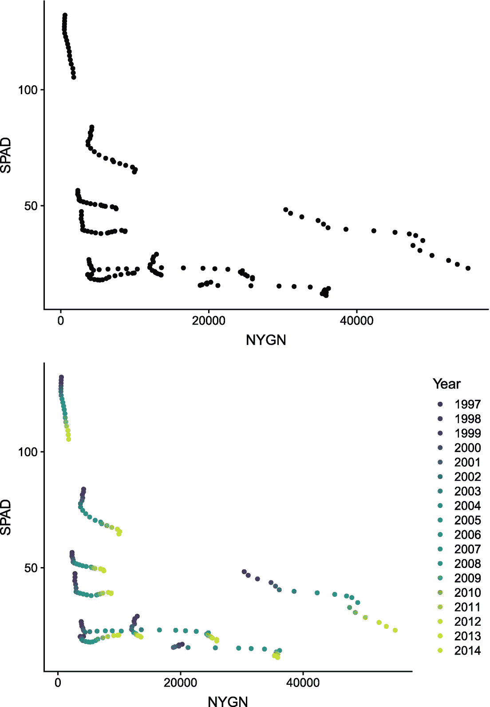

图 7-1

每千名妇女的人均国民生产总值和青少年生育率图

## 720 万美元

比较常见的分组算法之一是`kmeans`。我们可以使用`stats`包中名副其实的`kmeans()`函数在`R`中执行`kmeans`集群，该包是少数几个“附带”base `R`的包之一。

`kmeans` `()`有两个主要参数:包含连续数字数据的数据集`x`和告诉函数我们希望从数据中提取多少个聚类的中心数`k`。简而言之，该算法所做的是创建一组良好的 *k* 中心点，使得组内平方和(欧几里德距离的代表)最小化，给定我们指定的要提取的聚类数量的约束。

该算法的启动方式有一定的可变性，因此如果您希望您的分析具有可重复性，在`R`中设置随机启动种子是很重要的。我们通过使用值为`2468`的`set.seed()`函数来做到这一点，如果您想重现我们的结果，就应该使用这个函数。

接下来，初始化变量`wgss`以包含组内平方和。对于任何给定数量的聚类，这是算法寻求最小化的度量。

案例`k = 1`会很无聊，所以我们从两个中心开始，让我们的`for()`循环在 2 到 9 个中心上迭代算法，用于我们的`NYGN`对`SPAD`的数据。对于每次迭代，我们将组内平方和的总和存储在变量中，并绘制我们熟悉的数据图，这一次通过分配的分类成员关系来给点着色。

最后，我们在最后一个图块中添加了一个 scree 图，以显示聚类数与组内平方和的减少量相比的情况。最终的数字如图 [7-2](#Fig2) 所示。

```r
set.seed(2468)
wgss <- vector("numeric", 8)
plots <- vector("list", 9)
p1 <- ggplot(d, aes(NYGN, SPAD))

for(i in 2:9) {
  km <- kmeans(d[, .(NYGN, SPAD)],
             centers = i)

  wgss[i - 1] <- km$tot.withinss

  plots[[i - 1]] <- p1 +
    geom_point(aes_(colour = factor(km$cluster))) +
    scale_color_viridis(discrete = TRUE) +
    theme(legend.position = "none") +
    ggtitle(paste("kmeans centers = ", i))
}

plots[[9]] <- ggplot() +
  geom_point(aes(x = 2:9, y = wgss)) +
  xlab("Number of Clusters") +
  ylab("Within SS") +
  ggtitle("Scree Plot")

do.call(plot_grid, c(plots, ncol = 3))

```

在图 [7-2](#Fig2) 中，我们看到了各种可能的集群数量。请记住，在这种情况下，我们碰巧知道这些数据来自九个地理区域。然而，观察右下方的 scree 图，我们看到在 3 或 4 次之后，组内平方和的减少没有显著改善。作为一种无监督的学习技术，kmeans 向我们展示了这些数据的变化远小于仅基于地理的预期。

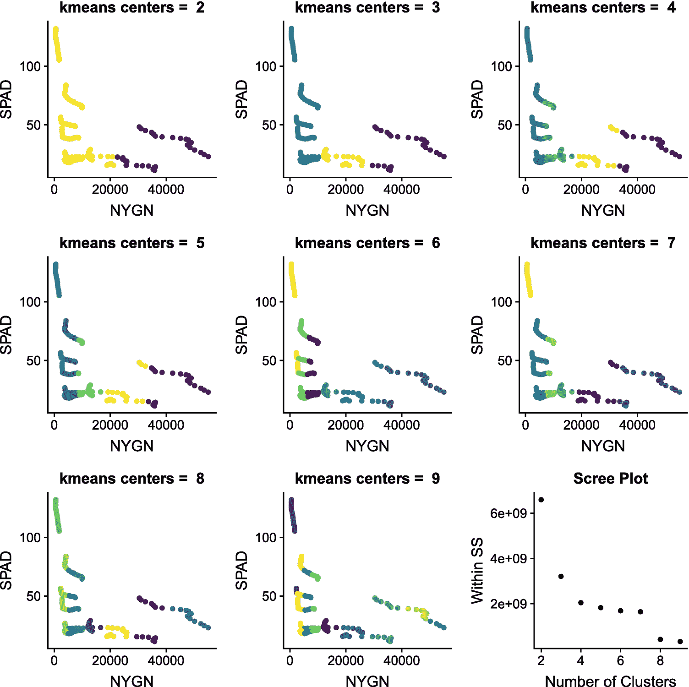

图 7-2

不同数量 k 组的人均国民生产总值和每千名妇女的青少年生育率图

注意图 [7-2](#Fig2) 中的主要因素似乎是 GNP。因为那是最远的距离，所以说它是决定因素是有道理的。kmeans 的目标是最小化每个组的中心和组成该组的点之间的距离。更仔细地看我们的数据，我们看到我们的两个变量之间的规模相当大的差异。也就是说，一个范围超过一百个左右，另一个超过几千个。

```r
summary(d[,.(NYGN, SPAD)])

##       NYGN            SPAD
##  Min.   :  487   Min.   : 11
##  1st Qu.: 3839   1st Qu.: 21
##  Median : 7060   Median : 38
##  Mean   :13453   Mean   : 45
##  3rd Qu.:19747   3rd Qu.: 53
##  Max.   :55010   Max.   :132

```

通常，数据的规模可能是相对任意的，并不表明在分析中哪个变量应该给予更大的权重。解决这类问题的一种方法是通过居中和缩放。中心数据从每个特征中减去数据的平均值，因此每个特征的平均值等于零。缩放将我们的数据除以每个特征的标准偏差，因此也有一个标准范围。base `R`中的`scale()`函数为我们处理这两种操作，并处理矩阵或数据框和数据表样式的数据。

```r
x <- scale(d[,.(NYGN, SPAD)])
summary(x)

##       NYGN            SPAD
##  Min.   :-0.92   Min.   :-1.04
##  1st Qu.:-0.68   1st Qu.:-0.74
##  Median :-0.46   Median :-0.21
##  Mean   : 0.00   Mean   : 0.00
##  3rd Qu.: 0.45   3rd Qu.: 0.26
##  Max.   : 2.96   Max.   : 2.72

```

现在我们可以重现上次绘制的图表，但使用的是我们缩放后的数据。这表明现在 y 轴高度是分组中的一个区分符(图 [7-3](#Fig3) )。

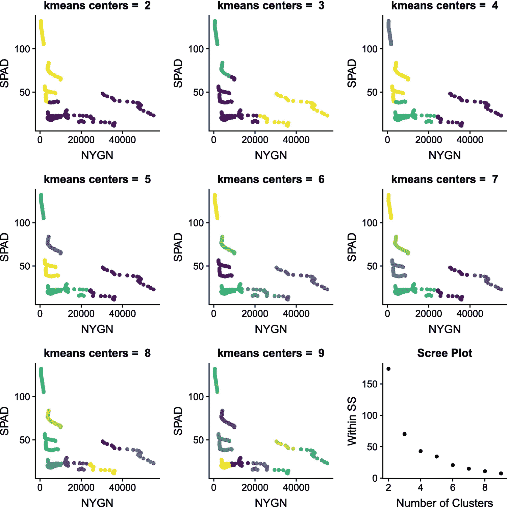

图 7-3

不同数量 k 组的人均国民生产总值和每千名妇女的青少年生育率图

```r
set.seed(2468)
wgss <- vector("numeric", 8)
plots <- vector("list", 9)
p1 <- ggplot(d, aes(NYGN, SPAD))

for(i in 2:9) {
  km <- kmeans(x, centers = i)

  wgss[i - 1] <- km$tot.withinss

  plots[[i - 1]] <- p1 +
    geom_point(aes_(colour = factor(km$cluster))) +
    scale_color_viridis(discrete = TRUE) +
    theme(legend.position = "none") +
    ggtitle(paste("kmeans centers = ", i))
}

plots[[9]] <- ggplot() +
  geom_point(aes(x = 2:9, y = wgss)) +
  xlab("Number of Clusters") +
  ylab("Within SS") +
  ggtitle("Scree Plot")

do.call(plot_grid, c(plots, ncol = 3))

```

通过缩放我们的数据，我们使 kmeans 更有可能根据 y 轴的生育率高度来识别各组，尽管在我们图表的左侧仍然很清楚，除了 GNP 之外，肯定还有一些因素可以解释各种生育率。同样，尽管规模很大，但我们从 scree 图中可以看出，“逻辑”组可能比我们选择的九个区域要少。事实上，如果我们稍微思考一下现实世界的地理情况，我们可能会决定六个组可能是最大值，并且查看各种 kmeans 图和 scree 图可能会向我们显示，在 6 之后，组内总平方和值的改善相对较小，甚至四个组也可能足够接近数据。

然而，假设我们决定将中心数设为 6，让我们看看将默认的最大迭代次数从 10 改变会得到什么。虽然在分组中有一些细微的差异，但我们真正注意到的是我们的视觉检查告诉我们的，无论如何，最右边的那个组是相当稀疏定义的(因此它切换组，因为它缺乏强信号)。最大迭代次数控制算法在排序过程中运行的次数。

`kmeans`取一组被称为质心的 *k* 随机起始点，然后根据哪个质心与该观测值的欧氏距离最小，为每个值(观测值)分配聚类成员。从那里，每个聚类中的所有点被用于计算新的质心，该质心现在位于该聚类的中心。所以现在有了第二代 *k* 形心，这意味着每一个点都要再次对照每个形心进行检查，并根据最小欧几里得距离分配聚类成员。如果组成员发生变化，那么每个聚类中的点将用于计算该组的中心，这将成为新的质心，我们现在有了第三代质心。重复该过程，直到组成员不再有变化或者达到最大迭代次数。在这种情况下，似乎由于弱信号，我们有一些点可以向任何一个方向移动，因此连续的迭代会导致一些成员关系的转换。结果如图 [7-4](#Fig4) 所示。

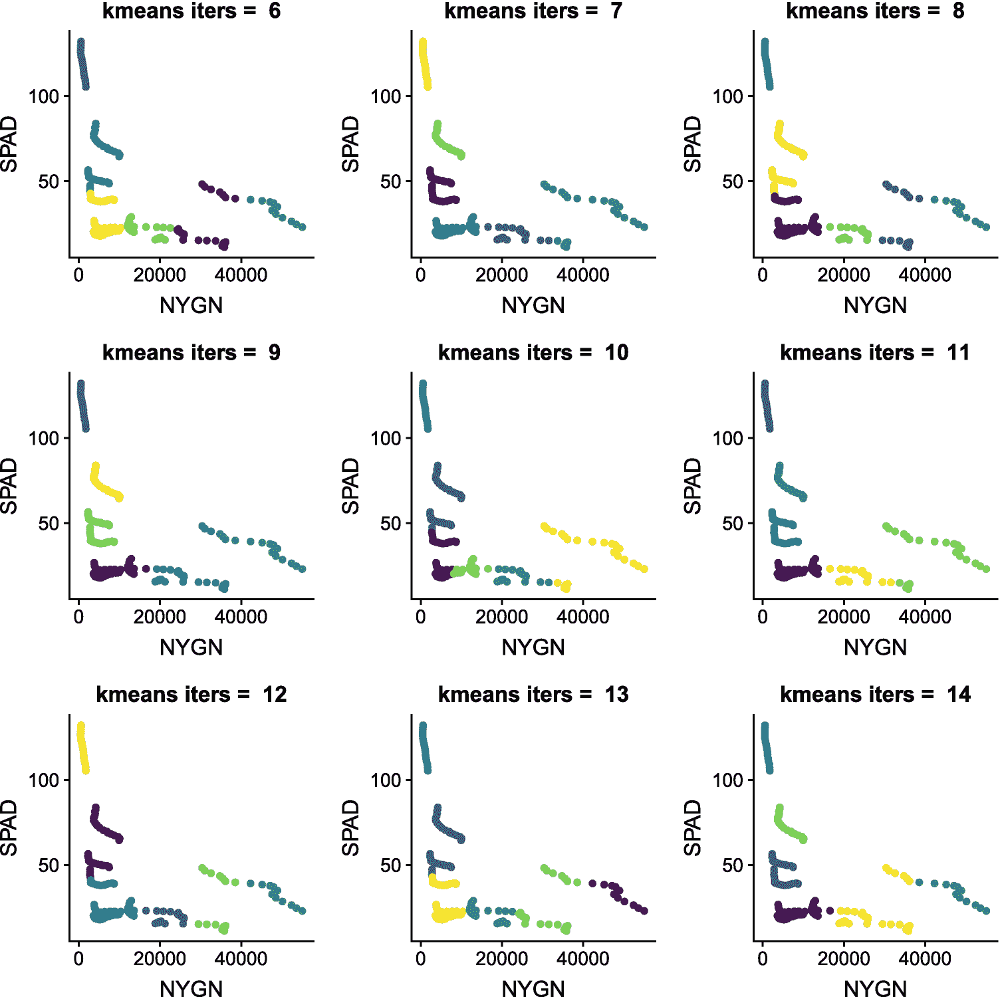

图 7-4

不同迭代次数下每 1 000 名妇女的人均国民生产总值和青少年生育率图

```r
set.seed(2468)
plots <- vector("list", 9)
p1 <- ggplot(d, aes(NYGN, SPAD))

for(i in 6:14) {
  km <- kmeans(x, centers = 6, iter.max = i)

  plots[[i - 5]] <- p1 +
    geom_point(aes_(colour = factor(km$cluster))) +
    scale_color_viridis(discrete = TRUE) +
    theme(legend.position = "none") +
    ggtitle(paste("kmeans iters = ", i))
}

do.call(plot_grid, c(plots, ncol = 3))

```

最后一个在`kmeans()`中定期修改的形式参数是`nstart`。kmeans 通过测量每个点到组中心的距离来计算组，并试图在每次迭代中使距离测量值变小。然而，对于第一代，在开始时，它会随机设置 *k 个*中心。因此，`nstart`决定了有多少不同的随机化竞争成为第一代 *k* 质心。该算法选择最佳选择作为开始第一代和运行下一次迭代的位置。尽管如此，在本例中，我们没有发现任何重大变化，如图 [7-5](#Fig5) 所示。

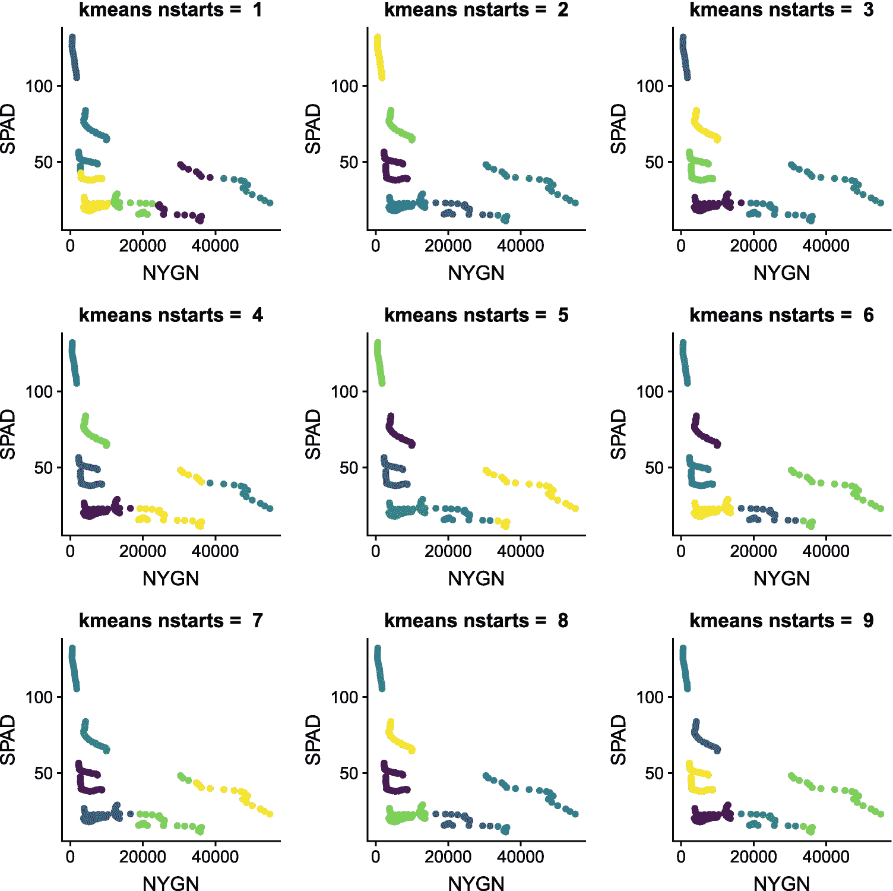

图 7-5

不同 nstart 值的人均国民生产总值和每 1 000 名妇女的青少年生育率图

```r
set.seed(2468)
plots <- vector("list", 9)
p1 <- ggplot(d, aes(NYGN, SPAD))

for(i in 1:9) {
  km <- kmeans(x, centers = 6, iter.max = 10, nstart = i)

  plots[[i]] <- p1 +
    geom_point(aes_(colour = factor(km$cluster))) +
    scale_color_viridis(discrete = TRUE) +
    theme(legend.position = "none") +
    ggtitle(paste("kmeans nstarts = ", i))
}

do.call(plot_grid, c(plots, ncol = 3))

```

虽然这些示例是在二维空间中完成的，但是我们可以在更高维的数据上执行 kmeans 聚类。虽然不可能通过二维图显示所有 11 个变量，但我们仍然可以观察 scree 图并确定最佳组数。我们执行与之前相同的计算，只是这次只绘制了碎石图。

```r
x <- scale(d[,-c(1,2)])
wgss<-0
set.seed(2468)
for( i in 1:11){
  km <- kmeans(x, centers = i)
  wgss[i]<-km$tot.withinss
}

ggplot() +
  geom_point(aes(x = 1:11, y = wgss)) +
  xlab("Number of Clusters") +
  ylab("Within SS") +
  ggtitle("Scree Plot - All Variables")

```

根据图 [7-6](#Fig6) 中的碎石图，我们确定了完整数据集的最佳组数。在这种情况下，我们可能选择 4，现在最后一次运行算法，看看分组会发生什么。结果存储在`kmAll`变量中，我们使用`cbind()`以及我们的国家名称和年份将这些结果绑定到我们的数据。

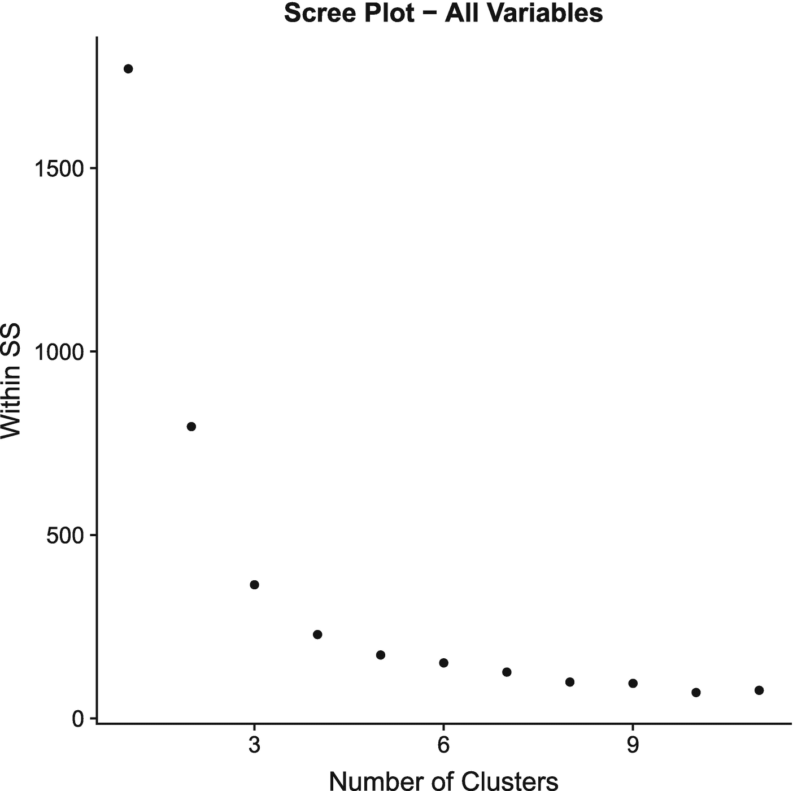

图 7-6

所有人的屏幕图

```r
kmAll <- kmeans(x, centers = 4, nstart = 25)
x <- cbind(d[, c(1,2)], x,
           Cluster = kmAll$cluster)
tail(x)

##     CntN Year  NYGD  NYGN SEPR ERMA SESC FEMA SPAD SPDY FEIN MAIN
## 1: Sb-SA 2009 -0.89 -0.87  2.4  2.3 -1.5 -1.5  2.2 1.11 -2.2 -2.2
## 2: Sb-SA 2010 -0.87 -0.87  2.5  2.4 -1.5 -1.5  2.1 0.95 -2.1 -2.1
## 3: Sb-SA 2011 -0.86 -0.86  2.4  2.3 -1.4 -1.4  2.1 0.81 -2.0 -2.0
## 4: Sb-SA 2012 -0.85 -0.84  2.4  2.3 -1.3 -1.4  2.0 0.68 -1.9 -1.9
## 5: Sb-SA 2013 -0.85 -0.84  2.4  2.3 -1.3 -1.3  1.9 0.56 -1.8 -1.8
## 6: Sb-SA 2014 -0.85 -0.83  2.4  2.3 -1.3 -1.4  1.9 0.45 -1.7 -1.7
##    SPPO Cluster
## 1:  2.2       1
## 2:  2.2       1
## 3:  2.2       1
## 4:  2.2       1
## 5:  2.1       1
## 6:  2.1       1

```

如果我们交叉列表显示病例属于一个国家和一个特定群集的频率，我们可以看到一些区域相当一致，而其他区域似乎偶尔改变群集。

```r
xtabs(~ CntN + Cluster, data = x)

##        Cluster
## CntN     1  2  3  4
##   ArbWr  0 18  0  0
##   CEatB  0  0  0 18
##   Er&CA  0  0  1 17
##   ErpnU  0  0 11  7
##   EsA&P  0 14  0  4
##   LtA&C  0 18  0  0
##   ME&NA  0 18  0  0
##   NrthA  0  0 18  0
##   Sb-SA 18  0  0  0

```

这是否意味着我们的算法失败了？首先，由于这是无监督的学习，答案很可能是，即使特定的地理区域没有被数据完全再现，经验结构仍然可以告诉我们一些有用的东西。此外，在这种情况下，我们的数据确实有时间成分。当我们按时间检查结果时，我们看到随着时间的推移，这种变化是一致的，一个区域切换集群成员。

```r
unique(x[
  order(CntN, Year, Cluster),
  .(CntN, Year, Cluster)][
    CntN=="EsA&P"])

##      CntN Year Cluster
##  1: EsA&P 1997       2
##  2: EsA&P 1998       2
##  3: EsA&P 1999       2
##  4: EsA&P 2000       2
##  5: EsA&P 2001       2
##  6: EsA&P 2002       2
##  7: EsA&P 2003       2
##  8: EsA&P 2004       2
##  9: EsA&P 2005       2
## 10: EsA&P 2006       2
## 11: EsA&P 2007       2
## 12: EsA&P 2008       2
## 13: EsA&P 2009       2
## 14: EsA&P 2010       2
## 15: EsA&P 2011       4
## 16: EsA&P 2012       4
## 17: EsA&P 2013       4
## 18: EsA&P 2014       4

unique(x[
  order(CntN, Year, Cluster),
  .(CntN, Year, Cluster)][
    CntN == "ErpnU"])

##      CntN Year Cluster
##  1: ErpnU 1997       4
##  2: ErpnU 1998       4
##  3: ErpnU 1999       4
##  4: ErpnU 2000       4
##  5: ErpnU 2001       4
##  6: ErpnU 2002       4
##  7: ErpnU 2003       4
##  8: ErpnU 2004       3
##  9: ErpnU 2005       3
## 10: ErpnU 2006       3
## 11: ErpnU 2007       3
## 12: ErpnU 2008       3
## 13: ErpnU 2009       3
## 14: ErpnU 2010       3
## 15: ErpnU 2011       3
## 16: ErpnU 2012       3
## 17: ErpnU 2013       3
## 18: ErpnU 2014       3

```

正如我们所看到的，`kmeans()`是一种将相似案例分组在一起的方法，尽管我们的数据出于教学目的而被标记，但并不要求我们的数据有标签。使用 scree 图和`for`循环，可以确定合理的最佳聚类，以便将数据组织到相似的组中。在某种程度上，这是探索性数据分析的最后一步，因为结果可能会对您组织的客户或您研究的参与者有所启发。但是，请记住，未缩放的数据可能会对某些维度赋予不同的权重，并且算法的目标是最小化欧几里德距离，这可能不会产生人眼可能看到的相同的明显分组。

## 7.3 分级集群

虽然`kmeans`开始时选择`k`个任意中心，并将每个点分配到最近的中心，然后重复该过程一定次数，但层次聚类是不同的。取而代之的是，每个点被分配到它自己唯一的簇中——你有多少个点就有多少个组！然后，确定每个点之间的距离，并找到最近的邻居。邻居然后加入一个更大的群体。这个过程一直重复，直到最后两个超群合并成一个大群。

因为这依赖于距离，所以第一步是计算每个点与其他每个点的距离。距离函数再次默认为欧几里德距离。因此，在最基本的情况下，这也需要连续的数字数据。然而，可以编写定制的距离函数，允许其他类型的“距离”只要输出是距离矩阵，其中较大的数字表示较大的距离，该算法将进行处理(尽管该处理的功效当然不能保证)。

第一阶段是对我们的数据使用`dist()`函数。为了建立我们的直觉，我们只使用二维数据。

```r
hdist <- dist(d[,.(NYGN, SPAD)])
str(hdist)

##  'dist' num [1:13041] 1.13 22.04 100.03 186.5 166.08 ...
##  - attr(*, "Size")= int 162
##  - attr(*, "Diag")= logi FALSE
##  - attr(*, "Upper")= logi FALSE
##  - attr(*, "method")= chr "euclidean"
##  - attr(*, "call")= language dist(x = d[, .(NYGN, SPAD)])

```

生成的对象编码了 2D 数据集中每个点之间的相对距离。该信息被传递给`hclust()`函数，该函数创建了我们的层次集群，可以通过调用`plot()`来绘制该集群。这是一个树状图，每个线段的高度显示了我们数据的任意两行/观察值之间的距离。该图如图 [7-7](#Fig7) 所示。

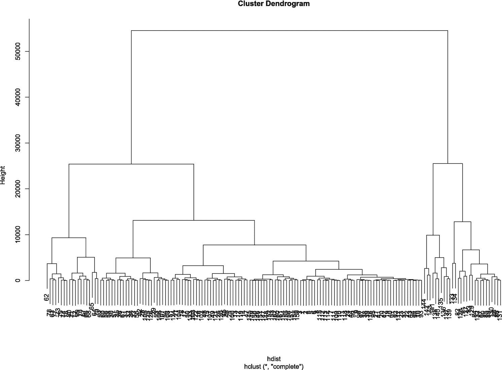

图 7-7

带行号的聚类树状图

```r
hclust <- hclust(hdist)
plot(hclust)

```

请注意，这里使用了行名，在这种情况下，行名是数字，没有太大的帮助。我们可以设置一个关键列，以便更好地理解这个树状图。虽然这不是最清晰的图，但人们确实注意到，在图 [7-8](#Fig8) 中，相似的区域似乎经常彼此紧密相连。

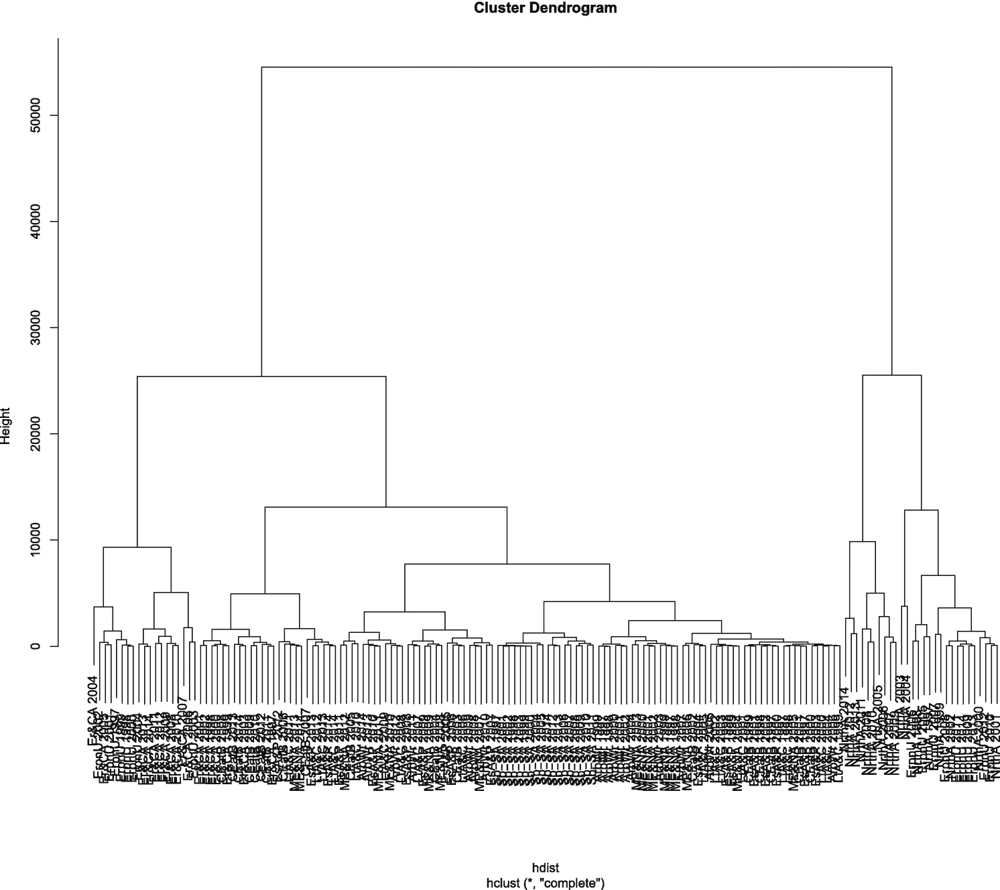

图 7-8

通过 ape 包改变树状图

```r
x <- d[, .(CntN, Year, NYGN, SPAD)]
x[, Key := paste(CntN, Year)]
x[, CntN := NULL]
x[, Year := NULL]

hdist <- dist(x[,.(NYGN, SPAD)])
hclust <- hclust(hdist)
plot(hclust, labels = x$Key)

```

现在，虽然`kmeans`可能更简单，但它显示了一个最终结果，即一个人选择多少组就有多少组。因此，scree 图对于确定多少个集群可能有意义是有价值的。在这里，每一行都从自己的组开始，然后每一个邻居都被系统地连接成对。

高度向我们显示了任何两个相连组之间的距离。此外，请注意，对于给定的高度，我们可以了解我们的数据适合多少“组”。

```r
plot(hclust, labels = x$Key)
abline(h = 30000, col = "blue")

```

在`h = 30,000`的高度，如图 [7-9](#Fig9) 所示，我们只有两组。一组包括北美(NrtA)和 2000 年代的大部分欧盟国家(普尔)，而另一组包括其余国家。看一下摘要以及对我们的父数据的几个数据表调用表明，主要高度(记住，这是基于欧几里德距离的)可能是 GNP (NYGN)。请注意，这很好地说明了为什么一旦我们完成了探索性的工作，扩展我们的数据仍然很重要。如果我们不努力确保数据列大致相等，GNP (NYGN)之类的东西可能会淹没其他显著特征。

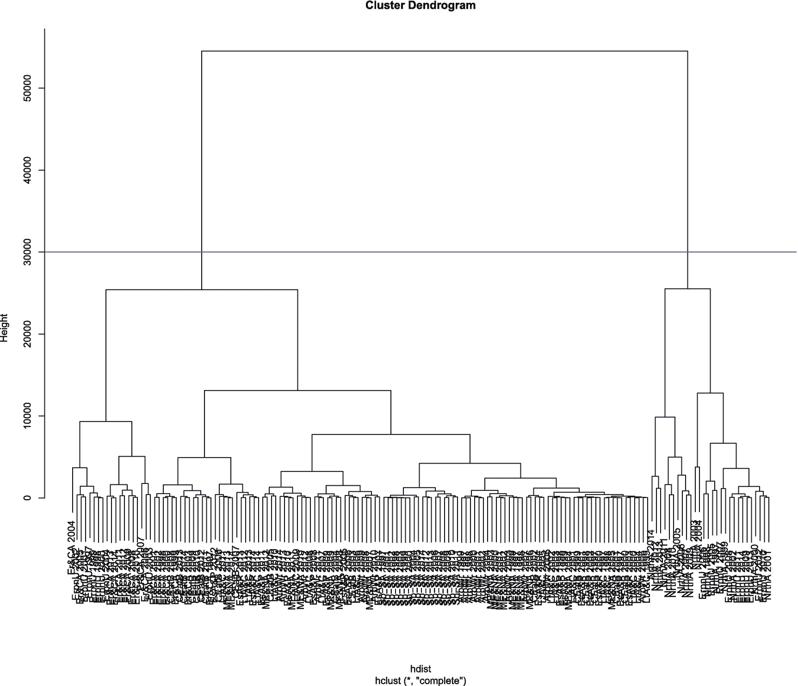

图 7-9

带有国家名称、年份和高度线的聚类树状图

```r
summary(x)

##       NYGN            SPAD         Key
##  Min.   :  487   Min.   : 11   Length:162
##  1st Qu.: 3839   1st Qu.: 21   Class :character
##  Median : 7060   Median : 38   Mode  :character
##  Mean   :13453   Mean   : 45
##  3rd Qu.:19747   3rd Qu.: 53
##  Max.   :55010   Max.   :132

d[, mean(NYGN), by = CntN][order(V1)]

##     CntN    V1
## 1: Sb-SA   953
## 2: ArbWr  4260
## 3: ME&NA  5045
## 4: EsA&P  5801
## 5: LtA&C  6004
## 6: CEatB  8531
## 7: Er&CA 19021
## 8: ErpnU 28278
## 9: NrthA 43188

d[, mean(SPAD), by = CntN][order(V1)]

##     CntN  V1
## 1: ErpnU  15
## 2: EsA&P  20
## 3: CEatB  23
## 4: Er&CA  23
## 5: NrthA  37
## 6: ME&NA  40
## 7: ArbWr  52
## 8: LtA&C  73
## 9: Sb-SA 120

```

调整我们的`abline()`的高度允许我们改变我们查看数据的方式，现在它在四个集群中。现在，特别是在书本形式中，很难清晰地打印出如此大的图表，尽管我们最好的尝试是在图 [7-10](#Fig10) 中。试着在你自己的机器上运行代码，记住我们还处于探索阶段。这有助于我们理解国家之间的相似性，以及这两个维度的结构。

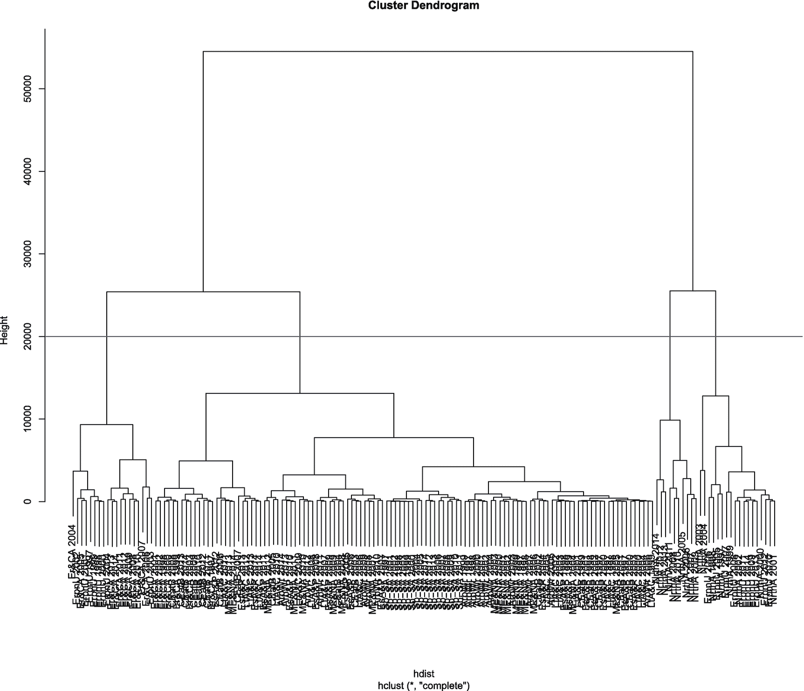

图 7-10

带有国家名称、年份和另一条高度线的聚类树状图

```r
plot(hclust, labels = x$Key)
abline(h = 20000, col = "blue")

```

考虑到维度，认识到这个模型非常适合可视化整个数据集——在所有列上。它只需要对我们的代码做一点小小的调整，而不是将变量限制为两个。当然，高度测量将发生巨大变化，因为我们现在有一个更大的空间来填充我们的欧几里德距离。此外，如图 [7-11](#Fig11) 所示，最后两个分组将撒哈拉以南非洲(S-SA)与我们的其他地区联系在一起。

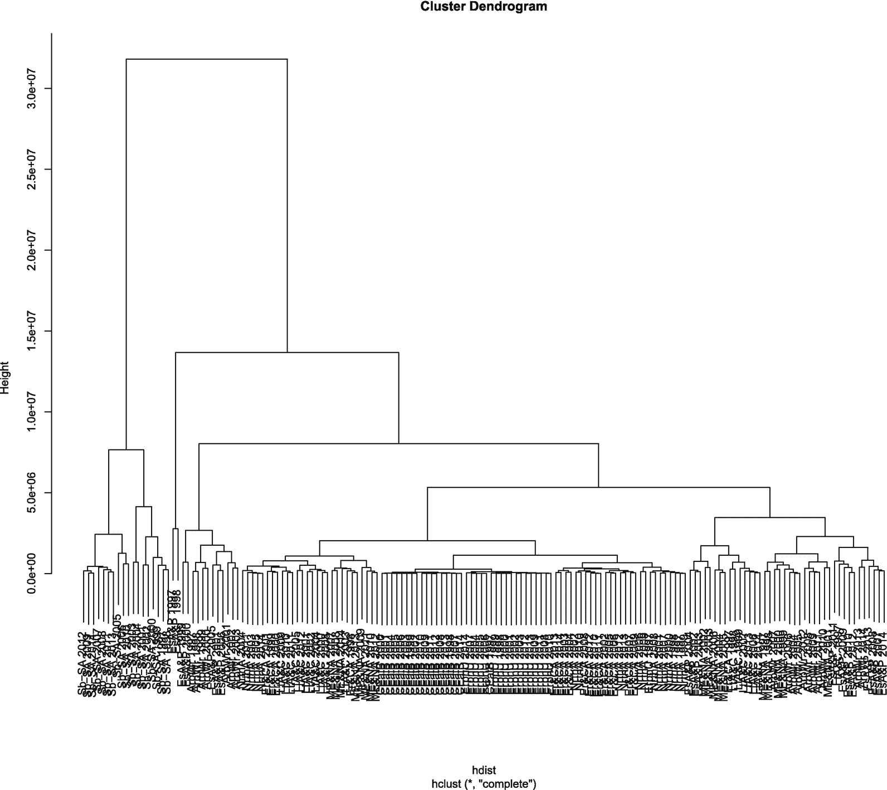

图 7-11

带有国家名称、年份和所有维度数据的聚类树状图

```r
x <- copy(d)
x[, Key := paste(CntN, Year)]
x[, CntN := NULL]
x[, Year := NULL]

hdist <- dist(x[, -12])
hclust <- hclust(hdist)

plot(hclust, labels = x$Key)

```

现在，`hclust`函数将距离矩阵作为第一个形式参数，将方法类型作为第二个形式参数。第二个形式参数默认为“complete ”,它使用聚类点之间的最大距离来确定组距离，然后总是根据该最大距离对最近的组进行分组。其他方法将产生不同的结果，因为它们选择使用其他方法(例如最小化类内方差的迭代增加)。请注意，这里我们没有刷新我们的`hdist`矩阵——我们只是简单地改变了使用的方法。结果如图 [7-12](#Fig12) 所示。

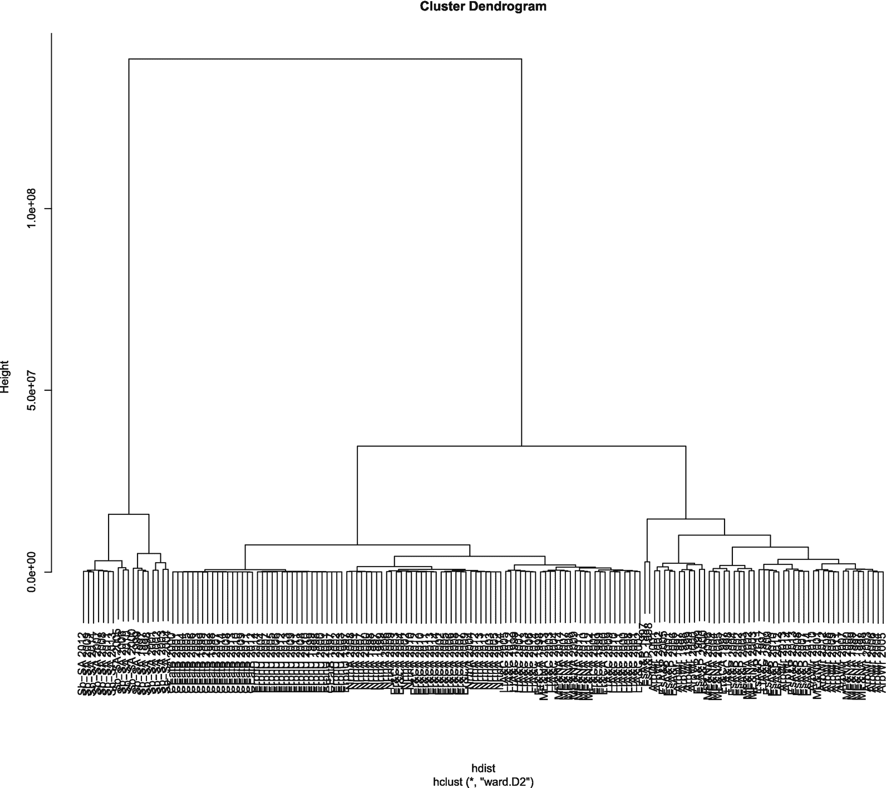

图 7-12

使用 ward 聚类树图。D2 方法

```r
hclust <- hclust(hdist, method = "ward.D2")
plot(hclust, labels = x$Key)

```

值得注意的是，欧几里德距离可以被替换为一些其他的距离度量；事实上，有几个内置选项。除了内置函数之外，在不太深奥的情况下，使用一些对推文进行情感分析的函数来确定某个特定趋势标签有多少组意见可能是有意义的。当然，一旦情感分析被转换成一些数字，在这些数字上使用欧几里德距离也许是有意义的。在任何情况下，关键是，不要求数据从数字级别开始。

如前所述，尤其是当我们在分析中增加更多维度时，如果不调整数据，范围最大的列将对我们的分组产生巨大的影响。缩放后，使用所有变量并重新绘图，结果如图 [7-13](#Fig13) 所示。

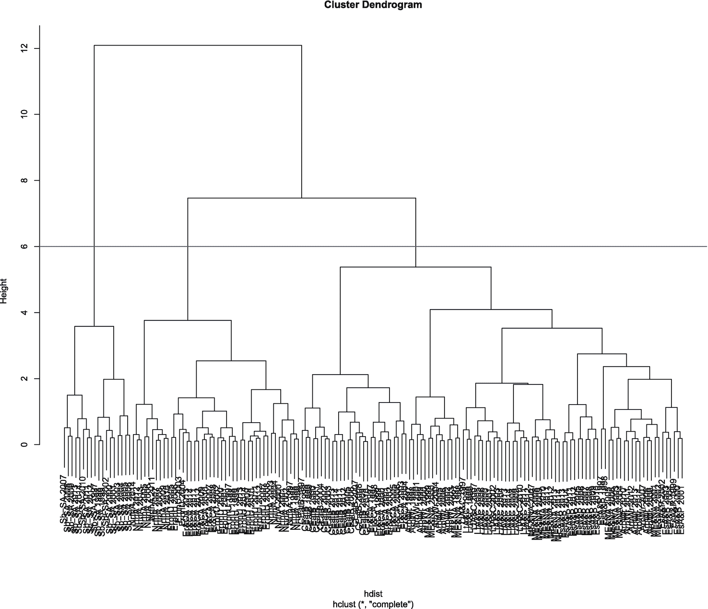

图 7-13

带标度的聚类树状图

```r
x <- scale(d[,-c(1,2)])
row.names(x) <- paste(d$CntN, d$Year)
hdist <- dist(x)
hclust <- hclust(hdist)

plot(hclust, labels = paste(d$CntN, d$Year))
abline(h = 6, col = "blue")

```

现在，虽然我们可以选择根据一定的高度来砍伐我们的树，但这只是直观地向我们展示了我们的群体是如何排列的。我们还可以使用`cutree()`函数在某个高度对我们的数据进行聚类。在 *h = 6* 的情况下，这将我们的树分成三组，我们可以看到这个函数给了我们。

```r
cut_hclust <- cutree(hclust, h = 6)
unique(cut_hclust)

## [1] 1 2 3

```

或者，不是在特定的高度上切割，而是在一定数量的簇上切割。通过创建数据的副本，我们可以在名为 cluster 的新列中记录集群分配。

```r
dcopy <- as.data.table(copy(d))
dcopy[, cluster:= NA_integer_]

dcopy$cluster <- cutree(hclust, k = 3)

tail(dcopy)

##     CntN Year NYGD NYGN    SEPR    ERMA SESC FEMA SPAD SPDY FEIN MAIN
## 1: Sb-SA 2009 1198 1186 1.9e+07 1.6e+07  8.2  9.4  115 11.5   58   55
## 2: Sb-SA 2010 1555 1287 2.0e+07 1.6e+07  8.3  9.4  113 11.0   58   55
## 3: Sb-SA 2011 1706 1412 1.9e+07 1.5e+07  8.4  9.6  111 10.7   59   56
## 4: Sb-SA 2012 1740 1631 1.9e+07 1.6e+07  8.6  9.7  109 10.3   60   57
## 5: Sb-SA 2013 1787 1686 1.9e+07 1.5e+07  8.9  9.9  107 10.0   61   57
## 6: Sb-SA 2014 1822 1751 1.9e+07 1.6e+07  8.7  9.7  105  9.7   61   58
##    SPPO cluster
## 1:   89       3
## 2:   89       3
## 3:   88       3
## 4:   88       3
## 5:   87       3
## 6:   87       3

```

为了结束我们关于层次化集群的部分，我们提到了`ape`包，它有几个可视化选项，可以显示默认情况下由`plot()`提供的树状图。诚然，用较少的类别来可视化模型更容易。请记住，在无监督学习的通常应用中，一个自然的目标是确定合理存在多少个类别。所以我们的教学例子将不仅仅是有点笨拙，正是因为我们保持了一个相当广泛的，固定的类别集。我们在图 [7-14](#Fig14) 中展示了结果。

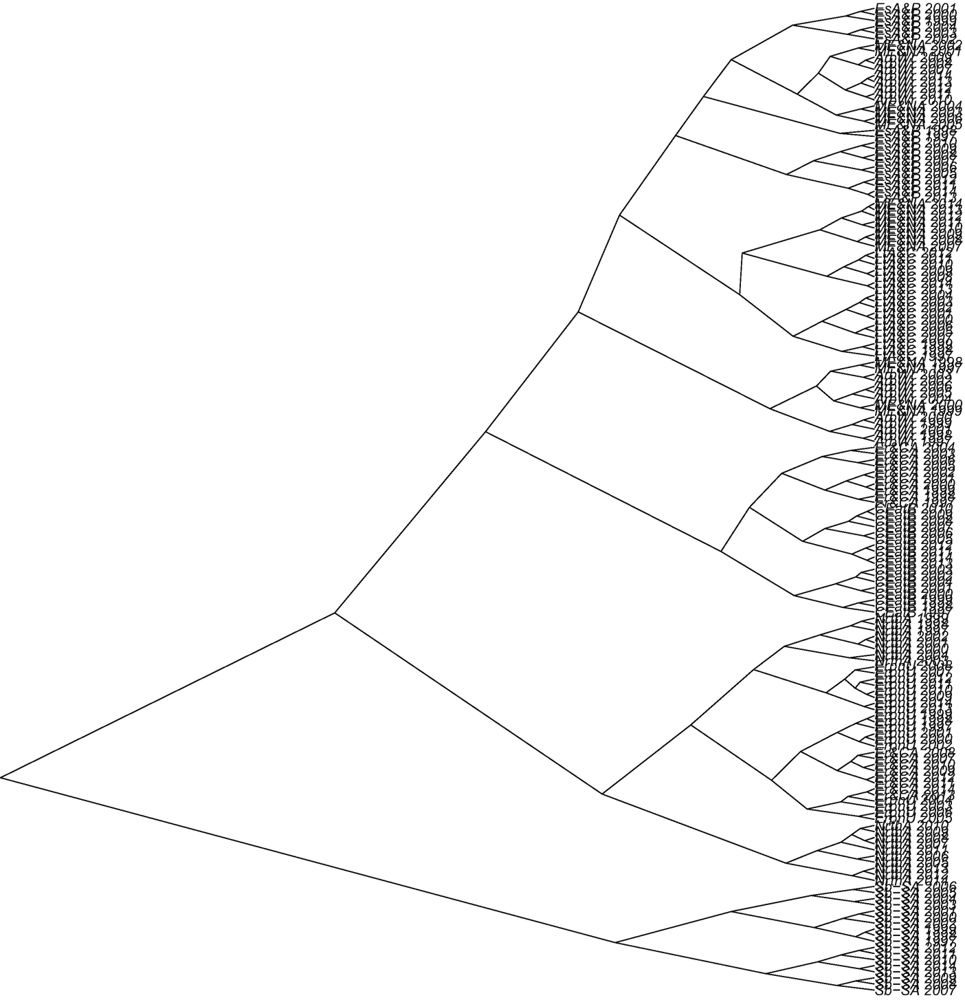

图 7-14

通过 ape 包改变树状图

```r
plot(as.phylo(hclust), type = "cladogram")

plot(as.phylo(hclust), type = "fan")

plot(as.phylo(hclust), type = "radial")

```

分级聚类的部分优势在于，它们可以是一种可视化观察结果之间的相似性和不相似性的方式。作为这个过程的一部分，将树分成清晰的组可能是一个有用的步骤。现在，基于我们早期的 kmeans 分析，我们相信可能有四个重要的组，所以我们尝试可视化。这里，`cutree()`的第二个形式参数被设置为用`k = 4`期望的集群数。此外，`as.phylo()`函数用于将我们的`hclust`对象转换成供`ape`包使用的对象类型(一个`phylo`对象)。我们展示了一种新的图表类型— `unrooted—`和一个`label.offset`，它在我们的标签和图表之间提供了一些距离(从而在我们的人类友好但适合图表不友好标签的字符之间创建了一些非常重要的空间)。最后，我们在`tip.color`参数中引入`cutree()`信息，并用`cex`缩小文本的放大倍数。最终结果如图 [7-15](#Fig15) 所示。

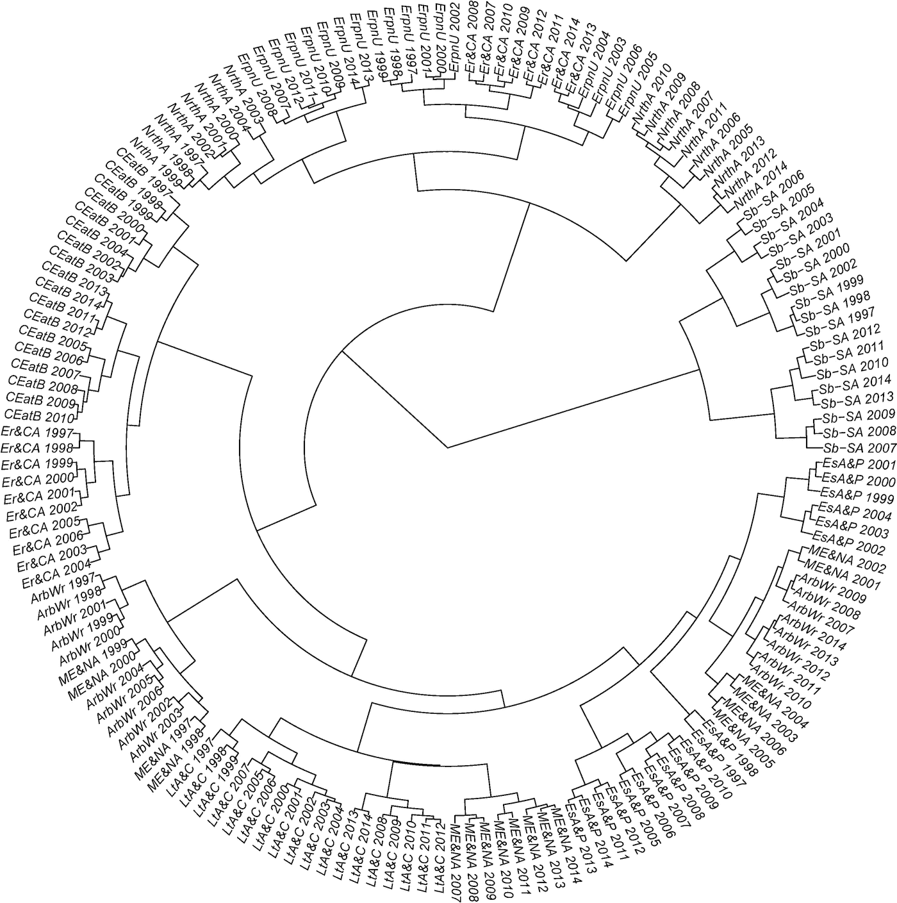

图 7-15

通过 ape 包改变树状图

```r
hclust4 <- cutree(hclust, k = 4)
plot(as.phylo(hclust), type = "unrooted", label.offset = 1,
     tip.color = hclust4, cex = 0.8)

```

请注意，该图本身是基于原始的层次聚类模型的—只有尖端的颜色用于将我们的数据分组为配对(但是这些配对在该图中是有意义的)。

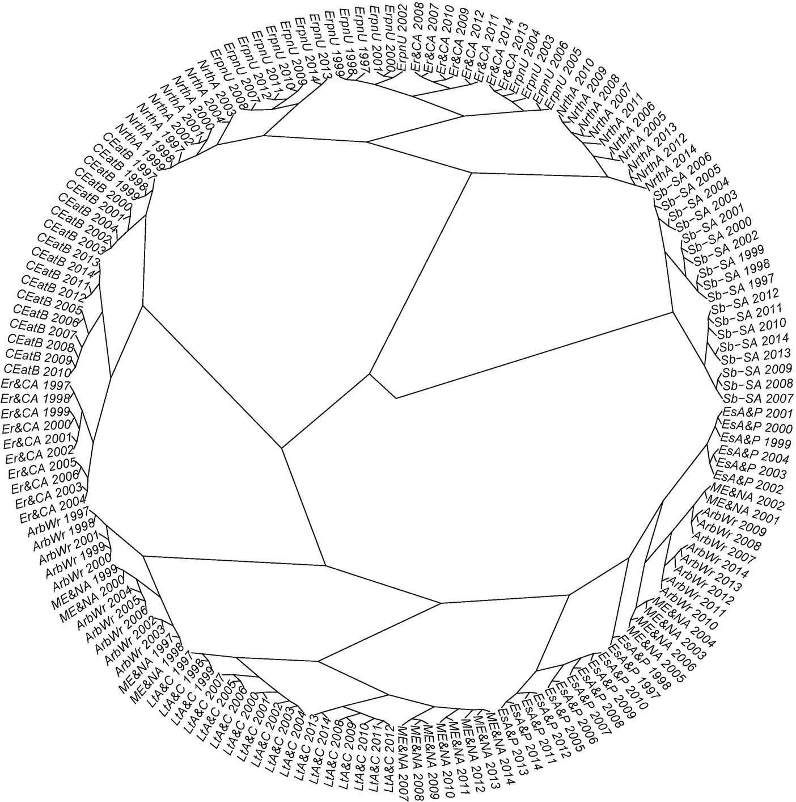

图 7-16

通过 ape 包改变树状图

## 7.4 主成分分析

到目前为止，在无监督学习中，我们已经看到了两种技术来了解我们的数据中有多少组或簇。一个是`kmeans`，它被预先告知应该找到多少个组(可能基于 scree plot 分析)。另一个是`hclust`，将每个观察结果放在单个组中，然后最终将这些点连接起来，直到只有一个组。分析员要看哪些观察值最接近，哪些子群最接近。主成分分析(PCA)也试图以某种方式确定组。PCA 将数据分解成独特的(即不相关的、独立的、正交的)分量。例如，在我们的数据集中，我们可以想象 GDP 和 GNP 在某种程度上是相关的。其实它们是高度相关的！这些本质上都是一样的。甚至他们的范围和手段都相当接近，如图 [7-18](#Fig18) 所示。

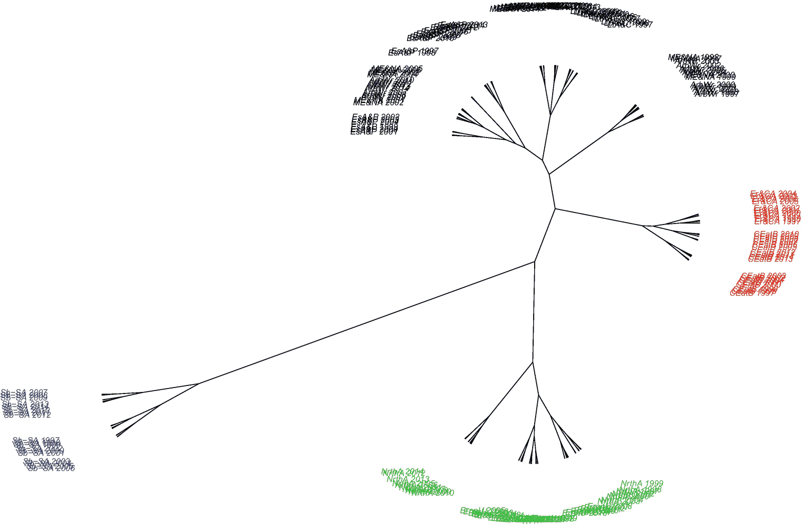

图 7-17

四个集群上的无根类型

```r
cor(d$NYGD, d$NYGN)

## [1] 1

summary(d[,.(NYGD, NYGN)])

##       NYGD            NYGN
##  Min.   :  496   Min.   :  487
##  1st Qu.: 3761   1st Qu.: 3839
##  Median : 7458   Median : 7060
##  Mean   :13616   Mean   :13453
##  3rd Qu.:19708   3rd Qu.:19747
##  Max.   :54295   Max.   :55010

ggplot(d, aes(NYGD, NYGN)) +
  geom_point()

```

从视觉上看，图 [7-18](#Fig18) 本质上是直线 *y* = *x* 。主成分分析可以认为是一种分组操作。分组的目的是看看我们有多少真正的*独特维度。在这种情况下，虽然看起来我们在数据集中有两个不同的列，但事实是我们实际上只有一个唯一信息列(维度)似乎是合理的。*

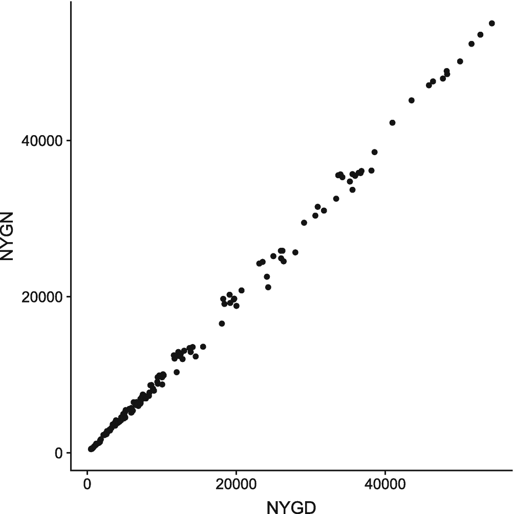

图 7-18

一个高度相关的图——这里真的有二维吗？

主成分分析(PCA)允许我们做的是确定我们不需要两列，并以有原则的方式将它们组合成一个维度。这将简化我们的特征空间，正如我们所看到的，不会导致太多的信息损失。另一方面，如果我们看看其他一些变量，我们会发现简单地删除一列以支持另一列是没有意义的。即使它们高度相关，仍然清楚的是，有时，特别是在某一点上，`SE.SCH.Life.FE` (SESC)有相当多的变化，而 GDP(纽约市)变化很小，如图 [7-19](#Fig19) 所示。显然，这里有不止一个维度的信息。

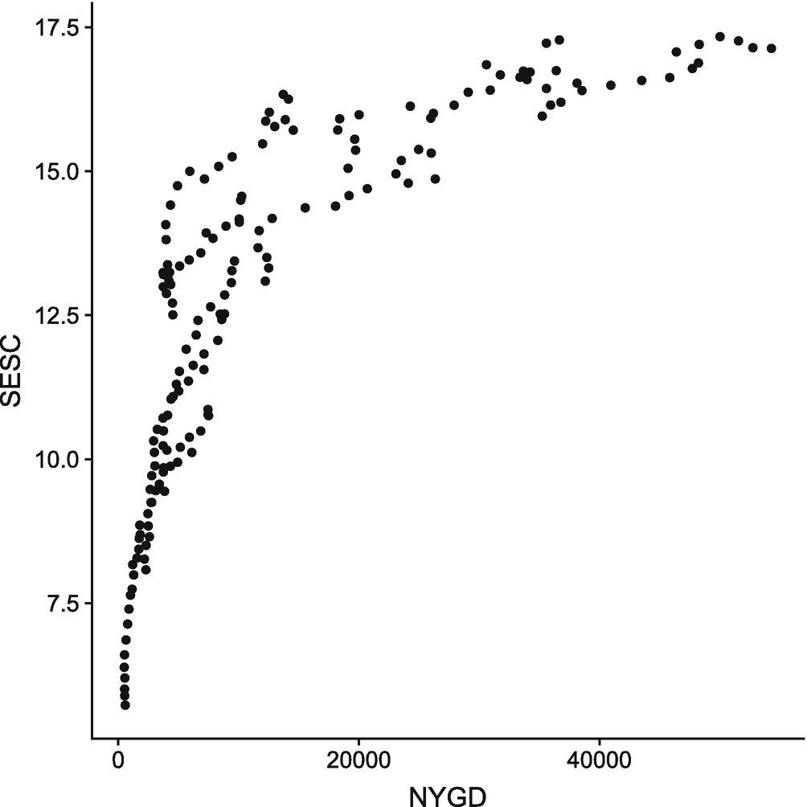

图 7-19

一个高度相关的图——这里真的有二维吗？

```r
ggplot(d, aes(NYGD, SESC)) +
  geom_point()

cor(d$NYGD, d$SESC)

## [1] 0.79

```

与 PCA 相关的技术是因子分析(FA)。这两种方法都具有探索性，因为数据的真实维度是未知的，尽管存在验证性 FA，其目标是测试假设的维度。此外，PCA 和 FA 都试图找到一个更低维的空间来提供数据的合理近似。但是，PCA 和 FA 也有很多不同之处。它们来自不同的理论背景，对主成分(PCA)和因子(FA)的解释也不相同，对数据的基本假设也不同。一个显著的区别是 FA 通常关注变量间的共享方差，而 PCA 包含共享和唯一方差。这种差异是由于 PCA 和 FA 的基础和目标不同。FA 来源于心理测量学的传统，通常与专门设计的测试一起使用，例如，分析考试中的不同问题或旨在测量智商或评估某些心理结构的多个问题。在一次考试中，所有问题的目标是提供一个学生对课程整体理解的指数，这是无法直接观察到的。与任何给定测试问题特有的方差相比，问题间共享的方差被认为是整体理解的更好指标，任何给定测试问题特有的方差可能代表措辞不当的问题、某个特定概念的糟糕教学或对特定概念缺乏理解。在 PCA 中，目标通常是用尽可能少的维度再现更高维的空间。因此，如果考试中的一个问题与任何其他问题没有太多重叠，PCA 不会认为这是整体表现的潜在不良指标，而是认为这是另一个需要的独特维度。一般来说，PCA 在机器学习中使用得更多，因为它较少建立在任何特定的理论或信念上，即一组项目应该有一些共享的重叠，并且因为使用 PCA 通常更容易包括足够多的成分，使得原始数据几乎可以完美地恢复，但是是从更小的维度集恢复。

PCA 所做的是查看我们的数据，并将左右移动数据的部分与上下移动数据的部分分开，换句话说，分成主要成分。如果你有线性代数的背景，标准 PCA 是协方差(或者如果标准化，相关性)矩阵的特征值分解。无论如何，我们都要回到我们的主题，看看我们感兴趣的两列。再次参考这两部的原著剧情。

`pca()`函数既有对`scale`数据的参数，如果设置为“uv ”,则将方差设置为 1(单位方差),如果设置为`TRUE`,则将数据设置为零`center`。传统类型的 PCA 基于特征值和奇异值分解(SVD)，因此对于传统 PCA，我们告诉`pca()`函数使用`method = "svd"`。

首先，我们只收集国民生产总值的原始数据。PCAP 对阿多。TFRT 进入我们的工作数据集，`x`。计算主成分分析非常简单，我们可以立即缩放和集中我们的数据，并使用奇异值分解来估计传统的主成分分析。`summary()`函数向我们显示了每个主成分可以单独解释总方差的多少，另一行显示了解释的累积方差。在只有两个变量的情况下，100%的方差， *R* <sup>2</sup> = 1，可以用两个主成分来解释。

```r
x <- d[,.( NYGN, SPAD)]
res <- pca(x, method="svd", center=TRUE, scale = "uv")

summary(res)

## svd calculated PCA
## Importance of component(s):
##                  PC1    PC2
## R2            0.7213 0.2787
## Cumulative R2 0.7213 1.0000

```

为了将我们的结果可视化，我们可以创建一个图表，显示原始数据是如何转换为双标图的，如图 [7-20](#Fig20) 所示。你能认出正交旋转吗？当然，不仅仅是轮换在起作用。PC1 变量是可以用一条直线解释的最大方差。差异的剩余部分预计到 PC2。`biplot()`函数显示新空间中原始数据值的向量。

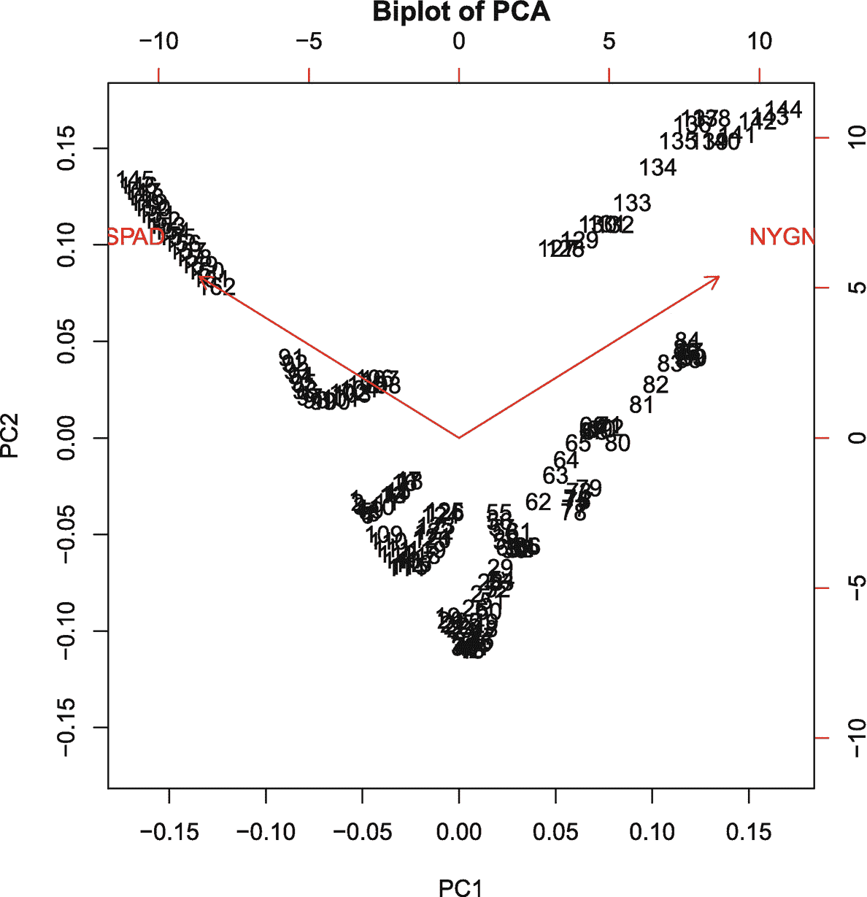

图 7-20

原始数据和主成分分析的比较

```r
biplot(res, main = "Biplot of PCA")

```

接下来，我们将检查当我们使用所有变量进行 PCA 时会发生什么。我们可以绘制一个 scree 图，看看当我们添加额外的主成分时，精度如何提高，作为一种尝试确定需要多少成分才能充分代表数据中的基本维度的方法。我们为数据中的列数设置了一个额外的参数,`nPcs,`,这是我们可能需要的主成分的最大可能数量，尽管如果我们数据的真实维度更少，那么很少的成分可能足以代表数据。

我们使用图 [7-21](#Fig21) 中的`plot()`函数绘制了从较少维度恢复的原始信息的比例图，这是一种反向 scree 图。再次查看 scree 图，我们会发现这里实际上只有 4 个维度的独特数据，即使只有一个维度也能够捕捉 11 个变量中超过一半的方差。

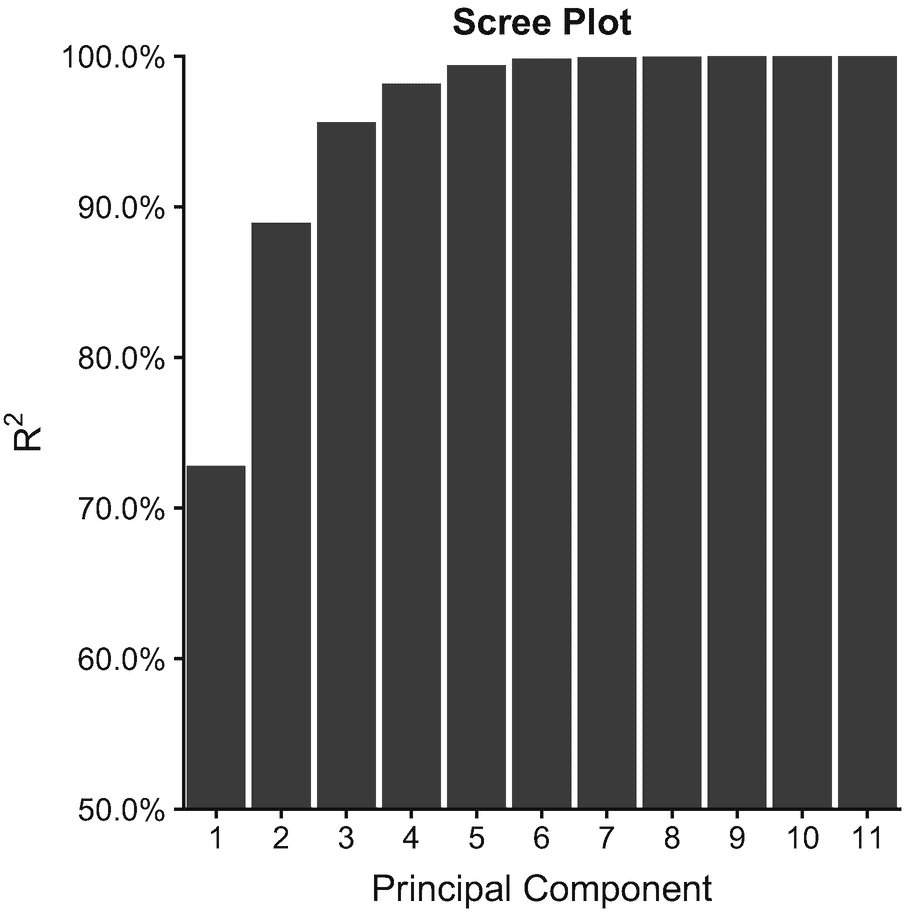

图 7-21

数据中所有特征的传统 PCA 的 Scree 图

```r
x <- d[, -c(1,2)]
res <- pca(x, method="svd", center=TRUE, scale = "uv",
           nPcs = ncol(x))

summary(res)

## svd calculated PCA
## Importance of component(s):
##                  PC1    PC2     PC3     PC4     PC5     PC6    PC7
## R2            0.7278 0.1614 0.06685 0.02554 0.01226 0.00447 0.0011
## Cumulative R2 0.7278 0.8892 0.95607 0.98161 0.99387 0.99834 0.9994
##                   PC8    PC9  PC10  PC11
## R2            0.00021 0.0002 1e-04 5e-05
## Cumulative R2 0.99965 0.9999 1e+00 1e+00

## reverse scree plot
ggplot() +
  geom_bar(aes(1:11, cumsum(res@R2)),
           stat = "identity") +
  scale_x_continuous("Principal Component", 1:11) +
  scale_y_continuous(expression(R^2), labels = percent) +
  ggtitle("Scree Plot") +
  coord_cartesian(xlim = c(.5, 11.5), ylim = c(.5, 1),
                  expand = FALSE)

```

我们也可以从这个 PCA 创建双绘图，但是一次只能绘制两个组件。图 [7-22](#Fig22) 显示了前两个组成部分的结果，它们共同解释了大部分的差异。

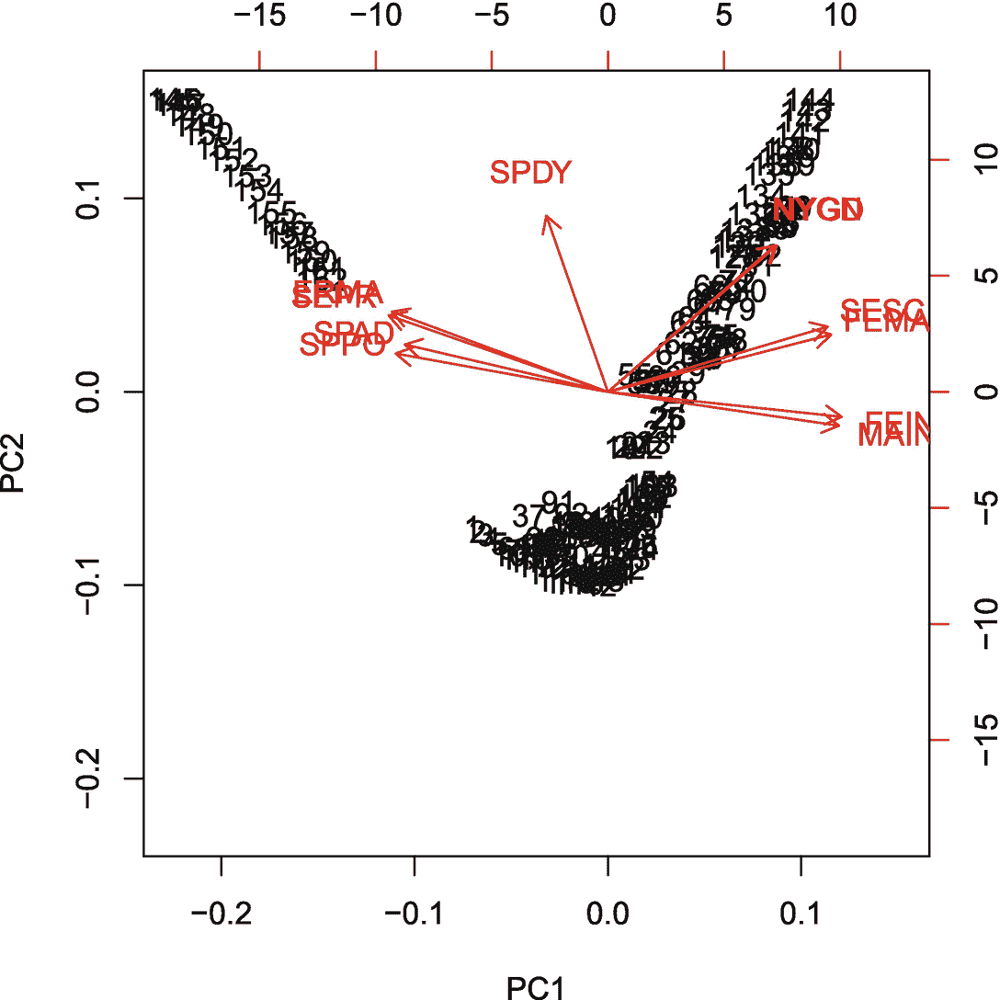

图 7-22

前两个主成分的双标图

```r
biplot(res, choices = c(1, 2))

```

顺便提一下，现在我们在`res`变量中有了我们的数据，我们可以使用该数据(以及尽可能多的列，比如前四列)来代替我们的原始数据。特别是，如果我们希望执行监督机器学习技术，正如下一章所讨论的，使用 PCA 数据可能会有优势。例如，来自我们的 PCA 的结果表明，我们可以用四个分量捕获所有 11 个原始特征中除 2%之外的所有变化。

使用主成分代替原始特征的优点是主成分是正交的。缺点是，由于每一个主成分分析都可能包含几个原始变量，因此很难准确解释每一个特征意味着什么或代表什么。但是，如果模型的预测能力得到提高或者是唯一的目标，这可能是我们愿意做出的权衡。在某些情况下，它还可以加速模型计算，因为后期分析只需管理较少的要素，从而减少分析所需的内存和计算。

我们使用`scores()`函数提取主成分得分，查看前几行，然后使用相关矩阵显示它们确实是线性独立的。

```r
head(scores(res))

##       PC1  PC2  PC3   PC4  PC5    PC6   PC7    PC8     PC9     PC10
## [1,] -2.5 -1.2 0.74 -0.31 0.99 -0.075 -0.22 0.0046  0.0015 -0.00660
## [2,] -2.4 -1.2 0.72 -0.31 0.89 -0.057 -0.21 0.0075 -0.0035  0.00095
## [3,] -2.3 -1.3 0.70 -0.29 0.82 -0.047 -0.19 0.0121 -0.0046 -0.00521
## [4,] -2.2 -1.3 0.69 -0.29 0.75 -0.074 -0.18 0.0202 -0.0086 -0.01269
## [5,] -2.0 -1.3 0.66 -0.27 0.70 -0.095 -0.15 0.0290 -0.0149 -0.00243
## [6,] -1.9 -1.4 0.62 -0.25 0.64 -0.104 -0.13 0.0355 -0.0237 -0.00071
##          PC11
## [1,] -9.9e-03
## [2,]  4.7e-06
## [3,]  1.3e-02
## [4,]  1.1e-02
## [5,]  1.3e-02
## [6,]  1.3e-02

round(cor(scores(res)),2)

##      PC1 PC2 PC3 PC4 PC5 PC6 PC7 PC8 PC9 PC10 PC11
## PC1    1   0   0   0   0   0   0   0   0    0    0
## PC2    0   1   0   0   0   0   0   0   0    0    0
## PC3    0   0   1   0   0   0   0   0   0    0    0
## PC4    0   0   0   1   0   0   0   0   0    0    0
## PC5    0   0   0   0   1   0   0   0   0    0    0
## PC6    0   0   0   0   0   1   0   0   0    0    0
## PC7    0   0   0   0   0   0   1   0   0    0    0
## PC8    0   0   0   0   0   0   0   1   0    0    0
## PC9    0   0   0   0   0   0   0   0   1    0    0
## PC10   0   0   0   0   0   0   0   0   0    1    0
## PC11   0   0   0   0   0   0   0   0   0    0    1

```

除了特征值和奇异值分解的传统 PCA 方法外，`pca()`函数还有多种其他方法可用于各种其他情况。一种这样的方法是`robustPca`，它改变算法，试图对极端值或异常值更加鲁棒。为了查看其效果，我们将使用相同的数据，使用`prep()`函数对其进行预缩放，然后创建两个版本，一个没有异常值，一个有异常值。

接下来，我们运行四个主成分分析模型，传统的奇异值分解主成分分析和鲁棒主成分分析。最后，我们使用常规和稳健的 PCA 方法，从无异常值和有异常值的数据中，绘制负载，即用于将原始数据投影到主成分上的值。结果如图 [7-23](#Fig23) 所示。在该图中，您可以清楚地看到传统 PCA 中的负载如何显著变化，但在鲁棒 PCA 中，异常值的添加对负载几乎没有影响。一般来说，如果您担心您的数据可能有极值或异常值，那么首先清理或删除它们是值得的，或者至少比较传统和稳健 PCA 方法的结果，以确保结果不会对少数极值分数的存在过于敏感。

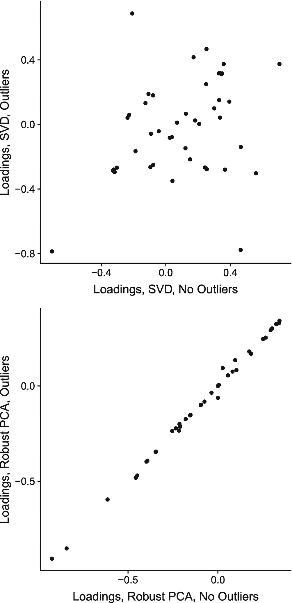

图 7-23

使用传统的奇异值分解主成分分析和稳健主成分分析绘制有和没有异常值的主成分分析模型的负荷图

```r
x <- d[, -c(1,2)]
x <- prep(x, center = TRUE, scale = "uv")

xout <- copy(x)
xout[1:5, "NYGD"] <- (-10)

res1 <- pca(x, method = "svd",
            center = FALSE, nPcs = 4)
res2 <- pca(xout, method = "svd",
            center = FALSE, nPcs = 4)

res1rob <- pca(x, method = "robustPca",
               center = FALSE, nPcs = 4)
res2rob <- pca(xout, method = "robustPca",
               center = FALSE, nPcs = 4)
plot_grid(
  ggplot() +

    geom_point(aes(
      x = as.numeric(loadings(res1)),
     y = as.numeric(loadings(res2)))) +
    xlab("Loadings, SVD, No Outliers") +
    ylab("Loadings, SVD, Outliers"),
  ggplot() +
    geom_point(aes(
      x = as.numeric(loadings(res1rob)),
     y = as.numeric(loadings(res2rob)))) +
    xlab("Loadings, Robust PCA, No Outliers") +
    ylab("Loadings, Robust PCA, Outliers"),
    ncol = 1)

```

## 7.5 非线性聚类分析

主成分分析的一个常见目标是减少维数，从而简化模型并提高预测精度。PCA 的一个基本假设是在这些较少的维度中存在可感测的线性关系，换句话说，对于 n 个标称维度，存在一些基本的正交向量要被投影，而不会有大的信号损失。如果有理由怀疑情况并非如此，那么非线性方法可能是合适的。

虽然前四行代码在分层集群中很常见，但是`MASS`包中的`sammon()`函数获取这些距离，并尝试将更高维度(在我们的示例中为 11 维)映射到`k`维(在本例中，我们设置 k = 2 以绘制图表)。我们提到这一点的主要目的只是为了观察，在明显非线性关系的情况下，PCA 可能不如放松线性假设的其他方法有效。

```r
x <- scale(d[, -c(1,2)])
row.names(x) <- paste(d$CntN, d$Year)
head(x)

##             NYGD  NYGN SEPR  ERMA SESC FEMA SPAD  SPDY  FEIN  MAIN
## ArbWr 1997 -0.81 -0.79 0.33 0.156 -1.5 -1.4 0.37 -0.66 -0.74 -0.62
## ArbWr 1998 -0.82 -0.79 0.31 0.164 -1.5 -1.3 0.34 -0.71 -0.70 -0.57
## ArbWr 1999 -0.81 -0.79 0.27 0.147 -1.4 -1.2 0.32 -0.75 -0.67 -0.53
## ArbWr 2000 -0.79 -0.79 0.22 0.113 -1.3 -1.2 0.30 -0.78 -0.63 -0.48
## ArbWr 2001 -0.80 -0.78 0.17 0.070 -1.3 -1.2 0.27 -0.81 -0.60 -0.44
## ArbWr 2002 -0.80 -0.78 0.13 0.033 -1.2 -1.1 0.24 -0.84 -0.57 -0.41
##            SPPO
## ArbWr 1997  1.6
## ArbWr 1998  1.4
## ArbWr 1999  1.3
## ArbWr 2000  1.2
## ArbWr 2001  1.1
## ArbWr 2002  1.0

sdist <- dist(x)

xSammon <- sammon(sdist, k = 2)

## Initial stress        : 0.04343
## stress after   7 iters: 0.03619

head(xSammon$points)

##            [,1] [,2]
## ArbWr 1997 -2.6 -1.2
## ArbWr 1998 -2.5 -1.2
## ArbWr 1999 -2.3 -1.3
## ArbWr 2000 -2.2 -1.3
## ArbWr 2001 -2.1 -1.4
## ArbWr 2002 -2.0 -1.4

```

Sammon 技术试图最小化一个名为`stress`的度量，该度量试图测量高维对象被“挤压”到低维空间的效率。

如果将前面的代码调整为 *k* = 3，我们可以预期应力会降低。图 [7-24](#Fig24) 显示了使用 Sammon 将 11 维减少到只有 2 维的结果。

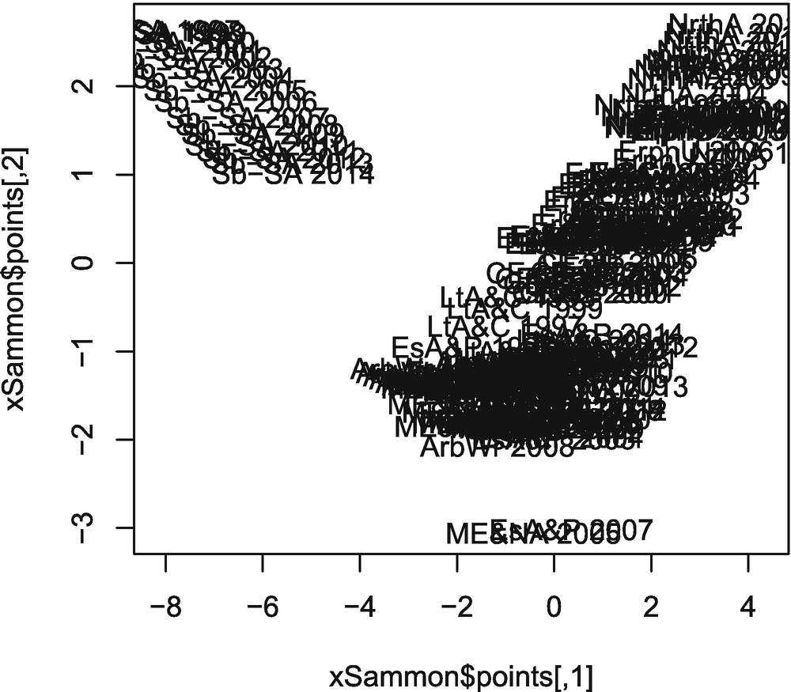

图 7-24

带文本标签的 Sammon 点图

```r
plot(xSammon$points, type = "n")
text(xSammon$points, labels = row.names(x) )

```

## 7.6 摘要

在这一章中，我们发展了无监督机器学习的概念。虽然采用这种技术的数据通常是未标记的，但在这种情况下，我们用标记数据进行了演示，以便对我们可能预期的聚类或分组类型有所了解。常用的技术`kmeans`和`hclust`与标准欧几里德距离一起使用(从而将我们限制在数字数据)。然而，这些强大的技术使我们能够理解在一个复杂的多维数据集中可能有多少真正的组。最后，介绍了降维的概念，使用主成分分析作为最常用的方法，同时以简单的观察结束，即主成分分析的线性假设可以通过更复杂的技术放宽。表 [7-2](#Tab2) 中概述了本章使用的一些功能，并简要介绍了它们的作用。

表 7-2

本章中描述的关键功能列表及其功能摘要

<colgroup><col class="tcol1 align-left"> <col class="tcol2 align-left"></colgroup> 
| 

功能

 | 

它的作用

 |
| --- | --- |
| `read_excel()` | 将文件路径作为字符串，并读入 Excel 文件 |
| `as.data.table()` | 将 data.frame 转换为 data.table 对象 |
| `str()` | 显示了 R 中对象的底层结构 |
| `summary()` | 尝试对数据或模型对象进行统计汇总 |
| `melt()` | 将宽数据转换为长数据 |
| `dcast()` | 将熔化的长数据转换为宽格式 |
| `sort()` | 按升序对数据进行排序 |
| `unique()` | 删除重复项 |
| `plot()` | 数据和模型结果的一般绘图 |
| `set.seed()` | 允许为伪随机算法复制代码 |
| `kmeans()` | 运行 kmeans 算法 |
| `scale()` | 在平均值= 0 时将数据按列居中，并调整到单位标准偏差 |
| `for()` | 调用迭代器上的 for 循环操作 |
| `cbind()` | 通过列将数据绑定在一起 |
| `dist()` | 创建一个距离矩阵，显示每个元素与其他元素之间的欧几里德距离 |
| `hclust()` | 创建分层集群对象 |
| `abline()` | 在绘图对象上绘制一条线 |
| `row.names()` | 允许访问 data.frame 行名属性 |
| `cutree()` | 按高度或簇切割层次树对象 |
| `tail()` | 显示最后六行数据 |
| `copy()` | 复制数据对象，而不仅仅是通过引用指定一个新名称 |
| `as.phylo()` | 创建一个 phylo 对象—用于 ape 包绘图 |
| `cor()` | 显示项目之间的相关性 |
| `pca()` | 执行 PCA 简化计算 |
| `scores()` | 提取主成分得分 |
| `loadings()` | 提取主成分载荷，用于将原始数据投影到主成分空间 |
| `biplot()` | 在 PC1 和 PC2 上绘制 PCA 图并显示原始数据向量 |
| `sammon()` | 非线性降维算法；第二种形式是新的维度 |
| `text()` | 地块对象上的文字标签 |