# 九、缺失数据

缺失数据在几乎所有现实世界的分析中都很常见。本章正式介绍缺失数据的概念，包括描述缺失的常用方法。然后，我们讨论在分析中处理缺失数据的一些潜在方法。我们将在本章中使用的主要软件包是`mice`软件包，该软件包提供了处理缺失数据和最小化缺失数据对分析结果的影响的强大功能[95]。

```r
library(checkpoint)
checkpoint("2018-09-28", R.version = "3.5.1",
  project = book_directory,
  checkpointLocation = checkpoint_directory,
  scanForPackages = FALSE,
  scan.rnw.with.knitr = TRUE, use.knitr = TRUE)

library(knitr)
library(ggplot2)
library(cowplot)
library(lattice)
library(viridis)
library(VIM)

library(mice)
library(micemd)
library(parallel)

library(data.table)
library(xtable)
library(JWileymisc) # has data

options(width = 70, digits = 2)

```

## 9.1 概念背景

当一个或多个变量的观测值缺失时，就会出现数据缺失。丢失数据的潜在原因有很多。缺失数据还会导致数据分析中的问题:

*   仅从非缺失数据获得的估计值可能有偏差。

*   丢失数据会减少信息，从而降低效率。

*   许多工具和软件不具备处理缺失数据的能力。

当数据并非完全随机缺失时，就会出现偏差，因此从观察数据点获得的估计值与所有情况都观察到的估计值存在系统性差异。发生效率损失是因为丢失了一些数据，数据中的信息更少了。此外，许多处理缺失数据的简单技术，如完全病例分析(列表式删除),会丢弃任何变量缺失的病例，即使有其他变量的数据，也会导致效率损失。最后，由于许多工具无法直接处理缺失数据，因此使用缺失数据进行分析通常更加耗时和复杂，因为在使用标准工具之前，可能需要首先处理缺失数据。

有多种方法可以解决所讨论的三个缺失数据问题。但是，在实现特定的方法之前，有一些一般的注意事项。基本上，我们假设目标是估计某个参数， *θ* ，并获得我们估计的不确定性的估计， *V AR* ( *θ* )。我们假设数据是从我们感兴趣的人群中抽取的，尽管这不一定是整个人群。基本的问题是在什么条件和假设下, *θ* 的无偏估计存在，以及我们如何获得它？

数据通常被分类为

*   当缺失机制完全独立于 *θ* 的估计时，完全随机缺失(MCAR)

*   当缺失机制有条件地独立于 *θ* 的估计时，随机缺失(MAR)

*   当缺失机制与 *θ* 的估计相关联时，非随机缺失(MNAR)

当且仅当数据是 MCAR 时，完整的病例分析(列表式删除)将产生对 *θ* 的无偏估计。在所有其他情况下，我们必须考虑我们将对缺失过程做出什么样的假设，以及利用我们假设的缺失过程下的可用数据，我们是否可以获得 *θ* 的无偏估计。

一种表示预期模型和解释假设的因果和缺失过程的系统方法是通过使用图形模型，例如有向无环图(Dag)。Mohan、Pearl 和 Tian [66]使用 Dag 开发了识别无偏估计的方法，并将其扩展到 Mohan 和 Pearl [64]的进一步因果查询，以及测试数据是否为 MCAR 或变量水平 MAR+ [65]。

这项研究有一些实际意义。首先，根据因果过程和缺失机制， *θ* 的无偏估计可能可恢复，也可能不可恢复，即使是从相同的数据中。因此，考虑模型规格至关重要。简单地调整所有可能的变量是不够的，因为其他工作表明，当向 DAG [73]添加不适当的变量或路径(“后门标准”)时，先前对 *θ* 的无偏估计可能会变得有偏差。第二，严格解释模型和能够或不能获得无偏估计的条件是复杂的，需要比大多数研究人员和现有科学水平更详细的关于因果过程和遗漏机制的知识或期望。随着所考虑的变量数量的增加，复杂性呈指数增长，尤其是当多个变量缺失时。

虽然在 Mohan 和 Pearl 的理论工作中没有详细说明，但在实际应用时，不仅需要指定正确的变量和路径，而且需要正确指定关系的函数形式。因此，对于*P*(*Y | f*(*X*)*，f* ( *X* )可能是一个线性或其他一些非线性函数，而对 *θ* 的无偏估计将取决于正确指定这种形式。在实践中，至少应该检查观察值的关系形式，并且在必要时允许是非线性的。

虽然提供特定变量的必要背景以确定缺失的数据机制超出了本章的范围，但它们值得考虑，至少如果没有证据来指导决策，这应被视为研究中的一个限制。下一节讨论多重插补作为处理缺失数据的一种方法，并至少提供一些处理未知函数形式的选择。

### 多重插补

#### 一般

存在许多插补方法。不鼓励使用单一插补(如平均值和热卡插补)和条件平均值插补，不做进一步讨论。无论采用何种插补模型，单一插补的问题在于，它们假设缺失值的预测没有错误。这导致基于估算数据的模型的不确定性估计过低，增加了 1 型错误率。影响程度将取决于缺失数据的数量以及插补模型的准确(或不准确)程度。

除了一次性输入数据集，还可以多次输入。多重插补背后的原理是，多重插补不是为插补生成单一预测值，而是从预测分布中随机抽取。预测分布的分布捕捉了预测中的不确定性，这导致了每个估算数据集中的可变性。

生成多重估算数据的一般过程如下:

*   有缺失数据的初始数据集。

*   用初始估计值填充缺失的数据值。初始估计通常很容易生成，例如每个变量的平均值或中值，或者从变量中抽取的随机值。

*   对于每个变量，建立一个模型，从剩余的变量中预测它。使用模型来预测缺失的数据。对于参数模型，如线性回归，从预测分布中提取随机值(例如，基于预测值和标准偏差的均值正态分布)或从贝叶斯模型的后验分布中提取样本。对于非参数模型，如随机森林模型[28]，不确定性可能通过其他方式引入，如 bootstrapping，以围绕预测值建立经验分布，并从中取样。

*   重复上一步，直到预测的完整数据集与上一次迭代没有实质性的不同，表明模型已经收敛。这一步是必需的，因为随着初始估计(通常相当糟糕)变得更加准确，所建立的模型可能会随着时间而改变。

*   重复所有这些步骤，以生成所需数量的多重估算数据集(例如，5，100)。

生成多个估算数据集后，分析会与无遗漏地分析单个数据集略有不同。多重估算数据分别进行分析，结果使用鲁宾规则进行汇总[58]。简单来说:

*   模型在每个估算数据集中单独进行估计。

*   对每个模型的许多参数进行平均，包括回归系数、平均差异和预测值。一些值不是通过平均直接组合的，例如残差方差或相关的估计，其通常在平均之前被转换。

*   汇总结果的不确定性估计(例如，标准误差)包括两个可变性来源:
    *   每个模型参数的平均不确定性

    *   模型之间参数估计的可变性

*   基于平均参数和不确定性估计的统计测试，从模型和不同的数据集获取不确定性。

一般来说，任何分析都应该在单个数据集上进行，只有在最后一步，结果才应该跨数据集进行汇总。例如，如果目标不仅仅是回归模型，而是生成预测值的图表，那么应该为每个估算数据集单独生成预测值，然后将预测值组合起来。不要首先合并回归模型结果，然后使用合并的模型来生成预测。关于多重插补的一个常见误解是，只应插补自变量，而不应插补因变量。模拟表明，不输入因变量会增加偏差[67]，建议输入所有变量[38]

#### 多重插补方法

一般来说，乘以估算数据的模型采用两种形式之一:

*   JM:一种联合模型(JM ),其中指定了所有变量的联合多元分布。通过从条件分布中提取来估算值。

*   FCS:一个完全条件规范(FCS ),其中为每个缺失变量建立一个单独的模型，使用所有其他变量作为预测因子。每个缺失变量的值通过从该特定变量的模型的条件密度中提取来估算。

可以证明 **JM 方法**在理论上是有效的【85】，这是相对于 FCS 方法的一个优势，FCS 方法目前缺乏强有力的理论依据来解释为什么它们可以产生有效的结果。

JM 方法的一个挑战是，它要求多元分布(1)是特定的，(2)是数据的合理表示，以及(3)在分析上是易处理的。通常，这些条件中的一些(但不是全部)很容易满足。例如，使用多元正态(MVN)模型是相对容易指定的，并且在分析上易于估计和借鉴。然而，只有在研究案例的子集里，所有带有缺失数据的变量才能被合理地解释为正态分布。例如，一旦引入一个二元协变量(如性别)，MVN 模型就开始变得不现实。在数据不太可能真实 MVN 的情况下，MVN 模型有时仍被用作近似值，但这凸显了 JM 的一个缺点。MVN 模型不是唯一可以指定的多元分布类型。然而，涉及正态分布和二分或计数型变量的多元分布变得非常难以估计和提取，通常使它们难以分析。

我们认为，JM 方法在实际环境中特别困难，因为许多带有缺失数据的应用研究问题(如流行病学研究、纵向研究)通常具有包含许多协变量和焦点预测因子的模型，更不用说退出或缺失的潜在决定因素了，尽管这些因素不是最终分析模型的一部分，但可能是改善缺失数据模型的关键因素。如此多的不同变量都遵循任何方便的多元分布似乎很少见，这使得 JM 方法在许多情况下不切实际。

尽管缺乏强有力的理论基础来支持它作为一种合适的技术，但 **FCS 方法**是 JM 方法的一种令人信服的替代方法。FCS 方法也称为通过链式方程的多重插补(MICE ),因为有一系列独立的方程。在有 *k* 个变量的地方，不是定义一个 *k* 维的多元密度，而是定义 *k* 维的单变量密度。这既简化了计算方面，又使得使用任何可用的分布相对容易，从而适应各种各样的结果(例如，正态连续、泊松计数、二项式二元、伽玛严格正连续、结果等)。).FCS 的另一个优点是可以为预测因子和每个结果之间的关系指定非常灵活的函数形式。

进行 FCS 的一种标准方式是从每个变量的(条件)后验分布中获取 Gibbs 样本，通常形式为*P*(*Y*<sub>T5】I</sub>|*Y*<sub>*—I*</sub>*，θ* <sub>*i*</sub> )对于 1 中的 *i* ，… *，k* 。这些可用于“填充”每个 *k* 结果的缺失数据。一旦所有结果都被填入，现在可以使用每个结果的预测因子的观察和填入信息重复该过程，并且该过程反复重复直到达到收敛。一旦实现收敛，就可以从条件后验分布中抽取所需数量的样本，以生成所需数量的多重估算数据集。

Van Buuren、Brand、Groothuis-Oudshoorn 和 Rubin [94]以及 Van Buuren 和 Groothuis-Oudshoorn [95]对 FCS (MICE)进行了详细描述。FCS 的一个问题是条件分布可能不兼容。当条件分布不相容时，可变插补的顺序很重要，尽管这些影响可能相对较小。Hughes 及其同事[46]已经讨论了条件分布相容的条件，从而产生了与联合分布相同的收益，他们还提供了一个模拟来检验分布相容和不相容时 FCS 的性能。总的来说，虽然理论上不如 JM 方法合理，但在模拟和实践中，FCS 似乎表现得非常好，并且，由于其限制较少的假设，当 JM 假设不成立时，它可以胜过 JM 方法。由于增加了灵活性，这一章集中于估算的 FCS 方法。

#### 非线性效应和非正常结果

在许多应用中，默认的假设是变量之间是线性相关的。然而，这种假设应该检查，非线性函数形式是允许的，如理论或数据所规定的。即使当数据是 MAR 时，为了使估计无偏，必须正确地指定模型，包括正确的变量和正确的函数形式。

以前，所谓的被动插补用于非线性项。例如，对于两个变量之间的相互作用， *X* <sub>1</sub> *，X* <sub>2</sub> ，每个变量将被单独插补，然后经过分析中的多重插补后，基于插补的 *X* <sub>1</sub> 和 *X* 将形成乘积项，*X<sub>1</sub>*X*<sub>2</sub>模拟表明，这种被动插补会导致有偏估计[101]。相反，应将这些非线性转换纳入多重插补，首先创建变量，然后将其作为附加变量纳入插补模型。交互作用、平方或其他转换变量有时被称为“另一个变量”(JAV)。然而，这种方法的一个限制是，*X*T27】1 和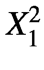之间的关系(或交互)丢失了。Vink 和 van Buuren [100]开发了另一种方法，称为多项式组合方法，既能产生无偏估计，又能保持*X*T32】1 和之间的关系。然而，据我们所知，它目前只适用于平方项，不适用于不同变量之间的相互作用，也不适用于高阶多项式，尽管理论上这项工作可能会推广。*

一个相关的问题是偏斜或非正态分布变量。一种直观的方法是尝试一些规范化转换；然而，von Hippel [102]表明，这导致了不太理想的结果，并且在许多情况下建议简单地使用正常模型。备选方案是对每个结果使用(正确的)分布(例如，伽玛、贝塔等。).目前，大多数模拟和研究仅检查了正态、二项式结果的多重插补的特性，检查有序结果的较少；因此，对于来自替代分布的变量几乎没有指导。此外，大多数软件实现允许相当有限的一组已知发行版。

正如交互作用或其他非线性项应该在需要的地方被估算一样，如果一些其他变量 *Y* 不仅取决于 *X* <sub>1</sub> ， *X* <sub>2</sub> ，而且还取决于它们的交互作用*X*<sub>1</sub>*X*<sub>2</sub>，为了正确地指定模型，交互作用项必须作为预测项包含在 FCS 中。如果 *Y* 依赖于*X*T22】1，*X*T26】2，*X*T30】1*X*<sub>2</sub>，但是*X*<sub>1</sub>*X*<sub>2</sub>在插补模型中被省略，结果将但是，如果 *Y* 依赖于 *X* <sub>1</sub> ， *X* <sub>2</sub> ，而是 *X* <sub>1</sub> ， *X* <sub>2</sub> ，*X<sub>1</sub>*X*<sub>2Bartlett、Seaman、White 和 Carpenter [3]对此进行了更详细的探讨，他们表明实质性分析模型可以是插补模型的限制性版本，但反之则不然。具体来说，他们建议确保插补模型与实体模型兼容，或者至少是半兼容的(即实体模型是插补模型的限制版本)。</sub>*

#### 用于插补的 GLMs

FCS 方法不需要任何特定的模型，但最常用的一类模型是广义线性模型(GLMs ),如连续、近似正态分布变量的线性回归或二分变量的逻辑回归。对于感兴趣的读者，GLMs 在第 [3](03.html) 和 [4](04.html) 章节中有更深入的介绍。GLMs 的一个好处是，它们是许多分析师熟悉的分析模型，更容易理解它们如何用于多重插补。此外，大多数 glm 在现代计算机上的估计速度非常快，这使得它成为一种计算成本相对较低的模型。尽管 GLMs 很受欢迎，速度也很快，但它也有缺点。

首先，GLMs 默认所有变量和链接函数尺度上的结果之间的线性关系。尽管对任何 GLM 模型来说都是如此，但多重插补通常涉及许多关系，这一事实加剧了这一问题。例如，考虑一个相对简单的研究问题:肥胖与血压有关吗？血压本身有两个组成部分:收缩压和舒张压。此外，许多因素可能会混淆这种关联，相关的协变量也是如此，两个可能的候选因素是年龄和社会经济地位。最后，还应包括与缺失数据相关的因素。例如，如果已知被雇佣的参与者更有可能丢失数据，那么在插补模型中包括这一点是有意义的。在这个例子中，我们刚刚开始考虑与肥胖、血压和潜在缺失相关的无数因素，我们正在处理六个变量。归根结底，我们关心的只是压力、年龄和社会经济地位(三个变量)与血压(两个变量)的关系，所以我们只需要担心六个独特的两两关联。然而，对于插补模型，我们有 *15* 独特的成对关联。如果其中任何一个不是线性的，要么我们的插补模型将是错误的，要么我们需要识别哪个不是线性的，并包括适当的函数形式(例如，二次函数等。).许多应用研究问题将包括更多的变量，要么是因为基础研究问题涉及更多的变量，要么是因为有更多的相关协变量或更多的因素可能与遗漏有关。让分析师手动决定每个可能的成对关联的函数形式很快变得不切实际(例如，10 个变量有 45 个唯一的对；20 个变量的 190 个唯一对，等等。) .

第二，默认情况下，GLMs 不包括变量之间的任何交互。同样，随着插补模型中变量数量的增加，分析师手动指定可能的交互次数很快变得不切实际。

第三，特别是在较小的数据集或某些应用中，要包含的变量的数量相对于观察值的数量可能很大。在这些情况下，GLMs 将倾向于过度拟合数据，特别是对于二分结果，可能导致完全分离和可估计性挑战，基本问题是 GLMs 默认不包括任何变量选择方法。

#### 插补游戏

面对未知函数形式的挑战，一个自然的解决方案是利用试图根据经验逼近未知形式的模型。一类这样的模型是广义加性模型(gam)[40，122]，它使用平滑器和罚函数来试图逼近函数形式，而不会(非常)过度拟合数据。“基本”GAM 的扩展是位置、比例和形状参数的 GAM(GAMLSS)。GAMLSS 不仅允许对位置(如正态分布中的平均值)进行建模，还允许分布的规模(方差)作为预测值以及分布形状的函数[78，88]。尽管 gam 通常发展良好(如[40，122，123])，但很少有研究检验它们在多重插补中的特性。

de Jong、van Buuren 和 Spiess [27]进行的一项模拟研究表明，在多重插补中使用 GAMLSS 可以获得良好的结果，从而允许出现偏斜和非正态分布的结果以及非线性效应。总的来说，使用 GAMLSS 的插补比使用 GLMs 提供了更好的覆盖面；然而，值得注意的是，模拟研究[27]只检查了几个变量。不收敛和其他计算挑战可能会出现在应用研究设置与许多预测。

#### 估算的 RFs

随机森林(RFs)是一种机器学习类型，广泛用于预测建模，因为它们往往会提供出色的结果[16]。就插补而言，RFs 比之前讨论的替代方法有几个优势。

我们在插补中注意到的一个挑战是需要正确捕捉所有变量之间的函数形式，它可能不是线性的。gam 对此提供了一个可能的解决方案，但是 RFs 也可以解决这个问题，因为树允许在变量的不同点进行分割，从而允许非线性关联。

与 gam 或 GLMs 不同，RFs 还可以识别变量之间的重要交互。即使系统地筛选所有可能性是不切实际的，RFs 也能有效地识别交互。RFs 的这一特性提供了一个很大的优势，因为有十个或更多的变量，研究人员实际上不可能指定相关变量之间的所有相互作用，即使包括所有的相互作用也会导致一个复杂的模型，可能需要非常大的样本量。

最后，RFs 是有利的，因为它们本质上具有一定程度的内置变量选择。RFs 只在有助于预测结果的变量上分裂。因此，与 GLMs 或 GAMs 不同，RFs 可以更好地处理相对于数据集中的病例数而言插补模型中存在大量变量的病例。

虽然随机森林在预测和机器学习文献中非常常用，但评估其插补性能的研究相对较少。Stekhoven 和 Bühlmann [90]在较早的一篇研究 RF 插补的论文中提出了一个生物信息学领域的 RF 模型插补以及一个`R`包`missForest`。然而，Stekhoven 和 Bühlmann [90]建议仅使用 RFs 进行单一插补，如前所述，这会因缺失数据而导致低估不确定性。最近，另外两个团队独立开发了一种使用 RFs 进行多重插补的方法，并展示了这些技术的良好性能[28，86]。在这两种情况下，模型都依赖于自举来传播输入缺失值的不确定性，以生成多个估算数据集。

#### 其他情况

除了到目前为止讨论的多种插补情况之外，还有一些更特殊的情况需要其他方法。在事件发生时间或生存结果的情况下，多重插补是复杂的，White 和 Royston [108]讨论了这些情况下协变量的插补。对于多级数据的多重插补，van Buuren [93]提供了一份最新概述。虽然不是直接多重插补，但 Goldstein、Carpenter 和 Browne [37]描述了一个多水平模型，该模型考虑了反应和协变量(包括非正态结果/协变量和交互项)中的缺失数据。然而，这种分析的复杂性在许多情况下可能令人望而却步。

## 9.2 `R`示例

为了应用所讨论的缺失数据方法，我们将使用模拟数据来密切匹配日常研究。讨论的大多数插补模型仅适用于单水平数据，因此我们将从将每日数据折叠成整个研究的平均值开始。

```r
## load example dataset
data("aces_daily")
draw <- as.data.table(aces_daily)[order(UserID)]
davg <- na.omit(draw[, .(
  Female = na.omit(Female)[1],
  Age = na.omit(Age)[1],
  SES_1 = na.omit(SES_1)[1],
  EDU = na.omit(EDU)[1],
  STRESS = mean(STRESS, na.rm = TRUE),
  SUPPORT = mean(SUPPORT, na.rm = TRUE),
  PosAff = mean(PosAff, na.rm = TRUE),
  NegAff = mean(NegAff, na.rm = TRUE)),
  by = UserID])

```

接下来，我们想在数据中添加一些缺失。对于这个例子，我们将让失踪的概率取决于感知的支持和压力水平的组合。然后，对于一些变量，我们基于这些概率产生缺失。我们随机设置压力和支持为缺失。

```r
## missing depending on support and stress
davg[, MissingProb := ifelse(
         SUPPORT < 5,
           ifelse(STRESS > 2.5, .4, .0),
           ifelse(STRESS > 2.5, 0, .4))]

set.seed(1234)
davgmiss <- copy(davg)
davgmiss[, PosAff := ifelse(rbinom(
             .N, size = 1, prob = MissingProb) == 1,
             NA, PosAff)]
davgmiss[, NegAff := ifelse(rbinom(
             .N, size = 1, prob = MissingProb) == 1,
             NA, NegAff)]
## random missingness on stress and support
davgmiss[, STRESS := ifelse(rbinom(
             .N, size = 1, prob = .1) == 1,
             NA, STRESS)]
davgmiss[, SUPPORT := ifelse(rbinom(
             .N, size = 1, prob = .1) == 1,
             NA, SUPPORT)]
davgmiss[, Age := ifelse(rbinom(
             .N, size = 1, prob = .1) == 1,
             NA, Age)]
davgmiss[, SES_1 := ifelse(rbinom(
             .N, size = 1, prob = .1) == 1,
             NA, SES_1)]
davgmiss[, Female := factor(ifelse(rbinom(
             .N, size = 1, prob = .1) == 1,
             NA, Female), levels = 0:1,
             labels = c("Male", "Female"))]
davgmiss[, EDU := factor(ifelse(rbinom(
             .N, size = 1, prob = .1) == 1,
             NA, EDU), levels = 0:1,
             labels = c("< Uni Graduate", "Uni Graduate +"))]
## drop unneeded variables to make analysis easier
davgmiss[, MissingProb := NULL]
davgmiss[, UserID := NULL]

```

现在开始，直观地检查数据集中缺失的数据模式是有帮助的。这可以使用图 [9-1](#Fig1) 所示的`VIM`包和`aggr()`函数来完成。左侧显示每个变量总计中缺失数据的百分比。右侧显示了不同研究变量的不同遗漏模式，以及它们的比例。至关重要的是，我们可以看到，尽管总体数据缺失率并不高(约 15%)，但只有大约三分之一的参与者实际上拥有所有变量的完整数据。这将使一个完整的案件分析有大量的信息和权力的损失。

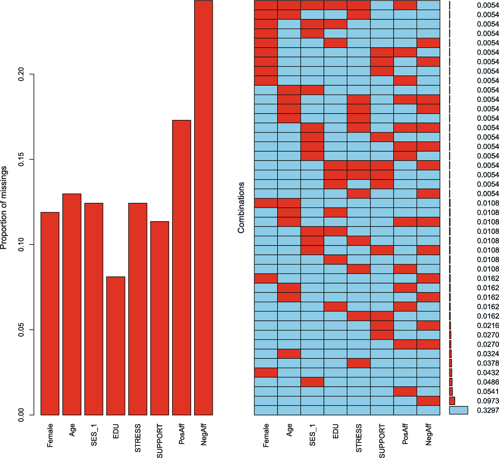

图 9-1

通过变量和缺失模式对缺失进行可视化总结

```r
ggr(davgmiss, prop = TRUE,
     numbers = TRUE)

```

`VIM`包还有一个功能，使用`marginplot()`函数帮助识别缺失是否依赖于另一个变量。图 [9-2](#Fig2) 中显示的这些图表包含了相当多的信息。中心是成对呈现数据的基本散点图。空白显示缺失数据的分布，箱线图显示每个变量的分布，根据另一个变量是否缺失进行分层。这些图表明，当情感缺失时，压力会更大，支持会更低。

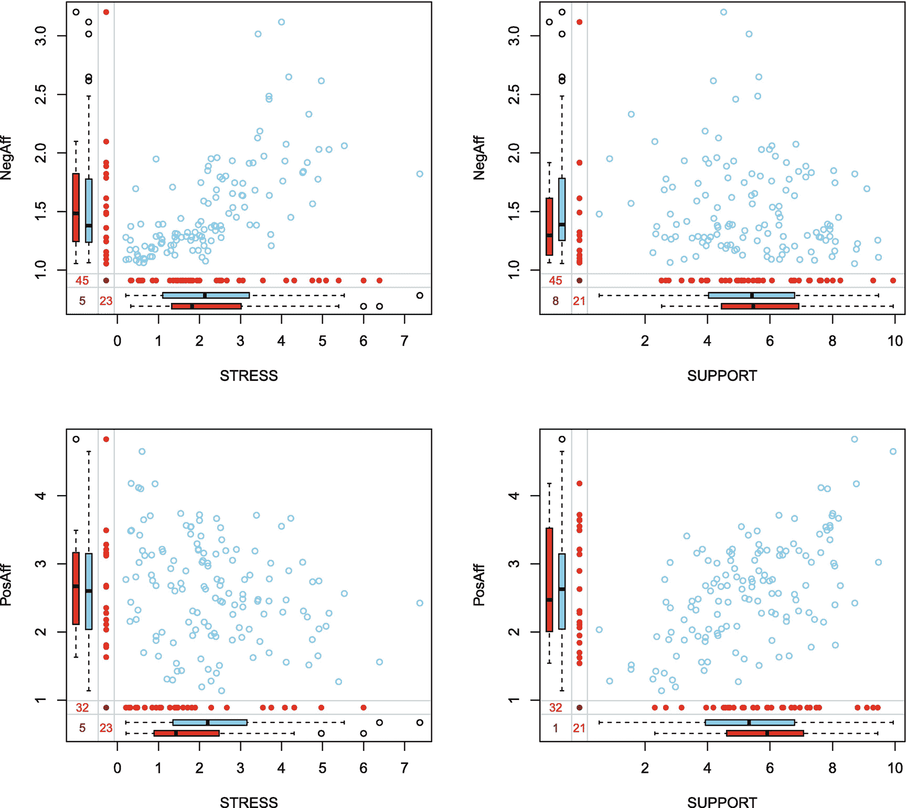

图 9-2

缺失数据的二元图。中间的点表示没有丢失的数据。空白点表示缺失的数据。箱线图根据另一个变量是否存在来总结每个变量。

```r
par(mfrow = c(2, 2))
marginplot(davgmiss[,.(STRESS, NegAff)])
marginplot(davgmiss[,.(SUPPORT, NegAff)])
marginplot(davgmiss[,.(STRESS, PosAff)])
marginplot(davgmiss[,.(SUPPORT, PosAff)])

```

我们可以应用统计检验来检查一个变量的缺失是否与另一个变量相关，例如，使用如下所示的 t 检验。我们没有看到压力和情感支持的显著差异。然而，一般来说，不鼓励依赖统计显著性来确定是否将一个变量纳入插补模型，因为根据影响的大小和样本大小，结果可能不具有统计显著性，但可能会对基于多重插补数据分析的模型的结果产生影响。

```r
## does age differ by missing on negative affect?
t.test(Age ~ is.na(NegAff), data = davgmiss)$p.value

## [1] 0.9

## does age differ by missing on positive affect?
t.test(Age ~ is.na(PosAff), data = davgmiss)$p.value

## [1] 0.14

## does stress differ by missing on negative affect?
t.test(STRESS ~ is.na(NegAff), data = davgmiss)$p.value

## [1] 0.89

## does stress differ by missing on positive affect?
t.test(STRESS ~ is.na(PosAff), data = davgmiss)$p.value

## [1] 0.17

## does social support differ by missing on negative affect?
t.test(SUPPORT ~ is.na(NegAff), data = davgmiss)$p.value

## [1] 0.49

## does social support differ by missing on positive affect?
t.test(SUPPORT ~ is.na(PosAff), data = davgmiss)$p.value

## [1] 0.17

```

### 带回归的多重插补

在本例中，我们将使用回归方法对数据进行乘法估算。由于多重插补包含随机成分(如 bootstrapping)，每次进行插补时，最终结果都会随机变化。为了使结果可重复，可以设置随机种子。为了举例和加快速度，我们只生成六个估算数据集。对于实际研究，使用更多(例如，50，100)可能有助于确保即使使用不同的种子，合并模型的最终结果也将或多或少相同。

下面的代码使用来自`mice`包的`mice()`函数来估算数据集中任何缺失的数据，`davgmiss`。我们要求六个插补，用`m = 6`。默认方法指定用于连续(T4 中的数字)变量、二进制变量、名义(多进制)变量和有序分类变量的模型类型。我们从算法的十次迭代开始，为可重复性设置种子，并在插补期间关闭消息。对`system.time()`的调用将返回插补所用的秒数。注意`mice()`的结果是一个`mids`类对象，它包含原始数据和所有多重插补，在一个对象中。

```r
system.time(mi.1 <- mice(
  davgmiss,
  m = 6,   maxit = 10,
  defaultMethod = c("norm", "logreg", "polyreg", "polr"),
  seed = 1234, printFlag = FALSE)
)

##    user  system elapsed
##     2.9     0.0     3.0

```

使用有限次数的迭代，模型可能不会收敛。收敛可以通过图来检查，类似于贝叶斯方法。每个插补用单独的颜色绘制，如果结果变得稳定，则结果收敛，并且每个单独的插补与另一个插补没有系统的不同(这可能表明收敛到单独的局部最大值)。如果对收敛性有疑问，我们可以使用`mice.mids()`进行进一步的迭代，而不必重新运行最初的十次迭代。结果似乎相当稳定，没有明确的迹象表明系统差异提供了合理的证据收敛。

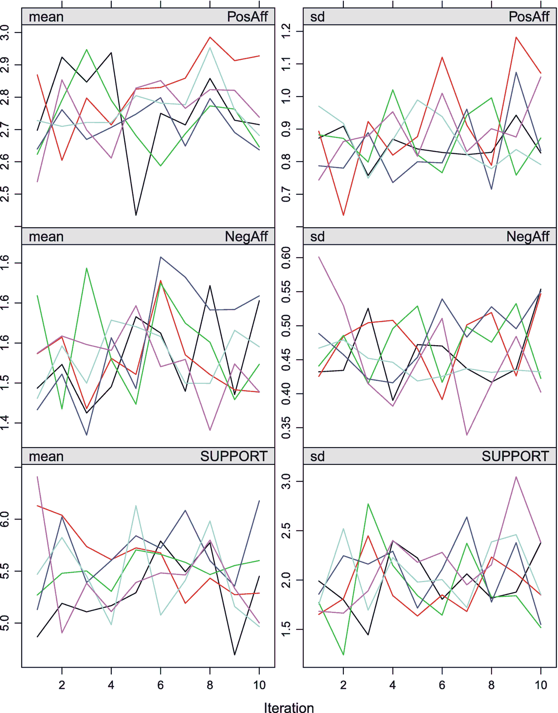

图 9-3

会聚的 Mice 诊断

```r
## plot convergence diagnostics
plot(mi.1, PosAff + NegAff + SUPPORT ~ .it | .ms)

## run an additional iterations
system.time(mi.1 <- mice.mids(
  mi.1, maxit = 10,
  printFlag = FALSE)
)

##    user  system elapsed
##       3       0       3

## plot convergence diagnostics
plot(mi.1, PosAff + NegAff + SUPPORT ~ .it | .ms)

```

除了检查模型是否收敛之外，评估估算值是否合理也很有帮助。这可以通过使用`mice`包中的`densityplot()`绘制观察值和估算值的分布图来完成。除了单变量评估，还可以使用`mice`包中的`xyplot()`函数测试双变量关系。蓝色用于原始观察数据，红色用于估算数据。一个小问题是，使用基于回归的方法，插补是在数据范围之外产生的，特别是预测影响值低于 1，这超出了范围。虽然这可能看起来不理想，但建议保留这些值，因为排除它们或强制它们为 1 会减少预测中的可变性，并会使模型看起来比它应有的更确定。

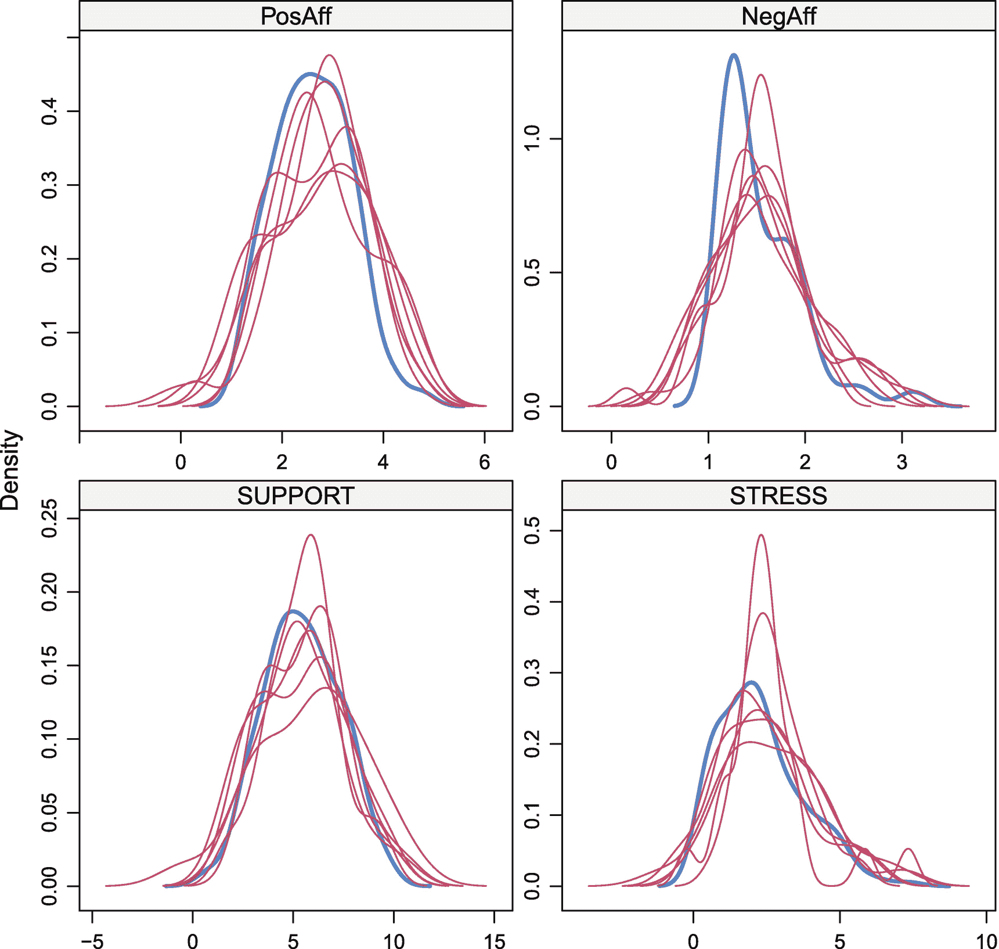

图 9-5

观察数据和估算数据的单变量密度图，通过插补分开

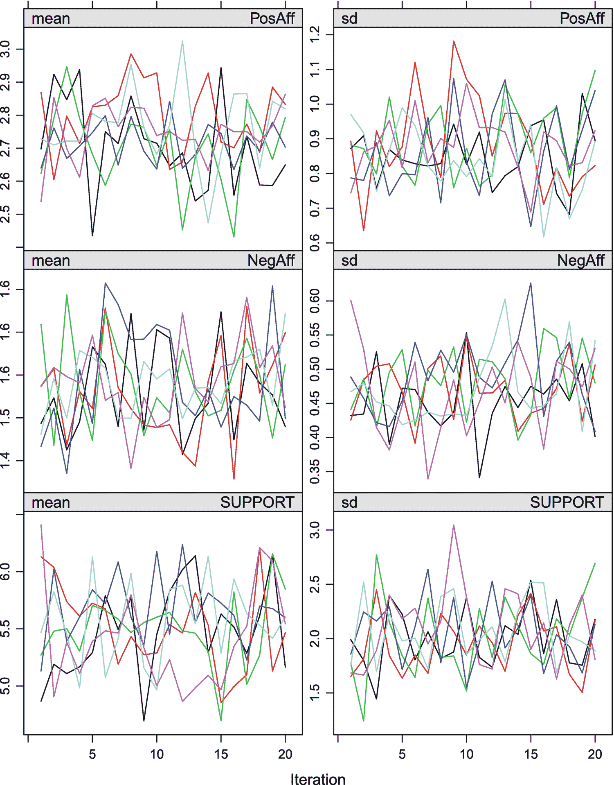

图 9-4

在更多次迭代后对收敛进行 Mice 诊断

```r
densityplot(mi.1, ˜ PosAff + NegAff + SUPPORT + STRESS)

xyplot(mi.1, NegAff + PosAff ˜ STRESS + SUPPORT)

```

如果在这个阶段，我们确信插补模型中没有发生任何问题，我们可以继续拟合我们的主要分析。`mice`包包含了`with()`函数的方法，当与从`mice()`返回的`mids`类对象一起使用时，该函数将给定的`R`表达式应用于每个估算数据集。首先，我们将运行一个线性回归模型，以积极情感作为结果，压力作为主要解释因素，其他因素作为协变量。结果是一个`mira`类对象，它是一个包含在单独的多重估算数据集上重复的相同分析的对象类。如果我们打印这个对象，我们会得到每个回归模型的结果。

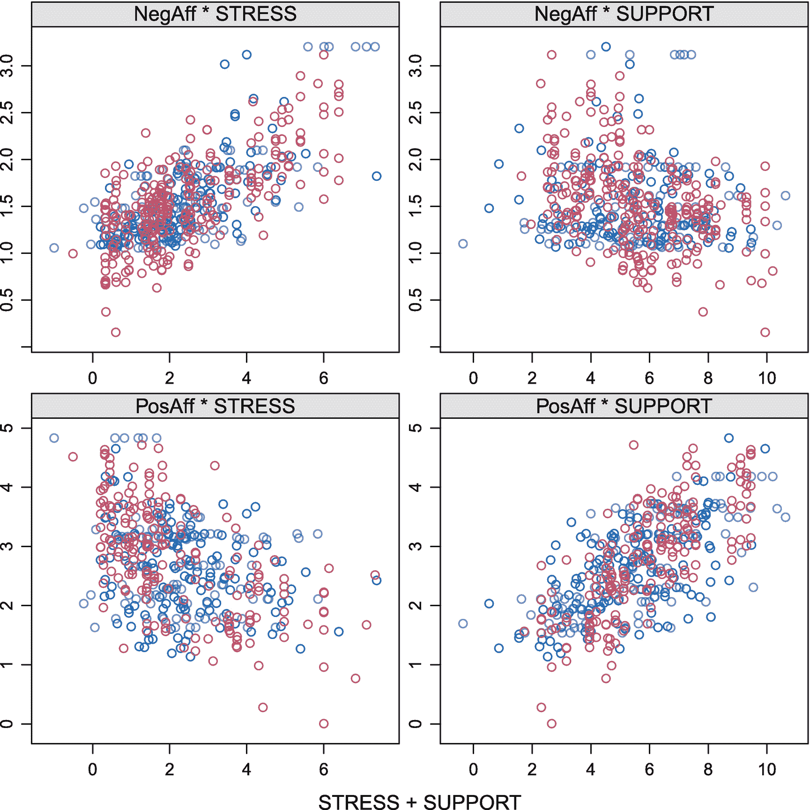

图 9-6

带有估算数据的二元散点图，由观察数据和估算数据分别着色

```r
lm.1 <- with(mi.1, lm(PosAff ~ STRESS + Age + EDU + Female))

lm.1

## call :
## with.mids(data = mi.1, expr = lm(PosAff ~ STRESS + Age + EDU +
##     Female))
##
## call1 :
## mice.mids(obj = mi.1, maxit = 10, printFlag = FALSE)
##
## nmis :
##  Female     Age   SES_1     EDU  STRESS SUPPORT  PosAff  NegAff
##      22      24      23      15      23      21      32      45
##
## analyses :
## [[1]]
##
## Call:
## lm(formula = PosAff ~ STRESS + Age + EDU + Female)
##
## Coefficients:
##       (Intercept)             STRESS                Age
##            4.1174            -0.2194            -0.0459
## EDUUni Graduate +       FemaleFemale
##           -0.0715             0.0450
##
##
## [[2]]
##
## Call:
## lm(formula = PosAff ~ STRESS + Age + EDU + Female)
##
## Coefficients:
##       (Intercept)             STRESS                Age
##            4.0037            -0.1697            -0.0415
## EDUUni Graduate +       FemaleFemale
##           -0.0967            -0.0464 

##
##
## [[3]]
##
## Call:
## lm(formula = PosAff ~ STRESS + Age + EDU + Female)
##
## Coefficients:
##       (Intercept)             STRESS                Age
##            3.8330            -0.2022            -0.0266
## EDUUni Graduate +       FemaleFemale
##           -0.0267            -0.2389
##
##
## [[4]]
##
## Call:
## lm(formula = PosAff ~ STRESS + Age + EDU + Female)
##
## Coefficients:
##       (Intercept)             STRESS                Age
##            4.2129            -0.2214            -0.0466
## EDUUni Graduate +       FemaleFemale
##           -0.0529            -0.0799
##
##
## [[5]]
##
## Call:
## lm(formula = PosAff ~ STRESS + Age + EDU + Female)
##
## Coefficients:
##       (Intercept)             STRESS                Age 

##            3.6608            -0.1867            -0.0221
## EDUUni Graduate +       FemaleFemale
##           -0.1658            -0.0691
##
##
## [[6]]
##
## Call:
## lm(formula = PosAff ~ STRESS + Age + EDU + Female)
##
## Coefficients:
##       (Intercept)             STRESS                Age
##            3.6097            -0.1872            -0.0232
## EDUUni Graduate +       FemaleFemale
##           -0.0190            -0.0252

```

我们可以检查单个模型进行模型诊断，如图 [9-7](#Fig7) 所示。

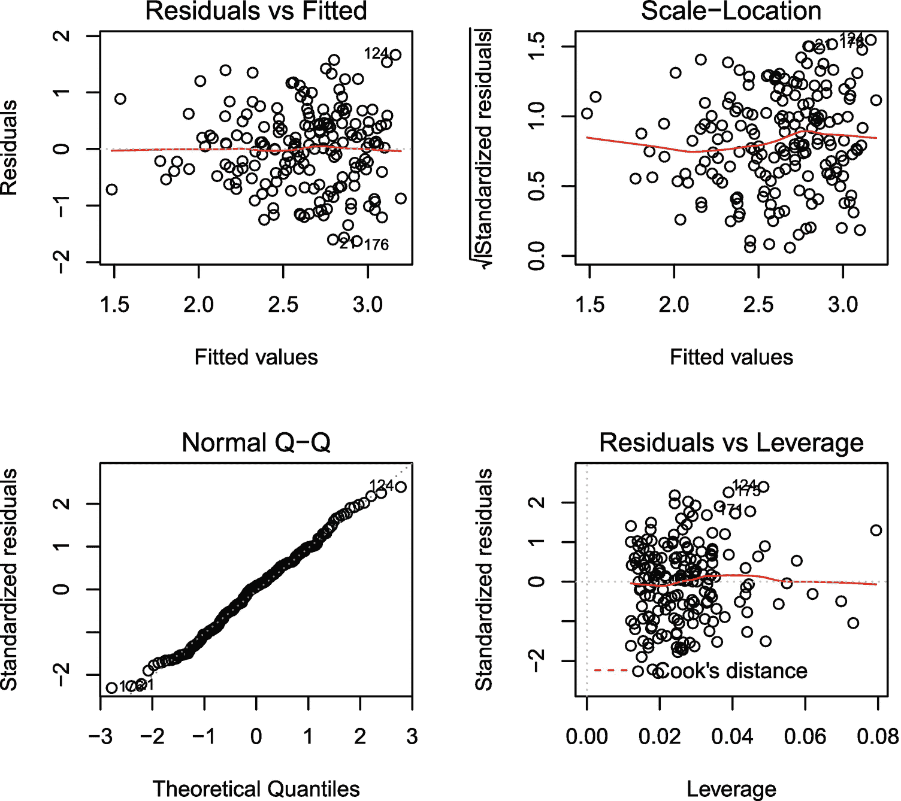

图 9-7

来自第一个估算数据集的线性回归模型诊断

```r
par(mfcol = c(2,2 ))
plot(lm.1$analyses[[1]]) 

par(mfcol = c(1,1))

```

然而，一般来说，我们对单个模型不太感兴趣，相反，我们希望看到跨模型的总体结果。`mice`包中的`pool()`函数就是用来做这件事的。与`summary()`结合，我们可以得到通常的线性回归汇总表，但基于来自多重估算数据的汇总结果。结果是汇集的回归系数、它们的标准误差、t 值、估计的自由度、p 值和置信区间。为了很好地为这本书格式化，我们使用了`xtable()`函数，结果在表 [9-1](#Tab1) 中。为此，不使用`LaTeX`，只需运行`summary(pool(lm.1), conf.int = TRUE)`。

表 9-1

多个估算数据的回归结果汇总

<colgroup><col class="tcol1 align-left"> <col class="tcol2 align-left"> <col class="tcol3 align-left"> <col class="tcol4 align-left"> <col class="tcol5 align-left"> <col class="tcol6 align-left"> <col class="tcol7 align-left"> <col class="tcol8 align-left"></colgroup> 
|   | 

估计

 | 

Std。错误

 | 

统计的

 | 

df

 | 

p 值

 | 

2.5%

 | 

97.5%

 |
| --- | --- | --- | --- | --- | --- | --- | --- |
| (截取) | Three point nine one | Zero point six eight | Five point seven one | Eighty-nine point eight nine | Zero | Two point five five | Five point two seven |
| 强调 | −0.20 | Zero point zero four | −4.48 | Fifty point five three | Zero | −0.29 | −0.11 |
| 年龄 | −0.03 | Zero point zero three | −1.07 | Eighty-eight point eight eight | Zero point two nine | −0.10 | Zero point zero three |
| 我的优势是毕业+ | −0.07 | Zero point one five | −0.50 | Eighty-three point seven eight | Zero point six two | −0.36 | Zero point two two |
| 女性女性 | −0.07 | Zero point one five | −0.45 | Nineteen point nine eight | Zero point six five | −0.39 | Zero point two five |

```r
xtable(summary(pool(lm.1), conf.int=TRUE),
  digits = 2,
  caption = "Regression results pooled across multiply imputed data",
  label = "tmd-pooledres1")

```

为了从模型中得到汇集的 *R* <sup>2</sup> ，我们可以使用`pool.r.squared()`函数。

```r
pool.r.squared(lm.1)

##      est lo 95 hi 95 fmi
## R^2 0.14 0.054  0.26 NaN

```

一些额外的列通过指定参数`type = "all"`提供关于缺失量和缺失信息部分的信息，这是缺失数据对特定系数影响程度的指标。这些结果见表 [9-2](#Tab2) 。

表 9-2

包含附加信息的多重估算数据的回归结果汇总

<colgroup><col class="tcol1 align-left"> <col class="tcol2 align-left"> <col class="tcol3 align-left"> <col class="tcol4 align-left"> <col class="tcol5 align-left"> <col class="tcol6 align-left"> <col class="tcol7 align-left"> <col class="tcol8 align-left"> <col class="tcol9 align-left"> <col class="tcol10 align-left"> <col class="tcol11 align-left"> <col class="tcol12 align-left"> <col class="tcol13 align-left"></colgroup> 
|   | 

估计

 | 

Std。错误

 | 

统计的

 | 

df

 | 

p 值

 | 

2.5%

 | 

97.5%

 | 

里弗

 | 

希腊字母的第 11 个

 | 

fonds mon é taire international 国际货币基金组织

 | 

取消栏

 | 

b

 |
| --- | --- | --- | --- | --- | --- | --- | --- | --- | --- | --- | --- | --- |
| (截取) | Three point nine one | Zero point six eight | Five point seven one | Eighty-nine point eight nine | Zero | Two point five five | Five point two seven | Zero point one eight | Zero point one five | Zero point one seven | Zero point four | Zero point zero six |
| 强调 | −0.20 | Zero point zero four | −4.48 | Fifty point five three | Zero | −0.29 | −0.11 | Zero point three three | Zero point two five | Zero point two eight | Zero | Zero |
| 年龄 | −0.03 | Zero point zero three | −1.07 | Eighty-eight point eight eight | Zero point two nine | −0.10 | Zero point zero three | Zero point one eight | Zero point one five | Zero point one seven | Zero | Zero |
| 我的优势是毕业+ | −0.07 | Zero point one five | −0.50 | Eighty-three point seven eight | Zero point six two | −0.36 | Zero point two two | Zero point one nine | Zero point one six | Zero point one eight | Zero point zero two | Zero |
| 女性女性 | −0.07 | Zero point one five | −0.45 | Nineteen point nine eight | Zero point six five | −0.39 | Zero point two five | Zero point eight one | Zero point four five | Zero point four nine | Zero point zero one | Zero point zero one |

```r
xtable(summary(pool(lm.1), type = "all", conf.int=TRUE),
  digits = 2,
  caption = "Regression results pooled across multiply imputed data with additional information",
  label = "tmd-pooledres1alt")

```

最后，假设我们想要得到压力和积极情感之间关系的预测回归线。我们首先建立一个数据集，然后从每个独立的回归模型中生成预测，然后对结果进行平均。

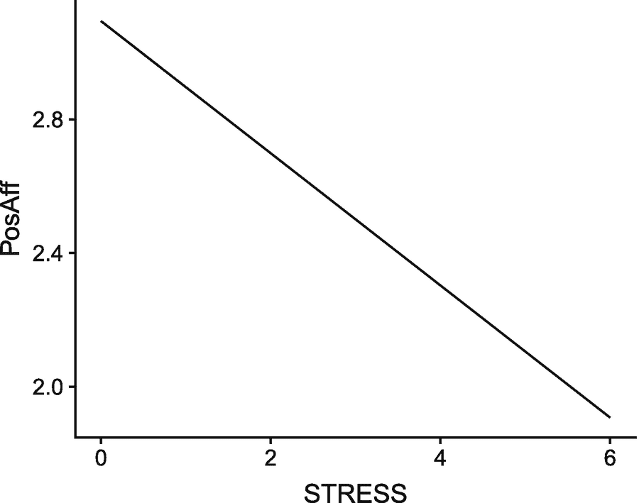

图 9-8

压力和积极情感之间关联的线性回归模型的汇总预测

```r
newdat <- data.frame(
  STRESS = seq(from = 0, to = 6, length.out = 100),
  Age = mean(davg$Age),
  EDU = factor("< Uni Graduate", levels = levels(davgmiss$EDU)),
  Female = factor("Female", levels = levels(davgmiss$Female)))

newdat$PosAff <- rowMeans(sapply(1:6, function(i) {
  predict(lm.1$analyses[[i]], newdata = newdat) 

}))

ggplot(newdat, aes(STRESS, PosAff)) +
  geom_line()

```

### 并行处理的多重插补

虽然基于回归的插补往往相当快，但随着更多的案例、更多的变量、更多的插补，特别是使用更复杂的插补方法(如随机森林),多重插补可能需要大量的计算和时间。幸运的是，如果可以的话，并行化可以直接利用多个内核。

此示例显示了如何使用一种在 Windows、Linux 和 Mac 操作系统上都适用的方法来并行化多重插补。在 Linux 和 Mac 上有更简单的策略，但是这种方法是最具交叉兼容性的。

首先，我们创建一个包含两个工作进程的本地集群。如果您有更多的内核，您可以将此设置得更高。如果只有两个内核，则设置为两个，以此类推。接下来，我们确保将包加载到每个工作进程中。由于我们将让每个工人只进行一次插补，为了使结果可复制，我们需要为每次插补单独随机种子。最后，我们需要将数据集和随机种子导出到每个工作者进行处理。

```r
cl <- makeCluster(2)
clusterExport(cl, c("book_directory", "checkpoint_directory" ))

clusterEvalQ(cl, {
  library(checkpoint)
  checkpoint("2018-09-28", R.version = "3.5.1",
  project = book_directory,
  checkpointLocation = checkpoint_directory,
  scanForPackages = FALSE,
  scan.rnw.with.knitr = TRUE, use.knitr = TRUE)
  library(mice)
  library(randomForest)
  library(data.table)
})

## [[1]]
##  [1] "data.table"    "randomForest"  "mice"          "lattice"
##  [5] "checkpoint"    "RevoUtils"     "stats"         "graphics"
##  [9] "grDevices"     "utils"         "datasets"      "RevoUtilsMath"
## [13] "methods"       "base"
##
## [[2]]
##  [1] "data.table"    "randomForest"  "mice"          "lattice"
##  [5] "checkpoint"    "RevoUtils"     "stats"         "graphics"
##  [9] "grDevices"     "utils"         "datasets"      

"RevoUtilsMath"
## [13] "methods"       "base"

imputation_seeds <- c(
  403L, 2L, 2118700268L, 1567504751L,
  -161759579L, -1822093220L)

clusterExport(cl, c("davgmiss", "imputation_seeds"))

```

现在一切都设置好了，我们可以从 1 到 6 循环，得到我们的 6 个多重估算数据集。每一个都被传递给一个实际运行的工作进程，使用`parLapplyLB()`函数。

```r
system.time(mi.par <- parLapplyLB(cl, 1:6, function(i) {
mice(
  davgmiss,
  m = 1,   maxit = 20,
  defaultMethod = c("norm", "logreg", "polyreg", "polr"),
  seed = imputation_seeds[i])
}))

##    user  system elapsed
##     0.0     0.0     3.5

```

最后，之前因为我们要求`mice()`直接做多重插补，所以插补已经合并成一个大对象了。为了分开并行处理，我们每次只要求一个插补，所以我们需要手动合并它们，我们用`ibind()`函数创建一个具有六个插补的`mids`类对象。当我们打印结果时，我们可以看到多重插补的数量是 6。

```r
## combine the separate imputations into a single object
mi.par2 <- ibind(mi.par[[1]], mi.par[[2]]) 

for (i in 3:6) {
  mi.par2 <- ibind(mi.par2, mi.par[[i]])
}

mi.par2

## Class: mids
## Number of multiple imputations:  6
## Imputation methods:
##   Female      Age    SES_1      EDU   STRESS  SUPPORT   PosAff
## "logreg"   "norm"   "norm" "logreg"  "norm"  "norm"   "norm"
##   NegAff
##   "norm"
## PredictorMatrix:
##         Female Age SES_1 EDU STRESS SUPPORT PosAff NegAff
## Female       0   1     1   1      1       1      1      1
## Age          1   0     1   1      1       1      1      1
## SES_1        1   1     0   1      1       1      1      1
## EDU          1   1     1   0      1       1      1      1
## STRESS       1   1     1   1      0       1      1      1

## SUPPORT      1   1     1   1      1       0      1      1

```

### 使用随机森林的多重插补

使用随机森林输入数据的工作原理与使用更简单的回归方法基本相同。同样，基本函数调用是对`mice()`的调用。主要区别在于指定了不同的方法“rf”。由于 RFs 可以处理连续变量和分类变量，我们不需要为不同类型的变量指定不同的方法。最后，对于 RFs，我们可以设置一些额外的选项。首先是每片森林中应该有多少棵树。在本例中，我们将其设置为 100。一些估算表明可能需要更少的树，但这将取决于问题，在某些情况下，为了获得良好的预测模型，可能需要 100 多棵树。我们还指定了 RF 的节点大小，在本例中为 10。迭代次数设置为 20，以匹配回归插补的总迭代次数。实际上，并不总是清楚应该使用多少次迭代。模型收敛需要足够的迭代。

首先要注意的是，回归方法只需要几秒钟，而 RF 插补则需要很长时间，甚至是并行运行。该模型似乎已经收敛。最后，在检查诊断时，使用 RF 插补，分布与观察数据更加匹配，并且影响值不会被插补到可能性范围之外(低于 1)。

```r
system.time(mi.rfpar <- parLapplyLB(cl, 1:6, function(i) 

{
  mice(
    davgmiss,
    m = 1, maxit = 30,
    method = "rf",
    seed = imputation_seeds[i],
    ntree = 500, nodesize = 10)
}))

##    user  system elapsed
##    0.16    0.11  850.27

## combine into a single object
mi.rf <- ibind(mi.rfpar[[1]], mi.rfpar[[2]])
for (i in 3:6) {
  mi.rf <- ibind(mi.rf, mi.rfpar[[i]]) 

}

## plot convergence diagnostics
plot(mi.rf, PosAff + NegAff + SUPPORT ~ .it | .ms)

## model diagnostics
densityplot(mi.rf, ~ PosAff + NegAff + SUPPORT + STRESS)

xyplot(mi.rf, NegAff + PosAff ~ STRESS + SUPPORT)

```

请注意，无论数据是如何多重估算的(GLMs、GAMs、RFs)，一旦它们被估算，我们将以同样的方式对它们进行分析。我们可以比较不同模型的结果来看影响。因为我们生成了缺失，所以在这个例子中，我们不仅可以将插补模型与完整的病例结果进行比较，还可以将它们与“真相”进行比较以下代码运行了一个结果为积极影响的 GLM，模型中包含一些社会人口统计协变量，压力作为焦点预测因子。使用真实数据、仅完整案例、基于链式方程和线性模型的估算数据以及随机森林多重估算来重复该模型。估计值和置信区间绘制在图 [9-12](#Fig12) 中。在这个虚构的例子中，我们可以看到完全案例方法产生了更大的置信区间和通常不太准确的结果。不同的插补方法具有比“真实”模型更具可比性的置信区间。不幸的是，虽然可以在已知条件下评估不同插补模型的性能，但在实践中，不可能知道真相或确切的缺失数据机制，因此很难判断哪种特定方法最准确。这些结果还表明，根据对发现的解释，许多结果可能被认为是非常相似的。鉴于这种相似性和哪种模型最好的不确定性，考虑与不同方法相关的计算成本是合理的，这可能导致一些人选择比随机森林更简单的插补模型。

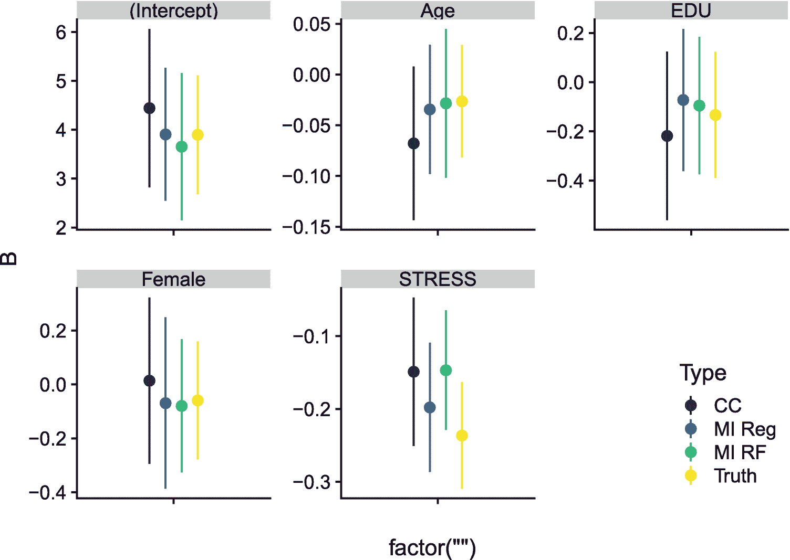

图 9-12

压力和积极情感之间关联的线性回归模型的汇总预测

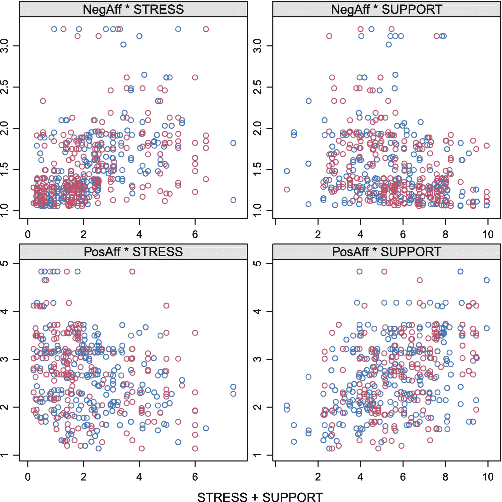

图 9-11

观察值和估算值的情感与压力和社会支持散点图

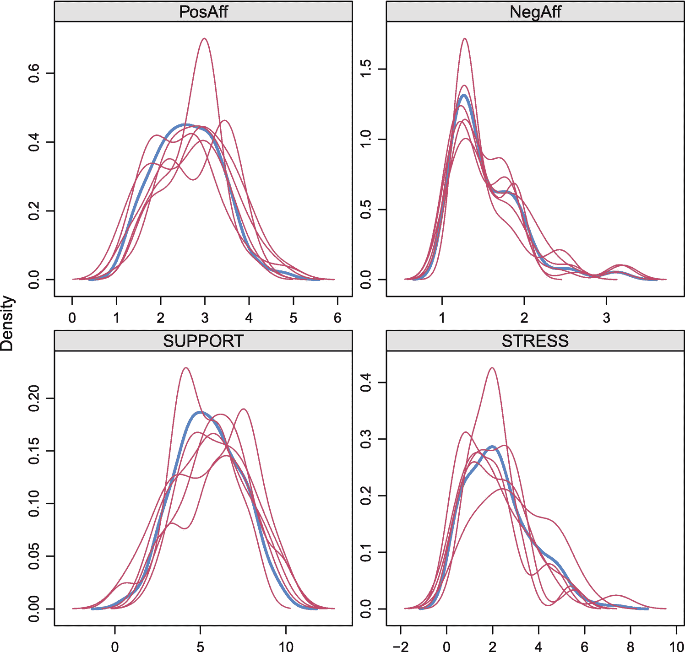

图 9-10

随机森林模型中观测值和估算值的密度图

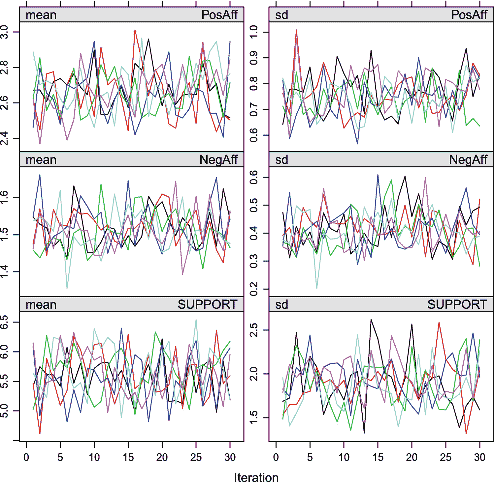

图 9-9

随机森林插补模型的收敛诊断

```r
m.true <- lm(PosAff ~ STRESS + Age + EDU + Female, data = davg)
m.cc <- lm(PosAff ~ STRESS + Age + EDU + Female, data = davgmiss)
m.mireg <- summary(pool(with(mi.1,
  lm(PosAff ~ STRESS + Age + EDU + Female))),
  conf.int = TRUE)
m.mirf <- summary(pool(with(mi.rf,
  lm(PosAff ~ STRESS + Age + EDU + Female))),
  conf.int = TRUE)

res.true <- as.data.table(cbind(coef(m.true), confint(m.true)))
res.cc <- as.data.table(cbind(coef(m.cc), confint(m.cc)))
res.mireg <- as.data.table(m.mireg[, c("estimate", "2.5 %", "97.5 %")])
res.mirf <- as.data.table(m.mirf[, c("estimate", "2.5 %", "97.5 %")])
setnames(res.true, c("B", "LL", "UL"))
setnames(res.cc, c("B", "LL", "UL"))
setnames(res.mireg, c("B", "LL", "UL"))
setnames(res.mirf, c("B", "LL", "UL"))

res.compare <- rbind(
  cbind(Type = "Truth", Param = names(coef(m.true)), res.true),
  cbind(Type = "CC", Param = names(coef(m.true)), res.cc),
  cbind(Type = "MI Reg", Param = names(coef(m.true)), res.mireg),
  cbind(Type = "MI RF", Param = names(coef(m.true)), res.mirf))

ggplot(res.compare, aes(factor(""),
   y = B, ymin = LL, ymax = UL, colour = Type)) +
  geom_pointrange(position = position_dodge(.4)) +
  scale_color_viridis(discrete = TRUE) +
  facet_wrap(~Param, scales = "free") +
  theme(
    legend.position = c(1, 0),
    legend.justification = c("right", "bottom"))

## clean up cluster
stopCluster(cl)
rm(cl)

```

## 9.3 案例研究:RFs 的多重插补

为了结束这一章，我们将检查一个使用随机森林多重插补的完整工作示例。随机森林多重插补往往非常耗时，因此在几乎所有情况下，您都应该考虑使用并行处理。下面的代码设置了一个本地集群，并加载了所有必需的包。正如我们在介绍中提到的，我们使用`checkpoint`包来确保我们可以通过指定`R`的版本和日期来精确地控制和指定使用哪个版本的`R`包。这有助于使结果具有可重复性，并确保如果您在以后回到您的代码，您确切地知道您使用了什么软件来运行它。

```r
cl <- makeCluster(2)
clusterExport(cl, c("book_directory", "checkpoint_directory" ))

clusterEvalQ(cl, {
  library(checkpoint)
  checkpoint("2018-09-28", R.version = "3.5.1",
  project = book_directory,
  checkpointLocation = checkpoint_directory,
  scanForPackages = FALSE,
  scan.rnw.with.knitr = TRUE, use.knitr = TRUE)
  library(mice)
  library(randomForest)
  library(data.table)
})

## [[1]]
##  [1] "data.table"    "randomForest"  "mice"          "lattice"
##  [5] "checkpoint"    "RevoUtils"     "stats"         "graphics"
##  [9] "grDevices"     "utils"         "datasets"      "RevoUtilsMath"
## [13] "methods"       "base"
##
## [[2]]
##  [1] "data.table"    "randomForest"  "mice"          "lattice"
##  [5] "checkpoint"    "RevoUtils"     "stats"         "graphics"
##  [9] "grDevices"     "utils"         "datasets"      "RevoUtilsMath"
## [13] "methods"       "base"

```

因为多重插补包含随机成分，所以如果您想在重新运行多重插补模型时获得相同的结果，也需要设置随机种子。获得许多随机种子的一个简单方法是使用`R`中内置的`.Random.seed`变量。因为这可能会随着时间的推移而改变，而不是直接依赖于结果，所以使用`dput()`函数将它们导出为可复制可粘贴的`R`代码。在下面的代码中，我们展示了一个简单的例子，然后展示了重用种子，以便我们可以确定使用哪些种子。为了在并行处理中使用，我们必须使用`clusterExport()`将结果导出到本地集群。

```r
## example of how to have R return some seed values
dput(.Random.seed[1:5])

## c(403L, 148L, -1767993668L, 1417792552L, 298386660L)

## random seeds
imputation_seeds <- c(403L, 148L, -1767993668L,
  1417792552L, 298386660L, 1360311820L,
1356573822L, -1472988872L, 1215046494L, 759520201L,
1399305648L, -455288776L, 969619279L, 518793662L,
-383967014L, -1983801345L, -698559309L, 1957301883L,
-1457959076L, 1321574932L, -537238757L,
11573466L, 1466816383L, -2113923363L, 1663041018L)

clusterExport(cl, c("davgmiss", "imputation_seeds"))

```

实际运行随机森林多重插补的代码相当简单。随机森林模型中的预测因子几乎不需要设置，因为模型容易适应分类和连续预测因子，并且不强加关于关联函数形式的假设。因此，对转换数据的关注不是特别相关。尽管异常值可能会有一些影响，因为随机森林依赖于数据的分割，但异常值或预测值中的极值也往往影响较小。连续结果的异常值可能会带来一些挑战，因此检查这些异常值是一个好主意。以下代码和图 [9-13](#Fig13) 显示了数据快速诊断的示例。图表显示数据可能足够好，可以继续进行。

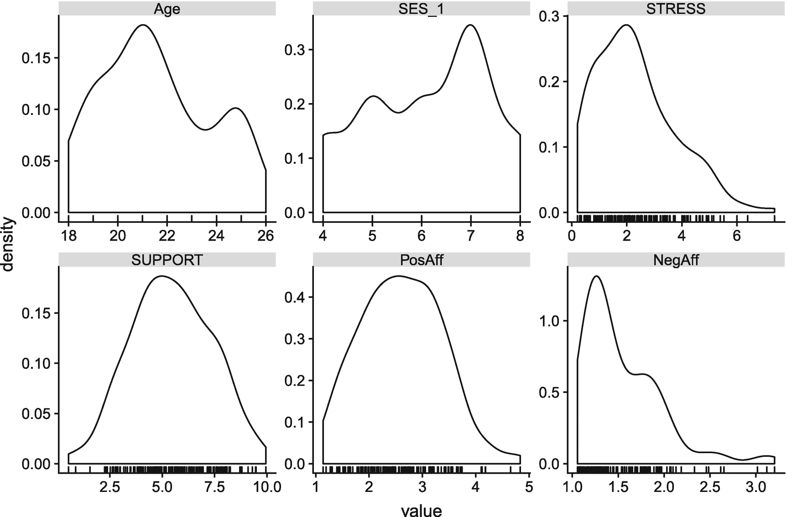

图 9-13

插补模型中包含的连续变量的密度图

```r
ggplot(melt(davgmiss[, sapply(davgmiss, is.numeric),
              with = FALSE], measure.vars = 1:6), aes(value)) +
         geom_density() + geom_rug() +
         facet_wrap(~variable, scales = "free")

## Warning: Removed 168 rows containing non-finite values (stat_density) 

.

```

首先，运行相对简单的模型并生成少量多重估算数据集通常是个好主意。总之，这意味着获得初步结果所需的时间更少，这将有助于识别设置中的任何错误，确保插补模型的结果看起来合理，并可以形成一个基础来估计完成全部插补需要多长时间。下面的代码就是这样一个简单的例子。因为我们设置了一个只有两个处理器的本地集群，所以我们创建了四个估算数据集，所以每个处理器只需要生成两个数据集。我们还将迭代次数限制为五次，这大大提高了速度。我们在开始和结束时都使用了`proc.time()`函数，这样我们就可以获得总共运行了多长时间的日志。

```r
start.time <- proc.time()

mi.rfpar1 <- parLapplyLB(cl, 1:4, function(i) {
  mice(
    davgmiss,
    m = 1, maxit = 5,
    method = "rf",
    seed = imputation_seeds[i],
    ntree = 100, nodesize = 10)
})
stop.time <- proc.time()

## estimate of how long it took
stop.time - start.time

##    user  system elapsed
##       0       0      15

## combine into a single object
mi.rf1 <- ibind(mi.rfpar1[[1]], mi.rfpar1[[2]])
for (i in 3:4) {
  mi.rf1 <- ibind(mi.rf1, mi.rfpar1[[i]])
}

```

我们可以看到大约过了 15.5 秒。随着每个核心插补的增加，以及迭代次数的增加，这一数字将大致呈线性增加。我们还应该检查来自这个简单模型的诊断，看看是否有任何异常或可能暗示模型中的问题。我们首先来看看图 9-14 中的一些收敛诊断。

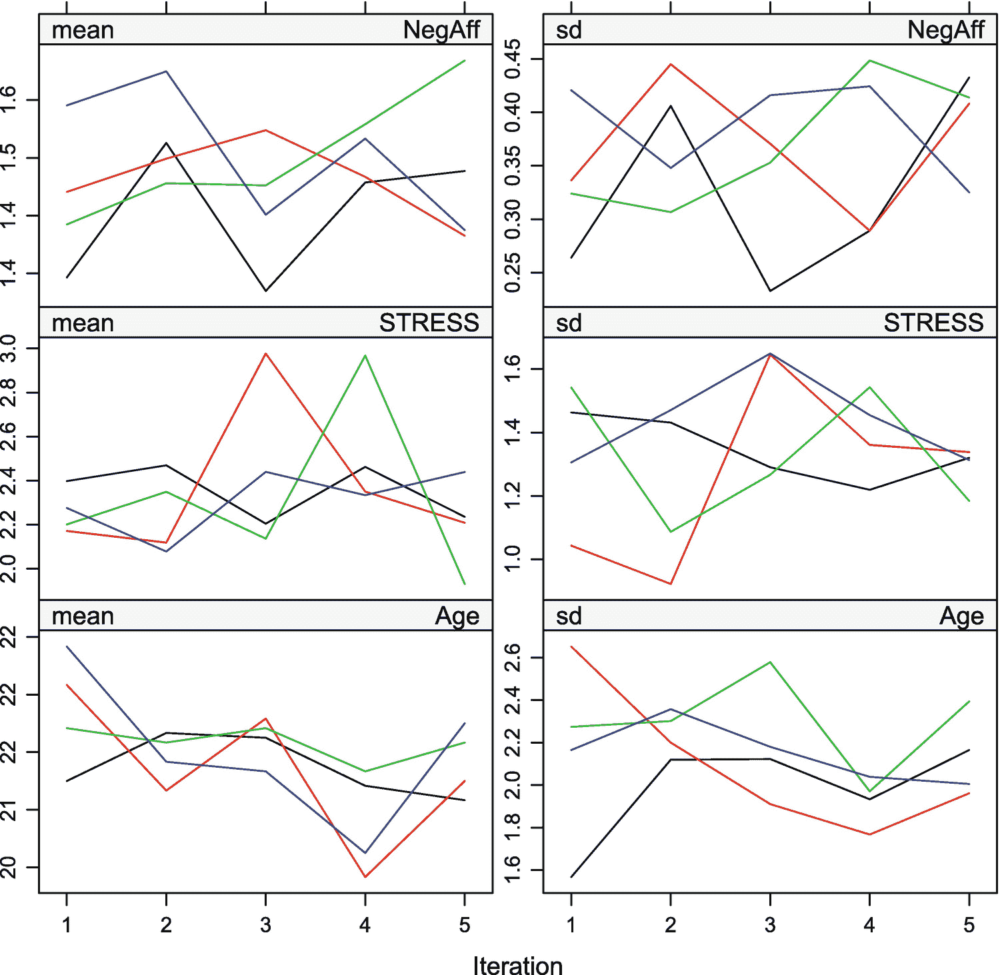

图 9-14

随机森林插补模型的收敛诊断

```r
## plot convergence diagnostics

plot(mi.rf1, NegAff + STRESS + Age ˜ .it | .ms)

```

接下来，我们将插补与图 [9-15](#Fig15) 中观察到的分布进行比较。

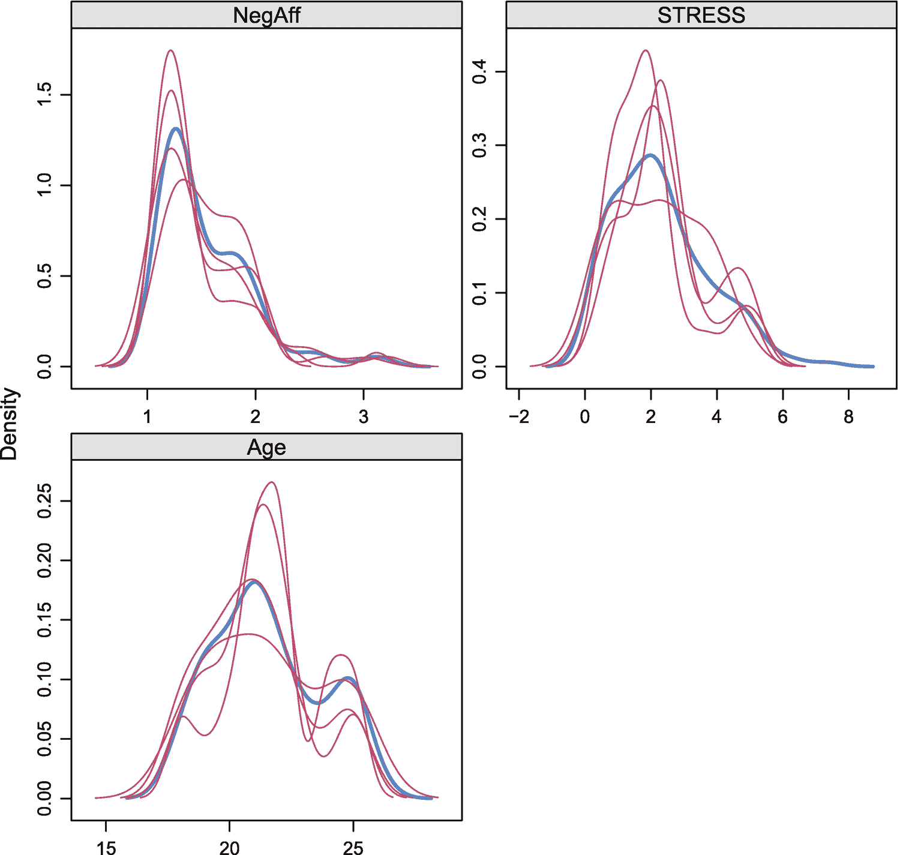

图 9-15

随机森林模型中观测值和估算值的密度图

```r
## model diagnostics for continuous study variables
densityplot(mi.rf1, ˜ NegAff + STRESS + Age)

```

现在我们可以拟合我们的目标模型，一个线性回归，从每个估算数据集中提取残差，并检查这些假设、异常值等。因为有多个回归模型(每个估算数据集一个)，我们使用`lapply()`循环遍历这些模型，组合成标准化残差的单个向量，并绘制。结果如图 [9-16](#Fig16) 所示。虽然分布有些偏斜，并且有一些相对极端的值，但它们并不太可怕，残差分布也没有严重偏斜。

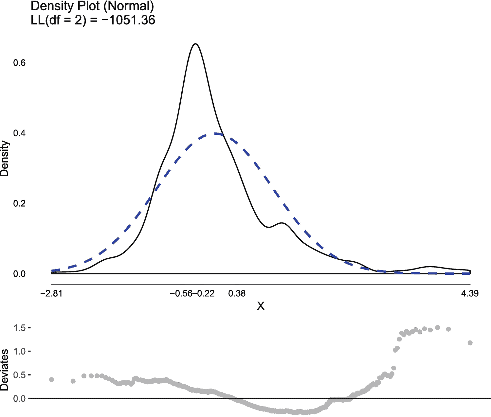

图 9-16

模型残差的分布图(密度和 Q-Q 偏差)

```r
## fit the models
fit.mirf1 <- with(mi.rf1,
  lm(NegAff ~ STRESS + Age + EDU + Female + SES_1))

testdistr(unlist(lapply(fit.mirf1$analyses, rstandard)))

```

最后，我们可以汇总和总结结果，然后在表 [9-3](#Tab3) 中查看它们。这有助于早期识别数据、编码或最终分析模型中的任何明显问题。如果有问题，可以通过这种方式更快地解决，而不是运行整个插补模型，这可能很耗时，而且只有到那时才意识到有问题。有趣的是，我们的经验是，通常在最初几次会发现一些数据问题，直到后来才发现，因为插补依赖于正确的数据，所以数据中的任何问题都需要重新运行插补模型和所有后续分析。

表 9-3

多次估算数据测试运行中汇集的回归结果

<colgroup><col class="tcol1 align-left"> <col class="tcol2 align-left"> <col class="tcol3 align-left"> <col class="tcol4 align-left"> <col class="tcol5 align-left"> <col class="tcol6 align-left"> <col class="tcol7 align-left"> <col class="tcol8 align-left"></colgroup> 
|   | 

估计

 | 

Std。错误

 | 

统计的

 | 

df

 | 

p 值

 | 

2.5%

 | 

97.5%

 |
| --- | --- | --- | --- | --- | --- | --- | --- |
| (截取) | One point zero five | Zero point three two | Three point three | Seventy-five point five eight | Zero | Zero point four two | One point six nine |
| 强调 | Zero point one nine | Zero point zero two | Ten point four one | One hundred and eighteen point nine seven | Zero | Zero point one five | Zero point two two |
| 年龄 | Zero point zero one | Zero point zero one | Zero point six | One hundred and three point eight eight | Zero point five five | −0.02 | Zero point zero three |
| 我的优势是毕业+ | Zero point zero two | Zero point zero seven | Zero point three four | Twenty-five point three one | Zero point seven three | −0.12 | Zero point one six |
| 女性女性 | −0.01 | Zero point zero six | −0.19 | Twenty-four point eight six | Zero point eight five | −0.14 | Zero point one one |
| SES_1 | −0.02 | Zero point zero two | −0.97 | Sixty point three nine | Zero point three three | −0.06 | Zero point zero two |

```r
## pool results and summarize
m.mirf1 <- summary(pool(fit.mirf1), conf.int = TRUE)

xtable(m.mirf1,
  digits = 2,
  caption = "Regression results pooled across multiply imputed data test run",
  label = "tmd-pooledres2")

```

一旦我们合理地认为插补模型有效，没有需要解决的数据问题，并且我们的最终分析模型可能有效，那么我们就进入最终插补。在本例中，我们将最大迭代次数从 5 次增加到 30 次，以帮助确保收敛。我们还将估算数据集的数量从 4 个增加到 10 个。在实践中，更常见的是使用 25-100 个估算数据集，但我们保持它的简洁性，以使示例不会运行太长时间。

之前，我们看到每个内核进行 2 次插补需要 5 次迭代，耗时 15.5 秒。当使用 30 次而不是 5 次最大迭代时，我们预计需要大约 6 倍的时间，如果我们进行 10 次插补(每个内核 5 次)，插补次数大约需要 2.5 倍的时间。总之，我们估计完成这个更长的插补大约需要 232.5 秒。如果我们计划 50 个估算数据集，它将会是现在的 5 倍。

```r
start.time2 <- proc.time()
mi.rfpar2 <- parLapplyLB(cl, 1:10, function(i) {
  mice(
    davgmiss,
    m = 1, maxit = 30,
    method = "rf",
    seed = imputation_seeds[i],
    ntree = 100, nodesize = 10)
})
stop.time2 <- proc.time()

## time taken
stop.time2 - start.time2

##    user  system elapsed
##    0.04    0.02  274.58

## combine into a single object
mi.rf2 <- ibind(mi.rfpar2[[1]], mi.rfpar2[[2]])
for (i in 3:10) {
  mi.rf2 <- ibind(mi.rf2, mi.rfpar2[[i]])
}

```

我们可以看到，与我们预测的 232.5 秒相比，大约过去了 274.6 秒。与更简单的模型一样，我们应该检查诊断。这些如图 [9-17](#Fig17) 所示。

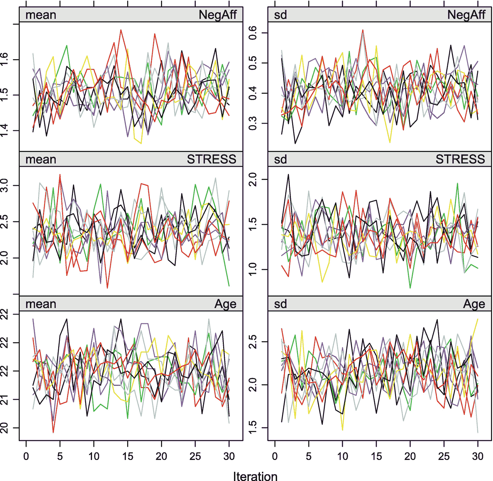

图 9-17

随机森林插补模型的收敛诊断

```r
## plot convergence diagnostics
plot(mi.rf2, NegAff + STRESS + Age ˜ .it | .ms)

```

接下来，我们将插补与图 [9-18](#Fig18) 中观察到的分布进行比较。

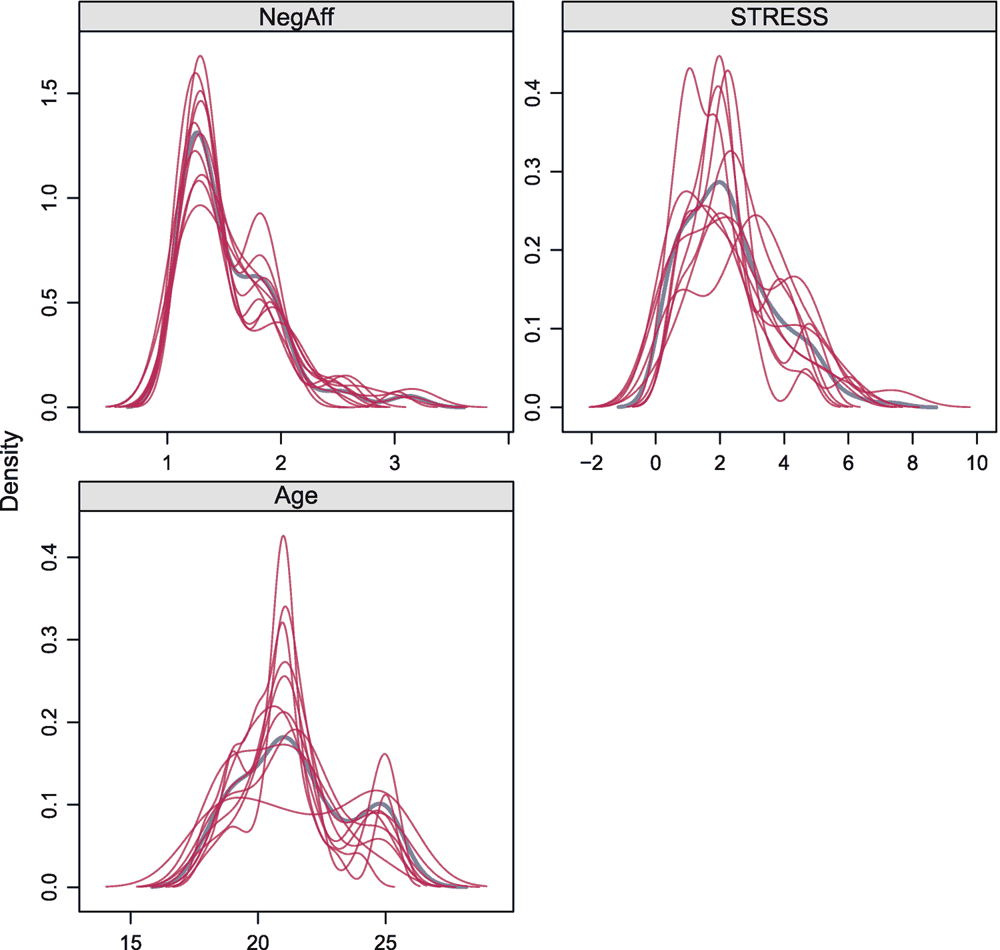

图 9-18

随机森林模型中观测值和估算值的密度图

```r
## model diagnostics for continuous study variables
densityplot(mi.rf2, ˜ NegAff + STRESS + Age)

```

现在我们拟合我们的目标模型，线性回归，并检查图 [9-19](#Fig19) 中的标准化残差。

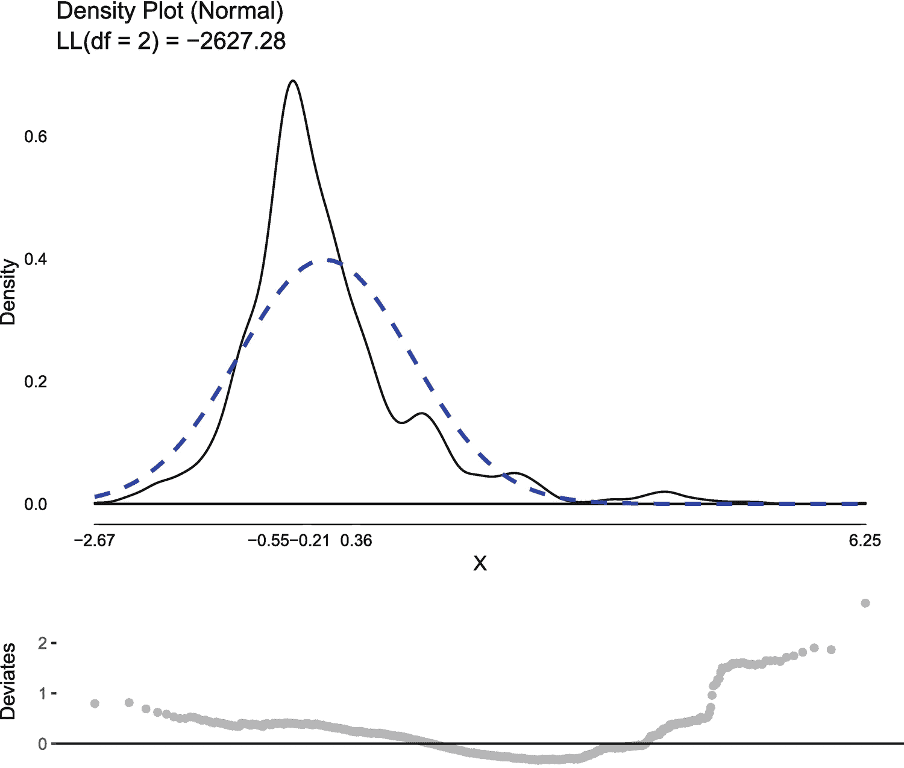

图 9-19

模型残差的分布图(密度和 Q-Q 偏差)

```r
## fit the models
fit.mirf2 <- with(mi.rf2,
  lm(NegAff ~ STRESS + Age + EDU + Female + SES_1))

testdistr(unlist(lapply(fit.mirf2$analyses, rstandard)))

```

最后，我们可以汇总和总结结果，然后在表 [9-4](#Tab4) 中查看它们。

```r
## pool results and summarize
m.mirf2 <- summary(pool(fit.mirf2), conf.int = TRUE)

xtable(m.mirf2,
  digits = 2,
  caption = "Regression results pooled across multiply imputed data final run",
  label = "tmd-pooledres3")

```

如果你将表 [9-3](#Tab3) 与表 [9-4](#Tab4) 进行比较，你会发现有一些不同。如果我们进行更多的估算，可能会有更多的差异。选择 50 至 100 个插补的一个原因是，数字越大，一组随机插补与另一组插补之间的差异往往越小。由于只有 5 到 10 次插补，随机概率可能会导致相对较大的变化。

表 9-4

多次估算数据最终运行的回归结果汇总

<colgroup><col class="tcol1 align-left"> <col class="tcol2 align-left"> <col class="tcol3 align-left"> <col class="tcol4 align-left"> <col class="tcol5 align-left"> <col class="tcol6 align-left"> <col class="tcol7 align-left"> <col class="tcol8 align-left"></colgroup> 
|   | 

估计

 | 

Std。错误

 | 

统计的

 | 

df

 | 

p 值

 | 

2.5%

 | 

97.5%

 |
| --- | --- | --- | --- | --- | --- | --- | --- |
| (截取) | One point one one | Zero point three three | Three point three nine | Ninety-five point five two | Zero | Zero point four six | One point seven six |
| 强调 | Zero point one eight | Zero point zero two | Eight point nine four | Sixty-nine point seven four | Zero | Zero point one four | Zero point two two |
| 年龄 | Zero point zero one | Zero point zero two | Zero point four six | Forty-four point zero three | Zero point six five | −0.02 | Zero point zero four |
| 我的优势是毕业+ | Zero point zero three | Zero point zero eight | Zero point four four | Thirty-one point one | Zero point six six | −0.12 | Zero point one nine |
| 女性女性 | −0.01 | Zero point zero seven | −0.12 | Twenty-seven point eight six | Zero point nine one | −0.15 | Zero point one four |
| SES_1 | −0.02 | Zero point zero two | −1.03 | Sixty-two point six five | Zero point three one | −0.07 | Zero point zero two |

## 9.4 总结

本章介绍了通过链式方程(MICE)的多重插补，这是一种解决缺失数据的灵活技术。与更容易但往往不是最佳的完整病例分析相比，MICE 可以通过使用所有可用数据来提高效率。如果与缺失相关的必要变量可以包括在 MICE 模型中，MICE 还可以减少由于缺失数据而导致的估计偏差。在许多分析中，解决缺失数据通常是关键的第一步。此外，尽管我们在本章中仅展示了一些后续分析，但 MICE 可以用作几乎任何后续分析的第一步，包括本书其他章节中讨论的所有分析。最后，表 [9-5](#Tab5) 显示了本章中用于解决缺失数据的一些关键函数的简要总结。

表 9-5

本章中描述的关键功能列表及其功能摘要

<colgroup><col class="tcol1 align-left"> <col class="tcol2 align-left"></colgroup> 
| 

功能

 | 

它的作用

 |
| --- | --- |
| `aggr()` | 通过变量可视化数据集中的缺失数据，并检查缺失数据的不同模式 |
| `marginplot()` | 可视化一个变量的缺失是否依赖于另一个变量 |
| `mice()` | 使用完全条件规格方法运行多重插补 |
| `mice.mids()` | 对先前运行的`mice`中的`mids`类对象运行额外的迭代，以检查收敛性 |
| `densityplot()` | 一个`mids`类对象绘制观察和估算数据密度的方法；有助于了解估算数据的分布是否与观测数据相似或不同 |
| `xyplot()` | 一个`mids`类对象创建两个变量散点图的方法，分别显示观察值和估算值 |
| `with()` | 一个`mids`类对象对每个估算数据集分别运行指定分析的方法 |
| `pool()` | 汇集对不同估算数据集分别运行的分析结果 |
| `ibind()` | 用所有多重插补将单独的`mids`对象合并成一个对象 |
| `complete()` | 从一个`mids`类对象中提取完整的数据集 |