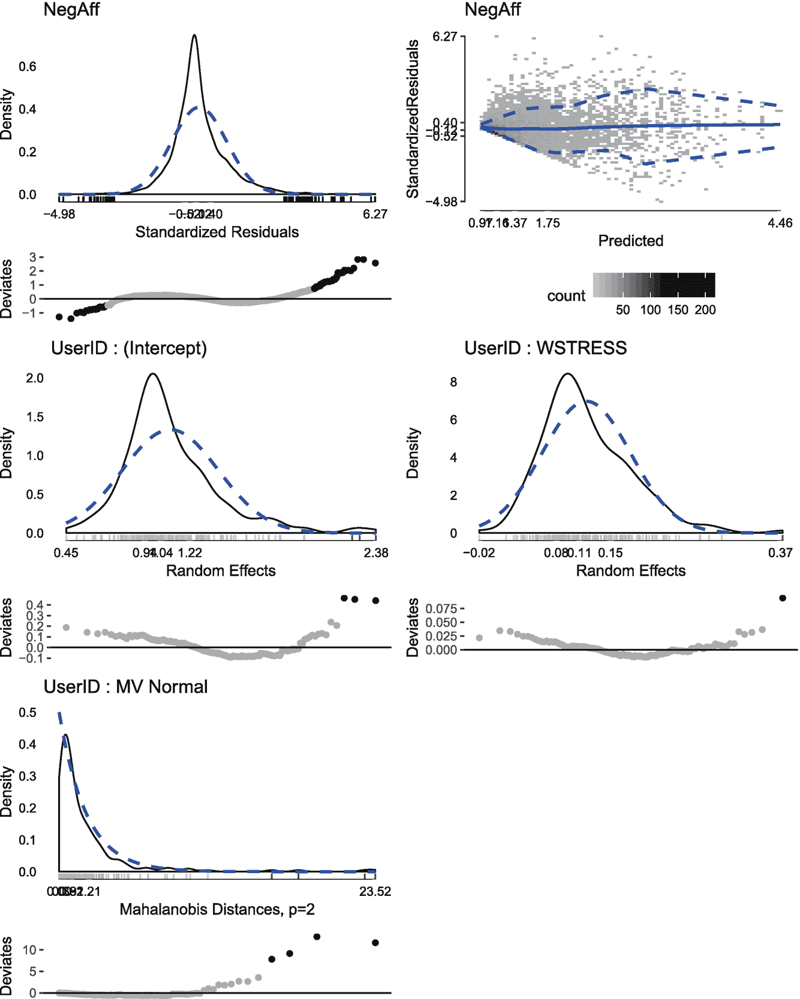

# 十、GLMMs：简介

广义线性*混合*模型(glmm)扩展了前面章节中介绍的广义线性模型(GLMs ),以统计方式说明聚集的数据(例如，学校中的儿童、特定医院诊所中的个人、对同一个人的重复测量)并使这些非独立观察值*有条件地*独立。

考虑观察值之间的关系是至关重要的，无论是由于阶层(如班级、学校、工作场所)内的聚类，还是由于家庭内的相似性或重复测量，因为许多统计模型假设观察值是独立的，或者至少是有条件独立的。在许多情况下，这可能是一个站得住脚的假设，特别是当观察的基本单位(例如，个人等。)每个人都对我们的数据贡献了一个观察值。本章介绍了观测值可能*不*独立的情况。当处理观察值可能不独立的数据时，不仅需要调整最终模型和统计推断，还必须调整数据可视化、探索和描述性统计。因此，本章涵盖了处理非独立数据的各个方面，后续章节涵盖了此类数据的统计建模。

```r
library(checkpoint)
checkpoint("2018-09-28", R.version = "3.5.1",
  project = book_directory,
  checkpointLocation = checkpoint_directory,
  scanForPackages = FALSE,
  scan.rnw.with.knitr = TRUE, use.knitr = TRUE)

library(knitr)
library(ggplot2)
library(cowplot)
library(viridis)
library(JWileymisc)
library(data.table)
library(lme4)
library(lmerTest)
library(chron)
library(zoo)
library(pander)
library(texreg)

options(width = 70, digits = 2)

```

## 10.1 多级数据

观察值不独立的两种常见情况是对每个个体进行重复测量，如纵向研究或重复测量实验，以及对个体进行聚类或分组，如家庭、学校、公司等。，然后将个体参与者聚集或嵌套在这些高阶单元中。例如，如果家族被招募，来自同一家族的兄弟姐妹的观察结果可能比来自其他家族的兄弟姐妹的观察结果更相似，这是由于共有的遗传因素和共有的环境影响。类似地，如果对个人进行一段时间的跟踪，并在一周内每天进行评估，来自同一个人的观察结果自然更有可能彼此相关，而不是与其他人的观察结果相关。

在这一章中，我们将关注一个重复测量数据的例子。尽管重复测量数据可能与家庭内兄弟姐妹或公司内多名员工的数据有很大不同，但它们带来了许多相同的挑战，并有共同的解决方案。主要区别在于，重复测量数据自然地按时间排序，而聚类数据通常是无序的(例如，如果从 100 家公司中抽取 10 名员工，通常没有自然的方法对员工进行排序或排序)。

多级数据的第一个区别是有两种常见的数据组织方式。一种方法，有时称为宽数据集，类似于单级数据。每一行代表一个观察单位(例如，一个人，一所学校)，并添加额外的变量(列)用于单位内的重复测量。例如，假设高血压患者在研究开始时(T1)、6 个月后(T2)和 1 年随访时(T3)纵向测量血压。表 [10-1](#Tab1) 给出了这些数据的一个示例。在这个例子中，ID 3 错过了最后的时间点。

表 10-1

在三个时间点测量的收缩压(SBP)的示例宽数据集

<colgroup><col class="tcol1 align-left"> <col class="tcol2 align-left"> <col class="tcol3 align-left"> <col class="tcol4 align-left"></colgroup> 
| 

身份

 | 

SBPT1 型

 | 

SBPT2 型

 | 

SBPT3 型

 |
| --- | --- | --- | --- |
| `1` | One hundred and thirty-five | One hundred and thirty | One hundred and twenty-five |
| `2` | One hundred and twenty | One hundred and twenty-five | One hundred and twenty-one |
| `3` | One hundred and twenty-one | One hundred and twenty-five | 。 |

虽然宽数据在某些情况下很方便，但它通常不是多级数据的理想结构。首先，对于纵向数据，比如表 [10-1](#Tab1) 中的例子，部分信息实际上编码在变量名中:T1，T2，T3。一般来说，变量名最好只描述变量或测量值，而附加信息(如时间)要被捕获并编码到另一个变量(如时间点)中。第二，如果在一个单元内有不同数量的评估，如不同长度的纵向随访或学校内不同数量的学生，宽格式变得非常低效。例如，想象一个数据集，其中从一所大型学校招聘了 600 名学生，而从一所较小的学校招聘了 15 名学生。要将这些数据以宽格式放置，每个测量需要 600 个变量(最大学校的每个学生一个变量)。在这个小学校里，这 600 个变量中除了 15 个之外，其他都将丢失。

构建多级数据集的另一种方法有时称为长格式。在长格式中，多行可能属于任何一个单元，这由一个标识(ID)变量来表示。表 [10-2](#Tab2) 显示了一个使用相同的血压假设纵向研究的长数据示例。在这种情况下，如果一个特定的单元错过了一个观测值或者比其他单元的观测值少(例如，一所小学校对一所大学校)，则可以省略这些行。例如，在表 [10-2](#Tab2) 中，ID 3 没有时间 3 血压读数，因此该行完全不在数据中。

表 10-2

示例在三个时间点测量的收缩压(SBP)的长数据集

<colgroup><col class="tcol1 align-left"> <col class="tcol2 align-left"> <col class="tcol3 align-left"></colgroup> 
| 

身份

 | 

自发性腹膜炎

 | 

时间

 |
| --- | --- | --- |
| `1` | One hundred and thirty-five | one |
| `1` | One hundred and thirty | Two |
| `1` | One hundred and twenty-five | three |
| `2` | One hundred and twenty | one |
| `2` | One hundred and twenty-five | Two |
| `2` | One hundred and twenty-one | three |
| `3` | One hundred and twenty-one | one |
| `3` | One hundred and twenty-five | Two |

### 重塑数据

如果数据是以一种格式存储的，就有可能，有时也有必要将其转换成另一种格式。下面的代码创建一个宽数据集，然后使用`reshape()`函数将其从宽格式转换为长格式。`varying`参数表示随时间变化的宽数据中的变量。`v.names`参数表示长数据集中每组可变变量的名称。在这个例子中，我们只有 SBP，但如果有更多的变量，这些可以添加。方向参数指示数据是应该由宽到长，还是由长到宽。

```r
ex.wide <- data.table(
  ID = c(1, 2, 3),
  SBPT1 = c(135, 120, 121),
  SBPT2 = c(130, 125, 125),
  SBPT3 = c(125, 121, NA))

print(ex.wide)

##    ID SBPT1 SBPT2 SBPT3
## 1:  1   135   130   125
## 2:  2   120   125   121
## 3:  3   121   125    NA

reshape(
  data = ex.wide,
  varying = list(paste0("SBPT", 1:3)),
  v.names = c("SBP"),
  idvar = "ID",
  direction = "long")

##    ID time SBP
## 1:  1    1 135
## 2:  2    1 120
## 3:  3    1 121
## 4:  1    2 130
## 5:  2    2 125
## 6:  3    2 125
## 7:  1    3 125
## 8:  2    3 121
## 9:  3    3  NA

```

相反，如果数据已经是长格式，就可以将它们转换成宽格式。下面的代码创建了一个长数据，并再次使用`reshape()`函数将其转换为宽数据。`sep`参数指示如何使用宽变量名。在这种情况下，基数是 SBP，然后是分隔符 T，后面是时间:1、2、3。

```r
ex.long <- data.table(
  ID = c(1, 1, 1, 2, 2, 2, 3, 3),
  SBP = c(135, 130, 125, 120, 125, 121, 121, 125),
  Time = c(1, 2, 3, 1, 2, 3, 1, 2))

print(ex.long)

##    ID SBP Time
## 1:  1 135    1
## 2:  1 130    2
## 3:  1 125    3
## 4:  2 120    1
## 5:  2 125    2
## 6:  2 121    3
## 7:  3 121    1
## 8:  3 125    2

reshape(
  data = ex.long,
  v.names = "SBP",
  timevar = "Time",
  sep = "T",
  idvar = "ID",
  direction = "wide")

##    ID SBPT1 SBPT2 SBPT3
## 1:  1   135   130   125
## 2:  2   120   125   121
## 3:  3   121   125    NA

```

### 每日数据集

在开始之前，我们将介绍一个新的数据集。这些数据来自 2017 年在莫纳什大学进行的每日日记研究，年轻成年人在大约 12 天的时间里每天完成多达三次(早上、下午和晚上)的测量。因此，每个参与者对数据集贡献了大约 36 次观察。为了保护参与者的保密性和匿名性，这里使用的数据是从原始数据模拟的，但是以这样的方式保留了变量之间的关系和原始数据的大部分特征。

表 [10-3](#Tab3) 中列出了变量名和每个变量名的简要描述。

模拟数据作为`JWileymisc`包的一部分，可以使用`data()`功能加载。

表 10-3

每日日记研究数据中的变量名称列表

<colgroup><col class="tcol1 align-left"> <col class="tcol2 align-left"></colgroup> 
| 

变量名

 | 

描述

 |
| --- | --- |
| `UserID` | 每个人的唯一标识符 |
| `SurveyDay` | 每次观察发生的日期 |
| `SurveyInteger` | 调查编码为整数(1 =上午，2 =下午，3 =晚上) |
| `SurveyStartTimec11` | 调查开始时间，从上午 11:00 开始以小时为中心 |
| `Female` | 0 或 1 变量，其中 1 =女性，0 =男性 |
| `Age` | 参与者的年龄，最高编码为 25 岁 |
| `BornAUS` | 一个 0 或 1 变量，其中 1 =出生在澳大利亚，0 =出生在澳大利亚以外 |
| `SES_1` | 参与者的主观 SES，底部编码为 4，顶部编码为 8 |
| `EDU` | 教育水平，其中 1 =大学毕业或以上，0 =大学毕业以下 |
| `SOLs` | 自我报告的睡眠开始潜伏期(分钟),仅限早晨调查 |
| `WASONs` | 自我报告的睡眠开始后醒来的次数，最高编码为 4，仅早晨调查 |
| `STRESS` | 总体压力等级为 0-10，每天重复 3 次 |
| `SUPPORT` | 总体社会支持评分为 0-10 分，每天重复 3 次 |
| `PosAff` | 正面影响评分为 1-5 分，每天重复 3 次 |
| `NegAff` | 负面影响评分为 1-5 分，每天重复 3 次 |
| `COPEPrb` | 问题集中在 1-4 级的应对上，在晚上的调查中每天重复 1 次 |
| `COPEPrc` | 情绪处理应对等级为 1-4，在晚间调查中每天重复 1 次 |
| `COPEExp` | 情绪表达应对等级为 1-4，在晚间调查中每天重复 1 次 |
| `COPEDis` | 精神解脱应对在 1-4 的范围内，在晚上的调查中每天重复 1 次 |

```r
data(aces_daily)
str(aces_daily)

## 'data.frame':        6599 obs. of  19 variables:
##  $ UserID            : int  1 1 1 1 1 1 1 1 1 1 ...
##  $ SurveyDay         : Date, format: "2017-02-24" ...
##  $ SurveyInteger     : int  2 3 1 2 3 1 2 3 1 2 ...
##  $ SurveyStartTimec11: num  1.93e-01 4.86e-01 1.16e-05 1.93e-01 4.06e-01 ...
##  $ Female            : int  0 0 0 0 0 0 0 0 0 0 ...
##  $ Age               : num  21 21 21 21 21 21 21 21 21 21 ...
##  $ BornAUS           : int  0 0 0 0 0 0 0 0 0 0 ... 

##  $ SES_1             : num  5 5 5 5 5 5 5 5 5 5 ...
##  $ EDU               : int  0 0 0 0 0 0 0 0 0 0 ...
##  $ SOLs              : num  NA 0 NA NA 6.92 ...
##  $ WASONs            : num  NA 0 NA NA 0 NA NA 1 NA NA ...
##  $ STRESS            : num  5 1 1 2 0 0 3 1 0 3 ...
##  $ SUPPORT           : num  NA 7.02 NA NA 6.15 ...
##  $ PosAff            : num  1.52 1.51 1.56 1.56 1.13 ...
##  $ NegAff            : num  1.67 1 NA 1.36 1 ...
##  $ COPEPrb           : num  NA 2.26 NA NA NA ...
##  $ COPEPrc           : num  NA 2.38 NA NA NA ...
##  $ COPEExp           : num  NA 2.41 NA NA 2.03 ...
##  $ COPEDis           : num  NA 2.18 NA NA NA ... 

```

数据是长格式的，因此每一行代表一个人在某一天的一次调查中的观察结果。在长格式中，每个人贡献大约 36 行数据。虽然长格式是存储具有许多重复测量值的数据的有效方式，但它会使识别缺失数据变得困难，因为缺失的调查不会被注册为一行缺失数据，而是整行缺失。第一步有助于确定缺失数据的比率，并且对未来的几项分析非常有用，这就是添加任何缺失的调查，只需将观测值设置为缺失即可。为此，我们可以创建一个临时数据集，其中包含从个人的第一次调查/日期到最后一次调查/日期的所有调查和日期，然后对原始数据执行完全连接(或合并，保留所有行)。

下面的代码通过查找最小和最大日期以及这些日期中每一天的最早和最晚调查来创建这样一个临时数据集。然后，使用这些信息，我们可以创建一个“完整”的数据集，包含第一天的第一次调查和最后一天的最后一次调查之间的所有调查和所有天数。最后，我们可以将两个数据集合并在一起，保留所有将根据需要填充缺失值的行。

```r
draw <- as.data.table(aces_daily)
draw <- draw[order(UserID, SurveyDay, SurveyInteger)]
draw[, UserID := factor(UserID)]

tmpdata <- draw[!is.na(SurveyDay) & !is.na(SurveyInteger)][, .(
  MinD = min(SurveyDay),
  MinS = min(SurveyInteger[SurveyDay == min(SurveyDay)]),
  MaxD = max(SurveyDay),
  MaxS = max(SurveyInteger[SurveyDay == max(SurveyDay)])),
  by = UserID]

tmpdata <- tmpdata[, .( 

  SurveyInteger = c(
    MinS:3L, #first day
    rep(1L:3L, times = MaxD - MinD - 1), #all days between first/last
    1L:MaxS), #last day
  SurveyDay = as.Date(rep(MinD:MaxD, c(
      4L - MinS, #first day
      rep(3, MaxD - MinD - 1), #all days between first/last
      MaxS)), origin = "1970-01-01")), #lastday
  by = UserID]

d <- merge(draw, tmpdata, by = c("UserID", "SurveyDay", "SurveyInteger"),
           all = TRUE)

nrow(draw)

## [1] 6599

nrow(d)

## [1] 6927

nrow(draw)/nrow(d)

## [1] 0.95

```

在添加丢失的行后，数据中的行数从原始数据开始增加，反映了丢失的数据。

## 10.2 描述性统计

对于非独立数据，基本描述性统计也可以用不同的方法计算。为了开始理解这些差异，以及多级结构意味着什么，检查图 [10-1](#Fig1) 中的两个图。该图显示了在不同条件下对四个不同的人进行十次评估的虚构数据。实线表示每个人的平均值，圆点表示观察到的数据。

对于长格式的多级数据，如果我们计算一个变量`y`的平均值和方差，这将是所有人和所有时间的平均值。方差将包括人与人之间的差异(线与线之间的距离)和人与人之间的方差(数据点围绕每个人的平均值变化的程度)。相反，如果我们首先对一个人在不同时间的观察进行平均，那么平均值将是四条线的平均值，方差将只是个体平均值之间的可变性，如图 [10-1](#Fig1) 中的线。

此外，计算所有数据点的描述符与计算人平均数据的描述符会导致参与者的权重不同。当计算所有观察的汇总时，有十个观察的参与者将得到只有一个观察的参与者的十倍权重(例如，由于缺失数据)。加权的问题往往不太重要，因为所有聚类的大小都差不多，并且如果所有聚类都相同(例如，每个人正好有 10 个观察值)，那么加权也没有什么区别。

```r
set.seed(1234)
ex.data.1 <- data.table(
  ID = factor(rep(1:4, each = 10)),
  time = rep(1:10, times = 4),
  y = rnorm(40, rep(1:4, each = 10), .2))

ex.data.2 <- data.table(
  ID = factor(rep(1:4, each = 10)),
  time = rep(1:10, times = 4),
  y = rnorm(40, 2.5, 1))

plot_grid(
 ggplot(ex.data.1,
        aes(time, y, colour = ID, shape = ID)) +
  stat_smooth(method = "lm", formula = y ~ 1, se=FALSE) +
  geom_point() +
  scale_color_viridis(discrete = TRUE),
 ggplot(ex.data.2,
        aes(time, y, colour = ID, shape = ID)) +
  stat_smooth(method = "lm", formula = y ~ 1, se=FALSE) +
  geom_point() +
  scale_color_viridis(discrete = TRUE),
 ncol = 1,
 labels = c(
   "High Between Variance",
   "Low Between Variance"),
 align = "hv")

```

对于多级数据，计算描述性统计数据没有简单的正确或错误的方法，但理解差异并准确描述所使用的方法是很重要的。一般来说，三种常见的方法如下:

*   忽略结构并计算所有观察值的描述符。如果它们具有不同数量的观察值，这可能会对单元进行不同的加权。它还将提供一个方差估计值，该值结合了人与人之间以及人与人之间的差异。也就是说，可变性是变量的总可变性。

*   首先平均(或合并)一个单元内的观察值，然后计算描述符。这使得每个单元重量相等。方差估计只会捕获变量在人与人之间的方差，因此它可能更有助于描述样本特征，而不是变量的总可变性。

*   仅计算第一个时间点的描述性统计数据。这将仍然倾向于包括一些个人之间和个人内部的可变性，因为个人内部的可变性没有被平均。如果随着时间的推移出现有意义的变化，平均值可能不代表研究的整体平均值。这种方法只对纵向数据有意义。对于其他多级结构(例如，嵌套在教室中的学生)，没有合理的方法来选择使用哪个学生。

### 基本描述

计算描述性统计数据的每种方法的例子在我们前面为正面影响加载的每日数据示例中显示。使用`data.table()`直接在数据集中动态地执行必要的数据管理，而不是创建新的变量或新的数据集。为了通过 ID 获得第一个观察，我们按照 ID、星期几和调查(上午、下午、晚上)进行排序，然后通过 ID 选择第一个观察。


图 10-1

显示高方差和低方差假设数据的图。在高方差中，一个人的观察值变化很小，但个体差异很大。在低间方差中，个体差异不多，但每个人内部的变异性很大。

```r
## mean and SD on all observations
egltable("PosAff", data = d)

##                M (SD)
## 1: PosAff 2.68 (1.07)

## mean and SD first averaging within ID
egltable("PosAff",
  data = d[, .(
    PosAff = mean(PosAff, na.rm = TRUE)) 

,
    by = UserID])

##                M (SD)
## 1: PosAff 2.68 (0.80)

## mean and SD on first observations
egltable("PosAff", data = d[
  order(UserID, SurveyDay, SurveyInteger)][,
    .(PosAff = PosAff[1]), by = UserID])

##                M (SD)
## 1: PosAff 2.71 (1.02) 

```

对于长数据集，为了计算时不变变量的汇总度量，而不是在参与者中求平均值，我们必须首先对数据进行子集化以删除重复的行，以便它回到单级结构。这可以通过要求数据删除任何重复的 id 来实现。

```r
tab <- egltable(c("Female", "Age", "BornAUS", "SES_1", "EDU"),
                data = d[!duplicated(UserID)],
                strict = FALSE)
tab

##             M (SD)/N (%)
##  1:  Female
##  2:       0    28 (40.6)
##  3:       1    41 (59.4)
##  4:     Age 21.91 (2.38)
##  5: BornAUS
##  6:       0    41 (60.3)
##  7:       1    27 (39.7)
##  8:   SES_1  6.05 (1.21)
##  9:     EDU
## 10:       0    45 (66.2)
## 11:       1    23 (33.8)

```

绘图是一种显示描述性统计数据的有用方式，例如按不同的组。图 [10-2](#Fig2) 显示了女性和男性的平均应对能力。平均值标绘为点，并添加了标度中的锚点，以便于解释。


图 10-2

显示男女平均应对评级的图表

```r
## create a dataset of the means and labels by gender
copeplotdata <- d[!is.na(Female), .(
  M = c(
    mean(COPEPrb, na.rm = TRUE),
    mean(COPEPrc, na.rm = TRUE),
    mean(COPEExp, na.rm = TRUE),
    mean(COPEDis, na.rm = TRUE)),
  Var = 1:4,
  Low = sprintf("I usually don’t do this at all\n[%s]",
                c("Problem Focused", "Emotional Processing",
                  "Emotional Expression", "Disengagement")),
  High = sprintf("I usually do this a lot\n[%s]",
                 c("Problem Focused", "Emotional Processing",
                   "Emotional Expression", "Disengagement"))),
  by = Female]

## coded 0/1 but for plotting, R needs to know
## it is discrete not a continuous number
copeplotdata[, Female := factor(Female)]

## create a plot

gglikert(x = "M", y = "Var", leftLab = "Low", rightLab = "High",
         data = copeplotdata, colour = "Female",
  xlim = c(1, 4), title = "Average Coping") +
  scale_colour_manual(values =
    c("1" = "grey70", "0" = "grey30"))

```

描述性统计也可以被其他变量分解。例如，以下代码根据当时报告的压力水平计算并绘制了图 [10-3](#Fig3) 中积极和消极影响的平均水平。请注意，由于这是通过调查得出的，因此将在调查而非人员层面进行解释。也就是说，在调查中，人们给自己的压力评分在 5 分以上，他们平均给自己的影响评分是多少？平均来说，它并没有告诉我们压力大或小的人的平均影响。事实上，如果同一个人有时报告的压力高于 5，而有时报告的压力低于 5，那么他可能会将一些调查贡献给高压力的平均值，而将一些调查贡献给低压力的平均值。

```r
## create a dataset of the means and labels by stress
afplotdata <- d[!is.na(STRESS), .(
  M = c(
    mean(PosAff, na.rm = TRUE),
    mean(NegAff, na.rm = TRUE)),
  Var = 1:2,
  Low = sprintf("Very Slightly or\nNot at all\n[%s]",
                c("Positive Affect", "Negative Affect")),
  High = sprintf("Extremely\n\n[%s]",
                c("Positive Affect", "Negative Affect"))),
  by = .(Stress = STRESS > 5)]

## add labels to understand stress
afplotdata[, Stress := factor(Stress, levels = c(FALSE, TRUE),
                              labels = c("<= 5", "> 5"))]

## create a plot
gglikert(x = "M", y = "Var", leftLab = "Low", rightLab = "High",
         data = afplotdata, colour = "Stress",
  xlim = c(1, 5), title = "Affect by Stress") +
  scale_colour_manual(values =
    c("<= 5" = "grey70", "> 5" = "grey30"))

```

当观察值可以有意义地排序时，比如按一天中的时间排序，我们也可能希望按时间点分别计算描述性统计数据。在下面的代码中，我们为带有更好标签的调查创建了一个新变量，然后对参与者的回答进行平均，但根据调查分别进行，最后计算描述性统计数据。为了得到一个好的分组摘要，我们可以将`Survey`作为分组变量传递。但是，请注意，在这种情况下，组间差异的统计测试将是不准确的，因为它假设了独立的组。我们忽略测试，专注于仍然准确的描述性统计。这个例子还展示了一次获取多个变量的描述性统计数据。


图 10-3

显示男女平均应对评级的图表

```r
d[, Survey := factor(SurveyInteger, levels = 1:3,
    labels = c("Morning", "Afternoon", "Evening"))]

egltable(c("PosAff", "NegAff", "STRESS"), g = "Survey",
  data = d[, .(
    PosAff = mean(PosAff, na.rm = TRUE),
    NegAff = mean(NegAff, na.rm = TRUE),
    STRESS = mean(STRESS, na.rm = TRUE)
    ), by = .(UserID, Survey)])

##           Morning M (SD) Afternoon M (SD) Evening M (SD)
## 1: PosAff    2.67 (0.84)      2.69 (0.81)    2.67 (0.81)
## 2: NegAff    1.53 (0.46)      1.57 (0.49)    1.56 (0.49)
## 3: STRESS    2.14 (1.47)      2.52 (1.60)    2.39 (1.56)
##                          Test
## 1: F(2, 570) = 0.05, p = .947
## 2: F(2, 570) = 0.33, p = .720
## 3: F(2, 570) = 3.01, p = .050

```

附加选项(参与者平均与否，按时间点分别报告等。)的出现是因为对于重复测量或非独立数据，观测值可以分解到不同的层次。具体来说，我们可以想象具体的积极情绪观察是参与者的典型或平均积极情绪加上特定日期或时间的影响的组合。

我们可以通过计算每个参与者的平均值(即，中间部分)，然后取观察值和每个参与者自己的平均值之间的差值(即，内部部分)，将变量分解为“中间”和“内部”两个方面。下面的代码展示了一个有积极影响的例子。在计算了这两个分量之后，我们还可以分别得到每个分量的描述性统计数据。注意，对于每个参与者的平均值，我们应该首先删除重复的值；否则，它将更倾向于具有更多重复测量的参与者，这对于级别间或时间不变性变量是不合适的。

```r
d[, BPosAff := mean(PosAff, na.rm = TRUE), by = UserID]
d[, WPosAff := PosAff - BPosAff]

egltable("BPosAff", data = d[!duplicated(UserID)])

##                 M (SD)
## 1: BPosAff 2.68 (0.80)

egltable("WPosAff", data = d)

##                 M (SD)
## 1: WPosAff 0.00 (0.72)

```

分解变量通常不仅对描述性统计有用，而且对分析人们希望了解变量在人与人之间以及人与人之间的关系也有用。为了便于这样的工作，我们可以对所有时变变量进行变量间和变量内转换。为了减少我们编写的代码量，我们可以定义一个函数，`bwmean(),`来计算平均值和与平均值的偏差，然后使用`data.table()`通过 ID 来应用这个函数。

```r
## define a new function
bwmean <- function(x, na.rm = TRUE) {
  m <- mean(x, na.rm = na.rm)
  list(m, x - m)
}

## apply it to affect, support, and stress, by ID
d[, c("BNegAff", "WNegAff") := bwmean(NegAff), by = UserID]
d[, c("BSUPPORT", "WSUPPORT") := bwmean(SUPPORT), by = UserID]
d[, c("BSTRESS", "WSTRESS") := bwmean(STRESS), by = UserID] 

```

我们还可以为睡眠和应对措施制定一个介于和内部变量。然而，它们的工作方式略有不同。睡眠只在早上测量，应对只在晚上测量，作为当天的整体应对。如果我们通过调查统计非缺失观测值的数量，这一点很容易看出，首先使用`is.na()`函数根据是否缺失将每个值转换为 0 或 1，然后使用`sum()`求和，所有这些都通过调查分解。注意`is.na()`返回 TRUE 或 1 表示缺失，返回 FALSE 或 0 表示不缺失。为了扭转这种情况，我们添加了感叹号，这意味着代码已被读取，并通过调查对非缺失值求和。

```r
d[, .(
  NCope = sum(!is.na(COPEPrb)),
  NSOLs = sum(!is.na(SOLs))),
  by = Survey]

##       Survey NCope NSOLs
## 1: Afternoon     0     0
## 2:   Evening  2090  2097
## 3:   Morning     0     0

```

尽管睡眠和应对能力只在特定的调查中进行评估，但它们适用于一整天，所以我们可以在其他调查中填写它们。对于参与者之间的变量，很容易做到这一点:我们只需填写所有调查的平均值。填写其他调查时间点更复杂。关键是传递一个值，这个值`R`将根据需要回收。我们可以通过让`data.table()`应用 ID 和调查日的操作来实现这一点，然后忽略任何缺失的应对值(每天最多留下一个)，并减去人与人之间的应对变量。因为我们已经填写了，人与人之间的应对变量在每次调查时都会有值，所以内部应对变量也会有值。

```r
d[, BCOPEPrb := mean(COPEPrb, na.rm = TRUE), by = UserID]
d[, WCOPEPrb := na.omit(COPEPrb) - BCOPEPrb,
  by = .(UserID, SurveyDay)]
d[, BCOPEPrc := mean(COPEPrc, na.rm = TRUE), by = UserID]
d[, WCOPEPrc := na.omit(COPEPrc) - BCOPEPrc,
  by = .(UserID, SurveyDay)]
d[, BCOPEExp := mean(COPEExp, na.rm = TRUE), by = UserID]
d[, WCOPEExp := na.omit(COPEExp) - BCOPEExp,
  by = .(UserID, SurveyDay)]
d[, BCOPEDis := mean(COPEDis, na.rm = TRUE), by = UserID]
d[, WCOPEDis := na.omit(COPEDis) - BCOPEDis,
  by = .(UserID, SurveyDay)]

d[, BSOLs := mean(SOLs, na.rm = TRUE), by = UserID]
d[, WSOLs := na.omit(SOLs) - BSOLs,
  by = .(UserID, SurveyDay)]
d[, BWASONs := mean(WASONs, na.rm = TRUE), by = UserID]
d[, WWASONs := na.omit(WASONs) - BWASONs,
  by = .(UserID, SurveyDay)] 

```

### 组内相关系数

另一种对多水平模型有用的描述性统计称为组内相关系数或 ICC。在多层次的背景下，ICC 基于将可变性分解为两个来源:个体之间的可变性和个体内部的可变性。计算变量的 ICC 的可靠方法是使用最简单类型的多级模型:只有随机截距的模型，即只包含截距但允许截距随 ID 随机变化的模型。随机截距的方差是两者之间的方差，因为它本质上是个体均值的方差，而剩余方差是个体内部的方差，它不能用个体自身的均值来解释。这两个方差来源共同构成总方差。


(10.1)

使用这两个方差来源，我们可以计算个体之间的变异性与总变异性的比率。该比率在 0 和 1 之间变化，并提供关于个体之间发生的总可变性的多少的信息。值为 0 表示所有个体平均值彼此相等，因此所有可变性都发生在个体内部。相反，值为 1 表示在个体中所有值都是相同的，个体之间存在所有可变性。该比率被称为组内相关系数(ICC ),可通过下式计算:


(10.2)

ICC 可以通过拟合随机截距模型手动计算，或者更方便地使用`iccMixed()`函数。`iccMixed()`需要变量名、ID 变量(或者多个 ID 的变量)的名称和数据集。它返回每个级别的估计方差，称为适马，以及每个级别的方差与总方差的比率，即 ICC。虽然 ICC 通常用于两级结构，但该函数可以推广到更高阶的结构，如学生内部的观察和有班级的学生。如果学生和班级 id 可用，则可以计算每个级别的方差，ICC 将是每个级别的方差与总方差的比率。

```r
iccMixed("NegAff", "UserID", d)

##         Var Sigma  ICC
## 1:   UserID  0.21 0.44
## 2: Residual  0.27 0.56

iccMixed("PosAff", "UserID", d)

##         Var Sigma  ICC
## 1:   UserID  0.63 0.54
## 2: Residual  0.53 0.46

```

除了提供个体之间或个体内部变异程度的指标外，ICC 还用于计算“有效”样本量。“有效”样本量是对数据提供的独立样本数量的近似估计。例如，如果连续 10 天每天收集 10 个人的数据，则总共有 100 个观察值，但是这些数据不太可能提供与 100 个人测量一次(独立样本)相同的有效信息。

为了更好地理解有效样本量，通常称为 NEffective，考虑两个极端。首先，假设在一个个体中，每个观察都是相同的。比如，想象一下测量一个成年人的身高。一旦在第一天测量了身高，另外 9 天的评估不太可能提供任何进一步的有用信息。在这个例子中，ICC 将是 1:所有的可变性发生在个体之间，个体内部没有可变性。也就是说，成年人有许多不同的身高(可变性之间)，但同一成年人每天的身高基本相同(可变性之内没有)。

在另一个极端，一些变量可能每天都在变化，就像人与人之间一样。想象一下评估同一城市不同成年人的通勤时间。忽略不同的路线，就目前而言，变异可能只是因为不同的日子和交通状况而存在。因此，平均而言，他们的所有通勤时间可能是相同的(可变性之间没有差异)，所有可变性都发生在日常基础上(可变性之内)。在后一个例子中，对 10 个人进行 10 天的测量提供了 100 个观察结果和等同于在一天中对 100 个人进行评估的信息。

计算 NEffective 试图提供关于等效独立样本大小的估计。该公式取决于参与者或真正独立单元的数量，*N*；个人(单位)人均考核次数，*k*；和 ICC，如下所示:


(10.3)

也可以使用`nEffective()`功能在`R`中计算有效样本量。这也有助于凸显国际刑事法院的影响力有多大。ICC 越高，无效性越低。下面的`R`代码显示了消极和积极影响的 NEffective。尽管观察次数相似，但由于 ICC 的差异，消极和积极影响的效果却大不相同，ICC 由`nEffective()`函数自动计算。

```r
## number of units
n <- length(unique(d$UserID))

## average observations per unit
k <- nrow(d[!is.na(NegAff)])/n

## effective sample size
nEffective(n, k, dv = "NegAff", id = "UserID", data = d)

##                     Type    N
## 1: Effective Sample Size  420
## 2:     Independent Units  191
## 3:    Total Observations 6389

k <- nrow(d[!is.na(PosAff)])/n
nEffective(n, k, dv = "PosAff", id = "UserID", data = d)

##                     Type    N
## 1: Effective Sample Size  343
## 2:     Independent Units  191
## 3:    Total Observations 6399

```

## 10.3 探索和假设

### 分布和异常值

在本书的开始，我们检查了多种方法来可视化单变量和多变量数据，为分析做准备。对于非独立或重复的测量数据，类似的方法适用，除了它们可以应用于不同的水平或不同的单位(例如，观察值、人与人之间的平均值等)。).为了便于分解和图形化检查，我们可以使用`meanDecompose()`函数。它使用一个公式界面，左侧是主要变量，右侧是要分解的 id 或其他变量。它的工作方式类似于我们在变量之间和变量内部创建的方式，只是它创建了单独的数据集，因此在变量之间的级别上，没有重复。

```r
tmp <- meanDecompose(PosAff ~ UserID, data = d)
str(tmp, max.level = 1)

## List of 2
##  $ PosAff by UserID  :Classes 'data.table' and 'data.frame': 191 obs. of 2 variables:
##   ..- attr(*, "sorted")= chr "UserID"
##   ..- attr(*, ".internal.selfref")=<externalptr>
##  $ PosAff by residual:Classes 'data.table' and 'data.frame': 6927 obs. of  1 variable:
##   ..- attr(*, ".internal.selfref")=<externalptr>

```

单独的数据集存储在一个列表中，它们由变量和级别命名。这里的“用户标识”和“剩余”对应于级别之间和级别之内。如前几章所述，我们可以对照正态(或其他)分布检查每个变量。在下面的代码中，我们只关注人与人之间的积极影响值，如图 [10-4](#Fig4) 所示。


图 10-4

与正态分布相反的人与人之间的积极影响

```r
testdistr(tmp[[1]]$X, varlab = names(tmp)[1],
          extremevalues = "theoretical", robust=TRUE)

```

我们可以让`R`遍历所有级别的数据并绘制它们，而不是为每个级别编写代码。我们不单独绘制它们，而是在最后使用`plot_grid()`将它们组合起来，如图 [10-5](#Fig5) 所示。


图 10-5

与正态分布相反的个人之间和个人内部的积极影响

```r
plots <- lapply(names(tmp), function(x) {
  testdistr(tmp[[x]]$X, plot = FALSE, varlab = x,
            extremevalues = "theoretical", robust=TRUE)[1:2]
})

do.call(plot_grid, c(unlist(plots, FALSE), ncol = 2))

```

`meanDecompose()`功能的另一个特点是我们可以添加更多的级别。例如，我们可以查看参与者之间、参与者内部的每日差异，以及参与者和日期的最终残差。图 [10-6](#Fig6) 显示了一个例子。


图 10-6

对正态分布的不同程度的负面影响

```r
tmp <- meanDecompose(NegAff ~ UserID + SurveyDay, data = d)
do.call(plot_grid, c(unlist(lapply(names(tmp), function(x) {
  testdistr(tmp[[x]]$X, plot = FALSE, varlab = x,
            extremevalues = "theoretical", robust=TRUE)[1:2]
}), FALSE), ncol = 2))

```

这些图表(图 [10-6](#Fig6) )显示，尽管参与者和日或残差的负面影响是对称的，但人与人之间的负面影响是相当偏斜的。我们可以尝试对数转换。结果如图 [10-7](#Fig7) 所示。尽管参与者之间负面情绪的偏差有所改善，但它仍然存在。按 ID 和日期划分的级别大致呈正态分布。然而，残差的分布虽然是对称的，但却是稀疏的。这些结果表明，我们应该谨慎假设负面情绪的常态。


图 10-7

不同水平的自然对数对正态分布的负面影响

```r
d[, logNegAff := log(NegAff)]
tmp <- meanDecompose(logNegAff ~ UserID + SurveyDay, data = d)
do.call(plot_grid, c(unlist(lapply(names(tmp), function(x) {
  testdistr(tmp[[x]]$X, plot = FALSE, varlab = x,
            extremevalues = "theoretical", robust=TRUE)[1:2]
}), FALSE), ncol = 2))

```

### 时间趋势

除了探索分布和异常值，纵向重复测量数据还有其他有用的诊断。如果数据中没有预期的时间趋势，或者时间趋势不是研究的重点，那么根据经验证明没有时间趋势是有用的。这一点很重要，因为许多分析都假设过程是稳定的(即过程不会随着时间的推移而发生实质性变化)。

一个简单的开始方式是绘制不同时间的方法。为此，我们将使用参与者内部变量，以忽略仅由不同参与者驱动的任何潜在差异。为了一次绘制许多变量，我们可以将数据按变量融合成一个长数据集。结果如图 [10-8](#Fig8) 所示。


图 10-8

gam 平滑下变量随时间变化的趋势

```r
dt <- d[, .(
  WPosAff = mean(WPosAff, na.rm = TRUE),
  WNegAff = mean(WNegAff, na.rm = TRUE),
  WSTRESS = mean(WSTRESS, na.rm = TRUE),
  WSUPPORT = mean(WSUPPORT, na.rm = TRUE),
  WSOLs = mean(WSOLs, na.rm = TRUE),
  WWASONs = mean(WWASONs, na.rm = TRUE)) , by = SurveyDay]
dt <- melt(dt, id.var = "SurveyDay")

ggplot(dt, aes(SurveyDay, value)) +
  geom_point() +
  stat_smooth(method = "gam", formula = y ~ s(x, k = 10)) +
  facet_wrap(~ variable, scales = "free")

```

除了系统的时间趋势之外，我们还可以看看一周中不同的日子，或者最常见的工作日与周末的差异。我们可以使用`weekdays()`函数将日期转换成星期几，然后测试这些日期是否与星期六或星期天相匹配，从而得到一个逻辑比较，显示今天是否是周末。结果如图 [10-9](#Fig9) 所示。


图 10-9

gam 平滑下变量随时间变化的趋势

```r
dt[, Weekend := weekdays(SurveyDay) %in% c("Saturday", "Sunday")]
ggplot(dt, aes(Weekend, value)) +
  stat_summary(fun.data = mean_cl_boot) +
  facet_wrap(~ variable, scales = "free")

## Warning: Removed 2 rows containing non-finite values (stat_summary).

```

总的来说，时间趋势和一些工作日与周末的差异都出现了。这些初步结果表明，未来的分析应该调整这种差异，或者我们可以计算新的变量，这些变量是去除任何时间趋势后的残差。

### 自相关

除了时间趋势之外，观察变量之间的相关程度也很有帮助。这被称为自相关。使用默认自相关工具时，通常假设观测值在时间上间隔相等，并且不会有任何缺失值。现在，作为一种快速而粗略的探索方法，我们将分两步填充缺失的数据。首先，我们将估计任何遗漏的调查开始时间，作为每个人在每个调查时间(上午、下午、晚上)的平均时间。然后我们可以将日期和时间结合起来，得到一个日期和时间变量，如下面的代码所示。

```r
d[, StartTimec11Alt := ifelse(is.na(SurveyStartTimec11),
                              mean(SurveyStartTimec11, na.rm = TRUE),
                              SurveyStartTimec11),
  by = .(UserID, Survey)]
d[, StartDayTimec11Alt := chron(
      dates. = format(SurveyDay, "%m/%d/%Y"),
     times. = StartTimec11Alt)]

```

大多数自相关函数是为单个时间序列设计的，因此我们将一次操作一个参与者。为了看一个例子，我们从单个参与者的图开始。我们先把数据做成时间序列对象，使用`zoo()`函数(其中“zoo”代表 Z 的有序观测值，“Z”是作者姓氏的第一个字母)。接下来，我们使用`na.approx()`函数通过插值来填充缺失值。最后，我们准备使用`acf()`函数计算自相关。结果如图 [10-10](#Fig10) 所示，显示积极影响在滞后 0 时(即同一时间点)完全相关，并且显示自相关性在较晚滞后时减小。由于我们每天有三次调查，也有可能滞后 3 的观测值具有更高的自相关性，因为这些观测值代表不同日期的相同时间。然而，数据并不支持这一点，相反，这表明绝对时间的流逝可能是最显著的因素。


图 10-10

一个参与者的自相关

```r
tmpd <- d[UserID == 1]
acf(na.approx(zoo(tmpd$PosAff,
    order.by = tmpd$StartDayTimec11Alt)),
    lag.max = 10)

```

前面的代码显示了一个参与者的结果，但是我们有很多参与者。接下来的代码使用了一个扩展，`acfByID()`用来计算 ID 的自相关。我们可以用它来生成一个数据集，用于从 0 到 10 的积极影响和每个 ID 的自相关。我们可以对负面影响和压力重复这个过程，然后使用箱线图可视化结果，如图 [10-11](#Fig11) 所示。箱线图显示了每个滞后的自相关 id 的分布。在 0(无自相关)和`0.5`处添加线条，作为相对较强自相关的粗略指示。

```r
acf.posaff <- acfByID("PosAff", "StartDayTimec11Alt",
                      "UserID", d)

print(acf.posaff)

##       UserID Variable Lag AutoCorrelation
##    1:      1   PosAff   0          1.0000
##    2:      1   PosAff   1          0.0016
##    3:      1   PosAff   2          0.1249
##   ---
## 2099:    191   PosAff   8         -0.0199
## 2100:    191   PosAff   9          0.1337
## 2101:    191   PosAff  10          0.1828

## make for other measures
acf.negaff <- acfByID("NegAff", "StartDayTimec11Alt",
                      "UserID", d)
acf.stress <- acfByID("STRESS", "StartDayTimec11Alt",
                      "UserID", d)

## put into one dataset for plotting a panel
acf.all <- rbind(
  acf.posaff, acf.negaff,
  acf.stress)

ggplot(acf.all,
    aes(factor(Lag), y = AutoCorrelation)) +
  geom_hline(yintercept = 0, colour = "grey50", size = 1) +
  geom_hline(yintercept = c(-.5, .5),
             linetype = 2, colour = "grey50", size = 1) +
  geom_boxplot() + ylab("Auto Correlation") +
  facet_wrap(~ Variable, ncol = 1)

```

图 [10-11](#Fig11) 的结果表明，滞后 1 秒后，自相关性相当小。因此，对于分析，我们将探索 lag1 预测。为此，我们需要创建包含 lag 1 值的变量，我们在下面的代码中就是这样做的。首先，因为滞后 1 是一个调查差异，我们需要一个新的衡量标准，对每个参与者的调查从开始到结束进行排序。请注意，以下代码仅适用于没有遗漏调查或遗漏调查已经添加的情况，就像我们在本章开始时所做的那样。然后，我们可以用它来计算滞后值。对于应对和睡眠，我们只能滞后一天，因为它们是每天测量的。

最后，我们可以将处理后的数据压缩并保存为 RDS 文件，以便在后面的章节中使用。


图 10-11

所有参与者积极和消极影响和压力的自相关

```r
## ensure data ordered by ID, date, and time
d <- d[order(UserID, SurveyDay, SurveyInteger)]
## calculate a number for the survey from 1 to total
d[, USURVEYID := 1:.N, by = .(UserID)]

d[,
  c("NegAffLag1", "WNegAffLag1",
    "PosAffLag1", "WPosAffLag1",
    "STRESSLag1", "WSTRESSLag1") :=
    .SD[.(UserID = UserID, USURVEYID = USURVEYID - 1),
    .(NegAff, WNegAff,
      PosAff, WPosAff,
      STRESS, WSTRESS),
      on = c("UserID", "USURVEYID")]]

d[,
  c("WCOPEPrbLag1", "WCOPEPrcLag1",
    "WCOPEExpLag1", "WCOPEDisLag1",
    "WSOLsLag1", "WWASONsLag1") :=
  .SD[.(UserID = UserID, Survey = Survey, SurveyDay = SurveyDay - 1),
      .(WCOPEPrb, WCOPEPrc, WCOPEExp, WCOPEDis,
        WSOLs, WWASONs),
      on = c("UserID", "Survey", "SurveyDay")]]

## save data after processing, with compression
## for use in subsequent chapters
saveRDS(d, file = "aces_daily_sim_processed.RDS",
        compress = "xz")

```

### 假设

GLMMs 与其他回归模型有相似的假设。他们认为

*   用于随机效果的单位是独立的

*   在预测因素和结果之间有一个线性关系

*   对于正态分布的结果，剩余方差是齐次的

*   随机效应遵循(多元)正态分布

*   结果来自预期分布(正态、泊松等。)

虽然没有很好的独立性测试，但其余的假设可以通过视觉进行评估。对于具有非正态结果的 GLMMs，评估结果的残差和分布可能更棘手。对于具有(至少假设的)正态分布结果的 GLMMs，可以检查残差和拟合与残差值的标准图，以检查残差方差是否同质，以及是否满足所有分布假设。在`plotDiagnosticsLMER()`功能中，这些诊断图被捆绑在一起。为了说明这些，我们拟合了一个模型，预测人与人之间和人与人之间压力的负面影响，包括随机截距和斜率。我们将等到以后再解释模型本身。目前，重点是检查假设。图 [10-12](#Fig12) 中的曲线显示残差过于集中，不符合正态分布。



图 10-12

负面影响混合效应模型诊断图，显示残差分布(左上)、残差与用于评估方差同质性的拟合值(右上)、随机截距分布(左中)、随机斜率分布(右中)以及随机效应是否为多元正态(左下)。

```r
m.negaff <- lmer(NegAff ~ 1 + BSTRESS + WSTRESS +
            (1 + WSTRESS | UserID), data = d)
assumptiontests <- plotDiagnosticsLMER(m.negaff, plot = FALSE)
do.call(plot_grid, c(
  assumptiontests[c("ResPlot", "ResFittedPlot")],
  assumptiontests$RanefPlot, ncol = 2))

```

图 [10-13](#Fig13) 中的曲线显示，总体而言，正态性假设大致得到满足。确实有一个明显的多元异常值。


图 10-13

正面影响混合效应模型诊断图，显示残差分布(左上)、残差与用于评估方差同质性的拟合值(右上)、随机截距分布(左中)、随机斜率分布(右中)以及随机效应是否为多元正态(左下)。

```r
m.posaff <- lmer(PosAff ~ 1 + BSTRESS + WSTRESS +
            (1 + WSTRESS | UserID), data = d)

assumptiontests <- plotDiagnosticsLMER(m.posaff, plot = FALSE)
do.call(plot_grid, c(
  assumptiontests[c("ResPlot", "ResFittedPlot")],
  assumptiontests$RanefPlot, ncol = 2))

```

为了进一步探索多元异常值，我们可以检查极值。这些按类型分开:`Residuals, Random Effect UserID : WSTRESS`和`Multivariate Random Effect UserID`。根据这些图，我们可能不太担心残差，因为我们有如此大的样本量。我们可以检查出多元异常值。在这种情况下，我们看到 id57 和 123 似乎是罪魁祸首。要查看没有这些多元异常值影响的结果，我们可以删除它们并重新估计模型。图 [10-14](#Fig14) 中的曲线显示，总体而言，正态假设大致得到满足，不再有任何单个随机效应的明显异常值，也不再有多元异常值。


图 10-14

正面影响混合效应模型诊断图，显示残差分布(左上)、残差与用于评估方差同质性的拟合值(右上)、随机截距分布(左中)、随机斜率分布(右中)以及随机效应是否为多元正态(左下)。结果去除两个多元异常值，IDs 57 和 123。

```r
assumptiontests$ExtremeValues[
  EffectType == "Multivariate Random Effect UserID"]

##     PosAff UserID                        EffectType
##  1:    4.7    123 Multivariate Random Effect UserID
##  2:    3.9    123 Multivariate Random Effect UserID
##  3:    3.8    123 Multivariate Random Effect UserID
## ---
## 20:    3.7    123 Multivariate Random Effect UserID
## 21:    4.9    123 Multivariate Random Effect UserID
## 22:    4.6    123 Multivariate Random Effect UserID

m.posaff <- lmer(PosAff ~ 1 + BSTRESS + WSTRESS +
            (1 + WSTRESS | UserID),
            data = d[!UserID %in% c(57, 123)])

assumptiontests <- plotDiagnosticsLMER(m.posaff, plot = FALSE)
do.call(plot_grid, c(

  assumptiontests[c("ResPlot", "ResFittedPlot")],
  assumptiontests$RanefPlot, ncol = 2))

```

为了更好地理解这些多元异常值的不同寻常之处，我们还可以将他们的数据与其他人在积极情感和压力方面的数据进行比较。一种方法是为数据集中的每个人绘制压力和积极影响关系的斜率，然后单独突出显示极端情况下的关系。我们也可以绘制数据点，只是为了极端的 id，以确保单个极端的观察不会驱动效果。这在图 [10-15](#Fig15) 中完成，该图显示 IDs 57 和 123 确实是极端的，尽管观察值似乎与估计的斜率一致。


图 10-15

积极的情感和压力联系突出了极端的情况。

```r
ggplot() +
  stat_smooth(aes(WSTRESS, PosAff, group = UserID),
    data = d[!UserID %in% c(123)], method = "lm",
   se = FALSE, colour = "grey50") +
  stat_smooth(aes(WSTRESS, PosAff, group = UserID),
    data = d[UserID %in% c(123)], method = "lm",
   se = FALSE, colour = "blue", size = 2) +
  geom_point(aes(WSTRESS, PosAff),
    data = d[UserID %in% c(123)], colour = "blue", size = 2) +
  stat_smooth(aes(WSTRESS, PosAff, group = UserID),
  data = d[UserID %in% c(57)], method = "lm",
 se = FALSE, colour = "orange", size = 2) +
geom_point(aes(WSTRESS, PosAff),
  data = d[UserID %in% c(57)], colour = "orange", size = 2)

```

## 10.4 总结

本章介绍了多级数据结构以及它们通常是如何格式化或存储的(宽或长)。它展示了在处理多级数据和单级数据时，描述性统计的基本数据探索和报告会发生怎样的变化。它还展示了如何通过一次绘制一个级别的数据来可视化和评估广义线性混合模型(GLMMs)的一些常见假设。最后，它涵盖了纵向数据的具体情况，在这种情况下，额外的诊断，如是否有一致的时间趋势和变量本身随时间的自相关是重要的。表 [10-4](#Tab4) 总结了所使用的功能。

表 10-4

本章中描述的关键功能列表及其功能摘要

<colgroup><col class="tcol1 align-left"> <col class="tcol2 align-left"></colgroup> 
| 

功能

 | 

它的作用

 |
| --- | --- |
| `[]` | 在`data.table`对象中执行数据管理，以计算缺失的数据，并对所有数据执行操作，或首先跨 id 合并，然后计算结果；处理多级数据时常用的操作 |
| `acfByID()` | 按 ID 计算各种滞后的自相关系数，并返回适用于汇总或绘图的数据集 |
| `egltable()` | 计算描述性统计数据，可选地按另一个变量的分组级别 |
| `gglikert()` | 显示描述性统计数据，如平均值，响应锚点位于图表的左侧和右侧 |
| `iccMixed()` | 计算变量的组内相关系数 |
| `meanDecompose()` | 获取一个变量，并将其分解为不同级别的平均值和残差，以便在多级数据的每个级别快速绘图 |
| `nEffective()` | 计算多级数据中变量的有效样本量 |
| `plotDiagnosticsLMER()` | 为线性混合模型创建各种诊断图 |
| `reshape()` | 将数据从宽格式调整为长格式或从长格式调整为宽格式 |