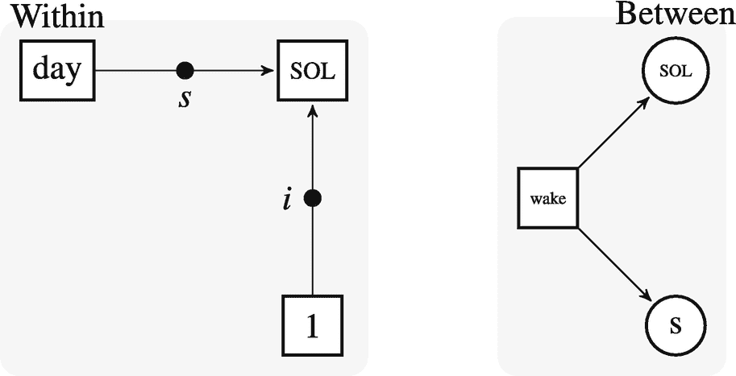

# 十一、GLMMs：线性

本章建立在处理多级数据的基础上，并介绍了一类适用于此类数据的统计模型——广义线性*混合*模型(GLMMs)。

```r
library(checkpoint)
checkpoint("2018-09-28", R.version = "3.5.1",
  project = book_directory,
  checkpointLocation = checkpoint_directory,
  scanForPackages = FALSE,
  scan.rnw.with.knitr = TRUE, use.knitr = TRUE)

library(knitr)
library(ggplot2)
library(cowplot)
library(viridis)
library(JWileymisc)
library(data.table)
library(lme4)
library(lmerTest)
library(chron)
library(zoo)
library(pander)
library(texreg)
library(xtable)
library(splines)
library(parallel)
library(boot)

options(width = 70, digits = 2)

```

## 11.1 理论

本节更正式地介绍 GLMMs。glm 扩展了固定效果——仅扩展了前几章讨论过的 glm。提醒一下，对于 GLMs，我们将预期线性结果 *η* 定义为


(11.1)

期望的线性结果 *η* 通过链接函数 *g( )* 映射到原始结果 y。


(11.2)

反向链接函数，*g*<sup>*—1*</sup>*()*，将*的比例η* 反向转换为 y 的比例


(11.3)

GLMMs 建立在这个结构上，增加了一些在只包含固定效果的 GLMs 中不必要的组件。

### 广义线性混合模型

对于 GLMs，期望值是预测值的函数，该预测值与参数估计值 *Xβ* 加权(相乘)。这些被称为固定效应，尽管在 GLMs 中通常没有明确说明，因为只有固定效应。在参数估计值 *β* 不变的意义上，它们是固定效应；它们不是随机变量。

对于重复测量或非独立数据，我们需要某种方法来捕捉观察值中的相关性。另一种思考方式是，非独立数据暗示着单位(人、学校、医院等)之间存在系统性差异。).GLMMs 通过向模型中添加另一个组件来解决这个问题，该组件显式地捕捉单元之间的这些差异。至于固定效应，这个分量有两个部分，一个数据矩阵，习惯上称为 Z，一个参数分量，习惯上称为γ。捕捉单元之间系统差异的最基本方法是允许每个单元有自己的截距。在对人的纵向研究中，这相当于每个参与者都有自己的截距。在这种情况下，Z 将是 0 和 1 值的块对角矩阵(想象一下在纵向数据集中对参与者 ID 变量进行虚拟编码)。这比描述起来容易。首先，我们可以为每个 ID 创建一个虚拟代码矩阵，存储为`mat`。然后我们可以为前 10 个参与者和前 300 个值绘制矩阵，如图 [11-1](#Fig1) 。在图像中，黑色区域表示 1，白色区域表示 0。注意我们使用`data()`函数从`JWileymisc`包中加载原始数据，然后读入我们在前面介绍 LMMs 基础知识的章节中制作并保存的处理过的数据。


图 11-1

UserID 的块对角伪码矩阵图。黑色值表示属于特定参与者的数据行。不同的列代表不同的参与者。

```r
data(aces_daily)
draw <- as.data.table(aces_daily)
d <- readRDS("aces_daily_sim_processed.RDS")

mat <- model.matrix(~ 0 + factor(UserID), data = d)

image(t(mat[1:300, 1:10]), col = c("white", "black"),
      xlab = "Participants", ylab = "Observation",
      xaxt = "n", yaxt = "n")

```

在这个简单的例子中，γ向量对于每个参与者都有一个元素，这是该特定参与者的估计截距。对于当前数据集，有 191 个参与者，因此γ将包含 191 个参数估计。

将这个额外的部分与我们已经学习过的 GLM 模型放在一起，总 GLMM 被定义为


(11.4)

对于这些特定的数据，使用仅截距模型，191 个参与者，总共 6599 个观察值，每个向量/矩阵的维数如下:

在这种方法下变得清楚的一个方面是，如果我们单独估计γ中的每个参数，我们将最终得到至少与参与者一样多的参数，加上模型其余部分所需的任何其他参数。事实上，如果我们单独估计γ中的每个参数，我们目前描述的可以被估计为 GLM。虽然我们在概念上把 *Zγ* 和 *Xβ* 分开了，但是 GLM 可以同时估计两者。使 GLMMs *混合*模型而不是 GLMs 具有大量伪代码的原因是我们不直接估计γ。在 GLMMs 中，我们不是估计γ中的每个参数，而是将γ视为随机变量或随机效应(因此*混合*效应，因为既有固定效应又有随机效应)。我们假设随机变量γ来自某种分布。具体来说，除了少数例外，我们假设γ来自一个*正态*分布。

为方便起见，我们使用 *N* 来表示正态或高斯分布。正态分布由两个参数决定，均值(或位置)、*、μ* 和标准差(或标度)、σ。从形式上来说，我们可以说γ分布为具有平均值和标准偏差的正态分布，或者为一个等式:


(11.5)

这种方法的好处是，无论我们有多少参与者，都不必单独估计γ的每个参数，仅截距 GLMM 只需要估计两个额外的参数， *μ* 和σ，即正态分布的参数。事实上，我们甚至不需要两个额外的参数。因为模型的固定效应部分， *Xβ* ，包括对截距的估计，我们已经知道均值(截距)将是多少。通常，γ被定义为固定效应捕捉到的与总体均值的*偏差*。平均来说，这些偏差总是为零，所以实际上只需要估计一个额外的参数，σ，我们写下


(11.6)

我们注意到，在几乎所有情况下，γ都被假定为服从正态分布。直观地看，对于 GLMMs，可能会使用其他分布。然而，即使在 GLMMs 中，我们可以假设*结果*遵循不同的分布(正态、伯努利、泊松等。)，随机效应通常仍被假定为正态分布。虽然严格来说不是 GLMMs 的要求，但大多数软件只实现正态分布的随机效应，唯一常见的例外是贝叶斯 GLMMs 的软件，通常允许更大的灵活性。

最后重要的一点。随机效应可能不止一个。如果有多个随机效应，那么γ将被假设为多元正态分布。这通过使用粗体 0 表示它是 0 处的均值向量，大写σ表示它是方差-协方差矩阵，而不是单个方差或标准差。


(11.7)

为了了解这些模型如何转化为具体的模型，我们可以估计一个只拦截 GLM 和一个只拦截 GLMM。在这个例子中，我们在每日日记研究中看到了积极的影响。我们将在后面的`R`中关注如何实际编码分析，因为现在我们只展示模型结果来关注模型的概念方面。表 [11-1](#Tab1) 比较了 GLM 和 GLMM 拦截模型的正面影响。

表 11-1

统计模型

<colgroup><col class="tcol1 align-left"> <col class="tcol2 align-left"> <col class="tcol3 align-left"></colgroup> 
|   | 

全球语言监测机构

 | 

格勒姆

 |
| --- | --- | --- |
| (截取) | 2.68(0.01) | 2.68(0.06) |
| R <sup>2</sup> | Zero |   |
| 调整 R <sup>2</sup> | Zero |   |
| 编号 obs。 | Six thousand three hundred and ninety-nine | Six thousand three hundred and ninety-nine |
| 均方根误差 | One point zero seven |   |
| 美国化学师学会(American Institute of Chemists) |   | Fourteen thousand eight hundred point five six |
| 比克 |   | Fourteen thousand eight hundred and twenty point eight five |
| 对数可能性 |   | –7397.28 |
| 民数记组:用户 ID |   | One hundred and ninety-one |
| Var: UserID(截距) |   | Zero point six three |
| Var:残差 |   | Zero point five three |

<sup>*【p】<【0.001】*<sup>*<【0.01】*</sup></sup>

第一行显示固定效果截距。我们可以看到，估计值是可比的，但 GLMM 的标准误差(括号内)比 GLM 大。在 GLM，唯一的另一个参数是剩余标准差，标为“RMSE”。在 GLMM，有一个残差方差，标为“Var:Residual”；还有随机截取的方差，标记为“Var: UserID (Intercept)”。

GLM 有一个熟悉的解释。在 GLMM 中，截距估计值可以解释为参与者的平均截距。截距的方差让我们了解到个体参与者的截距有多分散。因为我们假设截距来自正态分布，所以标准的经验法则适用。也就是说，大约三分之二的参与者将落在平均值的一个标准差内。取截距方差的平方根，就可以求出截距标准差。据此，我们可以计算出大约三分之二的参与者的截距应该在

```r
## 2.68 - 0.63 = 2.05

## 2.68 + 0.63 = 3.31

```

### 混合效应与多级模型术语

在继续之前，值得注意一个术语上的常见区别。这本书从混合效果模型的角度和使用术语介绍 GLMMs。然而，相同的模型也通常从多级模型的角度被调用和呈现。多级模型不使用矩阵，而是使用下标来表示哪些参数因参与者而异。首先，回到 GLM，我们可以用代数而不是矩阵来写这个模型，如下所示:


(11.8)

下标表示第 *i* 个参与者的期望值。对于 GLMMs 或多水平模型，我们至少需要两个下标:一个用于参与者，一个用于参与者内部的观察。按照惯例，我们谈论来自第 *j* 位参与者的第 *i* 次观察。我们可以把 GLMM 模型写成如下:


(11.9)

这个等式强调，任何特定的观察都是平均截距、 *b* <sub>0</sub> 加上特定参与者与平均值的偏差、 *γ* <sub>*0j*</sub> 的组合。在多级模型中，观察值的嵌套被称为不同的级别。因此，在我们的日常研究中，参与者内部的观察结果为 1 级，参与者层面的影响为 2 级。当只有两个级别时，人们通常将第一级称为“内部”，将第二级称为“之间”这对于我们的日常数据是有意义的，因为 1 级观察是单个参与者内部的观察或差异，2 级或参与者级别捕捉参与者之间的差异。

混合效果和多级术语和符号都很常见，所以知道它们是相同的底层模型是有帮助的。熟悉这两种符号将使习惯于这两种框架的人更容易工作。

### 统计推断

在线性回归中，统计推断(p 值、置信区间)计算起来很简单。因为回归系数除以它们的标准误差可以显示为遵循 t 分布，其自由度等于观察值的数量减去估计参数的数量。在线性混合效果中，没有计算正确自由度的公式。

因此,“正确的”p 值和置信区间应该是什么是未知的。因此，`R`中的`lme4`包默认不打印 p 值，也不提供任何自由度。但是，有几种策略可以估计置信区间和 p 值。

最简单的方法是假设样本量足够大，使得 t 分布接近正态分布，这样就不需要 t 分布的自由度，正态分布可以用作“足够接近”的代理。这可以用来计算 p 值和置信区间。

计算置信区间的更准确的方法是描绘似然函数。事实上，这是在`lme4`中向模型询问置信区间时使用的默认方式。虽然轮廓置信区间更精确，但是它们在计算上要求很高，并且在某些情况下可能不收敛或不可估计。

另一种方法是尝试估计大概的自由度。库兹涅佐娃及其同事【54】在`lmerTest`包中提供了基于萨特思韦特近似的自由度。一旦加载了`lmerTest`包，它实际上屏蔽了我们使用的`lmer`函数，以便计算近似的自由度并默认报告(近似的)p 值。与描绘似然函数相比，近似统计推断的自由度具有较低的计算成本。对于线性混合效应模型，即结果是连续的并假设为正态分布的 GLMMs，这种方法很简单，并且可能代表合理的“默认”选择。

我们在本书中不会深入讨论的最后两种可能性是使用自举或贝叶斯估计。虽然我们将展示一些例子，但是我们将这些方法的理论证明的范围留给其他更详细的文本。对于贝叶斯方法的优秀，先进的报道，见 Gelman 和他的同事[36]。关于自举理论的深入报道，请参见[26]。

自举包括抽取数据点的随机样本、估计模型、存储结果以及多次重复该过程以建立参数值的经验分布。这种方法的好处是它根据经验估计分布，因此不需要对参数采样分布的形状进行假设。尽管自举置信区间有许多可取的特性，但它们对计算要求很高，并且除了最基本的模型之外，其他模型都需要很长时间才能完成。这使得自举推理在迭代模型构建过程中成为一个困难的选择，例如当尝试各种协变量、函数形式的关系(线性、非线性等)时。).然而，bootstrapping 可能是验证最终模型或“高风险”案例(如随机对照试验)结果的绝佳选择。贝叶斯估计通过一个完全不同的框架依赖于统计推断。贝叶斯方法是强大的，并提供了一个非常有用的替代经典的频率统计描述到目前为止，在这本书。

在选择统计推断的方法时，一个特殊的考虑是，是否要对随机效应方差分量进行推断。依赖近似正态分布或近似自由度不适合方差分量，因为它们不能小于零，所以对称置信区间是不合理的。对于方差分量，置信区间可以通过描绘似然函数、自举或贝叶斯方法来获得。

最后，尽管我们在本章中关注的是连续的、正态分布的结果，但对于其他类型的 GLMMs，如二元或计数结果，自由度无法近似，因此统计推断必须通过假设正态分布、描绘可能性、自举或贝叶斯方法进行。

### 效果尺寸

在线性回归中，一个常见的效应大小是模型所占方差的比例， *R* <sup>2</sup> 。在线性回归中，*R*T6】2 很容易计算出来。总方差是模型解释的方差和剩余方差的组合。


(11.10)

在混合效果模型中，计算 *R* <sup>2</sup> 并不那么简单。方差可以用固定效应和随机效应来解释。计算伪 T4 的一种方法是计算预测值和实际值之间的平方相关。

```r
m <- lmer(NegAff ~ 1 + (1 | UserID), data = d)
cor(na.omit(d$NegAff), fitted(m))ˆ2

## [1] 0.45

```

最近，Nakagawa 和 Schielzeth [69]提出了两个版本，称为随机截距模型的边际和条件 *R* <sup>2</sup> 。边际*R*T6】2 是固定效应解释的方差与总方差的比值。总方差被定义为由固定效应解释的方差、由随机效应解释的方差(可以是一个或多个随机截距)和剩余方差之和。边际*R*T10】2 代表由固定(边际)效应解释的方差百分比。在他们最初的公式中，Nakagawa 和 Schielzeth [69]有一个稍微不同的等式，因为他们对误差和离差方差有单独的术语，但是这些对于连续的正态分布结果是相同的。正态分布变量的简化公式如下:


(11.11)

条件 *R* <sup>2</sup> 的定义类似，但它是固定效应和随机效应占方差的百分比，如下所示:


(11.12)

在仅随机截距模型中，唯一的固定效应是截距，如前一等式中定义的条件*R*T3】2 将与 ICC 相同。`R2LMER`函数使用这些公式计算线性混合模型的边际和条件*R*T7】2。以下示例还显示了在仅具有截距的模型的情况下，条件*R*T11】2 与 ICC 相同。

```r
m <- lmer(NegAff ~ 1 + (1 | UserID), data = d)
R2LMER(m, summary(m))

##    MarginalR2 ConditionalR2
##          0.00          0.44

iccMixed("NegAff", "UserID", d)

##         Var Sigma  ICC
## 1:   UserID  0.21 0.44
## 2: Residual  0.27 0.56

```

由于 Nakagawa 和 Schielzeth [69]导出了随机截距模型的方程，Johnson [48]扩展了他们的方法，将随机截距和斜率模型结合起来。`R2LMER`函数包含这些更新，以适应仅随机截距和随机截距和斜率模型。

### 随机截距模型

最简单的混合效应模型是仅随机截取模型。随机截距模型可以包括任意数量的固定效应，但是按照惯例，该名称指的是唯一的随机效应是随机截距的模型。

随机截距通过允许每个参与者截距的差异来捕捉观察值的相关性。这样，在考虑截距的个体差异后，残差将(有条件地)独立。除了随机截距，可以添加任意数量的固定效果。

除了支持混合效应模型的理论方面和方程，可视化不同的模型可以帮助理解“随机”效应的真正含义。

### 可视化随机效果

我们假设读者熟悉标准的线性回归模型(只有固定效应的模型)。在我们一直使用的每日日记研究数据中，每个参与者报告了长达 12 天的入睡时间。如果我们想研究是否是某人的第一次，第二次，等等。研究中的一天以及他们入睡需要多少分钟(睡眠开始潜伏期；SOL)，我们可以使用线性回归模型，如下所示。

```r
## data setup
d[,
  SurveyDayCount := as.integer(SurveyDay - min(SurveyDay)),
  by = UserID]

## setup mini dataset
tmpd <- d[!is.na(SOLs) & !is.na(SurveyDayCount),
  .(SOLs, SurveyDayCount, UserID)]

## fixed effects, all people
mreg <- lm(SOLs ~ 1 + SurveyDayCount, data = tmpd)
## add predictions to the dataset
tmpd[, Fixed := predict(mreg, newdata = tmpd)]

```

这种线性回归提供了两个平均(固定)效应。**截距**是参与者在研究的第一个晚上，即第 0 天的预期 SOLs。**斜率**是学习日一天变化的预期 SOLs 变化。这两个数字是研究中每个参与者的平均值。它们没有捕捉到参与者之间的任何个体差异。像这样的模型的一个好处是，它结合了所有的参与者数据，所以它对于异常值是相对健壮的。如果一个特定的参与者只有很少的数据点也没有关系，因为所有参与者的数据都是组合在一起的。值得注意的最后一点是，虽然平均截距和斜率是精确的估计值，但它们相关的 p 值会向下偏移，因为数据违反了观测值相互独立的假设。

另一个简单的方法是运行一个固定效应线性回归模型，但是为每个参与者运行单独的模型，如下所示。因为我们只想关注截距的差异，所以我们使用一个固定的偏移量来强制`SurveyDay`的斜率与我们之前拟合的总体平均固定效应模型相同。

```r
## fixed effects, individual models
tmpd[, Individual := fitted(lm(SOLs ~ 1 +
  offset(coef(mreg)[2] * SurveyDayCount))),
  by = UserID]

```

这些单独的模型为每个单独的参与者估计不同的截距，但是使用平均斜率。因为每个模型适合一个参与者的数据，所以它们对异常值更敏感，并且如果特定参与者只有很少的数据点(例如，只有 2 或 3 天)，这些模型可能变得非常不稳定。这种个体化方法的一个好处是统计测试可能是准确的，因为在一个参与者中，天数可能是独立的。

最后，我们可以为学习日运行一个固定斜率的随机截距模型，如下面的代码所示。

```r
## random intercept model, all people
m <- lmer(SOLs ~ 1 + + SurveyDayCount + (1 | UserID), data = tmpd)

## add predictions to the dataset
tmpd[, Random := predict(m, newdata = tmpd)]

```

随机截距模型允许每个人有不同的截距，但不是单独估计每个截距，而是假设它们来自正态分布，并估计该分布的均值和方差。所有参与者的数据都包含在一个模型中，所以这个模型对异常值或极端值也相对稳健。同时，随机截距确保不会对每个参与者使用单一平均值。

考虑随机截距模型的另外两种方式是，随机模型的截距估计值是个体截距和总体平均截距的加权组合。特定参与者的可用数据越多，随机截距估计值就越接近他们各自的估计截距。相反，参与者拥有的数据越少，随机截距就越接近总体平均值。在极端情况下(没有参与者的数据)，该模型能做的最好的事情是估计参与者将具有总体平均值。这种方法具有将个体估计值拉向总体均值的效果，这被称为*收缩*:极端估计值向均值收缩。如果你来自机器学习背景，这也是一种形式的模型正则化，因为约束被置于个体估计上以近似正态分布。

为了直观地显示这些模型之间的差异，我们可以为一些参与者绘制研究日和 SOL 之间的预测关系图。图 [11-2](#Fig2) 显示了固定个体模型和随机模型的估计轨迹，蓝色粗线显示了所有参与者的线性回归模型的截距和斜率。


图 11-2

单个回归模型和随机截距模型的估计轨迹图。蓝色显示的是人口平均值。虽然所有线都具有相同的斜率，但每条线的截距比单个模型更接近随机模型的总体平均值，这表明了收缩效应。

```r
## select a few example IDs to plot
tmpdselect <- melt(tmpd[UserID %in% unique(UserID)[107:115]],
     id.vars = c("UserID", "SurveyDayCount", "SOLs"))

ggplot(tmpdselect[variable != "Fixed"],
       aes(SurveyDayCount, value, group = UserID)) +
  geom_abline(intercept = coef(mreg)[1], slope = coef(mreg)[2],
              size = 2, colour = "blue") +
  geom_line() +
  facet_wrap(~ variable)

```

查看模型之间差异的另一种方法是对照原始数据绘制估计轨迹。如图 [11-3](#Fig3) 所示。这些数字表明，单个固定效应模型或随机截距模型与总体平均值一样准确，甚至更准确。这些数字还强调，在每一种情况下，随机截距线与固定效应相同或更接近总体平均值，永远不会比个体固定效应模型更极端。


图 11-3

九个参与者的不同模型估计线与原始数据值的关系图

```r
## plots against individual data
ggplot(tmpdselect, aes(SurveyDayCount)) +
  geom_point(aes(y = SOLs), size = 1) +
  geom_line(aes(y = value,
                colour = variable,
                linetype = variable), size = 1.5) +
  facet_wrap(~UserID, scales = "free_y") +
  scale_color_viridis(discrete = TRUE) +
  theme(legend.position = "bottom",
        legend.title = element_blank(),
        legend.key.width = unit(2, "cm"))

```

通过绘制单个模型的截距和随机效应模型的截距并显示变化，可以更清楚地观察收缩。这在图 [11-4](#Fig4) 中完成。为此，我们绘制了所有参与者的数据，并从各个模型中平均值最高的数据到平均值最低的数据进行排序。这突出表明，向样本均值(垂直线)收缩最大的是那些个人估计值相差最远的人。


图 11-4

每个参与者的个体模型和随机效应模型中的估计截距图，用箭头表示总体平均截距的缩减。

```r
tmpd <- tmpd[SurveyDayCount==0][order(Individual)]
tmpd[, UserID := factor(UserID, levels = UserID)]

ggplot(tmpd, aes(x = Individual, xend = Random,
                 y = UserID, yend = UserID)) +
  geom_segment(
    arrow = arrow(length = unit(0.01, "npc"))) +
  geom_vline(xintercept = tmpd[SurveyDayCount==0][1, Fixed]) +
  xlab("Estimated Intercept") +
  theme(axis.text.y = element_blank())

```

### 解读随机截距模型

通常，解释模型的第一步是评估诊断以确保模型是合理的。一些基本诊断标绘在图 [11-5](#Fig5) 中。他们表明，残差是对称分布的，尽管不完全是正态分布，有一些潜在的异常值。它们还表明，残差方差随着预测值的增加而增加。似乎有一些相当极端的随机截距，随机截距的分布通常是正偏的，这表明这里的变换可能是有帮助的。适用于调查日和睡眠开始潜伏期的广义加性模型没有选择任何非线性，这表明假设线性关联可能是这些数据的合理近似。


图 11-5

混合效应模型诊断图，显示了残差分布(左上)、残差与拟合值，以评估方差的均匀性(右上)、随机截距分布(左下)，以及调查日和睡眠开始潜伏期之间关联的简单单层广义加性模型平滑，以评估非线性(右下)。

```r
assumptiontests <- plotDiagnosticsLMER(m, plot = FALSE)
do.call(plot_grid, c(
  assumptiontests[c("ResPlot", "ResFittedPlot")],
  assumptiontests$RanefPlot,
  list(ggplot(d, aes(SurveyDayCount, SOLs)) +
       stat_smooth()),
  ncol = 2))

## `geom_smooth()` using method = 'gam' and formula 'y␣~␣s(x,␣bs␣=␣"cs")'

```

因为结果中有一些零值，所以对数转换不会很好地工作，所以我们可以尝试平方根转换。这需要重新安装模型并再次检查诊断。这在以下代码中完成，并绘制在图 [11-6](#Fig6) 中。结果显示在几个方面有所改善。残差具有较少的极值。残差方差在预测范围内更加均匀，随机截距分布更接近正态分布。似乎在调查日和睡眠开始潜伏期之间在平方根尺度上也有近似线性的关联，所以这似乎是一个合理的模型来呈现和解释。


图 11-6

混合效应模型诊断图，显示了残差分布(左上)、残差与拟合值，以评估方差的均匀性(右上)、随机截距分布(左下)，以及调查日和睡眠开始潜伏期之间关联的简单单层广义加性模型平滑，以评估非线性(右下)。

```r
d[, sqrtSOLs := sqrt(SOLs)]
m2 <- lmer(sqrtSOLs ~ SurveyDayCount + (1 | UserID),
           data = d)

assumptiontests <- plotDiagnosticsLMER(m2, plot = FALSE)
do.call(plot_grid, c(
  assumptiontests[c("ResPlot", "ResFittedPlot")],
  assumptiontests$RanefPlot,
  list(ggplot(d, aes(SurveyDayCount, sqrtSOLs)) +
       stat_smooth()),
  ncol = 2))

## `geom_smooth()` using method = 'gam' and formula 'y␣~␣s(x,␣bs␣=␣"cs")'

```

解释和表示模型的一个很好的起点是`summary()`函数，如下面的代码所示。因为我们加载了`lmerTest`包，所以结果包括基于这些包的 t 检验的近似自由度和 p 值。在随机效应标题下，我们可以看到它和残差的随机截距的估计标准偏差大致相等，表明每个水平的方差水平大致相等。还会显示模型中包含的观察数量和单位数量。在固定效应标题下，总平均截距显示为调查日和平方根转换睡眠开始潜伏期之间的平均关联。统计测试测试这些中的每一个是否在统计上显著不同于零。对于与调查日的关联来说，这可能是一个足够合理的问题，但对于截距来说并不特别有趣，因为平均睡眠开始潜伏期为零是不可信的。一般来说，固定效应可以被解释为类似于它们在单级广义线性模型中的解释。在这种情况下，在调查日和睡眠开始潜伏期的平方根之间存在统计学上显著的关联，因此研究中每增加一天，睡眠开始前的平方根分钟数就减少-0.02。

```r
summary(m2)

## Linear mixed model fit by REML. t-tests use Satterthwaite's method [
## lmerModLmerTest]
## Formula: sqrtSOLs ~ SurveyDayCount + (1 | UserID)
##    Data: d
##
## REML criterion at convergence: 9552
##
## Scaled residuals:
##    Min     1Q Median     3Q    Max
## -3.486 -0.601 -0.012  0.490  4.878
##
## Random effects:
##  Groups   Name        Variance Std.Dev.
##  UserID   (Intercept) 3.72     1.93
##  Residual             4.50     2.12
## Number of obs: 2097, groups:  UserID, 191
##
## Fixed effects:
##                 Estimate Std. Error        df t value Pr(>|t|)
## (Intercept)       4.4578     0.1639  289.5176   27.20   <2e-16 ***
## SurveyDayCount   -0.0223     0.0135 1914.7904   -1.65      0.1 .
## ---
## Signif. codes:  0 '***' 0.001 '**' 0.01 '*' 0.05 '.' 0.1 '␣' 1
##
## Correlation of Fixed Effects:
##             (Intr)
## SurveyDyCnt -0.438

```

最近，许多期刊希望置信区间与估计值一起呈现，而不是估计值和标准误差。正如本章前面讨论统计推断时提到的，有几种方法可以计算置信区间。一般来说，置信区间是使用`confint`函数获得的，但是这些方法可以有所不同，从简单的 Wald 方法(使用标准误差，基本上假设足够大的自由度，使得 t 分布接近正态分布)到更精确但耗时的 profile 和 bootstrap 方法。每一个都是定时的，以提供每种方法的相对强度的一些指示。

```r
system.time(
  ci.wald <- confint(m2,
   method = "Wald", oldNames = FALSE))

##    user  system elapsed
##    0.02    0.00    0.01

system.time(
  ci.profile <- confint(m2,
   method = "profile", oldNames = FALSE))

## Computing profile confidence intervals ...

##    user  system elapsed
##    0.98    0.00    0.99

system.time(
  ci.boot <- confint(m2,
   method = "boot", oldNames = FALSE,
   nsim = 200, seed = 1234))

## Computing bootstrap confidence intervals ...

##    user  system elapsed
##     4.3     0.0     4.4

ci.compare <- data.table(
  Param = rownames(ci.wald),
  Wald = sprintf("%0.2f, %0.2f",
    ci.wald[,1], ci.wald[,2]),
  Profile = sprintf("%0.2f, %0.2f",
    ci.profile[,1], ci.profile[,2]),
  Boot = sprintf("%0.2f, %0.2f",
    ci.boot[,1], ci.boot[,2]))

print(ci.compare)

##                    Param        Wald     Profile        Boot
## 1: sd_(Intercept)|UserID      NA, NA  1.72, 2.16  1.70, 2.15
## 2:                 sigma      NA, NA  2.06, 2.19  2.05, 2.18
## 3:           (Intercept)  4.14, 4.78  4.14, 4.78  4.12, 4.80
## 4:        SurveyDayCount -0.05, 0.00 -0.05, 0.00 -0.05, 0.01

```

虽然存在微小的差异，但在这种情况下，通常三种方法具有高度的一致性，但 Wald 方法几乎是即时的，profile 方法需要很短的时间，bootstrap 需要足够长的时间才能被注意到，尤其是在交互式模型构建期间。

以下是基于 Wald 方法的完整结果。

```r
testm2 <- detailedTests(m2, method = "Wald")

## Parameters and CIs are based on REML,
## but detailedTests requires ML not REML fit for comparisons,
## and these are used in effect sizes. Refitting.

formatLMER(list(testm2))

##                       Term                Model 1
##  1:          Fixed Effects
##  2:            (Intercept)  4.46*** [ 4.14, 4.78]
##  3:         SurveyDayCount    -0.02 [-0.05, 0.00]
##  4:         Random Effects
##  5:  sd_(Intercept)|UserID                   1.93
##  6:                  sigma                   2.12
##  7:          Overall Model
##  8:               Model DF                      4
##  9:             N (UserID)                    191
## 10:       N (Observations)                   2097
## 11:                 logLik               -4771.82
## 12:                    AIC                9551.65
## 13:                    BIC                9574.24
## 14:            Marginal R2                   0.00
## 15:         Conditional R2                   0.45
## 16:           Effect Sizes
## 17: SurveyDayCount (Fixed)    0.00/0.00, p = .099

```

以下是基于轮廓似然法的完整结果。固定效果不会改变。然而，轮廓似然能够估计随机效应的置信区间。

```r
testm2b <- detailedTests(m2, method = "profile")

## Computing profile confidence intervals ...

## Parameters and CIs are based on REML,
## but detailedTests requires ML not REML fit for comparisons,
## and these are used in effect sizes. Refitting.

formatLMER(list(testm2b))

##                       Term                Model 1
##  1:          Fixed Effects
##  2:            (Intercept)  4.46*** [ 4.14, 4.78]
##  3:         SurveyDayCount    -0.02 [-0.05, 0.00]
##  4:         Random Effects
##  5:  sd_(Intercept)|UserID      1.93 [1.72, 2.16]
##  6:                  sigma      2.12 [2.06, 2.19]
##  7:          Overall Model
##  8:               Model DF                      4
##  9:             N (UserID)                    191
## 10:       N (Observations)                   2097
## 11:                 logLik               -4771.82
## 12:                    AIC                9551.65
## 13:                    BIC                9574.24
## 14:            Marginal R2                   0.00
## 15:         Conditional R2                   0.45
## 16:           Effect Sizes
## 17: SurveyDayCount (Fixed)    0.00/0.00, p = .099

```

### 随机截距和斜率模型

以前我们只介绍了随机截距模型。然而，混合效应模型可以允许包括一个或多个随机斜率参数。作为随机斜率包含的预测值的唯一要求是，它必须在参与者(或用于随机效应的任何高阶聚类单元)内部变化。

使用我们在本章中使用的数据，学习日、压力和睡眠都可能是随机斜率。年龄、教育程度以及参与者是否出生在澳大利亚境内或境外都不可能是随机的斜率。换句话说，要作为随机斜率包括在内，变量必须在单位(此处为参与者)内至少有一些可变性。只在单位之间(而不在单位内)变化的变量不能是随机斜率。

随机斜率的工作方式与随机截距相同。也就是说，我们可以想象估计每个参与者(或任何其他高阶单位)的预测值和结果之间的独立斜率。但是，随机斜率模型不是估计单个斜率，而是假设斜率来自某个分布，并估计该分布的参数。几乎所有的分布都是正态分布，因此均值和方差都是估计的。

就方程式而言，我们之前将 GLMMs 定义为


(11.13)

对于这些特定数据，随机截距和斜率，191 个参与者，总共 6599 个观察值，每个向量/矩阵的维数如下:

在这种情况下，Z 的列数是参与者的两倍，因为对于随机截距，每个参与者有一列，对于随机斜率，每个参与者有一列。

与只有一种随机效应的模型(如只有随机截距的模型)相比，这种随机截距和斜率模型的另一个变化是随机效应现在包括方差和协方差。协方差表示随机效应之间的相关程度。例如，如果参与者开始时较高(更正的随机截距)倾向于具有更负的斜率，截距和斜率之间会有负的关系。举一个实际的例子，如果一个参与者在第一天晚上睡了 12 个小时，第二天的睡眠不太可能会增加，因为这需要在晚上睡 12 个小时以上。相反，如果参与者在第一天彻夜未眠，睡眠时间为 0 小时，那么几乎可以肯定的是，在接下来的几天里睡眠时间会增加。关键在于，在许多情况下，随机截距和斜率可能相互关联是有意义的，并且在`R,`中建模随机效应的默认方式中，估计了随机效应的完整方差-协方差矩阵。可以将协方差固定为零，强制随机效应相互独立，但通常最好尽可能避免这种情况。

理论上，混合效应模型可以包括随机斜率，但不包括随机截距；然而，实际上这几乎从未发生过。只有在所有参与者都从同一点开始但斜率不同的情况下，具有随机斜率而非随机截距的模型才有意义。如果参与者实际上有不同的截距，强迫他们相同将会扭曲随机斜率，因为他们的斜率必须都通过相同的平均截距。相反，包含不必要的随机截距不会对模型或结果产生有意义的偏差。

为了探究随机截距和斜率模型与标准线性回归之间的差异，我们将遵循与随机截距相似的步骤。在我们一直使用的每日日记研究数据中，每个参与者报告了长达 12 天的入睡时间。如果我们想研究是否是某人的第一次，第二次，等等。研究中的一天以及他们入睡需要多少分钟(睡眠开始潜伏期；SOL)，首先，我们估计一个线性回归模型，如下。

```r
## setup dataset
tmpd <- d[!is.na(sqrtSOLs) & !is.na(SurveyDayCount),
  .(sqrtSOLs, SurveyDayCount, UserID)]

## fixed effects, all people
mreg <- lm(sqrtSOLs ~ 1 + SurveyDayCount, data = tmpd)
## add predictions to the dataset
tmpd[, Fixed := predict(mreg, newdata = tmpd)]

```

这种线性回归提供了两个平均(固定)效应。**截距**是参与者在研究的第一个晚上，即第 0 天的预期 SOLs。**斜率**是学习日一天变化的预期 SOLs 变化。这两个数字是研究中每个参与者的平均值。它们没有捕捉到参与者之间的任何个体差异。像这样的模型的一个好处是，它结合了所有的参与者数据，所以它对于异常值是相对健壮的。如果一个特定的参与者只有很少的数据点也没有关系，因为所有参与者的数据都是组合在一起的。与随机截距模型一样，虽然线性回归可以精确估计截距和斜率，但标准误差、p 值和任何置信区间都会有偏差。

我们还可以为每个参与者运行单独的线性回归模型，如下所示。

```r
## fixed effects, individual models
tmpd[, Individual := fitted(lm(sqrtSOLs ~ 1 + SurveyDayCount)),
  by = UserID]

```

这些单独的模型为每个单独的参与者估计不同的截距和不同的斜率。由于截距和斜率都是针对单个参与者单独估计的，截距和斜率对异常值都很敏感，并且在很少观察的参与者中不稳定。

最后，我们可以运行一个随机截距和斜率模型，如下面的代码所示。为了包括随机斜率，我们将`SurveyDayCount`添加到模型的随机部分(在括号内，在指示这些参数应该随机变化`UserID`的竖线之前)。注意，尽管我们想要一个`SurveyDayCount`的随机斜率，我们也包括了一个`SurveyDayCount`的固定效果。

```r
## random intercept model, all people
m <- lmer(sqrtSOLs ~ 1 + SurveyDayCount +
          (1 + SurveyDayCount | UserID), data = tmpd)
## add predictions to the dataset
tmpd[, Random := predict(m, newdata = tmpd)]

```

随机模型允许每个个体具有不同的截距和斜率，但这些被假定来自多元正态分布，并且(多元)正态分布的参数是估计的。与我们之前检查的随机截距模型一样，我们可以通过绘制一些参与者的研究日和 SOL 之间的预测关系来可视化随机和固定效应模型之间的差异。图 [11-7](#Fig7) 显示了来自固定个体模型和随机模型的估计轨迹，以及来自所有参与者的线性回归模型的斜率。


图 11-7

单个回归模型和随机截距模型的估计轨迹图。蓝色显示的是人口平均值。随机模型将截距和斜率拉得更接近群体平均截距和斜率，显示了收缩效应。

```r
## select a few example IDs to plot
tmpdselect <- melt(tmpd[UserID %in% unique(UserID)[107:115]],
     id.vars = c("UserID", "SurveyDayCount", "sqrtSOLs"))

ggplot(tmpdselect[variable != "Fixed"],
       aes(SurveyDayCount, value, group = UserID)) +
  geom_abline(intercept = coef(mreg)[1], slope = coef(mreg)[2],
              size = 2, colour = "blue") +
  geom_line() +
  facet_wrap(~ variable)

```

查看模型之间差异的另一种方法是对照原始数据绘制估计轨迹。如图 [11-8](#Fig8) 所示。这些数字表明，单个固定效应模型或随机效应模型与总体平均值一样准确，甚至更准确。这些数字还强调，在每一种情况下，随机截距线与固定效应相同或更接近总体平均值，永远不会比个体固定效应模型更极端。事实上，对于参与者 114，随机效应模型将斜率显著拉回到群体平均值，从而最小化研究开始时极端 SOL 的影响。


图 11-8

九个参与者的不同模型估计线与原始数据值的关系图

```r
## plots against individual data
ggplot(tmpdselect, aes(SurveyDayCount)) +
  geom_point(aes(y = sqrtSOLs), size = 1) +
  geom_line(aes(y = value,
                colour = variable,
                linetype = variable), size = 1.5) +
  facet_wrap(~UserID, scales = "free_y") +
  scale_color_viridis(discrete = TRUE) +
  theme(legend.position = "bottom",
        legend.title = element_blank(),
        legend.key.width = unit(2, "cm"))

```

为了突出收缩与模型拟合的关系，我们可以绘制估计斜率的变化。


图 11-9

每个参与者的个体模型和随机效应模型中的估计斜率图，用箭头表示向总体平均斜率的收缩

```r
tmpd <- d[, .(
  Individual = coef(lm(
    sqrtSOLs ~ 1 + SurveyDayCount))[2]),
  by = UserID]

## estimated random slope is deviation + average
tmpd$Random <- ranef(m)$UserID[, "SurveyDayCount"] + fixef(m)[2]
tmpd <- tmpd[order(Individual)]
tmpd[, UserID := factor(UserID, levels = UserID)]

ggplot(tmpd, aes(x = Individual, xend = Random,
                 y = UserID, yend = UserID)) +
  geom_segment(
    arrow = arrow(length = unit(0.01, "npc"))) +
  geom_vline(xintercept = coef(mreg)[2]) +
  xlab("Estimated Slope") +
  theme(axis.text.y = element_blank())

```

### 截距和斜率作为结果

随机截距和斜率允许每个个体(或单元)之间的水平(截距)和关联(斜率)不同。对于给定的人(单位)，即使可能有重复的测量，它们也只会有一个截距和一个斜率值。因此，尽管随机截距和斜率是从重复测量(水平内)数据估计的，截距和斜率本身是水平间变量。也就是说，个人的截距(或斜率)不会因评估而异。假设截距和斜率值确实因人而异，人们可能会对识别截距和斜率的预测因子感兴趣。为了更具体地说明这一点，我们可以用图表来表示这个问题。图 [11-10](#Fig10) 显示了具有随机截距和斜率的两级模型(内部和之间)的混合效应模型图。`x`使用随机斜率和随机截距在内部水平预测结果变量`y`。随机截距(I)和随机斜率(s)本身是中间水平的结果变量，由中间水平预测器`w`预测。


图 11-10

级别内和级别间的示例图。正方形表示观察到的变量(如结果、预测因素)。空心圆表示潜在变量(即较高水平的随机效应)。实心圆表示随机效应(即随机截距、斜率)。在内部级别，对于`x`上的`y`的斜率，存在随机截距(I)和随机斜率(s)。在中间水平，有两个潜在变量:一个是随机截距(I)，另一个是由中间水平变量`w`预测的随机斜率(s)。

作为一个具体的例子，之前我们检查了一个混合效应模型，该模型通过研究中的随机截距和随机斜率预测入睡时间(睡眠开始潜伏期)。假设我们想知道平均起来醒来更多的参与者是否也需要更长的时间才能入睡(即，醒来预测随机截距)，或者在研究期间醒来较少的参与者是否变化较少(即，更平坦的随机斜率)。平均醒来次数不变，所以是个人变量。从图表来看，如图 [11-11](#Fig11) 所示。在该图中，睡眠开始潜伏期(SOL)的随机截距和 SOL 在研究日的斜率均由水平间预测因子(平均觉醒)预测。



图 11-11

用随机截距和斜率预测睡眠开始潜伏期(SOL)的研究日内和水平间图，以及预测随机截距和斜率的平均觉醒次数。

如果将截距和斜率视为新的(潜在的、未观察到的)变量，那么根据混合效应模型的估计在数据集中创建新的变量可能会很有诱惑力。这可以在`R`中通过提取截距和斜率的随机系数估计相对容易地完成。以下代码创建一个具有 ID、性别和年龄的级别间数据集，并将其与混合效果模型中的截距和斜率估计值相结合，这些估计值是使用`coef()`函数提取的。

```r
between_data <- cbind(
  d[, .(
  BWASONs = na.omit(BWASONs)[1]),
  by = UserID][order(UserID)],
  coef(m)$UserID)

```

截距和斜率的估计值有时被称为 BLUPs，用于个体截距和斜率的最佳线性无偏预测。利用这些，我们可以在中间水平运行一个常规的广义线性模型。结果如表 [11-2](#Tab2) 所示。他们揭示了更高的平均觉醒预测更高的截距，但不预测随机斜率。

表 11-2

统计模型

<colgroup><col class="tcol1 align-left"> <col class="tcol2 align-left"> <col class="tcol3 align-left"></colgroup> 
|   | 

拦截

 | 

倾斜

 |
| --- | --- | --- |
| (截取) | 4.093 | –0.022 |
|   | (0.218) | (0.001) |
| 屈臣氏 | 0.394 | Zero |
|   | (0.189) | (0.001) |
| R <sup>2</sup> | Zero point zero two two | Zero |
| 调整 R <sup>2</sup> | Zero point zero one seven | –0.005 |
| 编号 obs。 | One hundred and ninety-one | One hundred and ninety-one |
| 均方根误差 | One point eight | Zero point zero one |

<sup>*【p】<【0.001】*<sup>*<【0.01】*</sup></sup>

```r
between.int <- lm(`(Intercept)` ~ BWASONs,
                 data = between_data)
between.slope <- lm(SurveyDayCount ~ BWASONs,
             data = between_data)

texreg(list(
  Intercept = between.int,
  Slope = between.slope),
  digits = 3,
  label = "tglmml-blups",
  float.pos = "!hb")

```

虽然这是一种直观的吸引人的方法，但提取随机效应的 BLUPs 并在单独的分析中使用它们并不是最佳策略。一个主要限制是，对于每个个体，提取截距和斜率的单个估计，然后在后续模型中处理这些*估计*，就好像它们被无误差地观察和测量一样。也就是说，实际上具有某种程度不确定性的*估计*被视为没有不确定性的精确已知。实际上，这些估计通常存在很大的不确定性。尽管推导 BLUPs 的精确置信区间很困难，但是通过将`condVar = TRUE`参数指定给`ranef()`函数，可以很容易地生成近似置信区间。结果绘制在图 [11-12](#Fig12) 中，它们表明该模型对于每个个体的随机截距和斜率估计具有高度的不确定性。这种不确定性凸显了提取单一最佳估计并将其视为完美的问题。


图 11-12

具有近似置信区间的估计随机效应的点阵图

```r
ggplot(as.data.frame(ranef(m, condVar = TRUE)),
 aes(grp, condval,
     ymin = condval - 2 * condsd,
     ymax = condval + 2 * condsd)) +
 geom_pointrange(size = .2) +
 facet_wrap(~ term, scales = "free_x") +
 coord_flip() +
 theme(axis.text.y = element_blank(),
       axis.ticks.y = element_blank()) +
  ylab("Random effect + uncertainty") +
  xlab("Participant ID")

```

虽然提取 BLUPs 或每个个体的随机截距和斜率的其他单个估计并不是最佳的，但检查随机截距或斜率的预测值通常是合适且有趣的。包含随机效应预测值的最佳方法是将它们作为混合效应模型的一部分，以便在一个模型中同时估计随机效应及其预测值。这样就可以把不确定性考虑进去。通过水平间变量预测随机效应转化为所谓的水平间相互作用，即水平间变量和水平内变量的相互作用。乍一看，预测随机截距或斜率需要交互作用，这似乎有悖直觉。然而，预测随机斜率的实际含义是，研究日与睡眠开始潜伏期(斜率)的关联取决于平均醒来次数。以这种方式解释，希望在这种情况下“预测斜率”和交互如何捕捉相同的问题变得更加清晰。因为随机截距是对一个常数(按照惯例，数字 1)的结果的回归，预测随机截距的交互方面可以忽略，因为任何变量乘以 1 就是变量。

总之，在我们的混合效应模型中，检验平均觉醒次数是否预测随机截距和斜率的理想方法是添加平均觉醒次数乘以 1 作为预测值(这是随机截距的预测值)，并添加研究日 x 平均觉醒互动次数作为预测值(预测随机斜率)。表 [11-3](#Tab3) 显示了单一混合效果模型和先前模型提取 BLUPs 并运行线性回归的结果。在该表中，我们可以看到随机截距(`BWASONs`)预测和随机斜率(`SurveyDayCount:BWASONs`)预测的估计值和标准误差存在差异。通常情况下，当考虑随机截距和斜率中的不确定性(测量误差)时，影响的幅度更大，但估计中也存在更大的不确定性，由更大的标准误差表示。

表 11-3

统计模型

<colgroup><col class="tcol1 align-left"> <col class="tcol2 align-left"> <col class="tcol3 align-left"> <col class="tcol4 align-left"></colgroup> 
|   | 

拦截

 | 

倾斜

 | 

随意

 |
| --- | --- | --- | --- |
| (截取) | 4.093 | –0.022 | 4.014 |
|   | (0.218) | (0.001) | (0.272) |
| 屈臣氏 | 0.394 | Zero | 0.480 |
|   | (0.189) | (0.001) | (0.236) |
| 调查日计数 |   |   | –0.015 |
|   |   |   | (0.023) |
| 调查日计数:BWASONs |   |   | –0.008 |
|   |   |   | (0.020) |
| R <sup>2</sup> | Zero point zero two two | Zero |   |
| 调整 R <sup>2</sup> | Zero point zero one seven | –0.005 |   |
| 编号 obs。 | One hundred and ninety-one | One hundred and ninety-one | Two thousand and ninety-seven |
| 均方根误差 | One point eight | Zero point zero one |   |
| 美国化学师学会(American Institute of Chemists) |   |   | Nine thousand five hundred and seventy point nine one four |
| 比克 |   |   | Nine thousand six hundred and sixteen point one |
| 对数可能性 |   |   | –4777.457 |
| 民数记组:用户 ID |   |   | One hundred and ninety-one |
| Var: UserID(截距) |   |   | Three point six four |
| Var: UserID 调查天数 |   |   | Zero point zero zero two |
| Cov: UserID(截距)SurveyDayCount |   |   | –0.004 |
| Var:残差 |   |   | Four point four seven nine |

**<【0.001】*<sup>**<<**</sup>*

```r
me.prediction <- lmer(sqrtSOLs ~
   SurveyDayCount + BWASONs +
   SurveyDayCount:BWASONs +
   (1 + SurveyDayCount | UserID),
  data = d)

texreg(list(
  Intercept = extract(between.int),
  Slope = extract(between.slope),
  Random = extract(me.prediction)),
  digits = 3,
  label = "tglmml-blupsme",
  float.pos = "!hb")

```

## 11.2 `R`示例

### 随机截距的线性混合模型

我们之前研究了一个随机截取的积极影响模型。之前我们关注了简单线性模型和随机截距模型的对比。现在我们将重点介绍`R`中线性混合模型的设计和设置。

`lmer()`函数使用类似于`lm()`和`R`中其他建模函数的公式接口。指定结果变量，后跟一个波形符，然后是所有预测变量。线性混合效应模型与线性模型的区别在于添加了随机效应。固定效果与线性模型中的固定效果一样添加。随机效果加在括号内。在括号内，随机效应被写成任何其他模型公式，除了在竖线之后的末端，聚类变量被列出。

```r
## mixed effects, with random intercept by ID
m.lmm <- lmer(PosAff ~ 1 + (1 | UserID), data = d)
summary(m.lmm)

## Linear mixed model fit by REML. t-tests use Satterthwaite's method [
## lmerModLmerTest]
## Formula: PosAff ~ 1 + (1 | UserID)
##    Data: d
##
## REML criterion at convergence: 14795
##
## Scaled residuals:
##    Min     1Q Median     3Q    Max
## -4.345 -0.647 -0.034  0.617  4.058
##
## Random effects:
##  Groups   Name        Variance Std.Dev.
##  UserID   (Intercept) 0.629    0.793
##  Residual             0.529    0.727
## Number of obs: 6399, groups:  UserID, 191
##
## Fixed effects:
##             Estimate Std. Error       df t value Pr(>|t|)
## (Intercept)   2.6787     0.0581 189.8310    46.1   <2e-16 ***
## ---
## Signif. codes:  0 '***' 0.001 '**' 0.01 '*' 0.05 '.' 0.1 '␣' 1

```

仅与线性模型相比，固定效应的标准误差更大，并且增加了随机截距，如下文总结所示。

```r
## fixed effects only, GLM
m.lm <- lm(PosAff ~ 1, data = d)
summary(m.lm)

##
## Call:
## lm(formula = PosAff ~ 1, data = d)
##
## Residuals:
##     Min      1Q  Median      3Q     Max
## -1.6760 -0.8751 -0.0065  0.7886  2.3240
##
## Coefficients:
##             Estimate Std. Error t value Pr(>|t|)
## (Intercept)   2.6760     0.0134     200   <2e-16 ***
## ---
## Signif. codes:  0 '***' 0.001 '**' 0.01 '*' 0.05 '.' 0.1 '␣' 1
##
## Residual standard error: 1.1 on 6398 degrees of freedom
##   (528 observations deleted due to missingness)

## nice side by side comparison

screenreg(list(
  GLM = extract(m.lm),
  GLMM = extract(m.lmm)))

##
## ==================================================
##                          GLM          GLMM
## --------------------------------------------------
## (Intercept)                 2.68 ***      2.68 ***
##                            (0.01)        (0.06)
## --------------------------------------------------
## R^2                         0.00
## Adj. R^2                    0.00
## Num. obs.                6399          6399
## RMSE                        1.07
## AIC                                   14800.56
## BIC                                   14820.85
## Log Likelihood                        -7397.28
## Num. groups: UserID                     191
## Var: UserID (Intercept)                   0.63
## Var: Residual                             0.53
## ==================================================
## *** p < 0.001, ** p < 0.01, * p < 0.05

```

类似于`R`中的任何其他回归建模函数，可以很容易地添加额外的固定效应预测值。下面的例子增加了平均压力作为正面影响的固定效应预测因子。来自`summary()`的结果显示，较高的平均压力与明显较低的积极影响相关。

```r
## mixed effects, with random intercept by ID
m2.lmm <- lmer(PosAff ~ 1 + BSTRESS + (1 | UserID), data = d)
summary(m2.lmm)

## Linear mixed model fit by REML. t-tests use Satterthwaite's method [
## lmerModLmerTest]
## Formula: PosAff ~ 1 + BSTRESS + (1 | UserID)
##    Data: d
##
## REML criterion at convergence: 14762
##
## Scaled residuals:
##    Min     1Q Median     3Q    Max
## -4.347 -0.645 -0.034  0.617  4.049
##
## Random effects:
##  Groups   Name        Variance Std.Dev.
##  UserID   (Intercept) 0.517    0.719
##  Residual             0.529    0.727
## Number of obs: 6399, groups:  UserID, 191
##
## Fixed effects:
##             Estimate Std. Error       df t value Pr(>|t|)
## (Intercept)   3.2201     0.0998 188.3579    32.3  < 2e-16 ***
## BSTRESS      -0.2300     0.0359 188.6190    -6.4  1.2e-09 ***
## ---
## Signif. codes:  0 '***' 0.001 '**' 0.01 '*' 0.05 '.' 0.1 '␣' 1
##
## Correlation of Fixed Effects:
##         (Intr)
## BSTRESS -0.848

```

在我们对模型结果有信心之前，检查模型的假设是很重要的。使用`plotDiagnosticsLMER()`函数可以很容易地测试模型的几个假设。这些结果如图 [11-13](#Fig13) 所示。它们显示了残差的近似对称分布，几乎没有异方差的证据，以及正态分布的随机截距。在平均压力和积极情感的关系上，确实存在着某种非线性。


图 11-13

混合效应模型诊断图，显示残差分布(左上)、残差与拟合值以评估方差的均匀性(右上)、随机截距分布(左下)以及简单的单级广义加性模型(平滑平均应力和正应力之间的关联以评估非线性)(右下)。

```r
assumptiontests <- plotDiagnosticsLMER(m2.lmm, plot = FALSE) do.call(plot_grid, c(
  assumptiontests[c("ResPlot", "ResFittedPlot")],
  assumptiontests$RanefPlot,
  list(ggplot(d, aes(BSTRESS, PosAff)) +
       stat_smooth()),
  ncol = 2))

## `geom_smooth()` using method = 'gam' and formula 'y␣~␣s(x,␣bs␣=␣"cs")'

```

考虑到图 [11-13](#Fig13) 中所示的非线性关联的证据，我们应该考虑更灵活的函数形式。前几章介绍了样条和广义加性模型(gam)。虽然我们没有讨论混合效果模型的 gam，但是我们可以相对容易地引入样条。然而，首先，我们需要确定什么样的样条曲线可以近似地表示数据。这是最容易实现的视觉比较样条与游戏。图 [11-14](#Fig14) 中显示了几种 B 样条与 GAM 的关系。结果表明，10 自由度模型的灵活性太大，虽然没有捕捉 GAM 中的一些波动，但比线性拟合更灵活，3 自由度 B 样条模型的趋势相当平滑。


图 11-14

使用 3 个自由度、10 个自由度的 B 样条曲线和一个广义加法模型绘制平均应力与积极影响的关系图。

```r
ggplot(d, aes(BSTRESS, PosAff)) +
  stat_smooth(method = "lm",
              formula = y ~ bs(x, df = 3),
              colour = viridis(3)[1]) +
  stat_smooth(method = "lm",
              formula = y ~ bs(x, df = 10),
              colour = viridis(3)[2]) +
  stat_smooth(colour = viridis(3)[3])

## Warning: Removed 528 rows containing non-finite values (stat_smooth).
## Warning: Removed 528 rows containing non-finite values (stat_smooth).

## `geom_smooth()` using method = 'gam' and formula 'y␣~␣s(x,␣bs␣=␣"cs")'

## Warning: Removed 528 rows containing non-finite values (stat_smooth).

```

我们可以使用`bs()`函数将 B 样条曲线添加到模型中，然后使用赤池信息标准(AIC)将带有 B 样条曲线的模型与带有线性趋势的模型进行比较。请注意，AIC 依赖于真实可能性；因此，我们使用`refitML()`代替默认的、提供伪似然的受限最大似然来重新调整模型。AIC 提出了一个更好的拟合，尽管是适度的，B 样条与线性模型。

```r
## mixed effects model
m3.lmm <- lmer(PosAff ~ 1 + bs(BSTRESS, df = 3) +
                 (1 | UserID), data = d)
summary(m3.lmm)

## Linear mixed model fit by REML. t-tests use Satterthwaite's method [
## lmerModLmerTest]
## Formula: PosAff ~ 1 + bs(BSTRESS, df = 3) + (1 | UserID)
##    Data: d
##
## REML criterion at convergence: 14752
##
## Scaled residuals:
##    Min     1Q Median     3Q    Max
## -4.352 -0.644 -0.034  0.618  4.052
##
## Random effects:
##  Groups   Name        Variance Std.Dev.
##  UserID   (Intercept) 0.509    0.713
##  Residual             0.529    0.727
## Number of obs: 6399, groups:  UserID, 191
##
## Fixed effects:
##                      Estimate Std. Error      df t value Pr(>|t|)
## (Intercept)             3.464      0.167 186.213   20.78   <2e-16 ***
## bs(BSTRESS, df = 3)1   -1.536      0.561 186.428   -2.74   0.0068 **
## bs(BSTRESS, df = 3)2   -0.898      0.569 186.628   -1.58   0.1162
## bs(BSTRESS, df = 3)3   -1.706      0.624 186.082   -2.73   0.0069 **
## ---
## Signif. codes:  0 '***' 0.001 '**' 0.01 '*' 0.05 '.' 0.1 '␣' 1
##
## Correlation of Fixed Effects:
##                 (Intr) b(BSTRESS,d=3)1 b(BSTRESS,d=3)2
## b(BSTRESS,d=3)1 -0.857
## b(BSTRESS,d=3)2  0.252 -0.630
## b(BSTRESS,d=3)3 -0.478  0.620          -0.738

## compare the linear and B-spline models
AIC(refitML(m3.lmm), refitML(m2.lmm))

##                 df   AIC
## refitML(m3.lmm)  6 14760
## refitML(m2.lmm)  4 14761

```

接下来，我们将增加一个预测值，工作日与周末。首先，我们通过使用`weekdays()`函数转换日期来创建新变量。然后我们可以将它添加到模型中。如果我们只是希望添加或删除预测值，我们可以使用`update()`函数，而不是总是重写模型。

```r
## create the new variable in the dataset
d[, Weekend := factor(as.integer(
      weekdays(SurveyDay) %in% c("Saturday", "Sunday")))]

## update the model adding weekend
m4.lmm <- update(m3.lmm, . ~ . + Weekend)

## screenreg summary
screenreg(m4.lmm)

##
## =====================================
##                          Model 1
## -------------------------------------
## (Intercept)                  3.43 ***
##                             (0.17)
## bs(BSTRESS, df = 3)1        -1.54 **
##                             (0.56)
## bs(BSTRESS, df = 3)2        -0.90
##                             (0.57)
## bs(BSTRESS, df = 3)3        -1.71 **
##                             (0.62)
## Weekend1                     0.10 ***
##                             (0.02)
## -------------------------------------
## AIC                      14745.61
## BIC                      14792.96
## Log Likelihood           -7365.81
## Num. obs.                 6399
## Num. groups: UserID        191
## Var: UserID (Intercept)      0.51
## Var: Residual                0.53
## =====================================
## *** p < 0.001, ** p < 0.01, * p < 0.05

```

为了呈现结果，特别是考虑到 B 样条的使用，最清楚的方法是生成预测并绘制结果。第一步是获得预测值。这是使用`predict()`功能完成的。将`predict()`与 LMMs 一起使用的另一个方面是，可以选择使用或不使用随机效果，使用`re.form`参数来指定。要获得忽略随机效应的总体平均预测，我们可以将预测的随机效应公式指定为零。

```r
preddat <- as.data.table(expand.grid(
  BSTRESS = seq(
    from = min(d$BSTRESS, na.rm=TRUE),
    to = max(d$BSTRESS, na.rm=TRUE),
    length.out = 1000),
  Weekend = levels(d$Weekend)))

preddat$yhat <- predict(m4.lmm,
  newdata = preddat,
  re.form = ~ 0)

```

我们可以绘制预测来呈现模型结果，捕捉样条曲线捕捉到的非线性趋势。结果如图 [11-15](#Fig15) 所示。


图 11-15

平均压力和工作日与周末模型预测的积极影响图

```r
ggplot(preddat, aes(BSTRESS, yhat, colour = Weekend)) +
  geom_line(size = 1) +
  ylab("Positive Affect") +
  xlab("Average Stress") +
  scale_color_viridis(discrete = TRUE) +
  theme(
    legend.position = c(.75, .8),
    legend.key.width = unit(1, "cm"))

```

虽然常规 GLMs 的预测可以产生标准误差(以及代理置信区间),但 LMMs 的预测更复杂。目前，根据 LMMs fit by `lmer()`为预测生成标准误差或置信区间的主要方法是使用自举。为了帮助加速引导，我们将设置一个本地集群来进行并行处理。我们需要加载相关的包并导出用于预测的数据集。

```r
cl <- makeCluster(2)
clusterExport(cl, c("book_directory",
                    "checkpoint_directory",
                    "preddat", "d"))

clusterEvalQ(cl, {
  library(checkpoint)
  checkpoint("2018-09-28", R.version = "3.5.1",
    project = book_directory,
    checkpointLocation = checkpoint_directory,
    scanForPackages = FALSE,
    scan.rnw.with.knitr = TRUE, use.knitr = TRUE)

  library(data.table)
  library(lme4)
  library(lmerTest)
  library(splines)
})

## [[1]]
##  [1] "splines"       "lmerTest"      "lme4"          "Matrix"
##  [5] "data.table"    "checkpoint"    "RevoUtils"     "stats"
##  [9] "graphics"      "grDevices"     "utils"         "datasets"
## [13] "RevoUtilsMath" "methods"       "base"
##
## [[2]]
##  [1] "splines"       "lmerTest"      "lme4"          "Matrix"
##  [5] "data.table"    "checkpoint"    "RevoUtils"     "stats"
##  [9] "graphics"      "grDevices"     "utils"         "datasets"
## [13] "RevoUtilsMath" "methods"       "base"

genPred <- function(m) {
  predict(m,
    newdata = preddat,
    re.form = ~0)
}

```

主自举是一个参数模型，它是使用`lme4`包中的`bootMer()`函数进行的。最后，我们计算结果的简单百分位数置信区间，并将它们添加回我们的数据集中。

```r
system.time(
  bootres <- bootMer(m4.lmm,
    FUN = genPred,
    nsim = 1000,
    seed = 12345,
    use.u = FALSE,
    type = "parametric",
    parallel = "snow",
    cl = cl)
)

##    user  system elapsed
##    43.3     0.2    43.8

## calculate percentile bootstrap confidence intervals
## and add to the dataset for plotting
preddat$LL <- apply(bootres$t, 2, quantile, probs = .025)
preddat$UL <- apply(bootres$t, 2, quantile, probs = .975)

```

现在我们有了参数自举置信区间，我们可以重新制作我们的图，这次用阴影区域来表示预测中的不确定性。结果如图 [11-16](#Fig16) 所示。


图 11-16

平均压力和工作日与周末模型预测的积极影响图，具有自举置信区间

```r
ggplot(preddat, aes(BSTRESS, yhat, colour = Weekend,
                    fill = Weekend)) +
  geom_ribbon(aes(ymin = LL, ymax = UL),
              alpha = .25, colour = NA) +
  geom_line(size = 1) +
  ylab("Positive Affect") +
  xlab("Average Stress") +
  scale_color_viridis(discrete = TRUE) +
  scale_fill_viridis(discrete = TRUE) +
  theme(
    legend.position = c(.75, .8),
    legend.key.width = unit(1, "cm")) +
  coord_cartesian(xlim = c(0, 8), ylim = c(1, 4),
                  expand = FALSE)

```

### 具有随机截距和斜率的线性混合模型

除了随机截距，lmm 还可以有随机斜率。随机斜率捕捉到了人与人之间预测因子和结果之间关联的个体差异。为了估计人与人之间在预测因子和结果关联方面的差异，至少有一些人(理想情况下是所有人)有一个以上的预测因子和结果值是必要的。因此，只有在参与者中变化的变量可以用作随机斜率。

在我们检查一个随机斜率模型之前，我们将会看到当我们添加一个人内预测因子作为固定效应时会发生什么。之前，我们研究了平均压力与积极情绪之间的关系。现在我们将检验人与人之间的压力:与个人平均压力水平的偏差。我们再次依靠`update()`函数将这个预测值添加到我们之前的 LMM 中。

```r
## update the model adding within person stress
m5.lmm <- update(m4.lmm, . ~ . + WSTRESS)

## screenreg summary
screenreg(m5.lmm)

##
## =====================================
##                          Model 1
## -------------------------------------
## (Intercept)                  3.46 ***
##                             (0.17)
## bs(BSTRESS, df = 3)1        -1.54 **
##                             (0.56)
## bs(BSTRESS, df = 3)2        -0.90
##                             (0.57)
## bs(BSTRESS, df = 3)3        -1.71 **
##                             (0.62)
## Weekend1                     0.01
##                             (0.02)
## WSTRESS                     -0.16 ***
##                             (0.00)
## -------------------------------------
## AIC                      13389.59
## BIC                      13443.70
## Log Likelihood           -6686.80
## Num. obs.                 6399
## Num. groups: UserID        191
## Var: UserID (Intercept)      0.51
## Var: Residual                0.42
## =====================================
## *** p < 0.001, ** p < 0.01, * p < 0.05

```

结果显示，人与人之间的压力也预示着较低水平的积极情感。同样，我们可以生成预测，并绘制它们，以查看压力内部和之间的关联，以及工作日与周末的积极影响。因为平均应力的内部偏差可能随平均应力的高低而变化，我们将分别计算低平均应力和高平均应力的内部应力范围。因此，我们在相对现实的数据范围内绘图，我们选择两个平均应力值，第 25 和第 75 百分位数。此外，对于应力范围内，我们不是绘制整个范围，而是从第 2 个百分点到第 98 个百分点，在平均应力的底部和顶部四分位数绘制。这抓住了一个事实，如果平均压力非常低，就不可能远低于平均水平，因为参与者报告的压力从 0 到 10。

```r
bstress.low <- round(quantile(d[!duplicated(UserID)]$BSTRESS,
                        probs = .25), 1)
bstress.high <- round(quantile(d[!duplicated(UserID)]$BSTRESS,
                         probs = .75), 1)

preddat.low <- as.data.table(expand.grid(
  BSTRESS = bstress.low,
  WSTRESS = seq(
    from = quantile(d[BSTRESS <= bstress.low]$WSTRESS,
               probs = .02, na.rm = TRUE),
    to = quantile(d[BSTRESS <= bstress.low]$WSTRESS,
               probs = .98, na.rm = TRUE),
    length.out = 1000),
  Weekend = factor("1", levels = levels(d$Weekend))))

preddat.high <- as.data.table(expand.grid(
  BSTRESS = bstress.high,
  WSTRESS = seq(
    from = quantile(d[BSTRESS >= bstress.high]$WSTRESS,
               probs = .02, na.rm = TRUE),
    to = quantile(d[BSTRESS >= bstress.high]$WSTRESS,
               probs = .98, na.rm = TRUE),
    length.out = 1000),
  Weekend = factor("1", levels = levels(d$Weekend))))

preddat <- rbind(
  preddat.low,
  preddat.high)

preddat$yhat <- predict(m5.lmm,
  newdata = preddat,
  re.form = ~ 0)

## convert BSTRESS to factor for plotting
preddat$BSTRESS <- factor(preddat$BSTRESS)

```

现在我们可以绘制结果，如图 [11-17](#Fig17) 所示。该图显示，低水平平均应力的内应力扩散小于高水平平均应力的内应力扩散。


图 11-17

从平均压力和工作日与周末的模型预测的积极影响图。

```r
ggplot(preddat, aes(WSTRESS, yhat, colour = BSTRESS)) +
  geom_line(size = 1) +
  ylab("Positive Affect") +
  xlab("Within Stress") +
  scale_color_viridis(discrete = TRUE) +
  theme(
    legend.position = c(.05, .2),
    legend.key.width = unit(1, "cm"))

```

如果我们愿意，我们可以绘制包含随机效应的预测线，以显示由于个体差异而可能在人群中发生的预测范围。这需要使用随机截距来生成预测。

```r
bstress.low <- round(quantile(d[!duplicated(UserID)]$BSTRESS,
                        probs = .25), 1)
bstress.high <- round(quantile(d[!duplicated(UserID)]$BSTRESS,
                         probs = .75), 1)

preddat.low <- as.data.table(expand.grid(
  UserID = unique(d$UserID),
  BSTRESS = bstress.low,
  WSTRESS = seq(
    from = quantile(d[BSTRESS <= bstress.low]$WSTRESS,
               probs = .02, na.rm = TRUE),
    to = quantile(d[BSTRESS <= bstress.low]$WSTRESS,
               probs = .98, na.rm = TRUE),
    length.out = 1000),
  Weekend = factor("1", levels = levels(d$Weekend))))

preddat.high <- as.data.table(expand.grid(
  UserID = unique(d$UserID),
  BSTRESS = bstress.high,
  WSTRESS = seq(
    from = quantile(d[BSTRESS >= bstress.high]$WSTRESS,
               probs = .02, na.rm = TRUE),
    to = quantile(d[BSTRESS >= bstress.high]$WSTRESS,
               probs = .98, na.rm = TRUE),
    length.out = 1000),
  Weekend = factor("1", levels = levels(d$Weekend))))

preddat <- rbind(
  preddat.low,
  preddat.high)

preddat$yhat <- predict(m5.lmm,
  newdata = preddat,
  re.form = NULL)

## convert BSTRESS to factor for plotting
preddat$BSTRESS <- factor(preddat$BSTRESS)

```

现在我们可以绘制结果，如图 [11-18](#Fig18) 所示。该图显示了个体之间积极情感水平的巨大差异。尽管这些特定的线是基于我们样本的随机效应，但它给出了一种可能发生在人群中的可变性的感觉。


图 11-18

平均压力和工作日与周末模型预测的积极影响图

```r
ggplot(preddat, aes(WSTRESS, yhat, group = UserID)) +
  geom_line(alpha = .2) +
  ylab("Positive Affect") +
  xlab("Within Stress") +
  facet_wrap(~ BSTRESS, ncol = 2) +
  coord_cartesian(
    xlim = c(-4, 5),
    ylim = c(1, 5),
    expand = FALSE)

```

接下来，我们研究内应力的随机斜率。我们再次更新之前的模型。然而，这次更新更加复杂，因为随机效果是如何在`lmer()`中指定的。我们以前的模型都包括随机拦截。通过编写:(`WSTRESS | UserID`)来尝试添加一个随机斜率似乎是很自然的。然而，与固定效应公式一样，`R`自动假定应该包括截距。于是(`WSTRESS | UserID`)扩展为(`1 + WSTRESS | UserID`)。这是不合适的，因为已经包含了随机截距。另一个显然合乎逻辑的选择是显式排除截距，这与固定效果的工作方式相同:(`0 + WSTRESS | UserID`)。然而，这种方法会导致随机截距和随机斜率，但这两者会被迫不相关。`lmer()`仅包括随机效应在同一区块时的相关性。因此，我们真正需要的是(`WSTRESS | UserID`)，但我们需要移除初始随机截距。下面的代码首先从旧模型中删除随机截距，然后添加一个新的随机效果块，其中包括随机截距和随机斜率。如果我们从头开始编写一个模型，我们可以简单地编写一个随机效果行，但是因为我们正在更新一个现有的模型，我们需要删除旧的随机截距。

```r
m6.lmm <- update(m5.lmm, . ~ . - (1 | UserID) +
  (1 + WSTRESS | UserID))

screenreg(m6.lmm)

##
## =============================================
##                                  Model 1
## ---------------------------------------------
## (Intercept)                          3.45 ***
##                                     (0.16)
## bs(BSTRESS, df = 3)1                -1.59 **
##                                     (0.54)
## bs(BSTRESS, df = 3)2                -0.75
##                                     (0.54)
## bs(BSTRESS, df = 3)3                -1.72 **
##                                     (0.59)
## Weekend1                             0.02
##                                     (0.02)
## WSTRESS                             -0.16 ***
##                                     (0.01)
## ---------------------------------------------
## AIC                              13196.60
## BIC                              13264.23
## Log Likelihood                   -6588.30
## Num. obs.                         6399
## Num. groups: UserID                191
## Var: UserID (Intercept)              0.51
## Var: UserID WSTRESS                  0.01
## Cov: UserID (Intercept) WSTRESS     -0.02
## Var: Residual                        0.40
## =============================================
## *** p < 0.001, ** p < 0.01, * p < 0.05

```

同样，我们可以做出预测。这一次，我们重点关注随机截距和斜率，以突出个体之间的差异。由于该模型使用了与我们之前的示例相同的变量，我们只需要生成新的预测，然后绘制它们。我们不需要重新创建用于预测的数据。

```r
## convert BSTRESS  from factor  to numeric for prediction
preddat$BSTRESS  <- as.numeric(as.character(
  preddat$BSTRESS))

preddat$yhat2 <- predict(m6.lmm,
  newdata = preddat,
  re.form =  NULL)

##  convert BSTRESS  to factor for plotting
preddat$BSTRESS  <-  factor(preddat$BSTRESS)

```

现在我们可以绘制结果，如图 [11-19](#Fig19) 所示。该图显示了个体之间压力和积极情感关联水平的较大变化和斜率的一些变化。


图 11-19

平均压力和工作日与周末模型预测的积极影响图

```r
ggplot(preddat, aes(WSTRESS, yhat2, group = UserID)) +
  geom_line(alpha = .2) +
  ylab("Positive Affect") +
  xlab("Within Stress") +
  facet_wrap(~ BSTRESS, ncol = 2) +
  coord_cartesian(
    xlim = c(-4, 5),
    ylim = c(1, 5),
    expand = FALSE)

```

像往常一样，检查诊断是一个好主意。这些如图 [11-20](#Fig20) 所示。

```r
assumptiontests <- plotDiagnosticsLMER(m6.lmm, plot = FALSE)
do.call(plot_grid, c(
  assumptiontests[c("ResPlot", "ResFittedPlot")],
  assumptiontests$RanefPlot,
  list(ggplot(d, aes(WSTRESS, PosAff)) +
       stat_smooth()),
  ncol = 2))

## `geom_smooth()` using method = 'gam' and formula 'y␣~␣s(x,␣bs␣=␣"cs")'

```

图 [11-20](#Fig20) 中的诊断表明存在一个多变量异常值，但在其他方面，诊断似乎相当合适，尽管人与人之间的压力似乎也存在某种程度的非线性趋势。在继续之前，我们将排除多元异常值。首先，我们查看假设检验中的极值，以确定多元极值的 ID。


图 11-20

混合效应模型诊断图，显示残差分布(左上)、残差与拟合值以评估方差的均匀性(右上)、随机截距分布(左下)，以及简单的单级广义加性模型(应力内和积极影响之间的关联平滑，以评估非线性(右下)。

```r
assumptiontests$ExtremeValues[
  EffectType == "Multivariate Random Effect UserID"]

##     PosAff UserID                        EffectType
##  1:    4.7    123 Multivariate Random Effect UserID
##  2:    3.9    123 Multivariate Random Effect UserID
##  3:    3.8    123 Multivariate Random Effect UserID
## ---
## 20:    3.7    123 Multivariate Random Effect UserID
## 21:    4.9    123 Multivariate Random Effect UserID
## 22:    4.6    123 Multivariate Random Effect UserID

```

接下来，我们可以更新我们的模型，这次不改变公式，而是改变数据集。在这种情况下，结果看起来是相似的，尽管 B 样条曲线有些变化。由于我们稍后将比较基于拟合指数的模型，以确定应力内的哪个趋势是最佳的，我们通过设置`REML = FALSE`从受限的最大似然变为最大似然。

```r
m7.lmm <- update(m6.lmm,
  data = d[UserID != 123],
  REML = FALSE)

screenreg(list(m6.lmm, m7.lmm))

##
## ===========================================================
##                                  Model 1       Model 2
## -----------------------------------------------------------
## (Intercept)                          3.45 ***      3.43 ***
##                                     (0.16)        (0.16)
## bs(BSTRESS, df = 3)1                -1.59 **      -1.50 **
##                                     (0.54)        (0.52)
## bs(BSTRESS, df = 3)2                -0.75         -0.91
##                                     (0.54)        (0.52)
## bs(BSTRESS, df = 3)3                -1.72 **      -1.63 **
##                                     (0.59)        (0.57)
## Weekend1                             0.02          0.02
##                                     (0.02)        (0.02)
## WSTRESS                             -0.16 ***     -0.16 ***
##                                     (0.01)        (0.01)
## -----------------------------------------------------------
## AIC                              13196.60      13083.77
## BIC                              13264.23      13151.38
## Log Likelihood                   -6588.30      -6531.89
## Num. obs.                         6399          6377
## Num. groups: UserID                191           190
## Var: UserID (Intercept)              0.51          0.50
## Var: UserID WSTRESS                  0.01          0.01
## Cov: UserID (Intercept) WSTRESS     -0.02         -0.03
## Var: Residual                        0.40          0.40
## ===========================================================
## *** p < 0.001, ** p < 0.01, * p < 0.05

```

接下来，我们重新检查诊断图，以评估去除了多变量异常值的模型。这些如图 [11-21](#Fig21) 所示。


图 11-21

混合效应模型诊断图，显示残差分布(左上)、残差与拟合值以评估方差的均匀性(右上)、随机截距分布(左下)，以及简单的单级广义加性模型(应力内和积极影响之间的关联平滑，以评估非线性(右下)。

```r
assumptiontests <- plotDiagnosticsLMER(m7.lmm, plot = FALSE)
do.call(plot_grid, c(
  assumptiontests[c("ResPlot", "ResFittedPlot")],
  assumptiontests$RanefPlot,
  list(ggplot(d[UserID != 123], aes(WSTRESS, PosAff)) +
       stat_smooth()),
  ncol = 2))

## `geom_smooth()` using method = 'gam' and formula 'y␣~␣s(x,␣bs␣=␣"cs")'

```

更新的诊断对模型来说相对较好，但是内应力的潜在非线性问题仍然存在。探索这一点的一种方法是拟合几种可能的模型，并使用赤池信息标准(AIC)或贝叶斯信息标准(BIC)来选择最佳模型。我们将对比四种模型:(a)线性，(B)二次，(c)弯曲度为 0 的线性分段，以及(d) B 样条。请注意，对于所有趋势，我们包括固定和随机影响。此外，所有模型都是基于去除了多元异常值的随机线性斜率模型。在什么程度上包含或排除一个离群值是有争议的。线性趋势中的多变量异常值可能与其他趋势不一致，这可能是从最终选择的模型中排除的原因。然而，异常值也可以改变哪种类型的模型被选为最佳模型，这就需要在比较模型之前排除异常值。在这种情况下，这就是我们所做的。

```r
m7.lmmb <- update(m7.lmm, . ~ . - (1 + WSTRESS | UserID) +
  WSTRESS + I(WSTRESS^2) +
  (1 + WSTRESS + I(WSTRESS^2) | UserID))

m7.lmmc <- update(m7.lmm, . ~ . - (1 + WSTRESS | UserID)
  - WSTRESS +
  pmin(WSTRESS, 0) + pmax(WSTRESS, 0) +
  (1 + pmin(WSTRESS, 0) + pmax(WSTRESS, 0) | UserID))

m7.lmmd <- update(update(m7.lmm, . ~ . - WSTRESS), . ~ .
  - (1 + WSTRESS | UserID)  +
  bs(WSTRESS, df = 3) + (1 + bs(WSTRESS, df = 3) | UserID))

```

一旦所有的模型都拟合好了，我们就可以使用`AIC()`来比较 AIC。结果表明线性显然是次优的。二次、分段线性和 B 样条的 AIC 彼此更接近。因为呈现和解释两段线性模型比二次或 B 样条要容易得多，所以我们将继续使用分段线性模型。

```r
AIC(
  m7.lmm,
  m7.lmmb,
  m7.lmmc,
  m7.lmmd)

##         df   AIC
## m7.lmm  10 13084
## m7.lmmb 14 13007
## m7.lmmc 14 13014
## m7.lmmd 19 13004

```

我们将最后一次重新检查诊断图，以确保我们的分段线性模型一切正常。这些如图 [11-22](#Fig22) 所示。诊断表明，几乎没有证据表明任何假设被违反。


图 11-22

混合效应模型诊断图，显示残差分布(左上)、残差与拟合值以评估方差的均匀性(右上)、随机效应分布(中间行和左下)以及随机效应的多元正态性检验(右下)。

```r
assumptiontests <- plotDiagnosticsLMER(m7.lmmc, plot = FALSE)
do.call(plot_grid, c(
  assumptiontests[c("ResPlot", "ResFittedPlot")],
  assumptiontests$RanefPlot,
  ncol = 2))

```

接下来，我们将检查具有效应大小的模型的概要，包括每个预测值的边际和条件*R*T4】2 和科恩的*f*T8】2 值。这可以通过使用`JWileymisc`包中的`detailedTests()`函数来完成。不幸的是，当包含 B 样条时，从模型中提取的模型框架并不完全正确，这对于应力的平均影响仍然存在。

为了在撰写本文时解决这个问题(在您阅读本文时，`JWileymisc`将被更新，因此不再需要它)，我们做了一些修改，重新定义了内置的`model.frame()`函数。在我们将结果保存在对象`test.m7.lmmc`中之后，我们删除了所有多余的函数和副本，这样我们的攻击就不会影响其他函数或`R`的正常使用。

```r
## hack
model.frame <- function(obj) {
  d[UserID != 123][
    !is.na(PosAff) & !is.na(BSTRESS) &
    !is.na(WSTRESS) & !is.na(Weekend)]
}
detailedTests <- detailedTests
environment(detailedTests) <- environment()
.detailedTestsLMER <- .detailedTestsLMER
environment(.detailedTestsLMER) <- environment()

## calculate the detailed tests
test.m7.lmmc <- detailedTests(m7.lmmc,
  method = "Wald")

## remove our hack
rm(model.frame, detailedTests,
   .detailedTestsLMER)

```

现在我们可以使用`formatLMER()`函数得到所有的测试，并得到一组格式良好的结果。请注意，这可能需要几秒钟，即使使用最简单的 Wald 方法来确定置信区间。最终结果如表 [11-4](#Tab4) 所示。在效果大小下，每个变量有两个，第一个是边际科恩的*f*T5】2，第二个在斜线之后，是条件科恩的*f*T9】2，这取决于计算是基于边际还是条件*R*T13】2 值。

表 11-4

最终随机截距和斜率模型用 B 样条表示平均压力，线性分段模型表示人内压力

<colgroup><col class="tcol1 align-left"> <col class="tcol2 align-left"> <col class="tcol3 align-left"></colgroup> 
|   | 

学期

 | 

模型 1

 |
| --- | --- | --- |
| one | 固定效果 |   |
| Two | (截取) | 3.35<sup>* * *</sup>【3.03，3.66】 |
| three | 周末 1 | 0.02 [–0.01, 0.06] |
| four | bs(b 应力，df = 3)1 | –1.47** [–2.48, –0.46] |
| five | bs(b 应力，df = 3)2 | –0.75 [–1.74, 0.23] |
| six | bs(b 应力，df = 3)3 | –1.53** [–2.65, –0.40] |
| seven | pmax(w 应力，0) | –0.14*** [–0.16, –0.12] |
| eight | pmin(w 应力，0) | –0.19*** [–0.22, –0.16] |
| nine | 随机效应 |   |
| Ten | cor_pmax(WSTRESS，0)。(截取)&#124;用户标识 | –0.83 |
| Eleven | cor_pmax(WSTRESS，0)。pmin(WSTRESS，0)&#124;UserID | Zero point zero two |
| Twelve | cor_pmin(WSTRESS，0)。(截取)&#124;用户标识 | Zero point one seven |
| Thirteen | sd_(截距)&#124;用户标识 | Zero point seven six |
| Fourteen | sd_pmax(WSTRESS，0)&#124;UserID | Zero point zero seven |
| Fifteen | SD _ pmin(wsstress，0)&#124;UserID | Zero point one six |
| Sixteen | 希腊字母表中第十八个字母 | Zero point six two |
| Seventeen | 整体模型 |   |
| Eighteen | DF 型 | Fourteen |
| Nineteen | n(用户 ID) | One hundred and ninety |
| Twenty | n(观察值) | Six thousand three hundred and seventy-seven |
| Twenty-one | 洛格里克 | –6492.77 |
| Twenty-two | 美国化学师学会(American Institute of Chemists) | Thirteen thousand and thirteen point five three |
| Twenty-three | 比克 | Thirteen thousand one hundred and eight point one eight |
| Twenty-four | 边缘 R2 | Zero point one eight |
| Twenty-five | 有条件的 R2 | Zero point six five |
| Twenty-six | 效果尺寸 |   |
| Twenty-seven | bs(b 应力，df = 3)(固定) | 0.11/–0.03，p < .001 |
| Twenty-eight | 周末(固定) | 0.00/ 0.00，p = .191 |
| Twenty-nine | pmin(WSTRESS，0)(固定+随机) | –0.01/0.06，p < .001 |
| Thirty | pmin(WSTRESS，0)(随机) | –0.01/0.03，p < .001 |
| Thirty-one | pmax(WSTRESS，0)(固定+随机) | 0.00/ 0.03，p < .001 |
| Thirty-two | pmax(WSTRESS，0)(随机) | –0.03/–0.02，p < .001 |

```r
effecttable <- formatLMER(list(test.m7.lmmc))

xtable(effecttable,
  caption = paste("Final random intercept and slope model",
    "with a B-spline for average stress and linear piecewise",
    "model for within person stress."),
  label = "tglmml-effecttable")

```

还要注意，可以用不同的方式格式化结果。使用`sprintf()`函数写出系数、p 值、置信区间和效应大小，我们可以在它们周围指定不同的标签或格式。以下示例打印了固定效应系数的实际 p 值而不是星号，使用圆括号而不是方括号表示置信区间，并为所有效应添加了一些标签。结果如表 [11-5](#Tab5) 所示。

表 11-5

最终随机截距和斜率模型的不同格式

<colgroup><col class="tcol1 align-left"> <col class="tcol2 align-left"> <col class="tcol3 align-left"></colgroup> 
|   | 

学期

 | 

模型 1

 |
| --- | --- | --- |
| one | 固定效果 |   |
| Two | (截取) | b = 3.35，p < .001，CI =(3.03；3.66) |
| three | 周末 1 | b = 0.02，p = .191，CI =(–0.01；0.06) |
| four | bs(b 应力，df = 3)1 | b =–1.47，p = .005，CI =(–2.48；–0.46) |
| five | bs(b 应力，df = 3)2 | b =–0.75，p = .136，CI =(–1.74；0.23) |
| six | bs(b 应力，df = 3)3 | b =–1.53，p = .009，CI =(–2.65；–0.40) |
| seven | pmax(w 应力，0) | b =–0.14，p < .001，CI =(–0.16；–0.12) |
| eight | pmin(w 应力，0) | b =–0.19，p < .001，CI =(–0.22；–0.16) |
| nine | 随机效应 |   |
| Ten | cor_pmax(WSTRESS，0)。(截取)&#124;用户标识 | –0.83 |
| Eleven | cor_pmax(WSTRESS，0)。pmin(WSTRESS，0)&#124;UserID | Zero point zero two |
| Twelve | cor_pmin(WSTRESS，0)。(截取)&#124;用户标识 | Zero point one seven |
| Thirteen | sd_(截距)&#124;用户标识 | Zero point seven six |
| Fourteen | sd_pmax(WSTRESS，0)&#124;UserID | Zero point zero seven |
| Fifteen | SD _ pmin(wsstress，0)&#124;UserID | Zero point one six |
| Sixteen | 希腊字母表中第十八个字母 | Zero point six two |
| Seventeen | 整体模型 |   |
| Eighteen | DF 型 | Fourteen |
| Nineteen | n(用户 ID) | One hundred and ninety |
| Twenty | n(观察值) | Six thousand three hundred and seventy-seven |
| Twenty-one | 洛格里克 | –6492.77 |
| Twenty-two | 美国化学师学会(American Institute of Chemists) | Thirteen thousand and thirteen point five three |
| Twenty-three | 比克 | Thirteen thousand one hundred and eight point one eight |
| Twenty-four | 边缘 R2 | Zero point one eight |
| Twenty-five | 有条件的 R2 | Zero point six five |
| Twenty-six | 效果尺寸 |   |
| Twenty-seven | bs(b 应力，df = 3)(固定) | 毛利 f2 = 0.11：伯爵 F2 =–0.03，p < .001 |
| Twenty-eight | 周末(固定) | 毛利 f2 = 0.00：控制器 f2 = 0.00，p = 191 |
| Twenty-nine | pmin(WSTRESS，0)(固定+随机) | 毛利 F2 =–0.01；控制器 f2 = 0.06，p < .001 |
| Thirty | pmin(WSTRESS，0)(随机) | 毛利 F2 =–0.01；控制器 f2 = 0.03，p < .001 |
| Thirty-one | pmax(WSTRESS，0)(固定+随机) | 毛利 f2 = 0.00：控制器 f2 = 0.03，p < .001 |
| Thirty-two | pmax(WSTRESS，0)(随机) | 毛利 F2 =–0.03；伯爵 F2 =–0.02，p < .001 |

```r
xtable(
formatLMER(
  list(test.m7.lmmc),
  format = list(
    FixedEffects = c("b = %s, %s, CI = (%s; %s)"),
    RandomEffects = c("%s", "%s (%s; %s)"),
    EffectSizes = c("Marg f2 = %s; Cond f2 = %s, %s")),
  pcontrol = list(
    digits = 3,
    stars = FALSE,
    includeP = TRUE,
    includeSign = TRUE,
    dropLeadingZero = TRUE)),
  caption = paste("Different formatting for the final",
    "random intercept and slope model."),
  label = "tglmml-effecttablealt")

```

## 11.3 摘要

本章介绍了线性混合模型，作为广义线性混合模型的一个特例。GLMMs 的一个独特特征是，除了大多数统计模型中通常存在的固定效应之外，还引入了随机效应。随机效应允许变量的关联在不同的个体之间不同，或者无论更高的分组变量是什么(例如，人、学校、医院等)。).随机效应为非独立评估问题提供了一个优雅的解决方案，无需对每个人的数据进行建模。本章还介绍了如何确定效应大小和从 GLMMs 生成预测的挑战，特别展示了如何使用自举来准确捕捉预测中的不确定性。表 [11-6](#Tab6) 中显示了本章中使用的功能总结以及每个功能的简要描述。

表 11-6

本章中描述的关键功能列表及其功能摘要

<colgroup><col class="tcol1 align-left"> <col class="tcol2 align-left"></colgroup> 
| 

功能

 | 

它的作用

 |
| --- | --- |
| `aes()` | 控制哪些变量影响哪些美感(例如，x/y 轴和颜色)。 |
| `AIC()` | 赤池信息准则。 |
| `apply()` | 获取给定的函数，并将其应用于指定的变量。 |
| `bootMer()` | 从`lmer()`模型中抽取样本，以生成系数或预测的置信区间。 |
| `cat()` | 连接并打印输入的字符串。 |
| `clusterEvalQ()` | 来自`parallel`的函数，它将给定的环境复制到每个集群实例。 |
| `clusterExport()` | 从全局环境中导出值，供每个集群环境使用。 |
| `confint()` | 置信区间生成函数。 |
| `coord_cartesian()` | 以笛卡尔的方式在图上设置界限。 |
| `data()` | 将数据放入内存(本例中来自`JWileymisc`包)。 |
| `detailedTests()` | 计算`lmer()`类型模型的置信区间、整体模型效应大小和单个系数的效应大小。 |
| `element_blank()` | 确保不绘制`ggplot`的元素。 |
| `facet_wrap()` | 为命名的每个方面(或因素)创建总体图形的副本(例如，个体与随机)。 |
| `factor()` | 将数据元素的特定集合指定为因子。 |
| `fitted()` | 类似于`predict()`，除了用来建立模型的原始数据是输入。在这两种情况下，都会返回模型输出 yhat 值。 |
| `fixef()` | 提取固定效果，以模型作为参数。 |
| `formatLMER()` | 格式化模型输出并确保一致性、对齐和标准格式。 |
| `geom_line()` | 画一条线。 |
| `geom_ribbon()` | 在 y 值的任一侧绘制阴影区域(例如，用于置信区间)。 |
| `geom_segment()` | 在给定点之间绘制线段，这对离散数据很有用。 |
| `geom_vline()` | 画一条垂直线。 |
| `ggplot()` | 图形绘图对象的语法(相对于 base R 图形)。 |
| `iccMixed()` | 在幕后使用混合效应模型计算变量的组内相关系数。需要变量的名称、聚类分析或 ID 变量的名称以及数据集作为参数。 |
| `image()` | 基本`graphics`功能显示方块。 |
| `is.na()` | 返回表示 NA 元素的布尔值。 |
| `lm()` | 符合线性模型。 |
| `lmer()` | 估计线性混合效应模型。 |
| `makeCluster()` | 创建并行计算集群。 |
| `melt()` | 获取宽数据并将其分解为长数据。 |
| `offset()` | 将模型中的系数固定为特定值(而不是允许模型通过算法计算系数)。 |
| `plotDiagnosticsLMER()` | 为`lmer()`级模型制作各种诊断图。 |
| `predict()` | 类似于`fitted()`，除了需要一个数据参数。在这两种情况下，都会返回模型输出 yhat 值。 |
| `print()` | 将指定的字符串打印到控制台。 |
| `R2LMER()` | 从线性混合模型中计算边际和条件*R*T2【2】T3。 |
| `rbind()` | 按行将数据绑定在一起。 |
| `ranef()` | 从拟合的`lmer()`模型对象中提取随机效果。 |
| `refitML()` | 模型改装功能取代了默认的受限最大似然法。 |
| `round()` | 将值舍入到指定的小数位数。 |
| `scale_color_viridis()` | 使用`viridis`颜色包在标尺上提供颜色。 |
| `sprintf()` | 打印给定格式的字符。 |
| `stat_smooth()` | 平滑图表以避免绘制过度。 |
| `update()` | 更新并重新拟合模型。 |
| `VarCorr()` | 从`lmer()`类模型中提取随机效应方差和协方差或标准差和相关性。将拟合的模型作为其参数。 |**