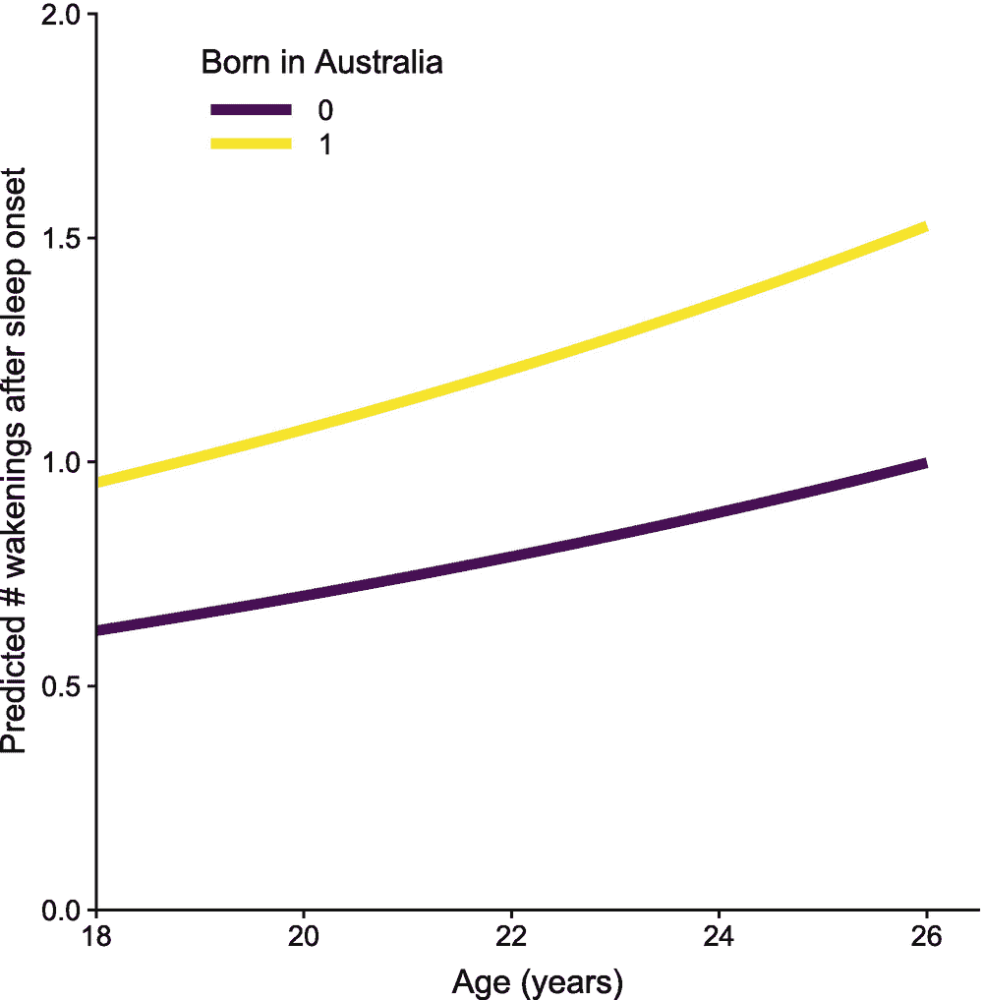

# 十二、GLMMs：高级

关于广义线性*混合*模型(GLMMs)的这一章建立在使用 GLMMs 简介一章和 GLMMs 线性一章中的多级数据的基础上，这两章严格关注连续的正态分布结果。本章重点介绍其他类型结果的 GLMMs，特别是二元结果和计数结果。

我们确实使用了`optimx`包【70】和`dfoptim`包【97】。虽然不能直接使用(它们是依赖关系)，但确实需要安装。

```r
library(checkpoint)
checkpoint("2018-09-28", R.version = "3.5.1",
  project = book_directory,
  checkpointLocation = checkpoint_directory,
  scanForPackages = FALSE,
  scan.rnw.with.knitr = TRUE, use.knitr = TRUE)

library(knitr)
library(ggplot2)
library(cowplot)
library(viridis)
library(JWileymisc)
library(data.table)
library(lme4)
library(lmerTest)
library(chron)
library(zoo)
library(pander)
library(texreg)
library(xtable)
library(splines)
library(parallel)
library(boot)
library(optimx)
library(dfoptim)

options(width = 70, digits = 2)

```

## 12.1 概念背景

本章没有介绍任何实质性的新概念内容。更确切地说，它是前几章内容的综合。如果你还没有读过，相关章节是前两章:GLMMs 简介和 GLMMs 线性。这两章一起提供了混合效果或多级模型的一些独特方面的覆盖范围。另一个需要的方面是熟悉不同的发行系列和链接功能。这些概念在前面的章节中已经介绍过了，特别是 GLM 协议 1 和 GLM 协议 2。在这两章中，我们探讨了如何将线性回归模型扩展到逻辑回归和泊松回归模型，以分析二元和计数结果数据。在这一章中，我们将检查相同的扩展，但是我们不是扩展线性回归，而是扩展包含固定和随机效应的线性混合模型。然而，在实践中，概念上几乎没有区别。如果你理解混合效应模型，你理解逻辑回归和泊松回归，你会发现同样的想法和概念贯穿本章。

## 12.2 物流 GLMM

### 随机截距

我们将考察的第一组模型是随机截距逻辑回归模型。首先，我们加载数据，包括原始数据和在 GLMMs 简介章节中处理过的数据。

```r
data(aces_daily)
draw <- as.data.table(aces_daily)
d <- readRDS("aces_daily_sim_processed.RDS")

```

从技术上讲，我们一直使用的数据集中没有二元结果。然而，我们可以通过对连续结果进行分类来创建二元结果。每天，参与者报告他们入睡需要多少分钟。通常超过 30 分钟才能入睡被认为是临床上有意义的时间长度。

```r
d[, SOLs30 := as.integer(SOLs >= 30)]

```

GLMMs 的设置与我们在 GLMMs 线性章节中运行的线性混合模型非常相似。主要区别是使用了`glmer()`函数来代替`lmer()`函数，并且需要指定分布和可选的链接函数。对于二元结果，我们使用带有 logit 链接函数的二项分布，如 GLM 新协议第二章所述。我们还增加了两个预测指标:睡眠开始后醒来的平均次数和解脱应对的平均使用。除了正常结果之外，GLMMs 的另一个挑战是没有封闭解，而是必须通过数值积分来近似求解。`R`默认为所谓的拉普拉斯近似，一个积分点，但使用额外的积分点可以提高精度。我们通过设置`nAGQ = 9`使用 9 个点。

```r
m1.glmm <- glmer(SOLs30 ~ BCOPEDis + BWASONs + (1 | UserID),
                 family = binomial(link = logit),
                 data = d, nAGQ = 9)
summary(m1.glmm)

## Generalized linear mixed model fit by maximum likelihood (Adaptive
##   Gauss-Hermite Quadrature, nAGQ = 9) [glmerMod]
##  Family: binomial  ( logit )
## Formula: SOLs30 ~ BCOPEDis + BWASONs + (1 | UserID)
##    Data: d
##
##      AIC      BIC   logLik deviance df.resid
##     1969     1991     -980     1961     2093
##
## Scaled residuals:
##    Min     1Q Median     3Q    Max
## -2.558 -0.453 -0.226  0.346  3.343
##
## Random effects:
##  Groups Name        Variance Std.Dev.
##  UserID (Intercept) 3.55     1.88
## Number of obs: 2097, groups:  UserID, 191
##
## Fixed effects:
##             Estimate Std. Error z value Pr(>|z|)
## (Intercept)   -3.606      0.684   -5.27  1.4e-07 ***
## BCOPEDis       0.777      0.295    2.63   0.0085 **
## BWASONs        0.520      0.228    2.29   0.0223 *
## ---
## Signif. codes:  0 '***' 0.001 '**' 0.01 '*' 0.05 '.' 0.1 '␣' 1
##
## Correlation of Fixed Effects:
##          (Intr) BCOPED
## BCOPEDis -0.918
## BWASONs  -0.410  0.101

```

观察结果，我们可以说，睡眠开始后平均不使用解脱应对和平均不醒来的人花费 30 分钟或更多时间入睡的概率为-3.6。我们可以使用反向链接函数，将此转化为概率。在`R`中，我们可以使用`plogis()`函数来完成。

```r
plogis(fixef(m1.glmm)[["(Intercept)"]])

## [1] 0.026

```

检查单个系数，我们看到，人们每使用更高的平均脱离应对单位，他们预计会有 0.8 更高的长睡眠开始潜伏期(30 分钟或更长)的对数几率。同样，人们平均每多醒来一次，长时间睡眠潜伏期的对数几率就会增加 0.5 倍。更简单地说，研究结果表明，更多地使用解脱应对方式和更多地在睡眠开始后醒来，预示着花 30 分钟或更长时间入睡的可能性更高。

另一种解释固定效应的方法是将它们转换成优势比。固定效应的优势比可以通过对其取指数来计算，类似于常规的逻辑回归。下面的代码为固定效果和固定效果的置信区间执行此操作，它们是使用`fixef()`函数和`confint()`函数的`parm = "beta_"`参数选择的，因此只返回固定效果的置信区间，而不是随机效果的置信区间。使用`cbind()`将这些组合起来，然后对整个结果进行指数运算，给出所有比值比范围内的估计值和置信区间。

```r
exp(cbind(
  B = fixef(m1.glmm),
  confint(m1.glmm, parm = "beta_", method = "Wald")))

##                 B  2.5 % 97.5 %
## (Intercept) 0.027 0.0071    0.1
## BCOPEDis    2.176 1.2199    3.9
## BWASONs     1.682 1.0768    2.6

```

检查比值比，我们可以说，人们使用的每一个额外的单位更高的平均脱离应对，他们预计有 2.2 倍的长睡眠开始潜伏期的几率。同样，人们平均每多醒来一次，就会有 1.7 倍的长时间睡眠潜伏期。

为了进一步帮助解释，我们可以生成预测概率。然而，由于随机效应，从 GLMM 中生成预测概率比从常规逻辑回归中生成要复杂得多。尽管随机截距在 logit 标度上总是平均为零，但在概率标度上不会平均为零。

首先，我们使用平均随机效应生成预测(本质上是将它们设置为零)。

```r
preddat <- as.data.table(expand.grid(
  BCOPEDis = seq(
    from = min(d$BCOPEDis, na.rm=TRUE),
    to = max(d$BCOPEDis, na.rm = TRUE),
    length.out = 1000),
  BWASONs = quantile(d$BWASONs, probs = c(.2, .8),
                     na.rm = TRUE)))

## predictions based on average random effects
preddat$yhat <- predict(m1.glmm,
  newdata = preddat,
  type = "response",
  re.form = ~ 0)

```

接下来，我们为样本中的每个人生成预测。

```r
preddat2 <- as.data.table(expand.grid(
  UserID = unique(d$UserID),
  BCOPEDis = seq(
    from = min(d$BCOPEDis, na.rm=TRUE),
    to = max(d$BCOPEDis, na.rm = TRUE),
    length.out = 1000),
  BWASONs = quantile(d$BWASONs, probs = c(.2, .8),
                     na.rm = TRUE)))

## predictions based on average random effects
preddat2$yhat <- predict(m1.glmm,
  newdata = preddat2,
  type = "response",
  re.form = NULL)

```

现在我们将人们的预测概率平均化。也就是说，这是在生成预测概率之后进行平均，而不是在生成预测概率之前进行平均。

```r
## calculate predicted probabilities
## averaging across participants
preddat3 <- preddat2[, .(yhat = mean(yhat)),
         by = .(BCOPEDis, BWASONs)]

```

现在我们可以绘制各种结果，如图 [12-1](#Fig1) 所示。这些图突出显示了在概率尺度上对随机效应进行平均与在 logit 尺度上对随机效应进行平均并生成一组预测概率时，预测概率的差异有多大。一般来说，为每个参与者生成多个预测概率并对其进行平均比对用于生成预测的值进行平均更合适，尽管这需要花费更多的精力来生成。


图 12-1

将随机效应设置为零(在 logit 标度上平均)并对所有随机效应进行平均的预测概率图

```r
ggplot(rbind(
  cbind(preddat, Type = "Zero"),
  cbind(preddat3, Type = "Average")),
  aes(BCOPEDis, yhat, colour = Type)) +
  geom_line(size = 1) +
  scale_color_viridis(discrete = TRUE) +
  facet_wrap(~ round(BWASONs, 1)) +
  theme(
    legend.key.width = unit(1, "cm"),
    legend.position = c(.1, .9)) +
  xlab("Average disengagement coping") +
  ylab("Probability of sleep onset latency 30+ min") +
  coord_cartesian(
    xlim = c(1, 4),
    ylim = c(0, .6),
    expand = FALSE)

```

我们还可以通过绘制单个预测概率来了解随机截距对概率标度的影响。这些结果如图 [12-2](#Fig2) 所示。


图 12-2

脱离应对水平和平均觉醒次数的个人预测概率图

```r
ggplot(preddat2,
  aes(BCOPEDis, yhat, group = UserID)) +
  geom_line(alpha = .2) +
  facet_wrap(~ round(BWASONs, 1))+
  xlab("Average disengagement coping") +
  ylab("Probability of sleep onset latency 30+ min") +
  coord_cartesian(
    xlim = c(1, 4),
    ylim = c(0, 1),
    expand = FALSE)

```

### 随机截距和斜率

正如线性混合模型一样，GLMMs 可以同时具有随机截距和随机斜率。随机斜率可以捕捉个人内部预测因素与事件发生概率之间的个体差异，这里需要 30 分钟或更长时间才能入睡。在这里，我们研究了一个预测入睡时间的平均和个人积极情绪的模型，包括个人积极情绪的随机截距和随机斜率。

```r
m2.glmm <- glmer(SOLs30 ~ BPosAff + WPosAff +
  (1 + WPosAff | UserID),
  family = binomial(link = logit),
  data = d, nAGQ = 1)

summary(m2.glmm)

## Generalized linear mixed model fit by maximum likelihood (Laplace
##   Approximation) [glmerMod]
##  Family: binomial  ( logit )
## Formula: SOLs30 ~ BPosAff + WPosAff + (1 + WPosAff | UserID)
##    Data: d
##
##      AIC      BIC   logLik deviance df.resid
##     1813     1846     -900     1801     1894
##
## Scaled residuals:
##    Min     1Q Median     3Q    Max
## -2.334 -0.451 -0.242  0.341  3.415
##
## Random effects:
##  Groups Name        Variance Std.Dev. Corr
##  UserID (Intercept) 3.7615   1.94
##         WPosAff     0.0897   0.30     1.00
## Number of obs: 1900, groups:  UserID, 191
##
## Fixed effects:

##             Estimate Std. Error z value Pr(>|z|)
## (Intercept)   -1.877      0.561   -3.34  0.00082 ***
## BPosAff        0.117      0.198    0.59  0.55573
## WPosAff       -0.337      0.123   -2.73  0.00627 **
## ---
## Signif. codes:  0 '***' 0.001 '**' 0.01 '*' 0.05 '.' 0.1 '␣' 1
##
## Correlation of Fixed Effects:
##         (Intr) BPsAff
## BPosAff -0.952
## WPosAff  0.092 -0.001

```

这些结果表明，当积极情绪比个人的平均积极情绪高一个单位时，他们当晚花很长时间才能入睡的对数几率预计会低-0.34。请注意，这并不是简单地说快乐的人更快入睡，因为个人变量是对个人均值的偏离。这些结果表明，当人们相对于平时的感觉更快乐时，他们不太可能花很长时间才能入睡。

和以前一样，我们可以很容易地计算出优势比。这些研究表明，对于每单位高于平均水平的晚间积极情绪，参与者花 30 分钟或更多时间入睡的几率约为 0.71 倍。

```r
exp(cbind(
  B = fixef(m2.glmm),
  confint(m2.glmm, parm = "beta_", method = "Wald")))

##                B 2.5 % 97.5 %
## (Intercept) 0.15 0.051   0.46
## BPosAff     1.12 0.762   1.66
## WPosAff     0.71 0.560   0.91

```

将个人积极情感的影响转换为概率需要考虑其他预测因素以及随机截距和斜率，并对两者进行平均。由于积极情感的平均水平不同，人与人之间的积极情感可能有不同的范围，所以我们分别计算这些范围。

```r
bpa.low <- quantile(d$BPosAff, probs = .2, na.rm=TRUE)
bpa.high <- quantile(d$BPosAff, probs = .8, na.rm=TRUE)

preddat4.low <- as.data.table(expand.grid(
  UserID = unique(d$UserID),
  WPosAff = seq(
    from = min(d[BPosAff <= bpa.low]$WPosAff,
               na.rm = TRUE),
    to = max(d[BPosAff <= bpa.low]$WPosAff,
             na.rm = TRUE),
    length.out = 1000),
  BPosAff = bpa.low))

preddat4.high <- as.data.table(expand.grid(
  UserID = unique(d$UserID),
  WPosAff = seq(
    from = min(d[BPosAff >= bpa.high]$WPosAff,
               na.rm = TRUE),
    to = max(d[BPosAff >= bpa.high]$WPosAff,
             na.rm = TRUE),
    length.out = 1000),
  BPosAff = bpa.high))

preddat4 <- rbind(
  preddat4.low,
  preddat4.high)

## predictions including random effects
preddat4$yhat <- predict(m2.glmm,
  newdata = preddat4,
  type = "response",
  re.form = NULL)

## calculate predicted probabilities
## averaging across participants
preddat4b <- preddat4[, .(yhat = mean(yhat)),
         by = .(WPosAff, BPosAff)]

```

现在，我们可以绘制各种结果，如图 [12-3](#Fig3) 所示，这表明，与具有“高”平均积极情感(第 80 百分位)的人相比，具有“低”平均积极情感(第 20 百分位)的人的内部变化范围确实非常不同。


图 12-3

考虑到随机截距和个人内积极影响的斜率，预测概率在个体间平均的图表

```r
ggplot(preddat4b,
  aes(WPosAff, yhat, colour = factor(round(BPosAff, 1)))) +
  geom_line(size = 1) +
  scale_color_viridis("Average\nPositive Affect",
                      discrete = TRUE) +
  theme(

    legend.key.width = unit(1.5, "cm"),
    legend.position = c(.7, .9)) +
  coord_cartesian(
    xlim = c(-4, 4),
    ylim = c(0, .45),
    expand = FALSE) +
  xlab(paste0("Within person positive affect\n",
              "(deviations from own mean)")) +
  ylab("Probability of sleep onset latency 30+ min")

```

## 12.3 泊松和负二项式广义矩估计

### 随机截距

对于计数结果，通常假设泊松或负二项式分布，因为正态分布通常不能很好地表示计数数据。我们在《GLM 新协议》第二章中引入了泊松模型，用于仅固定效应(单水平)模型。本节通过允许随机截取扩展了这一点。泊松分布的一个特征是方差预期等于均值。如果可变性大于平均值，则存在过度分散。虽然这通常是泊松模型的一个问题，但在混合效应泊松模型中可能不太受关注，因为对于每个人的随机截距，模型更有可能适应每个人，并且方差等于均值的假设可能更成立。

在`R`中运行具有随机截距的泊松 GLMM 可以使用`glmer()`函数来完成，并使用参数`family = poisson(link = log)`来指定分布和链接函数。除此之外，该模型在结构上与其他 GLMMs 相同。在这项分析中，我们将使用夜间醒来的次数作为结果变量，年龄(岁)和参与者是否出生在澳大利亚(编码 1)或不出生在澳大利亚(编码 0)作为两个预测变量。

```r
m3.glmm <- glmer(WASONs ~ Age + BornAUS +
  (1 | UserID),
  family = poisson(link = log),
  data = d, nAGQ = 9)

summary(m3.glmm)

## Generalized linear mixed model fit by maximum likelihood (Adaptive
##   Gauss-Hermite Quadrature, nAGQ = 9) [glmerMod]
##  Family: poisson  ( log )
## Formula: WASONs ~ Age + BornAUS + (1 | UserID)
##    Data: d
##
##      AIC      BIC   logLik deviance df.resid
##     2070     2092    -1031     2062     1910
##
## Scaled residuals:
##    Min     1Q Median     3Q    Max
## -1.763 -0.673 -0.360  0.477  3.983
##
## Random effects:
##  Groups Name        Variance Std.Dev.
##  UserID (Intercept) 0.52     0.721
## Number of obs: 1914, groups:  UserID, 190
##
## Fixed effects:
##             Estimate Std. Error z value Pr(>|z|)
## (Intercept)  -1.7574     0.5810   -3.02  0.00249 **
## Age           0.0588     0.0266    2.21  0.02681 *
## BornAUS       0.4250     0.1243    3.42  0.00063 ***
## ---
## Signif. codes:  0 '***' 0.001 '**' 0.01 '*' 0.05 '.' 0.1 '␣' 1
##
## Correlation of Fixed Effects:
##         (Intr) Age
## Age     -0.991
## BornAUS -0.061 -0.019

```

因为泊松 GLMMs 使用对数链接，所以结果是对数标度的。检查个别系数，我们可以解释如下。截距表明，一个不是在澳大利亚出生的零岁儿童每晚醒来的次数预计为-1.8 次。随着年龄的增长，他们每晚醒来的次数会增加 0.1 次。最后，与出生在澳大利亚以外的人相比，出生在澳大利亚的人预期会有 0.4 个更高的对数觉醒。

与逻辑 GLMMs 一样，我们可以使用反向链接函数，在本例中简称为`exp()`，以使结果更容易理解。转换截距，我们可以说，一个不是在澳大利亚出生的零岁儿童预计每晚醒来 0.2 次。

我们还可以对系数取幂，得到基线计数的乘数。这导致了这样一种解释:随着年龄的增长，人们每晚醒来的次数会增加 1.1 倍。与出生在澳大利亚以外的人相比，出生在澳大利亚的人预计会有 1.5 倍的觉醒。当泊松系数被指数化时，它们被称为事故率比率(IRRs)。IRRs 提供了一个相对标准，即一个组的发病率比另一个组高多少倍，或者当连续预测因子改变时，发病率高多少倍。

为了得到 IRR 和置信区间，我们采用了与得到逻辑 glm 的 ORs 相同的方法。首先，我们提取系数和置信区间，然后对最终结果求幂，将它们放在 IRR 标度上，而不是对数标度上。

```r
exp(cbind(
  B = fixef(m3.glmm),
  confint(m3.glmm, parm = "beta_", method = "Wald")))

##                B 2.5 % 97.5 %
## (Intercept) 0.17 0.055   0.54
## Age         1.06 1.007   1.12
## BornAUS     1.53 1.199   1.95

```

为了查看绝对效果，我们为样本中的每个人生成预测，并对结果进行平均。

```r
preddat5 <- as.data.table(expand.grid(
  UserID = unique(d[!is.na(BornAUS) & !is.na(Age)]$UserID),
  Age = seq(
    from = min(d$Age, na.rm=TRUE),
    to = max(d$Age, na.rm = TRUE),
    length.out = 1000),
  BornAUS = 0:1))

## predictions based on average random effects
preddat5$yhat <- predict(m3.glmm,
  newdata = preddat5,
  type = "response",
  re.form = NULL)

## calculate predicted counts
## averaging across participants
preddat5 <- preddat5[, .(yhat = mean(yhat)),
         by = .(Age, BornAUS)]

```

我们还可以通过绘制单个预测概率来了解随机截距对概率标度的影响。这些结果如图 [12-4](#Fig4) 所示。

```r
ggplot(preddat5,
  aes(Age, yhat, colour = factor(BornAUS))) +
  geom_line(size = 2) +
  scale_colour_viridis("Born in Australia", discrete = TRUE) +
  xlab("Age (years)") +
  ylab("Predicted # wakenings after sleep onset") +
  theme(
    legend.key.width = unit(1.5, "cm"),
    legend.position = c(.1, .9)) +
  coord_cartesian(
    xlim = c(18, 26.5),
    ylim = c(0, 2),
    expand = FALSE)

```

如果担心过度分散，计数结果的替代方法是使用负二项式模型。对这一点的支持正在添加到`lme4`包中，这样的模型可以使用`glmer.nb()`功能来适应。请注意，这些模型比拟合泊松模型慢得多。接下来，我们将泊松随机截距模型改装为负二项模型。



图 12-4

按年龄和是否在澳大利亚出生划分的睡眠开始后醒来的平均预测次数图

```r
m3.glmm.nb <- glmer.nb(formula(m3.glmm),
  data = d)

## Warning in checkConv(attr(opt, "derivs"), opt$par, ctrl = control$checkConv, : Model failed to converge with max|grad| = 0.00224463 (tol = 0.001, component 1)

## Warning in theta.ml(Y, mu, weights = object@resp$weights, limit = limit, : iteration limit reached

## Warning in checkConv(attr(opt, "derivs"), opt$par, ctrl = control$checkConv, : Model failed to converge with max|grad| = 0.00115603 (tol = 0.001, component 1)

## Warning in checkConv(attr(opt, "derivs"), opt$par, ctrl = control$checkConv, : Model failed to converge with max|grad| = 0.00162663 (tol = 0.001, component 1)

## Warning in checkConv(attr(opt, "derivs"), opt$par, ctrl = control$checkConv, : Model failed to converge with max|grad| = 0.00194197 (tol = 0.001, component 1)

## Warning in checkConv(attr(opt, "derivs"), opt$par, ctrl = control$checkConv, : Model failed to converge with max|grad| = 0.00147706 (tol = 0.001, component 1)

## Warning in checkConv(attr(opt, "derivs"), opt$par, ctrl = control$checkConv, : Model failed to converge with max|grad| = 0.0016048 (tol = 0.001, component 1)

## Warning in checkConv(attr(opt, "derivs"), opt$par, ctrl = control$checkConv, : Model failed to converge with max|grad| = 0.0014179 (tol = 0.001, component 1)

## Warning in checkConv(attr(opt, "derivs"), opt$par, ctrl = control$checkConv, : Model failed to converge with max|grad| = 0.00177251 (tol = 0.001, component 1)

## Warning in checkConv(attr(opt, "derivs"), opt$par, ctrl = control$checkConv, : Model failed to converge with max|grad| = 0.0012395 (tol = 0.001, component 1)

## Warning in checkConv(attr(opt, "derivs"), opt$par, ctrl = control$checkConv, : Model failed to converge with max|grad| = 0.00139838 (tol = 0.001, component 1)

## Warning in checkConv(attr(opt, "derivs"), opt$par, ctrl = control$checkConv, : Model failed to converge with max|grad| = 0.00142382 (tol = 0.001, component 1)

## Warning in checkConv(attr(opt, "derivs"), opt$par, ctrl = control$checkConv, : Model failed to converge with max|grad| = 0.00144676 (tol = 0.001, component 1)

## Warning in checkConv(attr(opt, "derivs"), opt$par, ctrl = control$checkConv, : Model failed to converge with max|grad| = 0.00138734 (tol = 0.001, component 1)

```

负二项式 GLMM 生成关于收敛失败的警告。为了研究这些收敛警告，我们可以尝试使用不同的优化器来拟合模型，看看不同的优化器是否收敛到相同的结果。`lme4`包没有直接包含这个函数，但是它附带了一个`R`脚本，可以加载这个脚本来提供一个函数。注意，这也需要加载一些额外的`R`包来提供额外的优化器。一旦我们从`lme4`包中获得了代码，我们就可以使用`allFit()`函数来使用不同的优化器来适应我们的模型。

```r
## load R code shipped with lme4 to provide the allFit()
source(system.file("utils", "allFit.R", package="lme4"))
m3.all <- allFit(m3.glmm.nb)

## bobyqa :

## Warning in checkConv(attr(opt, "derivs"), opt$par, ctrl = control$checkConv, : Model failed to converge with max|grad| = 0.00130544 (tol = 0.001, component 1)

## [OK]
## Nelder_Mead :

## Warning in checkConv(attr(opt, "derivs"), opt$par, ctrl = control$checkConv, : Model failed to converge with max|grad| = 0.00199142 (tol = 0.001, component 1)

## [OK]
## nlminbw : [OK]
## nmkbw :

## Warning in checkConv(attr(opt, "derivs"), opt$par, ctrl = control$checkConv, : Model failed to converge with max|grad| = 0.00894524 (tol = 0.001, component 1)

## [OK]
## optimx.L-BFGS-B :

## Warning in checkConv(attr(opt, "derivs"), opt$par, ctrl = control$checkConv, : Model failed to converge with max|grad| = 0.361426 (tol = 0.001, component 1)

## [OK]
## nloptwrap.NLOPT_LN_NELDERMEAD :

## Warning in checkConv(attr(opt, "derivs"), opt$par, ctrl = control$checkConv, : Model failed to converge with max|grad| = 0.00541331 (tol = 0.001, component 1)

## [OK]
## nloptwrap.NLOPT_LN_BOBYQA :

## Warning in checkConv(attr(opt, "derivs"), opt$par, ctrl = control$checkConv, : Model failed to converge with max|grad| = 0.00541331 (tol = 0.001, component 1)

## [OK]

```

我们再次得到收敛失败的警告，尽管在许多情况下，我们可以看到绝对梯度接近默认容差 0.001。接下来，我们可以对所有拟合进行总结，并查看固定效应、对数似然和θ的结果，θ在该模型中是随机截距方差。

```r
m3.all.sum <- summary(m3.all)

m3.all.sum$fixef

##                               (Intercept)   Age BornAUS
## bobyqa                               -1.8 0.059    0.42
## Nelder_Mead                          -1.8 0.059    0.42
## nlminbw                              -1.8 0.059    0.42
## nmkbw                                -1.8 0.059    0.42
## optimx.L-BFGS-B                      -1.7 0.055    0.42
## nloptwrap.NLOPT_LN_NELDERMEAD        -1.8 0.059    0.42
## nloptwrap.NLOPT_LN_BOBYQA            -1.8 0.059    0.42

m3.all.sum$llik

##                        bobyqa                   Nelder_Mead
##                         -2270                         -2270
##                       nlminbw                         nmkbw
##                         -2270                         -2270
##               optimx.L-BFGS-B nloptwrap.NLOPT_LN_NELDERMEAD
##                         -2270                         -2270
##     nloptwrap.NLOPT_LN_BOBYQA
##                         -2270

m3.all.sum$theta

##                               UserID.(Intercept)
## bobyqa                                      0.72
## Nelder_Mead                                 0.72
## nlminbw                                     0.72
## nmkbw                                       0.72
## optimx.L-BFGS-B                             0.72
## nloptwrap.NLOPT_LN_NELDERMEAD               0.72
## nloptwrap.NLOPT_LN_BOBYQA                   0.72

```

结果表明，所有不同的优化器收敛到相同的估计。因此，尽管有收敛警告，我们可能会感到相对自信，我们实际上已经找到了最优解，模型已经收敛。

接下来我们使用`screenreg()`函数并排打印两个模型的结果，看看泊松和负二项式有什么不同。在这种情况下，我们可以看到它们非常相似，除了年龄和截距的标准误差在负二项式模型中比在泊松模型中稍小。

```r
screenreg(
  list(Poisson = m3.glmm,
       NegBin = m3.glmm.nb))

##
## ===================================================
##                          Poisson       NegBin
## ---------------------------------------------------
## (Intercept)                 -1.76 **      -1.76 ***
##                             (0.58)        (0.48)
## Age                          0.06 *        0.06 **
##                             (0.03)        (0.02)
## BornAUS                      0.42 ***      0.42 ***
##                             (0.12)        (0.12)
## ---------------------------------------------------
## AIC                       2070.12       4549.55
## BIC                       2092.34       4577.34
## Log Likelihood           -1031.06      -2269.78
## Num. obs.                 1914          1914
## Num. groups: UserID        190           190
## Var: UserID (Intercept)      0.52          0.51
## ===================================================
## *** p < 0.001, ** p < 0.01, * p < 0.05

```

如前所述，我们可以通过首先提取固定效应和置信区间，然后对其求幂，来制作事故率比率(IRRs)及其置信区间的表格。下面的代码通过对泊松和负二项式广义矩估计的并排比较来实现这一点。

```r
exp(cbind(
  fixef(m3.glmm),
  confint(m3.glmm, parm = "beta_", method = "Wald"),
  fixef(m3.glmm.nb),
  confint(m3.glmm.nb, parm = "beta_", method = "Wald")))

##                  2.5 % 97.5 %      2.5 % 97.5 %
## (Intercept) 0.17 0.055   0.54 0.17 0.068   0.44
## Age         1.06 1.007   1.12 1.06 1.016   1.11
## BornAUS     1.53 1.199   1.95 1.53 1.202   1.95

```

比较预期分布和观察到的分布，看它们有多接近，也是有帮助的。以下代码从负二项式 GLMM(称为 theta)中提取过度离散的估计值，然后计算每个觉醒次数的观察密度和预期密度，并将它们存储在数据集中用于绘制。

```r
theta <- getME(m3.glmm.nb, "glmer.nb.theta")

density <- data.table(
  X = as.integer(names(table(d$WASONs))),
  Observed = as.vector(prop.table(table(d$WASONs))))

density$NegBin <- colMeans(do.call(rbind, lapply(fitted(m3.glmm.nb), function(mu) {
  dnbinom(density$X, size = theta, mu = mu)
  })))

density$Poisson <- colMeans(do.call(rbind, lapply(fitted(m3.glmm), function(mu) {
  dpois(density$X, lambda = mu)
  })))

```

现在，我们可以绘制密度图，以显示我们的模型与观察到的数据分布有多接近。结果如图 [12-5](#Fig5) 所示。该图显示，总的来说，观察到的分布和预期的分布相当一致。这支持了我们的分配期望不是完全不合理的。我们还看到，在这种情况下，泊松模型和负二项式模型之间没有区别。

```r
ggplot(melt(density, id.vars = "X"),
  aes(X, value, fill = variable)) +
  geom_col(position = "dodge") +
  scale_fill_viridis("Type", discrete = TRUE) +
  theme(legend.position = c(.8, .8)) +
  xlab("Number of awakenings") +
  ylab("Density") +
  coord_cartesian(
    xlim = c(-.5, 4.5),
    ylim = c(0, .5),
    expand = FALSE)

```

为了更好地理解为什么泊松和负二项式广义矩估计在分布方面给出相同的最终结果，我们可以看看θ的模型估计。这是一个非常高的估计，在这些情况下，负二项式趋向于泊松。

```r
getME(m3.glmm.nb, "glmer.nb.theta")

## [1] 40993

```

考虑到θ的估计值、泊松和负二项式模型的结果和预期分布的相似性，在这种情况下，我们最有可能选择使用更简单的泊松模型。


图 12-5

基于泊松和负二项 GLMM 的夜间醒来次数的观测和预期平均密度。

### 随机截距和斜率

与逻辑广义矩量法一样，我们不仅可以包括随机截距，还可以包括随机斜率。在这里，我们将继续尝试预测睡眠开始后的觉醒。给定随机截距模型的结果，我们将在这里只探讨泊松 GLMM，而不是也包括负二项 GLMM。

除了年龄和参与者是否出生在澳大利亚之外，一个很好的觉醒预测因子可能是先前觉醒的次数。作为 GLMMs 介绍章节的一部分，我们创建了滞后变量。变量`WWASONsLag1`捕捉前一天晚上个人内部与个人均值的偏差。也就是说，它告诉我们一个参与者昨晚醒来的次数比平时多(或少)了多少次。虽然醒来的次数是一个离散的计数，但 12 天内平均醒来次数的偏差呈现一个更连续的分布，因为人们可能高于或低于他们自己的平均值。图 [12-6](#Fig6) 中显示了睡眠开始后唤醒的滞后人内偏差分布图。该图显示了一种非正态分布，但更连续且相对对称。


图 12-6

睡眠开始后，人与典型觉醒次数的偏差分布滞后于前一天。

```r
testdistr(d[, WWASONsLag1],
          varlab = "Within WASONs lag 1")

```

在下面的模型中，我们将`WWASONsLag1`包括为固定效应和随机效应。因为我们在截距中加入了随机效应，所以模型将允许随机效应相互关联。

```r
m4.glmm <- glmer(WASONs ~ Age + BornAUS +
   WWASONsLag1 +
  (1 + WWASONsLag1  | UserID),
  family = poisson(link = log),
  data = d, nAGQ = 1)

summary(m4.glmm)

## Generalized linear mixed model fit by maximum likelihood (Laplace
##   Approximation) [glmerMod]
##  Family: poisson  ( log )
## Formula:
## WASONs ~ Age + BornAUS + WWASONsLag1 + (1 + WWASONsLag1 | UserID)
##    Data: d
##
##      AIC      BIC   logLik deviance df.resid
##     4246     4284    -2116     4232     1770
##
## Scaled residuals:
##    Min     1Q Median     3Q    Max
## -1.768 -0.655 -0.333  0.485  3.892
##
## Random effects:
##  Groups Name        Variance Std.Dev. Corr
##  UserID (Intercept) 0.5043   0.7101
##         WWASONsLag1 0.0044   0.0663   1.00
## Number of obs: 1777, groups:  UserID, 189
##
## Fixed effects:
##             Estimate Std. Error z value Pr(>|z|)
## (Intercept)  -1.6039     0.5728   -2.80  0.00511 **
## Age           0.0527     0.0262    2.01  0.04472 *
## BornAUS       0.4045     0.1218    3.32  0.00089 ***
## WWASONsLag1  -0.0986     0.0457   -2.16  0.03093 *
## ---
## Signif. codes:  0 '***' 0.001 '**' 0.01 '*' 0.05 '.' 0.1 '␣' 1
##
## Correlation of Fixed Effects:
##             (Intr) Age    BrnAUS
## Age         -0.991
## BornAUS     -0.059 -0.020
## WWASONsLag1 -0.039  0.043  0.112

```

模型摘要显示了睡眠开始后的滞后觉醒和第二天晚上的觉醒次数之间的平均负相关(固定效应)。具体来说，每增加一次高于个人平均水平的觉醒，他们第二天晚上的觉醒对数就会减少-0.1。我们可以对这个值取幂来得到 IRR。IRR 表明，每增加一次高于个人平均水平的觉醒，他们在第二天晚上的觉醒次数就会增加 0.91 倍。

```r
exp(cbind(
  B = fixef(m4.glmm),
  confint(m4.glmm, parm = "beta_", method = "Wald")))

##                B 2.5 % 97.5 %
## (Intercept) 0.20 0.065   0.62
## Age         1.05 1.001   1.11
## BornAUS     1.50 1.180   1.90
## WWASONsLag1 0.91 0.828   0.99

```

尽管不是很大，但是斜率还是有一些变化，正如随机方差和标准偏差所示。我们可以提取每个参与者的斜率，使用`coef()`函数将固定效应和随机效应结合起来。然后，我们可以对这些斜率取指数，并绘制它们来显示 IRR 的分布。分布显示，几乎所有的参与者都被预测为 IRR 低于 1，这表明对于几乎所有的人来说，当他们在某个晚上醒来的次数多于平时时，他们在第二天晚上醒来的次数往往会更少(图 [12-7](#Fig7) )。

```r
testdistr(exp(coef(m4.glmm)$UserID$WWASONsLag1))

```

最后，我们可以预测醒来的次数。通常，在预测中包含一定程度的不确定性是可取的。然而，围绕 GLMMs 的预测产生置信区间是复杂的。通过使用自举可以获得近似的置信区间。然而，值得注意的是，即使是自举置信区间目前也仅限于参数自举，因此仍然对分布进行假设。首先，我们建立一个新的预测数据集，并在链接范围内生成整体预测。

```r
preddat.boot <- as.data.table(expand.grid(
  UserID = unique(model.frame(m4.glmm)$UserID),
  WWASONsLag1 = seq(
    from = min(d$WWASONsLag1, na.rm = TRUE),
    to = max(d$WWASONsLag1, na.rm = TRUE),
    length.out = 100),
  Age = quantile(d[!duplicated(UserID)]$Age,
                 probs = c(.2, .8), na.rm = TRUE),
  BornAUS = 0:1))

preddat.boot$yhat <- predict(m4.glmm,
  newdata = preddat.boot)

```

为了帮助加速引导，我们将设置一个本地集群来进行并行处理。我们需要加载相关的包并导出用于预测的数据集。


图 12-7

对于几乎所有人来说，当他们在某个晚上醒来的次数比平常多的时候，他们在第二天晚上醒来的次数就会减少。

```r
genPred <- function(m) {
  predict(m,
    newdata = preddat.boot)
}

cl <- makeCluster(4)
clusterExport(cl, c("book_directory",
                    "checkpoint_directory",
                    "preddat.boot", "d", "genPred"))

clusterEvalQ(cl, {
  library(checkpoint)
  checkpoint("2018-09-28", R.version = "3.5.1",
    project = book_directory,
    checkpointLocation = checkpoint_directory,
    scanForPackages = FALSE,
    scan.rnw.with.knitr = TRUE, use.knitr = TRUE)

  library(data.table)
  library(lme4)
  library(lmerTest)
})

## [[1]]
##  [1] "lmerTest"      "lme4"          "Matrix"        "data.table"
##  [5] "checkpoint"    "RevoUtils"     "stats"         "graphics"
##  [9] "grDevices"     "utils"         "datasets"      "RevoUtilsMath"
## [13] "methods"       "base"
##
## [[2]]
##  [1] "lmerTest"      "lme4"          "Matrix"        "data.table"
##  [5] "checkpoint"    "RevoUtils"     "stats"         "graphics"
##  [9] "grDevices"     "utils"         "datasets"      "RevoUtilsMath"
## [13] "methods"       "base"
##
## [[3]]
##  [1] "lmerTest"      "lme4"          "Matrix"        "data.table"
##  [5] "checkpoint"    "RevoUtils"     "stats"         "graphics"
##  [9] "grDevices"     "utils"         "datasets"      "RevoUtilsMath"
## [13] "methods"       "base"
##
## [[4]]
##  [1] "lmerTest"      "lme4"          "Matrix"        "data.table"
##  [5] "checkpoint"    "RevoUtils"     "stats"         "graphics"
##  [9] "grDevices"     "utils"         "datasets"      "RevoUtilsMath"
## [13] "methods"       "base"

```

主自举是一个参数模型，它是使用`lme4`包中的`bootMer()`函数进行的。请注意，我们在这里很少启动，因为即使是使用四核的并行集群，它也相对较慢。更常见的是运行 1，000、5，000 或 10，000 个引导数据库样本，但这可能需要数分钟或数小时。

```r
system.time(bootres <- bootMer(m4.glmm,
    FUN = genPred,
    nsim = 100,
    seed = 12345,
    use.u = FALSE,
    type = "parametric",
    parallel = "snow",
    ncpus = 4,
    cl = cl))

##    user  system elapsed
##     3.3     1.7   169.4

```

最后，我们计算结果的简单百分位数置信区间，并将它们添加回我们的数据集中。这比线性混合模型的情况要复杂一些，因为我们跨 ID 折叠。这是因为无论是在链接范围(log，平均为零)还是在响应范围(counts，随机效应不平均为零)上平均随机效应，都会产生不同的结果。在我们的预测数据集中，有 75，600 行，对应于 189 个唯一 id，每个 id 针对不同的预测值重复 400 次。为了找到具有相同预测值但跨越 id 的所有行，我们可以为第一个、第二个等创建一个索引。预测值的组合。只要数据集是按预测值排序的，我们可以通过简单地按唯一 id 的长度重复一个索引值来做到这一点。

```r
preddat.boot[, Index := rep(1L:400L,
  each = length(unique(UserID)))]

```

首先，我们将创建一个新的小型预测数据集，该数据集仅包含平均预测值和所需的预测值集。请注意，我们对预测的日志计数进行指数运算，然后对 id 进行平均，而不是先平均后指数运算。

```r
preddat.boot.avg <- preddat.boot[, .(yhat = mean(exp(yhat))),
  by = .(WWASONsLag1, Age, BornAUS)]

```

现在我们可以通过新的指数循环，从 bootstrap 样本中获得平均计数的置信区间。如果我们直接采用基于百分位数的置信区间，这将包含由于人与人之间的差异和平均估计中的不确定性。相反，我们对所有 id 取指数，取平均值，然后取 bootstrap 样本的百分位数。在指数化之后，但在计算百分位数置信区间之前，对所有人(id)进行平均，意味着我们对所有人的可变性进行平均，并且只考虑所有人的平均估计值的可变性。我们还可以包括由 IDs 引起的可变性，但这将回答一个不同的问题。

要真正做到这一点，请注意引导结果在列上有不同的预测(即，列是区分不同 id 和我们的预测变量的各种值的部分)，并且每个新的引导结果是不同的行。因此，我们在列上使用我们的索引，并在取幂之后取行的平均值，以便对一组特定的预测值的 id 的可变性进行平均。然后，我们计算置信区间的百分位数，并将它们添加回我们的预测数据集中，该数据集中的 id 是平均的。

```r
dim(bootres$t)

## [1]   100 75600

for (i in 1:400) {
  ## find which indices to use
  ok <- which(preddat.boot$Index == i)

  ## now average across people
  tmp_avg <- rowMeans(exp(bootres$t[, ok]))

  ## lower confidence interval
  preddat.boot.avg[i,
    LL := quantile(tmp_avg, probs = .025, na.rm = TRUE)]
  preddat.boot.avg[i,
    UL := quantile(tmp_avg, probs = .975, na.rm = TRUE)]
}

```

现在我们有了参数自举置信区间，我们可以绘制一个图表，显示以前夜间醒来的预测次数、年龄以及参与者是否出生在澳大利亚。结果如图 [12-8](#Fig8) 所示。图表显示，当人们醒来的次数高于他们自己的平均次数时，第二天晚上醒来的次数减少了。我们也可以看到年龄的主要影响,“年长”的年轻人比“年轻”的年轻人有更多的觉醒预测。同样通过颜色，我们看到那些在澳大利亚出生的人比那些不在澳大利亚出生的人倾向于报告更多的觉醒。置信区间不是严格对称的，这对于反应标度上的置信区间是正常的(即，在指数化之后)。置信区间有一些参差不齐。如果我们生成 5000 个引导样本而不是 100 个，它们可能会更平滑。


图 12-8

根据前一次夜间醒来(相对于自己的平均值)预测醒来次数的图，按年龄(岁)在第 20 和第 80 百分位(分别为 19.4 岁和 25 岁)分开，并在澳大利亚出生(0 =否，1 =是)。平均预测计数周围的自举置信区间通过阴影显示。

```r
ggplot(preddat.boot.avg, aes(WWASONsLag1, yhat,
  colour = factor(BornAUS), fill = factor(BornAUS))) +
  geom_ribbon(aes(ymin = LL, ymax = UL),
              alpha = .25, colour = NA) +
  geom_line(size = 1) +
  ylab("Predicted Awakenings") +
  xlab("Within person awakenings lag 1") +
  scale_color_viridis("Born in Australia", discrete = TRUE) +
  scale_fill_viridis("Born in Australia", discrete = TRUE) +
  theme(
    legend.position = "bottom",
    legend.key.width = unit(1, "cm")) +
  facet_wrap(~ Age) +
  coord_cartesian(
   xlim = c(-3, 3),
   ylim = c(0, 2.5),
   expand = FALSE)

```

## 12.4 摘要

本章建立在前面章节的线性混合效应模型的基础上，为二元和计数结果建立混合效应模型。具体来说，本章涵盖了逻辑混合效应模型和泊松和负二项混合效应模型。本章还介绍了从 GLMMs 生成预测的独特挑战，特别是如何考虑原始尺度预测中的随机效应。最后，我们展示了如何计算原始规模上预测的置信区间，以说明使用自举的随机效应。表 [12-1](#Tab1) 总结了一些关键功能。

表 12-1

本章中描述的关键功能列表及其功能摘要

<colgroup><col class="tcol1 align-left"> <col class="tcol2 align-left"></colgroup> 
| 

功能

 | 

它的作用

 |
| --- | --- |
| `glmer()` | 估计广义线性混合效应模型。 |
| `glmer.nb()` | 估计负二项广义线性混合效应模型。 |
| `bootMer()` | 自助线性或广义线性混合效应模型。 |
| `binomial()` | logistic 广义线性混合模型的分布族函数。通常与规范的 logit 链接一起使用。 |
| `poisson()` | 计数结果泊松广义线性混合模型的分布族函数。通常与规范日志链接一起使用。 |
| `summary()` | 提供数据输入的摘要。 |
| `fixef()` | 提取固定效果，以模型作为参数。 |
| `coef()` | 从广义线性混合模型中提取模型系数。请注意，与使用`glmer()`或`lmer()`拟合混合效果模型的单级模型不同，该函数返回每个参与者或集群级别的系数，其中包含固定和随机效果。 |
| `confint()` | 置信区间生成函数。 |
| `predict()` | 类似于`fitted()`，除了需要一个数据参数。在这两种情况下，都会返回模型输出 yhat 值。 |
| `quantile()` | 计算给定数据的分位数。 |