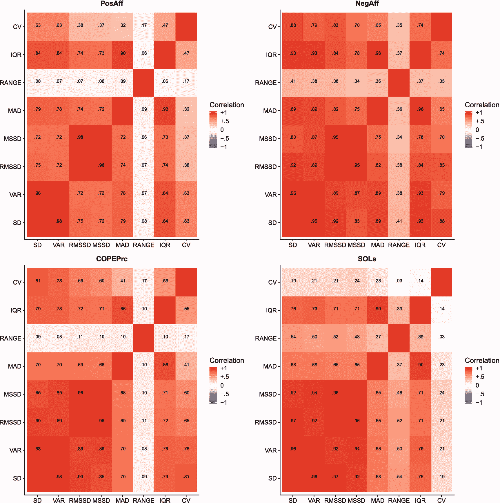
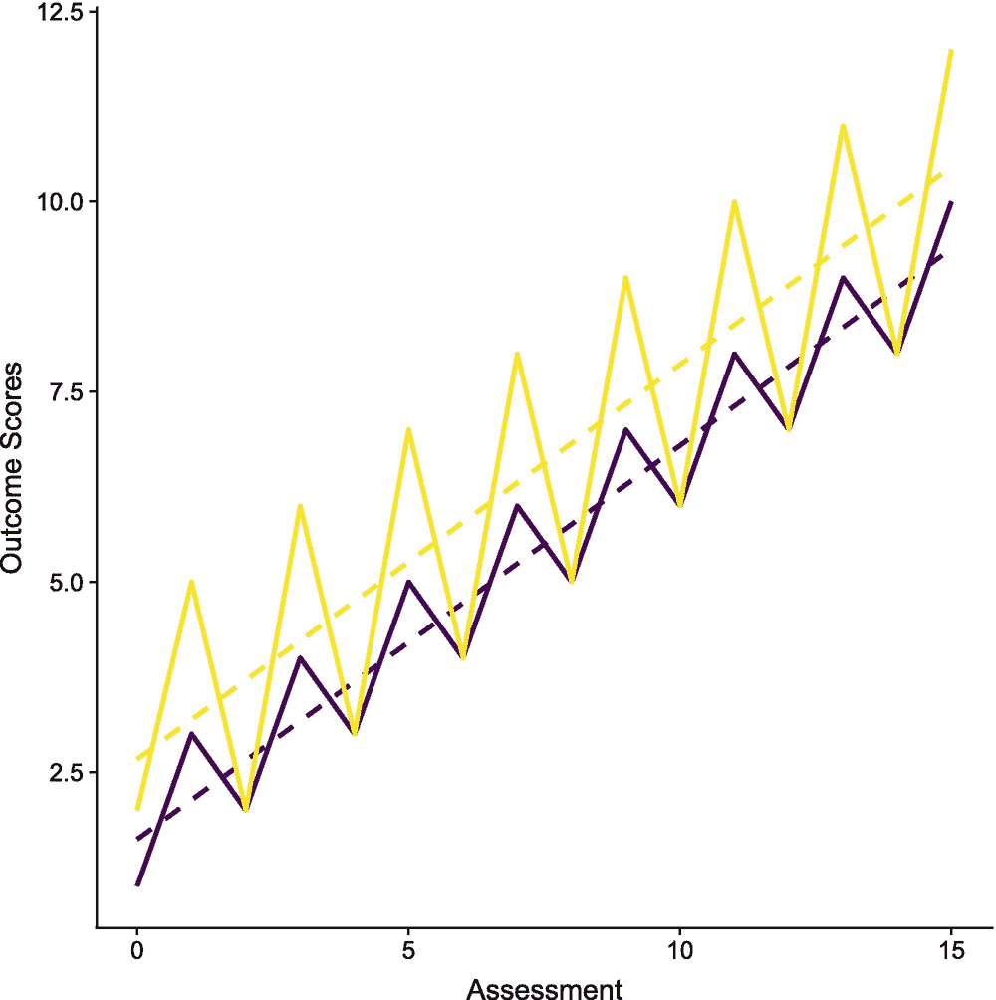
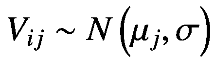
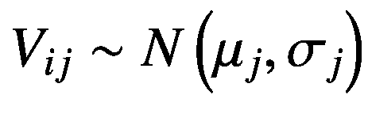
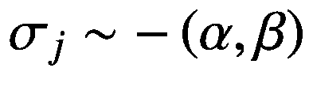
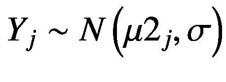
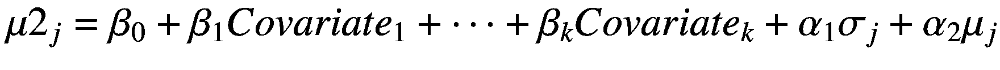
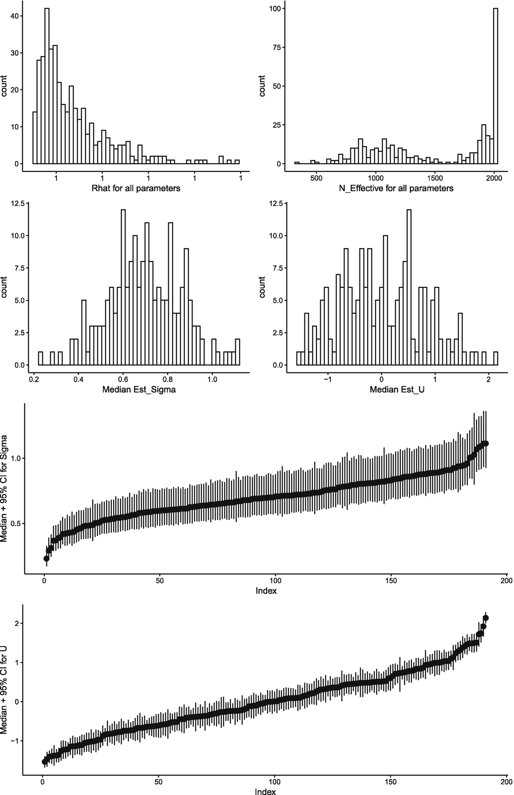
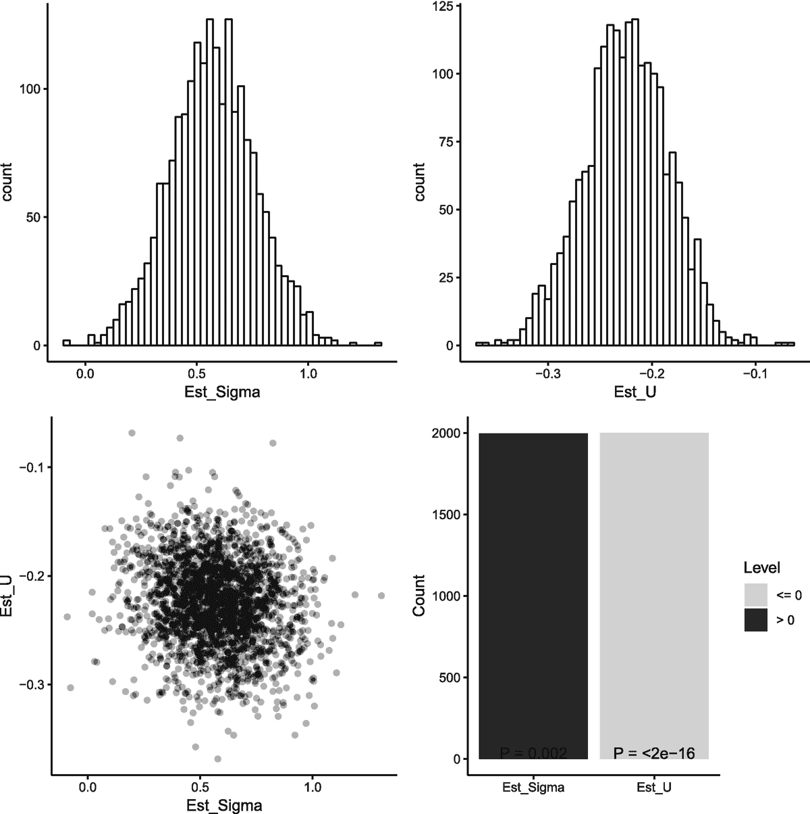

# 十三、模拟 IIV

到目前为止，我们只关注分布位置(或平均值)的统计模型。这一章的重点是一些新的东西，分布的规模或可变性。具体来说，本章介绍了个体内变异性(IIV)的概念，即在重复评估中个体单位内的变异性。虽然是一个相对小众的研究领域，IIV 提供了关于单个单位的附加信息，并允许新类型的研究或实际问题进行评估，如人(学校，工厂等)。)有更大的可变性会有不同的结果？本章使用了由作者之一开发的专门用于`vari`能力`an`分析的软件包`varian`。

```r
library(checkpoint)
checkpoint("2018-09-28", R.version = "3.5.1",
  project = book_directory,
  checkpointLocation = checkpoint_directory,
  scanForPackages = FALSE,
  scan.rnw.with.knitr = TRUE, use.knitr = TRUE)

library(knitr)
library(ggplot2)
library(cowplot)
library(viridis)
library(data.table)
library(JWileymisc)
library(varian)
library(mice)
library(parallel)

options(width = 70, digits = 2)

```

## 13.1 概念背景

### 贝叶斯推理

一个重要的注意事项是贝叶斯方法的使用。贝叶斯思维的覆盖范围超出了本书的范围。然而，Gelman 及其同事(2013 年)[36]有一本关于贝叶斯数据分析的非常详细的书。虽然不要求对贝叶斯方法有深入的了解，但是对如何进行抽样的基本理论和实践的熟悉是充分利用本章所必需的。我们在这里提供一个*非常*简单的概述贝叶斯推断的几个方面，但是强烈建议没有遇到过这些方法的读者去阅读其他的著作。

贝叶斯推理使用贝叶斯规则来计算参数的后验分布， *p(参数-数据，先验)*，它是参数的概率，以数据和先验分布为条件。马尔可夫链蒙特卡罗(MCMC)用于从参数的后验概率分布中抽取样本。通过汇总来自后验分布的 MCMC 样本，例如通过计算样本的平均值或中值，获得点估计；不确定性可以通过计算标准偏差或给出百分位数来表征(例如，95%置信区间的 2.5 和 97.5 百分位数；CI)。如果需要 p 值，可以将双尾经验 p 值计算为高于或低于 0 的样本比例中较小者的两倍，即:2 **min*(*prop*(*θ*≤0)， *prop* ( *θ* > 0)。可以通过计算模型中每个参数的百分比比例缩减系数(PSRFs) [17]来检查收敛性。PSRFs 也称为 Rhats，它估计通过延长 MCMC 链的运行时间可以降低的比例。值 1 表示收敛，尽管通常认为足够接近 1 的值表示收敛(例如 1.1)。

贝叶斯推断依赖于总结后验分布。因此，为了得到稳定的总结，有足够的后验样本量是很重要的。然而，如果样本中存在高自相关，许多后验样本可能不足以表征整个后验参数分布。通常，可以从基于变异函数和多链方差对自相关估计进行调整的每个参数的有效样本量中提取相关信息。还可以评估每个参数的有效后验样本量。如果估计的后验有效样本量不足，这可能表明需要额外的迭代，或者可能需要一些其他方法，如重新调整数据、简化模型或使用更强的先验。

### 什么是 IIV？

在大多数应用中，人们关注的是均值(也称为“位置”)差异。例如，常见的问题是两组是否有不同的均值，均值是否可以通过其他因素(即大多数回归模型)预测，以及均值如何随时间变化。然而，研究人员也承认个体间和个体内的可变性(也称为“尺度”)是重要的[30]。例如，Russell，Moskowitz，Zuroff，Sookman 和 Paris (2007) [84]的实证研究表明，边缘型人格障碍患者(其特征是不稳定的关系和情感不稳定[1])在情感方面表现出比对照组显著更高的个体内变异性。在衰老和发育过程的背景下，Ram 和 Gerstorf (2009) [77]概述了研究个体间变异性的重要概念、方法和研究设计考虑因素。概念和经验的兴趣 IIV 也存在于睡眠领域(如比斯等人，2010[18]；Suh et al .，2012 [91])，因为发现没有两个晚上的睡眠是相同的，许多人每晚睡觉的时间、睡眠时间和睡眠质量都有很大差异。因此，尽管与理解手段的兴趣相比，对规模和 IIV 的兴趣较小，但人们对 IIV 很感兴趣。

这一章的目的是介绍一个严格的和可行的方法来估计个体内部的变异性。当个体间的差异具有理论和经验相关性时，我们也将强调变异性估计指数的效用。在介绍更复杂的统计位置和比例模型之前，我们将首先介绍一些简单的量化 IIV 的方法。

#### 可变性的量化和建模方法

在介绍我们的主要贝叶斯位置尺度模型之前，我们回顾了一些量化和建模可变性的现有方法。

也许可变性最常见的度量是方差或标准差。使用标准偏差(或方差的平方)计算个体间的变异性，作为每个受试者观察值的标准偏差，也称为个体标准偏差(ISD)。计算 ISD 后，它可用作另一个统计模型中的结果或预测值。因为 ISD 量化了与单个单位平均值的偏差，系统时间效应(例如，随时间线性增加)将增加 ISD。这可能合适，也可能不合适，取决于您是对捕捉一个人的所有可变性感兴趣，还是仅对非系统可变性感兴趣。

例如，在睡眠中，日光的季节性变化会影响个人的睡眠/觉醒行为，并且这种变化可能没有直接的研究或临床相关性。在这些情况下，ISD 可能高估了感兴趣的个体内变异的类型。在对时间或其他相关因素进行调整(即去趋势化)后，可以通过计算残差的 ISD 来解决这种偏差。

量化可变性的另一个传统方法是连续差异的均方根(`RMSSD` ) [103]。因为 RMSSD 是基于连续的差异，它自然地消除了系统趋势的影响。例如，下面的代码显示了相同的数据，首先从最小到最大排序，然后随机化。虽然数据重新排序后标准差不会改变，但有序数据的 RMSSD 比无序数据的要小得多。这突出了系统趋势(有序数据)的 RMSSD 可能小于标准差，但无序数据的大小可能相同，甚至更大。

```r
## ordered
sd(c(1, 3, 5, 7, 9))

## [1] 3.2

rmssd(c(1, 3, 5, 7, 9))

## [1] 2

## randomized
sd(c(3, 1, 9, 5, 7))

## [1] 3.2

rmssd(c(3, 1, 9, 5, 7))

## [1] 4.7

```

可变性的其他度量是方差(即， *ISD* <sup>2</sup> )、连续差异的均方值(即， *RMSSD* <sup>2</sup> )、中位数绝对差、极差、四分位差和变异系数。

为了更好地理解这些不同的度量之间的关系，我们将从广义线性混合模型(GLMMs)的章节中加载我们使用的 ACES 数据。我们还加载我们制作并保存在“GLMMs:简介”一章中的经过处理的数据。接下来，我们定义一个函数，`variability_measures(),`,以便更容易地计算数据上的所有这些度量。

```r
data(aces_daily)
draw <- as.data.table(aces_daily)
d <- readRDS("aces_daily_sim_processed.RDS")

variability_measures <- function(x) {
  x <- na.omit(x)
  list(
    SD = sd(x),
    VAR = sd(x)^2,
    RMSSD = rmssd(x),
    MSSD = rmssd(x)^2,
    MAD = median(abs(x - median(x))),
    RANGE = range(x),
    IQR = abs(diff(quantile(x, probs = c(.25, .75)))),
    CV = sd(x) / mean(x))
}

```

现在，我们可以通过参与者 ID 来计算可变性测量，以创建一个新的数据集，然后估计并绘制 ACES 数据中四个不同变量的相关矩阵。

```r
plot_grid(
  plot(SEMSummary(~ .,
    data = d[, variability_measures(PosAff), by = UserID][,-1]),
    order = "asis") +
    ggtitle("PosAff"),
  plot(SEMSummary(~ .,
    data = d[, variability_measures(NegAff), by = UserID][,-1]),
    order = "asis") +
    ggtitle("NegAff"),
  plot(SEMSummary(~ .,
    data = d[, variability_measures(COPEPrc), by = UserID][,-1]),
    order = "asis") +
    ggtitle("COPEPrc"),
  plot(SEMSummary(~ .,
    data = d[, variability_measures(SOLs), by = UserID][,-1]),
    order = "asis") +
    ggtitle("SOLs"),
ncol = 2)

```

图 [13-1](#Fig1) 中的图有助于从经验上展示根据计算方法也可以收集到的信息:标准差(SD)、方差(VAR)、均方根连续差(RMSSD)、均方连续差(MSSD)、中位数绝对偏差(MAD)和四分位间距(IQR)都趋向于强相关。一般来说，范围和变异系数有更大的不同。



图 13-1

应用于个人的四种不同测量的可变性测量之间的相关性

然而，所有这些方法都受到测量误差的限制。尽管这种批评适用于任何计算出来的统计数据，但在专注于均值的研究中，这并不是一个实际问题。方法显示了良好的可靠性，因此测量误差低，重复测量很少。相比之下，ISD 的可靠性很差，测量很少，特别是当重复观测的数量很少，ISDs 的个体差异很小时[31]。通过分析 ISD 和 ISD2 的可靠性，一份可靠的问卷(可靠性 0.9)需要多达 50 次重复观察，以合理的可靠性(可靠性 0.8)估计个体间的变异性[105]。在许多情况下，由于参与者的负担和成本，收集这么多的测量值可能是不可行的。

心理测量学领域已经对如何评估和说明测量误差进行了广泛的研究。例如，潜在变量模型可用于说明测量误差[13]。然而，大多数统计模型是设计来测试位置(平均值)，而不是规模(可变性)的影响。一个值得注意的例外是独立观测，在这种情况下，针对位置和规模的灵活广义加性模型(gam)已经得到发展(见[79]和[89])。然而，位置尺度 gam 不适用于重复测量数据(非独立观察)，因此也不适用于个体间变异性的研究。

评估方面的技术进步，包括自我报告的移动应用程序和提供大量密集测量的可穿戴设备的爆炸，导致越来越多的研究，包括许多重复的人均测量。随后，最近的方法学文献集中于开发新的技术，用于随着时间的推移量化个体的特征，包括 IIV。

Hedeker、Mermelstein 和 Demirtas (2008 年)[42]在最大似然框架内开发了混合效应位置和规模模型。Hedeker 的模型允许解释变量预测受试者之间和受试者内部的因素，包括随机截距和随机生命指数。它已被用于分析生态瞬时评估数据(有关该应用的精彩介绍，请参见 Hedeker、Mermelstein 和 Demirtas，2012 年)[43]。Hedeker、Demirtas 和 Mermelstein (2009) [41]将连续结果模型扩展到有序数据，李和 Hedeker (2012) [56]将位置尺度模型扩展到三级模型。

另一种方法是首先计算连续差的平方，然后使用广义线性混合模型对其建模。这种方法使用连续的差异，因此对系统性的个体内部变化不太敏感。截距，实际上是均方连续差(RMSSD2)，可以通过将每个均方连续差输入广义线性混合模型来预测。这种方法的一个局限性是它处理缺失数据的能力。例如，如果跨三天收集数据，则有两个连续差异，*t*<sub>2</sub>–*t*<sub>1</sub>和*t*<sub>3</sub>–*t*<sub>2</sub>，如果缺少第二天( *t* <sub>2</sub> )，则两个连续差异都是未定义的。

Wang，Hamaker 和 Bergeman (2012) [106]提出了一个直接使用原始数据的贝叶斯多级模型。该模型结合了时间依赖性(通过自相关系数获得)和可变性的大小，而 Hedeker 等人(2008 年)[42]的方法仅模拟了大小。考虑时间相关性对于许多重复测量特别有用。自相关有时也被称为惯性，因为它们表明改变方向有多困难。尽管有这些好处，考虑水平(截距)、时间相关性(自相关)和可变性(IIV)的个体差异会导致更复杂的模型，这往往需要更大的样本量。王及其同事(2012) [106]观察到，在超过 200 名参与者中，当每个参与者使用所有 56 个重复测量时，他们的方法收敛，但当每个参与者使用 7 个甚至 14 个重复测量时，他们的方法不收敛。

总之，除非有许多重复测量(可能超过 50)，否则量化可变性的简单方法(如 ISD 或 RMSSD)不是最佳方法，因为可靠性低且无法解释测量误差。显式位置比例模型是存在的，并且对于较少的重复测量可能是更好的选择。即使有许多重复测量，显式位置比例模型也具有优势，因为它们可以开始分离可变性的来源(例如，通过消除时间依赖性)[42，106]。到目前为止，我们把重点放在 IIV 的成果上。在下一节中，我们将介绍一个贝叶斯变异性模型，该模型提供了 IIV 的估计值，并使用 IIV 作为预测值。

### 作为预测因子的个体内变异性

将 IIV 作为一个预测因素主要有两个方面。首先，我们必须获得一个可靠的 IIV 度量或 IIV 度量，以及对该度量的不确定性的估计(即，考虑度量误差)。接下来，这个度量可以在另一个模型中用作预测器。第二个模型的细节不是特别重要，因为 IIV 估计实际上可以输入到任何模型中。

估计生命价值的基础是多水平或混合效应模型。我们已经在前几章介绍了这些模型。由于其灵活性，混合效果模型是一个理想的起点。具体来说，根据研究的问题，人们可以用不同的方式来定义 IIV。例如，假设两个人，A 和 B，接受了干预并每周评估一次。随时间变化的轨迹如图 [13-2](#Fig2) 所示。



图 13-2

两个假设的人接受了干预，人 A(紫色)和人 B(黄色)，都以相同的速度提高，但人 B 的一致性较差

```r
iivdat <- data.table(
  Assessment = 0:15,
  PersonA = c(1, 3, 2, 4, 3, 5, 4, 6, 5, 7, 6, 8, 7, 9, 8, 10),
  PersonB = c(2, 5, 2, 6, 3, 7, 4, 8, 5, 9, 6, 10, 7, 11, 8, 12))

ggplot(iivdat, aes(Assessment)) +
  stat_smooth(aes(y = PersonA), method = "lm", se=FALSE,
              colour = viridis(2)[1], linetype = 2) +
  geom_line(aes(y = PersonA),
            colour = viridis(2)[1], size = 1) +
  stat_smooth(aes(y = PersonB), method = "lm", se=FALSE,
              colour = viridis(2)[2], linetype = 2) +
  geom_line(aes(y = PersonB),
            colour = viridis(2)[2], size = 1) +
  ylab("Outcome Scores")

```

该图显示，虽然两个人对干预的反应大致相同，但一个人比另一个人改善得更稳定。这些差异在 ISDs 中显而易见。

```r
## ISD
sd(iivdat$PersonA)

## [1] 2.6

sd(iivdat$PersonB)

## [1] 3

```

然而，在没有任何调整的情况下，这些 isd 纳入了由于随时间的系统变化和围绕这些系统趋势的波动而导致的结果评分的可变性。如果研究旨在使用总 IIV，那么这些可能是理想的。然而，如果问题在于随着时间的推移，改进的稳定性或可变性如何，那么我们应该首先去除这些系统性的变化。结果如下所示。随着系统性趋势的消失，isd 比以前小得多。

```r
## ISD, after removing systematic improvements
sd(resid(lm(PersonA ~ Assessment, data = iivdat)))

## [1] 0.77

sd(resid(lm(PersonB ~ Assessment, data = iivdat)))

## [1] 1.8

```

虽然我们不提倡直接提取残差并对其进行操作，但从概念上讲，这是我们的目标。混合效应模型是一个理想的选择，因为它们允许分析师灵活地调整或不调整系统趋势。混合效应模型还允许考虑任何其他相关的预测因素，以便分离出所需的 IIV 来源。根据个人的目标，这可能涉及不添加任何预测因子、添加时间或向模型中添加许多不同的潜在预测因子，并对残差进行 IIV 建模。

出于实际原因，在贝叶斯框架中使用马尔可夫链蒙特卡罗(MCMC)模拟来估计模型是方便的。贝叶斯框架很有帮助，因为

*   贝叶斯方法允许在指定模型和分布方面的灵活性，而不需要显式地导出似然函数

*   最大似然法在估计生命年数时很难收敛，而贝叶斯法可能很慢，但通常如果运行时间足够长，就会混合并收敛

*   通过 MCMC 模拟，来自后验分布的多次提取允许将 iiv 估计中的不确定性捕获为可能估计的采样分布，而不是单个“最佳估计”

下一节将更详细地介绍贝叶斯可变性模型(BVM)。

#### 贝叶斯可变性模型

我们已经在前几章介绍了混合效应模型。如果对这些不熟悉，最好在继续之前回顾一下前面的章节，在这些章节中，只解释了位置混合效应模型。我们之前的技术报告[116]对该模型进行了更全面的介绍和评估。

作为参考，假设`Y`是人与人之间的结果，而`V`是人与人之间的变量，这样`V`在每个人身上被重复测量。iiv 将从`V`开始估算，并用于预测他们在`Y`上的得分。此外，该模型可以估计每个人的平均值`V`，作为`Y`的附加预测值。在关于 IIV 的文献中，我们认为，在检验 IIV 是否预测了一个结果以证明检验 IIV 的附加价值时，至少对变量的均值进行统计调整是重要的[116，8，6，7]。首先，考虑一个`V`的多级模型；为了简单和不失一般性，我们从一个无条件模型开始:



(13.1)

在本例中，*V*<sub>*I*</sub>*j*是第 *i* th (i = 1，2，...、 *I* <sub>*j*</sub> )考核为第 *j* th (j = 1，2，...，N)主语。每个个体都有自己的估计均值， *μ* <sub>*j*</sub> ，均值的分布假设遵循正态分布:


这个基本的混合效应模型对假设适用于每个人的剩余可变性进行了单一估计。我们可以扩展这个模型，允许标准偏差也因受试者而异。扩展模型仍然假设正态分布，但是现在允许位置 *μ* 和剩余标准偏差 *σ* 变化。新模型被指定为



(13.2)

该等式与之前的等式相同，但是*μ*<sub>T3】j</sub>表示个体标准差，或者在条件模型的情况下，表示个体剩余标准差。基于观测残差估计 ISDs 不能解释模型估计的不确定性可能导致残差差异的事实。然而，作为模型的一部分，位置参数的不确定性将传播到残差中，从而传播到 ISD 估计中。

像假设来自正态分布的单个平均值一样，单个(剩余)标准偏差也假设来自一个分布，特别是具有比例和形状参数 *α* 和 *β* 的伽马分布:



(13.3)

使用任何标准模型，个体(剩余)标准偏差的估计值*<sub>*j*</sub>，然后被用作结果的预测值`Y`。例如，我们可以使用多元线性回归，即*

**

*(13.4)

在该模型中，预测值 *μ* 为



(13.5)

为了突出模型中任何其他预测因子或协变量与混合效应模型中的单个均值和 ISDs 之间的差异，我们使用了一个单独的参数向量。我们用 *β* 表示常规预测值，用 *α* 表示潜在平均值和 ISDs。

请注意，尽管我们在这里使用了线性回归，但是我们可以很容易地用几乎任何统计模型替换线性回归模型。

估计生命统计数字的 ISD 方法受到了批评，因为它没有考虑观察值的顺序。然而，这是通过在混合效应模型的背景下估计生命年数来解决的。作为混合效应模型的一部分，随着时间推移的系统趋势和其他相关变量可以作为预测因素添加进来。通过包括滞后的结果措施，也有可能包括自回归效应。这提供了使 ISD 包括所有可变性或仅包括感兴趣部分的灵活性。此外，通过在统计模型中包括去趋势，不确定性再次被捕获并传播到 IIV 估计。

### 软件实现:瓦里安

贝叶斯可变性模型(BVM)可以在任何通用贝叶斯框架中进行估计，如 JAGS、bug 或 Stan。我们将使用 Stan [35，19]，这是一种通用编程语言，使用马尔可夫链蒙特卡罗(MCMC)进行贝叶斯推理，并使用不掉头采样器进行采样，该采样器是哈密顿蒙特卡罗(Hoffman & Gelman，2014) [44]的扩展。

虽然在 Stan 中手动指定每个模型是可能的，也是最灵活的，但为了使不太熟悉贝叶斯方法的分析师更容易，我们也将使用可从 CRAN 或 GitHub 获得的`R`包`varian`【116】:[`https://github.com/ElkhartGroup/VARIAN`](https://github.com/ElkhartGroup/VARIAN)。`varian`链接到 Stan，只需几行代码就能估算出 BVM。目前，`varian`只支持对连续的、正态分布的变量的可变性建模。

在`varian`中，默认情况下，先验信息很少，假设变量的标准偏差大约≤ 10。具体来说，均值和回归系数使用均值为零和标准差为 1，000 的正态先验。第二阶段结果的伽马分布和残差方差的比例和形状参数使用半柯西先验，这是一种比方差分量的均匀或逆伽马族更好的弱信息先验[34，74]。具体来说，`varian`分别使用 0 和 10 的位置和比例参数。根据数据的规模，可能需要指定先验的替代参数或重新调整数据，以使默认先验的信息量较弱。

使用百分比比例缩减系数(PSRF)来估计收敛。因为*σ*<sub>T5】j</sub>和 *μ* <sub>*j*</sub> 的每个个体估计都是一个参数，所以有很多个体 PSRFs。在`varian`中，作为一个诊断图，我们展示了一个 Rhats 的直方图，以便对所有参数的收敛性进行直观检查。一项模拟研究表明，只要每个人有五个或更多的重复测量，在`varian`中描述和实施的 BVM 就会产生最小偏差的估计值。

## 13.2 `R`示例

### IIV 预测一个连续的结果

为了使用前面描述的 BVM 来预测连续的结果，我们可以使用`varian()`函数。`varian`包和`Stan`用 C++编译模型。因此，为了让这些工作，你需要在你的系统上安装一个 C++编译器，并且可以被`R`访问。在运行 Windows 操作系统的机器上，最简单的方法就是安装`R`工具，可从 [`https://cran.r-project.org/bin/windows/Rtools/`](https://cran.r-project.org/bin/windows/Rtools/) 获得。在运行 Mac OS 的机器上，获得必要编译器的最常见方式是从 app store 安装`Xcode`。在 linux 或 unix 的不同变体上，使用它们的包管理器来安装 GCC 或另一个 C++编译器应该很简单。如果模型编译时出现错误，尝试更新`R`和您的编译器(通过安装最新版本的`R`工具或`Xcode`或特定的编译器)。最后，请注意，在编译期间，出现大量消息和警告是正常的。如果没有错误，模型通常是好的，大多数消息和警告都可以忽略。

`varian()`函数有几个参数。首先，人与人之间结果的模型公式被指定给`y.formula`参数。IIV 估计值被自动包括在内，所以所有需要指定的是结果变量和任何额外的协变量或预测值。接下来，生命统计数字的公式被指定给`v.formula`。因为生命体征需要重复测量结果，所以必须有一个 ID 变量。照常指定数据。此外，我们指定了`design`，它指示是否应该单独评估生命体征，它们应该预测一个结果，或者它们应该预测一个中介和一个结果。在下面的示例模型中，我们估计生命年数，并用它们来预测一个连续的结果。此外，有几个关于 MCMC 采样的参数，包括总迭代次数、`totaliter;`预热迭代次数、`warmup;`细化间隔、`thin;`和要使用的独立链的数量、`chains`。为了让示例运行得更快，我们使用了相对较少的迭代次数和较低的瘦。为了确保最终模型具有良好的收敛性和稳定的估计值，人们可能会选择一个较大的值，这样最终的有效样本量为几千个。在这种情况下，我们测试积极情感的 IIV 是否预测平均消极情感超过平均积极情感。也就是说，积极情绪的不稳定性能唯一预测一个人典型的消极情绪水平吗？

```r
cl <- makeCluster(2)
clusterExport(cl, c("book_directory", "checkpoint_directory" ))

clusterEvalQ(cl, {
  library(checkpoint)
  checkpoint("2018-09-28", R.version = "3.5.1",
  project = book_directory,
  checkpointLocation = checkpoint_directory,
  scanForPackages = FALSE,
  scan.rnw.with.knitr = TRUE, use.knitr = TRUE)

  library(varian)
})

## [[1]]
##  [1] "varian"        "rstan"         "StanHeaders"   "ggplot2"
##  [5] "checkpoint"    "RevoUtils"     "stats"         "graphics"
##  [9] "grDevices"     "utils"         "datasets"      "RevoUtilsMath"
## [13] "methods"       "base"
##
## [[2]]
##  [1] "varian"        "rstan"         "StanHeaders"   "ggplot2"
##  [5] "checkpoint"    "RevoUtils"     "stats"         "graphics"
##  [9] "grDevices"     "utils"         "datasets"      "RevoUtilsMath"
## [13] "methods"       "base"

system.time(m <- varian(
  y.formula = BNegAff ~ 1,
  v.formula = PosAff ~ 1 | UserID,
  data = d,
  design = "V -> Y",
  useU = TRUE,
  totaliter = 10000,
  warmup = 500, thin = 5,
  chains = 2, verbose=TRUE,
  cl = cl))

##    user  system elapsed
##     1.3     1.5   510.2

```

在检查模型估计之前，我们可以使用`vm_diagnostics()`函数检查一些基本的模型收敛诊断。结果如图 [13-3](#Fig3) 所示。Rhat 值的范围表明了良好的收敛性。然而，所有参数的有效样本量各不相同，有些相对较低。现在我们将继续，但在实践中，人们可能希望增加迭代次数，并使用更强的先验或其他方法来确保最小有效样本量更大。



图 13-3

诊断，包括百分比标度缩减系数(Rhat)、有效样本量、单个标准差的分布、单个均值的分布以及单个标准差和均值的单个估计值(具有可信区间)。

```r
## check diagnostics
vm_diagnostics(m)

```

虽然可能有其他感兴趣的参数，但通常主要的兴趣围绕着生命体征是否真的预测结果。为了检验这一点，我们提取 MCMC 样本并使用`vmp_plot()`绘制它们。我们专门绘制了`Yalpha`，它是结果`Y`的*α*系数向量。结果如图 [13-4](#Fig4) 所示。这些图表通过散点图显示了单个 isd 的分布、单个均值及其联合分布。条形图显示了高于和低于 0 的 MCMC 样本的比例，这些用于生成 p 值。在这种情况下，IIV 和个人平均都是重要的预测因素，但方向相反。较高的平均积极情感预示着显著较低的消极情感。然而，独立于平均积极情感，具有不太稳定的积极情感(即，更多变量)的人预期具有更高的典型消极情感。



图 13-4

经验 p 值的分布图、双变量散点图和零两侧的病例比例

```r
## extract MCMC samples
mcmc.samples <- extract(m$results,
  permute = TRUE)

## examine MCMC samples of
## the alpha regression coefficients
vmp_plot(mcmc.samples$Yalpha)

```

最后，我们可以使用`param_summary()`函数获得我们可能需要的任何参数的摘要。以下代码显示了每个组件的摘要:IIV 模型和预测平均负面影响的模型。结果显示，平均负面影响的截距非常低，接近 1(在 1 到 5 的可能范围内)。生命统计研究所的研究结果表明，积极情感的 IIV 越高，消极情感也越高。由于 MCMC 抽样中固有的随机抽样，您的结果可能与本书有所不同，这在有效样本量很小时尤其会影响结果。然而，在这些例子中，高一个单位的 IIV 与高半个点的平均负面影响相关。我们还可以看到积极情绪平均水平的结果，这与消极情绪平均水平呈负相关:人们平均越积极，消极情绪就越少。最后，对于平均负面影响，我们可以得到一个残差的总结，不是由正面影响 IIV 或正面影响个体均值来解释的。

```r
## intercept of average negative affect
param_summary(mcmc.samples$YB[, 1])

##   Mean Median   SE LL2.5 UL97.5 p-value
## 1  1.1    1.1 0.14  0.87    1.4  < .001

## IIV on average negative affect
param_summary(mcmc.samples$Yalpha[, 1])

##   Mean Median   SE LL2.5 UL97.5 p-value
## 1 0.57   0.57 0.19  0.19   0.95    .002

## individual mean on average negative affect
param_summary(mcmc.samples$Yalpha[, 2])

##    Mean Median   SE LL2.5 UL97.5 p-value
## 1 -0.22  -0.22 0.04 -0.31  -0.15  < .001

## residual error of average negative affect
param_summary(mcmc.samples$sigma_Y)

##   Mean Median   SE LL2.5 UL97.5 p-value
## 1 0.43   0.43 0.02  0.38   0.48  < .001

```

我们还可以获得 IIV 模型的参数汇总，包括截距、包含的任何预测因子的影响，以及 iiv 的随机影响和伽马分布参数的汇总。这些如下所示。

```r
## intercept of positive affect
param_summary(mcmc.samples$VB[, 1])

##   Mean Median   SE LL2.5 UL97.5 p-value
## 1  2.7    2.7 0.06   2.6    2.8  < .001

## positive affect random intercept standard deviation
param_summary(mcmc.samples$sigma_U)

##   Mean Median   SE LL2.5 UL97.5 p-value
## 1  0.8    0.8 0.04  0.73   0.89  < .001

## estimate of the gamma rate parameter for IIVs
param_summary(mcmc.samples$rate)

##   Mean Median  SE LL2.5 UL97.5 p-value
## 1   19     19 2.4    15     24  < .001

## estimate of the gamma shape parameter for IIVs
param_summary(mcmc.samples$shape)

##   Mean Median  SE LL2.5 UL97.5 p-value
## 1   14     13 1.6    11     17  < .001

```

最后，如果目标是通过`varian()`函数直接使用 IIV 估计，尽管这不是必需的，但是为了在其他模型中使用估计，必须首先提取它们。提取生命体征的贝叶斯估计有助于在各种模型中使用它们。例如，它们可以用作广义加法模型、机器学习模型等中的预测器。肝脏被命名为`Sigma_V`。细化后，这将是一个矩阵，数据集中每个未丢失的唯一 ID 对应一列，每个 MCMC 样本对应一行。在这种情况下，它是一个 2,000 x 191 维的矩阵。当用作贝叶斯模型的一部分时，IIV 估计中的不确定性会自动传播到后面参数估计中的不确定性。但是，如果提取结果，必须小心确保不确定性仍在传播。一种方法是将 MCMC 样本视为缺失变量的多重插补。本质上，我们可以认为生命保障指数和个人方法是缺失的价值，因为我们没有观察它们。我们的模型估算我们的最佳估计，但它这样做有一些误差。注意，个别手段也可用，命名为`U`。

```r
dim(mcmc.samples$Sigma_V)

## [1] 2000  191

str(mcmc.samples$Sigma_V)

##  num [1:2000, 1:191] 0.558 0.478 0.525 0.6 0.44 ...
##  - attr(*, "dimnames")=List of 2
##   ..$ iterations: NULL
##   ..$           : NULL

```

使用 IIV 估计的最简单但不是最佳的方法是简单地对 MCMC 样本求平均值。下面的代码提取这些，平均它们，合并平均负面影响，并估计一个回归模型。这些结果与一步贝叶斯模型的结果相似，但在平均估计值和置信区间上有很大不同。

```r
avg_dataset <- cbind(
  d[!duplicated(UserID), .(BNegAff)],
  IIV = colMeans(mcmc.samples$Sigma_V),
  IIM = colMeans(mcmc.samples$U))

avg_model <- lm(BNegAff ~ IIV + IIM, data = avg_dataset)

summary(avg_model)

##
## Call:
## lm(formula = BNegAff ~ IIV + IIM, data = avg_dataset)
##
## Residuals:
##     Min      1Q  Median      3Q     Max
## -0.7862 -0.2762 -0.0538  0.1933  1.5671
##
## Coefficients:
##             Estimate Std. Error t value Pr(>|t|)
## (Intercept)   1.0518     0.1334    7.88  2.5e-13 ***
## IIV           0.7119     0.1841    3.87  0.00015 ***
## IIM          -0.2321     0.0389   -5.97  1.2e-08 ***
## ---
## Signif. codes:  0 '***' 0.001 '**' 0.01 '*' 0.05 '.' 0.1 '␣' 1
##
## Residual standard error: 0.42 on 188 degrees of freedom
## Multiple R-squared:   0.2,   Adjusted R-squared:  0.192
## F-statistic: 23.5 on 2 and 188 DF,  p-value: 7.72e-10

```

接下来，我们可以通过使用不同的 MCMC 样本来制作许多数据集。我们不使用所有 1，000 个，而是每 10 个取一个。在每一种情况下，我们可以估计一个回归模型，然后通过使用`as.mira()`函数转换为一个多重估算分析对象，然后使用`pool()`函数组合结果，从而组合和汇集结果。我们在缺失数据一章中会更详细地介绍如何处理多重估算数据。

```r
ind_dataset <- lapply(seq(1, 1000, by = 10), function(i) {
  cbind(
  d[!duplicated(UserID), .(BNegAff)],
  IIV = mcmc.samples$Sigma_V[i, ],
  IIM = mcmc.samples$U[i, ])
})

ind_model <- lapply(ind_dataset, function(tmpdat) {
  lm(BNegAff ~ IIV + IIM, data = tmpdat)
})

ind_model_pooled <- pool(as.mira(ind_model))

```

作为最后的比较，我们可以用简单的 ISD 估计来拟合一个模型。

```r
raw_model <- lm(BNegAff ~ IIV + IIM,
 data = d[, .(BNegAff = BNegAff[1],
              IIV = sd(PosAff, na.rm = TRUE),
              IIM = mean(PosAff, na.rm = TRUE)),
          by = UserID])

```

为了进行比较，我们展示了贝叶斯模型的结果，并计算了使用平均 IIV 估计值的模型、原始 ISD 模型和将其视为多重估算的模型的回归系数和置信区间。通过比较这些不同的模型，我们可以看到，虽然它们都不完全匹配，但贝叶斯模型的结果更接近，并将估计值视为多重估算值。

```r
## Bayesian Results
param_summary(mcmc.samples$YB[, 1]) ## intercept

##   Mean Median   SE LL2.5 UL97.5 p-value
## 1  1.1    1.1 0.14  0.87    1.4  < .001

param_summary(mcmc.samples$Yalpha[, 1]) ## IIV

##   Mean Median   SE LL2.5 UL97.5 p-value
## 1 0.57   0.57 0.19  0.19   0.95    .002

param_summary(mcmc.samples$Yalpha[, 2]) ## IIM

##    Mean Median   SE LL2.5 UL97.5 p-value
## 1 -0.22  -0.22 0.04 -0.31  -0.15  < .001

## using averages only
cbind(B = coef(avg_model), confint(avg_model))

##                 B 2.5 % 97.5 %
## (Intercept)  1.05  0.79   1.31
## IIV          0.71  0.35   1.08
## IIM         -0.23 -0.31  -0.16

## using raw ISDs
cbind(B = coef(raw_model), confint(raw_model))

##                 B 2.5 % 97.5 %
## (Intercept)  1.82  1.52   2.11
## IIV          0.46  0.15   0.77
## IIM         -0.22 -0.29  -0.14

## treating as multiply imputed
summary(ind_model_pooled, conf.int = TRUE)

##             estimate std.error statistic  df p.value 2.5 % 97.5 %
## (Intercept)     1.14      0.14       8.2 129 5.3e-14  0.87   1.42
## IIV             0.58      0.19       3.0 127 3.0e-03  0.20   0.96
## IIM            -0.22      0.04      -5.6 175 7.2e-08 -0.30  -0.15

```

这些例子显示了贝叶斯方法如何帮助估计生命年。此外，他们强调了因计算原始 ISDs 或因将 IIV 估计视为无误差测量而产生的偏差。这些结果更加引人注目，因为每个参与者平均有 30 多个积极情感评估可用。因此，与只有 5 或 14 项评估相比，ISDs 的可靠性要高得多。然而，每个模型的估计值和不确定性估计值存在很大差异，只有单步贝叶斯解决方案和将 IIV 估计值视为多重估算的解决方案产生了相当接近的结果。

## 13.3 摘要

这一章介绍了个体内部可变性(IIV)的概念，以及 IIV 如何能够提供关于重复测量的额外维度的信息。本章总结了计算单个标准差的局限性和量化 IIV 的其他简单方法。它还引入了贝叶斯可变性模型(BVM ),该模型使用混合效应模型来控制任何感兴趣的变量，如时间效应和时间依赖性，并根据残差计算 iiv。通过在贝叶斯框架中一步完成，BVM 可以适应 IIV 估计中的不确定性，这减少了结果中的偏差，并提供了更准确的统计推断。本章中使用的功能汇总在表 [13-1](#Tab1) 中。

表 13-1

本章中描述的关键功能列表及其功能摘要

<colgroup><col class="tcol1 align-left"> <col class="tcol2 align-left"></colgroup> 
| 

功能

 | 

它的作用

 |
| --- | --- |
| `sd()` | 返回样本数据的标准偏差 |
| `rmssd()` | 返回样本数据连续差的均方根 |
| `varian()` | 基于在贝叶斯框架中估计的位置尺度混合效应模型来估计贝叶斯可变性模型。可用于使个体间变异(iiv)预测其他结果，或简单地估计 iiv，说明测量误差并提取它们 |
| `vm_diagnostics()` | 使用`varian()`函数估计的贝叶斯可变性模型的绘图诊断 |
| `extract()` | 提取马尔可夫链蒙特卡罗样本，用于绘图、汇总或在其他模型中使用 |
| `vmp_plot()` | 从贝叶斯可变性模型中绘制参数，以查看其单独和联合分布 |
| `param_summary()` | 根据贝叶斯变异性模型创建参数摘要，包括平均值、中值、可信区间和经验 p 值 |
| `as.mira()` | 将模型结果列表转换为多重估算对象类，以允许将模型汇集在一起。当提取多个 IIV 估计值并将其视为多个估算值时，在 IIV 分析中使用 |
| `pool()` | 不同多重估算数据集上重复的一系列分析的池模型结果 |*