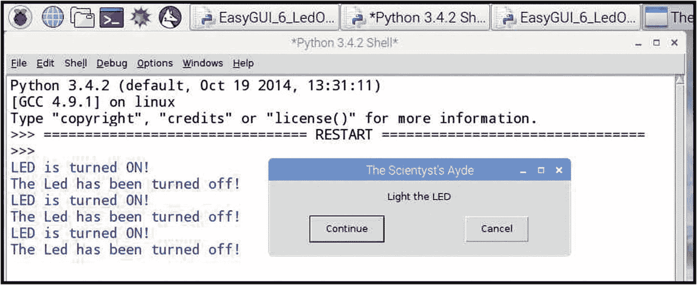

# 一、LED 照明的按钮控制

本章中的练习实际上是最简单的计算机控制形式之一，通过单击主系统显示屏上的按钮图标或运行几行计算机代码来打开和关闭 LED 设备。图形用户界面(GUI)是显示屏，包含按钮图标、滑动控件、仪表、数字显示、图形带状图记录器显示和其他符号，主动/被动和基于文本，可用于监测和控制当前过程。单击屏幕按钮可以打开和关闭 LED，系统的状态由 LED 是否亮起来直观地确定。作为 SCADA 软件与 HMI 和试验板电子设备接口的初始练习，演示了从显示屏或键盘控制简单电子电路供电的能力。

为了将在基于“视窗”的计算机操作系统上运行的面向视觉的数字软件连接到位于工作台上或嵌入在实验环境中的“插入式”快速原型“试验板”,需要数字电气连接。用于将外围设备连接到主计算机的 USB 电缆可以用作将主计算机连接到机器接口的电信号传输线。

机器接口连接可以是多种 USB 兼容的可编程硬件设备中的任何一种，能够接收数字代码的输入，解释或识别代码的意图，并产生所需的数字输出信号。

在图 [1-1](#Fig1) 中，显示了能够提供所需输入解释并产生适当输出信号的数据采集或 HMI 设备的选择。

项目 1 和 3 来自美国科罗拉多州莱克伍德的 LabJack 公司。该公司生产大约 12 种与 USB、以太网和 Wi-Fi 系统兼容的多功能数据采集(DAQ)设备。LabJacks 是坚固耐用的设备，旨在用于艰苦的工业和实验室应用，带有沉重的塑料保护壳和大型螺丝端子接线连接。所描述的两种设备是成本最低的 U3-HV(115 美元；参见 LabJack 文献，了解所有可用的附加功能和特性)和原始 LabJack 多功能 DAQ 设备(160 美元)。

第 2 项是 Digilent Inc .的 chipKIT Uno32(已退役)Arduino 兼容微控制器。图示设备已被 chipKIT uC32，3.3 伏 Arduino 兼容微控制器(42 CDN)所取代。第 4 项和第 5 项是 SparkFun Inc .的廉价量产 SMT Arduino 兼容微控制器(20-30 美元)。

所示的每个设备都能够接收单个数字开/关信号或编码指令，并产生所需的输出。


图 1-1

一些人机界面设备

微控制器目前由十几家公司制造，具有各种各样的功能和各种各样的成本。

## 实验的

驻留在外部独立供电的原型板上的 LED 的原始控制屏幕按钮照明是在 2007 年使用 LabJack U12 创建和写入的，如图 [1-1](#Fig1) 第 3 项所示。许多年后，随着低成本微控制器板的出现，图 [1-1](#Fig1) 中的项目 2、4 和 5 可用于实现相同的接口功能。虽然这个练习描述了 U12 的使用，但是任何微控制器板都可以用来代替图 [1-1](#Fig1) 中的 LabJacks。第 [11](11.html) 章给出了激活 Arduino 以点亮 LED 的 DAQFactory 控制屏幕按钮的详细配置。在“实验下载-向微处理器发送数据”部分，配置了三个按钮来打开和关闭 LED 的电源，并按照编程的顺序进行。

### 五金器具

图 [1-2](#Fig2) 显示了本练习中合适电子元件的典型选择，放置在原型“试验板上”


图 1-2

原型试验板和各种组件

项目 1 是一个塑料电池盒，能够容纳八节 AA 型电池，以提供 12 伏的标称电压。(八个 1.5 伏的新鲜碱性电池将提供 12 伏，而八个 1.2 伏的镍金属氢化物(NiMH)可充电电池将提供初始的 9.6 伏 DC 电源。锂电池每个可以提供 3.6 伏的额定电压。)

标题 2 旁边的项目是发光二极管。左侧的红色 LED 是一个 3 毫米(1/8 英寸)的微型设备，接下来的四个彩色二极管是 6 毫米(1/4 英寸)的设备，而右侧的透明设备是一个 10 毫米(3/8 英寸)的白光 LED。

第 3 项是 CD4050 同相十六进制缓冲器(见下文)。项目 4 是一个典型的 1/8 瓦限流电阻，而项目 5 是一个 2 英寸(50 毫米)乘 6 1/4 英寸(163 毫米)的原型板。该板在顶面的顶部和底部有两条独立的电源轨，标有红色(+)和蓝色(–)线。每条轨道电力线可以容纳 50 个电源连接和 50 个接地连接。上下电源轨之间是两组独立的 63 列五个连接点。

### 电路原理图:DAQFactory 和 LabJack 组合

图 [1-3](#Fig3) 中的电路原理图用于前两个练习。第 [2](02.html) 章中使用了完整的四个 LED 电路，其中监控各种颜色 LED 的单独功耗。在第一个练习中，仅使用红色 LED 电路中的接线。


图 1-3

用于 LED 功率控制的电路

CD4050 芯片中的单个开关是单向的，因为施加到输入端的电压变化会影响输出，但输出端的电压波动不会影响输入引脚。

### 软件

所需的页面组件:单个按钮

正如“练习路线图”中所讨论的，在进行任何科学训练时，都应该做详细的笔记。在本练习中，应选择用于控制 HMI 的通道名称，或在本例中为 LabJack，并配置软件，将通道输出信号传送至 LabJack 端子板上的第一个输入/输出端子(I/O 0)。(参见 LabJack U12 或 U3-HV 用户指南。)应遵循 DAQFactory 和 LabJack 用户指南中的详细信息，在本练习中，作者使用了一个名为 RedLed 的通道。任何 DAQFactory 项目中使用的通道都应该在放置屏幕组件之前通过 Apply 按钮进行配置和激活。通过在创建屏幕组件之前定义频道，频道名称将出现在弹出菜单中，如图 [1-11](#Fig11) 所示。(关于使用微控制器代替 LabJacks，参见第 [11](11.html) 章“实验下载”。))

与所有编程一样，文档是必需的。不记录软件是一种很差的实践。在放置和配置按钮之前，应该在屏幕上放置一条描述性的文本消息，以记录该按钮的功能。通过选择静态选项，然后选择文本选项，从鼠标右键弹出菜单(人民币-PUM)创建文本组件。显示允许创建屏幕消息的窗口。

图 [1-4](#Fig4) 、 [1-5](#Fig5) 和 [1-6](#Fig6) 描述了静态文本屏幕组件的选择、组件属性子窗口的显示以及活动文本输入面板。


图 1-5

简单按钮控件属性


图 1-4

简单按钮控制

当消息轮廓框架就位并处于选定模式时，右键单击将显示包含属性选项的菜单。选择菜单中的属性条目将打开属性窗口，允许在文本组件中显示字母条目。


图 1-6

文本框配置

在文本框中输入所需的文字并选择对齐、颜色、字体和大小后，可以使用确定按钮关闭主选项卡以放置文本消息。如图 [1-7](#Fig7) 所示的文本框可能需要扩展/调整大小以显示整个信息。


图 1-7

按钮图标的大小

为了与持续文档的哲学保持一致，现在可能是用页面属性框命名页面的好时机，如图 [1-8](#Fig8) 所示。右键单击页面列表中的当前 page_n 指示符，并选择中间的选项:页面属性，即可显示该框。


图 1-8

DAQFactory 页面命名框

按钮组件是从人民币-PUM 中选择的，按下 Ctrl 键，组件可以定位在适当的文本下面。

在屏幕上定位按钮组件后，可以通过完成“组件属性”对话框中的相应选项卡来配置它的实际用途。如图 [1-9](#Fig9) 所示，右键单击所选图标，调用属性对话框。为了将屏幕显示的按钮连接到实验环境中的一个动作，选择“Do Action”选项，如图 [1-9](#Fig9) 所示。


图 1-9

按钮属性对话框

如图 [1-10](#Fig10) 所示，按钮组件属性窗口包含两个选项卡，Main 和 Action。


图 1-10

“执行操作”按钮选择的主选项卡

默认情况下，主选项卡允许按钮用期望的字体和字符大小以及适当的字体颜色进行标记，这些字体在显示的图标中居中。如图 [1-6](#Fig6) 和 [1-8](#Fig8) 所示，在配置屏幕组件时，为了方便参考，在属性窗口下方显示了一个帮助屏幕。可以通过帮助框侧面的滚动控件查看帮助框的文本内容。

按钮组件盒如图 [1-10](#Fig10) 所示。

顾名思义，组件动作选项卡配置鼠标光标点击按钮图标时调用的动作。如图 [1-11](#Fig11) 所示，动作选项卡弹出一个动作或选项的下拉列表，从中可以进行所需的选择。可在窗口底部的组件帮助文件中找到下拉操作列表中各条目的详细信息


图 1-11

“执行操作”选项中的“操作”弹出列表

。

对于试验板上 LED 的手动控制，选择下拉列表中的切换选项。选择切换选项需要完成几个对话框，这些对话框精确地指定了要做的事情，如图 [1-12](#Fig12) 所示。


图 1-12

在动作自动填充列表之间切换

当选择了切换选项时，通常是一个通道在两个交变电压之间切换，例如 0 伏和 5 伏。如本软件配置部分开头所述，I/O 通道配置数据的完成和输入现在反映在图 [1-12](#Fig12) 的智能弹出选择列表中的红色 Led 条目中。双击红色 Led 频道条目将在框中输入频道名称。确保在框中输入的名称是正确的，并且没有无意中在所需名称中添加或删除额外的字符。

“操作”选项卡还有其他几个灰显的选项，可通过操作列表中的各种选项激活。在这种情况下，如图 [1-13](#Fig13) 所示，有用于输入“切换”值的框，这些框将作为轴出现在通道的图形显示上。


图 1-13

DAQFactory 按钮操作屏幕已完成

本练习的目的是将按钮直接耦合到 LED 电源控制器，无需任何脚本。

### 观察、测试和开发

将数字电压表的正极引线连接到 I/O 0 端子，将黑色引线连接到实验室插孔的 GND 端子。设置仪表刻度，以便能够测量 5 伏电压。打开仪表，确保读数为零。然后点击 LED 开/关按钮，读数应该上升到 5 伏。

如果没有出现 5 伏读数，则首先检查所有部件和表格中的通道名称拼写。红色 Led 区分大小写，在屏幕组件和频道表中出现的所有实例中，必须与拼写完全一致。确保“切换”值在 0 和 5 伏之间。

当在 LabJack 端子处获得 5 伏信号时，可以准备从端子到 CD4050 IC 芯片的接线。将 CD4050 六角同相缓冲芯片沿中央分隔槽插入试验板的方便位置。通常放置芯片时，从顶部看芯片时，1 号引脚位于左下角位置。

将 1 号引脚连接到试验板上的+电源线路，将 8 号引脚连接到试验板上的负电源或–电源，并将 I/O 0 线连接到 3 号引脚。将 LabJack 上的 GND 端子连接到试验板上的–电源。将外部电源连接到试验板的+和-线，将电压表的正极引线连接到 IC 的引脚 2，负极引线连接到试验板的负电源线。单击 LED 开/关按钮，电表电压应升至标称+5 伏。

如果 5 伏信号没有出现在仪表上，首先验证电源，然后按照图 [1-3](#Fig3) 中红色 Led 示意图所示，重新检查每个有线连接。

当在 CD4050 缓冲器的引脚 2 处获得标称 5 伏信号，并且可以通过屏幕图标循环开/关时，就可以对通过控制屏幕按钮激活的红色 led 进行功率限制计算。使用欧姆定律计算将通过本项目选择的红色 LED 的电流限制在制造商建议的中间范围所需的电阻大小。从数据手册中可以看出，作者的构建所使用的明亮 LED 源的额定最大电流为 30 mA，标称压降为 1.8。欧姆定律的应用表明，213ω的电阻值会将二极管电流限制在规定的最大允许值的一半。任何 220ω或更高的标准电阻都可以保护 LED，实验设置中使用了标称值为 470ω的电阻。

根据电源的标称电压，计算将 LED 电流限制在二极管数据手册中规定的最大值所需的电阻的理论尺寸是一种很好的做法。利用数据手册中的最大电流和电源电压标称值，可以为使用中的 LED 产生一个足以保护二极管的电阻值。如果使用高于“足够”计算值的下一个标准值电阻，二极管将被很好地点亮，并具有额外的电流过载保护裕度，这将进一步延长器件的使用寿命，并有助于将电源负载降至最低。

在确定限流电阻器的正确尺寸，然后将电阻器、二极管和 CD4050 缓冲器组装到电源连接之后，红色 LED 的照明现在应该由控制屏幕上的按钮图标控制。(确保二极管的阴极或短引线接地。)

简单的 DAQFactory 图形用户界面如图 [1-14](#Fig14) 所示。


图 1-14

用于 LED 照明控制的 DAQFactory 按钮

### 讨论

在本练习中，按钮是用 SCADA 软件创建的。然后，来自按钮状态的逻辑信号被传输到 LabJack 端子板，该端子板进而控制能够处理激活 LED 所需功率的 ic。LED 本身由外部电源供电，因此产生光所需的电流不会从 PC 电源获得。如果检查 CD4050 hex 缓冲器的电路，很明显电压信号正在控制双 CMOS 反相器配置(图 [1-15](#Fig15) )。


图 1-15

独立 CMOS 缓冲电路

从前面的原理图中可以看出，在集成电路电子学的几篇参考文献 <sup>[1](#Fn1)</sup> 中也有详细讨论，内部互补金属氧化物半导体绝缘栅器件实际上阻止了任何 DC 电流流入 CD4050。来自 HMI 的电压变化是控制信号，实际上不会给 USB 系统带来任何电流负载。

## Raspberry Pi，Python，屏幕按钮 LED 控件

利用 Raspberry Pi (RPi)单板计算机(SBC ),可以通过多种方法实现屏幕显示的 LED 照明。电源控制可以通过 Pi 的 Linux 操作系统的命令行来实现，也可以通过鼠标点击系统屏幕显示上的按钮图像来实现，该按钮图像是通过名为 easyGUI 的 Python 编程语言库、名为 tkinter 的 Python 图形用户界面库或 RPi 与 led 之间的 Arduino 微控制器板接口来实现的。

所有的 LabJack DAQ 设备都与 Linux 操作系统和 Python 语言兼容。

在第一个练习中，将演示使用 Python 解释器的交互或脚本模式点亮二极管的命令行方法。除了命令行控制之外，easyGUI 库还将创建一个简单的双按钮 LED 控制 GUI。

当模拟信号的数字化需要 10 位模数转换器(ADC)时，使用 Arduino 微控制器接口实现 LED 控制将在第 [4](04.html) 章中介绍。

基本的 Raspberry Pi 计算机的组装和配置在诸如 Apress 书籍中的 *Practical Raspberry Pi* 以及 Raspberry Pi Foundation 的在线文档中的最新详细信息中进行了讨论。

通过将图 [1-16](#Fig16) 中定义的 SBC 引脚直接连接到图 [1-17](#Fig17) 中描述的试验板，RPi GPIO 的实验可以以最小的复杂度完成。带状电缆可用于将 RPi SBC 上的一排双引脚连接到原型板，如果使用，研究者应确保带状电缆上的白色或红色条带连接到主板上双排引脚的左上引脚(从上方看)。


图 1-16

GPIO 引脚识别

### 实验的

在图 [1-17](#Fig17) 中，发光二极管(LED)上的长引线是阳极，连接到正电源。发光二极管是固态器件，只能单向传递电流。流经该器件的电流控制照明强度，但过大的电流会损坏二极管，因此在电路中使用限流电阻。

为了确保 Python 和 RPi 硬件引脚数组之间的通信，在 Raspbian 操作软件发行版中包含了一个名为 gpiozero 的库。要创建活动屏幕组件，可以下载一个非常简化的 GUI 创建库，名为 easyGUI，详见下文，并在这些介绍性练习中使用。

在 RPi 终端，输入“sudo apt-get install python 3-easy GUI”。为了获得 Python 3 版本的正确库，需要 3。

在图 [1-17](#Fig17) 中，描绘了 RPi SBC 早期 26 针模型的连接。


图 1-17

GPIO 引脚直接连接到原型板

如图 [1-17](#Fig17) 所示，阳极通过原型板上的一列连接引脚连接到 GPIO 阵列中的+5 伏引脚。二极管的阴极与接地的限流电阻串联。电阻值由所用 LED 器件的最大电流规格决定。

RPi 的 Linux 操作系统有一个 Python 编程语言解释器，调查人员可以用它来激活 GPIO 总线上的一些引脚或将其通电至+5 伏。Python 命令可以在交互模式下处理，每次处理一行，以响应在终端输入的代码，或者作为脚本编写的一系列自动执行的 Python 命令。

在交互模式中，我们可以认为这是“手动”模式，因为我们每次处理一行从键盘输入的代码。交互模式对于用键盘设置和测试电路非常有用，在交互模式下，我们可以根据需要在 Python shell 中打开和关闭 LED。当实验者只使用外壳和键盘来打开和关闭 LED 时，不会有任何系统之前动作的记录。

当 RPi 与 Python 脚本一起使用时，可以将显式的 print 语句写入代码，以记录所采取的每个操作，从而提供系统状态的历史记录。

### 观察

用 Python 编写的 easyGUI 库为实验者提供了创建一系列包含典型基本 GUI 应用程序的屏幕所需的代码。图 [1-18](#Fig18) 是一个“点亮 LED”动作框，它是由 easyGUI 库中的取消/继续对话框示例修改而来。点按“继续”会点亮 LED，点按“取消”会将其关闭。作者已经修改了库代码，以记录图标使用的先前动作或历史。文本记录显示在运行对话框的 Python shell 中。



图 1-18

用于 LED 控制的简单 GUI

LED 灯盒上的调整大小按钮可以工作，但停止程序按钮不行。双按钮对话框实际上是在 Python shell 中的一个窗口中运行，如图 [1-19](#Fig19) 所示，shell 停止程序按钮是有效的。


图 1-19

Python Shell 的“Kill”对话框

在本章末尾的代码清单中，有手动和基于 GUI 的清单，可用于激活连接到 GPIO 引脚的 LED。

### 讨论

DAQFactory 是商用 SCADA 成品软件。购买这种“开箱即用”的“交钥匙”系统，研究者可以连接到受控系统，并从复杂指令集计算(CISC)设备上提供的可配置图标组装所需的 GUI。Raspberry Pi 是一种成本非常低的精简指令集计算(RISC)设备，它使用免费的开源软件，能够进行物理计算。

如前所述，RPi 是一种成本非常低的入门方法，用于控制作为教育项目或实际科学研究调查一部分的实验过程或测量实验。RPi 可以被编程以实现简单或非常复杂的实验设置的管理，但是随着被管理的实验的复杂性增加，需要研究者增加开发时间。

## 代码列表

用适当的限流电阻(CLR)组装 LED 后，将串联有线设备连接到 GPIO 引脚 2 和地，然后将清单 [1-1](#PC1) 中的代码输入 Python shell 或交互终端。

```c
from gpiozero import LED
grnLed = LED(2)
grnLed.on()
grnLed.off()

Listing 1-1Manual LED Control

```

这一系列简单的代码将打开 gpiozero 库，并使 LED 对象可分配给 GPIO 引脚 2。grnLed.on()线将 GPIO 引脚 2 设置为高电平或真值，并点亮 Led。下一行 grnLed.off()将 GPIO 引脚 2 设置为低或假，并关闭 Led(清单 [1-2](#PC2) )。

```c
# Exercise with easyGUI to turn a LED on and off
# an adaptation of the continue or cancel dual
# button message box.
#
from easygui import *
import time
from gpiozero import LED
#
redLed = LED(2)
#
# Use a while loop for continuous activation
while 1:
    msg = "Light the LED"
    title = "The Scientyst's Ayde"
    #
    if ccbox(msg, title):  # show a Turn On/Off dialog box
        print("LED is turned ON!")
        redLed.on()
        # LED power turned on

    else:  #user chose cancel
        print("The Led has been turned off!")
        redLed.off()
        # LED power turned off

Listing 1-2A Button GUI LED Control

```

## 摘要

*   监视器上的基本按钮图标控制远离主机的电子设备。

*   计算机实验接口可以在更昂贵的系统中通过配置来实现，或者在不太昂贵的基于组件的系统中根据基本原理来编程。

*   在第 [2](02.html) 章中，将开发一个更具交互性的双向控制系统，带有多个按钮和一个实验数据显示。

<aside aria-label="Footnotes" class="FootnoteSection" epub:type="footnotes">Footnotes [1](#Fn1_source)

1)*CMOS 基础知识指南，电路，&实验*，柏林，Howard W. Sams &有限公司，ISBN 0-672-21654-X

2) *CMOS 食谱*第二版 Edn。SAMS 兰开斯特和柏林，ISBN 0 672-22459-3

 </aside>