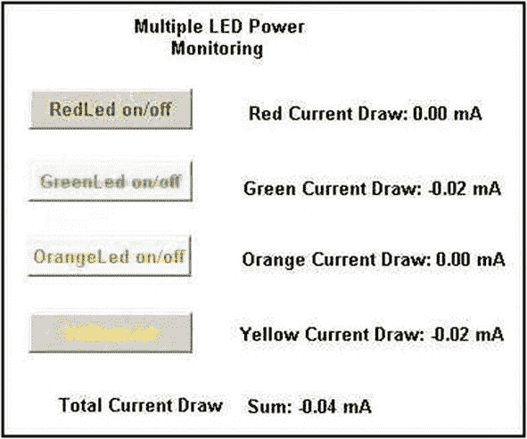

# 二、电源控制、监控和专用图形用户界面的创建

SCADA 首字母缩略词中的“SC”代表监控，而“DA”代表数据采集。开发完整软件包(如 DAQFactory)的目的是监控真实世界的机电过程并监督或控制其运行。本章及其练习通过创建多个 LED 按钮，然后监控激活这些单独的 LED 所消耗的功率，对单按钮控制进行了扩展。因此，展示了响应于一个或多个单元操作激活的控制系统输入的过程操作值的读取。

led 的各种尺寸、构造方法、预期用途和颜色会导致其半导体结上的不同压降，详见“实验”部分。每个具有固定标称值的限流电阻(CLR)都有自己独特的电阻值，该电阻值在该类型器件的标准值容差范围内(即+/-10、5 或 1%)。当负载电阻变化与二极管压降和 CD4050 缓冲器的导通电阻结合起来考虑时，很明显，流经不同颜色 LED 电路的每个电流都是不同的。

表 2-1

典型 5 毫米 LED 参数

<colgroup><col class="tcol1 align-left"> <col class="tcol2 align-left"> <col class="tcol3 align-left"> <col class="tcol4 align-left"></colgroup> 
| 

二极管颜色

 | 

典型电压降(V)

 | 

波长(纳米)

 | 

电流(毫安)

 |
| --- | --- | --- | --- |
| 红色 | 1.63–2.03 | 610–760 | Thirty |
| 格林（姓氏）；绿色的 | 1.9–4.0 | 500–570 | Twenty-five |
| 柑橘 | 2.03–2.10 | 590–610 | Thirty |
| 黄色 | 2.10–2.18 | 570–590 | Thirty |
| 蓝色 | 2.48–3.7 | 450–500 | Thirty |
| 白色的 | 2.48–3.7 | 450–500 | Thirty |
| 紫罗兰 | 2.76–4.0 | 400–450 | Thirty |
| 紫外线的 | 3.1–4.4 | < 400 | Thirty |

本练习将测量不同颜色的发光二极管点亮所产生的单个电流，并通过监控单个操作和整个系统的功耗来提供关于整体系统性能的信息。

许多电子参考文献和科学中的 *Arduino 测量中介绍了几种方法，可用于使用电流表、静电计、感应或霍尔效应设备测量直流电流。然而，在手稿的介绍阶段，为了便于实施，电阻压降测量和欧姆定律计算将用于监控通过被测系统的电流。*

## 实验的

发光二极管(LED)的电流、电压、电阻和发光度特性可以根据欧姆定律和基尔霍夫电压定律更好地理解。

如图 [2-1](#Fig1) 所示，led 以各种形式制造。


图 2-1

各种形式的 LED

图 [2-1](#Fig1) 所示为一个 10 毫米绿色、一个 5 毫米蓝色和一个 3 毫米红色 LED 通孔装置。(led 有扁平、条形和表面贴装三种配置，如 Arduino 或 Raspberry Pi 电路板的任何照片中所示。为了便于使用第 [1](01.html) 章、图 [1-1](01.html#Fig1) 中所示的原型板进行实验设置，最好使用双引线 led。)图 [2-1](#Fig1) 底部的星形圆盘是一个 3 瓦的照明二极管。顶部的三个指示器型器件可以由计算机或 USB 设备供电，但设计用于照明或照明服务的底部二极管通常消耗足够的电流，以保证用螺栓连接到散热器，因此在使用时通常需要一个特殊的高电流电源，远远超过计算设备的电流能力。

根据发光二极管产生的光的类型，它们通常被分类为指示器或照明器。指示器通常产生从各个角度可见的有色物体的漫射光，而照明器通常具有透明体，产生纵向或直接在装置前方最强的集中光束。LED 亮度以毫坎德拉(mcd)或辐射强度来衡量。一根普通的蜡烛发出大约 1 坎德拉的光。

表 [2-2](#Tab2) 和 [2-3](#Tab3) 是 LED 数据表上常见的电气和光学参数的典型列表。

表 2-3

典型 LED 光学参数

<colgroup><col class="tcol1 align-center"> <col class="tcol2 align-center"></colgroup> 
|  |

表 2-2

典型 LED 电气参数

<colgroup><col class="tcol1 align-center"> <col class="tcol2 align-center"></colgroup> 
|  |

查阅数据手册获取信息时，务必验证所检索的数据是否适合手边的正确封装尺寸。在选择 LED 电路中使用的电流时总是需要折衷，因为电流越高，光越亮，设备的使用寿命越短。数据手册中的列表给出了典型工作电流、短时最大电流和较长使用寿命的工作电流。

数据手册中也给出了二极管的光学特性，包括发射光的频率或波长、二极管压降以及给定二极管电流下的光输出亮度。

为了避免损坏实验应用中使用的二极管，限流电阻(CLR)与 LED 串联。电源的电压必须足够高，以打开 LED，电源电压和二极管电压之间的差值可以通过限流电阻下降，以调节指示器或照明电路中的电流。(基尔霍夫电压定律指出电路周围的总电压降为零，欧姆定律可以用来确定调节 LED 电路中的电流所需的电阻值。)

使用欧姆定律的理论计算和典型 5 mm LED 的数据表明，200ω电阻应足以限制我们电源标称电压的电流。作者的 6 V AA 电池电源和 30 mA 亮源二极管表明，6V/30mA = 200ω电阻足以保护二极管和 CD4050 缓冲器(见图 [2-2](#Fig2) )。最接近的较大标准值电阻为 220ω，使用 5%容差元件，我们选择四个元件用于本练习。用数字伏特-欧姆表，我们测量四个电阻的单个值并记录数据。为方便简单起见，电阻以 LED 颜色命名。在作者的开发工作中，红色为 221ω，绿色为 219ω，黄色为 216ω，橙色为 216ω。确保识别单个电阻并记录其实际电阻值，因为计算单个负载电流时需要这些数值。

## 五金器具

四个各种颜色的明亮发光二极管和四个测量电阻 220ω的标准电阻器，对于预期的电流具有足够的额定瓦数，在练习的开发中使用。(标注的值基于作者的实验设置，使用标称 6 V 电源和 30 mA 二极管。)

在本练习中，CD4050 IC 缓冲芯片上可用的六个门电路中的四个用于将 led 与 USB 隔离，并从辅助电源获取电能。

一个扁平的矩形电池组，能够容纳四个串联的 AA 电池，为安装在原型板上的实验组件提供标称 6 伏电源。(有关使用电池作为辅助电源的更多详细信息，请参见“讨论”)。

图 [2-2](#Fig2) 显示了本练习的电路图。为了测量流经单个 LED-电阻器串联组合的电流，使用了 LabJack U12 的模拟输出和输入信号端子。


图 2-2

四 LED 显示屏的电路

## 软件

总共需要八个通道。四个配置为输出，以控制 led 的电源开关，四个通道监控单个测量值负载电阻上的电压。

输出通道可以像上一练习中一样标记为红色、绿色等。输入通道标记为 RedLedCurrent、GreenLedCurrent 等。本项目练习的 DAQFactory 通道表如图 [2-3](#Fig3) 所示。


图 2-3

DAQFactory 通道表

## 需要页面组件

如图 [2-4](#Fig4) 所示，四个按钮、五个变量值组件(VVC)和两个文本显示被放置在屏幕上，以形成所需控制屏幕用户界面的基本结构。

(DAQFactory 手册提供了有关创建屏幕组件、将它们定位在屏幕上以及创建文本标签和消息的详细信息，这些标签和消息用于识别不同的组件以及输入或显示的值。根据手册，一组独立的屏幕组件可以组合在一起，形成一个单一的单元，便于在屏幕上操作。单独的成组组件可以以独特的背景颜色显示，以向终端用户或操作过程控制器提供视觉上可理解的控制屏幕。将相关的组件组合在一起，并用单独的彩色背景将它们隔离，以吸引眼球，从而增加易用性，同时最大限度地减少操作人员出错的机会，这是一个好的设计。组背景的着色应在应用程序中实际使用之前留给控制屏幕的最终配置，因为背景颜色面板的创建会限制对组中各个组件的访问，从而在系统开发过程中造成不必要的复杂性。)


图 2-4

所需 GUI 组件的初步组装

四个按钮中的每一个都根据被激活的 led 的颜色进行标记，并且相应的变量值元件被设置为显示电流的 mA。第五个变量值显示可设置为显示总电流，单位也是毫安。

图 [2-5](#Fig5) 显示了电源监控面板，图 [2-6](#Fig6) 显示了彩色按钮电源输入的典型表示。


图 2-6

电源监控 GUI 的典型计算表达式



图 2-5

GUI 的初步着色

变量值表达式使用以下计算:

(RedLedCurrent [0]/221)*1000

其中，RedLedCurrent [0]是红色二极管限流电阻上的最新电压读数，221 是红色二极管限流电阻的实际 DVM 测得电阻值(单位为欧姆)，*1000 乘法器将电流从小数安培转换为整数毫安。

总分量显示中的表达式将所有四个单独的当前表达式计算相加。

## 观察、测试和开发

一个或多个发光二极管的激活应该指示流过单个二极管的电流和汲取的总电流。显示屏上的值应该每秒更新一次，因为这是频道表中定时条目的默认值。通过在面板上控制按钮的左侧添加 LED 符号，可以创建视觉效果更好的彩色 LED 控制面板。LED 符号可以设置为被激活的 LED 的相应颜色，整个组件组合在一起形成一个连贯的单元，如图 [2-7](#Fig7) 所示。面板组件用于为分组提供背景(参见 DAQFactory 手册)，识别号显示在分组面板上，将面板与显示在主显示屏底部的一组注释/说明联系起来，下面的面板可能是其中的一个组件。


图 2-7

电源监控图形用户界面

使用图 [2-8](#Fig8) 所示的 DAQFactory 线性规组件，可以实现不同的、或许更有效的功耗视觉显示。


图 2-8

仪表添加选项

如果线性仪表组件设置为通过将四个单独的彩色 LED 电流相加来显示消耗的总电流，它可以放在按钮控制面板旁边，以更直观全面的格式显示电源消耗的总电流。

## 讨论

新 AA 碱性电池的额定电流通常为每单位 2890 毫安时。如果所有四个 led 都亮起，则每个 led 消耗约 30 mA，这表明在作者的设置中，6 伏四电池支架的有效使用寿命约为 100 小时。估计 100 小时的使用寿命实际上是理论上的，必须认识到，发光二极管的压降约为 2 伏，电阻的压降约为 2 伏，CD4050、其余的接线以及电池本身的内阻占用了作者的标称 6 伏电源的剩余部分。在估计的 100 小时寿命之前的某个时间点，电池组的电压输出将下降到二极管太暗而看不见或根本不发光的程度。文献表明，原电池碱性化学电池以某种程度上线性的方式放电，随着使用量的增加，电压和电流输送能力都损失了。镍金属氢化物(NiMH)等二次电池化学电池的开路电压(OCV)明显低于一次电池系统(1.2 对 1.5 V)，AA 型号的额定容量略低于 2500 mAh。然而，二次电池 NiMH 化学电池倾向于具有低得多的电压损失率，并且不是在其整个放电过程中逐渐失效，而是将所输送的电压保持在相对恒定的值，然后随着其电力耗尽，在非常短的时间内快速且完全地放电。使用电池供电的研究人员应该了解不同电池系统的特性。(碱性 AA 电池的 6 伏电压由 4 个单元提供，但镍氢电池的标称 6 伏电压需要 5 个可充电单元。)

很明显，对于电池组，随着电源上的负载增加，电压下降，并且提供给单个电流消耗负载的电流将减少。无论使用碱性电池还是镍氢电池，当每个二极管导通时，输送到每个二极管的电流都会下降。当绿色、橙色和黄色二极管被激活时，电源监控面板将显示红色 LED 消耗的电流减少。在更关键的现场或实验室操作中，为了最大限度地减少负载增加时的功率下降，可能需要稳压电源、并联电池组或更大的电池形式，如 C 或 D 电池，以维持实验负载下的电流和电压水平。

由面板显示器监控的逐渐减小的电流是从电池组输送的功率的实时指示器，并且逐渐减小的电流可以用于粗略估计电源剩余的使用寿命。

一般来说，可以说新的一次电池或新充电的二次电池将表现出最小的内阻，该内阻随着电池放电逐渐上升到最大值。充电监控可以通过确定开路电压(OCV)和电池单元本身的内阻来完成。OCV 是在空载条件下测量的，但电池组内阻的确定是一个动态过程，需要同时记录消耗的电流和瞬时电路电压。通过图形记录 I 和 V 的同时变化率，可以确定电池的电阻 R。绘制电池的 OCV 和内阻可以用来确定电池组的剩余使用寿命。(参见 *Arduino 科学高级技术*中的供电实验。)

使用价格低得多的微控制器可以减少功耗问题，该微控制器可用于开发类似于全功能工业级 LabJack DAQ 的实验接口。然而，需要大量的时间和精力来将手头任务的一部分功能实现到内置于市场上可买到的 HMI 设备中的微控制器中。为了用微控制器实现电源控制 GUI 练习，将介绍涉及 DAQFactory 和微控制器程序配置的基本步骤。(详见第 [11 章](11.html)。)

与上一次使用 LabJack 的实验一样，从 lab 5%容差电源中选择四个标称值为 220ω的电阻，并用 DVM 测量其实际电阻。为了简化和便于组装，已知值电阻直接安装在原型板上，没有 CD4050 缓冲器，如图 [2-9](#Fig9) 和图 [2-12](#Fig12) 所示。


图 2-9

一组 led 的 Arduino 控制的 DAQFactory GUI 开发

为了使 DAQFactory 通过串行通信端口识别微控制器并与之通信，必须识别微控制器使用的 com 端口。通过在主机和微控制器之间连接 USB 电缆并启动微控制器集成开发环境(IDE)程序，可以在工具菜单的端口:条目中找到端口标识。识别端口后，通过加载并运行文件/examples/01 中的“Blink”程序来确认连接和板功能。IDE 的基础/闪烁菜单。微控制器的板载 LED 应以每秒一次“闪烁”的速度闪烁，从而确认通信链路。(板载 LED 是“RedBoard”徽标框旁边的发光绿点，如图 [2-12](#Fig12) 中描绘的红色电路板的左下角所示。)

DAQFactory 程序中的公共控制屏幕可以服务于 LJ DAQ 或微控制器实验接口。然而，图 [2-3](#Fig3) 中的通道配置使用的是已经为其编写了驱动软件的 LabJack U12 设备。必须在 DAQFactory 环境中创建一个新设备，以便将数据传输到微控制器上的低级通信端口。一个典型的低成本微控制器是“red board”Arduino 兼容设备，见第 [1](01.html) 章图 [1-1](01.html#Fig1) 中的第 4 项，以及图 [2-12](#Fig12) 中的有线配置。DAQFactory com 设备是通过选择端口和协议创建的。(参见第[章 11](11.html) 、图 [11-4](11.html#Fig4) 、 [11-5](11.html#Fig5) 和 [11-6](11.html#Fig6) 。)

在 DAQFactory 程序的通道创建表中出现可识别设备之前，必须先创建该设备。在 DAQFactory 页面上选择快速➤设备配置条目，将弹出设备配置窗口，其中包含可用设备列表和新的串行(RS232/485) /以太网(TCP/IP)设备条目。(参见图 [11-4](11.html#Fig4) ，章 [11](11.html) 。)要创建新的串行设备，请单击新的串行(RS232/485) /以太网(TCP/IP)设备条目以将其高亮显示，并单击窗口右上角的选择按钮以调出以太网/串行设备配置窗口。(参见图 [11-5](11.html#Fig5) ，章 [11](11.html) 。)在配置窗口中，输入新的设备名称。(数据工厂名称必须以字母开头，并且只能包含字母、数字或下划线。)正在使用的设备被命名为“ardyRb ”,作为 RedBoard 和 Arduino 的助记符。要创建新的串行端口，请单击“新建串行端口”按钮，弹出串行端口配置窗口。(参见图 [11-6](11.html#Fig6) ，章节 [11](11.html) 。)

端口的名称部分是通过查询 Arduino 的通信端口号来定义的，该端口号被发现是 com 端口 4，因此诸如 COM4 之类的名称将足以作为新的连接名称。DAQFactory 配置表中的串行端口号条目必须为 4，以与连接的微处理器的串行端口号相对应。(参见第[章 11](11.html) ，图 [11-6](11.html#Fig6) 。)串行端口配置窗口的其余默认设置最好按输入的那样接受，并且当单击窗口保存按钮时，复选框“COM4”应该出现在以太网/串行设备窗口的串行端口列表中。必须为正在创建的设备分配一个协议，因为数据流是由 DAQFactory 序列或脚本控制的，所以选择空协议。空或无协议允许使用序列中的低级通信功能。选择协议并选中“COM4”框，当单击以太网/串行设备窗口右上角的 OK 按钮时，可以保存“ardyRb”设备以供需要时使用。

为了开发具有更简单的微控制器接口设备的电源监控设施，同时坚持从简单系统开始并逐步发展到更复杂系统的基本概念，最初将从 DAQFactory 中的控制屏幕控制单个 Arduino 供电的 LED。然后，单个 LED 可以扩展为一组四个 LED。LED 按钮控制的最简单形式是在 DAQFactory 控制屏幕上创建两个按钮，如图 [2-10](#Fig10) 左上角所示。


图 2-10

用于控制 Arduino LEDs 的 DAQFactory GUI

DAQFactory 通常运行在基于 PC 的计算平台上，而 ATmega328 芯片则托管 Arduino 操作系统。这些程序可以通过串行端口软件相互通信，但是一次只有一个程序可以使用串行端口。实际上，DAQFactory 显示中的“屏幕图标”的视觉激活启动了到串行端口的低级命令流。串行端口的另一端是 ATmega328 控制的 Arduino 微控制器，它基本上运行在 C 语言上，可以通过编程来处理串行端口上出现的低级命令。

在图 [2-10](#Fig10) 中，顶部的两个按钮是“红色 led 开启”和“红色 led 关闭”图标。这两个按钮按照第 [1](01.html) 章的说明在屏幕上配置，在点击“红色 led on”按钮时可能启动的动作列表中，如第 [1](01.html) 章的图 [1-11](01.html#Fig11) 所示，选择“快速序列”。快速序列选择调出如图 [2-11](#Fig11) 所示的窗口。


图 2-11

快速序列窗口

快速序列条目的独特之处在于，只有当它所绑定的按钮被激活时，它才被访问和执行。图 [2-11](#Fig11) 中的单行代码是将字符 1 写入串行端口的完整序列。

DAQFactory 串行端口通过硬件和软件连接到 USB，USB 也通过硬件和软件连接到 Arduino 的基于 C 的操作系统。这两种软件系统都具有处理低级通信的设施，这些通信是基于比特和字节格式的字符的串行发送和接收。

在图 [2-10](#Fig10) 和 [2-11](#Fig11) 的简单例子中，在激活“红色 led on”按钮时，十进制表示数值 1 的 ASCII(美国信息交换标准代码)值 49 被发送到串行监视器。

Arduino 程序被称为草图，用于接收串行端口上的“1”字符和打开数字引脚的代码在清单 [2-1](#PC1) 中(本章末尾的“代码清单”部分提供了所有代码清单)。检查清单 [2-1](#PC1) 会发现代码将在串行端口上接受一个 0，一个 ASCII 码 48，并关闭 LED。双按钮控制方案简单明了，使用一张草图来管理两种可能的 LED 功率水平。

在控制屏幕的第二行中有一个标记为“切换红色 led”的按钮，该按钮在第一次点击时打开 led，在第二次点击时关闭。清单 [2-2](#PC2) 中的 Arduino 草图包含标志变量“oofR”形式的“切换动作”逻辑，记录 LED 的状态为开或关，从而使代码能够切换或改变设备的当前电源状态。

控制屏幕左下角的四个彩色按钮将电源控制功能扩展到四个按钮，Arduino 代码如清单 [2-3](#PC3) 所示。

控制屏幕上的每个彩色按钮都与一个快速序列动作相关联，该动作将 R、G、O 或 Y 字符写入串行监视器。在连接的 Arduino 端，代码将到达串行端口的新字符与称为“case”结构的四个字符的集合进行比较。当找到匹配时，执行与所识别的“案例”相关联的代码。在清单 [2-3](#PC3) 中，动作包括打开或关闭对应于 DAQFactory 控制屏幕按钮颜色的彩色 LED。

图 [2-10](#Fig10) 中的控制屏幕包含七个屏幕图标，称为变量值组件，可用于提供过程值的可视化数字显示或读数。

该练习旨在演示设备的远程激活，并测量活动设备消耗的电流形式的过程变量。清单 [2-4](#PC4) 、 [2-5](#PC5) 和 [2-6](#PC6) 列出了可用于单向传递动作发起请求并传回结果效果的快速序列代码。清单 [2-6](#PC6) 是一个较短的快速序列 DAQFactory 端方法，用于声明电流已经停止。

Arduino 微控制器配备了一个 6 通道、10 位模数转换器(ADC)，能够将 0–5 伏信号转换为 0 到 1023 之间的数字值(2 <sup>10</sup> 或 1024)。当 5 伏特被分成 1024 个单位时，每个数字计数单位产生 4.8828 毫伏。如图 [2-9](#Fig9) 所示，四个二极管压降中的每一个都由 ADC 的模拟输入测量。电压降测量完成后，使用 Arduino 的“serial . println(iRed)；”将计算出的二极管电流写入串行端口将回车换行(CR-LF) ASCII 字符附加到发送到串行端口的二极管电流值字符的格式。\013\010 用作描述或识别字符结尾的标记，向 DAQFactory 快速序列数据解析逻辑提供测得的二极管电流数值。

清单 [2-9](#PC9) 和 [2-10](#PC10) 是 DAQFactory 快速脚本，当图 [2-10](#Fig10) 左下角的四个面板中的一个或多个彩色按钮被激活时运行。每个按钮都有一个快速序列脚本，可清除串行输入缓冲区，并将代表按钮颜色的大写字母和相应的 LED 发送到 DAQFactory 入口或串行端口的内存位置。Arduino 微处理器 C 代码检查从 DAQFactory 控制屏幕发送的字符，并执行所需的操作，将返回数据参数发送到串行端口。清单 [2-7](#PC7) 和 [2-8](#PC8) 是支持 DAQFactory 动作请求的 Arduino 代码。快速序列在发送激活请求后开始延迟，然后开始处理出现在串行端口上的字符。

清单 [2-9](#PC9) 仅处理活动 LED 消耗的电流，而清单 [2-10](#PC10) 处理任何活动 LED 消耗的单个电流和所有活动 LED 消耗的总电流。

这些简单的系统展示了 SCADA 系统的巨大优势之一，即两个计算平台之间的串行通信不需要错误检查或错误处理能力。发送和接收的字符在软件中是固定的，只需要激活屏幕图标即可实现所需的活动和测量。控制屏幕的操作者需要最少的动作，因为不需要数据输入，只需要点击控制屏幕上的正确图标。在电噪声工业或实验环境中，这些简单的程序可能需要错误检查和错误处理能力。

双按钮开/关控制面板尽可能简单，操作员有两种选择来打开和关闭 LED。如图 [2-12](#Fig12) 所示，安装在原型板上的任何二极管的照明提醒操作者系统的状态，以及哪个按钮在改变系统的状态时处于活动状态。


图 2-12

Arduino 控制的四 led 阵列

电流的测量已经自动化，并且在实际实验应用中进行额外的工作，可以验证该过程以确定电流测量的准确性和再现性。

Arduino 和 DAQFactory 程序都有丰富的功能来帮助开发串行通信。串行通信系统非常简单，广泛应用于工业制造和实验研发项目。本练习中使用的两个软件系统都有串行端口窗口，这些窗口允许可视化驻留在串行监视器接口上的数据，并允许研究人员从主机程序接收串行数据或向主机程序发送串行数据。

除了程序之间的串行端口通信之外，Arduino 串行端口还用于许多应用，并且可以从连接到微控制器的多种类型的传感器传输数据。各种可能的测量方法的详细信息可在科学杂志的 *Arduino 测量中找到。*

在图 [2-13](#Fig13) 中，DAQFactory 串行端口已经扩展到测试和监控串行端口上发生的动作。


图 2-13

DAQFactory 串行端口监视器

为了查看运行中的 DAQFactory 串行端口监视器，主机必须运行与所用控制屏幕兼容的微控制器程序。当微控制器程序在最小化或后台配置中运行时，包含控制屏幕的 DAQFactory 程序可以在前台运行，如图 [2-13](#Fig13) 中标记的 1。从“快捷”菜单中选择“设备配置”，出现如图[第 11 章](11.html)图 [11-4](11.html#Fig4) 所示的设备配置窗口。从设备配置窗口的条目中，选择“ardyRb ”;点击窗口右上角的选择按钮，出现“以太网/串行设备”窗口，即图 [2-13](#Fig13) 中的面板 2。输入正确的名称和通信端口后，可激活“监视器”按钮，调出 COM4 的串行端口监视器，在图 [2-13](#Fig13) 中标为面板 3。

激活后，COM4 的串行端口监控器现在控制进出串行端口的数据流。在面板 1 的底层控制屏幕上仍然可见的两个按钮不再响应，并且只有通过将二极管颜色的正确的大写首字母发送到串行端口，才能激活 Arduino 阵列上的相应二极管。从面板 3 的活动记录中可以看出，记录为“Tx R”的 R 的传输之后是脚本 Rx 10.69\013\01010.69\013\010。Rx 是“接收到一个传输”的符号，10.69 是一个数字序列，附加了 ASCII 码 013(回车)和 010(换行符)。紧接在换行符号之后的是一个数字序列，它再次附加了一对打印指令。

如前所述，Arduino 代码已识别 R 并激活红色二极管，发回单个二极管电流和总电流，两个数值后跟 CR-LF 组合。如果一个大写的 O 被发送到端口，预期的动作发生；如果在大写字母 O 仍位于发送区间时使用 Enter 键，Arduino 代码将触发橙色二极管，如面板 3 所示。

如前所述，用非常便宜的微控制器板代替工业研究级接口是一种实践，可以利用显著增加的开发时间作为实践学习的优势。

## 使用 Raspberry Pi 进行电源监控和控制

对于不熟悉 Raspberry Pi (RPi)教育计算机及其通过通用输入和输出(GPIO)引脚阵列在物理计算中的使用的研究人员、实验人员或教育工作者，有几个文本可供参考。 <sup>[2](#Fn2)</sup> 当前信息和软件可从树莓派基金会在线获得，在尝试以下练习之前应先阅读这些信息和软件。

虽然 Raspberry Pi 单板计算机(SBC)最初是作为一种非常便宜的教学辅助工具，但它可以作为 SCADA 应用程序的物理计算平台使用，但有一些限制。RPi SBC 不具备模数转换功能，但有几种方法可以解决这一电压测量限制。实验传感器的电压可以通过外部 ADC 芯片或与 Arduino 微控制器板的 USB 连接来测量，并通过使用 Python 库和 RPi 来测量已知值电阻-电容串联的时间常数。为 gpiozero Python 库编写的文档指出，RPi 操作系统本身并不完全兼容物理计算的“实时”要求。注意，在诸如 led 之类的设备上使用 GPIO 引脚进行编程脉宽调制(PWM)的尝试可能遭受“抖动”,因为 Pi 操作系统可能涉及减损或干扰脉宽的定时处理的内部过程。

RPi 和 Arduino 微控制器之间的 USB 连接非常类似于前面的 DAQFactory-LabJack 练习中演示的易用性和组装。Arduino 板的成本与 RPi 相当，Arduino 集成开发环境(IDE)可从 Arduino 和 RPi 基金会下载，与 Linux 兼容。通过使用 Arduino 微控制器板作为 RPi 和实验仪器或装置之间的智能接口，可以实现显著的可重复和可预测的物理计算。然而，将 Arduino 微控制器作为 RPi 的智能 I/O 外设的实施涉及到大量的脚本来连接两个系统，这将在下一章的脚本练习中探讨。

在利用 RPi 测量电压并计算电流的各种选项中，最便宜的选项是使用独立的模数转换器(ADC ),如微芯片 MCP3008 集成电路(IC)。IC 芯片成本约为 5 美元(CDN ),是一款 10 位逐次逼近型寄存器(SAR)器件。LabJack、Arduino 和 MCP3008 中使用的 10 位分辨率将输入电压划分为 1024 个量化单位。IC 连接到 RPi GPIO 引脚，如图 [2-14](#Fig14) 所示，并使用 py-spidev Python 库实现的 Python 串行外设接口(SPI)协议。见[拉斯伯里皮。org/documentation/hardware/raspberrypi/spi/README](http://raspberrypi.org/documentation/hardware/raspberrypi/spi/README)了解在 GPIO 引脚阵列上实现 SPI 协议的 RPi 设置说明。


图 2-14

用于 led 电源监控的 RPi 电路

## 实验的

如前所述，RPi 的廉价电压测量能力可以用微芯片技术 MCP3008 来实现。该芯片是一个 16 引脚、塑料双列直插式封装(PDIP)、集成电路、10 位模数转换器。该 IC 有 8 个输入通道，可以用来对电路中相对于公共地的最多 8 个不同点的电压进行数字化处理，或者测量电路中 8 个点之间的最多 4 个差分电压降。(有关数字概念和 10 位或 12 位 ADC 的详细信息，请参见第[章 4](04.html) 、[章 5](05.html) 和[章 6](06.html) ，10 bit = 2 <sup>10</sup> 或 1024，12 bit = 2 <sup>12</sup> 或 4096。)

图 [2-14](#Fig14) 是从 RPi GPIO 阵列到 MCP3008 的连接示意图，以及可用于测量流经彩色二极管的电流的四个通道的示意图。

为了简化图 [2-14](#Fig14) 的图形，GPIO 引脚和 MCP3008 引脚之间的连接线没有画出来。GPIO 阵列左上角引脚上 RPi 的 3.3 V 电源连接到 IC 上的引脚 16 和 14。其余的连接以相同的方式指定和连接。

清单 [2-11](#PC11) 中列出了用于选通(激活)ADC 芯片进行转换，然后读取并显示 10 位电压值的 Python 代码。

与所有复杂的实验系统一样，研究人员从简单的组件开始，测试每个组件并验证其作为独立实体的单独性能。一个复杂的系统是通过一次增加一个部件来组装的，如果可能的话，每次增加一个部件都要对组件进行测试，直到完成一个完整的操作装置。

据报道，RPi 的早期型号设计为在 3.3 V 逻辑电平下提供 3 mA 的输出电流，因此可用的总功耗为 17 引脚× 3 mA = 51 mA。微小的 3 毫米指示灯 led 的最大电流限制为 20 毫安，应在 16–18 毫安范围内工作。5 毫米和 10 毫米 led 汲取 20-40 毫安范围内的电流，为了获得更长的使用寿命，应在低于其最大短期电流处理能力 15-20%的情况下工作。

LED 辐射与流经二极管的电流成正比。数据手册中的电流建议是针对以最大亮度或接近最大亮度工作的器件给出的，实验工作并不总是需要这种亮度。5–10mA 的 LED 电流通常为实验工作提供充足的亮度，可用于避免 GPIO 引脚上的 RPi 电源连接过载。

为了适应 RPi GPIO 引脚提供的有限电流，图 [2-14](#Fig14) 的电路可以用现成的 5 mm 发光二极管、合适的 clr 和单独的手动电源控制开关组装，所有这些在组装期间都设置在打开位置。电源监控练习的初始测试中使用的配置是一组打开的开关。

阵列中的四个 led 应单独测试，然后一起测试，以确认电源供电时它们的亮度。(有关手动激活 LED 的命令行终端方法，请参见第 [1](01.html) 章。)一旦所有 LED 二极管都成功点亮，然后关闭电源，二极管及其 CLR 的连接点连接到 ADC 的适当输入通道。ADC 正确连接到 LED 阵列后，就可以连接 MCP3008 和 RPi GPIO 引脚，并运行 Python 程序。系统的初始输出应该显示每个通道没有输出电流，总和也没有。系统的简单性需要手动操作模式来查看从 LED 照明系统的功率加载和分配得到的数据。由于每个 LED 都是手动打开和点亮的，因此应运行电源监控程序来计算和显示汲取的单个电流及其总和。

通过将流经 led 的电流保持在 12–16mA 范围内，RPi 应该可以轻松地完全点亮三个 led，并能够在短时间内点亮第四个二极管，同时电源监控程序会收集并显示更高的功耗数据。对于使用比 GPIO 引脚更多功率的实验，可以使用一个辅助电源和几个 CMOS 4050 缓冲芯片。

## 观察

本练习的目的之一是向使用 RPi GPIO 引脚为实验装置供电的研究人员传授一种绕过系统限制安全工作的方法。

图 [2-15](#Fig15) 描述了电源监控程序在 Python shell 中的典型输出。


图 2-15

电源监控程序输出的 RPi 显示

检查图 [2-14](#Fig14) 的原理图部分可以发现，限流电阻器(CLR)的测量电阻上的电压降是由流过二极管-电阻器组合的电流引起的。MCP3008 通道用于直接测量接地电阻上的压降，从而间接测量整个电路中的恒定电流。

## 讨论

作为一台教育计算机，Raspberry Pi 不仅能够以信息处理模式运行，还能够作为一个物理计算平台。然而，当用于物理计算模式时，必须认识到紧凑、廉价系统的局限性。简而言之，RPi 操作系统是进程驱动的，如果处理器内核中正在运行更高优先级的进程，它可能不会立即响应 GPIO 引脚上的事件。图形处理是计算资源的一个非常大的消费者，因此当在物理计算模式中使用时，RPi 应该尽可能使用最实用或最小的屏幕显示。

Raspberry Pi Foundation 编写并提供了几个 Python 库，允许计算机与各种硬件设备接口，以扩展与外部设备和传感器的通信，如 MCP 系列模数转换器。

## 代码列表

```c
print("RPi 4 Led Array Power Monitoring Program")
print() # a blank line for output screen spacing
print("ADC reading of LED voltage value is normalized from 0 to 1 by gpiozero library.")
print("The true value of the monitored voltage is the product of the normalized ADC value and the reference voltage.")
print()
# a single normalized value is printed each time the module is run

from gpiozero import MCP3008
# create an object representing the device and assign the input channels
ADC_vlu = MCP3008(0)   # the number in brackets is the channel on the device
ADC_vlu1 = MCP3008(1)
ADC_vlu2 = MCP3008(2)
ADC_vlu3 = MCP3008(3)
#
print("ADC Channel 1")
print('Normalized ADC value = %.3f'%ADC_vlu.value,' Volts') # the blue LED in the author' circuit
#
# convert object, value into a numerical parameter
ledVltg = float(ADC_vlu.value) * 3.3
print('LED CLR voltage value = %.3f'%ledVltg, ' Volts')
# calculate the LED current from Ohms law
blue = (float((ADC_vlu.value) *3.3) / 329) * 1000
print('Blue LED current = %.3f'%blue,' mA')
#
print()
#
print("ADC Channel 2")
print('Normalized ADC value = %.3f'%ADC_vlu1.value) # the yellow LED in the author's circuit
#
# convert object, value into a numerical parameter
led1Vltg = float(ADC_vlu1.value) * 3.3
print('LED1 CLR voltage value = %.3f'%led1Vltg)
# calculate the LED1 current from Ohms law
yellow = (float((ADC_vlu1.value) *3.3) / 220) * 1000

print('Yellow LED current = %.3f'%yellow,' mA')
#
print()
#
print("ADC Channel 3")
print('Normalized ADC value = %.3f'%ADC_vlu2.value) # the red LED in the author's circuit
#
# convert object, value into a numerical parameter
led2Vltg = float(ADC_vlu2.value) * 3.3
print('LED2 CLR voltage value = %.3f'%led2Vltg)
# calculate the LED2 current from Ohms law
red = (float((ADC_vlu2.value) *3.3) / 220) * 1000
print('Red LED current = %.3f'%red,' mA')
#
print()
#
print("ADC Channel 4")
print('Normalized ADC value = %.3f'%ADC_vlu3.value) # the green LED in the author's circuit
#
# convert object, value into a numerical parameter
led3Vltg = float(ADC_vlu3.value) * 3.3
print('LED3 CLR voltage value = %.3f'%led3Vltg)
# calculate the LED3 current from Ohms law
green = (float((ADC_vlu3.value) *3.3) / 219) * 1000
print('Green LED current = %.3f'%green,' mA')
#
print()
#
ttl_Currnt_drw = blue + yellow + red + green

print('Total current draw = %.3f'%ttl_Currnt_drw, ' mA')

Listing 2-11Python Code for the Raspberry Pi Monitoring the Power Draw of a Four-LED Array

```

```c
device.ardyRb.Purge()           // clear the serial buffer
device.ardyRb.Write('R')        // send R to serial port for repeat activation
delay(0.1)                      // allow for code execution
global iRed                     // declare diode current as global variable
global iTotal                   // declare total current as global variable
private string datain1          // declare private variable for 1st data value
private string datain2          // declare private variable for 2nd data value
datain1 = device.ardyRb.ReadUntil(13)     // parse out 1st value
datain2 = device.ardyRb.ReadUntil(13)     // parse out 2nd value
iRed = strToDouble(datain1)          // convert characters to numerical values
iTotal = strToDouble(datain2)        // and assign to declared variables

Listing 2-10Toggle Red LED DAQFactory Quick Sequence with Diode Power Draw

```

```c
device.ardyRb.Purge()      // clear serial buffer
device.ardyRb.Write('R')   // initiate repeat activation
delay(0.1)                 // allow code to execute
global ldCurrnt            // declare global variable in DAQFactory code
private string datain    // define local variable in DAQFactory code
datain = device.ardyRb.readUntil(13)  // parse out character codes for numeric value
ldCurrnt = strToDouble(datain)        // convert character codes to numeric value

Listing 2-9Toggle Red LED DAQFactory Quick Sequence

```

```c
// Toggle leds on/off from DAQFctry button icons on COM4
// The DAQF QS sends an R, G, O or Y to the serial port on com // 4\. On the
 arduino side the status of the appropriate led dp is // determined and
 toggled as required through a switch construct.
//
// power drawn calculations, each led has a CLR and the voltage // on the
 junction of the resistor and led is measured and used to // calculate diode
// current by A0 to A3 respectively. Current calcln only done // when diode activated.
//
const int RedLedPin = 3;            // red led is on dig pin 3
const int GreenLedPin = 4;          // green led on dp 4
const int OrangeLedPin = 5;         // orange led on dp 5
const int YellowLedPin = 6;         // yellow led on d pin 6
//
int oofR = 0;                       // on off flags initialized
int oofG = 0;
int oofO = 0;
int oofY = 0;                      // on off flags initialized
//
char incomingByte = ' ';           // define incoming character
//
float iRed = 0;                    // red led current in decimal float format

float iGreen = 0;
float iOrange = 0;
float iYellow = 0;
float itotal = 0;
//
void setup() {
 Serial.begin(9600);                  // start the serial port
 }
//
void loop()
{
  if (Serial.available())            // check for incoming data
  {
  char incomingByte = Serial.read();   // set char value for switch branching
// Serial.print(incomingByte);         // diagnostic
  switch(incomingByte)                 // branch to desired location/option
  {
  case 'R':                            // Red Led Activation
  if (oofR == 0 ) {
  pinMode(RedLedPin, OUTPUT);          // set pin I/O
  digitalWrite(RedLedPin, HIGH);       // turn led on
  oofR = 1;                            // set flag
  iRed = ((analogRead(A0)* 4.8828)/216);      // calc i when led on
  //Serial.print(analogRead(A0));             // diagnostics
  //Serial.print("iRed = ");                  // diagnostics
  Serial.println(iRed);                       // add CR-LF
  itotal = iRed + iGreen + iOrange + iYellow;     // calculate total power consumption
  //Serial.print("itotal = ");                 // diagnostics

  Serial.println(itotal);                      // add CR-LF
  }
  else {                        // flag is set to 1 so led is on
    pinMode(RedLedPin, OUTPUT); // set pin mode to output
    digitalWrite(RedLedPin, LOW);        // turn led off
    oofR = 0;                            // re-set flag to off
    iRed = 0;                   // turn iRed contribution to itotal off
    Serial.println(iRed);       // send data to DAQFtry
    itotal = iRed + iGreen + iOrange + iYellow;   // calculate total current draw
    //Serial.print("itotal = ");                // diagnostics
    Serial.println(itotal);   // send to serial port with CR-LF
    }
break;
//
case 'G':                              // Green Led Activation
  if (oofG == 0 ) {                    // check status flag
  pinMode(GreenLedPin, OUTPUT);        // set pin I/O
  digitalWrite(GreenLedPin, HIGH);     // turn led on
  oofG = 1;                            // reset status flag
  iGreen = ((analogRead(A1)*4.8828)/215);  // calc diodecurrent
  //Serial.print("iGreen = ");             // diagnostics
  Serial.println(iGreen);              // send data with CR-LF
  itotal = iRed + iGreen + iOrange + iYellow;  // calculate total current draw
  //Serial.print("itotal = ");             // diagnostics
  Serial.println(itotal);                  // send with CR-LF
  }
  else {
    pinMode(GreenLedPin, OUTPUT);      // set pin I/O mode
    digitalWrite(GreenLedPin, LOW);    // turn green led off
    oofG = 0;                          // set green status flag
    iGreen = 0;                        // turn green contributionto total off
    Serial.println(iGreen);         // send green current value with CR-LF
    itotal = iRed + iGreen + iOrange + iYellow;   // calculate total current draw
    //Serial.print("itotal = ");                 // diagnostic
    Serial.println(itotal);   // send total current with CR-LF
  }
break;
//
case 'O':                            // Orange Led Activation

  if (oofO == 0 ) {                  // check status flag
  pinMode(OrangeLedPin, OUTPUT);     // set pin I/O
  digitalWrite(OrangeLedPin, HIGH);  // set pin I/O
  oofO = 1;                        // set orange flag to led on
  iOrange = ((analogRead(A2)*4.8828)/215);  // calculate orange led current draw
  //Serial.print("iOrange = ");             // diagnostic
  Serial.println(iOrange);    // send to serial port with CR-LF
  itotal = iRed + iGreen + iOrange + iYellow;  // calculate total current draw
  //Serial.print("itotal = ");               // diagnostic
  Serial.println(itotal);                    // send total to serial port with CR-LF
  }
  else {                                 // orange led is on
    pinMode(OrangeLedPin, OUTPUT);       // set pin I/O
    digitalWrite(OrangeLedPin, LOW);     // turn orange led off
    oofO = 0;                            // reset orange status flag to off
    iOrange = 0;                    // turn orange contribution to total off
    Serial.println(iOrange);        // send out orange current with CR-LF
    itotal = iRed + iGreen + iOrange + iYellow;   // calculate total current draw
    //Serial.print("itotal = ");      // diagnostics
    Serial.println(itotal);  // send out total current draw with CR-LF
  }
break;
case 'Y':                             // Yellow Led Activation
  if (oofY == 0 ) {                   // led is off
  pinMode(YellowLedPin, OUTPUT);      // set pin I/O
  digitalWrite(YellowLedPin, HIGH);   // turn yellow led on
  oofY = 1;                           // re-set lag to led on
  iYellow = ((analogRead(A3)*4.8828)/217);        // calculate yellow led current
  //Serial.print("iYellow = ");       // diagnostic
  Serial.println(iYellow);            // yellow led value to serial port with CR-LF
  itotal = iRed + iGreen + iOrange + iYellow;     // calculate total current draw
  //Serial.print("itotal = ");                    // diagnostic
  Serial.println(itotal);     // send to serial port with CR-LF
  }
  else {                            // yellow led on
    pinMode(YellowLedPin, OUTPUT);  // set pin I/O mode
    digitalWrite(YellowLedPin, LOW);   // turn yellow led off
    oofY = 0;                  // re-set flag to yellow led off
    iYellow = 0;               // set yellow led current to 0
    Serial.println(iYellow);  // send value to serial port with CR-LF
    itotal = iRed + iGreen + iOrange + iYellow;   // calculate total current and send with CR-LF
    //Serial.print("itotal = ");                  // diagnostic

    Serial.println(itotal);    // send total current with CR-LF
  }
break;
  }
 }
}

Listing 2-8Arduino Sketch for a DAQFactory Four-Button Control Screen and Power Consumption Indicators

```

```c
// Toggle an led on/off from one DAQFctry button icon on COM4
// The DAQF QS sends an R to the serial port on com 4\. On the
// arduino side the status of the RedLed dp is determined and
// toggled as required.
//
const int RedLedPin = 3;            // red led is on dig pin 3
int oofR = 0;                       // power state of red diode
char incomingByte = ' ';            // declare incoming byte
float iRed = 0;                     // red led current
//
void setup() {
  Serial.begin(9600);              // start the serial port
  pinMode(RedLedPin, INPUT);       // must initially read the dig. pin
}
//
void loop() {
  if (Serial.available()) {          // check for incoming data
    char incomingByte = Serial.read();
    //Serial.print(incomingByte);    // diagnostic for code de-bugging
    if (incomingByte == 'R' && oofR == 0) {  // check action required and status
      pinMode(RedLedPin, OUTPUT);      // set pin I/O mode
      digitalWrite(RedLedPin, HIGH);   // turn diode current on
      iRed = ((analogRead(A0) * 4.8828)/216 );  // calculate diode current
      Serial.println(iRed);    // send value to serial port with LF-CR
      oofR = 1;                // set status flag to "diode on"
    }
    else {
      if (incomingByte == 'R' && oofR == 1){   // alternate action toggle to off

      pinMode(RedLedPin, OUTPUT);          // set pin I/O mode
      digitalWrite(RedLedPin, LOW);        // turn power off
      iRed = 0;                   // set red diode current to 0
      Serial.println(iRed);
      oofR = 0;
      }
    }
  }
}

Listing 2-7Arduino Code for Single Button Icon Toggling LED On/Off with Power Measurement

```

```c
device.ardyRb.Purge()        // clear old data from the serial port buffer
device.ardyRb.Write('0')     // write a zero to the serial port to switch led off
delay(0.1)                   // allow code to be processed
global ldCurrnt              // declare individual diode current to be global
ldCurrnt = 0                 // set individual diode current to 0

Listing 2-6Quick Sequence Alternate Code for Off Button

```

```c
device.ardyRb.Purge()     // clear residual data from input buffer
device.ardyRb.Write('1')     // write to serial port
delay(0.1)                   // delay to allow processing
global ldCurrnt              // declare variable to be visible throughout
                             // DAQFactory program
private string datain        // declare datain variable
datain = device.ardyRb.readUntil(13)    // parse data up to line feed and carriage return
ldCurrnt = strToDouble(datain)       // convert character to numeric value

Listing 2-5Quick Sequence Code for On Button

```

```c
// Arduino code for a single led illumination on the red board // Arduino
 the pgm waits for an incoming character on com port 4 // if a 1 the led is turned on
// if a 0 it is turned off.
// A0 is wired to Rd led junction and the Arduino calculates // the led current and
 prints the value to the serial port.
//
const int RedPin = 3;  // red board dig. pin with red led and clr
int incomingByte;     // a variable to hold incoming byte
float iRed = 0;       // the led current through the CLR
//
void setup() {
  Serial.begin(9600);                  // start the serial port
  pinMode(RedPin, OUTPUT);             // set the pin function
}
void loop() {
  if(Serial.available()> 0) {     // check port for last data byte
  incomingByte = Serial.read();   // read serial port value
  if (incomingByte == '1') {      // if is 1, turn the led on
    digitalWrite(RedPin, HIGH);   // set I/O of pin
  // calculate led current and print to the serial port
  iRed = ((analogRead(A0) * 4.8828 )/216);
  Serial.println(iRed);    // note the line feed indication to append 013\010
// to the transmitted character to aid in the DAQFactory parsing of the incoming code

.
  }
  //
  if (incomingByte == '0') {
    digitalWrite(RedPin, LOW);        // if 0, turn the led off
  // calculate led current and print to the serial port
  iRed = ((analogRead(A0) * 4.8828 )/216);  // ensures the LED is off
  Serial.println(iRed);   // \013\010 for DAQFactory parsing code
  }
  }
}

Listing 2-4Arduino Sketch to Turn Red LED On or Off and Measure the Diode Current Draw for Display on the DAQFactory Control Screen

```

```c
// Toggle leds on/off from DAQFctry button icons on COM4
// The DAQF QS sends an R, G, O or Y to the serial port on com 4\. // On the
arduino side the status of the appropriate led // dp is determined and
toggled as required through a switch construct.
//
const int RedLedPin = 3;           // red led is on dig pin 3
const int GreenLedPin = 4;         // green led on dp 4
const int OrangeLedPin = 5;        // orange led on dp 5
const int YellowLedPin = 6;        // yellow led on d pin 6
//
int oofR = 0;                      // on off flags initialized
int oofG = 0;
int oofO = 0;
int oofY = 0;                      // on off flags initialized
//
char incomingByte = ' ';           // define incoming character
//
void setup() {
 Serial.begin(9600);               // start the serial port

 }
//
void loop()
{
  if (Serial.available())          // check for incoming data
  {
  char incomingByte = Serial.read();  // set char value for switch branching
  Serial.print(incomingByte);   // diagnostic for use in debugging code
  switch(incomingByte)       // branch to desired location/option
  {
  case 'R':                     // Red Led Activation
  if (oofR == 0 ) {             // check status flag
  pinMode(RedLedPin, OUTPUT);   // set pin I/O
  digitalWrite(RedLedPin, HIGH);            // turn led on
  oofR = 1;                                 // re-set flag
  }
  else {                       // flag is set to 1 so led is on
    pinMode(RedLedPin, OUTPUT);       // set pin mode to output
    digitalWrite(RedLedPin, LOW);     // turn led off
    oofR = 0;                         // re-set flag to off
  }
break;
//
case 'G':                             // Green Led Activation
  if (oofG == 0 ) {                   // check status flag
  pinMode(GreenLedPin, OUTPUT);       // set pin I/O
  digitalWrite(GreenLedPin, HIGH);    // turn led on
  oofG = 1;                           // reset status flag

  }
  else {
    pinMode(GreenLedPin, OUTPUT);
    digitalWrite(GreenLedPin, LOW);
    oofG = 0;
  }
break;
//
case 'O':                              // Orange Led Activation
  if (oofO == 0 ) {
  pinMode(OrangeLedPin, OUTPUT);       // set pin I/O
  digitalWrite(OrangeLedPin, HIGH);
  oofO = 1;
  }
  else {
    pinMode(OrangeLedPin, OUTPUT);
    digitalWrite(OrangeLedPin, LOW);
    oofO = 0;
  }
break;
case 'Y':                              // Yellow Led Activation
  if (oofY == 0 ) {
  pinMode(YellowLedPin, OUTPUT);       // set pin I/O
  digitalWrite(YellowLedPin, HIGH);
  oofY = 1;
  }
  else {

    pinMode(YellowLedPin, OUTPUT);
    digitalWrite(YellowLedPin, LOW);
    oofY = 0;
  }
break;
 }
  }
  }

Listing 2-3Arduino Sketch to Toggle Multiple Colored LEDs from a DAQFactory Control Screen

```

```c
// Toggle an led on/off from one DAQFctry button icon on COM4
// The DAQF QS sends an R to the serial port on com 4\. On the
// arduino side the status of the RedLed dp is determined and
// toggled as required.
//
const int RedLedPin = 3;      // red led is on dig pin 3
int oofR = 0;                 // power state of red diode
char incomingByte = ' ';      // declare incoming byte
//
void setup() {
  Serial.begin(9600);         // start the serial port
  pinMode(RedLedPin, INPUT);    // must initially read the dig. pin
}
//
void loop() {
  if (Serial.available()) {          // check for incoming data
    char incomingByte = Serial.read();       // read the port
    //Serial.print(incomingByte);            // diagnostic
    if (incomingByte == 'R' && oofR == 0) {  // check flag for led status
      pinMode(RedLedPin, OUTPUT);         // set pin for output
      digitalWrite(RedLedPin, HIGH);      // if off turn on
      oofR = 1;                           // set status flag

    }
    else {
      if (incomingByte == 'R' && oofR == 1){ // check flag for led status
      pinMode(RedLedPin, OUTPUT);            // set pin mode
      digitalWrite(RedLedPin, LOW);          // turn led off
      oofR = 0;                              // set status flag
      }
    }
  }
}

Listing 2-2Arduino Sketch for Toggling the Red LED on the Arduino RedBoard from the DAQFactory Single-Button Control Screen

```

```c
// Arduino code for a single led illumination on the red board // Arduino
 the pgm waits for an incoming character on com port 4, // if a 1 the led is turned on
if a 0 it is turned off.
const int RedPin = 3;    // red board dig. pin with red led and clr
int incomingByte;      // a variable to hold incoming byte
//
void setup() {
  Serial.begin(9600);            // start the serial port
  pinMode(RedPin, OUTPUT);       // set the pin function
}
void loop() {
  if(Serial.available()> 0) {      // check port for last data byte

  incomingByte = Serial.read();  //
  if (incomingByte == '1') {     // if is H (ASCII 72), turn the led on
    digitalWrite(RedPin, HIGH);
  }
  if (incomingByte == '0') {
    digitalWrite(RedPin, LOW);   //if L (ASCII, 76), turn the led off
  }
  }
}

Listing 2-1Arduino Code for a Two-Button On and Off Control Screen

```

## 摘要

*   开发了能够在外部实验中激活多个组件并显示来自该实验的数据的交互式控制面板 GUI。

*   微控制器可以与强大的工业预配置 SCADA 系统一起使用，或者与容易获得的廉价元件和适当的编程一起使用。

*   在第 [3](03.html) 章，将会介绍更详细的脚本和编程技术。

<aside aria-label="Footnotes" class="FootnoteSection" epub:type="footnotes">Footnotes [1](#Fn1_source)

1) *建筑科学仪器*第四版。，Moore，Davis 和 Coplan，剑桥大学出版社，ISBN 978-0-521-87858-6 精装本

2) *电子艺术*第二版 Edn。，Horowitz 和 Hill，剑桥大学出版社，ISBN 13 978-0-521-37095-0 精装本

3) *发明家实用电子学*第三版 Edn。，谐谑曲与蒙克，麦格劳希尔，ISBN 978-0-07-177133-7

  [2](#Fn2_source)

1) *树莓派用户指南*，厄普顿和哈尔法克里，约翰威利父子公司，ISBN 978-1-11846446-5

2) *实用树莓派*，霍兰，阿普瑞斯，ISBN 978-1-4302-4971-9

3) *用 Linux 学习 Raspberry Pi*，Membrey and Hows，Apress，ISBN 978-1-4302-4821-7

 </aside>