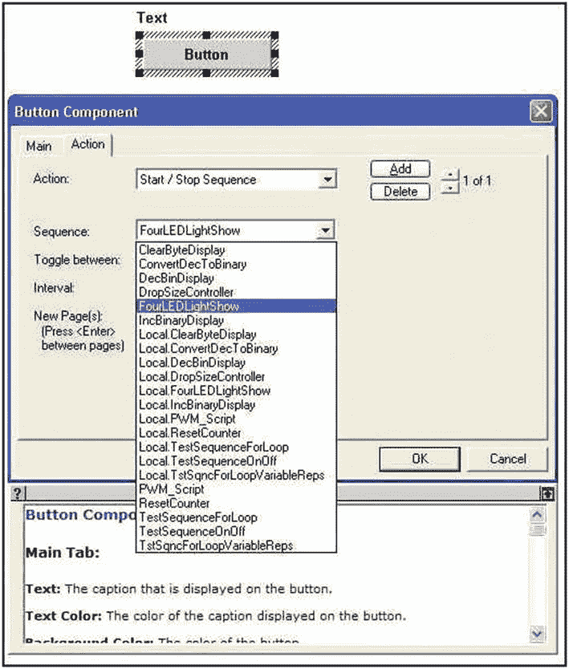
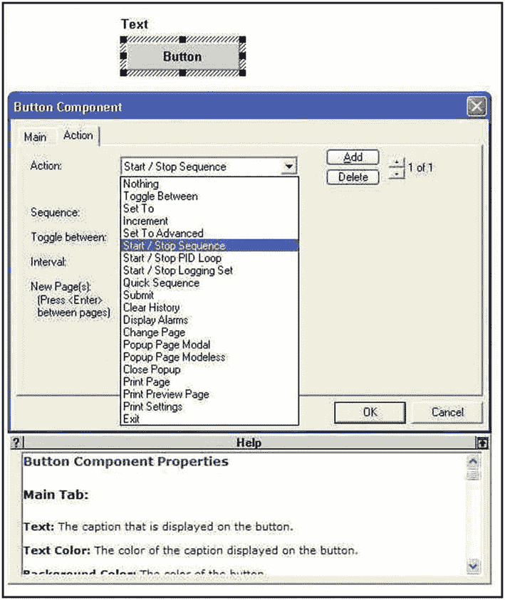
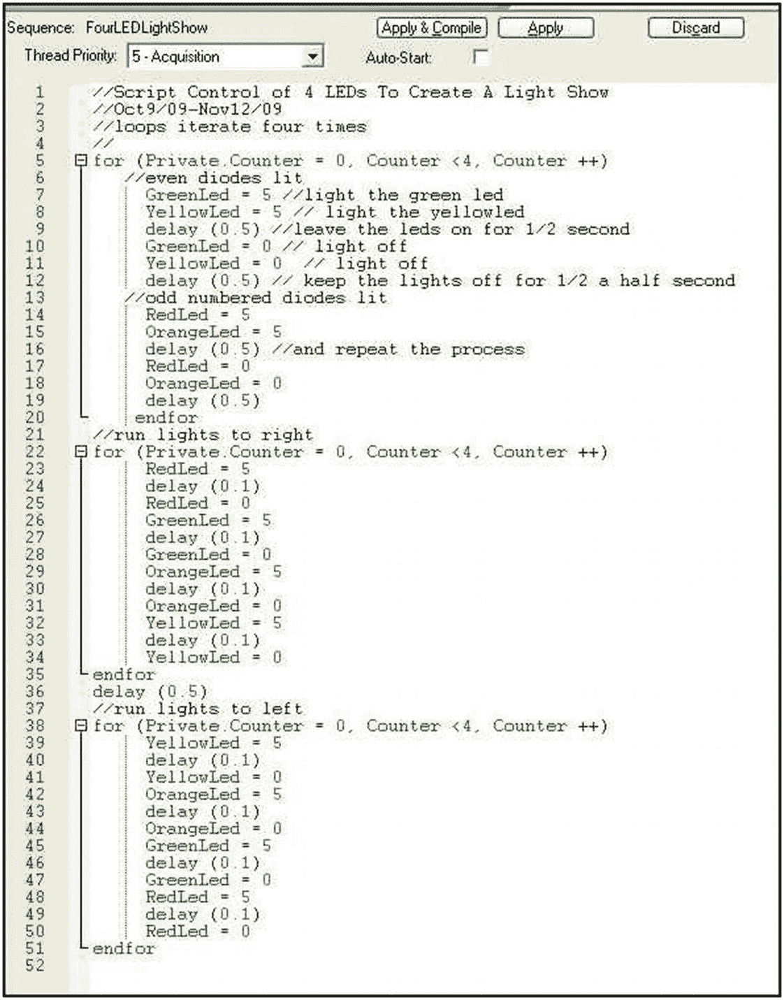
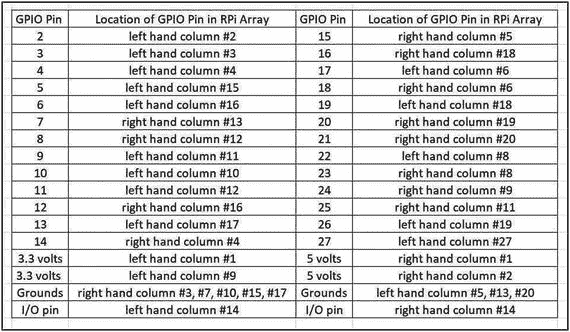

# 三、脚本简介

SCADA 是一个工业概念，其中收集关于活动过程的信息，然后用于监视和控制该操作。在工业规模的应用和这些科学测量实验中，脚本允许过程控制或数据采集的自动化。在本章中，在 DAQFactory (DF)软件中汇编成称为序列的小程序的代码将用于控制和监控在前面练习中装配在试验板上的 led 电路。

DF 用户手册指出，用于创建序列的脚本语言语法类似于大多数标准语言，如 C、Python、Visual Basic、Pascal 和其他语言(如 Fortran)的变体。

前面关于通道命名的符号也适用于 DF 中使用的脚本语言。该语言区分大小写，因此在命名通道、变量、脚本和页面时避免键入错误和拼写不匹配非常重要。建议使用 C 风格的命名或变体，如这些 MySpecialName、My_Special_Name、My_Spcl_Nm 和 MySpclNm 示例中所示。选择有表现力和有意义的名字以减少错误。

强烈建议使用注释和代码段缩进形式的文档，以使脚本代码清晰易懂。当 Tab 键被按下时，用于创建序列的 DAQFactory 代码编辑器缩进，一条垂直虚线描述代码块。其他研究人员必须能够遵循代码脚本和复制任何科学工作。

可用于脚本序列的数学运算在 DAQFactory 软件手册的“表达式”一节中有所描述表达式是从一些初始值计算结果的公式。在之前的练习中，变量值屏幕组件中使用了表达式来计算单个彩色 LED 电流和汲取的总电流。

与大多数语言一样，变量或数组在序列脚本中使用之前，必须用声明语句声明，有适当的名称，并创建实例。

对于大多数研究人员来说，创建和运行编程或脚本代码所需的技能最好通过实践来培养。几乎所有当今广泛使用的流行编程语言都可以通过大量的在线教程来学习。教程和语言文档可以以研究者感到舒适的速度复习和练习。DAQFactory 手册有一个介绍性的教程和一个详细的文档，当研究人员开发 DAQFactory 序列代码的脚本时，应该将它们放在手边作为参考。

## 实验的

一旦机电系统配置完成，硬件在试验板上得到验证，请不要犹豫，在全新的 DAQFactory 页面上尝试脚本代码。科学本质上是实验性的，这篇手稿有望帮助掌握物理计算的基础知识，并尽快应用它们进行实验测量。

### 五金器具

使用之前练习中的多色 LED 电路作为过程操作，其控制将从直接手动屏幕控制转移到编码脚本或序列。

电路原理图见第[章 2](02.html) ，图 [2-2](02.html#Fig2) 。

### 软件

#### 需要页面组件

对于所需的基本屏幕配置，文本消息应该放在按钮控件上。文本内容应该表明该按钮控制一个脚本的开始和停止，该脚本在四个彩色 led 上产生一个简短的“灯光秀”。

在前面使用频道的练习中，频道必须已经创建并输入到频道表中，才能出现在弹出的键入帮助列表中。对于必须命名并输入到序列汇总表中的脚本序列也是如此。一旦命名并输入汇总表，在按钮配置期间可从列表中选择合适的序列，如图 [3-1](#Fig1) 和 [3-2](#Fig2) 所示。



图 3-2

命名序列条目列表



图 3-1

按钮操作标签条目

### 脚本

DAQFactory 有一个脚本输入和编辑程序，用于汇编代码，如图 [3-3](#Fig3) 所示。



图 3-3

LED 灯光秀脚本

灯光表演的脚本使用一组编码语句，将各个彩色 led 的通道输出电压值切换到 5 伏，然后将其重置为 0 伏。通过在光激活线之间嵌入延迟语句，并在迭代“for 循环”中封装代码块，可以创建“光表演”。图 [3-3](#Fig3) 代码中的文档有望一目了然。作者的二极管从左起依次为红色、绿色、橙色和黄色。因此，2 和 4 的偶数二极管是绿色和黄色，而奇数二极管是红色和橙色。

开始显示按钮可以与描述性文本组件组合在一起，形成一个面板，如图 [3-4](#Fig4) 所示。


图 3-4

脚本激活按钮

## 观察

当鼠标点击启动显示按钮时，四个 LED 灯组上出现灯光显示。

当灯光秀序列在一台 CPU 运行频率为 1.48 GHz、内存为 736 MB 且配有高分辨率显卡的旧台式机上运行时，在之前的练习中创建的电源监控面板只能跟上半秒延迟的灯光秀计时，而图形显示则不能。

## 讨论

本练习演示了 SCADA 软件通过软件编程和 HMI 设备控制电子电路激活的能力。

用户手册中的详细信息描述了描述性文本屏幕组件与其他几个组件的使用，这些组件具有选项卡式属性窗口，允许设置某些属性和选择操作。描述性文本组件能够显示运行/停止消息，指示附加到屏幕组件的选定序列的状态。

脚本化的代码序列实际上以计算机的时钟速度运行，因此比屏幕显示快速变化的能力、HMI 的速度或人类视觉能够跟随的速度快得多。

图形电源监视器显示无法跟上 LED 电流的脚本顺序切换，这表明了系统的局限性。DAQFactory 程序是一个视频显示密集型软件，如果没有足够的时间来绘制屏幕，显示就会滞后甚至不更新。在极少数情况下，就像旧的台式电脑一样，降低屏幕分辨率可以让反应迟钝的屏幕正常工作。

高速数据传输是光谱学、反应动力学和物理学中经常需要的专业领域。目前的工作重点是开发使用以秒或更长时间计量的时间尺度的方法。在适当的硬件或软件用户手册以及本文后面的章节中，将讨论更高速度的“数据流”以获得更快的捕获速率。

## DAQFactory 序列:Arduino LED 阵列

在第 [2](02.html) 章中，一个廉价的微控制器板被用来代替一个稳定的工业级接口，以响应 SCADA 系统中设置的控制屏幕。如果实验者能够花时间重新编写串行通信代码，以监控安装 Arduino 的 LED 阵列的功耗，从而适应脚本化的灯光表演，那么使用 Arduino 的低成本优势就可以在这个脚本练习中实现。

## 实验的

Arduino 微控制器配有四个不同颜色的二极管，如第 [2](02.html) 章、图 [2-9](02.html#Fig9) 所示。Arduino 保存清单 [3-1](#PC1) 的 C 程序，提供所需的 LED 照明，而以下程序清单 [3-2](#PC2) 中的常规或快速序列 DAQFactory 代码将适当的字符写入串行端口(本章末尾的“代码清单”部分提供了所有代码清单)。

DAQFactory 控制面板的设置如图 [3-5](#Fig5) 所示。


图 3-5

双按钮脚本激活屏幕

虽然快速序列码和常规序列码相同，但快速序列码仅通过快速序列选择可见。常规序列可以在 DAQFactory 的任何地方使用，并且可以在所有序列选择列表中看到。

## 讨论

图 [3-3](#Fig3) 中描述的 DAQFactory 代码列表利用通道在 5v 和地之间改变 LabJack 输出连接。发送到串行端口的大写或小写序列码由 Arduino 逻辑收集，并直接为连接到相应 LED 的数字引脚供电，而无需使用复杂的通道。

## 树莓派

RPi 使用 Python 以及 gpio 和 gpiozero Python 库与 GPIO 阵列的各个引脚进行通信，并直接控制这些引脚。RPi 只能在输出模式下将引脚设置为高电压或低电压，或者在输入模式下读取引脚状态为高电压或低电压。

通过仔细的设计和精心的编程，可以组装一个“灯光秀”,直接从 GPIO 引脚运行，而不需要任何中间硬件。如第[章第 1](01.html) 节图 [1-16](01.html#Fig16) 中所述，GPIO 阵列有两个版本:早期型号有 26 个引脚，而新型号有 40 个。第一个 26 针阵列为所有型号所共有，而较新版本的 RPi 有额外的 14 针，如图 [1-16](01.html#Fig16) 所示。总之，40 针阵列由 26 个 GPIO 针、2 个 3.3 伏和 2 个 5 伏电源针、8 个接地针和 2 个串行输入输出针组成，其分配和位置详见表 [3-1](#Tab1) 。

表 3-1

RPi GPIO 引脚阵列的分配和定位

<colgroup><col class="tcol1 align-left"> <col class="tcol2 align-left"></colgroup> 
|  |

清单 [3-3](#PC3) 中是一个用 Python 代码编写的简单的四 LED“灯光秀”程序。

在第 [2](02.html) 章中，RPi 能够短时间为四个 led 供电，而 Python 程序读取 ADC 电压并计算 GPIO 阵列的总功耗。在本练习中，脚本创建照明的定时序列，以产生简单的“灯光秀”如果原型板上增加更多光源，以增加显示器的视觉吸引力，引脚输出应进行缓冲，以避免 RPi 的电流供应能力过载。

第 [1](01.html) 章中使用的 CD4050 六路同相集成电路等高输入阻抗缓冲芯片可以用来缓冲 GPIO 引脚，以处理许多小电流负载，而 ULN2803 达林顿晶体管阵列等芯片可以处理 8 个缓冲 GPIO 引脚中每个引脚的最高 500 mA 电流。(CMOS 4050 高阻缓冲芯片 0.50 CDN，ULN2803 芯片 2.50 CDN。)

表 [3-1](#Tab1) 显示了 SBC 上 0.1 英寸(2.45 毫米)间距阵列中的 GPIO 引脚名称及其位置。(从 RPi 板的顶部看，阵列在右侧，1 号引脚在顶部，而左右两列的 20 号引脚在底部，与 USB 连接器相邻。)

借助足够强大的辅助电源和 RPi 引脚的 CMOS 或达林顿对缓冲，脚本应该能够控制多达 26 个 led。

## 代码列表

列表 [3-1](#PC1) 到 [3-3](#PC3) 提供了本章的完整程序。

```c
# Led "Light Show" Ex. 3 Scripting on Raspberry Pi
# Pins are numbered sequentially from the top down in the right
# and left columns for ease of assignment and counting when
# wiring jumpers
from gpiozero import LED
from time import sleep
# Define and assign the leds
redLed = LED(2) # left column pin 2
grnLed = LED(3) # left column pin 3
orngLed = LED(4) # left column pin 4
yelLed = LED(5) # left column pin 15
# repeat code for flashing 4 times
for i in range(4):
    redLed.on()
    grnLed.on()
    orngLed.on()
    yelLed.on()
    sleep(1)
    redLed.off()
    grnLed.off()
    orngLed.off()
    yelLed.off()
    sleep(1)
# reoeat code for streaming to left 4 times
for i in range(4):
    redLed.on()
    sleep(0.1)
    redLed.off()
    grnLed.on()
    sleep(0.1)
    grnLed.off()
    orngLed.on()
    sleep(0.1)
    orngLed.off()
    yelLed.on()
    sleep(0.1)
    yelLed.off()
# repeat code for streaming to the right 4 times

for i in range(4):
    yelLed.on()
    sleep(0.1)
    yelLed.off()
    orngLed.on()
    sleep(0.1)
    orngLed.off()
    grnLed.on()
    sleep(0.1)
    grnLed.off()
    redLed.on()
    sleep(0.1)
    redLed.off()
# repeat code for alternate pair flashing 4 times
for i in range(4):
    redLed.on()
    orngLed.on()
    sleep(1)
    redLed.off()
    orngLed.off()
    grnLed.on()
    yelLed.on()
    sleep(1)
    grnLed.off()

    yelLed.off()

Listing 3-3Raspberry Pi Scripted “Light Show”

```

```c
// Scripted Control of 4 Leds on an Arduino MC for a Simple
// Light Show DAQFactory script uses serial port transmission
// to control MC. Buttons on a DAQFactory control screen
// activate a quick sequence or regular sequence scripting, to
// transmit the led activation codes to the serial port where
// the Arduino resident C code parses the commands and
// activates the appropriate diode.
// Main loop iterates four times. May 21, 2019
//
for (Private.Counter = 0, Counter < 4, Counter ++)
   // even diodes lit
   device.ardyRb.Write('G')             // light the green led
   device.ardyRb.Write('Y')             // light the yellow led
   delay(0.5)               // leave the lights on for 1/2 sec.
   device.ardyRb.Write('g')      // green led off
   device.ardyRb.Write('y')      // yellow led off
   delay(0.5)                    // keep lights off for 1/2 sec
   // odd numbered diodes lit
   device.ardyRb.Write('R')                 // red on
   device.ardyRb.Write('O')                 // orange on
   delay(0.5)                               // time delay
   device.ardyRb.Write('r')                 // red off
   device.ardyRb.Write('o')                 // orange off
   delay(0.5)                               // time delay
endfor
// run lights to right
for (Private.Counter = 0, Counter < 4, Counter ++)
   device.ardyRb.Write('R')                 // red on

   delay(0.1)                               // on for 1/10 sec
   device.ardyRb.Write('r')                 // red off
   device.ardyRb.Write('G')                 // green on
   delay(0.1)                               // on for 1/10 sec
   device.ardyRb.Write('g')                 // green off
   device.ardyRb.Write('O')                 // orange on
   delay(0.1)                               // on for 1/10 sec
   device.ardyRb.Write('o')                 // orange off
   device.ardyRb.Write('Y')                 // yellow on
   delay(0.1)                               // on for 1/10 sec
   device.ardyRb.Write('y')                 // yellow off
endfor
//
delay (0.5)
// run lights to left
for (Private.Counter = 0, Counter < 4,Counter ++)
   device.ardyRb.Write('Y')                  // yellow on
   delay(0.1)                                // on for 1/10 sec
   device.ardyRb.Write('y')                  // yellow off
   device.ardyRb.Write('O')                  // orange on
   delay(0.1)                                // on for 1/10 sec
   device.ardyRb.Write('o')                  // orange off
   device.ardyRb.Write('G')                  // green on
   delay(0.1)                                // on for 1/10 sec
   device.ardyRb.Write('g')                  // green off

   device.ardyRb.Write('R')                  // red on
   delay(0.1)                                // on for 1/10 sec
   device.ardyRb.Write('r')                  // red off
   endfor

Listing 3-2DAQFactory Regular Sequence Code for Light Show

```

```c
// Arduino code for multiple led illumination on the red board
// Arduino the prgrm waits for an incoming character on com
// port 4 and then processes the data to identify which led is
// to be turned on or off. R, G, O and Y turn the diode ON and
// r, g, o, and y turn the diode OFF.
//
int RedPin = 3;                 // red board dig. pin with red led and clr
const int GreenPin = 4;         // red board dig. pin with green led and clr
const int OrangePin = 5;        // red board dig. pin with red led and clr
const int YellowPin = 6;        // red board dig. pin with yellow led and clr
char incomingByte = ' ';        // variable to hold incoming byte
//
void setup() {
  Serial.begin(9600);                  // start the serial port
  pinMode(RedPin, OUTPUT);             // set the pin function
  pinMode(GreenPin, OUTPUT);
  pinMode(OrangePin, OUTPUT);
  pinMode(YellowPin, OUTPUT);
}
void loop() {
  //
  while (Serial.available() == 0)       // wait for a character
  {

                               // do nothing until data arrives
  }
  if (Serial.available() > 0)             // a char has arrived
  {
    char incomingByte = Serial.read();   // set character comparison variable to new char
  //Serial.print(incomingByte);              //diagnostic
  if (incomingByte == 'R' ) {        // R sets the red led power to high
    // Serial.print("logic OK");     // logic diagnostic
    digitalWrite(RedPin, HIGH);      // turn red led on
    }
  if (incomingByte == 'r' ) {        // turn red led off
    //Serial.print(incomingByte);    // diagnostic
    digitalWrite(RedPin, LOW);       // r sets the red led power to low
  }
  if (incomingByte == 'G') {         // G sets the green led power to high
    digitalWrite(GreenPin, HIGH);
  }
  if (incomingByte == 'g') {
    digitalWrite(GreenPin, LOW);   // g sets the green led power to low
  }
  if (incomingByte == 'O') {        // O sets the orange led power to high
    digitalWrite(OrangePin, HIGH);
  }
  if (incomingByte == 'o') {
    digitalWrite(OrangePin, LOW);    // o sets the orange led power to low

  }
  if (incomingByte == 'Y') {          // Y sets the yellow led power to high
    digitalWrite(YellowPin, HIGH);
  }
  if (incomingByte == 'y') {
    digitalWrite(YellowPin, LOW);     // y sets the yellow led power to low
  }
 }
}

Listing 3-1Arduino LED Illumination Code

```

## 摘要

*   商业 SCADA 软件有一个脚本工具来增强内置的控制功能，并实现与远程过程或实验装置的通信。

*   由廉价易得的组件组装的 SCADA 系统需要使用计算平台的编程语言进行更详细的程序开发。

*   当主机屏幕用于输入和显示数据时，将在第 [4](04.html) 章中进一步开发脚本或编程技术。