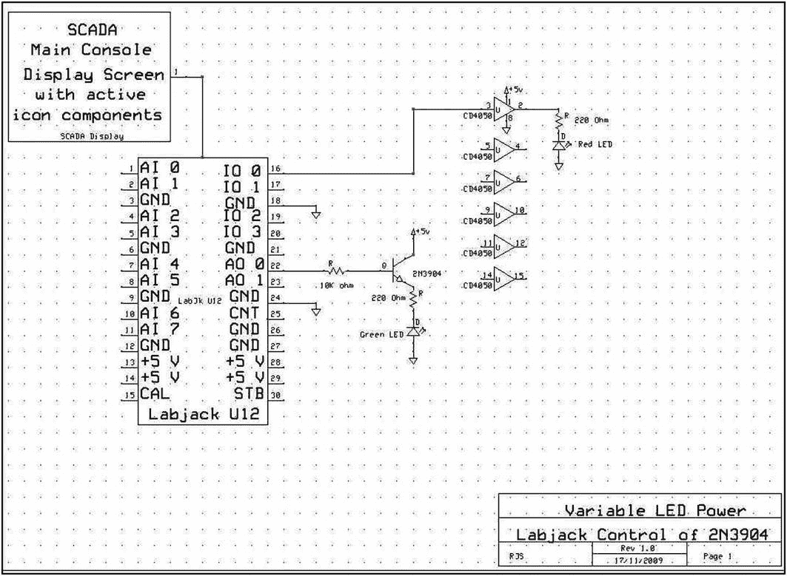
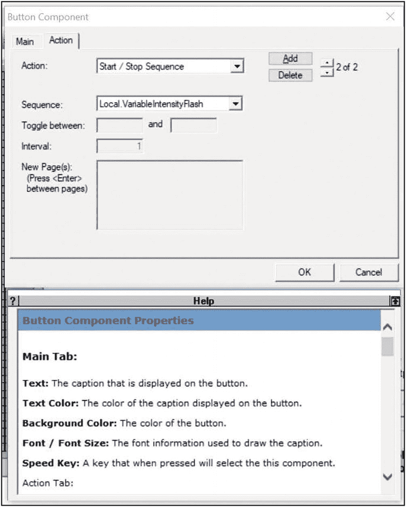
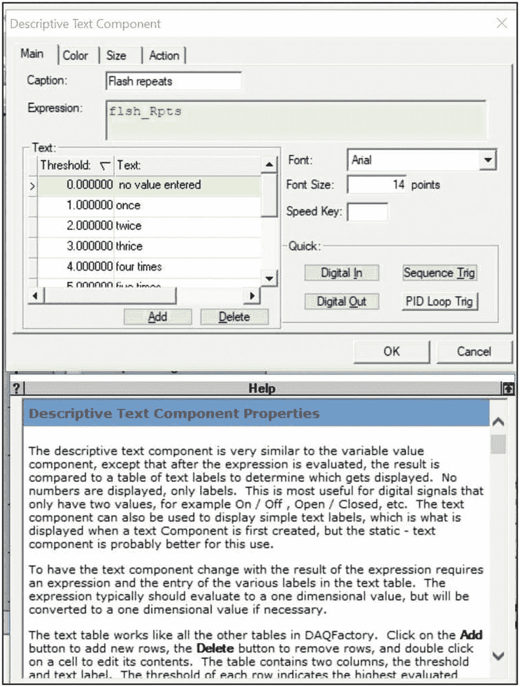
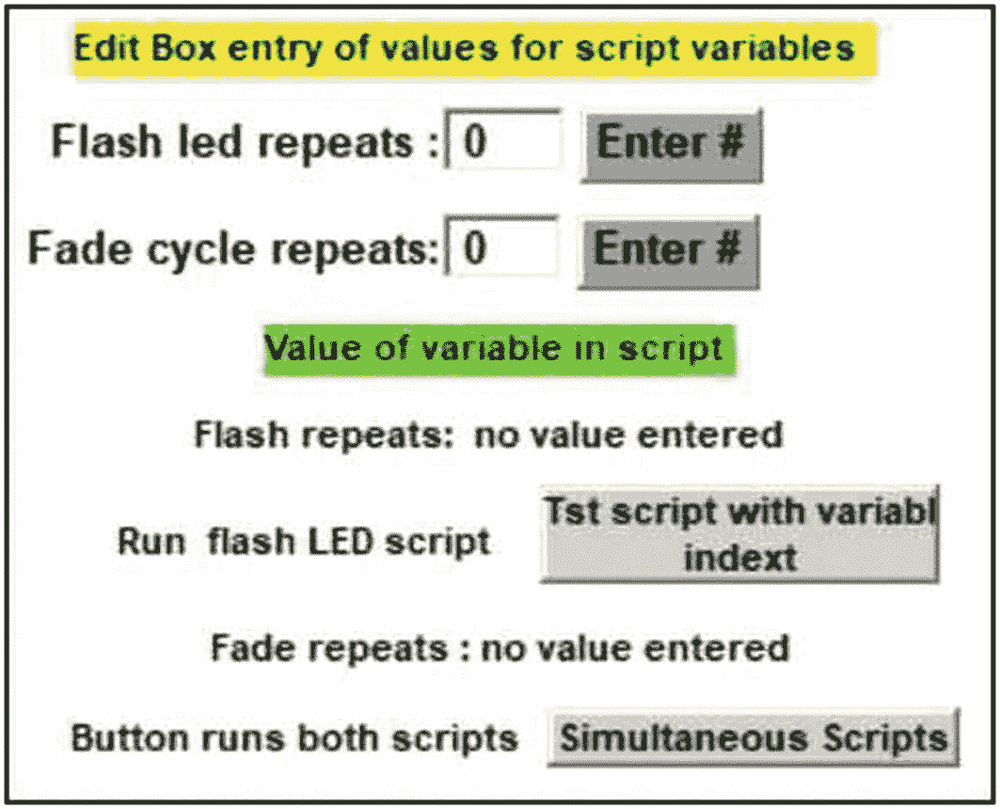
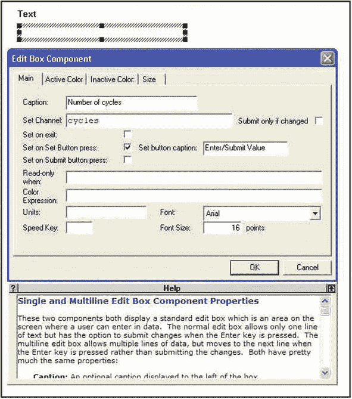
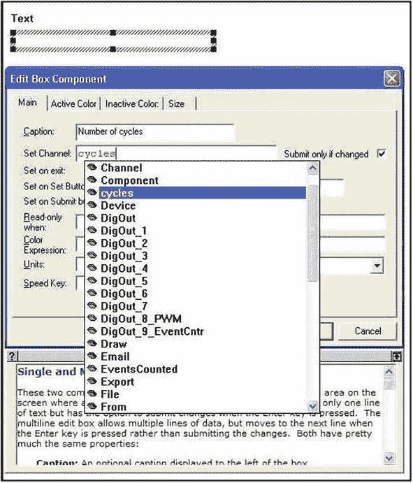
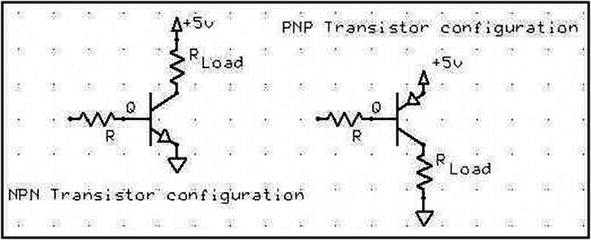
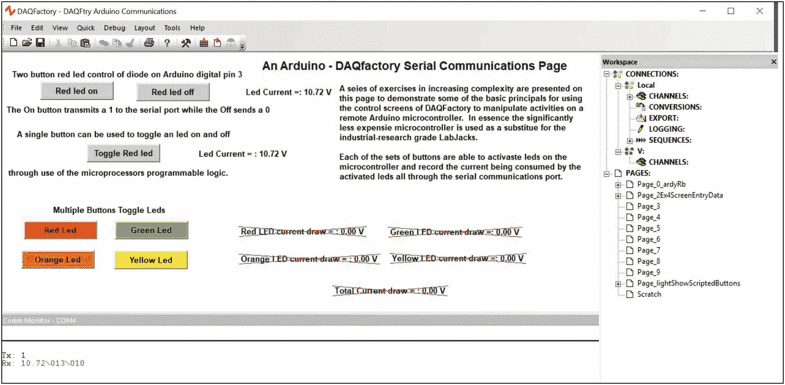
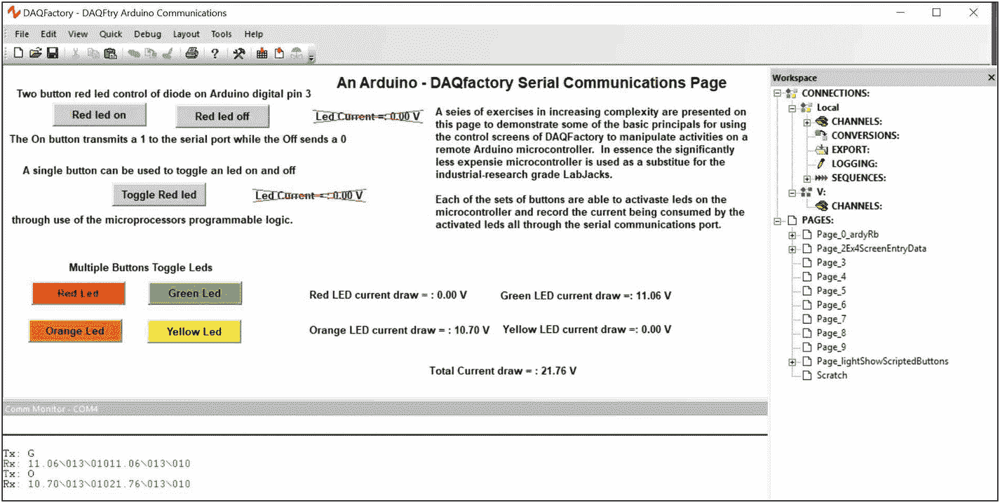
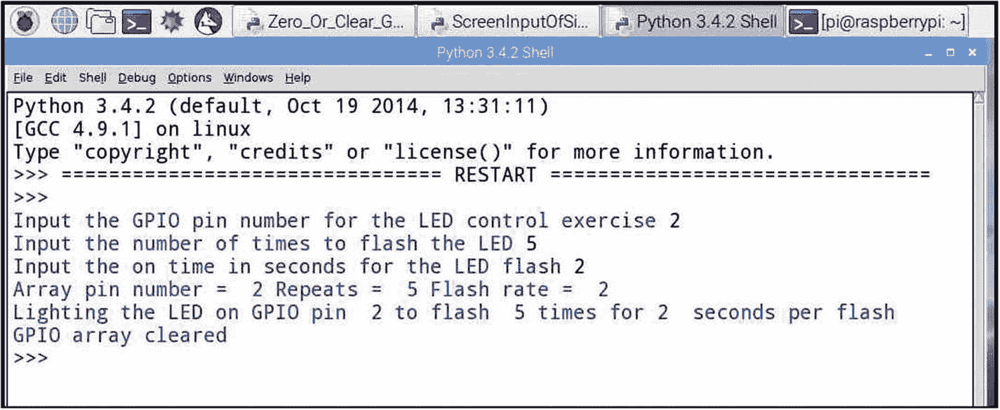

# 四、从屏幕输入数据

控制系统必须包括从屏幕输入数据的能力，以便能够修改或改变序列或过程的操作。在本章中，从键盘输入的数值用于修改程序代码的脚本序列，该程序代码使 led 在预定的周期数内开关。此外，为功率控制模式创建了两个选项，其中二极管的照明从全开到全关循环，并且二极管输出强度从关到全亮度递增，以创建“渐变”或“渐隐”效果。LED 亮度由流经器件的电流决定。通过 LED 的最大电流由与二极管、电源和地串联的限流电阻(CLR)设置。通过 LED 的电流可以通过改变电源电压来调节。然而，通过电压变化控制二极管强度只能在器件导通所需的电压水平以上有效，通常为 1.8-3 伏。

在本章中，通过输入数据值的屏幕确认，创建了一个 DAQFactory 序列码，该序列码以固定数量的电压增量增加施加到二极管上的功率。本练习还展示了软件在通常称为“线程化”应用程序中同时运行两个序列的能力。

然后，各种控制和监测选项被组合在一个简单的图形用户界面(GUI)数据输入、过程控制面板中。

使用一种称为脉宽调制(PWM)的技术可以更有效地控制二极管强度。在 PWM 控制操作中，全功率被施加到被驱动的负载，作为一系列方波电压脉冲，其时间宽度以受控方式改变或者相对于增加或减少的时间周期被调制。方波电源的频率和功率应用的脉冲宽度都可以数字控制或从屏幕输入值调制。(有关 PWM 的应用和实施的更多详细信息，请参见第 [7](07.html) 章。)

已经开发了使用便宜得多的微控制器的替代屏幕数据输入练习。微控制器练习与之前的练习一样，对实现该练习所需的更复杂代码的解释很少。微控制器使用的细节将在手稿的后面介绍，在这一点上，这些相对便宜的设备的一些优点和缺点可以得到充分的理解。

## 五金器具

如第 [1 章](01.html)图 [1-3](01.html#Fig3) 所示，为先前练习接线的红色 LED 电子电路将用于本次练习的一部分；绿色 LED 连接到 LabJack 端子板上的第一个模拟输出通道(A0)。根据图 [4-1](#Fig1) 中的示意图，AO 0 信号连接到 2N3904 晶体管的基极。



图 4-1

带数据输入设备的 DAQFactory 控制屏的原型电路

晶体管的集电极和发射极相连，因此基极电压通过限流电阻控制从+5 V 电源流向红色 LED 的电流大小。回想一下，晶体管是电流控制器件。进入晶体管的基极电流的大小由施加在基极电路中串联电阻上的电压决定。施加的电压由 LabJack HMI 的脚本控制 AO 0 输出设置。

如果修改了图 [4-1](#Fig1) 中所示的电路，实验者应确保限流电阻不允许电流超过所用二极管的最大规定值。

## 软件

### 需要页面组件

如图 [4-5](#Fig5) 所示的 DAQFactory 数据输入面板由总共八行组成，包括四个文本组件、两个用于数据输入的编辑框、两个用于启动序列的按钮和两个描述性文本组件。

为了组装控制面板，可以使用之前用于创建、定位和配置屏幕组件的技术，必要时，可以参考 DAQFactory 用户手册来放置和配置本练习中使用的新屏幕图标。

下表列出了组成成品控制面板的页面组件，如图 [4-5](#Fig5) 所示:



图 4-7

按钮组件多动作选择面板



图 4-6

描述性文本组件的配置面板



图 4-5

控制面板可改变 LED 照明重复次数


图 4-4

编辑框准备调整大小



图 4-3

编辑框主选项卡已完成



图 4-2

编辑框主选项卡，用于设置通道或变量值

1.  文本信息用于识别面板/分组及其功能(顶行，黄色背景，黑色字体；从组件配置窗口的框中选择的文本和背景颜色；参见第[章 1](01.html) ，图 [1-6](01.html#Fig6) 。

2.  配置一个编辑框(见图 [4-2](#Fig2) 和 [4-3](#Fig3) )并贴上标签以识别和接收要输入面板的数据。“闪烁 led 重复次数”是图 [4-1](#Fig1) 中红色 LED 的闪烁次数。DAQFactory 中保存闪存编号索引的变量定义为 flsh_Rpts，并声明为自动启动序列中的全局变量(清单[4-1](#PC1)；本章末尾的“代码清单”部分提供的所有代码清单)。为了使正确的变量名自动出现在下拉列表中，如图 [4-2](#Fig2) 所示，突出显示“cycles”条目，变量名必须用一个短序列声明为全局变量，该序列在页面加载时自动运行(参见第 [3](03.html) 章中的图 [3-1](03.html#Fig1) )。面板中的第 2 行完全通过标题框和勾选“设置按钮按下时设置”复选框进行配置，如图 [4-3](#Fig3) 所示。“设置按钮标题”被输入到适当的框中，以出现在面板第二行的按钮上。当配置和编辑编辑框组件时，确保光标尖端在编辑框活动区域内，并且在单击鼠标左键之前按下 Ctrl 键，然后用图 [4-4](#Fig4) 所示的粗阴影边框突出显示编辑框本身。在编辑框高亮显示的情况下，点击鼠标右键可以调出图 [4-2](#Fig2) 和 [4-3](#Fig3) 的属性对话框。编辑框中输入的值将根据需要放入通道或变量中。

3.  创建第二个编辑框以接收可变数值，该数值将使图 [4-1](#Fig1) 中绿色 LED 的强度或亮度从关闭循环至全亮度，然后返回关闭。保存衰落周期数的变量被声明为 fd_Rpts，其自动启动序列与 flash 索引相同。

4.  在面板的第四行，数据输入框下面的静态文本标识输入的变量。为了增强对比度，黑色文本在绿色背景下书写。(参见章节 [1](01.html) 中的选项，图 [1-6](01.html#Fig6) )。

5.  描述性文本组件构成了面板的第五行，用于直观地确认编辑框中输入的值，该值已被设置为脚本代码使用的脚本变量“flsh_Rpts”的值。图 [4-6](#Fig6) 显示了描述性文本组件的属性窗口。描述性文本组件需要标题、表达式和比较表。对照表中的条目在左栏中是一个数值，在右栏中是一个文本串。添加和删除按钮用于组装所需的表。组装和配置完成后，如果在单击 Enter 按钮时在编辑框中输入 0，描述性文本组件将查找变量 flsh_Rpts 的值，并在文本列中打印相应的条目“未输入值”在编辑框中输入 4 将导致在标题“闪光重复”后打印消息“四次”，本质上，比较表具有手边变量的数值范围，并且当变量落在定义的范围内时显示相应的文本消息。

6.  第六行由左边的描述性文本和右边的按钮组成。一个贴有适当标签的按钮用于启动脚本控制的“n”次重复，红色二极管开/关闪烁。在图 [4-5](#Fig5) 中，DAQFactory 控制屏幕被配置为运行清单 [4-2](#PC2) 中列出的常规序列码。LED 的电源由 RedLed 通道控制，其输出可在 LabJack I/O 0 引脚上找到。

7.  在控制面板的第七行中是第二描述性文本组件，其被配置为报告绿色 LED 重复淡入/淡出振荡的次数。

8.  描述性文本和第二个按钮构成了控制面板的第八行，也是最后一行。该按钮控制一对序列，第一个是红色 LED 闪烁序列，而第二个，在清单 [4-3](#PC3) 中，是绿色 LED 的淡入/淡出代码。在图 [4-7](#Fig7) 中，显示了按钮组件的动作选项卡。下拉编辑框动作列表将显示一长串单项选择。如果在点击按钮时需要一个以上的动作，那么可以使用添加/删除上/下箭头来添加当点击按钮时要调用的动作。在本演示练习中，闪烁和淡入淡出序列同时运行。

为了视觉上的清晰，面板组件可用于为构成特定操作控制屏幕的各组活动屏幕组件创建背景。位于面板底部的粗体数字可用于关联主控制屏幕上注释和说明表中的条目。

## 脚本

清单 [4-1](#PC1) 是使用屏幕组件改变变量内容时要采用的一个重要程序。清单 [4-2](#PC2) 和 [4-3](#PC3) 中详细说明了红色和绿色 led 的闪烁和渐变顺序，而在最小开启电压和最大电源电压之间改变绿色 LED 电压的 27 步过程可在清单 [4-4](#PC4) 中找到。清单 [4-3](#PC3) 通过调用 AnalogUp()和 AnalogDwn()函数，根据淡入/淡出效果的需要，逐步增加二极管的电压电平，从而改变绿色二极管的亮度。该序列用于从低到高的转换，第二个例程用于从高到低的转换，使系统能够在 1.3 秒内增加和降低 LED 亮度。

### 观察

红色二极管的开关周期是决定性的，因为灯处于最大亮度或关闭。施加于 2N3904 基极的电压或电流以一系列增量步进，会在半导体照明中产生“噪声”增加和减少。(参见“讨论”)

描述性文本组件应用程序是图标用法的一个非常简单的说明，但是提供了如何组装和操作比较表的概述。

变量循环索引中的数据输入是该技术的一个简单说明，两个不同脚本从一个按钮的双重启动说明了 DAQFactory 编程演示“线程”的能力，其中两个程序似乎同时执行。(线程是一个高级编程主题，如果实验控件需要，可以从 Python 编程的文献中详细研究。)

### 讨论

正如在打开和关闭红色 LED 电源的脚本代码中可以看到的，变量“flsh_Rpts”被声明为一个全局实体。当脚本被键入并且“应用和编译”按钮被成功点击时，全局变量“flsh_Rpts”出现在弹出的通道、变量和序列脚本的键入帮助列表中。

晶体管是电流的放大器。 <sup>[1](#Fn1)</sup> 任何由 DAQFactory 软件产生并最终表示为施加在 LabJack 的 AO 0 端子上的电压电平的信号都含有噪声。该噪声叠加在 DAQFactory 脚本产生的外加 DC 信号电平之上，通过保护晶体管基极免受过大电流影响的 10kω电阻放大。施加在 2N3904 基极上的信号噪声被晶体管的增益或放大系数 h <sub>fe</sub> 放大，通常值在 35 到 100 之间，以产生容易看到的闪烁和不规则的淡入或淡出过渡。

虽然在练习中使用了 PNP 晶体管，但是经过图 [4-8](#Fig8) 所示的改变，也可以使用 NPN(2n 3904 和 2N2222 是合适的 NPN 器件)。



图 4-8

NPN 和 PNP 功率控制

二极管开关的脚本代码包含在一个循环中，该循环的索引声明为全局类型变量，其值在屏幕编辑框中设置。相同的代码可用于标有 AnalogUp()和 AnalogDwn()的两个函数，在简单的开/关循环中，调用这两个函数来代替将模拟输出通道 A0 设置为 5v 或 0 的赋值语句。通过电压调节使照明强度上下步进的功能是改变输送给绿色二极管的功率的非常简单的方法。可能有许多更好的代码序列可以用来控制照明强度。(注:如果 PNP 和 NPN 晶体管互换，模拟向上和模拟向下将改变功能。)

U12 LabJacks 可以配置为 PWM 输出，以提供平滑的功率控制应用，而不是本练习中使用的粗略演示方法。如第 [7](07.html) 章所述，较新的数据采集和接口设备通常配有内置 PWM 设备。

## 使用 Arduino 微控制器进行屏幕数据输入

数据的屏幕输入也可以采取从 DAQFactory 中的控制面板生成的一系列数字控制值的形式。来自在主机上形成控制屏幕的一组 DAQFactory 图标的数值可以通过串行端口传递给微控制器，以将输入的数据转换成过程变化或实验控制动作。数据必须在低级位和字节或开/关通信级别通过两个不同计算系统之间的串行端口入口。尽管开/关识别能力在两个系统中都是以 ASCII(美国信息交换标准码)字符的形式组织的，但信息必须被转换成用于数学运算的数字整数或数字浮点值，或用于识别目的的字母字符。

正如前面的练习所介绍的，Arduino 微控制器可以通过串行端口进行控制。除了微控制器板的成本低得多之外，微控制器还有许多更新的特性，例如可编程硬件定时器，可以用来改变 5 V 电脉冲的时间宽度，以实现脉宽调制。(详见第 [7](07.html) 章。)

Arduino 通常有 14 个数字 I/O 引脚，其中 6 个可以提供 PWM 电源控制。

通过串行端口将 SCADA 软件连接到 Arduino 微控制器会限制电子设备一次处理一个信号。无论有多少数据流在传输到串行端口之前被多路复用或混合，然后在微控制器端被解析回各自的数据流，一次只有一位通过串行连接。

第 [11](11.html) 章介绍了串行连接及其使用的更多细节。

### 实验的

为了实现使用 Arduino 微控制器代替 LabJack U12 来演示用于控制和接收来自微处理器的显示数据的控制屏幕数值输入，可以使用第 [2](02.html) 章图 [2-9](02.html#Fig9) 中描述的数字引脚和 ADC 输入。

在所有 DAQFactory-Arduino 编程中，只有一个程序可以控制串口。作者通常的做法是开发手头任务所需的 Arduino 代码，然后通过启动 Arduino 的串行监视器并将 DAQFactory 控制屏幕发送的字符串发送到微控制器代码来测试代码。一旦确认了正确的 Arduino 响应，Arduino 上的串行端口将被关闭，Arduino IDE 窗口将被最小化以在后台运行。一旦接收正确 DAQFactory 字符串以调用所需动作的 Arduino 代码在后台运行，就可以启动 DAQFactory 程序来开始控制会话，该 DAQ factory 程序包含要投入使用的控制屏幕页面。在本练习中，图中所示的 DAQFactory 屏幕驻留在 SCADA 软件中，该软件可以访问和控制串行端口，通过该端口可以发送字符，以便从连接到 Arduino I/O 连接的设备启动所需的操作。

创建了如图 [4-9](#Fig9) 所示的初始 DAQFactory 屏幕，以开始串行通信的渐进开发。

红色 led 开和红色 led 关按钮耦合到列表 [4-5](#PC5) 的快速序列码，该快速序列码向串行端口发送 1 或 0，列表 [4-6](#PC6) 的 Arduino 代码根据需要激活/禁用红色 led。Arduino 代码还读取测量的已知值限流电阻上的电压降，并将电流数据发送回串行端口，DAQFactory 快速序列码解析出电流数据，显示在控制屏幕上。



图 4-9

DAQFactory 控制屏幕，用于指导 Arduino 微控制器板上的操作

DAQFactory 控制屏幕左上角的第二个按钮耦合到第二个快速序列，该序列激活 Arduino 板上红色 led 的更复杂和更有效的切换。清单 [4-7](#PC7) 和 [4-8](#PC8) 的程序是管理切换效果的快速序列码和 Arduino 码。

图 [4-10](#Fig10) 描述了当 Arduino 板上的绿色和橙色 led 被 DAQFactory 控制屏幕上的相应按钮激活时获得的 DAQFactory 控制屏幕显示。COM4 监视器上串行端口动作的传输历史记录在图框的左下方。清单 [4-9](#PC9) 和 [4-10](#PC10) 控制控制面板的彩色按钮。



图 4-10

DAQFactory 控制屏幕，用于指导 Arduino 微控制器板上的多个操作

清单 [4-9](#PC9) 和 [4-10](#PC10) 包含通过点击彩色按钮激活的 DAQFactory 快速序列码，以及控制屏幕彩色按钮和变量值读数的响应 Arduino 码，如图 [4-10](#Fig10) 所示。

在图 [4-5](#Fig5) 中，使用 LabJack 设备和自动启动序列开发了 DAQFactory 屏幕数据输入面板，以声明保存要输入的弧线步进值所需的变量。DAQFactory 中的自动启动序列也会在加载包含数据输入面板的页面以供 Arduino 微控制器使用时激活。除了线程演示按钮之外，前面讨论的关于 DAQFactory 的所有功能在微控制器上都是活动的。(参见“讨论”)

如清单 [4-11](#PC11) 所示,“带可变索引的 Tst 脚本”按钮与快速序列程序相连。快速序列依靠一个“for 循环”，执行“flsh_Rpts”次，向运行清单 [4-6](#PC6) 中所列代码的 Arduino 发送开/关或“1”/“0”串行端口传输，以打开或关闭红色二极管。或者，清单 [4-12](#PC12) 、 [4-13](#PC13) 和 [4-14](#PC14) 可用于操作 Arduino 的 PWM 功能，使微控制器板上的橙色二极管变暗和闪烁。(参见“讨论”)

### 观察

当屏幕数据输入使用带有 LabJack 的编辑框屏幕组件时，可以在闪烁和渐变编辑框中输入两个不同的值，当底部按钮“同步脚本”被激活时，两个二极管上的闪烁和渐变动作同时运行。(参见“讨论”)

LabJack 和 Arduino 屏幕和功能的其余部分按预期工作。

### 讨论

除了 DAQFactory 脚本语言，Python 是一种能够适应“线程化”的编程语言。线程的细节和应用是比这篇介绍性文章更高级的主题，要了解更多信息，可以参考 Python 的文献。

检查清单 [4-8](#PC8) 中的 Arduino 代码会发现，为简单起见，用于确定红色 LED 状态的逻辑已经完全写入微控制器系统。如果微控制器位于远程位置，DAQFactory 控制屏幕的操作员需要了解红色 LED 或连接到数字引脚的设备的状态，则可以通过串行端口将一个标志连同当前提取的数据一起传回控制屏幕。

实验人员在 Arduino 上使用数字和 PWM 引脚时必须小心，因为 14 个数字 I/O 引脚中只有 6 个支持 PWM(即 Arduino 引脚 3、5、6、9、10 和 11 支持 PWM)。)

当使用 DAQFactory 串行端口时，如果 Arduino 代码要使用它来标记字符传输的结束，实验人员必须在每次传输的结尾手动添加一个换行 ASCII 标记。Arduino 串行监视器在视野的右下角有一个选择框，用于为当前的终端会话选择所需的行尾。

通过在 DAQFactory 序列脚本中计算时序和功率要求，并仅在需要时发送功率激活命令，使用 0–255 整数功率电平的 PWM 激活码可用于 LED 激活的渐变和闪烁模式。

## Raspberry Pi:数据的屏幕输入

RPi 使用的 Python 语言的数据输入是通过 input 语句完成的。Python 中的 input 语句接受一个字符串值参数，然后可能需要将其转换为适当的整数或浮点数形式的数值。典型的屏幕输入代码如下(#标记注释行):

```c
input_str = input("Enter the desired input characters", )
variable = int(input_str)   # can only be used for non-floating point conversion of numbers
variable = float(input_str) # can only be used for floating point numeric strings

```

使用 Python 语言控制 led 可以使用名为 RPi 的基本库。GPIO 或更高级的功能库 gpiozero。这两个库的文档都可以在线获得。

由于 GPIO 阵列是一个数字输入/输出系统，如果不借助 PWM 和电容平滑，就不容易实现电压控制。(PWM 在第 [7 章](07.html)中介绍。)

演示使用 Python 和 RPi 在屏幕上输入数据的简单练习可以通过使 LED 闪烁来创建，闪烁长度根据屏幕输入值设置，重复次数也由屏幕输入设置。清单 [4-15](#PC15) 中的 Python 程序产生图 [4-11](#Fig11) 的输出，并按照记录闪烁标称 LED。



图 4-11

数据程序 Python 屏幕输入的输出

有时，当外设连接到 GPIO 阵列时，打开 RPi 电源时，一些阵列引脚可能处于高电平或通电状态。清单 [4-16](#PC16) 中列出了两个能够重置零或关闭活动引脚的实用程序。一个实用程序使用通道列表函数，第二个实用程序使用 Python 循环来处理 GPIO 阵列的各个引脚。

## 代码列表

```c
# Clear, Turn Off or Reset the RPi GPIO array
#
import RPi.GPIO as GPIO
# set the pin identity mode
GPIO.setmode(GPIO.BCM)
GPIO.setwarnings(False)
# Reset the array pins to off/false/0
chan_list = (2, 3, 4, 5, 6, 7, 8, 9, 10, 11, 12, 13, 14, 15, 16, 17, 18, 19, 20)
GPIO.setup(chan_list, GPIO.OUT)
GPIO.output(chan_list, GPIO.LOW)

Listing 4-16Python Code to Reset the GPIO Array

```

```c
# Input of data from the control screen
#
import RPi.GPIO as GPIO
import time
# set the pin identity mode
GPIO.setmode(GPIO.BCM)
GPIO.setwarnings(False)
# Reset the array pins to off/false/0
chan_list = (2, 3, 4, 5, 6, 7, 8, 9, 10, 11, 12, 13, 14, 15, 16, 17, 18, 19, 20)
GPIO.setup(chan_list, GPIO.OUT)
GPIO.output(chan_list, GPIO.LOW)
#
# Enter the number of the GPIO array pin connected to the LED to be activated
input_str = input("Input the GPIO pin number for the LED control exercise " , )
arry_pn_no = int(input_str)
#
# Input the number of times to repeat the flashing of the LED
input_str = input("Input the number of times to flash the LED ", )
rpts = int(input_str)
#
# Input the number of times to flash the LED in a second
input_str = input("Input the on time in seconds for the LED flash ", )
flsh_rt = int(input_str)
print("Array pin number = ",arry_pn_no, "Repeats = ", rpts, "Flash rate = ", flsh_rt)
#
print("Lighting the LED on GPIO pin ", arry_pn_no, "to flash ", rpts, "times for", flsh_rt, " seconds per flash")
#
for i in range(1, rpts + 1):
    GPIO.output(arry_pn_no, GPIO.HIGH)
    time.sleep(flsh_rt)
    GPIO.output(arry_pn_no, GPIO.LOW)
    time.sleep(flsh_rt)
# Clear the GPIO array
Print("GPIO array cleared")
GPIO.cleanup()

Listing 4-15Python Data Input from the Host Computer Screen

```

```c
  /* DAQFtry ardyRb PWM Led Control through serial port
Quick Sequence control of Orange led fade with arduino PWM
Arduino PWM requires a 0 - 255 integer to set the PWM DC.
This pgm uses the string to int function to convert a digit
based number into an integer to set the PMW value.
*/
String inString =  " ";
byte pinOut = 5;              // dig pin for orange led
int pwr_Vlu = 0;
//
void setup() {
  Serial.begin(9600);         // start serial port
  pinMode(pinOut, OUTPUT);    // set output pin
}
//
void loop() {
  while (Serial.available() > 0) {
  int inChar = Serial.read();
  if (isDigit(inChar)) {
  // cnvrt incoming byte to char and add to strng

  inString += (char)inChar;
  }
  // if nuline convert accumulated to integer
  if (inChar == '\n') {
    pwr_Vlu = (inString.toInt());
    Serial.print(pwr_Vlu);
    //int twotimes = pwr_Vlu * 2;
    //Serial.print(twotimes);
    pinMode(pinOut, OUTPUT);
    analogWrite(pinOut, pwr_Vlu);
    // clear the string for new input
    inString = " ";
  }
 }
}

Listing 4-14Arduino Code to Accept Digits from 0 to 255 to Be Used as PWM Power Application Requests 

```

```c
// Orng led flashed on/off with 255 and 0 PWM Arduino power level applications
global flsh_Rpts
//
for (Private.Counter = 0, Counter < flsh_Rpts, Counter ++)
//
device.ardyRb.Write("255" + Chr(10))     // turn led full on
delay (0.5)                              // delay 1/2 sec
device.ardyRb.Write("0" + Chr(10))       // turn led off
delay(0.5)                               // delay 1/2 sec
endfor

Listing 4-13DAQFactory Regular Sequence to Use the “flsh_Rpts” Screen-Entered Loop Index Counter

```

```c
// Green Led on Arduino pin 5 to be cycled from full power to
// off from a DAQFctry script using the serial port and the
// edit box entry of the requested number of repeats, fd_Rpts.
// Start illumination decrease cycle

device.ardyRb.Write("255" + Chr(10))
delay(0.25)
device.ardyRb.Write("192" + Chr(10))
delay(0.25)
device.ardyRb.Write("128" + Chr(10))
delay(0.25)
device.ardyRb.Write("96" + Chr(10))
delay(0.25)
device.ardyRb.Write("64" + Chr(10))
delay(0.25)
device.ardyRb.Write("48" + Chr(10))
delay(0.25)
device.ardyRb.Write("32" + Chr(10))
delay(0.25)
device.ardyRb.Write("24" + Chr(10))
delay(0.25)
device.ardyRb.Write("16" + Chr(10))
delay(0.25)
device.ardyRb.Write("12" + Chr(10))
delay(0.25)
device.ardyRb.Write("8" + Chr(10))
delay(0.25)
device.ardyRb.Write("6" + Chr(10))
delay(0.25)
device.ardyRb.Write("4" + Chr(10))
delay(0.25)
device.ardyRb.Write("3" + Chr(10))
delay(0.25)
device.ardyRb.Write("2" + Chr(10))
delay(0.25)

device.ardyRb.Write("0" + Chr(10))

Listing 4-12DAQFactory Regular Sequence Code for Fading the Green LED on the Arduino Board

```

```c
for (Private.Counter = 0, Counter < flsh_Rpts, Counter ++)
   device.ardyRb.Write('1')
   delay(0.5)
   device.ardyRb.Write('0')
   delay(0.5)
   endfor.

Listing 4-11DAQFactory Quick Sequence for Flashing the Arduino-Mounted LED for the Number of Cycles Requested Through the Screen Data Entry Edit Box

```

```c
// Toggle leds on/off from DAQFctry button icons on COM4
// The DAQF QS sends an R, G, O or Y to the serial port on com
// 4\. On the arduino side the status of the appropriate led
// digpin is determined and toggled as required through a
// switch construct.
//
// power drawn calculations, each led has a CLR and the voltage
// on the junction of the resistor and led is measured and used
// to calculate diode current by A0 to A3 respectively. Current
// calcln only done when diode activated.
//
const int RedLedPin = 3;           // red led is on dig pin 3
const int GreenLedPin = 4;         // green led on dp 4
const int OrangeLedPin = 5;        // orange led on dp 5
const int YellowLedPin = 6;        // yellow led on d pin 6
//
int oofR = 0;                      // on off flags initialized
int oofG = 0;
int oofO = 0;
int oofY = 0;                      // on off flags initialized
//
char incomingByte = ' ';           // define incoming character
//
float iRed = 0;                    // red led current in decimal float format

float iGreen = 0;
float iOrange = 0;
float iYellow = 0;
float itotal = 0;
//
void setup() {
 Serial.begin(9600);                // start the serial port
 }
//
void loop()
{
  if (Serial.available())            // check for incoming data
  {
  char incomingByte = Serial.read();   // set char value for switch branching
// Serial.print(incomingByte);          // diagnostic
  switch(incomingByte)                  // branch to desired location/option
  {
  case 'R':                             // Red Led Activation
  if (oofR == 0 ) {
  pinMode(RedLedPin, OUTPUT);           // set pin I/O
  digitalWrite(RedLedPin, HIGH);        // turn led on
  oofR = 1;                             // set flag
  iRed = ((analogRead(A0)* 4.8828)/216);  // calc i when led on

  //Serial.print(analogRead(A0));         // diagnostics
  //Serial.print("iRed = ");              // diagnostics
  Serial.println(iRed);                           // add CR-LF
  itotal = iRed + iGreen + iOrange + iYellow;     // calculate total power consumption
  //Serial.print("itotal = ");                   // diagnostics
  Serial.println(itotal);                        // add CR-LF
  }
  else {                       // flag is set to 1 so led is on
    pinMode(RedLedPin, OUTPUT);       // set pin mode to output
    digitalWrite(RedLedPin, LOW);     // turn led off
    oofR = 0;                         // re-set flag to off
    iRed = 0;                     // turn iRed current contribution to itotal off
    Serial.println(iRed);             // send data to DAQFtry
    itotal = iRed + iGreen + iOrange + iYellow;   // calculate total current draw
    //Serial.print("itotal = ");      // diagnostics
    Serial.println(itotal);   // send to serial port with CR-LF
    }
break;
//
case 'G':                             // Green Led Activation
  if (oofG == 0 ) {                   // check status flag
  pinMode(GreenLedPin, OUTPUT);       // set pin I/O
  digitalWrite(GreenLedPin, HIGH);    // turn led on
  oofG = 1;                           // reset status flag
  iGreen = ((analogRead(A1)*4.8828)/215); // calc diodecurrent
  //Serial.print("iGreen = ");            // diagnostics
  Serial.println(iGreen);               // send data with CR-LF
  itotal = iRed + iGreen + iOrange + iYellow;  // calculate total current draw
  //Serial.print("itotal = ");                  // diagnostics
  Serial.println(itotal);                    // send with CR-LF
  }
  else {
    pinMode(GreenLedPin, OUTPUT);      // set pin I/O mode
    digitalWrite(GreenLedPin, LOW);    // turn green led off

    oofG = 0;                          // set green status flag
    iGreen = 0;   // turn green contribution to total current off
    Serial.println(iGreen);   // send green current value with CR-LF
    itotal = iRed + iGreen + iOrange + iYellow;   // calculate total current draw
    //Serial.print("itotal = ");          // diagnostic
    Serial.println(itotal);    // send total current with CR-LF
  }
break;
//
case 'O':                             // Orange Led Activation
  if (oofO == 0 ) {                   // check status flag
  pinMode(OrangeLedPin, OUTPUT);      // set pin I/O
  digitalWrite(OrangeLedPin, HIGH);   // set pin I/O
  oofO = 1;                        // set orange flag to led on
  iOrange = ((analogRead(A2)*4.8828)/215);        // calculate orange led current draw
  //Serial.print("iOrange = ");                   // diagnostic
  Serial.println(iOrange);   // send to serial port with CR-LF
  itotal = iRed + iGreen + iOrange + iYellow;     // calculate total current draw
  //Serial.print("itotal = ");                    // diagnostic
  Serial.println(itotal);          // send total current to serial port with CR-LF
  }
  else {                           // orange led is on
    pinMode(OrangeLedPin, OUTPUT);       // set pin I/O
    digitalWrite(OrangeLedPin, LOW);    // turn orange led off
    oofO = 0;                // reset orange status flag to off
    iOrange = 0;              // turn orange contribution to total off
    Serial.println(iOrange);  // send out orange current with CR-LF
    itotal = iRed + iGreen + iOrange + iYellow;   // calculate total current draw
    //Serial.print("itotal = ");       // diagnostics
    Serial.println(itotal);  // send out total current draw with CR-LF
  }
break;
case 'Y':                             // Yellow Led Activation
  if (oofY == 0 ) {                     // led is off
  pinMode(YellowLedPin, OUTPUT);        // set pin I/O
  digitalWrite(YellowLedPin, HIGH);     // turn yellow led on
  oofY = 1;                             // re-set lag to led on

  iYellow = ((analogRead(A3)*4.8828)/217);        // calculate yellow led current
  //Serial.print("iYellow = ");                   // diagnostic
  Serial.println(iYellow);        // yellow led current value to serial port wth CR-LF
  itotal = iRed + iGreen + iOrange + iYellow;   // calculate total current draw
  //Serial.print("itotal = ");                    // diagnostic
  Serial.println(itotal);     // send to serial port with CR-LF
  }
  else {                                 // yellow led on
    pinMode(YellowLedPin, OUTPUT);       // set pin I/O mode
    digitalWrite(YellowLedPin, LOW);     // turn yellow led off
    oofY = 0;                            // re-set flag to yellow led off
    iYellow = 0;                 // set yellow led current to 0
    Serial.println(iYellow);     // send value to serial port with CR-LF
    itotal = iRed + iGreen + iOrange + iYellow;   // calculate total current and send wth CR-LF
    //Serial.print("itotal = ");    // diagnostic
    Serial.println(itotal);    // send total current with CR-LF
  }
break;
  }
 }
}

Listing 4-10Arduino Code Supporting DAQFactory Multiple-Button Colored Diode Selection with Power Consumption

```

```c
device.ardyRb.Purge()
device.ardyRb.Write('R')
delay(0.1)
global iRed
global iTotal
private string datain1
private string datain2
datain1 = device.ardyRb.ReadUntil(13)
datain2 = device.ardyRb.ReadUntil(13)
iRed = strToDouble(datain1)
iTotal = strToDouble(datain2)

Listing 4-9DAQFactory Quick Sequence Code for Multiple-Button Control of Arduino LEDs

```

```c
// Toggle an led on/off from one DAQFctry button icon on COM4
// The DAQF QS sends an R to the serial port on com 4\. On the
// arduino side the status of the RedLed digpin is determined
// and toggled as required. Led current calculated and written to
// Ser prt where DAQFtry parses out floating point current value.
//
const int RedLedPin = 3;      // red led is on dig pin 3
int oofR = 0;                 // power state of red diode
char incomingByte = ' ';      // declare incoming byte
float iRed = 0;               // red led current
//
void setup() {
  Serial.begin(9600);         // start the serial port
  pinMode(RedLedPin, INPUT);  // must initially read the dig. pin
}
//
void loop() {
  if (Serial.available()) {         // check for incoming data
    char incomingByte = Serial.read();
    //Serial.print(incomingByte);              // diagnostic
    if (incomingByte == 'R' && oofR == 0) {
      pinMode(RedLedPin, OUTPUT);
      digitalWrite(RedLedPin, HIGH);
      iRed = ((analogRead(A0) * 4.8828)/216 );
      Serial.println(iRed);
      oofR = 1;
    }
    else {
      if (incomingByte == 'R' && oofR == 1){
      pinMode(RedLedPin, OUTPUT);
      digitalWrite(RedLedPin, LOW);
      iRed = 0;
      Serial.println(iRed);
      oofR = 0;
      }
    }
  }
}

Listing 4-8Arduino Code for Receiving the DAQFactory Control Screen Button Request to Toggle Red LED Illumination

```

```c
device.ardyRb.Purge()
device.ardyRb.Write('R')
delay(0.1)
global ldCurrnt
private string datain
datain = device.ardyRb.readUntil(13)
ldCurrnt = strToDouble(datain)

Listing 4-7DAQFactory Quick Sequence Code to Toggle Red LED and Read the Power Consumption

```

```c
// Arduino code for a single led illumination on the red board
// Arduino the pgm waits for an incoming character on com
// port 4 if a 1 the led is turned on if a 0 it is turned off.
// A0 is wired to Rd led junction and the Arduino calculates
// the led current and prints the value to the serial port.
//
const int RedPin = 3;      // red board dig. pin with red led and clr
int incomingByte;          // a variable to hold incoming byte
float iRed = 0;            // the led current through the CLR
//
void setup() {
  Serial.begin(9600);             // start the serial port
  pinMode(RedPin, OUTPUT);        // set the pin function
}
void loop() {
  if(Serial.available()> 0) {     // check port for last data byte
  incomingByte = Serial.read();   //
  if (incomingByte == '1') {      // if is 1, turn the led on
    digitalWrite(RedPin, HIGH);
  // calculate led current and print to the serial port

  iRed = ((analogRead(A0) * 4.8828 )/216);
  Serial.println(iRed);
  }
  //
  if (incomingByte == '0') {
    digitalWrite(RedPin, LOW);       // if 0, turn the led off
  // calculate led current and print to the serial port
  iRed = ((analogRead(A0) * 4.8828 )/216);  // ensures the LED is off
  Serial.println(iRed);
  }
  }
}

Listing 4-6Arduino Code for DAQFactory Code of Listing 4-5

```

```c
device.ardyRb.Purge()
device.ardyRb.Write('1')
delay(0.1)
global ldCurrnt
private string datain
datain = device.ardyRb.readUntil(13)
ldCurrnt = strToDouble(datain)

Listing 4-5DAQFactory Quick Sequence to Turn the Red LED On from the Button and Read the LED Current

```

```c
//Analog Voltage is raised from 2.4 volts to 5.0
// in steps of 0.2v with a delay of 0.05 sec
// between increments. Rvn. Jan4/10
AnalogOut = 2.2
delay (0.05)
AnalogOut = 2.4
delay (0.05)
AnalogOut = 2.6
delay (0.05)
AnalogOut = 2.8
delay (0.05)
AnalogOut = 3.0
delay (0.05)
AnalogOut = 3.2
delay (0.05)
AnalogOut = 3.4
delay (0.05)
AnalogOut = 3.6
delay (0.05)
AnalogOut = 3.8
delay (0.05)
AnalogOut = 4.0
delay (0.05)
AnalogOut = 4.2
delay (0.05)
AnalogOut = 4.4

delay (0.05)
AnalogOut = 4.6
delay (0.05)
AnalogOut = 4.8
delay (0.05)
AnalogOut = 5.0
return()

Listing 4-4DAQFactory Regular Sequence for LED Illumination Intensity Variation

```

```c
//Variable Intensity Flash varies the voltage of the
//AO 0 channel to raise and lower the intensity of the
//green LED
//Nov. 16/09
//
global fd_Rpts
AnalogOut = 0
for (Private.Counter = 0, Counter < fd_Rpts, Counter ++)
AnalogUp ()
AnalogDwn ()
endfor
AnalogOut = 0

Listing 4-3DAQFactory Code to Fade In and Out the Green LED Brightness

```

```c
// Sequence Name --: TstSqncForLoopVariableReps
//Screen Entry of Alph-Numeric Values
//Oct9/09 and Nov. 13/09
//A screen Edit Box accepts entered values as a variable called
//flsh_Rps. The variable is declared as a global type with an
//auto-run sequence and is used as the loop counter value to
//vary the number of times the loop iterates.
//
global flsh_Rpts
//
for (Private.Counter = 0, Counter < flsh_Rpts, Counter ++)
   //
    RedLed = 5
    delay(0.5)
    RedLed = 0
    delay(0.5)
   //
endfor

Listing 4-2DAQFactory Code to Flash the Red LED a Variable Number of Times as Entered from the Control Screen

```

```c
// Auto declare variables is a sequence that runs when the Main
// Screen page is run. Two variables are declared globally,
// flsh_Rpts and fd_Rpts representing the number of times to
// flash the red led and fade the green.
//
global flsh_Rpts
//
global fd_Rpts

Listing 4-1DAQFactory Auto-start Sequence Code to Declare Variables

```

## 摘要

*   在商业 SCADA 系统中需要脚本来输入从配置的主机屏幕 GUI 控制面板初始化和控制手边的过程所需的过程变量。

*   屏幕输入的过程或实验变量也可以输入到 SCADA 系统中，该系统由较便宜的组件和计算平台组装而成。

<aside aria-label="Footnotes" class="FootnoteSection" epub:type="footnotes">Footnotes [1](#Fn1_source)

*电子烹饪书*，蒙克，奥莱利媒体公司，ISBN 978-1-49195340-2

 </aside>