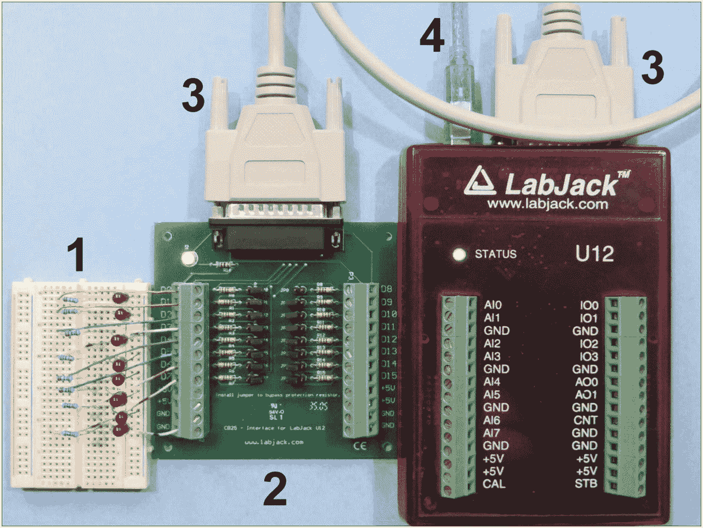
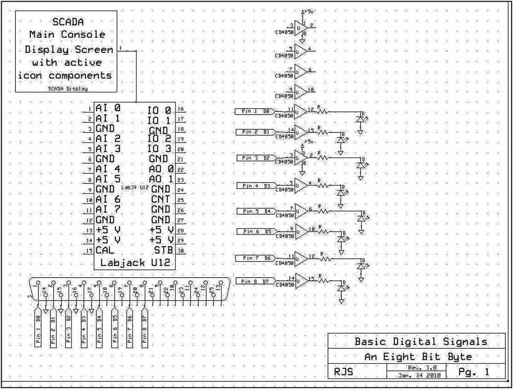
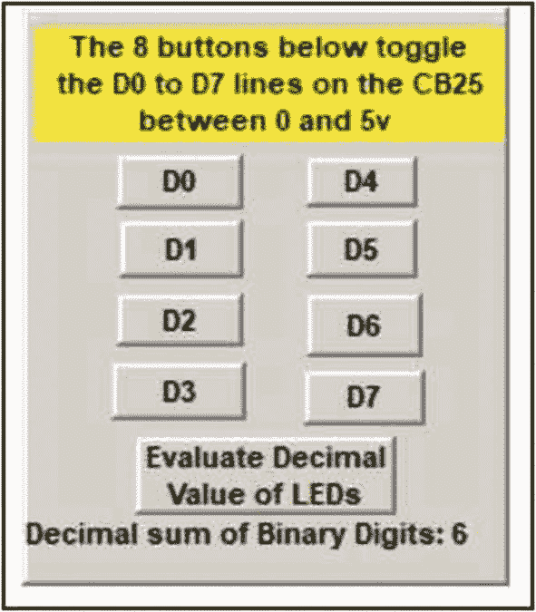
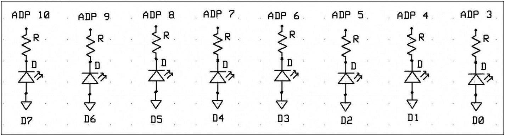
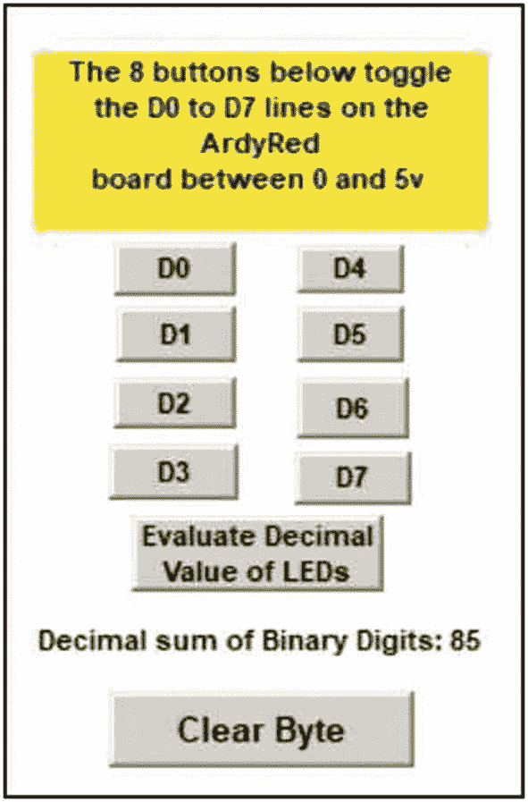
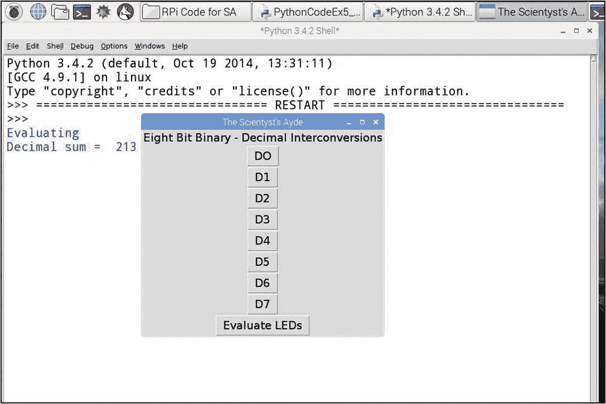

# 五、数字信号概念和数字信号输出

用于进行生物、化学或物理测量的大多数传感器产生连续可变的模拟电输出，而计算机和大规模集成电路使用高或低的电能水平来表示它们可以处理的二进制数字信号。监控和数据采集程序必须经常充当双向模数电子信号转换器。本章将开始开发二进制编码和数字电子学的应用，利用标准的 0 和+5 伏信号电平作为二进制 1 和 0 的表示。在许多表面贴装技术(SMT)器件中，逻辑电平为 0 和 3.3 V，无意中施加 5 V 信号常常会损坏 SMT 集成电路。

LabJack U12 人机界面(HMI)用户手册指出，U12 设备上提供了 20 条数字信号线，可设置为接收或输出 5 V 电信号。四条线通过 LabJack 上主螺丝端子板上的 I/O 0–I/O 3 连接提供，其余 16 条线通过机箱顶端的 DB-25 连接器提供。用户指南还建议实验者，主端子连接器上的四条 I/O 线由内部限流电阻保护，而 DB-25 连接器上的四条 I/O 线配有跳线引脚，以便在需要时绕过 1.5kω保护电阻。

可以通过几种方法物理访问 DB-25 行。LabJack 制造商可提供带有各线路连接端子的电缆和电路板。带焊接端子的 DB-25 连接器可从大多数电子供应商处购买。可以从旧的 DB-25 打印机电缆中创建一个便宜的接口，去掉不兼容的端连接器，并将单个线端镀锡以插入数字原型试验板。(参见第[章 1](01.html) ，图 [1-1](01.html#Fig1) ，图 [5-1](#Fig1) 中的 1、3 项，HMI U12)。)

为了强调有关所用硬件的注意事项，请记住 LabJack 制造商为 DB-25 连接提供的电路板包含预安装的负载限制电阻，而从当地供应商处单独购买的 DB-25 连接器或使用从旧打印机拆下的电缆制造的连接器不包含负载限制电阻。在现场实验和 HMI 之间使用独立供电的缓冲连接(如 CMOS CD4050 hex 同相缓冲芯片)的理念消除了对 HMI 硬件瞬时损坏的担忧。

## 实验的

本练习将使用与之前练习相同的屏幕控制 led 照明程序，但此处扩展至 8 位，以演示基本的数字信号概念。

### 五金器具

LabJack Corporation 的 CB25 端子板(项目 2，39 美元)包括 DB-25 电缆(项目 3)，用于将 U12 接口的附加终端数字 I/O 线连接到原型板上的 LED 阵列(项目 1)。

图 [5-1](#Fig1) 中的第 4 项是到显示图 [5-3](#Fig3) 中所示 DAQFactory 控制面板的主机的 USB 连接。连接设备顶部 LabJack DB-25 连接器的 DB-25 电缆提供了对 16 条数字 I/O 线的访问，其中前 8 条可用于本练习。



图 5-1

LabJack U12、CB25 端子板和 8 位 LED 阵列

如果由于易发生瞬变的电源而需要额外的硬件保护，八条数字信号线可以使用两个 CD4050 hex 缓冲/隔离芯片、八个 led 和限流电阻，如图 [5-2](#Fig2) 所示。

手边的部件应根据以下电路原理图进行组装。作者用旧的 DB-25 打印机电缆组装了一个初始原型，并将来自 U12 的隔离和识别的 D0–D7 数字 I/O 线直接插入原型板，以激活 CLR LED 阵列位。



图 5-2

8 位字节 LED 显示器原理图

### 软件

创建一个八按钮面板，每个按钮的标签如图 [5-3](#Fig3) 所示。本练习演示了使用 8 位字节的现场实验和主 SCADA 屏幕之间的单个数字线路连接的配置。



图 5-3

8 位字节 LED 显示控制面板

创建的每个按钮都被贴上标签，连接到其通道，然后设置为在 0 到 5 伏之间切换，如之前在第 [1](01.html) ，图 [1-9](01.html#Fig9) 到 [1-11](01.html#Fig11) 中所做的那样。同时按下 Ctrl 键和单击鼠标左键允许实验者在单个屏幕组件的集合周围画一个框，这些组件可以通过编辑下拉菜单中的选择形成一个组。在组装更大更复杂的 GUI 屏幕时，可以根据需要使用鼠标、Ctrl 键和编辑菜单对组件进行分组和取消分组。

研究者也不应试图改变背景板上的成分。组件应该根据需要进行排列和配置、分组，然后根据需要通过使用 Ctrl 键和布局菜单中的顺序条目由背景面板支持。

计算被照亮位的十进制和的 DAQFactory 序列程序如清单 [5-1](#PC1) 所示。

如图 [1-10](01.html#Fig10) 所示，对于每个 DigOut_n 通道，代表 8 位的按钮链接到按钮组件动作选项卡中的“切换”选项。

### 观察

当二极管、DAQFactory 和屏幕配置正确时，单击任何一个按钮都会点亮或关闭代表一个字节数字数据的 8 位二极管组中的相应二极管。

图 [5-3](#Fig3) 描绘了点击评估按钮后，D1 (2 <sup>1</sup> = 2)和 D2 (2 <sup>2</sup> = 4)发光二极管亮起时的面板显示。要清除十进制和显示，请关闭所有二极管，然后单击评估按钮。

### 讨论

不从 HMI 设备或计算机电源为实验装置供电的总体原则与使用 LabJack 接口的无保护数字 I/O 线路特别相关。如第 [1](01.html) 章练习中所述，CD4050 缓冲器提供了一个虚拟零电流或“仅电压”感测电路，其中流入或流出数字线路的电流几乎为零，因为缓冲 IC 芯片的 CMOS 栅极电阻非常高。

这个练习演示了数字表示的基本原理，即能够以二进制格式直观地表示 0 到 255 之间的任何十进制值。从右边开始的字节发光二极管代表 2 <sup>0</sup> 或 1，2 <sup>1</sup> 或 2，2 <sup>2</sup> 或 4，2 <sup>3</sup> 或 8，以此类推直到 2 <sup>7</sup> 或 128。因此，通过手动点亮 1 和 2 或最右边的一对二极管中的 led 来表示十进制值 3，0000011 表示 2 <sup>0</sup> 和 2 <sup>1</sup> 。零表示没有发光二极管点亮，255 表示所有发光二极管都点亮。

为了与更大、更复杂的数据收集现场实验的装配的适当实验开发程序保持一致，在进行下一个使用 8 位和更大 led 组的练习之前，请确认所有 8 位都由按钮控制。

8 位字节可用于表示高达 255 的数值，当进行适当的软件调整时，阵列中每增加一个 LED 将使灯组所能显示的数值范围增加一倍。10 位系统可以表示 1024 个值，而 12 位系统可以显示 4096 个数值。

在处理模数转换时，理解二进制和十进制数值域的重要性变得显而易见。大量机电传感器是与数字数值处理系统不兼容的模拟信号发生器，它们的模拟输出需要被数字化，然后才能实现数字信号处理(DSP)的精选。

## 带微控制器 LED 演示阵列的 DAQFactory 数字输出练习

### 实验的

图 [5-3](#Fig3) 中描述的 DAQFactory SCADA 软件面板，经过一些修改，可以耦合到 Arduino 微控制器，以提供一个廉价的显示器。用图 [5-4](#Fig4) 的电路和清单 [5-3](#PC3) 的 Arduino 代码可以实现 8 位、单字节、二进制、LED 照明的数值显示。



图 5-4

微控制器上 8 位字节 LED 照明逐位数字显示的连接

在图 [5-4](#Fig4) 中，标称 Arduino 数字引脚(ADPs 3–10)是连接到原型板的跳线，对于典型的 10 mm LED 具有 220ω限流电阻，以表示字节显示的各个位。

### 观察

代表 1 + 4 + 16 + 64 或 85 的 D0、D2、D4 和 D6 按钮的典型点击如图 [5-5](#Fig5) 所示。



图 5-5

用于微控制器 LED 照明逐位显示的 DAQFactory 8 位字节键盘

### 讨论

在数字可视化练习的实现中，微控制器用于点亮适当的二极管，只需要创建代码来通过串行端口激活正确的二极管。在 DAQFactory 侧，可以使用类似于清单 [5-2](#PC2) 中的快速序列码，并针对每个单独的 D0–D7 按钮动作进行调整。该代码为数字求和程序(列表 [5-1](#PC1) )设置 DigOut_n 的加权包含标志变量，并发送所需的二极管编号，其数值等于二极管及其 CLR 在 Arduino 上连接的数字引脚编号。

图 [5-3](#Fig3) 和 [5-5](#Fig5) 的 DAQFactory 控制面板的不同之处在于，标有“清除字节”的额外按钮向微控制器发送数值“12”，微控制器进而触发代码将所有数字引脚返回到低电平状态，从而关闭 Arduino 上的所有二极管。该按钮激活 DAQFactory 快速序列，重置控制面板上的所有数字按钮，并将“12”传输到微控制器，如清单 [5-5](#PC5) 中所述。

## 树莓派

在 Python 中，可以使用 RPi 的 GPIO 数组的前八个引脚来配置 8 位二进制显示表示。清单 [5-4](#PC4) 提供了点亮 LED 二进制显示器的代码，并将点亮的 LED 转换成等效的十进制数值。图 [5-6](#Fig6) 展示了使用 tkinter 库创建图形用户界面的 Python 程序的输出。



图 5-6

程序输出和 8 位字节 LED 显示控制面板

图 [5-6](#Fig6) 显示点击评估 LED 按钮产生的输出，在 8 位二进制 LED 显示屏中，代表 1、4、16、64 和 128 的 LED 点亮。

在试验板上组装 8 位 LED 显示屏时，使用 330 或 470ω限流电阻来限制 RPi 电源的电流消耗，或者使用辅助电源并缓冲阵列输出。

通过使用“新文件”创建中运行菜单中的“运行模块 F5”选项来管理面板显示的控制。Python 程序在交互式解释器模式下打开，通过选择新文件选项，创建一个新文件，通过运行菜单中的“运行模块 F5”选项，可从该文件中定位、加载和运行 8 位 LED 显示程序。

图 [5-6](#Fig6) 的 GUI 将出现，当 RPi 启动时，GPIO 管脚上施加的杂散值所照亮的任何 led 将被清单 [5-4](#PC4) 中的内部回路重置为 0。然后，GUI 按钮可用于点亮阵列中所需的位 led。单击“评估 led”按钮将切换到交互式 Python 显示模式，并打印“评估”和“十进制和=”以及由所选发光二进制位表示的数值总和的十进制值。

要重置程序，使用交互显示右上角的取消按钮(X ),并在弹出对话框中选择是/确定，返回程序代码列表，重新运行演示。

## 代码列表

```c
//ClearByteDisplay
//Nov.14/09
//This sequence just re-zeros the 8 bit byte display
//
DigOut = 0
DigOut_1 = 0
DigOut_2 = 0
DigOut_3 = 0
DigOut_4 = 0
DigOut_5 = 0
DigOut_6 = 0
DigOut_7 = 0

Listing 5-5DAQFactory Regular Sequence to Clear Byte Display

```

```c
# Event handlers join a widget to a type of event and a desired
# resulting action. Command is the method used to detect mouse 
# "<Button-1>" events (clicks on the left mouse button) When a
# button is left clicked with the mouse, the self.buttonClick() 
# method is invoked to initiate a LED illumination by setting
# the pin to high.
#
import tkinter          # lower case t for current python installation
import RPi.GPIO as GPIO
from time import *
#
# the array of LEDs representing the 8 bit binary number must
# be cleared or re-set to low
GPIO.setmode(GPIO.BCM)
GPIO.setwarnings(False)
for i in range(2, 18):
    GPIO.setup(i, GPIO.OUT)
    GPIO.output(i, GPIO.LOW)
#
# define the myWindow class in which to create the GUI window
class myWindow:
    def __init__(self):

        self.mw = tkinter.Tk()
        self.mw.title("The Scientyst's Ayde")
        self.mw.option_add("*font",("Arial", 15, "normal"))
        self.mw.geometry("+250+200")
# GUI function title
        self.lab_1 = tkinter.Label(self.mw, text = "Eight Bit Binary - Decimal Interconversions")
        self.lab_1.pack()  # place button widget/image mid window

#
# add eight buttons to the ui
        self.btn_0 = tkinter.Button(self.mw, text = "DO", command = self.btn_0_OnClick)
        self.btn_0.pack()
        self.btn_1 = tkinter.Button(self.mw, text = "D1", command = self.btn_1_OnClick)
        self.btn_1.pack()
        self.btn_2 = tkinter.Button(self.mw, text = "D2", command = self.btn_2_OnClick)
        self.btn_2.pack()
        self.btn_3 = tkinter.Button(self.mw, text = "D3", command = self.btn_3_OnClick)
        self.btn_3.pack()
        self.btn_4 = tkinter.Button(self.mw, text = "D4", command = self.btn_4_OnClick)
        self.btn_4.pack()
        self.btn_5 = tkinter.Button(self.mw, text = "D5", command = self.btn_5_OnClick)
        self.btn_5.pack()
        self.btn_6 = tkinter.Button(self.mw, text = "D6", command = self.btn_6_OnClick)
        self.btn_6.pack()
        self.btn_7 = tkinter.Button(self.mw, text = "D7", command = self.btn_7_OnClick)
        self.btn_7.pack()
# Create the evaluation button
        self.btn_8 = tkinter.Button(self.mw, text = "Evaluate LEDs", command = self.btn_8_OnClick)
        self.btn_8.pack()
#
        self.mw.mainloop()
#
    def btn_0_OnClick(self): # specify action desired on button click

        GPIO.output(2, GPIO.HIGH)
#
    def btn_1_OnClick(self):
        GPIO.output(3, GPIO.HIGH)
#
    def btn_2_OnClick(self):
        GPIO.output(4, GPIO.HIGH)
#
    def btn_3_OnClick(self):
        GPIO.output(5, GPIO.HIGH)
#
    def btn_4_OnClick(self):
        GPIO.output(6, GPIO.HIGH)
#
    def btn_5_OnClick(self):
        GPIO.output(7, GPIO.HIGH)
#
    def btn_6_OnClick(self):
        GPIO.output(8, GPIO.HIGH)
#
    def btn_7_OnClick(self):
        GPIO.output(9, GPIO.HIGH)
#
    def btn_8_OnClick(self):
        print("Evaluating") # advise of action occurring 
        dcml_sum = 0 # define and initialize summing variable

        if (GPIO.input(2)) == True: # test array bit status and add appropriate value to sum
            dcml_sum = dcml_sum + 1
        if (GPIO.input(3)) == True:
            dcml_sum = dcml_sum + 2
        if (GPIO.input(4)) == True:
            dcml_sum = dcml_sum + 4
        if (GPIO.input(5)) == True:
            dcml_sum = dcml_sum + 8
        if (GPIO.input(6)) == True:
            dcml_sum = dcml_sum + 16
        if (GPIO.input(7)) == True:
            dcml_sum = dcml_sum + 32
        if (GPIO.input(8)) == True:
            dcml_sum = dcml_sum + 64
        if (GPIO.input(9)) == True:
            dcml_sum = dcml_sum + 128
#
        print("Decimal sum = ", dcml_sum) # display result.
#
#
if __name__ == "__main__":
    app = myWindow()

Listing 5-4Raspberry Pi Python Code for an 8-Bit Binary LED Display

```

```c
// DAQFactory - Arduino LED Illuminated Digital Bits in Byte
// Register DAQFtry screen bttns D0 to D7 light LEDs in digital
// array. Total value of illuminated bits calculated and
// register cleared with buttons. DAQFtr uses scripting to
// evaluate digital bits and serial port transmissions to
// illuminate LEDs after selection by case statement.
//
// digital pins in use 3,4,5,6,7,8,9, and 10
int pv_one = 3;
int pv_two = 4;
int pv_four = 5;
int pv_eight = 6;
int pv_steen = 7;
int pv_threetwo = 8;
int pv_sixfour = 9;
int pv_onetwoeight = 10;
int diod_num;
String inString = "";
//
void setup() {
  Serial.begin(9600);
//
}
//
void loop() {
  while (Serial.available() > 0 ){    // read serial input
 int inChar = Serial.read();
    if(isDigit(inChar)){
      // cnvrt incoming byte to char and add to string
      inString += (char)inChar;
    }
    // if nuline convert accmlated to integer

    if (inChar == '\n') {
 diod_num = (inString.toInt());
      Serial.println(diod_num);
      inString = "";
     }
  }
     switch(diod_num)
    {
  case 3:
  pinMode(pv_one, OUTPUT);             // units value 2 exp 0
  digitalWrite(pv_one, HIGH);
  Serial.println("Ones");
  break;
  //
  case 4:
  pinMode(pv_two, OUTPUT);             // 2 exp 1 = 2
  digitalWrite(pv_two, HIGH);
  break;
  //
  case 5:
  pinMode(pv_four, OUTPUT);            // 2 exp 2 = 4
  digitalWrite(pv_four, HIGH);
  break;
  //
  case 6:
  pinMode(pv_eight, OUTPUT);           // 2 exp 3 = 8
  digitalWrite(pv_eight, HIGH);
  break;
  //
  case 7:
  pinMode(pv_steen, OUTPUT);           // 2 exp 4 = 16
  digitalWrite(pv_steen, HIGH);
  break;
  //
  case 8:
  pinMode(pv_threetwo, OUTPUT);        // 2 exp 5 = 32
  digitalWrite(pv_threetwo, HIGH);
  break;
  //
  case 9:
  pinMode(pv_sixfour, OUTPUT);         // 2 exp 6 = 64

  digitalWrite(pv_sixfour, HIGH);
  break;
  //
  case 10:
  pinMode(pv_onetwoeight, OUTPUT);     // 2 exp 7 = 128
  digitalWrite(pv_onetwoeight, HIGH);
  break;
  //
  case 12:        // special case to clear array
  pinMode(pv_one, OUTPUT);
  digitalWrite(pv_one, LOW);
  //
  pinMode(pv_two, OUTPUT);
  digitalWrite(pv_two, LOW);
  //
    pinMode(pv_four, OUTPUT);
  digitalWrite(pv_four, LOW);
  //
  pinMode(pv_eight, OUTPUT);
  digitalWrite(pv_eight, LOW);
  //
  pinMode(pv_steen, OUTPUT);
  digitalWrite(pv_steen, LOW);
  //
  pinMode(pv_threetwo, OUTPUT);
  digitalWrite(pv_threetwo, LOW);
  //
  pinMode(pv_sixfour, OUTPUT);

  digitalWrite(pv_sixfour, LOW);
  //
  pinMode(pv_onetwoeight, OUTPUT);
  digitalWrite(pv_onetwoeight, LOW);
  break;
    }
 }

Listing 5-3Arduino Code for 8-Bit Binary Byte Display

```

```c
// activation code for D0
global DigOut
device.ardyRb.Write('3' + Chr(10))   // light 1's digit
DigOut = 1                           // add 1 to sum

Listing 5-2DAQFactory Quick Sequence Code for a Microcontroller LED Byte Display

```

```c
DAQFactory Sequence Code for dcml_sum
// dcml_sum sums the binary values of the diodes illuminated
global dcml_sum = 0
//
// Examine each of the 8 bits represented by the buttons on the
// digital input panel
// D0 button action toggles the DigOut channel between value 0 or 1
if (DigOut == 1)
   dcml_sum = dcml_sum + 1 // if the channel is active 20 = 1 is added to dcml_sum
   endif
if (DigOut_1 == 1) // Activation of D1  toggles the channel between 0 and 1
   dcml_sum = dcml_sum + 2 // if the channel is active 21 = 2 is added to dcml_sum
   endif
if (DigOut_2 == 1) // Activation of D2 toggles the channel between 0 and 1
   dcml_sum = dcml_sum + 4 // if the channel is active 22 = 4 is added to dcml_sum
   endif

if (DigOut_3 == 1)
   dcml_sum = dcml_sum + 8 // if the channel is active 23 = 8 is added to dcml_sum
   endif
if (DigOut_4 == 1)
   dcml_sum = dcml_sum + 16 // if the channel is active 24 = 16 is added to dcml_sum
   endif
if (DigOut_5 == 1)
   dcml_sum = dcml_sum + 32 // if the channel is active 25 = 32 is added to dcml_sum
   endif
if (DigOut_6 == 1)
   dcml_sum = dcml_sum + 64 // if the channel is active 26 = 64 is added to dcml_sum
   endif
if (DigOut_7 == 1)
   dcml_sum = dcml_sum + 128 // if the channel is active 27 = 128 is added to dcml_sum
   endif

Listing 5-1DAQFactory Sequence Code to Sum Active Binary Digit Values

```

## 摘要

*   由比特和字节组成的数字数值的概念被直观地示出。

*   利用商业和低成本 SCADA 系统创建数字视觉演示。

*   在准备第 [6](06.html) 章讨论模拟和数字转换时，已经介绍了数字概念。