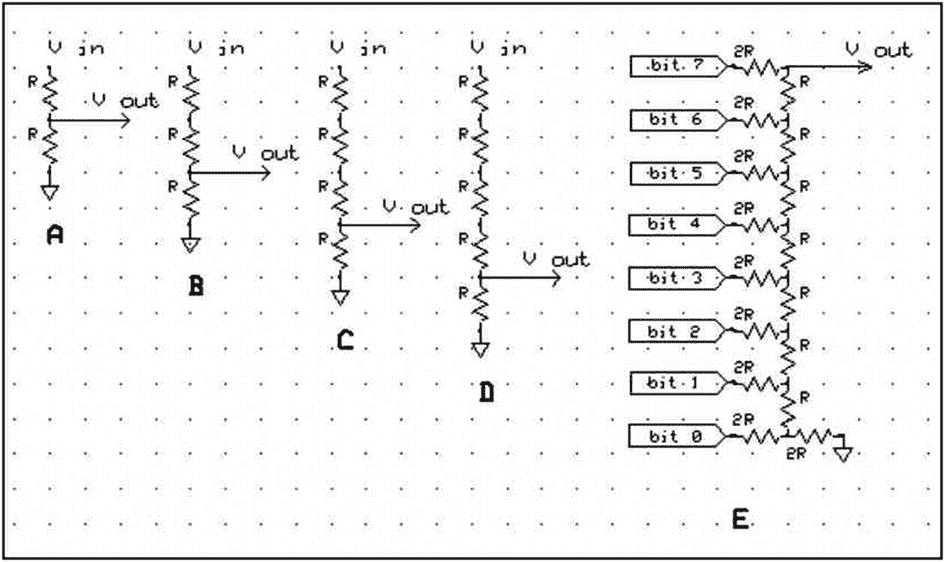
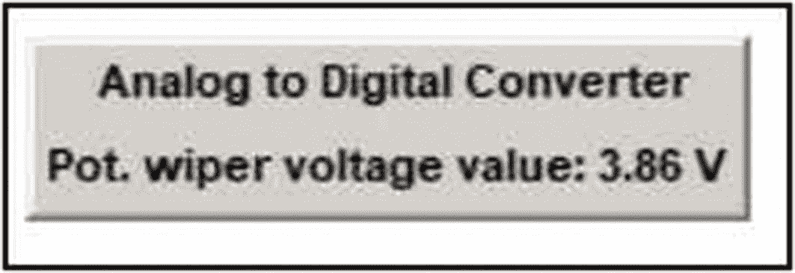

# 六、输入和输出的模拟或数字转换

在前一章中，开发了激活 8 位或二进制字节 LED 显示器的单个元件并查看由发光二极管表示的数字的十进制数字等价物的能力。DAQFactory 软件中的显示用 LabJack 硬件可视化。在本练习中，由屏幕按钮和数据输入编辑框激活的一系列 DAQFactory 序列显示输入编辑框的十进制值的二进制等效值。

在本练习中，将一个小于 255 的十进制值输入到主控制屏幕上的编辑框中，该编辑框位于一组组件面板中，这些组件控制转换和显示选项，如各个按钮上的标签所示。如图 [6-2](#Fig2) 所示，面板包含上下调节二进制值的功能和 LED 显示清除功能。实际的数值转换是通过调用基于标准数值分析的转换算法的脚本序列来完成的。顺序在章节代码清单的清单 [6-1](#PC1) 中。

在本练习和之前的练习中，数值已经在由 2 <sup>n</sup> 和 10 <sup>n</sup> 组成的两个不同基数编号系统之间进行了转换。编号系统有不同的基础，并产生不同的数字序列来表示手头相同数量的单位或项目。改变所需数字的类型和数量是数学中的一个练习，它总是产生整数，这些数字代表两个基数中任何一个的整数单位的相同数量。

模拟和数字电信号值之间的转换通常不会产生完全相同的结果。理论上，当模拟信号从一个值变化到另一个值时，它平滑而连续地变化。模拟值的电子、数字表示必须将模拟信号的变化范围分成有限数量的间隔，该间隔等于数字显示器中可用的二进制基本位数。8 位二进制数字显示器可以表示 0 到 255 之间的十进制数。如果我们希望用以前开发的 8 位数字光显示器来表示从 0 到 5 伏变化的电信号，那么可用的 256 个二进制数字中的每一个必须表示 5.0/256 = 0.0195 V 或大约 19.5 mV。

如果二进制阵列中的 LED 数量从八个增加到十个，那么 10 位 LED 显示器可以表示 2 个 <sup>10 个</sup>或 1024 个十进制数值。10 位阵列能够将 5.0 V 信号分为 5.0/1024 = 0.004882812 伏或约 4.88 mV。

类似地，将阵列扩展至 12 位可以表示约 1.22mV/位的 5.0 V 信号。

可用位数通常称为转换器或转换分辨率。

需要在模拟和数字格式之间转换的实验必须仔细设计和组装，以补偿这些不精确的转换所引入的误差。

ADI 公司提供涵盖模数转换发展史的优秀参考书籍的硬拷贝版本或可下载的 pdf 章节系列(Walt Kester， *Analog-Digital Conversion* ，ADI 公司，2004 年，ISBN 0-916550-27-3)。ADI 公司提供两个出色的教程 MT-015 和 MT-016，它们解释了数模转换(DAC)的基础知识和更高级的主题，并附有大量可供进一步研究的参考资料。(参见“讨论”)

在数字表示中，最右边的位称为最低有效位(LSB)，而最左边的位是最高有效位(MSB)。(基数的指数幂随着左边数字位置的增加而增加。)

许多模数转换器(ADC)集成电路器件可用于电子信号的转换。目前使用的转换机制有多种，如电平转换器或 flash 转换器、逐次逼近型寄存器、σ-δ型转换器，以及电子文献中详细讨论其优势和局限性的其它工艺。 <sup>[1](#Fn1)</sup> (另见前面提到的 ADI 公司。)根据图 [6-1](#Fig1) 中的电路 A–D，用于降低电信号电压电平的电阻分压器电路也可用于将电压电平分成 n 个部分。从 A 到 D 越来越复杂的电路也被称为开尔文分压器，可以追溯到 19 世纪中期。



图 6-1

ADC 和 DAC 电阻网络

在图 [6-1](#Fig1) 的电路 A 中，如果电阻的值相等，分压电路将输入电压减半，如 V<sub>out</sub>= V<sub>in</sub>*(R/R+R)。

在图 [6-1](#Fig1) 的电路 B 中，输出电压为输入的三分之一，为 V<sub>out</sub>= V<sub>in</sub>*(R/R+R+R)。电路 C 和 D 中所示的四个和五个等值电阻分别将分压降低到输入电压的四分之一和五分之一。

一般来说，可以看出，输入电压和地之间的 n 个串联电阻将提供一系列连接点。输入电压为 n 时，每个电阻的压降是输入电压的 1/n。一串串联电阻和降压结是“flash”型模数转换器(集成电路)背后的机电基础。

从本质上讲，将数字信号转换成模拟信号是 ADC 过程的逆过程。与能够将输入划分为 256 个离散电压电平的二进制 8 位 ADC 一样，二进制 8 位数模转换(DAC)的反向过程也提供 2 <sup>8</sup> 或 256 个离散输出电压电平。DAC 不产生真正的模拟信号，而是产生模拟波形的阶跃电压近似值。

一种称为 R-2R“梯形”网络的高效转换架构已经开发出来，它仅使用同名的 R 和 2R 两个电阻值。从图 [6-1](#Fig1) 中的电路 E 可以看出，位 0 相对于地处于最低电压，而位 7 处于最高电压。随着电阻堆栈中位置的增加，位值的重要性或“权重”从最低到最高增加。

模拟和数字格式之间的信号转换可以用相对便宜的 IC 器件实现，如单通道、8 位 ADC0804 或 8 通道、10 位 MCP3008。ADC0804 可以与 5v 电池组一起使用，直接驱动 8 个 LED 显示屏，并提供简单、廉价的 ADC 演示。(一个 ADC0804 芯片成本 6 加元。)

除了 8 位 LED 阵列之外，使用 LabJack HMI 系列器件和 DAQFactory 软件监控模拟信号的便利性也通过 U12 系列中 10 位模数转换器的+/-10 伏输入限制和 U3 器件中 12 位转换器的 3.6 伏输入电压限制得到了证明。(参见第[章 1](01.html) ，图 [1-1](01.html#Fig1) ，第 1 项。大多数表面贴装技术(SMT)集成电路在 3.5 伏下工作。)

使用一个简单的电阻分压器将实验范围缩小到转换器可接受的范围，就可以实现比 ADC 制造商指定的电压范围更大的电压范围测量。(见图 [6-1](#Fig1) 。)然后，研究者可以选择使用输入到第 [2](02.html) 章图 [2-6](02.html#Fig6) 和图 [6-10](#Fig10) 和 [6-11](#Fig11) 中的变量值配置窗口的表达式框中的数学公式中的校正系数，来显示实验电压的当前值。如图 [6-11](#Fig11) 和 [6-12](#Fig12) 所示，如果研究人员需要，可以将第二个变量值显示添加到 GUI 中，用于监控施加到 ADC 输入端的实验电压和降低的电压。

## 数模转换

正如“练习路线图”和之前所指出的，数模转换(DAC)不会也不能再现真正的模拟电子信号。所产生的“模拟”信号在 DAC 上被分解成固定数量的离散数字值，并且从离散数量的数字值产生的模拟信号是阶梯波形，其形状类似于原始平滑且连续的模拟信号。

将数字信号转换为模拟输出有两种基本方法。一种方法使用二进制加权电阻值，其中各个数字位信号施加于电阻，电阻比与二进制幂级数成比例。构建这种类型的 DAC 经常需要非标准电阻值。DAC 的另一种方法更容易实现，如图 [6-1](#Fig1) 的电路 E 所示。R-2R 梯形电阻产生一个输出信号，该信号由梯形电阻体内的数字输入之和构成。第二种方法有几个优点，因为只需要两个电阻值。梯形电路可扩展至所需的位数，输出阻抗始终恒定，等于梯形电路中使用的较小电阻值。

## 实验:LabJack-DAQFactory 十进制到二进制的转换

### 五金器具

在前一章的练习中组装和测试的按钮控制、缓冲、8 位字节 led 显示器将作为转换后的十进制值的单个位显示或输出寄存器。

### 软件

1.  A panel grouping consisting of the components depicted is assembled on the main screen.

    

    图 6-2

    十进制到二进制数转换器的 DAQFactory 面板

    面板由两个文本组件配置而成，显示在面板的顶部两行。编辑框组件接收要处理的数值，并将该值输入所需的变量。第四行按钮组件激活转换序列，底部一行按钮执行标题上显示的操作。

1.  必需的脚本

    图 [6-2](#Fig2) 的分组“十进制到二进制转换器”面板需要四个脚本来激活转换器位显示，将二进制显示增加一，将数值减少一，转换输入的十进制数，然后显示二进制值，并清除显示。

本章末尾的清单 [6-1](#PC1) 至 [6-4](#PC4) 中提供了各个序列代码。

### 模数转换

为了演示利用 DAQFactory 软件和 LabJack HMI 实现模数转换的简易性，配置了如图 [6-3](#Fig3) 所示的 ADC 面板。该面板由三部分组成，一个作为标题的文本条目，一个显示通道[0]或感兴趣通道的当前值的变量值读数，以及灰色面板背景。



图 6-3

ADC 面板

模数转换电路如图 [6-4](#Fig4) 所示，其中电位计的两端连接在+5 V 和 U12 的接地端子之间，游标连接到 AI 0，模拟输入零点，螺丝端子。


图 6-4

可调模拟信号源

如前所述，通过使用基于电阻的分压器来降低施加于转换器的信号强度，可以使用 ADC 来跟踪超出 ADC 电子设备安全工作限值的电压波动。降低的电压 V <sub>out</sub> 可以通过以下分压器等式计算:

V<sub>out</sub>= V<sub>in</sub>*(R<sub>1</sub>/(R<sub>1</sub>+R<sub>2</sub>))

其中 R <sub>1</sub> 和 R <sub>2</sub> 是连接在 V <sub>in</sub> 和地之间的一对串联电阻的电阻值，V <sub>out</sub> 是在 R <sub>1</sub> 与 R <sub>2</sub> 的连接点和地之间观察到的电压。(参见图 [6-1](#Fig1) 中的电路 A)。)

实现 ADC LED 阵列照明二进制显示器的成本较低但更复杂，可以用德州仪器(ti)成熟的 ADC0804 芯片组装。(一份 57 页的 pdf 文档可从 [`www.ti.com/lit/ds/symlink/adc0804-n.pdf`](http://www.ti.com/lit/ds/symlink/adc0804-n.pdf) 获得)。)

pdf 数据表注明了以下内容:

*   无需接口逻辑，可作为完整的独立器件工作，访问时间为 135 ns，差分电压输入，MOS 和 TTL 电压电平兼容，能够使用 2.5 基准电压源、片内时钟、0–5v 输入范围和 5v 电源，无需调零，标准 20 引脚 DIP 封装，转换时间为 100 us


图 6-5

8 位 LED ADC 显示器

图 [6-5](#Fig5) 描述了作者使用德州仪器 ADC0804 8 位逐次逼近型模数转换器开发 ADC 硬件演示所用的电路。为了在原型板上实现，作者使用 3 mm 红色 led 和 1kω限流电阻作为显示器，使用 4 节 AA 电池镍金属氢化物电池组作为电源，并连接到 5kω电位计的游标引线，该电位计连接在标称 5v 电源和地之间，类似于图 [6-4](#Fig4) 中所示的电路。当电位计上的轴旋转时，游标电压提供变化的模拟电压信号，用于转换成数字格式来驱动二进制 led。

图 [6-5](#Fig5) 中描述的数字地全部连接到公共连接，然后接地到电源的负端。作者在原型板上实现的电路中包含一个开/关开关，但它并不是启动电路动作所必需的，因为当系统通电时，转换会立即开始。要转换的电压施加于 IC 的引脚 6。

### 观察

### DAQ factory–lab jack HMI 模数基数转换

在编辑框中输入一个十进制值并点击输入脚本按钮，对应于输入的十进制数字值的二极管将会亮起。输入数值 25 时，应点亮 2 个 <sup>0</sup> (1)、2 个 <sup>3</sup> (8，即 2 × 2 × 2)和 2 个 <sup>4</sup> (16，即 2 × 2 × 2 × 2)二极管的单元，以显示 25 的二进制等效值(即 1 + 8 + 16)。

单击增加或减少按钮应该将显示的二进制值增加或减少 1，而清除按钮应该清除显示。

### 模数电子信号转换

如果没有机械限制或不连续性，在 10kω电位计两端连接一个标称 5 V 信号，理论上应能产生一个平滑变化的模拟游标电压，范围为 0 至 5V。

安装在 U12 中的 10 位 ADC 理论上能够将 5 V 模拟信号分成 1024 个 0.0048828 伏特或 4.883 mV 的单元。变量值显示器被配置为读取如图 [6-4](#Fig4) 所示接线的 10kω电位计的游标上的电压。当旋转电位计轴时，当变量值显示设置为显示 AO 0、模拟输出零、通道上的数据至三位小数时，DAQFactory GUI 屏幕上显示 0.010 V 至 4.219 V 的值。下电压值显示从 0.005 波动到 0.020，上电压值显示从 4.209 波动到 4.365。

### ADC0804: 8 位二进制 LED 显示器

图 [6-6](#Fig6) 是图 [6-5](#Fig5) 中电路的电池供电工作示例照片，装配在试验板上，用于直观演示 ADC。仔细检查视野右上角的二极管，会发现 4 位、8 位和 64 位指示灯亮起，指示总值为 76。电压源是视野底部中央可见的 5kω电位计的游标引线。

当图 [6-5](#Fig5) 的电路通电时，代表数字化游标电压电位的二进制等值的单个 led 立即亮起。将电位计的轴从一个极限位置旋转到另一个极限位置，显示二极管照明序列，其中二进制数从 0 增加到 255 或相反。通过缓慢旋转轴，可以在二进制显示中跟踪单个计数。如前所述，充满电后，电池组产生标称 5 V 电压，施加于电位计两端。


图 6-6

8 位 LED ADC 显示器照片

施加的电压和二进制显示之间的相关性是通过测量然后比较施加到输入引脚#6 的实际电压和由 8 位显示阵列的发光二极管显示的二进制值来建立的。

检查图 [6-7](#Fig7) 的列表数据和 ADC0804 数据手册发现，施加的电压与产生的数字值之间并不存在 1:1 的对应关系，因为施加的电压为 5.25 时产生的输出仅为 253。利用基准电压输入引脚(引脚#9)可以校正 ADC 差异，如 IC 数据手册所述。(参见“讨论”)


图 6-7

ADC0804 线性度

### 讨论

ADI 公司出版物*模数转换*第 [1](01.html) 章的图 1.1 有助于理解 ADC 和 DAC 的概念。模拟。com/media/en/training-研讨会/设计-手册/数据转换-手册/第一章。pdf 。该图的标题为“18 世纪早期二进制加权水计量系统”，包含十九世纪在土耳其伊斯坦布尔实施的水计量系统的一系列侧视图和俯视图。这些图表记录了 DAC 在重力驱动、水力配水和“加权平均”计量系统方面的实施情况。

模拟电子信号值和数字数值表示之间的相互转换很少是完全等价的。ADC0804 等传统 ADC 使用 8 条信号线的并行输出，每条信号线代表 2 的幂。并行输出有助于组装图 [6-6](#Fig6) 的电池供电的可视 LED 显示器。然而，LabJack 器件中使用的新技术不使用 ADC 的“并行”输出配置，而是依靠更简单的方式来实现串行数据输出。串行数据输出协议的速度足以监控多种类型的传感器，但高速仪器通常需要使用并行转换器来跟上数据生成速率。

应用分压器时必须小心，因为所选电阻值的比值必须将信号电压降至所需水平，但单个电阻值应尽可能低，以允许足够的电流通过，从而驱动“下游”器件或 ADC。

ADC 产生的数字由并行信号输出组成，以驱动“下游”器件的逻辑，如微处理器、七段 LED 数字显示器，或者在本初级练习中的 8 位二进制 LED 显示器，但其能够安全提供的电流输出通常有限。在一些高电流需求显示器中，可能需要缓冲 ADC 输出。

在使用 DAQFactory 软件的 LabJack HMI 和 ADC0804 8 位 LED 显示器的装配或显示器与 RPi 的接口之间，实现 ADC 和 DAC 演示所需的时间和精力有很大的不同。

ADC0804 是一款单通道器件，需要一个调整至 0–5v 范围的可变电压源输入。IC 有一个参考电压引脚#9，可用于调整 255 位电平的步长。默认设置为每数字增量 19.5 mV，因此整个 5 V 输入范围将产生 0–255 二进制数字输出。(有关使用步长调整的更多信息，请参见德州仪器 ADC0804 数据手册。)需要一个时钟来运行转换逻辑，为简单起见，使用内部时钟需要一个串联电阻和电容(RC)网络。所需的 RC 组合连接在时钟输入和时钟 R 引脚(引脚#4 和#19)之间。RC 时间常数最终决定 IC 对引脚#6 上的电压进行采样的频率，以便在输出引脚上产生转换结果。

除了时钟和输入布线之外，ADC0804 演示练习还需要一个 5 V 电源和八个 LEDS 及其限流电阻。

正如在前面的练习中所提到的，在系统组装时，研究人员应该尽可能地测试每个组件。每个 LED 和限流电阻都可以通过在将连接到 ADC0804 的电阻端施加 5 V 电压来测试。

在创建按钮代码的过程中，演示了使用以前编写的脚本作为函数的能力。如前一练习所述，较大数值的数值转换需要增加适当数量的数字输出线路、通道和二极管，并修改脚本代码。

一个 8 位字节提供 1/2<sup>8</sup>或 1/256 的分辨率。图 [6-2](#Fig2) 中的十进制到二进制转换器面板包含表示一位数分辨率的增加和减少按钮。如果实验设置可能产生 0 至 10 伏的变化 DC 信号，则 8 位转换能够解析出 10/256 = 0.0390625 或 39.1 mV。在 LED 显示库中增加两个以上的位和相应的软件变化将允许 10 V 信号范围扩展到 1024 个二进制数字，提供 1024 或毫伏灵敏度或分辨率中的一部分的近似划分。将数字能力提高到 12 位将提供 4096 分之一或 0.0244% (244 ppm，百万分之一)的灵敏度或分辨率。

GUI 数字显示除了其当前值之外，不传达关于被监控电压值的任何附加信息。除非数字值有明显的稳定增加或减少的趋势，否则无法从监控变量值的数字显示中获得额外的信息。然而，在生产过程或实验测量被监控并且过程变量或测量结果的恒定性是 SCADA 系统的主要目标的许多情况下，诸如定时记录的不同形式的数据呈现可能具有更大的价值。

## 利用微控制器进行模数转换

如前五个练习中所述，更紧凑、更便宜的 SMT 设备能够在 DAQFactory SCADA 软件和实验传感器或过程管理硬件之间实现接口，并以微控制器的形式出现。(参见第 [9 章](09.html)。)

Arduino 微控制器是易于获得、易于使用的紧凑型设备，内置 10 位逐次逼近型 SMT 模数转换器，具有 6 个输入通道。ADC 芯片能够在其 16 MHz 时钟的 25 个周期内将输入电压转换为数字。每次转换 400 微秒)。

Arduino 之类的微控制器是一种串行设备，为了在 DAQFactory 控制屏幕和微控制器 LED 阵列之间来回传递信息，控制屏幕和控制器都必须像前面的练习一样读取和写入串行端口。

串行通信基于 1 和 0 的 ASCII 位模式，允许传输数字和字母控制字符，如换行和回车。虽然 ADC 硬件可以产生一位数或多位数的整数位计数，但串行端口的每一端都必须有一定数量的字符识别和解释逻辑软件，以便创建一个正常工作的通信系统。

### 实验的

通过 DAQFactory 控制面板和 Arduino 控制的二进制阵列之间的串行连接实现十进制到二进制显示可以从图 [6-8](#Fig8) 中描述的 DAQFactory 面板的创建开始。


图 6-8

用于串行控制 Arduino 二进制 LED 显示器的 DAQFactory 控制面板

图 [6-8](#Fig8) 中使用了一个文本组件、一个编辑框和四个按钮。

图 [6-9](#Fig9) 显示了编辑框配置窗口，该窗口为创建框标题和选择各种选项和动作提供了空间。


图 6-9

编辑框配置窗口

本章末尾的清单 [6-5](#PC5) 到 [6-9](#PC9) 中提供了实现串行面板连接到微控制器的支持 DAQFactory 脚本和 Arduino 草图代码。

为了将微控制器板上的 ADC 用作串行连接的传感器读数设备，可以如图 [6-10](#Fig10) 所示配置一对在 DAQFactory 屏幕上分组为一个面板的变量值显示组件。使用 SCADA 软件的通道功能，可以同时显示 ADC 的整数计数和与计数值相对应的计算电压值。(这里只粗略介绍了在两个系统之间提供数据流所需的更复杂的设置。更多细节在第 [11 章](11.html)中提供。)


图 6-10

整数 ADC 计数和计算的 ADC 电压的可变值元件显示

如图 [6-10](#Fig10) 所示，DAQFactory 页面上有两个变量值显示。

图 [6-11](#Fig11) 和 [6-12](#Fig12) 显示了显示原始计数的整数 ADC 计数显示和使用表达式计算 ADC 即时电压值的 ADC 电压值显示的配置窗口。


图 6-12

计算出的 ADC 电压的变量值配置页面


图 6-11

串行传输的整数 ADC 计数的变量值配置页面

图 [6-13](#Fig13) 记录了建立串行微控制器 SCADA 软件通信所遵循的表格、窗口和条目的顺序。


图 6-13

一种实现 DAQFactory 串行通信的配置序列

图 [6-13](#Fig13) 显示了从微控制器 ADC 读取串行“数据流”到 DAQFactory 显示组件所需的主要程序动作的标题概要。(详见第 [11 章](11.html)。)第 1 项标记了正在使用的 DAQFactory 程序的页面列表，在该页面上，图 [6-10](#Fig10) 的面板由所需部件组装而成。第 2 项表示通道列表，其中 ArduinoStream 通道由作者创建，用于接收从微控制器输出到串行端口的 ADC 数据(另见图 [2-3](02.html#Fig3) )。第 3 项和第 4 项是串行端口配置窗口和串行设备命名和配置窗口，将在第 [11](11.html) 章中详细介绍(参见图 [11-5](11.html#Fig5) 、 [11-6](11.html#Fig6) 和 [11-7](11.html#Fig7) )。

要安装和使用清单 [6-10](#PC10) 中的代码，点击快速➤设备配置并选择适当的设备，在作者的演示案例中是 Comm4。在“以太网/串行设备”窗口中，找到所需的设备并选中旁边的框(图中的 Comm4 ),然后单击“协议配置”按钮，调出“I/O 类型和功能”窗口。选择“接收时”功能，然后将清单 [6-10](#PC10) 的代码复制并粘贴到空白处。(参见 [11](11.html) 章节中的图 [11-7](11.html#Fig7) 。)

为了给本练习演示提供可变信号模拟，可以将电位计的两端连接在+5 V 电源和微控制器地之间，以及连接到 Arduino ADC A0 输入的游标引线之间。(参见图 [6-4](#Fig4) 的类似电路图，用于 LabJack HMI。)

根据从多个经过测试且功能正常的组件构建复杂系统的理念，我们可以从加载并启动清单 [6-11](#PC11) 中的微控制器草图代码开始。草图运行后，可以从工具菜单打开 Arduino 串行监视器，在串行监视器视野的左侧应该可以看到 ADC 计数流。确认数据流生成后，串行监视器关闭，微控制器 IDE 最小化。

包含变量值面板的 DAQFactory 程序启动，如果所有配置正确，图 [6-10](#Fig10) 的屏幕组件应能响应系统噪音和电位计刮水器控制轴的任何重新定位。

### 观察

启动用于 ADC 读取和串行打印到所用端口的微控制器草图后，应该可以在微控制器 ide 的串行监视器窗口的视野左侧看到一串数值，其值介于 0 和 1024 之间。

微控制器在后台运行时，微控制器原型板上的电位计轴旋转一整圈，电压的整数显示从 0 到 1024 和 0 到 5.000 伏，如图 [6-11](#Fig11) 和 [6-12](#Fig12) 的配置窗口中的设置所定义。

### 讨论

### 无响应显示器的诊断

如果变量值面板没有响应输入数据流，展开通道表并确认数据被通道捕获，如图 [6-14](#Fig14) 所示。


图 6-14

一个活动信道时间戳数据列表

如果通道没有接收到 ADC 数据，则可以访问 DAQFactory 程序的串行端口监视器，以确认数据正在到达显示程序的串行端口。串行端口监视器通过快速➤设备配置菜单和设备选择列表面板进入以太网/串行设备窗口，如图 [6-13](#Fig13) 的第 4 项所示。点击配置按钮正下方的监视器按钮将调出 DAQFactory 串行监视器，如图 [6-15](#Fig15) 所示。


图 6-15

DAQFactory 串行监视器显示通过正在使用的端口的数据

如果数据正在到达 DAQFactory 串行端口，但没有被传输到正确的通道，可以通过确保在协议列表中选择了正确的协议，并且正确的解析代码(列表 [6-10](#PC10) )已经输入到协议配置窗口的“接收时”I/O 类型和功能条目中，来检查端口串行协议。 <sup>[2](#Fn2)</sup>

### 系统开发和编程

虽然建立 SCADA-实验串行连接的微控制器方法比使用市场上可买到的 DAQ 系统要便宜得多，但是所需的实验开发时间和精力是相当大的，并且该系统缺乏商业产品中的鲁棒性。

## 利用 Raspberry Pi 实现输入和输出的模拟和数字转换

由于之前提到的可用功率限制，可以使用 RPi 及其通用输入/输出引脚阵列创建电子数字编号的 LED 可视化。可以使用 Raspberry Pi Foundation 提供的两个 Python 库演示二进制和十进制之间的数字转换以及 ADC。RPi。GPIO 库允许对 40 针阵列的低级访问，而 gpiozero 库代码提供对许多硬件设备的访问。每个库的文档都可以从 RPi Foundation 网站上获得，两个库版本之间的差异将在接下来的几个练习中进一步阐述。

### 二进制-十进制转换

作为对前面练习中介绍的 RPi 编程和硬件使用的补充，在本练习的最初部分，我们组装了一个 12 位十进制到二进制转换 LED 可视显示器。转换器的代码在本章末尾的清单 [6-12](#PC12) 中，转换的输出如图 [6-16](#Fig16) 所示。


图 6-16

十进制值的 RPi 12 位二进制显示

12 个 led 的银行组装和测试，以提供几个 Python 和 ADC 程序的视觉输出。十进制到二进制数字转换器、10 位 ADC 和 12 位 ADC 可以共用同一硬件，以图形方式直观显示这些类似程序的各种输出。

## 带树莓 Pi 的 ADC

如前所述，RPI 需要外部器件来对模拟信号进行数字化处理，RPi 基金会选择 MCP3008 和 MCP3201 ICs 作为 10 位和 12 位数字转换的合适器件。IC 通过串行外设接口(SPI)串行协议与 RPi 通信。ADC 数据以连续的位序列输出到 RPi，RPi 接收并解释 10 位转换值。MCP3008 输出可以格式化为 0 至 1.0 的浮点归一化值，与采样电压和施加于基准引脚的电压之差成比例，也可以格式化为 1 至 1024 的整数值。当 ADC 芯片以 RPi 的 3.3 电源为基准时，归一化输出必须乘以施加的标称电压，或者为了精确起见，乘以 VOM 测量的基准电压，以获得实际采样电压。MCP3008 的整数输出到采样电压值的转换包括将输出值除以 1024 并乘以参考值电压。

表示模拟转换的浮点归一化值不容易用于照亮 10 位二进制 LED 可视显示器。数字整数输出更容易与二进制 LED 显示器接口。

### 实验的

为了将清单 [6-12](#PC12) 和 [6-13](#PC13) 的代码用于十进制到 10 或 12 位二进制 LED 可视显示器和本练习中列出的 MCP 芯片，RPi 必须配置为使用串行外设接口(SPI)协议，如图 [6-21](#Fig21) 和 [6-22](#Fig22) 所示。

来自偏置在 RPi GPIO 阵列的 3.3 V 和地之间的 10kω电位计的游标的连续可变电压用于产生 MCP3008 ADC 集成电路的测试电压。RPi 从 IC 读取串行输出，解释流数据，并产生调整后的 10 位整数输出，随后用于激活 10 单元 led 显示器。

图 [6-17](#Fig17) 是用于实现显示的电路的半示意图。游标电压施加于 IC，IC 将信号从模拟格式转换为数字格式，并将数据以串行外设接口(SPI)形式输出至 RPi GPIO 引脚。RPi 接收流数据，解释转换后的数据，并解析整数输出，以驱动转换后的游标电压信号的适当二极管表示。


图 6-17

RPi-MCP3008 电路，用于电位计游标电压的 10 位二进制 LED 显示

图 [6-17](#Fig17) 的左边是控制和接收 IC 数据的 Raspberry Pi GPIO 引脚连接，右边是 RPi GPIO 二极管阵列连接。

图 [6-18](#Fig18) 显示了在模拟实验设置期间 RPi 的屏幕输出，其中诊断打印语句已被插入到代码中，以验证系统的运行。电位计游标已经旋转，以产生尽可能接近序列 123 的数字输出。


图 6-18

ADC 期间的 RPi 屏幕输出

### 观察

图 [6-18](#Fig18) 显示了 Python 代码的连续输出，该代码解析数字化、转换后的游标电压值，以驱动输出值的 10 位 LED 二进制表示的各个元素。对输出和正在处理的实际代码进行更仔细的检查将会确认，只有当余数变量“rem”具有正值或高值时，程序才会打印诊断输出。将电位计轴从一个极端旋转到另一个极端会使显示从 1 或 0 变化到 1023。从图 [6-18](#Fig18) 的数据变化中可以看出，系统在雨刷输出值中包含了一定量的噪声。

图 [6-19](#Fig19) 描述了 RPi GPIO 阵列与原型试验板上的 12 位 LED 显示器的接口。发光二极管对应于二进制位模式 2 + 4 + 8 + 16 + 32 或十进制 62。


图 6-19

十进制值 62 的 12 位二进制 LED 显示

### 讨论

图 [6-19](#Fig19) 描绘了一组 12 个 3mm led，可用于 10 位或 12 位转换演示。MCP3201 是一款 12 位转换 IC，可以设置为二进制可视化显示器。小型 3 mm 二极管和 1kω限流电阻用于最大限度地降低视觉显示器中有大量 led 的计算机的电流消耗。

RPi 电路、编程和布线的数字和照片反映了使用非常便宜的系统所需的复杂性。从图 [6-19](#Fig19) 的照片中可以看出，调查人员需要注意 RPi GPIO 线的跳线连接以及控制 MCP3008 或 MCP3201 转换功能所需的跳线连接。激活引脚阵列输出的 10 或 12 位二进制 LED 显示所需的 RPi GPIO 线连接可以在装配期间用清单 [6-14](#PC14) 进行测试。当每个引脚名称出现在交互式屏幕上时，连接到标称引脚的相应 LED 应点亮 3 秒钟。图 [6-20](#Fig20) 描绘了引脚和 LED 测试的测试程序输出显示。


图 6-20

LED 阵列测试输出

列表 [6-15](#PC15) 可用于将 GPIO 阵列电压值重置为零。

前面 ADC0804 所展示的并行 ADC 集成电路在一定程度上已被众多串行通信协议所取代。使用两根或少量导线进行长距离串行通信，比使用 8、10、12 或更多并行导线来传输高频数字数据位要实用得多。防止“串扰”的屏蔽、物理尺寸和费用只是在密集的平行线路上进行高速数据传输时会遇到的一些问题。

model 3 Raspberry Pi 可以配置为使用多种串行通信系统中的一种。图 [6-21](#Fig21) 和 [6-22](#Fig22) 显示进入首选项➤配置窗口，该窗口允许执行所需的协议。


图 6-22

接口选择窗口


图 6-21

RPi 首选项选择菜单

选择串行外设接口(SPI)协议允许 RPi 与以连续高低位脉冲流“流出”数据的器件通信。ADC 就是这样一种数据流设备。SPI 协议基于主从概念，三个或四个电气连接在主机和一个或多个从机之间形成一条电子总线。时钟同步数据传输。SPI 配置中的四条线路是主机输出从机输入(MOSI)、主机输入从机输出(MISO)、时钟线(SCLK)和芯片从机选择(CSS)。

如果有许多从机，SPI 可能会变得难以实现，第二种流行的协议是集成电路间(I <sup>2</sup> C 或 I2C)协议。I2C 是双线式实现，固定速度较慢，使用可寻址位置，比 SPI 功耗更高，噪声更低。I2C 是唯一确认数据传输的协议。

在图 [6-22](#Fig22) 中，有第三个通信接口，称为串行接口，实现通用异步接收和传输(UART)协议。异步通信只在两个设备之间进行，不需要外部时钟，但在两端使用一致同意的数据传输和接收速率。双线总线的每一端都有一个 IC，用于在并行和串行数据流之间进行转换。在 UART 传输中，定义的格式用开始和停止标记指定数据的开始和结束。串行协议广泛用于微处理器通信。

有关这三个协议的更多细节，请参见*发明者实用电子学*。<sup>T33</sup>

## 代码列表

```c
 /*
  AnalogReadSerial
  Reads an analog input on pin A0, prints the result to the serial monitor.
  Attach the center pin of a potentiometer to pin A0, and the outside pins to +5V and ground.
 */

// the setup routine runs once when you press reset:
void setup() {
  // initialize serial communication at 9600 bits per second:
  Serial.begin(9600);
}

// the loop routine runs over and over again forever:
void loop() {
  // read the input on analog pin 0:
  int sensorValue = analogRead(A0);
  // print out the value you read:
  Serial.println(sensorValue);
  delay(50);        // delay in between reads for stability
}

Listing 6-11Arduino Sketch Code to Read A0 ADC Channel and Write Data to Serial Port on 50 ms Intervals

```

```c
if (strIn == Chr(13))
   private string datain = ReadUntil(13)
   Channel.AddValue(strDevice, 0, "Input", 0, StrToDouble(DataIn))
   Endif

Listing 6-10DAQFactory “On Receive” Code for the ArduinoStream Channel

```

```c
// DAQFactory - Arduino LED Illuminated Digital Bits in Byte
// Register DAQFtry screen bttns D0 to D7 light LEDs in digtal
// array. Total value of illuminated bits calculated and
// register cleared with buttons. DAQFtr uses scripting to
// evaluate digital bits and serial port transmisons to
// illuminate LEDs after selectn by case statement.
//
// digital pins in use 3,4,5,6,7,8,9, and 10
int pv_one = 3;
int pv_two = 4;
int pv_four = 5;
int pv_eight = 6;
int pv_steen = 7;
int pv_threetwo = 8;
int pv_sixfour = 9;
int pv_onetwoeight = 10;
int diod_num;
String inString = "";
//
void setup() {
  Serial.begin(9600);
//
}
//
void loop() {
  while (Serial.available() > 0 ){       // read serial input
 int inChar = Serial.read();
    if (inChar == '3') {
    pinMode(pv_one, OUTPUT);             // units value 2 exp 0
    digitalWrite(pv_one, HIGH);
  }
    if (inChar == '4') {
      pinMode(pv_two, OUTPUT);             // 2 exp 1 = 2
      digitalWrite(pv_two, HIGH);
  }
    if (inChar == '5') {
      pinMode(pv_four, OUTPUT);            // 2 exp 2 = 4
      digitalWrite(pv_four, HIGH);
  }
    if (inChar == '6') {
      pinMode(pv_eight, OUTPUT);           // 2 exp 3 = 8
      digitalWrite(pv_eight, HIGH);
  }
    if (inChar == '7') {
      pinMode(pv_steen, OUTPUT);           // 2 exp 4 = 16

      digitalWrite(pv_steen, HIGH);
  }
    if (inChar == '8') {
      pinMode(pv_threetwo, OUTPUT);        // 2 exp 5 = 32
      digitalWrite(pv_threetwo, HIGH);
  }
    if (inChar == '9') {
      pinMode(pv_sixfour, OUTPUT);         // 2 exp 6 = 64
      digitalWrite(pv_sixfour, HIGH);
  }
    if (inChar == 'a') {
      pinMode(pv_onetwoeight, OUTPUT);     // 2 exp 7 = 128
      digitalWrite(pv_onetwoeight, HIGH);
  }
    if (inChar == 'z') {
      // special case to clear array
  pinMode(pv_one, OUTPUT);
  digitalWrite(pv_one, LOW);
  //
  pinMode(pv_two, OUTPUT);
  digitalWrite(pv_two, LOW);
  //
    pinMode(pv_four, OUTPUT);
  digitalWrite(pv_four, LOW);
  //
  pinMode(pv_eight, OUTPUT);
  digitalWrite(pv_eight, LOW);
  //
  pinMode(pv_steen, OUTPUT);

  digitalWrite(pv_steen, LOW);
  //
  pinMode(pv_threetwo, OUTPUT);
  digitalWrite(pv_threetwo, LOW);
  //
  pinMode(pv_sixfour, OUTPUT);
  digitalWrite(pv_sixfour, LOW);
  //
  pinMode(pv_onetwoeight, OUTPUT);
  digitalWrite(pv_onetwoeight, LOW);
   }
 }
}

Listing 6-9Arduino Sketch Code for Diode Array Illumination

```

```c
/ClearByteDisplay
//Nov.14/09
//This sequence just re-zeros the 8 bit byte display
device.ardyRb.Write('z' + Chr(10))

Listing 6-8DAQFactory Sequence Code for Clearing the Display

```

```c
//DecBinDisplay
//Nov.14/09
//This sequence decreases the screen entered global variable
//Number_To_Convert that was converted and displayed in
//sequence ConvertDecToBinary and runs the decreased value back 
//through the original sequence.
//In the original conversion sequence the Edit Box value, 
//variable, Number_To_Convert is iteratively divided by two till 
//it vanishes so the entered number is saved in Orgnl_N_To_Cnvrt
//
global Orgnl_N_To_Cnvrt
//clear the register of any residual data
ClearByteDisplay()
//re-initialize the working variable to the desired value to be converted
Number_to_Convert = Orgnl_N_To_Cnvrt - 1
//convert and display the bit pattern
DecimalToBinaryCnvrsnRvn1()

Listing 6-7DAQFactory Sequence Code for Decreasing the Converted Value

```

```c
//IncBinDisplay
//Nov.14/09
//This sequence increases the screen entered global variable
//Number_To_Convert that was converted and displayed in sequence
//ConvertDecToBinary. The value of the original variable was 
//iteratively reduced to zero by the conversion code but was
//preserved in the global variable Orgnl_N_To_Cnvrt.
//The preserved number is augmented in value and passed back
//through the original sequence.
//
global Orgnl_N_To_Cnvrt
//
//any residual values on the byte register are cleared
ClearByteDisplay()
//
// the original value is augmented
Number_to_Convert = Orgnl_N_To_Cnvrt + 1
//
//the augmented value is converted and displayed
DecimalToBinaryCnvrsnRvn1()

Listing 6-6DAQFactory Sequence Code for Increasing the Converted Value

```

```c
//Decimal to Binary Conversion
//Oct 14-16, Nov 14/2009, serial port display Jun7/19
//Program Algorithm
//8 LEDs are connected to the  digital output channels D0 (#4) 
//to D7 (#11) on the DB25 output of the LabJack. Each line is 
//buffered/driven with a 4050 buffer.
//An EDIT box accepts the Number_To_Convert and the modulo of
// the value with respect to base 2 is determined for each bit
// of a byte. The bit values are then displayed on the LEDs. In
// this version a quick sequence writes the number of the
// digital pin on the Arduino connected to the diode to be
// illuminated on the serial port.
//A for loop executes 8 times to evaluate each bit of the 
//binary digit
// On the control screen the researcher has the option to
// increase/decrease the conversion value and clear the byte
// register.
//
// Declarations
//
global Number_To_Convert
//Preserve original decimal value entered from the control screen

global Orgnl_N_To_Cnvrt = Number_To_Convert
//
global Converted_Number[0] = 0
global Converted_Number[1] = 0
global Converted_Number[2] = 0
global Converted_Number[3] = 0
global Converted_Number[4] = 0
global Converted_Number[5] = 0
global Converted_Number[6] = 0
global Converted_Number[7] = 0
//
//
//
//
for ( Private.Counter = 0, Counter < 8, Counter++)
      Converted_Number[Counter] = Number_To_Convert %2
      Number_To_Convert = Number_To_Convert/2
      Number_To_Convert = Floor(Number_To_Convert)
   endfor
//
   if (Converted_Number[0] == 1)
//
//      DigOut = 1
device.ardyRb.Write('3' + Chr(10))
   endif
//
   if (Converted_Number[1] == 1)
//
//      DigOut_1 = 1
device.ardyRb.Write('4' + Chr(10))
   endif
//
   if (Converted_Number[2] == 1)
//
//      DigOut_2 = 1
device.ardyRb.Write('5' + Chr(10))
   endif
//
   if (Converted_Number[3] == 1)
//
//      DigOut_3 = 1

device.ardyRb.Write('6' + Chr(10))
   endif
//
   if (Converted_Number[4] == 1)
//
//      DigOut_4 = 1
device.ardyRb.Write('7' + Chr(10))
   endif
//
   if (Converted_Number[5] == 1)
//
//      DigOut_5 = 1
device.ardyRb.Write('8' + Chr(10))
   endif
//
   if (Converted_Number[6] == 1)
//
//      DigOut_6 = 1
device.ardyRb.Write('9' + Chr(10))
   endif
//
   if (Converted_Number[7] == 1)
//
//      DigOut_7 = 1
device.ardyRb.Write('a' + Chr(10))
   endif

Listing 6-5DAQFactory Code for Decimal-to-Binary Conversion via Serial Connection

```

```c
//ClearByteDisplay
//Nov.14/09
//This sequence just re-zeros the 8 bit byte display
//
DigOut = 0
DigOut_1 = 0
DigOut_2 = 0
DigOut_3 = 0
DigOut_4 = 0
DigOut_5 = 0
DigOut_6 = 0
DigOut_7 = 0

Listing 6-4DAQFactory Script Code to Clear Display

```

```c
//DecBinDisplay
//Nov.14/09
//This sequence decreases the screen entered global variable
//Number_To_Convert that was converted and displayed in
//sequence ConvertDecToBinary and runs the decreased value back
//through the original sequence.
//In the original conversion sequence the Edit Box value, 
//variable, Number_To_Convert is iteratively divided by two till
//it vanishes so the entered number is saved in Orgnl_N_To_Cnvrt
//
global Orgnl_N_To_Cnvrt
//clear the register of any residual data
ClearByteDisplay()
//re-initialize the working variable to the desired value to be converted
Number_to_Convert = Orgnl_N_To_Cnvrt - 1
//convert and display the bit pattern

ConvertDecToBinary()

Listing 6-3DAQFactory Script Code to Decrease the Converted Value

```

```c
//IncBinDisplay
//Nov.14/09
//This sequence increases the screen entered global variable
//Number_To_Convert that was converted and displayed in
//sequence ConvertDecToBinary. The value of the original
//variable was iteratively reduced to zero by the conversion code
//but was preserved in the global variable Orgnl_N_To_Cnvrt.
//The preserved number is augmented in value and passed back through the original sequence.
//
global Orgnl_N_To_Cnvrt
//
//any residual values on the byte register are cleared
ClearByteDisplay()
//
// the original value is augmented

Number_to_Convert = Orgnl_N_To_Cnvrt + 1
//
//the augmented value is converted and displayed
ConvertDecToBinary()

Listing 6-2DAQFactory Script Code to Increase the Converted Value

```

```c
//Decimal to Binary Conversion
//Oct 14-16, Nov 14/2009
//Program Algorithm
//8 LEDs are connected to the  digital output channels D0 (#4) 
// to D7 (#11) on the DB25 output of the LabJack. Each line is 
// buffered/driven with a 4050 buffer.
//An EDIT box accepts the Number_To_Convert and the modulo of
// the value with respect to base 2 is determined for each bit
// of a byte. The bit values are then displayed on the LEDs
//A for loop executes 8 times to evaluate each bit of the
//binary digit
// On the control screen the researcher has the option to
// increase/decrease the conversion value and clear the byte
// register.
//
// Declarations
//
global Number_To_Convert
//Preserve original decimal value entered from the control screen
global Orgnl_N_To_Cnvrt = Number_To_Convert
//
Private Converted_Number[0] = 0
Private Converted_Number[1] = 0
Private Converted_Number[2] = 0
Private Converted_Number[3] = 0
Private Converted_Number[4] = 0
Private Converted_Number[5] = 0
Private Converted_Number[6] = 0
Private Converted_Number[7] = 0

//
//
for ( Private.Counter = 0, Counter < 8, Counter++)
      Converted_Number[Counter] = Number_To_Convert %2
      Number_To_Convert = Number_To_Convert/2
      Number_To_Convert = Floor(Number_To_Convert)
   endfor
//
   if (Converted_Number[0] == 1)
//
      DigOut = 1
   endif
//
   if (Converted_Number[1] == 1)
//
      DigOut_1 = 1
   endif
//
   if (Converted_Number[2] == 1)
//
      DigOut_2 = 1
   endif
//
   if (Converted_Number[3] == 1)
//
      DigOut_3 = 1
   endif
//
   if (Converted_Number[4] == 1)
//
      DigOut_4 = 1
   endif
//
   if (Converted_Number[5] == 1)
//
      DigOut_5 = 1
   endif
//
   if (Converted_Number[6] == 1)
//
      DigOut_6 = 1
   endif
//
   if (Converted_Number[7] == 1)
//
      DigOut_7 = 1

   Endif

Listing 6-1DAQFactory–LabJack U12 Decimal-to-Binary Sequence Codes

```

### Raspberry Pi 代码清单

```c
# Utility program to reset the GPIO pin values to 0
import RPi.GPIO as GPIO
# set the pin identity mode
GPIO.setmode(GPIO.BCM)
GPIO.setwarnings(False)
# Reset the array pins to off/false/0
chan_list = (2, 3, 4, 5, 6, 7, 8, 9, 10, 11, 12, 13, 14, 15, 16, 17, 18, 19, 20)
GPIO.setup(chan_list, GPIO.OUT)
GPIO.output(chan_list, GPIO.LOW)delay)

Listing 6-15Utility Program to Reset the GPIO Pin Values to Zero

```

```c
# Test the LED Array on the GPIO pins
#
import RPi.GPIO as GPIO
import time
# set the pin identity mode
GPIO.setmode(GPIO.BCM)
GPIO.setwarnings(False)
# Reset the array pins to on for 3 sec then turn off
for i in range(2, 21):
    GPIO.setup(i, GPIO.OUT)
    GPIO.output(i, GPIO.HIGH)
    print("Testing pin ",i)
    time.sleep(3)
    GPIO.output(i, GPIO.LOW)

Listing 6-14RPi Code for Testing LEDs on GPIO Pin Array

```

```c
# An SPI based program to read an MCP3008 10 Bit ADC
# the referenced voltage range is divided into an integer from
# 0 to 1023 sampled voltage is ADC/1023 * 3.3 volts. A blend of
# GPIO and SPI code is used to run a 10 bit LED display of the
# ADC value.
#
# import the RPi.GPIO low level pin control library
import RPi.GPIO as GPIO
import spidev
import time
# setup the pin identification scheme
GPIO.setmode(GPIO.BCM)
# turn off the array use warnings
GPIO.setwarnings(False)
# ensure all the LED driver outputs are set to output and are zero
for i in range(2, 7):
    GPIO.setup(i, GPIO.OUT)
    GPIO.output(i, GPIO.LOW)
for i in range(13, 18):
    GPIO.setup(i, GPIO.OUT)
    GPIO.output(i, GPIO.LOW)
# create required variables
# the delay time
delay = 0.5   # the value of time variable delay is defined
# the channel to use
pot_chnnl = 0
# create a spidev object of the device connected to the 

# channel in use
spi = spidev.SpiDev()
spi.open(0, 0)
# create the readadc function that checks for the correct channel assignment
# if the channel assignment is correct the adc value is read
# the function returns -1 a channel error or the adc value
def readadc(pot_chnnl):
    # check channel
    if pot_chnnl  > 7 or pot_chnnl < 0:
        return -1
    r = spi.xfer2([1,  8 + pot_chnnl << 4, 0])
    data = ((r[1] & 3) << 8) + r[2]
    return data
#
# the while loop, print out and time delay
while True:
    wpr_vlu = int(readadc(pot_chnnl))
    print("--------------------------------")
    print("Pot wiper value = ", wpr_vlu)
    # The LED Display Code
    # Although initially set to low each binary bit
    # determination must be reset to low as the code cycles in
    # the while loop.
    #
    # first or least significant bit of 2**0 or 1s

    Q1 = wpr_vlu // 2
    rem1 = wpr_vlu % 2
    GPIO.output(2, GPIO.LOW)
    if rem1 == 1:
        print("Q1 = ", Q1, "rem1 = ", rem1)
        GPIO.output(2, GPIO.HIGH)
    # second significant bit of 2**1 or 2s
    Q2 = Q1 // 2
    rem1 = Q1 % 2
    GPIO.output(3, GPIO.LOW)
    if rem1 == 1:
        print("Q2 = ", Q2, "rem1 = ", rem1)
        GPIO.output(2, GPIO.HIGH)
    # third significant bit of 2**2 or 4s
    Q3 = Q2 // 2
    rem1 = Q2 % 2
    GPIO.output(3, GPIO.LOW)
    if rem1 == 1:
        print("Q3 = ", Q3, "rem1 = ", rem1)
        GPIO.output(3, GPIO.HIGH)
    # fourth significant bit of 2**3 or 8s
    Q4 = Q3 // 2
    rem1 = Q3 % 2
    GPIO.output(4, GPIO.LOW)
    if rem1 == 1:
        print("Q4 = ", Q4, "rem1 = ", rem1)
        GPIO.output(4, GPIO.HIGH)
    # fifth significant bit of 2**4 or 16s
    Q5 = Q4 // 2
    rem1 = Q4 % 2
    GPIO.output(5, GPIO.LOW)
    if rem1 == 1:
        print("Q5 = ", Q5, "rem1 = ", rem1)
        GPIO.output(5, GPIO.HIGH)
    # sixth significant bit of 2**5 or 32s
    Q6 = Q5 // 2
    rem1 = Q5 % 2
    GPIO.output(6, GPIO.LOW)
    if rem1 == 1:
        print("Q6 = ", Q6, "rem1 = ", rem1)
        GPIO.output(6, GPIO.HIGH)
    # seventh significant bit of 2**6 or 64s
    Q7 = Q6 // 2
    rem1 = Q6 % 2
    GPIO.output(13, GPIO.LOW)
    if rem1 == 1:
        print("Q7 = ", Q7, "rem1 = ", rem1)
        GPIO.output(13, GPIO.HIGH)
    # eighth significant bit of 2**7 or 128s

    Q8 = Q7 // 2
    rem1 = Q7 % 2
    GPIO.output(14, GPIO.LOW)
    if rem1 == 1:
        print("Q8 = ", Q8, "rem1 = ", rem1)
        GPIO.output(14, GPIO.HIGH)
   # ninth significant bit of 2**8 or 256s
    Q9 = Q8 // 2
    rem1 = Q8 % 2
    GPIO.output(15, GPIO.LOW)
    if rem1 == 1:
        print("Q9 = ", Q9, "rem1 = ", rem1)
        GPIO.output(15, GPIO.HIGH)
    # tenth or most significant bit of 2**9 or 512s
    Q10 = Q9 // 2
    rem1 = Q9 % 2

    GPIO.output(16, GPIO.LOW)
    if rem1 == 1:
        print("Q10 = ", Q10, "rem1 = ", rem1)
        GPIO.output(16, GPIO.HIGH)
    # timing delay
    time.sleep(delay)

Listing 6-13SPI-Based Program to Read an MCP3008 10-Bit ADC

```

```c
# Decimal to 12 Bit Binary LED Visual Display
#
import RPi.GPIO as GPIO
GPIO.setmode(GPIO.BCM)
GPIO.setwarnings(False)
# Ensure all LEDS are OFF and set to output mode
for i in range(2, 15):
    GPIO.setup(i, GPIO.OUT)
    GPIO.output(i, GPIO.LOW)
#
# input dec number to process
#
input_str = input("Decimal to convert to a 12 bit binary display ",)
dec = int(input_str)
print()
# print out screen display headings
print("Quotient and remainder listing for conversion and display illumination.")
print()
# first binary digit of 2**0 or 1s
Q1 = dec // 2
rem1 = dec % 2

if rem1 == 1:
    GPIO.output(2, GPIO.HIGH)
print("For LED 1 Q = ", Q1, "and rem = ", rem1)
#
# second binary digit of 2**1 or 2s
Q2 = Q1 // 2
rem2 = Q1 % 2
if rem2 == 1:
    GPIO.output(3, GPIO.HIGH)
print("For LED 2 Q = ", Q2, "and rem = ", rem2)
#
# third binary digit of 2**2 or 4s
Q3 = Q2 // 2
rem3 = Q2 % 2
if rem3 == 1:
    GPIO.output(4, GPIO.HIGH)
print("For LED 3 Q = ",Q3, "and rem = ", rem3)
#
# fourth binary digit of 2**3 or 8s
Q4 = Q3 // 2
rem4 = Q3 % 2
if rem4 == 1:
    GPIO.output(5, GPIO.HIGH)
print("For LED 4 Q = ",Q4, "and rem = ", rem4)
#
# fifth binary digit of 2**4 or 16s#
Q5 = Q4 // 2
rem5 = Q4 % 2
if rem5 == 1:
    GPIO.output(6, GPIO.HIGH)
print("For LED 5 Q = ",Q5, "and rem = ", rem5)
#
# sixth binary digit of 2**5 or 32s
Q6 = Q5 // 2
rem6 = Q5 % 2
if rem6 == 1:
    GPIO.output(7, GPIO.HIGH)
print("For LED 6 Q = ",Q6, "and rem = ", rem6)
#
# seventh binary digit of 2**6 or 64s
Q7 = Q6 // 2
rem7 = Q6 % 2
if rem7 == 1:
    GPIO.output(8, GPIO.HIGH)
print("For LED 7 Q = ",Q7, "and rem = ", rem7)
#
# eighth binary digit of 2**7 or 128s

Q8 = Q7 // 2
rem8 = Q7 % 2
if rem8 == 1:
    GPIO.output(9, GPIO.HIGH)
print("For LED 8 Q = ",Q8, "and rem = ", rem8)
#
# ninth binary digit of 2**8 or 256s
Q9 = Q8 // 2
rem9 = Q8 % 2
if rem9 == 1:
    GPIO.output(10, GPIO.HIGH)
print("For LED 9 Q = ",Q9, "and rem = ", rem9)
#
# tenth binary digit of 2**9 or 512s
Q10 = Q9 // 2
rem10 = Q9 % 2
if rem10 == 1:
    GPIO.output(11, GPIO.HIGH)
print("For LED 10 Q = ",Q10, "and rem = ", rem10)
#
# eleventh binary digit of 2**10 or 1024s
Q11 = Q10 // 2
rem11 = Q10 % 2
if rem11 == 1:
    GPIO.output(12, GPIO.HIGH)
print("For LED 11 Q = ",Q11, "and rem = ", rem11)
#
# twelfth binary digit of 2**11 or 2048s

Q12 = Q11 // 2
rem12 = Q11 % 2
if rem12 == 1:
    GPIO.output(13, GPIO.HIGH)
print("For LED 12 Q = ",Q12, "and rem = ", rem12)

Listing 6-12RPi Python Code for Decimal to 12-Bit Binary LED Visual Display

```

## 摘要

*   已经介绍了 ADC 和 DAC 的局限性以及整数和浮点(包含十进制的数字)之间的差异。

*   串行和并行信号转换以及各种串行传输协议被引入商用和较便宜的组件组装系统。

*   第 [7](07.html) 章介绍了数模转换的一个重要应用，涉及可变亮度和功率控制。

<aside aria-label="Footnotes" class="FootnoteSection" epub:type="footnotes">Footnotes [1](#Fn1_source)

1) *建筑科学仪器*第四版。，摩尔，戴维斯和科普兰，剑桥大学出版社，ISBN 978-0-521-87858-6 精装本

2) *电子艺术*第二版 Edn。，Horowitz 和 Hill，剑桥大学出版社，ISBN -13 978 -0-521-37095-0 精装本

3) *发明家实用电子学*第三版 Edn。，谐谑曲与蒙克，麦格劳希尔，ISBN 978-0-07-177133-7

  [2](#Fn2_source)

[T2`https://www.azeotech.com/dl/serialguide.pdf`](https://www.azeotech.com/dl/serialguide.pdf)

  [3](#Fn3_source)

*发明家实用电子学*第三版 Edn。，Schertz 和 Monk，McGraw Hill，ISBN 978-0-07-177133-7

 </aside>