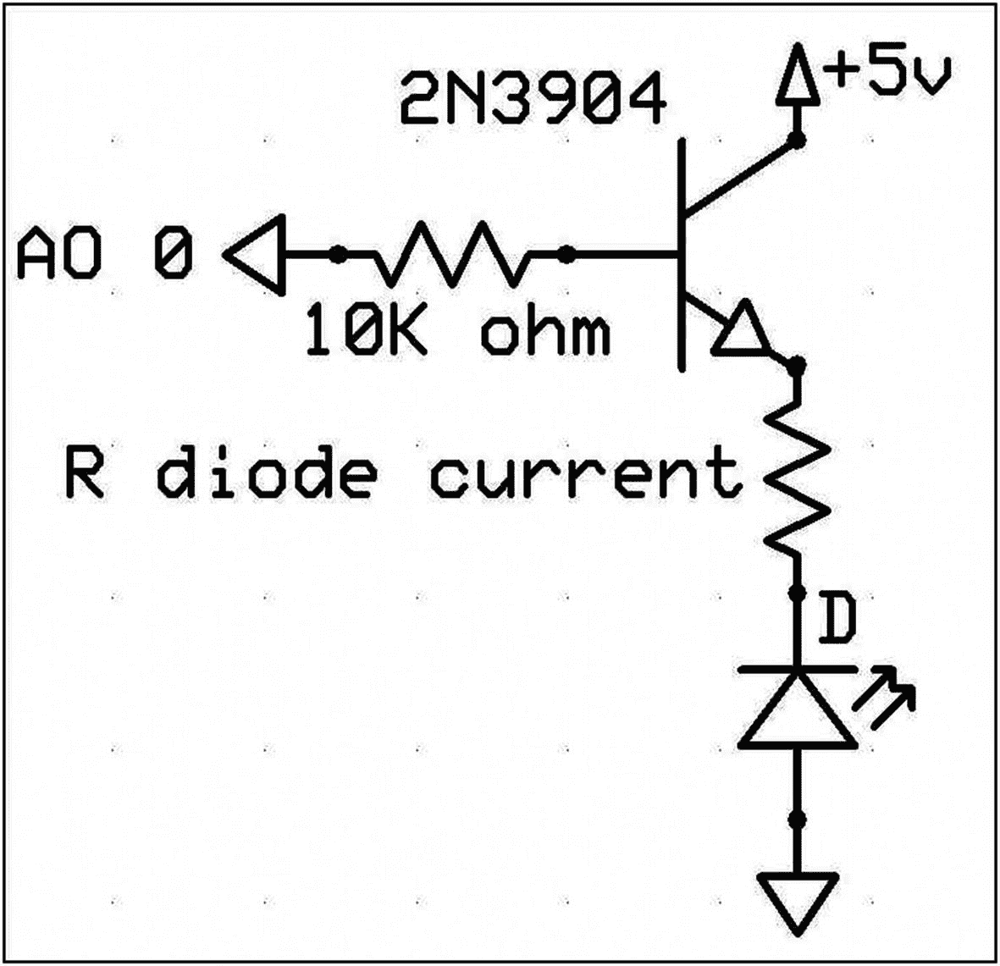

# 七、可变强度和功率控制

从显示屏上任意改变或调整实验设置或过程控制设置的能力是 SCADA 系统的一个组成部分。DAQFactory 软件提供可变控制图标，如旋钮或可移动滑块。旋钮或滑块页面组件可以耦合到模拟输出通道，其值将与控制旋钮的旋转位置或滑块索引标记的线性位置成比例。

通过适当的设计，页面组件控件可用于调节大量电压和电流，进而激活机电设备。

在 GUI 控制屏幕上对图像的操作必须在某一点上被转换成电信号，以在手头的实验或过程中提供期望的机电动作。如前所述，数字系统在二进制领域中运行，其中所需的系统动作以开或关的信号形式产生。然而，有许多系统需要不断调整所需动作量的能力，因此属于模拟领域。控制风扇、泵或混合器、加热元件、照明强度和旋转定位的电机速度是可能需要实验者或过程操作者调整的一些操作。

本练习演示了通过电压控制和脉冲宽度调制(PWM)技术对过程或实验设置进行可变控制的两种方法。

馈送到诸如电机、加热器或光源的设备的功率的 DC 电压的增加通常与通过负载的额外电流成比例地增加速度、产生的热量(温度增加)或亮度。已经说过，PWM 是一种通过数字方式向负载输送部分功率的方法。实质上，PWM 控制应用将电源的全部电压以可调宽度、较高频率(通常为数百 Hz)的矩形脉冲流的形式施加在负载上。然后，通过修改脉冲波形的全导通和全截止时间的宽度来确定对负载所施加和使用的功率的控制。导通时间和矩形脉冲宽度之间的比值称为占空比(参见第 [10](10.html) 章中的图 [10-5](10.html#Fig5) )。施加于负载的矩形、全开或全关波形的占空比变化是 PWM 功率控制的本质。

PWM 技术可以用软件实现，也可以用集成电路实现，如后面的电流控制练习中所述。对于许多需要精确控制和平滑功率转换的应用，基于硬件的 PWM 更受青睐。

在本练习中，PWM 以最简单的方式介绍，完全由软件实现。将 PWM 过程限制为基于代码的程序限制了可用于直观演示该过程的技术，本练习的以下部分将对此进行详细说明。

为 PWM 产生矩形波形的频率必须大大高于负载的响应时间。根据经验，频率应该是器件 RC 时间常数倒数的两倍，或者是控制系统频率的十倍。简而言之，PWM 频率应该足够高，以免与负载的 RC 时间常数发生谐振。(参见参考文献中的电阻-电容时间常数。 <sup>[1](#Fn1)</sup>

PWM 是一种广泛用于功率控制、数模转换、放大器设计和通信的技术，但需要复杂的电路，并可能产生射频干扰、电压尖峰和 EMI 噪声。(参见参考文献 <sup>1</sup> 和章节 [10](10.html) 中的 triac 控制。)

## 实验的

### 可变电压控制

#### 五金器具

2N3904 NPN 晶体管、限制晶体管基极电流的 10kω电阻和带有适当限流电阻的 LED 组装在试验板上，配置如图 [7-1](#Fig1) 所示。



图 7-1

NPN 晶体管的 LabJack 模拟输出 0 控制

#### 软件

从如图 [7-2](#Fig2) 所示的右键弹出菜单中选择旋钮控制。


图 7-2

DAQFactory 屏幕组件控制选择菜单

在显示屏的一页上定位控制图标并确定其尺寸后，选择属性选项以访问旋钮配置屏幕。

下面描述的缺省值未配置屏幕图标的视觉外观可以通过主选项卡中显示的框中的适当条目进行更改。与所有屏幕图标一样，相应的帮助文件可以显示在被操作的屏幕对象下方。“属性”窗口的“主”选项卡中显示的一些视觉效果选项仅在图标的较大显示图像上才明显。

旋钮控制指示器图像默认为显示的点，但是通过指示器子面板右侧的单选按钮，可以更改为选择三角形或传统的线索引来标记控制旋转的角度。通过左键单击图 [7-3](#Fig3) 中的颜色框，从可用的调色板中选择所需的颜色，可以更改默认的蓝色指示器图像。


图 7-3

DAQFactory 屏幕组件配置窗口

图 [7-4](#Fig4) 描绘了通过选择图 [7-3](#Fig3) 中的“刻度”选项卡打开的窗口。在 Ticks 窗口中，调查者可以选择圆形标尺的标称方面，并确定显示的分辨率及其在最终窗口中的外观。


图 7-4

旋钮刻度配置窗口

作者屏幕组件的最终配置如图 [7-5](#Fig5) 所示。


图 7-5

带指示面板的基础电流和 LED 亮度旋转控制旋钮

不需要编写脚本。滑块或旋钮根据旋钮或滑块的位置自动提供可变输出。在“属性”窗口的“主”选项卡的“设置通道”框中指定的通道被设置为，并输出所需的比例信号。

### 观察

如 DAQFactory 手册中所述，旋钮或滑块可设置为多种配置，以控制所选通道的激活。因为本练习中的控制设置为控制 LED 的电源，所以激活 LED 所需的最小电压会产生一定量的“死区”。

### 讨论

通过将起始位置配置在旋转的 225 <sup>o</sup> 处并将起始电压分配给所使用的 LED 的击穿电压，可以实现对施加到晶体管基极的电压以及最终由半导体输送的功率的更精细程度的控制。LED 中的正向电压降可以从红外线的 1.2 伏变化到蓝色和白色设备的 4 或 5 伏。作者的设置使用了绿色 LED，因此根据屏幕图标的预期用途，刻度盘可以配置为从 3 伏或 0 伏开始。如果要估计开启电压本身，可以使用 0-5 伏范围并进行校准，或者可以将刻度盘设置为 3.0-5.0 伏，以再现二极管强度/施加的功率设置。

## 实验的

### 电压的脉宽调制

#### 介绍

通常，演示 PWM 基本原理的软件程序的实施使用一个具有高频可变占空比波形的 LED，如第 [10](10.html) 章所述。在本练习中，通过一个电子电气系统演示了 PWM 的基本概念和方法，该系统具有一个非常简单的软件信号发生器和一个由白炽灯泡组成的响应相对较慢的负载。

为了与使用 DAQFactory 软件创建序列的简单介绍保持一致，本章末尾的清单 [7-1](#PC1) 中给出了一个基本程序序列，该序列粗略地改变了通过 12 伏电池供电的 DC 汽车灯的电流。

代码已经减少到生成典型矩形波形所需的最少语句数。占空比值必须由实验人员手动输入或更改，作为 DAQFactory 序列中两个延迟语句中的数值。代码清单中的默认设置是 0.005 和 0.095，这两个值组合在一起给出了 0.1 秒的总矩形脉冲宽度。

图 [7-6](#Fig6) 描述了用于为 PWM 演示提供慢响应负载的电路。


图 7-6

用于 PWM 演示的白炽灯负载

### 观察

图 [7-7](#Fig7) 、 [7-8](#Fig8) 、 [7-9](#Fig9) 和 [7-10](#Fig10) 描绘了白炽灯泡亮度的变化强度以及相应的高低占空比 PWM 波形。


图 7-10

白炽灯负载的高 PWM DC 波形


图 7-9

高 DC 功率下 PWM 的白炽灯泡负载


图 7-8

白炽灯负载的低 PWM DC 波形


图 7-7

低 DC 功率下 PWM 的白炽灯泡负载

如果脉冲代码与 LED 一起使用，则可以看到 5 ms 和 95 ms 时间段的闪烁速率不同，但是眼睛很难看到两种明显闪烁的功率设置之间的照明差异。然而，如图 [7-7](#Fig7) 和 [7-9](#Fig9) 所示，白炽灯对不同功率水平的可见响应要大得多。

### 讨论

在本练习的 PWM 介绍中，提出了一个要点，即承载功率的矩形波的频率需要大大高于施加功率脉冲的系统的时间常数。简而言之，可以说 PWM 频率必须高于负载的响应时间。白炽灯和电池的响应时间很慢，足以直观地说明一个非常简单、基本的 DAQFactory 序列在创建图形可视化 PWM 演示时的功率控制能力。本演示的 PWM 信号由 DAQFactory 序列生成，只有 6 行代码。图 [7-8](#Fig8) 和 [7-10](#Fig10) 的示波器记录对应的频率略低于 2 Hz。虽然频率不是那么高，但是对于灯丝加热并达到热和照明稳定性所需的时间来说，双循环 PWM 照明控制技术足以产生期望的结果。使用软件程序(如代码清单中的第一个条目)来改变信号开启和关闭的时间通常被称为“位碰撞”PWM。

PWM 技术是许多数字电子和机电系统中非常重要的一部分，在许多情况下，通过硬件设备来实现，在接下来的几个使用 Arduino 微控制器的练习中将会遇到这种情况。

几乎所有在之前练习中作为 DAQ 系统廉价替代品使用的微控制器板都配备了数字引脚输出，能够输出硬件实现的 PWM 信号(参见第 [10 章](10.html))。

## 树莓 Pi 可变强度控制

### 介绍

RPi 的物理计算只能通过通用输入和输出引脚阵列来实现，在第 [1](01.html) 章的图 [1-16](01.html#Fig16) 中，RPi 电路板上部有双排 13 或 20 个公引脚。阵列上可编程引脚的数字特性允许从实验者编写的代码或从包含各种形式的 PWM 操作的库中实现软件 PWM 操作。

强度变化屏幕控制图标或组件可从可从在线资源获得的 tkinter 图形图像库中获得，如 Raspberry Pi 和 Python 基金会在线提供的文档中所讨论的。 <sup>[2](#Fn2)</sup>

为了适应物理计算和“物联网”不断增长的兴趣和发展，RPi 基金会批准了三个开源 Python 库，以促进 GPIO 阵列在连接外部世界中的使用。最初的库版本是一个更基础或更低级的代码，导入名称为 RPi。GPIO，而后来更复杂的代码可以通过导入 gpiozero 和 pigpio 库来访问。RPi。GPIO 包含使用轮询方法或中断来检测机械运动(如按钮或开关触点闭合)、“去抖动”这些事件以及使用触点动作来启动 GPIO 引脚阵列上的电气活动)的机械设备所需的代码。据 RPi 文档报道，gpiozero 库是建立在 RPi 之上的。GPIO 库，包含许多非常易于使用的对象的元素，这些元素来自于使用非常好解释的、面向对象的编程代码。图书馆使用和可用对象的详细列表可以在网上找到。研究人员和教育工作者会发现 gpiozero 库中创建的对象列表非常广泛，并且详细描述它们的实现和连接的文档非常详细，以至于打印出的档案可能会对进一步的工作有很大帮助。

第三个也是最近发布的物理计算库，作为 pigpio 导入，与前两个工具有很大不同，因为它是用 C 编写的，可以在几种操作系统上实现。为了在 RPi 的 Linux 操作系统上使用，必须运行一个接口程序，以便 Python 解释器访问 pigpio 库。这个程序也称为守护程序，它是从 Linux 终端用 sudo pigpiod 命令启动的。

pigpio 设施拥有丰富的文档，包括详细的代码语法、众多可用的测试和可视化实用程序，以及各种简单和非常复杂的代码，可与各种传感器和硬件接口。该库还为一些更流行的通信协议提供了代码。

c 代码以其非常快的执行速度而闻名，pigpio 库使用软件和硬件为其 PWM 和矩形波形生成以及电压转换检测操作提供单位数微秒的时间分辨率。

PWM 应用程序可通过所有库获得，本章末尾提供了三个库中的几个 RPi 代码清单，以展示使用三种不同工具的软件 PWM 功率控制的各个方面。

## 实验的

使用 RPi 物理计算库的软件 PWM 信号生成和应用在一系列六个程序中介绍。通过使用空闲屏幕菜单中的运行模块访问和处理存储的程序代码，可以观察到所需的 PWM 效果。使用 Ctrl+C 组合键可以暂停程序执行。

除了演示程序，还提供了一个非常简短的实用程序来帮助开发和测试 pigpio 物理计算代码。

### 带 RPi 的 PWM 信号。GPIO 库

列表 [7-2](#PC2) 可用于演示图 [7-11](#Fig11) 电路产生 PWM 波形的基本原理。


图 7-11

LED–GPIO 引脚连接示意图

在以前的演习中已经注意到。GPIO 阵列的电流有限，无法安全地提供给与引脚相连的任何外设。图 [7-11](#Fig11) 描述了显示正在研究和开发的程序所产生的效果所需的一般连接。留给实验者的是安全地配置电子组件，使得从使用中的 GPIO 引脚和阵列接地汲取的功率安全地处于计算机和 LED 的操作限制内。

程序代码 PWM_tst1 在 3.3 和 0 伏之间升高然后降低 GPIO 阵列的#6 引脚。开关脉冲的宽度或其占空比(DC)由研究者定义并作为变量 prcnt_on 输入程序代码。实际的 PWM 波形由两个环路产生，一个是由“while”语句控制的连续外部环路，该语句将#6 引脚设置为高值，另一个是内部“if 环路”，该环路在将引脚复位至 0 伏之前，计算 prcnt_on 变量中的单位数。

将 prcnt_on 变量设置为 5、50 和 95 可用于演示 LED 照明强度的变化。

用 RPi 编写的清单 [7-3](#PC3) 给出了 PWM 信号的频率对观察到的 LED 照度的影响的演示。GPIO 库。在开发 RPi 时。GPIO PWM 频率效果演示程序，当使用五个不同的阵列引脚-LED 通道来演示 PWM 频率对观察到的 LED 照明的效果时，获得了合适的视觉效果。演示程序将占空比设置为 95%的恒定值，仅改变 PWM 功率信号的频率。

在加载和运行 PWM 频率效果代码之前，五个 led 和限流电阻必须连接到 GPIO 阵列，如图 [7-11](#Fig11) 所示。可以使用在物理位置找到的 GPIO 管脚 3、4、5、6 和 7(参见章节 [1](01.html) ，图 [1-16](01.html#Fig16) ) 5、7、29、31 和 26 的 40 管脚阵列。

#### 带 gpiozero 库的 PWM 信号

gpiozero 文档中的清单 [7-4](#PC4) 是一个非常简单的单 LED PWM 照明变化程序，演示了 gpiozero 库可用的高级接口。脉冲 LED PWM 程序改变施加到 LED 的功率，从而改变其输出的强度或亮度，该程序由五行代码组成，其中两行是 import 语句。演示软件 PWM 的电路配置如图 [7-11](#Fig11) 所示。作者使用 5 mm LED 和 220ω限流电阻，并将电路连接到 GPIO 引脚 21(物理引脚#40)和地(物理引脚#34)。为了查看该技术可能实现的控制，将程序代码加载到 Python 空闲编辑器屏幕中，并使用运行菜单来启动或处理代码。

gpiozero 库包含许多用于连接 RPi 输出阵列和 MCP3008、8 通道、10 位 ADC 的对象，如第 [6](06.html) 章、图 [6-17](06.html#Fig17) 的电路图所示，可用于使用 RGB LED 的 PWM 演示。

清单 [7-5](#PC5) 和 [7-6](#PC6) 使用偏置在正 RPi 电源输出和地之间的三个电位计，向 MCP ADC 的前三个通道提供三个信号，这三个信号又充当三个 PWM 信号，以改变 LED 的各个红色、绿色和蓝色输出的强度。这些程序的不同之处在于用于实现 PWM 功能的代码。理论上，任何想要的光的颜色都可以通过三电位器颜色控制电路配置产生，如图 [7-12](#Fig12) 所示。


图 7-12

PWM 三电位计 RGB LED 颜色控制电路

虽然 MCP3008 的前三个通道使用 220ω电阻来限制通过二极管的电流，但绿色 LED 的典型输出强度可能是红色和蓝色器件的五倍。为了“平衡”或均衡绿色通道的灵敏度，实验者可能需要更高的电阻值。

#### pigpio 库的 PWM 信号

要在操作系统映像或操作系统代码安装上加载、激活和访问 pigpio 库(代码中没有包含该库),必须在终端输入大量命令。(Raspbian Jessie 2016-05-10 或更新版本预装 pigpio C 库。)

作者的 RPi 已经使用了好几年，新的库必须在终端加载，如下所述:

1.  在终端提示符下输入–wget abyz.co.uk/rpi/pigpio/pigpio.zip

2.  猪小妹. zip

3.  pipipipo CD

4.  制造

5.  进行安装

前两行下载压缩文件并解压缩 Python 代码，以便在 home / pi 目录中快速创建文件 PIGPIO。“make”和“make install”可能需要一分钟左右的时间来处理，这取决于安装库的 Pi 的速度。在/home / pi / PIGPIO 文件中创建了三个程序:“pigpio.py”是一个解释 Python pigpio 模块的文档程序，它有一百多页，定义并解释了所有的模块函数和变量，并提供了简短的典型编码应用程序。除了文档之外，还有“setup.py”和“x_pigpio.py”，前者是 pigpio 守护进程的 RPi 访问模块，后者是 pigpio 库中所有可用库函数的 15-20 页的完整测试程序代码。

清单 [7-7](#PC7) 是一个演示 pigpio 基本操作的简单程序，通过运行界面(pigpiod)访问 pigpio 库，打开和关闭 LED，然后通过四步 PWM 照明强度增加和减少来改变亮度。清单 [7-8](#PC8) 是一个 pigpio 测试实用程序，它打印出数组中 gpio 管脚的状态。

### 观察

#### PWM_tst1

当将三个模拟占空比值输入程序并运行代码时，可以很容易地看出低、中和高实验之间的 LED 照明强度变化。在三个照明周期期间，代码似乎循环得足够快，以产生不能立即察觉的闪烁速率。

图 [7-13](#Fig13) 是 RPi 的输出。GPIO PWM 频率效果演示程序。


图 7-13

RPi 对 PWM 频率变化的影响。GPIO 库代码

LED 能够在兆赫兹范围内开关；正如预期的那样，2、5 和 8 Hz PWM 信号闪烁不定，闪烁明显，而 11 和 14 Hz 信号相当稳定，闪烁或“抖动”极小。(抖动描述和来源见“讨论”。)

#### RGB LED 输出的 PWM 控制

可以看出，随着可变电阻器上的轴分别从关闭位置转到全开位置，各种二极管颜色主导了器件输出。尽管图 [7-12](#Fig12) 的电路具有三个相等的电阻值，允许绿色主导 LED 输出，但二极管输出强度的明显零星和不规则变化在视觉上是可辨别的。

当 LED 通电时，以及在四步增加和减少二极管照明强度的过程中，pigpio 库程序产生明亮稳定的照明。(参见“讨论”)

代码清单中包括测试 RPi GPIO 阵列前 32 个引脚状态的实用程序，并以表格形式打印出它们的状态，如图 [7-14](#Fig14) 所示。


图 7-14

GPIO 引脚的测试状态

测试程序不仅打印出阵列中 32 个引脚的状态，还确认了 Python 解释器与 C 代码库的 Linux 守护程序接口的操作。

在使用第 [6](06.html) 章的“将数组重置为零”实用程序清除 RPi 数组(在第 [6](06.html) 章中列出了 [6-15](06.html#PC15) )后，运行前面的列表。引脚 1、2 和 29 是阵列的电源引脚。

#### 讨论

RPi 的一部分。GPIO 库致力于实现底层设备的接口，比如机械开关到 RPi 的 GPIO 管脚阵列。该库具有用于确定任何引脚的当前状态是高还是低(+5 或 3.3 V 的系统逻辑电压电平或 0 V 的系统地电位)的功能，检测引脚状态的变化，以及用于确定何时或如何监控或检测转换。

RPi 使用基于 Linux 的多任务操作系统，该操作系统可能会暂时从较低优先级的输入/输出操作中夺走控制权。在鼠标或键盘操作中遇到的正常时间范围内，I/O 操作可能不会受到延迟的显著影响；但是对于较短时间尺度上的高精度操作，例如图形显示，它可能变得非常明显。在本练习中，不规则时序的视觉效果可以被视为 LED 亮度的闪烁，或者有时被称为“抖动”

当使用 RPi 的改变频率功能时。GPIO 库，为每个新频率使用不同的引脚阵列 LED 通道比尝试使用同一通道并改变其频率五次要容易得多。

在三个 GPIO 物理计算库的可能应用中，能力和灵活性的显著提高是显而易见的。pigpio 使用起来更复杂，但是比简单的库更强大。如前所述，基于 C 的库能够使用 Linux 操作系统和系统硬件在许多库操作上实现一位数微秒时间分辨率。本练习中使用的简单演示程序完全没有闪烁或抖动。

除了简单的 LED 照明功能程序之外，在代码清单的末尾还包括一个非常简短但有用的实用程序，它可以打印输出从 0 到 31 的每个 GPIO 引脚的状态。控制台的打印输出将所有引脚及其当前高/低值列为 1 或 0。除了显示单个引脚的高/低电压电平，该实用程序还确认 Python pigpio 接口守护程序的功能。

pigpio 库函数和功能的大部分将在后面 RPi 物理计算中处理高级 PWM 应用的高级练习中按要求遇到、演示和讨论；传感器启动或监控；串行、I2C 和 SPI 通信；和电机或伺服控制。

## 代码列表

```c
# PWM Control of RGB Led Diode Pgm 2
# PWM Control of RGB Led Diode
from gpiozero import RGBLED, MCP3008
from signal import pause
#
led = RGBLED(2, 3, 4)
#
red_pot = MCP3008(channel=0)
green_pot = MCP3008(channel=1)
blue_pot = MCP3008(channel=2)
#
led.source = zip(red_pot.values, green_pot.values, blue_pot.values)
#
pause()

Listing 7-6PWM Control of RGB LED with Three ADC Channels and Pause()

```

```c
# PWM Control of RGB Led Diode Pgm 1
from gpiozero import RGBLED, MCP3008
#
led = RGBLED(red=2, green=3, blue=4)
#
red_pot = MCP3008(channel=0)
green_pot = MCP3008(channel=1)
blue_pot = MCP3008(channel=2)
#
while True:
    led.red = red_pot.value
    led.green = green_pot.value
    led.blue = blue_pot.value

Listing 7-5Control of a RGB LED with gpiozero PWM Library and Three Potentiometers

```

```c
from gpiozero import PWMLED
from signal import pause

led = PWMLED(21)

led.pulse()

pause()

Listing 7-4Single-LED PWM with the gpiozero Library

```

```c
# RPi PWM Frequency Demonstration with the RPi.GPIO Library
# 5 LEDs are used to illustrate the effects of the frequency of the carrier wave on PWM techniques. Different carrier
# frequencies are used at a constant duty cycle to illustrate
# the effects of frequency om PWM
import RPi.GPIO as GPIO
import time
# Array set up
GPIO.setmode(GPIO.BCM) # Use BCM pin reference
GPIO.setwarnings(False) # turn off the array use warnings
GPIO.setup(3, GPIO.OUT) # set pin #3 for output
#
pwm = GPIO.PWM(3, 2) # a PWM instance on pin 3 to operate at 2 Hz is setup
print("PWM carrier frequency set to 2 Hz")
print(" ")# print a blank line in the output
dc = 95 # the duty cycle is set close to full on
pwm.start(dc)# start the application of PWM power
time.sleep(5)# Keep the LED illuminated for 5 seconds
pwm.stop()# stop the power application
#
# carrier frequency increased to 5 Hz
print("PWM carrier frequency set to 5 Hz")
print(" ")
GPIO.setup(4, GPIO.OUT) # set pin #4 for output
pwm = GPIO.PWM(4, 5) # a PWM instance on pin 4 to operate at 5 Hz is setup
dc = 95 # the duty cycle is set close to full on
pwm.start(dc)
time.sleep(5)
#
# carrier frequency increased to 8 Hz
print("PWM carrier frequency set to 8 Hz")
print(" ")
GPIO.setup(5, GPIO.OUT) # set pin #5 for output
pwm = GPIO.PWM(5, 8) # a PWM instance on pin 5 to operate at 8 Hz is setup
dc = 95 # the duty cycle is set close to full on
pwm.start(dc)
time.sleep(5)
pwm.stop()
#
# carrier frequency increased to 11 Hz
print("PWM carrier frequency set to 11 Hz")
print(" ")
GPIO.setup(6, GPIO.OUT) # set pin #6 for output

pwm = GPIO.PWM(6, 11) # a PWM instance on pin 6 to operate at 11 Hz is setup
dc = 95 # the duty cycle is set close to full on
pwm.start(dc)
time.sleep(5)
pwm.stop()
#
# carrier frequency increased to 14 Hz
print("PWM carrier frequency set to 14 Hz")
print(" ")
GPIO.setup(7, GPIO.OUT) # set pin #7 for output
pwm = GPIO.PWM(7, 14) # a PWM instance on pin 7 to operate at 14 Hz is setup
dc = 95 # the duty cycle is set close to full on
pwm.start(dc)
time.sleep(5)
pwm.stop()

Listing 7-3RPI.GPIO PWM Frequency Effect Demonstration

```

```c
Python Code for Raspberry Pi PWM_tst1
# A software PWM demonstration on GPIO - 6
import RPi.GPIO as GPIO
GPIO.setmode(GPIO.BCM)
GPIO.setwarnings(False)
GPIO.setup(6, GPIO.OUT)
#
# set the duty cycle
prcnt_on = 10
#
# the outer loop to provide the continuous application of the modulated power signal
while True:
    # start the duty cycle loop and set the output pin to ON
    GPIO.output(6, 1)
    for i in range(1, 100):
        if i == prcnt_on:
            GPIO.output(6, 0)

Listing 7-2RPi Python PWM_tst1

```

```c
while(1)
   sftwr_pwm = 5
   delay(0.095)
   sftwr_pwm = 0
   delay(0.005)
endwhile

Listing 7-1DAQFactory Sequence Program for PWM

```

```c
# A simple demonstration of some basic pigpio capabilities.
# The PIGPIO library must be d/l, installed and available on the RPi in use.
# The requirements for use of the library code must be met and the interface
# often called a daemon must be running to provide an interface between the pigpio library written in C and the
# Python interpreter. (see PIGPIO documentation)
#
import pigpio
import time
#
pi = pigpio.pi()# create a instance of the pigpio class
#
# Simple LED illumination
pi.set_mode(4, pigpio.OUTPUT) #set gpio 4 for output
pi.write(4,1) # set gpio pin 4 high
time.sleep(0.5)# delay for 1/2 sec
pi.write(4,0) # turn LED off
#
time.sleep(2) # delay for 2 sec between displays
#
# simple PWM controlled variable brightness scaled from 0 – off to 255 – full on
pi.set_PWM_dutycycle(4,  0)  #PWM off
time.sleep(0.5)# delay for 1/2 sec
pi.set_PWM_dutycycle(4, 64) # PWM power at 1/4 on
time.sleep(0.5)
pi.set_PWM_dutycycle(4,128) # PWM power at 1/2 on
time.sleep(0.5)
pi.set_PWM_dutycycle(4,192) # PWM power 3/4 on
time.sleep(0.5)
pi.set_PWM_dutycycle(4, 255) # PWM power full on
time.sleep(0.5)
pi.set_PWM_dutycycle(4,192) # PWM power 3/4 on
time.sleep(0.5)
pi.set_PWM_dutycycle(4,128) # PWM power 1/2 on
time.sleep(0.5)
pi.set_PWM_dutycycle(4, 64) #  PWM power 1/4 on
time.sleep(0.5)
pi.set_PWM_dutycycle(4, 0) # PWM power off

#
pi.stop()

Listing 7-7pigpio Basic Operations Program

```

```c
# pigpio pin status and test utility
# ensure that the pigpio daemon is running and run the following code from the run menu in the Python 3 IDLE facility.
#
import pigpio
pi = pigpio.pi() # create an instance of the library
for g in range(0, 32):  # recall range must be the required number of iterations + 1
    print("gpio {} is {}".format(g, pigio.read(g))) # print out a tabulated status report
pigpio.stop()

Listing 7-8pigpio Test Utility

```

## 摘要

*   商业软件中的可变强度控制用于在软件中实现 PWM 方法，以演示该技术如何工作。

*   介绍了几种利用廉价的 RPi 计算平台实现 PWM 技术的方法。

*   在第 [8](08.html) 章中，介绍了 SCADA 系统中主机计算机外部发生的事件的检测以及如何测量多个事件之间的时间。

<aside aria-label="Footnotes" class="FootnoteSection" epub:type="footnotes">Footnotes [1](#Fn1_source)

*发明家实用电子学*第三版 Edn。，Schertz 和 Monk，McGraw Hill，ISBN 978-0-07-177133-7

  [2](#Fn2_source)

[T2`docs/python.org/3/library/tk.html`](http://python.org/3/library/tk.html)

  [3](#Fn3_source)

[`http://gpiozero.readthedocs.org/`](http://gpiozero.readthedocs.org/) 和 [`https://sourceforge.net/p/raspberry-gpio-python/wiki/Examples`](https://sourceforge.net/p/raspberry-gpio-python/wiki/Examples)

 </aside>