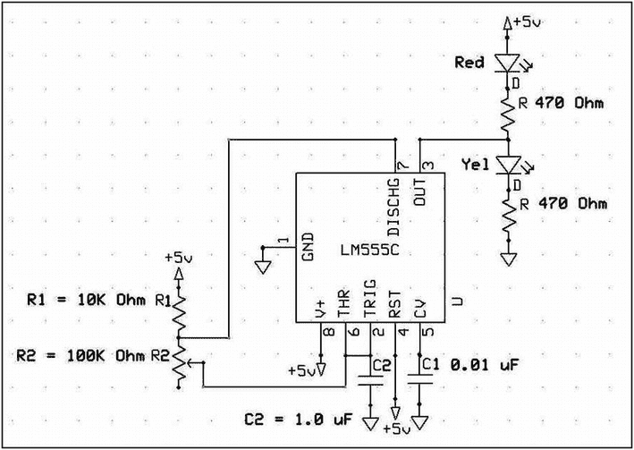

# 八、计数事件和计时

本练习考虑在物理计算中处理时间测量的可用方法。软件或硬件可以用来直接测量时间或时间间隔。然后，通过计算固定时间单位内发生的事件数量，可以使用时间间隔进行频率测量，或者在评估时间间隔内行驶的距离时确定速度和加速度。

确定一天中的时间和事件之间的时间是收集科学数据和过程控制中的重要参数。开灯或从 9:05 到 9:35 收集数据可以被分类为“绝对”或“一天中的时间”格式，而测量球通过粘性液体下落固定距离所需的时间可以被称为差分时间测量。

DAQFactory 的用户手册建议不要试图用软件脚本在少于半秒或四分之一秒的时间框架内工作。几分之一秒大约是高级软件在保持系统状态显示屏用户界面的同时处理用于数据处理的代码线程的能力的极限。毫秒、微秒或更短时间帧的测量通常需要使用汇编语言编程进行软件计时，或使用物理计时设备进行硬件计时。有几种可用的硬件计时器件，如 LabJack HMI、Arduino 微控制器板或 555 定时器集成电路，所有这些器件都能够在毫秒和微秒的时间范围内工作。本章的第一部分研究了数字时间概念的基础，并展示了软件的局限性。本章的其余部分和练习涉及通过集成电路硬件可用的短时标和频率的介绍性概念。

在电子学中，时间是用产生固定电压(5.0 或 3.3 伏)方波信号的振荡器时钟来测量的，方波信号的频率可能在兆赫兹和千兆赫兹范围内。(MHz 为每秒 10 <sup>6</sup> 个周期，GHz 为每秒 10 <sup>9</sup> 个周期。)撰写本文的个人电脑的时钟速度为 1.48 GHz，而 Arduino 微控制器的时钟速度为 16 MHz，各种型号的 Raspberry Pi 的时钟速度为 800 MHz 至 1.5 GHz。

由石英晶体调节到高精度和准确度的电子振荡器可以被配置成产生方波的脉冲序列，该脉冲序列可以被单独计数以测量时间。凭借非常稳定的 MHz 和 GHz 振荡器频率以及独立脉冲计数能力，可以非常精确地测量微秒和纳秒时间帧。

当计算设备关闭时，台式、便携式和网络连接的计算设备能够通过网络连接或电池备用系统来跟踪一天中的时间。一些设备，如 Raspberry Pi 和 Arduino 微控制器，需要添加一个称为“实时时钟”(RTC)的附件，该附件具有备用电池，可以在设备断电时准确跟踪一天中的时间。

## 软件时间和计时

DAQFactory SCADA 软件是一个独立的程序，可在基于 Windows 的操作系统上运行。当计算机在操作会话之间关闭时，电池用于维持操作系统时间计数。自 1970 年以来，DAQFactory 中的时间以微秒为单位进行测量。当 DAQFactory 会话启动时，程序从操作系统获取日期和时间，初始化内部计数器，并从 1970 年 1 月 1 日开始以秒为单位保持时间计数。DAQFactory 时钟独立于操作系统定时器运行，并产生十进制秒时间分辨率。DAQFactory 中可用的时间函数在用户手册的“表达式”部分有详细说明。本练习的第一部分使用了可用的软件时间功能来创建两个分辨率为 1 秒的屏幕激活定时器，用于启动和停止外部试验板上的电子操作，并测量手动观察事件之间的经过时间或累计时间，就像手持秒表一样。基本软件时间评估屏幕如图 [8-1](#Fig1) 所示。


图 8-1

三种计时操作的图形用户界面

### 基本时间变量

图 [8-2](#Fig2) 描述了几个基本的当前 DAQFactory 时间值。


图 8-2

当前定时操作和值的 GUI

基本变量屏幕由六个变量值组件(VVC)组成，在以红色表示的日期和时间拍摄。配置面板上的条目将有助于理解计数器“时钟滴答”的数学操作及其与我们循环时间概念中的小时、分钟和秒钟的关系:

1.  第一行变量值组件(VVC)表达式是 SysTime()，它显示自 1970 年 1 月 1 日以来经过的秒数。

2.  第 2 行使用 VVC 表达式框中的语句“FormatDateTime("%c "，SysTime())”来生成显示的时间。用户手册中列出了大量可供使用的格式。为了突出视觉效果，显示屏上用了红色大字。

3.  第 3–5 行使用模记数法将 SysTime()的总滴答计数转换为各种计时值，而第 6 行产生逻辑 1 和 0 之间的一秒调制切换。

### 预定事件计时器

标题为预定时间计时器的清单 [8-1](#PC1) (在本章末尾与所有其他清单一起提供)的脚本控制图 [8-3](#Fig3) 所示的 GUI 面板。


图 8-3

DAQFactory 预定事件定时器图形用户界面

### 秒表计时器

图 [8-4](#Fig4) 中描述的标称控件组实现秒表式计时，并由清单 [8-2](#PC2) 的代码控制。


图 8-4

秒表计时器 GUI

秒表计时器由清单 [8-3](#PC3) 和 [8-4](#PC4) 中的三个 DAQFactory 序列激活。启动/停止按钮(列表 [8-2](#PC2) )启动或终止计时动作，从而定义间隔。鼠标点击累计时间按钮，将当前时间间隔加入累计时间总和。单击重置显示将 GUI 重置为零。

### 硬件时序、事件计数和频率确定

我们世界中的任何物理行为，如开门、进入房间和开灯，都可以被传感器转换为电子系统可以监控和记录的电转换。典型的灯开关的激活导致施加到光源上的电功率从打开极限跳到关闭极限。由开灯、让灯亮一段时间 t、然后关掉灯的动作产生的电波形可以被认为是“持续时间为 t 的脉冲”。电脉冲可以通过将机械、光学和电磁事件转换成电信号电平的急剧变化来产生。

脉冲计数通过使用双极晶体管或 CMOS 集成电路来实现，其中互连的晶体管开关能够以二进制格式记录施加到芯片输入引脚的电子信号中出现的 0 到 5(或 3.3)伏之间的转换次数。对给定时间段内的电子跃迁次数进行计数是对输入信号频率的测量，而对从过去的起始点开始已经发生的脉冲总数进行计数是对经过时间或总时间流逝的测量。

用于存储二进制信息的基本单元被称为“触发器”或“锁存器”触发器是稳定在两种状态之一的开关配置，其中锁存器或触发器的输入导致输出在 1 和 0 两个二进制逻辑状态之间变化。触发器、多谐振荡器或锁存器的基本电路如图 [8-5](#Fig5) 所示。


图 8-5

基极结晶体管触发器

简单的触发器最初由电流控制器件制成，如真空管，后来由双极晶体管制成，最后由极低电流消耗的电压控制器件制成，如场效应晶体管(fet)和金属氧化物半导体场效应晶体管(MOSFETs)。这些通常被称为多谐振荡器，并被称为双稳态电路。该电路保持在其两个稳定状态中的任一个，直到施加控制信号将其切换到另一个稳定状态。

为了理解基本电路是如何工作的，我们可以在图 [8-5](#Fig5) 中看到，如果 V1 接地，那么将没有基极电流通过 Q2 的基极。在双极晶体管中，通过集电极和发射极的电流(发射极箭头表示正电流)由基极电流控制。没有基极电流的晶体管 Q2 将没有集电极-发射极电流。从 Vcc 通过 R2 的电流全部流入 Q1 的基极，然后导致更大的电流流过 Q1。对于对称电路，如果 V2 接地，则 Q1 的基极电流被切断，并且通过 R1 的电流流入 Q2 的基极，当电路切换到第二稳定状态时，导致更大的电流流过 Q2。

简单的触发器是大量主要是极低电流消耗的互补金属氧化物半导体压控集成电路的基本构建模块，这些集成电路提供诸如存储器存储、逻辑和数学功能的功能。(参见第[章 1](01.html) ，图 [1-15](01.html#Fig15) 。)

锁存器、触发器、数字逻辑计数、振荡器时钟以及各种集成电路逻辑芯片组家族的应用的细节可以在几本参考著作中找到。 <sup>[1](#Fn1)</sup>

LabJack HMI 上标有 CNT 的端子提供对集成电路的访问，该集成电路能够计数电压电平从+5 变到 0 再变回+5 伏的次数。这种事件计数由设备的集成电路以二进制进行，结果以十进制格式显示在系统屏幕上。要计数的事件必须转换成前面提到的电压电平变化。LabJack 计数器具有 32 位容量，允许总共计数 2 个 <sup>32 个</sup>或 4，294，967，296 个事件。因为事件计数器是一个集成电路，它可以以高达 1 MHz 的频率计数。

在下面的练习中，将创建一个手动事件计数器，它可以由任意数量的传感器递增，例如日光级别的变化、物体经过某个点或单击系统屏幕图标。LabJack 和 DAQFactory 软件组合的实验设置或过程控制系统的配置涉及以秒或更长时间测量的时间跨度，这不是问题。用户手册中的文件表明，许多指令的执行时间为 20 ms，这为基于视觉的 SCADA 系统可合理预期的最短时间响应建立了下限。高速信号变化最好用称为流或突发模式操作的技术来记录。对于采集后处理，以非常快的硬件速度获取速度或频率远远超出肉眼分辨能力的高速信号变化。用户手册中详细介绍了高速操作，后续章节和练习中也会涉及到。

LabJack 计数器被视为硬件设备，因此不受软件执行时间的限制。被称为 555 定时器的集成电路设备可以与计数器结合使用，以在比软件执行开销所强加的时间跨度更短的时间跨度内工作。555 定时器也是一个基于“硬件”的集成电路，因此，像 LabJack 计数器一样，能够在从微秒到小时的时间范围内工作。双极性晶体管和 CMOS 555 定时器 IC 的详细信息可以在许多参考文献中找到，包括前面提到的参考文献。各种形式的定时器之间的差异在于它们的功率处理能力，双极形式是高电流类型，而 CMOS 形式是基于低电压的。

## 实验的

### 五金器具

1)简单的手动事件计数

2)简单的连续事件计数或频率确定

蓝色 LED 和 470ω限流电阻可用于演示屏幕启动事件的手动计数。

### 电路原理图

二极管和限流电阻器的配置如第[章第 1](01.html) 节图 [1-3](01.html#Fig3) 所示，红色二极管的串联对的连接点连接到 CB25 端子板上的 D9。

### 软件

为了演示计数器使用的两种模式，创建了图 [8-6](#Fig6) 中带有两个按钮、两个变量值组件和一个描述性文本组件的面板。


图 8-6

LabJack U12 计数器使用演示

对于手动激活的事件计数，创建一个屏幕按钮图标，适当标记，并链接到一个输出通道。作者的按钮标有“Initiate Event”，配置为激活清单[8-5](#PC5)“A _ Counter _ Event”的脚本，该脚本通过一个创建为“DigOut_9_EvntCntr”的通道应用 5–0–5 伏转换，该通道连接到 CB25 板端子上的输出引脚 9。点击屏幕按钮从而驱动 D9 输出从 5 伏到 0 伏，然后回到 5 伏，依次关闭蓝色 LED，然后再打开。计数器端子 CNT 用于监控蓝色 LED 与其 470ω限流电阻连接点处的电压电平。手动点击“启动事件”按钮，通过列表 [8-5](#PC5) DAQFactory 序列递增计数器。

DAQFactory LabJack 手册 <sup>[2](#Fn2)</sup> 第 10 节详细说明了单个 LabJack 计数器的操作。由于只有一个计数器，所有数据都通过计数器通道 0 传递。默认情况下，每次读取通道时，计数器值都会重置为 0，因此在本练习的第一部分，必须关闭默认值，以便不断增加其值，直到手动将其重置为 0。在本练习中，我们创建一个名为“EventsCounted”的通道，其 I/O 类型为计数器；在“频道表视图”中，在 Quick Note / Special / OPC 标题下，应该可以看到一个位于单元格右侧的按钮，上面有三个点(…)。点击按钮，调出通道参数窗口，并在下拉列表中选择重置。唯一的参数是“重置？”，选择“是”或“否”、“确定”和“应用”将立即配置计数器通道，使其在读取通道值进行显示时不会重置为零。

第二个标记为“ResetCounter”的按钮被配置为启动清单 [8-6](#PC6) 的简短“Reset Counter”脚本，该脚本将“EventsCounted”通道 events count[0]的最新值设置为零。事件计数[0]的可变值组件显示位于按钮下方，用于指示计数的事件数。图 [8-6](#Fig6) 中描述了为演示简单计数器用法而创建的面板。

点击启动事件按钮，激活练习代码列表中的列表 [8-5](#PC5) 。

点击屏幕按钮“启动事件”,蓝色灯亮起，事件计数器增加。点击“重置计数器”(列表 [8-6](#PC6) )将“计数的事件”变量值显示设置回 0。

### 脚本

清单 [8-5](#PC5) 和清单 [8-6](#PC6) 是 DAQFactory 序列，其脚本创建用于频率测量的方波信号，带有 time - goto 脚本和用于手动清除计数器和关闭任何可能留在 on 配置中的 LED 的代码。

如前所述,“重置计数器”按钮激活列表 [8-6](#PC6) 的短序列，该序列由单行活动代码组成，用于将计数器通道的值设置为 0。

通过将 LabJack 计数器通道切换回默认设置“读取计数值后复位”并以一秒的计数间隔配置新的计数器通道，新的计数器通道被配置为每秒读取一次频率。

### 电路

白色 LED 和 470ω限流电阻器的配置如第[章第 1](01.html) 节图 [1-3](01.html#Fig3) 所示，红色二极管的串联对的接点连接到 CB25 端子板上的 D8。

### 软件

必须产生一个脉冲序列，以形成具有可测频率的重复信号。清单 [8-7](#PC7) 中的脚本是一个 PWM 或可变脉冲宽度发生器，可与图 [8-7](#Fig7) 中所示的屏幕按钮和指令文本结合使用，以启动和停止方波脉冲序列。


图 8-7

DAQFactory 脉冲序列发生器面板

启动/停止按钮用于激活本章代码列表中列出的 DAQFactory 序列 PWM _ Script[8-7](#PC7)。

#### 脚本和动作

虽然使用“time - goto”语句并不被认为是良好的编程实践，但它确实简化了方波信号的创建。创建计数练习的两个面板后，将“Delay (0.5)”语句中的值更改为 0.25 和 0.1。在产生方波和显示频率的同时，快速前后移动鼠标光标，观察 LED 和显示的频率值。

## 观察

在两个计数器练习中包含蓝色和白色发光二极管，作为跟踪系统操作的视觉辅助。(参见“讨论”)

## 讨论

### 时间测定

数字电子电路由晶体控制振荡器“时钟”激活晶体振荡器产生非常稳定的固定频率方波脉冲序列，提供纳秒时间分辨率(10 <sup>-9</sup> s)。方波由从 0 到+5 伏或从逻辑 0 到逻辑 1 的一系列二进制转换组成。时间可以分为由时钟方波波前的间隔确定的相对时间和来自固定事件的绝对时间。DAQFactory 程序的绝对时间由 1970 年 1 月 1 日的秒数决定。用户手册中详细讨论了图 [8-2](#Fig2) 的时间变量及其语法。

### 手动和自动事件计数

按钮启动的手动事件在通常与 DAQFactory 软件计时不冲突的时间范围内创建。但是，可以证明，试图用脚本创建一个波形来生成一个以足够快的速度变化的信号，可能会与操作系统软件定时相冲突。

作为本练习的一部分，使用了一个脚本来生成递增 LabJack 计数器所需的电压波形。蓝色 LED 作为系统验证的可视指示器已包含在练习中。然而，计数器硬件将事件记录为双转换操作，其中高信号下降到低值，然后低信号上升到高电压值。双跃迁“事件”受一个脚本影响，该脚本将引脚电压电平保持在 5 V，进而为电路中的蓝色 LED 供电。为了关闭 LED，我们在由 Reset Counter 按钮激活的脚本中包含了一行代码，用于将引脚 9 设置回 0 V，而不会被记录为“事件”的一半。

通过改变 PWM_Script 中的延迟值，可以改变信号保持在 0 或标称 5 V 的时间宽度。LabJack 计数器仅将+5 至 0 至+5 伏的转换记录为单个事件，以实现计数器递增的目的，因此在 0 伏时停留时间的宽度是在频率测定中被计为单个事件或周期的参数。

任何图形显示都必须由二维元素阵列组成，这些元素可以被单独照亮以形成图像。GUI 的更新消耗了大量的计算资源，因为阵列的各个元素被不断地扫描以实现任何所需的改变。如果用于驱动图 [8-7](#Fig7) 的脉冲发生器面板的程序(如脉冲发生器)被调用，延迟时间不到一秒，软件冲突可能会出现。

当使用脉冲产生程序为白色 LED 供电时，延迟时间变得非常短，只有几分之一秒，LED 脉冲频率和光标移动都变得不稳定。观察到的硬件和软件冲突证明了在不到一秒的时间跨度内使用软件脚本的局限性。

## 硬件时间和计时

我们对时间的硬件控制的讨论集中在 555 集成电路定时器芯片上，该芯片已经制造、改进和使用了 40 多年。该芯片通过使其输出以受控的时间间隔从高电压电平变为低电压电平来工作。时序间隔可以很容易地在多个数量级上变化，以产生长延迟(单稳态工作模式)或产生高速脉冲序列(非稳态工作模式)。由电阻和电容组成的简单外部元件可以用来产生所需的时间间隔。555 芯片提供双极晶体管和 CMOS 两种格式，功耗、功率输出和高频操作各不相同。

555 芯片以三个 5kω电阻的串联串命名，这些电阻连接到电源电压和地，以建立电路逻辑使用的 1/3 和 2/3 电源电压参考电平。该电路包含两个比较运算放大器，其输出信号馈入数字置位-复位触发器。模拟比较器使用 1/3 和 2/3 电压参考点来改变它们的输出状态，这使得触发器基于比较器输入来改变状态。数字触发器输出控制输出驱动器电路。

图 [8-8](#Fig8) 和 [8-9](#Fig9) 显示了定时器电路的一些操作和配置。


图 8-9

一个 555 定时器 IC 框图


图 8-8

555 IC 定时器工作模式

当如图 [8-8](#Fig8) 右下角的非稳态模式示意图所示配置的 555 IC 通电时，随着电流流经 R1 和 R2，电容器开始充电。随着引脚 2 和 6 上的电压上升，然后达到电源电压的 2/3(由内部分压器确定)，输出变为低电平。随着输出变低，NPN 晶体管导通，555 的放电引脚有效地接地，通过 R2 对 C1 放电。当电容上的电压降至电源电压的 1/3 时，晶体管关断，电容开始通过串联对充电，循环重复。因此，C 上的电压在电源的 1/3 和 2/3 之间循环，周期为 T = 0.693(R1 + 2R2)C 或频率为 f = 1.4/(R1 + 2R2)C。输出信号的时间周期可分为两部分，包括电压高的时间(见图 [8-8](#Fig8) ，右下角)和信号低的时间。高电平时间通常被称为“标记时间”,低电平时间被称为“空时”,占空比被定义为高电平时间或标记时间与信号的总和或时间周期的比值，以百分比值表示。

555 定时器产生脉冲序列的能力在实验科学中具有非常重要的应用，该脉冲序列的电子特性由外部电阻和电容值决定。以下练习直观地演示了方波或时钟信号的概念，以及脉冲宽度随外部传感器物理变化的变化。

许多网站、参考资料和教科书都详细讨论了定时器芯片的特性以及电路设计参数值表。

在下面的练习中，将演示方波输出信号和占空比的概念，以及使用定时器芯片改变脉冲宽度的基础。利用主要 IC 供应商在线提供的数据手册中的设计程序，可以组装一个输出频率为 6–7 赫兹的电路，为不同颜色的 led 供电，以直观显示电路工作情况。

### 实验的



图 8-10

受控高低 555 定时器 ic 输出变化示意图

1.  在非稳态模式下配置的 555 定时器芯片(见图 [8-8](#Fig8) ，右下角)。

2.  100kω可变电阻用作 R2，10kω电阻用作 R1。

3.  一个 1 uF 电容用作定时电容或 C1。可以使用电解电容，因为该元件的较高漏电流率对电路性能并不重要。

4.  带有 470ω限流电阻的两个不同颜色的 led 连接在芯片的输出引脚和电源轨之间，以便交替闪烁指示高低输出状态。

5.  图 [8-10](#Fig10) 的原理图是用+5 V 电源绘制的，但是电路可以用 3 到 18v 之间的任何电源供电(调整电压> +5 的 CLR 值)。

### 图解的

## 观察

使用图 [8-10](#Fig10) 所示的电路，当 100kω电位计接近其最大极限时，红黄对在 13 秒内交替闪烁十次，当接近零值时，电路连续闪烁。

## 讨论

在“非稳态”配置中，定时器芯片能够改变输出开启或关闭的时间。开关时间或“占空比”之间的测量比值取决于 R2 的电阻，在这种情况下，该电阻是可变电阻器上的轴的机械位置。电位计轴的旋转机械运动因此可以转换成变化的电子方波信号。任何能够将物理现象转换成可变电阻的传感器也可以用来产生方波信号，其开/关时间的比率与被监测的物理现象产生的电阻成比例。热敏电阻是热敏电阻。负温度系数(NTC)热敏电阻对环境温度的升高表现出较低的比例电阻。将 NTC 热敏电阻插入 555 定时器 IC 的定时电路将导致输出方波的频率与热敏电阻珠的热环境成比例地变化，从而形成数字温度计。通过使用输出信号来打开和关闭功率晶体管，可以控制更大的电流。对于固定频率，可变“占空比”格式信号作为“脉宽调制”技术。PWM 电流控制可用于改变电机速度或控制施加到加热器的电流。

在非稳态模式下，555 产生的方波频率取决于 R1、R2 和 c 的值，频率由下式给出:

f = 1/ln(2)* c *(R1+R2)(ln(2)= 0.6931)

图 [8-11](#Fig11) 显示了 555 的非稳态循环。


图 8-11

555 不稳定循环

输出频率可以由 RC 网络的三个值控制。图 [8-12](#Fig12) 中显示了占空比或高电平时间与低电平时间之比的百分比值。


图 8-12

555 定时器输出的占空比变化

输出的高电平时间由下式给出

高时间= ln(2) * (R1 + R2) * C

低时间由下式给出

低时间= ln(2) R2 * C (ln(2) = 0.6931) (R 单位为ω，C 单位为 uF)

当电容器被流经 R1 和 R2 的电流充电时，输出信号为高。当它放电时，它仅通过 R2 放电，因此 R2 值引入占空比的变化是有限的。如果电阻对被电位计取代，电位计的游标端连接到定时器的引脚 7，则 R1 + R2 的总电阻是恒定的，而占空比可以通过改变游标的位置来改变。为避免 R2 设为 0 时出现不必要的问题，应在电容和可变电阻之间串联一个小电阻，以避免在低电位计电阻值时出现不可预测的结果。如果使用固定电阻器来建立小于 50%的所需占空比，则指向电容器的二极管将允许电容器在周期的高时间部分仅通过 R1 电阻器充电。

## 微控制器时钟、计时和事件计数

几乎所有与主机和外围设备(如传感器或过程控制)通信的微控制器都配备了板载晶体控制振荡器，用作系统时钟。通常，基于硬件的时钟信号可以通过微控制器软件访问，并用于计时和事件计数。

Arduino 微控制器使用晶体控制的 16 MHz 振荡器作为系统时钟。当操作系统通电时，它开始计算毫秒数(1/1000 或 10 <sup>-3</sup> s)作为函数 millis()的值，以及微秒数(1/1000000 或 10 <sup>-6</sup> s)作为函数 micros()的值。(由于调用 micros()时的二进制计数和硬件限制，微秒时间分辨率被限制在最接近的 4 μs 或 4 x 10 <sup>-6</sup> s。)

这两个函数存储为无符号长整数，在滚动到 0 之前，其最大值为 4，294，967，295。最大值限制为毫秒()计数提供了大约 50 天的时间跨度，为毫秒()计数提供了 70 分钟的时间跨度。Millis 计数精确到最接近的一位数，但 micros 值表示到最接近的四位数(2 <sup>2</sup> )。以毫秒()为单位的计时误差为 0.18 秒/小时、4.32 秒/天和 129.6 秒/月。

DAQFactory 提供了一种替代方法来演示微控制器(如 Arduino)的计时和事件计数概念。有许多公开的程序使用机械开关和相应的大量库以及用于处理机械“开关触点弹跳”的其他方法，为微控制器创建倒计时、秒表和其他计时应用。 <sup>[3](#Fn3)</sup>

DAQFactory 屏幕按钮和串行端口消除了对机械开关和机械开关触点反弹的需要。

## 实验的

为了演示廉价的串行端口连接微控制器的基本计时功能，需要两个程序，第一个程序在主机屏幕上显示 SCADA 软件中的计时器控制面板，第二个程序在微控制器上实现选定的计时功能。Arduino 代码见清单 [8-8](#PC8) ，DAQFactory 快速序列见清单 [8-9](#PC9) 。

图 [8-13](#Fig13) 显示了 DAQFactory SCADA 软件中设置的简单秒表计时器的简单基本配置。


图 8-13

简单的 DAQFactory 秒表控制面板

三个按钮中的每一个都被配置为激活快速序列码，该快速序列码向串行端口写入“b”、“s”或“r”以开始计时会话、停止计时会话并将 millis()计数传输回 SCADA 软件，或者将计时器重置为零并开始另一个计时会话。

图 [8-13](#Fig13) 中看到的非活动(红色 X)变量值显示在使用“s”命令停止计时会话时接收来自 Arduino 的总 millis()计数。图 [8-14](#Fig14) 显示了在组合计时系统开发期间，为验证而运行的简单启动和停止计时会话期间的 DAQFactory 串行监视器活动。


图 8-14

简单 Arduino 定时会话的 DAQFactory 串行端口监视器记录

回想一下，数据发送到串行端口后，DAQFactory 串行端口代码需要回车(CR，ASCII 代码 13)和换行符(LF，ASCII 代码 10)。通过 DAQFactory 串行端口传递的数据可以读入通道或全局变量。在主要代码开发过程中，在 DAQFactory 软件中配置了一个名为 millisVlu 的通道，然后将变量值屏幕组件设置为将从 Arduino 接收的 millis()值除以 1000，以获得计时器记录的整秒数和毫秒数。后来的代码版本使用了全局变量“elapsed”和快速序列来实现简单的计时功能(参见“观察”中的图 [8-15](#Fig15) 以及清单 [8-8](#PC8) 和 [8-9](#PC9) )。


图 8-15

用于秒表程序开发的 Arduino 串行端口输出

DAQFactory 串行端口使用第 [6](06.html) 章中清单 [6-10](06.html#PC10) 中的“接收”代码，从串行端口将数值读入通道或用作全局变量的值。

## 观察

在图 [8-15](#Fig15) 中，Arduino 串行端口已被编程以帮助验证微控制器的命令解释，典型的时序结果显示如图 [8-16](#Fig16) 所示。


图 8-16

典型的简单毫秒分辨率定时会话

简单秒表计时器的开发首先是通过使用 Arduino 自己的串行端口手动发送“b”、“s”和“r”命令来产生如图 [8-15](#Fig15) 所示的输出，使 Arduino 作为独立计时器运行。有了一个正常运行的 Arduino 程序，代码被精简为清单 [8-8](#PC8) 中的代码，其中唯一的输出是 Arduino 代码行“Serial.println(elapsed)”，它将 elapsed time 变量的内容发送到带有必需的 CR 和 LF 的串行端口。

检查清单 [8-8](#PC8) 和 [8-9](#PC9) 会发现两个程序中的复位功能不同。更简单的方法是将复位代码分为串行端口两侧的两个动作。Arduino 代码重置开始计时循环和停止计时的状态标志，并打印到串行端口动作，而 DAQFactory 快速序列码实际上将运行时间变量和计时秒显示设置回零。

一旦进行了初始计时测量，应使用复位按钮来复位 Arduino 代码中的单个动作标志。

## 讨论

图 [8-15](#Fig15) 展示了一种开发 Arduino 代码的简单技术，该代码将对 SCADA 软件在本练习的最后一次迭代中写入串行端口的单字母命令做出响应。Arduino 代码的完整开发是通过使用 IDE 的串行监视器“发送”功能，并将图 [8-15](#Fig15) 中的响应写入开发代码，以在最终组合 SCADA 和微控制器操作之前验证代码的操作。通过重写或注释掉不需要的行，可以将功能秒表代码减少到与 DAQFactory 面板结合使用。

还可以通过将经过的毫秒时间值(可以延伸到接近 50 天)转换成分钟、小时和天来配置更复杂的定时器功能，这些时间值会受到前面提到的时间误差的影响。

在可能的情况下，可以使用屏幕激活按钮来避免由机械开关触点反弹引起的问题。

## 使用 Python 和 Raspberry Pi 计数事件和计时

Python 语言解释器的时间测量是从运行程序的主机上获得的。Raspberry Pi 的基本概念是面向互联网接入的。互联网连接可用于传输操作系统、应用软件和更新。互联网连接通过互联网时间服务器提供精确的计时。如果 RPi 用于时间相关的实验或测量应用，而这些应用又无法访问互联网，则需要安装一个实时时钟(RTC ),以提供精确的计时基础。 <sup>[4](#Fn4)</sup>

在图 [8-17](#Fig17) 中，一个非常简单的控制台请求显示了自 1970 年 1 月 1 日开始计时以来发生的“滴答”数。


图 8-17

对滴答计数的控制台请求

在 Unix/Linux 操作系统中，滴答数可以转换为秒、分、小时和天，以提供任何所需的计时操作。图 [8-18](#Fig18) 是刻度到当前时间显示的控制台转换。


图 8-18

来自滴答计数的当前时间的控制台请求

如图 [8-19](#Fig19) 所示，可以在交互式控制台上使用 asctime()函数获得更熟悉的时间格式。


图 8-19

熟悉的当前时间格式

已经发布了许多简单的按钮定时器 GUI 和定时器模块，用于用 Python 编写定时器应用程序，在图 [8-20](#Fig20) 中描述了一个使用 tkinter Python 模块的三按钮 GUI。代码在清单 [8-10](#PC10) 中列出。该规范已对 2002 年出版的原版进行了修改。<sup>T55</sup>


图 8-20

三按钮秒表计时器

### 安排事件

除了前面列出的时间显示函数，Python 还有几个库，如 sched 和 schedule，它们使用时间模块作为调度事件的基础。实质上，sched 和 schedule 模块为实验者提供了一个可编程的起点，从该起点可以在启动单个事件或编程代码序列之前指定延迟。

标题为 Scheduled_PgmCntrl_LED.py 的清单 [8-11](#PC11) 将逻辑高电平和低电平编程应用于 GPIO 引脚 20 和 21(板引脚 38 和 40)，通过限流电阻打开和关闭连接到引脚的两个 led 作为“事件”

对代码的检查显示了一个 scheduler 对象实例的典型创建，其代码行为 scheduler = sched . scheduler(time . time，time.sleep)。下面两行定义了将来要运行的两个事件:

*   scheduler.enter(2，1，actvt_GrnLed，(“绿色 Led 首先激活”，))

*   scheduler.enter(5，1，actvt_RedLed，(“红色 Led 第二个激活”，))

sched 模块的文档规定了 enter()函数的四个参数，包括从处理启动函数 start()开始的时间延迟(以秒为单位)的数值、指定事件优先级的数值、要调用的事件函数的名称，以及需要时要传递给被调用函数的数据。列表 [8-11](#PC11) 是重叠事件的一个例子，其中 led 点亮的时间比事件的预期开始时间长。shed 模块执行所有被调用的函数，没有一个函数丢失，但是事件的时间会因为进程重叠的量而在时间上偏移得更远。

图 [8-21](#Fig21) 是调度程序的典型输出。要点亮的红色和绿色发光二极管的接线如图 [8-22](#Fig22) 中电路 A 所示。


图 8-22

用于 GPIO 编程演示的吸收或提供电信号的电路


图 8-21

重叠事件的调度程序输出

安排事件可能是一个复杂的问题，在使用这些模块时，应该检查 Python 参考文档以获得更多细节。 <sup>[6](#Fn6)</sup>

### 检测和计数事件

RPi 上外部事件的检测和计数既需要能够确定 GPIO 阵列的各个引脚上是否存在电压，也需要能够检测引脚电压的转换。GPIO 引脚上的电压转换可以通过两种技术来监控，称为“轮询”和使用“中断”。在任意时间点寻找电压变化称为“轮询”引脚。轮询的缺点在于，要监控的事件可能发生在进行引脚状态观察的时间帧之前或之后。轮询通常通过软件循环编码来实现，这会消耗大量的处理器时间，同时阻止 CPU 执行其他任务处理。

确定电压转换的第二种方法使用中断或“边沿检测”，其中记录从高到低(下降沿)或从低到高(上升沿)的变化。

简而言之，可以说大多数现代操作系统是分时操作，管理多个程序，这些程序对用户来说似乎是同时运行的。操作系统运行的每个程序在 Unix 中称为进程(在 Windows 中称为任务),并且只运行很短的一段时间。周期性地，当前运行的程序用完其分配的“时间片”,这由从硬件或软件定时器发送到中央处理单元的中断信号的产生来确定。中断使 CPU 暂停或“中断”手头的正常任务，以处理或服务于高优先级事件。中断使 CPU 保存其当前计算，切换到处理中断服务程序(ISR)(或事件处理程序)，并在完成 ISR 后恢复正常操作。输入输出操作可以编码到 ISR 中，这样 CPU 就可以在监视 I/O 操作和正常计算功能之间分配处理资源。CPU 时间的第一个程序片的处理、中断信号的产生、ISR 的处理以及切换到下一个要处理的程序都发生在如此短的时间内，以至于对用户来说，几个程序似乎在同时运行。

线程是程序代码中较小的部分，可以交叉使用，以产生两个代码部分同时运行的预期效果。(实际上，只有多核处理硬件才能同时运行多个线程。)线程化可以用来避免 GPIO 操作中轮询的缺点。中断和 ISR 可用于检查 GPIO 引脚的状态，如果它无效，则继续正常程序处理。轮询包括对事件的连续检查，而中断则定期进行。轮询消耗所有的资源，而中断只消耗一部分。轮询使用专注于事件检测的单线程，但是 Python 和 RPi。GPIO 库允许创建两个或多个线程，其中事件检测代码可以独立运行。次级线程中事件的检测激活代码，该代码回调主线程以启动中断服务例程。有许多非常简单、易于实现的多按钮、线程回调演示程序已经发布，以支持描述 GPIO 阵列输入和输出使用的库文档。在线提供了一个简单线程库的文档。 <sup>[7](#Fn7)</sup>

在前面的练习中，可以使用三个库来处理 RPi。GPIO 引脚已被引入，这些不同的模块将根据需要用于生成简单的定时器程序或监控引脚状态，并在手稿的剩余部分记录引脚状态变化之间的时间。

RPi。GPIO 和 gpiozero 库非常易于使用，并得到大量代码文档的支持，这些代码是为大量可以通过 GPIO 引脚与 RPi 接口的常见设备开发的。

然而，前两个库不能精确、短时间地计时。在前面的练习中，在简单的 LED 电源控制应用中可以看到的“抖动”是由基于 Unix 的 Linux 操作系统暂停 GPIO 操作以处理优先级高于 RPi 输入输出代码的内部进程引起的。

作为 pigpio 导入的第三个库已经开发出来，用于能够提供微秒计时精度的 RPi。pigpio 模块中的计时精度是通过使用 C 代码编写库和使用运行在 RPi 上的 Python-Linux/Unix 接口程序访问 gpio 引脚来实现的。在系统后台运行的 Unix 实用程序或服务程序通常被称为“守护程序”

如上所述，RPi 上 GPIO 引脚的物理计算可以被视为计算机与外界的接口。RPi 能够通过在几乎任何时间点测量其电压来检测阵列中每个引脚的状态。当 Python 解释器使用 RPi 时，系统和软件开销限制了 RPi 对任何 GPIO 引脚上电压变化的响应时间。GPIO 或 gpiozero 库。如上所述，为了改善 RPi 对其 GPIO 引脚阵列的短时间响应，用执行速度非常快的 C 语言编写的库已经通过 Linux/Unix 守护程序或称为“pigpiod”的实用程序与 Python 解释器连接利用 C 库模块，可以在 GPIO 引脚操作中可靠地访问微秒级时标。

pigpio 库可供具有各种编程能力的研究者使用，如果需要，可以查阅大量的文档。

时序和低频事件计数可以通过 Python 程序来实现，Python 程序使用适当的 GPIO 引脚管理库来完成手头的任务。使用 RPi 可以实现简单、低级、易于编码和实现的接口。GPIO 库，而更复杂的传感器最好使用 gpiozero 库。使用 pigpio 库及其快速准确的时间管理功能和在 RPi 操作系统后台运行的接口实用程序守护进程需要中级到高级的编程技能。

## 实验的

基于 GUI 的软件秒表计时器的实现不需要与 GPIO 阵列交互。

调度事件既可用于普通 Python 代码应用程序编程，也可用于利用 GPIO 阵列的物理计算过程，如本练习的以下部分所述。

由于传感器、致动器、电机和开关的所有输入和输出动作必须以从 0 到 3.3 或 5 伏的转换形式进行，图 [8-22](#Fig22) 中所示的两个电路可分别用于以电路 A 或 B 的形式提供或接收电激活信号。

在图 [8-22](#Fig22) 的电路 B 中使用 LED，虽然不是激活 RPi GPIO 代码所必需的，但确实为研究者提供了额外的诊断能力，以防代码部分对点击按钮没有反应。一个按钮点击应该会导致 LED 灯和代码等待按钮点击按预期被激活。当点击按钮时，如果 LED 没有点亮，则可以确定代码没有响应的根本原因(参见“观察”和“讨论”)。

列表 [8-12](#PC12) 使用按钮式机械开关，如图 [8-22](#Fig22) 电路 B 所示配置，提供“上升沿事件”来触发时间测量程序的动作。

该程序使用两个上升沿检测功能，在 RPi 等待上升沿出现时阻止所有计算操作。如果按钮开关的激活是程序关注的唯一操作，如定时器示例中的情况，那么阻塞功能实现起来既简单又足以解决手头的问题。图 [8-24](#Fig24) 是上升沿定时器程序的典型输出，而图 [8-25](#Fig25) 在编程代码开发期间捕捉到一个开关触点“弹跳”。

如前所述，监控机械开关(如按钮、触发器或磁激励簧片)的高速数字定时器和计数器必须适应开关提供连续闭合触点之前发生的触点弹跳。RPI。GPIO 库都有估计开关触点弹跳的规定，这种弹跳可能在即将进行的实验中遇到，并且将接受实验者忽略第二个事件的毫秒时间尺度。

当要监控高速事件时，例如在光束阻挡配置中遇到的事件，通常可以使用电容来抑制杂散噪声或电磁干扰。

轮询和中断事件检测虽然易于用按钮设备实现教育目的，但对于检测和计数更高速的事件来说价值有限。在随后的物理计算练习和测量中会遇到的电机旋转速度、高速物体计数和固定距离上的精确计时，都可以用中断光束光学技术来实现。在第 [10](10.html) 章中，红外中断光束探测器用于计算电机转数，以确定电机转速。

图 [8-23](#Fig23) 描绘了一个不可见红外(IR，波长为 940 nm)阻断光束电路，它可以配置在原型试验板上，并连接到 RPi 40 引脚 GPIO 阵列。(电路描述中提供了 BCM GPIO 值和 BN 或板号值。)


图 8-23

一种红外断路电路

断梁系统没有金属触点，不会“反弹”,但可能会出现电尖峰或噪声，从而产生虚假信号响应。因此，在为即将进行的实验汇编和编写代码时，实现第二信号抑制的反弹时间或使用电容吸收杂散信号是研究者的判断或实验问题。

以下中断光束程序设计用于连续操作，并使用 while 循环监控光束完整性。回路软件具有用于干净退出方案的内置代码，该方案使用 Ctrl+C 击键组合来终止主程序光束扫描回路，并执行适当的电路关闭程序，该程序通常关闭 IR 光束，移除不再使用的代码，并重置端口配置。

根据图 [8-22](#Fig22) A，监控红外光束的三个 RPi 程序的清单 [8-13](#PC13) 、 [8-14](#PC14) 和 [8-15](#PC15) 在主 while 循环中有额外的代码激活两个二极管，一个红色和一个绿色，连接到电路板阵列(BCM GPIO 20 和 21)上的引脚 38 和 40。红外光束不可见，添加的代码在光束中断时打开红色二极管，在光束中断时点亮绿色二极管这两个二极管用作不可见红外光束状态的远程指示器。

列表 [8-13](#PC13) 和 [8-14](#PC14) 是红外二极管和光电晶体管探测器可用于演示更高速事件监控的两种方式，并展示了该技术的实际应用。

## 观察

上升沿定时器程序的输出被大量注释，以描述在经过时间测量期间发生的事件，如图 [8-24](#Fig24) 所示。


图 8-24

典型的上升沿按钮定时器输出

有时，点击按钮不会产生预期的结果，代码等待电气转换。如图 [8-25](#Fig25) 所示，当试图激活定时器程序时，该程序使用按钮的两次连续点击来测量运行时间，代码确认并执行“开始计时会话”初始事件，然后几乎立即正确地结束计时会话，记录分数秒的运行时间。(参见“讨论”)


图 8-25

意外的短经过时间确定

在图 [8-25](#Fig25) 中，测得 0.049 或 49 ms(毫秒)的运行时间，这是机械开关“弹跳”的特征。

有时，初次点击按钮不会激活等待转换的代码。这种现象在本质上是随机的，并且有时偶然被追踪到开关触点没有闭合或没有闭合足够的表面积接触来提供点亮二极管或激活转换识别码所需的能量。(参见“讨论”)

图 [8-26](#Fig26) 是一个简单程序的输出，该程序使用简单的 while 循环轮询方法来监控红外光束的状态。从作者在光束中快速手动振动一支笔所产生的输出可以看出，当光束未中断时，光电晶体管或二极管充当接地短路，与 IR 敏感元件相连的 GPIO 引脚被拉低至几乎 0 V，光束阻断消除了接地短路，GPIO 引脚上升至 3.3 V，将输入引脚驱动至高电平。


图 8-26

轮询程序输出

while 循环以系统软硬件组合允许的最快速度不断循环，并输出引脚的高/低值。

通过使用“Ctrl+C”击键序列，仅轮询输入引脚的连续循环被正确终止。通过将 while 循环封装在一个 try-except 键盘中断组合中来识别该序列，该组合允许循环终止并将控制传递给程序的其余部分。循环终止后，程序代码关闭可能开启的二极管，复位可能已被修改的 GPIO 配置，并发出程序终止信号。笔在光束中的快速振动不会改变交互式终端中打印数据的速率。可以看到轮询遗漏了波束中断事件。

图 [8-27](#Fig27) 显示了列表 [8-13](#PC13) 的上升沿检测中断代码的输出。


图 8-27

中断事件检测程序输出

红外光束中笔轴的快速振动导致数据输出速率相应快速增加。如前面的数据输出所示，输出失真似乎是由于交互式屏幕输出无法响应光束阻断事件的快速中断检测。

通过使用 RPi 的 add_event_detect 函数，在程序中创建了一个事件检测过程中断。GPIO 库。添加的函数接受几个指定 GPIO 管脚号的参数；动作的事件条件，上升/下降沿或两者；以及当接收到中断信号时转移到或“回调到”的函数的名称。

在所监控的 GPIO 引脚上遇到选定的电子转换之前，程序的主循环会打印出预期的“输入= 0 光电二极管开启”,并且程序控制不会转移到专为遇到转换时使用而创建的功能。由于 GPIO 引脚上没有活动，中断实际上在后台运行。然而，电子活动触发分支发生，程序控制转移到“跳转、执行和返回”功能，该功能执行研究者要求的动作。在图 [8-27](#Fig27) 中，输入引脚状态被打印出来，直到遇到一个上升沿，导致程序分支到专门创建的函数，该函数检查引脚状态，将其打印出来，并返回到原来的程序循环程序。RPI 的添加事件检测功能。GPIO 库执行速度如此之快，以至于控制输出显示的较慢代码无法跟上红外光束中笔的快速移动，从而导致图 [8-27](#Fig27) 所示的输出损坏。线程的使用使得高速中断技术成为可能。

清单 [8-15](#PC15) 使用中断技术来驱动事件计数器。计数器在独立于主程序的线程中运行，并且仅当被监控的引脚上发生指定的电子转换时才被访问。计数器值存储在 Python 全局变量中，以便对主程序循环的输出部分可见，在计数器递增函数工作的线程之外。主循环根据程序代码的执行定期打印出计数器值，但是计数器值通过中断激活的事件检测增加，该事件检测分支到计数器递增的线程。如图 [8-28](#Fig28) 所示，通过在红外光束中振动一支笔，计数器记录光束中断的次数，并在主程序正常、几乎恒定的数据输出间隔期间将它们加到总计数中。


图 8-28

中断驱动的事件计数器输出

## 讨论

通过 GPIO 引脚和三个接口库之一将传感器与 RPi 直接接口，是收集数据或监控传感器的最经济、最简单的选择之一。这三个库都有独特的特性和不同程度的复杂性。GPIO 最适合简单的数字系统，gpiozero 适合集成电路、传感器或传感设备和机器人电机控制，而 pigpio 更复杂、速度非常快、时序准确，同时能够与各种机电系统接口。

所有三个 I/O 库都能够适应机械开关“反弹”,这可能是在手边的系统中根据经验估计的最佳结果。忽略第二或第三信号的时间窗口的大小由研究者希望测量的最小信号的时间宽度决定。

选择使用轮询循环监控事件的程序还是中断驱动的程序，只需考虑数据发送到 GPIO 引脚的速率。每秒一次或两次轮询对于监控开门传感器来说已经足够了，而中断驱动监控器应该用于高速旋转测量。

Python 基于时间的测量都是基于运行程序的系统的节拍数。系统的时基是从互联网时间服务器提供的互联网时间中获得的。如前所述，对于“离线”进行的时间测量，如现场测量，必须在 RPi 上安装实时时钟(RTC)。

在脚注 6 的 URL 中可以找到调度器模块使用的完整描述，在使用这些 Python 函数时应该参考这些描述。对于一周中的所有日子，使用具有分钟、小时、日和一天中的小时的模块需要在应用程序中小心谨慎，以根据需要运行，并且应该为真实世界的应用程序仔细设置。

通过使用适当缩放的感兴趣的信号，可以使用光学中断光束电路的快速响应速率来测量信号的频率，以给 IR 二极管源供电。然后，可以对计数器软件进行编码，以使用中断驱动的计数器来测量程序主输出循环的定时和定义的迭代次数所累积的事件数。

## 代码列表

```c
// send begin signal b
device.ardyBluBrd.Write('b')

// send stop signal s
global Elapsed
device.ardyBluBrd.Write('s')
private string datain
datain = device.ardyBluBrd.ReadUntil(13)
Elapsed = strToDouble(datain)

// send re-set signal r
device.ardyBluBrd.Write('r')
Elapsed = 0

Listing 8-9DAQFactory Quick Sequences for b, s, and r

```

```c
/* A stopwatch program using a DAQFactory panel and the serial port to avoid the debouncing problems associated with
mechanical switches. The program uses the letters b, s, and r
to branch in an Arduion case statement using b for begin,
s for stop and r for re-set. Always ensure that data sent
from the Arduino to the DAQFactory software code is
Serial.println(data);
*/
char incmngByte;                        // a variableto hold the incoming byte from the serial port
unsigned long start, finished, elapsed; // timing variables
bool tsipFlg = LOW;                     // timing session in progress flag
bool wtspFlg = LOW;                     // write to serial port once only flag
bool rstFlg = LOW;                      // re-set b and s flags
//
void setup() {
  Serial.begin(9600);                   // start the serial port

}
//
void loop() {
 if(Serial.available() > 0) {           // check port for incoming character
  incmngByte = Serial.read();           // set character into variable
  }
switch(incmngByte) {                    // the case statement for decisions
  case'b':                              // begin a timing session
  if (tsipFlg == LOW) {                 // check the status flag
  start = millis();                     // set the start time
  //Serial.print(start);                // diagnostic
  tsipFlg = HIGH;                       // set the status flag to timing in progress
  }
  rstFlg = LOW;
  break;
  case's':                              // stop the timer
  if (wtspFlg == LOW) {                 // check the status flag
  finished = millis();                  // set the finish time
  //Serial.println(finished);           // diagnostic
  elapsed = finished - start;           // calculate the elapsed time
  Serial.println(elapsed);              // write the elapsed time to the serial port
  wtspFlg = HIGH;                       // set the status flag to write only once

  }
  rstFlg = LOW;
  break;
  case'r':                              // re-set b and s functions
  if (rstFlg == LOW) {                  // check the status flag
  tsipFlg = LOW;
  wtspFlg = LOW;
  rstFlg = HIGH;
  }
  break;
 }
}

Listing 8-8Arduino Stopwatch Timer Code

```

```c
// PWM_Script (Pulse Width Manipulation) Script for pulse
// width variation - Oct. 21/09 Rvn. Jan. 2/11, Aug. 3/17
// A "time - goto" loop is used with delay statements to set // D8 to 1 then 0 thus raising and lowering the channel
// DigOut_8_PWM output between 0 and 5 volts in a continuous // manner. The continuously varying voltage creates a square
// wave train. The 0.002 and 0.098 can be considered as the // time on time off duty cycle. With the lower duty cycle the
// pulsing of a powered light source is quite evident. // Various duty cycles must be entered manually into the simple
// program which is started and stopped with the sequence
// pop-up menu displayed by right clocking on the sequence name.
time 0
DigOut_8_PWM = 1
Delay (0.002)
DigOut_8_PWM = 0
Delay (0.098)
goto 0

Listing 8-7DAQFactory Sequence PWM Script

```

```c
// ResetCounter - Fall/09 Revn Jan 1/11 The script manually
// resets the displayed number of events counted, by the LabJack // counter after the defaut "Reset after polling" has been
// turned off. The counter is activated after it detects a
// falling edge waveform followed by a rising edge waveform. // The "event" counted thus consists of a 5 to 0 - 0 to 5 volt
// transition which leaves the Pin 9 at 5 volts. For the manually // activated counter exercise the blue LED thus remains ON as
// long as the manually activated counting session is in
// progress, re-setting the counter then turns the LED off.
//
EventsCounted[0] = 0
DigOut_9_EventCntr = 0
// By using the default setting of "Reset" after polling (reading) // the number of 5-0-5 volt transitions in a given period of
// time, the frequency can be determined.
RawCounts[0] = 0
DigOut_8_PWM = 0

Listing 8-6DAQFactory Sequence Reset Counter

```

```c
// A_Counter_Event - Jan. 1/11 - The LabJack counter is activated // by a 5 to 0 volt falling edge followed by a 0 to 5 volt
// rising edge. The following script applies the 5 - 0 - 5 volt // profile to the DigOut_9_EventCntr channel that activates
// pin D9 onthe CB-25 board. This script is activated by
// clicking on the screen button labelled "Initiate Event".
//
// Set the pin voltage to 5 volts
DigOut_9_EventCntr = 5
// Create the falling edge by setting the pin voltage to 0
DigOut_9_EventCntr = 0
// Create the rising edge by setting the pin voltage back to 5
DigOut_9_EventCntr = 5
// For ease of configuration the voltage is left on for 1/2 a second so as the lit LED can be
// used to validate a functioning system.
//Delay(0.5)
//DigOut_9_EventCntr = 0

Listing 8-5DAQFactory Sequence Counting Events

```

```c
// CumulativeTimeOfIntervals Nov. 27, 2010 is a summation of // the previous collected intervals Each interval timed is
// measured in clock ticks that are converted into sec, min // and hrs for display. When the current interval is to be
// summed into the accumulation the Cumulative Time button is // used to add the current interval’s total seconds to the
// accumulating sum of total seconds. The previous hrs, min.
// and seconds used for the previous display are discarded and // a new total time is calculated for an up-dated display.
//
global TtlHrs
global TtlMin
global TtlSec
global Hrs
global Minutes
global Sec
global TSixtySecTm
global TSxtyMinTm
global ElapsedTime
global IntrvlMin
//
TtlSec = TtlSec + Sec
TtlHrs = Floor(TtlSec/3600) // just divide total time in seconds by 3600 to get hours
TtlMin = Floor(TtlSec/60) // total minutes is calculated

   TSxtyMinTm = (Floor(TtlSec/60))%60
   Sec = (TtlSec - ((TtlSec - (TtlSec % 3600)) % 60))
   TSixtySecTm = (TtlSec - ((TtlSec - (TtlSec % 3600)) % 60)) % 60

Listing 8-4DAQFactory Sequence Cumulative Time of Intervals

```

```c
// Reset Stopwatch Display Oct. 6, 2010
// The sequence resets the timer variables
//
InitialTime = 0
CurrentTime = 0
ElapsedTime = 0
Hrs = 0
Minutes = 0
Sec = 0
SxtySecTm = 0
TSixtySecTm = 0
SxtyMinTm = 0
TSxtyMinTm = 0
TtlHrs = 0
TtlMin = 0
TtlSec = 0

Listing 8-3DAQFactory Sequence Reset Stopwatch

```

```c
The Stopwatch Timer DAQFactory Sequence Code
// Stop Watch Timer Oct.6 - Nov. 17 2010  (Min is a reserved // word!) The timer sequence is started and stopped by a screen
// button that simultaneously sets a timing flag for a while
// loop and starts the sequence StopWatchTimer. The SysTime()
// function is used in a wait(0.05) delayed while loop, that // calculates the total number of clock ticks between the current
// value of SysTime() and the initial interval starting value. // The total elapsed time in seconds is calculated then divided
// into hours, minutes and seconds for display. The main screen // display provides the operator with two modes of timing
// operation that record either a single interval time or the // cumulative total of multiple intervals. The cumulative total
// option must determine the number of seconds that have elapsed // in the current interval and keep track of the sum of the
// accumulated interval times.
//
//
//
global InitialTime // the start of the current interval
global ElapsedTime // the elapsed time of the current interval
global Hrs = 0
global Minutes = 0
global SxtyMinTm
global Sec = 0
global SxtySecTm
global TimingFlg // the main while timer loop condition flag

//
//
InitialTime = SysTime() // Set the initial time value
//
while(TimingFlg) // start the main program loop
   ElapsedTime = SysTime() - InitialTime
   wait (0.05)
   Hrs = Floor(ElapsedTime/3600) // just divide total time in seconds by 3600 to get hours
   Minutes = Floor(ElapsedTime/60) // total minutes is calculated

   SxtyMinTm = (Floor(ElapsedTime/60))%60
   Sec = (ElapsedTime - ((ElapsedTime - (ElapsedTime % 3600)) % 60))
   SxtySecTm = (ElapsedTime - ((ElapsedTime - (ElapsedTime % 3600)) % 60)) % 60
   Endwhile

Listing 8-2DAQFactory Stopwatch Timer

```

```c
// Scheduled Time Timer
// Oct. 2 to 15, 2010
// A screen Start/Stop button is used to initiate the // Schdld_Time_Tmr sequence. The sequence accepts a start and // stop time at which to run a "scheduled event" from two,
// labelled, date and time edit boxes.
// The sequence verifies that both times are in the future and // that the start time is before the finish time. Beneath the edit
// entry boxes a panel display shows the time left before event // activation together with the elapsed and remaining times of
// the scheduled event.
//
//
global EvStartTime  // the starting time of the scheduled event
global EvEndTime   // the ending time of the event
global EvElapsedTime // time the event has been running
global EvRemainingTime // the time remaining in the timed event
global CurrentTime // the current time
global TimeToGo   // the variable for the count down timer
global HrsToGo
global MinToGo
global SecToGo
global EvHrsToGo
global EvMinToGo
global EvSecToGo
global EvElpsdHrs
global EvElpsdMin
global EvElpsdSec

//
// verify validity of entered time values
//if (EvStartTime < EvEndTime)
//if (CurrentTime < EvStartTime)
//
// Count down to start of timed event
//
CurrentTime = SysTime()
while (EvStartTime - CurrentTime > 0)
CurrentTime = SysTime()
TimeToGo = EvStartTime - CurrentTime
//Calculate the count down times for display
HrsToGo = floor(TimeToGo/3600)
MinToGo = floor(TimeToGo - (floor(HrsToGo) * 3600))/60
SecToGo = TimeToGo - (floor(HrsToGo * 3600) + (floor(MinToGo) * 60))
delay(0.01)
// zero count down timer display
HrsToGo = 0
MinToGo = 0
SecToGo = 0
endwhile
//
// Start Scheduled Event Timer
//
While (EvEndTime - CurrentTime > 0 )
CurrentTime = SysTime()
// Start actual event 

RedLed = 5
//
TimeToGo = EvEndTime - CurrentTime
//Calculate the count down times to the end of the scheduled event for display
EvElapsedTime = CurrentTime - EvStartTime
EvElpsdSec = (EvElapsedTime)%60
EvElpsdMin = (EvElapsedTime/60)%60
EvElpsdSec = (EvElapsedTime/3600)
EvHrsToGo = floor(TimeToGo/3600)
EvMinToGo = floor(TimeToGo - (floor(EvHrsToGo) * 3600))/60
EvSecToGo = TimeToGo - (floor(EvHrsToGo * 3600) + (floor(EvMinToGo) * 60))
delay (0.01)
endwhile
// Stop Timed Event
RedLed = 0

Listing 8-1DAQFactory Sequence Scheduled Time Timer

```

### Raspberry Pi 程序代码

```c
# Break Beam Interrupt Driven Counter: counts & prints number of interruptions in beam
# Input from pin 7 (board) (GPIO 4) system ground at pin 6
# IR photodiode pull-up with 1M ohm pullup btwn 7 & 1 (3.3v)
# IR LED pin 11 supplies IR illumination gnd pin 6
#
import RPi.GPIO as GPIO   # get GPIO library
import time
#
GPIO.setmode(GPIO.BOARD)     # use RPi board pin numbers
GPIO.setup(11, GPIO.OUT)     # set pin 11 (GPIO 17) as output to power IR LED
GPIO.setup(7, GPIO.IN)       # set pin 7 (GPIO 4) as input
#
counter = 0 # declare and initialize counter variable
#
# Function "add_event_detect" runs at input change
def counterPlus(channel):
    global counter                 # declared global to share with system & threads
    if GPIO.input(channel) > 0.5:  # pin 7 = 3.3v. photodiode off
        counter += 1               # recognize blocked beam
    else:
        counter += 0               # 0v, no-op
#
# On input change, run input change function
GPIO.add_event_detect(7, GPIO.RISING, callback=counterPlus)
#
GPIO.output(11, True)         # turn on the IR LED
time.sleep(1)                 # give LED time to turn fully on
try:
    while True:
        print("Count = ", counter)   # output current counter value
        time.sleep(1)                # time delay before looping
except KeyboardInterrupt:
    pass
#
print("Final counter value = ", counter)  # output final counter value

GPIO.output(11, False)                    # turn IR source off
GPIO.cleanup()                            # reset ports
print("Diodes off and GPIO ports reset")

Listing 8-15An IR Break Beam Interrupt-Driven Counter

```

```c
# PRi Detecting Input Events with Interrupts
# Program to get input from pin 7 (board) Gnd is pin 6
import RPi.GPIO as GPIO
import time
#
GPIO.setmode(GPIO.BOARD)   # get library
GPIO.setup(11, GPIO.OUT)   # set pin 11 as output to power IR LED
GPIO.setup(38, GPIO.OUT)   # green led beam intact indicator
GPIO.setup(40, GPIO.OUT)   # red led beam broken indicator
GPIO.setup(7, GPIO.IN)     # set pin 7 as IR Photodiode input
#
#   Function that "add event detect" runs at input change
def inputChng(channel):
    print("Input pin status changed to ", GPIO.input(7))
#
# On input change, run input change function
GPIO.add_event_detect(7, GPIO.RISING, callback=inputChng)
#
GPIO.output(11, True)         # turn IR LED on
time.sleep(1)
try:
    while True:
        if GPIO.input(7) > 0.5:
            print("Input =", GPIO.input(7), "Photodiode OFF")  # detects 3.3v power from pin 1
            GPIO.output(38, 0)  # grn led off as beam has been broken
            GPIO.output(40, 1)  # red led on to indicate beam is broken
            time.sleep(0.5)     # wait time before next iteration
        else:
            print("Input = ",GPIO.input(7), "Photodiode ON")  # detects 0v (diode-on acts like short)
            GPIO.output(40, 0)  # red led off as beam restored
            GPIO.output(38, 1)  # grn led on as beam intact
            time.sleep(0.5)     # wait time before next iteration
except KeyboardInterrupt:
    pass
#
#
GPIO.output(11, False)        # turn OFF the LED
GPIO.remove_event_detect(7)   # Turn off event detect interrupt

GPIO.cleanup()                # reset ports
print("Led Off, event detect interrupt removed and GPIO cleanup run")

Listing 8-14An IR Break Beam Monitor with Interrupt Activity

```

```c
# Code for PRi Detecting Input Events by Polling
# Program to get input from pin 7 (board) Gnd is pin 6
import RPi.GPIO as GPIO
import time
#
GPIO.setmode(GPIO.BOARD)  # get library
GPIO.setwarnings(False)
GPIO.setup(11, GPIO.OUT)  # set pin 11 as output to power IR LED
GPIO.setup(38, GPIO.OUT)  # green led beam intact indicator
GPIO.setup(40, GPIO.OUT)  # red led beam broken indicator
GPIO.setup(7, GPIO.IN)    # set pin 7 as IR Photodiode input
#
#  Main program loop
GPIO.output(11, True)     # turn LED on
try:
    while (1):            # continuous loop
        if GPIO.input(7):
            print("Beam off, photodiode off input pulled hi ")  # detects 3.3v power from pin 1
            GPIO.output(38, 0)   # grn led off as beam has been broken
            GPIO.output(40, 1)   # red led on to indicate beam is broken
            time.sleep(0.5)
        else:
            print("Beam on, photodiode on, input pulled low ")  # detects 0v (diode-on acts like short)
            GPIO.output(40, 0)   # red led off as beam restored
            GPIO.output(38, 1)   # grn led on as beam intact
            time.sleep(0.5);     # wait time before next loop
except KeyboardInterrupt:
    pass
#
#
GPIO.output(11, False)                   # turn OFF the IR LED
GPIO.cleanup()                           # reset ports
print("Diodes off and ports reset ")     # indicate end of pgm

Listing 8-13A Polling IR Break Beam Monitor Program

```

```c
# A push button activated rising edge transition starts a timer and a second
# stops the elapsed time measurement. GPIO 21 is pin 40 on the pi board and
# is connected to the junction of the series connected PBS and LED CLR circuit
# A bounce time of 100 ms is used to avoid false triggering.
#
import time
import RPi.GPIO as GPIO
GPIO.setmode(GPIO.BCM)
GPIO.setwarnings(False)
# set up the pin-channel, board is 40 bcm is 21
GPIO.setup(21, GPIO.IN)
#
GPIO.wait_for_edge(21, GPIO.RISING, bouncetime=100) # a blocking action while waiting
#
# wait for the event, print an alert and start a timer

#
if GPIO.input(21):
    print("A rising edge was detected.")
    # start a timer to count ticks
    ticks_initl = time.time()
    print("A timer was started at tick count ", ticks_initl)
    GPIO.setup(21, GPIO.IN, pull_up_down=GPIO.PUD_DOWN)# reset the GPIO pin low
#
# wait for the second event to occur and measure the elapsed time
GPIO.wait_for_edge(21, GPIO.RISING, bouncetime=100) # again a blocking action while waiting
#
if GPIO.input(21):
    print("A second or stop timing event has been detected.")
    ticks_fnl = time.time()
    print("A stop timing event has been detected at tick count ", ticks_fnl)
#
# calculate and display the elapsed time.
print("The elapsed time = ", round(ticks_fnl - ticks_initl, 2), "seconds")

Listing 8-12A Raspberry Pi RPi.GPIO Push Button Timer

```

```c
# Scheduled Program Control of LEDs, green and red LEDs wth CLRs are connected
# to GPIO pins 20 and 21 or pins 38 and 40 of the RPi array. Pgm calls two
# sequential events with defined delays between events to light the leds and
# print out tick time and current times.
#
import RPi.GPIO as GPIO
import sched
import time
#
scheduler = sched.scheduler(time.time, time.sleep) # create an instance of scheduler
#
GPIO.setmode(GPIO.BCM)
GPIO.setwarnings(False)
GPIO.setup(20, GPIO.OUT)
GPIO.setup(21, GPIO.OUT)
#
# Activate green led for a measured length of time, timestamp event, pass in text
# and document actions
def actvt_GrnLed(name):
    print(name) # text or data passed in --> Green led activated firt
    print("Green LED on")
    frstsched_tm = time.asctime(time.localtime(time.time())) # local time code processed
    print("First scheduled event run at ", frstsched_tm)
    print("Green led on at ", time.time()) # the tick count at grn led on
    GPIO.output(20,GPIO.HIGH)
    time.sleep(3)
    print("Green LED off at ", time.time()) # tick count at grn led off
    GPIO.output(20,GPIO.LOW)
    print() # format spacing for output
#
# Activate red led for a measured length of time, timestamp event, pass in text

# and document actions
def actvt_RedLed(name):
    print(name)
    print("Red LED on")
    scndsched_tm = time.asctime(time.localtime(time.time()))
    print("Second scheduled event run at ", scndsched_tm)
    print("Red Led on at ", time.time())
    GPIO.output(21,GPIO.HIGH)
    time.sleep(5)
    print("Red LED off at ", time.time())
    GPIO.output(21,GPIO.LOW)
    print() # format output spacing
    fnsh_tm = time.asctime(time.localtime(time.time()))
    print("Program local finish time = ", fnsh_tm)
    print("Finish time = ", time.time())
#
print("Start time in ticks = ", time.time())
pgm_strt_tm = time.asctime(time.localtime(time.time()))
print("Program local time start = ", pgm_strt_tm)
print()
#
scheduler.enter(2, 1, actvt_GrnLed, ("Green led activated first",))
scheduler.enter(5, 1, actvt_RedLed, ("Red led is activated second",))
#
scheduler.run() # start the program

Listing 8-11A Python Scheduled Event Program

```

```c
from tkinter import *
import time

class StopWatch(Frame):
    """ Implements a stop watch frame widget. """
    def __init__(self, parent=None, **kw):
        Frame.__init__(self, parent, kw)
        self._start = 0.0
        self._elapsedtime = 0.0
        self._running = 0
        self.timestr = StringVar()
        self.makeWidgets()

    def makeWidgets(self):
        """ Make the time label. """
        l = Label(self, textvariable=self.timestr)
        self._setTime(self._elapsedtime)
        l.pack(fill=X, expand=NO, pady=2, padx=2)

    def _update(self):
        """ Update the label with elapsed time. """
        self._elapsedtime = time.time() - self._start
        self._setTime(self._elapsedtime)
        self._timer = self.after(50, self._update)

    def _setTime(self, elap):
        """ Set the time string to Minutes:Seconds:Hundreths """
        minutes = int(elap/60)
        seconds = int(elap - minutes*60.0)
        hseconds = int((elap - minutes*60.0 - seconds)*100)
        self.timestr.set('%02d:%02d:%02d' % (minutes, seconds, hseconds))

    def Start(self):
        """ Start the stopwatch, ignore if running. """
        if not self._running:
            self._start = time.time() - self._elapsedtime
            self._update()
            self._running = 1

    def Stop(self):
        """ Stop the stopwatch, ignore if stopped. """
        if self._running:
            self.after_cancel(self._timer)
            self._elapsedtime = time.time() - self._start

            self._setTime(self._elapsedtime)
            self._running = 0

    def Reset(self):
        """ Reset the stopwatch. """
        self._start = time.time()
        self._elapsedtime = 0.0
        self._setTime(self._elapsedtime)

def main():
    root = Tk()
    sw = StopWatch(root)
    sw.pack(side=TOP)

    Button(root, text='Start', command=sw.Start).pack(side=LEFT)
    Button(root, text='Stop', command=sw.Stop).pack(side=LEFT)
    Button(root, text='Reset', command=sw.Reset).pack(side=LEFT)

    root.mainloop()

if __name__ == '__main__':
    main()

Listing 8-10A RPi Three-Button Stopwatch Timer GUI

```

## 摘要

*   基于具有充当定时时钟的晶体调节振荡器的“锁存器”的集成电路能够以微秒的分辨率计数和确定事件之间的时间。

*   自 1970 年 1 月 1 日以来，时间测量基于“滴答”计数，并允许通过 SCADA GUI 确定白天时间、定时协调和安排未来事件。

*   秒表计时可通过商用和组件装配的 SCADA 系统进行配置。

*   提供了几种解决方案，用于在实验会话期间监视事件并补偿事件检测器的错误或错误触发。

*   在第 [9](09.html) 章中，介绍了图形数据记录的优势，在某些实验中，图形数据记录可以检测事件检测的错误触发。

<aside aria-label="Footnotes" class="FootnoteSection" epub:type="footnotes">Footnotes [1](#Fn1_source)

1)供科学家和工程师使用的数字电子学，马尔姆施塔特和科恩，W. A .本杰明公司，纽约州纽约市，ISBN 0-80536899-X

2) *CMOS 食谱*第二版 Edn。，兰卡斯特，霍华德·w·萨姆斯&有限公司，国际标准书号 0 672-22459-3

3) *电子艺术*第二版，霍洛维茨和希尔，剑桥大学出版社，ISBN-13 978-0-521-37095-0

  [2](#Fn2_source)

`azeotech.com/dl/labjackguide.pdf`

  [3](#Fn3_source)

①[`https://github.com/j-bellavance/EdgeDebounceLite/blob/master/README.md`](https://github.com/j-bellavance/EdgeDebounceLite/blob/master/README.md)

②[`https://www.allaboutcircuits.com/technical-articles/switch-bounce-how-to-deal-with-it/`](https://www.allaboutcircuits.com/technical-articles/switch-bounce-how-to-deal-with-it/)

  [4](#Fn4_source)

1) *树莓派食谱*第二版 Edn。Monk，O'Reilly Media Inc .，ISBN 978-1-491-93910-9

2) *实用树莓派*，霍兰，阿普瑞斯，ISBN 978-1-4302-4971-9

  [5](#Fn5_source)

`HTTP://CODE.ACTIVESTATE.COM/RECIPIES/124894/`

  [6](#Fn6_source)

1) `docspython.org/3/library/sched.html`

②[`https://pypi.python.org/pypi/schedule - schedule 0.4.3`](https://pypi.python.org/pypi/schedule%2520-%2520schedule%25200.4.3)

  [7](#Fn7_source)

[T2`http://sourceforge.net/p/raspberry-gpio-python/wiki/BasicUsage`](http://sourceforge.net/p/raspberry-gpio-python/wiki/BasicUsage)

 </aside>