# 九、图形数据记录

一句古老的远东谚语说:“一幅画胜过千言万语。”这句谚语的真实性在化学分析和医学成像中得到了充分的体现，在这些领域中，不仅数值，而且记录数据的形状也传达着信息。医学、物理学和许多其他实验科学中的许多技术都依赖于数据的图形化表示。临床和化学分析传统上使用化学敏感传感器来产生毫伏信号，以响应变化的化学过程值。该小信号被电子放大，并与伺服电机一起使用，以机械方式驱动笔在纸质图表上划过，从而提供被监控的化学过程的视觉记录。尽管 x-y 和 x 对时间绘图系统在制造加工工业、化学分析和其他科学中被广泛使用，但是机电绘图仪器，很像打字机，已经被 PC 取代。

x-y 绘图广泛用于分析光谱和电化学分析，而 x 对时间绘图用于后续滴定、生化动力学以及色谱和光谱分析。

DAQFactory 被用于这个应用程序，因为它具有强大的图形记录和显示功能。《DAQFactory 用户手册》中包含图形显示教程，以及关于 DAQFactory 图形显示功能的详细章节。对于那些使用免费 Express 或完整版 SCADA 软件的研究人员来说，在开始这个练习之前，应该先阅读教程和用户手册。

在本练习中，演示了几个非常重要的概念和电路配置。配置为非稳态多谐振荡器的 555 定时器将用于创建方波、锯齿波和非对称三角波信号波形，作为直观研究脉冲宽度调制(PWM)这一非常重要概念的前奏。将演示电容器充电和放电产生的指数和线性电压波形，并将使用特殊 IC 产生的对称电压波形输出来创建图形数据记录。

在考察的第一个定时器配置中，两个电阻和一个电容将用于在振荡器芯片上形成一个“定时网络”。将选择 RC 元件值，以便定时器芯片产生与我们的记录软件兼容的波形。所选择的电阻元件之一将具有可变的性质，以模拟基于电阻的化学或物理换能器。传感器电阻随某些物理现象的变化，如落在传感器表面的光强度或温度，将导致定时器输出信号的频率和波长发生变化，输出变化将以图形格式显示在 PC 屏幕上。然后，信号变化可以转换为脉冲宽度变化，形成广泛使用的脉冲宽度调制(PWM)概念的基础。

在考察的第二种定时器配置中，将演示如何使用恒流源为定时电容充电，并以图形方式记录“锯齿”和三角输出波形的产生。三角波形或电压斜坡在一些传感器监控和化学分析中有重要用途。组装第三个电路是为了演示一种创建双斜率模拟斜坡的简化方法，该方法常用于电化学、腐蚀和生物物理学研究。

一个简单的 x-y 记录系统构成了本章的最后一部分。

## 实验:线性图形数据记录

### 第 1 部分:硬件和元件选择–方波输出

第 [8](08.html) 章中之前的工作已经显示了软件开销带来的限制，因此，信号发生时或“实时”显示的信号形状变化率受到计算机性能的限制。处于非稳态模式的双极晶体管 555 定时器可以产生一个输出信号，该信号可以从 70 kHz 变化到大约每分钟四个周期。CMOS 版本的定时器可以产生兆周范围内的频率。大多数 555 定时器制造商都在 IC 的定时网络中包含了电容与电阻的 R1-R2 值之间关系的标准诺模图。图 [9-1](#Fig1) 是一个扩展图，容纳了能够以更高频率振荡的基于 CMOS 的 ic 的新版本。图 [9-1](#Fig1) 描述了定时器非稳态配置的近似定时网络值和产生的自由运行输出频率。

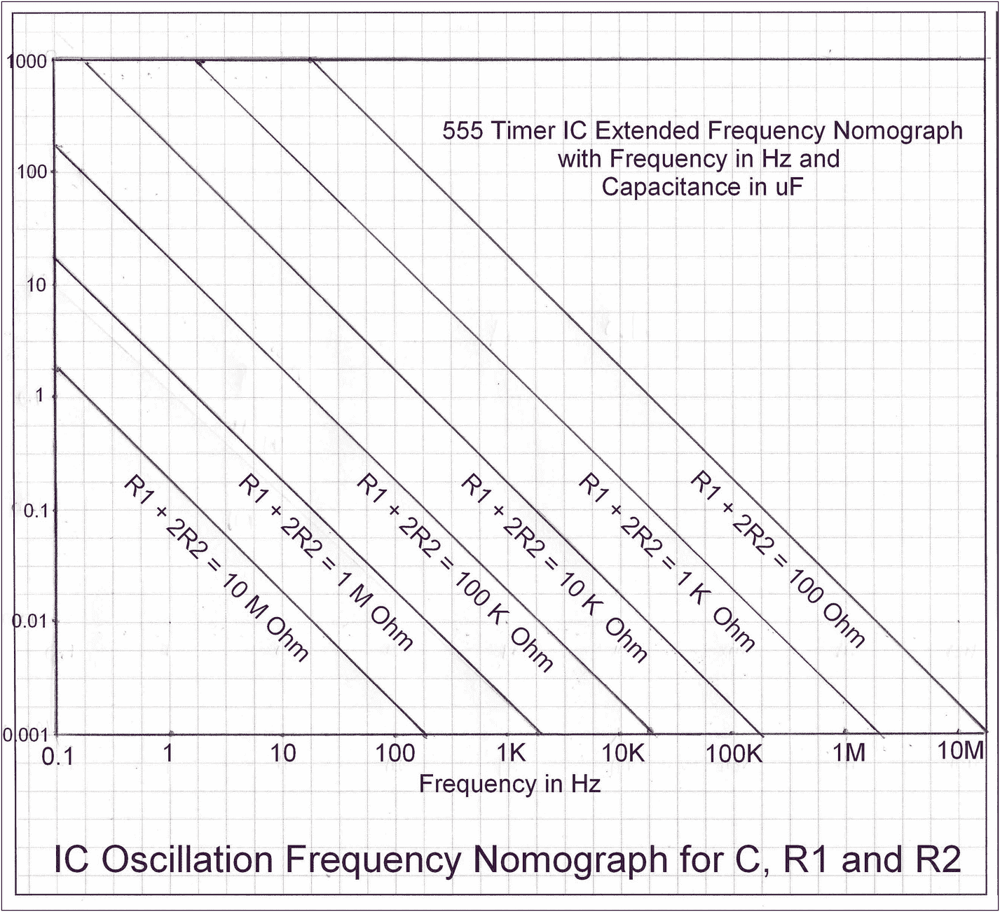

图 9-1

555 定时网络值的定时器输出频率

为了将定时器芯片的输出信号保持在适合 DAQFactory 图形的低频范围内，电阻值应在兆欧范围内(百万或 10 <sup>6</sup> 欧姆),电容值应在 0.1–10 uF(微或 1/1，000，000 F)范围内。图 [9-1](#Fig1) 的图形数据是近似值，选择使用的实际电阻值在某种程度上取决于选择的或可用的电容值。

值为 1–10 uF 的电解电容应适用于此图形显示练习，但为了更精确地工作，可能需要更高质量的低泄漏型电容，如下文所述。

### 所需的电子元件

1.  555 定时器集成电路

2.  可变电阻器和固定电阻器相加得到低兆欧范围，优选地，固定值和可变值处于相同的电阻量级

3.  1–10 uF 范围内的合适“定时”电容、0.01 uF 旁路电容和 9 V 电池电源

### 电路原理图

图 [9-2](#Fig2) 描述了非稳态 555 定时器的电路配置。

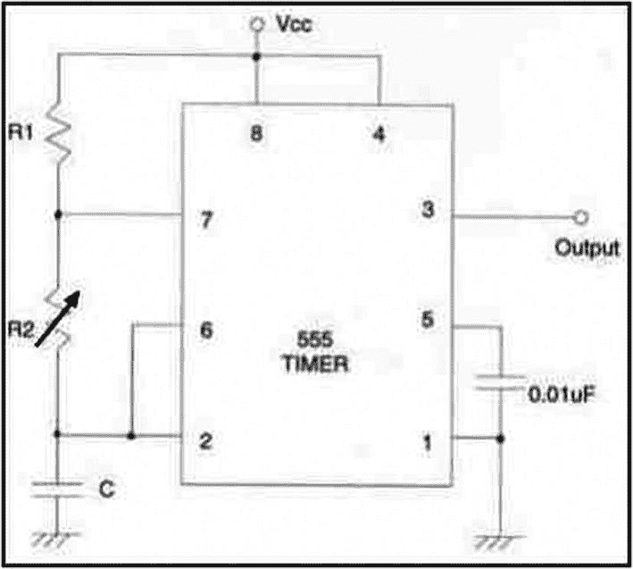

图 9-2

555 定时器不稳定配置

前面的电路显示了引脚 7 和引脚 2 之间的单个可变电阻。当可变电阻器处于其中间行程位置时，电路将工作，但是当处于其电阻值的低端时，将产生不稳定的结果。为了避免电路故障的任何问题，将固定值电阻器与可变单元串联，以限制第二定时网络电阻的下端值。作者使用 10kω值作为 1.2mωR1+R2 网络的和值。

### 软件

组装好非稳态振荡器后，将输出连接到 LabJack 上的差分输入通道，并配置一个接收方波输出的通道。然后可以创建图形页面组件。对于长时间的图形显示，确保频道存储容量足够大，以支持所需时间显示的长度。内存中值的数量由通道“历史”框中的值决定。(默认条目是 3600，当在几十分钟或几小时的实验时间范围内工作时，可以很快填满。)

### 需要页面组件

在新的页面上，从右键弹出的页面组件菜单中选择 2D 图条目，创建一个二维图形屏幕组件，如图 [9-3](#Fig3) 所示。

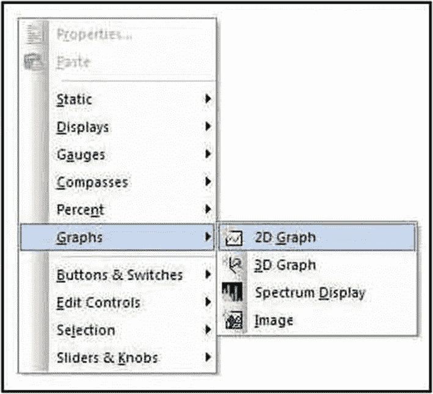

图 9-3

2D 图形记录器屏幕显示的数据工厂选择

x-y 图形的默认图形屏幕组件配置如图 [9-4](#Fig4) 所示。

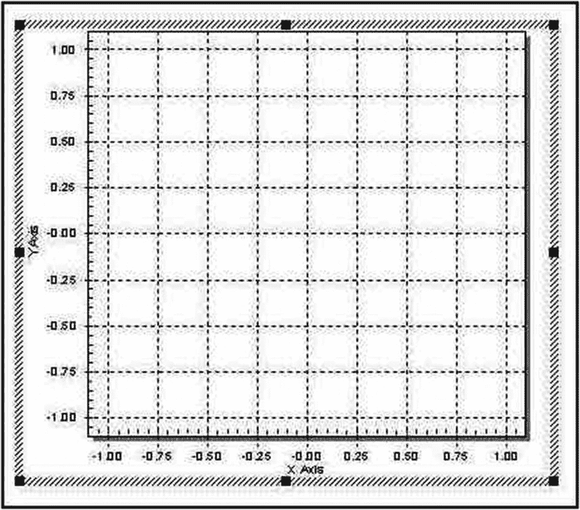

图 9-4

默认的 X-Y 图形屏幕显示

通过按 Ctrl 键并将阴影边缘线中心的正方形拖动到页面上的所需位置，图形组件被定位并适合页面。一旦确定了组件的大小，就可以通过右键单击屏幕组件并选择“属性”条目来打开屏幕组件的属性菜单。图形的属性窗口是一个多选项卡显示，具有多个条目表单，用于向图形添加轨迹、定义用于图形显示的轴值、添加标识标题以及选择显示颜色。图 [9-5](#Fig5) 显示了六选项卡属性窗口的轨迹选项卡，用于定义名称条目。

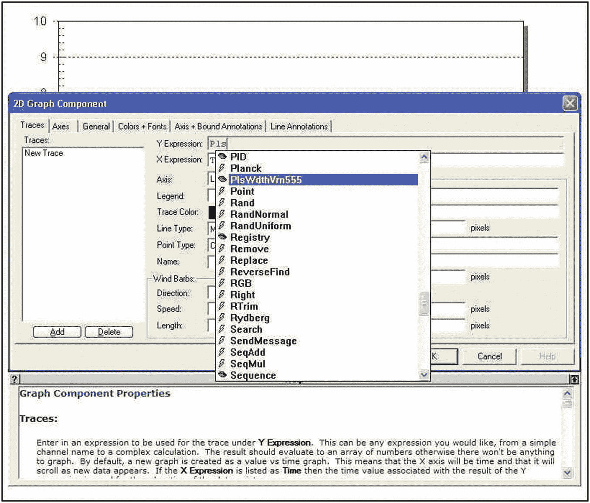

图 9-5

记录器跟踪名称选择

“属性”窗口底部的帮助屏幕解释了图形屏幕组件中的所有数据输入框和选项卡。

对于由 9 伏电池供电的 555 定时器振荡器产生的方波，电压范围被偏移以显示从-1 到 9 伏的值，从而更清楚地描述波形处于 0 伏的时间。

### 第 1 部分:观察

使用 392kωR1、900kωR2 和 10kω串联电阻限制单元，从 9 V 电池对 22 uF、25 V 电解电容器充电，在 R2 上以中间设置获得 60 秒内 4 个高时间周期的图形显示。

在图 [9-6](#Fig6) 和 [9-7](#Fig7) 所示的两个极端之间，单位时间内产生的信号波形数量发生变化。

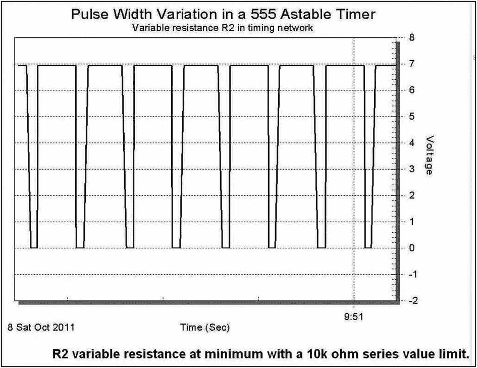

图 9-7

最小电阻时的定时器输出

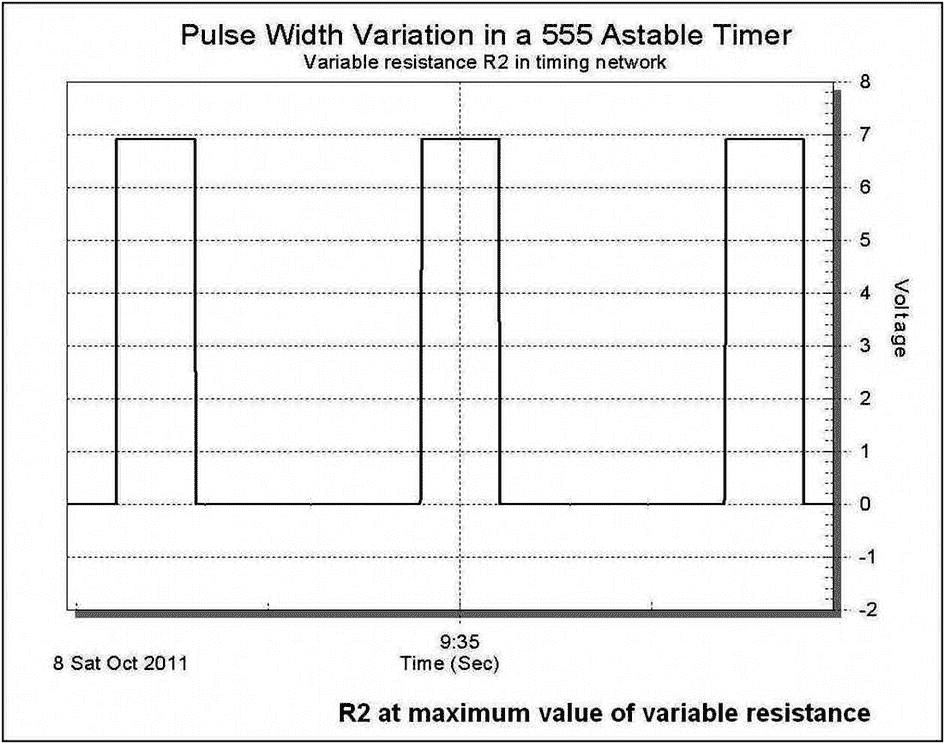

图 9-6

最大电阻时的定时器输出

如果电路在没有串联电阻来限制 R2 最小值的情况下工作，则可能会产生如图 [9-8](#Fig8) 所示的波形。

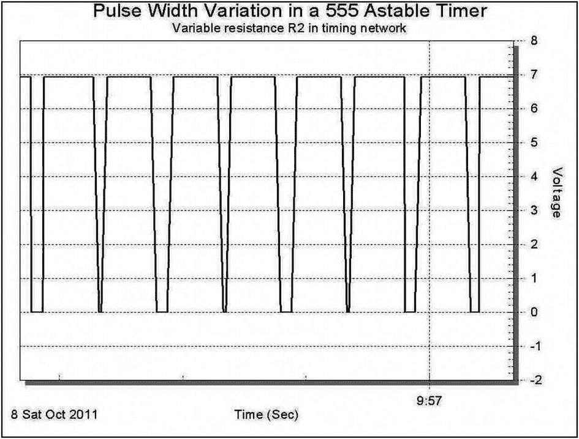

图 9-9

输出信号不稳定或“混叠”

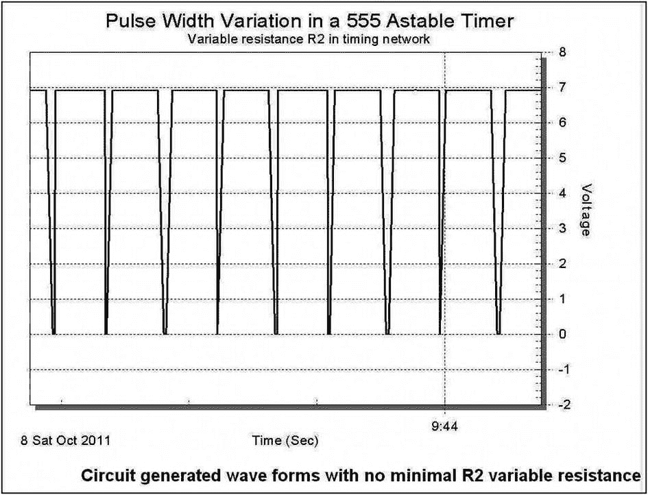

图 9-8

无最小电阻的波形

## 实验的

### 第 2 部分:硬件和元件选择——三角和“锯齿”输出

除了产生具有可变占空比的方波信号之外，非稳态 555 定时器还可以用来产生“锯齿”和不对称的三角波。基础电子学教导说，当电容器通过固定值电阻器充电或放电时，在电容器的端子上看到增加或减少的指数电压值。当用恒流源给电容充电时，电容两端的电压会线性增加。线性电压变化形成三角波形，该三角波形可用于产生在化学分析和其他实验工作中具有多种应用的电压斜坡。

通过组装图 [9-10](#Fig10) 所示的电路，可以产生两个额外的波形。

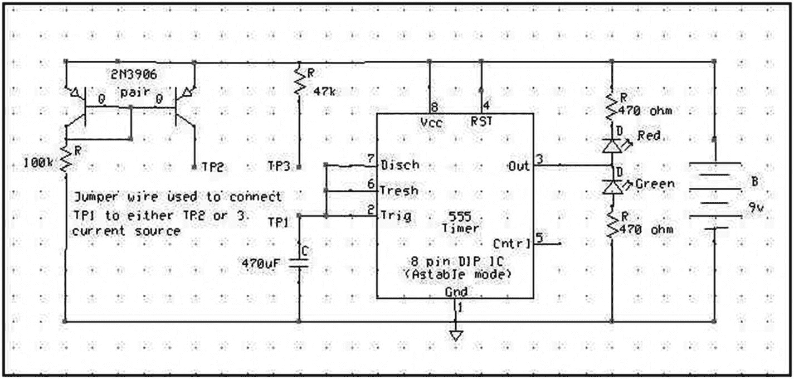

图 9-10

恒流充电电源

### 第 2 部分:观察

当电容器通过串联电阻充电时，在测试点 1 和 3 之间，观察并记录常见的指数电压变化，如图 [9-11](#Fig11) 所示。

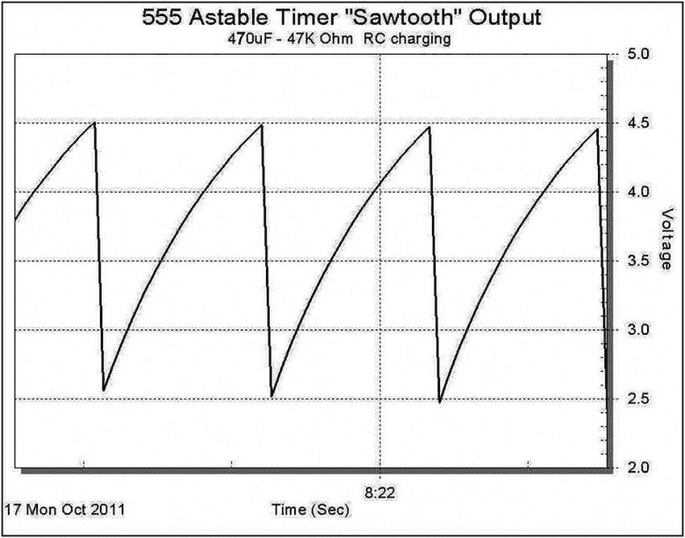

图 9-11

典型 555 定时器“锯齿”输出电压波形

当测量 TP1 和 TP2 之间的电压时，会记录一个三角波形，如图 [9-12](#Fig12) 所示。

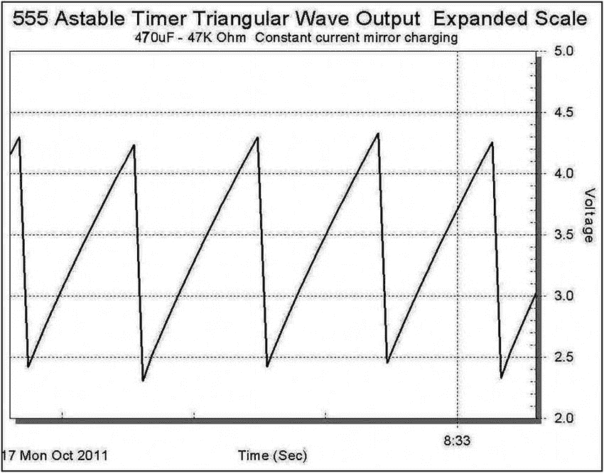

图 9-12

555 定时器三角波扩展刻度

用恒定电流对电容器充电会在电容器极板上产生线性电压斜坡，如波形左侧所示。当定时器的放电引脚通过 555 定时器 IC 中的内部 NPN 开关晶体管的发射极接地时，信号的右侧陡峭部分是由电容快速放电引起的。虽然放电轨迹看起来是一条直线，但实际上它是图 [9-11](#Fig11) 所示的正充电曲率的反指数曲线的初始部分。图 [9-12](#Fig12) 和 [9-13](#Fig13) 显示了在电容器和定时器 IC 的放电引脚之间增加一个固定串联电阻的效果。

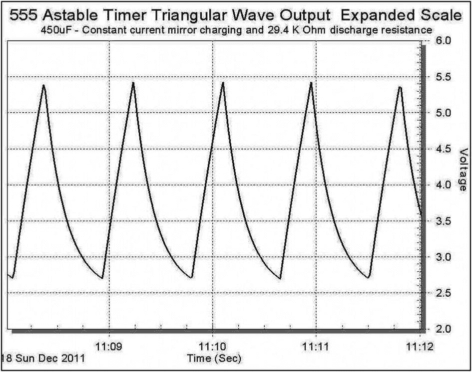

图 9-13

增加放电电阻对定时器输出波形的影响

简单的逻辑表明，要获得线性三角波形，通过恒流源和吸电流对电容进行充电和放电可以实现所需的结果，但使用能够产生各种形状和频率信号的“函数发生器”可以找到更简单的解决方案。

### 第 3 部分:硬件和元件选择——双斜率三角波形

要获得对称的三角波形，使用“函数发生器”更容易与 741 和 555 ICs 一样，Exar XR-2209 也是一款非常成功的函数发生器，自 1975 年以来一直采用 8 引脚双列直插式封装(DIP)。集成电路是围绕一个称为压控振荡器(VCO)的电路构建的。XR-2209 VCO 可以从单个 8 引脚 DIP 同时产生方波和三角波电压波形信号。根据当前应用的需要，该芯片可以采用单电压或双电压电源供电。(参见“讨论”)使用单端或双电压电源时，函数发生器芯片需要特别小心，详情见制造商的数据手册。图 [9-14](#Fig14) 显示了使用双电压电源(在作者的案例中为+/-9 伏电池)的 2209 函数发生器的推荐电路原理图。

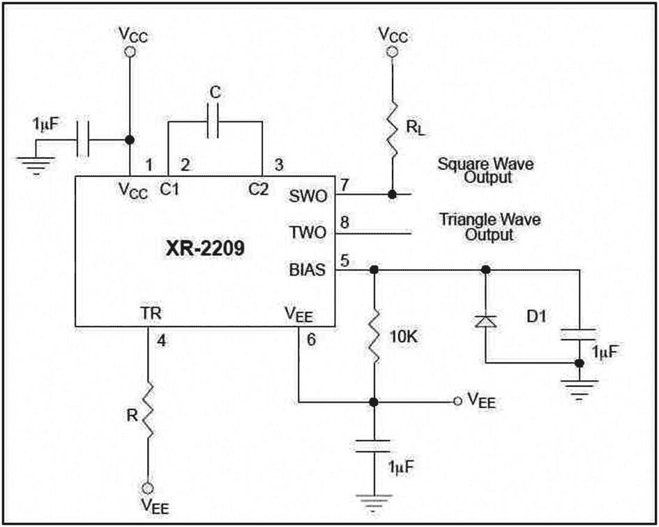

图 9-14

函数发生器配置示意图

为了产生正负电压斜坡，电路由一对 9 V 电池供电，配置为双极性+/–9V 电源，共地，如图 [9-15](#Fig15) 所示。

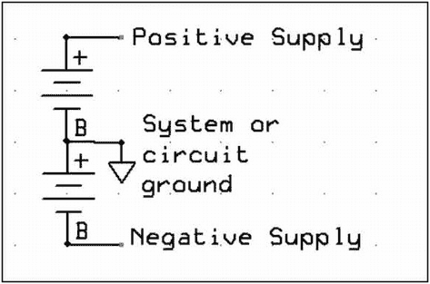

图 9-15

一种双电池双极电源

如果电路在试验板上正确组装后无法按预期工作，请查阅制造商的数据手册和“讨论”部分。

### 第 3 部分:观察

XR-2209 可以产生如图 [9-16](#Fig16) 所示的对称三角波形，并通过适当的“上拉”电阻产生如图 [9-17](#Fig17) 所示的方波。(参见“上拉”电阻选择的设计限制讨论。)

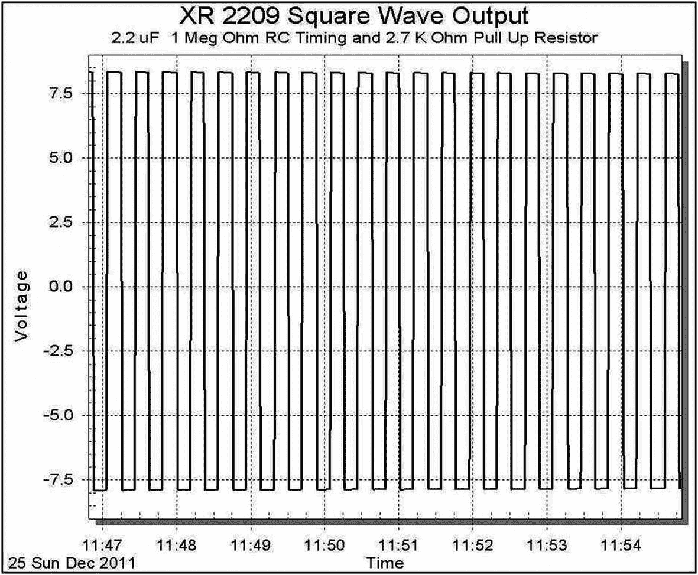

图 9-17

带上拉电阻的方波输出

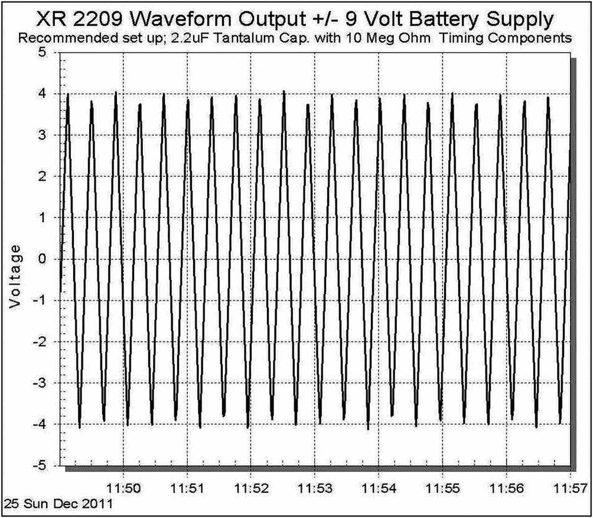

图 9-16

XR-2209 函数发生器对称三角波输出

## X-Y 数据记录

如图 [9-4](#Fig4) 所示，二维绘图的默认格式，图形显示屏组件是 x 对 y。图 [9-10](#Fig10) 的恒流充电电路可用于产生电容器两端电压及其平方的 x-y 绘图，用于测量电容器两端产生的能量。E = CV <sup>2</sup> /2。恒流电路可用于本演示练习，因为恒流充电和器件的指数放电会在电容上产生不对称的电压斜坡。

为了创建所需的显示，可以在为 PWM 数据采集显示创建的通道中记录恒流充电电路的 470 uF 电解电容两端的电压。当定时器芯片将充电的电容器接地时，试验板电子器件使电容器上的电压在电源电压的 1/3 和 2/3 之间线性循环，然后指数放电。因此，循环充电和放电电压的图形显示应该不同。在 x 轴框中输入通道名称，在 y 轴表达式框中计算电压的平方。显示在两个轴上的电压必须根据用于驱动电压变化的电源进行调整，在作者的情况下，图 [9-18](#Fig18) 、 [9-19](#Fig19) 和 [9-20](#Fig20) 中描述的值用于记录图 [9-21](#Fig21) 中的数据。

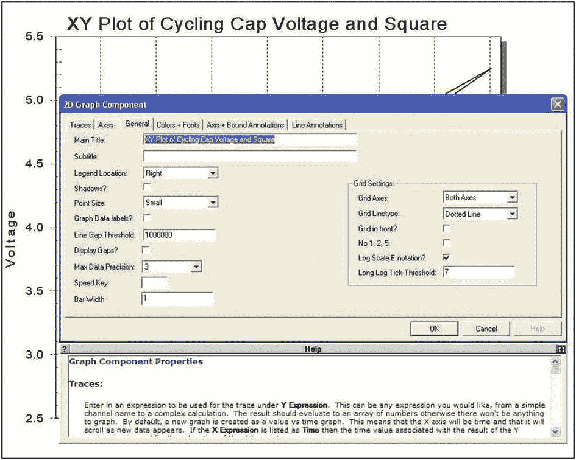

图 9-20

x-y 图形常规选项卡

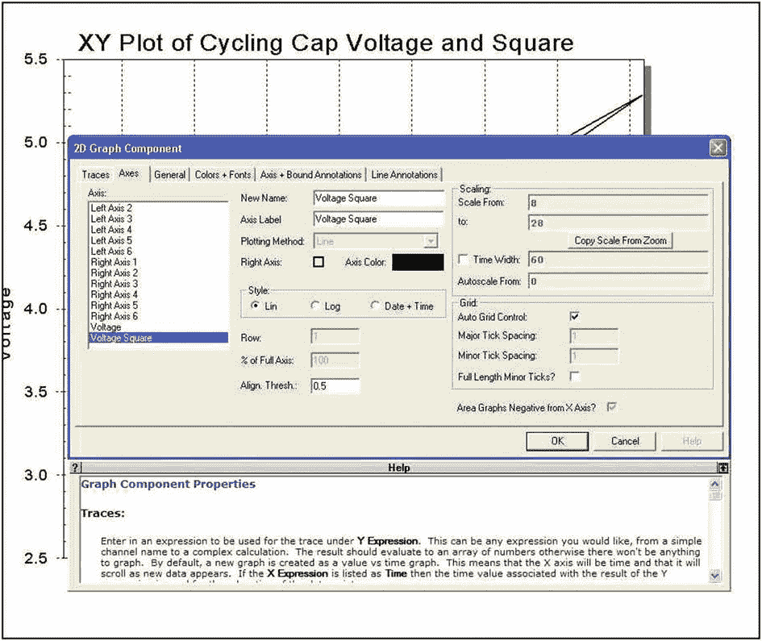

图 9-19

x-y 图形轴选项卡

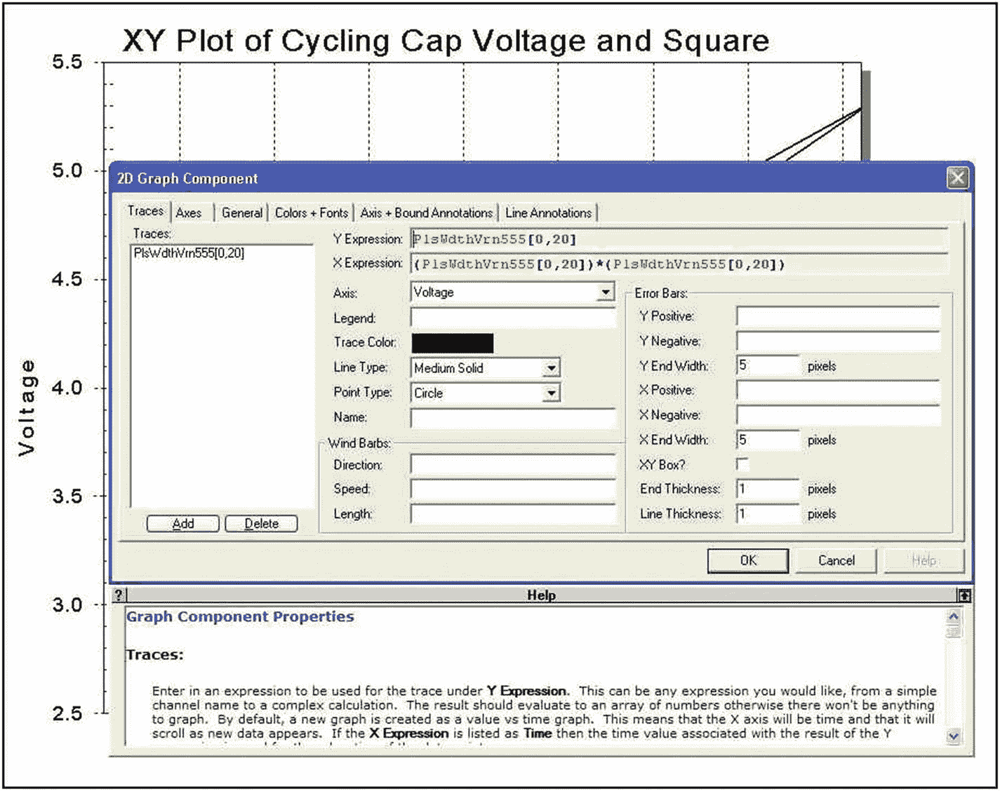

图 9-18

x-y 图形轨迹选项卡

记下此图形图像显示的数据。如图 [9-18](#Fig18) 所示，x 轴和 y 轴都不是 PlsWdthVrn555 而是 PlsWdthVrn555[0，20]。因为这是一种循环现象，我们只需要显示通道数据的有限部分，即有限的“视野”或“视觉暂留”

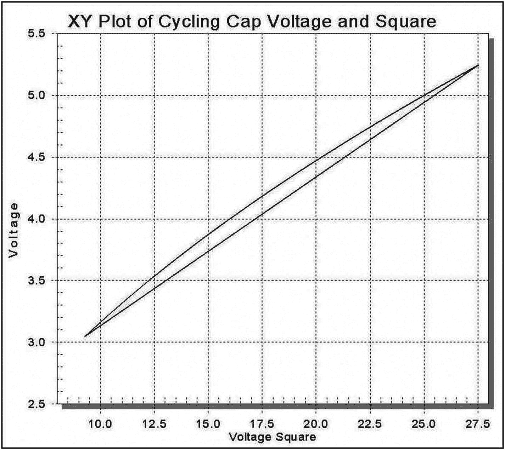

图 9-21

电容器电压和电压平方的曲线图

## 观察:x-y 绘图

图 [9-21](#Fig21) 中显示的轨迹是一个典型的记录，在记录失真或改变的轨迹之前，它可以保持稳定和可再现几分钟。图 [9-22](#Fig22) 和 [9-23](#Fig23) 已经捕捉到两个错误轨迹的实例。

在图 [9-22](#Fig22) 中，在 5 V 和 25 V 交叉处记录的电压方波放电轨迹已经一分为二。仔细检查图 [9-23](#Fig23) 会发现，放电轨迹不仅在循环的高压部分一分为二，而且在循环的 3v 和 9 V 低端也是如此。

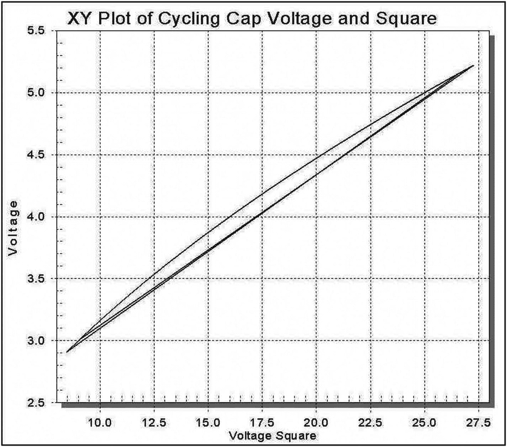

图 9-23

高和低电压轨迹变化

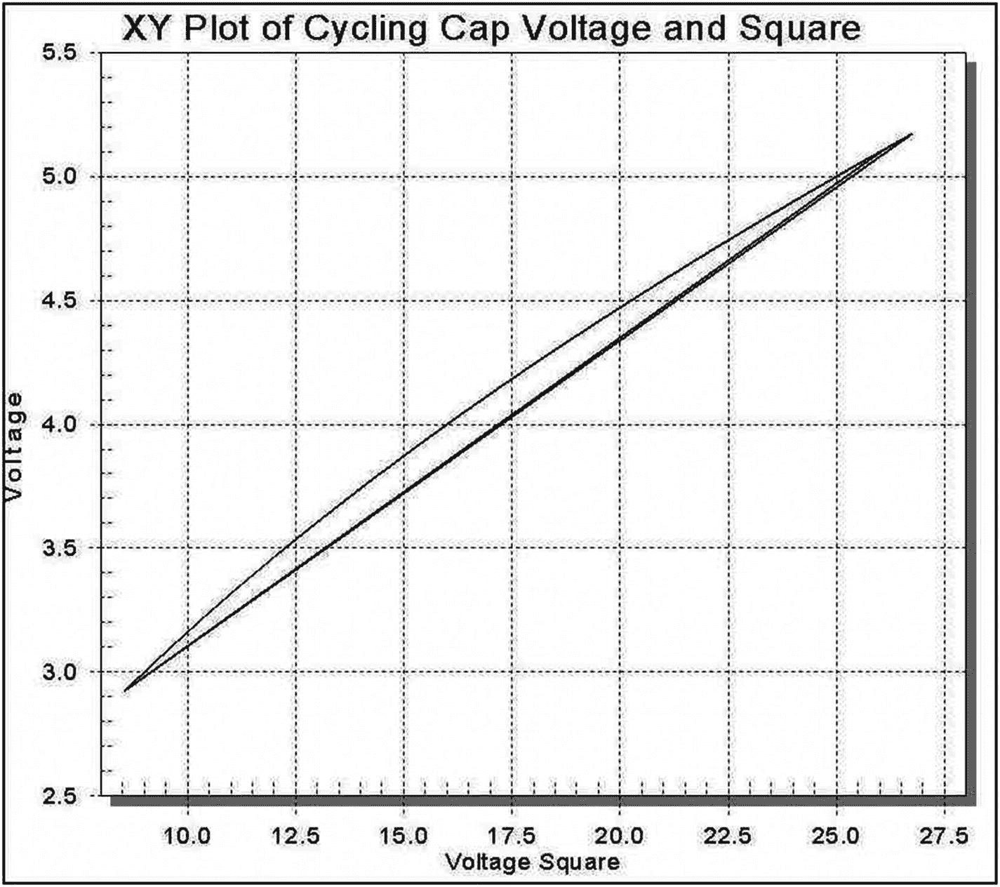

图 9-22

更高的电压轨迹变化

## 讨论

记录数据的图形显示非常有价值，因为它能够显示趋势。实验科学依赖于再现性，数据的图形显示可以用来验证观察结果。

图形显示允许研究者看到隐藏在“实时”观察中的事件或趋势。然而，在检查数据记录的趋势时，在对数据有效性做出判断之前，必须考虑由材料缺陷、自热引起的温度变化、光诱导的变化、实验条件的不良选择以及大量其他误差源引起的偏差。在化学分析过程中，特别是在这项工作中，研究人员必须经常处理“模拟”数据的图形表示，这些数据涉及或需要很长或很短的记录时间。或长或短的时间范围可能需要特殊的部件、特殊的电子电路或配置，以及保护操作电路不受杂散电信号和干扰的影响。超长和超短时间常数可能会接近传统 IC 构建模块原始设计参数的极限，因此在极端工作条件下或接近极端工作条件下使用这些器件时必须格外小心。

从电子来源获得的数据中常见的变化来源包括:

1.  由于电池或“电源”供电而产生的变化。

2.  元件的缺陷和变化，如电阻噪声(线绕元件最小，金属薄膜次之，碳元件最大)、电容漏电流和记忆效应(电解元件最大，钽元件次之，塑料薄膜元件最小)。

3.  由环境变化引起的温度效应和由通过电阻性电子元件的电流引起的内部加热都会导致电信号漂移。

4.  长电线会积累射频干扰(RFI ),其作用类似于主电源线辐射的天线。电线应尽可能短，如有需要，可装入法拉第笼中。带有长条状金属触点和插入电路板的长元件引线的试验板只能用于实验开发，然后用印刷电路板替换，用于实际的实验服务。

5.  通道存储的数字采样(或模数转换)中的混叠。这些练习中创建的实验设置的数据由 LabJack 或微控制器转换成数字格式，并由 DAQFactory 软件以输入通道计时值框的通道计时值控制的速率读取。可能由控制计算机电子设备、LabJack 电子设备、实验装置本身或实验可能位于其中的建筑物的干线布线拾取或产生的任何重复或周期性的电信号存在与由被监控的装置产生的真实信号“混淆”的可能性。当以长期图形格式显示时，长时间被监视的信号可能包含叠加在真实或原始信号上的“错误或人为”波形。

### x 与时间记录

555 定时器的操作顺序已在第 [8](08.html) 章中概述，从该总结以及图 [9-6](#Fig6) 和 [9-7](#Fig7) 中的信息，我们可以看到在非稳态模式下产生的波形随着定时网络中 R2 电阻值的变化而改变频率。

当以非稳态配置接线时，电容充电时间由 RC 时序网络的总电阻决定，如下所示:

*   t <sub>1</sub> = 0.693(R1 + R2)C(输出高电平时间)

并且放电时间是

*   t <sub>2</sub> = 0.693(R2)C(输出低电平时间)

因此，总信号周期为

t = t<sub>1</sub>+t<sub>2</sub>= 0.693(R1+2r 2)C

并且操作的频率是

f = 1/T = 1.44/(R1 + 2R2)C

电容通过两个电阻充电，同时仅通过一个电阻放电。当网络中的 R2 电阻是可变电阻时，输出为低电平的时间与可变电阻值成正比。因此，555 定时网络中变化的模拟电阻可以通过测量输出为低的记录宽度来数字化。

图 [9-2](#Fig2) 所示电路产生的高电平和低电平时间的相对宽度存在限制。需要特殊的电路来保持振荡器频率相对恒定，而振荡器的高和低时间宽度(占空比)是变化的。

扩大或缩小图形显示的时间刻度可以改变所显示波形的分辨率。

图形显示需要大量的计算机处理资源，并且如前面处理时间和定时的练习中所述，对快速变化的信号的响应能力有限。快速变化的信号最好用硬件数字化，存储在存储器中，然后在收集后，转换成图形格式显示。

对于较慢的信号变化，DAQFactory 能够在其通道中存储图形数据，然后能够将其显示为带状图表记录，这在揭示隐藏信息方面非常有用。如果图 [9-12](#Fig12) 的三角波形被记录 8 到 10 分钟，然后图形显示的时间刻度被重新配置以显示 8 分钟的数据窗口(即，对于时基，8 分钟的窗口将是 8 分钟× 60 = 480)，那么大量的变化变得明显，如图 [9-24](#Fig24) 和 [9-25](#Fig25) 所示。

在图 [9-24](#Fig24) 和 [9-25](#Fig25) 中，延长显示重复电压周期的时间尺度已经直观地显示了几个普遍存在的实验误差源的影响。

大多数人都熟悉水波在静止水体中的传播。在我们看来，由扔进池塘的石头引起的来自两个源头的水波互相穿过而没有干扰。然而，如果一个物体漂浮在水面上，与波浪在同一点穿过另一点，就会看到该物体剧烈的颠簸。剧烈的纵摇是由叠加原理引起的，叠加原理将穿过彼此的两个水置换波的振幅相加。图 [9-24](#Fig24) 中 7 . 14 . 30 和 7 . 19 . 00 处可见的失真可能是由幅值为伏特、频率为 4 1/2 分钟一个周期的第二个电压变化波与主信号混合或干扰引起的。

由更复杂的电子问题引起的图形失真的另一个来源是所谓的混叠，该电子问题涉及周期性模拟波形的定时重复数字采样，这在一些电子教科书中有所讨论。 <sup>[1](#Fn1)</sup> (别名是 RPi-Python 编程代码的一个实用概念。)

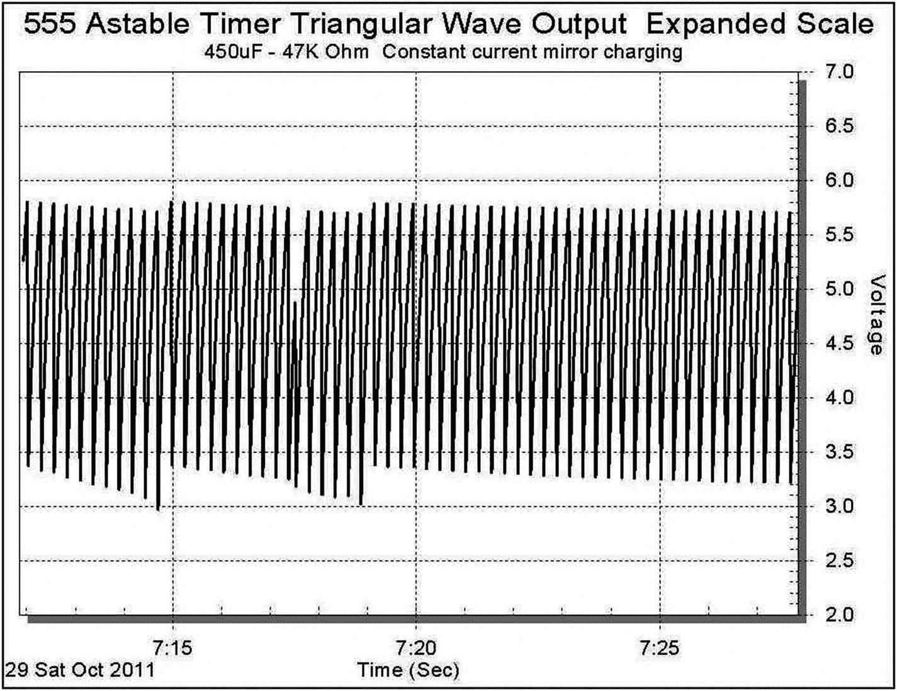

图 9-24

长期信号失真

所记录的三角波形就其出现频率而言是可合理再现的，因为可以看到作者的试验电路在 5 分钟内产生 19 个周期。然而，可以看出电压电平的再现性是漂移和振荡的。电压的下限值从 3.0 到 3.4 不等，而上限值从 5.7 到 5.0 不等。尽管电压的上限值和下限值在变化，但显示有明显的模式，表明系统由于前面讨论的因素而漂移和振荡。

施加到恒流源中左侧和右侧晶体管的手指热量在周期时间内产生膨胀和压缩，如图 [9-25](#Fig25) 和 [9-26](#Fig26) 所示。

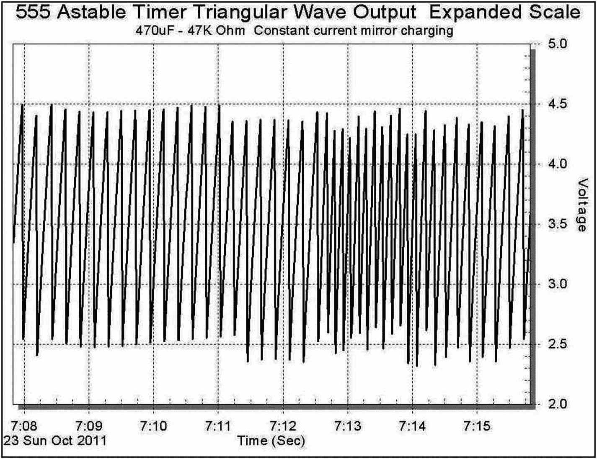

图 9-26

手指加热应用于电流镜的右晶体管

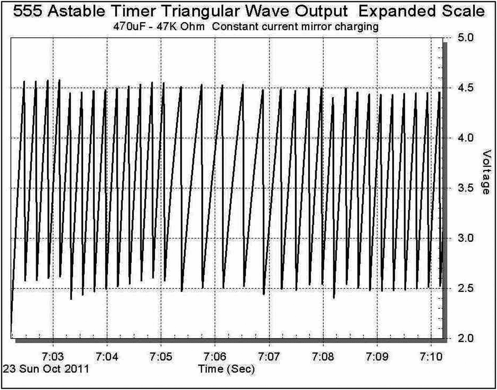

图 9-25

手指加热应用于电流镜的左侧晶体管

除了周期时间改变之外，不稳定的振幅也是热效应的结果。

制造电子元件的材料也会产生电子电路中的噪声。线绕电阻的噪声最小，金属薄膜次之，碳基元件对电阻电路噪声的贡献最大。

电解电容价格低廉，可提供更高的值，但几乎所有高值电解单元都有相当大的漏电流。在需要循环或重复再现性的系统中，漏电流会导致问题。传统的低泄漏电容通常没有高电容值，但是当有限的高值单元存在时，它们通常非常昂贵并且物理尺寸很大，如图 [9-27](#Fig27) 的照片所示。

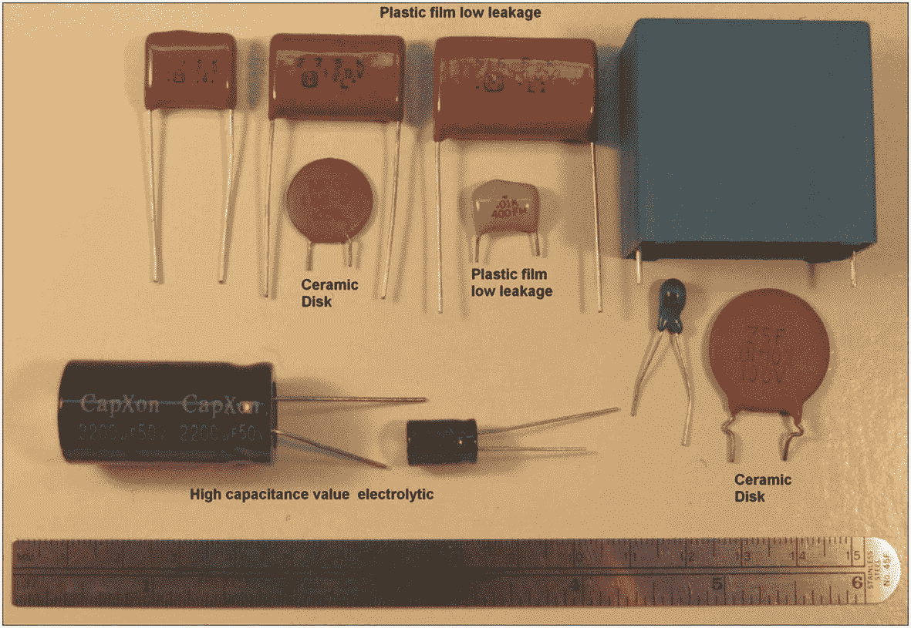

图 9-27

各种类型的定值电容器

利用运算放大器和电容可以产生对称的三角波形，但一种称为压控振荡器的电路被设计用来同时产生方波和对称三角波形。Exar XR-2209 IC 是一个带有外部电容和电阻的模块，可由 4 至+/-13 伏的双电源或单电源供电，以产生所需的信号。图 [9-16](#Fig16) 和 [9-17](#Fig17) 是 IC 的典型输出。在作者的试验板设置中，可以看到三角波在所达到的峰值电压中有系统地变化。试验板设置也被证明对用于产生方波的“上拉”电阻值非常敏感。元件灵敏度可能是由于在接近电路设计极限的区域操作电路造成的。

### X-Y 记录

当要记录的信号本质上是循环的时，通常使用 x-y 记录。由于信号的循环性质，最好从 x-y 屏幕上清除旧的轨迹，因为新的轨迹会覆盖在旧的数据轨迹上。通过使用[n]通道值符号指定要绘制的数据点数，可以显示信号周期的任何分数或倍数。

在图 [9-22](#Fig22) 和 [9-23](#Fig23) 中看到的不可再现信号的影响是由相同的原因引起的，这些原因在图 [9-24](#Fig24) 、 [9-25](#Fig25) 和 [9-26](#Fig26) 中记录的 x 与时间信号的变化中很明显。

## 微控制器数据绘图

开源、在线社区支持的可编程微控制器不断扩展其基本功能，从版本 1.6.6 开始，Arduino IDE 中增加了数据绘图功能。

在之前的练习中，Arduino 微控制器被用作智能数据采集设备、传感器或显示器的电源以及时钟；在本章中，它将用于提供数据的可视化图形显示。

自 Arduino IDE 版本 1.6.6 和 7 以来，工具菜单中提供了串行绘图仪选项，如图 [9-28](#Fig28) 所示，最初用于单个绘图，但从版本 7 开始，用于多数据点绘图。

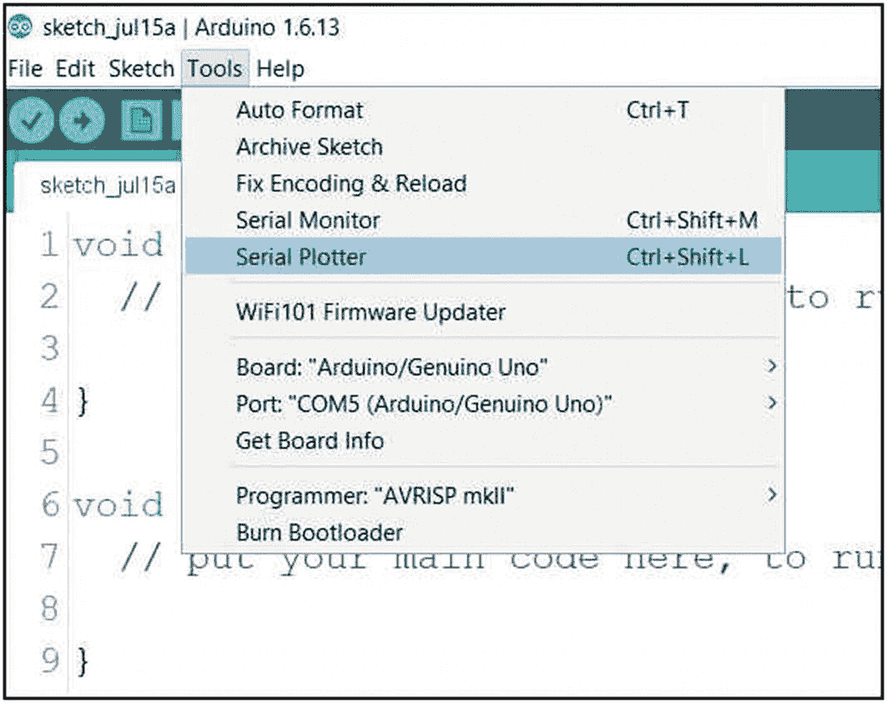

图 9-28

Arduino IDE 工具菜单串行绘图仪选择

调用串行绘图仪输出会将串行端口窗口显示转换为 x-y 绘图仪。指向串行端口用于显示打印语句的各个数据点绘制在垂直 y 轴上。x 轴以 500 点移动窗口的形式从左向右自动滚动。x 轴的度量是使用换行符打印指令对代码行的处理。图 [9-29](#Fig29) 中的第 15 行包含 println 代码，该代码被视为已处理，其总值构成了显示在 x 轴上的数值。

对于多点绘图，用单独的轨迹显示的每个数据值都用打印空白指令或制表符指令与下一个数据值分隔开:(print(" ")；或者打印("/t ")；).图 [9-29](#Fig29) 中的第 10、12 和 14 行形成了图 [9-30](#Fig30) 中所示的四道图的分离标记。

### 实验的

图 [9-29](#Fig29) 中的代码绘制了两条不同频率的直线和两条正弦曲线，如图 [9-30](#Fig30) 所示。

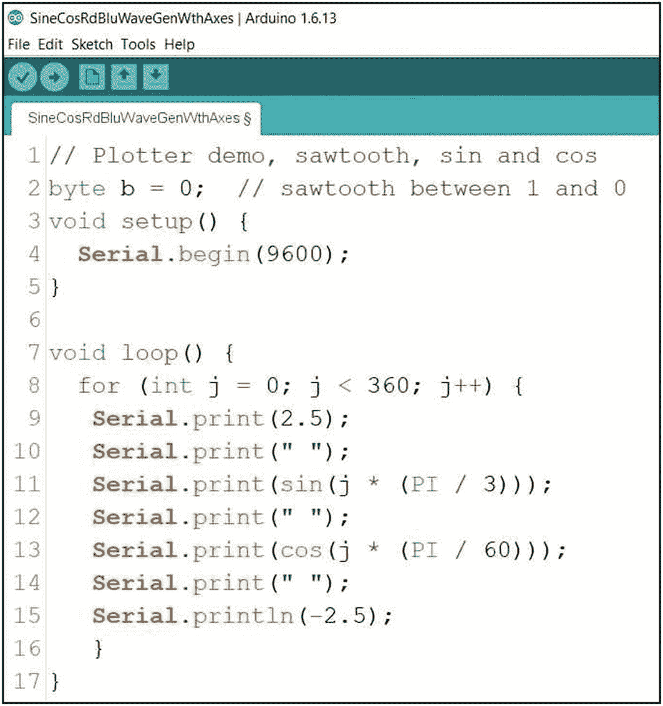

图 9-29

Arduino IDE 典型绘图仪程序

### 观察

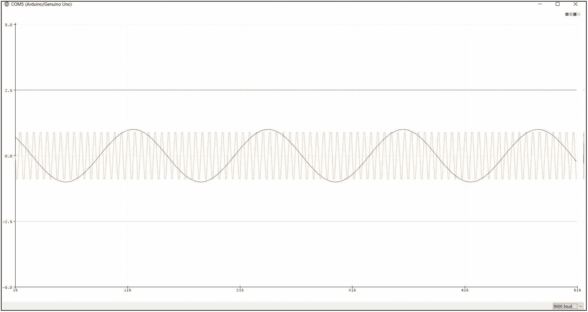

图 9-30

Arduino 串行绘图仪输出

对微处理器绘图仪演示代码和显示的正弦波频率的检查验证了正弦波和余弦波之间预期的 20:1 频率比。常数值绘制为预期的直线。

### 讨论

Arduino 的 IDE 中包含的绘图仪为实验研究者提供了一种非常强大的可视化技术。这个绘图仪既容易使用又有用。由微处理器控制的实验过程产生的图可以被记录，以便利用主机上可用的打印屏幕功能进行存档。实验图归档已用于涉及温度、运动和振动测量的实验工作以及光和光学研究。

虽然绘图仪是一个非常有用的功能，但它在原稿准备时在操作的几个方面受到限制。跟踪的颜色由 IDE 的操作系统决定，有时很难看到。标度是自动调整的，与 DAQFactory 绘图仪不同，它不能独立设置为不同的值。

偶尔在初次启动时，绘图仪会产生虚假图像，如图 [9-31](#Fig31) 左侧所示，或者不正确地自动缩放 y 轴。

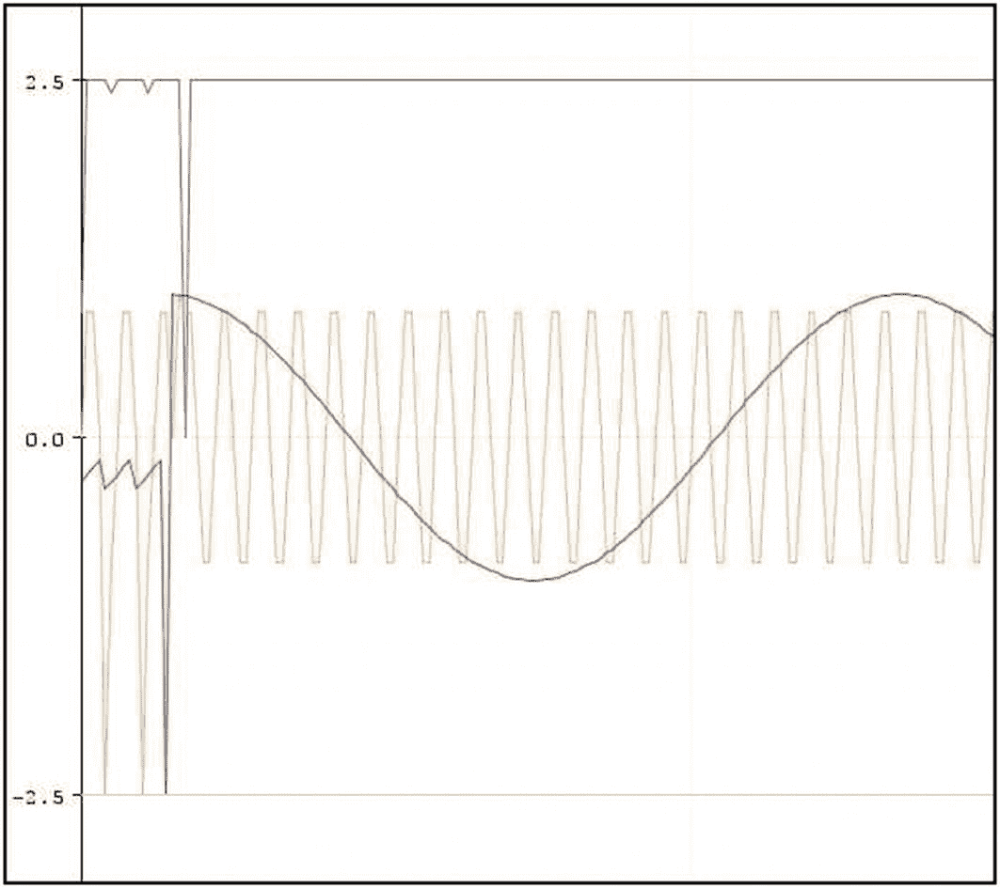

图 9-31

Arduino 串行绘图仪启动噪音

如上图所示，绘图仪相当快地进入可再现状态，但有时可能会错误地绘图，直到 500 点窗口自行刷新，自动缩放功能也进入可再现绘图模式。

## 用 Python 和 Raspberry Pi 记录图形数据

### 介绍

如上所述，实验数据的图形绘制可以采取两种形式。如果数据是以高速率生成的，那么最好将它保存到内存中进行存储，并在以后以图形方式进行分析。以较低速率生成的实验数据通常可以在“现场”或“实时”显示中显示。Python 和 RPi 使用一个名为 matplotlib 的图形绘图库来显示实时和存储的数据。

本章末尾的清单 [9-1](#PC1) 中提供了一个 Python matplotlib 代码示例，该代码绘出了偏置在 GPIO 阵列上的 3.3 伏 RPi 电源与其地之间的 10kω电位计的游标臂电压值。该代码已从带状图表记录器程序修改而来，可在 matplotlib 文档中找到“动画示例代码:strip_chart_demo.py”。该文档包含使用这种类型的动画图形显示的完整开发教程。

虽然 RPi 没有广泛的商业图形显示软件应用程序可供选择，但 matplotlib 可以为开发所需的应用程序提供坚实的基础。本练习中用于监控变化电位计电压的相对较短的程序配备了几个高级实用程序，用于深入检查记录的图形显示。matplotlib 文档中题为“交互式导航”的部分描述了绘图显示左下角的七个按钮的操作，如图 [9-32](#Fig32) 和 [9-34](#Fig34) 所示。当使用任何显示操作或存储按钮时，左按钮恢复显示焦点。按钮允许记录轨迹的部分被保存，如图 [9-33](#Fig33) 所示，并被放大，如图 [9-34](#Fig34) 、 [9-35](#Fig35) 和 [9-36](#Fig36) 所示。除了按钮激活的实用程序之外，库示例还显示鼠标光标的坐标，以便通过将光标指针放在跟踪中感兴趣的点上，并根据显示时间和绘图仪框架右下角显示的数值中的测量数据值读取该点的 x 和 y 坐标，可以识别精确的点。

matplotlib 程序也很容易改变任一标绘轴的比例，但由于之前练习中出现的时间比例不一致，显示的绘图仪时基需要按照以下实验部分所述进行校准。

### 实验的

为了演示 RPi 提供的绘图功能，可以从 gpiozero 库和 MCP3008 ADC IC 创建一个示例，从偏置电位计的游标读取电压。游标电压由一个 10 位 ADC MCP 3008 数字化，配置如第 [6](06.html) 章、图 [6-17](06.html#Fig17) 所述。为了便于 ADC 编程，gpiozero 库通过访问在“pot = MCP3008(0)”行中实例化的对象的“pot.value”属性来提供绘图数据。通过 gpiozero 库创建 pot 对象，程序员可以访问连接到 ADC 芯片第一个通道的游标电压值。通过将要绘制的代码变量设置为等于 pot.value 属性，该值将自动规范化为 0 到 1 之间的无量纲浮点值。

使用 gpiozero 库访问 MCP3008 ADC 的 RPi 配置还允许修改绘图程序，以接受能够提供 3.3 V 或更低电压值的任何传感器或换能器。图 35 和 36 是 555 IC 定时器输出的两条迹线，该定时器连接到数字转换器的第一个或 0 通道。第 [8](08.html) 章、图 [8-8](08.html#Fig8) 的右图和电路中说明了 555 IC 的配置。对于本实验，R1 和 R2 为 4.7kω，C1 为 555 定时器 RC 网络中的 100 μF 电解电容。输出电路还包括一个 LED 和限流电阻，以帮助电路组装、电气操作验证，以及通过观察 LED 以 60 秒 59 次的速率连续闪烁来验证记录仪显示。最后两个放大的比例图，图 [9-37](#Fig37) 和 [9-38](#Fig38) ，是通过绘图仪显示左下角选项行的“保存轨迹”按钮制作的。

为了帮助开发已发布的 matplotlib 条形图表记录器代码(使用内部随机数生成器为绘图仪示例输出创建 y 值),作者在正在修改的代码中插入了许多诊断打印语句。print 语句将正在执行的代码中的某些点的某些变量值输出到 Python 控制台，以帮助开发不同的方法，使代码适应不同来源的数据。注释掉诊断打印行将清除控制台显示。流出的变量数据在控制台显示器中显示为图 [9-32](#Fig32) 至 [9-34](#Fig34) 中的左侧屏幕。当不再需要时，打印行可以被注释掉。

在 RPi 上使用图形数据显示时，必须考虑几个因素。正如在之前的练习中所提到的，系统的时基不是恒定的，因此绘图仪显示器底部的时间刻度可靠性有限，必须进行半定量校准才能半定量使用(见“讨论”)。

一旦建立了所需的实验时间框架，必须使用秒表来测量系统绘制标称所需窗口时间宽度的数据所需的实际时间。表 [9-1](#Tab1) 是作者在开发用于校准标称 2 分钟宽绘图窗口的程序时收集的数据示例。

表 9-1

调整绘图仪时基

<colgroup><col class="tcol1 align-left"> <col class="tcol2 align-left"></colgroup> 
| 

Dt 设置

 | 

时间宽度(秒)

 |
| --- | --- |
| Zero point zero two | Twenty-five |
| Zero point zero one | Forty-one |
| Zero point zero zero five | One hundred and twenty-seven |
| 0.0055 | One hundred and sixteen |
| 0.00525 | One hundred and twenty-nine |
| Zero point zero zero five | One hundred and twenty-five |

### 观察

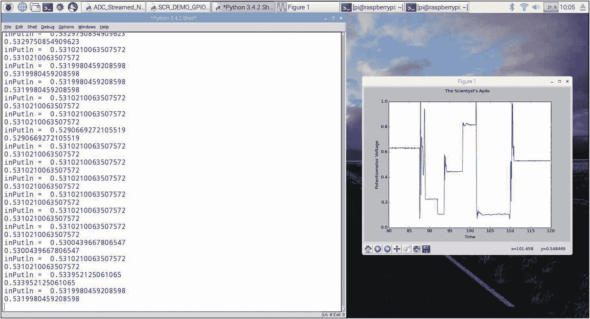

图 9-32

电位计游标电压的数据记录

图 [9-32](#Fig32) 显示了从实验开始 80 到 120 分钟的电压值轨迹，其中作者在显示器未校准的相对时间轴上记录的时间手动转动电位计轴。轨迹的响应速度相对较快，但轴的快速扭转会超出显示器跟上数据值变化的能力。

图 [9-33](#Fig33) 显示了点击选项行最右侧的“保存图形”图标时调用的操作。图形作为 png 图像保存在 RPi 的文档文件中。

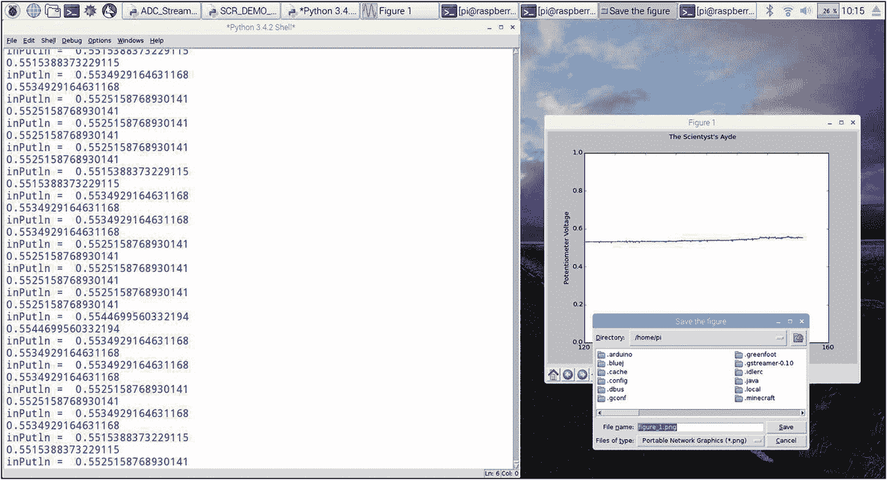

图 9-33

“保存图形”选项窗口

在图 [9-34](#Fig34) 的屏幕截图中，鼠标的光标刚刚经过 17 分钟就被放置在垂直响应线上，然后该点的精确坐标被打印在显示屏的右下角。

图 [9-34](#Fig34) 显示了将鼠标绘制的框所包围的区域扩展为全屏显示的缩放选项。然后可以如前所述保存扩展的图像，或者可以使用“返回前一视图”图标来恢复或继续正常的绘图动作。

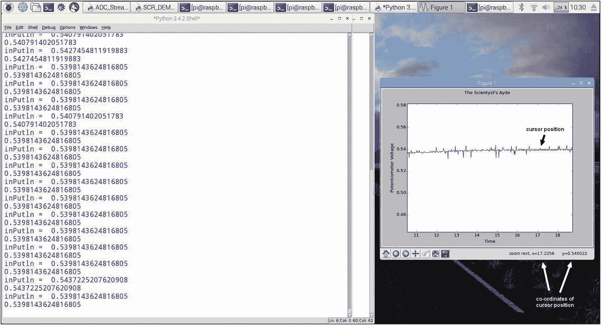

图 9-34

“规模扩张”选项

在下面的两个图中，使用“保存数字”选项以扩展的比例记录了详细配置的 555 定时器的输出。图 [9-35](#Fig35) 和 [9-36](#Fig36) 显示了软件保存来自外部电压发生源的较短时标绘制数据的能力。

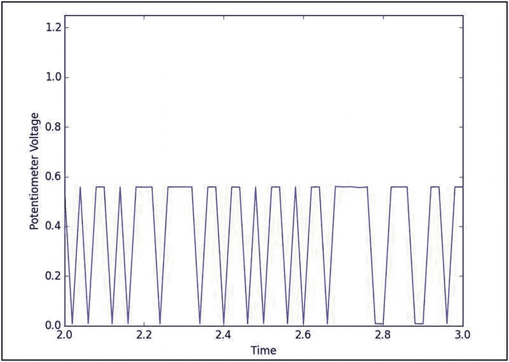

图 9-36

555 定时器数据记录的一分钟时间刻度扩展

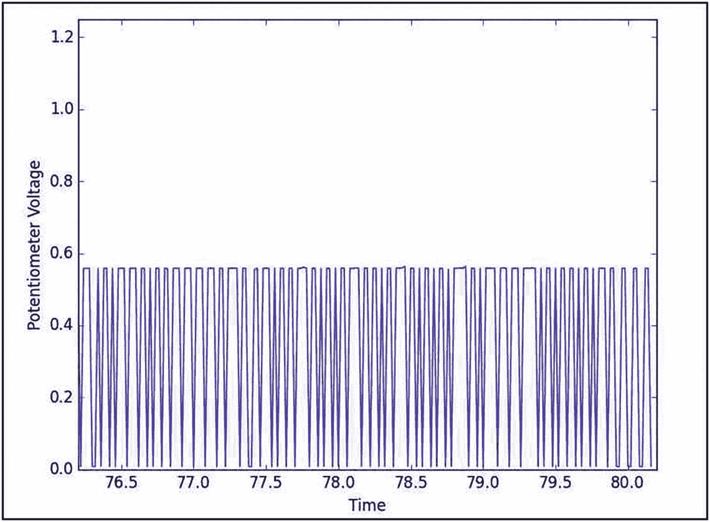

图 9-35

扩展时标 555 定时器数据记录

### 讨论

使用 Python matplot 库中的带状图记录器程序进行图形数据记录是一个适应性非常强、非常灵活的系统，可用于直接显示来自连接到 GPIO 阵列的传感器或来自 Python 串行端口的数据。

在图 37 中，配置为 R1 = 5.83kω、R2 = 4.7kω和 420 μF C1 定时电容的 555 定时器的输出在 33 秒内产生 10 次 LED 闪烁。计时器由 GPIO 阵列的 3.3 V 电源供电，并针对 4 分钟显示窗口进行校准，详见“实验”部分。

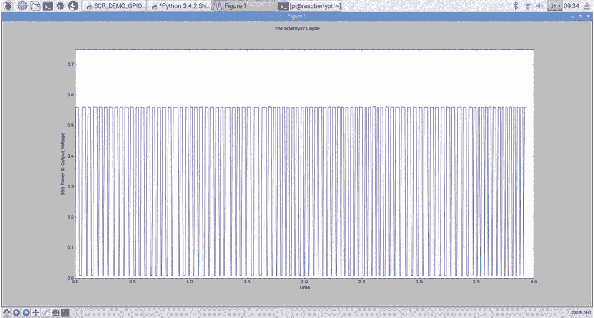

图 9-37

校准时基 555 定时器电压输出记录

图 [9-38](#Fig38) 显示了数据绘图程序显示选项按钮可用的比例扩展功能。

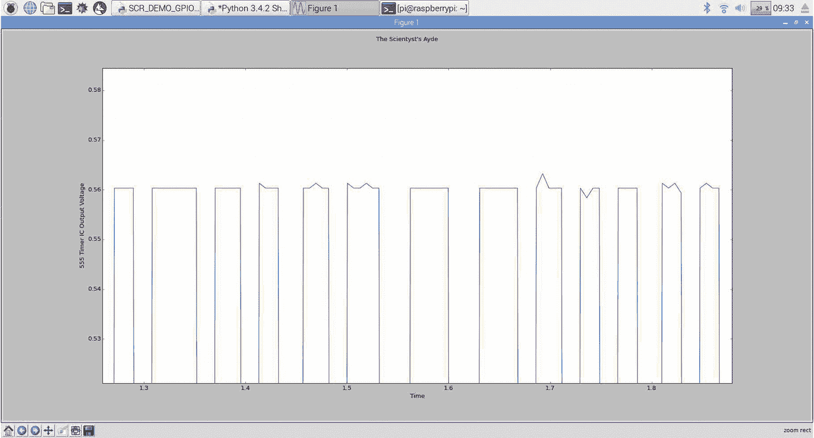

图 9-38

时间校准的标绘迹线展开

大量传感器已被编码到 gpiozero 库中，可用于为 matplotlib 绘图程序提供数据。

当矩形脉冲时间宽度的变化以图 [9-38](#Fig38) 的视觉格式呈现时，图形数据显示的优势之一变得明显。

表 [9-1](#Tab1) 展示了用于 RPi 图形数据显示的时基限制。Dt 值的逐步递增减半增加了时间测量，但是返回到 0.005 的值与原始测量值产生了 2 秒的差异。这种差异证实了手稿中提到的关于 RPi 操作系统优先级的警告，RPi 操作系统优先级会干扰计算机输入和输出操作的计时。

## 代码列表

```c
# SCR Plotting of Normalized Potentiometer Voltage Value from an MCP3008 gpiozero used to configure MCP3008 and attributes
# for plotting
#
import matplotlib
import numpy as np
from matplotlib.lines import Line2D
import matplotlib.pyplot as plt
import matplotlib.animation as animation
import time
from gpiozero import MCP3008
#
pot = MCP3008(0)
#
#
class Scope:
    def __init__(self, ax, maxt=40, dt=0.02):
        """maxt time width of display"""
        self.ax = ax
        self.dt = dt
        self.maxt = maxt
        self.tdata = [0]
        self.ydata = [0]
        self.line = Line2D(self.tdata, self.ydata)
        self.ax.add_line(self.line)
        self.ax.set_ylim(0.0,1.0)  # y axis scale

        self.ax.set_xlim(0, self.maxt)

    def update(self, y):
        lastt = self.tdata[-1]
        if lastt > self.tdata[0] + self.maxt: # reset the arrays
            self.tdata = [self.tdata[-1]]
            self.ydata = [self.ydata[-1]]
            self.ax.set_xlim(self.tdata[0], self.tdata[0] + self.maxt)
            self.ax.figure.canvas.draw()

        t = self.tdata[-1] + self.dt
        self.tdata.append(t)
        self.ydata.append(y)
        self.line.set_data(self.tdata, self.ydata)
        return self.line,
#
#
def rd_data():
   inPutln = pot.value
   #print("inPutln = ", inPutln)
   line = inPutln
   #print(line)
   yield (line)

    fig = plt.figure()
fig.suptitle("Pot Wiper Voltage", fontsize = 12)
ax = fig.add_subplot(111)
ax.set_xlabel("Time")
ax.set_ylabel("Potentiometer Voltage")
scope = Scope(ax)

# uses rd_data() as a generator to produce data for the update func, the MCP3008 value is read by the plotting code in

# 40 minute windows for the animated screen display. 
# Software overhead limits response speed of display.
ani = animation.FuncAnimation(fig, scope.update, rd_data, interval=50,
blit=False)

plt.show()

Listing 9-1Python Code for Live or Real-Time Data Plotting with Raspberry Pi

```

## 摘要

*   以 y 对时间或 x 对 y 的图形记录的实验数据可以显示许多电子产生的波形和传感器读数。

*   图形数据记录可以揭示信号漂移和信号偏差，并显示电气、机械和环境对信号输出的影响，这些影响在数字显示中通常是看不到的。

*   商业 SCADA 绘图易于配置、强大且非常灵活，而组件组装系统在显示能力方面更受限制，必须手动校准。

*   在第 [10](10.html) 章中，介绍了电流控制的各种方法，这是实验设备配置或设计的一个重要方面。

<aside aria-label="Footnotes" class="FootnoteSection" epub:type="footnotes">Footnotes [1](#Fn1_source)

电子艺术，霍洛维茨和希尔，剑桥大学出版社，ISBN 0-521-37095-7

 </aside>