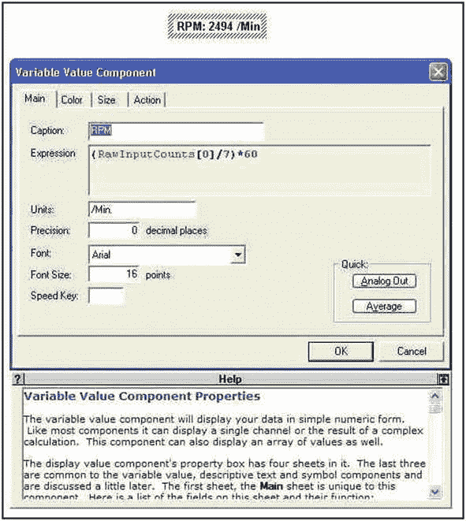
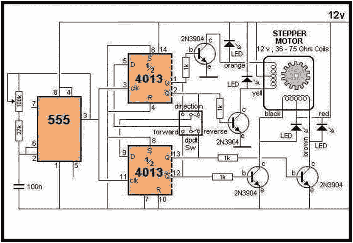

# 十、日常检查

电流控制和监测是许多实验设置和科学测量的重要组成部分。如前一练习所示，可能需要恒流控制来实现特定的结果。传感器测量、扫描仪器中的运动控制、机器人操纵器、电镀或电流分析以及加热控制操作只是需要电流控制的几个例子。led 应该由恒流源供电。已经发现，当来自一个供应商的一批发光二极管由消耗 4 到 39 mA 的恒定电压电源供电并且具有如此宽的电流差时，不能产生相同的发光或色度输出。电流控制可以不同于管理物理或化学变化的传感器，通常需要测量毫微安的 DC 电流，而加热、电沉积和电机控制应用通常涉及控制电流的安培数。

电流控制可以用分立晶体管实现，如第 [9](09.html) 章所述；为电流调节而配置的通用集成电路，如运算放大器；或者是专门为 DC 或交流电流控制应用而生产的专用集成电路(ASIC)芯片。

本章分为三个部分，涉及恒流 DC 电源、较大电流的控制以及潜在致命的市电交流电源的控制。在控制电流的同时，将演示电机带来的一些限制以及解决这些限制的方法。用于实验装置和这些练习的廉价电机可以从过时的计算机设备中回收，或者如果需要可以从电子供应源获得。我们将演示旋转电机对运动控制的一些限制，并开发为实验装置选择首选电机的过程。

用于电流或功率控制的脉宽调制(PWM)技术将在电机和白炽灯照明应用中进行回顾和演示。

交流电子学，由于它的循环性质，可能比 DC 要复杂得多。为了保持这些练习的简单介绍性质，只考虑无感或完全阻性负载应用。在严格阻性应用中，均方根(rms)、峰峰值或平均交流值可以像大多数电子基本定律中的 DC 值一样使用。高级通信、感应加热或光谱学中遇到的较高频率和相位敏感的交流电子设备不会在这些基础介绍练习中深入讨论。

## 恒流源

在许多类型的电子电路和许多实验测量仪器中，也可以找到以前使用的恒流源。如前所述，恒流源可以由一对作为“电流镜”的晶体管构成，或者由一个运算放大器(op-amp)和一些电阻构成。虽然前面提到的大部分电子书籍都详细讨论了分立式元件电流镜，但由于设计简单、电路控制范围宽，并且使用容易获得的廉价元件，所以本练习中使用运算放大器。

本练习中使用的运算放大器(如 LM741)由双电压电源供电，必须平衡或适当偏置才能使用。图 [10-1](#Fig1) 描述了 lm 741–2n 3906 PNP 晶体管接地负载电路的一般原理图，该电路可用于为已知负载提供恒定电流，如各种参考文献中所公布的。图 [10-1](#Fig1) 和 [10-2](#Fig2) 中描绘的电路可以组装在典型的原型试验板上，用于测试、电路操作验证和电流控制应用。

下面将针对负载接地、电流感测电阻连接到电源的配置来解释电路工作原理。如果需要相反的情况，则可以使用 NPN 晶体管来调节电流(LF411 可以直接替代 LM741)。

## 实验的

### 五金器具

一个+/-双电压电源和一个调整电位计用于为运算放大器供电和平衡。构建和验证恒流源需要一个功率晶体管、三个适当的偏置电阻和一个合适的预期实验负载的可调电阻模拟器。恒流运算放大器电路的典型实现在以下作者组装的测试电路的描述中有详细说明。一节 9 伏电池和 4 节串联的 AA 电池可以提供 15 伏的 DC 电源。串联连接两个 15 伏电池组可用于创建所需的+/-15 伏双极性电源，中间端子接地。双极性电源允许将运算放大器输出驱动至正电压或负电压。(参见 [9](09.html) 章节中的图 [9-15](09.html#Fig15) 。)

### 电路原理图


图 10-2

运算放大器平衡的典型电路实现


图 10-1

典型运算放大器电流控制电路

如果一个特定的化学分析实验(如库仑滴定)有一个代表 20ω负载的滴定容器，并且发现 20 mA 的电流可以产生一个到达分析终点的合理时间，那么就具备了确定组装图 [10-1](#Fig1) 和 [10-2](#Fig2) 所示电路所需的电阻值的条件。

根据欧姆定律，通过 20ω负载维持 20 mA 电流需要 0.40 V 的电压，晶体管的 PN 结压降通常为 0.3 V，因此发射极应保持在 0.7 V，要将 15V 转换为 0.7V，需要一个数值为 0.0466 的分压器；因此，R2/(R1 + R2) = 0.046。LM741 可以使用 12 至 18 伏之间的任何双电压电源，因此可以相应地调整分压器网络和限流 R3 的实际电阻值，以保持所需的运算放大器基准电压或设定点，从而获得所需的电池电流。对于 20 mA 的调节电流，根据 I <sup>2</sup> R 的功率关系，我们可以估计电路的调节载流部分中的 1/8 瓦电阻足以满足手头的实验。

作为典型的电化学电池负载模拟，作者使用了一个 25ω、30 W、可调抽头的线绕电阻。调节负载电阻上中心抽头的位置模拟了在实验电化学电池或电阻加热元件中可能遇到的电导率变化。

开始练习时，实验者可以根据前面的原理图组装电路。验证布局后，将运算放大器的反相和同相输入端暂时接地，将调整电位计调整到其中点，并给运算放大器上电。监控放大器输出电压的同时，调整 10kω可变电阻以获得尽可能接近 0 V 的放大器输出，实际平衡运算放大器或将调整电位计游标定位在一个较低的非零电压值点，当实际电路工作期间建立反馈环路时，这将导致系统平衡。

由 R1 和 R2 构成的分压器产生一个参考电压 V <sub>Ref</sub> ，该电压被提供给运算放大器的同相输入端。现在，通过改变流经 R3 的电流，运算放大器将尝试将两个输入保持在 V <sub>Ref</sub> 的相同电压。流经负载、晶体管和 R3 的电流由注入 2N3906 晶体管基极的电流控制。流经负载和晶体管的整个电流通过 R3，R3 必须具有足够的瓦特数，以适应恒流配置可能需要的电流变化。如图 [10-3](#Fig3) 所示，当调节负载模拟电阻器的中心抽头以模拟模拟电池电阻的变化时，电流测量将确认电路通过电池模拟器提供标称 20 mA 电流的能力。


图 10-3

大电流试验电路的线绕负载模拟器

上图中的第 1 项是模拟的可变电阻负载，由垂直安装在螺杆上的 25ω30 W 线绕电阻组成。第 2 项是 5 W 电流检测电阻，第 3 项是 LM741 运算放大器塑料 DIP。项目 4 是 2N3906 功率晶体管，项目 5 是正极红色、负极黑色和绿色接地或中性电源引线。第 6 项是用于运算放大器平衡或偏置的调整电阻。

### 软件

这部分练习不需要页面组件和编程软件。

## 观察

当中心抽头的位置改变时，线绕电阻器产生非常粗糙的欧姆电阻，但是负载电阻值的改变足以证明所需恒流源的发展。大功率模拟负载在主端子之间测得的标称值 25ω和在裸露线芯匝上重新定位滑动抽头时的约 20 至 10ω之间变化。连接到正电源并向晶体管提供电流的大功率电阻器与可变负载一起决定了可在调节电路中流动的电流。当电路开始通电时，观察到的电流很高。随着电子设备达到大致的热平衡，调节电流稳定在接近所需设定点的最终值。通常电路需要 15-30 分钟达到恒定的热值。表 [10-1](#Tab1) 列出了通过作者的试验模拟测得的稳定电流。

表 10-1

负载电阻和调节负载电流

<colgroup><col class="tcol1 align-left"> <col class="tcol2 align-left"></colgroup> 
| 

负载电阻(ω)

 | 

电流(毫安)

 |
| --- | --- |
| Six point seven | Twenty-one point four |
| Ten point eight | Twenty-one point four |
| Fourteen point three | Twenty-one point one |
| Fifteen point one | Twenty-one point four |
| Seventeen point six | Twenty point nine |
| Nineteen point three | Twenty point nine |
| Twenty point two | Twenty point nine |
| Twenty point three | Twenty-one |

上表中的负载电阻以欧姆为单位，电流以毫安为单位。

## 讨论

通过回忆运算放大器驱动其输出以均衡反相和同相输入端的电压，可以在反馈配置中解释电路操作，因此 V <sub>Sense</sub> = V <sub>in</sub> 。通过感应电阻的电流为 I<sub>Sense</sub>= V<sub>in</sub>/R<sub>Sense</sub>，由于通过感应电阻的电流流经晶体管，所以通过负载 I <sub>Load</sub> 的电流为 V <sub>in</sub> /R <sub>Sense</sub> 加上晶体管极小的基极发射极电流。

对于流经 20ω负载的 20 mA 目标电流，该表显示了流经 6.7 至 20.3ω负载的约 21 mA 电流的 0.5 mA 变化。如果需要精确的 20 mA 电流，可以通过实验调整分压器，将基准电压调整到将晶体管电流调节到所需水平的值。

如第 [9](09.html) 章数据图形显示中所讨论和演示的，以及如前所述，热效应将导致测量信号漂移，直到建立热平衡。如果需要临界电流控制，那么可能需要在实验设置中引入某种形式的热控制或稳定。散热器、冷却气流、绝缘材料或大型金属热物质可以通过辐射或吸收过多的热量来保持或部分稳定温度。

电流调节也可以用专用集成电路来实现，例如美国国家半导体公司的 LM340/78xx 系列集成电路。然而，集成电路在特定的固定电压下工作，并且通常限于 1 安培的总电流。要调节的实际电流由适当阻值的传感电阻决定。具体配置和限制详见制造商数据手册中针对单个器件的应用部分。

由分立元件组装而成的运算放大器功率晶体管电路具有能够在任意电压和负载要求下控制电流的灵活性的优点。运算放大器功率晶体管配置也可以与 PNP“接地负载”配置或“浮动负载”一起使用，其中检测电阻接地，NPN 晶体管连接到电源和浮动负载。

运算放大器的特性和理论可以在前面提到的大多数教科书和许多介绍性的、深入的在线教程中找到。

## 控制较大的 DC 电流

### 介绍

### 无刷直流(BLDC)电机(无换向器或点火刷的电机)

在涉及加热、泵送、机械运动或运动控制的实验装置中，会遇到较大的 DC 电流操纵。对于每一种要控制的运动，通常有几种将电能转换成所需的物理运动或动作的方法。螺线管像在机器人系统中一样线性地来回运动，而马达则扭转或旋转；对于需要电机驱动的简单应用，以及液体混合或泵送、气体冷却或旋转光学扫描操作，我们将重点讨论电机的旋转运动控制。进一步的限制包括使用非常小的分马力电机，该电机设计用于现场或实验室使用，具有容易获得的、坚固的 12 V 铅酸电池系统或 12 V DC 电源，提供所需的更高电流。(电机的物理和机电方面以及更强大的电机控制在机器人和机械、化学或电气工程的文献中有更详细的讨论。)在化学分析和大部分生命科学的实验室工作中，经常使用易燃溶剂，因此，除非经过防爆认证，否则不应在实验操作中使用有刷 DC 电机。

驱动电机所需的较大电流可以由晶体管控制，而晶体管又可以由集成电路产生的小得多的基极电流控制。可变 555 定时器信号可用于控制更高电流的功率晶体管，该晶体管进而调节施加到电机的功率以控制电机速度。在这部分练习中，将使用一个 555 定时器来产生一个方波脉冲序列，该脉冲序列的占空比将以受控方式变化，以改变功率晶体管向风扇电机供电的时间，该风扇电机能够汲取高达 200 mA 的电流。因此，风扇电机的转速将由 555 定时器网络中的电位计控制。风扇盘转速将通过 LabJack 计数器进行光学测量，DAQFactory 程序将计算风扇盘转速并显示在屏幕上。

## 实验的

### 五金器具

对于电机控制电路，需要一个试验板来安装一个 555 定时器和将 IC 配置为非稳态模式所需的无源元件。从图 [10-4](#Fig4) 中可以看出，作者将 100kω电位计的安装支架、TIP-122 功率晶体管的散热器和带无刷直流风扇电机的风扇组件的支架组合到一个定制钻孔的 1 英寸(2.5 厘米)乘 8 英寸(15 厘米)的铝制角钢上，标记为项目 1。散热器安装角用螺栓固定在一个大约 1/16 英寸(1 毫米)厚的 8 英寸乘 6 英寸(20.4 厘米乘 15.2 厘米)的铝板上，标记为项目 1a，试验板用双面胶安装带(地毯带)固定在铝板上。最简单的风扇电机(无刷直流，BLDC)有两条 DC 电源引线。三引线和四引线风扇电机很常见，通常增加了用于监控轴位置的内部霍尔传感器(磁场检测器)的连接。将光电二极管和光电晶体管装配并固定到两个 1 英寸(1.2 厘米)乘 1 英寸(2.5 厘米)的定制钻孔铝板上，铝板上带有室温硫化(RTV)硅酮。编号为 4 的项目是传感器安装标签。标签背面的粘合剂嵌条将传感器二极管牢牢固定，同时不会干扰光学活性表面。如图 [10-4](#Fig4) 所示，用螺栓和蝶形螺母将调整片安装在风扇电机框架的一角。调整片安装有由光电二极管产生的窄红外光束，该光束指向风扇盘叶片的旋转平面。因此，七叶片风扇盘(项目 2)的旋转在电机每转一圈时将光电二极管和光电晶体管之间产生的红外光束切断七次。


图 10-4

实验冷却风扇电流负载测试设置

支撑光束源和检测器的两个板在作者的装置上固定到位，螺栓穿过板和电机框架，用蝶形螺母固定到位。项目 3 是翼形螺母紧固件的臂，其允许光束更容易对准。

作者的设置由一个更大的+/-12V、2 A 电源供电，该电源连接到安装在铝板金属底座上的试验板后部的端子板。

许多从过时或损坏的计算机设备中回收的风扇马达被用来驱动七叶片磁盘。如果用于这些练习的风扇没有七个叶片，在 DAQFactory 变量值表达式框中输入正确的叶片数，如图 [10-7](#Fig7) 所示。

### 电路原理图

在图 [10-6](#Fig6) 中，555 定时器被配置为非稳态模式，以产生连续的方波格式。定时器 IC 周期开始时，电容 C 放电，引脚 2 为低电平，输出引脚 3 为高电平。引脚 3 为高电平时，C 通过 R1 左侧和左侧二极管充电，直到引脚 6(阈值)达到 2/3 V+，此时引脚 3(输出)和引脚 7(放电)变为低电平。引脚 3 为低电平时，电容通过 R1 右侧和右侧二极管放电，直到 C 降至 1/3 V+以下，此时输出引脚 3 和放电引脚 7 变为高电平，循环重复。因此，C 从 R1 的左边充电，从右边放电。通过将充电和放电电阻之和保持在恒定值，输出信号波长也是恒定的，只有占空比改变。根据以下公式，输出频率是固定的

频率= 1.44/(R <sub>Varbl</sub> * C <sub>定时</sub>

图 [10-5](#Fig5) 用图形显示了占空比的概念及其与频率或波长的关系，如红色箭头所示。对于驱动电机等功率控制应用，根据非常快的脉冲宽度快速打开和关闭电源的能力提供了一种在功率应用范围的高端控制电机速度的方法。然而，如果通过脉冲宽度变化被供电的负载工作在调节范围的低端，则较长的频率将为所施加的功率的控制提供较高程度的分辨率。步进电机中的加热电路和低转速可能需要更长的波长或更低的频率来提供足够的控制调节范围。


图 10-6

一种基于 555 定时器 IC 的带光电中断电路的电机控制器


图 10-5

占空比概念

### 软件

图 [10-7](#Fig7) 描述了用于显示风扇转速的变量值屏幕组件的属性主选项卡。将风扇盘每转的七个光束中断转换为风扇电机转速的计算结果输入到屏幕组件的表达式框中。子窗口的变量值组件选项卡中的各种条目生成弹出属性窗口上方的 RPM 显示框。



图 10-7

用于测量风扇电机转速的 DAQFactory 变量值组件配置

不需要任何脚本，因为计数器每秒钟被读取、重置一次并被输入到 RawInputCounts 通道中。作为 RawInputCounts[0]返回的值根据磁盘上的风扇叶片数进行了校正，并规范化为分钟。

## 观察

当电位计设置在中间位置时，双线风扇电机以大约 2950 rpm 的速度旋转，在电机停止之前，速度可以在 3300 到大约 100–150 rpm 之间变化。

在光学转速表的最初开发阶段，光电二极管-光电晶体管对产生的脉冲序列无法触发 LabJack 计数器，因此需要增加信号强度。使用图 [10-6](#Fig6) 的原理图中所示的两个分压器，从+12 伏电源中单独提取用于驱动光电二极管-光电晶体管对的功率。光电二极管分压器产生标称 5 V，光电晶体管分压器产生标称 6 V (5.91 V)。图 [10-8](#Fig8) 显示光束斩波器输出的示波器显示。


图 10-8

光束斩波器输出的示波器显示

从大型 CPU 芯片回收的三线冷却风扇电机取代了双线系统，高端风扇转速范围测量为 5,200 rpm。仔细调整后的风扇速度可以降低到 200 转/分的范围内，偶尔在电机停转前降低到 150 转/分的范围内。

芯片冷却风扇上的第三根电线通常是电机内置霍尔效应传感器的输出。霍尔效应传感器检测变化的磁场，第三根导线的输出产生一系列由旋转磁场产生的小尖峰信号，可用于测量电机的转速。

## 讨论

在本练习中，演示了为电机供电所需的较高电流的脉宽调制控制。基于非稳态配置 555 定时器芯片的有限脉冲宽度调制方案已在第[章第 8](08.html) 节中讨论过，相对恒定的频率、可变占空比模式的功率传输现在正通过适当的二极管修改来使用，以扩展占空比范围，同时保持输出方波的频率或波长恒定。

在第 [8](08.html) 章、图 8-10 和图 [10-6](#Fig6) 中，可以看到电容器通过 R1 和 R2 的一部分充电，但仅通过 R2 放电，因此循环的充电部分只能降低到 R1 的值，而 R2 的值在循环的放电部分实际上可以降低到零。因此，占空比的可能变化由 R1 的值控制。

简而言之，我们可以看到，我们用于向 BLDC 电机供电的 PWM 技术将占空比从 100%降低到 0%。从 100%时的 12 V 到 50%占空比时的 6 V，再到 0%占空比时的 0 V，总的电压变化是低速旋转时不稳定行为的原因。在占空比较低的部分，12 V 电源没有在足够长的时间内提供平均功率来驱动电机，因此电机“失速”换句话说，在控制电位计的低设置下观察到的控制损失和失速是传递给电机的功率不足的结果。为了更好地控制低速电机运行，需要不同类型的电机和功率控制。

这个 555 PWM，光学转速电路，DAQFactory SCADA 软件显示系统是用一个回收的双线计算机塔冷却风扇开发的。第二个冷却风扇来自较新的大型 CPU 芯片，带有三线控制电路板连接器，被替换到试验板设置中进行比较。第三根电线通常为黄色(见图 [10-4](#Fig4) )，用于监控内置于电机转子/定子部分的霍尔效应检测器的输出。霍尔效应传感器对变化的磁场作出响应，可用于指示电动机控制系统中磁铁相对于线圈的位置。

从作者的旧设备中回收的芯片冷却风扇电机是一个 2 1/4 平方英寸(5.7 厘米)的七叶片、12 伏、180 毫安的装置，当通过红/黑电源线供电时，其转速上限为 5200 转/分，转速在 200 到 150 转/分之间停止。

正如我们将在本研究的后面部分看到的，风扇电机的回收和再利用可以廉价地解决一些实验室程序中出现的实际问题。

### 步进电机

需要对电机功率进行电子控制的 BLDC 电机有两种形式:用于驱动风扇的连续负载型电机和称为步进电机的电机。BLDC 风扇电机在施加满电压的较高速度下产生最大功率，并随着转速降低而停止，因为电压/功率水平降低，而步进电机在不旋转时产生最大功率，并随着转速增加而损耗功率。步进电机的名字和用途源于它们以离散的“步长”移动或旋转的能力。通过控制电机的“步进”动作，可以实现精确的旋转定位和精确的低速旋转速率，以及显著的扭矩。

步进电机有多种形式，并根据用于装配电机的结构类型而具有不同的性能。对于那些需要更多细节的实验设备开发项目，在线(Jones on Stepper Motors)和机器人和工程的文献中都有许多好的教程。 <sup>[1](#Fn1)</sup>

出于电流控制练习的目的，我们将讨论和实验限制在称为双极永磁(PM)系统的电机类别。这些电机提供连续的低速旋转，在机器人、简单物理、化学和生物实验室程序中有明确的实际应用。用 555 定时器等 IC 可以相对容易地实现和控制连续旋转。单步执行和往复步进动作中的振荡需要额外的电机绕组知识、稍微高级的编程能力和专业硬件。在接下来的几个练习中提到了实现向下到单步点的受控旋转的方法，但是在这个简单的介绍性部分中不考虑振荡和分数圆周旋转动作。

为了使电机功率控制单元的装配保持简单、廉价和熟悉的形式，本练习中的电子功率控制电路同样基于可调节的、不稳定的 555 定时器电路脉冲产生，但是具有一些相对简单的附加数字逻辑电路。555 定时器 IC 可以由任何能够产生 PWM 控制中使用的低电压、可调占空比、方波脉冲序列的计算机或微控制器代替。

永磁(PM)步进电机的特点是转子轴不能像高速 BLDC 风扇电机那样自由旋转。PM 步进电机轴，当用手转动时，电机不与电源连接，在平衡或静止位置之间“嵌齿”或“步进”。完成一次完整旋转所需的步数表示步进电机旋转或振荡可被控制的“分辨率”或“精细度”。

步进电机的设计使得单个线圈绕组可以单独通电，从而产生内部电磁场，通过转子的旋转，可以与内部永磁磁场建立平衡位置。通过以编程的顺序激励线圈，可以使电机轴以编程确定的任何方式旋转。电磁线圈以顺序方式通电，以使电机轴沿任一方向平稳旋转的程序是这一简化练习的主要焦点。

步进电机的转速比传统的绕线式无刷电机慢得多，在低速时产生的扭矩也大得多。步进电机不会在它们的结构上移动大量的空气，因此会在它们的外部金属外壳周围聚集更多的热量。

## 实验的

### 五金器具

步进电机、速度控制、正向/反向开关和电机电源连接需要牢固安装。电机的电源连接必须能够互换单个电机线圈引线与电子控制电路输出功率晶体管的连接。集成电路可以组装在试验板上，以便于构建、原型开发和实验演示。图 [10-10](#Fig10) 中描述了一个实验性电机和硬件安装架，该安装架由易于获得的材料制成的手动工具组装而成，并在下文中进行了详细描述。

### 电路原理图

如上所述，为了大多数实验实验室或野外工作的目的，四线圈步进电机的控制电路只需要驱动电机平稳、可控地顺时针或逆时针低速旋转。因此，电源应该能够产生一系列连续的四个可调宽度的电流脉冲，这些电流脉冲具有足够的安培数，以使电机连续步进通过转子的完整旋转。

在将步进电机的电源连接分配给电子电源控制器的输出晶体管时，必须小心谨慎。如果五线电机中的中心抽头或六线电机中的抽头连接到正电源，则“第一”组抽头线圈的末端应连接到功率输出晶体管 1 和 2，第二组线圈末端连接到 3 和 4。如果电机旋转不平稳，对速度控制电位计的响应不符合预期，则依次交换第三个和第四个线圈连接，并重新测试电机。如果交换不能解决问题，则交换第一个和第二个线圈连接，重新测试，如果需要，颠倒第二个和第三个线圈连接。



图 10-9

基于 555 定时器 IC 的步进电机控制器

在图 [10-9](#Fig9) 中，一个由电位计控制的非稳态 555 定时器用于产生一个可调占空比脉冲序列。该脉冲序列用于触发(或供电)一对 D(数据)型触发器，该触发器已被配置为分频器，以产生所需的四个晶体管基极驱动信号序列，从而产生所需的高电流功率脉冲。数据触发器包含在单个 CMOS 4013、14 引脚 DIP 中，与 555 定时器芯片一起可以由更大电流的 12 V 电源供电。

步进电机可以由许多不同的线圈激励序列控制，这些序列可以产生高扭矩的单步或分步旋转、来回步进运动或平滑的连续旋转。低速、高扭矩、平稳的连续旋转是生物/化学实验室工作中应用最多的运动，即搅拌和泵送液体。为了通过四个输出晶体管实现电机线圈的正确排序，线圈的公共中心抽头连接到正电源。因此，线圈的通电包括将绕组端部接地，以使电流从中心抽头流向地面。因此，通过顺序地将绕组的端部接地，可以使电机旋转。用于本练习的电机上的接线颜色代码可能与图 [10-9](#Fig9) 中显示的不同。典型的电机在绕组末端有四个连接，或者一个公共连接到中心抽头，或者两个连接到中心抽头，从而形成五线和六线电机到电源的连接。

流经单个线圈的电流受到线圈自身电阻的限制。反转流经电机线圈的 DC 电流的方向将反转旋转方向。

电机旋转是通过顺序激励电机的内部绕组以产生磁场来实现的。瞬态电磁场与永久磁场相互作用，导致电机旋转。切断通电线圈的电流会产生反电动势，该反电动势由穿过电机内部绕组的崩溃磁场感应到线圈中。必须保护开关晶体管免受电机线圈高压反电动势的影响，否则它们的 PN 结会被损坏。led 已经放置在图 [10-9](#Fig9) 的开关装置的收集器中，以保护输出功率装置并提供单个线圈电流通道的视觉确认。


图 10-10

一种步进电机测试组件

项目 1 是安装在 1 英寸(1.2 厘米)的铝直角挤压框架上的科帕尔伊莱克特电机，其具有附加的黑色橡胶联轴器以移动和部分抑制共振频率。霍华德电机可以看到右边的安装适配器。项目 2 是用于电机绕组线和试验板接口的端子。第 3 项是 555 定时器芯片，数字 4 标记的是 4013 数据触发器芯片的位置。项目 5 是一排功率晶体管，项目 6 是“速度”控制电位计。项目 7 是旋转方向开关，项目 8 是大电流电源输入线。

### 软件

#### 需要页面组件

用于切换 4013 D 触发器和驱动晶体管序列的脉冲序列也可用于创建电机转速的转速表显示(参见“讨论”)。作者的实验室有 12 V 永磁 75ω四相(线圈)步进电机，由 Howard Industries 制造，零件号 1-19-4200，每步 3.6 度，还有来自伊莱克特 Copal 的 SP-57B 电机，零件号 85086780，具有 36ω线圈电阻和 7.5 度步进旋转。因此，霍华德汽车公司完成一次完整的旋转需要 100 步，而科帕尔·伊莱克特汽车公司只需要 48 步。与风扇电机一样，转速可以通过 DAQFactory 变量值组件显示在屏幕上。速率的计算方法是，在 1 秒钟内计算施加于触发器逻辑的脉冲数，然后除以完整旋转所需的步数，并归一化为每分钟转数。不需要编写脚本，因为计算可以输入到显示为图 [10-7](#Fig7) 顶行的变量值屏幕组件的表达式框中。

## 观察

适度的步进速度导致平稳的旋转，而在低速下，单个的步变得清晰可见。使用发光二极管保护电机线圈免受反电动势的影响，还可以作为电机活动的指示灯。

转子空载的两种步进电机都通过一定的转速，这导致电机和安装结构“共振”3.6 度的霍华德电机在 113 转/分时开始振动，在 100 转/分时产生剧烈振动，在 92 转/分时发出非常大、令人讨厌的嗡嗡声，但在 85 转/分时运行平稳、安静。当来自三件式橡胶“三通”电机驱动连接的 in (0.6 cm)金属轴联轴器被添加到 Howard 电机轴上时，电机在 92 rpm 时显示出强度大大降低但仍然明显的高音调振动，并且在 60 rpm 时还显示出较低强度和较深音调的振动，以及在 30 rpm 时甚至更低音调和较低强度的共振。在共振“峰值”之间的任何转速下，电机都能平稳运转。

科帕尔伊莱克特电机空载转速范围为 60–300 转/分，在 89–90 转/分时会产生共振“震颤”。如果电机轴装有驱动连接器联轴器，共振速度会略微上升至 92–95 rpm 范围，电机会在 250 rpm 时完全停转。

在转子上没有联轴器的情况下，不可能用力挤压轴来停止电机，但是通过联轴器底座提供的额外杠杆作用，转子可以停止；当失速的转子脉动时，RPM 指示器仍然记录了 37 rpm 的等效脉冲率。随着转速的增加，扭矩的损失对于 Howard 马达来说是明显的，但是如果选择了超过 250 转/分的速度设置，则带有附加质量的联轴器的 Copal 伊莱克特会失速。

除了在实验室实验工作中进行低速混合和搅拌之外，步进电机还特别适合控制蠕动泵的输送速度。通过改变 555 非稳态配置中 RC 定时常数的值，利用图 [10-9](#Fig9) 中的 1.0 uF 电容和 27kω电阻，作者的 Copal 伊莱克特可以降低到 5–6 rpm；通过将电阻和电容都改为 296kω和 1 uF，电机以 1 rpm 的速度连续单步执行 48 次增量。

## 讨论

步进电机的灵活性和所需的低速性能是以控制电路的复杂性显著增加为代价实现的。可以使用本练习中使用的 D 型触发器或设计为移位寄存器的芯片(如 74LS194 和 CMOS 4035)来产生连续平滑电机旋转所需的连续电流脉冲。使用移位寄存器的详细信息可在网上 <sup>[2](#Fn2)</sup> 以及标称 IC 的印刷资料中找到。

步进电机的设计使得转子静止时产生最大扭矩。借助专为该练习设计的系统，转速可降至 1 rpm，在此转速下，电机的每一步只需 1/48 分钟或 1.25 秒。在 1 rpm 的慢速下，练习中使用的科帕伊莱克特电机已接近其最大可用扭矩。离散的、任意的时间步进或保持位置在机器人控制系统中是有用的，并且在动力控制系统中需要比在本部分练习中使用的电位计控制的 555 脉冲发生器所提供的更复杂的编程能力。

共振是步进电机的一个问题，并且电机在共振模式下的持续运行将通过增加旋转部件的机械退化率而大大降低电机的使用寿命。电机应在共振速度下运行，或者如果共振速度很重要，则可能需要在实验装置中内置特殊的机械安装技术、传动装置或旋转质量的变化，以处理系统共振。

电机轴的旋转速度可以通过使用 DAQ factory(lab jack 计数器通道的默认数据收集速率为 1 秒)进行电子测量，应用转子轴旋转一周所需的步数，并将显示的数据值调整为所需的时间单位。在屏幕“变量值”组件中将脉率转换成数字显示所需的公式可以输入到屏幕组件的公式框中，如图 [10-7](#Fig7) 所示。使用脉冲率来确定电机轴转速使用了电机在旋转时不“打滑”的隐含假设，这可能发生在电机转速范围的较高端，或者如果被驱动的“负载”显著增加。如果滑动是一个问题，或者要监控实验装置的实际旋转，那么应该在移动负载上使用光电断续器转速计方法。

步进电机在低速旋转或作为可旋转的定位代理时最有用，如果需要较低的旋转速度，可以增加 555 非稳态的时间常数，以扩大施加到触发器的脉冲之间的间隔。然而，转速越慢，电机旋转的“步进”作用越明显。

## 交流电源的控制

### 介绍

交流电(AC)源通常被称为“电源”在北美，市电或“家用电流”以标称的 120 伏峰峰值或 115 伏均方根(rms)60 赫兹提供，而在欧洲和世界其他地区，50 赫兹为 220 伏(rms)。大量的早期交流电源是由水力发电设备产生的，在水力发电设备中，水轮机旋转发电机，在这些相对较低的频率下产生正向和反向电流脉冲。

低压 DC 电流实际上是无害的，但“电源”电压和电流很容易引发火灾，将建筑物烧毁，造成严重的疼痛烧伤，并产生潜在的致命电击。

与高电压、高电流电能的致命性相一致，固态系统已经被开发出来，用于控制危险的高功率水平并将其与低电压控制电路隔离。

当与控制电路适当隔离时，交流电的优势在于能够直接为电机、照明设备和加热元件供电，而无需在使用前转换成 DC。主电源或交流电源从零到最大正向值循环，然后下降回零，在下降回零值之前上升到其最大反向值，从而完成循环。交流电源通常由晶闸管或四层 P-N-P-N 半导体元件控制，这些元件被制成两种类型的器件:可控硅整流器(SCR ),其导通可以在半个交流周期内进行调节；或者三端双向可控硅开关，可以在整个交流周期内控制导通。SCR 和三端双向可控硅开关的频率响应有限，因此主要用于 50–60Hz，但可用于高达 400 Hz 的交流电源频率。SCR 是具有“门”的多层二极管，该“门”允许二极管在其 AC 波形的正常导通部分的任何点从阻断模式切换到导通模式。通过将两个 SCR 并联但以相反的方向导通来形成硅双向开关或三端双向可控硅开关元件，可以根据施加到公共栅极的信号来控制交流电源波形的正向和反向周期。

如上所述，SCR 和三端双向可控硅开关都是二极管型器件，其栅极允许电路设计者控制交流电源周期通过器件本身以及负载的一个或两个方向。已经开发了使用光耦合到硅双向开关的光电二极管的 IC，以提供光隔离的手段，用于将栅极控制电路与流过硅开关器件的高能 AC 电源分开。光隔离器芯片有两种形式，包括传输控制信号以随机开始导通的器件和能够检测主电源信号过零点的器件。如果交流电源周期被随机“斩波”，可能会产生射频干扰(RFI)或更常见的电磁干扰(EMI)，因此必须使用滤波器来抑制不需要的辐射。过零检测电路仅在过零点开启和关闭交流控制器件，可最大限度地减少显著射频干扰的产生。

随机相位或过零、光隔离集成电路由低压 DC 源供电，因此，如果标准数字逻辑电路与市电交流电源的三端双向可控硅开关控制一起使用，则必须提供所需的 DC 电源。可以使用电池或图 [10-11](#Fig11) 所示的简单专用 5 V 电源。


图 10-11

典型的交流至 5 伏 DC 输出电源

使用固态设备控制交流电源为研究人员提供了两种利用能量的方法。在第一种也是最简单的方法中，可以将全交流电压施加于负载，并且允许全电流流动的时间是可变的。第二种控制形式包括改变施加到负载上的电压。交流电压在 0 至 120 伏之间循环，固态开关器件可用于将循环中的任何部分(0 至 120 伏)施加到负载上，每秒 60 次。交流波形是一种正弦现象，其中电压幅度遵循正弦曲线。通过选择波形的一部分向负载施加电压，功率控制被称为“相角控制”电压变化有些复杂，只应在需要时使用。通过向负载施加全交流电压并改变全功率施加的时间，可以控制输送到负载的功率，并且当使用过零开关时，所产生的射频噪声大大降低并最小化。

第 [7](07.html) 章中介绍的脉冲宽度调制概念以及之前在电机控制练习中应用的概念通常应用于 DC 电力系统，但也可用于对交流电源进行初步粗略控制。

本部分练习中使用的光隔离器是随机和过零单元。

## 实验的

### 五金器具

一个 60 到 15 瓦的白炽灯泡是一个很好的交流电源控制练习的视觉演示负载。如图 [10-12](#Fig12) 所示，灯泡插座和用于固定电位计控制器的安装支架，同时作为三端双向可控硅开关安装的散热器，以及用于安装控制电路的端子板和试验板，都应固定在坚固的木头或金属底座上。回顾与交流电源电压和电流相关的危险，根据当地的电气建筑规范，所有输送电源的线路必须牢固固定、适当绝缘并覆盖。应小心切割输送主电源的电线上的绝缘层，以确保在端子板上的螺丝端子连接拧紧后，没有裸露的电线表面暴露出来。所有暴露的电线表面或承载主电源的焊接连接必须用液体塑料绝缘体、硅酮密封剂或热缩管进行绝缘。*千万不要给任何有裸露导体输送电源电流的电路通电。*

下文解释了作者实验装置中的数字名称(图 [10-12](#Fig12) )。

项目 1 是一个 60 瓦灯泡，装在符合电气规范的插座中，正确安装在 1 英寸(1.8 厘米)高密度纤维板上。项目 2 是一个 250 VAC 端子板，配有批准的电线和插头(注意:为清晰起见，移除了盖子)。第 3 项是一个 400 VAC、6 A、BTA06 意法半导体，其散热器上有 TO-220 标签式三端双向可控硅开关，带有热收缩包裹导体，消除了暴露的导体表面。第 4 项是占空比控制电位计，第 5 项是演示练习中使用的光隔离三端双向可控硅开关控制 IC。数字 6 标记双极 555 定时器的位置，第 7 项是 9 V 电池供电。

最初用作视觉活性实验负载的 60 W 灯泡随后被表面更冷的 15 W 灯泡取代，后者通常用作家用电器的室内灯。


图 10-12

一种带白炽灯泡的交流电流控制测试装置

### 电路原理图

图 [10-13](#Fig13) 是一个典型的框图，显示了用三端双向可控硅开关和光隔离器控制交流电源的实验设置。


图 10-13

三端双向可控硅开关和光隔离器交流电流控制

在本练习中，可通过电位计二极管网络，从一个 555 定时器组装一个手动可控的 DC 脉冲源，该定时器配置为非稳态运行，其占空比由手动控制，如之前用于 90%范围的占空比变化。

图 [10-13](#Fig13) 中的电路图是在使用飞兆半导体 MOC 3022 的配置中绘制的，当 MOC 3022 内部 LED 照明电路中使用合适的限流电阻时，该 MOC 3022 可以由 5 V 电源或 9 V 电池供电。通过给低压脉冲发生电路通电，然后将交流电源线插入主电源，将受控的交流电源施加到负载电路。

图 [10-13](#Fig13) 的电路是用 MOC 3022 随机相位光隔离器三端双向可控硅开关驱动器绘制的。MOC 3061 过零装置的使用方法与图 [10-14](#Fig14) 所示的方法相同。

为了对将脉冲宽度变化技术应用于交流电流控制所产生的效果进行重要的可视化显示，图 [10-12](#Fig12) 、 [10-13](#Fig13) 和 [10-14](#Fig14) 中所示的电路应使用图 [10-14](#Fig14) 中的元件构建在原型试验板上。

组装并检查了在计时网络中使用 0.1 μF 电容改变 555 定时器的占空比对灯泡灯丝的影响后，应将电容改为 1.0 μF 单位，占空比再次在可用范围内变化。

虽然正在组装的电路仅用于演示，但在计时操作中使用低泄漏塑料薄膜或陶瓷电容是一种良好的做法。


图 10-14

一个 5 伏 555 定时器 IC 控制线路电源

### 软件

本练习不需要屏幕显示页面组件或脚本。

## 观察

使用能够测量频率(单位为 Hz)的手持式万用表测量 555 定时器电路方波的输出频率，发现 0.1 μF 电容的输出频率约为 75–124Hz，1.0 μF 单元的输出频率约为 8–12Hz。

初始设置组装在计时电路中具有 0.1 μF 的试验板上，并使用 MOC 3022，能够将灯的亮度从大约半功率改变到全开。在接近电位计旋转结束时的半开启功率设置下，灯闪烁，并且发现定时器输出在 75 和 82 Hz 之间不稳定地移动。

用一个大得多的 1.0 μF 单位替换定时电容，大大降低了 555 定时器脉冲频率范围，从 12.6 Hz 降至 7.6 Hz。当电位计完全旋转到 12.6 Hz 位置时，灯完全点亮且不闪烁。将电位计旋转到频率计读数为 7.8 Hz 的点，导致灯的亮度在视觉上平滑地降低，并且伴随着不稳定的灯闪烁的增加，直到在频率范围的低端，灯基本上关闭，但是以不稳定的、非常低水平的亮度闪烁。

虽然通过光隔离器的交流线电压的 PWM 开/关功率应用能够粗略地调节传递给灯的能量，但是该系统不能用作平滑的灯调光器，但是可以用于非照明应用。

## 讨论

世界上大多数电网输送由水、蒸汽或最近的风力涡轮机驱动的旋转发电机产生的能量。交流电能可以通过变压器转换成高电压形式进行远距离传输，然后再转换成高电流相对较低的电压形式供消费者使用。世界上大多数电网都在 50 或 60 赫兹的交流频率下运行。

对于在白炽灯或荧光灯照明、加热或转动电动机中的消耗性使用，交流电源通常可以在从配电网接收到的情况下进行最小的改变。

演示电路中应用于白炽灯泡负载的三端双向可控硅开关控制电源由电池供电的 555 定时器提供的脉冲速率控制。图 [10-14](#Fig14) 所示的 555 定时器非稳态运行模式中使用的定时网络能够允许占空比在大约 5%到 95%之间变化。因此，输送给负载的功率在相当大的范围内是可变的，但既不会完全关断也不会完全接通。

对于交流电流的无感或严格阻性使用这一简单目的，可以在基本电气计算公式中使用各种形式的均方根(rms)、峰峰值或平均值来描述交流，但必须一致使用，不能混用。如果欧姆定律中使用 rms，那么电压和电流的所有值都必须以 rms 为单位。

如果将灯替换为封闭绝缘容器内的加热元件，则产生的热量可以通过由电位计控制的开/关比来粗略调节，电位计反过来粗略调节温度。回想图 [10-5](#Fig5) 的图形数据，可以看出占空比的跨度是使用脉冲宽度变化可获得的控制跨度。

在本练习中，仅检查非常简单的交流电路分析和电磁干扰(EMI)。交流电子设备依赖于频率，随着频率的增加变得非常复杂。在任何涉及更高频率的实验工作中，如通信、感应加热、核磁或电子自旋共振光谱学，必须查阅文献以获得更具体和详细的信息。

如果要防止电路产生或拾取电磁干扰，电路必须完全封闭在接地金属盒中，与辐射完全隔离。如果电路从电网获取电力，那么为了安全起见，接地金属盒及其布线必须符合当地的电气建筑规范。

在迄今为止检查的大多数功率控制应用中，都涉及到 DC 电流，因此不需要考虑频率分量。然而，试图将 PWM 技术与 50 或 60 Hz 的固定频率的交流电力传输一起使用会立即对 PWM 方法的性质造成限制和约束。

在图 [10-14](#Fig14) 所示的电路图中，使用中心抽头电位计构建了一个电路，该电位计允许大约 50kω的电阻变化。对图 9-1 中展开的诺模图的检查表明，对于 50kω–0.1μF 的组合，实验者应该期望定时器在数百 Hz 范围内振荡。

回想一下，电位计二极管配置用于允许占空比的变化，而振荡频率只有微小的变化。如果功率通过一个三端双向可控硅开关器件输送到负载，该器件允许电流以 50 或 60 Hz 的振荡方式流动，那么在十分之一秒内，负载将经历五或六个功率周期。如果 555 定时器每秒钟开关光隔离器中的红外二极管数百次，三端双向可控硅开关将在相当长的时间内处于开启状态。

如果定时器脉冲序列的频率降低到 10 Hz，则占空比变化可以跨越通过三端双向可控硅开关振荡的电源的五个或六个电源周期。图 [10-15](#Fig15) 描绘了十分之一秒的时间跨度，其中五个电源周期标有在标称占空比设置下关闭红外二极管的点。


图 10-15

50 Hz 交流电源和 10 Hz 555 定时器 IC 输出占空比变化的第二图形表示的十分之一

如前所述，在较高的频率下，灯泡大部分时间都是明亮的，只能稍微变暗并不规则地闪烁。在大约低 10 倍的频率下，灯泡可以在其整个照明范围内变暗，但随着亮度降低到零而闪烁。

交流系统的 PWM 方法的进一步扩展用于功率控制应用，其中开/关切换的频率以秒和分钟来测量。长持续时间 PWM 功率控制通常用于加热控制应用中，在加热控制应用中，大的热物质在向加热元件施加功率和在被加热的物质中观察到温度升高之间表现出大的时滞。可以校准具有大时间延迟的交流供电加热系统，并建立 PWM 控制系统。

PWM 系统可用于精确控制输送给负载的功率，通过使用半导体，在一种称为相角控制的技术中，只将功率周期的一小部分传递给负载。然而，相角控制涉及在功率周期和 PWM 控制信号中建立和协调过零点，这超出了本练习的简单介绍性质。

## 使用 Raspberry Pi 和 Python 的当前控件

### 介绍

### 控制较大的 DC 电流

正如在前面的练习中已经指出的，RPi 从 GPIO 引脚提供任何相当大的电流的能力有限。然而，来自外部源的较高电流可以通过 RPi 阵列上的一些引脚来控制。

在线收集了当前控制硬件和电路的优秀摘要。 <sup>[3](#Fn3)</sup>

30–60 A 范围内的大电流 DC 可以用金属氧化物半导体场效应晶体管(MOSFETs)来控制，如 ON Semiconductor 或 Fairchild 的 FQP30N06L。FET 半导体通常需要强信号才能进入导通模式，因此使用 GPIO 阵列作为控制源的实验人员必须确保所选的 FET 晶体管与阵列引脚提供的 3.3 V 兼容。FQP30N06L 中的 L 表示器件的栅极与低压控制信号兼容。

利用图 [10-16](#Fig16) 中示意性描绘的达林顿对晶体管，可以实现适度的电流处理能力。


图 10-16

NPN 达林顿晶体管对

双极结型晶体管(BJT)是电流控制器件。通过器件的主电流在集电极和发射极之间流动。集电极和发射极之间的电流由小得多的基极电流控制。基极电流的放大使 BJT 成为一种敏感设备，能够放大来自太阳能电池和热电偶等传感器的非常微弱的信号。由达林顿晶体管对制造的器件能够与晶体管对的两个放大因子的乘积成比例地放大电流。双晶体管组件对基极电流也比用于制造器件的单晶体管敏感得多。

两个常见的达林顿对晶体管是 TIP 120 和 122，它们是在 TO-220 封装中作为标签式三端器件提供的。这两款器件分别能够在高达 60V 和 100 V 的电压下工作，并且通过适当的散热器，可以在 5 A 电流下工作。

## 实验的

### 非感性负载

为了演示 RPi 的 GPIO 阵列的电流控制技术，将使用 Python-tkinter GUI 屏幕滑块控件来管理照明汽车白炽灯的 12 V 电源。白炽灯纯粹是电阻性负载，因此不需要二极管来旁路由电感性负载(如电机线圈绕组)产生的破坏性电压尖峰。

将 TIP 122 达林顿对晶体管和电阻器安装在原型板上，并连接到 12 V 电池电源和汽车灯。电流控制演示电路如图 [10-17](#Fig17) 所示。


图 10-17

白炽灯电流控制电路

发现汽车灯在亮红色热源下从 6 V 电源汲取 1.25 A，对应于 4.80ω的灯丝电阻。因此，采用 12 V 电源时，全功率下的预期电流消耗应约为 2.5 A，完全在制造商为 TO-220 封装推荐的 5 A 容量范围内。

通过清单 [10-1](#PC1) 创建的 Python-tkinter GUI 滑块控件如图 [10-18](#Fig18) 所示。


图 10-18

一个用于白炽灯负载的 Python-tkinter GUI 滑动功率控制器，带有 PWM 百分比的控制台值显示

图 [10-19](#Fig19) 是 tkinter 标尺或滑块功率控制图标的详细视图。作者已将箭头标题和百分比数字量标识符应用于图像，而文本和直接滑块数值由清单 [10-1](#PC1) 中的适当条目创建。图 [10-19](#Fig19) 中增加了更多细节，以帮助描述“讨论”中 tkinter 图标的嵌入特征


图 10-19

RPi 的 t 中间刻度或滑动屏幕图标控制器。GPIO PWM 库函数

## 观察

图 [10-19](#Fig19) 中描述的滑动标尺微件在滑块位于槽的最左端时，灯丝完全关闭，滑块位于槽的最右端时，显示黄红色白炽度。灯丝强度的变化类似于第 [7](07.html) 章、图 [7-7](07.html#Fig7) 和 [7-9](07.html#Fig9) 中观察到的变化。

必须缓慢移动标尺或滑块控件，以便跟随变化的位置值。图标有一个更好的控制度，详见“讨论”部分。

## 讨论

承载数百毫安和数百安培电流的所有电路接线应使用焊接接头或紧密的机械连接进行正确连接，并进行绝缘处理以防止短路。即使在低电压下，短路产生的高电流放电也会产生非常高的热电弧，熔化金属，点燃可燃物，造成痛苦的烧伤。

Tkinter 是一个 Python 库，它实现了许多图标，用于为 RPi 组装一个活动的、定制的 SCADA GUI。tkinter 集合中的图标内置了大量功能。 <sup>[4](#Fn4)</sup>

在许多关于使用 tkinter 和其他 GUI 创建库的教程中，按钮、滑块、滚动条和其他屏幕图标设备等图标通常被称为“小部件”，并在编程代码中被赋予符号 w。

在清单 [10-1](#PC1) 中，一个窗口的 tkinter 实例被创建并被设置为 master 的指示符。mainloop()函数扫描主窗口内部的鼠标激活事件。窗口小部件是在屏幕上创建的，或者在主窗口的主动扫描区域内用代码实例化，以完成手头的任务。如果窗口中的小部件必须与运行 tkinter 窗口的 Python 程序通信，则必须调用“回调”函数来与主窗口活动区域之外的代码通信。

简而言之，可以说每个微件都显示在监视器显示屏上的一个小窗口内。tkinter 程序扫描小窗口内的空间，寻找可能在帧内发生的鼠标点击“事件”。鼠标单击或鼠标按钮单击可用于拖动屏幕对象的边缘来调整它们的大小，激活它们的显示控件，以及最小化、最大化或退出程序。

与运行 tkinter 窗口和小部件的 Python 代码进行通信的能力允许实验者访问 RPi 串行端口，并如第 [11](11.html) 章所述，将屏幕小部件连接到机电系统，以进行 SCADA 操作。

图 [10-18](#Fig18) 描绘了当清单 [10-1](#PC1) 在回调函数中的诊断打印语句激活的情况下启动时获得的 RPi 屏幕。print 语句会将出现在滑块按钮索引线上的滑块索引的数字位置打印到 Python 控制台。在验证代码操作之后，或者在错误跟踪诊断不需要时，可以注释掉 scale 或 slider 程序回调函数中包含 print 语句的行。

图 [10-19](#Fig19) 有箭头标题，表示两个极限值，可以用鼠标光标和点击鼠标左键将指示器滑块拖动到这两个极限值。如果实验者需要从屏幕图标上精细设置 PWM 值，可以将索引按钮拖动到所需的近似位置，然后用光标提示调整到最终所需的位置。如果滑块索引按钮的值要增加一位数，光标尖端放置在滑块按钮和滑块刻度的 100%端之间的滑块槽的顶部边缘，并单击索引按钮位置的每个所需的一位数增量。如果从粗略定位开始，步进值将减少，光标尖端将置于步进滑块按钮和刻度的 0%端之间，并单击至所需的最终位置。

## 感性负载的功率控制

### 介绍

如图 [10-17](#Fig17) 所示的控制尖端 122 的 RPi 可用于控制输送到如图 [10-4](#Fig4) 所示的无刷 DC 电机的功率，但是电机中的线圈是感性负载，当包围线圈的磁场消失时，会产生电压尖峰形式的反电动势(EMF)。为防止反电动势损坏功率晶体管的 PN 结，应在负载上并联一个大小合适的二极管。

来自之前描述的标尺滑块 GUI 的 RPi PWM 信号可用于取代晶体管的 555 定时器-电位计功率控制，该晶体管用于调节输送至无刷 DC 电机的电流，从而控制电机的速度，如图 [10-4](#Fig4) 所示。也可以使用第 [8](08.html) 章中描述的电路设置 Python 断梁 RPM 监控器，以监控电机速度，从而根据 RPi-Python 组合复制 DAQFactory 练习。

然而，可以利用 RPi 和 Python 开发一个非常有用的不使用 PWM 的高电流传输演示，为步进电机供电，而不是从一个系统转换到另一个系统。

### 实验的

步进电机可以用一个 ULN2803 或 ULN2804、8 个达林顿对阵列 IC(3 CDN)从 RPi 进行廉价控制。ULN280n 由 8 个达林顿对功率晶体管阵列组成，采用 18 引脚双列直插式封装。(DIP)IC 阵列制造时已经安装了旁路二极管，用于驱动感性负载。

每个达林顿阵列晶体管对都是“集电极开路”配置，其中晶体管充当开/关开关。在集电极开路配置中，要供电的器件连接到电源的正极和晶体管的集电极开路。如图 [10-20](#Fig20) 所示，所有对的发射极共用一个公共连接，连接到 RPi GPIO 阵列的负极或“接地”端子以及 ULN280n IC 上的#9 引脚。在高电平和低电平之间切换 GPIO 引脚可以打开和关闭流经电机线圈和指示灯的电流。

正如之前多次练习中所建议的那样，使用 ULN2803 的电路应从基本的基本原理开始构建、测试和验证，直至完成最终工作的电子电源控制器配置。RPi 程序应开发为运行连接到 ULN280n 的一系列四个 led，然后用于连接到实际的步进电机并为其供电。

ULN280n IC 阵列的标准应用已经进行了修改，在用于控制步进电机的基本电路中增加了四个 led。四个 LED 阵列直观地帮助组装和验证这个复杂系统的逐步实施。


图 10-20

ULN2803 步进电机控制原理图

图 [10-20](#Fig20) 是一个连接的半示意图，其中 RPi GPIO 阵列通过功率控制 ic 连接到一个示例性的固定四线圈多永磁转子步进电机。

如上图所示，使用 Python 代码切换 GPIO 18，使 ULN2803 上的#1 引脚变为高电平，然后变为低电平，这将导致电流脉冲通过 A-E 固定线圈，从而产生磁场并点亮第一个二极管。通过线圈的瞬时电流脉冲将产生局部磁场，该磁场将使转子旋转到一个位置，在该位置，最近的相反符号的永久磁极与静止电机线圈中的瞬时磁极对齐。如果控制 GPIO 阵列的 Python 代码现在延迟一小段时间以允许转子旋转和磁场对准，然后在 GPIO 23 上重复逻辑高/低切换动作以使电流脉冲通过线圈 E-B 并点亮第二个二极管，则转子旋转的第二个“步骤”将发生。对于 GPIO 阵列引脚 24 和 25 来说，交替进行短时间延迟的切换动作的重复将在步进电机轴完成一次旋转时点亮第三和第四二极管。

简而言之，可以说，为了用图 [10-20](#Fig20) 的电路从 RPi GPIO 阵列控制步进电机，实验者必须汇编一个 Python 程序来顺序点亮 LED 阵列，如第 [3](03.html) 章以及本章末尾提供的清单 [10-2](#PC2) 和 [10-3](#PC3) 中所述。

图 [10-21](#Fig21) 描述了作者在原型板上的一个实验配置。


图 10-21

步进电机驱动 Python 程序的实验设置

在图 [10-21](#Fig21) 中，项目 1 是 3 型 Raspberry Pi，其适当的 GPIO 输入引脚连接到安装在原型板(项目 2)中央的 ULN2803 黑色 DIP 的前四个通道。电源控制 IC 输出引脚依次连接到原型板右上角的步进电机线束的四个输入引脚，同时四根额外的导线为电路板左上角的绿色 LED 阵列供电。箭头指向阵列中亮起的 LED。清单 [10-2](#PC2) 显示为点亮指定 LED 的诊断实用程序，但实际上，使用图 [10-20](#Fig20) 的电路，它“单步执行”步进电机。清单 [10-3](#PC3) 实际上是清单 [10-2](#PC2) 的连续“单步执行”扩展，提供了 RPi GPIO 阵列对步进电机动作的基本控制。

项目 3 是带有拇指驱动器的 USB 集线器，项目 4 是低功率 28BYJ-48 齿轮步进电机。缓慢移动的电机轴有一个透明的带黑色笔标记线的磁带“标志”,以帮助显示轴的旋转运动。图中还显示了 GPIO 引脚位置和识别辅助，有助于在图 [10-21](#Fig21) 所示的复杂连接布线过程中进行引脚定位。

图 [10-22](#Fig22) 显示了一个非常便宜的(19 CDN)板载步进电机和 IC 驱动器。板上的 28BYJ-48 电机(项目 1)被爱好者广泛使用，可用于本练习。这种小型步进电机模块在大多数业余爱好或电子商店和在线供应商处都有售。项目 2 是电机线束，项目 3 是连接到 RPi 上 GPIO 阵列的输入引脚阵列。


图 10-22

市场上可买到的 SMT 步进电机驱动模块

虽然以非常简单的方式提出，步进电机控制不是一件小事；为了与这项工作的介绍性质保持一致，研究者可以参考书面和在线文献，以获得解释和计算机代码，用于处理本主题“讨论”部分中列出的步进电机控制的高级主题。

作者最初使用由四个碱性电池充电的四单元 D 电池电池组来提供 6 V 输出和 12，000 mAh 额定值，以便在接线验证和旋转测试期间为更大的步进电机供电。随后，齿轮步进电机(大约。1:64，实际上是 63.6839:1)，通常用于机器人领域，可以从许多邮购渠道获得，在本练习的代码清单中，型号 28 byj-48(5 美元)用于开发电机驱动器程序。这款小型步进器可以采用 5–12V 电源供电，据报道，其转速为 15 rpm，DC 线圈电阻为 50ω，在 5 V 电压下，RPi 5 V 输出电流能力为 1/10 A，略低于 1 安培。该电机重 30 克，装在一个金属外壳中，带有两个螺丝安装凸耳，便于在实验装置上定位。

## 观察

为了与前面提到的原理保持一致，即一个工作的复杂系统是由更简单的、经过测试的和经过操作验证的子组件组装而成的，调用了以下程序。

在根据图 11-20 所示对 ULN2803、电机和 GPIO 阵列物理引脚连接进行初始配置后，列表 [10-2](#PC2) 中的 LED 照明程序针对 18、23、24 和 25(阵列物理引脚 12、16、18 和 22；回想一下，数组是跨行计数的，而不是沿行计数的)。当每个 GPIO 连接被枚举时，相应的 LED 照明被目视确认，以验证 RPi GPIO 连接到适当的电机线圈引线。

在使用单个 led 进行系统验证后，使用 while 循环逐步通过四个线圈连接的清单 [10-3](#PC3) 的第二个程序启动，与之前使用的 2 s 延迟相同，以验证电机线圈的正确顺序激活并确认步进电机的旋转。

2 秒的时间延迟会在高速齿轮电机中产生一个非常小的步进，但是将时间延迟减少到 1/8 秒会导致一个缓慢但明显的步进动作。

## 讨论

清单 [10-2](#PC2) 和 [10-3](#PC3) 是基本代码，旨在向调查人员演示步进电机如何工作和控制。为了扩展电机的应用，实验者可以通过以与旋转程序中相反的方式顺序激活线圈来反转电机的连续旋转。为了将步进电机驱动到位置服务，其中转子以顺时针或逆时针旋转步进固定数量的增量，可以将正确的线圈激励代码包含在 Python do 循环结构中。

除了这里介绍的简单代码之外，还有大量不同的动作可以编程到步进电机中，以实现正向和反向连续旋转和速度变化，这在大量关于步进电机的工程和机器人技术文献中有详细说明，应该针对更复杂的步进电机应用进行研究。

对于较大步进电机的应用或试验，例如从过时设备中回收的步进电机，可能需要单独的电源和较大的电流来实现电机旋转。GPIO 阵列可用于激活达林顿对晶体管或较重的 MOSFET 器件，但这两种类型的晶体管都必须用旁路二极管保护，以免电机线圈的反电动势损坏半导体。较大系统的较大电流消耗也可能需要使用半导体散热器。

## 交流电流控制

### 介绍

Python 和 RPi 可用于演示交流电能的有限 PWM 控制，使用与前面列出的 DAQFactory 程序相同的非常便宜的 IC。能够在 400 VAC 以上工作的多安培三端双向可控硅开关器件和光隔离器件可以从邮购处以不到 2 美元的价格买到。如图 [10-12](#Fig12) 所示，由 110 V 交流线路供电的白炽灯泡可用作 RPi 演示的电力负载，并配有这些便宜的组件。

为了安全和符合法律规定，当按照当地电气布线和建筑规范组装时，所有涉及线路电能的布线必须完全覆盖或绝缘。

## 实验的

图 [10-23](#Fig23) 描述了用于控制输送到白炽灯泡负载的交流电源的电路。BTA06 三端双向可控硅开关元件应安装在一个散热器上，该散热器足以让练习所选负载中使用的电流通过。用于家庭烹饪炉内部的小白炽灯可以以低至 15 瓦的小瓦特获得。


图 10-23

树莓 Pi 的 110 VAC 线路控制

图 [10-23](#Fig23) 的电路已经用 RPi 提供的脉宽调制控制功能取代了在 DAQFactory 线路功率控制练习中使用的图 [10-13](#Fig13) 的 555 定时器和电位器。GPIO 引脚具有足够的功率，不仅可以驱动 triac 栅极，还可以同时驱动可选的 LED“pilot”灯及其限流电阻，该限流电阻连接到 GPIO 21 引脚和地，紧接在保护 MOC 3061 输入的 220ω电阻之前。

如前所述，RPi。GPIO 库包含应用来自 GPIO 阵列的 PWM 信号所需的函数，该信号具有足够的功率来点亮 5 mm 的 LED。MOC 3061 中的内部 LED 用于打开三端双向可控硅开关，从而将功率传递给灯丝以点亮灯泡。

清单 [10-1](#PC1) 是该功率控制的 PWM 程序。所列程序生成如图 [10-18](#Fig18) 和 [10-19](#Fig19) 所示的标尺或滑块小部件，占空比由标尺或滑块水平位置决定。

RPi。PWM 功率控制操作的 GPIO 库实现涉及许多可变参数的选择和设置。操作员必须选择 PWM 脉冲序列的频率和控制信号的初始占空比，并在下面列出的两行代码中手动插入选择。一旦选择被输入到代码中，程序就可以运行，并且滑动按钮将把定制配置的 PWM 功率控制信号应用到三端双向可控硅开关来控制灯的照明功率:

*   pwm = GPIO。引脚 18 上的 PWM(18，500) # PWM 信号设置为 500Hz

*   pwm.start(0) #占空比的初始初始值

为了演示 DC 和交流电源的 PWM 功率控制之间的差异，滑块或标度程序从 500 Hz 的典型默认 PWM 频率开始运行。当显示滑块图标时，灯应通过其 0–100%的功率循环进行循环，并注明功率控制技术实现的效果。

为了积累更多的数据来评估不同的 PWM 频率对提供给灯的 AC 功率的影响，可以手动将 PWM 信号的频率减半，从大约 64 Hz 的线路频率降低到 8 Hz，并且可以收集在灯泡照明上看到的影响的记录。

## 观察

表 [10-2](#Tab2) 列出了在各种标称 PWM 频率下，小型交流电源灯泡照明的半定量效果。

表 10-2

标称 PWM 频率下的 110 VAC 灯泡发光输出

<colgroup><col class="tcol1 align-center"> <col class="tcol2 align-center"></colgroup> 
|  |

光度是用照相测光表半定量测量的，方法是在离照明灯泡固定距离处测量刻度盘指示器从其零位的位移。

## 讨论

使用 RPi 和 RPi 可以进行 PWM 频率变化研究。GPIO 库，因为 PWM 频率是软件控制的，而不是硬件控制的。

从表 [10-2](#Tab2) 中可以看出，PWM 频率和灯泡功率传输之间的最佳相关性出现在 16 至 32 Hz 之间。

当 PWM 信号波长等于或大于输送给负载的功率波长时，将 PWM 控制方法应用于 60 或 50 周期交流电源的尝试仅粗略有效。

如表 [10-2](#Tab2) 和图 [10-15](#Fig15) 中所示的数据所示，当 PWM 信号施加到一个波长比控制信号的波长短的交流电源时，PWM 功能可以对输送到负载的功率进行粗略控制。在低 PWM 值下的低强度灯闪烁可能是由控制信号在功率周期的最大点开启功率信号引起的。随着 PWM 信号长度的增加，功率信号能够循环通过一个或多个完整的周期；如实验中观察到的，当 PWM 信号接近 100%占空比时，闪烁或闪光消失。

在几乎所有进行的 PWM 频率变化实验中，研究人员将看到不同强度的光闪烁和从完全关闭到完全打开的明显闪烁。两个信号的相位角之间缺乏协调，这在非常灵敏的低质量灯丝中产生完全随机的闪烁和灯强度的循环脉冲。

如前所述，为了使 PWM 信号用于调制或控制仅一部分 AC 波形(称为相角控制)施加到负载，必须有复杂的附加电路来检测和协调电源波和 PWM 信号的过零点。交流电源的 PWM 控制的变体可以用于加热和其他长期应用，其中多个全功率周期以定时脉冲施加到负载。

## 代码列表

### raspberry Pi–Python 代码

```c
# Illuminate LEDS repeatedly in sequence

import RPi.GPIO as GPIO

import time
#
GPIO.setmode(GPIO.BCM)

GPIO.setwarnings(False)
#
# A while loop repeats the cycle till terminated from the keyboard
#
while True:

    # illuminate the first LED on GPIO 18

    GPIO.setup(18, GPIO.OUT)

    GPIO.output(18, GPIO.HIGH)

    time.sleep(0.125)

    GPIO.output(18, GPIO.LOW)
    #

    # illuminate the second LED on GPIO 23

    GPIO.setup(23, GPIO.OUT)

    GPIO.output(23, GPIO.HIGH)

    time.sleep(0.125)

    GPIO.output(23, GPIO.LOW)
    # illuminate the third LED on GPIO 24

    GPIO.setup(24, GPIO.OUT)

    GPIO.output(24, GPIO.HIGH)

    time.sleep(0.125)

    GPIO.output(24, GPIO.LOW)
    # illuminate the fourth LED on GPIO 25

    GPIO.setup(25, GPIO.OUT)

    GPIO.output(25, GPIO.HIGH)

    time.sleep(0.125)

    GPIO.output(25, GPIO.LOW)

Listing 10-3Continuous Stepper Motor Rotation

```

```c
# Locate Physical Pins and GPIO Designations with LEDs

import RPi.GPIO as GPIO

import time
#
GPIO.setmode(GPIO.BCM)

GPIO.setwarnings(False)
#
GPIO.setup(25, GPIO.OUT)

GPIO.output(25, GPIO.HIGH) # caution open collector - ULM2803

time.sleep(2)

GPIO.output(25, GPIO.LOW)

Listing 10-2RPi GPIO Pin Identification Utility

```

```c
# A Horizontal Sliding Current Control Icon for the Raspberry Pi GPIO Array
# In RPI.GPIO pin 18 in BCM numbering or pin 12 in BOARD numbering has
# a PWM function of 0-100%. A slider is a standard Tkinter icon with a
# call back function to send slider position data 0 to 100% back to the python
# program running the RPI.GPIO library to adjust / alter the PWM values.
#
from tkinter import *
import RPi.GPIO as GPIO
import time
#
# library set up
GPIO.setmode(GPIO.BCM)
GPIO.setwarnings(False)
GPIO.setup(18,GPIO.OUT)
pwm = GPIO.PWM(18, 500) # PWM signal on pin 18 set to 500Hz
pwm.start(0) # initial starting value for the duty cycle
#
# tkinter scale or slider control icon set up
#
# set up call back function to process the slider value. Print statement
# in callback is a development/error diagnostic utility
#
def Val(val):     # callback function definition (outside Tk() window instance)
    val = w.get() # the get function reads the slider value
    print(val)    # diagnostic utility comment out when not in use
    pwm.ChangeDutyCycle(val) # RPI library function to alter the PWM power applied to the load
#
master = Tk()     # window instance
master.title("Arduino in Science")  # a title for the main window that holds the widget
w = Scale(master, from_=0, to=100, orient=HORIZONTAL, label="PWM Controller", command=Val)  # creates widget, scale, text and names callback function
w.pack()          # display scale or slider icon instance

#
mainloop()        # main loop over window construct.
GPIO.cleanup()    # reset GPIO pins to low.

Listing 10-1A Horizontal Sliding Current Control Icon

```

## 摘要

*   许多电子和实验科学操作都需要恒流源。

*   精确的 DC 电流控制可以用分立电子元件或集成电路以模拟形式实现，也可以用脉宽调制技术以数字形式实现。

*   正弦交流电流控制使用固态器件作为受控二极管，将正弦波功率分布的选定部分传递给负载，这由器件栅极激活决定。

*   需要精确的电流控制来调节典型负载，如连续的电机转速或激活离散的感应式步进电机动作。

*   练习演示了使用基本的 DC 脉宽调制技术作为交流电源控制所固有的问题，作为理解使用 PWM 变量控制市电电源的高级微控制器技术的前奏。

*   第 [11](11.html) 章介绍了微控制器，并展示了其作为“智能”I/O 设备和传感器接口的功能。

<aside aria-label="Footnotes" class="FootnoteSection" epub:type="footnotes">Footnotes [1](#Fn1_source)

*机电一体化和测量系统介绍*，Alciatore 和 Histand，McGraw Hill，466 页，2003 年，ISBN 0-07-240241-5

  [2](#Fn2_source)

[T2`http://www.electronics-tutorials.ws`](http://www.electronics-tutorials.ws)

  [3](#Fn3_source)

[`https://elinux.org/RPi_GPIO_Interface_Circuits`](https://elinux.org/RPi_GPIO_Interface_Circuits) 。

  [4](#Fn4_source)

[T2`effbot.org/tkinterbook/`](https://effbot.org/tkinterbook/)

 </aside>