# 十一、微控制器和串行通信

在 555 定时器、741 运算放大器和 Exar XR-2209 生产的 40 年间，用于数字计算的完整中央处理器(CPU)以微处理器的形式发展起来。在某些情况下，微处理器已经被用于创建更加灵活的控制系统，与传统的、分立的、基于多芯片的组件相比，其部件更少。

微处理器是 IC 芯片形式的计算机中央处理单元，而微控制器可以被认为是为嵌入式应用而设计的“微型计算机”。嵌入式系统通常是专用于特定任务的系统，可以用汇编语言或 C 语言编写以获得最佳速度和效率，并且可能具有有限的 I/O 能力。微控制器包含一个微处理器、存储器和可编程输入/输出外设，所有这些以印刷电路板格式或 IC 芯片形式组合在一起形成一个单元。

微处理器已经使用了许多年，Parallax 公司的“BASIC Stamp”和 Microchip 公司的 PIC 系列微处理器是高级爱好者和专家已经使用了许多年的两个系统。Stamp 和 PIC 系列微控制器都需要一些计算机科学和电子学的详细知识才能用于重要的应用。

不断改进的廉价微处理器芯片、软件的进步和互联网的发展已经导致了相当规模的物理计算爱好者“在线”社区的建立。对物理计算的兴趣已经增长到商业企业能够为快速增长的基于互联网的在线社区提供电路板和集成电路的程度。在论坛中，个体社区成员交换想法和信息，从而开发“开放源代码”系统，成员为该系统贡献书面代码软件和硬件配置开发，以改进和扩展现有系统的应用。

对使用 PC 来控制机电系统的物理计算的兴趣已经增长到在线、开源物理计算平台已经出现的程度，允许非工程人员或新的计算机实验人员开始创建和使用微控制器设备来控制机电系统。

来自意大利的名为 Arduino project 的开源平台已经被专门开发，其中 Atmel 系列微处理器芯片已经被用于构建一系列非常小且便宜的微控制器电路板。最初设想为非专业人员提供赋予设计、艺术和业余爱好者项目以交互能力的能力，该系统也已成为受过训练或有经验的机电开发人员和认真的实验研究人员的流行快速原型技术。

微控制器能够接受编码指令，处理这些指令，并操纵其片上输入和输出外设，以执行编码所需的任务。通常编写编码指令，然后在运行被称为“集成开发环境”(IDE)的程序的主机 PC 上汇编。IDE 中开发的无错误代码随后通过 USB 连接传输(或上传)到微控制器，以便实际执行。

Arduino 项目已经生产了几个电路板，这些电路板使用 ATmega 系列的 8 位微处理器芯片，加上时钟振荡器和附加电路，形成一个 USB 可访问的可编程微型计算机。基于处理编程语言，从 PC 托管的 IDE 对板进行编程。Arduino 和 Processing language 项目都是开源项目，有免费下载的软件、教程、项目和来自用户论坛的在线帮助。这些系统得到大量教科书、手册和商业可用硬件资源的完全支持，并通过在线论坛不断发展和完善。

在撰写本文时，Arduino 板的最新版本是 Uno 修订版 3。图 [11-1](#Fig1) 描述了一个原始的 Uno 板，它使用 Atmel AT328 (8 位)微处理器、闪存、SRAM(静态随机存取存储器)和 EEPROM(电可擦除可编程只读存储器),带有 16 MHz 时钟和串行端口 I/O。时钟速度提供微秒范围的时间分辨率，并且串行端口 I/O 可以由托管 DAQFactory 的 PC 的 COM(串行通信)端口访问。Uno 板的各种变体可与 Microchip PIC 32 位微处理器一起使用，该微处理器使用显著更高的时钟速度，具有极大扩展的 I/O 能力，并且与先前为 Arduino 8 位系统开发的代码完全兼容。(在图 [11-1](#Fig1) 中，注意主芯片的插座安装。较新的器件都是表面贴装技术(SMT)。)

微处理器具有灵活性，能够在输入和输出模式下提供编程定时功能，从而极大地改善传感器或运动控制设备的控制和读取。

开源平台的概念对实验科学非常有用。由各种 I/O 接口电路、晶体控制时钟和其它支持硬件支持的微处理器芯片，全部安装在一个非常小、便宜、容易获得的电路板上，可以作为“智能”外设。智能外设可以通过高速时间平均大大增加数据收集的灵敏度和范围，这通常可以揭示趋势，否则实验者可能会隐藏这些趋势。

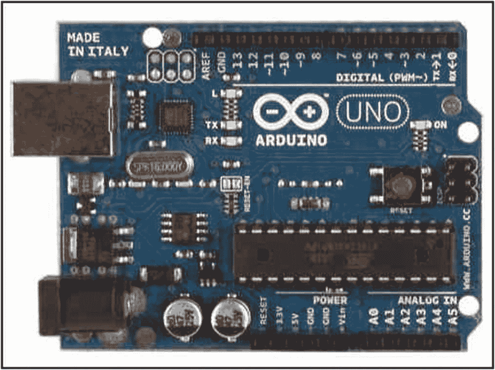

图 11-1

Arduino Uno 微控制器

一个开放源码的概念也把许多来自不同学科的思想集中到一个单一的问题上，这给知识的发展带来的好处实际上是无法衡量的。在以下练习中，将展示微处理器读取传感器和控制运动设备的基本能力，作为实际实验科学测量中更复杂和更集中的应用的基础。在 Arduino 监测一个简单的光敏电阻(LDR)和主计算机之间建立通信联系后，将展示微处理器通过数字信号处理和增加计时能力等概念扩展实验探究功能的能力。

在为随后的实验测量和实验室设备组装做准备时，本章将开发双向串行通信的基础知识，包括简单的电光光检测和流式传感器数据的 PC 图形显示。

## 实验:微处理器到主机的通信——“上传”

在进行这个练习之前，读者应该熟悉微处理器及其应用的基础知识。如上所述，Arduino 项目是那些没有物理计算或电子背景的人开始学习和应用使用微处理器所需的基本技能的绝佳场所。开源网站上有足够的书籍、教程和项目描述，如果阅读或复习，将使实验研究人员能够轻松设计和创建微处理器控制的实验设置。

当前的练习主要涉及微处理器与运行或托管 DAQFactory SCADA 软件的 PC 之间的接口。一旦接口建立，微处理器的灵活性将显而易见，因为模数转换后的数据通过传感器和 PC 之间的串行连接流向 PC，用于辅助数据处理和非常灵活的图形数据显示。

要开始组装使用微处理器所需的实用程序，请从 Arduino 网站下载并展开所用操作系统的压缩文件(作者使用 Windows 和 RPi)。在安装 DAQFactory 软件的 PC 上安装 Uno 板的驱动程序。一旦 PC 能够看到 Uno 板，启动 Arduino 的 IDE 并运行“闪烁”测试软件(称为“草图”)，以确保 PC 和 Uno 板之间的基本硬件-软件连接正常工作。

为了将数据从 Uno 板传输到 PC，并最终传输到 DAQFactory 软件进行图形显示，必须在两个计算设备的软件之间建立串行通信协议。通信协议必须双向操作，允许数据从 UNO 板“上传”到 PC 托管的 DAQFactory 软件，以及从 PC DAQFactory 软件“下载”指令和控制命令到 Uno。通过连接在 PC 和 Uno 板之间的 USB 进行双向数据传输。USB 的两个软件“末端”是两个系统中任何一个的通信(COM)端口。必须小心确保微控制器与 PC 上软件使用的正确 COM 端口通信。PC 通常有几个 COM 端口，而微控制器可能只有一个。

COM 端口通信包括在 PC 和外设之间来回传递 1 和 0。由于构成二进制信息的电脉冲是以线性方式一个接一个地传输和接收的，因此数据传输被称为串行传输。更复杂、更强大的 PC 称为主机/主控器，更小的专用微控制器称为客户机/从机。二进制信息从客户端/从设备上传到主机/主设备，并从主机/主设备下载到客户端/从设备。两台设备之间的所有二进制信息传输都是在一套称为“串行协议”的标准规则下进行的有许多标准串行协议在使用，如果需要，可以创建一个简单的特殊串行协议。DAQFactory 软件手册包含一整章关于串行通信的内容，可从 AzeoTech 网站获取单独的“串行/以太网通信指南”。通过使用建议的代码遵循这些指南，实验人员将能够创建和配置一个简单的协议，在用户协议的“接收”事件中接收流数据，如图 [11-7](#Fig7) 所示。一旦建立了接收流数据的能力，并使其作为命名的 DAQFactory 通道可用，DAQFactory 强大的统计和图形功能可用于显示输入的数据。DAQFactory 可以使用几种方法来实现串行通信，这些方法将在本文的后面部分进行开发。

由于 Uno 型板用作“智能”传感器或外设，并且可以在不同的固定位置工作站、移动无线膝上型电脑、笔记本电脑或其他计算设备之间移动，因此可能需要不同的 COM 端口来支持串行通信。COM 端口选择可以从 Arduino IDE 的工具菜单中进行管理，而 PC 上正在使用的 COM 端口的位置可以通过操作系统实用程序(如基于 Windows 的系统中的“设备管理器”)进行定位。

如第 [8](08.html) 章计数和计时所述，DAQFactory 软件的响应时间是有限的。如果 Arduino 板软件产生的数据流速度太快，DAQFactory 无法处理，那么主屏幕的光标响应就会变得缓慢而不稳定。要减慢过快的数据流，可以在 Arduino 草图的主循环中输入一个 delay 语句，以降低输出数据的传输速率。

当 DAQFactory 程序正在接收数据流时，Arduino IDE 监视器不会显示从 Uno 板到 PC 的数据流。到达 PC 的流可以用图形显示或“广播”以输入到电子表格如 Excel 中。

在本练习的主要部分，光敏电阻将用于为 Arduino Uno 板提供模拟、变化的输入，该输入将通过模数转换器(ADC)传递，然后串行传输到主机，通过 DAQFactory 软件实现几乎实时的图形显示。

### 五金器具

Arduino Uno 等 USB 微控制器板将用于监控 5 V 偏置分压器的输出，该分压器由光敏电阻和 10kω电阻组成。Arduino 在非常小的 2.75 英寸(7 厘米)× 2 英寸(5 厘米)× 0.5 英寸(1.2 厘米)电路板中提供 10 位模数转换值，而不是大得多的鲁棒的 4 英寸(10.3 厘米)× 6 英寸(15.2 厘米)× 1 英寸(2.45 厘米)LabJack。

### 电路原理图

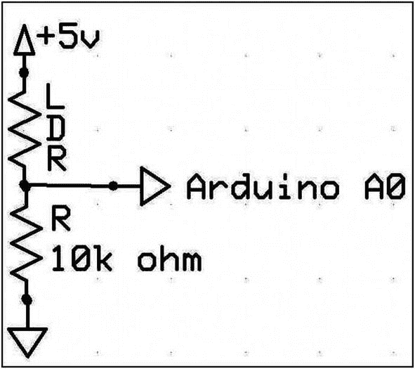

图 11-2

一种 LDR 偏置电路

5 V 电源和接地来自 Arduino 板。模数转换通过将传感器和电阻的连接点连接到微控制器上的第一个模拟输入引脚 A0(零)来完成。模拟信号被转换成 1023 和 0 之间的数字值(1024 或 2 个 <sup>10 个</sup>数据点)。光敏电阻是一个安装在平面上的硫化镉半导体薄带，外面包着一层透明保护涂层。硫化镉光敏电阻可从许多地方、邮购或在线电子供应源获得，通常价格在 1-2 美元之间。

### 软件

用于本练习“上传”部分的软件分为两部分。第一个对 Arduino 板进行编程，第二个从 DAQFactory 程序提供“带状图记录器”图形输出显示。

清单 [11-1](#PC2) (所有清单都在本章末尾)提供了一份 Arduino 草图，该草图监控 LDR-10kω电阻结处的电压。(sketch 是 Arduino 文档名称，表示在 PC 或 RPi 上运行的集成开发环境(IDE)程序中汇编和验证的程序指令集，微控制器将遵循该指令集。)

实际上，Arduino 代码利用系统 10 位模数转换器的 A0 输入读取结电压值，然后每隔 500 ms 将该值打印到 Arduino COM 3 端口，并在每个值后提供换行指令。

为了使 DAQFactory 程序能够读取 Arduino 放置在 COM 3 端口上的数据，必须在 SCADA 绘图软件中创建并配置一个标识为“com_3”的端口。

作者的 DAQFactory 程序通道表配置了通道名“ArduinoStream ”,它被设置为从名为 com_3 的设备接收数据。com_3 端口已经根据图 [11-3](#Fig3) 到 [11-8](#Fig8) 中描述的以下选择顺序进行了命名、配置和设置。

最初，图 [11-3](#Fig3) 的快捷菜单用于启动配置过程。

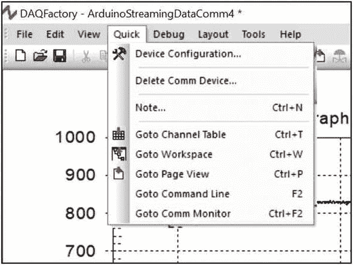

图 11-3

快速设备配置

选择设备配置选项，调出图 [11-4](#Fig4) 的设备配置窗口。

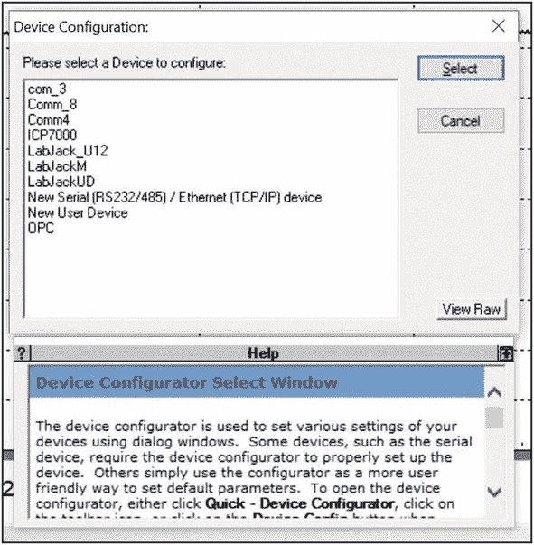

图 11-4

设备配置窗口

在图 [11-4](#Fig4) 的窗口中，选择新的串口，调出以太网/串口设备端口配置窗口，如图 [11-5](#Fig5) 所示。

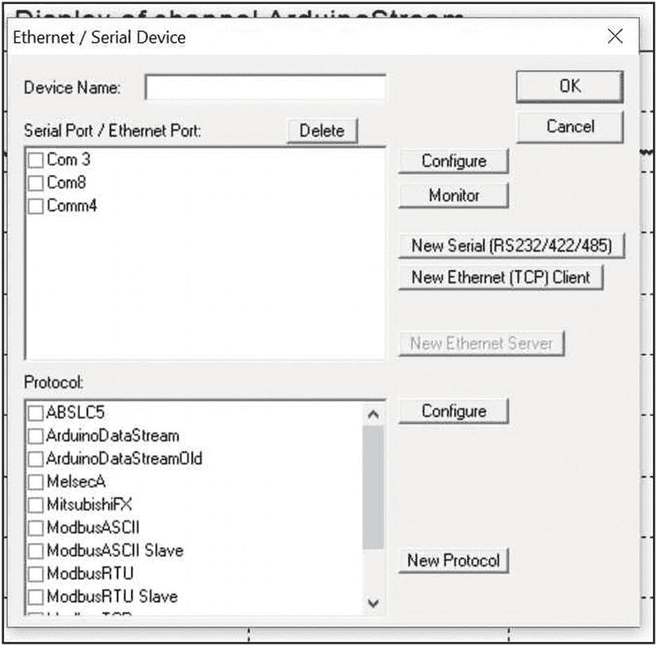

图 11-5

串行设备命名和配置选择

在图 [11-5](#Fig5) 的窗口中，新的 com 设备必须以 DAQFactory 可接受的名称命名(名称必须以字母开头，只能包含字母、数字和下划线)。在输入一个可接受的名称后，必须点击配置按钮来调出串口配置窗口，如图 [11-6](#Fig6) 所示。

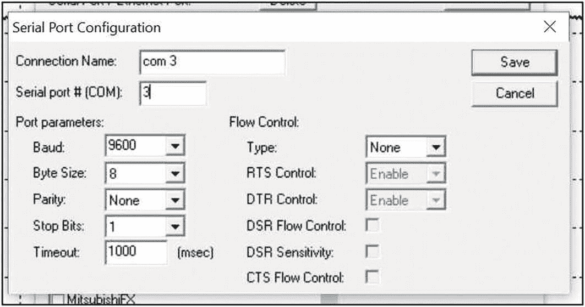

图 11-6

串行端口配置窗口

出于本介绍性练习的目的，应接受默认选项，并使用保存按钮返回图 [11-5](#Fig5) 的以太网/串行设备窗口。

要完成 Arduino 串行端口和 DAQFactory 端口之间的连接，必须使用以太网/串行设备窗口的新建协议按钮指定串行通信方法或协议。

图 [11-7](#Fig7) 显示协议配置窗口。

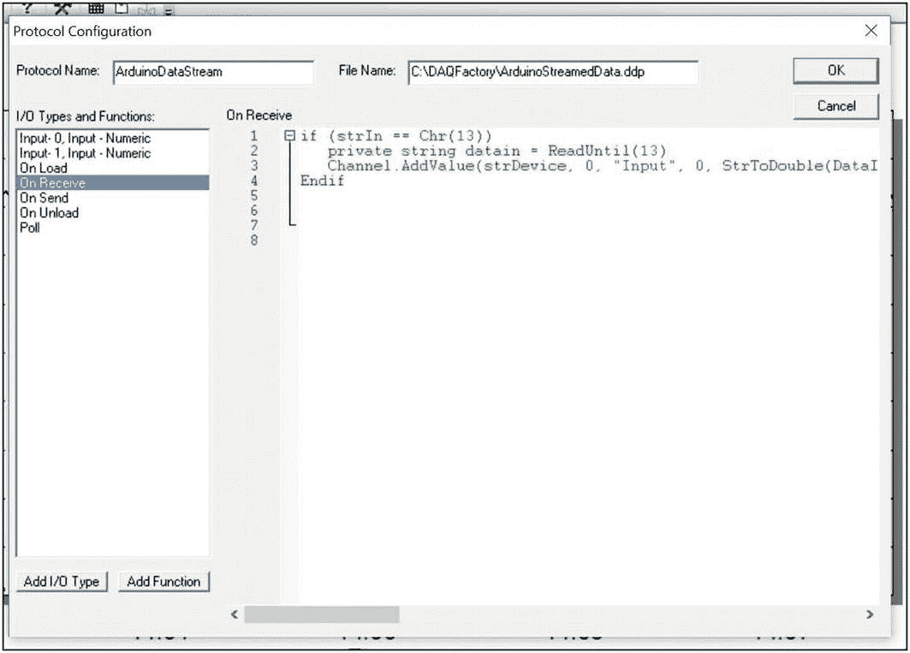

图 11-7

协议配置窗口和“接收时”事件数据解析脚本

打开此窗口时，协议名称和文件名为空，I/O 类型和功能选项默认位于列表顶部。应该为协议指定一个名称，还必须为协议指定一个文件名和位置，该协议与其他普通文档分开存储。协议的单独存储允许共享协议，但也意味着如果主机计算机被更新或改变，协议必须被移动。

为了完成 Arduino 独立输出数据的连接，必须准备一个脚本，以便在每次完整的数据实体到达 com_3 端口时执行。该脚本被输入到 I/O 类型和功能列表的“接收时”选项中。完整的代码在清单 [11-2](#PC3) 中。

一旦创建并保存了 com 端口协议，通道表视图可用于填写建立通道所需的条目，以接收流 Arduino 数据，如图 [11-8](#Fig8) 所示。

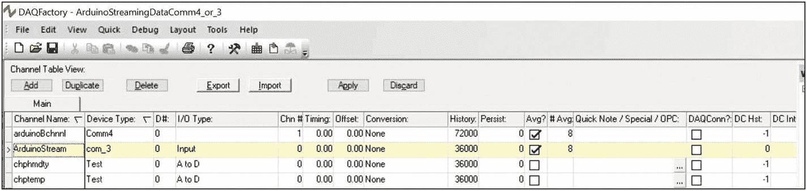

图 11-8

为流式数据创建通道

填写通道表视图中的条目并点击图 [11-8](#Fig8) 中的“应用”按钮后，通道应开始填充带有时间戳的数据。

通过展开工作区面板中的通道标题，并双击所需的通道以打开带有五个选项卡的通道详细信息窗口，可以以表格形式查看数据。选择表格选项卡将显示到达端口的时间戳和数据，最新值显示在顶部(参见第[章第 6](06.html) ，图[第 6-14](06.html#Fig14) )。图形选项卡显示数据的图形。事件选项卡显示可应用于通道值数据操作的任何代码。主选项卡和详细信息选项卡包含许多命名的通道配置和选项。

### 需要页面组件

频道数据可以用二维或 2D 图形屏幕组件显示，该组件被扩展以尽可能多地使用屏幕。合适的显示如图 [11-9](#Fig9) 所示，时间轴设置为 5 分钟间隔(300 秒),接收到的 Arduino ADC 转换器值在图表输出上从 0 到 1000 单位缩放。

## 观察

在黑暗条件下，硫化镉光敏电阻器(LDR)的电阻为 75kω。在近距离非常强的白光 LED 照射下，LDR 电阻降至 250ω。在图 [11-2](#Fig2) 所示的电路配置中，随着照明从黑暗变为明亮，观察到的电压应该在大约 0.6 到 5 伏之间变化。Arduino ADC 是一款 10 位器件，可在 5 V 输入下将电压调整至 1024 单位或 4.9mV/分度。当 LDR 电阻几乎降至零时或者在非常强的光照条件下，实现 5 伏输入。组装 LDR 和固定电阻器的配置使得图形轨迹与落在检测器上的光的强度或亮度成比例地上升。因此，图形显示反映了眼睛所看到的，因为较高的照度朝向图形的顶部，而加深的黑暗导致轨迹减少。流式 Arduino 数据的简单绘图与照明不是线性的。(参见“讨论”)

落在安装了 Arduino 的 LDR 上的光线变化导致了图 [11-9](#Fig9) 中描述的响应变化。

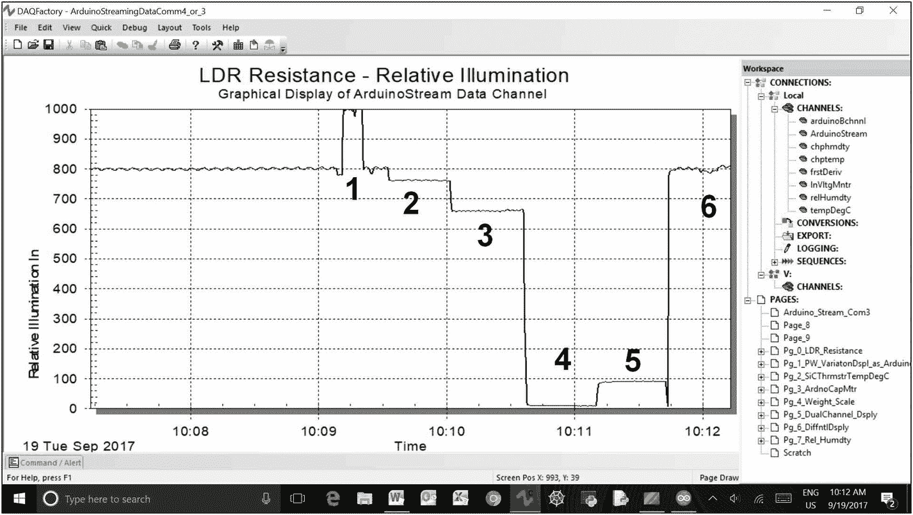

图 11-9

Arduino 安装 LDR 上照明变化的图形记录

在图 [11-9](#Fig9) 中，当照射在 LDR 上时，一个强 LED 使第 1 部分的监控系统饱和。在第 2 部分中，头顶上的灯被关闭，在第 3 部分中，房间的灯被关闭，只留下漫射的窗户光来照亮探测器。第 4 部分是在黑暗的房间中，用放置在 LDR 上的盖子记录的，而第 5 部分是在房间灯重新打开时，测量进入盖子的光泄漏。第 6 节显示了恢复正常室内照明时监视器的再现性。

尽管 LDR 的响应迅速而灵敏，但是落在 LDR 上的光的快速、闪烁阻碍导致显示滞后于照明变化。

## 讨论

微处理器上的时钟运行速度提供了更高的速度，以监控实验科学中一些快速发生的物理化学事件。然而，串行端口很容易以远高于计算机屏幕更新速率的速率接收数据。如果数据流入 PC 端口的速率太高，光标响应将会变慢，并且它实际上已经冻结了作者系统上的光标。如果数据速率太高，Arduino 可能需要在微处理器的主循环中使用延迟语句来降低速度。或者，数据可以以每秒 20 点(20 Hz)的速度流入 DAQFactory 程序和用于将数据存储在文件中的记录功能，以供以后检索和检查。LabJack 设备(U3 型)能够以高达 2500 样本/秒的数据速率进行全分辨率采样，以这些速率传输或采集的数据必须保存在内存中，以便在数据流关闭后进行处理。

光敏电阻是一层沉积在透明保护层下的半导体薄膜。落在探测器上的环境光导致电子从半导体材料中被撞出，当电流流过长条和连接到其两条引线的电路时，设备的电阻下降。对于作者的设置，暗电阻通常在 75kω或更高的范围内测量，而在强光照下，电阻可能降至仅数百ω。ldr 可以在兆欧范围内的暗电阻下获得，通常表现出与人眼相似的绿色光谱响应。

硫化镉是一种更常见、更便宜的光敏电阻。当图 [11-2](#Fig2) 所示的电路用于产生变化的电压并且信号连接到 Arduino 板的模拟输入引脚 A0 时，10 位模数转换器向 USB–COM 端口串行输出提供输入模拟信号的 1/1024 分辨率的数值。

在分压器电路中配置光敏电阻提供了一种非常简单的将光强转换成可测量电压的方法。然而，这种转换不是线性的。

在图 [11-2](#Fig2) 的电路中，LDR 已经连接到 5 V 电源，一个 10kω“下拉”电阻连接在 LDR 和地之间。在 LDR-下拉电阻结点观察到的模拟电压由分压器公式给出

V <sub>模拟</sub> = V <sub>+5</sub> * ( R <sub>下拉</sub> /(R <sub>LDR</sub> + R <sub>下拉</sub>))

典型的硫化镉 LDR 可以在 75kω的黑暗电阻和 1kω的明亮电阻之间变化。可以使用 Excel 电子表格，如图 [11-10](#Fig10) 所示，计算并显示 LDR 电阻变化的模拟电压输出图，如图 [11-2](#Fig2) 所示电路。

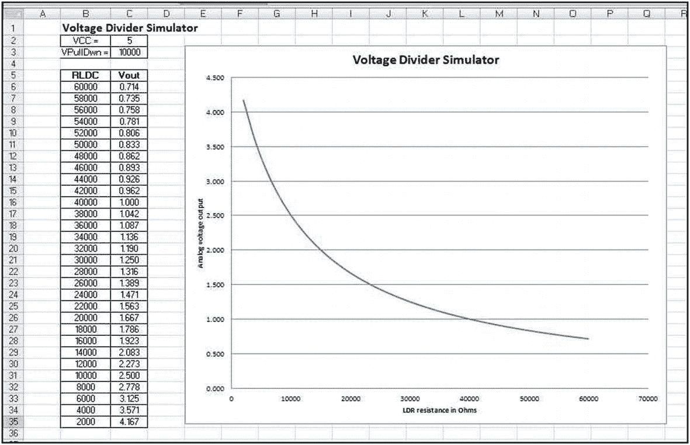

图 11-10

10kω–LDR 分压器电路的模拟输出

图 [11-10](#Fig10) 中的曲线是传感器位于电压源和接地下拉电阻之间时的典型曲线。该曲线将是相同的指数形状，但是对于传感器连接在地和到正电压电源的上拉电阻之间的电路来说，该曲线是反向的。由于光电管和电阻的制造差异，针对单个 LDR 和固定值电阻生成的每条曲线都会略有不同。前面的曲线最好用 y = -1.053ln(x) + 12.173 形式的对数曲线来表示，其方差为 R <sup>2</sup> = 0.9939。

如图 [11-10](#Fig10) 所示，模拟输出的曲率在两个区域减小，并开始趋向线性。在图的左上象限，LDR 电阻的微小变化会导致较高的模拟输出变化。在图的右下象限，LDR 电阻的大变化导致电压输出低值的小变化。实验者可能希望改变上拉或下拉电阻的值，并重新绘制之前所示的曲线，以找到在分压器配置中使用电阻式传感器的最佳条件。为了准确定量地使用分压器配置进行传感器测量，研究人员应在感兴趣的传感器范围内，用尽可能多的数据点校准手边的系统。

## 实验:主机到微处理器的通信-“下载”

### 介绍

在本练习的第一部分，数据由微处理器采集并传送到主机，用于实时图形显示、存档存储和可能产生的硬拷贝格式。

在本节中，将为 Arduino 配置主机和微处理器，以便通过串行端口接收来自主机的命令。主机将配置有一个 DAQFactory 控制屏幕，其中包含一些按钮，这些按钮将激活一个 LED，并启动一个非常简单的脚本来循环打开和关闭 LED 几次。

### 五金器具

为简单起见，将一个 LED 和一个适当的限流电阻插入原型板，并串联在 Arduino 板上的引脚 13 和地之间。

### 软件

作者的 DAQFactory 程序用于流 Arduino 数据的图形显示，提供了一个新的空白页，上面安装了几个按钮，如图 [11-11](#Fig11) 所示。

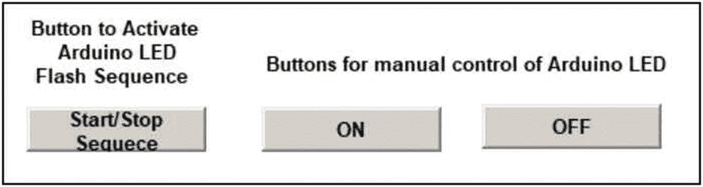

图 11-11

Arduino LED 控制按钮

标记为“开”和“关”的每个按钮都按照前面练习中的描述进行了配置。为简单起见，在下载指令需要简单动作的情况下，从动作列表中选择快速序列，如图 [11-12](#Fig12) 所示。

点击高亮显示的快速序列条目，图 [11-13](#Fig13) 的文本屏幕打开，可以输入所需的指令。

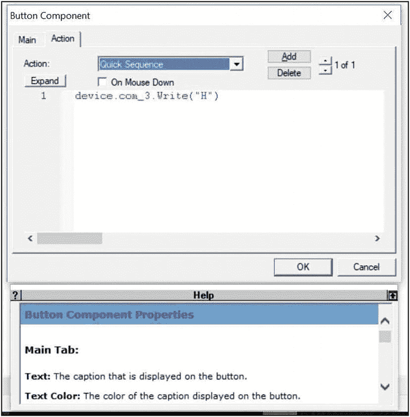

图 11-13

快速序列文本输入面板

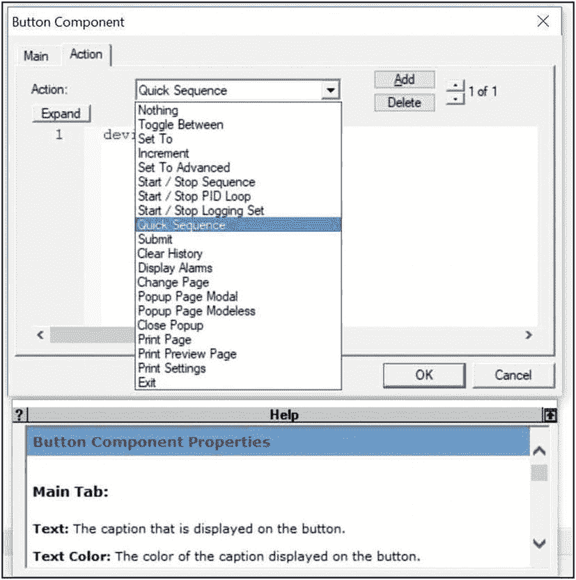

图 11-12

快速序列选择

通过展开工作区中的“序列”菜单选项访问的正式编程序列列表中不显示“快速序列”。当列表 [11-4](#PC5) 的阿尔杜伊诺代码接收到改变发光二极管状态的命令时，激活开/关按钮只需要将单行快速序列文本链接到发送“H”或“L”上。

可以用 DAQFactory 软件的正常方式准备一个程序序列，以实现一系列传输的开/关动作。根据清单 [11-3](#PC4) ，图 [11-11](#Fig11) 中最左边的按钮以 3 秒的间隔使 Arduino LED 闪烁 5 次。

## 观察

单击 DAQFactory 控制屏幕上的按钮时，Arduino 板上的 LED 会根据按钮标签激活或不激活。

## 讨论

在进行“下载”命令练习时，随着系统的建立，通信链路的每一部分都可以独立测试。通过加载和运行所需的草图，并从 Arduino 串行端口发送大写的 H 或 L，可以测试 LED 及其限流电阻。LED 将根据指示点亮和熄灭。

Arduino 上的串行端口显示必须关闭，以便 DAQFactory 程序可以使用该端口。一旦建立了从屏幕按钮代码到 Arduino 的连接，Arduino 在故障排除中使用端口的任何尝试都将从 Arduino 调用“端口正在使用”错误响应。Arduino 必须关闭并重新启动才能重新访问端口。

双向链接的 DAQFactory 侧和 Arduino 草图的正确操作也可以通过访问 DAQFactory 中的 com_3 监视器(早期程序中的 com3 ),并使用监视器窗口上的输入框和发送按钮手动发送大写 H 来确认。手动传输应激活 Arduino 安装的 LED，大写 L 的手动传输应关闭 LED。

两个端口监视器接受并传输 H/L，但是脚本命令必须使用引号将“H”和“L”指定为大写 ASCII 字符。

## 树莓派和 Arduino

在前面的练习中，Raspberry Pi 为其 GPIO 引脚数组使用了不同的库来与外界通信。这三个库各有不同的功能和限制，通过将 Arduino 微控制器用作智能外设，几乎可以消除这些功能和限制。

回想一下，Arduino 程序是在集成开发环境(IDE)中编写的，IDE 是从 Arduino 网站下载的程序。RPi 和 Arduino 在 USB 上通信，当下载 IDE 程序并使用终端条目安装时，不应连接该 USB

```c
$ sudo apt-get install arduino

```

软件安装完成后，可以连接 USB 电缆，并从 IDE 的“工具”菜单中选择“电路板”，然后将类型设置为 Arduino Uno。应选择串行端口选项/ dev / ttyACM0 来完成配置过程。

RPi 和 Arduino 之间最安全、最简单的通信方式是通过 USB 连接。(参见“讨论”)

图 [11-14](#Fig14) 显示了安装 Arduino IDE 后 RPi 上的微控制器开始菜单。

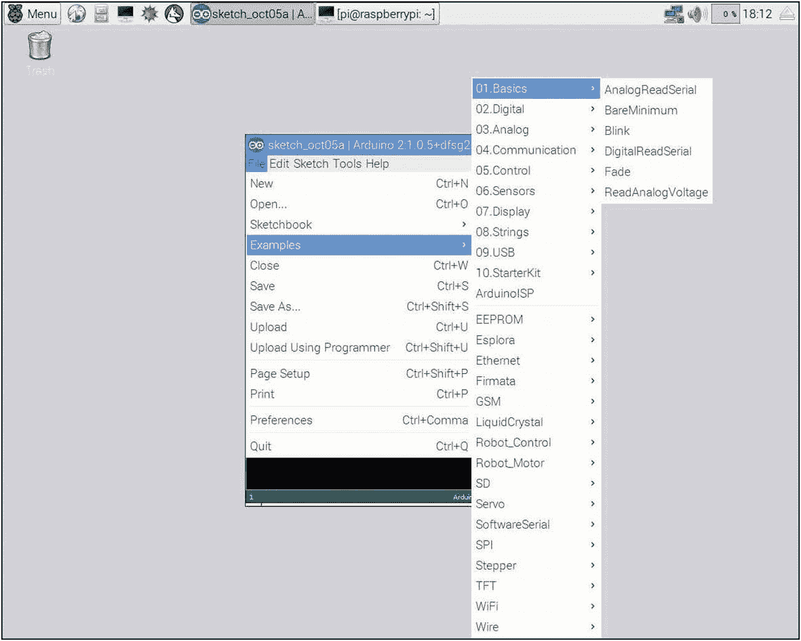

图 11-14

RPi 上的 Arduino 菜单

检查图 [11-14](#Fig14) 中的菜单项可以发现，已经为 Arduino 微控制器编写了大量的开源代码，允许它连接硬件和软件。RPi 和 Arduino 之间的 USB 连接使得 RPi 的计算能力可以访问这些模拟和数字接口代码。

## 实验的

配置完成后，可以通过示例➤ Basic 选择闪烁程序，编译并上传到 Arduino，arduino 应每秒闪烁一次 led。

一旦 Arduino 上的 LED 按程序闪烁，连接两个设备的简单过程就完成并通过验证。

Arduino-RPi 连接的一个更重要的实验方面在于使用 RPi 作为绘图仪的计算能力，以图形方式显示由与 Arduino 接口的传感器收集的数据。可用的图形显示能力的一个简单例子可以通过绘制传感器所处环境中各种照明条件变化时来自 LDR 的信号来演示。

来自 Arduino 的 5v 电压用于偏置 LDR，其具有 5.49kω1%金属膜、下拉电阻，类似于图 [11-2](#Fig2) 中所示的电路。Arduino 活动代码与清单 [11-1](#PC2) 中列出的代码基本相同，仅在程序注释中有微小变化，以适应不同的下拉电阻值。

来自 LDR 的信号可以通过连接到 Arduino 的 10 位 ADC 的 A0 输入端进行数字化，然后发送到微控制器的串行端口，供 Python 绘图程序查看或读取。列表 [11-5](#PC6) 中列出了串行绘图仪代码。

## 观察

在配置 LDR 传感器和 Arduino 并在 RPi 上启动绘图程序后，记录了图 [11-15](#Fig15) 的轨迹。初次启动时，绘图仪程序会在显示器的右侧创建一个小窗口，交互式屏幕位于左侧。在交互式屏幕左侧看到的数字和字符的流式打印列是传输的字符和要绘制的数字。(参见“讨论”)

如第 [9](09.html) 章所述，matplotlib 绘图程序显示在活动显示左下角的一个按钮面板上，用于调用多种功能，如比例扩展、在帧中前进和后退，或保存适用于所显示数据类型的绘图。

回想一下，为了定量使用，必须校准图形标绘显示器上的定时标记。

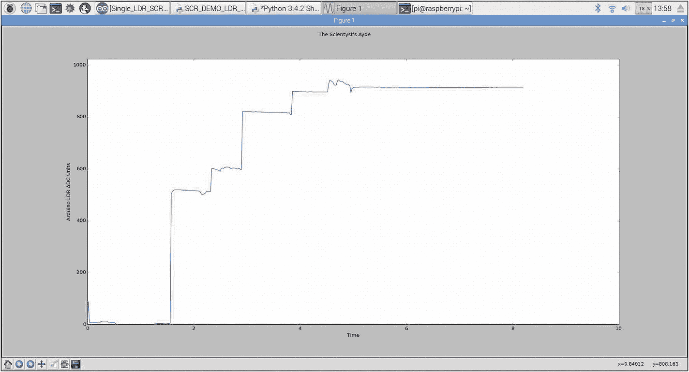

图 11-16

由光敏电阻监测的室内照明强度变化的记录器跟踪

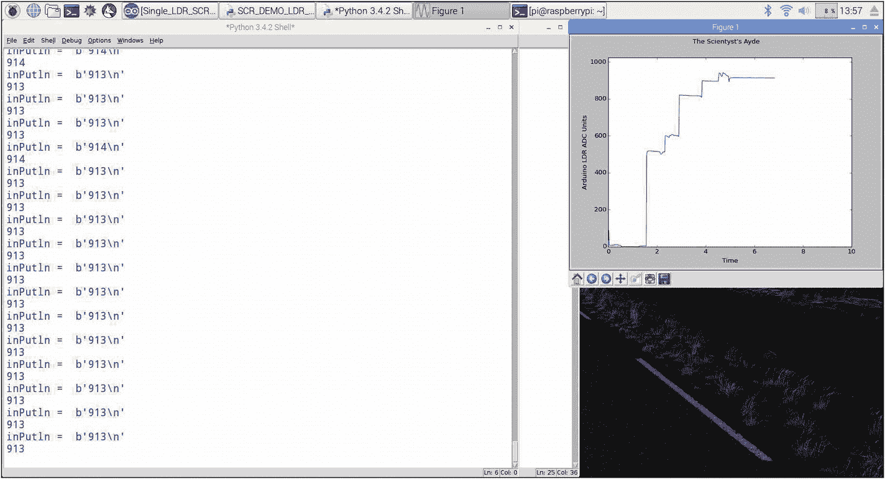

图 11-15

从 Arduino 绘制数据

在图 [11-16](#Fig16) 中，全屏选项按钮用于从图 [11-15](#Fig15) 中可见的小窗口展开记录的图。在图的最左边，追踪记录了 LDR 上的盖子下的房间光线泄漏。当房间的窗户被盖住，房间的灯光被关掉时，这种痕迹下降到几乎为零。大约一分半钟时的第一次大位移是由于打开了窗户。第二次上升是由于大约两分钟半时打开头顶上的白炽灯，接着是三分钟和四分钟时打开左侧和右侧的台灯。通过从大约一英寸(2.5 厘米)的距离在传感器上照射明亮的 LED 光来产生最大的痕迹值。借助显示屏左下角的工具按钮，可以访问自会话开始以来的确切相对时间以及跟踪的扩展部分。(参见第九章[的](09.html)。)

## 讨论

LED 的闪烁和闪烁程序经常被认为是物理计算上的“Hello World！”所有学生在学习一门新的计算机语言时运行的程序。实质上，RPi 正在向 Arduino 发送命令以供执行。为 Arduino 和 RPi 开发和发布的免费开源软件数量庞大，需要实验人员或研究人员不断审查，以跟上这一快速发展的技术。

由连接到 Arduino 并可能由 Arduino 控制的传感器产生的数据的绘图是通过稍微修改版本的 matplotlib 带状图记录器程序来完成的。为了使绘图仪能够读取串行端口，需要对原始代码稍加修改。串行端口传输涉及 1 和 0 的模式，必须将其转换为可传输的数据包，接收并解析回数值以便绘图。Arduino 是用 C 语言编程和操作的，而 RPi 使用 Python。作为绘图前配置解析代码和验证数据传输的辅助手段，串行连接的 Python 端接收到的字符会在控制台显示器上“按原样”打印出来，然后以适合识别的格式再次打印，作为绘图数据。当软件按预期运行时，可以很容易地注释掉打印语句。

在正常使用中，matplotlib 带状图记录器程序在 x、y 和时间轴缩放的注释中标识了变量和标签。轴标签也可能需要修改，以绘制和识别手边的数据。

RPi 和 Arduino 都能够使用 3.3 或 5 伏电源，对于一些使用直接串行通信的应用，可能需要电压电平调整电路以避免损坏电子元件。电平调节电路在几个出版的和在线的资源中有详细描述。 <sup>[1](#Fn1)</sup>

## 代码列表

```c
# A Strip Chart Recorder for Raspberry Pi with Serial Input
# SCR Plotting of changing LDR data from room environment. LDR data from 5 volt
# 5.49 K 1% MFR pull-down cct on A0 and output on Arduino serial port for plotting
#
import matplotlib
import numpy as np
from matplotlib.lines import Line2D
import matplotlib.pyplot as plt
import matplotlib.animation as animation
import time
import serial
#
#
#
class Scope:
    def __init__(self, ax, maxt=10, dt=0.02):
        """maxt time width of display"""
        self.ax = ax
        self.dt = dt
        self.maxt = maxt
        self.tdata = [0]
        self.ydata = [0]
        self.line = Line2D(self.tdata, self.ydata)
        self.ax.add_line(self.line)
        self.ax.set_ylim(0.0, 1024.0)  # y axis scale
        self.ax.set_xlim(0, self.maxt)

    def update(self, y):
        lastt = self.tdata[-1]
        if lastt > self.tdata[0] + self.maxt: # reset the arrays
            self.tdata = [self.tdata[-1]]
            self.ydata = [self.ydata[-1]]
            self.ax.set_xlim(self.tdata[0], self.tdata[0] + self.maxt)
            self.ax.figure.canvas.draw()

        t = self.tdata[-1] + self.dt

        self.tdata.append(t)
        self.ydata.append(y)
        self.line.set_data(self.tdata, self.ydata)
        return self.line,
#
ser = serial.Serial("/dev/ttyACM0", 9600)
#
def rd_data():
    while True:
        inPutln = ser.readline()
        print("inPutln = ", inPutln)
        line = int(str(inPutln)[slice(2,-3)]) # convert arduino serial output stream
        # to a Python string, parse out the numerical symbols and convert to a value
        print(line)
        yield (line)

fig = plt.figure()
fig.suptitle("The Scientyst's Ayde", fontsize = 12)
ax = fig.add_subplot(111)
ax.set_xlabel("Time")
ax.set_ylabel("Arduino LDR ADC Units")
scope = Scope(ax)

# uses rd_data() as a generator to produce data for the update func, the Arduino LDC

# value is read by the plotting code in 10 minute windows for the animated
# screen display. Software overhead limits response speed of display.
ani = animation.FuncAnimation(fig, scope.update, rd_data, interval=50,
blit=False)
plt.show()

Listing 11-5RPi-Python Code for Reading and Plotting Serial Port Data

```

```c
//Simple DAQFactory - Arduino Serial Communications Program, Mar. 3, 2012
//An LED with an appropriate CLR is connected between pin 13 and ground on the Arduino
//The pgm below waits for an incoming character. If the character is an upper case H, the LED is
//turned on. If the character is an upper case L the LED is turned off. The state of the LED is
//thus determined by the nature of the character in the serial import buffer.
//
//
const int ledPin = 13;        // the pin with the LED and CLR
int incomingByte;             // a variable to hold the incoming data
//
//
void setup(){
  Serial.begin(9600);         // initialize communication

  pinMode(ledPin, OUTPUT);    // set the pin function
}
//
void loop() {
  // check for incoming serial data
  if (Serial.available() > 0) {
    // read the last byte in the serial buffer
       incomingByte = Serial.read();
    // if the byte is H (ASCII 72), turn on the LED
    if (incomingByte == 'H') {
      digitalWrite(ledPin, HIGH);
    }
    // if character is an L (ASCII 76) turn the LED off
    if (incomingByte == 'L') {
      digitalWrite(ledPin, LOW);
    }
  }
 }

Listing 11-4Arduino Code to Be Run on DAQFactory Screen Button Command

```

```c
 for (Private.Counter = 0, Counter < 5, Counter ++)
   device.com_3.Write("H")
   delay(3)
   device.com_3.Write("L")
   delay(3)
endfor

Listing 11-3DAQFactory Sequence Code for Writing to com_3 Port

```

```c
if (strIn == Chr(13))
   private string datain = ReadUntil(13)
   Channel.AddValue(strDevice, 0, "Input", 0, StrToDouble(DataIn))
Endif

Listing 11-2DAQFactory “On Receive” Serial Port Parsing Script

```

```c
// Single LDR readings with serial transmission for DAQFactory SCR display.
// The voltage at the junction of an LDR biased by +5 v and with a 10K ohm
// resistance to ground is monitored by the A0 input.
//
//
void setup()
{
  // initialize serial port
  Serial.begin(9600);
}
//
void loop()
{
  // read A0
  int val1 = analogRead(0);
  // read A1
  // print to serial port
  Serial.println(val1);
  //Serial.print(" ");
  // delay

  delay(500);
 }

Listing 11-1Arduino Code

```

## 摘要

*   微控制器可以被视为 SCADA 架构中的智能接口，它使用串行端口通信在主机和远程过程之间上传和下载指令和数据。

*   微控制器可以大大增强主机的数字信号处理和 I/O 能力。

*   一个微控制器和一个单板计算机可以构成一个最便宜的 SCADA 实现的基础。

本书前十章中描述的微控制器、技术和软件的广泛应用将在本系列的下一篇文章 *Arduino 科学测量*中用于实施实验测定。

<aside aria-label="Footnotes" class="FootnoteSection" epub:type="footnotes">Footnotes [1](#Fn1_source)

①[`elinux.org/RPI_GPIO_Interface_Circuits`](http://elinux.org/RPI_GPIO_Interface_Circuits)

2) *树莓派食谱*第二版 Edn。Monk，O'Reilly Media Inc .，ISBN 978-1-491-93910-9

3) *电子烹饪书*，蒙克，奥赖利媒体公司，ISBN 978-1-491-95340-2

 </aside>