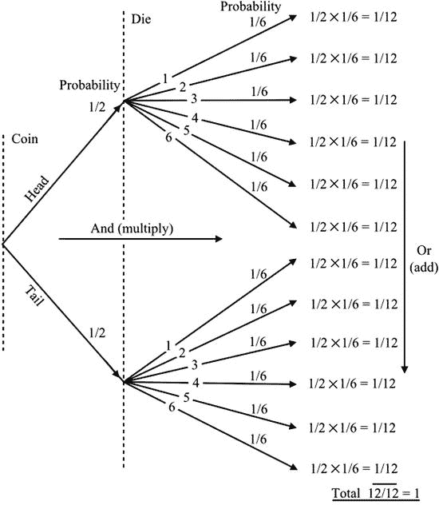
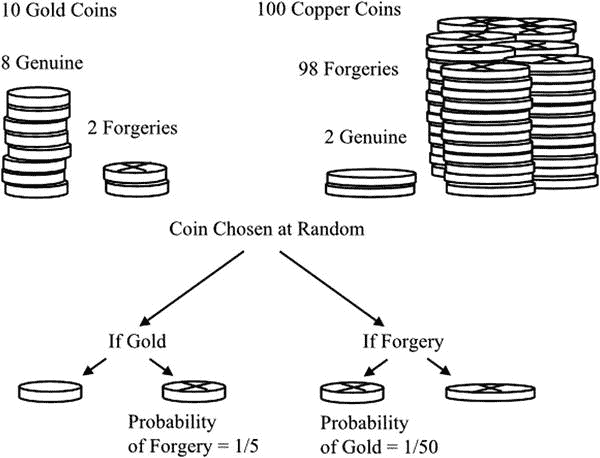

# 三、概率

How Bad Statistics Can Put You in Jail

为了理解统计分析，有必要对概率有所了解。令人惊讶的是，也许并不需要太多。了解几种不同的概率是如何组合在一起的，以及一个事件的发生概率是如何受到一个首要条件的影响，这些都是大多数目的所需要的。

## 概率定义

由于前一章讨论的不确定性，统计结果被引用，同时指出结果是正确的概率。因此，有必要了解基本概率，幸运的是，这并不难做到。概率被定义为所有同等可能的有利结果与所有可能的同等可能的结果的比率。它通常用分数或小数来表示，并且必须介于零(表示不可能)和一(表示确定)之间。因此，如果我们掷骰子，有 6 种可能的结果。掷出 2 的概率是 1/6，因为只有一个有利的结果。掷出奇数的概率是 3/6(即一半)，因为有三种有利的可能结果。掷出 7 的概率为零(即不可能)，掷出小于 10 的数的概率为一(即一定)。

在解释概率结果时，重要的是要认识到，仅仅因为一个事件发生的概率低，我们就不能断定我们永远不会遇到它。毕竟，有些事情必须发生，而大多数发生的事情只有很小的发生概率，因为总是有更多的事情可能发生。

举一个不太重要的例子，如果我们发一副牌，给 4 手牌，每手 13 张，我们会惊讶地发现每手牌都是一套完整的花色。这种情况发生的概率大概是 5x10 28 中的 1(5 后面跟着 28 个零)。然而，每次我们发牌时，不管牌的分布如何，我们发现我们已经发牌的特定手牌的概率是完全相同的:大约是 1/5x 1028。所以，每次我们发一副牌，都会发生这种低概率事件。

在我们生活中的每一天，我们都会遇到一系列的事件——银行的一封信，手指被割伤，收音机里最喜欢的一首歌，等等——每一件事都有发生的可能性。综合起来，只考虑独立的事件，每天的事件序列发生的可能性极小——然而它发生了！

对概率论进行详尽的描述是不合适的，也是不必要的，但是理解在得出结论时使用概率的基本规则是很重要的。接下来的两节与这些规则有关。

## 组合概率

结合几个概率是一个简单的过程，但需要小心正确地做。如果我们知道两个事件中每一个的概率，我们就可以计算出这两个事件发生的概率。假设我们抛硬币，然后扔骰子。得到人头的概率是 1/2，骰子得到 2 的概率是 1/6。头和 2 这两个事件的概率是通过将这两个概率相乘得到的。答案是 1/2 x 1/6 = 1/12 或十二分之一，从所有可能性的列表中可以看出。

<colgroup><col> <col> <col> <col> <col> <col> <col> <col> <col> <col> <col> <col> <col></colgroup> 
| 硬币 | H | H | H | H | H | H | T | T | T | T | T | T |
| 死亡 | one | Two | three | four | five | six | one | Two | three | four | five | six |

这个过程可以扩展到任何数量的事件，各个概率相乘。然而，重要的是要注意，只有当事件是独立的时，这才是一个有效的过程，也就是说，它们的发生没有以某种方式联系起来。

独立的必要性可以用一个不同的例子来说明。比方说，我在某一天上班迟到的概率是 1/100。我同事迟到的概率是 1/80。概率相乘得出 1/8，000 是我们俩在同一天迟到的概率。这显然是错误的。很多让他迟到的情况也让我迟到。如果天气有雾或结冰，我们都可能迟到。我们甚至可能乘同一列火车旅行，所以晚点的火车会让我们都迟到。

几年前公布了一个由不合理的概率倍增引起的严重错误的例子。同一个家庭的两个孩子死亡，显然是婴儿床死亡。母亲莎莉·克拉克是一名英国律师，于 1999 年被指控谋杀。控方的一名专家证人表示，像这个家庭这样富裕的家庭发生婴儿床死亡的几率是 8500 分之一。通过平方这个概率(即，用 1/8，500 乘以 1/8，500)，他得到了一个家庭中发生两起婴儿床死亡的概率为 7300 万分之一的估计值。被告方没有对这一数字提出质疑，母亲被判有罪并入狱。她在 2003 年赢得了第二次上诉。显然，婴儿床死亡的可能性可能是由于遗传原因而在家庭中发生的，两起婴儿床死亡不能被认为是独立的事件。两个(相等的)概率相乘是不合理的。由于莎莉·克拉克案，其他类似的案件得到了复审，另外两名被判谋杀罪的母亲的定罪被推翻。

2003 年在荷兰，一名护士 Lucia de Berk 因谋杀四名病人和企图谋杀另外三人而被判处终身监禁。部分证据是由一位法律心理学家提供的统计计算。据称，在三家医院工作的护士出现在如此多的不明原因的死亡和复苏中的几率是 3.42 亿分之一，这个结果是通过乘以概率得出的。在接下来的几年里，许多著名的统计学家批评了这种过于简单的计算方法，于是一项要求重新审理此案的请愿开始了。最终，在 2010 年，经过漫长的法律程序，重审做出了无罪判决。当然，除了统计计算之外，还有许多考虑因素，但从诉讼中可以明显看出，在最初的定罪中，统计计算是有分量的。

独立事件的概率倍增规则通常被称为“与”规则，因为它表达了事件 A、事件 B 和事件 C 等的概率。当我们希望知道事件 A、事件 B 或事件 C 等的概率时，第二个规则——“或”规则用于组合概率。在这里，我们将概率相加。和前面的规则一样，这条规则也有一个重要的条件:事件必须是互斥的。这意味着在任何时候只有一个事件是可能的。举例来说，如果我们扔一个骰子，2 的概率是 1/6，3 的概率是 1/6。2 或者 3 的概率是 1/6 + 1/6 = 1/3。这两个事件是互斥的，因为掷骰子不可能同时得到 2 和 3。如果我们进一步扩展例子来阐明，得到 1，或 2，或 3，或 4，或 5，或 6 的概率是 1/6+1/6+1/6+1/6+1/6+1/6+1/6 = 1(即确定性)。

因为所有可能的互斥结果的概率之和等于 1(一种确定性)，因此，某件事不发生的概率等于 1 减去它发生的概率。

为了说明“或”规则的误用，我们可以回到一起掷硬币和掷骰子。头和 2 的分离概率分别是 1/2 和 1/6。如果我们把这些加在一起，我们会得出结论，得到正面或 2 的概率是 1/2 + 1/6 = 2/3，这是非常错误的。得到一个头和得到一个 2 并不是互斥的事件，因为两者都可能发生。对这种情况的适当分析表明:

正面和 a ^ 2 = 1/12 的概率

两者之一的概率，但不是两者都= 6/12 = 1/2

都不是的概率= 5/12

两者都有，或者两者都没有的概率= 1/12 + 6/12 + 5/12 =1

最后的陈述是对“或”规则的正确使用，因为“两者”、“一者”和“两者都不是”构成了一组相互排斥的事件。这些结果可以通过查看上面显示的可能性的完整列表来检查。

结果也以树形图的形式显示在图 [3-1](#Fig1) 中。“与”规则和“或”规则之间的区别是清楚的。在图中横向跟随一系列事件包括硬币事件和骰子事件。两个“和”的概率相乘。在最终组合概率的垂直列表中可以看到“或”选项。这个树形图是一个相当琐碎的例子，但是你会在更实际的例子中再次遇到树形图。这里值得指出的是，虽然树形图可以被更快的计算所代替，但它仍然是阐明或检查计算背后的逻辑的极好方法。

图 3-1。

Tree diagram of the various outcomes of tossing a coin and throwing a die

请注意，当概率相乘时，结果小于两个原始概率中的任何一个。因此，应用“与”规则总是导致概率的降低。这正如我们所料:在一场赛马中预测冠军和亚军的概率小于预测其中一个结果的概率。另一方面，将概率加在一起会增加概率。因此,“或”规则的应用增加了可能性。预测一场赛马的冠军或亚军比只预测其中一个结果更有可能。

概率的组合广泛地出现在系统可靠性的研究中，你将在后面看到更多的细节。当系统由许多部件组成时，总的故障概率取决于各个部件的故障概率以及它们组合的方式。假设我们有一个简单的烟雾报警器，由一个连接到警报器的传感器组成。如果传感器或报警器失效，或者两者都失效，则系统失效(“或”规则)。如果我们安装一个重复的系统，只有当第一个系统失败，第二个系统失败时，才会发生失败(“与”规则)。

由于这种分析与必须尽可能避免的故障有关，引用的概率值通常很小。我们都更熟悉十分之一或百分之一范围内的概率；但是当出现 0.0001(万分之一)或 0.000001(百万分之一)的概率时，我们不仅很难认识到它们的重要性，而且也很难认真对待它们。灾难性火灾发生的几率可能是百万分之一，而我们采用的一些安全措施可能会将其降低到二百万分之一。这将使火灾发生的几率减半——这是一个非常显著的减少，但是将 0.000001 和 0.000002 这两个值进行比较，不会产生相同的影响。

## 条件概率

当所需的概率以其他事件的发生为条件时，概率计算会变得复杂。你不必担心这些复杂的问题，但是你需要意识到在这种情况下会得出错误的结论。这些结论，不管是偶然的还是有意的，都是特别危险的，因为乍一看它们似乎是完全正确的。

为了理解条件概率的含义，想象两个骰子被一个接一个地掷出。总分是 5 的概率有多大？从这两个分数的 36 种可能组合中，有四种方法可以得到 5 分，即 1+4、2+3、3+2 和 4+1。所以概率是 4/36 或者 1/9。如果我们引入一个条件，例如，第一个骰子显示 2，那么获得总数为 5 的概率变为 1/6，因为第二个骰子必须显示 3，这种情况发生的概率为 1/6。

现在考虑这样一种情况，我们有一袋硬币，其中 100 枚是伪造的，如图 [3-2](#Fig2) 所示。

图 3-2。

Conditional probability illustrated by counterfeit coins

十枚硬币是金子，两枚是赝品。我们从袋子里取出一枚硬币，看到它是金子(条件)。它是赝品的可能性是十分之二，即五分之一。或者，当我们从袋子里拿出硬币时，我们可能会发现它是伪造的(这种情况)。它是黄金的概率是百分之二(即 1/50)。这说明了这样一个事实，即给定事件 B，事件 A 的概率通常与给定事件 A，事件 B 的概率不同。这两个条件概率通常不同，并且可能非常不同。

所谓检察官谬误，就是因为使用了错误的条件概率而产生的。假设一个嫌疑犯被发现与未知罪犯的 DNA 特征相匹配。一万个人中只有一个会有相似的匹配。因此，控方认为嫌疑犯无罪的可能性只有万分之一。但是 1/10000 的概率是假设嫌疑人是无辜的情况下 DNA 匹配的概率。这不是使用的合适概率。相关概率是在 DNA 匹配的条件下，嫌疑人无罪的概率。我们无法评估这种可能性，因为我们不知道还有多少其他同样可能有罪的嫌疑人。(这就像在不知道伪造品总数的情况下试图解决一袋硬币的例子一样。)但是这个数字可能远远大于 1/10，000。比方说，在 10 万人口中，平均有 10 个人的 DNA 匹配，假设其中两个人也是嫌疑人，我们的嫌疑人有 2/3 的概率是无辜的。

正如人们可能预料的那样，也存在辩护者的谬误。它来自于一大群同样可疑的人的假设。根据前面的例子，如果人口为 1，000，000，将有 100 人具有合适的 DNA 匹配；所以，辩护人会说，我们的嫌疑人有 99/100 的概率是无辜的。把假设人口提高到 1000 万，无罪的概率就增加到 999/1000。谬误在于假设人口中的每个人都同样可疑。

Haigh (2003)和 Seife (2010)对概率的误用如何导致法律判决中的错误给出了有用的解释。许多例子取自实际案例。

这种错误不仅仅出现在法律辩论中。它们经常出现在政治辩论和广告中。看看下面的例子。

“每年死于肺癌的人中，75%是吸烟者。这说明吸烟者有 75%的几率死于肺癌。”不，不是的！我们需要知道某人死于肺癌的概率，假设他或她是吸烟者，而不是这个人曾经是吸烟者的概率，假设他或她死于肺癌。以下数据有助于说明这一谬误。

<colgroup><col> <col> <col> <col></colgroup> 
|   | 吸烟者 | 不吸烟者 | 总数 |
| 死于肺癌的人数 | Seventy-five | Twenty-five | One hundred |
| 死于其他原因的人数 | Two hundred and twenty-five | One hundred and seventy-five | four hundred |
| 总数 | Three hundred | Two hundred | Five hundred |

在死亡的 300 名吸烟者中，75 人(即 25%)死于肺癌。这与引用的 75%的肺癌死亡与吸烟有关大相径庭。请注意，这些是虚构的数字，不得用于得出任何医学结论！

"在十年内没有补过牙的牙科病人中，90%的人都定期用牙胶刷牙。"但我们真正想知道的是，那些经常用牙胶刷牙的人，有百分之多少在十年内没有补过牙。

"昨天比赛中 80%的获胜马都是由我们的赛马记者透露的。"也许吧，但是他的提示中有百分之多少预测了获胜的马？

SWITCHED ON

气氛变得紧张起来。简森开关公司的代表罗德·克雷格在电水壶制造商 Boilfast 的经理办公室里。Boilfast 为其大部分水壶安装了简森公司提供的开关，而这些开关正是正在讨论的。

Boilfast 的经理 Tom Richards 担心，由于开关出了问题，他不得不在保修期内维修的水壶数量。

他从手里拿着的一张纸上引用了一些数字。

“在过去的两年里，由于开关故障而被退回的水壶数量中，有 67%装有你们的开关。我认为这是不可接受的。”

Rod 除了道歉和向经理保证，他会将此事提交给他的技术部门之外，几乎做不了什么。经理现在以一种有点威胁的方式前倾。

在回简森餐馆的路上，罗德有机会仔细考虑了一下情况。他的公司提供 Boilfast 水壶上安装的大部分开关，所以 Boilfast 是他们不想失去的客户。但是这种抱怨有多大意义呢？Rod 开始明白了，当他到达办公室时，他脸上带着微笑。

他拿起电话拨号。

“汤姆，问题不是你描述的那个。”

“没有？”

“你是说，由于开关故障而退回的水壶中，67%装有我们的开关。真正的问题是，假设水壶安装了我们的开关，有百分之多少的退货是因为开关有问题？也许你应该更仔细地看看你的数字。”

汤姆失去了平衡，感到有点困惑。

“我会回来找你的，”他说。

他确实看了那些数字。在因任何原因退回的装有简森开关的水壶数量中，22%的水壶开关有问题。这与其他供应商提供的装有开关的水壶的数字相似，相应的百分比为 19%。因为大多数锅炉水壶都装有简森开关，困扰汤姆的主要开关故障很容易解释。