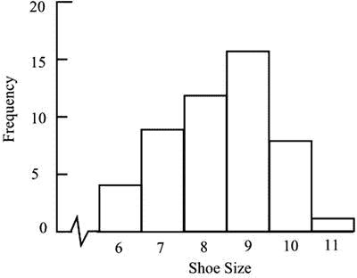
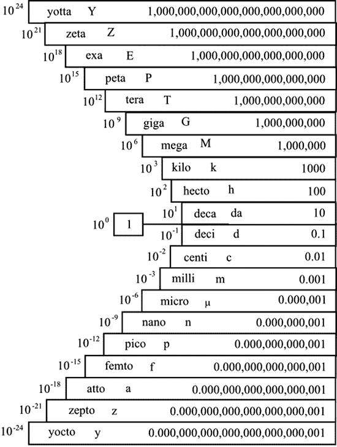

# 五、原始数据

Hard to Digest Until Processed

原始数据是在进行任何分析之前用来描述原始数据的表达式。这不是一个非常令人愉快的短语。像“原始数据”或“新数据”这样的东西会更吸引人，但我必须坚持惯例。这一章的目的是解释不同种类的数据，并提供一些定义供后面的章节使用。此外，我将展示数字如何误导或混淆，甚至在统计分析开始之前。

## 描述性或数字性

数据可以是描述性的或数字的。描述性数据也称为分类数据，可以放入类别中进行计数。例如，记录人们在选举中投票的方式需要定义类别，即政党，每个数据都在适当的类别上增加一个。计数过程产生的数值汇总了数据，可用于后续处理。因此，我们可以用每个政党的选民比例来表示投票结果。

如果描述性数据可以按顺序排列，但无法比较类别之间的差距大小，则称该数据为有序数据。因此，我们可以把小号、中号和大号按顺序排列，但是小号和中号的区别可能与中号和大号的区别不同。以这种方式进行排序被称为排序。不仅可以将每个类别中的数字相加得出数值，还可以将有序数字归属于每个类别。因此，小、中、大可以分别表示为 1、2 和 3，表示增加的尺寸，以允许进一步处理。

不能按顺序排列的描述性数据称为名义数据。例子包括眼睛的颜色和出生地。这种数据的集合由特定属性的出现次数组成。如果只考虑两个类别，并且它们相互排斥(例如，是/否数据)，则该数据被称为二项式数据。

数字数据可以是连续的，也可以是离散的。连续的数据可以在连续的尺度上被引用到任何精确度。因此，24.31 公里、427.4 公里和 5017 公里是表示为连续数字数据的距离示例。离散数据在有间隔的刻度上只能有特定的值。因此，一个家庭中孩子的数量可以是 0，1，2，3，4，…，没有中间值。请注意，与连续数据一样，值的顺序仍然是有意义的。

严格来说，连续的数据一旦四舍五入就变成离散的，因为它被引用到了有限的位数。因此，24.31 是位于 24.30 和 24.32 之间的离散值。然而，这是一个有点学究气的观察，不太可能引起问题。更重要的是认识到这样一个事实，即离散数据通常可以像连续数据一样处理，正如你将在第 11 章中看到的那样。

在一组数据中，通常有几个记录的特征:数字的，描述的，或者两者都有。每个特征(例如，成本或颜色)都被称为一个变量。术语“随机变量”通常用来强调这样一个事实，即变量的值是从潜在的可用值中随机选择的。

分布是样本或总体中变量的一组值，以及每个值出现的频率或相对频率。因此，一组 50 人的鞋码列表可能显示如下内容:

鞋码:8、9、8、7、9、9、8、6、10、9、10、7、9、6、11、9、8、8、7、9、9、6、10、9、8、9、10、8、7、9、6、7、8、10、10、7、10、9、10、8、8、8、9、9、10、10、10、9、10、9、9、9、9、10、9、9、8、8、7、8、8、8、8、8、9、9

共有 50 个值，可按如下方式计数和分组:

<colgroup><col> <col></colgroup> 
| 鞋码 | 男性人数(频率) |
| six | four |
| seven | nine |
| eight | Twelve |
| nine | Sixteen |
| Ten | eight |
| Eleven | one |

分布可以用条形图的形式图示出来，如图 [5-1](#Fig1) 所示。可以看到这些值聚集在中心值周围。从第 7 章的[开始，我将更详细地讨论这种分布。特别是，你会遇到所谓的正态分布，它是这种形式，在统计分析中起主要作用。](07.html)

图 5-1。

Bar chart showing the distribution of shoe sizes in a sample of 50 men

当以条形图显示时，有些分布看起来很不规则。其他的，包括正态分布，不仅是规则的，而且可以用数学公式精确地描述。其中一些会在[第 7 章](07.html)、[第 11 章](11.html)和[第 18 章](18.html)中遇到。

## 数字的格式

我们都熟悉日常生活中遇到的数字。一般来说，这些既不太小也不太大，我们很容易把它们形象化。然而，非常大或非常小的数字可能会引起混淆。

因为用全称写的大数字非常长，所以科学报告采用一种叫做标准索引形式的速记方法。乘法因子 10 用上标表示。所以一百万是 10 6 ，意思是 10 × 10 × 10 × 10 × 10 × 10。2365000 这个数字可以写成 2.365x10 6 。值得注意的是，本例中的上标 6 表示将数字恢复为通常格式所需的小数点向右移动的次数。

部分由于计算机知识的普及，科学工作中使用的前缀甚至在像美国这样的计量困难的国家里也开始普遍使用。这些前缀是应用于所谓的 SI 单位(从国际单位制缩写而来)的十进制(十进制)倍数。因此，kilo，或简称 k，被用来表示 1000——所以我们看到$3k，表示 3000 美元。Mega 的意思是一百万，在科学工作中缩写为 M；但是在财务文件中，我们看到缩写 MM，这样 800 万美元就意味着 800 万美元。更令人困惑的是，MM 是 2000 的罗马数字。在更高的尺度上，我们有十亿(G)代表 10 亿(109)，但在金融写作中，我们看到的是 1B 美元、10 亿美元或 10 亿美元。在 20 世纪 90 年代消费者硬盘存储容量进入千兆字节(GB)范围后，千兆变得越来越普及。接下来的前缀，tera (T)代表百万亿(10 12 和 peta (P)，再大一千倍(10 15 )，用于大数据，我将在第七部分讨论。

10 6 等中的上标称为数量级。每增加一个系数 10，就表示下一个数量级。说两个数字的数量级相同意味着它们彼此相差在 10 倍以内。

非常小的数字比非常大的数字更少出现。除了像百分之一、千分之一等尴尬的分数词，我们似乎对小数字没有特殊的传统名称。上面描述的标准指数形式延伸到非常小，上标为负，表示除以十进制数，而不是相乘。因此，10–3表示 1 除以 1000——也就是说，10–3表示“千分之一”数字 0.00000378 可以写成 3.78 X10–6，意思是 3.78 除以 10 的 6 倍。与大数字一样，上标(本例中为–6)表示将数字恢复为常用格式所需的小数点移动次数，只是现在移动到了左侧，如负号所示。

和大数字一样，前缀表示显示的数字必须除以多少个十进制数。其中一些是常用的。百分之一(0.01 或 10–2)由厘(c)表示。千分之一(0.001 或 10–3)用毫(m)表示，百万分之一(0.000001 或 10–6)用微(希腊字母，读作“mu”)表示。前缀 nano (n)出现在时髦的纳米技术一词中，纳米技术是研究分子大小的相对较新的科学分支。纳米表示十亿分之一(0.000000001 或 10–9)，一纳米(1 纳米)大约是一个分子的大小。科学界使用但尚未广泛使用的其他 SI 前缀有 pico (p)代表十亿分之一(10–12)、femto (f)代表十亿分之一(10–15)和 atto (a)代表十亿分之一(10–18)。

图 [5-2](#Fig2) 汇集了提到的各种前缀，以及一些更奇特的前缀。

图 5-2。

Prefixes used to denote decadic multiples or fractions of units

负数很好理解，但是在比较两个负数时要小心可能的混淆。如果一月份销售减少 200 件，二月份减少 300 件，那么二月份的变化就比一月份大。但是，从数学上讲,–300 小于–200。

两个负数相乘或相除得到一个正数。例如，如果我以相同的价格买卖一些股票，而股价随后发生了变化，我的利润就是买入的超出数乘以涨幅。写成公式，就是利润=(B–S)P 其中 B 是买入的数量，S 是卖出的数量，P 是价格的涨幅。四种情况可能如下:

<colgroup><col> <col> <col> <col> <col></colgroup> 
| 购买数量 | 售出数量 |   | 价格上涨 | 利润 |
| B | S | 资产负债表 | P |   |
| One hundred | Ninety | Ten | $1 | $10 |
| One hundred | Ninety | Ten | –$1 | –$10 |
| One hundred | One hundred and ten | –10 | $1 | –$10 |
| One hundred | One hundred and ten | –10 | –$1 | $10 |

如果卖出的数量大于买入的数量或者价格下降，利润为负。然而，如果这两种情况都发生，如底线所示，利润为正。

在财务报告中，尽可能避免负值。我经常想为什么会这样。簿记似乎很奇怪，在平衡账簿时，两栏(借方和贷方)必须分别相加，然后进行比较，从较大的数字中减去较小的数字。结果总是正的，然后被加到总数较小的那一栏以达到平衡，这样就完全避免了记录负值。簿记有着悠久的历史，今天的规则和程序可以追溯到中世纪。也许数学中的负号那时不太常用。或者，这可能是因为当添加包含负数的数字列表时，位于左侧的负号可能不会被注意到，直到为时已晚。当一个最终值，碰巧是负的，必须被引用时，它被放在括号中。这也很奇怪，因为括号在数学中有着特殊而不同的含义。曾几何时，这种负值通常以红色显示，有时仍然如此——因此有了“红色”这个短语，意思是在银行透支。

## 舍入

通常四舍五入到保留的最后一位数字的最接近值。因此，4372 将被四舍五入到 4370 的最接近的 10 位，4400 的最接近的 100 位或 4000 的最接近的 1000 位。当要删除的数字是 5 时，通常的做法是向上取整，因此 65 将变成最接近 10 的 70。然而，应该注意的是，这可能导致偏差。在一个数字列表中，每个数字都有一个随机的最后一位数字要被舍入，更多的数字会被向上舍入而不是向下舍入。如果随后将这些数字相加，总和将大于原始值的总和。可能会出现不一致。如果我们计算 5.25 美元的 10%，我们得到 0.53 美元四舍五入到最接近的一分钱。但是 90%，以同样的方式计算，得出 4.73 美元，使总数略高于原来的数额。如果特殊情况需要，还有其他方法来处理以数字 5 结尾的数字。例如，在一长串数字中，那些以 5 结尾的数字可以交替向上和向下舍入。

表达连续可变属性的原始统计数据将被舍入，这可能是因为获取值的方法在精度上受到限制。例如，称重精度受限于所用秤的精确度。或者可能已经采用了舍入，因为在随后的统计处理中或者在处理后预期的结论中，这些值的微小变化被认为没有任何意义。

虽然通常四舍五入到最接近的保留的最后一位数字，但也有总是向上舍入或总是向下舍入的情况。例如，英国和新加坡的税务当局为纳税人提供了向下舍入收入和津贴以及向上舍入扣除额的优惠。

请注意，一些看似离散的值实际上已被四舍五入。一个人的年龄可以用最近的一天、一小时、一分钟甚至更近的时间来表示，但在统计列表中，它可以用整年来表示。此外，舍入通常不是到最近的年份，而是到最后一个生日的年龄。当然，在很多情况下这并没有什么不同，但是如果我们，例如，考虑 8 到 14 岁的孩子，我们会发现我们的样本包括了从 8 岁到 15 岁不到一天的孩子。

当然，舍入总是创建离散值，但是相对于值的大小的小间隔实际上使值连续。

作为一般原则，如果要避免误差，舍入应在计算结束时进行，而不是中途进行。连续舍入会产生累积误差。例如，如果我们从数字 67 开始，对它进行一些算术运算，我们必须等到最后的运算，才能将答案四舍五入到所需的数字。假设我们把它除以 5，然后把答案乘以 7。我们得到 93.8，我们四舍五入到最接近的整数 94。或者，如果我们在第一次运算后四舍五入到最接近的整数，序列如下:67 除以 5 是 13.4，我们四舍五入到 13；乘以 7 得 91，这是不正确的。

如果从原始数据中提取已经四舍五入的数字并进一步处理，就会出现困难。举一个极端的例子，如果我们读到有 2000 万辆汽车注册在路上行驶，但我们在其他地方看到的记录显示目前只有 1800 万辆有牌照，我们可能会看到这种差异，并推断出 200 万辆或 10%的汽车没有牌照。实际上，如果将原始数据(1951 万注册用户和 1849 万许可用户)四舍五入到百万分之一，这个数字可能会低到这个数字的一半。当需要对看似四舍五入的数字进行进一步分析时，应检查它们可能代表的最大和最小可能值。除非这些值的最坏情况组合无关紧要，否则明智的做法是寻找原始数据。

每当我从收音机里听到报时的时候，我就想知道什么是四舍五入。当广播员说，“现在是 2 点 16 分”——他的意思是“2 点 16 分”吗？或者他的意思是“精确到分钟”——在这种情况下，它可能是过去 15.5 分钟到过去 16.5 分钟之间的任何时间？或者他可能是说他的数字时钟显示过去 16 分钟，而实际时间在过去 16 到 17 分钟之间。当然，这并不重要。

## 百分率

任何数字都可以用分数、小数或百分比来表示。因此= 0.5 = 50%。要从一个分数中得到一个小数，用顶部除以底部。要将两者之一转换成百分比，请乘以 100。当数字小于 1 时，以这种方式将数字表示为百分比非常有用。对于大于 1 的数字，没有优势，但这样做是为了效果。数字 2 是 200%。请注意与去年相比销售额增长 200%和与去年相比销售额增长 200%之间的差异。在第一种情况下，销售额增加了两倍；在第二阶段，他们翻了一番。

销售、收入、税收等的增减可以用百分比或实际值来表示。根据选择的不同，给人的印象会有很大的不同。一个小数值的小幅度增加可以是一个大的百分比。一个有一个孩子的家庭，第二个孩子出生时，孩子的数量会增加 100%。一个有 5 个孩子的家庭，下一个孩子出生时只有 20%的增长。同样，一个大值的大幅度增加可能是一个小百分比。收入 50 万美元的人年薪增加 1000 美元只有 0.2%，而拿联邦最低工资的全职工人年薪增加 7%。

如果你读到制造业在过去 20 年里从经济产出的 25%下降到 12%,你很可能会得出制造业总量减少的结论。这不一定。从绝对值来看，它实际上可能增加了，其百分比的减少是由于另一个经济部门的大量增加。当数据以百分比变化的形式呈现时，有必要检查数据在实际变化中的表现。

年龄通常被引用到最近的一年，但是孩子们意识到一年在他们的年龄中占了很大的比例。你会听到，“我九岁半了，但下周我就九岁又四分之三了。”引用一个 10 岁孩子的年龄到一年的最近一个季度似乎有些迂腐，但作为一个百分比，它不如报告养老金领取者的年龄到最近一年精确。

理查德·怀斯曼(2007: 128)给出了一个有趣的例子，说明当价值被看作百分比时，人们是如何看待价值的。在第一个场景中，一个购物者正在购买一个价值 20 美元的计算器。就在购买发生之前，店员说明天有一个促销活动，计算器只需要 5 美元。购物者必须决定是继续购物还是明天返回商店。在第二个场景中，购物者正在购买一台价值 999 美元的计算机。这一次，店员解释说明天的费用将只有 984 美元。在向人们展示这些场景时，研究人员发现，大约 70%的人说他们会推迟到明天购买计算器，但会立即购买电脑。然而，在每种情况下，延迟节省的费用是一样的——也就是 15 美元。

百分比变化和实际变化之间的这种选择不仅影响数据的呈现，而且影响到许多影响日常生活的问题。减税对所有人来说应该是一个百分比还是一个固定值？加薪应该是普遍的百分比还是每个人都一样？这些问题引发了许多争论，但却鲜有共识。事实上，通常会在两者之间达成妥协。

请注意，百分比始终是根据原始值计算的。因此，如果我的收入今年增加 10%,但明年减少 10%,我的收入最终会减少，因为第二次计算是基于更高的收入，而 10%的减少比之前增加的 10%要多。同样，如果我购买了下跌了 20%的股票，并支付了 1000 美元，我的储蓄不是 200 美元，而是更多，因为下跌是按原价的百分比计算的。

一家公司减少了纸张的使用，有证据表明，12 盒纸以前用了 4 天，现在用了 6 天，可以要求减少 50%。乍一看可能是 50%，因为 6 天比 4 天多了 50%。然而，最初的使用量是每天 3 盒，现在是每天 2 盒，即减少了 1/3，即 33%。

有时，关于哪个是原始值存在模糊性，这可能会在引用结果时产生一些偏差。假设我的车每加仑汽油跑 25 英里，你的车每加仑汽油跑 30 英里。你说你的油耗比我的油耗高 20%((30–25)×100/25)是对的，这句话的意思是，计算的是你的油耗，以我的油耗为基础值。然而，我同样可以正确地说，我的油耗只比你的油耗低 16.7%((30–25)×100/30)，以你的油耗为基础计算我的油耗。

同样具有欺骗性的是，当考虑的时间段增加时，增加或减少的百分比变化。如果我信用卡余额的月利率是 2%，我需要知道当表示为年利率时这相当于什么。在第一个月的月末，一笔 P 的债务将会上升到 P × (1 + 2/100)。在第二个月末，这个总数必须乘以(1 + 2/100)才能得到新的总数。到年底，原始余额将乘以这个系数 12 倍。最终的数字是 1.268 × P:相比于 24%的速览印象增加了近 27%。许多人会认为这是一种复利计算，并熟悉一种可以更快得出结果的公式。那些不熟悉这种计算方法的人还是会高兴地认识到，他们的银行账户显示出这种每年产生递增利息的特征，即使没有额外的存款。

计算百分比中的百分比时会产生混淆。比如说，如果标准税率是 20%，而财政大臣决定将其提高 5%，那么新的税率将不是 25%，而是 21%。如果他真的想不受欢迎，把税率提高到 25%，他可以说税率会提高 5 个百分点，而不是 5%。

## 简单索引号

指数用来表示一系列值的趋势，更容易理解。例如，我们可以得到一家商店每年售出的洗衣机数量，如下所示:

<colgroup><col> <col> <col> <col> <col> <col> <col></colgroup> 
|   | 第一年 | 第二年 | 第三年 | 第四年 | 第五年 | 第六年 |
| 销售 | Two hundred and twenty-four | Two hundred and forty-six | Two hundred and forty-nine | Two hundred and fifty-eight | Two hundred and sixty | Two hundred and sixty-nine |
| 索引 | One hundred | One hundred and ten | One hundred and eleven | One hundred and fifteen | One hundred and sixteen | One hundred and twenty |

第一年被作为基数，所以指数显示为 100。随后的指数是通过将每个销售值表示为基础值的百分比而获得的。因此，对于第 2 年，(246/224) × 100 = 110。

给读者的印象在很大程度上取决于所选择的基本价值。如果我们再次查看上述值，但现在将第 2 年作为基础值，我们会得到以下序列:

<colgroup><col> <col> <col> <col> <col> <col> <col></colgroup> 
|   | 第一年 | 第二年 | 第三年 | 第四年 | 第五年 | 第六年 |
| 销售 | Two hundred and twenty-four | Two hundred and forty-six | Two hundred and forty-nine | Two hundred and fifty-eight | Two hundred and sixty | Two hundred and sixty-nine |
| 索引 |   | One hundred | One hundred and one | One hundred and five | One hundred and six | One hundred and nine |

不断增长的销售额现在看起来不那么令人印象深刻了。

如果所选择的基础在适当的意义上是典型的，一个公平的画面将会出现。我们真的需要知道第一年的销售额是否异常低，或者是否比前几年有所增长。

可以使用每个先前的值作为基数而不是初始值来计算环比指数。因此，对于上述销售数字，我们将得到以下结果:

<colgroup><col> <col> <col> <col> <col> <col> <col></colgroup> 
|   | 第一年 | 第二年 | 第三年 | 第四年 | 第五年 | 第六年 |
| 销售 | Two hundred and twenty-four | Two hundred and forty-six | Two hundred and forty-nine | Two hundred and fifty-eight | Two hundred and sixty | Two hundred and sixty-nine |
| 索引 |   | One hundred and ten | One hundred and one | One hundred and four | One hundred and one | One hundred and three |

在这样的序列中，有利的指数之后往往是不利的指数，反之亦然。该序列具有更好地说明变化率的优点。销售额的稳步上升或稳步下降将由一系列相似的值来表示。一系列上升的值将指示销售增长率的增加，而一系列下降的值将指示销售下降的增长率。