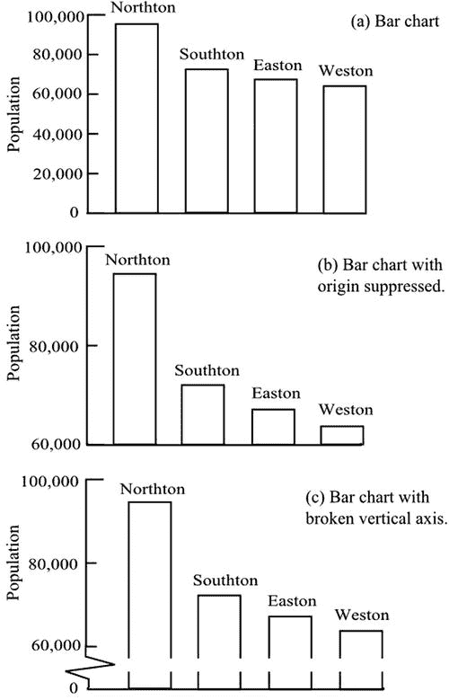
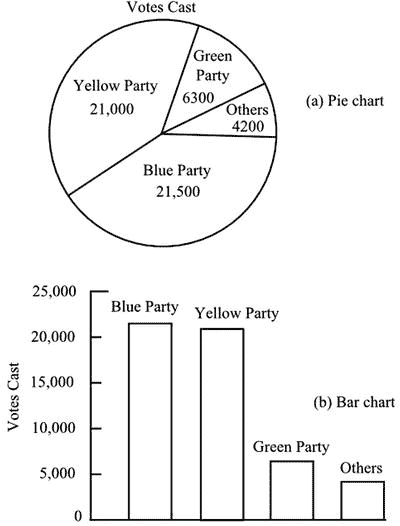
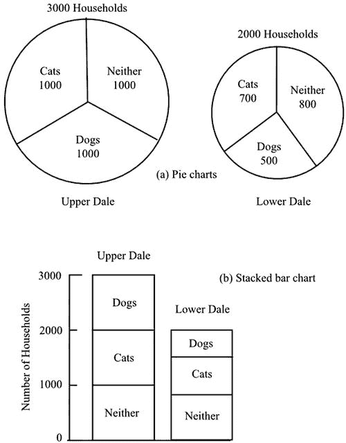
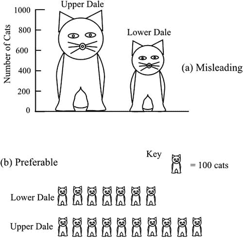
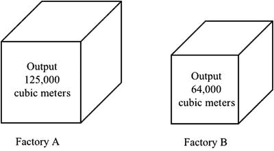
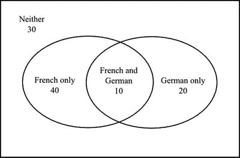
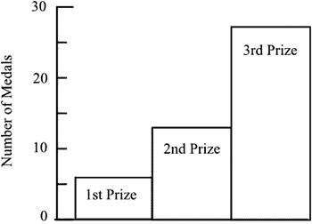

# 六、描述性数据

Not Every Picture Is Worth a Thousand Words

与可用于数值数据的选项相比，描述性数据样本的特征并不多。后者具有数世纪数学发展的优势。在可能的情况下，通常通过简单的计数，描述性的数据被用数字表示。此外，图表的频繁使用提供了简洁的数据摘要，尽管图表在很多方面会误导人。

## 图形表示

名义数据由可以分类和合计的数字组成，这些分类之间没有数字关系。因此，雇主可以根据上班的交通方式对员工进行分组，并使用每组的总数来得出停车场或自行车棚所需面积的结论。

在图 [6-1(a)](#Fig1) 中，四个城镇的人口以柱状图的形式显示。因为类别(城镇)之间没有数字关系，所以条形可以按任何顺序排列。

条形图格式有助于可视化每个类别中的相对数字:眼睛非常敏感，能够发现条形高度之间的小差异，同时吸收大差异。条形图有时以夸大大小条形图之间差异的方式呈现，如图 [6-1(b)](#Fig1) 所示。起源被抑制，给人的印象是诺斯顿的人口比其他人多得多。以这种方式隐瞒来源通常是不可接受的，而且会引起对统计数据背后意图的怀疑。桂格燕麦的广告中使用了这种条形图，表明食用谷类早餐可以降低胆固醇水平(Seife，2010: 35-36)。收到投诉后，该图被撤回。

在认为有必要夸大的情况下——例如，我们可能希望确保伊斯顿的人口明显多于韦斯顿——纵轴以及可能的条形应显示间断，如图 [6-1(c)](#Fig1) 所示。

图 6-1。

Three representations of the same bar chart, showing the visual effects of suppressing the origin and breaking the vertical axis

当需要注意每个类别的相对比例时，饼图比条形图更好。图 [6-2(a)](#Fig2) 显示了一次选举的结果。视觉上给人的印象是每个政党的相对支持度，而不是实际获得的票数。但是，不看数字，不容易看出是黄党还是蓝党赢得了选举。一个条形图，图 [6-2(b)](#Fig2) ，更清晰地显示了谁赢得了选举，但选票比例的印象却丢失了。

图 6-2。

A pie chart and a bar chart representing the same data

由两个或多个饼图组成的图表可能会产生视觉误导。在图 [6-3(a)](#Fig3) 中，显示了两个地区的家庭数量，并将其分为三类:养狗的家庭、养猫的家庭和两者都没有的家庭。饼状图每个扇区的面积代表每个类别中的数量，每个饼状图的总面积代表每个区的总户数。有 3000 户人家的上戴尔的图表面积比有 2000 户人家的下戴尔大 50%。为了获得正确的面积比例，上谷图表的直径仅比下谷图表大 22%。这给了下谷宠物分布的视觉偏见。图 [6-3(b)](#Fig3) 中的堆积条形图更直观地展示了猫和狗的相对数量。

图 6-3。

A pair of pie charts and a stacked bar chart representing the same data

象形图可能更容易误导人。图 [6-4(a)](#Fig4) 显示了上谷和下谷的猫的数量对比。垂直刻度表示猫的数量，因此只有猫的图像的垂直高度是有意义的。然而，因为高的猫也更宽，猫的数量之间的差异在视觉上看起来比实际上更大。图 [6-4(b)](#Fig4) 所示的象形图风格更能体现无偏差。这里用一个猫的小图像来代表每个区的 100 只猫。

图 6-4。

The use of pictograms in charts may be more or less visually misleading, as exemplified in (a) and (b), respectively

在象形图中使用三维图像可能会产生极大的误导。图 [6-5](#Fig5) 显示了两个工厂的产量。从视觉上看，这两者之间似乎没有太大的区别。但是，正如每个工厂的实际立方米数所证实的那样，工厂 A 的产量几乎是工厂 b 的两倍。之所以会产生错觉，是因为尽管两个立方体的体积正确地代表了产量，但是工厂 A 的立方体的边长只比工厂 b 的长 25%。因此:50 × 50 × 50 = 125，000，40 × 40 × 40 = 64，000。

图 6-5。

A misleading visual comparison of the outputs of two factories

当类别重叠时，数据通常用文氏图表示。考虑以下数据。在一个 100 人的小组中，30 人不学习语言，50 人学习法语，30 人学习德语。因此，10 人同时学习法语和德语。图 [6-6](#Fig6) 示意性地显示了数据。封闭区域代表不同的类别，但封闭区域的实际大小并不代表类别中的数字。其目的纯粹是为了说明重叠部分。因此，在查看文氏图时，注意实际的数字并避免从区域的大小得到视觉线索是很重要的。

图 6-6。

Venn diagram showing the numbers of students studying French and German

维恩图在可视化条件概率方面很有用([第 3 章](03.html))。假设我们从图 [6-6](#Fig6) 所示的学生中随机选择一名学生，但指定该学生学习法语的条件。我们唯一感兴趣的学生是左边椭圆中的学生，总共 50 人。如果我们问学生学习德语的概率是多少，我们从重叠区域看到 10 个学生符合要求。所以概率是 10/50 = 0.2。另一方面，如果我们指定学生学习德语的条件，并询问学生学习法语的概率，我们只关心右椭圆。因此概率是 10/30 = 0.33。

对于有序数据，虽然可以使用饼图，但条形图的优势在于允许类别按逻辑顺序排列。图 [6-7](#Fig7) 以条形图的形式展示了一个体育俱乐部获得的奖牌数。

图 6-7。

Bar chart showing the numbers of medals won by a sports club

## 比例

名义数据可以用数字表示，只要每组中的数字可以表示为总数的比例或百分比。因此，图 [6-2](#Fig2) 中的数据得出以下比例:

<colgroup><col> <col> <col> <col> <col> <col></colgroup> 
|   | 蓝色派对 | 黄色派对 | 绿党 | 其他人 | 总数 |
| 投票 | Twenty-one thousand five hundred | Twenty-one thousand | Six thousand three hundred | Four thousand two hundred | Fifty-three thousand |
| 比例 | Zero point four zero six | Zero point three nine six | Zero point one one nine | Zero point zero seven nine | one |
| 百分率 | Forty point six | Thirty-nine point six | Eleven point nine | Seven point nine | One hundred |

通常采用比例或百分比来掩盖所涉及的数字非常小的事实。当被告知一家本地公司有 12%的员工在 70 岁时仍在全职工作时，这听起来可能令人印象深刻，但当你知道这个数字仅代表一个人时，就不那么令人印象深刻了。

与名义数据一样，序数数据可以用比例或百分比来表示。因此，衬衫的销售可以报告为 30%小号，50%中号，20%大号。