# 七、数据

你的统计数据正常吗？

当样本由数字数据组成时，它具有许多可以量化的特征。这些特征可用于总结数据，提供样本来源人群的信息，并表明这些信息的可靠性。此外，如果样本成为进一步研究的一部分，则可以随后使用样本的计算属性。

数字数据样本的一个众所周知的特征是平均值。事实上，我们每天都从媒体和日常谈话中获取平均剂量。但是一个平均值，尽管有其适当的用途，但在孤立引用时可能会产生极大的误导。对数据样本的适当考虑需要关于数据如何分布在一系列值上的信息。

## 图形表示

第 5 章介绍了分布的概念，并使用一组人穿的鞋子的尺寸样本，将分布绘制成条形图(图 5-1)。请注意，条形图覆盖的区域代表数据的总数，因为每个条形的高度代表特定组中的数据数。如果条形图显示为纵轴代表相对频率——即频率除以总数，如图[7-1(a)](#Fig1)——外观完全相同，但是条形图覆盖的总面积现在是一，相对频率相当于概率。因此，我们可以从图表中推断出，从该组中选择一个穿 8 码鞋的人的概率是 0.24。该图可以被称为概率分布。一般来说，当数据是观察或测量数据时，我们使用相对频率作为纵轴的标签。当图表是理论性的或用于确定概率时，我们标记轴概率。

如图 [7-1(a)](#Fig1) 所示的图表，显示相对频率并沿水平轴有一个数字序列，通常被称为直方图。这是为了区别于图 6-1 所示的条形图，图中纵轴表示频率，横轴没有数值。这种做法很受欢迎，也有一些好处，但是直方图这个术语严格地适用于条形图宽度不等的图表。这将在“分组数据”一节中进一步解释。

图 [7-1(b)](#Fig1) 将图 [7-1(a)](#Fig1) 的数据显示为相对频率多边形，术语多边形表示点与直线的连接。

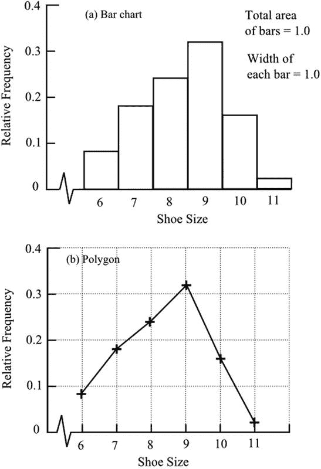

图 7-1。

Relative frequency shown as (a) a bar chart and (b) a polygon

这种数据可以表示为累积值。鞋号数据在下面扩展到包括累积频率、累积相对频率和累积百分比。

<colgroup><col> <col> <col> <col> <col> <col></colgroup> 
| 鞋码 | 频率 | 累积频率 | 相对频率 | 累积相对频率 | 累积百分比 |
| --- | --- | --- | --- | --- | --- |
| six | four | four | Zero point zero eight | Zero point zero eight | eight |
| seven | nine | Thirteen | Zero point one eight | Zero point two six | Twenty-six |
| eight | Twelve | Twenty-five | Zero point two four | Zero point five | Fifty |
| nine | Sixteen | Forty-one | Zero point three two | Zero point eight two | Eighty-two |
| Ten | eight | forty-nine | Zero point one six | Zero point nine eight | Ninety-eight |
| Eleven | one | Fifty | Zero point zero two | One | One hundred |

图 [7-2](#Fig2) 以(a)条形图和(b)多边形的形式显示了累积频率。

上述数据是离散的，但如果数据是连续的，累积频率图可以包含比相应的频率条形图更多的信息。为了看到这一点，假设我们没有记录每个志愿者穿的鞋子的尺寸，而是测量了他的脚的长度。以厘米为单位测量并按大小顺序排列的数据可能如下:

第一组 22.1、22.3、22.9、23.7

第二组 24.2、24.4、24.6、24.6、25.1、25.4、25.5、25.8、25.9

第三组 26.0，26.3，26.4，26.6，26.7，26.9，27.0，27.3，27.5，

27.8, 27.8, 27.9

第四组 28.1，28.1，28.2，28.2，28.4，28.5，28.5，28.7，28.8，

28.8, 28.9, 29.1, 29.3, 29.6, 29.8, 29.9

第 5 组 30.0、30.2、30.5、30.6、30.7、31.0、31.4、31.8

第六组 32.1

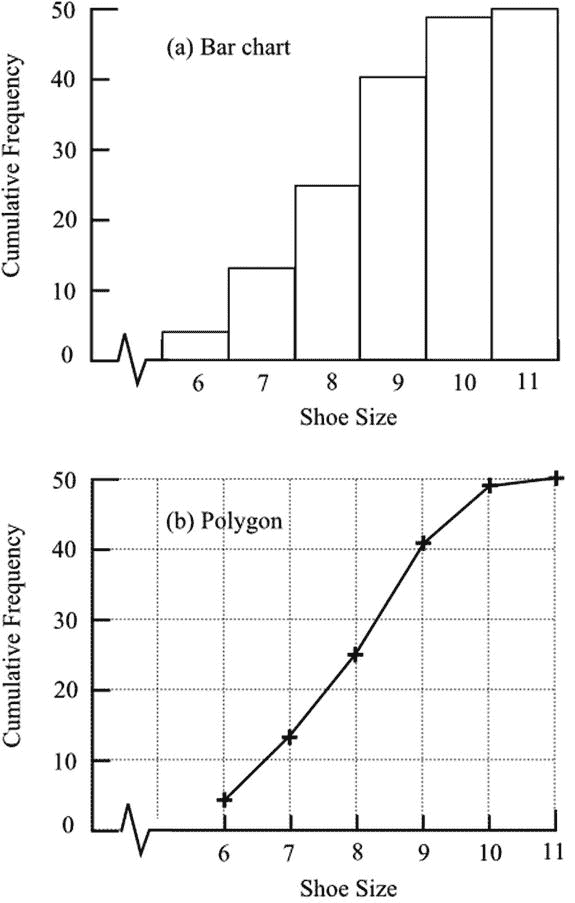

图 7-2。

Cumulative frequency shown as (a) a bar chart and (b) a polygon

当绘制成条形图时，数据必须分组。例如，如上所示，这些组可以是 22.0 到 23.9、24.0 到 25.9、26.0 到 27.9 等等。图 [7-3(a)](#Fig3) 显示了生成的条形图。在每个组中，单个值变得彼此相等，每个值都构成组中值的总数。从条形图中无法知道每个组中的单个值是多少。相比之下，可以使用每个值绘制累积频率图，如图 [7-3(b)](#Fig3) 所示。当数据是连续的时，通常会画出一条平滑的曲线，这种曲线通常被称为卵形曲线。当纵轴是累积相对频率或累积概率时，曲线的形状保持不变，但该图可称为累积分布函数或简称为分布函数。

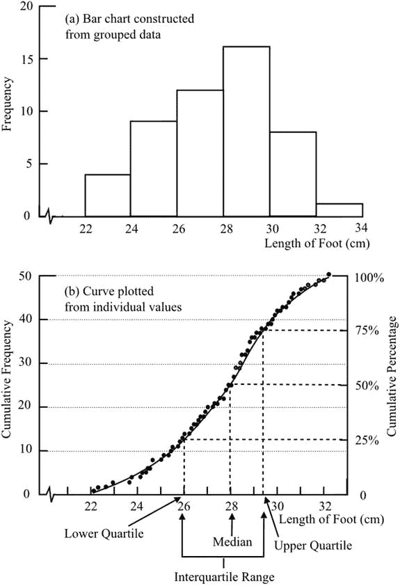

图 7-3。

Frequency and cumulative frequency shown as (a) a bar chart constructed from grouped data and (b) a curve plotted from individual values

数据集通常表现出围绕一个中心值聚集的趋势，如图 [7-3(a)](#Fig3) 所示。正如我们所料，小尺寸或大尺寸相对较少。大多数都接近群体的平均规模。当数据集中聚类时，累积频率图具有典型的 S 形，如图 [7-3(b)](#Fig3) 所示。该图还提供了一种确定中间值的便捷方法，如图 [7-3(b)](#Fig3) 所示。四分位数，即数值的四分之一和四分之三，经常在统计结论中引用，也显示出来。四分位数范围包括数据的中间一半。

如果我们有一个柱形图，峰值在数据的低端，这个分布被称为正偏态分布。预计家庭收入将属于这种类型，峰值出现在远低于中点值的位置(图 [7-4(a)](#Fig4) )。当分布的峰值朝向数据的高端时，分布是负偏的。如果我们观察人们死亡时的年龄，我们预计会看到负向分布，大多数人都是在老年死亡的(图 [7-4(b)](#Fig4) )。

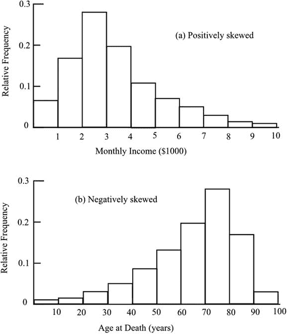

图 7-4。

(a) Positively and (b) negatively skewed distributions

## 正态分布数据

幸运的是，在统计术语“正态分布”中,“正态”一词确实带有“经常遇到”或“每天发生”的传统含义。然而，用几句话来概括正态分布数据这一重要概念的含义并不容易。

正态分布的数据集中聚类且对称，即不存在正负偏差。然而，它们的特殊之处在于，其分布在所包含的值的范围内变化。

人的身高和体重呈正态分布。假设我们测量一小部分人的身高，比如说 20 岁。我们可以用组宽为 8 cm 的条形图来表示数据，如图 [7-5(a)](#Fig5) 所示。围绕平均值的中心聚类被清楚地示出，但是数据以相对于总宽度的宽步长非常粗略地呈现。如果我们决定将组宽度减少到 4 cm，以尝试改善表示，我们可能会得到图 [7-5(b)](#Fig5) 。因为我们现在每组的数据都很少，所以条形图开始失去形状。

如果我们现在考虑有更大的样本，我们可以减少组的宽度，并且在每个组中仍然有足够的数量以可靠的方式代表高度的分布。图 7-5(c) 显示了当样本量为 10，000，组宽为 2 cm 时，我们可能得到的结果。条形图现在有了更平滑的轮廓。将该过程扩展到更大的样本量和更窄的组宽度，最终得到一条平滑的曲线，叠加在图 [7-5(c)](#Fig5) 的条形图上，这是正态分布。该曲线也称为高斯曲线，具有典型的钟形。它有一个精确而复杂的数学公式来精确地定义它。当然，它不是以我可能暗示的方式从条形图中推导出来的:通过条形图的描述对于提供正态分布的意义的简单而正确的视图是有用的。

就像在条形图中一样，每个组中的数据数量由相应的垂直条的面积来表示，在正态分布曲线下定义的任何垂直条代表位于条的水平界限之间的数据的相对数量。因此，条带内数据相对于数据总数的比例等于条带内面积相对于曲线下总面积的比例。此外，这个比例等于一个人的概率，从总数中随机选择，有一个高度位于带的限制。

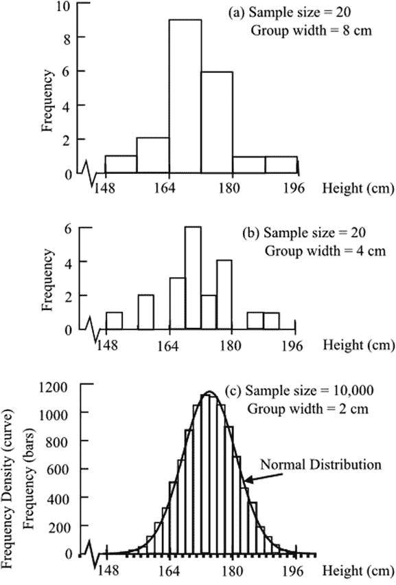

图 7-5。

Distributions of heights of men

从图 [7-5(a)](#Fig5) 中的条形图进展到图 [7-5(c)](#Fig5) 中的连续曲线，需要改变垂直轴的标记。对于条形图，标签是频率。假设条形宽度在整个图中是恒定的，轴上的刻度将总是允许我们读出频率。然而，一旦我们用一条平滑的曲线代替一组条，我们就不能再读出频率:频率将取决于我们选择的条的宽度。轴标为频率密度。

显然，每组数据在横轴上的数值和纵轴上的频率方面都有自己的标度。但是如果数据遵循正态分布，曲线的形状将是相同的。为了利用正态分布分析数据，标准正态分布如图 [7-6](#Fig6) 所示，其峰值位于水平轴上的零处。因此，曲线在正负方向上对称延伸。水平刻度在本章的“数据分布”一节中解释。调整垂直刻度，使曲线下的总面积为 1。任何垂直条带的面积直接表示该条带内值出现的概率。任何一组符合正态分布的数据都可以通过改变尺度简化为标准的正态分布，这将在以后的数据分析中进行讨论。

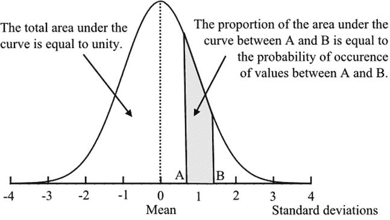

图 7-6。

The standard normal distribution

每当数据的变化是由许多随机效应引起时，就会产生这种特征曲线。这种影响可能是被测量的属性所固有的，如在被采样的人的身高的例子中，但是在其他情况下，这种影响可能是由于测量方法中的误差。对珠穆朗玛峰高度的重复测量有望给出围绕一个中心值的数据聚类的正态分布。人们发现，正态分布出现在许多数据收集的情况下，并在随后的统计分析中广泛使用。当然，还会遇到其他特殊的分布，我将在后面的章节中描述其中的一些。

符合正态分布的数据示例分为几类。第一类是存在真实值，并且样本由该值的估计值或测量值组成，这在某种程度上不可避免地是不准确的。不准确是由观察或测量方法中的随机误差引起的。对纯铜密度、各种化学和物理常数的重复测量，或者对世界海洋中水量的估计，都属于这一类。

第二类是试图生产在尺寸和重量等性质上一致的产品。由于材料或制造工艺的随机波动，每件商品都略有不同。许多项目的测量值将遵循正态分布。

第三类包括正确的数据(当然，在一定的测量误差范围内)，但实际上非常不同。也就是说，观察到的差异不是由于测量或制造的小误差，如前两类，而是反映了它们本质上的差异。然而，这些值表现出围绕中心值聚集的趋势-偏离越大，偏离大于或小于中心值的可能性就越小。这类数据的例子有人的身高和体重、考试分数和智商。这一类别与前一类别之间的比较提出了一个有趣的问题。这就好像自然过程试图生产出同样的东西，就像我们在工厂里做的那样，但由于随机误差而不太成功，就像我们不太成功一样。从这个角度来看，第二类和第三类在某种意义上是相同的。

第四类包括理论上符合非正态分布的数据，但在某些情况下，可以很好地用正态分布来表示。通常，当样本很大时，我们会找到最接近正态分布的近似值。

正态分布能够表示不完全符合分布理论要求的数据，这有助于使其在统计学中发挥主要作用。当然，在现实中，没有一组数据是完全一致的。理论分布在两个方向上逐渐变小至无穷大，表明总是有可能观察到任何大小的值，尽管可能性很小。实际上，这是不可能的，不仅因为最大值的实际限制，而且因为低值尾部受零值的限制。负值在大多数情况下是没有意义的。

## 分布类型

一个数据样本可以简单地通过检查被判断为某种特定类型的分布或大致如此。数据可以被视为近似正态分布，围绕一个中心值聚集，很少有极值。例如，其他数据集可能看起来是均匀分布的，没有集中聚集的迹象。

可以在数据和假设的分布之间进行比较，从而提供数据属于该分布的可能性的度量。这种比较被称为拟合优度检验。

数据按顺序排列，并根据假定的分布计算相应的值。例如，我们可能有数据显示一周中不同的几天有多少员工上班迟到，我们希望检验这一假设，即上班迟到的人数与一周中的哪一天无关。如果假设是正确的，数据的分布应该是均匀的:也就是说，在可能的随机波动范围内，不同天的数字应该是相同的。因此，我们列出了预期数据，每个值都是实际数据的平均值:

<colgroup><col> <col> <col> <col> <col> <col></colgroup> 
| 一天 | 迟到的人 | 预计晚点到达 | 差异 | 差值平方 | 差值平方除以期望值 |
| --- | --- | --- | --- | --- | --- |
|   |   | e | d | d 2 | d 2 /e |
| 星期一 | Twenty-five | Twenty-four | one | one | 1/24 |
| 星期二 | Sixteen | Twenty-four | –8 | Sixty-four | 64/24 |
| 星期三 | Eighteen | Twenty-four | –6 | Thirty-six | 36/24 |
| 星期四 | Twenty-eight | Twenty-four | four | Sixteen | 16/24 |
| 星期五 | Thirty-three | Twenty-four | nine | Eighty-one | 81/24 |
| 总数 | One hundred and twenty |   |   |   | 198/24 = 8.25 |
| 平均值= 24 | 自由度= 4 |

计算两组之间的差异。根据这些差异的平方，确定一个称为卡方的统计量，χ 2 (希腊字母 chi)。在本例中，卡方= 8.25。你会意识到，如果数据与预期数据完全一致，将会得到零值。所以数值越大，分布越有可能不均匀。将获得的值参考卡方分布表，以获得依赖于一周中某一天的概率，而不是受随机波动影响的实际迟到人数。以下是卡方分布表的摘录:

<colgroup><col> <col> <col> <col> <col></colgroup> 
| 自由度 | 10%显著性 | 5%显著性 | 1%显著性 | 0.1%显著性 |
| --- | --- | --- | --- | --- |
| one | Two point seven one | Five point zero two | Six point six four | Ten point eight |
| Two | Four point six one | Five point nine nine | Nine point two one | Thirteen point eight |
| three | Six point two five | Seven point eight two | Eleven point three | Sixteen point three |
| four | Seven point seven eight | Nine point four nine | Thirteen point three | Eighteen point five |
| five | Nine point two four | Eleven point one | Fifteen point one | Twenty point five |

在这个例子中，我们从表中发现，对于 4 个自由度(见上文)，8.25 位于 10%和 5%显著性的值之间。因此，如果我们声称迟到的人数确实取决于一周中的某一天，那么我们有超过二十分之一(5%)的可能性是错误的。这种说法是不可靠的。图 [7-7](#Fig7) 显示了数据的分布，以及为了比较，假设的均匀分布。

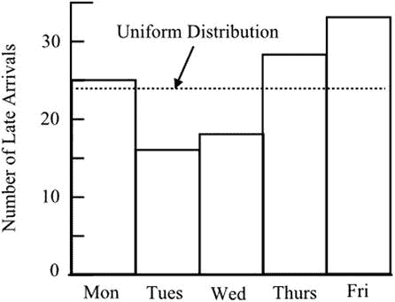

图 7-7。

Comparison of an observed distribution and a supposed uniform distribution

对于非均匀期望分布，所需的期望值必须从表中获得。例如，为了测试数据是否符合正态分布，可以从正态分布的表中获取值。然后，计算将如上进行，实际值和预期正态分布值之间的差被平方并求和。

我需要解释自由度这个术语，我在上面说过，自由度是数据的一个特征，是从公布的表格中获得显著性水平所必需的。从某种意义上说，所指的自由是与众不同的自由——我认为，这是理解自由度含义的一种有用方式。如果我们的数据只包含一个值，那么就没有差异，也没有变化或不确定性的度量。如果我们有两个值，那么就有一个差异的度量，那就是两个值之间的差异。因此，我们有一个基于单一差异的变化度量，我们称之为一个自由度。

有三个值(a、b 和 c)时，有两种变化度量:a–b 和 b–c。请注意，a–c 不是变化的进一步度量，因为它的值由其他两个差异决定。因此我们有两个自由度。有了四个值，我们就有了三个自由度，依此类推。

上述示例中的自由度显示为四个。实际上有五个差异——也就是说，五个每日数值中的每一个与数字 24 之间的差异。然而，值 24 是通过确保实际值和期望值的总和相同而从五个每日值中获得的。这个限制去掉了一个自由度，剩下四个。当选择非均匀分布进行比较时，自由度可能会进一步减少。当必须从原始数据中计算假设分布的附加特征时，就会出现这种情况。

各种统计检验被标准地用于确定数据估计值的可靠性，或者数据集之间存在差异或相似性的可能性。在这些测试中，使用了公布的表格，这些表格通常要求输入适当自由度的数据。

卡方检验也可以显示与假设分布惊人地一致的证据。对太好的协议应该持怀疑态度。数据是真的吗？一些数据被删除了吗？

还有其他的拟合优度测试。似然比测试产生一个统计量，G 2 ，类似于χ 2 。Kolmogorov-Smirnov 检验同样基于观测数据和假设分布的预期数据之间的差异。

## 平均水平

从数学的角度来看，单词 average 通常指的是平均值——一个集合中所有数据的总和除以数据的数量。平均值表示一个中心值，其他值围绕该中心值排列。这是一个有用的数据汇总，特别是当数据的性质表明存在中心聚集效应时。正如我们之前说过的，人们的身高或体重应该集中在平均值附近，相对来说，很少有人有极端的、大的或小的身高或体重。“正态分布数据”一节中对正态分布的描述认识到了峰值(即平均值)的对称性。

在没有聚类的情况下使用平均值会产生误导，而且在某些情况下毫无意义。但并不总是这样:当骰子被重复掷出时，分数没有显示出中心聚类，六个可能的分数中的每一个都大致相等地出现，但平均分数在允许估计给定次数的投掷后的总分数时是有用的。因此，平均值是(1+2+3+4+5+6)/6 = 3.5——所以，比方说，10 次投掷的总数大约是 35。

统计学家用期望这个词来表示预期的平均值，而不是实现的平均值。所以如果我们投掷骰子多次，期望值是 3.5。实际达到的平均值可能接近 3.5，但是可以是 1 到 6 之间的任何数字。

在统计数据中，还有两种常用的平均数:中位数和众数。“图解表示”一节中描述的以及图 [7-3](#Fig3) 中显示的中值是按大小排序的数据的中间值，因此一半数据小于中值，一半数据大于中值。众数是最常见的值，即数据中出现频率最高的值。样本中可能有一个以上的模式，而平均值和中值具有唯一的值。

使用哪个平均值取决于数据的性质。使用不适当的平均值会扭曲获得的印象。如果我们看每个家庭的平均孩子数量，计算平均值可能会给出一个非整数值，比如 2.23。虽然没有一个家庭有 2.23 个孩子，但这个值可能非常有用，因为给定家庭总数，它将允许我们计算出孩子总数的最佳估计值。中位数可能在 2 到 3 之间，告诉我们一半的家庭有 2 个或更少的孩子，一半的家庭有 3 个或更多的孩子，这不是非常有用的信息。该模型的值可能为 2，至少会告诉我们这些家庭比其他任何数字更有可能有 2 个孩子。

如果我们看家庭收入，我们会有不同的考虑。平均收入可能是，比方说，每年 50，000 美元。然而，数据中会有一些非常高的收入者，他们的收入是平均水平的三至四倍。大多数家庭的生活水平都远低于平均水平。因此，存在一种可能产生误导的向上偏置效应。如果我们算出中间值，我们可能会发现这个值是 40，000 美元，表明一半家庭的收入低于这个数字。如果我们想知道模式是什么，我们会发现因为收入有连续的值(当然不会比一便士更细)，没有足够的家庭，或者可能没有，有相同的收入值。这可以通过对数据进行四舍五入或者更好地对数据进行分组来解决。这可能会给我们一个答案:最常见的家庭收入在 35，000 美元到 40，000 美元之间。

随着数据更加精确地符合正态分布，平均值、中值和众数会更加接近。随着分布变得正偏，众数移动到平均值以下；当它变成负偏态时，它移动到平均值以上。中位数通常位于众数和平均数之间。

选择不适当的平均值会对数据的含义产生错误的印象，而且通常是出于误导的目的。当没有指定所使用的平均值类型时，情况会变得更糟。寓意是警惕未指定类型的平均值，即使声明引用了平均值、中值或众数，也要探究根据其他平均值查看结果的后果。

## 数据的传播

平均值非常有用，但是没有给出从中得出平均值的值的分布。不可能对基于平均值的决策的有效性做出任何判断。任何引用的平均值都应附带一些数据分布的指示。

最大值和最小值，以及它们之间的差异，后者被称为范围，很容易引用，但用途有限。它们没有给出关于样本中单个值如何分布的信息。当然，如果有人想知道要运输的最重包裹的重量或溜冰场提供的最小尺寸的溜冰鞋，那么这些信息可能是有用的。

本章第一节和图 [7-3](#Fig3) 中描述的四分位数具有更广泛的用途。下四分位数或 25%被定义为四分之一的数据位于其下方，四分之三的数据位于其上方。上四分位数或 75%占据相应的位置，四分之一的数据位于其上，四分之三的数据位于其下。四分位数范围是两个四分位数之间的差值，因此包含中间的 50%的数据。有时会引用其他百分位数:例如，90 个百分位数包含了较低的 90%的数据。

衡量数据分布的最有用的方法是标准差。这是使用样本中的所有数据计算的。每个数据值与平均值的偏差对标准偏差有贡献，但是通过平方该值，每个偏差被有效地加权，以对较大的偏差给出较大的贡献。将所有偏差的平方相加，并计算平均值。这个平均值的平方根就是标准差。

例如，假设我们有以下不太可能但很容易看到的值:

2  3  4  4  5  5  6  6  7  8

平均值是 50/10 = 5。

每个值与平均值的偏差为

–3  –2  –1  –1  0  0  1  1  2  3

偏差的平方是

9  4  1  1  0  0  1  1  4  9

偏差的平方平均值为 30/10 = 3，标准偏差为 3 的平方根，即, 1.73.

标准差对于正态分布有特殊的意义。它是特定高度处正常曲线宽度的一半。其位置使得低于平均值的一个标准偏差和高于平均值的一个标准偏差之间的曲线下面积是曲线下总面积的 0.683。因此，68.3%的数据位于平均值的一个标准偏差内。平均值两侧的两个标准差包括 95.4%的数据，三个标准差包括 99.7%的数据。当引用平均值和标准偏差时，这些图提供了一种非常有用的快速方法来可视化数据的分布。在上面的例子中，平均值两边的一个标准偏差是从 3.27 到 6.73，我们的数据的 60%(10 个值中的 6 个)在这个范围内。

前面的讨论完成了“正态分布数据”一节中介绍的标准正态分布的描述，如图 [7-8](#Fig8) 所示。平均值是中心峰值，位于水平轴上的零值处，曲线下的面积等于 1，现在水平轴上的刻度以标准偏差为单位。垂直刻度是概率密度，但它不是直接感兴趣的，因为水平刻度以标准偏差为单位，所以选择垂直刻度是为了使曲线下的面积等于 1。

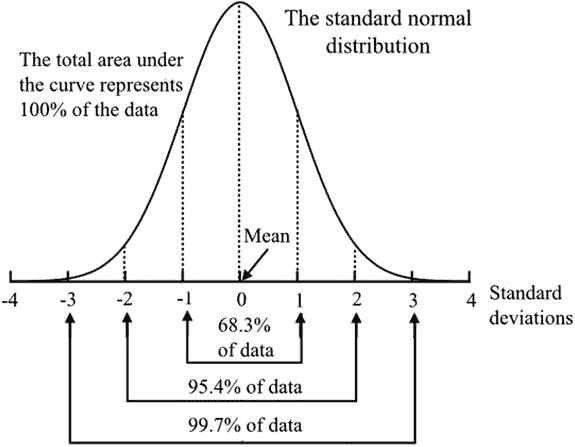

图 7-8。

The percentage of data within a number of standard deviations from the mean

标准差的平方称为方差。由于它的特殊性质，在统计分析中被广泛使用，这将在后面讨论。它没有显而易见的意义:事实上，它的单位相当奇怪。如果我们的标准差恰好是以美元为单位的，那么方差就是以美元的平方为单位的——或者，如果你愿意，也可以是平方美元(不管它们是什么！).

即使数据不完全符合正态分布，标准差仍然提供了数据分布的有用度量。为了说明这一点，考虑我们通过投掷骰子可能积累的数据。因为从 1 到 6 的所有数字出现的机会都是相等的，所以我们期望得到几乎相同的分数。数据将符合均匀分布，条形图将是平顶的，看起来一点也不像正态分布。平均分 3.5，计算标准差 1.87。因此，我们预计大约三分之二的分数会在 1.63 到 5.37 之间。其实三分之二的分数在 2 到 5 之间，大致一致。

统计表给出了标准正态分布曲线下距平均值不同距离处的面积值。曲线下的总面积定义为 1，因此部分面积显示为 0 和 1 之间的分数，并直接表示所需范围出现的概率。这些桌子不是特别容易使用。因为曲线是对称的，所以表格只给出了分布的一半，即正的右边的一半。从所需精度水平所要求的表格的范围来看，经济是合理的，但这确实意味着当要求用延伸到平均值两侧的面积来表示概率时，必须相当小心。

图 [7-9](#Fig9) 以更简单、更简洁的形式显示了标准正态分布的值，这种形式更便于获得近似值以及检查申报值是否存在重大误差。为了节省空间，这些值只有两位数；并且它们以百分数给出，这比通常使用的小数更容易理解。此外，任何两个极限之间的概率可以立即读取，而公布的表格要求提取两个极限的单独值，然后计算差值。

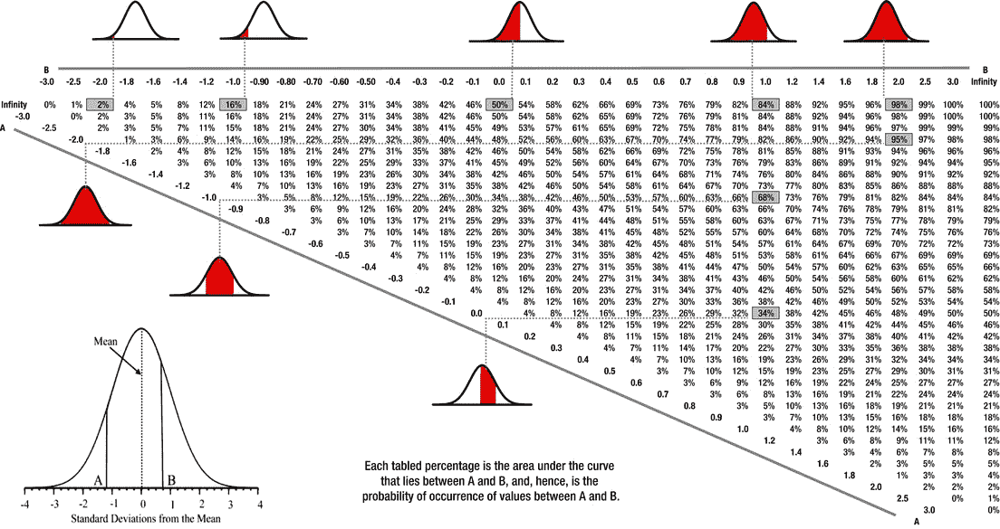

图 7-9。

Tabulated probabilities of occurrence of normally distributed values between lower and upper limits

需要强调的是，发生的概率是用面积来表示的。我们要求两个值之间出现的概率。我们不能要求观察到一个独特值的概率。在前面的身高例子中，我们不能要求一个成年人正好 160 厘米高的概率。这将是正态分布图上的一条垂直线，不包含任何区域。答案是，没有一个成年人身高正好是 160 cm 的概率。如果乍一看这似乎很奇怪，请注意使用了“完全”一词。我们可以问一个成年人身高在 159.5 和 160.5 厘米之间，159.9 和 160.1 厘米之间，或者任何其他更接近的极限之间的概率。这些窄条将具有代表所需概率的面积。面积会很小，因此产生的概率也会很小。这是完全合理的，因为找到一个高度精确定义的人的概率确实很小。

发生的概率可以用比例来表示。因此，如果身高在 159.5 厘米和 160.5 厘米之间的成年人出现的概率是 0.1，那么可以说身高在 159.5 厘米和 160.5 厘米之间的成年人的比例是 0.1，或者十分之一，或者十分之一。

## 分类资料

数据往往不详细，但一开始就分组。例如，可以从不同年龄的许多人那里收集信息，但是年龄可能没有被记录或者甚至没有被单独获得，而只是简单地分类在带内。波段必须仔细定义，并同样仔细理解。

我们可能有每十年一次的乐队。如果我们定义一个从 20 岁到 30 岁的范围，下一个范围是 30 岁到 40 岁，我们不知道 30 岁的人属于哪个组。为了避免这一问题，我们必须将 20 年至 29 年和 30 年至 39 年定为一个区间。如果数据不是离散的，就必须采用不同的程序。人的身高不断变化，所以我们不能有，例如，一组 130 厘米至 139 厘米，然后一组 140 厘米至 149 厘米。139.5 cm 无处定位。这些组必须是“等于或大于 130 厘米且小于 140 厘米”，后跟“等于或大于 140 厘米且小于 150 厘米”这些名称相当拗口，通常用数学符号表示为≥130 至< 140，然后是≥140 至< 150。

如果为该组引用单个代表值，则通常是该组宽度的中点。但是，请注意，如果值被四舍五入，中点可能不在看起来的位置。如果组是 10 到 19，并且值已经四舍五入为最接近的整数，则该组实际范围是从 9.5 到 19.5。中点是 14.5。但如果组≥10 到< 20，则中点为 15。

有时这些组的宽度不相等。这可能是因为抽样的不均匀性，或者仅仅是因为在某些波段内确实缺乏数据。例如，人的年龄在 80 到 100 岁之间比在 20 到 40 岁之间分布得更稀疏。请注意，发生这种情况时，条形图上每个块的面积仍必须表示指定范围内数据值的总数。以下数据可以绘制成相对频率条形图，如图 [7-10(a)](#Fig10) 所示:

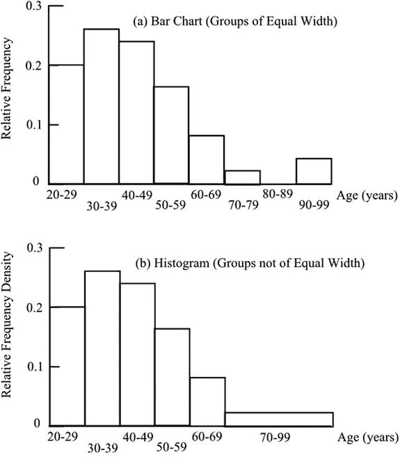

图 7-10。

The difference between (a) a bar chart and (b) a histogram

<colgroup><col> <col> <col> <col> <col> <col> <col> <col> <col> <col></colgroup> 
| 年龄范围(岁) | 20 到 29 岁 | 30 至 39 岁 | 40 至 49 岁 | 50 至 59 岁 | 60 至 69 岁 | 70 至 79 岁 | 80 到 89 岁 | 90 到 99 | 总数 |
| --- | --- | --- | --- | --- | --- | --- | --- | --- | --- |
| 频率 | Ten | Thirteen | Twelve | eight | four | one | Zero | Two | Fifty |
| 相对频率 | Zero point two | Zero point two six | Zero point two four | Zero point one six | Zero point zero eight | Zero point zero two | Zero | Zero point zero four | One |

这些组的宽度相等。每个人代表 0.02 的面积，因此 50 个人的总面积为 1.00。分布的尾端不均匀；为了避免这种情况，可以将数据集中在更大的组中，如图 [7-10(b)](#Fig10) 所示。最后一个组只有三个成员，因此高度为 0.02，以使最后一个块的面积等于 0.06 个单位。请注意，我们现在不能将轴标记为相对频率，因为最后一组(70 到 99 年)的实际相对频率为 0.06。正确的名称是相对频率密度，如图所示。

我现在可以解释条形图和直方图之间的区别。条形图代表离散的数据或离散的数据组，并且这些组都具有相同的宽度。纵轴代表频率或相对频率，后者相当于概率。在直方图中，也表示离散的数据组，这些组的宽度并不相同。纵轴代表频率密度或相对频率密度，后者相当于概率密度。直方图上的纵轴不代表概率:它是代表数据在组的界限内的概率的块的面积。因此，直方图类似于连续数据曲线，如关于正态分布所解释的，其也被标记为概率密度，并通过曲线下的面积来指示概率。

## 汇集和加权

几组数据可以放在一起提供一个集合平均值。混合值更具代表性，因为它基于更多的观察。

在汇总结果时，为了让某些值对最终结果有更大的影响，加权平均值通常更合适。有时，这对于避免结果出错至关重要。例如，如果我在一家商店买了 10 个苹果，每个 20 美元，在另一家商店买了 4 个苹果，每个 24 美元，那么每个苹果的平均成本显然不是 22 美元。合适的指标是加权平均数，即支付的钱总数除以购买的苹果总数——即(20 × 10 + 24 × 4) / (10 + 4) = 21.1。

加权的必要性并不总是那么明显。我汽车前轮的轮胎比后轮的磨损得快得多。我的后轮跑了 45，000 英里，但前轮只跑了 15，000 英里。所以，平均来说，我的轮胎跑了 30，000 英里，也就是(45，000 + 15，000) / 2 英里。这是不正确的。在 45000 英里中，我会磨掉 1 对后轮胎和 3 对前轮胎，一共 4 对，所以一个轮胎平均续航(45000×1+15000×3)/4，也就是 22500 英里。

有时，对权重的需求似乎非常令人惊讶。假设你定期乘公共汽车。公共汽车预定每 10 分钟到达一次，所以这是公共汽车之间的平均时间；但有些会早，有些会晚。如果你随机到达公共汽车站，你的平均等待时间是多少？乍一看，答案似乎是五分钟，但这是不正确的。你更有可能到达一个较长的间隙，而不是较短的间隙，所以你的等待时间会比五分钟稍长。

一个简单的例子可以说明这一点。想象两辆公共汽车:一辆在前一辆后 12 分钟到达，第二辆在 8 分钟后到达，所以平均到达时间是 10 分钟。当你在 12 分钟的间隙到达时，你的平均等待时间是 6 分钟；当你在 8 分钟的间隙到达时，你的平均等待时间是 4 分钟。较长的等待时间比较短的等待时间更常见，比例为 12 比 8，因此总平均等待时间必须通过加权获得:

(6 x12 + 4 x 8)/20 = 5.2 分钟。

在这样的例子中加权是必要的，并且可以明确地应用，但是加权有时可能是判断的问题。如果以前已经进行过几次类似的调查，可以断定其中一些虽然有价值，但由于使用的技术，不如其他的可靠。因此，不太可靠的结果与其他结果合并在一起，但给予较低的权重。在下面的计算中，珠穆朗玛峰高度的三个估计值——h1、h 2 和 h3——合并在一起，但是 h 3 的权重只有另外两个的一半:

合并估算=(2h1+2h2+h3)/5。

第 5 章将简单指数描述为，实际上，百分比指的是一个选定的基值。许多经常遇到的指数是从更复杂的计算中得出的，因为这些值是几个项目的平均值。因此，英国零售价格指数是基于特定日期各种商品的价格，这些商品的价格是平均的。不同商品的购买量不同，所以平均价格必须通过加权平均购买量来获得。显然，一条 1 英镑的面包和一升 6 英镑的葡萄酒不能简单地平均计算。如果每 35 条面包买两瓶酒，我们把两瓶酒的价格，12，加到 35 条面包的价格，35，然后把结果除以 37，总数。因此加权平均价格为(35 x 1 + 2 x 6)/37 = 1.27。当然，即使是最初的价格，1 和 6，也必须通过平均来获得，考虑到不同的类型、不同的品牌和不同的商店。

零售价格指数包括确定要列入的商品清单，以及在规定的时间在规定的商店记录价格的严格程序。商品根据类型分组，因此可以为不同的商品组计算指数。例如，总体指数是由代表家庭用品、食品、住房和其他组的组指数构成的。家庭用品指数是由代表家庭消费品、家具和其他部分的部分指数构成的。家庭消耗品部分指数由代表信封、卫生纸和其他物品的物品指数构成。信封的项目索引由在指定位置的指定商店中购买的指定类型的项目构成。零售价格指数中总共有大约 700 种商品。

当实际购买数量被用来确定用于平均的权重时，仍然需要选择是在基准年购买的数量还是在当年购买的数量。使用基年数量得出的指数被称为拉斯佩尔指数。包含当年数量的指数是一个 Paasche 指数，在确定时显然需要更多的时间和费用。

例如，假设我们有以下基准年的数据:

每条面包 1 个相对数量 35 个面包

葡萄酒每瓶 6 相对数量 2 瓶。

我们需要指数的下一年的数据如下

每条面包 1.20 英镑相对数量 35 条

葡萄酒每瓶 8 个相对数量 1 瓶。

使用基准年数量的拉斯佩耶尔指数计算如下:

1x35 = 35 1.20x35 = 42

6x2 = 12 8x2 = 16

总计 47 总计 58

指数= (58 / 47) × 100 = 123。

使用当年数量的 Paasche 指数计算如下:

1x35 = 35 1.20x35 = 42

6x1 = 6 8x1 = 8

总计 41 总计 50

指数= (50 / 41) × 100 = 122。

这两个指数非常相似，除非数量每年有明显的变化。Paasche 指数的一个缺点是不同年份的指数不能相互比较，只能与基准年比较。拉斯佩尔斯指数允许在任何两年之间进行比较。英国零售价格指数是一个拉斯派尔斯类型的指数，但它的衍生在许多方面进行了修改。其他众所周知的指数是那些说明股票价格的指数，如富时 100 指数和道琼斯指数，以及各种住房价格指数。

警惕汇集的数据，它们显然会显示出完全不同的结果。合并可能是为了掩盖一组令人尴尬的数据。考虑下面的例子。

一家公司有两个新销售员，史密斯和布朗。在第一周，史密斯通过 40 个联系人做了 5 笔生意，平均每 8 个联系人就有一笔生意。布朗从 10 个联系人中做成了一笔交易。所以史密斯有最好的平均值。这种情况如图 [7-11](#Fig11) 所示。在第二周，Smith 从 10 个联系人中完成了 3 笔销售，平均每 3.33 个联系人中就有一笔销售。布朗通过 40 个联系人做了 10 笔交易，平均每 4 个联系人就有一笔交易。所以史密斯又有了更好的平均值。

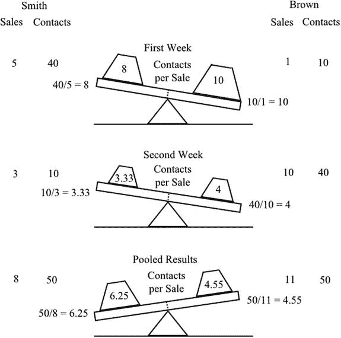

图 7-11。

Simpson’s paradox

但是如果我们把两个星期的结果汇总起来会怎么样呢？Smith 有来自 50 个联系人的总共 8 笔销售，而 Brown 有来自 50 个联系人的总共 11 笔销售。所以布朗有更好的平均值。谁是更好的推销员？有些人可能会认为史密斯更好，因为他在两周内对公司的业绩做出了更大的贡献。其他人可能会说布朗更好，因为当更多的数据可用时，他的更好的表现就会显现出来。最现实的结论是，没有足够的证据来区分它们。他们自己在两周内的表现之间的差异大于他们自己和他们同事的表现之间的差异。此外，可能有一个或多个变量影响这两个星期的条件，其中没有考虑。

这种情况被称为辛普森悖论，通常会令人惊讶。除了它的好奇价值，它确实很好地说明了一个事实，即统计结果不应该盲目接受，而应该总是与其他证据和实际考虑因素一起判断。

FOOD FOR THOUGHT

顾问的报告放在桌子上。莫罗尼饼干公司的食品加工主管利兹·费希尔拿起它开始阅读。该公司决定推出一种新的低糖饼干，利兹的团队制作了两种配方，这两种配方都被认为是适销对路的。

在决定哪种饼干将投入生产之前，格雷厄姆咨询公司已经被雇佣在公众面前测试这两种新型饼干。

报道描述了两家已经在卖莫罗尼饼干的商店，如何在一个繁忙的下午各设两个摊位。一个摊位，处理配方 A，给每个愿意的顾客提供一个样本饼干，然后邀请顾客以优惠价格购买一包。第二个摊位用配方 b 的饼干做了同样的事情。顾客不知道这两个摊位提供不同的饼干。记录品尝饼干的顾客数量和购买一包饼干的顾客数量。

报告得出结论，配方 A 在两家商店都比配方 B 更受欢迎，尽管差别并不大。

利兹认为这些数字看起来很奇怪。她对调查结果不满意:

商店 1

配方 A 22 从 24 个样本中购买 92%

配方 B 89 从 106 个样本中采购 84%

商店 2

配方 A 50 从 71 个样本中购买 70%

配方 B 18 从 26 个样本中采购 64%

她怀疑情况不尽如人意，决定将两家商店的结果汇总起来，得到以下结果。

配方 A 72 从 95 个样本中购买 76%

配方 B 107 从 132 个样本中采购 81%

现在情况正好相反:配方 B 比配方 A 更受欢迎！利兹认为这是辛普森悖论的一个例子。一个或多个附加变量影响了结果。这两家商店的实验安排没有可比性。

她知道这份报告必须被拒绝，格雷厄姆公司必须调查问题的根源。这个实验必须用改进的控制方法重复进行。

她拿起电话…

## 估计人口属性

概括地说，总体是一个完整的，也许是假设的，也许是无限的，随机抽取样本的数据集。有必要认识到，从样本中获得的信息如果不做一些修改，可能不能代表总体特征，尽管这些修改通常是很小的。前面已经提到过，样本有时由全部人口组成，这就简化了问题。

总体平均值μ的最佳估计值是样本平均值 c m 。当谈到预期的平均数而不是计算的平均数时，统计学家用期望这个词而不是平均数。因此，我们称之为“样本的平均值”和“样本所来自人群的期望值”。

总体标准差σ的最佳估计是样本标准差 s，稍加修改。这种修改是必要的，因为样本标准差稍微低估了总体标准差，特别是当样本很小时。样本标准差必须乘以 n 与 n-1 之比的平方根，以给出总体标准差σ的估计值，其中 n 是样本中值的数量。因此，

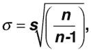

估计的人口方差是

ψ2= s2n/(n-1)。

如果样本很小，样本标准偏差的变化可能很明显，但对于大样本，比率 n/(n-1)接近于 1，只有很小的影响。

如果将两个样本合并起来提供一个更大的单个样本，则总体的估计平均值可以通过获得加权平均值的常用方法获得。因此，

μ，=(n1cm1+n2cm2/(n1+n2】

其中后缀 1 和 2 指的是两个样本。估计的混合方差为

ψ2= {(n1-1)s12+【n】2-【1】s2

估计的混合标准差是这个的平方根。

人口比例的最佳估计是样本比例，混合的处理方式与估计人口平均数完全相同。

## 置信区间

上一节说样本均值提供了总体均值(期望值)的最佳估计。因此，如果我们调查在当地电影院观看特定电影的人，发现在 40 人的样本中，平均年龄是 32 岁，那么这提供了在相同情况下观看或可能观看的人的平均年龄的最佳估计。显然，这很容易出错，一个有用的方法是附加置信限。这些是从总体方差中计算出来的，但是在你看到它们是如何呈现的以及它们的含义是多么有用之前。结果可能被引用为，例如，

平均年龄= 32 5 (95%的置信度)，

这意味着在 95%的此类调查中，真实的人口平均数将在 27 岁至 37 岁之间。

请注意，这并不意味着真实总体均值有 95%的概率位于区间 27 至 37。真实值要么在给定的区间内，要么不在。这个问题很微妙，可以用下面的例子来说明。假设真实的人口平均数是 26。我们获得的样本估计平均值在 27 到 37 之间，这是不正确的。然而，我们很不幸，因为其他 19 个类似的样本，平均起来，有 26 个在不确定范围内。可见这和说 26 的真值有 95%的几率在 27 到 37 之间是不一样的。它不可能如此。然而，建立一个不限制真实值的范围显然是相当罕见的，并且很容易看出置信界限的含义是如何经常被错误地陈述的。

现在让我们看看置信限是如何得到的。从本章第二节对正态分布的描述中，我们知道从总体中抽取的单个值大约有三分之二的机会在平均值的一个标准偏差内。单一值是平均值的最佳估计值，但它显然是一个非常差的值。只有一个值——例如电影院中的一个人——我们无法计算标准差，所以我们甚至不知道我们的估计有多差。

实际上，我们取一个样本并计算平均值。这是目前我们对人口平均值的最佳估计。在我们的电影例子中，我们有一个 32 岁的样本均值，我们假设它是从 40 岁的样本量中获得的。我们可以计算样本的标准偏差，得到 16 年的值。这使我们能够计算总体标准偏差的最佳估计值，在进行上一节所述的微小修正后，该值为 16.2。

总体均值的估计比单个数据值的估计更可靠，但可靠多少呢？事实证明，当获得样本的均值时，它们本身是正态分布的，但其标准差比总体的标准差小。实际上，同等大小样本的标准差等于总体的标准差除以每个样本中数据个数的平方根。所以样本越大，样本均值越有可能接近总体均值。这是人们所期望的。样本平均值的标准偏差变为

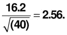

参考标准正态分布表显示，一个值有 95%的概率位于平均值任一侧的 1.96 个标准偏差内。在我们的例子中，

1.96 x 2.56 = 5.02。

因此，我们的结论是，参加或潜在参加电影院的估计平均年龄为 32.5 岁(95%的置信度)。

值得补充的是，样本的平均值被发现是正态分布的，或者接近正态分布，即使原始数据与正态分布相差很大。

值得注意的是，值 1.96 总是与 95%的置信限相关，因此没有必要每次都查阅标准正态分布表。类似地，对于其他置信限，可以始终使用的适当值总结如下:

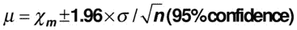

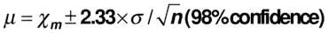

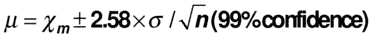

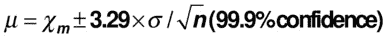

在哪里

c m =样本平均值

σ =总体的估计标准偏差

n =样本量

到目前为止，在本节中，我们假设我们的样本是大的。如果我们的样本很小，少于 30，我们不使用正态分布。相反，我们必须参考名为 Student's-t 的分布表。该分布随着数据数量的变化而变化，因此我们无法像上面那样确定给定置信度下的标准偏差数量。随着样本中数据数量的增加，t 分布越来越接近正态分布，因此只有小样本才需要 t 分布。(学生是威廉·戈塞特的笔名，他设计了小样本测试；这种测试之所以没有这样命名，是因为它被统计学专业的学生所使用。)

下面是一些不同样本大小的 t 分布的列表值。显示的值取代了上述置信限陈述中的数值因子，这些数值因子是从正态分布中获得的。为了便于比较，后面的因素在表格的最后一行重复出现。可以理解 t 分布值接近正态分布值的趋势。

<colgroup><col> <col> <col> <col> <col></colgroup> 
| 样本量(n) | 95%的信心 | 98%的信心 | 99%的信心 | 99.9%的信心 |
| --- | --- | --- | --- | --- |
| five | Two point five seven | Three point three seven | Four point zero three | Six point eight seven |
| Ten | Two point two three | Two point seven six | Three point one seven | Four point five nine |
| Twenty | Two point zero nine | Two point five three | Two point eight five | Three point eight five |
| Thirty | Two point zero four | Two point four six | Two point seven five | Three point six five |
| Sixty | Two | Two point three nine | Two point six two | Three point four six |
| 正态分布 | One point nine six | Two point three three | Two point five eight | Three point two nine |

还可以看出，样本越小，置信界限越宽。这种加宽是对由于总体标准差估计中 n 值较小而引起的加宽的补充。