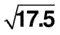

# 十、数值数据的比较

Are Today’s Chocolate Bars Smaller Than Yesterday’s?

一旦以可量化的方式描述了一个数字样本或总体，如第 7 章所示，就可以将其与其他样本或总体进行比较，以寻找差异或相似之处。本章解释了从单个值、成对值、成对样本和样本集可以学到什么。在每种情况下，都建立了零假设，即没有明显的差异；并且，通过计算适当的检验统计量，确定是否应该接受零假设。

## 单一值

无效假设是单一值可能来自给定的总体。例如，调查一块重 121 克的巧克力是否来自生产平均重量为 120 克、标准偏差为 0.5 克的巧克力的生产线。这种情况被认为是巧克力重量呈正态分布。

我们已经看到，正态分布曲线下的面积代表该面积范围内的值出现的概率。如果我们对 5%的显著性水平感兴趣，比方说，我们会问，在平均值为 120.0 克、标准偏差为 0.5 克的正态分布的 5%尾部中，是否会发现像 121 克这样大的值

通过计算所谓的 Z 值，将 121 克和 120 克之间的差异调整为符合标准正态分布，其中

Z =(单值-总体均值)/(标准差)

= (121–120)/ 0.5

 = 2.0 .

这给出了被调查值与总体平均值的差异量，以标准差为单位。参考图 7-9，一个值与平均值的标准差至少为 2.0 的概率为 2%。(读出 A = 2.0，B =无穷大，得出 2%。)正态分布的完整表格给出的结果更准确，为 0.0228 (2.28%)。该值低于 5%的显著性水平，因此我们得出结论，零假设是不正确的，巧克力棒不太可能来自生产线。换句话说，如果我们说巧克力棒不是来自生产线，那么只有 2.28%的可能性是错误的。

这个例子是一个单尾检验，因为我们引用的是观察到高达 121g 值的概率。在一个双尾检验中，我们将询问一个值距离平均值 1g 的概率，无论是高于还是低于。因此，我们将在上尾部以 2.5%的概率工作，在下尾部以 2.5%的概率工作，以固定对应于不可能从总体中选择的值的 5%概率的限制。

对于常用的显著性水平以及单尾和双尾检验，出现概率与偏离平均值之间的关系如下所示:

<colgroup><col> <col> <col> <col> <col></colgroup> 
| 意义 | 5% | 2% | 1% | 0.1% |
| 一条尾巴 | One point six five | Two point zero five | Two point three three | Three point zero nine |
| 两条尾巴 | One point nine six | Two point three three | Two point five eight | Three point two nine |

使用这些显著性水平的优选值避免了查阅正态分布的完整值表的需要。值得注意的是，双尾检验的值与我们在第 7 章设置置信限时使用的值相同。这并不令人惊讶，因为，例如，一个值在对称中心带内的 95%的概率相当于它在该带之上的 2.5%的概率和它在该带之下的 2.5%的概率。

## 样本的平均值

零假设是样本平均值可能来自给定的总体。继续以我们的巧克力棒为例，一条生产线已经维修，维修后，发现 100 块巧克力棒的样本平均值为 119.9 克，而之前确定的总体平均值为 120.0 克。为了确定生产线现在是否运行令人满意，我们设置了零假设，即从中抽取样本的总体平均值为 120.0 克。我们假设样本的预期标准偏差为 0.5 克，与之前一样。

该过程类似于前一示例，获得 Z 分数并参考正态分布表。但是，因为我们的样本平均值比前面部分中的单个值更具代表性，所以我们减少样本的标准偏差以获得平均值的标准偏差。这是通过将样本的方差除以样本中数据值的数量，然后求平方根来实现的。这给了我们均值的标准差，通常称为均值的标准差。换句话说，我们将样本的标准偏差除以数据值数量的平方根，得到平均值的标准偏差。因此，平均值的标准偏差为 0.5g 除以 100 的平方根，即 0.5/10 = 0.05g。这具有降低结果不确定性的作用。在第 7 章的[中，标准差的减少以类似的方式用于计算置信限。](07.html)

Z 值是

(119.9 – 120.0)/0.05 = – 2.0.

该值超过了 5%显著性的要求值，几乎达到了 2%的水平，这可以从上一节显示的值中看出。我们的结论是应该拒绝零假设，因为有证据表明生产线没有按照要求运行。(Z 得分的负值仅表明被测值低于总体平均值；你会记得标准正态分布的均值位于零。)

最好使用大样本，因为这会降低 Z 值。然而，因为减少的是样本大小的平方根，收益递减的情况就出现了。在样本大小为 16 的情况下，与单个值的 Z 得分相比，Z 得分减少了 4 倍。如果我们想把它减少到八分之一，我们需要一个大小为 64 的样本。因此，当我们试图减少结果的不确定性时，获取样本的努力和成本迅速上升。

如果样本量很小，则采用稍微不同的程序。Z 得分稍作修改，但不是参照正态分布表，而是参照 t 分布表([第 7 章](07.html))。t 分布接近正态分布，对大样本给出相同的结果。

## 方差之间的差异

零假设是具有不同方差的两个样本可能来自同一总体。这相当于检查这两个样本是否有显著差异，因为如果它们不可能来自同一人群，那么它们一定来自不同的人群。

两个方差之比 F 的计算方法是将较大的方差 s12除以较小的方差 s 2 2 ，得到一个大于 1 的值，

f = s1T2】2/s2T6】2。

若 n 1 和 n 2 为两个样本中的数据个数，则自由度为 n1–1 和 n2–1。F 值和自由度参见 Snedecor 的 F 值表。这些表格相当广泛，因为需要满足每个显著性水平和两个样本中每个样本的数据数量。表格摘录见“多样本”部分和第 16 章中的[，其中说明了 f 检验的进一步用途。](16.html)

如果两个方差没有显著差异，可以将它们合并起来，用加权平均值作为总体方差的更可靠的估计。因此，如第 7 章中的[所示，汇总的估计总体方差由下式给出](07.html)

ψ2= {(n1–1)s12+【n】2–1)s2

## 均值之间的差异

无效假设是具有不同平均值的两个样本可能来自同一总体。请注意，应该首先执行前面的测试，即方差比测试。如果 f 检验显示两个样本显著不同，询问均值是否显示样本不同可能是没有意义的。当然，f 检验有一定程度的不可靠性，所以如何进行就成了一个判断的问题。

假设我们继续检查两个平均值，计算 Z 得分，用标准差的数量表示平均值之间的差异。这类似于我们在“样本均值”一节中所做的，当时我们将单个样本的均值与总体均值进行了比较。然而，我们现在有两个样本，每个样本都是对假定的潜在人群的估计。和以前一样，我们将使用两个平均值之间的差异，但所需的标准差现在指的是一个新的分布，即两个样本之间差异的分布。这里使用的标准差是差值的标准差。每个平均值都有其相关的方差，表示其不确定性。所以两个方差之和表示了均值之间的差异的不确定性。

在这个阶段，一个例子将清楚地说明如何进行。假设我们有两个销售人员在一段时间内销售特定产品的详细信息，我们希望进行比较:

<colgroup><col> <col> <col> <col></colgroup> 
| 员工 | 天数 | 平均每天销售额 | 标准偏差 |
| --- | --- | --- | --- |
|   | n | x m | s |
| one | Thirty | Sixteen | six |
| Two | Thirty-five | Twelve | five |

均值之差的方差为σ2/n1+σ2/n2其中σ 2 为总体方差，由于不知道其值，所以必须进行估计。使用样本标准差，总体方差的估计值为

ψ2= {(n1–1)s12+【n】2–1)s2

这就是你在第 7 章中遇到的等式，以及上一节中提到的合并两个样本以估计总体方差的等式。使用上表中的值得到 30.06，因此均值差异的方差为 30.06/30 + 30.06/35，即 1.86。均值的差的分布的标准差是这个的平方根，是 1.36。

因此，Z 值(两个平均值之间的标准差之差)为(16–12)/1.36，即 2.94。从本章“单一值”部分显示的正态分布的值可以看出，这在 1%的水平上是显著的，因此我们可以得出结论，零假设被拒绝，两名员工的表现不同。

请注意，这里使用了方差的可加性:我们不能简单地将两个标准差的值相加来获得均值之间差异的标准差。

## 配对数据的平均值

配对数据经常出现在前后情况中。因此，我们可以在一周的复习前后得到一组学生的测试结果。例如:

<colgroup><col> <col> <col> <col> <col> <col> <col> <col></colgroup> 
| 学生 | A | B | C | D | E | 平均 | 变化 |
| --- | --- | --- | --- | --- | --- | --- | --- |
| 以前 | Twenty | Sixty | Forty | Fifty | Thirty | Forty |   |
| 在...之后 | Thirty | Fifty-five | Fifty | Sixty-five | Fifty | Fifty |   |
| 提高 | Ten | –5 | Ten | Fifteen | Twenty | Ten | Eighty-seven point five |

如果没有修改会议的影响，我们预计这些增加是很小的，平均接近于零。因此，我们可以问，这种增长的分布是否与从平均值为零的总体中可能得到的值有显著的不同。因此，我们的零假设是，增长样本可能是从平均值为零的总体中抽取的。

现在可以按照与上一节相似的程序进行计算，在上一节中，我们比较了两个样本平均值。均值差的方差减少到增量均值的方差，总体方差的估计减少到增量的方差。

上表中的值给出了以下内容:

估计人口方差= 87.5

均值差的方差= (87.5)/5 = 17.5

均值差的标准差=  = 4.18

z 得分=(10–0)/4.18 = 2.39

样本小；因此，与其引用 Z 分数，不如将结果称为学生的 t 值，然后使用 t 值表来确定显著性水平。配对数据中的样本通常较小，因为当所需样本量变大时，精确配对变得更加困难。在本例中，t 值 2.39 略低于样本量为 5 时表示 5%显著性水平所需的值。(参见第 7 章中[t 值的选择。因此可以得出结论，零假设被接受，没有足够的证据表明复习课有任何益处。](07.html)

## 多个样本

如果需要比较两个以上的样本，使用上述方法成对比较它们是完全可能的。然而，由于以下原因，这将是不令人满意的程序。如果有三个样本 A、B 和 C，那么将有三对样本进行比较:AB、AC 和 BC。如果我们在 5%的水平上进行测试，我们有 1/20 的机会在这些比较中出错。我们有大约 20 分之 3 的机会至少有一个结果是错误的。随着样本数量的增加，情况会迅速恶化。四个样本产生六对，五个样本产生十对，导致错误的概率高得不可接受。

在这种情况下使用一种叫做方差分析(ANOVA)的技术，正是在这里，方差在统计程序中的重要作用变得显而易见。尽管方差通常有奇怪的单位，但它具有可加性的有用性质。我们以前遇到过这种情况，为了计算平均标准偏差，我们首先从每个标准偏差中获得方差，然后对方差进行平均，并通过求平均方差的平方根来获得平均标准偏差。类似地，在“均值之间的差异”一节中，您可以看到，为了获得两个值之间差异的方差，我们将两个个体方差相加。

如果我们有许多样本，每个样本中的数据会有变化。此外，样本会彼此不同。为了量化样本之间的差异，有必要分离样本内的变化和样本之间的变化。方差分析允许这样做。

根据所有样本的方差，我们可以得到一个混合方差。这给出了样本内变化的度量。实际上，我们暂时假设样本实际上来自同一个总体，因此每个样本方差都是总体方差的估计。然后，通过汇集几个估计值，获得总体方差的最佳估计值。这是样本内方差的度量。

然后，我们可以用样本平均值替换每个数据，并计算总数据的方差，从而暂时消除每个样本中的差异。这给出了样本之间变化的度量。实际上，我们在问，如果每个样本由一组具有原始均值但方差为零的相同值组成，那么总体方差的最佳估计值是多少。

如果所有的样本都来自同一人群，那么样本内的变异应该与样本间的变异相似。因此，样本内方差与样本间方差的比值表明样本具有共同来源的程度。举个例子就能说明这一点。

五名足球运动员在多场比赛中进球如下。每个玩家参加的比赛次数不一定相同。无效假设是这五个样本可能来自同一人群。换句话说，没有证据表明五个玩家的表现有显著差异:

<colgroup><col> <col> <col> <col> <col> <col></colgroup> 
| 运动员 | A | B | C | D | E |
| --- | --- | --- | --- | --- | --- |
| 目标 | three | three | Zero | one | four |
|   | Zero | Two | three | three | Two |
|   | three | three | Zero | one | Two |
|   |   | four | Two | four | four |
|   |   |   | Zero | one | three |
| 平均 | Two | three | one | Two | three |
| 变化 | three | Zero point six seven | Two | Two | one |
| 总体平均值= 2.18 | 混合方差= 1.65 |

按照第 7 章中的[说明的合并程序，合并方差为 1.65。这是样本内方差。与此方差相关的自由度是通过将每个样本的自由度相加获得的:即比数据数少 1。所以，(2+3+4+4+4) = 17 是自由度的个数。](07.html)

为了获得样本间方差，每个数据都被其样本均值所替代:

<colgroup><col> <col> <col> <col> <col> <col></colgroup> 
| 目标 | Two | three | one | Two | three |
| --- | --- | --- | --- | --- | --- |
|   | Two | three | one | Two | three |
|   | Two | three | one | Two | three |
|   |   | three | one | Two | three |
|   |   |   | one | Two | three |
| 平均 | Two | three | one | Two | three |
| 变化 | Zero | Zero | Zero | Zero | Zero |
| 总体平均值= 2.18 | 方差= 3.32 |

这些值在总体平均值 3.32 附近的方差是样本间方差。与该方差相关的自由度比样本数少一个，即, 4.请注意，样本内方差和样本间方差的自由度之和为 21，即 17 + 4，等于总共 22 个数据值的总自由度，即 22–1 = 21。

两个方差的比率(3.32/1.65 = 2.01)以及它们的自由度参见“方差之间的差异”一节中描述的 F 值表表格摘录如下:

<colgroup><col> <col> <col> <col> <col></colgroup> 
| 显著性水平 |   | 较大方差的自由度 |
| --- | --- | --- |
| 5% |   | three | four | five |
| --- | --- | --- | --- | --- |
| 较小方差的自由度 | Fifteen | Three point two nine | Three point zero six | Two point nine |
|   | Sixteen | Three point two four | Three point zero one | Two point eight five |
|   | Seventeen | Three point two | Two point nine six | Two point eight one |
|   | Eighteen | Three point one six | Two point nine three | Two point seven seven |

在这个例子中，方差比 2.01 不足以表明玩家的表现之间的显著差异。接受零假设。

以这种方式使用的方差分析被称为单向方差分析，其中检查样本组之间的变化，每个样本是相似类型的，并且可能来自相同的总体。在第 16 章中，你会看到方差分析可以应用于在某些方面不同的样本集。

MANAGING THE MANAGER

Premier Pressings 是一家为制造汽车、洗衣机、燃气锅炉和类似产品的工程公司制造钢压制件的公司。该公司在五个不同的城市设有分支机构，每个分支机构都服务于当地的需求。

首席执行官 George Robinson 担心，与其他四个部门相比，他的一个部门 Shempton 在过去六个月中利润较低。他与 Shempton 部门的经理 Tom Greeves 讨论了他的顾虑，以确定问题所在。会议并不令人满意:汤姆无法对他糟糕的结果给出任何合理的解释，并声称这是一种统计上的怪癖，毫无疑问，在随后的几个月里，这种影响将会抵消。

乔治不服气，决定进一步调查。他请设计室的一位懂一些统计学的高级绘图员来看看这些数字。

制图员阿诺德·梅森立即看出，六个月期间的平均利润比其他四个单位的利润低得多，尽管每个月的差异都很大。他决定首先检查其他四个单位的结果是否一致。他列出了 4 个单位的 6 个利润值，共 24 个数据，并进行了单向方差分析。这给他一个样本内方差的值和一个样本间方差的值。他计算了方差比 F。参考 F 值表显示结果不显著，因此可以认为四个单位产生的结果具有相似的差异量。因此，他计算了 24 个利润值的平均值和方差。

下一步是观察 Shempton 的结果是否与 24 个值的总和有显著差异。计算 Shempton 结果的平均值和方差。两个方差的比较给出了不显著的 F 值。然而，两个平均值的比较显示了 5%水平的显著差异。这表明，如果坚持认为舍普顿的结果不如其他的结果，那就有 1/20 的概率是错误的。

有了这些结果，CEO 召集 Tom 开了一个会，并指出有充分的证据表明 Shempton 的结果并不令人满意。人们认为证据并不充分；而且，考虑到一定程度的不确定性，汤姆被告知将再给他六个月的时间来提高利润。这个练习将在六个月后重复进行，然后再考虑汤姆的未来。