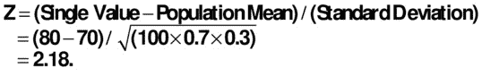
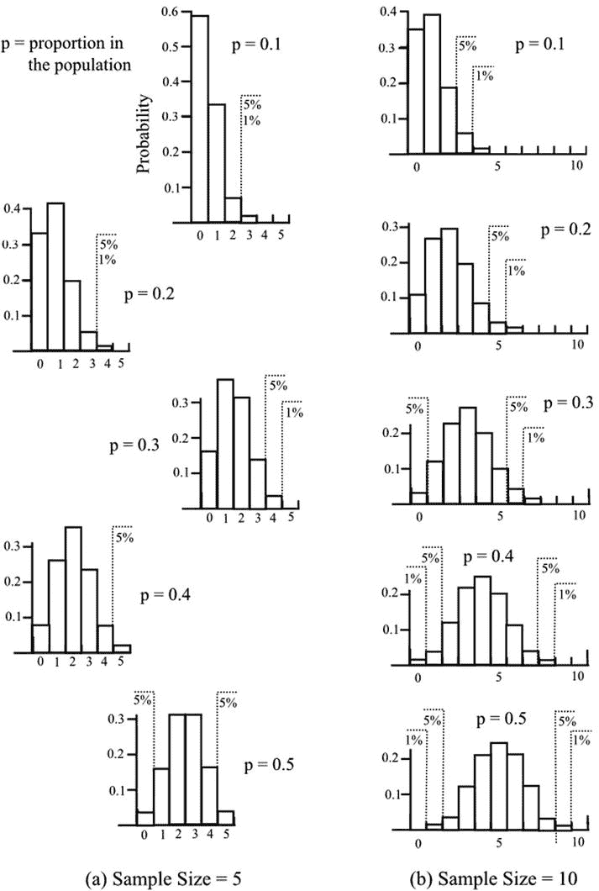
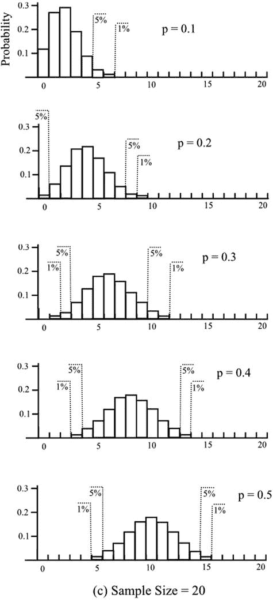
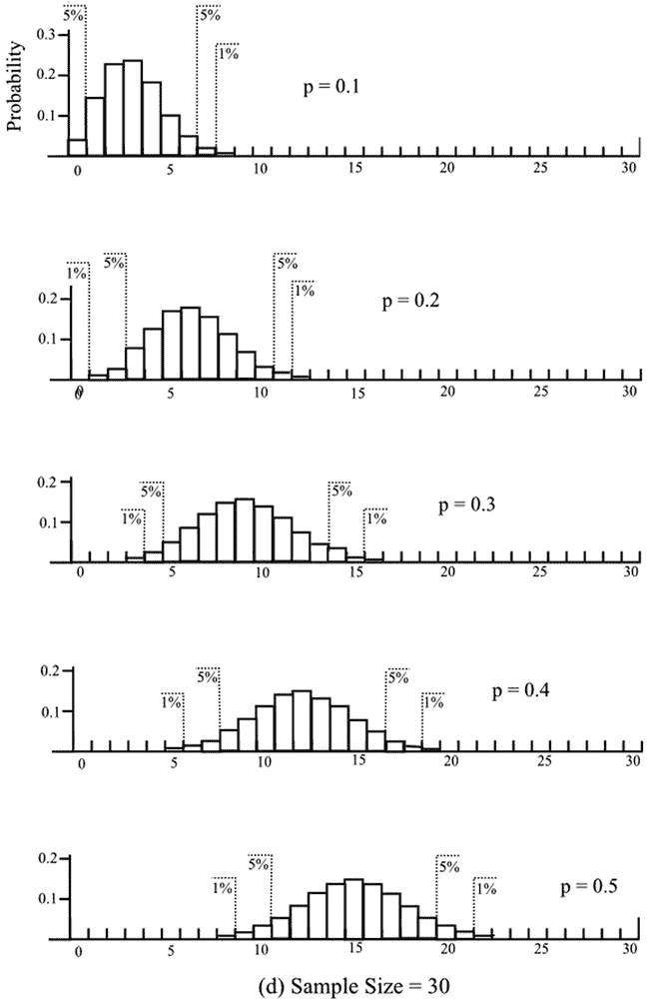
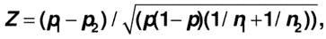

# 十一、描述性数据的比较

Is Your Staff Female/Male Ratio OK?

[第 6 章](06.html)解释了描述性数据可以通过将不同类别中的项目数量表示为比例来进行数值化——从而能够对数据进行进一步的分析。在这一章中，将对一个单一的比例与一个总体进行比较，并对两个样本比例进行比较。如果数据是有序的——也就是说，它可以按逻辑顺序列出——那么将要介绍的等级测试就可以用来比较等级对。

拥有大样本的描述性数据有一个特别的优势，因为使用的几个程序允许数据作为正态分布数据处理。

## 单一比例

由是/否数据组成的样本将提供处理比例的示例。假设我们从之前的调查中得知，纽镇出生的居民比例为 0.7。我们可以利用这一信息来决定在城镇的一个地区获得的一个大小为 100 的样本是否代表该城镇，或者该样本是否显示出显著的差异。

零假设是样本比例，比如说 0.8，与城镇的总体比例 0.7 没有显著差异。我们的 100 人样本中有 80 人出生在纽敦，而根据整个城镇的已知结果，我们预计会有 70 人。该程序遵循与第 10 章第[节相似的模式，在该模式中，我们询问是否可能从已知平均值的总体中抽取单个值。通过将单个观察值和总体平均值之间的差异除以方差的平方根来计算 Z 得分。这给了我们一个以标准差为单位的差异度量。](10.html)

比例是一个二元尺度:我们样本中的每个人要么出生在纽敦，要么没有出生。所以正确的分布是二项式分布，我们一会儿会讲到。但是，如果样本很大，并且人口比例不是过大或过小，则可以假设正态分布是相关的。二项分布数据的方差为 NP(1–p)，其中 p 为总体比例，n 为样本中数据的个数。因此，Z 值为

该值表明我们的样本在 5%的水平上与总体有显著差异。(参见第 10 章第[节正态分布的数值选择。)](10.html)

当样本量较小时，二项分布不同于正态分布，但不幸的是，二项分布的表格不便于使用。概率值随着样本中的数据数量和人口比例而变化，因此必须为每个样本大小和每个人口比例值建立一个单独的表。此外，列出的值是累积概率。图 [11-1](#Fig1) 给出了二项式分布的一个更容易理解的视图，它提供了许多样本大小和人群中感兴趣的财产的不同比例的标绘值的选择。当人口比例较小时，分布是偏态的，但当比例为 0.5 时，就变得对称了。如前所述，随着样本量的增加，分布接近正态分布。

假设我们有一家只有 10 名员工的公司，其中只有两名女性。这是否提供了公司歧视女性员工的证据？假设不存在歧视，女性的预期数量为 5，因此零假设是，包含 2 名或更少女性的 10 名员工样本可能来自女性比例为 0.5 的人群。

将我们示例中的值输入二项式分布表中，出现的概率为 0.0547，即略高于 5%。我们不得不得出结论，在 5%的歧视水平上没有证据。如果只有一名女性员工，概率会更低——0.0107，略高于 1%——我们会认为有歧视的证据。如果没有女性员工，这种可能性会更低，但我们必须小心。这份工作不适合女性员工或对女性员工没有吸引力，很可能是有潜在原因的。

在图 [11-1(b)](#Fig1) 中，你可以概略地看到这些结果。底部分布适用于样本大小为 10，人口比例为 0.5 的情况。1%显著性的要求显示为零出现，5%显著性的要求显示为小于 2，即 0 或 1。

图 11-1。

The binomial distribution showing the probability of a number of specified events in a sample when the proportion in the population is p, for a range of p values and for a sample size of (a) 5, (b) 10, (c) 20, and (d) 30

## 比例之间的差异

可能我们有两个样本，我们希望检查它们之间的差异。无效假设是这两个样本可能来自同一人群。如果样本很大，我们可以再次使用正态分布，并按照第 10 章的[的“平均值之间的差异”一节中描述的数值数据来处理数据。对于相同大小的样本，将两个样本的方差相加，Z 得分是每个样本中出现次数之差除以组合方差的平方根。如果样本大小不相等，则差值必须是两个比例之间的差值，并且必须对组合方差的表达式进行适当的调整。因此，Z 分数呈现更复杂的外观，](10.html)

其中 p 1 和 p 2 为样本中的两个比例，n 1 和 n 2 为两个样本量，p 为总体比例。如果人口比例未知，则使用两个样本比例的加权平均值。

## 级别

序数数据是可以按照逻辑顺序放置的描述性数据，可以通过排序测试进行比较。这些是非参数的——意味着没有假设特定的分布。

假设我们有两个想要比较的类别，我们的样本数据由两个类别的代表的总体排名组成。例如，我们可以有一个由投票者小组按偏好排序的歌手列表，我们希望看到对男歌手或女歌手是否有明显的偏好。该列表可能如下所示:

M F M M M F M F F F F F M。

曼-惠特尼 U 检验是一种合适的检验。稍有不同的一个等价检验是 Wilcoxon 秩和检验。

举一个我们可以更详细了解的例子，考虑两个赛跑队:A 队的五名选手和 B 队的五名选手。我们的数据由跑步者完成的顺序组成，我们的零假设是两个团队之间没有显著差异。按完成顺序排列的赛跑运动员是

A A B B A B B A A B B B A。

每个数据项被赋予其等级值，并且每个组的值被合计，如下所示

A 队排名 1、2、5、8、9、13 号，n A = 6 共，R A = 38

B 队排名 3、4、6、7、10、11、12 号，n B = 7 共，R B = 53

计算两个 U 值，

uA= nAnB+nA(nA+1)/2–RA和

uB= nAnB+nB(nB+1)/2–RB

统计量 U 是 U A 和 U B 中较小的一个，参考曼-惠特尼 U 检验的临界值表。使用上面的值得到 U A = 25，U B = 17，所以 U = 17。该值需要等于或小于表中的临界值，以表明 A 和 B 两组在指定显著性水平上的差异。下面是从表中选择的值:

<colgroup><col> <col> <col> <col> <col> <col></colgroup> 
|   | 一条尾巴 | 两条尾巴 |
| --- | --- | --- |
| n A | n B | 5% | 1% | 5% | 1% |
| five | five | four | one | Two | Zero |
| five | Ten | Eleven | six | eight | four |
| six | six | seven | three | five | Two |
| six | seven | eight | four | six | three |
| six | eight | Ten | six | eight | four |
| six | Ten | Fourteen | eight | Eleven | six |
| seven | seven | Eleven | six | eight | four |
| seven | Ten | Seventeen | Eleven | Fourteen | nine |

双尾检验是合适的，因为我们测试的是无差异，而不是有利于 A 或 b 的差异。可以看出，我们的 U 值太大，无法表明两组跑步者之间有任何显著差异。

对于较大的 n 值，可以使用正态分布。合适的均值是 n A n B /2，方差是 nAnB(nA+nB+1)/12。因此，可以根据 U 值计算 Z 得分，并参考第 10 章第[节中所示的正态分布表。](10.html)

如果使用 Wilcoxon 秩和检验，较小组 RA(在本例中为 38)的秩和是参考 Wilcoxon 秩和检验临界值表以获得显著性水平的统计量。如果各组大小相等，则使用较小的总数。如果样本很大，可以再次使用正态分布。合适的均值是 nAnB/2+nB(nB+1)/2 方差是 nAnB(nA+nB+1)/12。

Kruskal-Wallis 检验是 Mann-Whitney 检验的扩展，适用于三个或更多样本。检验统计量有一个复杂的公式，基本上描述了等级的方差。参见第 7 章的[中描述的卡方分布表，以获得显著性水平。然而，如果组太小(少于约 5 个)，统计偏离卡方分布。](07.html)

## 成对数据的秩

如果要比较的两个样本由成对值组成，可以使用 Wilcoxon 配对秩和检验。假设我们希望连续两年比较一个学生在一系列科目中的成绩。我们正在调查与第一年相比，第二年是否有总体改善。课堂上的位置如下:

<colgroup><col> <col> <col> <col> <col> <col> <col> <col> <col></colgroup> 
| 科目 | 英语 | 数学 | 法语 | 德国人 | 艺术 | 物理学 | 生物 | 历史 |
| --- | --- | --- | --- | --- | --- | --- | --- | --- |
| 第一年 | three | four | six | one | one | eight | six | Two |
| 第二年 | one | one | Two | Two | three | three | three | one |
| 改进第 1 年–第 2 年 | Two | three | four | –1 | –2 | five | three | one |
| 排名(不考虑+或-) | Three point five | Five point five | seven | One point five | Three point five | eight | Five point five | One point five |
| +排名之和= 3.5+5.5+7+8+5.5+1.5 = 31 |   |   |   |   |   |
| 等级之和= 1.5+3.5 = 5 |   |   |   |   |   |   |   |
| (任何零差都被忽略。) |   |   |   |   |   |   |

负秩的和，在本例中为 5，是统计量 W，它必须等于或小于 Wilcoxon 配对检验表中的值。线对的数量 n 输入为 8。下面是表格中的一小段摘录:

<colgroup><col> <col> <col> <col> <col></colgroup> 
| 对数 n | 一条尾巴 | 两条尾巴 |
| --- | --- | --- |
|   | 5% | 1% | 5% | 1% |
| --- | --- | --- | --- | --- |
| five | Zero | - | - | - |
| six | Two | - | Zero | - |
| seven | three | Zero | Two | - |
| eight | five | one | three | Zero |
| nine | eight | three | five | one |
| Ten | Ten | five | eight | three |

单尾检验是相关的，因为我们测试的是显著改善而不是显著差异，值 5 表示在 5%的水平上有显著改善。

## 重复等级

如果我们对相同的项目有两个单独的排名，有许多排名方法可以使用。其中之一采用了 Spearman 等级相关系数ρ(希腊字母 rho)或 r s 。我将通过想象七家不同的餐馆由两位评委进行比较来说明这种方法。我们想知道两位法官的意见是否有重大分歧。无效假设是这两种排序是相关的，并且可能来自同一个群体。因此，法官对餐馆会有相似的看法。排序可能如下所示:

<colgroup><col> <col> <col> <col> <col></colgroup> 
| 餐馆 | 法官 1 | 法官 2 | 差异 |   |
| --- | --- | --- | --- | --- |
|   | 军阶 | 军阶 | d | d 2 |
| --- | --- | --- | --- | --- |
| A | four | three | one | one |
| B | Two | Two | Zero | Zero |
| C | three | five | Two | four |
| D | one | one | Zero | Zero |
| E | five | seven | Two | four |
| F | six | four | Two | four |
| G | seven | six | one | one |
|   |   |   | 总数 | Fourteen |

如果两个或两个以上的等级在一个法官的排序中是相等的，则允许分数的平均值将代替每个等级；但是太多的相同等级使得分析不恰当。

对来自两个裁判的等级之间的差进行平方，并且从平方和计算相关系数ρ。ρ的值介于+1 和–1 之间，其中+1 表示两种排序完全一致，而–1 表示完全相反的排序。

该系数的计算公式如下

ρ= 1–6 x(d2之和)/(n(n2–1))，

其中 n 是被分级的项目的数量。在我们的例子中，

φ= 1–6×14/(7(49–1))= 0.75。

该值参考已公布的ρ表，以获得显著性水平。为了说明所需的ρ水平，下表显示了 n 个值和两个显著性水平的选择值:

<colgroup><col> <col> <col> <col> <col></colgroup> 
| 项目数 n | 一条尾巴 | 两条尾巴 |
| --- | --- | --- |
| 5% | 1% | 5% | 1% |
| --- | --- | --- | --- |
| five | Zero point nine | One | One | Zero |
| six | Zero point eight three | Zero point nine four | Zero point eight nine | One |
| seven | Zero point seven one | Zero point eight nine | Zero point seven nine | Zero point nine three |
| Ten | Zero point five six | Zero point seven five | Zero point six five | Zero point seven nine |
| Fifteen | Zero point four five | Zero point six | Zero point five two | Zero point six five |
| Twenty | Zero point three eight | Zero point five two | Zero point four five | Zero point five seven |
| Thirty | Zero point three one | Zero point four three | Zero point three six | Zero point four seven |
| Forty | Zero point two six | Zero point three seven | Zero point three one | Zero point four one |

我们的值 0.75 可以看出超过了单尾检验的 5%显著性水平，但没有超过双尾检验的显著性水平。在这个例子中，单尾测试是合适的，因为我们正在调查我们的两个评委是否以相同的顺序对餐馆进行了排名。分布的第二条尾巴与相关但顺序相反的排名有关。因此，我们的结论是，有证据表明，在 5%的水平上，两个排名之间的一致。

如果 n 大于约 40，可以计算 Z 分数(如第 10 章中的[所示)并使用正态分布表来获得显著性水平。适当的正态分布的均值为零，方差为 1/(n–1)。](10.html)

还有其他几个等级相关系数，包括 Kendall 等级相关系数τ(希腊字母 tau)，它们的计算方法不同，但产生的相关系数与 Spearman 的相关系数解释相同，并且可以归属于显著性水平。

严格意义上的相关性一词是指两个变量之间的线性关系，这些排名方法也用于考察关系。这里，我们简单地使用等级相关系数来比较可能来自同一总体的两个样本。在某种意义上，可以认为这两个排名之间存在关系:我们可以绘制一个法官 1 的排名与法官 2 的排名的图表。两个排名之间的完美一致将给出一条直线，其统一性的斜率不断上升。如果两位评委给出了完全相反的排名，这样的图表会给出一条斜率为 1 的直线。在第五部分，我们将处理关系，并再次满足排名。