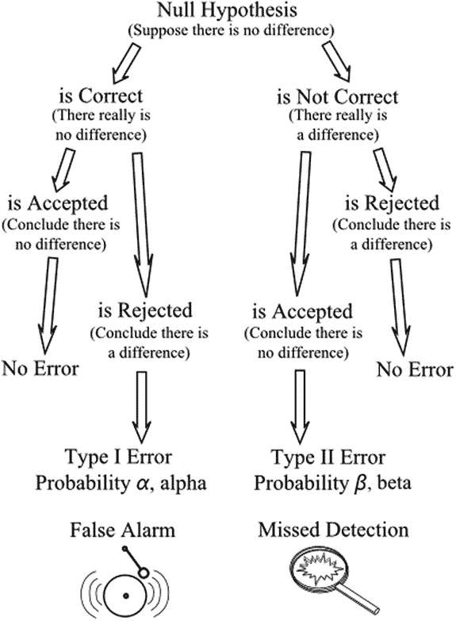

# 十二、误差类型

How Wrong Can You Be?

无论何时引用显著性水平，所述结果都有可能是不正确的。如果零假设被拒绝，而事实上，它是正确的，这种错误被称为 I 型错误。因此，如果我们的零假设是，在同一次考试中，男生和女生的成绩之间没有显著差异，我们可以决定有差异，比如说，在 5%的水平上。如果事实上没有差别，而我们的结果仅仅是由于随机效应，即我们出错的几率为 1/20，那么第一类错误就发生了。

或者，我们的结果可能显示没有显著差异，我们会接受零假设。如果我们错了，而且实际上存在差异，那么就发生了第二类错误。

第一类错误是最容易识别的，因为它的概率是由结果的显著性水平决定的。在上面的例子中，如果我们得出结论，同意零假设，男孩和女孩之间没有显著差异(在 5%的水平)，我们有 5%的机会犯第一类错误。当不存在差异时，指示差异的错误将是假警报。I 类错误发生的概率用α(希腊字母 alpha)表示。当没有指示出显著差异(尽管是不正确的)时，类型 II 错误出现，并且被接受，因此是遗漏的检测。虚警和漏检是思考这两种错误的有用方法:名称 I 和 II 并不能说明哪个是哪个(图 [12-1](#Fig1) )。

假设检验的一个重要目的是拒绝假假设。因此，避免 I 型错误是很重要的。第二类错误通常不太严重，因为它为使用改进的资源进行进一步调查留下了机会。测试的功效是当零假设为假时拒绝零假设的概率，也就是说，它等于 1 减去第二类错误的概率。发生 II 型错误的概率用β(希腊字母β)表示，因此测试的功效为 1–β。如果差异真的存在，这种力量决定了找到差异的可能性。

请注意，如果没有额外的信息，我们无法计算出犯第二类错误的概率，因为我们不知道真实情况与零假设中陈述的情况有多远。我们必须以定量的方式建立另一种假设。例如，对于我们班的学生，我们可以提出女生比男生平均优秀 3%,并作为替代假设进行测试。

图 12-1。

Type I and Type II errors, which arise when the null hypothesis is accepted though incorrect or when it is rejected though correct

如果我们通过在更高的显著性水平上测试来减少犯第一类错误的机会，比如说 1%，那么我们就增加了犯第二类错误的机会。这两者之间是有取舍的。在接受抽样涉及供应商和客户的情况下，存在利益冲突。假设供应苹果，并检查样本。无效假设是样本与抽取样本的总体没有显著差异。如果出现第一类错误，这对供应商是不利的，因为苹果可能会被拒绝，而事实上它们是令人满意的。如果出现第二类错误，样本可能会指示接受苹果，而实际上它们并不令人满意。顾客因此处于不利地位。降低第一类错误的概率会增加第二类错误的概率，反之亦然。然而，通过增加样本的大小，这两种错误的概率都可以降低。于是，在减少误差和采样成本之间就有了一个权衡。

一个简单的例子将说明这两种错误。假设苹果是从一个供应商那里得到的，他的苹果有 10%是坏的。相对于支付的价格，客户接受这种质量水平。保持数字较小以简化示例，我们假设要购买一批 10 个苹果。顾客决定试用 3 号样本。如果 3 个都令人满意，则该批 10 个将被接受。零假设是该批次只包含一个坏苹果，即 10%，与预期比例一致。根据乘法法则，样本中所有 3 个都令人满意的概率是 9/10 x 8/9 x 7/8 = 0.7。所以有 0.7 的概率接受零假设，接受 10 批。因此，I 类错误的概率——即，当其中只有一个不满意的苹果时，拒绝该批次的概率——是 1–0.7 = 0.3。

如果没有更多的信息，我们无法计算第二类错误的概率。例如，我们需要知道或假设十个苹果中可能有两个坏苹果。该批次中只有一个坏苹果的零假设现在是错误的。样本中三个苹果都令人满意的概率是 8/10 x 7/9 x 6/8 = 0.47。因此，第二类错误的概率——即当零假设为假时，客户接受该批次的概率——为 0.47。

在实际情况中，有可能建立抽样安排来平衡这两种类型的误差，从而平衡供应商的风险和客户的风险。在上面的例子中，如果顾客决定抽样 4 个苹果而不是 3 个，I 类错误的概率将增加到 1-(9/10 x 8/9 x 7/8 x 6/7)= 0.4。第二类错误的概率降低到 8/10×7/9×6/8×5/7 = 0.33。因此，风险平均在 3 到 4 个苹果之间，其中 4 个苹果更接近最佳值。

REDUCING THE RISK

赫布登斯是镇中心的一家大型百货商店，出售各种各样的家庭用品。这家商店从 Plushcrocks 购买了一系列产品，如盘子、杯子、茶碟和非常受欢迎的精美装饰品。这批货物以 100 件为一批运送到赫布登斯。检查每批中的五个项目，如果所有五个项目都没有损坏或缺陷，则该批被接受。这一程序是在过去某个时候临时建立的。

尽管有这样的安排，赫布登斯发现自己有一部分商品不得不报废或作为次品出售，而且这个数字似乎还在上升，侵蚀着利润。

质量控制经理罗杰·韦兰决定做一些计算。在他看来，不可接受项目的百分比已经上升到 5%以上，但是很少有批次被拒绝。在 5%的次品率下，平均每批有 5 个次品。当一批产品包含多达 6 件缺陷产品时，商店接受该批产品的概率为 0.73 (73%，客户风险)，而当一批产品仅包含 5 件缺陷产品时，拒绝该批产品的概率为 0.23 (23%，供应商风险)。这些安排非常有利于 Plushcrocks，罗杰显然需要引入一种新的程序，包括对更多的进货样本进行检查。

进一步的计算表明，如果检测的项目数量增加到 12 个，当包含超过 5%的缺陷项目时，接受该批次的风险下降到 48%，当包含少于 5%的缺陷项目时，拒绝该批次的风险增加到 46%。

Roger 向 Plushcrocks 提出了这个问题，通过展示客户和供应商的同等风险，他获得了 12 个项目将在未来接受检查的协议，除非所有项目都没有缺陷，否则该批次将被拒绝。新的程序不会使 Hebdens 的成本有任何明显的增加，但 Plushcrocks 将面临相当多的额外工作来处理被拒绝的批次。罗杰意识到这只是开始。有了他的计算，他可以继续给 Plushcrocks 施加压力。有消息称，Plushcrocks 已经听取了一位统计顾问的建议，目的是改进他们的质量控制安排。