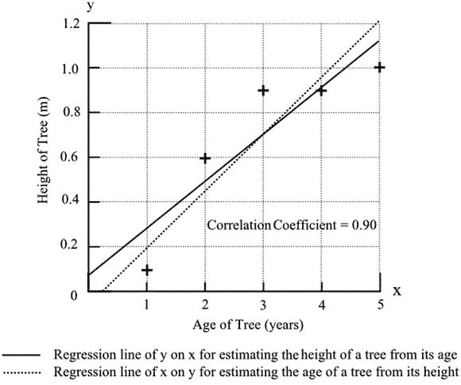

# 十四、数字数据的关系

Straight Lines, Curved Lines, and Wiggly Lines

经常需要比较两组或更多组数据，以确定它们是否以某种方式相关。一些量是相关的，因为我们已经定义了它们。公里与英里有精确的关系，这种关系可以用公式表示:

公里=英里 x 1.609。

美元与英镑之间有一个精确的汇率，这个汇率可能每天都在变化，也可能因地而异，但对于一笔特定的交易来说，这个汇率是精确的。然而，一般来说，我们处理的量可能显示一些关系，但很少是精确的关系。

在严密控制的实验室条件下进行的科学研究可能最接近精确的关系，但即使在这里，在进行测量时也会有小误差，这给已建立的关系带来不确定性。在天平的另一端，我们可能在寻找，例如，人们在选举中投票的方式和他们的父母如何投票之间的关系。在这里，很可能任何关系都是不确定的，统计分析的作用是量化不确定性。

当寻求两个变量之间的关系时，就要区分自变量和因变量。在图 [14-1](#Fig1) 中，冰淇淋的销量与每天中午的温度之间的关系显示为一个线形图。温度是独立变量，销售额是因变量，销售额取决于温度，而不是相反。线图通常用于显示关系，在绘制线图时，有一个约定，即选择位于两个轴上的量。横轴用于自变量，纵轴用于因变量。有时并不清楚哪个是哪个，两个变量都取决于其他因素。我们可以选择把哪个作为因变量，哪个作为自变量。如果我们在每天中午测量一个位置的温度和湿度，并绘制温度和湿度的曲线图，那么这两个变量的坐标轴的选择将是任意的。

图 14-1。

Graph of ice cream sales at various daily temperatures, illustrating the difference between the dependent and independent variables

两个变量之间的关系是最容易处理的情况；随着更多变量的引入，困难迅速增加。这些困难不仅存在于分析中，也存在于所能得出的结论的可靠性下降中。

已经收集的原始数据可能允许对关系进行许多不同的探索。如果对不同年龄的人进行抽样，或者如果涉及不同类别的产品，可能的变量对的数量可能很多。有一种危险是，调查者不是在一开始就决定要检查什么样的比较，而是将一切可能的东西与其他东西进行比较。结果可能完全不可靠。例如，如果打算接受 5%的统计水平，很可能 20 个比较中就有 1 个会虚假地表现出这种显著性水平。由于要描述的统计检验现在可以由计算机程序迅速完成，寻找任何可能的关系的诱惑是很大的。当测试以前必须手工进行时，时间根本不允许深入寻找任何关系的证据，无论这种可能性有多大。

现在，我们似乎被声称的关联淹没了。媒体充斥着与我们的想法、行为、饮食、饮食等等相关的统计相关性。我想知道——我想这是一种嘲讽——一些制造商是否会赞助调查，以寻找他们产品的特性和任何其他可能提升他们产品吸引力的东西之间的关系。

在查看他人获得的结果时，不可能知道有多少不同的变量配对被检验或没有被检验。如果有原始数据，或者如果抽样的细节是已知的，如果报告的结果看起来特别有选择性，就可能引起怀疑。如果报告的结果仅涉及卷心菜，但一系列蔬菜也包括在抽样中，则需要做出一些解释。

我需要指出，我上面所说的严格适用于变量对之间的关系。它不适用于目的是同时研究几个不同变量的影响的调查。此类调查完全正确，并将在第 16 章中予以考虑。

## 线性关系

如果两个量精确相关，这种关系可以用线图来表示；如果这条线是直的，这种关系被称为是线性的。这条线可能穿过图形的原点，表明这两个量彼此成比例。因此，美元对英镑的图表，说明了汇率，是一个通过原点的直线图(图 [14-2](#Fig2) )。描述图表的公式是

英镑=雷亚尔 x 美元，

r 是汇率。

图 14-2。

A straight-line conversion graph

有些线性关系有不经过原点的直线。例如，将货物运送到特定目的地的成本可能是每公斤 2 美元加 60 美元。该公式具有以下形式:

成本($) = 2 x 重量(公斤)+ 60。

图 [14-3](#Fig3) 中的图表显示，当其中一个量增加时，另一个量也会增加。这就是所谓的正相关。负相关描述了一个量随着另一个量的增加而减少的关系。

图 [14-3](#Fig3) 也说明了变量之间的关系如何通过改变用于绘制图表的比例和通过抑制原点而显得不同。

图 14-3。

A graph of the cost of shipping goods of different weights, presented in several ways to illustrate the visual effects of changing the scale and suppressing the origin

当我们处理不精确相关的变量时，对数据的初步检查包括绘制散点图。各个数据点被绘制在一个图表上，该图表的轴代表涉及的两个变量。通过肉眼，可以看到上升或下降趋势，表明正相关或负相关。如图 [14-4](#Fig4) 所示，一种有用的技术是画一条水平线，使一半的数据点在这条线上，另一半在这条线下。然后画一条垂直线，使一半的点在左边，一半在右边。对每个象限中的点进行计数表明，在任一对角相连的象限对中存在任何明显的过度相关。

图 14-4。

Examples of scatter graphs used to explore the existence of correlation between two variables

如果有相关性的证据，可以用肉眼找到最合适的直线。透明标尺允许对线进行定位，以使线的两侧有相等或几乎相等数量的点，并且使这些点与线的距离最小。对程序的改进包括计算两个量中每一个的平均值，将这些值绘制成图上的一个点，并确保直线穿过该点。

最佳拟合线的梯度(换句话说，陡度或斜率)是该线向上延伸的范围除以向右移动的范围。请注意，梯度可能会被错误地视为两个变量之间相关性的度量，一条陡峭的线似乎表明强相关性。事实上，梯度的数值是任意的，取决于测量变量所用的单位。例如，烹饪一只鸡的时间公式可能是

时间(分钟)= 45 ×体重(公斤)+ 30，

图形的斜率是 45°。如果使用小时，等式为

时间(小时)= 0.75 ×重量(公斤)+ 0.5，

并且梯度是 0.75。两个变量之间的相关程度取决于点与线的接近程度，而与线的梯度无关-前提是存在梯度。显然，如果没有梯度，其中一个变量不会影响另一个变量，相关性为零。回头看一下图 [14-3](#Fig3) ,可以确认，通过改变比例，梯度可以变大或变小，因此可以错误地表示两个变量之间的相关程度。

最佳拟合线的位置可以通过一种叫做线性回归的统计方法来确定，我们现在需要研究一下这种方法。这里使用的回归一词有估计的意思，因为这条线将用于从一个变量的值估计另一个变量的值。

假设我们想知道某一特定种类的树长得有多快。我们获得的数据显示了一棵代表性的树的高度，这是每年测量的，一直到五年。这些点绘制在图 [14-5](#Fig5) 中，数值如下:

<colgroup><col> <col> <col> <col> <col> <col> <col> <col></colgroup> 
|   | 年 | 高度(米) |   |   |   |   |   |
| --- | --- | --- | --- | --- | --- | --- | --- |
|   | x | y | (x–xm | (y–ym | (x–xm)(y–ym | (x–xm)2 | (y–ym)2 |
|   | one | Zero point one | –2 | –0.6 | One point two | four | Zero point three six |
|   | Two | Zero point six | –1 | –0.1 | Zero point one | one | Zero point zero one |
|   | three | Zero point nine | Zero | Zero point two | Zero | Zero | Zero point zero four |
|   | four | Zero point nine | one | Zero point two | Zero point two | one | Zero point zero four |
|   | five | One | Two | Zero point three | Zero point six | four | Zero point zero nine |
| 总数 | Fifteen | Three point five |   |   | 2.1 = S xy | 10 = S xx | 0.54 = S yy |
| 平均 | 3 = x m | 0.7 = y m |   |   |   |   |   |

显示了 x 的每个值与 x 的平均值之间的差值，以及每个差值的平方。y 值的处理方式类似。包括每个 x 差和相应的 y 差的乘积。

最佳拟合线的方程由下式给出，

y–ym=(x–xmSxy/Sxx，

插入上面的值并重新排列，得到

y = 0.21x + 0.07。

包含在图 [14-5](#Fig5) 中的直线穿过位于 x 的平均值和 y 的平均值处的点，并且总是如此。该线是最佳拟合的，因为测量的 y 值与图表预测的值的偏差的平方是最小的。

图 14-5。

A graph of the height of a tree at different ages with its calculated simple linear regression lines

细心的读者会注意到，尽管 S xx 的值出现在等式中，但 S yy 没有出现。这是因为实际上有两条最佳拟合线，第二条具有类似的等式，除了用 S yy 代替 S xx 以及 x 和 y 的换位。怎么可能有两条最佳拟合线呢？原因是它取决于如何使用图表。我们刚刚计算的这条线叫做 y 在 x 上的回归，它的目的是在给定 x 值的情况下给出 y 值的最佳估计。因此，如果我们知道我们的树的年龄，我们可以使用图表来估计它的高度。

但是，当我们测量树的高度时，我们可能希望使用图表来估计树的年龄，这是一个不同的过程。

然后，要求直线代表 x 对 y 的回归。公式为

x–xm=(y–ymSxy/SYY

当重新排列时，给出

y = 0.26 x–0.07。

第二条回归线包含在图 [14-5](#Fig5) 中。这条线再次穿过代表 x 和 y 的平均值的点，但与前一条线相比，它的梯度略有不同。在这个例子中，两条线是相似的；而且，一般来说，两个变量之间的相关性越大，两条线就越近。事实上，如果有完美的相关性，例如转换图，可能只有一条直线。

选择上面的例子是为了说明两条回归线的用处和区别。然而，通常只在一个方向上使用图表是明智的:这就产生了自变量和因变量之间的区别，这在前面已经描述过了。如果我们可以随意固定其中一个变量的值，那么这个变量就是自变量。另一个是因变量，因为它的值取决于自变量的固定值。关系通常用于估计因变量的值，因此只需要一条回归线。

有时一开始就知道回归线必须经过原点，因为当一个变量为零时，另一个变量也必然为零。这个等式现在稍微简单了一些，但是我们需要一些额外的计算，如下所示。

<colgroup><col> <col> <col> <col> <col></colgroup> 
| 年 | 高度(米) |
| --- | --- |
| x | y | 正常男性染色体组型 | x 2 | y 2 |
| one | Zero point one | Zero point one | one | Zero point zero one |
| Two | Zero point six | One point two | four | Zero point three six |
| three | Zero point nine | Two point seven | nine | Zero point eight one |
| four | Zero point nine | Three point six | Sixteen | Zero point eight one |
| five | One | Five | Twenty-five | One |
| 总数 |   | 12.6 = S(xy) | 55 = S(x 2 | 2.99 = S(y 2 |

方程式是

y = (S(xy)/S(x 2 ))x，

这给了

y = 0.23x

如果我们把 x 作为自变量。换句话说，我们根据树的年龄 x 来估计树的高度 y。如果 y 被认为是独立变量，则允许根据已知高度来估计年龄，则等式为

x = (S(xy)/S(y 2 ))y，

这给了

y = 0.24x。

我们可能会争辩说，当我们的树的年龄为零时，树的高度为零，或者非常接近于零，因此，这些将是首选方程。然而，从一个更实际的角度来看，我们可以说我们的图是用于那些已经达到足够高度的树；此外，当树比幼苗大不了多少时，生长率可能会有很大的不同，在实际应用的范围内，不应允许影响相关性。在这种情况下，我们将使用图 [14-5](#Fig5) 的图表。

适当的分析会产生回归线，但问题是这种相关性有多大意义。在确定回归线的同时，可以容易地计算出相关系数 r。该系数的全称是积矩相关系数，但它通常被称为皮尔逊系数。该系数具有总是取值于+1 和–1 之间的特性。值+1 表示完全正相关:所有绘制的点都正好位于直线上，并且直线斜率上升。值为–1 表示完全负相关:点再次正好位于直线上，但是斜率在下降。值为 0 表示没有相关性，绘制的点随机分散。在解释所获得的值时，一定程度的判断通常是必要的。大约 0.5 的值表示一些相关性，但是低于大约 0.4 的任何值都将引起严重的怀疑。r 的等式是。

在上面的树示例中，数据给出 r = 0.90。

r 2 的值可以用于指示相关性的有用性。当 r 等于 0.9 时，r 2 为 0.81，表明因变量的变化有 81%是由于自变量的变化。因此，19%的变化是由于其他因素。

已经建立的相关性与这个特定样本中的数据严格相关，而我们希望在研究类似树木的其他样本时使用这种相关性。为了证明使用相关性来代表样本所来自的总体是合理的，有必要确定结果的显著性。这可以通过使用乘积矩相关系数的临界值表来实现。下面显示了一些值。

<colgroup><col> <col> <col> <col> <col></colgroup> 
|   | 一条尾巴 | 两条尾巴 |
| --- | --- | --- |
| 样本大小 | 5% | 1% | 5% | 1% |
| --- | --- | --- | --- | --- |
| three | Zero point nine eight eight | One | Zero point nine nine seven | One |
| four | Zero point nine | Zero point nine eight | Zero point nine five | Zero point nine nine |
| five | Zero point eight zero five | Zero point nine three four | Zero point eight seven eight | Zero point nine five nine |
| Ten | Zero point five four nine | Zero point seven one five | Zero point six three two | Zero point seven six five |
| Fifteen | Zero point four four one | Zero point five nine two | Zero point five one four | Zero point six four one |
| Twenty | Zero point three seven eight | Zero point five one six | Zero point four four four | Zero point five six one |
| Thirty | Zero point three zero six | Zero point four two three | Zero point three six one | Zero point four six three |
| Forty | Zero point two six four | Zero point three six seven | Zero point three one two | Zero point four zero three |

对于单尾和双尾测试，我们的值 0.9 在 5%的水平上是显著的。如果一开始我们研究树高和年龄之间是否有显著的相关性，换句话说，图表的真实梯度是否不为零，那么我们将应用双尾检验。如果我们要研究树高和年龄之间是否存在正相关，换句话说，梯度是否大于零，我们将应用单尾检验:第二个尾对应负相关，这在我们的树示例中显然是不可能的。前面已经指出，统计检验的目的是确定在一开始就明确定义的假设的重要性。

看起来很奇怪，对显著性的测试依赖于将图形的梯度与零值进行比较。比方说，我们可能在一个场合有 28 的梯度，而在另一个场合只有 0.28 的梯度。第一个值比第二个值离零远得多。然而，如前所述，梯度的数值是任意的，因为它取决于所用的单位。显著相关的标准是存在梯度的可能性——也就是说，我们关注的是梯度具有任何非零值的概率。

可以获得置信区间，并用回归线两侧的条带表示。这些表明，平均而言，从该线作出的预测的可靠性。有些相似的是具有更宽波段的预测区间，显示了沿图形不同位置的单个预测的可靠性。

在一些研究中，可能知道图上的单个点具有不同程度的可靠性。有些可能是大样本的平均值，有些可能是小样本的平均值。一些可能来自比其他更精确的测量。在这种情况下，每个点可能会显示一个误差条，指示单个可靠性。垂直误差线位于标绘点的中心，误差线的长度表示因变量的置信限。如果自变量受到某种不确定性的影响，可能会有一个类似的以该点为中心的水平条。

请注意，回归线预测仅在所表示的值范围内有效。不可能外推一条回归线来获得这个范围之外的值。为获得回归线以推断数据而付出的努力会给出危险的误导性结果。

数字数据可以在排序过程中作为获得回归线的替代方法来处理。我在[第 11 章](11.html)中描述了这个方法。每组数据按顺序排列，并从 1 向上给定等级数。与我们在线性回归示例中处理数值数据相比，该方法速度更快，但主要优势出现在数据包含极值时，这通常是数据不呈正态分布的结果。例如，工资样本通常包含一些非常高的值，这些值会极大地影响基于拟合直线的数值相关性。当数据按大小排序时，没有极值。但是，请注意，排名测试是非参数的:它们不假设任何特定的数据分布，也不像参数测试那样强大。此外，尽管排名提供了相关程度的度量，但除了显示相关性是正还是负之外，它没有给出关于两个变量相关方式的信息。

## 非线性关系

当绘制数据时，可能存在曲线关系而不是线性关系的证据。处理这种情况的一种方法是转换数据以实现线性。以下数值显示了一个城镇多年来的人口增长情况:

<colgroup><col> <col> <col> <col> <col> <col> <col> <col></colgroup> 
| 年 | One thousand seven hundred | One thousand seven hundred and fifty | One thousand eight hundred | One thousand eight hundred and fifty | One thousand nine hundred | One thousand nine hundred and fifty | Two thousand |
| 人口(万人) | One | Four | Six point three | Seventeen point six | Twenty-six | Thirty-three point six | Fifty-one |

如图 [14-6(a)](#Fig6) 所示，该图是弯曲的，随着时间的增加，该图变得越来越陡，这表明对每个人口值取平方根会产生一条更直的线。

图 14-6。

Graphs of the population growth of a town showing (a) the raw data and (b) the data transformed by plotting the square root of the population

<colgroup><col> <col> <col> <col> <col> <col> <col> <col></colgroup> 
| 平方根 | One | Two | Two point five | Four point two | Five point one | Five point eight | Seven point one |

图 [14-6(b)](#Fig6) 显示了重新绘制的数据，可以看出该图近似呈线性。显著相关的检验可以如前一节所述进行。

数据可以通过应用任何数学程序进行转换。常用的变换采用平方、平方根、立方、立方根、取一个变量的对数以及取两个变量的对数。

在科学工作中，当寻求两个变量之间的联系时，成功的转换可以揭示规律背后的物理过程。为了说明这一点，我们可以考虑一个众所周知的关于行星到太阳的距离 R 和绕太阳一周所需时间 T 的定律。如果我们将这两个变量绘制成图 [14-7(a)](#Fig7) 所示，我们会得到一条曲线。如果我们通过绘制 T 的立方根与 R 的平方根来变换变量，我们会得到一条穿过原点的直线，如图 [14-7(b)](#Fig7) 。(这相当于表明 T 2 与 R 3 成正比，这是该定律通常的表述方式。然而，T 2 对 R 3 的绘图必须大到无法接受，以容纳非常宽的数据范围。)然后，我们可以应用线性回归来定位最佳线，并使用它来预测任何可能被发现的新的小行星的路径。当然，实际上，关于 T 和 R 的定律是众所周知的(虽然不像这里所说的那么简单，因为轨道是椭圆形的，而不是完美的圆形)，任何行星的轨道特征都可以精确地计算出来。

图 14-7。

Graphs of a planet’s length of year in relation to its distance from the Sun, showing (a) the raw data and (b) the transformed data

然而，有时会突然冒出红鲱鱼。提图斯-波德定律是基于行星离太阳的顺序和它们离太阳的距离之间的明显关系。图 [14-8(a)](#Fig8) 显示了 x 轴上的数字序列和 y 轴上距太阳的距离。请注意，当该定律被提出时，海王星尚未被发现，谷神星(一颗著名的小行星)被认为是一颗行星。图形是弯曲的，转换看起来很有用。如果我们通过取距离的对数并重新绘图进行转换，我们得到一个线性关系，不包括海王星，如图 [14-8(b)](#Fig8) 所示。相关性很好:相关系数 r 的值为 0.995。当海王星被发现时，它被发现与假设的关系有很大的不同。如今，泰特斯-波德定律被认为仅仅是一个奇怪的巧合，或者充其量是几个因素的组合，结合起来给出一个明显的简单联系。

因此，通过使用变换来实现线性关系是一种有用且简单的技术。它确实存在这样的问题:为了获得最佳拟合而使误差最小化本身就受到变换的影响。换句话说，最佳拟合线代表变换变量的最佳拟合，但不一定是变量本身的最佳拟合。

图 14-8。

Graphs of a planet’s distance from the Sun in relation to its numerical sequence from the Sun (Titus-Bode law), showing (a) the raw data and (b) the transformed data

应该注意的是，总是有可能找到一条穿过任何点分布的直线的方程。形式为的方程

y = a + bx，

其中 a 和 b 是常数，总是一条直线。形式为的方程

y = a + bx + cx 2

给出一条转一圈的曲线。形式为的方程

y = a+bx+CX2+dx3

给出一条转两圈的曲线，依此类推。这种方程称为多项式，这种方程的拟合称为多项式回归。如果我们寻找一个对长度没有限制的多项式方程，我们总是能够得到一条通过我们所有实验点的曲线。显然，这变成了一个无用的练习:最终的等式将没有任何意义。我们还不如用手画一条穿过我们所有点的曲线。常识决定了沿着这条路走下去的合理程度。

很明显，如果我们允许不受限制的曲线弯曲，就没有唯一的最佳拟合线:总是有必要根据线的形状或描述线的方程的形式来决定什么是可接受的。许多计算机软件包可用于非线性回归。它们本质上是试错法，因此是计算机密集型的，通过迭代进行拟合，以满足可接受的标准，并使实验点的误差与线的预测相比最小化。当然，这就是我们所看到的线性相关，其中直线是可接受的标准，数学将单个点的误差降至最低，尽管不需要长时间的迭代。

## 不正常的关系

两个变量可能没有任何明显的、甚至是可预测的联系，但却可能有联系。通常，其中一个变量是时间。许多事情随着时间而变化:事实上，大多数事情确实如此。在商业领域，人们非常关注各种量是如何变化的。我们希望看到我们的利润逐月或逐年增加。或者我们看看每天早上报纸上股票市场数字的变化。这种数据的特征在于它们的往复可变性，正因为如此，可以得出许多结论，其中一些从演示者的角度来看是有利的，而另一些则是不利的。图 [14-9(a)](#Fig9) 显示了富时 100 金融股票指数自 1984 年创立以来的变化。很明显，这是一种显著的正相关，但是寻找一种可以量化的相关性是毫无意义的。

在[第 6 章](06.html)中，我警告过在呈现条形图时要抑制原点。同样的警告也适用于线图:结果可能会非常误导人，特别是当原点隐藏在垂直轴上时，即因变量上。然而，我们必须记住，有时，特别是对于显示随时间变化的图表，我们必须抑制原点。的确，时间是从什么时候开始的？时间轴显然可以从任何方便的点开始，而垂直轴可能必须从远离零的地方开始。图 [14-9(a)](#Fig9) 中的图表有一个真实的来源，因为富时指数始于 1984 年，其值为 1000，该图表有助于显示历史变化。但是如果你在过去几周内购买了股票，你会对图 [14-9(b)](#Fig9) 更感兴趣，它必然隐藏了它的来源。纵轴坏了。在纵轴中示出了一个断点，即索引值；但是鉴于已经说过的话，打破时间轴将是迂腐的。

类似地，与公司相关的财务数据可能仅在最近感兴趣，并且抑制图表的来源可能是合理的。然而，这种理由可能会给人留下误导的印象。

图 14-9。

Graphs of the movements of the UK FTSE 100 index showing (a) the inclusion of the origin on the vertical axis and (b) an acceptable presentation of the suppression of the origin

下面的图表显示了一家小公司两年内的月利润。为简单起见，这些数字显示为以 1000 美元为单位的小数字。

<colgroup><col> <col> <col> <col> <col> <col> <col> <col> <col> <col> <col> <col> <col></colgroup> 
|   | 一月 | 二月（February 的缩写） | 瑕疵 | 四月 | 五月 | 六月 | 七月 | 八月 | 九月 | 十月 | 十一月 | 十二月 |
| Two thousand and eight | One point three | One point one | One point one | One point four | one | One point two | One point three | one point six | One point two | One point three | One point one | One point four |
| Two thousand and nine | One point four | one point six | One point four | one point six | One point two | One point five | One point seven | One point nine | one point six | One point five | one point six | one point six |

数据如图 [14-10(a)](#Fig10) 中的线形图所示。大起大落为该公司提供了不时表达乐观观点的机会，也为批评者提供了表达不太赞同的评论的机会。

为了以平滑波动的方式呈现数据，可以使用移动平均值。当认识到数据中可能存在周期性变化(例如，季节性变化)时，这尤其有用。

采用的平均值可以是平均值或中间值。我们将使用基于平均值的三个月移动平均值。也就是说，我们将计算 2008 年 1 月至 3 月前三个月的平均值；然后，向前移动一个月，我们将计算 2008 年 2 月到 4 月的平均值。下一个平均值是 2008 年 3 月到 5 月，依此类推。结果如图 [14-10(b)](#Fig10) 所示。该图现在更平滑了，显示出随着时间的推移而缓慢上升。积矩相关系数是 0.88，而原始图是 0.70。图 [14-10(c)](#Fig10) 所示的六个月移动平均线的图形，波动更小，相关系数已经增加到 0.99。

图 14-10。

Graphs of the growth of profits of a small company showing (a) the raw data, (b) the three-month moving average, and (c) the six-month moving average

图 [14-11](#Fig11) 显示了图 [14-10(c)](#Fig10) 的数据，原点被抑制，垂直刻度被扩展，垂直轴没有中断。可以看出，其效果是表明利润增长有所改善。同样，很明显，省略垂直轴上的原点(因变量)比省略水平轴上的原点(自变量)更容易引起误解。

图 14-11。

Data from Figure [14-10](#Fig10) (c) with the origin suppressed and the scale changed

时间总是被描绘成独立变量，正如我先前指出的，要显示一个真实的原点是不可行的。其他一些变量也存在同样的问题。温度通常是独立变量；真正的零度是-273 摄氏度，除了在与极低温度相关的科学出版物中，它从来没有出现过。在图 [14-1](#Fig1) 中，温度轴显示为原点被抑制且轴中没有中断。请注意，0°C 和 0°F 并不是真正的零点:20°C 的温度并不是 10°C 的两倍。将这两个温度分别转换为华氏温度(50°F 和 68°F ),表明这种明显的翻倍是没有意义的。

MARKET MARKETING

约翰和他的妻子凯特在附近城镇的市场摊位上经营一家小企业。他们每周在同一天访问每个城镇一次。他们出售一系列家庭必需品，如厨房和浴室清洁产品、肥皂、抛光剂、掸子和刷子。

尽管他们的管理费用很低，但他们仍然很难在价格上与大型超市竞争。他们考虑像超市那样对多次购买提供降价，但不确定这是否会增加利润。

凯特向她的哥哥泰德征求意见。他有一些商业经验，也有一些统计知识。

泰德建议做一个实验。当购买两个相同的项目时，货物将在百分比折扣的基础上出售。实验的目的是找到要应用的最佳百分比缩减。如果降价幅度太低，比如说 10%，对销售额或利润影响不大。80%的人说，如果价格太高，就会严重侵蚀现有的利润率，以至于增加的销售额无法弥补。介于两者之间是最佳选择。

Ted 建议 John 和 Kate 从两周内减少 10%开始，每两周增加 5%的减少量，最多减少 75%。每两周每天的利润将被记录下来。

实验开始了，结果交给了特德进行分析。他首先绘制了利润与降价百分比的散点图。他毫不惊讶地发现，最好的直线没有任何用处:它将是近似水平的。然而，他很高兴地看到，在图表的中心区域有利润增长的迹象。任务是确定峰值出现的位置。他利用统计软件包对数据进行低阶多项式拟合，发现利润峰值位于降价 35%左右。约翰和凯特采用了“买两个一样的打三分之一折”的做法，并很高兴地享受了 3%的利润增长。

特德指出还可以做更多的事情。在最初的实验中，其他变量没有被分离出来。有可能进一步试验一系列适用于不同产品和这对夫妇交易的不同城镇的降价。这只是新营销策略的开始。