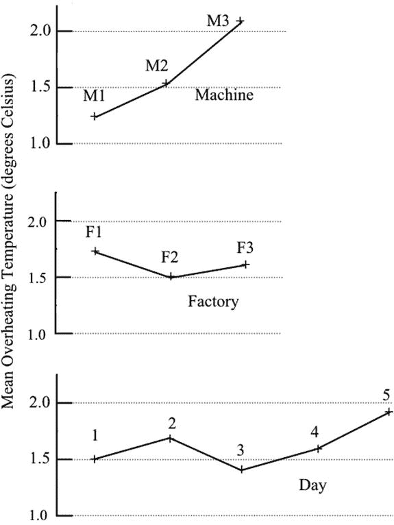
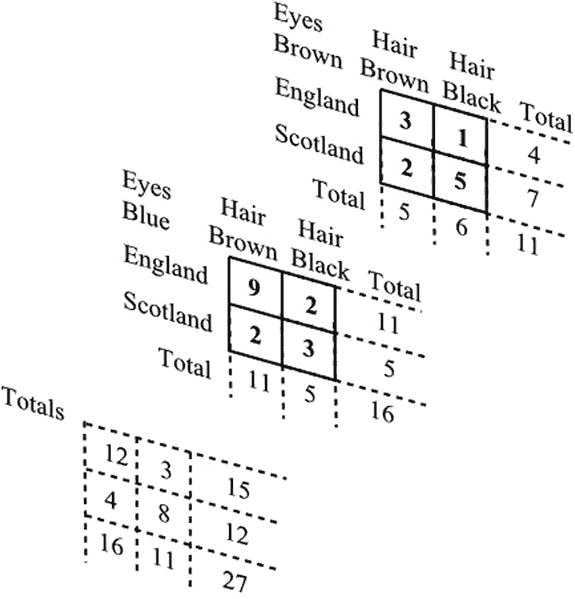
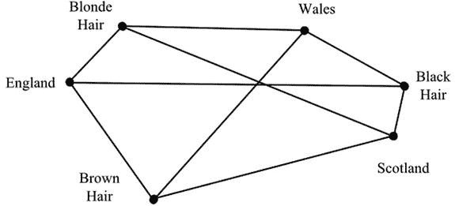

# 十六、多元数据

Variety Is the Spice of Life

实际问题常常使获得均匀和相似的样本变得困难。例如，样本可能涉及不同年龄的个体，并且可能必须在一周的不同天采集。每个人都有很多不同之处，不同的日子会产生不同的影响。可以很正确地说，样本不同是因为各种效应总是存在，每一种效应都会产生差异。换句话说，无论我们的目标是如何获得同质样本，我们最终都会产生多重效应。在过去，当分析涉及冗长的程序时，这是一件麻烦事。现在，随着提供快速和更通用处理的计算机软件包的出现，多变量数据分析被认为是一个很大的优势，并在许多领域取代了我刚才描述的简单方法。

快速计算机处理的可用性带来了其他的特点。一个是越来越多的新方法出现。新方法在处理过程中带来了更大的复杂性，但是在理解所涉及的细节方面有更大的困难，并且在它们对特定情况的适用性上有争议。容易处理的一个伴随的缺点是，它变得容易搜索任何可能的关系，似乎是由数据暗示的。正如我以前指出的，如果寻找足够多的相关性，就会发现一些虚假的相关性，这仅仅是因为决定显著性的概率。应该在检查数据之前定义所寻求的关系。

第 4 章提到了许多组织拥有的大型数据库。数据是未知有用关系的潜在来源；复杂的计算机密集型程序被用来提取这些关系。这个过程被称为数据挖掘，开发和应用这种方法的进展已经将数据挖掘本身提升为一个重要的课题。在某种程度上，这与我上面所说的相矛盾，即在搜索数据之前，需要定义可能的关系。这个问题将在第七部分进一步讨论。

计算机处理的一个缺点是失去了处理的可视性。数据被输入程序，结果很快显示出来。在这一章中，试图详细说明数据的处理是没有意义的。对你更有用的将是各种方法的适当性的指南，每种方法做什么的概要，以及解释结果的指南。计算机化程序的另一个缺点是，任何人——即使是对方法、限制和正确解释缺乏了解的人——都可以进行分析并得出结论。

对大样本的需求已经被多次提及。这里，因为涉及许多不同的效应，所以相对于每个感兴趣的效应，样本需要很大。不过，请注意，太大的样本可能会导致大量的影响被发现是重要的，但几乎没有实际用途或意义。在示例中，每个特征都是真实的。样本越大，有意义的变量就越多。最终，随着样本量接近总人口，每个数据的每个特征都变得重要，并反映了人口中每个特征都是真实的这一事实。

你之前已经看到了因变量和自变量之间的区别。因变量是我们观察而不是控制的变量，或者是我们试图预测的变量。自变量是我们固定的或由环境为我们固定的变量。因此，如果我们希望了解疾病如何随年龄变化，疾病是因变量，年龄是自变量。显然，疾病取决于年龄，而年龄不取决于疾病。这两种变量之间的区别对于选择合适的多变量分析方法很重要。

以前，在介绍各种技术时，我们将数字数据与描述性数据分开。当我们处理多元数据时，这种区别就变得模糊了。在同一个关系中，我们可能既有数字数据，也有描述性数据。此外，在某些方法中，我们可以通过使用虚拟变量来用数字表示描述性数据。虚拟变量是代表描述性变量的数字代码。例如，如果我们将男性或女性作为变量之一，男性可以编码为 0，女性编码为 1。对于三个级别的描述，编码可以是 0、1 和 2，依此类推。以下章节中描述的各种方法通常按照从数字到描述的顺序排列；但是正如你将看到的，有相当多的重叠。

## 多次回归

如果有一个因变量和几个自变量，可以使用多元回归。例如，我们可能希望知道一个人在买车时通常要付多少钱，与这个人的年龄、收入和储蓄有关。原理和简单线性回归中的一样([第 14 章](14.html))。观察值和预测值之间的差的平方被最小化。换句话说，分析是根据方差进行的。

使用的关系形式是

y = a+bx1+CX2+dx3+，

其中 y 为因变量(即上例中汽车的成本)，x 1 ，x 2 ，x 3 ，....是自变量(年龄、收入和储蓄等。).字母 a，b，c，d，....表示常数，分析的目的是确定这些常数的最佳值。方程的形式是线性的-换句话说，y 值相对于 x 值之一绘制，其他 x 值保持不变，将产生一条直线。

然而，这并不意味着不能适应曲率。如果数据表明，随着储蓄的增加，储蓄的增加会产生越来越大的影响，我们可以在线性方程中加入 x 3 2 ，即储蓄的平方。等式将会是

y = a+bx+CX2+dx3+ex32

数据可能暗示其他非线性关系，变量的变换可用于适当地修改方程。例如，通过将 x 2 数据值转换为 1/x 2 ，c(1/x 2 可能会取代 cx 2 。如有必要，因变量 y 也可以转换。该方程还可以包含变量之间可能的相互作用。例如，我们可能决定包含一个 f 项(x 1 x 3 )来考虑年龄和储蓄之间的相互作用。换句话说，我们将考虑到储蓄对不同年龄组的影响不同的可能性。必须记住，回归方程的拟合是基于最小化转换变量的误差，而不是原始变量的误差。

当常数 a，b，c，d，…已经计算出来并且回归方程已经得到，我们需要一个方程有用性的度量。多重决定系数 R 2 ，类似于我们在两个变量的简单线性回归中遇到的 r 2 。R 2 以类似的方式表示 y 的变化的比例，这由等式说明。R 2 的值越接近 1，方程就越符合数据。然而，请注意，尽管这个等式可能有用，但它可能不是最好的。可能变量的不同选择或变量的不同变换会给出更有用的方程。

还要注意，随着包含更多变量，R 2 的值将接近 1。事实上，当变量的数量等于数据的数量时，R 2 = 1。随着样本量的增加，R 2 也会增加。R 2 的调整值，即调整后的决定系数，补偿了样本大小和变量数量的增加，通常在计算机软件包提供的结果中引用。

除非样本由总体构成，否则有必要建立用回归方程代表总体的可靠性。第 10 章中描述的方差比检验或 f 检验可用于在适当的显著性水平上检验 R 2 是否不为零，换句话说，是否存在显著关系。此外，回归方程中的每个常数 b，c，d，…可以用 Student 的 t-test 来检验，以确定它是否与零有显著差异以及差异的显著性水平。一个与零没有显著差异的常数表明相关的变量可以去掉而不影响相关性的有效性。

虽然因变量必须是数值型的，但描述性变量可以通过使用虚拟变量包含在多元回归分析中。一种称为典型相关的技术将多元回归的原理扩展到处理几个数值因变量和几个数值自变量。通过使用虚拟变量，该技术可以扩展到处理几个描述性因变量和几个描述性自变量。

## 方差分析

您在第 10 章中看到了如何使用方差分析(ANOVA)来比较两个或多个样本，以确定它们是否来自同一人群。该方法可以扩展到分析受不止一种效应影响的数据。例如，假设我们有学生四个科目的测试结果。我们希望调查男孩和女孩的成绩是否有差异，以及不同科目的能力是否相关。这里我们有两个影响或因素——受试者和性别——这两个都是描述性的。这些是自变量，而因变量是数字，是测试中获得的分数。

因此，数据可能如下所示:

<colgroup><col> <col> <col> <col> <col></colgroup> 
|   | 测试中获得的分数 |
| --- | --- |
|   | 英语 | 数学 | 历史 | 科学 |
| 男孩 | 45, 52, 51,… | 66, 58, 56, … | 59, 51, 46, … | 71, 67, 60, … |
| 女孩 | 70, 64, 55, … | 64, 61, 55, … | 62, 54, 43, … | 66, 62, 59, … |

对于这种类型的分析，有必要有一个数字因变量和几个描述性自变量。方差分析将允许数据中的总方差在各种方差源之间划分。在这个例子中，存在归因于学生性别的差异和归因于测试对象的差异。此外，由于这两种主要效应之间的相互作用，也存在差异。当性别对不同科目的影响不同时，就会产生互动:男生在科学方面可能比女生好，但在英语方面比女生差。分析中未包括的影响也会对总方差产生影响。这是剩余方差。

为了说明该方法，我们将概述一个具有三种效果和数据复制的示例的工作过程。

一家公司有三个工厂，每个工厂都有三台略有不同的机器，版本 1、2 和 3。在大多数日子里，机器会遭受高达 3 度的过热。该公司希望了解过热是否与机器版本或三家工厂的使用环境有关。观察每台机器的工作温度，并记录超过的温度。如果一周中的某一天是相关的，则从周一到周五的五天中进行记录。该练习在接下来的一周重复进行，以给出复制的度量。结果汇总如下:

<colgroup><col> <col> <col> <col> <col> <col> <col> <col> <col> <col></colgroup> 
|   | 机器过热(摄氏度) |
| --- | --- |
| 工厂 | 子一代 | 第二子代 | 第三子代 |
| 机器 | M1 | 货币供应量之二 | M3 | M1 | 货币供应量之二 | M3 | M1 | 货币供应量之二 | M3 |
| 第一天 | Zero | one | Two | Zero | one | one | Two | Two | three |
| 第一天 | Two | Two | three | Zero | one | Two | Zero | three | Two |
| 第二天 | one | Two | three | Two | one | three | one | one | Two |
| 第二天 | Two | one | one | Zero | Two | Two | Zero | three | three |
| 第三天 | one | one | Zero | one | Two | one | one | one | one |
| 第三天 | three | one | Two | one | one | three | one | Two | Two |
| 第四天 | Two | Zero | Two | Two | Two | three | Zero | one | three |
| 第四天 | Zero | three | three | Zero | Two | one | Two | Two | one |
| 第五天 | Two | three | Two | Two | Zero | Two | Two | Zero | Zero |
| 第五天 | three | one | three | Two | Two | three | Two | Two | three |

注意，这里的数字都是小整数。这纯粹是为了使图示简单。在实际情况下，我们希望数字由几个数字组成。

列出的 90 个值有一个差异，这是由许多因素造成的。工厂之间、机器之间以及一周中各天之间的可变性导致了总体差异。每对变量之间以及所有三个变量之间的相互作用可能有所贡献。此外，几乎可以肯定还有其他无法识别的变异来源。差异分析允许在各种因素之间分配总差异。正是方差的这种可加性使得方差分析成为一种强有力的工具。

详细地钻研算术是没有用的:计算机软件包可以完成这项工作。更有用的是对计算的解释。

上表的前三列是 F1 工厂的结果，总共 30 个。如果我们用 30 个值的平均值临时替换每个值，并对 F2 和 F3 进行同样的操作，我们将得到一组 90 个值，其方差将反映工厂之间的任何差异造成的变化。类似地，我们可以获得三组反映由于机器引起的变化的调整值和五组反映由于一周中不同日子引起的变化的调整值。注意，与方差相关联的自由度通过平均值的这种替换而减少。F 的方差只有两个自由度，因为只使用了三个平均值，尽管事实上有九十个数据。

可以进一步细分总体差异。共有 9 组数据，包括因工厂和机器而产生的变化。这是表中的 9 列。通过再次用集合中的平均值替换集合中的每个值，可以计算方差。除去已经获得的工厂和机器的分离效应，我们只剩下一个关于工厂和机器之间相互作用的变量。也就是说，相应机器的行为在某种程度上取决于它位于哪个工厂。

有 15 组数据包含因机器和日期而产生的变化，还有 15 组数据包含因日期和工厂而产生的变化。有 45 组数据，尽管每组只有 2 个值，包括工厂、机器和日期的变化；最后，还有一个完整的 90 个值的集合，它还包括由于其他因素和随机影响而产生的变化。每组值又可以通过用该组的平均值替换每个成员值来临时修改，并且方差可以通过去除单因素影响来调整，留下归因于交互的方差。

我必须补充一点，这并不是一个人实际进行计算的方式——因为你可能会使用一个计算机软件包——但这是一种观察实际正在做什么的方式。

所有这些的结果可以如下所示:

<colgroup><col> <col> <col></colgroup> 
| 变异的来源 | 变化 | 自由度 |
| --- | --- | --- |
| 工厂，F | Zero point four one | Two |
| 机器，M | Five point three four | Two |
| 星期几，D | Zero point six four | four |
| 交互 F-M | Zero point four five | 4 (2x2) |
| 交互 M-D | One point zero eight | 8 (2x4) |
| 互动 D-F | Zero point seven three | 8 辆(4x2) |
| 交互 F-M-D | Zero point two nine | 16 (2x2x4) |
| 剩余 | One point one two | 45 (89–16–8–8–4–4–2–2) |
|   | 总数 | eighty-nine |

剩余方差是在没有任何由特定工厂、特定机器或一周中的特定日子引起的影响的情况下观察到的变化的度量。换句话说，随机或未知的影响正在产生如此大的差异。因此，我们可以检验其他方差是否明显大于剩余方差。要使用的检验是方差比检验，即 f 检验。在上面的例子中，只有一个方差大于剩余方差:机器引起的方差。所以，这是唯一一个需要测试的。方差比为 5.34/1.12 = 4.77，发现在 5%水平上显著。F 统计表格的相关摘录如下所示:

<colgroup><col> <col> <col> <col> <col></colgroup> 
| 显著性水平 5% | 较小方差的自由度 | 较大方差的自由度 |
| --- | --- | --- |
|   |   | one | Two | three |
|   | Thirty | Four point one seven | Three point three two | Two point nine two |
|   | Forty | Four point zero eight | Three point two three | Two point eight four |
|   | Sixty | Four | Three point one five | Two point seven six |

因此，我们可以得出结论，机器之间的差异可能是一个真实的影响。我们还可以得出结论，没有明显的证据表明一个工厂比另一个工厂更容易过热，也没有证据表明过热与一周中的某一天有关。

关于相互作用，还需要提到另外两点。首先，如果一个交互作用被发现是显著的，那么交互作用中的主要因素就不能被检验。这种情况需要进一步调查。第二，如果交互作用不显著，那么它们的方差是剩余方差的附加度量。因此，它们可以与剩余方差合并。

通过汇集一些不显著的方差，我们可以进一步理解方差分析的多面性。将 D、M-D、D-F、F-M-D 和残差方差合并后，修正残差方差的值为 0.89。现在结果如下所示:

<colgroup><col> <col> <col></colgroup> 
| 变异的来源 | 变化 | 自由度 |
| --- | --- | --- |
| 工厂，F | Zero point four one | Two |
| 机器，M | Five point three four | Two |
| 交互 F-M | Zero point four five | 4 (2x2) |
| 剩余 | Zero point eight nine | 81 (89–4–2–2) |
|   | 总数 | eighty-nine |

这里感兴趣的一点是，如果我们在一开始就决定一周中的某一天不太可能对结果有任何影响，我们可以将不同天获得的值视为重复。因此，我们将有 9 个工厂和机器的组合，每个组合有 10 个数据。分析是根据两个主要效应 F 和 M 以及一个交互作用 F–M 进行的。结果将完全如上图所示，残差方差为 0.89。

通过绘制一些图表来显示机器过热示例的结果是很有用的。在图 [16-1](#Fig1) 中可以看到机器类型的显著影响，其中每台机器的平均过热温度与机器编号相对应。两个不重要的主要影响的类似图表也显示出来。这些图没有理由一定要有特殊的形状:任何明显偏离水平线的现象都可能表明有显著的影响。

图 16-1。

Comparison of overheating of different machines in different factories on different days

## 拉丁和希腊-拉丁方块

方差分析的一个版本使用拉丁方或 Graeco-Latin 方，通常用于农业实验。例如，如果用作物产量来比较肥料，那么用于研究的土地的肥力就有可能因地而异。显然，不可能在同一时间同一地点测试所有的肥料:每一种肥料都在肥力不同的地方测试。

在拉丁方排列中，矩形测试区域被分成更小的地块，形成行和列的网格。每种肥料每行使用一次，每列使用一次。因此，如果我们有四种不同的肥料，命名为 A、B、C 和 D，其排列如下:

<colgroup><col> <col> <col> <col> <col></colgroup> 
| 列 |
| --- |
| 行 | A | B | C | D |
| B | C | D | A |
| C | D | A | B |
| D | A | B | C |

这对应于 16 个作物产量数据，处理 A、B、C 和 d 各 4 个。作物产量为因变量，肥料品牌和土壤肥力为自变量。差异分析可安排如下:

<colgroup><col> <col> <col></colgroup> 
| 变异的来源 | 变化 | 自由度 |
| --- | --- | --- |
| 行 | XXX | three |
| 列 | XXX | three |
| 肥料 | XXX | three |
| 剩余 | XXX | six |
| 总数 |   | Fifteen |

行和列的变化反映了整个实验区土壤特性的变化。请注意，没有列出交互的差异。这是拉丁方设计的结果。给定肥力的一块地只施一种肥料，可大大节省所需的地块数量。肥料和土壤肥力的实际组合数是 4 x16 = 64。使用 64 块地是不可行的:除了需要更大的试验面积和额外的费用之外，由于试验面积的增加，土壤肥力也会有额外的变化。

一个额外的效果可以通过使用如下所示的希腊拉丁方块来实现。和之前一样，拉丁字母 A 到 D 代表四种处理方法，希腊字母α到δ代表第二种处理方法——杀虫剂:

<colgroup><col> <col> <col> <col> <col></colgroup> 
| 列 |
| --- |
| 行 | A δ | B γ | C β型 | D α型 |
| b 型血 | 一个α | D δ | C γ |
| C a | D β | 一个γ | B δ |
| D γ | C δ | A B | A β |

在拉丁方块中，每种肥料在每行和每列中只使用一次。此外，每种农药每种肥料只使用一次。可以设置不同大小的正方形，但是对于边长为 6 的正方形，这种排列是不可能的。

虽然描述是根据农业实验进行的，因为这是实际应用的主要领域，但是正方形也可以用于其他地方。当出于成本、时间或可访问性的原因，必须将观察次数保持在最低限度时，它们特别有用。

医学研究通常属于这一类。如果需要研究一种疾病的四种不同治疗方法，可以选择四个合适的患者。假设需要一个月的时间来评估每种治疗的效果。上面显示的拉丁方块中的列是四个治疗，行是连续的四个月。字母 A、B、C 和 D 代表四个病人。在一个月结束时，所有四种治疗都将被测试；四个月后，将会有 16 组数据代表每个病人每次治疗的结果。

从这个医学例子中可以看出，拉丁方是一种非常有效的研究方法，特别是当主要效应之间的相互作用被认为不太可能时。如果存在明显的相互作用，其效果将是增加剩余方差，并使验证处理之间的任何显著差异变得更加困难。

可以通过删除一行或一列来修改拉丁方。由此产生的矩形排列被称为尤登广场。

TIRE TRIALS

作为 ZIP Deliveries 的首席会计，Mark Groves 一直在寻找削减开支的方法。该公司经营包裹递送服务，拥有大约 40 辆货车。这个领域竞争非常激烈，成本非常重要。

车辆轮胎的成本相当可观，这也是马克目前正在考虑的。目前，该公司正在购买一种廉价品牌的轮胎，但也许使用一种更贵的品牌会有所回报，从而获得更长的使用寿命。

其他三个品牌也很容易买到，马克提出了一个实验，将它们与目前使用的品牌进行比较。他想到了一种拉丁式的正方形排列。四辆货车将安装新轮胎，每辆货车都有不同的品牌。这四辆货车，每辆都有固定的司机，将构成一个 4 × 4 的拉丁正方形。四条日常路线，每一条都有相似的距离，但是，当然，不同的路况，将构成广场的行。

在实验中，每辆货车将在每条指定路线上行驶一个月。轮胎磨损将由车库维护小组通过测量胎面深度来记录。

拉丁方排列确保了四个不同车手的影响和四条不同路线的影响将与不同品牌轮胎的影响分开。

实验获得批准后，马克拿起一个标准的 4 × 4 拉丁方块，将列随机排列，将行随机排列，并将四个品牌分配给字母方块 A、B、C 和 d。这为四辆货车提供了路线表，试验继续进行。

试用期结束时，马克分析了结果。他发现货车造成的差异并不显著。由于路线造成的差异在 5%的水平上是显著的，这可能并不太令人惊讶。重要的是，轮胎品牌的差异非常显著，在 5%的范围内。因此，不同品牌之间的差异可以被认为是真实的。

对于每个品牌，Mark 使用轮胎磨损值和成本来计算哪个品牌最划算。结果发现这是其中一个比较贵的，所以这次练习没有浪费时间，这让马克松了一口气。决定轮胎合同也要做相应的修改，这一天剩下的时间里，马克脸上都带着微笑。

## 多维列联表

你在第 15 章中看到了如何通过列联表来比较两个描述性变量之间的关联。如果我们有两个以上的变量，我们实际上有一个三维或更多维的表。当然，这样的表格可以被布置成几个二维表格；但是为了解释如何进行，通过尝试给出三维的透视图来强调情况的多维性质是有用的。这已经在图 [16-2](#Fig2) 中完成。

三个自变量是出生地、头发颜色和眼睛颜色，因变量是病例数。任务再次是基于变量没有显著影响的假设，用期望值临时替换实际采样值。换句话说，这些值与从每个类别的总体比例中获得的值没有显著差异。然而，与只有两个变量的情况不同，没有唯一的期望值。确定最佳期望值需要判断。

图 16-2。

A three-way contingency table

为了找出问题所在，考虑从图 [16-2](#Fig2) 中提取的蓝眼睛表格。预期值如下:

<colgroup><col> <col> <col> <col></colgroup> 
| 期望值 |
| --- |
| 蓝色的眼睛 | 头发 | 头发 | 总数 |
|   | 褐色的 | 黑色 |   |
| 英格兰 | Seven point six | Three point four | Eleven |
| 苏格兰 | Three point four | one point six | five |
| 总数 | Eleven | five | Sixteen |

比如 7.6/11 = 3.4/5 = 11/16。

如果我们现在从上方俯视我们的三维表，顶层如下所示:

<colgroup><col> <col> <col> <col></colgroup> 
| 英格兰 | 头发 | 头发 | 总数 |
| --- | --- | --- | --- |
|   | 褐色的 | 黑色 |   |
| 眼睛棕色 | three | one | four |
| 蓝色的眼睛 | nine | Two | Eleven |
| 总数 | Twelve | three | Fifteen |

如果我们计算期望值，我们得到如下结果:

<colgroup><col> <col> <col> <col></colgroup> 
| 期望值 |
| --- |
| 英格兰 | 头发 | 头发 | 总数 |
|   | 褐色的 | 黑色 |   |
| 眼睛棕色 | Three point two | Zero point eight | four |
| 蓝色的眼睛 | Eight point eight | Two point two | Eleven |
| 总数 | Twelve | three | Fifteen |

比如 3.2/12 = 0.8/3 = 4/15。

我们对英格兰——棕色头发——蓝色眼睛——的期望值现在是 8.8，而我们第一次计算的期望值是 7.6。原因当然是如果排除了棕色眼睛，第一个值是预期的，如果排除了苏格兰，第二个值是预期的。同样的问题也出现在出生地、头发颜色和眼睛颜色的八种组合中。

在这些情况下用于解决问题的分析称为对数线性分析。这是一个冗长的迭代过程，需要反复估计期望值，因此需要大量的计算机。标题中的“对数”指的是数值的对数用于在处理中给出附加属性的事实。该技术类似于前面显示的方差分析，用于处理涉及多个变量的数值数据。你可以看到，不仅每个变量有主效应，而且每对变量，每组变量都有交互作用，等等。您还看到了方差的使用允许我们划分主要效应和交互作用之间的可变性。

我们的多维列联表也有类似的情况。这里的相互作用意味着，例如，出生地和头发颜色对眼睛颜色的影响，一起作用，并不等同于单独作用的效果的总和。这个过程涉及到判断的因素。自上而下的方法将基于三个主要影响来估计最佳期望值。如果残差变异性太大，如其显著性水平所示，则二阶相互作用将被包括在内，依此类推。在这个例子中，涉及所有三个变量的三阶交互作用不能被处理，因为它们被采样时的值可能是期望值。如果我们有一个重复的样本，三阶相互作用可以从残差变异中分离出来。“方差分析”一节中给出的例子涉及一个重复样本，并允许这种分离。

另一种处理方向是自下而上。从包括所有主要效应和相互作用开始，检查最高级相互作用的重要性。如果这些相互作用不显著，则从估计期望值的活动中去除。这种情况会持续下去，直到剩下的影响只有可接受的显著性水平。

对数线性分析的一种变体是 logit 分析。这允许使用非数字的因变量，但可以采用两个描述性标签中的一个:例如，男性或女性。男性(或女性)的比例限制在 0 到 1 之间。logit 或 log odds 函数将比例转换为一个从负无穷大到正无穷大的无限范围的值。

## 多元方差分析

方差分析(ANOVA)的扩展是多变量方差分析(MANOVA)。你看到方差分析能够处理多种效应，但只有当我们有一个因变量和几个自变量时。在多元方差分析中，我们能够处理几个因变量。

举个例子，假设要比较两个超市的烘焙部。涉及三种不同的产品:面包、小圆面包和蛋糕。比较所基于的两个相关数字变量是利润和客户满意度。因此，变量如下:

<colgroup><col> <col> <col> <col> <col> <col> <col></colgroup> 
|   | 超级市场 | 超级市场 |
| --- | --- | --- |
|   | 大块烤过的食物 | 小圆面包 | 蛋糕 | 大块烤过的食物 | 小圆面包 | 蛋糕 |
| 利润 | xxx | xxx | xxx | xxx | xxx | xxx |
| 满意 | xxx | xxx | xxx | xxx | xxx | xxx |

对于每个变量的每个级别，都将有一个数据样本，用上面的 xxx 表示。随着数据组数量的增加，对大样本量的需求也在增加。每个组的大小必须大于变量的数量，并且应该至少有大约 20 个数据。

在方差分析中，方差的分割产生方差比 F 的值，该值可用于评估每个自变量对因变量的影响。在多变量分析中，我们使用相应的统计量来评估对每个因变量的每个影响。有许多可能的统计数据:威尔克斯的λ、霍特林-劳里迹、皮莱-巴特利特迹和罗伊的最大根。像在方差分析中一样，首先检验交互作用的影响。如果发现交互作用不显著，那么可以对每个组成变量进行显著性检验。

处理是复杂的，并可能涉及额外的程序，以确保结果的可靠性:因此需要一个合适的计算机软件包。关于数据的基本统计假设也可能需要检查。对结果的解释需要相当小心。因为有许多潜在的影响需要确定，所以测试的能力——即当关系存在时检测关系的能力——可能很低。为了确保足够大的能力来识别小的影响，所需的样本量可能非常大。

## 联合分析

联合分析用于调查顾客对产品或服务的评价。它与其他技术的不同之处在于，研究者在一开始就设定了代表产品真实或假设版本的特征组合。这些是独立变量。因此，被抽样的消费者只是对这些组合进行排名，而不是根据他们回答的性质来创造变量。例如，除臭剂可以制成滚涂型、泵喷型或气溶胶型，每种装在三种颜色的容器中，每种装在两种尺寸的容器中。这将给出总共 18 种可能的组合。三个独立变量——形状、颜色和大小——是描述性的，而因变量是由排列顺序记录的每个组合的偏好。

从每个抽样消费者提供的排名中，可以评估每个因素的部分价值，并考虑交互作用的影响。没有必要向每个回答者展示所有的组合:可以选择一个来提供评估数据。大多数其他方法没有的一个特点是，可以对单个受访者进行评估。来自几个回答者的结果可以被汇总，以提供对产品或潜在产品的单独属性的总体评估。

## 邻近地图

描述性变量之间的关联可以通过地图直观地呈现，在地图上，两个项目之间的关联程度用它们之间的距离来表示。更紧密的间距表示关联程度更高。当然，二维或三维地图可以显示为图表，但如果涉及三维以上的空间，则只能从视觉上欣赏地图的“切片”。

对应分析就是这样一种方法。数据用列联表表示，如第 15 章和本章“多维列联表”一节所述。分析遵循我们为多路列联表描述的程序，在无关联的基础上获得每个单元格的期望值。每个实际值和期望值之间的差异被表示为卡方统计值，这提供了一种关联度量。然后计算与卡方值相关的映射距离:值越大，距离越小。

为了以简单的方式说明这种方法，我们可以使用第 15 章中的双向列联表，将头发的颜色与出生地联系起来。此处重复了该表:

<colgroup><col> <col> <col> <col> <col></colgroup> 
| 观察到的数字 |   |   |   |   |
| --- | --- | --- | --- | --- |
|   | 毛色 |
| 出生地 | 褐色的 | 黑色 | 金黄色的 | 总数 |
| 英格兰 | Eleven | Two | four | Seventeen |
| 苏格兰 | five | eight | Zero | Thirteen |
| 威尔士 | four | five | one | Ten |
| 总数 | Twenty | Fifteen | five | Forty |

在没有关联的基础上，预期数字计算如下:

<colgroup><col> <col> <col> <col> <col></colgroup> 
| 预期数字 |   |   |   |   |
| --- | --- | --- | --- | --- |
|   | 毛色 |
| 出生地 | 褐色的 | 黑色 | 金黄色的 | 总数 |
| 英格兰 | Eight point five | Six point three eight | Two point one three | Seventeen |
| 苏格兰 | Six point five | Four point eight eight | One point six three | Thirteen |
| 威尔士 | Five | Three point seven five | One point two five | Ten |
| 总数 | Twenty | Fifteen | five | Forty |

统计卡方等于预期值和观察值之差的平方除以预期值。对表中的每个单元格进行计算，如下所示。(当观察值小于期望值时，负值在计算卡方总数时被视为正值。)

<colgroup><col> <col> <col> <col> <col></colgroup> 
| 毛色 |
| --- |
| 出生地 | 褐色的 | 黑色 | 金黄色的 | 总数 |
| 英格兰 | Zero point seven four | 3.00(负数) | One point six five | Five point three nine |
| 苏格兰 | 0.35(负数) | Two | 1.63(负数) | Three point nine seven |
| 威尔士 | 0.20(负数) | Zero point four two | 0.05(负数) | Zero point six seven |
| 总数 | One point two eight | Five point four two | Three point three three | Ten point zero three |

这些值为每对变量水平提供了相似性的度量，最大的值代表最大的正关联。负值代表负面联想。(可能需要注意的是，第 15 章中的[使用了上述卡方值之和 10.03，以表明发色和出生地之间存在显著关系。)](15.html)

<colgroup><col> <col> <col> <col></colgroup> 
| 类似 |   |   |   |
| --- | --- | --- | --- |
|   | 毛色 |
| 出生地 | 褐色的 | 黑色 | 金黄色的 |
| 英格兰 | +0.74 | –3.00 | +1.65 |
| 苏格兰 | –0.35 | +2.00 | –1.63 |
| 威尔士 | –0.20 | +0.42 | –0.05 |

我们可以使用相似性值来制作地图。九个值中的每一个都提供了一个距离，用于分隔一对可变级别:值越大，距离越小。图 [16-3](#Fig3) 显示了一个大致的布置。苏格兰黑人排名第一，差距最小，而英格兰黑人排名垫底，差距最大。地图显示了不同程度的关联。棕色和金色的头发与英国人联系紧密，而黑色的头发与威尔士人和苏格兰人联系更紧密。你会意识到分离不可能完全符合要求:必须有一个折衷方案来将变量组合在一起。在实际应用中，计算机软件包会应用迭代过程来优化拟合。

图 16-3。

A map showing association between hair color and place of birth

可以使用的最大维度数比任一变量的最少级别数少 1:在本例中为 2。一个现实的研究可能有更多的变量，每个变量有更多的层次，因此一个地图有更多的维度。为了获得提供一致布置的最佳距离组，则需要冗长的迭代过程，并且只有在计算机程序的帮助下才是可行的。

多维标度类似于对应分析，使用多维图来揭示关联。它的不同之处在于变量在开始时没有被定义；它更多的是从样本数据的分析中建立潜在的变量。该技术将实体之间的相似性或偏好表示为它们在地图上的距离。例如，为了提供一个样本，每个志愿者可以一次比较六种谷类早餐。比方说，这种比较可以在 1 到 10 的范围内。六个项目产生 15 对用于比较；并且为了以一致的方式映射项目，关于正确的相对分离，映射可能需要几个维度。在最小化维数的同时优化映射位置的过程需要判断和重复计算。

所得到的地图尺寸提供了关于潜在特征的信息，这些信息促进了所记录的感知。这可能是因为甜度似乎存在于一个维度，而“脆度”则存在于另一个维度。应当理解，在解释中需要相当多的判断。该方法的一个特点是每个回答者提供一个可以单独分析的样本。当然，可以将单个分析汇总起来。

## 结构方程建模

在迄今为止所讨论的处理多重效应的方法中，一直存在着因变量和自变量之间只有一种关系的局限性。有时需要同时建立几个相互关联的关系。当寻求这种关系的理论的确认时，可以使用结构方程模型，但是在探索阶段它是没有用的。

建立了一个基于理论判断的模型，该模型由通过(假设的)因果关系连接的多个变量组成。因此，如果我们关心一所学校的声誉，例如，我们可以提出考试的成功(a)取决于学生的能力(b)和教学质量(c)。教学质量取决于聘用教师的质量(d)和可用资源的质量(e)。受聘教师的质量取决于考试成绩和地点(f)。学生的能力取决于可用的资源和位置。在符号中，我们有

a = w 1 b + w 2 c

c = w 3 d + w 4 e

d = w 5 a + w 6 f

b = w 7 e + w 8 f

其中 w 1 … w 8 是考虑不同程度影响的权重。实际上，我们有一些类似于一组相互关联的多元回归方程。

处理是复杂的并且不是唯一的。它涉及到路径分析，与因子分析和回归有关。该方法具有包含潜在变量的能力，这些潜在变量不是直接测量的，而是从测量变量中显现出来的。为了获得满意的结果，在建立初始模型、建立可接受的拟合优度以及解释和修改模型时需要非常小心。

## 关联:一些进一步的方法

一些实际情况，如上一节中关于学校声誉的例子，涉及的变量不仅是描述性的，而且是主观的，难以精确定义。变量采用的水平也可能是主观的，难以界定。此外，可能有许多这样的感兴趣的变量。这种情况出现在市场营销和产品开发中。发刷可以在尺寸、形状、颜色、手柄形状、手柄手感等方面有所不同。顾客对牙刷的评价可能包括使用的舒适性、刷牙的有效性、美学吸引力等等。在社会学或心理学研究中，态度和观点可以在两个极端之间变化，没有明确的方法来衡量两者之间的价值。友好、幸运、雄心、痛苦、快乐等等的程度很难衡量。

有一些方法可以通过识别显著的相似性来帮助减少变量及其水平。这些方法中有许多是相互依赖的方法，因为在因变量和自变量之间没有区别。所涉及的数学通常很复杂，需要相当多的背景知识。此外，适当程序的规划和结果的解释需要谨慎。

因子分析是一种分析大量变量之间关系的方法，目的是用较少的因子来表示数据。所有的变量都被平等对待:自变量和因变量之间没有区别。例如，我们可以考虑客户对牙科诊所的各种评价，如预约的难易程度(a)、合适时间段的可用性(b)、在候诊室花费的时间(c)、工作人员的友好程度(d)、工作人员的效率(e)、治疗质量(f)等等。比如说，每项评估都是数字的，从 1 到 10 分不等。将确定每对变量之间的相关性，列出的六个变量产生 15 个相关性。从这些数据中，可以找到变量的最佳分组，使组内方差最小，组间方差最大。例如，可以确定的是，上例中的三组(a)-(b)-(c)、(d)-(e)和(f)足以提供所需的评估。类似的方法是主成分分析。

聚类分析类似于因子分析，但用于对实体而不是变量进行分组。这些实体在显示相似的属性方面彼此相似。集群的特征不是一开始就确定的，而是在过程中出现的。人们可以根据他们的个人特征或特点来分组。这个过程同样适用于所有种类的东西，例如汽车、鸟或帽子。

在多重判别分析中，定义了组，并且该过程在适当的组中定位项目，同时最大化正确定位的概率。该技术处理一个描述性因变量和几个数字自变量。例如，该技术可以用于根据几个数字指定的特征来区分潜在客户和不太可能的客户。

这种处理多元数据的方法的简要概述决不是详尽无遗的。能够以令人难以置信的高速执行迭代程序的计算机的出现，给了统计学家使用和发展越来越复杂的方法的手段。