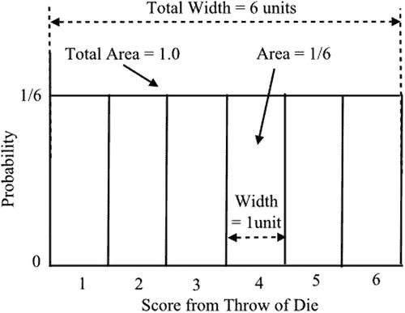
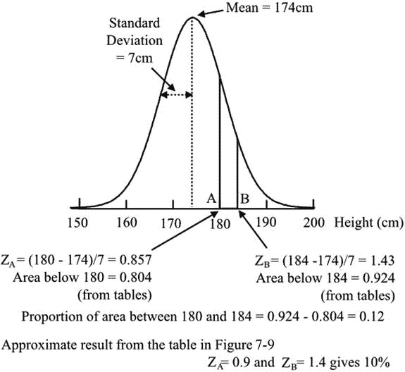
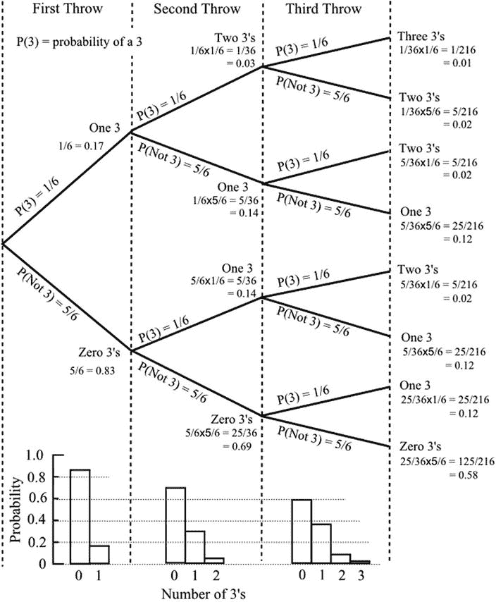
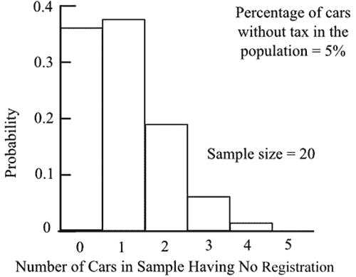
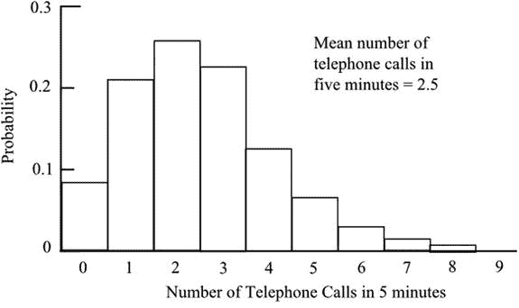
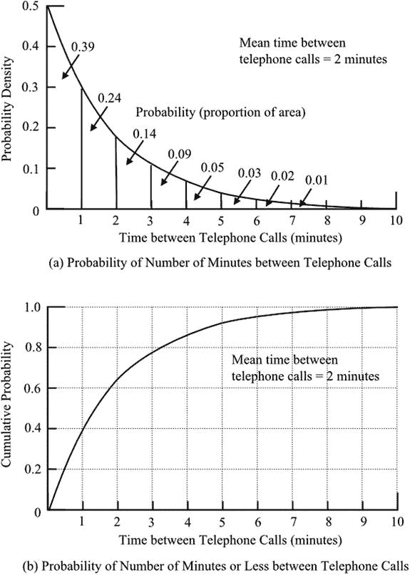
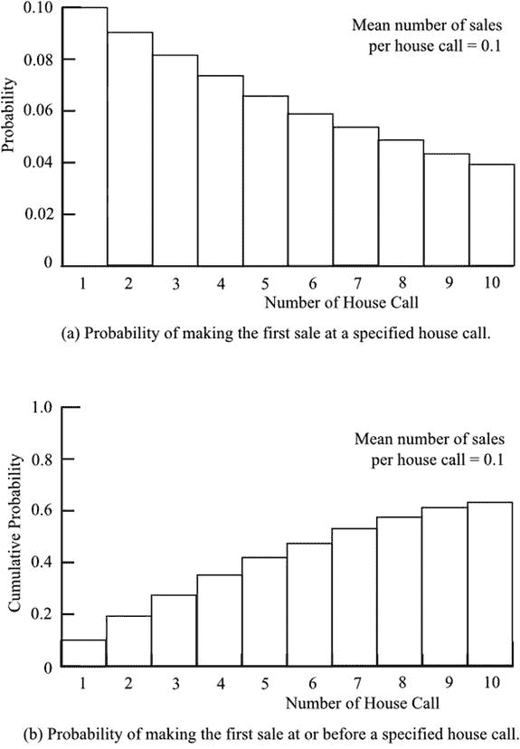

# 十八、根据已知分布来预测

Why Does the Phone Never Stop Ringing?

在前几章中，正态分布占有突出的地位，因为人们发现它能恰当地描述在许多情况下获得的数据。如果事先有充分的理由相信正态分布将适用，那么就可以对未来的观测进行预测。许多其他分布被发现适用于某些情况，并且，以类似的方式，这些可以提供对未来结果的有用估计。本章描述了几种常用的分布，并举例说明了它们在预测中的应用。

## 均匀分布

根据均匀分布进行预测是一个简单的过程，但是有必要简要地考虑一下其中的步骤。从投掷公平骰子获得的分数遵循均匀分布。从 1 到 6 的每个分数都有相等的发生概率。图 [18-1](#Fig1) 显示了分布情况。分布中的总面积为 1.0。如果我们想知道得到 1 或 2 的概率是多少，我们把这两个块的面积相加。因此概率是 1/6 + 1/6 = 1/3。

图 18-1。

A uniform distribution

这非常简单，但它确实让我们很好地了解了当我们考虑非均匀分布时会发生什么。

## 正态分布

您已经看到，正态分布是一个连续的对称分布，中心峰值位于平均值处。标准正态分布的中心均值位于零；控制分布宽度的标准偏差的值为 1。您还看到，分布描述了许多真实情况下的数据分布，在这些情况下，有一个驱动因素会使所有数据呈现相同，但来自不同且通常未知来源的随机误差会造成数据分布。

人们的身高和他们的其他身体尺寸——如臂长、腿长等——应该是正态分布的。服装制造商和零售商需要关于不同尺码服装未来需求的信息。例如，如果从过去的记录中知道陆军新兵的平均身高和标准偏差，就有可能预测未来可能的情况，并确保有合适尺寸的制服。

假设新兵平均身高 174 cm，标准差 7 cm。我们想知道身高在 180 cm 到 184 cm 之间的新兵的比例。这代表正态分布上的一个垂直带(图 [18-2](#Fig2) )，该带的面积表示遇到这些极限之间的值的概率。我们必须将我们的值转换成标准值，这样我们就可以使用公布的正态分布表，我们通过计算 Z 分数来完成这项工作，正如我们在[第 10 章](10.html)中所做的那样。对于我们的每个极限，180 cm 和 184 cm，Z 等于极限和平均值之差，除以标准差。对于 180 cm，Z 为 0.857；而对于 184 cm，Z 为 1.43。实际上，Z 分数用平均值的标准差数来表示每个极限值。

参考表格中的 Z，给出了所需的面积(即概率),从两个极限值得出的两个面积之差，给出了新招募人员的比例。计算结果如图 [18-2](#Fig2) 所示，给出的结果是 12%的新兵预计在我们选定的范围内。利用图 7-9 可以更容易地得到一个近似值。输入 A = 0.9(对于 0.857 的 Z)和 B = 1.4(对于 1.43 的 Z)给出 10%的概率，这大约是正确的。

图 18-2。

Use of the normal distribution to predict the proportion of army recruits within a height range

## 二项分布

第 11 章中的[描述了二项分布。在这里，我们将回顾它的特点，并展示它可能如何用于预测。该分布描述了当只有两种可能的结果时观察到特定事件的概率。因此，如果我们对一个问题有一系列是或否的答案，在已知总体中是(或否)答案的平均数量的情况下，分布描述了是(或否)答案的预期数量。如果我们投掷硬币多次，分布显示获得一定数量正面或反面的概率。](11.html)

如果人口比例从理论上是已知的(如在我们掷硬币的例子中),或者是从以前获得的大样本中估计出来的，我们可以用它来预测随后样本的特征。如果样本很大，二项式分布可以近似为正态分布，我们可以像上一节一样继续。对于 Z 得分，我们取样本比例和总体比例之差，然后除以标准差。二项式分布的标准差是方差的平方根，方差是 NP(1–p ),如前所述，其中 n 是样本中的数据数量，p 是总体比例。

然而，如果样本很小，并且人口比例不接近一半，则二项分布是偏斜的，如图 11-1 所示，我们必须采取不同的方法。为了说明这个过程，考虑投掷骰子几次。我们会看投出 3 的概率，所以两个可能的结果是 3 或者不是 3。当我们掷一次骰子，得到 3 的概率是 1/6，得不到 3 的概率是 5/6。图 [18-3](#Fig3) 中的树形图说明了这一点，这将有助于你评估骰子进一步投掷的结果。如果掷两次骰子，两个 3 的概率是 1/36，一个 3 的概率是 10/36，零个 3 的概率是 25/36，使得总概率为 36/36(即 1)。图 [18-3](#Fig3) 包括投掷骰子三次的结果，此外，还显示了三个阶段中每个阶段的二项式分布。以这种方式计算任意次数投掷的结果是可能的，但是计算变得冗长乏味；通常通过查阅公布的二项分布表来获得结果。

图 18-3。

Tree diagram showing the probability of obtaining a number of 3s in several throws of a die

一个实际的情况是应用道路上 5%的汽车没有注册的知识。这将从记录或大样本中获得。警察可能会考虑随机截停一些车辆，检查是否有未登记的车辆。例如，在随机抽样的 20 辆汽车中，有 1、2 或 3 辆汽车没有登记的概率，可以使用我们在投掷骰子时使用的相同程序来计算。对于 20 的样本量和 0.05 的未注册汽车比例，二项式分布表给出了以下概率。

<colgroup><col> <col> <col></colgroup> 
| 累积的 |
| --- |
| 概率为 0 | = 0.3585 | 0 的概率= 0.3585 |
| 1 或更小的概率 | = 0.7385 | 1 的概率= 0.3773 |
| 2 或更小的概率 | = 0.9245 | 2 的概率= 0.1887 |
| 3 或更少的概率 | = 0.9841 | 3 的概率= 0.0596 |
| 4 或更少的概率 | = 0.9974 | 4 的概率= 0.0133 |
| 5 或更少的概率 | = 0.9997 | 5 的概率= 0.0023 |
| 6 或更少的概率 | = 1.0000 | 6 的概率= 0.0003 |
|   | 总计= 1.0000 |

样本中没有未注册车辆的概率为 36%，这为拟议的抽样安排提供了有用的指导。例如，可以决定应该采用更大的样本量来增加检测到至少一辆未注册汽车的概率。结果如图 [18-4](#Fig4) 所示为概率分布。注意二项式分布的表格给出了累积概率。上面最后一列显示的单个数字的概率是通过减去相邻的累积值得到的。因此，2 辆未注册汽车的概率是 2 或更少的概率和 1 或更少的概率之间的差。

我们可以问在 20 辆车的样本中，平均有多少辆车没有注册，而不是问具体数量的车没有注册的概率。这是由期望值给出的，它等于 np，其中 n 是样本中的数字(20)，p 是比例(0.05)。因此期望值是 1，这是我们一开始就能推断出来的结果。

图 18-4。

Binomial probability distribution of the number of unregistered cars in a sample of twenty

## 泊松分布

当我们处理在时间或空间上随机分散的事件时，泊松分布是相关的。给定时间段内的交通事故数量和足球比赛中的进球数量是时间分布的随机事件的例子。一段链条中有缺陷的链环的数量和一本书每一页上印刷错误的数量就是分布在空间中的随机事件的例子。

泊松分布总体均值的最佳估计是样本均值，总体方差的最佳估计是样本方差。令人惊讶的是，泊松分布的方差等于均值。当平均值较大时，分布接近正态分布，然后可用于预测。例如，如果我们知道总机每天接到的平均电话数量是 200 个，我们可以按照第 10 章中的方法计算 Z 分数。因此，我们可以确定一天接到少至 100 个电话，或多至 300 个电话的概率。

然而，如果我们关注的是较短时间内可能的变化，平均调用次数将会很少。当均值很小时，泊松分布严重偏离正态分布，变得非常偏斜。然后有必要查阅表格来获得所需的概率。例如，我们可能会对我们的电话通话感兴趣，对每五分钟内收到的电话数量感兴趣，以揭示呼叫者可能等待的程度。

假设五分钟内的平均通话次数是 2.5 次。从泊松分布的表格中，我们可以读出在五分钟内到达的各种呼叫数量的累积概率。因此:

<colgroup><col> <col> <col></colgroup> 
| 累积的 |
| --- |
| 概率为 0 | = 0.0821 | 0 的概率= 0.0821 |
| 1 或更小的概率 | = 0.2873 | 1 的概率= 0.2052 |
| 2 或更小的概率 | = 0.5438 | 2 的概率= 0.2565 |
| 3 或更少的概率 | = 0.7576 | 3 的概率= 0.2138 |
| 4 或更少的概率 | = 0.8912 | 4 的概率= 0.1336 |
| 5 或更少的概率 | = 0.9580 | 5 的概率= 0.0668 |
| 6 或更少的概率 | = 0.9848 | 6 的概率= 0.0268 |
| 7 或更小的概率 | = 0.9958 | 7 的概率= 0.0110 |
| 8 或更小的概率 | = 0.9989 | 8 的概率= 0.0031 |
| 9 或更少的概率 | = 0.9997 | 9 的概率= 0.0008 |
|   | 总计= 0.9997 |

最后一列中显示的特定呼叫次数的概率是通过减去相邻的累积值获得的。因此，两次呼叫的概率是 2 或更少的概率和 1 或更少的概率之间的差。概率分布如图 [18-5](#Fig5) 所示。

图 18-5。

Poisson probability of the number of telephone calls in a five-minute period

## 指数分布

指数(确切地说是负指数)分布与泊松分布相关。同样，它涉及在时间或空间上分布的随机事件，但记录的是连续事件之间的时间或距离，而不是给定时间或空间范围内的事件数量。如果我们不像上一节那样记录每个给定时间间隔内到达的电话呼叫数，而是记录每对连续电话呼叫之间的时间，那么数据将由按照指数分布分布的数值组成。指数分布是连续的，而泊松分布是离散的，它是极度偏斜的，最大概率为零。与泊松分布一样，方差等于均值。

图 18-6。

Negative exponential distribution showing the likely spacing of telephone calls

图 [18-6(a)](#Fig6) 显示了连续电话呼叫之间时间的指数分布，假设呼叫之间的平均时间为 2 分钟。这相当于 5 分钟内 2.5 个呼叫的到达率，这在上一节的泊松分布图中使用。因为时间轴是连续的而不是离散的，所以概率是通过评估曲线下的面积来获得的。当使用正态分布时，这是你认为必要的程序。当然，可用的表格消除了相当复杂的计算的需要。

在图 [18-6(b)](#Fig6) 中，显示了累积概率。您可以看到，较短的通话时间间隔比较长的时间间隔更有可能。间隔少于一分钟的概率几乎是 40%。近三分之二的电话间隔不到两分钟，尽管两分钟是平均间隔。

## 几何分布

几何分布适用于在成功之前进行多次尝试的情况。例如，许多游戏和运动都是基于尽量减少击中目标或投掷六分球的次数。与二项式分布一样，可以通过组合概率来构建几何分布。我们可以通过考虑掷骰子时 6 的成绩来说明这一点。

因为投出 6 的几率是 1/6，这就是第一次投出成功的几率。如果直到第二次投掷才成功，第一次投掷一定不是 6，这有 5/6 的概率。第二次投掷以 1/6 的概率产生 6。组合概率——即第二次尝试成功的概率——是 5/6 × 1/6 = 5/36。这就是“与”法则的应用:一个非 6 和一个 6。如果直到第三次投掷才成功，我们必须将两个非 6 和一个最后的 6 组合起来。这样概率就是 5/6 × 5/6 × 1/6 = 25/216。这些概率可以在图 [18-3](#Fig3) 的树形图中看到，我们在讨论二项式分布时使用了它。请注意，当我们考虑每一次后续投掷时，概率会降低。每次投掷成功的概率保持不变，当然是 1/6 的值；但是后面的成功需要前面的失败，而这些失败包含了发生的可能性。

和与之相关的指数分布一样，几何分布是极度偏斜的，在第一次尝试时具有最大概率。几何分布是离散的，而指数分布，如你所见，是连续的。

作为一个实际的例子，考虑一个上门推销员。从公司记录中可以知道，房子卖出去的概率是 1/10。这对于构建以下列表来说是足够的信息:

<colgroup><col> <col> <col> <col></colgroup> 
| 累积的 |
| --- |
| 第一次电话销售的可能性 | = 1/10 | = 0.1000 | 0.1000 |
| 第二次电话销售的可能性，但不是之前 | = (9/10) x 1/10 | = 0.0900 | 0.1900 |
| 第三次电话销售的可能性，但不是之前 | = (9/10) 2 x 1/10 | = 0.0810 | 0.2710 |
| 在第四次拜访时销售的可能性，但不是之前 | = (9/10) 3 x 1/10 | = 0.0729 | 0.3439 |
| 在第 5 次拜访时销售的可能性，但不是在此之前 | = (9/10) 4 x 1/10 | = 0.0656 | 0.4095 |
| 在第 6 次拜访时销售的可能性，但不是在此之前 | = (9/10) 5 x 1/10 | = 0.0590 | 0.4685 |
| 在第 7 次拜访时销售的可能性，但不是在此之前 | = (9/10) 6 x 1/10 | = 0.0531 | 0.5216 |
| 第 8 次致电销售的可能性，但不是之前 | = (9/10) 7 x 1/10 | = 0.0478 | 0.5694 |
| 在第 9 次拜访时销售的可能性，但不是在此之前 | = (9/10) 8 x 1/10 | = 0.0430 | 0.6124 |
| 在第 10 次拜访时销售的可能性，但不是在此之前 | = (9/10) 9 x 1/10 | = 0.0387 | 0.6511 |

到第十次调用时的分布如图 [18-7(a)](#Fig7) 所示。分配无限期地继续下去:推销员，可怜的家伙，可能永远也不会得到一笔销售，但在大量拜访后得不到一笔销售的概率是非常小的。

图 18-7。

Geometric distribution of the first success in a sequence of house calls

图 [18-7(b)](#Fig7) 中显示的累积值可能是销售员和他的公司更感兴趣的。这些显示了在第一次拜访、第二次拜访、第三次拜访等情况下的销售概率。随着调用次数的增加，累积值接近值 1，这反映了这样一个事实，即销售的概率随着调用次数的增加而增加，并且在调用次数无限的情况下将成为确定性的。

## 威布尔分布

威布尔分布是一种具有复杂数学描述的连续分布。定义中的形状参数可以取一定范围的值，以给出不同形式的分布。在一种形式中，分布与指数分布相同，而在另一种形式中，它近似于正态分布。

该分布在描述正偏斜的数据时特别有用，在低值处有一个峰值，然后逐渐变小，直到很少但很大的值。组件的故障——例如滚珠轴承——经常遵循这种分布。其他应用包括制造和交付时间，以及风速分布等气象数据。极值理论，处理不寻常事件的低概率——如大洪水、野火、反常海浪和巨额收入——利用了威布尔分布。