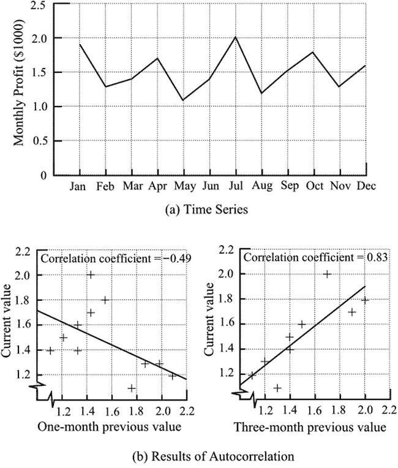

# 十九、时间序列

Yesterday Rain, Today Rain, Tomorrow...?

预测最困难的领域之一是处理时间序列。过去三年我们的利润是 x、y 和 z，那么明年会是多少呢？不幸的是，我们可能会说，这也许是商业和商业世界中最需要预测的领域。在英国，很可能在其他地方，涉及股票和其他投资产品销售的文件必须带有警告“过去的表现不能作为未来表现的指南。”

## 回归

问题实质上是根据先前时间段的数据知识来预测与下一个时间段相关的数据。在第 14 章中，我解释了应用于两个变量之间关系的回归分析技术，并展示了如何推导出描述这种关系的数学表达式。时间序列可以被视为两个变量之间的关系，使用这种技术可以获得数学关系。然后，该关系可以给出未来时间的预测值。

这种方法存在许多问题。首先，我们将外推一个超出其适用范围的相关性。当然，正如我以前说过的，我们必须以这样或那样的方式进行推断，我们确实在寻找最不可取的程序。第二个问题是，我们在没有理由的情况下将数据拟合成直线或平滑曲线。这与在建立基本物理性质之间的关系时使用这些相关方法非常不同，基本物理性质通常根据明确定义的定律彼此平滑变化。第三个问题是，我们无法确切知道我们的预测有多准确。

关于我们预测的准确性，我们可以说，相对于我们过去数据的范围，我们对未来的扩展是适度的，误差不大。我们也可以给预测值的最大可能精度赋值。我们将知道相关性的可靠性，这是对现有数据点的相关性估计精度的度量。对未来数据点的估计不可能比这更精确，因此我们有一个预期的最佳精度水平的度量。换句话说，相关性在预测未来值方面不可能比预测已知的过去值更好。

如果你回顾一下在第 14 章中讨论的时间序列以及图 14-10 中的图表，你会想起一个简单的线性回归得出的相关系数 r = 0.70。通过使用移动平均数，相关系数增加到 0.99。这为数据显示的上升趋势提供了强有力的证据，但上升趋势本身对短期内预测月度表现没有什么价值。从长远来看，问题在于不得不在现有数据范围之外进行推断。

## 自相关

自相关提供了一种检查过去不同时间的数据之间是否存在相关性的方法。选择并比较来自不同时间的数据对。如果比较显示了显著的关系，那么有证据表明过去的值可以用来预测未来的值。

我们希望每天的温度与前一天的温度有一定的关系。这两者在几天内的相关性将为我们预测第二天的温度提供基础。它不会是完美的，但会有一定程度的成功。如果我们考虑月平均温度，并与前一年相应月份的温度值建立关联，我们会取得更大的成功。事实上，这是在设定不同地点的预计月气温时使用的方法。

当然，并非我们必须处理的所有事情都具有天气和气候的可重复性，但在与商业活动相关的数据中，可识别的周期性变化并不少见。我们可以用下面的数据来说明一个实际应用，这些数据显示了一家公司的月利润，比如说，以千美元计。数据绘制在图 [19-1(a)](#Fig1) 中。

图 19-1。

An example of autocorrelation

<colgroup><col> <col> <col> <col> <col> <col> <col> <col> <col> <col> <col> <col></colgroup> 
| 一月 | 二月（February 的缩写） | 瑕疵 | 四月 | 五月 | 六月 | 七月 | 八月 | 九月 | 十月 | 十一月 | 十二月 |
| One point nine | One point three | One point four | One point seven | One point one | One point four | Two | One point two | One point five | One point eight | One point three | one point six |

通过对以下两组数据进行简单的线性回归分析，可以获得每个值与前一个月的值之间的相关性:

<colgroup><col> <col> <col> <col> <col> <col> <col> <col> <col> <col> <col> <col></colgroup> 
|   | 二月（February 的缩写） | 瑕疵 | 四月 | 五月 | 六月 | 七月 | 八月 | 九月 | 十月 | 十一月 | 十二月 |
| 目前的 | One point three | One point four | One point seven | One point one | One point four | Two | One point two | One point five | One point eight | One point three | one point six |
| 以前的 | One point nine | One point three | One point four | One point seven | One point one | One point four | Two | One point two | One point five | One point eight | One point three |
| (一个月) |   |   |   |   |   |   |   |   |   |

按照第 14 章的程序，回归线方程计算如下

当前值=–0.45×先前值+ 2.16

如图 [19-1(b)](#Fig1) 所示。下个月(下一年的 1 月)的预测值是通过插入上个月的 12 月值 1.6 获得的。预测是 1.4。这是不可靠的，因为数据的相关系数是–0.49，在 5%的水平上不显著。(参见[第 14 章](14.html)，了解产品力矩相关系数显著性水平的选择。)也就是说，回归线的梯度为–0.45，与零没有显著差异。

季节性效应的可能性可以通过使用三个月前的数值来检验。现在两组数据如下:

<colgroup><col> <col> <col> <col> <col> <col> <col> <col> <col> <col></colgroup> 
|   | 四月 | 五月 | 六月 | 七月 | 八月 | 九月 | 十月 | 十一月 | 十二月 |
| 目前的 | One point seven | One point one | One point four | Two | One point two | One point five | One point eight | One point three | one point six |
| 以前的 | One point nine | One point three | One point four | One point seven | One point one | One point four | Two | One point two | One point five |
| (三个月) |   |   |   |   |   |   |   |

回归线的方程式计算如下

当前= 0.79 ×先前+ 0.33

其中，上个月(12 月)的值为 1.6，下一个月(1 月)的预测值为 1.6。数据如图 [19-1(b)](#Fig1) 所示。相关系数为 0.83，在 1%水平上显著。显然，这是一个比上一个更好的预测。

## 指数平滑法

在第 14 章的[中，我们展示了一个时间序列的例子，并描述了移动平均的使用如何对图形的形状产生平滑效果。如果我们假设图中的波动是由于随机效应，而不是有意义的效应，我们可以决定移动平均线图将提供一种预测未来值的方法。为了实现一些改进，我们可以认为最近的数据点比旧的数据点更能预测未来。因此，我们可以在计算移动平均数时应用加权程序。这种想法让我们想到了指数平滑法。](14.html)

在指数平滑法中，时间周期的预测值从最早的开始连续计算。每个下一个周期的值是通过将当前值的比例α(希腊字母α)与以前类似产生的预测值的比例(1–α)相加而获得的。比例α介于 0 和 1 之间:比例 1 保持当前值不变，比例 0 用以前的值替换整个值。公式是

ft+1= dt+(1-α)ft

其中 F t+1 =下一期预测

F t =应用于当前期间的先前预测

D t =当前实际值

α =加权系数

因为每个预测都直接依赖于前一个预测，所以它也依赖于所有前一个预测，尽管预测越新，依赖性就越大。

下面是一个小例子，使用 0.2 的加权因子来说明这个过程。假定的销售数字连续显示了六个时期。还显示了第七个期间的预测值。

<colgroup><col> <col> <col> <col> <col> <col></colgroup> 
| 时期 | 销售 D t | 预测 F t | 下一周期 F t+1 的预测 | 误差 Ft–Dt | 误差平方 |
| one | Fifty |   |   |   |   |
| Two | Forty-six | Fifty | Forty-nine point two |   |   |
| three | Fifty-three | Forty-nine point two | Forty-nine point nine | –3.8 | Fourteen point four |
| four | fifty-two | Forty-nine point nine | Fifty point four | –2.1 | Four point four |
| five | forty-four | Fifty point four | Forty-nine point one | Six point four | Forty-one |
| six | Fifty-one | Forty-nine point one | Forty-nine point five | –1.9 | Three point six |
| seven |   | Forty-nine point five |   |   |   |
|   |   |   |   | 总数 | Sixty-three point four |
|   |   |   |   | 平均 | Fifteen point nine |

每个期间的误差是实际销售额 D t 和预测值 F t 之间的差值，预测值是根据以前的销售额计算出来的。总误差通常用均方误差来量化。

在执行这一程序时，我们必须作出两个选择。首先，我们必须决定加权因子。较大的值给予最近的销售额较大的权重，而较小的值给予较早的销售额较大的权重。第二，因为我们没有以前的预测值，我们必须决定用什么作为 F t 的第一个值。该示例使用了值 50，这是前一时期的实际销售额。

为了实现可接受的预测，需要最小化总体误差；但是要做出两个有些随意的选择，手动实现这一点并不容易。当然，有现成的计算机程序可以快速运行一系列场景，以达到最小均方误差。

所描述的方法被称为单指数平滑，仅使用一个加权因子。当数据随着时间的推移近似恒定并且上下变化是随机的时，该方法工作良好。然而，在许多情况下，数据点会显示一种趋势，随着时间的推移而增加或减少。然后需要双指数平滑。引入第二个常数β(希腊字母β)来调整每个先前区间的趋势。第一个平滑常数以类似于单指数平滑的方式应用于趋势调整值。

除了趋势之外，时间序列通常显示周期性变化，可以是每天、每月、每季或每年。为了包括周期性变化的影响，可以包括第三个平滑常数γ(希腊字母 gamma ),以给出三重指数平滑。

指数平滑法本质上是一种试错法，但很容易用现有的计算机软件来处理。然而，值得指出的是，这种方法有许多变种，所以不是所有的计算机程序都产生相同的结果。

请注意，在指数平滑中，与回归不同，不考虑拟合曲线的预期形状。该预测实质上是基于最近的值，该最近的值是根据每个先前的值对该系列中下一个值的预测程度而修改的。

PLUMB WISE

劳顿管道供应公司位于城镇边缘的一个工业园区。这是一家小企业，由老板比尔·劳顿经营，向当地商人和 DIY 爱好者提供工具和管道消耗品。厨房和浴室配件也向公众出售。

铜和黄铜价格的上涨严重影响了存货的价值，而且由于塑料管道和配件的使用越来越多，许多存货已经变得滞销。尽管如此，比尔意识到有必要保持顾客所需的库存，以留住他们。他意识到他的库存控制和提前订购的做法一团糟，需要整理。

他和不同的同事谈过这件事，有人建议他应该花些时间检查他的销售记录，并采用一种合理的例行程序，也许以某种形式的时间序列分析为指导。

带着当地图书馆的一本统计学书籍，比尔研究了各种可能性。由于铜和黄铜销售的下降趋势，以及塑料销售的上升趋势，他认为指数平滑法似乎是有用的。它承诺了应对随机波动和潜在趋势的能力。纳入周期性变化也可能有好处，因为在冬季，当许多住户遭受管道冻结和中央供暖故障时，管道系统的销售会增加。

在这个阶段，他需要帮助。通过他的许多关系，他找到了一个经营电脑维修业务的当地 IT 专家。只需支付适当的费用，比尔就在他的电脑上安装了一个合适的软件包，并进行了几次简短的辅导。

比尔对这一过程非常着迷，并用这一技术分析了他的大部分股票的销售记录。他意识到，收益不会立竿见影，但会随着时间的推移而改善，尽管很快就可以看出，系统正在认识到他最关心的趋势。他也很精明，明白没有统计分析会给出准确的答案，他在商业中的实践经验仍然是必需的。留住客户总是要求将安全边际纳入他的前瞻性规划中。