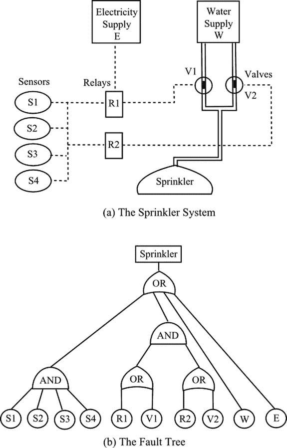
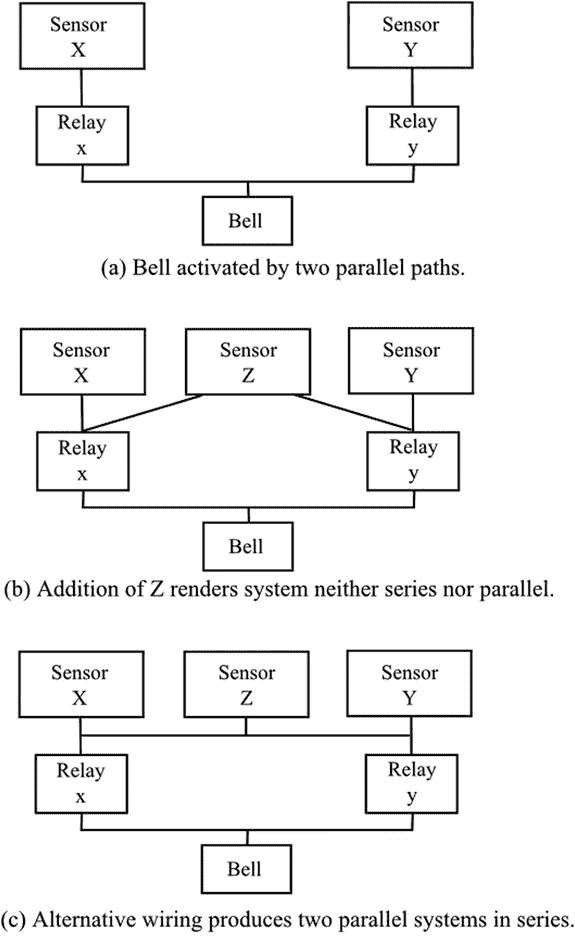

# 二十一、可靠性

Would You Trust That Bungee Cord?

统计学在可靠性研究中起着重要的作用，但只代表了所涉及的数学理论的一部分。部件、机器或系统的可靠性可以定义为在要求执行功能的操作条件下，以期望的方式执行所需功能的概率。因此，可靠性 R 是一个概率，其值在 0 和 1 之间，0 表示立即失效，1 表示(不可能)不会发生失效。失败的概率是 1–r。

## 基本原则

机器和系统由许多部件组成。组件本身是由零件组装而成的。单个部件的故障可能会导致整个系统的故障，也可能不会。链节断裂会导致链条断裂，但钢丝绳中单股钢丝断裂不会导致钢丝绳断裂。因此，由于所涉及的项目数量以及这些项目在大会运作中相互作用的方式，可以看出分析是复杂的。简单的系统可以用组合概率的规则来分析，通过观察这些规则，我们可以理解其中的含义。

在钢丝绳的情况下，假设一股钢丝绳在要求的运行时间内出现故障的概率为 0.001。绳子有三股，直到三股都失效，绳子才失效。我们这里有一个平行的情况:三个股是相互平行的，故障模式被称为平行。对于绳索的失效，我们要求第一、第二和第三股都失效。这是一个“和”的情况；正如我们在[第 3 章](03.html)中看到的，概率必须相乘，当然假设一条链的故障独立于其他链的故障。因此 0.001 × 0.001 × 0.001 = 0.000000001 是绳索失效的概率。应该注意的是，这些值是不现实的。

上面提到的链环在物理上是串联的，我们可以将故障概率表示为一个系列。如果一个环节在要求的运行周期内发生故障的概率为 0.001，那么，对于三个环节，如果第一个、第二个或第三个环节发生故障，则链会发生故障。这是一个“或”的情况；正如我们在第 3 章中看到的，我们需要增加概率。因此，链条(尽管只有三个链环)的故障概率为 0.003。观察力敏锐的读者可能已经发现这里有一个错误。这三个事件并不相互排斥。我们没有适当考虑所有的可能性:两个或所有三个环节都可能失败。此外，如果我们认为只有一个环节出现故障，我们必须根据“与”规则，将另外两个环节的存在考虑在内。有 3 个链接，总共有 8 种情况，这里列出了每种情况的概率:

<colgroup><col> <col> <col> <col> <col></colgroup> 
|   | 链接 1 | 链接 2 | 链接 3 | 可能性 |
| one | 不会失败 | 不会失败 | 不会失败 | 0.997,002,999 |
| Two | 不会失败 | 不会失败 | 失败 | 0.000,998,001 |
| three | 不会失败 | 失败 | 不会失败 | 0.000,998,001 |
| four | 失败 | 不会失败 | 不会失败 | 0.000,998,001 |
| five | 不会失败 | 失败 | 失败 | 0.000,000,999 |
| six | 失败 | 不会失败 | 失败 | 0.000,000,999 |
| seven | 失败 | 失败 | 不会失败 | 0.000,000,999 |
| eight | 失败 | 失败 | 失败 | 0.000,000,001 |
| 总共 2 到 8 个(至少一个链路出现故障) | 0.002,997,001 |

从表中的数值可以明显看出两件事。首先，场景 2 到 8 的总概率显示，至少一个链路发生故障的概率非常接近我们最初提出的值 0.003。这反映了这样一个事实，即当一个组件的故障概率非常小时，两个或更多组件在同一时间段内发生故障的概率甚至更小，即与单个故障概率的精确度相比微不足道。在实际情况下，故障概率比我们的简单例子要小得多:一个由几百个环节组成的链，每个环节在运行期间的故障概率高达 0.001，这是完全没有用的。因此，当在可靠性情况下遇到“或”规则时，通常可以在不损失精度的情况下将各个概率相加。

上述值的第二个有趣之处在于，通过计算所有三条链路发生故障的概率，并从 unity 中减去该值，可以更容易地获得至少一条链路发生故障的概率。

对于由许多部件组成的组件，将会有串联项目组和并联项目组，并且这些组可以与其他组以串联或并联的方式组合。图 [21-1(a)](#Fig1) 显示了一个由电源和水源、传感器、继电器、阀门和喷头组成的喷水灭火系统的假想例子。可以通过故障树进行分析，如图 [21-1(b)](#Fig1) 所示。各种项目相互关联，以显示每个项目对其他项目功能的依赖。根据依赖是串联还是并联来标记连接:换句话说，依赖是“与”还是“或”从树的底部开始，我们将插入组件的单个故障概率。我们将向上工作，在与门相乘，在或门相加。最终的故障概率将从 1 中减去，以给出可靠性。

图 21-1。

A hypothetical sprinkler system and its fault tree

项目可以以既不是串联也不是并联的方式组合。图 [21-2(a)](#Fig2) 显示了一个由两条平行路径激活的铃；但是增加了 Z，如图 21-2(b) 所示，使得系统既不是串联也不是并联(Smith，1976: 66)。X 或 Z 确保激活 X，Z 或 Y 确保激活 Y。X、Z 和 Y 不平行，因为 X 不激活 Y，Y 也不激活 X。将该图与图 [21-2(c)](#Fig2) 中的图进行比较，该图显示 X、Y 和 Z 平行，并作为一个单元与 X 和 Y 的平行排列串联

图 21-2。

A diagram showing that some systems may be neither series nor parallel

一些这样的安排可以用你在第三章遇到的条件概率来处理。在图 [21-2(b)](#Fig2) 所示的例子中，首先考虑 Z 失败的条件(概率 P z )。那么我们实际上有了图 [21-2(a)](#Fig2) 所示的安排，我们可以用正常的方法计算失效概率(P 1 )。接下来考虑 Z 不失效的条件(概率 1–PZ)。x 和 Y 现在是不相关的，我们只需要并行计算 x 和 Y 的失效概率(P 2 )。把这两种情况合在一起，现在就出现了“或”的情况:Z 失败，或者 Z 不失败。因此，系统的故障概率为

pzXP1+【1–pzXP2

可靠度是 1 减去这个值。

## 可靠性数据

我们在第 4 章中详细讨论了抽样，我们主要关心的是确保样本能够代表感兴趣的总体。当然，在可靠性调查中，这个因素仍然很重要，但是现在有了一个额外的复杂因素，即不容易获得样本数据。一些项目，例如电子元件，在长期使用条件下进行测试，直到出现故障。获得平均故障时间(MTTF ),并可用于预测组件的可靠性。这种方法的一般应用有严重的局限性。对许多项目来说，测试时间将会很长，费用也很高，而且创造真实的服务条件也很困难。当预期的服务寿命很长时，根本没有时间进行故障测试。例如，必须使用加速试验，包括过大的力、速度或环境条件，尽管这意味着试验条件不能精确地再现使用条件。可以通过同时测试多个项目并在一定比例的项目失败时缩短测试时间来缩短测试时间。测试整个组件的故障通常是更好的选择，但必须考虑时间和成本。

当测试失败是不可能的，历史证据可以使用。已经使用了一段时间的物品将产生关于失效时间的数据。在新颖、复杂的结构中，很可能许多部件都有在其他应用中的使用历史，这将为它们的预期可靠性提供一些指导。

## 分布

可靠性分析中使用了许多不同的分布。正态分布可能适用于以明确定义的方式发生故障的简单项目；但是随着项目和部件变得越来越复杂，人们发现假设故障是随机事件并且故障概率采用恒定值更有用。因此，使用了泊松分布和相关的指数分布，泊松分布表示在选定时间段内随机事件数量的概率，指数分布表示随机事件之间特定时间段的概率。

经常使用威布尔分布。在第 18 章中指出，这种分配有很大的灵活性。当故障是由随机事件引起时，它可以描述一个恒定的故障率，这是在组件的大部分生命周期中可能出现的情况。当组件是新的时，故障率通常较高，但在下降。这是预烧期，该分布可用于降低故障率。接近使用寿命的末期(磨损期)，故障率增加，并且，威布尔分布可以应付。

## 实际的复杂情况

实际上，大多数机器和设备直到故障时才运转。进行检查和维护，在故障发生之前可以更换或翻新零件。显然，这使得可靠性的计算变得复杂。备用系统的使用和降额设备的实践增加了复杂性。

上面提到过，故障通常被认为是一个随机事件，除了在老化和磨损期间。预烧期实际上可以通过运行前的运行和校正来消除，而磨合期实际上可以通过维护来消除。

ALARM BELLS

卢克·罗杰斯是个体户，经营着一家小防盗报警器公司。他购买零部件，为家庭和小型企业设计系统，并进行安装。他向他的客户保证两年，在此期间，他将迅速做出反应，纠正故障并更换任何需要的部件。为了在这段时间后提供保障，他出售了每年可更新的维护合同。

在保修期内，他遇到了大量客户服务电话的问题。故障出在一个继电器上，它经常在安装后几个月就出现故障。他很便宜地大量购买这些继电器，有点愚蠢。就旅行和时间而言，一次服务呼叫的成本对他来说相当可观，而替换继电器的成本当然可以忽略不计。一个隐藏但严重的代价是他客户关系的恶化。

解决办法似乎是废弃继电器库存，购买一批更贵的继电器；但是卢克的女儿路易丝，她在大学学习工程，建议可能有一个更好的选择。她有一些统计学知识，知道故障树。

利用典型的安装电路图和服务电话记录中的数据，她制作了一个近似的故障树。她可以看到电路中有两个继电器，它们实际上是串联的，因此如果其中一个出现故障，系统就会关闭。Louise 计算出，在保证期内失败的概率大约是 0.3。由此，她计算出单次接力失败的概率为 0.16。

Louise 知道并联的组件会降低故障概率(“与”规则)，并意识到如果将一对继电器并联在一起以取代单个继电器，故障概率将从 0.16 降至 0.026(即 0.16 × 0.16)。以类似的方式替换系统中的两个单继电器将给出 0.052 的系统关闭概率。故障概率从 0.3 下降到 0.052，下降了 82%，令人印象深刻。Luke 立即在所有服务呼叫、维护访问和新安装中引入了加倍继电器，直到质量差的继电器全部被处理掉。

路易斯的朋友注意到她在那年的圣诞节得到了一部相当昂贵的新智能手机！