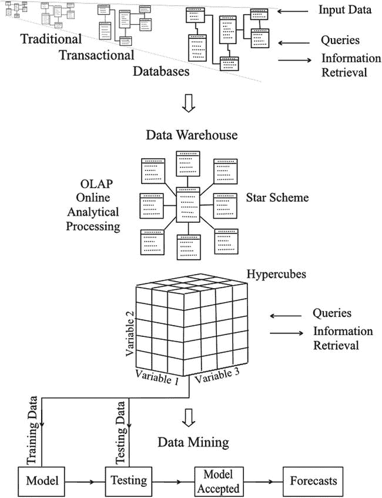

# 二十二、数据挖掘

Twenty-First-Century Gold Rush

数据挖掘是一种从大量数据中产生预测信息的方法。这是商业世界中发展最快的预测方法之一，它对未来的展望令人兴奋。

## 数据的增长

存储大量数据并不新鲜:图书馆自古就有。最近，公司保存了供应商、客户和员工的详细信息。商业交易、购买和销售、费用和利润等等的记录最初都保存在书籍和文件中。后来，数据库的电子存储大大节省了人力和空间。这种数据传统上被用于提供关于公司过去和现在状况的信息，但不作为预测的工具。随着数据库变得越来越大，计算机提供了更快的处理速度和更大的存储容量，这种情况已经改变。经常被引用的摩尔定律说，计算机能力大约每两年翻一番。如果没有这种惊人的增长率，数据库的规模也不可能有类似的增长。

数据库以两种方式发展。如果我们把一个数据库想象成一个二维的数据表，它的行数和列数都在增长。每一行都是一个新数据条目，比如一个新客户或一笔新的销售或购买。数字随着时间的推移而增加；随着存储成为一个越来越少的问题，没有压力消除旧的条目。列代表变量:姓名、地址、产品、日期等。这些增长部分是因为存储不再是问题，部分是因为收集信息变得更容易了。在零售活动中，扫描所购买的每件商品上的条形码可以记录交易，以及同一次购买中的其他商品、时间和日期以及付款方式。如果购买是使用商店信用卡支付的，或者如果出示了会员卡，则可以记录顾客的个人详细信息。互联网提供了大量的数据。每次点击按钮或链接都会增加商店。数据库中许多信息的积累仅仅是因为它变得易于收集和存储，而不是因为它被认为是需要的。

不仅数据库增长了，而且许多数据库的结合产生了数据仓库。大型公司通常会有许多数据库。这些可能位于不同的公司站点，或者在同一站点用于不同的目的。通过将数据库连接在一起，大量的信息就有可能被利用。在计算机存储方面，有大到几 Pb 的数据仓库。一个字节相当于一个文本字符的存储空间:一个千兆字节代表一个大约 6000 英里长的书架上所有书籍的信息。

人们认识到，不仅可以从数据仓库中检索大量信息，而且可以揭示不同变量之间的关系，这就产生了数据挖掘。揭示的关系可能提供一种预测未来趋势和机会的方法。

可用数据的增长每年都在加快。据说，我们在 2013 年拥有的 90%的数据在三年前并不存在。对于大公司积累的数据量来说，现场数据仓库变得不够用了。存储由外部提供商承担的云计算拯救了我们。组织通过使用大型服务器网络为客户提供数据的在线存储和分析。

这是大数据的开端。大数据没有精确的定义:它意味着你拥有的数据比你自己能够处理的还要多。对于像亚马逊或脸书这样的组织来说，这将是数百 Pb，但对于小型企业来说，这可能要小得多。大数据也可以说是传统数据库技术无法处理的数据，要么是因为数据太多，要么是因为数据是非结构化的。

Mayer-schn Berger 和 Cukier (2013 年)以所涉及的数据量的有用指标开始了他们对大数据的全面阐述。谷歌每天处理超过 24pb 的数据。脸书每小时有 1000 万张新照片上传，用户每天点击赞按钮或发表评论近 30 亿次。YouTube 的用户每秒上传一个小时的视频。Twitter 上的消息数量每天超过 4 亿条。一些估计表明，2013 年，世界上每几分钟就有大约 5 EB 的数据产生(FT Reporters，2013)。这个数量相当于一个 3000 万英里长的书架上的书。

大数据通常用三个特征来描述:这三个与。除了数量，还有速度和可变性方面的考虑。速度是指收集、存储和分析数据以及应用结果的速度。这些数据来自过去的交易，如果要用它们来预测未来的事件，就需要快速应用这些结论。数据的可变性是一个给存储方式和随后的分析带来困难的特征。数值数据很容易用传统方法处理；但是涉及文本识别、翻译、语音识别、视频剪辑和音乐的非结构化数据就不那么容易处理了。第四个 V 有时包括在内，指的是真实性。显然，如果要利用分析结果，真实性和可靠性是至关重要的。

因为数据量非常大，所以测试揭示的关系可能非常可靠。这种关系可以用与其发展无关的数据块来检验。当然，当这些关系被用来预测未来事件时，仍然有推断。未来什么都有可能改变。因此，重要的是反复修正这些关系，并立即应用结果。由于这个原因，利用一个现成的预测往往比拖延寻找一个更复杂的预测更好。事实上，技术已经从分析历史数据发展到提供实时结果。

## 数据仓库

数据仓库是通过集合许多传统类型的数据库而产生的，我们可以简单地看一下这些集合起来的数据仓库有什么不同。传统数据库是事务性的，因为它们允许操作人员自动输入新数据(例如，从条形码输入)或手动输入。操作员也可以编辑或删除数据。来自数据库的信息通过输入适当的查询来获得。

数据库是标准化的。这意味着数据存储在许多单独的表中，以确保任何数据只存储一次。例如，同一个供应商可能参与了多次采购，为每次采购重复记录供应商的详细信息是不明智的。重复条目中可能会出现错误，并且地址的改变会导致更新中的问题。结果是单独的表用于供应商详细信息。标准化还涉及到其他阶段，以最大限度地减少异常和冗余，最终结果是在一个相当复杂的网络中链接多个表。这种结构的缺点是，当需要查询时，相关的设置和处理相对较慢。当数据库不是很大时，这种情况是可以接受的，但随着数据库的增长，这种情况会越来越严重。

数据库中的数据自动地、定期地转移到数据仓库中。操作人员不会一点一点地添加或修改数据，因此数据库的规范化结构可以在很大程度上被放弃。这允许表格的星形结构，如图 [22-1](#Fig1) 所示，表格之间的链接较少。中央表称为事实表，包含数字或描述性数据。周围的表被分配给感兴趣的变量，每个表都直接链接到中央事实表。这种安排旨在加速信息的检索。

图 22-1。

The development of data mining from traditional databases

尽管采取了这些措施，但如果没有另外两个因素，信息的检索将不会快得令人满意。一个是引入数据的并行处理。一台计算机一次只能进行一项操作，尽管由于它的速度非常快，看起来它是在进行多任务处理。如果由于要执行的步骤太多，处理速度不够快，那么只有通过增加更多的计算机或处理器来同时并行工作，才能提高速度；这就是我们所做的。

第二个因素是立方体和超立方体的概念，允许自动聚合数据以备检索。图 [22-1](#Fig1) 中包含了一个立方体的示意图。严格地说，它是一个长方体，因为各边的长度不等；但是立方体这个名称已经成为标准术语。立方体的三个轴(边)代表三个变量的级别，立方体的单元包含适当的数据。可以在每个级别的三个方向上进行求和，并且可以存储聚合值，以备检索。

因此，如果我们对不同时间不同商店的产品销售感兴趣，我们要求的许多总数将已经被计算出来并很快得到。比方说，我们可能需要 2011 年在所有商店销售的某个商品的数量，然后请求 2011 年 12 月某个特定商店的总数。

这个例子只考虑了三个变量，但是也可以建立多维的超立方体来表示多个变量。不幸的是，不可能画出它们，尽管就计算机而言，用数学方法定义它们并不是什么特别的问题。

除了合计总数之外，还可以合计其他容易计算的统计指标。因此，可以容易地得到标准偏差和置信限，以及结果的图示，例如以条形图的形式。

## 未来发展

所谓的物联网已经在有限的程度上伴随着我们，但它可能的扩张确实令人难以置信。传感器可以连接到几乎任何东西上，以测量一系列属性并将数据传输到处理中心。任何指定的所需行动的细节可以传送到任何需要信息的地方。一般来说，对发动机和机械的监控已经存在一段时间了，但目前的热门话题是家用冰柜，这些冰柜会保存其内容的库存，并在库存需要补充时发出信号。安装在衣服上的柔性传感器可以检测到何时需要清洗或更换，或者警告扒手或丢失的一串钥匙。更重要的，也是用现有技术更可行的，是通过在病人自己家里远程监控病人来获得健康护理的好处。

最终将为大数据带来更大潜力的两个重要进步是更小的存储和处理设备以及更快的处理速度。

存储或处理特定数量的数据所需的空间量已经迅速减少，目前大约每三年减半。纳米技术的最新进展推动了在原子水平操纵存储单元的研究。2012 年，IBM 宣布成功存储和检索了 12 个原子磁性的 1 比特数据。目前的技术要求每比特大约一百万个原子。2013 年，英国南安普顿大学的研究人员展示了一种激光方法，在一小块熔融石英上实现了 360 万亿字节的数据存储，这种材料非常稳定。同样在 2013 年，剑桥大学的一个团队在一粒合成 DNA 上存储了 154 首莎士比亚十四行诗、一张照片和马丁·路德·金“我有一个梦想”演讲的 26 秒音频剪辑。

随着尺寸的减小，电路过热的问题增加了。这是因为尽管电流很小，但它们非常接近，并且局部温度可能很高。由于光脉冲沿光纤的传播不会产生明显的热量，因此使用光纤有望使器件变得更小。然而，光计算机的生产离未来还有一段路要走。

关于处理速度，并行排列计算机是目前提高处理速度的唯一方法。当第一台实用的量子计算机出现时，一项重大突破有望在未来实现，尽管没人能说它有多远。由于电子、光子等基本亚原子粒子的量子行为，它们有可能同时处于两种状态。原则上，这允许计算机电路不受每个单元必须打开或关闭的限制，记录一位。相反，该单元可以保持两种状态，称为量子位(“量子位”)。这种安排有可能实现并行处理，许多研究正在探索这种可能性。我们饶有兴趣地等待结果！

STOCKING UP FOR STORMS

在任何人听说大数据之前，沃尔玛就已经拥有了大数据，而且不仅拥有了大数据，还利用大数据来改善其业务运营，许多公司在随后的几年里都会争相效仿。

早在 2004 年 9 月，飓风“弗朗西斯”穿过加勒比海，向佛罗里达东海岸移动。正在采取预防措施。人们转移到地势较高的地方，尽可能做好准备。

就在三周前，飓风查理袭击了沃尔玛，沃尔玛意识到在这种困难的情况下，购物习惯可能会与平时大相径庭。高管们可以从 Charley 的经历中看到，预测需求，从而提供符合客户需求的商品应该是可能的。

即使在那时，沃尔玛的电脑上也存储了大约 460 兆字节的数据。这些数据来自 3600 家商店，每周约有 1 亿顾客在这些商店购物。收银台扫描仪逐项记录销售情况。

对与飓风查理有关的现有数据进行了挖掘，结果显示出所需产品的数量超过了正常水平。当然，正如我们所料，手电筒是显而易见的。然而，最畅销的商品是啤酒。没人会想到的产品是草莓馅饼。在飓风来临之前，这些产品的销售增长不是微不足道的，事实上是正常水平的七倍。

分析的结果是，预测的所需物品被运送到飓风弗朗西斯经过的沃尔玛商店，随后报告说，专门为这一事件储存的大多数货物很快售出。