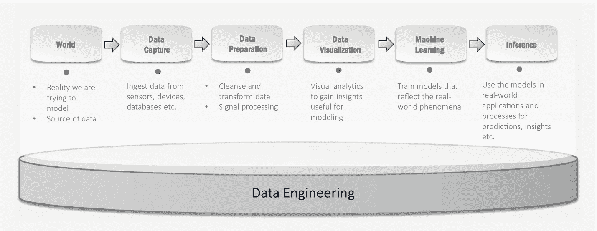
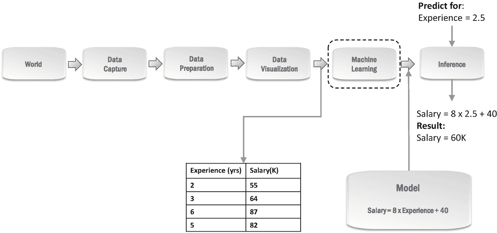
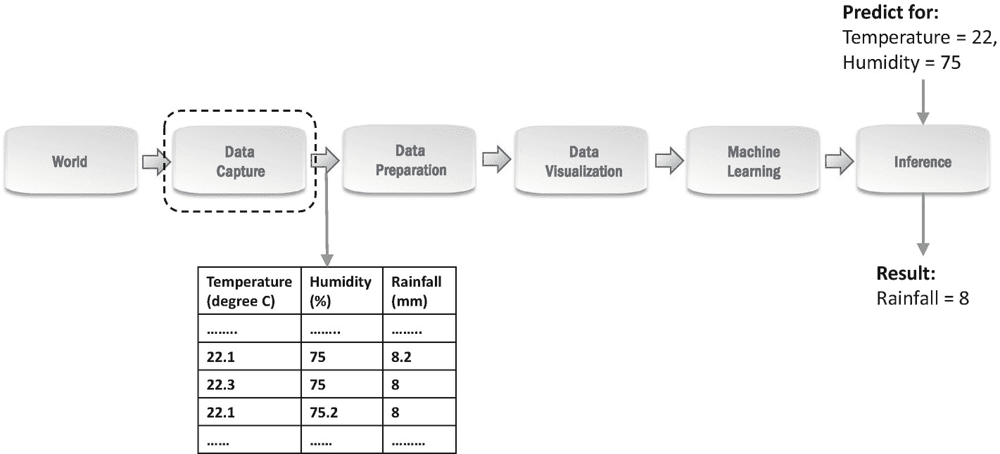
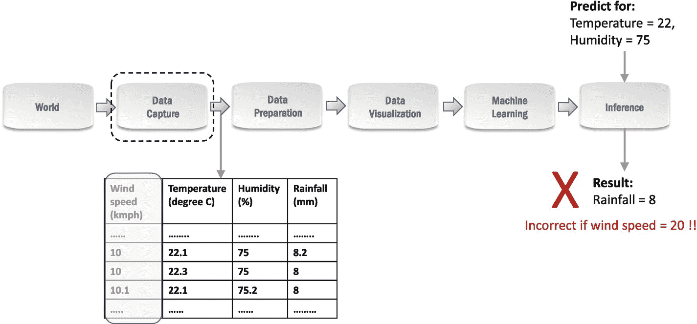
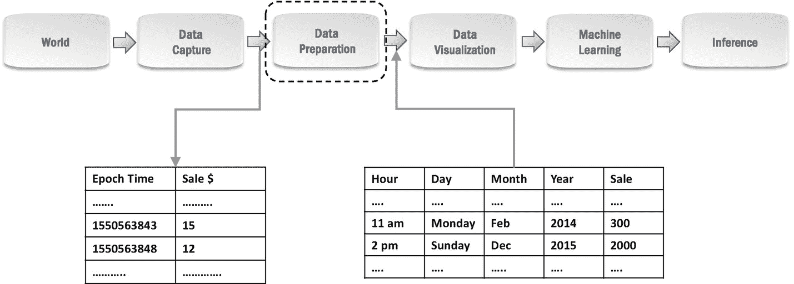
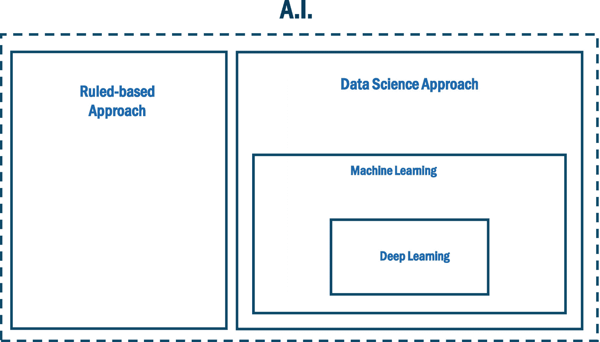

# 一、简介：数据科学过程

1918 年 6 月。一个由爱丁顿教授、戴森爵士和其他人组成的小组委员会安排了去巴西北部索布拉尔和普林西比岛的探险。这两次探险的目标？为了在 1919 年 5 月 29 日**发生的日食期间收集一些数据…**

*   一个叫爱因斯坦的家伙创造了一个新的引力模型，他称之为*广义相对论* *，*，似乎很少有人理解。基于这一模型，他在 1915 年预测，当光线接近太阳时，会偏转大约 1.75 弧秒。爱因斯坦根据过去几个世纪收集的数据创建了他的模型；他的模型甚至解释了水星运动的一个令人困惑的方面，这在牛顿物理学之前是无法解释的。但是这种靠近太阳的光线偏转到目前为止还没有被观察到。因此，这次探险——它的唯一目的是收集接近太阳的光线路径的数据。这些新数据将验证或否定爱因斯坦的引力模型。

**…1919 年 5 月 29 日**。这可能是物理学史上最重要的一次日食。日食让科学家们能够收集关于某些恒星位置的数据，这将表明恒星发出的光在到达地球上我们这里的途中擦过太阳时所走的路线。

1919 年 11 月。数据分析证实了爱因斯坦的预测。广义相对论被认为是对我们宇宙中万有引力定律的更恰当的描述，而不是现有的标准——牛顿定律。

## 我们所说的数据 ***科学***

引力模型如何演变，以及广义相对论如何最终被接受的故事，是科学方法的例证。

给定某些观察结果，科学家首先创建一个能够解释这些观察结果的*模型*。在这样做的时候，模型可能无法解释*的一些*观察结果，例如，牛顿物理学如何不能令人满意地解释水星运动的某些方面。无论如何，这样的模型可能是有用的，只要它实际上是可应用的并且足够通用，例如，牛顿物理学足够通用来描述地球上大多数常见情况下的吸引力和由此产生的运动。

即使一个模型实际上是有用的，寻找更好的模型——那些可以更好地解释观察结果或更好地预测未知情况下特定事件的模型。这种基于*观察证据*验证模型的概念是科学方法的基石之一。因此，科学家继续这个观察循环➤模型➤观察，每次通过这个循环都会产生更好的模型。

牛顿和爱因斯坦的引力模型解释了宇宙中物体间的吸引力和由此产生的运动。一般来说，我们使用术语*模型*来指代任何能够被*充分解释和/或预测观察结果的现实表示。*

一个简单得多的模型示例是建筑师按比例缩小的规划城镇模型 [1](#Fn1) ，该模型显示了住宅和商业空间、路线和其他设施的布局——我们可以使用这样一个按比例缩小的模型来确定两栋建筑之间的距离，或者从您计划购买的房屋到达附近学校可能需要的时间。从按比例缩小的模型中获得的这些预测在现实世界中足够有用和准确。

将科学方法应用于宇宙中的物质及其行为称为物理学，将科学方法应用于活的有机体称为生物学。同样，将科学方法应用于任何数据都可以被视为数据科学。更实际的是，在当前时代，数据科学的特点是使用*软件*来日益自动化这一科学过程中的步骤。

在本书中，我们将 ***运用软件*** 将科学方法应用到数据中称为 ***数据科学*** 。根据我们的经验，我们发现这个概念实际上更有用——它强调科学方法是学科的核心，软件是科学的主要机制/设备。

从团队所需的技能到需要使用的工具和技术，这种数据科学视角将影响为您的企业构建数据科学实践的每一个决策。

现在，让我们来看看将科学方法应用于数据时通常遵循的数据科学流程。

## 数据科学过程

对于数据科学，即使用软件将科学方法应用于数据，数据科学团队遵循迭代过程。在数据科学的背景下，这种科学方法通常被称为*数据科学过程*。

这个过程可以分解为一系列宽泛的步骤，从收集数据的第一步开始(*数据捕获*步骤)。接下来是选择相关数据，清理，并根据需要进行转换(**数据准备*)，然后使用图表/绘图进行可视化探索和理解(*数据可视化*)。这种探索和理解对于下一步至关重要——从数据中学习以构建模型(*机器学习*)，这是这一过程的核心。然后，这些模型用于推断新观察的结果(*推断*)。图 [1-1](#Fig1) 描述了这些步骤，这些步骤将在本节的剩余部分进行更详细的解释。*

 *

图 1-1

数据科学流程(迭代隐含在这些步骤中)

请注意，这是数据科学流程的简化表示，因为您很少会遇到要求您按顺序执行这些步骤的数据科学问题。大多数问题都需要在不同的步骤之间来回重复，我们称之为数据科学过程的迭代。让我们看几个例子:

*   您可能会在*数据可视化*步骤中意识到大量数据被破坏(例如，传感器读数超出预期范围)，因此您可能会返回到*数据捕获*步骤以收集更多正确的数据。

*   您可能会在*机器学习*步骤中意识到，如果输入的数据以某种方式转换，您选择的模型可能会表现得更好，因此您可以返回到*数据准备*步骤，以适当的方式转换数据。

*   您可能会注意到，在*推理*步骤中，您的模型没有以期望的准确度预测生产环境中的结果，并且可能会决定返回到*机器学习*步骤，尝试构建更准确的模型。

正如我们所看到的，数据科学流程并不仅限于创建模型，它还会继续下去，以确保模型可以部署到生产运营中并得到监控。随着时间的推移，这导致不断收集观察证据来验证或改进模型。

技术、工具和技能的整个生态系统都是围绕这一数据科学过程的——我们将继续回到它，看看它是如何作为端到端解决方案的一部分实现的。这个数据科学过程也将构成我们在第 3 部分中如何对各种技术、工具和技术进行分类的基础。

让我们看几个简单的例子来分别说明这个过程中的每一步。我们将从科学方法的核心步骤——机器学习——开始，它会产生候选模型。

### 机器学习

让我们从图 [1-2](#Fig2) 中的*机器学习*步骤开始，因为这是理解该过程其他步骤的基础。

图 1-2

机器学习:基于经验预测工资的例子

在图 [1-2](#Fig2) 所示的例子中，我们有一个给定行业的雇员及其工资的数据。在这个简单的例子中，我们假设我们有关于工作经验的信息，我们想确定这个行业中员工的经验和工资之间的典型关系。一旦我们知道了这种关系，它将帮助我们根据个人的经验来预测个人的典型工资——这在招聘过程中会很有用。

机器学习步骤获取经验和工资的数据，仅仅通过查看这些数据，它就自动确定 [2](#Fn2) 一般来说

工资(K) = 8 ×经验(年)+ 40

这个模型现在可以用于下一步，*推理，*来预测新个人的工资。例如，如果个人有 2.5 年的经验(这个值在最初的观察中没有出现)，这个模型将预测他们的工资是 60K。

请注意，像所有模型一样，这只是对现实的*充分*有用的表示——肯定会有一些误差和近似。举个例子，从数据中我们看到 6 年的经验应该是 87K 的工资，但是我们的模型会预测 88K，误差 1K。但是尽管如此，如果我们一起考虑所有的数据点，这个模型产生了一个可接受的总体误差。 [3](#Fn3) 如果误差是可接受的，就像在这个例子中，这个模型是有用的。如果误差太大，我们将继续寻找更好的模型。

机器学习算法和产生的模型在结构上可能变得越来越复杂。虽然在这种情况下，我们有一个方程可以表示我们的模型，但其他一些模型可以表示为树或复杂的图形拓扑等。我们将在第 16 章中讨论这些内容。

### 数据捕捉(来自 ***世界*** )

一个模型完全依赖于我们从*世界*收集的观察数据。例如，想象一下，如果我们没有关于水星轨道的数据，我们不会知道牛顿的模型有一些缺点，或者爱因斯坦的模型似乎更有前途。如果我们缺乏对世界的了解，也就是说，缺乏对获取数据的系统的了解，那么我们可能会忽略一些对构建良好模型至关重要的数据。让我们借助一个例子来看这个问题。

图 [1-3](#Fig3) 显示了一个场景，其中我们捕获了特定位置的温度、湿度和降雨量的样本数据，以创建一个机器学习模型。

图 1-3

数据采集:降雨预测示例

在这种情况下，我们的前提是我们能够根据当前的温度和湿度读数预测下一个小时的降雨量。 [4](#Fn4) 在*推断*期间，该模型将大致确定，如果温度为 22 度，湿度为 75%，那么在接下来的一个小时内预计降雨量为 8 毫米。

但实际上，降雨量也取决于风速。现在，我们输入到机器学习中的数据可能都是在风速约为 10 公里/小时时捕获的——如图 [1-4](#Fig4) 中的灰色栏所示，表明这没有被捕获。

图 1-4

数据捕捉:降雨量取决于风速

由于没有捕捉到风速，并且模型仅使用温度和湿度，因此不管风速如何，它预测在温度为 22 度、湿度为 75%的情况下降雨量为 8 毫米。只有当当前风速也接近 10 公里/小时时，这个预测才是正确的。如果风速与 10 公里/小时(比如 20 公里/小时)相差很大，预测可能不正确。

该模型不能充分代表现实，因为它无法了解降雨量是否以及如何受到风速的影响。这里的主要潜在问题是，我们没有获取所有必要的数据来创建一个能够充分代表现实的模型。

虽然这个例子非常简单，但现实世界中的许多数据科学项目都因为类似的问题而面临最初的失败。数据科学家可能会创建看起来不错的模型，也就是说，他们在创建模型所基于的数据/观察值上有非常小的误差，但有时他们会在生产中神秘地失败。在第 [16](16.html) 章中，我们将介绍一些数据科学技术来防止这种情况。但是对该领域的基本理解需要来自业务，以防止由于数据不足而导致的这种有缺陷的模型。 [6](#Fn6)

### 数据准备

捕获的数据通常需要以某种方式进行转换，以从中提取最大限度的信息。图 [1-5](#Fig5) 展示了一个典型的销售预测案例。

图 1-5

数据准备:将交易时间转换为销售预测有用数据的示例

在由系统捕获的交易数据中，比如零售店的收银台，交易时间被捕获为以纪元时间表示的时间戳，即自 1970 年 1 月 1 日午夜 UTC 以来的毫秒数。 [7](#Fn7) 交易数据还捕获每笔交易的销售额。我们期望销售模式不依赖于交易的时间戳，而是依赖于星期几和月份。例如，周末或假日的销售模式将不同于平日。类似地，像 12 月这样的休假月份会有不同于其他月份的模式。此外，在给定的一天中，不同时段的销售额会有所不同。

因此，我们合计交易销售额来计算每小时的总销售额。因此，我们最终得到五个字段:*小时、日、月、年、*和相应的*销售额*。这将使我们能够可视化模式，如前面提到的模式，并允许机器学习步骤确定销售如何受到这些领域的影响。

根据您的业务，您将确定最初捕获的数据中的哪些字段包含哪种有用的信息。另一个例子是，数字传感器读数被转换成*高/中/低*枚举，如果这与您的用例更相关的话。机器学习步骤将相应地从这些信息中学习，以产生更好的模型。

### 数据可视化

一旦数据科学家准备好数据，他们首先要探索数据和各个领域之间的关系。我们将这一步骤称为*数据可视化*。通常，在这种可视化分析过程中，数据科学家会发现一些模式，使他能够决定哪些机器学习技术可能表现得更好。

例如，两个字段(如薪水和经验)之间的线性关系会促使数据科学家首先尝试线性回归模型。类似地，他们可以基于视觉模式来确定某些字段之间是否存在相关性，或者某些行是否是异常值。这些分析有助于数据科学家完成机器学习步骤的设计。用于数据可视化的技术将在第 [15](15.html) 章中介绍。

### 推理

这是机器学习之后的步骤，一旦数据科学团队确定已经创建了足够好的模型，就会执行该步骤。结果模型通常被部署为生产系统的一部分，以*根据属性推断*关于新观察的信息。例如，如果温度、湿度和风速的当前读数可用，降雨模型可用于推断当天晚些时候的降雨量。或者，给定一个未来的日期，我们可以使用销售模型来预测潜在的销售额。

将模型部署到生产系统中的行为是从科学规程到(软件)工程规程的过渡。这种过渡边界有其独特的挑战以及应对这些挑战的相应技术和工具。在过去的几年里，这个利基领域已经发展成为一门学科，命名为 *ML Ops* ，我们将在第 [17](17.html) 章中详细介绍。

回想一下，对于科学方法，我们需要继续收集模型表现如何的信息。作为科学方法的一部分，验证模型或揭示模型问题的观察证据对于改进模型至关重要。因此，收集到的关于模型的观察结果通常会持续存在，并有效地成为数据科学流程中下一次大迭代的*世界*的一部分。

### 数据工程

到目前为止，我们看到的所有步骤都需要软件工程技术来优化数据的存储和计算。大数据规模的数据科学实验通常需要专门的工程支持，以确保对数据的优化和随时访问，尤其是在有多个应用程序或数据源的情况下，这在当今相当常见。

我们将在第 3 部分更详细地讨论数据工程。目前，关键的一点是，我们将数据工程视为推动科学发展的*工程主干*,因此是数据科学过程中无处不在的水平。

简要介绍了什么是数据科学，并对数据科学过程有了一个概述，让我们看看它与这些天流行的一些其他时髦词汇有什么关系。

## 术语混乱:AI、ML、数据科学、深度学习等。

数据科学、机器学习、AI、深度学习等。，人们通常不确定哪个术语适用于特定的问题或用例。因此，现在我们越来越经常地看到诸如 DS/ML、AI/ML 等术语。

虽然术语和炒作游戏将会继续，但重要的是要准确理解在你的业务中需要哪种技术来解决哪种问题，并理解应用这些技术需要哪种技能。

考虑到这一动机，我们将参照图 [1-6](#Fig6) 简要介绍这些术语对我们的意义。

图 1-6

术语混乱

AI 或人工智能是一个相当通用的术语，用来表示高级应用程序或自动化，它们似乎像人类在类似情况下一样智能地运行。 [8](#Fn8)

让我们考虑一个可以检测电子邮件是否是垃圾邮件的人工智能引擎 [9](#Fn9) 。在高层次上，有两种可能的方法来解决这个问题。

***基于规则的方法***

我们知道哪些是垃圾邮件中出现的典型单词和短语。例如，像“提供”、“免费”、“额外现金”、“你是赢家”等词和短语。指示垃圾邮件。一个简单的 ***规则*** 可以是，如果这些单词或短语中的任何一个出现，引擎就宣布该电子邮件为垃圾邮件。稍微复杂一点的规则可以基于电子邮件中这种指示词出现的次数或频率来计算电子邮件的得分。当然，随着垃圾邮件发送者变得越来越有创意，开发者需要将更多这样的规则添加到引擎中。此外，随着文本中指示垃圾邮件的模式的复杂性随着时间的推移而增加，规则的复杂性也会相应增加。

基于误报调整引擎也是困难的。也就是说，如果引擎声明一封电子邮件是垃圾邮件，但用户覆盖并说该电子邮件不是垃圾邮件，那么相应地调整规则可能会变得很棘手，除非跟踪到原因，即导致此异常的潜在模式。

请注意，这个垃圾邮件过滤器的示例以及我们采用的解决方案相当简单。一般来说，根据问题的复杂程度，基于规则的人工智能系统中的规则可以变得越来越复杂和精密。几十年来，基于规则的人工智能已经足以为各行业的专家系统提供动力，并在国际象棋方面变得如此强大，以至于大师们最终在 2000 年代中期停止了与国际象棋引擎的竞争。

***数据科学方法***

现在，考虑一种不同的数据驱动的科学方法，其中我们试图根据新电子邮件与我们的历史电子邮件数据集中过去的垃圾邮件或非垃圾邮件的相似性来推断新电子邮件是否是垃圾邮件。

根据数据科学的流程， [11](#Fn11) 我们从数据捕获*、*开始，也就是通过收集关于电子邮件的观察(数据)，也就是说，我们有大量被标记为垃圾邮件或非垃圾邮件的电子邮件。然后，数据科学家尝试基于这些数据构建一个模型。为此，他们将首先执行*数据准备*步骤，应用技术将电子邮件文本转换为有助于机器学习算法的格式。然后，他们将执行一些*数据可视化*，以确定这些数据的分布或模式。 [12](#Fn12) 相应地，他们将执行*机器学习—*他们将选择合适的机器学习算法，该算法可以利用准备好的数据创建一个模型，该模型可以将电子邮件分类为垃圾邮件或非垃圾邮件。然后，他们将评估该模型的性能；在这种情况下，他们可能会选择垃圾邮件检测的准确性作为评估模型好坏的标准。根据模型性能，他们将继续完善模型和整体方法；这通常需要通过*数据准备*到*机器学习*步骤的迭代。

一旦找到满意的模型，就可以将其部署在电子邮件服务器上进行垃圾邮件检测，这是数据科学过程的推理步骤。如果有误报，也就是说，如果模型说某封电子邮件是垃圾邮件，而用户说它不是，那么该电子邮件及其标签(非垃圾邮件)将被添加回我们的数据，即邮件正文和标签。下次机器学习步骤运行时，它会从这些新信息中学习，并建立一个模型，该模型可以在未来将类似的邮件分类为非垃圾邮件，而无需任何人工干预。

Hype Notes

在过去的几十年里，人工智能经历了衰落和复兴的不同阶段。在 2000 年代中期至后期经历了十年的相对炒作停滞后，始于 2012 年左右的基于数据科学的人工智能方法的流行将人工智能推回了炒作的聚光灯下。

最近在深度学习方面持续的创新和成功，特别是过去几年的 GANs 和强化学习，正在维持和推动人工智能的炒作。这一次，我们预计人工智能将继续存在。

正如我们在前面的例子中看到的，机器学习技术在数据科学中发挥着关键作用。随着时间的推移，术语*机器学习*，或 *ML* ，已经扩大了它的范围，包含了几乎所有现有的统计和计算方法。你可能听说过决策树、SVM(支持向量机)、线性回归和其他类似的 ML 技术，我们将在第 16 章[中介绍。在所有的 ML 技术中，一种称为深度学习的技术子类在解决图像中的对象检测和自然语言处理(NLP)等复杂问题方面获得了很大的普及和采用，特别是自 2015 年左右以来。深度学习技术基于神经网络的概念。尽管该理论有着悠久的历史，但当前的复兴始于 2010-2012 年期间，当时具有更多层和复杂性的更深层次的网络可以被成功训练来解决图像处理问题，如对象检测和图像分类。](16.html)[13](#Fn13)

实际上，与其他经典的 ML 技术相比，使用深度学习技术所需的方法和技能有显著的不同。我们将在第 3 章和第 20 章中详细阐述这些细微差别。

Rule-Based vs. Data Science

重要的是要记住，数据科学这个术语是在最近十年才开始流行的。深度学习虽然在理论上相当古老，但也只是在最近十年才开始变得容易处理和有用。

但是人工智能已经存在很久很久了。专家系统控制着复杂的机器，计算机程序变得比任何国际象棋大师都强大，远在数据科学这个术语流行之前。因此，很有可能你的企业并不真正需要数据科学——更传统的人工智能，例如基于规则的方法，在许多情况下就足够了。

让我们看一个例子，人们可能会感受到数据科学的魅力，但基于规则的系统可能就足够了。考虑一个智能城市解决方案，它集成了多种设备、系统和传感器，以支持可操作的策略。您可能遇到过的一个常见政策类别是停车政策——基于一天中的时间和一周中的某一天的分级停车费率很常见。智慧城市平台可以允许更复杂的政策，这些政策可以根据当前的占用率、附近的交通和天气情况动态地增加或减少停车位的停车率，因为所有这些信息都已经集成到智慧城市平台中。在这种情况下，人们可能会尝试创建一个基于数据科学的模型来估计停车需求并相应地决定定价。这有几个问题。首先，在开始之前，我们需要收集大量关于在各种交通和天气条件下停车的历史数据。第二，定义一套规则可能会简单得多，而且*足以*根据这些规则来改变停车费率。一个示例规则是，如果附近车道的交通流量增加一倍，则将停车费率提高 20%。分析师可以访问一个应用程序，他们可以在其中观察规则是如何执行的，并随着时间的推移对它们进行调整。

请注意，基于规则的方法通常可以充当替身、引导机制，直到有足够的数据可用于创建基于数据科学的预测模型。在我们刚刚看到的停车示例中，一旦我们启用了基于规则的动态定价并收集了几个月的数据，就可以使用数据科学来确定基于预测模型的最佳定价规则。

## 结论

我们讨论了数据科学的过程，这是本书其余部分的方向。我们还看到了数据科学过程如何有效地允许我们使用软件将科学方法应用于数据，即进行数据科学。

然后，我们澄清了一些与数据科学和人工智能相关的术语，以帮助确定哪一个最适合手头的业务问题。业务问题的种类决定了最适合解决这些问题的技术种类。基于所需技术的种类，您可以确定团队中所需的适当技术和技能组合。

因此，在下一章中，我们将开始研究数据科学如何融入业务，以及它如何为业务带来好处。

## 进一步阅读

《戴森、爱丁顿和戴维森》(1919)中给出了爱丁顿和戴森探险的扣人心弦的叙述。幸运的是，数据科学项目的数据收集要简单一些。至少，在这个互联网和基于云的数据时代，我们在收集数据时很少需要担心“轮船公司罢工”之类的情况。

文献中有大量关于数据科学的不同定义和解释。有关数据科学的更多理论和历史背景，请参考布拉施勒、施塔代尔曼和斯托克林格(2019)的第 [1](01.html) 、 [2](02.html) 和 [8](08.html) 章。

## 参考

布拉施勒、马丁、蒂洛·施塔代尔曼和库尔特·斯托克杰。*应用数据科学，从数据驱动型业务中吸取的经验教训*。瑞士楚格的查姆:施普林格，2019。

戴森，F. W .，A. S .爱丁顿和 c .戴维森。根据 1919 年 5 月 29 日日全食时的观测，确定太阳引力场对光线的偏转英国皇家学会哲学汇刊。伦敦，1920 年。291-333.

<aside aria-label="Footnotes" class="FootnoteSection" epub:type="footnotes">Footnotes [1](#Fn1_source)

请注意，这个模型是“工程”而不是科学的结果。虽然“模型”的概念并不局限于科学，但在本书中，我们将使用术语 *model* 来指代通过应用科学方法创建的模型。

  [2](#Fn2_source)

这种情况下的算法是线性回归，我们将在第 [16](16.html) 章中介绍。

  [3](#Fn3_source)

车型性能评估也将在第 [16](16.html) 章中详细介绍。

  [4](#Fn4_source)

这是一个极其简单化的观点。但是预测降水(在我们的例子中是降雨)的基本公式是基于其他因素，如温度、湿度等。，尤其适用于局部天气预报，例如，当您在自己的工业场所有自己的气象站时。

  [5](#Fn5_source)

为了简化图示，我们只提到了风速。实际上，还有其他因素，如大气压力等。，也是。

  [6](#Fn6_source)

领域专家(业务分析师)的角色将在第 [21 章](21.html)中介绍。

  [7](#Fn7_source)

这是软件系统存储时区无关的时间表示的一个传统习惯。

  [8](#Fn8_source)

哲学注释:关于人工智能是什么有不同的观点。对此我们将跳过哲学角度。

  [9](#Fn9_source)

你可能知道这个人工智能引擎的名字是*垃圾邮件过滤器。*

  [10](#Fn10_source)

你可能听说过一些技术，像极小极大，阿尔法-贝塔剪枝等。，广泛应用于基于规则的人工智能系统。这方面的大量文献不容忽视。

  [11](#Fn11_source)

参见图 [1-1](#Fig1) 。

  [12](#Fn12_source)

根据他们所看到的，在我们进行下一步之前，可能会有数据准备的迭代。

  [13](#Fn13_source)

我们将在第 10 章[的](10.html)中介绍更多关于*计算机视觉*的细节。

 </aside>*