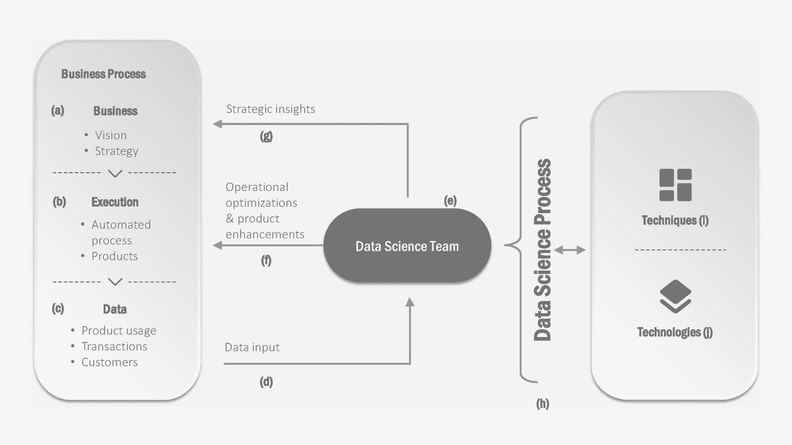

# 二、数据科学和您的业务

理解了数据科学过程及其所包含的内容之后，我们现在深入研究数据科学的业务适用性。

我们将首先介绍数据科学可以为您的企业带来的各种好处，包括每种好处的几个示例。然后，我们将讨论一些要考虑的方面，以确保您的企业已准备好开始进行数据科学。

## 数据科学如何融入企业

数据科学可以以几种不同的方式在企业中使用。图 [2-1](#Fig1) 从较高的层面说明了这一点。

图 2-1

企业中的数据科学

让我们从头到尾走一遍，从*业务流程*框开始。当业务策略(a)被执行时，要么产品被创建，要么某些操作过程被自动化(b)。产品的一个例子是你的技术公司可能已经创建的云托管应用。运营自动化的一个例子是 SCADA [1](#Fn1) 系统或物联网基础设施，您可能已经将其作为企业数字化的一部分进行了设置。

在这两种情况下，都会生成数据(c)。例如，数据可以是关于客户如何在线使用你的服务的，或者是关于你的车间设备如何运行的。所有这些数据都可以被数据科学团队使用(d)[2](#Fn2)(e)，以创建通过运营优化/产品增强来帮助改进流程/产品的模型(f)，和/或为业务提供战略洞察力(g)。

为了向业务提供这些不同种类的好处，数据科学团队使用为您的业务策划的技术(I)和技术(j)来执行数据科学流程(h)。回想一下，我们将使用*软件*将*科学方法*应用于数据视为数据科学——数据科学过程中使用的技术实现了科学方法，而技术实现了所需的软件。(我们将在本书的第 3 部分中探讨技巧和技术。)

现在让我们通过一些例子来更深入地研究前面提到的业务优势。

### 运营优化

数据科学团队可以创建预测模型来指示特定活动可能发生的时间，这些预测模型可用于优化活动的计划。

例如，考虑预测加油站的库存需求的情况。假设我们使用数据科学来创建模型，该模型可以根据过去的使用数据来预测燃气公司主终端附近的每个加油站何时需要补充每种燃料。提前很好地了解补充需求允许为将来的日期创建从主终端到加油站的优化交付计划。优化可以基于加油站所需的燃料类型/数量、未来日期可用的卡车类型以及在这些日期完成再加注的最佳路线。

RoI Notes

在这个预测加油站库存需求的例子中，从预测模型到业务 RoI 的路径已经被标出。因此，从事数据科学将是一个明智的决定。你也做好了知识准备，数据科学产生的预测模型不是终结；在这些模型的基础上，需要更复杂的优化算法来开始看到 RoI。

### 产品增强

如果您正在构建技术产品，数据科学模型可以帮助您为产品添加与众不同的功能。一个常见的例子是推荐引擎，它在网飞上推荐电影或者在亚马逊上推荐产品。推荐引擎通常基于相似用户过去的选择进行推荐。基于语音的技术、聊天机器人等。，是可以添加到任何产品中以改善客户互动的其他示例。

假设你有一个客户服务的技术解决方案。您可以在您的解决方案中添加一项功能，在语音通话过程中自动检测客户是否失望、愤怒或有任何负面情绪。为了实现这一点，您可以使用语音转录服务，将语音实时转换为文本。然后，您可以将这些文本输入到基于数据科学的情绪分析模型中，该模型可以对客户的情绪进行分类。一旦你的产品可以实时了解客户情绪，它就可以提供各种商业利益。它可以作为团队领导的实时反馈回路。离线分析还可以确定哪些客户服务主管面对难缠的客户，以及他们如何处理这些情况。作为产品的创造者，您可以将这些分析作为增值服务提供给客户(客户服务公司)。

同样，物联网解决方案通常使用基于数据科学的预测功能来区分自己。例如，用于监控工业能源或水消耗的基于云的物联网解决方案可以提供增值服务，根据为特定客户量身定制的模型来预测能源或水需求。预测性维护是另一个常见的用例——比如说，特定设备或装置的功率读数异常可以表明潜在故障的开始。这些异常由基于过去读数趋势的模型检测到。主动解决此类情况有助于预见和防止运行期间的停机。因此，如果您的物联网解决方案提供这样的功能，它将对潜在的工业客户更具吸引力。

### 战略洞察力

数据驱动的业务战略转型一直呈上升趋势，特别是自大数据革命以来。数据科学在战略决策和管理咨询中发挥着越来越重要的作用。

考虑确定开设新店的最佳地点的问题。传统上，这是基于客户的人口统计因素和地理因素，如靠近交通枢纽、购物中心和竞争对手的商店。在过去几年中，关于人们使用移动应用程序和位置移动的数据迅速增加，称为*移动*数据。鉴于潜在客户流动性的可见性增加，现在有可能创建更复杂的 ML 模型，将流动性以及地理和人口因素纳入决策制定。 [3](#Fn3) 这样的模型可以确定一组候选地点中的哪一个可能吸引最多的访问次数。

另一个传统问题是识别潜在的客户流失。除了确定可能流失的客户，我们还想确定可能的原因。为此，我们将首先创建一个模型，该模型可以预测哪些客户会流失，还可以对销售渠道、折扣、产品分类等因素进行排序。，这是很重要的。这将有助于做出解决这些根本原因的战略决策。 [4](#Fn4) 例如，如果您发现折扣是一个重要因素，您可以根据模型进行模拟分析，以确定更高的折扣可以减少客户流失的程度——这种分析将有助于获得最佳折扣，从而在对收入影响最小的情况下减少客户流失。

## 您的企业为数据科学做好准备了吗？

每个人似乎都同意数据科学显然很酷。它似乎适用于解决您业务中的一些问题。接下来呢？假设，如果你现在有一个数据科学团队听从你的命令*，*他们会在做什么？他们有足够的生产力吗？

甚至在开始数据科学之旅之前，就需要规划出实现业务投资回报的潜在途径。这一点的重要性怎么强调都不为过。

### 警示故事

我们看到的一个例子是，一家公司投资开发了一种能力，可以根据每次运行几天的化学过程中的各种控制参数和读数来预测化学产品的产量。聪明的人使用尖端的深度学习算法，并能够随着过程的进行预测产品的产量。他们在这些预测中取得了非凡的准确性，甚至构建了一个应用程序来显示产量的预测趋势，并在实际产量与预测值相差很大时通知关键人员。

达到这一里程碑后，他们现在想回去调整控制参数以提高产量。由于使用了极其复杂的神经网络，他们无法解释 [5](#Fn5) 的预测，也没有真正获得关于控制参数如何影响产量的可操作的见解。因此，事实证明，到目前为止，他们的所有投资都没有产生预期的重大商业价值。

另一方面，我们在上一节中看到的例子，特别是那些运营优化的例子，是在开始研究数据科学之前概述了实现业务 RoI 的途径的例子。一旦我们知道了业务目标，我们就可以尝试开始数据科学。

### 一开始是数据

正如我们从数据科学过程中看到的，数据科学的起点是数据。这是一个显而易见的观点，但是它的含义和重要性经常被忽视。

您的组织是否拥有从事数据科学来解决您的问题所需的数据？如果没有，您将首先需要定义一个旨在收集面向该目标的数据的数据策略。数据战略最好由首席数据科学家这样的人来定义。如果你雇佣了一个首席数据科学家，他们可以帮助定义策略，但是在策略被执行和数据可用之前，他们会相对闲置。因此，实际上最好的办法是在这个早期阶段找一个顾问。

### 数据是和谁一起的？

如果您拥有必要的数据，那么数据科学家加入您的组织后，他们是否可以访问这些数据？在大型企业中，数据分散在多个业务线和数十个(如果不是数百个)应用程序中，数据科学家最常见的抱怨是他们无法访问所需的数据。在数据科学开始之前，通常需要为数据科学创建一个数据沙箱，并确保必要的管道将数据传送到这个沙箱中。这需要定义一个开发数据管道的战略路线图，与数据科学试图解决的业务问题保持一致。

Hiring Notes

数据源的复杂性和范围也可能决定您的数据科学团队的最初雇佣——有些数据科学家将进行必要的数据集成和清理 [6](#Fn6) ，而其他人则希望为他们提供适当的数据，以便他们专注于纯粹的科学分析。 [7](#Fn7)

### 模特说“我在这里，送我”

到目前为止，您已经确保了数据可以通过必要的基础设施获得和访问。对于成功的数据科学之旅，要确保的另一个方面是组织流程足够成熟，可以部署和使用最终将创建的数据科学模型。您将需要与各自系统的工程团队协调，以确保在创建模型时已经做好准备。

企业经常进行数据科学研究，结果却是数据科学家抱怨数据，或者模型在生产中不见天日。根据本节中的概述进行业务准备情况分析将有助于尽早降低数据科学实践的风险。

## 结论

商业考虑是最重要的——即使是像数据科学这样酷的东西；尤其是像数据科学这样的跨学科领域。数据科学可能需要企业进行大量投资并做好准备，如果做得好，投资回报会非常高。但也有一些陷阱，从事数据科学的仓促决定往往在事后才被发现。

在本章中，我们讨论了数据科学带来的好处，以及在开始研究数据科学之前需要考虑的方面。在下一章中，我们将深入探讨数据科学的两种文化，以及它们如何与您的业务相关联。当你着手组建一个数据科学团队时，这些考虑将有助于确定你的团队成员需要什么样的技能和科学*文化*才能最好地与你的业务目标保持一致。

## 进一步阅读

本章介绍的数据科学的业务和运营方面将在本书的第 4 部分更详细地介绍。

数据科学在商业战略和管理咨询中的应用在《丘鲁苏》(2018)中有相当深度的论述。

## 参考

杰瑞米·大卫·丘鲁苏。*数据驱动，21 世纪管理咨询导论*。纽约州纽约市:斯普林格，2018 年。

卡拉姆舒克、德米特罗等人。艾尔。"地理定位:挖掘基于位置的在线服务，以优化零售店布局."第 19 届 ACM SIGKDD 知识发现和数据挖掘国际会议论文集。计算机械协会，2013 年。793-801.

<aside aria-label="Footnotes" class="FootnoteSection" epub:type="footnotes">Footnotes [1](#Fn1_source)

监控和数据采集(SCADA)被工业广泛采用来监控和控制设备。

  [2](#Fn2_source)

本书的第 4 部分涵盖了数据科学团队中的技能、角色和典型结构。

  [3](#Fn3_source)

参考 Karamshuk (2013)的详细示例，其中移动性因素基于 Foursquare 签到数据。

  [4](#Fn4_source)

关于示例模型，请参考杰里米·丘鲁苏的《通过结合机器学习和敏感性分析制定商业战略》， [`https://aws.amazon.com/blogs/machine-learning/developing-a-business-strategy-by-combining-machine-learning-with-sensitivity-analysis/`](https://aws.amazon.com/blogs/machine-learning/developing-a-business-strategy-by-combining-machine-learning-with-sensitivity-analysis/) ，2019 年 11 月 13 日。

  [5](#Fn5_source)

我们将在第 [16](16.html) 、 [20](20.html) 和 [23](23.html) 章中更详细地介绍这一关键方面。

  [6](#Fn6_source)

也称为数据争论、蒙骗和其他丰富多彩的术语。

  [7](#Fn7_source)

我们将在第 [21 章](21.html)中了解数据科学团队的技能框架。

 </aside>