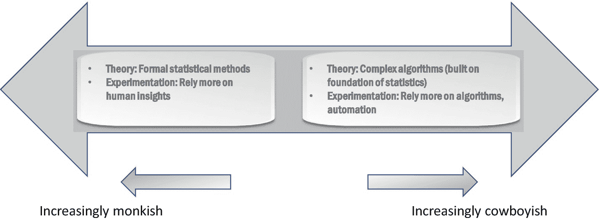

# 三、僧侣与牛仔：数据科学文化

在您的业务环境中接触了数据科学之后，现在是时候确定什么样的数据科学文化最适合您的业务了。数据科学主要有两种文化——僧侣文化(由僧侣定义和实践)和西部蛮荒文化(被牛仔形象化)。

在这一章中，我们将详细阐述这两种文化如何实践数据科学以及这两种文化的商业含义。这将有助于确定你希望主要灌输哪种文化。主导文化不仅会推动技术和工具的选择，还会推动你的招聘策略——僧侣和牛仔都倾向于称自己为数据科学家，辨别你的形成团队需要谁对实现你的业务目标至关重要。

## 数据科学的两种文化

回想一下我们在第 [1](01.html) 章对科学方法的讨论，模型有两个目的:解释观察结果和预测未来观察结果。例如，参见图 [1-2](01.html#Fig2) 。在这种情况下，该模型揭示了一个潜在的事实，即员工的工资从大约 4 万英镑开始，每年增加(大约)8 万英镑。基于这种理解，我们也可以预测未来经验观察的工资。因此，这款T5 1T7 同时满足了两个目的。

因此，考虑到两个目的——解释观察结果和预测未来观察结果—*,数据科学的两种文化*围绕着关注两个目的还是只关注预测。为了进一步澄清这一点，让我们回顾一下在前面章节中看到的几个例子，更深入地研究正在解决的问题。

回想一下第 [2](02.html) 章中的*警示故事*，我们看到预测化学品产量的能力不足以帮助调整控制参数以获得最佳产量。在这种情况下，人们需要更深入地了解化学过程在*自然中如何工作，也就是说，在给定控制参数和初始混合物的情况下，反应将如何随时间进行以及最终的产量。仅仅预测产量是一个相对简单的问题，而不是确定所有控制参数本身之间的相互关系以及它们对产量的集体影响。在这种情况下，尤其是涉及到*自然*过程时，关注估计数据背后的真相，也就是说，可能产生数据的过程，通常是有益的。这允许我们控制某些参数，以在很大程度上影响底层过程本身。一旦完全理解，化学过程本身在很大程度上是不变的——除非引入新的参数/化学物质，否则我们可以永远继续使用相同的模型。*

相比之下，预测商店对产品的潜在需求是一个难题。在这种情况下，我们可能会使用历史销售数据和其他几个数据源，如来自社交媒体的趋势、商店周围可能发生的事件等。，建立一个预测需求的复杂模型。在这种情况下，我们的主要目标是预测，以便我们可以相应地计划库存。

了解哪些因素对需求的影响比其他因素更大可能是有用的；在某些情况下，如社交媒体因素，我们甚至可能试图推动趋势。但是控制潜在因素的这一方面是次要的和附带的——需求预测才是目标。随着销售数据、社会趋势和附近事件的不断变化，我们也可以用新数据频繁更新我们的模型。

与前面的化学过程例子相比，需求预测案例中的模型着眼于短期的、相对偶然的方面，而不是自然过程背后的长期事实。

这两个极端的例子凸显了两种数据科学文化的特征。一种文化侧重于完全理解产生观察结果的基本过程，而另一种文化主要侧重于能够准确预测未来的观察结果。相应地，在这两种文化中，数学、统计和算法技术的选择往往是不同的。

我们把第一种文化称为**修道文化**，它专注于破译潜在的真理。我们称第二种文化为**西部文化**，它专注于预测准确性的经验目标。根据我们的经验，虽然专家数据科学家*可以*在修道院和蛮荒的西部地区导航，但他们往往天生就有一种默认的主导文化。我们将在本章的后面部分讨论数据科学家的文化背景。

我们认为，理想情况下，问题陈述和业务目标应该规定哪种文化/方法适合于该问题。对于某些业务来说，混合方法可能是合适的。

### 混合文化

例如，考虑一家气象公司。由于业务主要依赖于自然天气过程，因此投入精力更详细地了解潜在的天气系统是非常有意义的。这使得企业能够在技术上推进该领域，创造更好的工具和数据收集来源以及先进的天气模型。对于这方面的业务，修道文化是合适的。

面向客户的业务可能不仅仅局限于预测天气。也许你正在为航运公司提供高级服务，比如基于你的天气预测和其他海洋数据的路线算法。或者，您可能正在向海岸线行业提供服务，使用整合了您的天气模型以及客户行业的其他数据的模型来预测中断。在这些情况下，为您的客户提供的更具体的模型可以基于狂野西部文化，因为了解客户数据的底层流程对您的核心业务没有太大好处。经常更新这些为您的客户量身定制的模型也是合理的。

如果在这一点上，这两种文化看起来有点抽象，不要担心——我们将在本书中继续添加更多的细节来区分这两种文化。在本书中如此早地介绍这两种文化的主要原因是，我们相信采用适合您业务的文化是增加您数据科学实践成功机会的关键之一。

在下面的章节中，我们将详细阐述与这两种文化相关的一些因素，并将这些因素与您的业务目标对应起来。

## 文化差异

表 [3-1](#Tab1) 总结了两种文化之间的主要差异。我们将在第 20 章[中继续添加这个表格。](20.html)

表 3-1

修道院与狂野西部:第一版

<colgroup><col class="tcol1 align-left"> <col class="tcol2 align-left"> <col class="tcol3 align-left"></colgroup> 
| 

因素

 | 

修道文化

 | 

西部文化

 |
| --- | --- | --- |
| 心态 | 找到导致观察的潜在的、永恒的真理(自然) | 现在就找到有效的方法。可以经常更新。经验主义是唯一永恒的真理 |
| 目的 | 对观察结果背后的*真理*的估计，从而使预测和更深刻、准确的因果[2](#Fn2)T5】见解成为可能 | 预测准确性是首要目标因果往往是一种损失。因果洞察力要么是不相关的，不太准确的，要么只是有好处的 |
| 估价 | 我的估计有多接近事实？ | 我得到的预测是否如我所愿的那样准确？ |

在下一部分，我们将看看这些文化因素如何与您的业务相关联。

## 数据科学文化和您的业务

虽然我们还不知道僧侣和牛仔是如何工作的，以及他们在实践中有什么不同，但我们对他们的根本动机有足够的了解。基于此，我们已经可以看到如何识别哪种文化更适合您的业务问题的轮廓。表 [3-2](#Tab2) 总结了这些因素。需要注意的是，这些并不详尽，也不具有规定性，它们只是指示性的。

表 3-2

哪种文化适合你的企业？

<colgroup><col class="tcol1 align-left"> <col class="tcol2 align-left"> <col class="tcol3 align-left"></colgroup> 
| 

因素

 | 

修道文化适合如果

 | 

西部文化适合如果

 |
| --- | --- | --- |
| 商业目标 | 推进自然科学是一种商业策略，例如，洞察天气系统 [3](#Fn3) | 管理、战术决策或产品/运营增强是战略目标，例如，需求预测 [4](#Fn4) |
| 病因(因果关系) | 病因学是至关重要的，例如，影响化学过程的控制参数 [5](#Fn5) | 病因有好有坏，例如，需求预测、网飞推荐等。 |
| 数据同质性 | 您的数据来自特定人群/环境，因此可以确定生成数据的单一、真实、潜在(自然)过程，例如，您公司的某个化学过程 [6](#Fn6) | 您处于大数据领域，具有多个数据源和各种人口/环境，其中可能不存在单一的潜在事实，例如，使用社交媒体和历史销售的需求预测 |

在某些情况下，甚至在一个企业中，不同的问题似乎需要不同的文化。当我们团结一致地看待一个企业中现存的问题时，一种*主导的*文化就会出现——通常这种主导文化也足以解决*未来的*问题。

对于与主流文化大相径庭的偶然问题，一个实用的方法是找一个顾问来解决这个特定的问题。例如，如果你灌输一种西部文化，并且有一个问题需要病因学的洞察力(例如，说生物学的原因因素与你的问题的背景相关)，你可以得到咨询僧侣(例如，生物统计学家)的帮助。

## 数据科学家的文化谱系

数据科学家的*僧侣与牛仔*二分法最好被视为如图 [3-1](#Fig1) 所示的一系列特征。

图 3-1

数据科学家——特征谱

虽然来自这两种文化的专家通常可以根据需要灵活地调整自己，但如果您团队的形成成员更接近与您的业务目标一致的文化，通常会更顺利。

### 数据科学的理论和实验

大多数科学努力都有两个相互交织的方面——理论和实验。例如，在物理学中，提出新的候选模型如爱因斯坦或牛顿的引力模型 [7](#Fn7) 是*理论*方面。进行实验来收集数据——因为没有足够的观察来创建模型或验证模型——是*实验的*方面。爱丁顿和戴森的探险是实验的一个例子。

和其他科学领域一样，数据科学也需要理论和实验。就数据科学而言，理论由数据科学过程中使用的众多统计技术和算法组成，构成了数据科学家的武器库。实验包括编写软件代码来反复应用这些技术，以获得候选模型。

僧侣和牛仔都使用统计技术和算法——尽管他们在实践中的*默认*选择通常不同，这取决于他们在早期光谱中的位置。相应地，理论和实验的首选方法在两种文化中也有所不同。直觉上，僧侣文化更倾向于正式的统计方法和由人类洞察力驱动的实验。另一方面，狂野西部文化倾向于日益复杂的算法和自动化，如图 [3-2](#Fig2) 所示。我们将在第 [20](20.html) 章中用具体的例子涵盖这些变化，并用更多的技术细节总结文化方面。

图 3-2

两种文化中的理论和实验

请注意，如前一节所述，该图仅说明了极端情况下的特征。数据科学家通常涵盖整个早期的范围，但在不同程度上倾向于范围的一端。

这些方面会间接影响数据科学团队的基础设施和工程需求。

### 数据工程

工程需求通常由数据科学文化驱动。这主要与之前讨论的*数据同质性*因素有关。

如果您的数据科学家主要是修道士，他们可能更喜欢同质数据，因为它更容易发现潜在的“真相”对于异构数据，不太可能发现单一的潜在真相。因此，他们可能通常处理相对包含和同质的数据。这通常意味着可能要花费更多的数据工程工作来提供干净的、相关的数据子集。这样的数据集大小通常适合在单台机器上进行分析。僧侣们往往倾向于分析一个单一的同质数据集几个星期来制作他们的模型，因为他们对真相的洞察力越来越强。

另一方面，牛仔对同质数据没有特别的偏好。他们经常处理从多个来源获得的异构数据，这是大数据的特征。在最极端的情况下，他们会在机器学习步骤中在多个 GPU 上运行深度学习。考虑到数据的异构性，他们也从数据准备步骤开始，更快地迭代多个变量。在这种情况下，更多的数据工程工作将用于数据科学流程中所有步骤的大数据高效访问，包括数据准备、数据可视化和机器学习。

需要注意的是，这些只是根据我们的经验得出的一些观察结果——我们已经看到了与这些典型趋势的偏差。最终，这一切都取决于数据科学家针对手头的问题所采取的具体方法。

## 结论

已经介绍了数据科学中的两种文化——这些文化之间差异的潜流将贯穿本书。这一讨论将在第 [20](20.html) 章继续，我们将总结进一步的差异，包括技术方面。

我们还谈到了业务目标如何勾勒出适当的文化——为了建立适当的文化，数据科学团队需要由僧侣或牛仔组成。在第 [22](22.html) 章中，我们将重温僧侣和牛仔的定义特征，特别是关于他们的技能和背景——这将有助于概述基于理想文化的团队形成方面。

## 第 1 部分概述

至此，我们结束了本书的第一部分。我们在第 [1](01.html) 章中介绍了数据科学流程，在第 [2](02.html) 章中介绍了数据科学如何与您的业务相关联。在本章中，我们看到了科学方法的更多细节，尤其是数据科学中的两种文化。关键要点是，业务目标应该决定如何引导数据科学实践——本书的这一部分广泛涵盖了这些形成因素。

我们现在准备更深入地研究使用数据科学解决的问题类别。我们将在第 2 部分中讨论这些内容。

<aside aria-label="Footnotes" class="FootnoteSection" epub:type="footnotes">Footnotes [1](#Fn1_source)

回想一下第 [1](01.html) 章中提到的，这是一个用于说明目的的简化示例。更现实的模型将包括额外的因素，然后一个类似的模型(线性回归)将确定工资和所有其他因素的综合影响之间的关系。

  [2](#Fn2_source)

注意，我们在这里松散而直观地提及*因果关系*。数据科学家从来没有自信地推导出因果关系；他们只是试图获得指示可能因果关系的洞察力。在第 20 章[中，我们将在技术上更加精确地描述这一点。](20.html)

  [3](#Fn3_source)

另一个例子:基于其他健康因素的人类语音产生。

  [4](#Fn4_source)

另请参考第 [2](02.html) 章中的其他示例。

  [5](#Fn5_source)

另一个例子:疾病的临床试验。

  [6](#Fn6_source)

临床试验是数据同质性的典型。

  [7](#Fn7_source)

参见第[章 1](01.html) 。

  [8](#Fn8_source)

自动化可以处于各种级别，从自动化特征提取(例如，使用 CNN 从图像)到自动化模型选择(例如，AutoML)。我们将在第 3 部分中讨论这些内容。

  [9](#Fn9_source)

按需扩展，通常在云上。但通常还是单台机器，而不是集群。

 </aside>