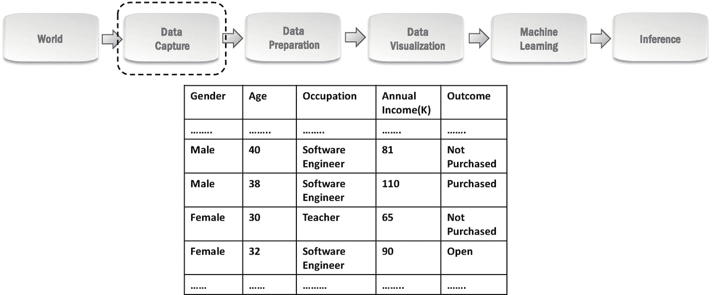
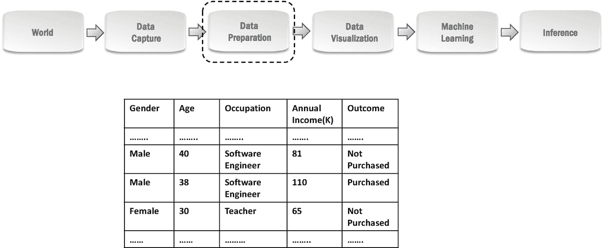
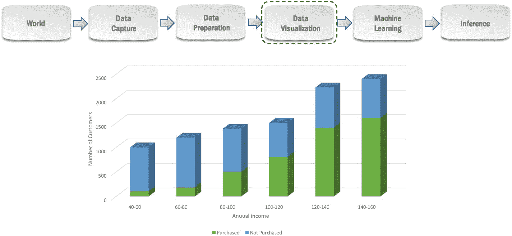
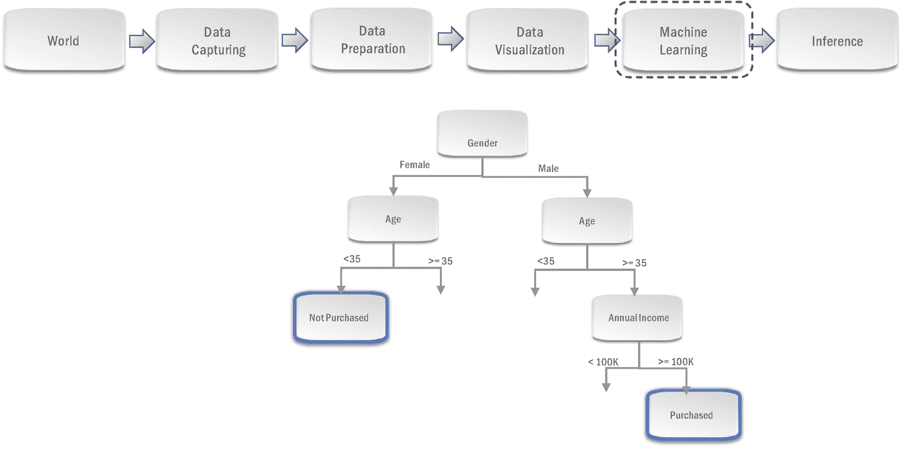
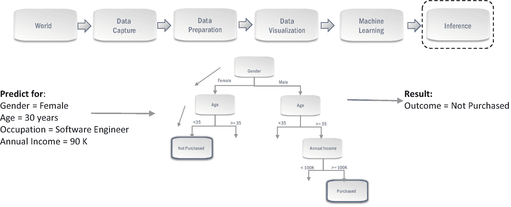
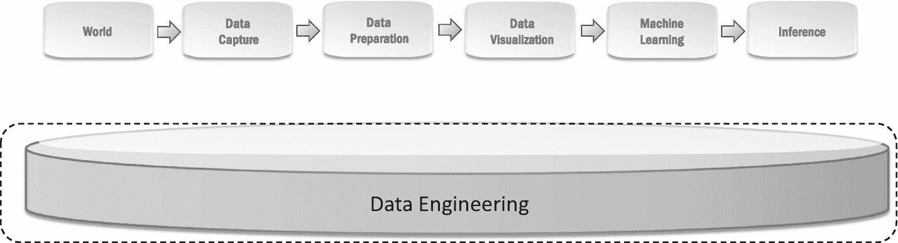

# 四、分类

先说一类常见的问题，叫做*分类*问题。分类问题要求您根据一些观察到的属性的值来推断/预测新观察值所属的类别/范畴。例如，根据邮件正文、发件人的电子邮件地址等推断邮件是“垃圾邮件”还是“普通邮件”。；根据交易的详细信息，如交易地点、支付金额和方式等，推断数字支付交易是“欺诈”还是“非欺诈”。

假设一家汽车公司推出了一款新车，营销团队执行了有效的广告策略，吸引了感兴趣的客户源源不断的询问。数据科学可以帮助识别最终可能购买汽车的感兴趣客户，以便销售团队可以关注这些客户，从而提高销量。这是一个分类问题，因为这里的目标是推断一个感兴趣的客户属于购买汽车的客户类别还是不购买汽车的客户类别。让我们看看实现这一目标可以遵循的数据科学流程的详细步骤。这是我们讨论的第一个端到端问题，我们将在后面的章节中更详细地讨论它的步骤。我们还将利用第一个问题来介绍一些我们将在整本书中使用的新术语。

## 数据捕捉

目标是预测哪些客户最终会购买汽车。数据科学中一切魔力的源泉是 ***数据*** 。如果可以的话，您可以使用包含以前类似汽车的感兴趣客户的详细信息的过去数据。如果这些数据不可用，您可以定义一个策略来获取最初几个感兴趣的客户的相关详细信息。然后，这些数据将用于数据科学流程的后续步骤，以构建模型，根据初始客户的趋势预测未来哪些感兴趣的客户可能会购买汽车。因此，作为数据获取策略的一部分，您可以指导销售团队获取每个初始客户的*性别、年龄、职业和年收入* [1](#Fn1) 以及该客户的*结果*以表明该客户是否购买了汽车。您认为应该可以根据其他四个变量的值以合理的准确度预测感兴趣的客户的*结果*。做出预测所依据的变量(*性别、年龄、*等)。，在这种情况下)被称为*特征，*而你试图预测其值的变量(在这种情况下为*结果*)被称为*目标*。请注意，这里的*目标*变量的值就像所有*分类*问题中的值一样，都是类别(购买、未购买等)。).所收集数据的快照如图 [4-1](#Fig1) 所示。假设在这种情况下，销售团队在 excel 文件中手动输入这些详细信息。我们将在第 3 部分讨论如何以编程方式捕获数据，以及帮助您这样做的工具/库。

图 4-1

数据捕获步骤中收集的数据的快照

## 数据准备

获取数据后，您需要以各种方式准备数据，以构建有效的模型。我们在上一步中捕获的数据中有一些行的*结果*为*打开*，这表示正在进行查询。这些客户发起了调查，并在收集数据时与销售团队进行了积极的讨论。由于我们不知道这些客户最终是否会购买汽车，因此这些客户的数据与构建我们的预测模型无关。作为准备数据的一部分，我们将删除对此类客户的观察。如果您查看图 [4-2](#Fig2) 中*数据准备*步骤准备的数据快照，您会注意到数据准备步骤已经删除了对这些客户的观察。

在处理分类问题时，您可能还会遇到这样的情况，即 *target* 变量中的类没有被同等地表示。例如，与那些*结果*被*购买的客户相比，你可能有更多的*结果*是*而非*被购买的客户。*这被称为*类别不平衡*，可能会导致代表性不足类别的预测准确度较低。 [2](#Fn2) 您可以选择在*数据准备*步骤中解决*类不平衡*，方法是转换您的数据集，使其更加平衡。 [3](#Fn3) 此外，捕获的数据可能会有错误的观察结果。例如，您可能会遇到年龄为“0”的行，这表示在输入该客户的详细信息时出错。作为准备数据的一部分，您应该删除这些错误的观察/行；否则，你可能会创建一个学习错误趋势的模型。在第 3 部分中，我们将会看到更多在这一步中常用的技术，以及帮助您将这些技术应用到数据中的工具/库。

图 4-2

数据准备步骤准备的数据快照

## 数据可视化

在这一步中，您可以使用强大的可视化功能来分析您的*准备数据*,以深入了解趋势。这些见解在很多方面都很有用，可以帮助你在*机器学习*步骤中建立有效的模型。图 [4-3](#Fig3) 显示了基于我们准备好的数据在这一步创建的可视化。这里的可视化效果是一个堆积条形图，它将每个收入段中没有购买汽车的客户数量堆积在购买汽车的客户数量之上。每个条形的总高度表示相应细分市场中感兴趣的客户总数，每个条形中的绿色部分表示实际购买了该细分市场中汽车的感兴趣客户。我们可以看到，在过去，我们有更多对高收入细分市场感兴趣的客户。此外，在高收入人群中，购买汽车的感兴趣客户的比例似乎更高。这意味着*年收入*似乎对一个客户最终是否会买车有影响，也就是说*年收入*似乎影响*结果*。这种洞察力会让你对使用年收入来建立预测结果的模型更有信心。你也可以想象其他的功能，一旦你对你选择的功能感到自信，你就为下一步做好了准备，*机器学习。*

正如前面提到的*、*因为这是一个*分类*问题，所以*目标*变量中的值是我们在这个可视化中堆叠的类(*购买，而不是*)。如果*目标*变量包含连续值(如薪水),可视化效果会有所不同，回归问题将在下一章讨论。数据可视化本身是一个庞大的主题，为您的问题设计正确的可视化的艺术可以帮助您轻松发现趋势，否则很难识别。在第 3 部分中，我们将会看到一些更流行的可视化工具，以及可以用来创建这些可视化工具的工具/库。

图 4-3

分类问题的数据可视化

## 机器学习

由于我们的*目标*变量中的值是类(*购买的，而不是购买的*)，我们将在这一步使用*分类*机器学习算法之一。*分类*机器学习算法从过去的观察中学习，以推断新观察的类别。为了简单起见，我们在这里选择一个决策树算法，因为我们还没有介绍更复杂的算法，这些算法将在本书的第 3 部分讨论。第 3 部分还讨论了实现这些算法的相应工具/库。

*决策树*算法基于我们准备好的数据建立一个*决策树*模型。图 [4-4](#Fig4) 显示了我们的*决策树*模型的局部视图，它关注于与本讨论相关的部分，而忽略了其他细节。请注意，决策树了解到，35 岁以下的女性不会购买汽车，无论她们的职业或收入如何。另一方面，年龄超过 35 岁、收入超过 10 万英镑的男性购买汽车，与他们的职业无关。该模型现在能够预测未来哪些感兴趣的客户可能会购买该车。

图 4-4

机器学习步骤创建的决策树模型的局部视图

## 推理

既然所有的艰苦工作都已完成，该是收获收益的时候了。现在，您可以将刚刚创建的模型部署到生产环境中，并请求应用程序开发人员创建一个应用程序，销售主管可以用它来预测新客户是否会购买汽车。销售主管将在应用程序中填写感兴趣的新客户的详细信息(性别、年龄、职业、年收入)，应用程序会将这些详细信息传递给你部署的模型进行预测。该模型将基于细节遍历树来进行预测。图 [4-5](#Fig5) 显示了部署的*决策树*模型如何基于新客户的详细信息遍历该树，以预测*结果*。这里的新客户是 30 岁的女性，因此模型将在*性别*节点向左 [4](#Fn4) ，然后在*年龄*节点再次向左，并预测*未购买*，表明客户不可能购买汽车*。*应用程序将接收这个预测的*结果*，并将其显示在主管的屏幕上。我们将在第 3 部分中研究一些在生产环境中部署模型和使用它们进行推理/预测的常用方法以及相关的工具/库。

图 4-5

推理过程中决策树模型的遍历

## 数据工程

数据工程在整个*数据科学过程*中负责数据的存储和访问，如图 [4-6](#Fig6) 所示。在本例中，我们假设数据在数据捕获步骤中存储在电子表格中，然后在后面的步骤中读入适当的数据结构。因此，在我们的场景中，我们不需要繁重的*数据工程*，但是当您处理大量数据时，*数据工程*对于确保高效存储和快速访问变得非常重要。在第 3 部分中，我们将研究一些有效存储和访问数据的技术以及相关的工具/库。对于后面章节中的其他问题，我们将跳过数据工程部分，除非某个问题需要从数据工程的角度进行独特的处理。

图 4-6

分类问题的数据工程

## 结论

分类问题是数据科学家工作中最常见的问题类型之一。因此，如果你正在建立一个数据科学实践，很有可能你或你的团队最终会从事这方面的工作。在这一章中，我们研究了什么是分类问题，并讨论了一个具体的场景来演示如何解决这类问题。

<aside aria-label="Footnotes" class="FootnoteSection" epub:type="footnotes">Footnotes [1](#Fn1_source)

以美元报告的年收入。

  [2](#Fn2_source)

我们建议对阶层失衡问题进行深入研究。

  [3](#Fn3_source)

有一些简单的技术常用于修改数据集，使它们更加平衡。我们建议您熟悉这些内容。

  [4](#Fn4_source)

读者的左边。

 </aside>