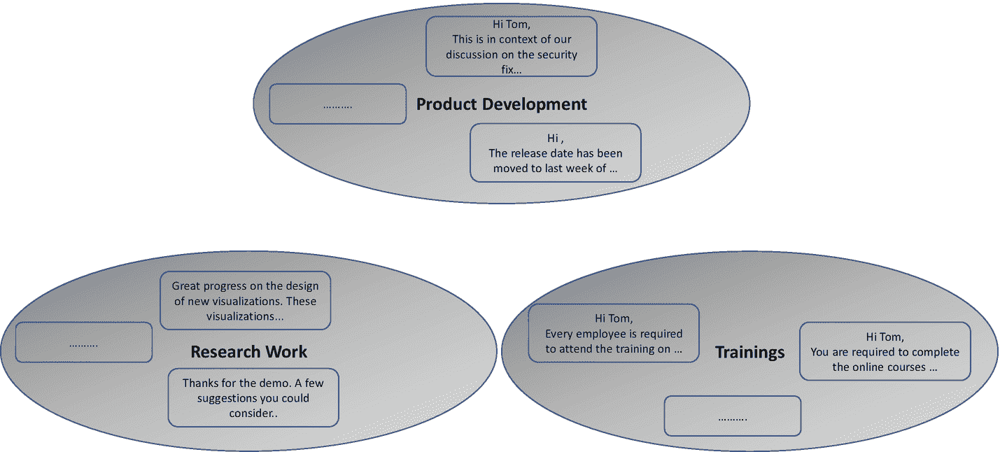
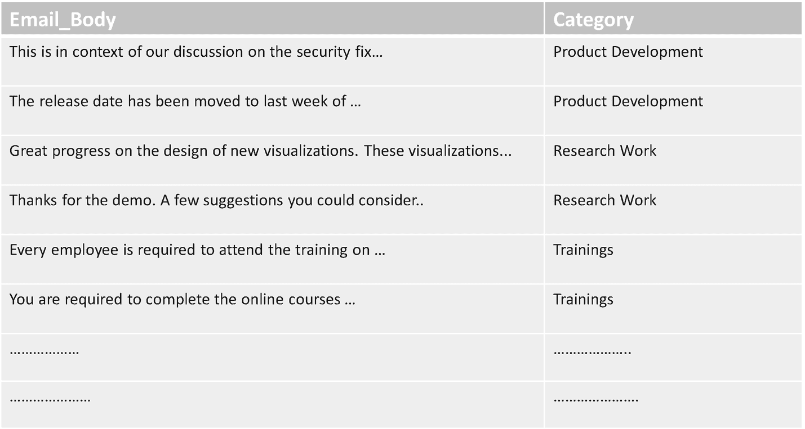
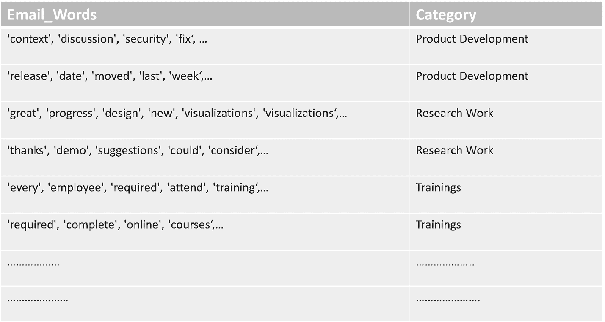
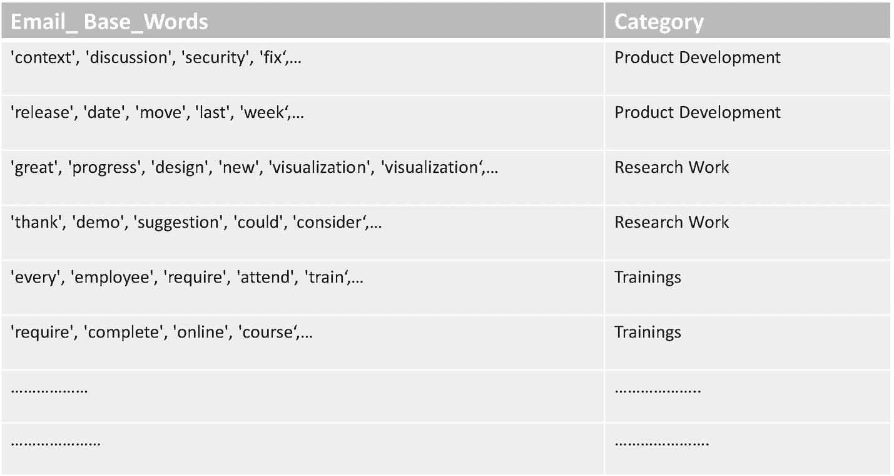
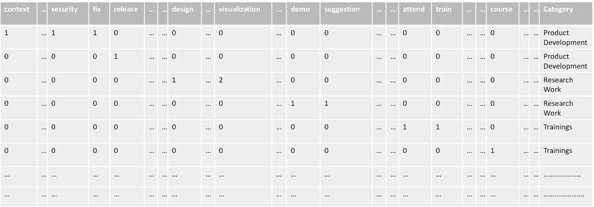
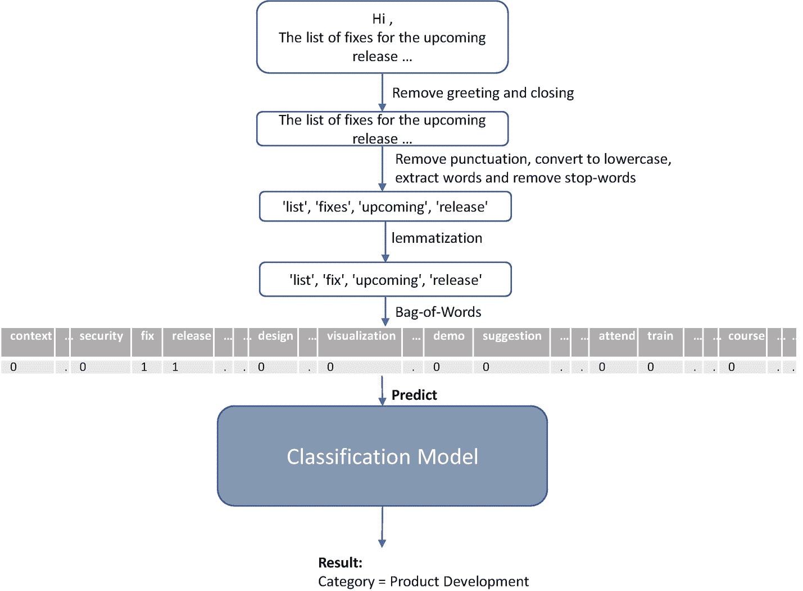

# 六、自然语言处理

正如在第 [1](01.html) 章中所讨论的，人工智能指的是像人类一样有智能行为的计算机。人类智力的一个方面是理解和说语言的能力。人工智能的子领域专注于让计算机像人类一样理解和生成语言，被称为*自然语言处理*。我们将从此用流行的缩写 *NLP* 来指代这个子领域。教计算机如何理解和说自然语言有很多好处。人类可以做数学计算，但是当计算机学会做数学计算时，它们可以比人类更快地完成更复杂的计算。同样，当计算机学习人类语言时，它们可以处理更多的语言数据，这带来了无数的可能性。

正如刚刚讨论过的，NLP 包括让计算机*理解*和*生成*人类语言。前者被称为*自然语言理解*或*NLU*，后者被称为*自然语言生成*或 *NLG* 。让我们来看看几个常见的 NLP 问题:

*   **情感分析**是指找到一段文字的整体情感。例如，发现来自客户的评论是正面的还是负面的。对公司产品在不同平台上的所有评论进行情感分析，可以让你对客户对产品的接受程度有一个总体的了解。

*   **文档分类**是指将文档分配到类或类别中。情感分析可以被认为是文档分类的特殊情况，其中类别是正面的、负面的或中性的。

*   **自动完成**是指根据输入的前几个字符预测文本的其余部分。例如，当您开始在搜索引擎的搜索框中键入时，预测您的查询文本可以将您从在手机的小键盘上键入整个文本的痛苦中解脱出来。

*   **语言翻译**是指将一种语言的文本翻译成另一种语言。

*   **意图分类**指的是将一个意图(来自一组给定的意图)分配给一段文本。例如，聊天机器人可以使用意图分类来判断用户输入文本的意图是*购买*还是*安装*或者其他意图，然后发送回与该意图相关的详细信息。

*   **文本摘要**是指对一大段文本自动生成摘要。

就像它的父领域 *AI* 一样，NLP 有两种方法:基于规则的方法和数据科学的方法。让我们详细看看一个文档分类问题，看看如何使用数据科学方法来解决它。假设你的公司有一个个人助理产品，可以帮助用户管理他们的待办事项、电子邮件、会议、设备等。，基于来自他们的语音命令。假设这个个人助理的用户是一名工程师，他接收与产品开发、研究工作、培训等相关的电子邮件。他们可能会发现为每个类别创建一个文件夹并通过将每个电子邮件移动到其相关文件夹来组织他们的电子邮件是很有用的。你可以给助手添加一个有趣的功能，自动将用户的电子邮件移动到正确的文件夹中。例如，如果用户收到了要求他们完成在线培训的电子邮件，则助手可以根据电子邮件中的文本，判断出该电子邮件属于类别“培训”，并因此将其移动到文件夹“培训”。这个问题属于*文档分类*，因为这里的目标是将每个文档(在这个例子中是电子邮件)分配到一个类别。让我们看看数据科学如何通过在每个步骤中选择适当的技术来帮助您实现这一目标。

## 数据捕捉

当用户将电子邮件移动到适当的文件夹时，助理在初始阶段默默地观察用户。电子邮件的这种初始手动移动捕获了必要的数据，助理将使用这些数据来学习如何在未来基于电子邮件文本自动确定每封电子邮件的正确文件夹，而无需询问用户。图 [6-1](#Fig1) 显示了用户已经移动到这些文件夹中的文件夹和一些样本邮件。

图 6-1

电子邮件和包含文件夹的快照

## 数据准备

这个问题的解决方案与我们到目前为止讨论的解决方案不同，因为数据科学流程的所有步骤都是在助手中自动完成的，而不是由数据科学家来执行每个步骤。作为数据准备的一部分，助理可以从每封电子邮件中去掉*问候*(例如*嗨汤姆、*)和*结束*(例如*问候、丰富的*)，并用其*类别*标记剩余的电子邮件正文，该类别是包含该电子邮件的文件夹的名称。图 [6-2](#Fig2) 显示了整合数据的快照，其中剥离的电子邮件正文标有其类别。这个想法是，助理将使用这些数据来建立一个模型，该模型学习如何通过查看电子邮件正文中的重要单词来推断电子邮件的类别。

图 6-2

包含电子邮件正文及其类别的准备数据

接下来，助手通过删除标点符号、将其转换为小写、提取单个单词以及删除“a”、“in”、“the”等停用词来预处理每个电子邮件正文。，这对于推断电子邮件的类别可能没有用。图 [6-3](#Fig3) 显示了这些预处理步骤后的准备数据。

图 6-3

删除标点符号、转换为小写、标记化和删除停用词后的准备数据

如前所述，助手试图学习如何通过查看电子邮件正文中重要单词的出现来推断类别。单词的不同屈折形式可能不会给出关于电子邮件类别的任何额外线索。例如，电子邮件是否包含单词“课程”或“课程”并不重要，两者都表明该电子邮件可能属于“培训”类别因此，助手可以对电子邮件单词执行词汇化，这将把单词的屈折形式转换回它们的基本形式。所以所有邮件中的“course”和“courses”都会变成“course”这个基本词。将所有电子邮件中的多种变形形式转换为基本单词也将减少助理必须处理的词汇(唯一单词的总集)。图 [6-4](#Fig4) 显示了词汇化后的准备数据——*Email _ Base _ Words*一栏包含了邮件单词的基本形式。为了简单起见，我们有意避免在术语化过程中详细处理*的词性* [1](#Fn1) 。在实际项目中，在执行词汇化时，您可能需要考虑每个单词所属的词性。

图 6-4

词汇化后的准备数据

助手将创建一个模型，该模型学习推断电子邮件的*类别*。因此，准备数据中的*类别*是模型的目标变量。但是该模型还需要基于其值进行预测的特征。所以，助手会使用某种机制从 *Email_Base_Words* 中提取特征。让我们假设助手使用*单词袋*技术来实现这一点——我们将在第 [14](14.html) 章中探讨一种更高级的技术。单词包将确定所有电子邮件中唯一基本单词的总集合，然后为词汇表中的每个基本单词创建一个特征。电子邮件的特征值是相应的基本词在该电子邮件中出现的次数。图 [6-5](#Fig5) 显示了使用单词袋技术提取的特征的局部视图；该图还显示了目标变量*类别。*你可以看到，在我们的词汇中，每个基础词对应一个特征。第一封电子邮件的特征*修复*的值是“1 ”,因为基础词*修复*在该电子邮件的基础词列表中出现过一次。对于第二封电子邮件，该特征的值为“0”，因为第二封电子邮件不包含单词 *fix* 。类似地，特征*可视化*的值对于第三封电子邮件是“2”，因为该电子邮件的基本单词列表包含单词“可视化”两次。现在功能和目标都可用了，助手可以继续进行数据科学流程的下一步。由于没有数据科学家积极参与其中，他们可以查看可视化并从中得出见解，因此助手将直接进入机器学习步骤。

图 6-5

词汇袋技术应用后的特点和目标

## 机器学习

助手现在会将这些准备好的数据交给机器学习算法，该算法可以学习如何根据特征值推断电子邮件所属的*类别*。这个问题现在被简化为一个简单的分类问题，所以我们不会涉及太多的细节，因为我们已经在前面的章节中讨论过这样的分类问题。助手可以尝试不同的可用分类机器学习算法，包括深度学习算法。我们将在第 16 章[中讨论深度学习。该助理还需要一种机制来评估不同算法产生的模型能够推断出电子邮件的类别。根据性能评估，它可以决定哪个模型具有最佳性能，以及该性能是否足以让它开始推断新电子邮件的类别，并相应地将它们移动到正确的文件夹。我们将在第 16 章](16.html)[的后面部分研究评估模型性能的这个关键方面。一旦助手瞄准了一个看起来有希望的模型，它就会切换到推理模式。](16.html)

## 推理

助手直到现在只是观察和学习；现在，它变得活跃，并试图路由新的电子邮件到正确的文件夹。它将使用已经创建的模型来推断每个新收到的电子邮件的类别，并将其移动到与该类别相对应的文件夹中。但是，正如上一节所讨论的，该模型只能根据特性的值来推断类别。这意味着助理需要从每封新邮件中提取特征值，然后将它们传递给模型进行推理。为此，它将遵循前面数据准备一节中描述的相同预处理步骤。图 [6-6](#Fig6) 显示了一封新收到的电子邮件以及它在推断之前所经过的预处理。首先删除问候语和结束语，然后删除标点符号、转换为小写、提取单词和删除停用词。接下来是词汇化，最后，单词袋应用于基本单词列表，以生成传递给模型的特征值。请注意，功能*修复*和*发布*的值都是“1”，因为这封电子邮件的基本单词列表中这两个单词都出现了一次。然后，该模型基于特征值推断出该电子邮件的类别是*产品开发、*，因此助理将该电子邮件移动到文件夹*产品开发。*

图 6-6

使用从新电子邮件中提取的特征的模型进行推断

可能发生的情况是，模型错误地推断出电子邮件的类别，助手最终将电子邮件放在了错误的文件夹中。当用户阅读电子邮件时，他们会将其移动到正确的文件夹中，作为对助手的反馈。下一次助理重复使用电子邮件及其文件夹来建立模型的整个过程时，新模型将自动从新电子邮件及其文件夹中学习。当助手开始使用新模型时，之前可能分类错误的电子邮件现在可能会正确分类。因此，随着时间的推移，助手在将电子邮件移动到正确的文件夹方面变得越来越好。

## 结论

NLP 是人工智能的一个热门子领域，正在快速发展。我们看到了 NLP 的两个方面，并简要地看了几个常见的 NLP 问题。我们讨论了自然语言处理的数据科学方法，并介绍了制作能够将电子邮件移动到适当文件夹的个人助理产品的步骤。这涉及到 NLP 中使用的一些常见的文本预处理步骤的讨论。这些步骤还介绍了如何将文本转换成 ML 模型使用的数字特征。

<aside aria-label="Footnotes" class="FootnoteSection" epub:type="footnotes">Footnotes [1](#Fn1_source)

比如动词、名词等。

 </aside>