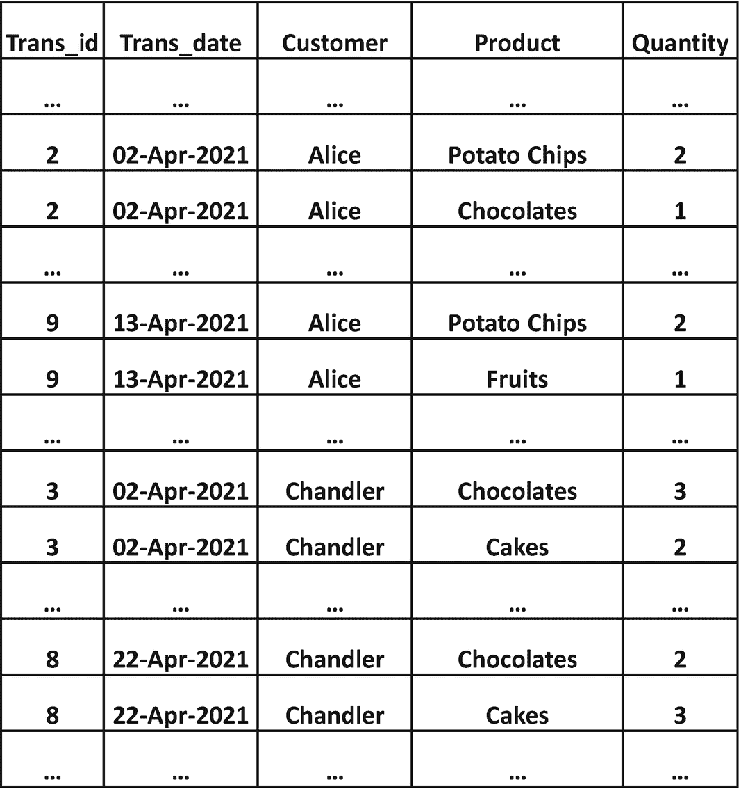
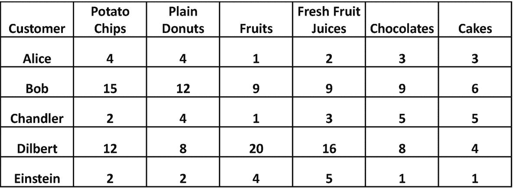
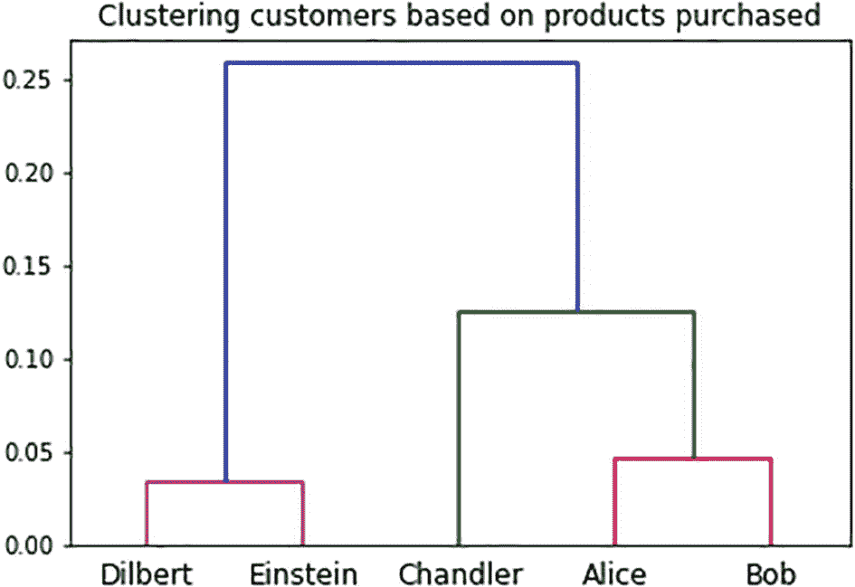
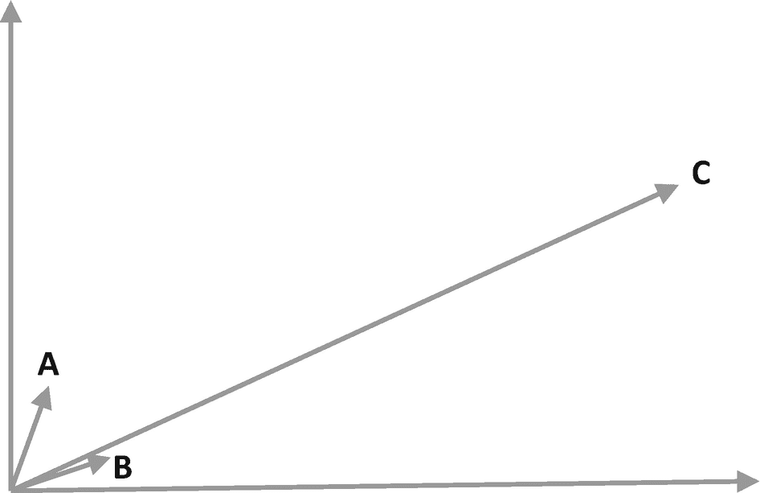
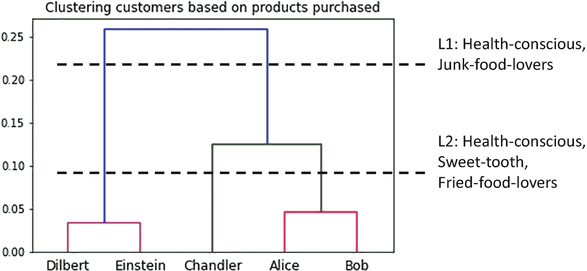

# 七、聚类

我们几乎本能地倾向于判断两个物体何时相似或不相似。例如，当我们看到自然界中的无数物体时，我们倾向于将它们分成两组:一组能够摄取食物并将其转化为能量，能够繁殖等等。而第二组没有表现出这些特征的物体。一旦我们辨别出两个如此明显不同的群体，我们就给他们一个名字——有生命的*和无生命的*的*。虽然这似乎是一个过于简单的例子，但基于生物特征、进化等的类似分组。，导致各种生物分类学。T5 1T7】*

当零售商店之类的公司希望根据客户的人口统计数据、购买模式和其他个人信息对客户进行分组时，也会出现同样的趋势。

这些是我们人类“智能”的一个基本方面的几个例子——我们天生的趋势和能力，即创建*相似的*对象/观察的组，也就是说，创建组，使得一个观察与其组中的其他观察更相似，而不是与其他组中的观察更相似。我们称这样的观察组为*星团*。我们将涉及识别给定一组观察值的聚类的问题称为*聚类*。

对于聚类，我们首先决定关注观察的哪些特征/属性。一旦基于这些属性创建了聚类，我们就分析这些聚类以理解每个聚类内的确切相似性；这将为每个集群产生一个名称和有用的描述。最后，对这些集群的这种洞察会带来一定的商业利益，例如为零售店的目标客户群(集群)确定适当的营销活动。

在这一章中，我们将看一个基于购买模式对客户进行聚类的端到端示例。这将说明如何使用数据科学过程来解决聚类问题，以从数据中获得洞察力。

## 数据捕捉

假设我们有一家商店的客户交易数据，包含客户购买的各种产品的详细信息，如图 [7-1](#Fig1) 所示。

图 7-1

客户交易

每行捕获客户购买的产品数量。 [2](#Fn2) 注意，客户通常在一次交易中购买多种产品——在这种情况下，相应的行具有相同的值 *Trans_id* 。

有了这些数据，我们有兴趣在我们的客户中找到共同的行为(购买)模式。

## 数据准备

在这种情况下，让我们假设我们只对最近的趋势和模式感兴趣。因此，我们将首先过滤数据，只关注上个月(比如 4 月)的交易。为此，我们可以根据 *Trans_date* 来过滤行。

然后，我们将汇总并透视最近交易的数据，以获得图 [7-2](#Fig2) 所示的结构。

图 7-2

每位客户每种产品的总数量

请注意，我们已经合计了整个四月份每位客户的产品数量，例如，Alice 在四月份总共购买了四种薯片。

### 处理缺失值

对于聚类，考虑如何处理观察值中的任何缺失值是很重要的。对于聚类来说，丢失值的处理可能相当微妙。一些技术遵循迭代方法，其中仅基于可用值形成聚类，然后使用聚类来推断缺失值。通常需要对域有深入的了解，以确保如果推断出任何值来替换丢失的值，不会对集群产生负面影响。

在我们的例子中，我们没有任何缺失值——如果客户没有购买某个特定的产品，我们在前面的表中的值就是零。

### 正常化

有些属性的取值范围可能与其他属性大相径庭。例如，一些产品可能比其他产品更频繁地被购买(例如，袜子可能比电子产品更频繁地被购买)。在这种情况下，我们可以对这些值进行标准化，以便所有产品的数量都落在相似的范围内。这有助于确保销售更多的产品不会严重偏向集群。

在我们的例子中，我们相信产品没有这样的变化。所以我们可以继续使用之前的数据。

## 数据可视化

一种特别适用于聚类的数据可视化技术是*树状图*。这通常在机器学习步骤之后的第二次迭代中使用。因此，我们将在机器学习步骤的一个小节中研究它。

## 机器学习

我们将使用一种叫做凝聚聚类的技术。 [3](#Fn3) 这种想法很简单，它的工作原理如下:

1.  从单观测值分类开始，也就是说，创建与观测值一样多的分类，并为每个分类分配一个观测值。

2.  将最相似**的两个集群合并成一个更大的集群。

    1.  重复执行这个步骤，直到一个单独的集群包含所有的观察值。

    2.  跟踪各种合并操作——这些操作会产生集群的层次结构。

     **

 **当前面的步骤完成后，我们将有一个集群的层次结构，可以在图中可视化，如图 [7-3](#Fig3) 所示。

图 7-3

树状图:聚类的层次结构

我们将在下一节“数据可视化迭代”中详细分析这个图。但在此之前，我们先暂停一下，理解一下前面步骤中的“相似”到底是什么意思——我们如何量化观察值的相似性？

### 观察的相似性

有几种方法可以定义两个观察值的相似性——参见图 [7-4](#Fig4) 中的一些方法。

图 7-4

相似性度量的动机

参考 A、B、C 三点及其对应的向量。现在，让我们比较两个相似的概念:

1.  点与点之间的距离:如果我们观察点与点之间的成对距离，我们会发现 A 和 B 彼此最接近。因此，如果这个度量——欧几里得距离——被当作相似性度量，那么 B 将更类似于 A，而不是 c。

2.  向量之间的角度:如果我们观察向量对之间的角度，我们会发现 B 和 C 彼此“最接近”。因此，如果将该度量作为相似性度量，那么 B 将更类似于 C，而不是 a。角度的余弦，称为*余弦相似性*，是一种常见的度量，因为其值恰好落在-1(非常不相似)和 1(非常相似)之间。注意余弦相似度只判断向量的方向，而*不判断向量的大小。*

总而言之，如果观察值被表示为 n 维空间中的点，，那么欧几里德距离将测量两个观察值彼此接近的程度，而余弦相似度将测量两个观察值指向相同方向的程度。

因此，我们看到可能有多种“相似性”的概念——领域决定了哪一个是最合适的。例如，如果某些属性表示陆地上的实际位置，则可以使用欧几里德距离-例如，如果您有来自不同位置的多个传感器的读数，并且您希望根据它们的读数和位置对它们进行分组，那么这可能是适用的。

在我们的特定案例中，我们对客户的*偏好*感兴趣，也就是说，他们比其他人更喜欢哪种产品。如果我们选择欧几里德距离，那么购买数量较少的客户将倾向于聚集在一起，而不管他们的*偏好*——就像在前面的例子中 A 和 B 被认为更相似。我们需要一个不受所购买产品的*绝对*数量影响的指标，而只受表明*偏好的各种产品的*相对*数量影响—*这完全取决于向量的“方向”,而不是它们的大小。 [5](#Fn5) 因此，我们决定在本例中使用*余弦相似度*作为相似度度量。在下一节中，我们将看到这对集群的影响。

相似性度量的选择是聚类中最关键的因素。正如我们所看到的，这很大程度上依赖于对领域的理解。因此，相似性度量最好通过与数据分析师/领域专家密切合作来决定。

ADVANCED NOTE: LINKAGE

回想一下，在凝聚聚类的步骤 2 中，我们需要合并最相似的两个*聚类*。当两个集群有多个观测值时，为了合并它们，我们还需要一种机制来量化两个*集群*的相似性——这被称为*链接*。

通常使用的三种联动方式是*单*、*全*和*平均*联动。 [6](#Fn6) 它们根据从每个聚类中选择哪个(些)观察值来表示两个聚类的总体相似性而变化。通常，用各种链接机制评估模型，以得出最有用的变体。链接的更多细节超出了我们的范围。

在我们的例子中，我们使用了*平均链接*。

创建了凝聚聚类模型后，现在让我们更详细地分析图 [7-3](#Fig3) 中的树状图。关于数据科学过程，这可以被视为数据可视化步骤的迭代。

### 数据可视化迭代

现在让我们更详细地浏览图 [7-3](#Fig3) 的树状图。

x 轴包含使用客户标记的初始单观察聚类。

每个横条代表由两个聚类合并而成的聚类，例如，红色横条代表由包含 Alice 和 Bob 的两个初始单观察聚类合并而成的聚类。同样，绿色横条表示由 Chandler 集群和红色集群(包含 Alice 和 Bob)合并而成的集群。

我们现在可以从底部到顶部阅读树状图，以了解集群形成的顺序。当我们从底部向顶部移动时，我们遇到水平线的顺序表明了星团形成的顺序。因此，集群按以下顺序形成:

1.  通过合并 Dilbert 和 Einstein 的集群得到的 Magenta 集群:首先，这两个客户彼此最相似。

2.  红色群集通过合并 Alice 和 Bob 的群集。

3.  通过合并钱德勒星团和红色星团的绿色星团:钱德勒更像爱丽丝/鲍勃，而不是呆伯特/爱因斯坦。

4.  通过合并品红色和绿色集群来合并蓝色集群。

y 轴表示相异度，即，较低的值表示较高的相似度。在我们的例子中，因为我们使用了余弦相似度，所以*相异度*被计算为(1–余弦 _ 相似度)，这也被称为*余弦距离*。因此，我们可以从图中看到，呆伯特和爱因斯坦的聚类之间的余弦距离约为 0.03(品红色水平线的高度)，而品红色和绿色聚类之间的余弦距离约为 0.26(蓝色水平线的高度)。

已经理解了如何阅读树状图，现在让我们看看如何解释树状图，以及从中可以推断出什么样的见解。

ADVANCED NOTE: ROLE OF THE SIMILARITY MEASURE

请注意相似性度量在聚类中的作用——尽管 Dilbert 购买的产品比 Einstein 多得多，但它们被认为是相似的，因为我们使用了余弦相似性，并且它们都有相似的方向，即相似的*偏好*。例如，他们似乎都更喜欢水果/果汁，而不是巧克力/蛋糕。

如果我们使用欧几里德距离，爱因斯坦会首先与爱丽丝/钱德勒聚集在一起，因为他们购买的产品更少，而且在欧几里德空间中的点上更接近。

## 推理

在前面的章节中，我们看到了在推理步骤中预测新观察值的例子。在聚类的情况下，我们根据创建的聚类来推断一些见解，这也被称为*知识发现。* [7](#Fn7)

### 解读树状图

使用聚集聚类的优点之一是，我们可以分析层次结构，以确定哪种聚类在业务环境中最有意义。参考图 [7-5](#Fig5) 了解如何在我们当前的示例中实现这一点。

图 7-5

从树状图中识别有意义的聚类

在树状图中，当我们从顶部向底部移动时，聚类的数量增加。如果我们在任何地方画一条水平线，那么它相交的垂直线的数量决定了集群的数量。图 [7-5](#Fig5) 中显示了两条这样的水平线，它们代表了识别星团的两种可能机制，我们称之为 L1 和 L2。

1.  L1 得到两个聚类:一个聚类包含 Dilbert 和 Einstein，第二个聚类包含 Chandler、Alice 和 Bob。

2.  L2 得出三个聚类:一个聚类包含呆伯特和爱因斯坦，第二个聚类只包含钱德勒，第三个聚类包含爱丽丝和鲍勃。

数据分析师可能会调查每个集群中的观察结果，并确定，如图 [7-5](#Fig5) 所示，

*   在 L1 的例子中，两个集群分别代表喜欢健康食品和垃圾食品的顾客。 [8](#Fn8)

*   在 L2 的例子中，这三个分类分别代表喜欢健康、甜食和油炸食品的顾客。

领域理解和业务环境将决定选择 L1 和 L2 中的哪一个。例如:

*   如果爱吃甜食的客户群很少，吸引/锁定他们的成本很高，那么只有两个客户群可能是有用的。因此，L1 将被选中。

*   如果爱吃甜食的人恰好是该行业的一个重点领域，那么 L2 可能会被选中。

### 营销的可行见解

根据业务环境的不同，可以有不同种类的可操作的见解。假设你选择了 L2，下面是几个市场营销的例子:

*   假设你计划储备一些新产品，比如黄油饼干和能量棒。你知道这些新的黄油饼干是油炸的，能量棒是健康的。
    *   你可能会向油炸食品爱好者群宣传黄油饼干。由于饼干也有点甜，你也可以向爱吃甜食的人做广告。

    *   你可能会向注重健康的人群宣传能量棒。如果你知道能量棒碰巧也很甜，例如，含有天然糖，你也会向爱吃甜食的人宣传它。

*   假设在使用 L2 创建这些集群后不久，您已经储备了一种新产品。甚至没有深入分析产品的内容/性质，谁可能会喜欢等等。，您可以使用集群来提出建议。例如，如果你发现 Dilbert 在购买新产品，你可以向 Einstein 推荐(例如，使用折扣券)。同样，如果你发现 Bob 在购买新产品，你也可以向 Alice 推荐。我们将再次讨论第 [9](09.html) 章中的建议。

## 结论

在任何捕获了大量数据并希望从中获得一些见解的企业中，都经常会遇到聚类问题。解决聚类问题通常会带来关于客户、流程、领域等的新知识。，并且是从数据中进行*知识发现的常用方法之一——通常称为 KDD。我们将在第 23 章[中再次关注 KDD 项目。](23.html)*

在这一章中，我们看了一个集群问题的端到端例子。用于聚类的思维过程和技术通常适用于其他领域——我们将在第 [9](09.html) 章“建议”中看到一个例子

## 进一步阅读

James 等人(2013)对集群问题和典型挑战进行了出色的介绍。它还涵盖了各种聚类技术的更多细节，包括聚集聚类。

## 参考

詹姆斯、加雷斯等人*统计学习导论*。纽约:施普林格，2013 年。

<aside aria-label="Footnotes" class="FootnoteSection" epub:type="footnotes">Footnotes [1](#Fn1_source)

例如，参见 [`https://tree.opentreeoflife.org/`](https://tree.opentreeoflife.org/)

  [2](#Fn2_source)

在实际系统中，客户、产品和 Trans_id 应该是 UUIDs(通用唯一标识符),而不是这样简单的名称/数字。此外，产品将有一个复杂的类别层次结构，一个交易将捕获 SKU。最后，将捕获事务的时间戳，而不是 Trans_date。为了简单起见，我们忽略了这些细节。

  [3](#Fn3_source)

也称为自底向上的层次聚类。

  [4](#Fn4_source)

其中不同维度上的点的坐标是基于相应观察的不同特征的值。

  [5](#Fn5_source)

例如，假设图 [7-4](#Fig4) 中的横轴和纵轴分别代表产品 P1 和 P2 的(标准化)购买值。那么 A 显然更喜欢 P2 而不是 P1，而 B 和 C 都稍微喜欢 P1 而不是 P2。这由相应矢量的方向表示。

  [6](#Fn6_source)

还存在其他连接，如质心和向心。

  [7](#Fn7_source)

聚类问题在 KDD/数据挖掘项目中相当常见——参见第 [23 章](23.html)。

  [8](#Fn8_source)

请注意，这仅仅是一个说明性的例子，我们希望对大多数读者来说是直观的——我们并没有考虑“巧克力是垃圾食品吗？”这里有一些争论。

  [9](#Fn9_source)

我们将这种营销活动称为交叉销售。

 </aside>**