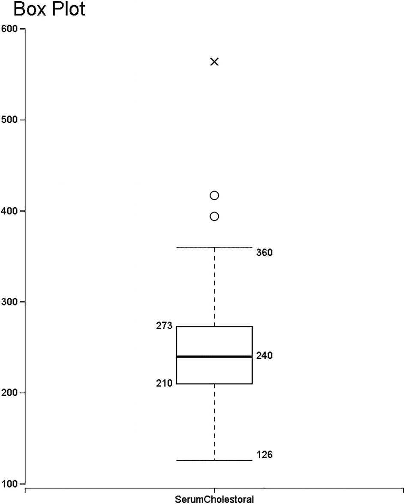
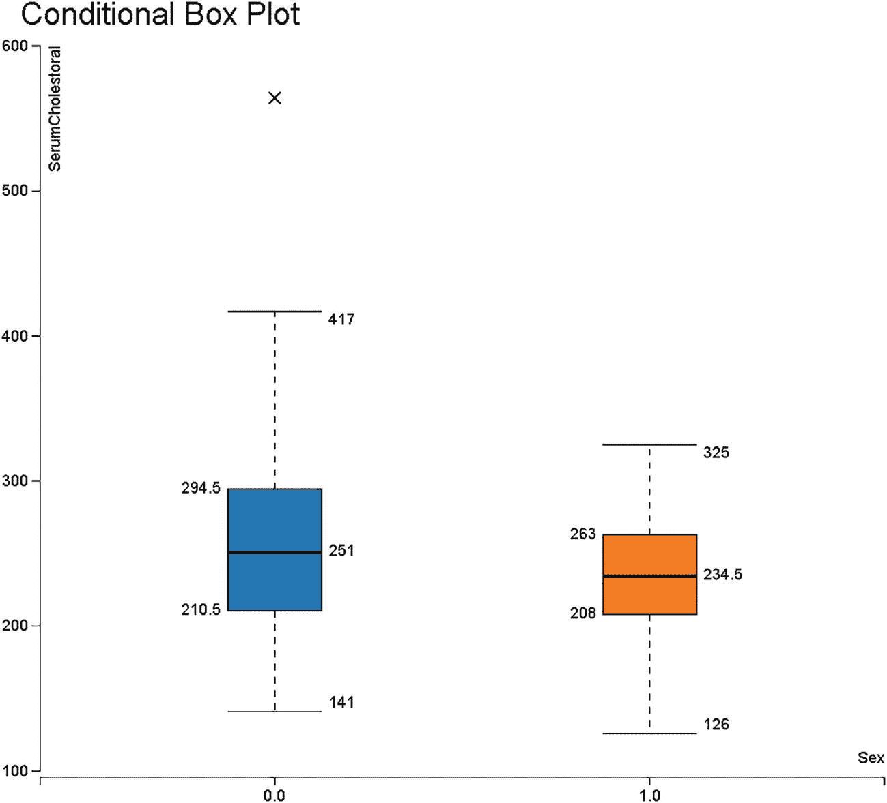
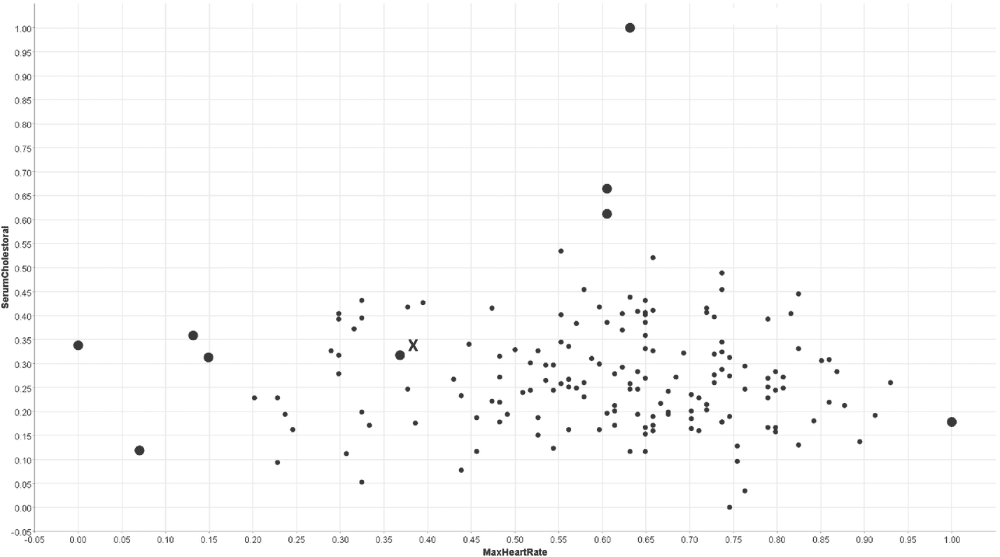
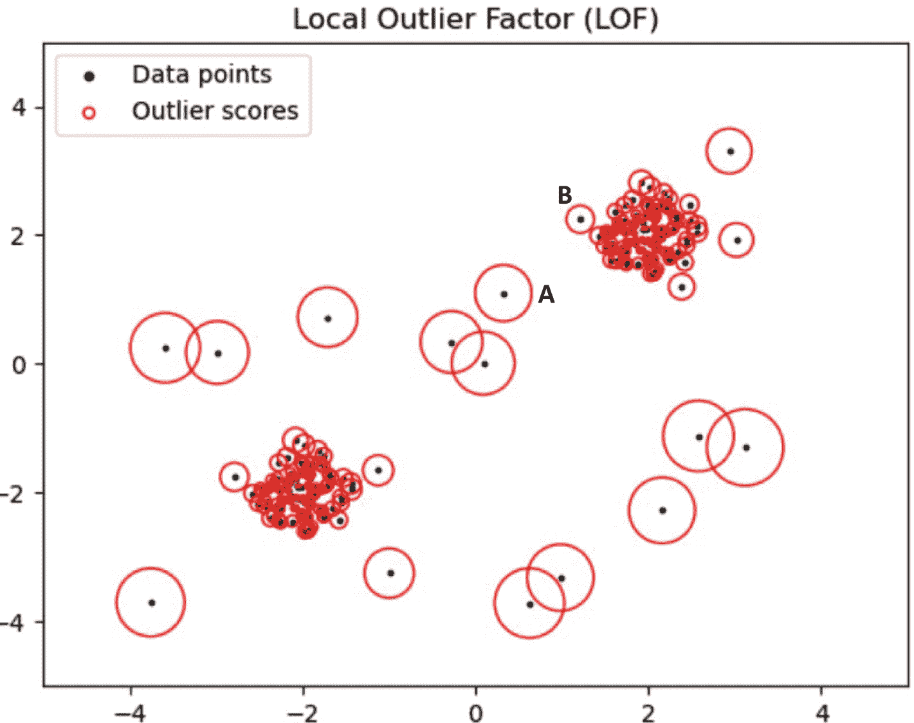
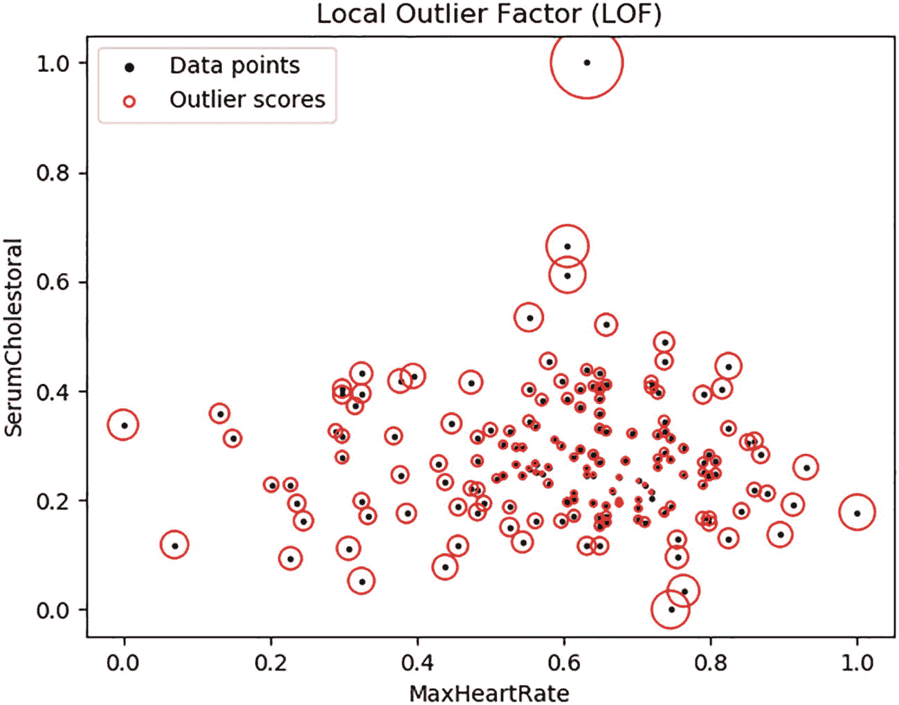
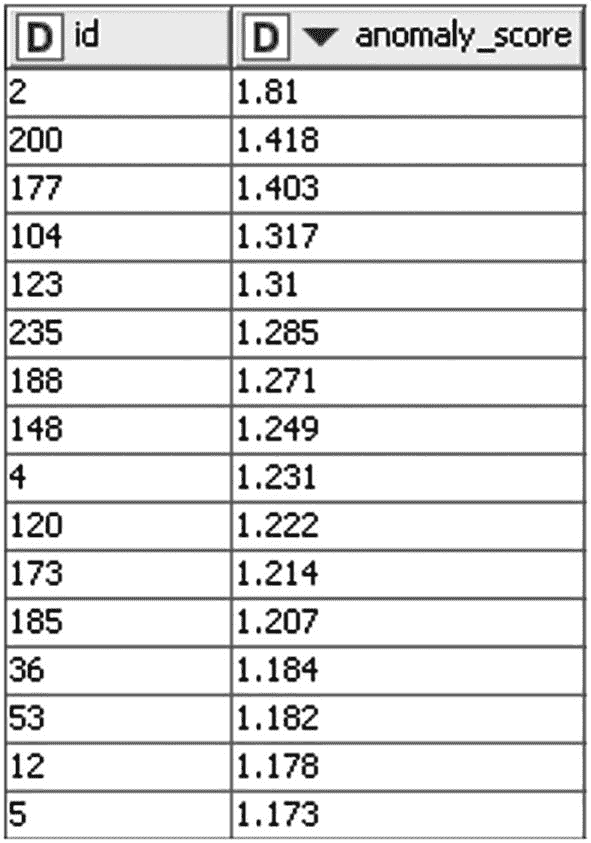

# 八、异常检测

通常，我们倾向于对观察结果是意外的还是异常的有一个固有的概念。似乎表现不稳定或给出很少看到的读数的传感器；前所未闻的症状/测试读数组合，或医学图像(如 CT 扫描)中的罕见模式；和不寻常的 IT 系统中的网络流量，这些是容易引起注意的一些情况。检测数据中的任何异常事件被称为异常检测。

大体上，根据您拥有的数据类型，异常检测分为三类:

*   标记数据:如果您知道数据中的哪些观察值是正常的，哪些是异常的，并且目标是预测哪些新的观察值是异常的，那么这类似于将两个目标分类为*正常*和*异常*的分类。既然你把某些观察结果视为异常，那么很可能你的正常观察结果要比异常观察结果多得多。所以，你需要恰当地处理阶级不平衡。因为这可以用分类技术来解决，所以我们在这一章中将不再讨论。

*   未标记的数据:如果您不知道哪些观察值是正常的，哪些是异常的，那么您需要首先训练一个模型来确定现有数据中的异常观察值。然后，您可以在新的观察中应用相同的模型来检测异常。在这种情况下，一个隐含的假设是，异常观察的百分比相对较小。

*   纯数据:你有你*知道*不包含任何异常观察的数据。在这种情况下，您需要训练一个模型来学习什么是正常观察值。然后，您可以确定是否有任何新的观察结果被模型视为不正常，也就是说，是否有任何新的观察结果对于模型来说是*新奇的*。一个新的观察可以潜在地指示一个异常。异常检测的这个子类通常被称为 ***新奇检测*** 。

在关于异常检测的这一章中，我们将首先介绍使用未标记数据和纯数据进行异常检测的例子。然后，我们将看一个端到端的例子，说明在数据科学过程中，针对无标签数据和纯数据的异常检测问题的步骤。然后我们将稍微更正式地总结异常的概念以及 ML 算法的选择如何影响这个概念。最后，我们将看几个复杂异常的例子，包括集体异常和上下文异常的概念。

## 使用未标记数据的异常检测

*   你有来自病人的数据，他们中的一些人患有你有兴趣研究的特殊疾病，比如说乳腺癌。癌症患者在人口中所占的比例相当小，因此您可能希望将此视为异常检测问题，即识别异常的患者，这可能预示着乳腺癌。在这种情况下，除了医学图像之外，特征可以包括患者的相关医学信息。

*   您拥有企业中数千用户远程登录的审计数据。根据登录模式，您希望推断是否发生了任何入侵攻击，例如，潜在的用户帐户被黑客攻击。在这种情况下，这些特征可以包括用户在一天中登录的 IP 地址的数量、远程登录的地理位置、月份、星期几以及其他这样的因素。我们的目标是检测是否发生了任何异常模式，例如，一个用户通常在一天内从四到六个不同的 IP 地址登录，突然在一天内从十个以上的 IP 地址登录。

*   您有工厂生产的零件的各种测量数据。根据之前对您的工业流程的分析，您知道通常有 2%的制造零件在某种程度上是有缺陷的。您对通过将异常检测技术应用于每个零件的测量来持续自动确定哪些零件有缺陷感兴趣。(其更复杂的变化是能够基于每个零件的多个图像来检测这些有缺陷的零件。)

## 使用纯数据的新颖性检测

*   作为视频监控系统的一部分，你有正常情况的视频。如果看到任何不正常的图像或动作，你需要发出警报。例如，在火车车厢上的正常情况下，人们会平静地行走或坐着。如果我们使用这些视频训练一个模型，该模型就可以检测出异常情况(图像或视频)，如有人挥舞枪支、骚扰或人群恐慌。

*   您的公司生产管道，这些管道用于形成输送石油或天然气的长管道。管道通常延伸到无监督的偏远地区，很容易被篡改。管道包含监测振动的传感器，目标是检测是否出现任何异常振动，例如，由于在管道中钻孔而出现的异常振动。在这种情况下，您将捕获许多关于正常振动值的数据，但由于实际限制，您可能没有关于有人以不同方式闯入管道的数据。在这种情况下，您的数据(正常振动值的数据)可以被视为纯数据，您的目标是训练一个可以正确捕捉正常行为的模型。当振动值与正常行为大相径庭时，我们可以称之为异常，这可能表明管道中存在篡改或故障。

## 异常检测的数据科学过程

在本节中，我们将查看一个示例数据集( *HeartDisease* )，并涵盖异常检测环境中数据科学流程的步骤。

### 世界和数据采集

数据 [1](#Fn1) 包含来自一组患者的读数、与心脏功能相关的某些测试的读数、一些症状和先前存在的状况，以及诸如年龄和性别的患者元数据。有了这些信息，我们的目标是找到哪些患者是异常的——异常可能表明，比如说，潜在心脏状况的存在。

捕获的数据类型将决定进一步的分析。例如，如果我们只有一组健康的患者，那么我们需要使用处理纯数据的技术。另一方面，如果我们的队列也可能包含心脏病患者，并且他们的百分比相对较小，那么这就是使用未标记数据进行异常检测的情况。在这一点上，检查世界(在分析师的帮助下——在这种情况下，可能是诊断医生或临床医生)是否在我们观察的人群中存在已知的心脏病患病率也是有意义的。这可以帮助我们以后确定异常分数的阈值。

### 数据准备

常见的数据准备方面，如处理缺失值等。，在这里也适用。此外，快速查看各种特性的值的范围表明，一些特性(如性别)是分类的，而另一些是数字的。数字特征也具有不同的范围。

通常，对于处理数字特征的算法来说，*归一化*使所有的值落在 0 和 1 之间是很有用的。在这种情况下，让我们也准备一个规范化数据集。(在某些情况下，我们可能只有在对数据进行初步的探索性视觉分析后才这样做。)

### 数据可视化

通常情况下，我们会首先查看单个要素的任何值是否是异常值。例如，这可以从箱线图中看出。此外，我们可以尝试查看特征值的某些组合是否相当罕见，例如，散点图。

注意，我们在这里使用术语*异常值*是指图中的一个点是“视觉”异常值。图中的异常值可能表示也可能不表示异常观察值；目测异常值通常只是分析的起点。

例如，这种分析可能会指出哪些特征更有可能识别异常，并有助于获得关于数据的更多直觉。

#### 箱线图

让我们先来看看图 [8-1](#Fig1) 中的一个特征*血清胆固醇*的方框图。

图 8-1

血清胆固醇箱形图

该图表明大多数观察值倾向于落在 126 和 360 之间(一半的观察值落在 210 和 273 之间)。我们可以将 126–360 范围之外的值视为异常值。对于我们用来绘图的库，它用十字表示极端异常值，用圆圈表示轻度异常值。在这种情况下，我们看到有三个异常值，其中一个是极端异常值。

让我们仔细看看这个方框图中的不同视觉元素在高层次上代表了什么。方框的下边缘代表*第一个四分位数(Q1)* ，表示 25%的观察值低于该值(210)。方框的上边缘代表*第三个四分位数(Q3)* ，表示 75%的观察值低于该值(273)。方框内的粗水平线代表中值，表示 50%的观察值低于该值(240)。第三个四分位数和第一个四分位数之间的距离称为*四分位数间距*(即 IQR = Q3–Q1)。上须延伸至最大观察值，该值落在从 Q3 开始测量的 IQR 的 1.5 倍的距离内(因此上须延伸至 360°)。较低的须状物延伸到最小的观察值，该观察值落在从 Q1 测量的 IQR 的 1.5 倍的距离内(因此较低的须状物延伸到 126)。正如你在图 [8-1](#Fig1) 中看到的，两个胡须之外的观察结果被绘制为异常值。请注意，在这种情况下，下须下方没有异常值。

箱线图是一种快速获得单个要素值的直观方法。

您可以记下一些看起来有趣的观察结果，例如，它们是否是多个特征的箱线图中的异常值，等等。，以便与领域专家或业务分析师进一步讨论。在这种情况下，领域专家可以是诊断医生/心脏病专家。

该分析仅使用了数字特征。我们可以使用条件盒图在分析中进一步包括分类特征。

#### 条件盒图

为分类要素的每个值创建的箱线图称为条件(或分组)箱线图。例如，图 [8-2](#Fig2) 显示了跨越*性别*值的*血清胆固醇*的条件箱线图(比如，男性/女性表示为 0/1)。

图 8-2

条件盒图–不同性别值的血清胆固醇水平

如果我们将其与图 [8-1](#Fig1) 中*血清胆固醇*的早期箱线图进行比较，我们可以看到异常值是如何受患者性别影响的。例如，我们在*血清胆固醇水平*箱形图中看到三个异常值，但在这里，我们只看到一个。这是因为 *Sex=0* 的正常范围要大得多，从 141 到 417。因此，我们之前认为图 [8-1](#Fig1) 中的两个异常值现在看起来是图 [8-2](#Fig2) 中雄性的正常值*。此外，我们看到在女性中，似乎没有血清胆固醇水平异常。*

因此，一个人的性别会影响哪些 T2 血清胆固醇值被认为是正常的。这就是特征之间的关系对于异常检测的重要性。类似地，我们还会使用其他分类特征来查看条件盒图，例如 *ChestPainType、*等。

数字特征之间的关系也可以类似地相关。为了分析两个数字特征之间的关系，我们可以使用散点图。

#### 散点图

散点图用于可视化两个数字特征之间的关系，如图 [8-3](#Fig3) 所示。请注意，在这里，我们使用了归一化的特征值，因此两个要素在相同的比例上。

图 8-3

血清胆固醇与最大心率的散点图

我们用较大的点突出显示了几个点，这些点表示潜在的异常观察，因为它们在图中似乎有些孤立。还要注意点 X，它看起来比它的邻居更加孤立。通过独立地观察这两个特征，我们可能会注意到其他潜在的异常观测，但是我们的注意力不会被吸引到像 x 这样的观测上。

我们可以绘制多个散点图，以确定哪些*对*特征潜在地指示一些异常。

使用诸如盒图和散点图之类的技术，我们可以得到一些直觉，哪些特征可能与指示异常相关。在研究了一些可视化之后，我们通常会对异常如何依赖于多个特征有所了解。潜在地，也有可能一个观察值对于仅仅一个或两个特征不是异常，但是所有特征的值的组合可能是异常。

一旦我们超越了两三个特征，我们就不可能“可视化”数据来获得这种类型的洞察力。但是到目前为止，我们的直觉确实表明，我们可以希望根据 n 维空间中观察结果的相对位置来检测一些异常。现在让我们转向机器学习，以帮助我们使用多种特征将我们的视觉直觉扩展到 n 维空间。

### 机器学习

当我们使用箱线图和散点图时，我们实际上是在目测观察结果之间的距离，也就是说，被*视为*很远的观察结果被视为异常。有几种算法通过将概念扩展到多个特征，以类似的方式基于观测值之间的距离来检测异常。

我们将使用局部异常因子(LOF)算法。我们在这里的选择是出于以下原因。首先，它是直观的，与我们视觉上倾向于感知的异常值高度共鸣。其次，它是少数几种可以合理地用于两种情况的算法之一——无标签数据或纯数据。最后，在像这样的医疗保健例子中，我们可能感兴趣的是找到与“相似”患者不同的患者，而不是与整个队列不同的患者。这自然会导致我们发现“局部”异常，也就是说，异常的观察值与相似的观察值不同，但不一定与整个数据集相关。LOF 发现的观察值与其邻居相比相对孤立，因此能够检测局部异常。

我们将使用观测值的术语“局部密度”来表示该观测值周围邻居的密度，也就是说，如果邻居在观测值周围密集，则该观测值的局部密度高。 [3](#Fn3) LOF 致力于直觉，如果一个观测值的*局部密度*低于其邻居的局部密度，那么该观测值比其邻居更反常。图 [8-4](#Fig4) 用一个*玩具*的例子提供了一个快速的直觉。

图 8-4

局部异常因素:具有两个特征的玩具示例 [4](#Fn4)

正如我们从该图中看到的，与相邻点相比相对孤立的点会得到较高的异常值(异常值)分数。在这种情况下，异常分数实际上是一个观测值的局部密度相对于其邻居的偏差的函数。例如，点 A 的局部密度与其两个最近邻居的局部密度相似，因此 A 获得与其两个最近邻居相似的分数。另一方面，点 B 的局部密度小于其最近邻居的局部密度，由于这一点，B 得到比其邻居更高的分数。

如果我们在我们的心脏病数据集上运行 LOF，但仅使用两个特征 *SerumCholestoral* 和*MaxHeartRate*，我们会得到如图 [8-5](#Fig5) 所示的结果。

图 8-5

LOF 只使用两个特征:血清胆固醇和最大心率

我们可以将其扩展到使用标准化心脏病数据集中的多个特征来运行 LOF 算法，以获得所有观察值的异常分数，并根据异常分数对它们进行排序。当我们使用七个选定的特征运行 LOF 时，包括*血清胆固醇、最大心率、*和*性别*，我们获得了如图 [8-6](#Fig6) 所示的异常值。

图 8-6

心脏病数据集上使用 LOF 的异常评分

这些异常分数现在可以用于推断。

### 推理

现在，模型已经为机器学习步骤中的观察值生成了异常分数，我们可以继续确定异常。为了做到这一点，我们将首先为异常分数设置一个适当的阈值。例如，如果我们保持阈值为 1.3，我们会将前五次观察称为异常。这就是分析师的洞察力在决定一个合适的阈值时有用的地方。分析师还可以确定相对异常分值是否合适，例如，检查正常观察值是否没有得到高异常分值。基于来自分析师的输入，我们可以通过修改参数和 LOF 算法中使用的特征来执行进一步的迭代。

NOVELTY DETECTION USING LOF

注意，LOF 算法也可以与纯数据一起用于新颖性检测。在这种情况下，每一个新的观察都要进行独立的新颖性测试。新观测值的局部密度与其相邻观测值的局部密度(在纯数据中)进行比较，以确定其异常值。如果新观测的局部密度显著低于其邻居的局部密度，则它可以被视为新观测。

## 异常现象的剖析

看到异常检测的例子后，让我们稍微更正式地研究一下当我们说“这个观察是异常”时，我们到底是什么意思我们很少说一个观察结果本身是不正常的，我们通常是说它与我们看到的*其他*观察结果相比感觉不正常。

这种直觉反映在由大多数异常检测技术生成的*异常分数*中。异常分数可以用来确定相对异常，正如我们在前面的心脏病例子中看到的。例如，业务分析师可以根据观察值的异常分数对其进行排序，并确定一个适当的阈值——分数超过该阈值的观察值可以被标记为异常。在我们需要更深入地了解异常行为的情况下，这种将业务分析师包括在内的方法非常有益。例如，分析师可以根据领域需求定制虚警 [6](#Fn6) 比率:

*   一个医疗诊断用例会建议，错误警报越多越好，而不是冒着疾病未被检测到的风险。因此，分析师可能会选择一个保守的低门槛。

*   在物联网使用案例中，来自众多传感器的数据点数以百万计，虚警可能会使分析变得不堪重负。如果异常不指示严重故障，而是可容忍的故障或者仅仅是感兴趣的观察，则可以选择更高的阈值来减少错误警报，这是冒着忽略偶然故障的风险的。

除此之外，各种异常检测技术对异常是什么强加了它们特定的概念和解释。例如:

*   在基于最近邻的技术中，观察值被视为 n 维空间中的点。然后，以某种方式将每个观察值与其邻居进行比较，以得出异常分数，即，观察值的异常性由其在 n 维空间中的位置及其最近邻居的位置来确定。(LOF 是这类技术的一个例子。)

*   在基于概率密度函数的技术中，如核密度估计，概率上极不可能发生的观测值被视为异常。

*   在基于聚类的技术中，例如 k-means，观察值根据它们的相似性被分组到聚类中。不属于任何集群、[【7】](#Fn7)或者远离集群中心、或者属于非常稀疏的集群的点，则可以被视为异常。

确定这些概念中的哪一个最适合手头的问题也是选择相应技术的一个因素。

## 复杂异常

异常现象不一定是孤立发生的。通常是一组特定的观察结果是异常的，或者异常取决于额外的上下文信息。我们将看一下每种情况的几个例子。

### 集体异常

几个常见的异常作为一组观察值出现，这样每个观察值本身都不是异常的，但是整个组的出现是异常的。例如，如果在一台计算机上，缓冲区溢出、远程会话启动和数据传输事件同时发生，则这是一个异常，可能表明存在黑客攻击。但是，这三个事件中的每一个都可能在正常操作中单独发生。 [8](#Fn8)

集体异常的其他典型例子有

*   来自传感器的一系列读数似乎不正常。例如，在我们前面看到的管道示例中，假设我们预期偶尔的单个读取可能是不寻常的，也就是说，它不是异常。但是某种程度上持续的异常读数序列是异常的(并且将指示篡改)。在这种情况下，读数的顺序是一个集体异常。

*   一系列日志或事件可以表明对软件或网络的入侵攻击。在一些复杂的系统中，一系列的日志也有可能指示错误的行为，从而导致不良的用户体验。在这些情况下，NLP 可以与异常检测技术相结合来标记异常。

### 语境异常

在许多情况下，异常取决于观察数据的环境。常见的上下文是观察的时间和位置。

例如，一个人在任何一天可能通常最多花费 500 美元，除了像圣诞节这样的假期，他们可能花费高达 2000 美元。现在，如果他们在 12 月花费 2000 美元，这是正常的。但如果他们在 7 月份花掉哪怕 1000 美元，也会被认为是反常的。

类似地，位置的地理环境(例如，纬度/经度)、附近的事件/景点以及其他此类信息也可以发挥重要作用。

在某些情况下，精心设计一个概括的上下文来降低复杂性并使分析易于处理是很有用的。例如，在信用卡欺诈检测中，一种方法是将每个人视为一个上下文，因为每个人的消费模式会有很大的不同。但是这将需要大量的模型和增加的复杂性。一个更容易处理的方法是从客户*细分*中构建*概要*，并使用概要作为上下文。

合并适当的上下文对于提高异常检测的准确性至关重要。特别是在大数据时代，当互联网上的上下文数据很容易获得时，例如在社交媒体上，您可以尝试将更多的上下文吸收到您的分析中，以提高相关性和准确性。

#### 时间序列

在一段时间内，按时间顺序观察到的一系列数据称为时间序列数据。示例包括传感器读数、金融交易或心电图读数。这里，*时间*是我们正在分析异常的一系列*观察值*的上下文。考虑到它的重要性和广泛的适用性，我们将介绍这个特例的几个额外的例子。

忽略时间信息并将这些数据简单地视为一个序列可能是不合适的。将时间信息结合到分析中可以发现依赖于数据周期性的异常。例如:

*   在 ECG 中，特定读数或读数集合可能在正常范围内，但仍然与通常预期的规则和周期形式不一致。读数周期的这种不一致可能表明心律不齐。

*   个人的交易可能具有一定的周期性，例如，定期发生的海外交易，例如，每个季度。如果我们在一个季度内看到多笔海外交易，这将表明一种异常。

*   考虑我们在本节开始时看到的例子，根据登录模式(如远程用户登录的不同 IP 地址的数量)检测入侵攻击。在这种情况下，时间通常是一个重要因素，例如，周末或节假日的登录模式可能与平日不同。此外，个人可能有特定的模式需要考虑，例如，经常在周四和周五出差的人可能在这两天有不同的模式。

## 结论

在本章中，我们讨论了异常检测问题的各种细微差别和类型。我们还看了一个例子来了解人类的方式(例如，方框图)和算法(有点神秘)来确定异常。

异常检测是领域专家(或业务分析师)可以发挥重要作用的领域之一——尝试了解模型何时标记异常或遗漏异常。这一点的重要性会根据您的业务环境中异常的关键程度和影响而有所不同。

## 进一步阅读

有许多关于异常检测的调查报告。其中一个经典是 Chandola、Banerjee 和 Kumar (2009)。尽管异常检测技术从那时起已经发展了很多，但是对数据类型、问题/应用程序和技术进行分类的概念框架仍然在很大程度上适用。

有关该领域的更多详细信息和最新报道，请参考 Mehrotra、Mohan 和 Huang (2017)。它涵盖了异常检测在各个领域的应用，随后是用于异常检测的方法和算法。

## 参考

Chandola，Varun，Arindam Banerjee 和 Vipin Kumar。"异常检测:综述."ACM 计算调查，第 41 卷，第 3 期【2009 年 7 月。

梅赫罗特拉、基尚、奇卢库里·莫汉和黄华明。*异常检测原理和算法*。瑞士查姆:施普林格，2017。

<aside aria-label="Footnotes" class="FootnoteSection" epub:type="footnotes">Footnotes [1](#Fn1_source)

[T2`www.dbs.ifi.lmu.de/research/outlier-evaluation/DAMI/semantic/HeartDisease/`](http://www.dbs.ifi.lmu.de/research/outlier-evaluation/DAMI/semantic/HeartDisease/)

  [2](#Fn2_source)

在这种情况下，健康意味着没有心脏病。

  [3](#Fn3_source)

在计算局部密度时要考虑的邻居数量是一个必须根据经验调整的参数。

  [4](#Fn4_source)

[T2`https://scikit-learn.org/stable/auto_examples/neighbors/plot_lof_outlier_detection.html`](https://scikit-learn.org/stable/auto_examples/neighbors/plot_lof_outlier_detection.html)

  [5](#Fn5_source)

ML 算法的这些参数，例如在计算局部密度时要考虑的邻居数量，被称为*超参数*。我们将在第 16 章[中查看超参数。](16.html)

  [6](#Fn6_source)

假警报，即算法错误地将正常观察标记为异常。

  [7](#Fn7_source)

更准确地说，是属于仅包含该一个点的簇的点。

  [8](#Fn8_source)

缓冲区溢出本身可能是由应用程序中的错误引起的。

 </aside>