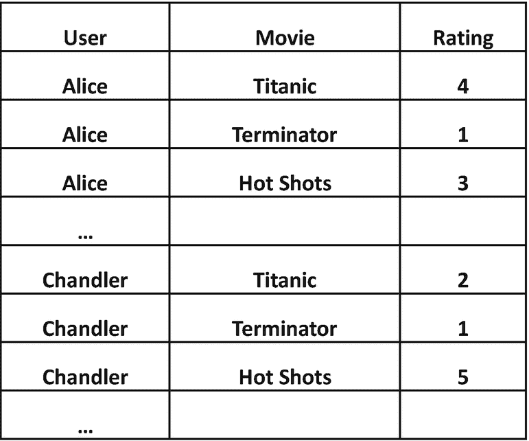
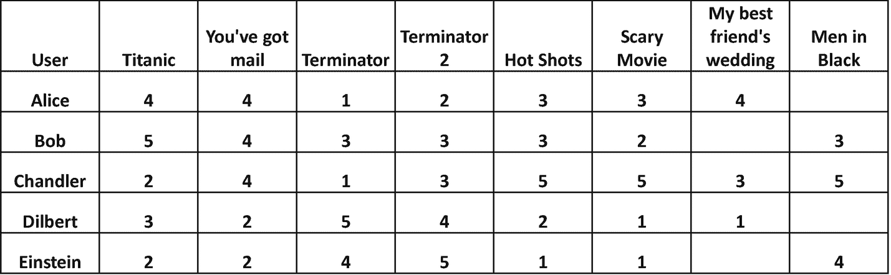
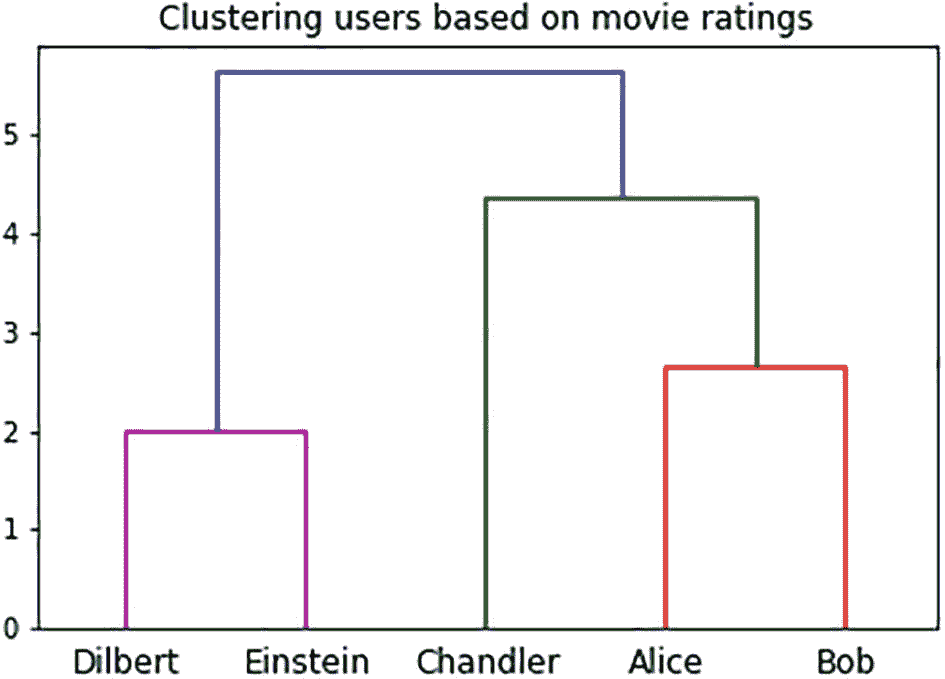
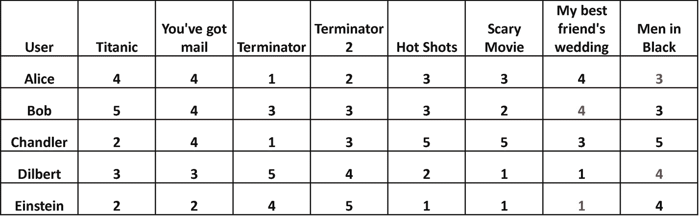

# 九、推荐

曾几何时，你可能有一位密友向你推荐一本书、一首歌或一部电影——因为这位朋友知道你的“品味”，你通常会查看他们的推荐。

在当今的网络世界中，网站和移动应用程序(以及开发它们的公司)已经收集了所有访问者和客户的数据，这些数据可能是在网站/应用程序上发生的每次点击的粒度级数据。这些数据包括他们购买/拒绝和喜欢/不喜欢的每本书/歌曲/电影/产品。

基于这些数据，如果一家公司能够确定用户的“口味”，它就可以伪装成他们的朋友，向他们推荐他们可能感兴趣的东西。这不仅是一个很好的交叉销售/追加销售的机制，因此增加了公司的销售额，而且考虑到这些公司的库存范围，为用户增加了巨大的价值(想想 Amazon.com、网飞等)。)并因此增加客户参与度。

在这一章中，我们将看一个端到端的例子，如何从过去的顾客购买、评级等数据中估计个人的“品味”。，以及如何提出建议来改善用户体验。

## 数据捕捉

在本节中，我们将首先看一下项目/交互的一般概念，以及关于如何捕获这些数据的一些常见变化。然后我们看看本章中用于确定建议的示例数据。

### 项目和互动

我们使用术语“项目”来表示用户与之进行“交互”的任何事物，例如，交互和项目可以是:

*   在在线流媒体平台上观看电影；电影是物品。

*   从电子商务网站购买产品；产品就是项目。

*   在交友平台上喜欢/约会另一个人；其他用户是项目。

我们的目标是能够根据用户过去与几个项目的交互数据，向用户推荐他们最可能喜欢的项目。在本章的其余部分，我们将关注用户观看电影的例子——但是类似的概念也适用于其他类型的交互/项目。

### 量化互动

当用户与一个项目交互时，我们如何捕捉交互的本质和质量？概括地说，有两种方式来捕捉用户关于项目的反馈:

*   隐式反馈:我们确定用户是否隐式地喜欢项目*，例如，他们是否一口气看完了整部电影，然后搜索相似的电影，等等。，他们大概喜欢。如果他们中途离开一部电影并且再也没有回来，他们可能不喜欢这部电影。*

**   显式反馈:我们明确地向用户征求反馈。要求用户使用星级或拇指向上/向下等对电影进行评级。，就是这样的一个例子。* 

 *所有这些信息最终都以某种量化的形式被捕获，例如，可以是简单地表示用户是否观看了电影的 0/1，1-5 级的评分，或者是使用这些机制的组合计算的复杂评分。

### 示例数据

在我们当前的示例中，我们将参考图 [9-1](#Fig1) 中所示的样本数据。

图 9-1

由用户分级的电影，每个用户-电影对一行

在我们的数据中，我们表示用户对各种电影的反馈，评分等级为 1-5，作为明确的反馈。较低的分数表示用户不喜欢该电影，而较高的分数表示用户喜欢该电影，例如:

爱丽丝喜欢《泰坦尼克号》,不喜欢《T2》《终结者》,而钱德勒两样都不喜欢。

给定这些数据，我们的目标是向用户推荐他们还没有看过的电影。我们的目标是只推荐他们可能喜欢的电影，也就是我们预测他们会评价很高的电影。

## 数据准备

我们将旋转数据以获得如图 [9-2](#Fig2) 所示的结构。

图 9-2

由用户分级的电影，每个用户一行，每个电影一列

这类问题通常需要两种主要的准备步骤:规范化和处理缺失值。

### 正常化

用户不仅口味/偏好不同，而且提供反馈的方式也不同。用户提供反馈的两种常见方式是

1.  一些用户通常倾向于给出高或低的评级。例如，如果一个用户通常倾向于给出高等级，那么等级 3 可能意味着他们根本不喜欢这部电影。

2.  具有相似平均评级的用户可能在评级范围上有所不同。例如，考虑两个给出大约 3 的平均评级的用户。其中，假设一个用户几乎给所有电影都打了 3 分，而另一个用户总是只给电影打 1 分或 5 分。现在，如果第一个用户偶尔给 5 分，它比第二个用户给的 5 分更有意义/更有价值。

为了调整这些固有的个人尺度，重要的是*标准化*数据。诸如*的技术意味着居中* [1](#Fn1) (对于点 1)或 *Z 分数归一化* [2](#Fn2) (对于点 2)修改评级以考虑用户可能用来评分的任何固有的个人尺度。

虽然这种规范化有助于改进推荐，但在某些领域的环境中，它们也可能是误导性的或不适当的。例如，假设用户研究一部电影的许多细节(例如，阅读评论、看导演、演员等等)。)才能查看。该用户可能通常只给出高分，不是因为他们倾向于给出高分，而是因为他们只观看他们可能喜欢的电影。在这种情况下，使用上述技术调整他们的分数可能是不合适的。 [3](#Fn3)

在我们当前的说明性例子中，我们将不应用任何标准化。

### 处理缺失值

在实践中，数据可能有许多缺失值，特别是如果大多数用户即使在与他们互动后也只对少量项目进行评分。例如，用户可能经常观看电影，但不会对其进行评级。有办法填补缺失的评分；参考薛等人(2005)的例子。

然而，在我们当前的例子中，我们将认为一个丢失的条目意味着用户没有看过那部电影。比如爱丽丝就没看过*黑衣人*。我们的目标是找出我们是否应该向用户推荐这部电影。但是，对于我们现阶段的分析，我们将只考虑那些已经被所有用户评级的电影，即我们将排除*我最好朋友的婚礼*和*黑衣人*。

## 数据可视化

向用户提供推荐的系统通常是端到端自动化的。因此，我们不包括这种推荐系统的数据可视化。

## 机器学习

我们将采取的高级方法是，给用户一个

1.  找到与 a“相似”的用户。

2.  对于 A 还没有看过的电影，根据这些“相似用户”对这些电影的评价，预测 A 会如何评价这些电影

3.  推荐 A 预测会获得高评分的电影(即 A 可能会喜欢的电影)。

我们将在下一节中查看步骤 1；步骤 2 和 3 包含在*推理*部分。

### 基于聚类的方法

我们首先根据用户对电影的评价对他们进行聚类——这将使我们能够找到与给定用户相似的用户(步骤 1)。从概念上讲，这就像我们在第 7 章看到的一样。因此，我们将重用我们在第 [7](07.html) 章中看到的聚集聚类T34技术，以产生如图 [9-3](#Fig3) 所示的聚类层次。

图 9-3

基于用户对电影评价的用户群

让我们假设我们决定形成三个集群——第一个集群包含呆伯特和爱因斯坦，第二个集群仅包含钱德勒，第三个集群包含爱丽丝和鲍勃。(在大规模的自动化系统中，集群数量的选择取决于所使用的 ML 技术；如果我们使用凝聚聚类，这种选择可能会根据树状图中垂直线的相对高度自动进行——这方面的细节超出了我们的范围。)

## 推理

一旦集群形成，我们就可以根据集群中其他用户对电影的评价来预测用户 A 对电影的评价。例如，我们可以计算他们群中的其他用户对一部电影的简单平均评价；或者我们可以根据另一个用户与 a 的相似程度来计算加权平均值。

在我们的简单示例中，我们可以用图 [9-4](#Fig4) 中红色显示的预测评级来填充表格。

图 9-4

预测评级用红色表示

具有高预测评级的条目将由系统 [6](#Fn6) 产生以下推荐:

*   我最好朋友的婚礼会被推荐给鲍勃。

*   黑衣人会被推荐给呆伯特。

## 端到端自动化

随着用户对电影的观看和评分，我们的数据将继续增长。聚类算法可以自动定期运行以形成用户的聚类。当向用户显示推荐时，我们将运行推理步骤。

集群更新的频率取决于域和用例。在我们的例子中，我们可以每隔几天更新一次集群。

ML TECHNIQUES AND CLASSES OF PROBLEMS

在本章中，我们使用了“凝聚聚类” *ML 技术*来解决一个“推荐”*问题*。在第七章[和第九章](07.html)中，我们使用了同样的“凝聚聚类” *ML 技术*来解决一个“聚类”*问题*。一般来说，一个 *ML 技术*可以应用于多个*类问题*。

## 结论

推荐系统现在是一些在线服务——网站和移动应用程序——的重要组成部分。在这一章中，我们介绍了一个端到端的例子，使用我们在第 [7](07.html) 章中首次看到的聚类技术来构建推荐系统。

构建推荐系统的技术继续快速发展——参见“进一步阅读”部分了解一些新的发展。

## 进一步阅读

我们在本章中基于聚类的推荐方法是受薛等人(2005)的启发。 [7](#Fn7)

互联网规模的最早的推荐系统之一是在 Amazon.com 在线推荐产品。关于推荐系统的简史和一些使用深度学习技术的最新发展，请参考 Hardesty (2019)。

如果你想在你的应用程序中加入推荐系统，你可以考虑开始使用云服务，比如 Amazon Personalize。

## 参考

哈迪斯，拉里。*亚马逊推荐算法的历史*。22 11 2019.< [`www.amazon.science/the-history-of-amazons-recommendation-algorithm>`](http://www.amazon.science/the-history-of-amazons-recommendation-algorithm%253e) 。

宁、夏、克里斯蒂安·德罗斯尔斯和乔治·卡里皮斯。"基于邻居的推荐方法的综合调查."*推荐系统手册*。由…编辑弗朗切斯科·里奇，利奥·罗卡赫和布拉查·沙皮拉。纽约:斯普林格，2015。

薛、桂荣和林、陈曦和杨、强和、和曾、华军和于、雍和陈、郑。"使用基于聚类平滑的可扩展协同过滤."第 28 届 ACM SIGIR 国际信息检索研究与发展年会会议录。巴西萨尔瓦多:计算机协会，2005 年。114–121.

<aside aria-label="Footnotes" class="FootnoteSection" epub:type="footnotes">Footnotes [1](#Fn1_source)

从用户的每个评分中减去用户评分的平均值。

  [2](#Fn2_source)

用以平均值为中心的评分除以用户评分的标准差。

  [3](#Fn3_source)

有关这些方面的更详细报道，请参见 Ning、Desrosiers 和 Karypis (2015)。

  [4](#Fn4_source)

在这种情况下，我们已经基于欧几里德距离进行了聚类。详见第 [7](07.html) 章。

  [5](#Fn5_source)

在实践中，我们也可以包括来自其他类似集群的用户-参考薛等人(2005)的更多细节。

  [6](#Fn6_source)

注意，与第 7 章不同，在这里，我们对理解集群代表什么不感兴趣，等等。

  [7](#Fn7_source)

注意，为了概念上的简单，我们使用了具有欧几里德距离的凝聚聚类；本文实际上使用了 k-means 聚类和 Pearson 相关作为相似性度量。

 </aside>*