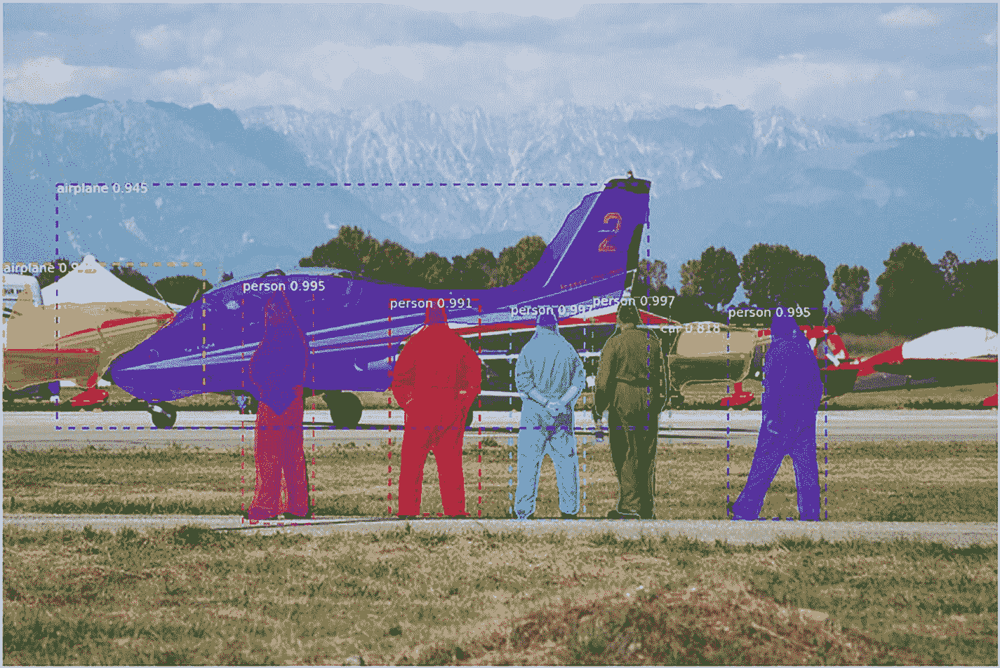
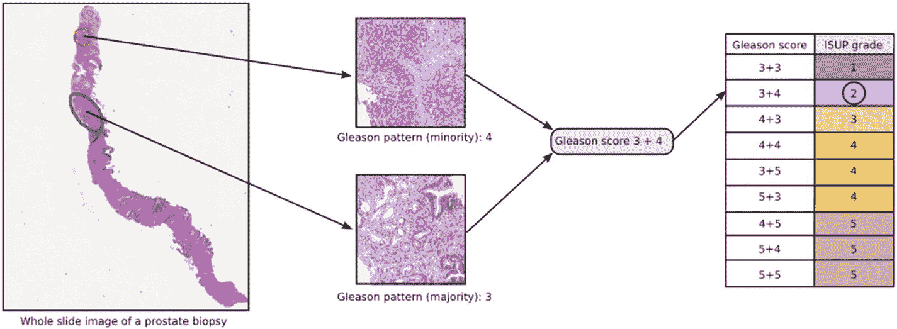
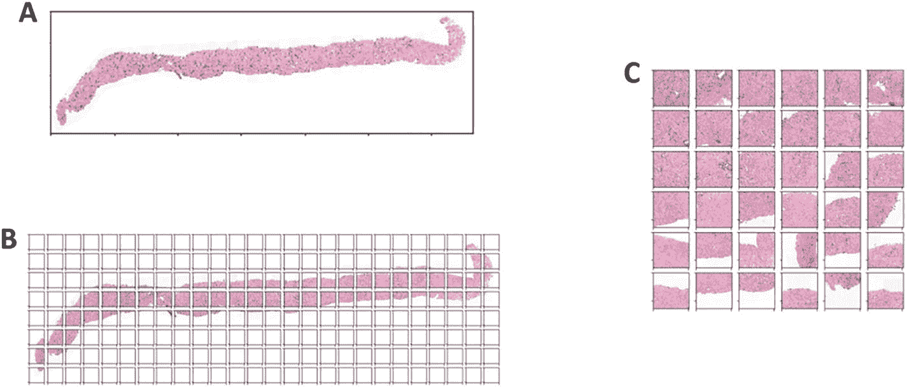

# 十、计算机视觉

术语*计算机视觉*从根本上来说是指软件算法处理图像和视频等视觉信息的能力，类似于人类处理视觉信息的方式。在*人工智能*的总体领域下，计算机视觉领域是更复杂、更高级别的“智能”之一从 2012 年开始，计算机视觉深度学习方法的巨大成功复兴了神经网络、数据科学和人工智能。

在本节中，我们将讨论属于计算机视觉范畴的各种问题。我们先来看看涉及图像处理的各种问题，然后再来看看涉及视频处理的问题。然后，我们将简要地看一下一些公共数据集和竞赛，这些数据集和竞赛在过去的十年里将这个领域推向了聚光灯下。最后，我们将用一个简单的例子来总结如何使用数据科学方法来解决计算机视觉问题。

## 处理图像

作为人类，当我们视觉感知一个场景或图像时，我们会得出各种结论:

*   我们对整个场景进行分类:我们觉得我们在看一个办公室，一个住宅，一个医院，或者一个风景优美的山谷。在这种情况下，我们正在对整个场景(图像)进行分类，而不是专注于单个方面(如人、房间、床、树等。)在场景内。这可以看作是*图像分类*，即从整体上给每个图像(场景)分配一个目标类。

*   我们分离在一个场景中看到的多个物体。例如，在一个房间里，我们可能会看到多个人、多件家具等等。在自然环境中，我们可以看到山、树、鸟或动物，以及其他人。这被称为对象检测或对象识别。

当我们试图用软件自动化这些感知时，会出现以下几类问题。

### 图像分类/回归

将总体目标类别或数值分配给图像的能力有几个应用。例如:

*   分类:从活检图像中检测癌症等级，从 CT 扫描中确定癌症的存在，自动注释图像，等等。

*   回归:根据一个人的面部图像来确定其年龄。这是有用的，例如，防止孩子访问某些娱乐途径/网站，或者确定自动售货机的购买者是否未成年。

在本章的后面，我们将看一个从活检图像检测癌症等级的端到端例子。

### 目标检测

当我们观察任何一个场景时，我们不仅仅检测到诸如人、车辆等物体。还有它们的位置——在我们人类的感知中，我们通常会同时探测到物体的类型和它们的位置。

图 [10-1](#Fig1) 显示了在图像中检测诸如人和飞机的物体的例子。

图 10-1

物体检测示例 [2](#Fn2)

请注意，对象的位置可以用几种不同的方式表示:作为对象周围的边界框或多边形边界，或者作为整个对象的精确像素。不同的技术和框架在不同程度上支持这些机制。

自 2012 年以来，目标检测是研究最广泛、发展最快的领域之一。诸如 Mask-RCNN、YOLO 等各种框架在准确性和性能延迟之间提供了不同的折衷。

对象检测具有许多应用，例如，在入侵检测系统中定位意外对象(人)的存在，作为自动交通灯控制系统的一部分通过检测车辆及其类型来监控交通密度，在医学图像中检测肿瘤，等等。

### 数据集、竞争和架构

2012 年卷积神经网络(CNN)的成功应用赢得了一年一度的 ImageNet 大规模视觉识别挑战赛(ILSVRC)，开启了人工智能的新时代，并彻底改变了深度学习的格局。

除了 ILSVRC 所基于的 ImageNet 数据集之外，Pascal VOC(视觉对象类)、MS COCO(上下文中的公共对象)和 Open Images 是在推进计算机视觉领域中至关重要的几个数据集。在对象检测中，各种挑战来自对象的位置、它们的方向、变化的大小等等。MS COCO 和 Open Images 在更真实的设置中包含更丰富的图像集，是评估图像分类和对象检测模型性能的最新标准。

深度学习方法， [3](#Fn3) 尤其是基于 CNN 的方法，已经在基于这些数据集的竞争中脱颖而出，成为最成功的方法。我们将在第 16 章[中讲述神经网络；现在，提到神经网络被组织成多个层和层之间的连接就足够了。神经网络中层和层间连接的这种设计选择被称为其*架构*。流行的神经网络*、*架构，尤其是那些在之前的数据集上表现最佳的架构，在几乎任何领域的各种计算机视觉问题中找到了广泛的用途。通常，当您着手解决涉及图像处理的计算机视觉问题时，您会首先查找最新的文献，以确定针对这些标准数据集报告的最先进的图像分类架构或对象检测框架。](16.html)

在撰写本文时，EfficientNet 体系结构系列是性能较好的图像分类体系结构之一。YOLO 是流行的对象检测框架之一。

我们将在第 16 章中探讨 CNN，它是所有这些现代图像处理技术的基础。

## 处理视频

作为人类，当我们随着时间的推移在视觉上感知一个场景时，或者当我们观看录制的视频时，我们会得出各种结论:

*   我们对整体活动进行分类，例如，一个人是否在跳舞，或者一个视频片段是否是体育活动，等等。这被称为视频分类。

*   我们随着时间的推移跟踪各种对象，例如，团队运动中的各种运动员，电影剪辑中的汽车追逐赛中的汽车，等等。这被称为目标跟踪。

我们将看看业内处理录制视频的一些常见应用程序，以获得这样的见解。

### 视频分类

这里的问题是对整个视频进行分类，例如，确定视频中发生的活动的种类或确定视频的类型。例如，这些可以用于

*   娱乐或教育目的，因为用活动类型或流派自动标记视频可以更快、更准确地搜索和检索相关内容。

*   例如，用于检测人群恐慌或类似异常情况的监视系统

这些都是具有挑战性的问题，技术是一个活跃的研究领域。

### 目标跟踪

这是视频分析中最常遇到的问题，在各种领域都有应用。例子包括

*   跟踪行人、车辆、物体等的运动。在监视系统或人群/交通监控系统中。这可能是更大的智能城市生态系统的一部分，包括交通控制系统。

*   跟踪车间设备，例如，作为装配线和车间的一部分。

这也是一个活跃的研究领域——虽然最初的采用是在监控系统和智能城市用例中，但我们预计很快也会在制造业的车间中增加采用。

## 计算机视觉的数据科学过程

在本节中，我们将介绍数据科学过程中的步骤，例如从活检图像中检测癌症等级。

### 世界和数据采集

这些数据由前列腺组织活检图像和专家确定的 ISUP 分级组成。为了理解专家是如何得出 ISUP 等级的，图 [10-2](#Fig2) 显示了一个样本图像和分级过程的图解。

图 10-2

ISUP 分级方法论 [4](#Fn4)

正如我们所见，根据良性腺体和各种癌细胞的外观，有某些局部模式表明癌症的存在。单个图像可能包含几个这样的癌症局部“标记”，它们需要在 ISUP 分级的最终评估中组合在一起。如果没有癌症，我们认为这种情况下为 ISUP 0 级。与我们在本节的报道相关的是，每张图片都被赋予一个 ISUP 等级，这个等级最终是基于特定的局部模式。更多详情可参见“*进一步阅读”*部分。

### 数据准备

我们从活检图像中看到的挑战之一是，有大量的背景空白，不包含任何有用的信息。此外，图像通常在一个方向比另一个方向更长——大多数图像分类技术最适用于正方形图像，并且可以容忍纵横比的一些变化，但可能不适用于我们图像中的各种变化。

因为在我们的情况下，我们更感兴趣的是指示癌细胞的局部图案，而不是整个图像中的图案，所以一种技术是将图像分割成更小的瓦片，并将瓦片重新组装成正方形图像。在这样做的时候，我们选择具有最少背景空白的图像块，也就是说，最多的组织，从而覆盖大部分的组织区域。通过采用这种方法，我们解决了这两个挑战。图 [10-3](#Fig3) 显示了一个这样的例子。 [5](#Fn5)

图 10-3

数据准备:平铺示例。" A "是原始图像。“B”表示创建的瓷砖。“C”是通过将来自“B”的 36 个瓦片重新组合成具有最大组织的正方形图像而形成的变换图像

但是如何将图像分割成图块，也就是图块的大小应该是多少？非常小的瓦片将确保几乎没有背景空白，并且大部分组织区域被保留。但是这可能导致将局部化的图案分解成多个小块，使得难以检测图案。另一方面，大的图块会保留大部分相关的模式，但是可能会导致合并大量的背景空白。这些变化最初是使用视觉分析目测的，如上图所示。

在某些情况下，图像可能包含其他标记，例如病理学家绘制的钢笔标记。最好去除图像 [6](#Fn6) 中的这种噪声——这也属于数据准备——并可视化(一些)清理后的图像以验证清理过程。

### 数据可视化

准备好数据后，您可能通常希望设计可视化效果，以获得更多信息，例如基于所选切片的大小和数量的组织覆盖变化等。但是为了简明起见，我们将直接跳到机器学习步骤。

### 机器学习

我们准备的数据现在具有带有最大组织区域和 ISUP 等级的变换的正方形图像。我们将使用这些准备好的数据训练一个神经网络，直接从一个转换的正方形图像预测 ISUP 品位。 [7](#Fn7) 从文献中，我们看到，谭和乐(2019)描述的 EfficientNet 系列模型显然是最先进的。EfficientNet 系列模型具有称为 B0、B1 …直到的架构。EfficientNet-B0 是复杂性最低的最简单架构，通常用于创建第一个基线模型。因此，让我们使用一个高效的 Net-B0 模型来解决我们的问题。我们将在第 16 章[中更详细地了解 CNN，它是 EfficientNet 的基础。](16.html)

如果模型表现不佳，我们可能需要重新改进数据准备方法，例如，使用具有不同分块大小的分块方法来确定哪种数据准备会产生最佳模型。但是如何确定一个模型是否表现良好呢？换句话说，在这种情况下，我们如何评估模型的性能？

#### 模型性能评估

在许多情况下，例如第 [4](04.html) 章中的示例，模型在预测类别时的性能取决于模型正确分类的观察值数量——换句话说，预测被视为正确或错误；两者之间没有灰色地带。

在像癌症等级检测这样的问题的情况下，如果癌症等级 4 的图像被预测为 5，这是不正确的，但是仍然比 1 或 2 的预测更接近事实。在这种情况下，等级并不是真正不同的类别，而是根据癌症的严重程度排序的。因此，我们感兴趣的是模型的预测与事实有多接近，而不仅仅是对错。在这种情况下，更合适的指标是类似于*加权 kappa* 的指标——我们将在第 [16](16.html) 章中更详细地了解模型性能评估。与此同时，这份简短的说明旨在强调，当我们使用“模型性能”这样的术语时，它不一定简单地暗示预测是对还是错——度量标准的精确选择取决于手头的问题。

虽然一开始就选择了合适的指标，但该指标通常也是在数据科学流程的多次迭代中精心制作或提炼的。

一旦我们有了一个表现相当好的模型，我们就可以用它来预测活检图像的 ISUP 分级。

ADVANCED NOTE: ENSEMBLES

在多次迭代和实验中，我们可能有几个已经训练好的模型。在实践中，与其使用这些模型中最好的，不如使用模型的*集合*。

一个集合模型基本上从它的所有组成基础模型中提取预测，并将它们聚合起来以给出最终结果。作为一个粗略的例子，集合可能简单地返回多数结果，例如，如果大多数模型预测 ISUP 等级为 3，则最终结果为 3。

聚合多个模型的结果有多种方法，从简单的多数投票到高级的 ML 聚合技术。细节不在我们的讨论范围之内——关键的一点是，多次实验和迭代在计算机视觉问题中特别有用，在实践中，集成已经显示出很高的预测能力和推广能力。

### 推理

在推断过程中，我们将需要运行我们在训练中使用的精确的数据准备步骤。例如，在机器学习步骤中创建我们的最终模型之前，我们将使用所选瓷砖的大小和数量的特定值，并将图像转换为方形图像，如数据准备部分所述。在推断过程中，对于所选图块的大小和数量具有相同值的那些精确变换也应该应用于新图像。

ADVANCED NOTE: TEST-TIME AUGMENTATION

在计算机视觉问题的推理过程中，一种常用的技术是测试时间增加(TTA)。TTA 旨在增强对图像方向或位置变化的鲁棒性。

要理解 TTA，有必要了解模型推理如何工作的细节。当我们使用准备好的数据(转换后的正方形图像)和作为 ISUP 等级的目标特征来训练 EfficientNet-B0 模型时，该模型实际上学习预测，给定一个新图像，属于每个 ISUP 等级的图像的*概率*。然后，我们推断概率最高的 ISUP 等级是预测等级。

现在，对于 TTA，我们可以创建一个增强图像，例如，将原始图像稍微向右移动。然后，该模型用于从原始图像和增强图像推断 ISUP 等级的概率。通过平均原始图像和增强图像中每个 ISUP 等级的概率，我们获得了 ISUP 等级的最终概率。然后，我们预测概率最高的 ISUP 等级作为我们的最终结果。

### 数据工程

在我们的数据集中，每个单独的图像可能非常大，整个数据集的大小可能在数百千兆字节的数量级。通常，如果您有一个数据科学家团队在大型数据集上协同工作，共享文件系统将会非常有用。这样，当数据科学家执行我们前面看到的各种数据准备步骤时，整个团队也可以访问修改后的图像。

此外，对于训练模型，如基于 CNN 的模型，您需要使用强大的 GPU，因为计算相当密集和复杂。虽然有可能建立这种内部基础设施，但使用 AWS [10](#Fn10) 等云服务进行这种深度学习实验越来越常见，也越来越划算。例如，AWS 弹性文件系统(EFS)可以用作共享文件系统，不同大小的 GPU 机器可以用于训练模型。

## 结论

在这一章中，我们讨论了属于计算机视觉范畴的各种问题的子类。我们还查看了从活检图像检测前列腺癌等级的端到端示例。

## 进一步阅读

参考刘、欧阳和王(2020)对基于深度学习的对象检测技术的综述。

Chollet (2018)有一章非常精彩，介绍了用于计算机视觉的*深度学习的技术细节。*

陆等(2019)涵盖了医学影像领域的广泛课题。

有关前列腺癌分级过程的更多详细信息，请参考前列腺癌分级评估(PANDA)挑战。

## 参考

弗朗索瓦·乔莱。*用 Python 进行深度学习*。美国纽约:曼宁，2018。

刘，刘，欧阳伟，王。"用于一般对象检测的深度学习:综述."*国际计算机视觉杂志 128*(2020):261–318。

陆，乐，等*用于医学影像和临床信息学的深度学习和卷积神经网络*。瑞士查姆:施普林格，2019。

*前列腺癌分级评估(Pandas)挑战。* [`www.kaggle.com/c/prostate-cancer-grade-assessment/overview/additional-resources`](http://www.kaggle.com/c/prostate-cancer-grade-assessment/overview/additional-resources) 。未注明出版日期（nodate）

谭、闵行、郭诉乐。"效率网:重新思考卷积神经网络的模型缩放."第 36 届机器学习国际会议论文集。2019 年，加利福尼亚州长滩。

<aside aria-label="Footnotes" class="FootnoteSection" epub:type="footnotes">Footnotes [1](#Fn1_source)

即确定一幅图像的标签，如树、鸟、猫等。

  [2](#Fn2_source)

这个例子摘自位于 [`https://github.com/matterport/Mask_RCNN`](https://github.com/matterport/Mask_RCNN) 的开源 Mask-RCNN 库的文档

  [3](#Fn3_source)

在第 [1 章](01.html)中简要介绍。

  [4](#Fn4_source)

本图来源于[`www.kaggle.com/c/prostate-cancer-grade-assessment/overview`](https://www.kaggle.com/c/prostate-cancer-grade-assessment/overview)；我们的例子是基于这个 Kaggle 比赛。

  [5](#Fn5_source)

[`www.kaggle.com/iafoss/panda-16x128x128-tiles`参考](https://www.kaggle.com/iafoss/panda-16x128x128-tiles)；这种新颖的数据准备技术被证明是解决这个问题的关键。

  [6](#Fn6_source)

图像处理领域，涉及过滤、清洗、填充等。，在图像中被称为*形态学*。数据科学家可能需要获得一些形态学技术方面的专业知识，以提高计算机视觉解决方案的准确性。

  [7](#Fn7_source)

没有确定我们在图 [10-2](#Fig2) 中看到的中间格里森分数。

  [8](#Fn8_source)

我们在这里扮演牛仔的角色——将 EfficientNet 模型视为黑盒，只对预测准确性感兴趣，而不是了解哪些区域可能癌变并导致最终等级等。

  [9](#Fn9_source)

像 ISUP 等级这样的变量，其值是一组有序的类别，被称为序数。当目标变量是序数时，这个问题被称为序数回归，它与我们前面看到的分类和回归都略有不同。(序号将在第 [14 章](14.html)中进一步讨论。)

  [10](#Fn10_source)

亚马逊网络服务， [`https://aws.amazon.com/`](https://aws.amazon.com/)

 </aside>