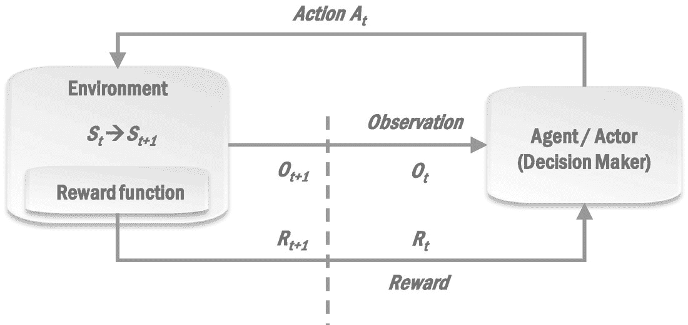

# 十一、顺序决策

“智慧”的一个更高级的表现是自愿做出决定的能力，这些决定有意接受短期损失，以期在长期获得预期结果。“预期结果”可以有多种形式——利润/回报最大化(例如，在投资策略中),实现目标的机会最大化(例如，在国际象棋比赛中获胜),或者拯救危及生命的疾病患者。

它们的共同点是能够做出一系列的决定——买/卖，或采取行动，或推荐测试/治疗。这些决策是在环境中动态做出的，而环境本身也在不断变化，并受决策的影响。

强化学习(RL)是 ML 的一个分支，处理自动化连续决策的这一方面，以最大化长期回报，通常以短期损失的*看似*的代价。虽然*顺序决策*是一类问题，但 RL 目前是事实上的框架，在这个框架内，这些类型的问题被公式化和解决。在本章的剩余部分，我们将会讨论强化学习。

RL 背后的直觉非常类似于儿童如何根据他们从父母那里获得的奖励或惩罚来学习良好行为——父母的赞赏*加强了*对良好行为的坚持，而父母的惩罚*加强了*对不良行为的避免。

RL 最近通过在国际象棋和围棋等游戏中创建最强的人工智能引擎，扩展了人工智能的视野 [1](#Fn1) 。让我们考虑一下国际象棋的例子:早在 2017 年基于 RL 的 AlphaZero 国际象棋引擎出现之前，我们在 2000 年代就拥有强大的国际象棋引擎，这些引擎已经被认为比最优秀的人类国际象棋选手更强。这些象棋引擎通常能够牺牲棋子，如果它导致快速胜利，例如，通过快速攻击对手的国王；在象棋术语中，就像在现实生活中一样，这些被称为“战术”决定或牺牲。因此，国际象棋引擎被广泛认为是战术怪物，尽管如此，它们仍然很难找到或欣赏人类大师为了长期收益而做出的某些“战略”牺牲——直到 2017 年底，AlphaZero 出现。AlphaZero 似乎不仅欣赏并认可了人类大师会做出的许多战略牺牲，还通过做出让许多人类大师也感到惊讶的更加微妙和大胆的战略牺牲，扩大了创造性的视野。

然而，在体育/游戏竞赛之外的现实生活中，例如在投资或医疗保健领域，这种连续决策本质上是高风险的活动；我们仍然宁愿相信投资银行家或医生的资质，而不是复杂的算法来为我们做决定。因此，RL 是一个活跃的研究领域，特别是关注降低风险的机制。在这一点上，我们认为 RL 远不能取代公司的决策者，因此，在本书中，我们将只提供 RL 基本概念的简要介绍，足以让您确定是否有 RL 可能非常适合的用例。关于 RL 更详细的内容，我们将参考“*进一步阅读”*一节中的参考资料。

## RL 设置

作为本章的一个说明性例子，让我们考虑一位诊断专家 House 博士，他的唯一目标是通过在病人屈服于疾病之前及时诊断和治疗病人的神秘疾病来挽救病人的生命。不幸的是，这种一边倒的专注导致他在必要时违反法律、伦理或职业规则和惯例，如果这能让他提高挽救病人生命的机会的话。这通常会导致激烈的措施，如让患者暂时承受极度的疼痛和痛苦，或违反医院政策/法律术语，如果它比没有足够时间的传统测试更快地诊断患者的可能性略有提高。

豪斯处理的每一个病例都是从一个表现出有趣症状的病人开始的。在 House 作出几个*连续决定*之后，每个决定都建议进行进一步的测试以获得新的观察结果，当患者症状的根本原因被及时确定或当患者死亡时，病例就结束了。豪斯是专家，后一种结果很少见。

让我们看看一个人工智能引擎，内斯特博士， [2](#Fn2) 如何被训练成像豪斯一样进行诊断。虽然我们希望内斯特学习豪斯的诊断技能，但我们也希望用一些对非法行为的厌恶来缓和它。在研究如何训练内斯特来实现这一点的过程中，我们将涵盖 RL 的基本变化和一些挑战。

### 基本知识和规则

首先，内斯特被告知所有基本的医学知识，如已知的疾病、症状和可以采取的行动，如推荐药物和测试。然后，我们准备训练代理在使用这些知识的环境中做出适当的决策。

### 训练内斯特

根据数据和域的种类，可以用几种不同的方式训练代理。在我们当前的例子中，我们将把培训分成多个阶段。请注意，根据所解决问题的具体情况，所使用的相位种类可能有很多变化——我们所涉及的相位都是针对 Nestor 的示例。

在这一节中，我们将首先理解 Nestor 在试图解决一个案件时是如何与其环境相互作用的；这种与环境的互动在接下来的所有训练阶段都很常见。

#### 插曲

我们根据图 [11-1](#Fig1) 提供了一个什么是一集的直观概念，图中显示了每一集*中发生的事情*——这形成了 RL 的基本框架。

图 11-1

RL 中的一集

在我们的示例中，每一集对应于一个患者的病例:

*   代理(Nestor)从其环境状态 *S* *0* 接收到一个初始观察值 *O* *0* 。观察可以是一组症状、病史等。病人的。

*   在获得观察结果 O t *，*后，代理人(内斯特)采取行动*A**t*——这可能是推荐将获得进一步信息的测试或药物。

*   基于所采取的行动，环境(患者的状态)发生变化；新的症状被发现导致下一次观察 *O* *t+1* 。并给予代理人(Nestor)奖励 *R* *t+1* 。我们稍后会看到奖励的例子。

如你所见，一集由一系列<action observation="" reward="">组成。一个序列构成一个“情节”有多长取决于正在解决的问题，因为<action observation="" reward="">的序列会持续到环境达到最终状态。在我们的例子中，当患者被诊断/治愈或者患者死亡时，达到最终状态。至此，内斯特获得最后一次观察 [3](#Fn3) 并获得奖励，本集结束。</action></action>

一集如何展开，有几个要点需要注意。首先，每个事件(处理单个患者病例)独立于前一个事件。

其次，奖励对于内斯特如何“学习”什么是好的决定/行动至关重要。假设我们指定了一个*奖励函数*,它分配奖励

*   -任何非法临时行动为 0.2，即此类行动受到轻微处罚。

*   0 表示所有其他临时措施，也就是说，由于某项措施导致的环境立即变化(例如，发现的新症状或患者病情的任何变化)被视为无关紧要。

*   如果患者得到诊断/治愈，则+1；如果患者死亡，则-1，即事件的最终结果是最重要的因素。

在每一集的结尾，内斯特根据它为所有行为获得的**总奖励来“学习”。例如，它知道导致总回报为 1 的决策序列优于导致总回报为 0.6 的决策序列，等等。**

 **了解了内斯特如何与环境互动，现在让我们看看训练的阶段。

#### 培训阶段

在这一节中，我们将看看训练内斯特的一种可能方式的各个阶段。

##### 过去的案例

在我们当前的例子中，我们将首先使用 House 在发作期间的过去病例文件，因为我们希望 Nestor 像 House 一样进行诊断。

为了对豪斯的*过去的*案例文件执行先前的框架，设置可以是代理模仿专家(豪斯)的动作，并且环境/观察被更新以反映作为动作的结果在案例中实际发生了什么。给每个动作分配奖励的机制，以及在一集结束时基于总奖励的学习，都和上一节提到的一样。这样，前面解释的基本框架展开了，代理从过去的案例文件和专家对它们的处理中学习。

##### 不断有新病例出现，有模仿的

在根据过去的案例文件进行培训的初始阶段之后，我们可以允许代理也使用正在进行的案例进行培训。在这里，代理可以模仿专家 House 的动作，并得到结果状态/观察和奖励。基于情节的结果和累积的总奖励，代理学习模仿专家。

##### 监督*勘探*

现在，我们允许代理独立做出决定，而不是模仿专家。在这种情况下，我们将继续监督代理人，也就是说，代理人建议的行动不会在现实世界中执行，除非得到监督诊断专家的批准。可以稍微修改该框架，使得如果建议了完全无意义的 [4](#Fn4) 动作，代理立即得到严厉的斥责(例如，奖励-1)并且该情节(对于代理)被终止。此外，如果对于某个特定的情节，代理推荐的行为完全没有意义，我们可以让代理模仿该情节的专家(如前一节所述)。除了这些小的修改，框架的其余部分以同样的方式继续，即奖励分配相似，代理在每集结束时学习相似。

一旦内斯特经过训练，并被发现做出合理的决定，它就可以*利用*对新案件做出决定。(我们的 kid AI engine 现在是少年了。)

### 监督*开采*

当被利用时，图 [11-1](#Fig1) 所示的环境-代理交互和上一节中的管理设置仍然适用，但有一个重要的区别。在早期的监督探索阶段，内斯特试图尽可能多地了解哪些决策更好——因此它经常可以做出新的随机决策，看看它得到了什么回报。在开发阶段，内斯特只会做出它认为会给整集带来最大回报的决定。代理现在可以被认为是通过建议专家仔细评估的新方法来帮助专家——内斯特现在实际上是专家医生“团队”的一部分。

已经看到了训练和使用代理的例子，现在让我们看一些变化，特别是关于用于训练的数据。

## RL 设置中的数据

我们将讨论一些变化，特别是关于如何获得数据以及相应地如何训练一个代理。还有几个与如何指定奖励、采取行动或如何模拟环境相关的变化，这些可以在参考资料中找到。

正如我们一再看到的，数据科学始于数据。在前面的例子中，我们需要关于真实病例、诊断过程中采取的措施以及结果的数据。我们从过去的案件档案和正在进行的案件中获得。

根据具体的用例/领域，您可能需要由人类活动生成的真实数据，或者模拟数据可能是合适的。在某些情况下，我们也可以将这两种方法结合起来。我们将简要地看一下这些变化。

### 专家决策数据

在许多情况下，会使用包括专家决策在内的现有数据。在前一节训练内斯特的前两个阶段，我们使用了豪斯过去和现在的案例文件。这是一个使用专家决策数据训练 RL 代理的例子。

以类似的方式，AlphaGo 的初始版本是在过去由专家进行的围棋比赛中训练的。如果我们有过去的数据，不使用它的唯一原因是我们希望代理完全不受任何人为偏见/限制的影响。

### 模拟数据

除了从人类的游戏中学习，AlphaGo 的初始版本还从自对弈模拟的数据中学习，即与自己对弈。这个版本的 AlphaGo 强大到足以击败围棋世界冠军李·塞多尔(Lee Sedol)。

AlphaGo 的下一个版本——名为 alpha go Zero——完全由*自玩*训练，即引擎在不使用任何人类数据的情况下，从随机玩法开始与自己对弈。这样，引擎就不会被人类对游戏的理解所限制。AlphaGo Zero 以 100 局比 0 战胜 AlphaGo。

在这些成功的激励下，最新的 AlphaZero 系统被创建，该系统将 AlphaGo Zero 方法归纳为一个学习国际象棋、围棋和日本象棋等游戏的单一算法。详见 Silver 等人(2018 年)。我们在本章开始时提到的就是这个版本。

同样，在自动驾驶汽车等领域的模拟中， [6](#Fn6) 智能体可以尝试汽车的任意随机轨迹，这些轨迹可能会导致撞车，直到它学会正确驾驶。这是开发人员学习 RL 最受欢迎的环境之一。

## RL 面临的挑战

在介绍了 RL 的一些基本概念之后，在本节中，我们来看看 RL 中一些常见的实际挑战。

### 数据的可用性

强化学习需要一批**的数据。对于像国际象棋和围棋这样的游戏，除了特级大师游戏的历史档案之外，模拟还可以用来生成任意数量的数据，这也是这些游戏成为第一批“解决”领域的原因之一。对于使用模拟的风险非常高并且因此依赖于专家模仿和/或监督的实际应用，足够数据的可用性是主要挑战。**

 **### 观察中的信息

即使我们设法获得大量数据，现实情况中的另一个挑战是确保每个观察都有足够的信息。如图 [11-1](#Fig1) 所示，一个*观测*只是*环境*的整体*状态*的一个子集。换句话说，观察可能无法从环境中获取足够的信息。通常，人类“观察”的数据不能以自动方式获得，例如，对于自动诊断/治疗，专家医生在评估患者时看到的许多方面可能不能作为患者记录中的“读数”被捕获。在某些情况下，人类也往往有一种直觉，引导他们收集更多的信息(即扩大观察的范围)。例如，众所周知，豪斯会闯入病人家中获取更多信息，或将勇敢或利他主义等明显的人格特征视为症状。何时扩大所需观察范围的概念是决策的关键之一，也是自动化的一个挑战。

### 探索与开发

最后，最基本的挑战之一是勘探与开发的权衡。对于一个继续“学习”的人工智能引擎来说，它需要偶尔做出稍微随机的决定来*看看*会发生什么——也许一个新的随机决定可能比它之前的“学习”更好我们把代理人学习的这些尝试称为探索；另一方面，当一个代理人做出旨在实现最优结果的决策时，我们称之为剥削。

在我们的示例中，我们已经查看了*监督的*勘探和开采——一般来说，勘探和开采都可以是监督的或无监督的。终极愿景是一个无监督的代理，它可以自行决定何时可以进行勘探，何时可以继续开发。

越来越多的人开始研究探索与开发之间的权衡——一种常见的直观方法是指数级增加开发的频率(并降低探索的频率)。像这样的机制，加上适当调整的指数衰减，很可能在不久的将来成为 RL 在实际用例中采用的方式。

## RL 的数据科学流程

如前所述，根据问题的具体情况，培训 RL 代理的阶段可以有很大的不同；然而，我们通常可以尝试将 RL 代理生命周期中的各个步骤映射到我们的数据科学过程的各个步骤。

在“RL 设置”一节介绍的示例中

*   收集 House 过去的案例文件的数据并将其提供给代理可以被视为数据捕获。同样，当正在进行的案例和专家的行动被用于训练代理时，收集这些数据也可以被视为数据捕获。

*   将数据从医疗记录和设备读数格式转换为代理可以理解的状态/观察格式可能需要的各种转换，这可以被视为数据准备。

*   在训练(探索)期间监视代理如何进展可以被视为数据可视化迭代。

*   基于过去或正在进行的案例的训练阶段可以被视为机器学习迭代。

*   (监督的)开发阶段可以被视为推理。

在完全无监督的智能体的极端愿景中，环境-智能体交互的所有方面，以及智能体如何从奖励中学习的细节，都是作为端到端自动化软件系统的一部分来实现的，也就是说，我们可以认为数据科学过程的所有步骤都是完全自动化的。这在很大程度上已经在国际象棋和围棋等游戏中实现，但在其他现实世界领域，这是最复杂、最具挑战性和最雄心勃勃的愿景之一——不仅是数据科学，也是一般的人工智能。

## 结论

在这一章中，我们只涉及了现代深度强化学习的一些基础知识，并涵盖了强化学习的基本设置。关于确定奖励的方式，如何根据观察结果采取行动等等，有许多不同的说法。我们将在下一节指出一些相关的文献。

读者可能已经意识到，我们示例中的豪斯医生是根据同名电视连续剧改编的。这一章中半虚构的叙述表明了一个概念，即经典科幻小说(有点让人想起阿西莫夫的几部作品)正日益成为现实，特别是当机器可以像人类一样做出看似“直觉”的决定时。

我们的观点是，除了游戏系统之外，我们还远远没有让人工智能代理人在这个领域里为最大化整体回报而做出连续的决策。最初的采用可能会沿着增加人类专家的路线，以改进基于代理建议的新的、替代的决策路径的决策。这方面的研究越来越多，甚至在医疗保健等领域。

## 进一步阅读

关于 RL 的详细介绍，包括直观和一些数学细节，请参考萨顿和巴尔托(2018)。

有关 AlphaZero 的里程碑式出版物，请参考 Silver 等人(2018 年)及其补充材料。

Amazon DeepRacer 是最受欢迎的网络服务之一，它开始以动手的方式学习 RL 原则。

对于医疗保健中强化学习的一般调查，没有比医疗保健更真实的了！——参考于、刘、内马蒂(2020)。它对 RL 领域的现有术语和变体提供了一个很好的总体概述，随后是医疗保健中的应用，包括诊断和动态治疗方案，以及重大挑战。在动态治疗推荐领域的真实世界应用的例子是王等人(2018)。

## 参考

一种通用的强化学习算法，精通国际象棋、日本象棋和自我游戏。*科学 362*2018 年 12 月 7 日:1140–1144。

理查德·萨顿和安德鲁·巴尔托。*强化学习-导论，第二版*。马萨诸塞州剑桥:麻省理工学院出版社，2018 年。

王，陆，等，“基于递归神经网络的监督强化学习在动态治疗方案推荐中的应用”美国计算机学会会议记录(17 年会议)。美国纽约州纽约市:ACM，2018 年。

余、晁、和沙米姆·内玛蒂。*医疗保健中的强化学习:一项调查。* [`https://arxiv.org/abs/1908.08796`](https://arxiv.org/abs/1908.08796) 。2020.

<aside aria-label="Footnotes" class="FootnoteSection" epub:type="footnotes">Footnotes [1](#Fn1_source)

RL 由来已久，理论起源于 20 世纪 50 年代末。但是 RL 结合深度学习(deep RL)导致了最近 2017 年以来 RL 的流行。在本书中，我们简单地使用术语 RL 来指代整个领域。

  [2](#Fn2_source)

这个名字是向阿西莫夫的*小失落机器人*中的机器人 Nestor-10 致敬，它没有被喂食防止伤害人类的约束。

  [3](#Fn3_source)

最终观察结果是患者得到诊断/治愈或死亡。

  [4](#Fn4_source)

无意义的，即不正确、不适当或不可能执行的。

  [5](#Fn5_source)

它通过与人类玩家进行数千次比赛来进一步“学习”。

  [6](#Fn6_source)

例如，参见亚马逊 DeepRacer。

 </aside>****