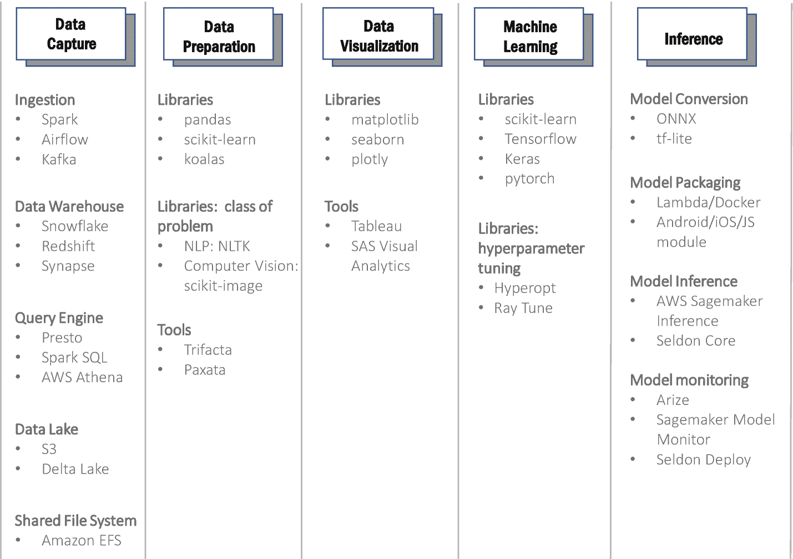
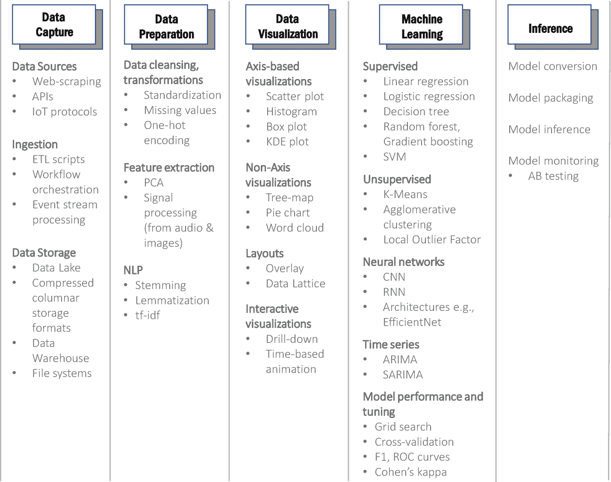
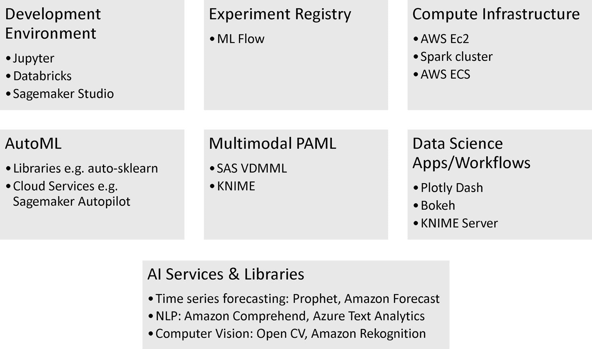

# 十二、技巧和技术：概述

在这一章中，我们提供了用于数据科学的各种技巧和技术的高度概述。该简要概述旨在为第[13](13.html)–[19](19.html)章中涉及的细节建立框架。

图 [12-1](#Fig1) 和图 [12-2](#Fig2) 分别展示了在数据科学过程的每个步骤中使用的一些技巧和技术。

图 12-2

数据科学过程中每一步用到的一些技术 [1](#Fn1)

图 12-1

数据科学过程的每个步骤中使用的一些技术

我们将从第 [13](13.html) 章到第 [17](17.html) 章更详细地介绍其中的一些技巧和技术，数据科学过程的每一步都有一章。在这样做的同时，我们还将在相应的章节中介绍每个步骤的数据工程方面。

有几种工具和服务跨越了数据科学过程的多个步骤。其中一些如图 [12-3](#Fig3) 所示，在第 [18](18.html) 章中有更详细的介绍。

图 12-3

一些跨越数据科学流程多个步骤的工具和服务

因此，在第 [18](18.html) 章结束时，我们将已经涵盖了用于数据科学的各种技术。然后在第 [19](19.html) 章中，我们将了解这些技术如何在*参考架构*中融合在一起，以支持数据科学团队的运营。

请注意，本章中的三幅图旨在捕捉撰写本文时数据科学领域中一些关键的代表性术语和概念。我们发现它们作为对整个领域进行分类的框架也是有用的，也就是说，每当遇到新的技术或工艺时，我们发现将它们放在这些图之一的适当类别中是有用的。这有助于获取技术/工艺的主要能力，并使与其他团队成员和利益相关者的交流成为可能。将一项技术或工艺归入适当的类别也有助于确定、比较和评估备选方案。

<aside aria-label="Footnotes" class="FootnoteSection" epub:type="footnotes">Footnotes [1](#Fn1_source)

一个步骤中描述的一些技术可能在其他步骤中也有用。我们将它们包含在我们认为最有用的步骤中。

 </aside>