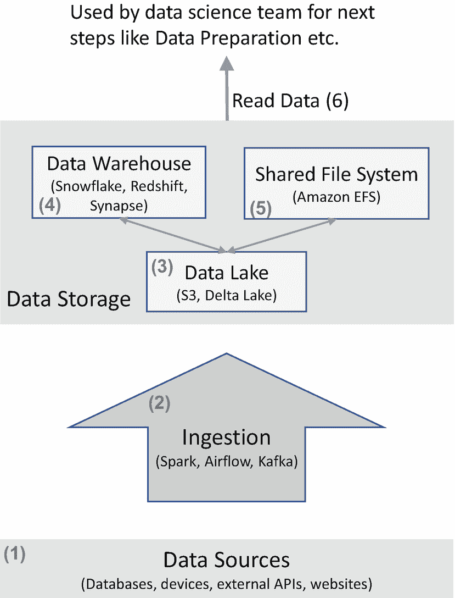

# 十三、数据捕捉

在本章中，我们将介绍数据科学过程的数据采集步骤中使用的典型技巧和技术。

对于数据捕获，第一个活动是识别哪些数据是相关的，哪些是相关数据的来源。一旦确定了这些，数据采集步骤中的进一步活动以及相关组件如图 [13-1](#Fig1) 所示。

图 13-1

数据捕获中的活动和组件

如图所示，我们将数据捕获中涉及的组件大致分为三组:*数据源、摄取、*和*数据存储*。需要注意的是，您要解决的特定数据科学问题可能只需要一个数据源，而相关数据可能已经存在，比如说，CSV、excel 文件或数据库。 [1](#Fn1) 在这种情况下，数据科学家可以直接使用这些数据。但更常见的是，在一个成熟的组织中，会有多个与您计划解决的数据科学问题相关的数据源，前面的图表描述了这个更广泛的场景。

在本章的前几节中，我们将涵盖图 [13-1](#Fig1) ，从底部开始，按照方框/箭头中指示的数字顺序向上移动。在这样做的同时，我们将讨论每个领域中涉及的技巧和技术。然后，我们将讨论在选择开源和付费数据捕获工具时需要考虑的几个因素。最后，我们将提到数据捕获中涉及的数据工程方面。

## 数据来源(1)

在一个组织中，数据通常分布在多个来源中。如果您的组织有多个生成数据的应用程序或工具，那么这些内部系统通常会将数据存储到**数据库**中。如果您的组织从**设备**收集数据，例如从物联网系统收集数据，这些也是数据的来源。这些通常是数据科学的主要数据源，并且是您的企业所独有的。

在某些情况下，您可以从**外部 API**获取数据。外部 API 的例子有

*   公开 API 的社交媒体网站，如 Twitter。

*   Web 服务提供一些关于常见环境因素的信息，如天气、地理位置等。

*   您部署的公开 API 的第三方工具，例如，如果您在自己的场所安装了本地气象站，它可以公开用于查询数据的 API。

在极少数情况下，您可能希望直接从**网站**中提取一些信息。这被称为网页抓取，需要对源网页的布局有所了解。这不是一个推荐的方法，因为每当网站的结构改变时，你就需要修改你提取信息的方式——因此，维护和可靠性往往是这种方法的一个问题。但是这种方法在极少数情况下会被采用——例如，如果您正在基于来自多个网站的公开信息构建一个信息系统，而这些网站没有公开 API。

理论上，数据科学家可以查询这些不同的来源，以获得他们分析所需的数据。但更有效的方法是将这些数据整理到一个单一的集中式沙盒中，即*数据存储*，数据科学团队可以从中执行分析。这需要*从这些多个数据源获取*数据，我们接下来将会看到这一点。

## 摄入(2)

各种 ETL [2](#Fn2) 和工作流库/工具可用于将来自多个数据源的数据合并、转换和摄取到中央数据存储中——我们将此统称为**摄取**。火花、气流和卡夫卡是常用的工具，通常一起使用，代表三种常见的工具类别:

*   ETL 脚本:Spark 是合并多个数据源、清理和转换数据所需的大数据 ETL 脚本和批处理作业的代表。

*   工作流编排:Airflow 是编排跨多个脚本/作业的复杂工作流的工具代表。

*   事件流处理:Kafka 是*事件流处理*的代表。当实时数据从数据源到达 Kafka 时，监听器被触发，进而触发 ETL 脚本或工作流。

如果您的公司有传统的企业数据集成工具，如 Informatica，它们也可以适当地用于这些目的。

摄取的目标是在集中式数据存储中以合理组织的形式提供数据。

## 数据存储

数据存储包含所有获取的数据，供数据科学团队的其他成员用于数据科学流程中的其他步骤，从数据准备开始。

数据存储可以由以下一个或多个组成:数据湖(3)、数据仓库(4)和共享文件系统(5)。我们将在接下来的小节中逐一介绍。

### 数据湖(3)

数据湖通常是收集所有数据资产的地方。除了从数据源获取的数据之外，数据还经常从数据湖移动到其他形式的存储，下面的小节将介绍这些数据。

低存储成本是数据湖的主要特征之一。在过去几年中，亚马逊 S3(或其在 Azure 和其他云提供商上的同类产品)一直是数据湖的首选技术。 [3](#Fn3)

数据湖可用于存储图像、视频、音频等数据。它还可以用来存储 CSV、JSON、Parquet 或 ORC 等格式的表格数据。

对于表格数据，数据湖传统上有一些限制:

1.  数据湖不支持单个记录的有效更新。这经常导致数据处理流水线中的问题 [4](#Fn4) 。

2.  SQL 是查询复杂分析的表格数据和更新记录的常用机制。但是数据湖本身并不支持 SQL。

Delta Lake 等最新技术支持数据湖之上的 SQL 层，这也允许高效地更新记录。这大大简化了数据处理流水线。

因为 Delta Lake 是建立在数据湖技术之上的，所以我们也将其归类为数据湖。

### 数据仓库(4)

数据仓库的主要目的是使用 SQL 快速执行复杂的分析查询。这使得数据科学家和数据分析师能够使用可视化工具/库或 SQL 来执行快速的探索性数据分析。虽然数据仓库自 20 世纪 80 年代就已经出现，但过去十年中最重要的发展是存储半结构化和非结构化数据的能力，如 JSON，以及传统的表格形式。

通常，在开始一系列新的实验时，数据科学家/工程师会将相关数据从数据湖加载到数据仓库中进行分析。

高级 BI 工具通常用于数据可视化步骤(参见第 [15](15.html) 章)。这些 BI 工具通常需要一个数据仓库来同时高效地执行多个 SQL 查询。

现代云数据仓库还支持使用 SQL 查询存储在数据湖中的表格数据。例如，如果您在亚马逊 S3 有以 Parquet 格式存储的表格数据，可以从亚马逊红移中查询。 [5](#Fn5)

数据仓库还支持使用 SQL 高效更新单个记录。与存储在数据湖中的表格数据相比，这是数据仓库的额外好处之一。

雪花、亚马逊红移和 Azure Synapse 都是现代数据仓库的例子。

ADVANCED NOTE: DECOUPLED COMPUTE AND STORAGE

大约在 2015 年，云数据仓库开始被设计为提供分离的存储和计算，以根据数据科学团队的需求实现扩展。例如，数据科学家或数据工程师可以快速启动适当规模的计算集群来执行分析，并在不需要时将其关闭。另一方面，在传统数据仓库的情况下，由于存储和计算在同一个集群上，您通常必须始终保持集群运行。

我们提到的所有三个数据仓库示例都支持解耦存储和计算扩展。

TERMINOLOGY CHAOS: LAKEHOUSE

最近备受关注的一个术语是 *lakehouse* 。lakehouse 的愿景是将数据湖(低成本)和数据仓库(高性能 SQL，具有更新记录的能力)这两个世界的精华与解耦的存储和计算结合起来。

我们认为“lakehouse”这个术语有助于描述愿景，而不是对工具进行分类。例如，我们归类为数据湖的三角洲湖也可以被描述为湖屋。我们引用的现代云数据仓库都具有使它们也能够被描述为湖边小屋的功能。

在任何情况下，我们都建议您为您的团队和组织选择正确的技术，即数据湖和/或数据仓库——*,而不要被*湖屋*的概念分散注意力。*

### 共享文件系统(5)

如果您的团队正在处理图像、视频、音频等。，以及需要 GPU 的深度学习框架，那么可以考虑使用共享文件系统，如亚马逊 EFS，以便从多台机器或集群中高效访问机器学习的数据。

由于数据准备步骤中会发生各种转换，因此数据准备的输出——如转换后的图像等。–也可以写回 EFS。这使得您团队中的数据科学家和数据工程师能够无缝协作，例如，如果一名数据科学家开发了一种新的数据准备机制，则转换后的数据可以存储在 EFS，其他团队成员可以立即使用这些数据进行进一步分析。

## 读取数据(6)

数据存储中的数据由数据科学团队访问，以进行数据科学流程的后续步骤，从数据准备等开始。在这一节中，我们将介绍数据通常是如何被访问的。

如果您只使用数据仓库，那么您的团队将使用 SQL 来读取数据进行分析。

如果您使用数据湖，那么存储的数据通常由数据科学团队使用编程 API 或 SQL 读取。在本节的剩余部分，我们将讨论从数据湖中读取数据的这两种变化。

### 程序化访问

以 CSV、JSON 或 Parquet 等格式存储在数据湖中的表格数据可以使用 Python、R、Scala 等语言中的编程 API 来读取。例子包括

*   Python 库*Pandas*

*   Scala 中的 Spark 库或 Python 中的 PySpark

除了表格数据，其他类型的数据，如图像等。可以使用数据湖提供的编程 API 来访问。例如，AWS 提供 Python 等编程语言的库来访问存储在 S3 的数据。

### SQL 查询引擎

说到大数据，组织在没有数据仓库的情况下将表格数据存储在数据湖(例如，在 AWS S3)中是很常见的。为了支持使用 SQL 查询数据湖中的表格数据，一种常见的方法是使用 SQL 查询引擎。

Presto、Spark SQL 和 AWS Athena 都是 SQL 查询引擎的例子。这些通常用于分析师、数据工程师或数据科学家的即席查询。

## 开源与付费

对于摄取，我们提到的库和框架都是开源的。有一些付费服务使管理和扩展基础设施变得更容易，例如，AWS 为 Spark、Airflow 和 Kafka 提供托管服务。 [6](#Fn6)

对于数据湖和数据仓库，云上的付费工具和服务目前通常是首选，因为它们提供了灵活的定价模型和弹性伸缩。 [7](#Fn7) 它们通常比部署一个开源仓库(比如 PostgreSQL)并在自己的基础设施中进行管理更具成本效益。

## 数据工程

在数据捕获步骤中，领域专家或首席数据科学家通常会决定要捕获哪些数据以及合适的数据源。

本章中提到的进一步活动——将数据接收到数据存储中并实现对数据的有效访问——主要属于数据工程的范畴。本章提到的各种工具通常也是数据工程所拥有的。

## 结论

在本章中，我们介绍了数据科学流程的数据捕获步骤中涉及的各种组件和活动，包括使用的一些技术。我们还谈到了选择开源还是付费工具的一些方面。

<aside aria-label="Footnotes" class="FootnoteSection" epub:type="footnotes">Footnotes [1](#Fn1_source)

在某些情况下，数据也可能是由工作人员在 excel 文件中手工输入而收集的。

  [2](#Fn2_source)

提取、转换和加载:指*从一个或多个源提取*数据，*转换*数据，最后*将其加载*到目标系统。

  [3](#Fn3_source)

在 S3 之前，HDFS (Hadoop 分布式文件系统)是一个流行的选择。

  [4](#Fn4_source)

当工程师不得不自己处理行级更新而不支持原子性时，等等。从存储技术来说，它经常导致与数据不一致、重复等相关的问题。

  [5](#Fn5_source)

利用红移光谱。

  [6](#Fn6_source)

AWS 也提供自己的付费服务，比如 AWS Kinesis 就是 Kafka 的替代品。

  [7](#Fn7_source)

弹性扩展是指自动或轻松扩展基础架构以满足需求的能力。

 </aside>