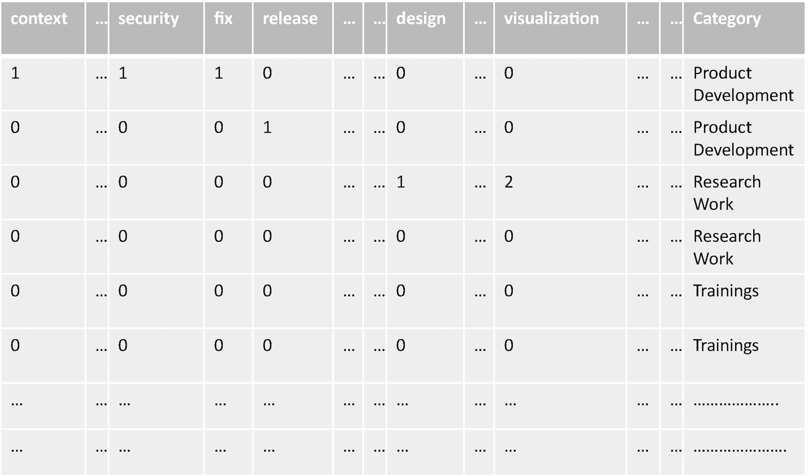
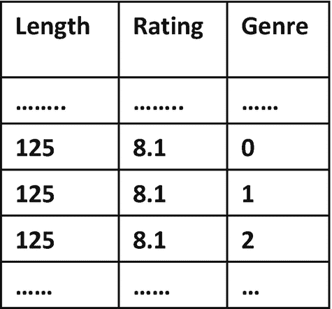
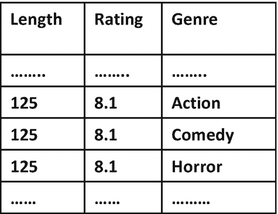
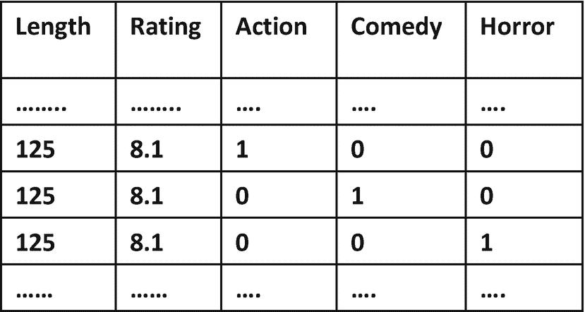

# 十四、数据准备

本章专门介绍数据科学流程的*数据准备*步骤。为了更好地理解*捕获的*数据，通常会对其进行研究。这些数据在用于建立模型之前必须经过大量的准备工作。在其他一些情况下，数据似乎可以直接提供给 ML 算法，但是以各种方式准备数据可能会产生更有效的模型。我们在第 [1](01.html) 章讨论的一个例子中看到了这样的情况，其中捕获的数据包含商店收银台交易的时间戳和销售额。在这种情况下，我们认为销售额可能会根据星期几、月份等有一些趋势。因此，我们转换了数据，使其包含小时、日、月等。，以及相应的总销售额，希望这将使 ML 算法能够找到这样的趋势。因此，以这种方式准备数据可能会产生更好的模型。

在这一章中，我们将重温一些我们在第 2 部分与问题类别相关的章节中执行的数据准备任务。在那些章节中，我们使用了一些技术来完成这些任务；现在，我们将讨论一些可用于这些任务的其他技术。这种想法是要理解每项数据准备任务都有许多可用的技术，对这些技术的良好理解可以帮助您决定哪种技术最适合您的问题。

## 处理缺失值

我们在前面章节中讨论过的一项任务，也是您很可能在数据准备步骤中完成的任务，就是处理数据中的缺失值。有几种方法可以做到这一点，比如简单地删除有任何缺失值的观测值，或者以智能方式填充缺失值。假设您的数据有每日销售额，但是有些天的销售额是未知的，因此数据中缺少。如果您选择简单地用 0 来填充这些缺失的金额，将会导致 ML 算法错误地认为这些天没有销售，从而可能扰乱数据中出现的任何销售趋势。例如，如果周日数据中的销售额总是很高，用 0 填充特定周日的缺失销售额将扰乱周日的高销售额趋势。因此，您可以用所有其他周日的平均销售额来填充这个周日缺少的销售额，因为您认为这个周日的销售额可能与其他周日的销售额相似。这样做将用一个高值(其他星期日的平均值)来填充这个星期日缺少的销售额，从而使销售趋势保持不变。你甚至可以建立机器学习模型来预测丢失的值。

## 特征缩放

我们之前讨论过的另一项任务，也是您可能会在数据准备步骤中执行的任务，是转换您的要素，使其具有相同的比例。 [2](#Fn2) 为此，您可以执行*最小-最大缩放*，转换特征值，使其范围从 0 到 1——最小的特征值转换为 0，最大的特征值转换为 1。实现这一点的另一种常见方法是一种叫做*标准化*的技术。这种方法通过减去平均值并将差值除以标准偏差来转换每个特征值。您可以看到，这种方法没有将转换后的值限制在特定的范围内。

## 文本预处理

让我们回顾一下第 6 章[中 NLP 问题的文本预处理任务，其目标是建立一个模型，可以根据电子邮件中的文本推断/预测电子邮件的类别。为了实现这一目标，个人助理从数据中的每个电子邮件正文中剥离问候语和结束语，并通过删除标点符号、将其转换为小写、提取单个单词以及删除它认为对推断电子邮件的类别无用的停用词来预处理剩余的电子邮件正文。下一步，该助手对所有电子邮件中的单词使用了一种称为*词汇化*的技术，将单词的屈折形式转换为其基本形式，因为它认为屈折形式可能不会提供关于电子邮件类别的任何额外线索。词汇化也减少了助手必须处理的词汇。然后，助手使用*单词袋*技术从所有电子邮件的基本单词列表中提取特征。](06.html)

在本节中，我们将讨论另一种技术，您可以使用它将单词简化为它们的基本形式，这就是所谓的*词干*。我们还将看到一种称为 TF-IDF 的不同技术，它可以用于从基本单词列表中提取特征。

### 堵塞物

词汇化对每个单词进行复杂的分析，考虑其词性，并相应地将单词映射到其正确的基本形式。另一方面，词干处理采用了一种更为粗糙的方法，即应用简单地切掉部分单词以获得其基本形式的规则。例如，如果对单词"*work*执行词干化 [3](#Fn3) ，后缀" *ing"* 将被砍掉，您将获得" *work"* 作为基本单词。词干提取所采用的这种粗糙的方法显然比进行详细分析的词汇化更快。

然而，词干有时会给你一个不是有效单词的结果。例如，对单词“ *dries* ”执行词干处理可以简单地删除后缀“ *es* ”，并返回“*dri”*作为不是有效单词的基本单词。再来看另一个词，“*差*”如果你把这个词“*更坏”*连同它的词性*“形容词”*一起进行词条化操作，它就能通过对它的详细分析，算出基本词是*“坏的*”另一方面，词干提取所采用的切掉部分单词的方法不可能从原始单词“更坏”中产生“坏”的结果总而言之，词干化和词汇化各有优缺点，您需要根据自己的需求决定哪一种适合您。

### TF-以色列国防军

我们使用第 [6](06.html) 章中的*单词袋*技术从所有电子邮件的基本单词列表中提取特征。这种技术确定了词汇表(所有电子邮件中唯一基本单词的总集合)，然后为词汇表中的每个基本单词创建一个特征。然后，它通过计算相应的基本词在电子邮件中出现的次数来计算电子邮件的特征值。图 [14-1](#Fig1) 显示了使用词袋技术从所有电子邮件的基本词列表中提取的部分特征——该图还显示了目标变量*类别。*注意，每个唯一的基本单词都有一个特征。您可以看到第三封电子邮件的特征*可视化*的值是 2，因为基本词*可视化*在该电子邮件的基本词列表中出现了两次。

图 14-1

电子邮件的功能和目标变量

因此，您可以看到，*单词袋*技术使用一种非常基本的方法来计算一个基本单词的出现次数，从而计算一个特性的值。您可以对这种计算特征的方法进行一些改进，从而获得更有效的特征。更有效的特性可以产生更有效的模型，这对数据科学的成功至关重要。让我们来看几个这样的增强。

假设我们的数据中有一封很长的电子邮件，多次包含单词 *visualization* 。*单词袋*技术将简单地统计出现的次数，并给这封邮件的特征*可视化*一个很高的值。与上图中的第三封电子邮件相比，ML 算法会认为该电子邮件的特征*可视化*具有更高的价值。但这可能只是因为这封邮件比第三封邮件长得多。因此，在计算特征值时对电子邮件大小进行调整将是一个好主意。您可以简单地将电子邮件的原始特征值除以该电子邮件的基本单词列表的大小。特征的修改值是基本单词在电子邮件中出现频率的更有效表示。我们将这个修改后的特征值称为*项频率(TF)* 。

然而，这种修改的特征计算过程仍然具有局限性。如果一个基本单词通常是一个非常常见的单词，因此在其他电子邮件中也经常出现，则该单词在电子邮件中的频繁出现可能没有特别的意义。但是我们改进的特征计算过程没有考虑这一方面，所以如果一个基本词在电子邮件中频繁出现，即使它是一个非常常见的词，它也会给出很高的特征值。因此，如果相应的基本单词是非常常见的单词，我们可以通过显著缩小特征值来进一步修改我们的特征值计算过程。为此，我们可以将之前计算的特征值乘以称为*逆文档频率(IDF)* 的值。IDF 等于电子邮件数量除以包含相应基词的电子邮件数量所得商的对数。所以如果一个基本词是在大多数邮件中出现的非常常见的词，那么它的商将接近 1，它的对数将接近 0。换句话说，如果对应的基词极其常见，IDF 接近于 0。因此，由于与 IDF 值相乘，对应于一个非常常见的基本词的特征值得到了相当大的缩减，正如我们所希望的那样。 [4](#Fn4) 这种修改后的计算特征值的方法称为 TF-IDF，最终计算出的特征值称为 *TF-IDF* 值。然后，这些最终特征值可以用于机器学习。

## 将分类变量转换为数值变量

将分类变量转换成数字变量是另一项数据准备任务，我们在前面已经看到过(第 [5](05.html) 章)，也很常见。在第 [5](05.html) 章中，我们想要转换的每个分类变量只有两个可能的值，我们简单地将一个值编码为 *0* ，另一个值编码为 *1* 。例如，您可能记得每个观察的性别变量的值是男性*或女性*或*。为了将这个变量转换成数字变量，我们简单地将*男性*编码为 *1* ，将*女性*编码为 *0* 。但是，根据情况的需要，您可能需要采用其他方法/技术。*

假设您的数据中的观察值对应于患者，其中一个变量表示患者的疲劳程度。对于每个患者，该变量可以取以下五个可能值之一:*非常低、低、中等、高和非常高。*值*低*表示比值*非常低*更高的疲劳水平，值*中等*表示比值*低*更高的疲劳水平，以此类推*。*因此，这些可能的值有一个自然的顺序。其可能值具有自然*顺序*的分类变量称为*顺序*变量。在将这样的变量转换成数值变量时，最好保持这种顺序。例如，由于值*低*比值*非常低表示更高的疲劳水平，*你应该使用比你用来编码*非常低的数字更高的数字来编码*低*，以此类推。因此，您可以简单地将*非常低*编码为 0，*低*编码为 1，*中等*编码为 2，*高*编码为 3，*非常高*编码为 4。因此，对于所有疲劳水平最初为*非常低*的患者，变量的编码值将为 *0* 。类似地，对于疲劳程度为*低*的患者，编码值将为 *1、*等等。*

现在让我们看看另一种分类变量。图 [14-2](#Fig2) 显示了数据的局部视图，其中每个观察值对应一部电影。变量 *Length* 表示电影时长，以分钟为单位，变量*R*T6】ating 表示用户给出的平均评分， *Genre* 表示是什么类型的电影。对于每部电影，分类变量*流派*可以取三个可能值中的一个:*动作片*喜剧片*恐怖片*。这些可能的值只是电影类型的名称，没有自然的顺序。这种分类变量的可能值只是没有自然顺序的*名称*，称为*名义*变量。要将这个变量转换成数字变量，显然可以将*动作*编码为 *0* ，将*喜剧*编码为 *1、*，将*恐怖*编码为 *2* ，如图 [14-3](#Fig3) 所示。但这种方法在某些情况下可能会产生误导。假设您试图根据电影之间的欧几里德距离来识别电影的聚类(我们在第 [7](07.html) 章中讨论了聚类)。如果图 [14-3](#Fig3) 中的编码数据用于聚类并且基于这三个变量计算距离，则表中看到的第三部电影将看起来比第一部电影更接近第二部电影。这是因为第三部电影的长度和分级等于其他两部电影的长度和分级，但是第三部电影的编码类型更接近于第二部电影的编码类型，而不是第一部电影的编码类型。然而，这种解释是不正确的，因为你可以在原始数据中看到(图 [14-2](#Fig2) )，第三部电影的风格与其他两部电影的风格完全不同——它不是更接近其中一部，而是更远离另一部。所以我们将讨论一种不同的技术来将分类变量*类型*转换成数字形式。

图 14-3

具有编码类型的电影数据

图 14-2

电影数据

我们将用三个新变量替换图 [14-2](#Fig2) 中的变量*流派*，这三个新变量对应于*流派*变量的三个可能值。图 [14-4](#Fig4) 显示了这三个新变量的电影数据。你可以看到每个流派都有一个变量。如果一部电影属于某个特定的流派，那么这个流派对应的变量的值为 1，另外两个变量的值为 0。比如这个图中看到的第一部电影属于流派*动作，*所以变量*动作*的值为 1，变量*喜剧*的值为 0，变量*恐怖*的值为 0。这是被称为*一键编码*的流行技术背后的一般思想。因此，我们可以看到数据和所解决问题的性质如何影响我们选择将分类变量转换为数值变量的技术。

图 14-4

具有类型的一键编码的电影数据

## 转换图像

正如我们在本章开始时所讨论的，以各种方式准备数据可以产生更有效的模型。对于计算机视觉问题，在数据准备中执行的一个常见任务是转换原始图像以产生新图像，目的是建立有效的模型。用于转换图像的确切技术取决于您希望转换产生的效果，以便创建更好的模型。我们在第 [10](10.html) 章中讨论了图像变换，我们在有大量背景空白的图像中寻找本地化的模式。因此，我们采用的技术/方法是将图像分割成小块，选择具有最多组织的小块，并重新组合它们以创建具有大组织区域的正方形图像。

在许多其他常见的问题中，比如我们在第 [10 章](10.html)中看到的物体检测，以任何方式通过切片来变换图像都是不合适的。但是，在需要转换图像的情况下，可能还有其他要求。一个这样的要求是，该模型应该对图像方向(例如，旋转)、被识别对象的大小(缩放因子)等的变化有弹性。例如，如果模型需要检测图像中的特定类型的对象，它应该能够这样做，而不管图像中对象的方向等。这种弹性可以通过以多种方式(例如，通过旋转等)变换每个原始图像来实现。)并将变换后的图像与原始图像一起提供给模型用于学习。这项技术因此扩大了我们数据的规模，被称为*图像增强*。它帮助模型学习检测图像中具有任意方向、缩放因子等的模式。

由于这种增强有助于从您的图像中创建更大的数据语料库，因此它对于训练深度学习模型特别有用，如 CNN(见第 [16](16.html) 章)，这些模型需要大量数据。

您的问题的细节通常会决定哪些转换是合适的；以下是一些更常见的扩充/转换:

*   旋转各种角度

*   水平/垂直翻转

*   放大/缩小

*   水平/垂直移动

*   添加一些噪声

## 库和工具

在这一节中，我们来看看可用于数据准备的各种库和工具。

### 图书馆

数据操作和分析库通常包括数据聚集和转换的功能。例如，Pandas 是用 Python 处理数据的一个流行库——它有聚集和转换数据的功能，包括日期/时间转换。

例如，如果您正在 Spark 集群上处理大数据，您可能会使用 *Spark* 库函数进行数据准备。此外，相对较新的*考拉*库提供了一个 Pandas 兼容的 API 来执行 Spark 操作——这使得熟悉 Pandas 的数据科学家能够在没有学习曲线的情况下使用 Spark。

ML 库通常也包含用于公共数据准备技术的函数。 *Scikit-learn* 例如，提供了填充缺失值、标准化、一键编码等功能。

也存在面向特定问题类别的库，例如，*自然语言工具包(NLTK)* 是用于 NLP 的流行库，它也包括词干分析、词汇化等功能。同样，对于计算机视觉，像 *scikit* - *image* 和 *Keras* 这样的库提供 API 来简化图像转换的任务。

### 工具

在过去的几年里，像 Paxata、Trifacta 等工具。，因为它们能够使用直观友好的用户界面进行数据准备，所以受到了欢迎。这种易用性不仅允许数据科学家，还允许分析师和业务利益相关者使用这些工具，从而在数据准备阶段实现他们之间的有效协作。这些工具还可以跟踪沿袭，即在数据准备步骤中执行的所有转换。这简化了再现性和审计。

## 数据工程

支持数据准备的数据工程活动有两大领域:

1.  基础设施和数据源:如果团队在 Spark 集群等上处理大数据。和/或使用任何工具，那么建立和维护必要的基础设施就属于数据工程的范畴。此外，一些工具可能需要配置数据源——这些初始化活动也属于数据工程。

2.  自动化数据准备:如果/当数据科学家对某些数据集的某些数据准备活动进行标准化时，数据工程可以为对应于这些数据集的新数据自动化和维护这些步骤。这有助于提高数据科学家的工作效率，让他们专注于数据科学流程的其他步骤。

## 结论

在这一章中，我们回顾了几个数据准备任务，并看到多种技术可用于每项任务。我们还看到，对这些技术的深入理解对于决定哪种技术最适合我们的问题非常重要。

<aside aria-label="Footnotes" class="FootnoteSection" epub:type="footnotes">Footnotes [1](#Fn1_source)

这可能还包括查看平均值、中值、标准差等统计数据。

  [2](#Fn2_source)

有各种各样的原因让你想这么做(参见第 7 章[和第 8 章](07.html))。

  [3](#Fn3_source)

例如，用波特·斯特梅尔。

  [4](#Fn4_source)

在类似的行中，您可以计算出这个操作对一个罕见的基本单词会有什么影响。

  [5](#Fn5_source)

为了讨论的简单，我们避免了特征缩放。

 </aside>