# 十五、数据可视化

我们在上一章中讨论了数据准备；现在，让我们更深入地研究一下*数据可视化*的技巧和技术，这是我们数据科学流程*的下一步。*

在讨论不同类别的问题时，我们强调了用具体例子设计有效可视化的重要性和好处。我们还提到了数据可视化本身是一个庞大的主题，涵盖了许多不同类型的图表、图例、布局等。其中的每一个都为用户提供了各种简单和高级的选项，以实现更好的控制。此外，还有一些机制可以将交互式特性添加到您的可视化中，或者合并现有的可视化来创建您自己的自定义可视化。我们将着眼于其中的一些一般方面，然后更深入地研究一些可视化技术，以及它们如何提供在数据科学中构建有效模型所需的洞察力。我们将通过讨论数据可视化类别中一些流行的库和工具来结束本章。

## 图表/曲线图

虽然有些人会不严格地、可互换地使用这些术语，但其他一些人可能会给出一些启发性的论述，说明它们都意味着不同的东西。在不深入讨论的情况下，我们想强调的是，这些是你可以用来设计可视化的基本构件。你可能已经使用过或遇到过其中的一些，如条形图、散点图、饼图等。，但我们认为这是一项有益的投资，可以超越这些，扩大你对其他高效工具的认识。

其中许多像条形图、散点图等。使用水平轴和垂直轴，并显示代表数据的可视元素。使用数据中的值导出每个可视元素沿每个轴的位置或大小。假设您有生活在某个地区的学生的人口统计数据。散点图可以将数据集中的每个学生显示为一个圆形标记，其水平轴上的位置基于学生的身高，垂直轴上的位置基于学生的体重。

还有其他不使用轴的图表，如饼图、树形图等。树形图将层次结构中的类别显示为嵌套的矩形块，矩形块的面积表示类别的某些属性。例如，图 [15-1](#Fig1) 显示了不同制造商的不同型号手机在商店的销售情况。 [1](#Fn1) 您可以看到每个制造商都有一个图块，其面积代表该制造商的总销售额。并且来自该制造商的不同型号的区块被嵌套在该制造商的区块内，使得每个嵌套区块的面积代表其相应型号的销售。例如，有一个大的红色瓷砖，其面积代表制造商小米的总销售额，它包含小米三种型号的三个嵌套的红色瓷砖。每个嵌套的红色瓷砖的面积代表小米相应型号的销售。

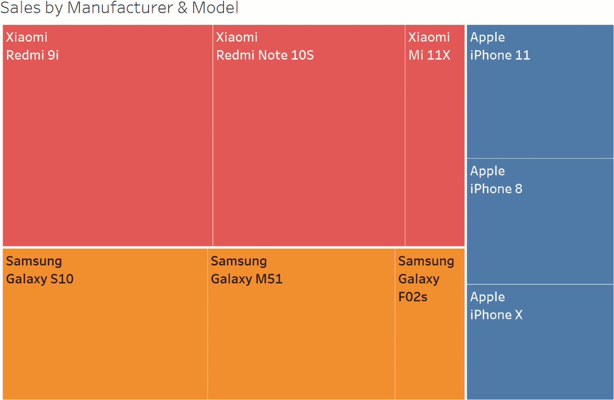

图 15-1

手机销售树形图

基本构建模块中的另一个类别是节点链接图。这些工具利用节点和链接来显示实体及其连接，对于可视化网络数据非常有用。

## 传说

通过利用颜色、大小等可视化属性，您可以在现有图表中可视化更多变量。我们之前讨论了一个散点图，它将每个学生显示为一个标记，其 x 坐标和 y 坐标分别基于身高和体重。您还可以将*性别*(包含离散类别*男性*和*女性)*添加到该可视化中，用蓝色显示男生的标记，用绿色显示女生的标记。一个离散的图例将被添加到图中，显示每种颜色所代表的含义。图 [15-2](#Fig2) 显示了散点图和离散图例，使性别、身高和体重可视化。

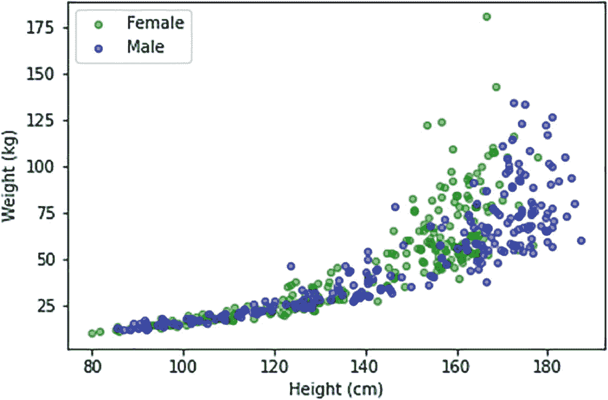

图 15-2

体重与身高的散点图。性别由标记的颜色描绘 [2](#Fn2)

您还可以使用颜色来可视化包含连续值的变量。显示身高和体重的散点图示例可以通过将他们的*年龄*映射到一系列颜色中的一种颜色来为每个学生的标记着色。将添加一个连续的图例，显示图中颜色代表的*年龄*值。图 [15-3](#Fig3) 显示了散点图和连续图例，使包含连续值的附加变量*年龄*可视化。例如，注意高亮标记的颜色；你可以在连续的图例中看到，这种颜色代表 30 岁左右的年龄。

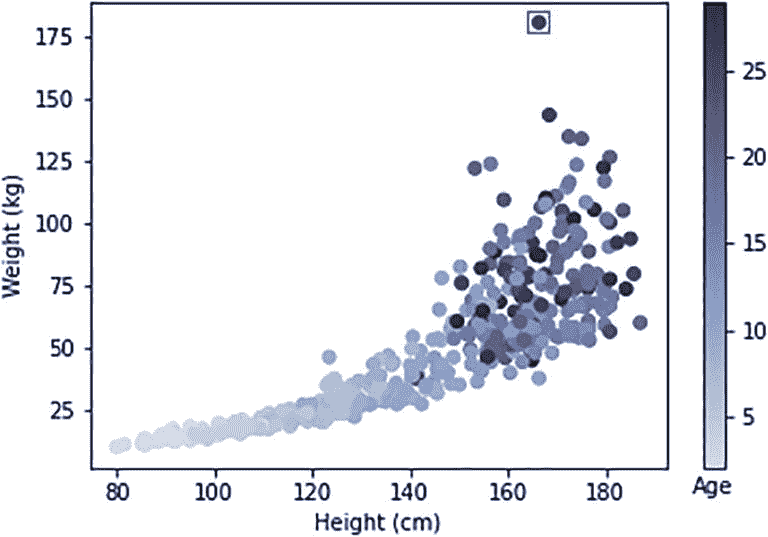

图 15-3

体重与身高的散点图，年龄用颜色表示

您还可以使用 size 属性来可视化具有连续值的变量。例如，显示每个学生气泡的气泡图(其 x 坐标和 y 坐标基于身高和体重)可以通过改变气泡大小来额外显示*年龄*。添加了一个*尺寸*图例，显示不同气泡尺寸代表的年龄值。图 [15-4](#Fig4) 显示了气泡图和*尺寸*图例，除了身高和体重之外，还可以显示年龄。请注意，与之前的散点图相比，为了视觉清晰，我们减少了该图中标记的数量。

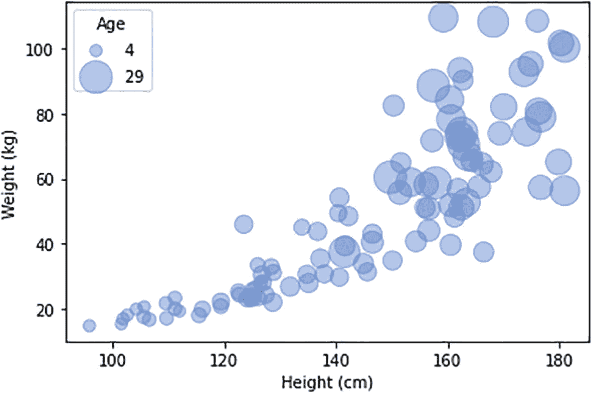

图 15-4

体重与身高的气泡图。气泡的大小表明了那个学生的年龄

## 布局

通常，您需要将多个相关图表添加到可视化中，以便可以跨图表比较数据。*布局*允许您将多个图表添加到您的可视化中，并以不同的方式组织它们。根据您的需要，您可以选择适当的布局，使您的可视化更有效，并传达对趋势的更多见解。最简单的布局之一是*叠加*布局，即将一个基于轴的图表叠加在另一个之上。假设您有一个堆积条形图，将每年来自电子产品的收入堆积在来自软件的收入之上。因此，每个条形的总高度表示相应年份的总收入。在这个条形图上，您可以叠加一个散点图，显示每年的收入目标。图 [15-5](#Fig5) 显示了覆盖在条形图上的散点图。请注意，条形图低于 1990 年的散点标记，这意味着该年未达到收入目标，因为总收入低于收入目标。另一方面，在 1995 年，总收入超过了收入目标，因为该年的条形图高于散点图。

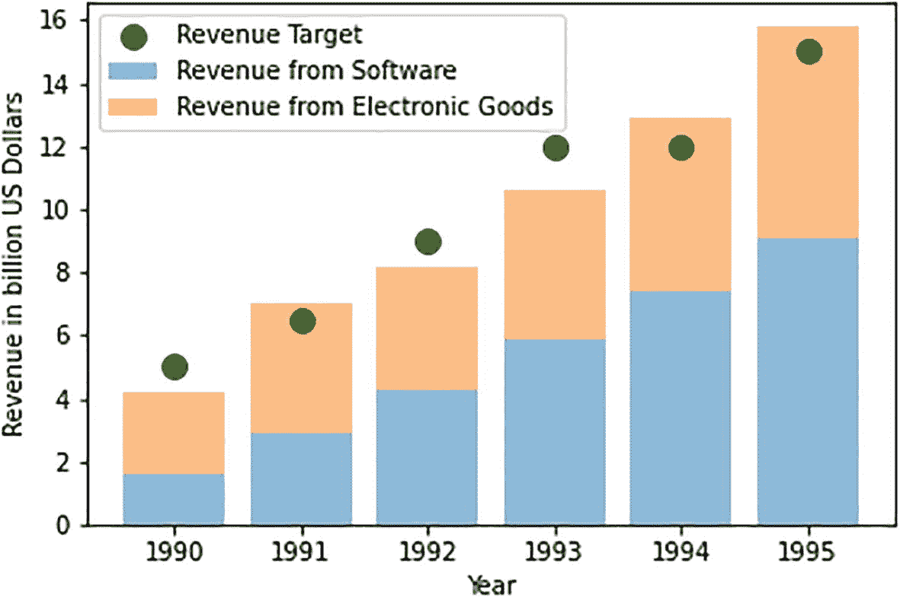

图 15-5

散点图显示覆盖在堆叠条形图上的收入目标，显示电子产品和软件的实际收入

有些布局允许您在行和列的网格中组织多个图表。此类别中的一些布局要求您手动指定哪个图表进入网格的哪个单元格，而其他一些布局则根据一些规则自动用图表填充网格。假设您想要可视化一家汽车公司生产的不同车型的销售情况，您可以使用一个简单的条形图。但是，您可能希望比较不同国家和年份的不同型号的销售情况。因此，您可以使用*数据点阵* [3](#Fn3) 布局，并对其进行配置，以自动为每个国家创建一行，为每年创建一列，从而为每对国家和年份显示一个单元格，而不是使用简单的条形图。您可以指定每个单元格应该自动显示相应国家和年份的条形图(显示型号的销售情况)。图 [15-6](#Fig6) 显示了显示每对国家和年份的条形图的数据点阵布局。显示不同型号的销售的简单条形图将允许两个变量(型号和销售)的可视化；数据网格布局允许您可视化另外两个变量:国家和年份。

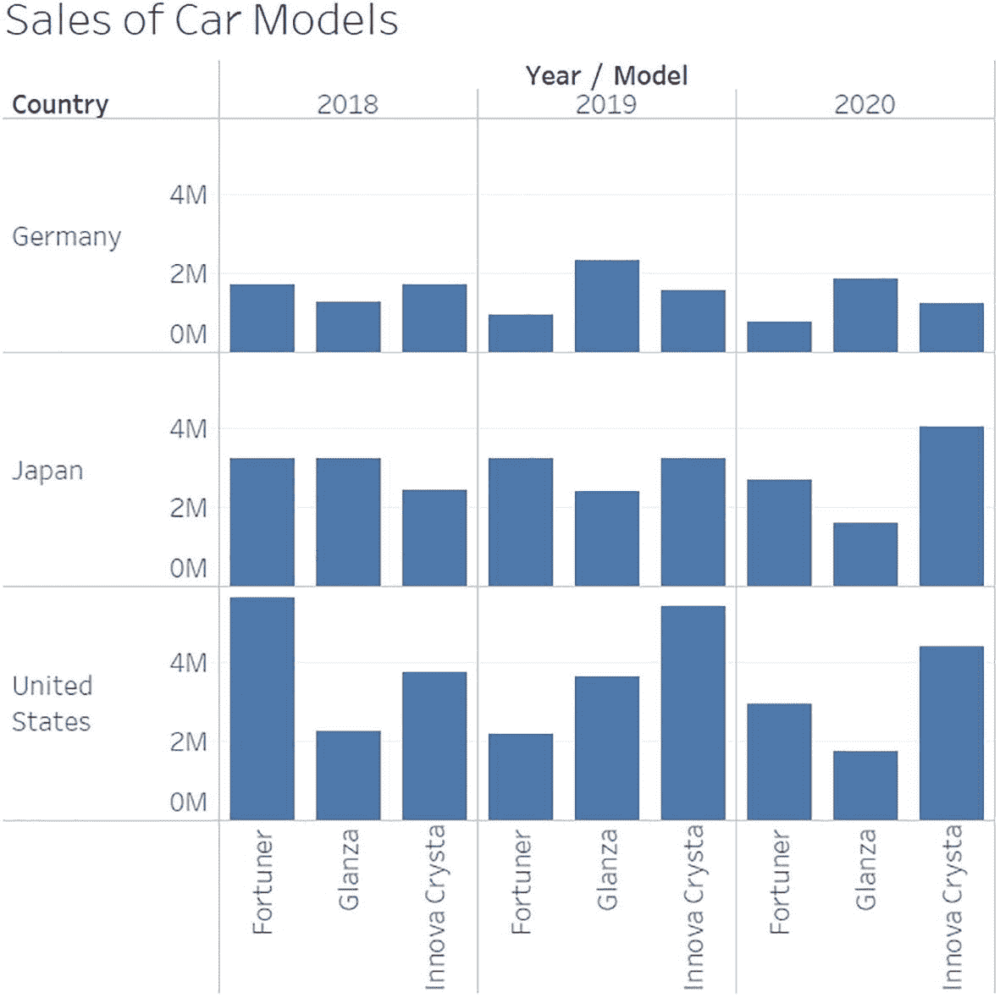

图 15-6

每对<country year="">鞋的销售数据格。格子中的每个单元格显示每个型号 [4](#Fn4) 的销售额</country>

这些布局通常在后台执行许多计算，以实现所需的功能，如实现一行中各单元格的垂直轴范围的一致性，或实现一列中各单元格的水平轴范围的一致性。

## 选择

所有图表、图例和布局都以属性的形式向用户展示选项，这些属性可以设置为不同的值，以利用更多的功能或更好地控制输出。例如，您可以在散点图中使用适当的选项将符号更改为方形而不是圆形，或者您可以使用适当的选项将基于轴的图表的轴更改为对数刻度。选项的范围各不相同，从基本选项到高级选项，基本选项只带来表面上的变化，高级选项涉及复杂的计算，对可视化有重大影响。我们不会深入讨论细节，但鼓励您提高对不同可用选项的认识，因为通过使用正确的选项可以极大地增强从可视化中获得的洞察力。

## 交互式可视化

有些工具可以让您设计交互式可视化，从而更深入地探索数据或提供简单可视化无法实现的动态视图。让我们再次考虑我们之前讨论的显示汽车型号销售的简单条形图——每个汽车型号都表示为一个高度代表该型号销售的条形。您可以将动画添加到该可视化中，以显示模型的销售如何按月变化。在引擎盖下，可视化为每个月创建一个条形图(显示模型的销售),并按时间顺序快速连续显示它们。通过观察柱线如何随时间增加或减少，您可以清楚地计算出每个型号的销售额如何随时间变化。

另一个重要的交互特性是*向下钻取*特性。当您查看可视化时，您可能希望更深入地了解细节。假设您正在查看一个显示美国某零售连锁店区域销售额的条形图。 [5](#Fn5) 你可能想进一步分析某个特定地区的趋势，并查看该地区不同州的销售情况。您可能会决定更深入一个州，查看该州不同城市的销售情况。您可以通过向可视化添加一个*向下钻取*特性来实现这一点。当可视化被呈现时，它以显示区域销售的条形图开始。图 [15-7](#Fig7) (A)显示了该条形图。然后，您可以选择某个区域的条形图，并选择深入查看该条形图；这导致可视化转到层次结构中的下一个级别，即*州*，并显示该地区各州的销售额。因此，如果您选择向下钻取与图 [15-7](#Fig7) (A)中突出显示的*东*区域相对应的条形图，您将会看到图 [15-7](#Fig7) (B)中的条形图。您可以进一步选择一个州的条形图，并深入查看下一个级别，该级别显示该州不同城市的销售额。图 [15-7](#Fig7) (C)显示了如果您选择向下钻取纽约州*纽约州*时将显示的条形图。

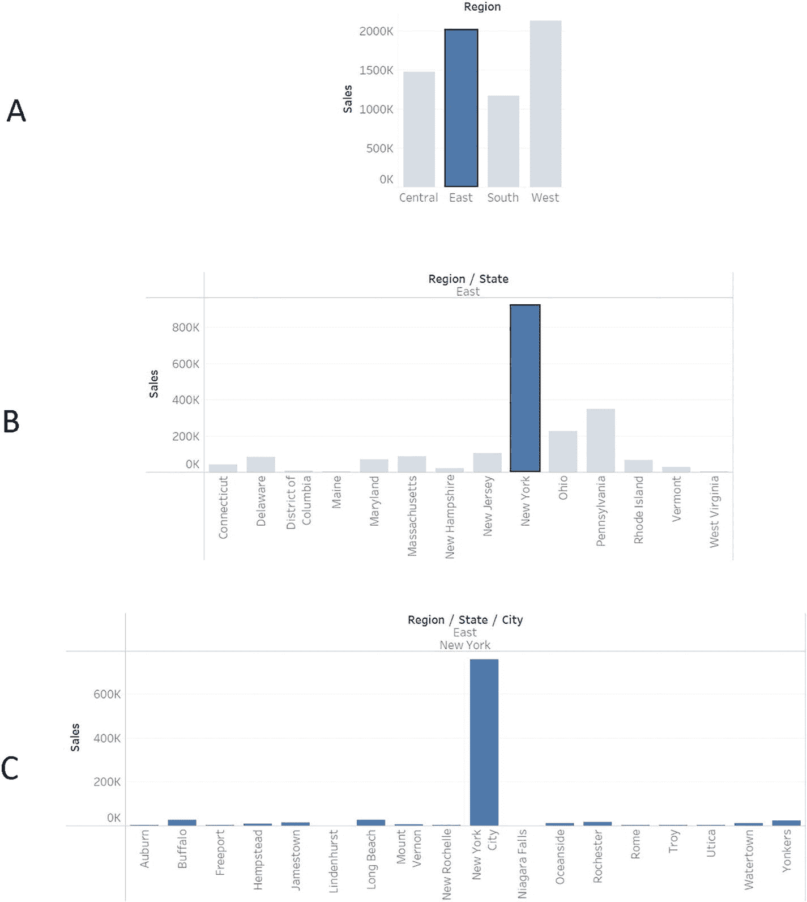

图 15-7

零售连锁店销售的交互式深入分析。(A)区域销售，选择深入东部地区。(B) Statewise sales，选择深入到纽约州。(C)纽约州的城市销售

## 从可视化中获得洞察力

到目前为止，这些小节讨论了一些与数据可视化相关的一般方面。在本节中，我们将更详细地了解数据科学中经常使用的一些可视化技术，以及如何利用它们来获得有助于构建有效模型的见解。当我们讨论问题的类别时，我们已经看到了这种洞察力的一些例子。例如，在讨论第 [5](05.html) 章中的*回归*类问题时，我们看了一个散点图，揭示了目标和特征变量之间的线性关系。基于这种认识，我们决定创建一个线性回归模型来捕捉这种线性关系。类似地，我们也在第 8 章[的异常检测中看到了箱线图。让我们再看一些例子。](08.html)

### 柱状图

您可以使用直方图来查看数值变量的值的分布。直方图将整个数值范围划分为更小的区间，称为“仓”,并为每个仓显示一个条形，条形的高度表示落入该仓的数值数量。通过查看直方图，你可以得出几个结论。例如，如果所有条形的高度相似，则意味着每个条柱中的值的数量相似。换句话说，这些值或多或少均匀地分布在间隔或区间上。另一方面，如果你看一下图 [15-8](#Fig8) ，它显示了一个班级中学生的体重直方图，你可以看到区间 30-35、35-40 和 40-45 的柱状图很高，而区间低于 30 或高于 45 的柱状图很小。这意味着许多学生的体重在 30-35、35-40 和 40-45 之间，很少有学生的体重在 30 以下或 45 以上。换句话说，绝大多数学生的体重在 30 到 45 之间。

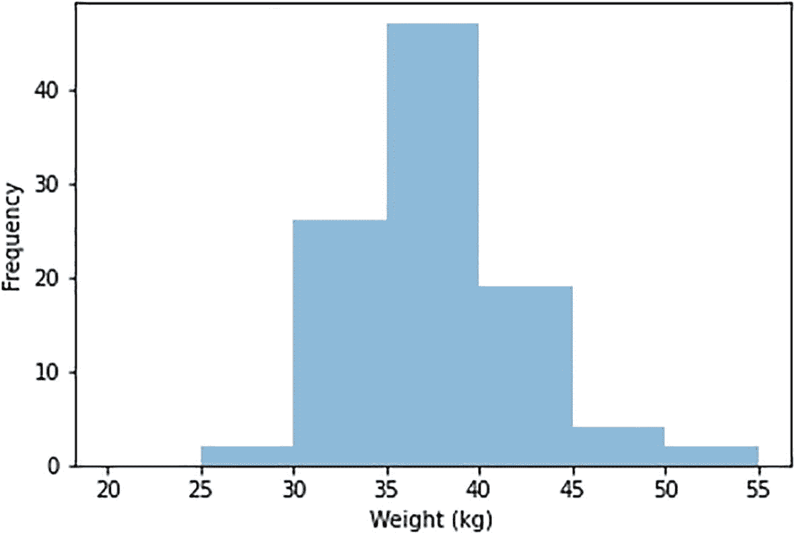

图 15-8

班级学生权重直方图。大多数学生的体重在 30 到 45 之间

现在让我们看看如何使用直方图来获得构建 ML 模型的有用见解。比方说，您正在努力创建一个模型，该模型将部署在一个可穿戴设备上，并将根据一些健康参数(如体温、血压等)预测一个人是否患有心脏病。，它测量。为了构建这个模型，假设您已经获取了大约一千名正常人和一千名心脏病患者的健康参数值。您可以在数据准备步骤中以这样一种方式准备您的数据，即您为每个人准备一行，其中包含他们的参数值和一个标签，如果此人有心脏病，则标签值为*有病*，如果此人健康*，则标签值为*健康*。*参数对应的变量是你的特征，包含标签*健康/患病*的变量是你的目标。现在，您想要评估与特定参数相对应的特征对于预测心脏状况是否有用。为此，您可以绘制健康人的这一特征的直方图，并将其覆盖在患有心脏病的人的这一特征的直方图之上。图 [15-9](#Fig9) 显示了*健康*和*患病*类别的重叠直方图。x 轴显示特征值的间隔，y 轴显示人数。

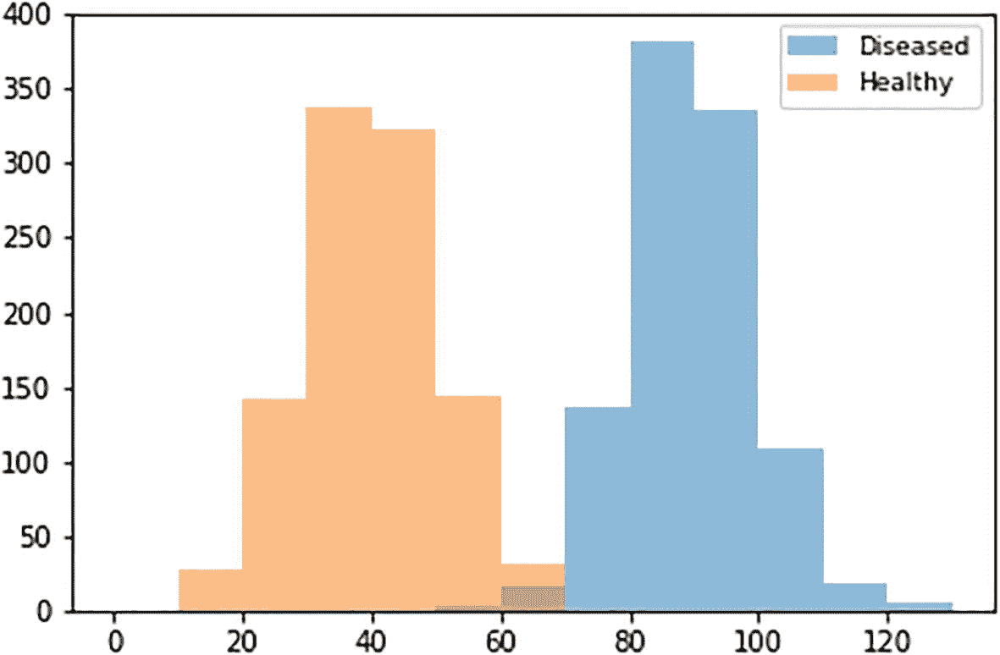

图 15-9

“健康”类和“患病”类的重叠直方图

您可以看到，健康类的直方图具有从特征值 10 到 70 的条形，而患病类的直方图具有从值 50 到 130 的条形。因此，两个类别的直方图之间有很好的分离——健康类别的直方图相对于患病类别的直方图向左移动。注意，对于小于 50 的特征值，存在健康类别的高条，但是对于小于 50 的特征值，不存在疾病类别的条。因此，我们的数据表明，健康人的特征值通常低于 50，但心脏病患者的特征值似乎从未低于 50。因此，如果你遇到一个特征值低于 50 的病例，你可以推断这个人可能是健康的。同样，我们的数据表明，患有心脏病的人的值通常高于 70，但健康人的值似乎从未高于 70。因此，如果你遇到一个特征值高于 70 的病例，你可以推断这个人可能有心脏病。因此，我们可以看到，该特征的值可以给出关于一个人心脏状况存在的一些指示。因此，ML 模型可以学习使用该特征的值来尝试预测一个人是否患有心脏病。因此，在构建预测心脏状况的模型时，使用这一功能将是一个好主意。因此，您可以看到查看直方图是如何提示您哪些特征可以有效地构建您的预测模型的。

### 核密度估计图

另一种常用于分类问题的图是核密度估计图或 KDE 图。KDE 图估计并绘制变量的概率密度曲线。KDE 图中的 x 轴代表变量值，y 轴代表概率密度。不去深究数学细节，让我们专注于如何解读 KDE 图。图 [15-10](#Fig10) 显示了我们之前看到的变量的 KDE 图，该图包含一个班级学生的权重——x 轴代表权重，y 轴代表概率密度。KDE 曲线下两个体重值之间的面积代表学生体重落在这两个值之间的概率。

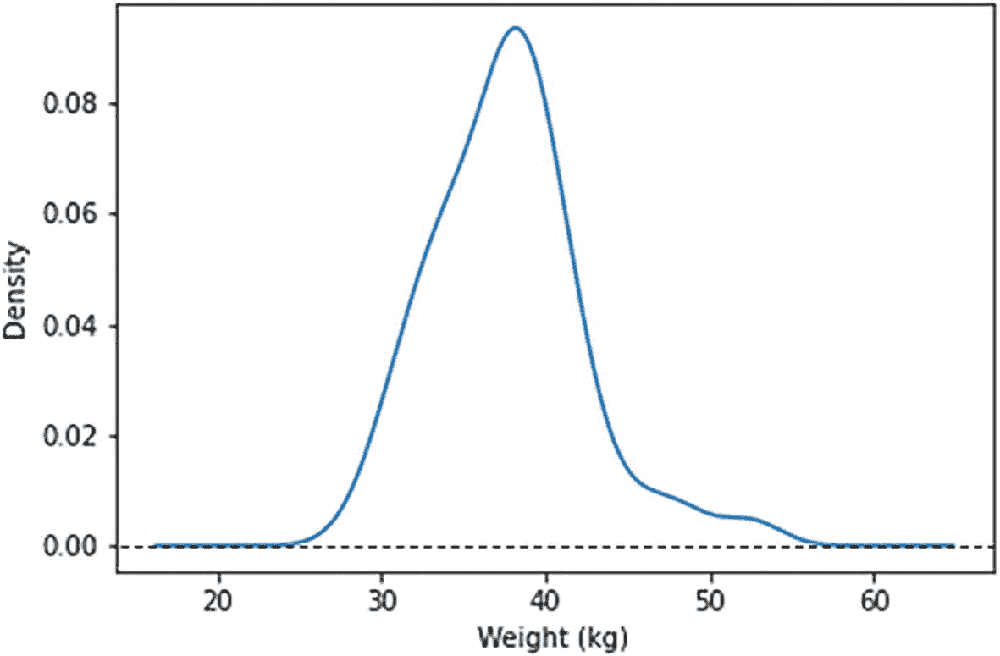

图 15-10

班级学生权重的核密度估计(KDE)图

从图中可以看出，重量 30 和 45 之间的曲线下面积比重量 30 以下的曲线下面积大得多。这意味着学生体重落在 30 到 45 之间的概率比体重落在 30 以下的概率大得多。这是因为我们在图 [15-8](#Fig8) 的直方图中看到，绝大多数学生的体重在 30 到 45 之间。因此，你可以看到 KDE 图就像一个平滑版的直方图。

当绘制多个分布图时，使用 KDE 图而不是直方图的好处变得很明显。让我们再来看一下这个特性，其健康人群和心脏病患者的分布是使用直方图绘制的，如图 [15-9](#Fig9) 所示。现在让我们将这 1000 名健康人的 KDE 图叠加到这 1000 名心脏病患者的 KDE 图上，而不是直方图，如图 [15-11](#Fig11) 所示。该图中的 x 轴表示特征值，y 轴表示概率密度。你可以看到图中叠加的 KDE 图看起来像图 [15-9](#Fig9) 中叠加直方图的平滑版本，但是你从 KDE 图中得到的好处是 KDE 图看起来不那么杂乱，比直方图更易读。如果将四个重叠直方图与相应的四个重叠 KDE 图进行比较，杂乱回波的减少会更加明显。

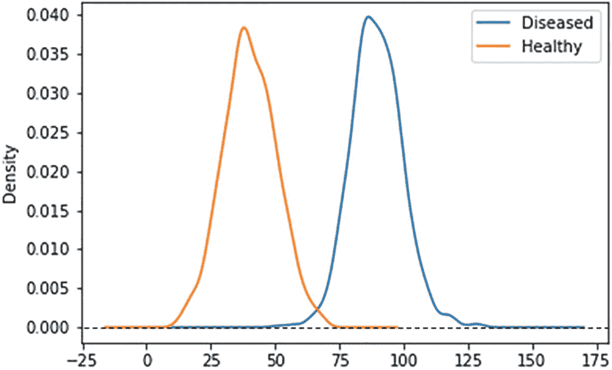

图 15-11

“健康”类和“患病”类的叠加核密度估计(KDE)图

现在让我们看看如何从 KDE 图中获得建筑模型的洞察力。我们可以在图中看到，两个类别的 KDE 图之间有很好的分离——健康类别的 KDE 图相对于患病类别的 KDE 图左移。注意，特征值 50 以下的健康曲线下的面积较大，而特征值 50 以下的患病曲线下的面积接近于 0。这意味着健康人的特征值小于 50 的概率很高，而患有心脏病的人的特征值小于 50 的概率几乎为零。因此，我们的图表明，健康人的特征值通常低于 50，而患有心脏病的人的特征值很少低于 50。因此，如果你遇到一个特征值为 40 的人，你可以推断这个人可能是健康的。类似地，特征值 75 以上的患病曲线下的面积较大，而特征值 75 以上的健康曲线下的面积接近于 0。因此，我们的曲线图表明，患有心脏病的人的特征值通常会高于 75，而健康人的特征值很少会高于 75。因此，如果你遇到一个特征值为 90 的人，你可以断定他们可能有心脏病。由于该特性的值为您提供了一些关于心脏状况存在与否的提示，因此您可以使用该特性来构建预测心脏状况的模型。因此，您可以通过查看 KDE 图来评估此功能对于构建模型的适用性。

## 库和工具

到目前为止，我们的讨论主要集中在数据可视化技术上。在这一节中，我们将讨论一些实现各种可视化技术的库和工具。

### 图书馆

有几个面向数据科学的可视化库。例如，在 Python 生态系统中，Matplotlib 是最古老的库之一，并且仍然非常流行。Seaborn [6](#Fn6) 是数据科学家使用的另一个流行的 Python 库。在本章中，我们使用了这两个库来创建散点图、直方图和 KDE 图。

### 工具

数据可视化工具领域，也包括商业智能或可视化分析工具，是分析领域中最古老的领域之一。像 Tableau 这样的工具有着悠久的历史，可以追溯到世纪之交。在过去几年中，数据科学的发展见证了几个 BI 工具扩展了它们的功能，增加了对数据科学家所需的数据准备和数据可视化的支持，包括与 Python 的集成等。

根据我们的经验，Tableau 和 SAS Visual Analytics 是两种工具，代表了为数据可视化提供的广泛功能，在学术界和工业界的数据科学家中很受欢迎。其他流行的工具包括 PowerBI、Looker 等。–这是一个非常拥挤的空间，有许多流行的工具。 [7](#Fn7)

了解这一类工具将使您能够确定您的组织是否已经拥有可供数据科学家利用的工具(如 BI 工具)。这可以显著改善数据科学家和其他利益相关者之间的协作。这些工具还允许非常容易地将视图和仪表板嵌入到现有的 web 应用程序中，这对于将数据科学家创建的可视化整合到任何现有的内部运营门户中非常有用。 [8](#Fn8)

## 数据工程

如果数据科学团队正在处理可以在单台机器上运行的数据大小，并使用 Matplotlib、Seaborn 等可视化库。，那么数据可视化步骤不需要很多数据工程活动。

但是，当数据规模很大并且使用 Spark 等集群时，数据工程将确保支持高效的即席查询来实现数据可视化。

除了确保高效查询之外，当 BI 或可视化分析工具用于数据可视化时，通常还需要以下数据工程活动:

*   为这些工具设置必要的服务器基础设施

*   在这些工具中配置适当的数据源

*   所需的任何定制，例如，任何用户定义的函数、定制 SQL 等。

最后，如果仪表板或应用程序要基于数据科学团队创建的可视化来实现，数据工程可以帮助快速启动原型应用程序，这些应用程序将数据科学家创建的可视化作为交互式仪表板的一部分来重用。这也可以使用像 Plotly Dash 或 Bokeh 这样的框架来完成——更多细节见第 [18](18.html) 章。

## 结论

在本章中，我们试图强调数据可视化不仅仅是条形图和散点图。我们讨论了与数据可视化领域相关的一些一般方面，还讨论了我们如何从可视化中获得洞察力。这些见解可以帮助我们建立有效的 ML 模型，这是我们下一章的重点。

<aside aria-label="Footnotes" class="FootnoteSection" epub:type="footnotes">Footnotes [1](#Fn1_source)

这纯粹是用*合成的*数据来说明一个树形图；这些数据并不代表任何提及的制造商的实际销售额。

  [2](#Fn2_source)

本章中用于所有身高/体重图的数据集来自 [`https://pypi.org/project/nhanes/`](https://pypi.org/project/nhanes/) 的 NHANES 数据

  [3](#Fn3_source)

请注意，不同的库可能对此布局使用不同的名称。

  [4](#Fn4_source)

这纯粹是用*合成的*数据来说明一个数据点阵；这些数据并不代表提及的任何车型的实际销量。

  [5](#Fn5_source)

本例中使用的样本数据集来自 [`www.kaggle.com/rohitsahoo/sales-forecasting`](http://www.kaggle.com/rohitsahoo/sales-forecasting)

  [6](#Fn6_source)

同样基于 Matplotlib。

  [7](#Fn7_source)

最近，Salesforce 收购 Tableau，Google 收购 Looker，这两个公司继续快速发展这一领域。

  [8](#Fn8_source)

这尤其适用于 DSI-Proc 项目；参见第 [23 章](23.html)。

 </aside>