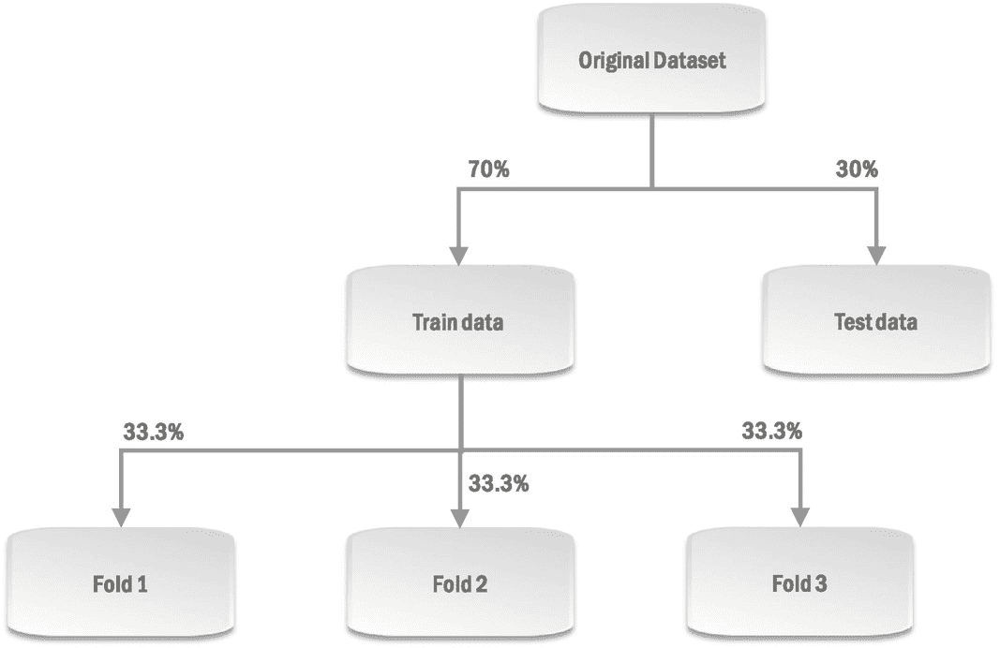

# 十六、机器学习

正如我们所见，机器学习是数据科学过程的核心，因为正是在这一步中构建了实际的模型。本章致力于 ML 算法/技术，你可以用它来构建模型和实现这些算法的库。了解不同的 ML 算法并直观理解底层概念对于整个数据科学过程的成功至关重要。我们将从 ML 算法的一般分类开始，然后看几个流行的算法。然后，我们将讨论模型性能评估，它可以帮助您评估模型的有效性。这种评估可以帮助您从您可能已经构建的多个候选模型中选择最佳模型，并且还可以让您了解所选择的模型在部署到产品中时可能会有多好的性能。

## 机器学习算法的类别

最大似然算法可以大致分为三种类型:监督学习、非监督学习和强化学习。让我们试着理解每种类型的含义，并看看每种类型中常见的例子。

### 监督学习

正如你可能从名字中猜到的，监督学习算法需要人的监督。作为这种监督的一部分，你需要告诉算法对于现有的观察值来说什么是正确的标签。该算法学习这些观察和它们的标签之间的关系，然后能够预测新观察的标签。例如，如果您正在使用监督算法来构建一个模型，该模型可以预测新的数字支付交易是否是欺诈性的，您将不仅提供现有交易的详细信息(如交易地点、支付金额和方式等。)但是还需要向算法提供这些交易的标签*欺诈/非欺诈*。该算法建立的模型将能够根据交易的细节预测哪个新交易是欺诈性的。我们前面已经看到，与这些细节相对应的变量(如支付金额等。)被称为*特征*，对应于*标签*的变量被称为*目标*。让我们再来看看第 [4](04.html) 章的例子，我们试图根据一个感兴趣的客户的性别、年龄、职业和年收入来预测他最终是否会购买这辆车。图 [16-1](#Fig1) 显示了我们传递给机器学习算法的数据。请注意，我们不仅传递了过去客户的详细信息(如性别、年龄等。)传递给算法，但我们也传递了那些客户的标签(购买/未购买)。因此，我们在那个例子中使用的算法(决策树算法)是一个监督学习算法。该图还指出了这种情况的特征、目标变量和标签。

图 16-1

功能、目标和标签

线性回归、逻辑回归、决策树、k-最近邻、朴素贝叶斯、支持向量机和神经网络是监督学习算法的一些例子。监督学习算法可以进一步分为*分类*算法和*回归*算法。分类算法预测作为类别的标签(例如，欺诈/非欺诈)，回归算法预测作为连续值的标签(例如，薪水)。*朴素贝叶斯*是一种流行的分类算法，*线性回归*是一种流行的回归算法。

### 无监督学习

无监督学习算法在没有人监督的情况下工作，也就是说，您不需要为观察值提供任何标签。该算法试图从未标记的数据中自己学习模式。聚类算法，比如我们在第 [7](07.html) 章看到的凝聚聚类，就是无监督学习算法的例子。聚类算法试图将未标记的观察值集合分成组或聚类，使得属于同一聚类的观察值比属于不同聚类的观察值更相似。例如，我们在第 7 章[中看到，对客户数据运行聚类算法可以将具有相似特征的客户分组。另一个流行的聚类算法是 *k 均值*。](07.html)

一些异常检测算法，如我们在第 [8](08.html) 章看到的局部异常因子，也是无监督算法，因为它们旨在检测无任何标签的数据中的异常观察。流行的无监督异常检测算法的其他示例有隔离森林和单类 SVM。

值得注意的是，无监督学习算法对于 KDD/数据挖掘项目尤为重要——我们将在第 [23](23.html) 章重新讨论这个问题。

### 强化学习

我们已经在第 [11 章](11.html)中看到了强化学习。这些旨在做出决策以优化长期结果的算法在本质上与监督和非监督算法有很大不同，因为它们与环境互动，并根据为其决策提供的奖励进行学习。

## 流行的机器学习算法

不要查看所有可用的 ML 算法，让我们只关注一些流行的算法，并尝试理解它们如何学习，如何预测，以及它们给出了什么样的见解。在第 [20](20.html) 章中，了解 ML 算法的这些细节对于理解为什么数据科学家基于他们所属的文化(修道院与狂野西部)更喜欢某些算法也很重要。如果你不想在这一点上讨论所有这些最大似然算法的细节，你可以在后面的章节中提到这些算法的时候再回到这里。

### 线性回归

*线性回归*算法是最流行的*回归*机器学习算法之一。如前所述，该算法基于准备好的数据构建了一个*线性回归*模型，该模型是一个线性方程，解释了如何从特征值计算目标变量值。这是许多数据科学家的最爱，他们经常用线性回归模型开始回归问题的初步实验。线性回归算法创建的方程用于计算新观察值的目标值。该等式还提供了对目标变量如何与特征相关的洞察。

让我们通过重温*回归*问题类 [1](#Fn1) 中的示例，来尝试理解线性回归算法是如何工作的，其中的目标是基于特征值*性别、年龄和吸烟状况*来预测目标*索赔金额*。图 [16-2](#Fig2) 显示了该示例的准备数据。回想一下，在性别特征中*男性*被表示为 *1* ，女性*被表示为 *0* ，在吸烟状态特征中*吸烟者*被表示为 *1* ，而*非吸烟者*被表示为 *0* 。*

图 16-2

准备好的数据传递给线性回归算法

还记得当我们可视化这些数据时，我们注意到线性关系，因此决定使用线性回归算法。当线性回归算法接收到这个准备好的数据时， [2](#Fn2) 它试图建立一个线性方程，将目标变量值表示为特征值加上常数项的加权和。那就是:

索赔金额= b 0 + b 1 ×性别+ b 2 ×年龄+ b 3 ×吸烟状况

其中 b 1 、b 2 和 b 3 分别是特征性别、年龄和吸烟状况的权重，b 0 是常数项(也称为截距项)。根据这个等式，该算法将性别= 0、年龄= 40、吸烟状态= 0 的客户的索赔金额预测为

b0+b1×0+b2×40+b3×0

图 [16-3](#Fig3) 中的*预测索赔金额*栏显示了算法使用该等式为现有客户预测的索赔金额。现有客户的预测误差是预测索赔金额与该客户实际索赔金额之间的差异。该图中的*预测误差*栏显示了现有客户的预测误差。请注意，该列中的值只是列*中的预测索赔金额*减去列*中的索赔金额*的值。

图 16-3

现有客户的预测索赔金额和预测误差

对单个客户的预测误差求平方，然后将它们相加，得到跨客户的总体预测误差。因此，总预测误差由下面的表达式表示，该表达式是列*预测误差* *中表达式的平方和:*

*…+*(b0+b1×0+b2×40+b3×0–9.2)2+(b0+b1×1+b2×50+b3×0–14.9)【t

该算法试图估计总体预测误差最小的 b 0 、b 1 、b 2 和 b 3 。换句话说，它试图通过使用类似梯度下降的技术来计算 b 0 、b 1 、b 2 和 b 3 的值，对于这些值，先前的表达式具有最小值。在这种情况下，发现当 b 0 = -6.9，b 1 = 2.1，b 2 = 0.4，b 3 = 2.9 时，表达式会有最小值。一旦算法因此聚焦于权重和截距项的正确值，它就使用这些值来具体化原始方程

索赔金额= b 0 + b 1 ×性别+ b 2 ×年龄+ b 3 ×吸烟状况

到…里面

理赔金额= -6.9 + 2.1 ×性别+ 0.4 ×年龄+ 2.9 ×吸烟状况

重新排列几项后，等式为

理赔金额= 0.4 ×年龄+ 2.1 ×性别+ 2.9 ×吸烟状况- 6.9

这就是我们在第 [5](05.html) (图 [5-4](05.html#Fig4) 中看到的等式，我们已经提到过它是由线性回归算法产生的。我们刚刚看到算法是如何得出这个等式的。该等式将用于根据新客户的年龄、性别和吸烟状况来预测其索赔金额。正如我们之前所讨论的，由线性回归算法产生的线性方程也让我们了解目标变量和特征之间的关系。我们在前面看到，根据这个等式，我们可以知道索赔额随着年龄的增长而增加 0.4K。我们还可以看出，男性(性别= 1)的索赔金额比女性高 2.1K。吸烟者(吸烟状态=1)倾向于比不吸烟者多索赔 2.9K。

### 逻辑回归

就像许多数据科学家用线性回归开始回归问题的实验一样，逻辑回归 [3](#Fn3) 是分类问题初始实验的最爱。让我们用一个类似于上一节中保险例子的例子来理解逻辑回归。然而，这一次，我们的目标是只预测新客户是否会提出索赔，而不是预测索赔金额。假设我们有来自不同保险公司的数据，其中包含每个现有客户的性别、年龄和吸烟状况，就像上一节中的数据一样。但是，数据包含的不是*索赔金额，而是一个名为*索赔状态*的变量，根据客户是否提出索赔，该变量的客户值是*索赔*或*未索赔*。现在，我们将尝试使用逻辑回归算法来构建一个模型，该模型可以根据特征*性别、年龄和吸烟状态的值来学习预测目标变量*索赔状态*的值。* [4](#Fn4) 图 [16-4](#Fig4) 显示了来自这家新保险公司的数据。*

图 16-4

逻辑回归的特征和目标变量

逻辑回归算法不是直接预测客户是否会提出索赔*，*，而是学习预测指示客户基于性别、年龄等的值提出索赔的可能性的概率。为此，该算法创建了一个线性方程(就像线性回归算法一样)，解释了如何根据客户性别、年龄等的加权和来计算客户提出索赔的概率。然而，简单的加权和可能大于 1 或小于 0。该算法使用一个名为*的逻辑函数*将加权和转换为 0 到 1 之间的值，使其成为有效概率。

图 [16-5](#Fig5) 显示了逻辑函数是如何定义的，图中的蓝色曲线绘制了该函数在不同输入 x 值下的值。正如图中所示，x = 0 时该函数的值为 0.5。这是因为函数定义中的 e -x 项在 x = 0 时变为 1，导致函数的整体值为 1/(1+1)或 0.5。随着 x 向大的正值增加，e -x 项开始变得接近 0，导致总函数值变得接近 1。随着 x 向大负值减小，e -x 项开始变得非常大，导致总函数值变得接近 0。所以函数值保证在 0 到 1 之间。

图 16-5

物流功能

如前所述，逻辑回归算法使用此逻辑函数将特征值的加权和转换为 0 到 1 之间的值，该值表示客户提出索赔的概率。这可以表示为一个等式:

p 索赔 = f(b 0 + b 1 ×性别+ b 2 ×年龄+ b 3 ×吸烟状况)

其中 **p** **索赔** 是客户提出索赔的概率，

**f** 是逻辑函数，

**b**T3】0T5】是截距项，

**b** **1** ， **b** **2** ， **b** **3** 为特征的权重。

使用此等式，算法将预测性别= 1、年龄= 50、吸烟状态= 0 的客户提出索赔的概率为

f(b0+b1×1+b2×50+b3×0)

该算法还可以通过从 1 中减去提出索赔的概率来预测不提出索赔的概率。这可以表示为

pno _ claim= 1–pclaim= 1-f(b0+b1×性别+ b 2 ×年龄+ b 3 ×吸烟状况)

其中**p****no _ claim**是客户不索赔的概率。

使用此等式，算法将预测性别= 0、年龄= 30、吸烟状态= 0 的客户不提出索赔的概率为

1-f(b0+b1×0+b2×30+b3×0)

该算法必须预测实际提出索赔的现有客户提出索赔的高概率(p claim )，并预测没有提出索赔的现有客户不提出索赔的高概率(p no_claim )。图 [16-6](#Fig6) 中的 *P* 列显示了*已经提出*索赔的现有客户的预计索赔概率(p 索赔)和*没有提出*索赔的现有客户的预计不索赔概率(p no_claim )。正如我们刚才提到的，所有这些值(列在 *P* 栏中)都必须高。所以算法会尝试查找 b 0 、b 1 、b 2 、b 3 中 *P* 列值高的值。 [5](#Fn5) 算法将使用前面提到的技术来实现这一点。

图 16-6

列 P 包含现有客户的 p 索赔或 p 无索赔

假设算法发现 b 0 = -80，b 1 = 10，b 2 = 2，b 3 = 10 是权重和截距项的最优值。它将使用这些值来具体化等式

p 索赔 = f(b 0 + b 1 ×性别+ b 2 ×年龄+ b 3 ×吸烟状况)

到…里面

p 索赔 = f(-80 + 10 ×性别+ 2 ×年龄+ 10 ×吸烟状况)

现在，这个等式表示逻辑回归模型，可用于预测为新客户提出索赔的概率。例如，37 岁的男性吸烟者(性别= 1，年龄= 37，吸烟状态= 1)提出索赔的概率由下式给出

p 索赔 = f(-80 + 10 ×性别+ 2 ×年龄+ 10 ×吸烟状况)

= f(-80 + 10 × 1 + 2 × 37 + 10 × 1)

= f(14)

所以这个客户提出索赔的概率等于 f(14)。我们可以在前面的逻辑函数 f(x)的图中看到，输入值为 14 的逻辑函数的值(即 *f(14)* )接近于 1。所以这个客户提出索赔的概率接近 1。一旦我们有了为一个新客户提出索赔的概率，我们就可以通过比较这个概率和一个截止值来预测他是否会提出索赔。如果提出索赔的概率高于截止值，我们预测客户会提出索赔。如果概率低于截止值，我们预测客户不会提出索赔。例如，如果我们为我们的逻辑回归模型选择 0.5 的临界值，我们将预测前面讨论的 37 岁男性吸烟者将提出索赔，因为他提出索赔的概率被预测为接近 1，高于 0.5 的临界值。另一方面，如果我们有一个模型预测概率为 0.3 的客户，我们会预测该客户不会提出索赔，因为他的预测概率低于选择的截止值 0.5。

就像线性回归一样，如果您希望不仅仅是预测目标变量的值，而是希望深入了解数据和生成这些数据的底层流程，那么逻辑回归模型非常有用。让我们看看我们之前讨论的逻辑回归模型给了我们什么启示。让我们再来看看这个模型的等式:

p 索赔 = f(-80 + 10 ×性别+ 2 ×年龄+ 10 ×吸烟状况)

我们可以看到，对于更大的年龄值，内部表达式的值(它是该等式中逻辑函数的输入)也将更大。前面讨论的逻辑函数图告诉我们，随着输入值变大，逻辑函数值也会变大。因此，年龄越大，索赔的概率就越大。这意味着老年人更有可能提出索赔。类似地，对于吸烟者(吸烟状态= 1)，内在表达增加 10。随着内在表达价值的增加，逻辑函数的价值也增加了。因此，吸烟者提出索赔的概率更高。换句话说，吸烟者更有可能做出声明。你同样可以分析性别对做出声明的可能性的影响。

让我们进一步分析模型的方程，以找到更多的见解。在此讨论中，我们将假设模型概率截止值为 0.5。现在，假设我们对分析女性不吸烟者(性别= 0，吸烟状况= 0)组感兴趣。将性别和吸烟状况的值代入模型的等式中，我们得到

p 索赔 = f(-80 + 10 × 0 + 2 ×年龄+ 10 × 0)

这相当于

p 索赔 = f(2 ×年龄- 80)

这个简化的方程给了我们为女性非吸烟者群体提出索赔的可能性。对于该组中的任何客户，我们将预测只有当她提出索赔 p 索赔的概率大于临界值 0.5 时，她才有可能提出索赔。当该简化方程右侧的逻辑函数值大于 0.5 时，这将是正确的。从逻辑函数图中，我们可以看出，当输入值(本例中为“2 ×年龄–80”)大于 0 时，逻辑值大于 0.5。这种情况发生在我们这个年龄大于 40 岁的人身上。简而言之，对于任何不吸烟的女性(也就是这个群体中的任何顾客)，我们最终预测，如果她的年龄超过 40 岁，她很可能会提出索赔。因此，这有效地传达了一个信息，即女性不吸烟者如果超过 40 岁，很可能会宣称吸烟。我们可以从男性吸烟者、女性吸烟者等其他群体中获得类似的见解。

### 支持向量机

支持向量机(或 SVM)是另一种机器学习算法，数据科学家经常用于分类问题，尽管它也可以用于回归问题。我们将使用一个非常简单的分类示例来尝试和理解该算法。

假设我们的数据包含两个特征 *f1* 和 *f2* 以及一个目标变量 *t* ，其值为 *N* (代表*负*类)或 *P* (代表*正*类)。该数据如图[16-7](#Fig7)T16 所示。

图 16-7

具有两个特征和目标的简单数据

如图 [16-8](#Fig8) 所示，让我们在散点图上将阳性观察值(其目标值为 P)绘制为红色方形标记，将阴性观察值(其目标值为 N)绘制为绿色圆形标记。每个标记的 x 坐标基于相应观测的 f1 值，y 坐标基于 f2 值。你可以在视觉上想象一条线，似乎把积极和消极的观察分开。这条假想线在图上显示为虚线。现在你可以自己用这条想象的线很容易地对一个新的观察结果进行分类。您将首先根据 f1 和 f2 的值在散点图上绘制新的观察值。然后，您将检查新的观察结果属于虚线的哪一侧。如果它落在包含红色标记的一边，您将预测新的观察值一定是正的(即，您将预测目标值为 P)。如果它落在绿色标记的一侧，您将预测新的观察值一定是负的(即，您将预测目标值为 N)。这是 SVM 算法的基本思想。

图 16-8

简单数据和假想分隔线的散点图

SVM 算法通常试图在 n 维空间(对应于 n 个特征)中找到一个超平面，该超平面将一个类别的现有观测值与另一个类别的观测值分开。让我们称一个类*为正*，另一个类*为负* *。因此，SVM 试图找到一个超平面，将积极的观察和消极的观察分开。如果新的观察值落在包含正观察值的超平面的那一侧，则新的观察值将被预测为*正*。而如果新的观察结果落在另一边，SVM 会预测它属于*负*类。当数据只有两个特征时，超平面只是一条直线，就像上图中假想的分隔线一样。如果数据有三个特征(即数据是三维的)，超平面就是一个平面，以此类推。*

上图中显示的数据(有两个要素)是线性可分的，这意味着可以找到一条直线来分隔这两个类。一般来说，当你在处理具有 *n* 个特征的数据时，如果有可能在 n 维特征空间中找到一个将两个类分开的超平面，你会说数据是线性可分的。您可以使用一个*线性 SVM* 来为线性可分数据找到这个超平面，然后可以使用它来预测新观察的类别。

然而，数据并不总是线性可分的。让我们看一个流行的玩具例子来理解这一点。图 [16-9](#Fig9) 显示了这个玩具数据，只有一个特征 *f1* 和目标 *t* ，其值可以是 *P* (正)或 *N* (负)。图 [16-10](#Fig10) 显示了该数据的曲线图，其中您可以看到数据不是线性可分的，因为您找不到一个分离正负观察值的超平面。对于数据不能线性分离的情况，您可以使用一个*非线性 SVM* 来分离类。

图 16-10

玩具示例数据的绘图

图 16-9

玩具示例数据

我们自然希望了解非线性 SVM 如何能够在数据不是线性可分的情况下分离类别。让我们以前面讨论的不可线性分离的单一特征数据为例。假设您将一个派生特征 *f2* 添加到该数据集，其值只是 f1 值的平方(即 f2 = f1 2 )。图 [16-11](#Fig11) 显示了添加了衍生特征的玩具数据，图 [16-12](#Fig12) 显示了其散点图。你可以看到，现在有可能在二维空间中找到一个超平面(散点图上以虚线表示),它将类别分开。要预测新观测值的类别，您可以使用 f1 值导出其 f2 值，并使用这两个值在二维空间中绘制新观测值，以便检查它落在超平面的哪一侧。因此，我们可以看到如何将特征(如我们刚刚看到的衍生特征)添加到不可线性分离的数据中，从而有可能找到分离超平面。一个非线性 SVM 可以通过使用一种叫做*内核技巧*的技术来实现添加这些特性的效果(实际上并不需要添加它们)。由于这种技术给出了添加那些特征的效果，非线性 SVM 可以分离数据中的类，否则这些类是不能线性分离的，因此可以相应地对新的观察结果进行分类。不用说，还有很多关于 SVM 的变化和细节我们没有涉及到。但是前面的讨论试图解释支持向量机工作背后的一般原理。

图 16-12

具有衍生特征玩具数据的散点图

图 16-11

具有衍生特征 f2 = f1 2 的玩具数据

### 决策图表

决策树算法是另一种流行的监督机器学习算法，用于分类和回归问题。在讨论分类问题时，我们已经看到了决策树的一个例子。让我们用另一个例子来更详细地理解决策树算法。比方说，你正在为你组织的员工开发一个应用程序，它可以监控他们的健康状况，并在各种疾病发作时及时发出警告。这个应用程序的一个功能是指示用户是否有患心脏病的风险。在幕后，该应用程序将使用机器学习模型来预测用户是否有可能患有心脏病。你的工作是利用现有的数据来建立这个模型，这些数据包含了大致相同数量的健康人和心脏病患者。图 [16-13](#Fig13) 显示了我们将用于构建该预测模型的成人数据快照。表中*性别*和*吸烟状况*直截了当*。体重类别*列可以有三个值之一:*正常*(表示该人处于其身高和性别的正常体重范围内)*体重不足*(表示该人低于正常体重范围)*超重*(表示该人高于正常体重范围)*。锻炼*栏显示该人是否定期锻炼。*健康状况*栏显示该人是否健康或有心脏病。我们将尝试构建一个简单的模型，该模型基于其他四列的值来预测目标变量*健康状态*的值，这四列是我们在本例中的特性。实际上，您可能希望使用更复杂的功能来构建一个非常精确的模型。

图 16-13

预测心脏病的数据快照

如果我们把这些特征和目标变量赋予决策树算法，它将建立一个决策树模型。决策树模型只是一棵树 [6](#Fn6) ，其中非叶节点检查特征值，叶节点预测目标值。图 [16-14](#Fig14) 显示了决策树算法为之前的数据建立的决策树模型的局部视图。可以看到，模型检查第一个非叶节点中的*行使*特征的值，如果值为*是*则向右 [7](#Fn7) 前进，如果值为*否*则向左前进，如果值为*是*则检查另一个非叶节点中的特征*吸烟状态*的值。如果*吸烟状态*的值是*吸烟者，*向右，如果值是*不吸烟者，*向左到一个叶节点。该叶节点预测目标值为*健康。其他非叶节点和叶节点可以被类似地解释。*

图 16-14

预测心脏病的决策树模型的局部视图

为了对新的观察结果进行预测，模型将简单地从根节点开始，沿着树向下遍历。在每个非叶节点，它将检查新观察的特征值，并采取相应的分支。它将继续这样做，直到它到达一个叶节点，并将最终预测对应于该叶节点的值。假设我们想要对一个不锻炼也不吸烟的超重男性员工进行预测(性别=男性，体重类别=超重，锻炼=否，吸烟状态=不吸烟)。图 [16-15](#Fig15) 中的红色箭头显示了该员工如何遍历树进行预测。模型将从根节点*练习*开始，走左侧8T7】分支对应*号*号。它将再次从节点*吸烟状态*中取出对应于*非吸烟者*的左分支，并从节点*体重类别中取出对应于*超重*的最右分支。*因此到达叶节点*心脏病*(在图中被红色矩形包围)并因此为雇员预测*心脏病*。

图 16-15

遍历决策树以预测雇员的心脏病

让我们后退一步，理解为什么当一个人到达红色矩形内的这个叶节点时，模型会预测到*心脏病*。该模型从树结构中知道，如果一个人到达这个叶节点，那么他一定属于不锻炼、不吸烟的超重人群。该模型观察到，在提供的数据中，这一组中的所有人都患有心脏病。 [9](#Fn9) 所以模型很有信心地预测这个人有*心脏病*。类似地，如果一个人到达绿色矩形内的叶节点，模型知道他们一定属于锻炼的不吸烟人群，并且数据中该人群中的所有人都是健康的。因此模型自信地预测这个人是健康的。此处需要注意的重要一点是，在第一种情况下，模型自信地预测目标值为*心脏病*，因为他到达的叶节点对应于一个组(不运动、不吸烟的超重人群)，该组在提供的数据中心脏病患者占非常高的优势。在第二种情况下，模型自信地预测目标值为*健康*，因为他到达的叶节点对应于一个组(锻炼的不吸烟的人),该组在提供的数据中健康的人占非常高的优势。因此，我们可以看到，为了能够自信地预测目标值，重要的是叶节点应该对应于一个类别(健康或心脏病)具有非常高优势的组。或者我们可以简单地说，叶节点需要有一个类的非常高的优势。

该算法使用像熵这样的度量来评估一个节点是否在一个类别中具有非常高的优势。正如前面提到的，红色和绿色矩形内的叶节点对应于特定的组，树中的每个节点对应于特定的组。例如，根节点右侧的节点对应于一组锻炼者。如果一个节点对应于一个组，在该组中，数据中 PH部分人是健康的，PHD部分人患有心脏病，则该节点的熵被定义为

熵=-PH×log2PH-PHD×log2PHD

如果一个节点具有非常高的健康人群优势，P H 将接近 1，P HD 将接近 0。由于 P H 接近 1，log 2 P H 接近 0，因此“-PH×log2PH接近 0。同样由于 P HD 接近 0，“-PHD×log2PHD”也接近 0。因此，熵接近于 0。如果一个节点具有非常高的心脏病患者优势，P HD 将接近 1，P H 将接近 0。使用熵方程很容易看出，在这种情况下，熵也将接近于 0。这意味着，当某一类占很大优势时，熵接近于 0。我们来看看没有一个类是占优的时候熵值是多少，也就是说，对于节点对应的组，数据中健康人的数量大致等于心脏病人的数量。因此，对于这种情况，P H 和 P HD 都接近 0.5，因此，我们可以使用熵方程计算熵:

熵=-0.5×log20.5-0.5×log20.5

= - 0.5 × -1 - 0.5 × -1

= 1

所以当没有阶级占优势时，熵接近于 1。因此，我们可以得出这样的结论:当一个类别占优势非常高时，熵非常低(接近 0)，而当没有一个类别占优势时，熵非常高(接近 1)。因为我们希望叶节点具有非常高的一类优势，所以我们希望叶节点的熵非常低。

现在我们终于可以看看算法是如何创建树的了。该算法从对应于“所有”人的组的根节点开始，在我们的数据中，健康人和心脏病患者的数量大致相等。所以在根节点中没有一个类是主要的。然后，它将该特征上的根节点从特征集合中分离出来，对于该特征集合，子节点具有一个类别的高优势。因此它将挑选子节点具有最低熵的特征。然后对每个子节点重复这一过程，也就是说，它使用导致一个类别的高优势(或最低熵)的子节点的特征来进一步分割每个子节点。它继续这样做来建造这棵树。因此，该算法不断分裂，以创建一类具有高优势的节点。因此，当它到达叶节点时，将会有一个类的非常高的优势。这就是为什么先前红色矩形中的叶节点具有非常高的等级优势*心脏病*(如我们先前看到的，对应于该叶节点的人群只有心脏病患者，没有健康人)，并且先前绿色矩形中的叶节点具有非常高的等级优势*健康*(如我们先前看到的，对应于该叶节点的人群只有健康人，没有心脏病患者)。正如我们前面看到的，一个类别在一个叶节点中非常高的优势使模型有信心预测该类别作为在预测期间到达该叶节点的人的目标值。

决策树模型还提供了对数据趋势和底层流程的洞察。例如，您可以通过查看决策树来判断，如果一个人锻炼并且不吸烟，决策树将预测此人是健康的，而不管此人的性别和体重类别。更具体地说，我们得到的重要认识是，如果一个超重的人锻炼并且不吸烟，他也可能是健康的。

决策树算法也很受欢迎，因为它适用于人们可能遇到的许多不同的场景。我们之前看到的示例没有任何数字特征，但是决策树算法也可以使用数字特征进行预测。我们在第 [4](04.html) 章看到了一个这样的例子，算法创建了一棵树，使用数字特征*年龄*来预测哪些感兴趣的客户可能会购买汽车*。*还有，本节我们刚刚看到的例子是分类问题，但是决策树算法也可以用于回归问题。

### 随机森林

决策树算法的近亲是随机森林算法。随机森林算法也可以用于分类以及回归问题。我们看到由决策树算法创建的模型仅仅是一棵决策树。另一方面，由随机森林算法创建的模型是决策树的森林。因此，随机森林算法不是相信单个决策树的预测，而是形成一个由多个决策树组成的团队，每个决策树都对新的观察结果做出预测。来自所有树的预测被认为达到了新观察的最终预测。

对于分类问题，森林中的每棵决策树预测它认为新观察值可能属于的类别。换句话说，每棵树为新的观察推荐一个类。由最大数量的树推荐的类别被选为最终预测的类别。假设我们将上一节中健康人和心脏病患者的数据提供给随机森林算法，该算法构建了一个森林树。图 [16-16](#Fig16) 显示了这些树是如何合作预测一名新员工是否患有心脏病的。你可以看到 80 棵树认为这位新员工健康，20 棵树认为这位员工有心脏病。由于大量的树认为雇员是健康的，所以模型预测雇员是健康的。

图 16-16

新员工的随机森林预测

对于回归问题，森林中的每棵树都为新观察值预测一个数值。该模型对所有树的预测值进行平均，并将平均值作为新观测值的最终目标值返回。

如果您深入了解决策树算法从数据中学习并构建树的方式，您就可以理解为什么决策树经常过度拟合它所学习的数据。这意味着决策树通常能够很好地预测它用于学习的那些观察值的目标值，但是对于新的看不见的观察值可能不能很好地执行。随机森林算法解决了这个问题，并通过参考多个决策树来提高新数据的性能。

要查询多个决策树，随机森林算法需要首先从提供给它的单个观察和特征数据集创建多个决策树。该算法通过在构建每棵树时改变观察值和特征来做到这一点。对于每棵树，该算法从原始数据集中随机选择具有替换的观察值，直到创建与原始数据集具有相同数量的观察值的新数据集。由于算法是用*代替*，原始数据集中的一些观察值可能会被选择多次，而原始数据集中的一些观察值可能根本不会被选择。因此，新数据集将具有相同的大小，但包含不同于原始数据集的一组观察值。该算法重复这一过程来创建许多不同的数据集，每个数据集用于构建一棵树——这种技术被称为*引导聚合*或*打包*。在类似的线路上，该算法还试图在构建每棵树时改变特征。当算法为任何树中的分割决定最佳特征时，它只查看特征的随机子集，并从该子集中挑选最佳特征，而不是查看所有特征。这进一步导致每棵树在其分裂中使用不同的特征。这个故事的关键是，每棵树都是以不同的方式构建的，因为每棵树都从不同的数据集学习，并为其分裂使用不同的特征。并且多个这样的不同树协作来提高性能。

### 梯度增强树

*梯度提升树*是另一种利用多决策树的流行算法。让我们在此讨论中仅关注回归问题，以了解该算法如何工作以及它与随机森林算法有何不同。随机森林算法构建多个相互独立的树，其中每个树学习预测数字目标值本身。对于新的观察，每棵树都试图预测目标值，并且对所有树的预测进行平均，以得到该观察应该预测的最终目标值。*梯度提升树*算法则按顺序创建树，其中第一棵树学习预测数字目标值，每个后续树学习预测前一棵树产生的误差。在预测新的观察值时，第一棵树预测一个数字目标值，随后的每棵树预测前一棵树产生的误差。这个想法是，如果您可以预测数字目标值，并且如果您事先知道预测中的错误，您可以针对这些错误进行调整以改进您的预测。

让我们看一个具体的回归例子来更详细地理解这一点。假设我们示例中的数据包含三个特征 *f1、f2 和 f3* 以及一个连续值目标变量 *t* ，如图 [16-17](#Fig17) 左上表所示。注意，存在 f1 为 5、f2 为 7、f3 为 2 并且对应的目标值 *t* 为 10 的观察值。我们的目标当然是建立一个模型，使用这三个特性的值来精确预测 target *t* 的值。如果我们将这些数据传递给梯度提升树算法，它将像前面提到的那样依次构建树。图 [16-17](#Fig17) 显示了一个简单的场景，其中梯度提升树算法使用该数据构建了两棵树。该算法采用准备好的带有特征和目标的数据(图中左上角的表格)，并在左侧构建第一棵树，该树学习使用特征值预测目标值*。*该算法现在使用第一棵树来预测现有观测值的目标值，这些值显示在左下表格*的*预测 _t* 列中。*您可以在此表中看到，第一个树预测现有观察的目标值为 8，其 f1 为 5，f2 为 7，f3 为 2，而实际目标值为 10。所以第一棵树在这次观察中产生了 2 (= 10 减 8)的误差。

图 16-17

两棵树的梯度增强树

该算法现在构建第二个决策树，该决策树可以预测第一个树在预测目标值时将产生的误差。为此，该算法计算第一树对于每个现有观察值产生的误差，该误差是实际目标值和第一树预测的目标值之间的差(即，左下表格中的 *t* 减去*预测 _t* )。右上方的表格显示了第一棵树(在列*error _ 1**ST**_ tree*[10](#Fn10))产生的误差，以及传递给第二棵树的现有观测值的特征值。该数据中的一行告诉第二棵树，当 f1 为 5，f2 为 7，f3 为 2 时，第一棵树产生的误差为 2。第二棵树使用这些数据来学习预测第一棵树将会犯的错误。一旦第二棵树学会了，就可以用它来预测第一棵树犯的错误。右下表格中的附加栏*预测 _ 误差 _ 1**ST**_ tree*显示了第二棵树预测的第一棵树对现有观测值产生的误差。例如，对于 f1 为 5、f2 为 7、f3 为 2 的观测值，第二棵树预测第一棵树将产生 1.7 的误差，而第一棵树产生的实际误差为 2。

现在树已经构建好了，预测新观测值的目标值就很简单了。假设我们有一个新的观察结果，它与原始数据中的现有观察结果非常相似(显示在上图的左上角表格中)。对于这个新的观察结果，f1 是 5，f2 是 7，f3 是 2。让我们看看梯度增强树如何使用这个新观测值的特征值来预测目标值，注意接下来解释的这个预测方法如何试图使预测的目标值接近这个新观测值的实际目标值(我们将假设新观测值的实际目标值也是 10，就像现有观测值一样，因为新观测值与现有观测值非常相似，但是这个实际目标值在实际场景中显然是未知的)。现在，对于这些特征值，第一棵树将预测目标值为 8(我们可以从上图的左下角表格中看出这一点)。现在用第二棵树来改进这个预测，使它更接近实际目标值。对于这些特征值，第二棵树将预测第一棵树的误差为 1.7(我们可以从上图右下角的表格中看出这一点)。现在将使用由第二树预测的第一树的误差来校正来自第一树的预测目标值，以获得将为该观察预测的最终目标值。因此，由第二树(1.7)给出的预测误差被添加到来自第一树(8)的预测目标值，以获得最终针对该观察预测的校正目标值(9.7)。因此，最终的预测目标值接近实际目标值(如前所述，我们假设其为 10)。

让我们看看如何进一步改进预测。我们在右下角的表格中看到，当 f1 为 5，f2 为 7，f3 为 2 时，第一棵树产生的实际误差为 2，但第二棵树预测的误差为 1.7。这意味着第二棵树本身对于这些特征值具有 0.3 的误差。因此，您可以配置算法来构建第三棵树，它可以预测第二棵树的错误。如图 [16-18](#Fig18) 所示。在图中可以看到，第三棵树从传递给它的数据中得知，当 f1 为 5，f2 为 7，f3 为 2 时，第二棵树产生的误差为 0.3。当第三棵树依次被要求预测第二棵树对这些特征值产生的误差时，它预测 0.25，如图所示。一旦建立了三棵树，当我们对新的观察值(其 f1 为 5，f2 为 7，f3 为 2)进行预测时，第一棵树将预测目标值为 8，第二棵树将预测第一棵树将产生 1.7 的误差，第三棵树将预测第二棵树将产生 0.25 的误差。因此最终预测目标值将等于来自第一树的预测目标值(8)加上第二树预测的第一树的误差(1.7)加上第三树预测的第二树的误差(0.25)，等于 9.95。因此，第三棵树进一步帮助我们使最终的预测目标值更接近实际目标值(我们假设为 10)。

图 16-18

三棵树的梯度增强树

您可以配置算法，以类似的方式按顺序使用越来越多的树。甚至当你有许多树时，当预测一个新的观察值时，所有树的预测值相加，得到的和被预测为最终的目标值。这可以表示为一个简单的等式:

最终预测目标值=第 1 棵树预测+第 2 棵树预测+第 3 棵树预测+第 4 棵树预测+第 5 棵树预测+ …

### 人工神经网络

人工神经网络(ANNs)，或简称为神经网络，是最受谈论和赞美的机器学习算法之一，它基于大脑中生物神经元的功能方式。它们被用来解决最复杂的问题，也是全球广泛研究的目标。深度学习，正如我们在第 [1](01.html) 章看到的，是基于神经网络的。建立有效的数据科学实践的旅程可能会经历评估对人工神经网络的需求和建立专业知识的阶段。还存在特殊种类的人工神经网络，如卷积神经网络(CNN)、递归神经网络(RNN)等。，每一种都有一些独特的特征，使其特别适合于特定类型的问题。我们不讨论所有种类的人工神经网络，而是在这一节中着重于理解人工神经网络背后的一般原理，这将有助于我们理解它们与其他最大似然算法相比的优势和局限性。

我们的大脑由数十亿被称为神经元的相互连接的神经细胞组成。每个神经元从其他神经元接收信号，处理它们，并产生自己的信号，该信号进一步传递给其他神经元。类似地，人工神经网络由几个相互连接的人工神经元组成。每个这样的人工神经元从其他神经元接收输入，并进行一些计算以产生输出，该输出被传递给其他人工神经元。让我们重温一下我们在第 [6](06.html) 章中讨论的问题，我们的目标是根据邮件正文推断/预测邮件的类别。图 [16-19](#Fig19) 显示了我们在那一章中准备的数据的局部视图，其中包含每封电子邮件的一行。您可能记得，这些准备好的数据包含词汇表中每个基本单词的一个特征，还包含目标变量*类别*。电子邮件的特征值等于相应的基本词在该电子邮件中出现的次数。并且电子邮件的目标变量的值明显地指示了该电子邮件的类别。

图 16-19

电子邮件数据的功能和目标

我们将把单个目标变量*类别*转换成三个目标变量，分别对应于三个可能的类别:产品开发、研究工作和培训。图 [16-20](#Fig20) 显示了准备好的数据 [11](#Fn11) 已经被转换 [12](#Fn12) 为三个目标变量，可以在最后三列中看到。如果电子邮件属于某个类别，则该电子邮件对应的目标变量的值为 1，其他两个目标变量的值为 0。例如，图中第一封邮件属于类别*产品开发，*因此目标变量*产品开发*的值为 1，目标变量*研究工作*的值为 0，目标变量*培训*的值也为 0。现在让我们构建一个人工神经网络，它可以使用特征值来预测三个目标变量的值。

图 16-20

功能和新的目标变量

我们将建立一个具有简单和通用架构的神经网络，它由多层组成，每层包含一些人工神经元。一层中的神经元通常接收来自前一层神经元的输入，对其进行一些计算，并将结果传递给下一层中的神经元。图 [16-21](#Fig21) 显示了我们设计的神经网络，用于根据特征值预测三个目标变量。你可以在图中看到我们的神经网络有四层。输入层中的神经元将获取电子邮件的特征值，输出层中的神经元将预测该电子邮件的三个目标变量的值。通过使用更高级的功能/技术，可以在许多方面改进这个神经网络，但是如前所述，我们将主要关注基本原理，并省略这些细节。让我们通过这个神经网络来更深入地理解它。

图 16-21

我们预测电子邮件类别的神经网络

该图中的第一列是*输入层*，包含每个特征的神经元。注意有一个神经元用于特征*上下文*，一个神经元用于特征*安全、*等等。这一层中的每个神经元简单地接收电子邮件的相应特征值，并输出相同的值而不改变它。输入层中每个神经元的输出(正如我们刚刚看到的，它只是一个特征值)被馈送到*隐藏层 1 中的所有神经元。因此，第一隐藏层中的每个神经元接收所有特征值作为输入。*

*隐层 1、隐层 2、*和*输出层*中的神经元与*输入层*中的神经元不同。这三层中的每一个神经元所做的事情与我们在逻辑回归中看到的类似。它计算其输入的加权和，加上偏差，并使用 sigmoid 函数将结果值转换为 0 到 1 之间的值。这可以表示为一个等式:

输出= f(b0+b1×IP1+b2×IP2+b3×IP3+…)

其中**输出**是神经元的输出，

**f** 是 sigmoid 函数，其定义与逻辑函数相同，

**b**T3】0T5】是偏置，

**ip** **1** ， **ip** **2** ，**IP****3**…是对神经元的输入，

**b** **1** ， **b** **2** ，**b****3**…是输入的权重。

因此，我们可以说，这三层中的每个神经元使用其权重列表(包括偏差)对其输入进行一些计算，以产生输出。并且将第一隐藏层中每个神经元的输出传递给第二隐藏层中的所有神经元。第二隐含层中每个神经元的输出传递给*输出层*中的所有神经元。注意，输出层有三个神经元，对应于三个目标变量。所以输出层的每个神经元输出邮件对应目标变量的预测值。

简而言之，我们可以说，神经网络在输入层获取电子邮件的特征值，并使用神经元的权重对这些特征值执行多次计算，以便在输出层预测三个目标变量的值。但是神经网络如何知道神经元中的什么权重值将从特征值中产生正确的目标值呢？神经网络从我们提供的数据中学习这一点，这些数据包含现有电子邮件的特征和三个目标变量。

让我们更详细地理解这一点。神经网络首先将所有神经元的权重初始化为某个值。 [13](#Fn13) 然后它会查看所提供数据中的第一封邮件，并将其特征值传递给输入层。将使用神经元的权重对不同层中的这些特征值进行计算，以产生三个预测的目标值。图 [16-22](#Fig22) 左侧显示第一封邮件的特征值，右侧显示网络的预测目标值。然后，神经网络通过将这些预测的目标值与从所提供的数据中已知的该电子邮件的实际目标值进行比较，来测量该电子邮件的预测误差。然后，它调整网络中神经元的权重，以减少这封电子邮件的错误。该图还描述了测量误差和调整权重的这些步骤。让我们仔细看看调整权重的过程。此邮件的预测误差取决于实际目标值和预测目标值。预测的目标值本身取决于该电子邮件的特征值和神经元的权重。因此，我们可以说，误差取决于特征值、神经元的权重以及电子邮件的实际目标值。由于该电子邮件的特征值和实际目标值在数据中是固定的，因此该电子邮件的误差最终是神经元权重的函数。 [14](#Fn14) 因此，神经网络可以使用类似于梯度下降的技术将权重从其当前值改变为新值，从而减小误差。

图 16-22

调整第一封电子邮件的权重

然后，神经网络执行这些调整权重的步骤，以减少所有其他电子邮件的错误(它对第一封电子邮件执行了该步骤)。有了新的权重，神经网络在预测现有电子邮件的目标值时应该会犯更少的错误。然后，神经网络再次重复调整所有电子邮件权重的整个过程，以进一步减少误差。它继续重复整个过程很多次，直到现有电子邮件的错误已经最小化。在这个阶段，对于现有的电子邮件，神经网络能够预测接近实际目标值的目标值。图 [16-23](#Fig23) 显示，如果你输入第一封邮件的特征值，神经网络现在预测的目标值接近实际目标值。因此，对于第一个现有电子邮件，网络预测目标变量*产品开发*的值接近[15](#Fn15)1，研究工作*的值接近 0，*的值接近 0，培训*的值接近 0。然而，真正的好处来自这样一个事实，即神经网络现在能够相当好地预测甚至是以前没有看到的新邮件的类别。 [16](#Fn16) 例如，如果新收到的电子邮件具有与第一封现有电子邮件相似的文本(因此具有相似的特征值)，神经网络仍将预测目标变量*产品开发*的值接近 1，*研究工作*的值接近 0，*培训*的值接近 0。换句话说，神经网络将能够正确预测新收到的电子邮件属于类别*产品开发。**

图 16-23

神经网络学习后对第一封电子邮件的预测

就像我们刚刚看到的，神经网络可能会在正确预测新收到的电子邮件类别方面做得很好。然而，与我们之前讨论的其他一些模型不同，网络并没有给我们一个简单的描述它是如何进行预测的。如果您还记得我们关于线性回归的讨论，您可能还记得线性回归模型为您提供了一个简单的等式，它解释了如何使用特征值计算目标变量的值。这个等式给出了许多关于潜在过程的见解。然而，对于神经网络，我们所知道的是许多神经元正在进行大量的计算，以达到预测的目标值。我们没有一个简单的图片来解释目标值与特征值之间的关系。

最后，让我们谈一谈神经网络的设计。对于这个问题，我们选择在我们的网络中有两个隐藏层。如果您决定使用神经网络来解决您的问题，您将需要决定您的网络应该有多少个隐藏层以及每个隐藏层应该有多少个神经元。我们不会在这方面做更多的讨论，但是建议研究一下用来决定合适的隐藏层和神经元数量的方法。

### 卷积神经网络

我们讨论了人工神经网络，并且在前面的章节中提到了几种特殊的人工神经网络。在本节中，我们将谈论一种特殊的网络，即*卷积神经网络(CNN)。*由于 CNN 的设计方式*，*它们对与图像相关的问题非常有效(如*图像分类)，*但最近发现它们对图像以外的问题也很有用。CNN 与我们之前看到的常规神经网络的主要区别在于它在常规神经网络的通常层之前放置了额外的层。

假设您的公司生产监控摄像机，现在您想要构建一个模型来判断摄像机近距离拍摄的照片属于人、动物还是车辆。这是一个*图像分类*问题，因为这里的目标是预测摄像机拍摄的图像属于三类(人、动物、车辆)中的哪一类。这个问题类似于上一节中的问题，我们希望预测电子邮件属于三个类别(产品开发、研究工作、培训)中的哪一个类别。因此，您可以构建一个常规的神经网络(类似于我们在上一节中看到的网络)来预测图像的类别。当您将输入层中图像的特征值传递给这个神经网络时，它也会在输出层中输出预测。但是如何获得图像的特征值呢？显然，您需要一些机制来从图像中提取特征值，以便您可以将它们传递给常规神经网络，让它进行预测。

或者你可以使用一个*卷积神经网络(CNN)* ，它不需要你明确地从图像中提取特征值。CNN 本身有额外的层，从图像中提取特征值，然后传递给常规的神经网络进行预测。图 [16-24](#Fig24) 显示了我们为预测监控摄像机拍摄的图像类别而设计的 CNN 的高级视图。CNN 将图像作为输入，通过卷积层和池层传递，如图所示。卷积层将包含权重的过滤器应用于图像——每个过滤器使用其权重来计算图像的一部分的像素值的加权和，从而产生该部分的计算值；该滤波器对图像的所有部分都这样做，从而产生一个计算值矩阵(如所解释的，包含图像每个部分的计算值)，该矩阵被称为特征图。池化图层可缩小要素地图的大小-这通常是通过仅保留要素地图每个小块的最大值或平均值来实现的。图中的下一步是*展平*，将生成的特征图展平/转换成特征值的一维向量。如图所示，该特征值向量被传递到常规神经网络，后者在其最终(最右侧)层输出预测。

图 16-24

用于预测由监控摄像机拍摄的图像的类别的 CNN

这个 CNN 使用一个类似于我们之前讨论的常规神经网络的学习过程来学习正确预测图像的类别。CNN 将需要一组现有的图像和一个标签，以表明图像所属的类别。然后，它将计算这些值并将其分配给滤波器权重和神经元权重，从而为现有图像产生正确的预测。有了这些适当的滤波器权重和神经元权重值，CNN 也可以正确地预测新的看不见的图像的类别。这是跳过许多细节的学习过程的 10000 英尺视图。

由于除了常规神经网络的通常层之外，CNN 还有几层，因此在设计 CNN 时，您需要考虑一些额外的设计方面。参考 Chollet (2018)对这些方面的报道。你也可以探索现有的标准架构 [17](#Fn17) ，看看是否有适合你的问题的。

## 评估和调整模型

我们之前讨论的 ML 算法从数据中学习来建立模型。现在让我们把注意力转向科学方法中的一个关键步骤:评估模型的性能。这也被称为模型测试。

实际上，模型评估和调优通常是齐头并进的。在这一节中，我们来看看如何评估和调整模型。

### 评估模型

为了客观地确定一个模型是否表现良好，我们需要检查它在*不可见的*数据上的表现，也就是说，不用于创建模型的数据。为了实现这一点，我们从原始数据集中留出一些数据用于测试；留出的数据称为*测试数据*，通常表示为总数据集的百分比。除了测试数据之外的所有数据都被 ML 算法用于*训练*模型，并被称为*训练数据*。因此，如果你听到类似“70-30 分割”或“我们留出 30%用于测试”，这意味着

数据集= >训练数据(70%) +测试数据(30%)

这样在训练数据上训练的模型被用于预测测试数据中观察值的目标值。通过检查这些预测目标值与实际目标值的接近程度来评估模型在测试集上的性能。例如，对于分类问题，我们可以检查测试集中有多少部分观察值具有与实际目标值相同的预测目标值。这被称为模型的*精度*。对于分类问题，还有许多其他度量来评估模型的性能，如*精度、召回率、F1 分数、AUC、*等。类似地，也有回归问题的度量标准，如*均方误差、平均绝对误差、R 平方*等。

这种*训练-测试*分裂是如何发生的，是确保数据科学过程(即科学方法)被正确和成功应用的最重要因素之一。我们已经看到了几个案例，声称已经创建了一个好的模型，但是该模型在生产中表现不佳——主要原因之一是在训练测试分割中忽略了一些东西。

根据数据的具体情况和要解决的问题，在如何进行训练测试分割时，可能需要仔细考虑几个方面。以下是一些常见的注意事项和细微差别:

*   数据的分布:当训练测试分割完成时，确保测试集中数据的分布与原始数据集相似是很重要的。例如，考虑基于性别、吸烟状况等预测健康状况的例子。，我们在本章前面已经看到了。现在假设这个数据集中健康人的百分比是 80%,那么测试集中也有 80%的健康人是很重要的。然后，您可以依赖测试集作为真实世界数据分布的代表。

*   数据分组:假设作为调查的一部分，你与不同的人进行了互动，其中你与每个人进行了一对一的临床会话。在每个会话中，您已经捕获了该人的多个语音记录，以及一个指示该人整体情绪(积极与消极)的标签。某个会话的标签适用于该会话中该人的所有录音，因此您的数据实际上包含录音及其标签。你现在的目标是根据一段录音来预测情绪，也就是它的调性。现在，如果你简单地做一个训练-测试分离，有可能给定一个人，这个人的一些记录将进入训练集，其他的进入测试集。当一个模型用这个训练集进行训练，并在这个测试集上进行评估时，你实际上是在测试那些用于训练的人。在这个测试集上的高性能并不保证在生产中的高性能，在生产中它会遇到不在我们的数据集中的新人。在这种情况下，重要的是一个人的所有记录完全在训练集中或完全在测试集中，也就是说，记录根据个人被*分组*，而*组*被分配给训练和测试集。

在当今这个拥有高级 ML 库的时代，构建初始模型是相当快速和容易的。而是对数据的深刻理解，数据是如何收集的，等等。必须确保模型性能测试——科学方法的基石——得以正确进行。我们想重申的是，这些观点不仅仅与业余数据科学家有关；在需要实现业务成果的业务环境中，即使是大型团队中经验丰富的数据科学家也可能会忽略其中的一些内容。

### 调整模型

ML 算法通常提供各种“旋钮”来调整它们如何构建模型。例如，随机森林算法允许您指定树的数量、树的最大深度等。

用于指定训练应该如何进行的算法的“旋钮”或参数被称为*超参数*。并且确定导致最佳模型性能的超参数值的正确组合被称为*超参数调整*。例如，您可能会发现，在您的场景中，对于超参数值的组合(其中树的数量为 30，树的最大深度为 8，等等)，随机森林具有最佳性能。

执行超参数调整的最简单方法是使用训练集训练具有各种超参数值组合的模型，并确定其模型在测试集上表现最佳的组合。并且选择对应于最佳组合的模型作为最终模型。然而，使用这种方法，我们最终通过*看到*测试集来选择最终模型——这严重违反了要求测试集是“*看不到的*”的科学方法。

为了解决这个问题，训练集通常被进一步分割以创建一个“验证集”，如图 [16-25](#Fig25) 所示。

图 16-25

训练-验证-测试分割

通过这种训练-验证-测试分离，我们将使用训练集和验证集(而不是测试集)来确定如前所述的超参数值的最佳组合。并且使用如此确定的最佳组合训练的模型最终在测试集上被评估性能。这确保了测试集上的最终模型性能实际上是基于看不见的数据。

请注意，在训练-测试分割过程中需要注意的许多方面也适用于训练-验证分割:例如，验证集中数据的分布是否适当等。

### 交叉验证

创建训练验证分割的概念可以进一步推广。例如，在创建了训练测试分割之后，让我们将训练数据分割成多个部分，称为“折叠”图 [16-26](#Fig26) 显示了这种产生三个折叠的分割。

图 16-26

将列车组拆分为三个折叠

然后，我们训练模型，依次将每个折叠视为验证集。也就是说，我们首先使用来自折叠 1 和折叠 2 的数据以及超参数值的各种组合来训练模型，并确定这些组合相对于折叠 3 作为验证集的表现如何。对于第二次和第一次折叠，我们重复这一步骤两次以上，每次使用选定的折叠进行验证，剩余的两次折叠用于训练。

然后，我们将知道哪种超参数值组合在所有三种情况下表现一致，并可以选择这种超参数值组合作为最佳组合。这种技术被称为交叉验证，并在更大程度上确保最佳超参数值的选择是通用的(即，不限于单个验证集)。

在交叉验证的情况下，重要的是确保折叠被适当地创建，因为每个折叠也将用于验证(即评估)，例如，数据在所有折叠中的分布是适当的，一组的所有观察是单个折叠的一部分，等等。

在实践中，交叉验证这个主题有几种变体。如果在前面的过程中只使用了超参数值的一个组合，就会出现最简单的变化——在这种情况下，交叉验证只用于模型测试。更复杂的*嵌套*交叉验证策略对验证和测试数据使用多重折叠。

## 库和工具

有许多 ML 库；我们将只列举 Python 社区中几个流行的例子。注意，R 社区对各种 ML 算法也有类似的支持。

Python 中的 ML 库:

*   Scikit-learn 是 Python 中最广泛采用的 ML 库之一——它通常用于除深度学习之外的所有 ML 算法。

*   XGBoost 是最流行的梯度增强树库之一。

*   Keras(使用 TensorFlow 2.0)和 PyTorch 是两个广泛使用的深度学习库。

深度学习库通常需要 GPU 或 GPU 集群进行模型训练。像亚马逊、Azure 和谷歌这样的云服务可以用来按需加速 GPU。像 Horovod 这样的框架对于简化分布式深度学习很有用。

像 Hyperopt 和 Ray Tune 这样的库在高效的超参数调整方面很受欢迎。

在第 [18](18.html) 章中，我们将会看到一些其他的高级视觉工具——多模态 PAML 工具——可以用于 ML。

## 数据工程

当处理训练模型的大量数据时，主要需要数据工程。

某些最大似然算法可以在一群机器上运行，以便更快地进行训练；在这种情况下，通过高效访问数据来调整和维护这些集群属于数据工程的范畴。

在深度学习的情况下，经常使用 GPU 集群。在这种情况下，需要建立基础结构，以确保数据访问的延迟不会成为训练模型的瓶颈。这项活动也属于数据工程。

## 结论

我们在这一章讨论了最大似然算法的种类，并且详细地看了一些最大似然算法。我们讨论了这些算法如何工作，它们如何进行预测，以及它们提供了什么样的见解。我们还讨论了模型评估和调优，并提到了一些流行的 ML 技术。下一章关注在生产系统中部署和使用 ML 模型进行推理。

## 进一步阅读

关于 ML 技术的覆盖范围，请参考 James 等人(2013)。关于 Python 中 ML 的动手示例，请参考 Géron (2019)。具体到深度学习，推荐 Chollet (2018)。

## 参考

弗朗索瓦·乔莱。*用 Python 进行深度学习*。美国纽约:曼宁，2018。

盖伦，奥雷连恩。用 Scikit-Learn 进行机器学习，Keras & Tensorflow，第二版。加利福尼亚州塞瓦斯托波尔:2019 年，奥赖利。

詹姆斯、加雷斯等人*统计学习导论*。纽约:施普林格，2013 年。

<aside aria-label="Footnotes" class="FootnoteSection" epub:type="footnotes">Footnotes [1](#Fn1_source)

第 [5 章](05.html)。

  [2](#Fn2_source)

我们已经跳过了对特性缩放的讨论，将重点放在线性回归的主要概念上。

  [3](#Fn3_source)

网上有很多有趣的内容，解释了为什么这种算法被称为“回归”,尽管它在分类问题上如此常用。

  [4](#Fn4_source)

我们已经跳过了对特性缩放的讨论，将重点放在逻辑回归的主要概念上。

  [5](#Fn5_source)

这是一个非常简单的解释，跳过了对算法试图最小化的实际函数的讨论。

  [6](#Fn6_source)

树是一种看起来像倒置的真实树的表示:顶部是根节点，底部是叶节点。

  [7](#Fn7_source)

读者说的对。

  [8](#Fn8_source)

读者的左边。

  [9](#Fn9_source)

尽管在图 [16-13](#Fig13) 所示的局部视图中看不到，但我们的数据确实如此。

  [10](#Fn10_source)

对于实际目标值小于预测目标值的行，误差将为负。

  [11](#Fn11_source)

我们已经跳过了对特征缩放的讨论，将重点放在人工神经网络的主要概念上。

  [12](#Fn12_source)

在第 14 章[中，当我们将分类变量转换成数字变量时，我们看到了类似的转换。](14.html)

  [13](#Fn13_source)

例如，随机值。

  [14](#Fn14_source)

类似于线性回归中的总体预测误差是权重 b 0 、b 1 、b 2 和 b 3 的函数。

  [15](#Fn15_source)

为简单起见，图 [16-23](#Fig23) 显示产品开发的预测目标值为*精确为* 1。出于同样的原因，其他两个目标变量的预测目标值在图中显示为*恰好为* 0。

  [16](#Fn16_source)

假设从大量现有邮件中学习后的神经网络将对新邮件进行很好的概括。

  [17](#Fn17_source)

比如我们在第 [10](10.html) 章看到的 EfficientNet。

 </aside>